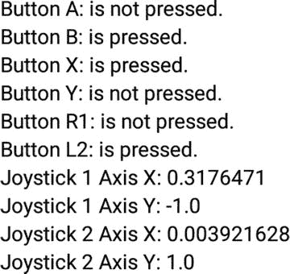

# 五、用于游戏开发的 Android 电视平台

虽然媒体应用构成了 Android TV 应用生态系统的重要组成部分，但游戏占开发者从 Play Store 获得的收入的大约 90%。如果你是一名游戏开发者或爱好者，想要有一个额外的途径从你的作品中获利，那么了解如何让你的游戏工作并为 Android TV 做好准备是至关重要的。令人欣慰的是，由于 Android TV 是一个功能齐全的 Android 操作系统，将您的游戏迁移到新平台并不需要太多时间。本章将重点介绍 Android TV 和一些使用该平台构建游戏的工具，因为开发完整的游戏是一个广泛的话题，超出了本书的范围。这一章也将只讨论 Android 开发，尽管其他流行的游戏引擎也可以在 Android TV 上运行。

## 安卓电视游戏与手机游戏

虽然为 Android TV 开发游戏与为手机和平板电脑开发游戏非常相似，但有几件事你需要知道，这样你的游戏才能按预期运行，并让你的用户感到愉快。首先也是最重要的，你的应用应该在横向模式下工作。虽然手机和平板电脑倾向于在纵向模式下使用，也可能在横向模式下使用，但电视几乎总是会在横向模式下使用。因此，你需要确保你的游戏能按预期运行，并明智地使用屏幕空间。你应该考虑的第二件事是，电视是一个房间里玩家共享的中央屏幕。如果你有一个卡牌或策略游戏，你的玩家必须能够互相隐藏他们的行动。解决这个问题的最好方法之一是通过使用手机和平板电脑创建第二屏幕体验，允许玩家私下执行他们的操作，然后在电视上更新游戏屏幕。

## 清单设置

正如在第二章中所讨论的，Android 电视上有单独的几行用于显示媒体应用和游戏。为了让您的游戏显示在游戏行中，您必须在`AndroidManifest.xml`的应用节点中将您的应用声明为游戏。

`<application`

`android:allowBackup="true"`

`android:icon="@mipmap/ic_launcher"`

`android:label="@string/app_name"`

`android:isGame="true"`

`android:theme="@style/AppTheme">`

如果你的游戏支持 Android TV 游戏手柄的使用，那么你也需要在你的应用中声明这个特性。您可以通过在清单顶部添加一个新的`uses-feature`节点来做到这一点。

`<uses-feature android:name="android.hardware.gamepad"`

`android:required="false" />`

您会注意到这个节点中的`required`字段被设置为 false。如果此字段设置为 true，则您的应用将无法安装在 Android TV 设备上。除了这些非常小的变化，清单的其余部分将完全像标准移动应用一样工作。

## 游戏手柄控制器输入

虽然您的媒体应用使用简化的导航来支持 D-pad，但您的游戏可以支持 gamepad 控制器，以实现更加复杂的交互。有两种主要类型的输入可以来自游戏手柄控制器:数字和模拟。数字输入包括按钮，有按下和未按下两种状态。模拟输入由控制器上的操纵杆或触发器组成，可以提供设定范围内的值。在本节中，您将学习如何从游戏手柄上读取输入，以便在 Android TV 上为您的用户提供更好的游戏体验。

### 设置控制器演示项目

您将通过使用一个新的示例应用来了解 gamepad 控制器，该应用接受来自游戏控制器的输入并在屏幕上显示控件的状态。这个应用的源代码可以在本书的网站上找到( [`www.apress.com/9781484217832`](http://www.apress.com/9781484217832) )。您也可以自己创建这个项目，方法是在 Android Studio 中创建新的空 Android TV 应用并设置`AndroidManifest.xml`，如上一节所述。布局文件，在本例中为`activity_main.xml`，将由多个`TextView`对象组成，这些对象或者提供一个标签，或者被改变以显示它们相关输入的值。虽然下面的示例代码只代表了一项，但是当您看到 Java 代码时，其余的部分应该很容易理解，因此为了节省空间，这里不包括它们。

`...`

`<RelativeLayout`

`android:layout_width="match_parent"`

`android:layout_height="wrap_content">`

`<TextView`

`android:id="@+id/label_a"`

`android:layout_width="wrap_content"`

`android:layout_height="wrap_content"`

`android:text="Button A: "/>`

`<TextView`

`android:id="@+id/button_a"`

`android:layout_toRightOf="@+id/label_a"`

`android:layout_width="wrap_content"`

`android:layout_height="wrap_content"`

`android:text="@string/state_not_pressed"/>`

`</RelativeLayout>`

...

该示例还将使用`strings.xml`中的两个附加值来表示按钮的按下和未按下状态:

`<string name="state_pressed">is pressed.</string>`

`<string name="state_not_pressed">is not pressed.</string>`

接下来你需要修改`MainActivity.java`,使其包含所有可从布局文件中改变的视图的引用，并将它们与正确的视图相关联。

`private TextView mButtonStateA;`

`private TextView mButtonStateB;`

`private TextView mButtonStateX;`

`private TextView mButtonStateY;`

`private TextView mButtonStateR1;`

`private TextView mButtonStateL1;`

`private TextView mJoystickState1AxisX;`

`private TextView mJoystickState1AxisY;`

`private TextView mJoystickState2AxisX;`

`private TextView mJoystickState2AxisY;`

`@Override`

`protected void onCreate(Bundle savedInstanceState) {`

`super.onCreate(savedInstanceState);`

`setContentView(R.layout.activity_main);`

`mButtonStateA = (TextView) findViewById(R.id.button_a);`

`mButtonStateB = (TextView) findViewById(R.id.button_b);`

`mButtonStateX = (TextView) findViewById(R.id.button_x);`

`mButtonStateY = (TextView) findViewById(R.id.button_y);`

`mButtonStateR1 = (TextView) findViewById(R.id.button_r1);`

`mButtonStateL1 = (TextView) findViewById(R.id.button_l1);`

`mJoystickState1AxisX = (TextView)findViewById(R.id.joystick_1_axis_x);`

`mJoystickState1AxisY = (TextView)findViewById(R.id.joystick_1_axis_y);`

`mJoystickState2AxisX = (TextView)findViewById(R.id.joystick_2_axis_x);`

`mJoystickState2AxisY = (TextView)findViewById(R.id.joystick_2_axis_y);`

}

一旦你完成了布局并保存了对关键视图的引用，你应该能够运行你的应用并看到一个类似于图 5-1 的屏幕。应该注意的是，虽然您可以在模拟器上运行这个程序，但是您需要一个实际的游戏手柄和一个 Android TV 设备来测试本节剩余部分的代码。

图 5-1。

Gamepad controller demo layout

### 存储控制器输入

为了简化维护控制器状态的过程，您将为这个名为`GameController.java`的示例项目创建一个新的工具类。每当接收到模拟或数字控件输入事件时，该类将存储数据，并为您的应用提供帮助方法，以确定当前正在使用哪些控件。

一旦创建了`GameController.java`,您将需要创建新的数据项来表示控制器上的按钮和操纵杆，以及帮助这些数据项正确映射到控制器的值。当`GameController`对象被实例化时，您将初始化按钮和操纵杆状态对象，然后为它们提供默认值。

`public static final int BUTTON_A = 0;`

`public static final int BUTTON_B = 1;`

`public static final int BUTTON_X = 2;`

`public static final int BUTTON_Y = 3;`

`public static final int BUTTON_R1 = 4;`

`public static final int BUTTON_R2 = 5;`

`public static final int BUTTON_L1 = 6;`

`public static final int BUTTON_L2 = 7;`

`public static final int BUTTON_COUNT = 8;`

`public static final int AXIS_X = 0;`

`public static final int AXIS_Y = 1;`

`public static final int AXIS_COUNT = 2;`

`public static final int JOYSTICK_1 = 0;`

`public static final int JOYSTICK_2 = 1;`

`public static final int JOYSTICK_COUNT = 2;`

`private final float mJoystickPositions[][];`

`private final boolean mButtonState[];`

`public GameController() {`

`mButtonState = new boolean[BUTTON_COUNT];`

`mJoystickPositions = new float[JOYSTICK_COUNT][AXIS_COUNT];`

`resetState();`

}

`private void resetState() {`

`for (int button = 0; button < BUTTON_COUNT; button++) {`

`mButtonState[button] = false;`

}

`for (int joystick = 0; joystick < JOYSTICK_COUNT; joystick++) {`

`for (int axis = 0; axis < AXIS_COUNT; axis++) {`

`mJoystickPositions[joystick][axis] = 0.0f;`

}

}

}

随着数据项的创建和初始化，您将需要一种方法来更改它们的值。当应用接收到一个`KeyEvent`(用于按钮按压)或`MotionEvent`(用于模拟输入)时，它将被转发到这个工具类。然后，您可以确定使用了什么控件来保存其状态。对于一个按钮，您将确定该按钮当前是否被按住，然后将该信息保存在按钮状态数组中。

`public void handleKeyEvent(KeyEvent keyEvent) {`

`boolean keyIsDown = keyEvent.getAction() == KeyEvent.ACTION_DOWN;`

`if (keyEvent.getKeyCode() == KeyEvent.KEYCODE_BUTTON_A) {`

`mButtonState[BUTTON_A] = keyIsDown;`

`} else if (keyEvent.getKeyCode() == KeyEvent.KEYCODE_BUTTON_B) {`

`mButtonState[BUTTON_B] = keyIsDown;`

`} else if (keyEvent.getKeyCode() == KeyEvent.KEYCODE_BUTTON_X) {`

`mButtonState[BUTTON_X] = keyIsDown;`

`} else if (keyEvent.getKeyCode() == KeyEvent.KEYCODE_BUTTON_Y) {`

`mButtonState[BUTTON_Y] = keyIsDown;`

`} else if (keyEvent.getKeyCode() == KeyEvent.KEYCODE_BUTTON_R1 ) {`

`mButtonState[BUTTON_R1] = keyIsDown;`

`} else if (keyEvent.getKeyCode() == KeyEvent.KEYCODE_BUTTON_R2 ) {`

`mButtonState[BUTTON_R2] = keyIsDown;`

`} else if (keyEvent.getKeyCode() == KeyEvent.KEYCODE_BUTTON_L1 ) {`

`mButtonState[BUTTON_L1] = keyIsDown;`

`} else if (keyEvent.getKeyCode() == KeyEvent.KEYCODE_BUTTON_L2 ) {`

`mButtonState[BUTTON_L2] = keyIsDown;`

}

}

类似地，当移动操纵杆时，您将保存它的 X 和 Y 轴位置。

`public void handleMotionEvent(MotionEvent motionEvent) {`

`mJoystickPositions[JOYSTICK_1][AXIS_X] =`

`motionEvent.getAxisValue( MotionEvent.AXIS_X );`

`mJoystickPositions[JOYSTICK_1][AXIS_Y] =`

`motionEvent.getAxisValue( MotionEvent.AXIS_Y );`

`mJoystickPositions[JOYSTICK_2][AXIS_X] =`

`motionEvent.getAxisValue( MotionEvent.AXIS_Z );`

`mJoystickPositions[JOYSTICK_2][AXIS_Y] =`

`motionEvent.getAxisValue( MotionEvent.AXIS_RZ );`

}

既然您的工具类可以存储游戏手柄控制器的状态信息，您将需要提供一种在您的应用中访问该信息的方法。您可以通过创建两个 getter 方法来实现这一点，这两个方法返回您在控制器上跟踪的任何按钮或操纵杆的状态。

`public float getJoystickPosition(int joystickIndex, int axis) {`

`return mJoystickPositions[joystickIndex][axis];`

}

`public boolean isButtonDown(int buttonId) {`

`return mButtonState[buttonId];`

}

当你的`GameController`工具类完成时，你将需要能够从物理游戏手柄控制器向它提供数据。检索该输入的方式因应用而异。如果您使用视图来侦听控制器事件，那么您将需要覆盖以下方法:

`onGenericMotionEvent( MotionEvent event )`

`onKeyDown( int keyCode, KeyEvent event )`

`onKeyUp( int keyCode, KeyEvent event )`

如果您使用一个活动来接收输入事件，那么您只需要重写两个方法:

`dispatchGenericMotionEvent( MotionEvent event )`

`dispatchKeyEvent( KeyEvent event )`

对于这个示例，您将使用`MainActivity`从游戏手柄控制器中检索事件，因此只需要覆盖上面提到的两个方法。在您开始从控制器接收输入之前，您需要在您的类的顶部创建一个新的`GameController` utility 对象实例。

`private final GameController mController = new GameController();`

要从控制器上的操纵杆或触发器检索模拟输入，您将使用`dispatchGenericMotionEvent`。在这个方法中，您将把`MotionEvent`传递给`mController`，然后您将通过检查操纵杆的位置来更新代表操纵杆值的视图。

`@Override`

`public boolean dispatchGenericMotionEvent(MotionEvent ev) {`

`mController.handleMotionEvent(ev);`

`//R2 and L2 (triggers) are also analog and use this callback`

`mJoystickState1AxisX.setText(String.valueOf(`

`mController.getJoystickPosition(GameController.JOYSTICK_1,`

`GameController.AXIS_X)));`

`mJoystickState1AxisY.setText(String.valueOf(`

`mController.getJoystickPosition(GameController.JOYSTICK_1,`

`GameController.AXIS_Y)));`

`mJoystickState2AxisX.setText(String.valueOf(`

`mController.getJoystickPosition(GameController.JOYSTICK_2,`

`GameController.AXIS_X)));`

`mJoystickState2AxisY.setText(String.valueOf(`

`mController.getJoystickPosition(GameController.JOYSTICK_2,`

`GameController.AXIS_Y)));`

`return true;`

}

无论何时按下或释放一个键，都会调用`dispatchKeyEvent`。在这个方法中，您将把`KeyEvent`传递给`mController`，然后更新适当的`TextView`来反映事件。你会注意到这个例子中 back 键有一个特例。当按钮被按下时，用户对它应该如何操作有一个预期，所以你应该让系统来处理它，而不是创建你自己的响应。

`@Override`

`public boolean dispatchKeyEvent(KeyEvent event) {`

`if( event.getKeyCode() == KeyEvent.KEYCODE_BACK ) {`

`return super.dispatchKeyEvent(event);`

}

`mController.handleKeyEvent(event);`

`updateTextViewForButton( mButtonStateA,`

`mController.isButtonDown( GameController.BUTTON_A ) );`

`updateTextViewForButton( mButtonStateB,`

`mController.isButtonDown( GameController.BUTTON_B ) );`

`updateTextViewForButton( mButtonStateX,`

`mController.isButtonDown( GameController.BUTTON_X ) );`

`updateTextViewForButton( mButtonStateY,`

`mController.isButtonDown( GameController.BUTTON_Y ) );`

`updateTextViewForButton( mButtonStateR1,`

`mController.isButtonDown( GameController.BUTTON_R1 ) );`

`updateTextViewForButton( mButtonStateL1,`

`mController.isButtonDown( GameController.BUTTON_L1 ) );`

`return true;`

}

`private void updateTextViewForButton( TextView textView, boolean pressed ) {`

`if( pressed ) {`

`textView.setText( getString( R.string.state_pressed ) );`

`} else {`

`textView.setText( getString( R.string.state_not_pressed ) );`

}

}

现在你应该能够在一个实际的 Android 电视设备上运行这个示例应用，并看到你的应用如何响应来自游戏手柄控制器的输入，如图 5-2 所示。

图 5-2。

Gamepad control input demonstration

### 控制器最佳实践

在本节的示例应用中，您已经学习了如何使用 Android TV 游戏手柄的一些功能。虽然了解如何使用控制器很重要，但您也应该遵循这些最佳实践，以确保您的用户在使用您的应用时拥有出色的体验。谷歌提供了一些要点来帮助你充分利用你的应用:

*   如果需要控制器，尽快让你的用户知道。这在谷歌 Play 商店的描述中做得最好。如果用户没有意识到他们需要一个控制器，并因此在使用你的应用时遇到困难，他们可能会给你的应用一个糟糕的评级。
*   用户希望某些按钮执行某些操作，比如 A 按钮触发接受操作，B 按钮取消操作。你越接近这些期望，你的用户就会越高兴。
*   验证控制器硬件要求。如果您的应用使用控制器陀螺仪或触发器来执行操作，但用户拥有的控制器缺乏所需的硬件，那么您的应用将不会像预期的那样工作。确保有一个备份计划来支持这些用户。
*   虽然这看起来很明显，但你需要确保你的应用能处理多人游戏的多个控制器。虽然本节的示例应用没有涉及这一点，但是您应该能够检测应用接收到的每个输入事件的设备 id，并做出相应的响应。
*   当游戏控制器由于任何原因在游戏过程中断开连接时，包括蓝牙掉线或控制器没电，您应该暂停游戏并通知用户他们已经断开连接。您还可以提供一个对话框来帮助他们解决问题。
*   如果可能，显示使用控制器的直观说明。谷歌在其文档页面上提供了一个 Android TV 游戏手柄模板，可用于此目的。

Note

在 [`http://developer.android.com/training/tv/games/index.html`](http://developer.android.com/training/tv/games/index.html) 的“构建电视游戏”文章中的“显示控制器说明”下提供了 Android 电视游戏手柄模板的下载链接。

## 使用局域网

正如本章前面提到的，一些游戏需要玩家之间一定程度的保密。促进这一点的最佳方式之一是使用手机或平板电脑作为第二屏幕，允许每个玩家秘密计划他或她的行动。为了帮助创建这种体验，谷歌创建了 Nearby Connections API，允许同一局域网(LAN)上的设备轻松通信。在 Android 电视游戏的环境中，电视将充当中央主机，而每个第二屏幕设备将充当客户端。

### 设置第二个屏幕项目

为了让第二屏幕体验发挥作用，您需要两个应用:一个用于电视，一个用于移动设备。当您为此示例创建项目时，您将为这两种设备类型创建一个模块，如图 5-3 所示。

图 5-3。

Android Studio module creation screen

移动模块可以使用默认设置的空活动选项，当您构建电视模块时，您可以选择不添加活动选项。一旦两个模块都创建好了，你需要为电视模块创建一个新的`MainActivity.java`文件，并将其添加到模块的`AndroidManifest.xml`中，类似于你在第三章中所做的。

当您创建了初始项目，并且可以在移动设备上安装移动模块，在 Android 电视上安装电视模块时，您可以继续下一步。因为附近的连接 API 是 Play Services 的一部分，所以您需要在`dependencies`节点下的每个模块的`build.gradle`文件中包含 Play Services 库。

`compile 'com.google.android.gms:play-services:8.3.0'`

在两个模块的`AndroidManifest.xml`文件中，您需要请求`ACCESS_NETWORK_STATE`和`WAKE_LOCK`权限。

`<uses-permission android:name="android.permission.ACCESS_NETWORK_STATE" />`

`<uses-permission android:name="android.permission.WAKE_LOCK" />`

接下来，您需要在应用节点中声明一段元数据，该元数据将定义服务 ID，附近的连接 API 将使用该服务 ID 通过 LAN 连接设备。

`<meta-data android:name="com.google.android.gms.nearby.connection.SERVICE_ID"`

`android:value="@string/service_id" />`

这里，`service_id`是两个模块的字符串，以便每个应用可以在网络上识别另一个。现在您可以将该字符串添加到`strings.xml`中。

`<string name="service_id">Apress Service Id</string>`

一旦您完成了对`AndroidManifest.xml`和`strings.xml`文件的操作，您就可以为每个模块关闭这两个文件。在`MainActivity.java`内部，你需要为两个模块创建一个新的`GoogleApiClient`并连接到它。首先在您的活动中实现`ConnectionCallbacks`和`OnConnectionFailedListener`接口。

`public class MainActivity extends Activity implements`

`GoogleApiClient.ConnectionCallbacks,`

`GoogleApiClient.OnConnectionFailedListener {`

`@Override`

`public void onConnected(Bundle bundle) {`

}

`@Override`

`public void onConnectionSuspended(int i) {`

}

`@Override`

`public void onConnectionFailed(ConnectionResult connectionResult) {`

}

}

接下来，在类的顶部定义你的`GoogleApiClient`，并在`onCreate`中初始化它。一旦您的`GoogleApiClient`设置好，您就可以在`onStart`中连接到它。在`onStop`中，您还会想要断开与`GoogleApiClient`的连接。

`private GoogleApiClient mGoogleApiClient;`

`@Override`

`protected void onCreate(Bundle savedInstanceState) {`

`super.onCreate(savedInstanceState);`

`mGoogleApiClient = new GoogleApiClient.Builder( this )`

`.addConnectionCallbacks( this )`

`.addOnConnectionFailedListener( this )`

`.addApi( Nearby.CONNECTIONS_API )`

`.build();`

}

`@Override`

`protected void onStart() {`

`super.onStart();`

`mGoogleApiClient.connect();`

}

`@Override`

`protected void onStop() {`

`super.onStop();`

`if( mGoogleApiClient != null && mGoogleApiClient.isConnected() ) {`

`disconnect();`

`mGoogleApiClient.disconnect();`

}

}

在`onStop`中，您会注意到有一个对名为`disconnect`的方法的额外调用。现在，在两个`MainActivity`文件中为该方法创建一个存根。

这两个应用使用的最后一段代码是一个助手方法，用于确定应用是通过无线电缆还是以太网电缆连接到 LAN。首先，您需要定义一个表示两种网络类型的整数数组。

`private static int[] NETWORK_TYPES = {`

`ConnectivityManager.TYPE_WIFI,`

`ConnectivityManager.TYPE_ETHERNET`

`};`

在您创建了`NETWORK_TYPES`之后，您可以添加一个名为`isConnectedToNetwork`的新方法来检查设备是否连接到任何一种网络类型。

`private boolean isConnectedToNetwork() {`

`ConnectivityManager connectivityManager = (ConnectivityManager)`

`getSystemService( Context.CONNECTIVITY_SERVICE );`

`for( int networkType : NETWORK_TYPES ) {`

`NetworkInfo info = connectivityManager.getNetworkInfo(networkType);`

`if( info != null && info.isConnectedOrConnecting() ) {`

`return true;`

}

}

`return false;`

}

此时，您的电视和移动模块应该看起来几乎相同。在下一节中，您将学习如何修改电视模块，使其能够通过局域网进行广告并正确响应连接请求。

### 局域网上的广告

当您为用户创建第二个屏幕体验时，您将使用电视应用作为传入连接的主机。为了让这些传入的连接(称为客户端或对等体)找到主机，它需要在网络上通告其可用性。主机还需要能够响应连接请求并通过局域网发送消息。在电视模块的`MainActivity.java`中，用存根实现`ConnectionRequestListener`和`MessageListener`所需的方法。

`public class MainActivity extends Activity implements`

`GoogleApiClient.ConnectionCallbacks,`

`GoogleApiClient.OnConnectionFailedListener,`

`Connections.ConnectionRequestListener,`

`Connections.MessageListener`

接下来，您需要在类的顶部添加两个新值:一个常量 long 值，用于定义应用应该广告的时间长度；一个 string 对象列表，用于存储连接到主机的每个对等体的 ID。

`private static final long CONNECTION_TIME_OUT = 60000L;`

`private List<String> mRemotePeerEndpoints = new ArrayList<String>();`

接下来你需要开始在网络上做广告。对于这个例子，你将在`GoogleApiClient`完成连接后立即开始广告，尽管在真正的应用中，直到你准备好将客户端连接到主机时才开始广告。

`@Override`

`public void onConnected(Bundle bundle) {`

`advertise();`

}

`advertise`方法将确保设备连接到网络，然后使用附近的连接 API 开始广告。这个 API 提供了一个回调函数，可以让您检查广告的结果，以便您的应用可以根据广告的成功与否做出适当的反应。

`private void advertise() {`

`if( !isConnectedToNetwork() )`

`return;`

`String name = "Nearby Advertising";`

`Nearby.Connections.startAdvertising(mGoogleApiClient, name, null, CONNECTION_TIME_OUT, this).setResultCallback(`

`new ResultCallback<Connections.StartAdvertisingResult>() {`

`@Override`

`public void onResult(Connections.StartAdvertisingResult result) {`

`if (result.getStatus().isSuccess()) {`

`Log.v( "Apress", "Successfully advertising" );`

}

}

`});`

}

现在，您的电视应用能够做广告了，它需要响应来自移动设备的连接请求。在`onConnectionRequest`方法中，您可以根据作为参数传递的信息来决定是否要连接到一个设备。对于这个示例，您只需连接到对您的服务 ID 广告做出响应的任何东西。连接后，您将把远程设备 ID 保存在一个列表中，这样您就可以在整个连接过程中与该设备通信。

`@Override`

`public void onConnectionRequest(final String remoteEndpointId,`

`final String remoteDeviceId,`

`final String remoteEndpointName,`

`byte[] payload) {`

`Nearby.Connections.acceptConnectionRequest( mGoogleApiClient,`

`remoteEndpointId, payload, this ).setResultCallback(`

`new ResultCallback<Status>() {`

`@Override`

`public void onResult(Status status) {`

`if( status.isSuccess() ) {`

`getWindow().addFlags(`

`WindowManager.LayoutParams.FLAG_KEEP_SCREEN_ON);`

`if( !mRemotePeerEndpoints.contains( remoteEndpointId ) ) {`

`mRemotePeerEndpoints.add( remoteEndpointId );`

}

`} else {`

`Log.e( "Apress", "onConnectionRequest failed: " +`

`status.getStatusMessage() );`

}

}

`});`

}

您会注意到，当客户端成功连接后，设备会请求保持屏幕处于唤醒状态。这是因为从客户端接收消息不会被算作输入事件，因此这种方法可以防止电视在用户玩游戏时进入睡眠状态。将客户端连接到主机后，您将能够在设备之间来回接收和发送消息。每当客户端向主机发送消息负载时，就会调用`onMessageReceived`方法。对于这个示例，您只需将有效负载放入 Toast 消息中，然后将其回显给所有客户端。

`@Override`

`public void onMessageReceived(String s, byte[] bytes, boolean b) {`

`Toast.makeText(this, new String(bytes), Toast.LENGTH_SHORT).show();`

`Nearby.Connections.sendReliableMessage( mGoogleApiClient,`

`mRemotePeerEndpoints, bytes );`

}

当活动调用`onStop`时，您需要对宿主应用做的最后一件事是正确地断开连接。为此，您需要扩展您之前创建的`disconnect`存根方法，以便它停止应用的广告并切断所有对等连接。

`private void disconnect() {`

`Nearby.Connections.stopAdvertising(mGoogleApiClient);`

`Nearby.Connections.stopAllEndpoints(mGoogleApiClient);`

`mRemotePeerEndpoints.clear();`

}

如果你现在运行你的应用，你只会看到一个空白的屏幕，因为这个应用只自己做广告，但需要客户端来响应他们的连接请求或消息。

### 通过局域网发现

虽然设置主机应用很好，但您仍然需要创建一个客户端应用，以便能够在第二个屏幕和电视之间进行通信。您可以从打开移动模块中的`MainActivity.java`文件开始，并添加客户端所需的两个附加接口— `MessageListener`和`EndpointDiscoveryListener`。一旦为这两个接口创建了所需的方法，您将需要一些新的成员对象。第一个是一个字符串，它将存储您已经连接到的主机端点的 ID。其他对象是一个处理程序和 runnable，它将定期通过附近的连接 API 向主机设备发送消息。

`private String mRemoteHostEndpoint;`

`private Handler mHandler = new Handler();`

`private Runnable mRunnable = new Runnable() {`

`@Override`

`public void run() {`

`if ( !TextUtils.isEmpty( mRemoteHostEndpoint ) ) {`

`Nearby.Connections.sendReliableMessage(mGoogleApiClient,`

`mRemoteHostEndpoint, "Hello World".getBytes() );`

`mHandler.postDelayed(this, 5000);`

}

}

`};`

虽然这个代码片段使用了`sendReliableMessage`方法，但是您也可以发送不保证能够送达的消息。就像软件开发中的任何事情一样，总有一个权衡。发送不可靠的消息开销较低，而如果可以找到接收者，可靠的消息总是会被传递。

接下来，一旦应用的 Google API 客户端完成连接，您就可以添加对名为`discoverHost`的新方法的调用。

`@Override`

`public void onConnected(Bundle bundle) {`

`discoverHost();`

}

`discoverHost`要做的第一件事是确保移动设备连接到本地网络。验证网络连接后，该方法将使用附近的连接 API 来尝试发现 LAN 上的广告主机。传递给`startDiscovery`方法的第三个参数将告诉 API 只尝试 60 秒的发现。一旦应用开始发现或失败，您将在结果回调中收到一个`Status`对象。

`private void discoverHost() {`

`if( !isConnectedToNetwork() ) {`

`return;`

}

`String serviceId = getString( R.string.service_id );`

`Nearby.Connections.startDiscovery(mGoogleApiClient, serviceId,`

`60000L, this)`

`.setResultCallback( new ResultCallback<Status>() {`

`@Override`

`public void onResult(Status status) {`

`if (status.isSuccess()) {`

`Log.v("Apress", "Started discovering");`

}

}

`});`

}

当发现主机时，附近的连接 API 将调用`onEndpointFound`方法。在这个方法中，您将向主机发送一个带有新回调的连接请求。如果主机接受您的连接请求，将会通知您，以便您可以停止发现。此时，您可以在适合您的应用的时候开始向主机发送消息。为了简单起见，这个示例应用将使用您在本节前面定义的`Handler`和`Runnable`每五秒钟向主机发送一次文本“Hello World”。

`@Override`

`public void onEndpointFound(String endpointId, String deviceId,`

`final String serviceId, String endpointName) {`

`byte[] payload = null;`

`Nearby.Connections.sendConnectionRequest( mGoogleApiClient, deviceId,`

`endpointId, payload,`

`new Connections.ConnectionResponseCallback() {`

`@Override`

`public void onConnectionResponse(String s, Status status,`

`byte[] bytes) {`

`if( status.isSuccess() ) {`

`getWindow().addFlags(`

`WindowManager.LayoutParams.FLAG_KEEP_SCREEN_ON);`

`Nearby.Connections.stopDiscovery(mGoogleApiClient,`

`serviceId);`

`mRemoteHostEndpoint = s;`

`mHandler.post( mRunnable );`

`} else {`

`Log.e( "Apress", "Connection to endpoint failed" );`

}

}

`}, this );`

}

与主机应用一样，您已经在客户端应用中实现了`MessageListener`。当从另一个设备接收到消息时，`onMessageReceived`将被调用。在这个示例应用中，您将获取字节数组有效负载并将其转换为字符串，然后将其显示为 Toast 消息。

`@Override`

`public void onMessageReceived(String s, byte[] bytes, boolean b) {`

`Toast.makeText( this, new String( bytes ), Toast.LENGTH_SHORT ).show();`

}

在客户端应用中，您需要做的最后一件事是处理与主机的断开连接。在您的`onStop`方法中，您应该有一个对`disconnect`的调用。此方法将验证您的设备是否已连接到 LAN，然后停止尝试发现主机设备或断开任何已连接的主机设备。

`private void disconnect() {`

`if( !isConnectedToNetwork() )`

`return;`

`if( TextUtils.isEmpty(mRemoteHostEndpoint) ) {`

`Nearby.Connections.stopDiscovery( mGoogleApiClient,`

`getString( R.string.service_id ) );`

`} else {`

`Nearby.Connections.disconnectFromEndpoint( mGoogleApiClient,`

`mRemoteHostEndpoint );`

`mRemoteHostEndpoint = null;`

}

}

现在您已经创建了主机和客户端应用，您应该将电视模块安装到 Android 电视设备上，将移动模块安装到平板电脑或手机上。如果两台设备都连接到同一个 LAN，它们应该会自动找到并连接到彼此。一旦连接建立，数据将开始在两个设备之间定期发送，并显示在 Toast 消息中，如图 5-4 所示。

图 5-4。

Toast message on the Android TV from a received message payload

在本节中，您已经了解了 Nearby Connections API 以及如何创建主机和客户端应用。这将让您轻松地为您的应用设置第二屏幕体验，以便用户可以使用移动设备来计划他们的行动，并将信息发送到电视。在下一节中，将向您介绍 Google Play 游戏服务中的一些新 API。

## Google Play 游戏服务

您很可能知道，Google 已经在 Google Play 服务库中为 Android 开发提供了一套优秀的 API 和工具。随之而来的是 Google Play 游戏服务，这是一组专注于帮助游戏开发者轻松创建用户喜欢的应用的类。虽然深入研究 Google Play 游戏服务以及如何使用它远远超出了本书的范围，但它本身值得一书，你至少应该知道它提供的一些功能，以便你可以增强你的 Android 电视游戏。

### 成就

成就是 Android 游戏的核心部分，也是奖励玩家享受你的游戏的一种简单方式。他们也可以用来刺激玩家之间的友好竞争，因为他们试图获得比他们的朋友更多的成就。当你在游戏中添加成就时，你有几个不同的选择，因为它们要么可以因为执行一个动作而立即获得奖励，要么迭代地让玩家必须多次完成一个特定的任务。成就也可以被隐藏，使得用户在被赢得之前不知道它们的存在。一个游戏至少需要五项成就才能发布。

### 排行榜

排行榜提供了一个很好的方式来显示玩家与其他玩家相比在游戏中的表现。对于你的铁杆玩家来说，这为他们提供了一个争夺第一的机会，而你的休闲玩家可以和他们的朋友比较他们的表现。如果你的游戏中有不同的地图(比如在一个策略游戏中有不同的地图)，你可以使用多个排行榜，这样玩家就可以看到他们在不同的地图之间的比较。

### 保存的游戏

对于拥有多台设备的游戏玩家来说，最大的麻烦之一是为了完成游戏而被锁定到特定的设备。如果你有一个游戏既可以在电视上运行，也可以在手持设备上运行，你应该实现保存的游戏 API。这将允许您拍摄数据快照并在线保存，以便玩家可以在不同平台之间切换或升级到新设备时保持进度。

### 多光盘播放器

虽然你在本章前面已经学习了附近的连接 API，但是它只支持本地多人游戏。使用 Google Play 游戏服务，您可以支持实时和回合制游戏的在线多人游戏。Google 自动管理连接，提供玩家选择用户界面，并在游戏过程中存储玩家和房间的状态信息。

### 任务和事件

事件可以由游戏中玩家的动作触发，并发送到谷歌的游戏服务器供您分析。这有助于确定游戏的哪些区域太容易或太难，这样你就可以为你的用户调整它们。任务服务使用事件功能，这样你就可以通过限时挑战来吸引玩家。当玩家完成这些挑战，你就可以奖励他们。quest 系统最大的优势之一就是，只要你在从游戏中收集事件，你就可以为你的用户发布新的任务，而不必将你的应用的更新版本推送到 Play Store。

## 摘要

在本章中，你学习了一些可以用来创建游戏或将游戏移植到 Android TV 平台的工具。您了解了控制器以及如何从控制器读取输入，如何通过本地网络提供第二个屏幕体验，以及 Google Play 游戏服务的一些功能，这些功能可以丰富玩家的游戏体验。虽然游戏开发超出了本书的范围，但是您应该非常了解如何让您的游戏与 Android TV 一起工作。