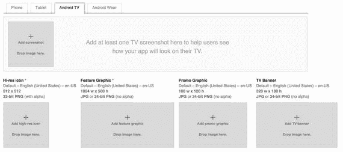

# 六、安卓电视应用发布

在你构建了一个应用之后，你总是想要做一个最后的运行，以确保你的应用如预期的那样工作。对于 Android TV，这一点尤为重要，因为每个 Android TV 应用在谷歌 Play 商店上可用之前都要经过批准。在这一章中，你将了解谷歌在评估你的应用时会寻找的项目，以及一些将你的应用分发给用户的一般提示。

## 安卓电视应用清单

值得注意的是，批准过程不是为了审查，而是为了确保你的应用布局和控制对于 Android TV 用户来说能够正确工作。在您尝试将您的 APK 上传到 Play Store 之前，您应该验证您的应用是否符合 Google 的指导原则。

### `Support the Android TV OS`

为了让用户从 Android TV 主屏幕访问您的应用，您需要确保通过在清单的 activity 节点中声明一个`CATEGORY_LEANBACK_LAUNCHER`过滤器来提供一个 Android TV 进入应用的入口点。如果不可用，那么您的应用将不会出现在主屏幕上的任何一个应用行中。

当您为 Android TV 声明一个活动时，您需要将一个横幅图标与其关联，该图标将显示在应用行中。启动横幅需要 320 像素乘以 180 像素，图像上的任何文本都需要针对您的应用支持的每种语言进行本地化。

如果您将一个应用从严格意义上的移动设备移植到 Android TV，那么您需要确保您的清单没有声明任何 Android TV 平台不支持的必需硬件。这包括摄像头、触摸屏和各种硬件传感器。如果这些项目中的任何一项被声明为必需，您的应用将无法被 Android TV 设备发现。

### `UI Design`

在 Android Backstage 播客的一集中，前 Android TV 团队工程师蒂姆·基尔伯恩(Tim Kilbourn)提到了一款为谷歌电视平台发布的应用，该应用没有验证它是否如预期那样工作。这款应用没有以像样的方式显示，而是被锁定为纵向模式，并在电视上展开。像这样的经历就是为什么 UI 验证是 Android TV 审批流程的重要组成部分。不用说，你应该确保你的应用提供横向布局资源。

因为大多数用户将在平均 10 英尺远的地方体验他们的电视，所以您需要确保所有的文本和控件都足够大以至于可见，并且所有的位图和图标都是高分辨率的。由于电视的一些独特条件，你还需要确保你的布局处理过扫描和你的应用的配色方案工作良好。这些主题在第二章中有更详细的讨论。

如果您的应用使用广告，建议您使用 30 秒内全屏且可忽略的视频广告。值得注意的是，不应该使用依赖于向网页发送意图的广告，因为 Android TV 没有内置的网络浏览器。如果你启动一个网页的意图，如果用户没有安装他们自己的浏览器，你的应用将会崩溃。

您还必须确保您的应用正确响应 D-pad 或游戏控制器，以便您的用户可以浏览您的应用。这由向后倾斜支持库中的类来处理，但是您需要确保您自己的自定义类也相应地做出响应。

### `Searching and Discovery`

虽然拥有一个播放内容的应用是一回事，但是通过帮助用户发现内容或提供推荐，您可以将它提升到一个全新的水平。这些项目在第四章中有详细介绍。简而言之，您应该确保全局搜索和推荐对您的应用有效，并且当用户找到他们感兴趣的内容时，应该直接将他们带到内容。

### `Games`

在上一章中，你已经了解了 Android 电视游戏开发的一些关键点。当您为 Android TV 创建一个游戏时，您需要在清单中将它声明为一个游戏，以便它显示在主屏幕的游戏行中。

如果您支持在应用中使用游戏控制器，您的清单也应该更新。如果你支持使用游戏控制器，你需要确保你的应用有按钮应急使用开始，选择和菜单按钮，因为不是所有的控制都包括这些。你需要提供一个通用的游戏手柄控制器图形来告诉你的用户这些控件会如何影响你的游戏。您需要确保您的应用提供了方便退出应用的控件，以便用户可以返回到主屏幕。

虽然网络对 Android 来说不是一个新概念，但 Android TV 是首批支持以太网连接的设备之一。因此，您需要确保您拥有的任何网络代码都能够验证该设备是通过 WiFi 还是以太网电缆连接到网络。

## 分发您的应用

一旦你完成了你的应用，你检查了你的项目，以确保一切看起来都很棒，你需要让它可供用户下载。这里有两个主要渠道，谷歌 Play 商店和亚马逊应用商店。请注意，在用户可以访问您的应用之前，两家商店都有类似的审批流程，这一点很重要。

### `Google Play Store Distribution`

与大多数涉及安卓电视的事情一样，谷歌的应用发布过程与使用标准手机或平板电脑应用非常相似。您需要创建一个 APK，并用发布认证对其进行签名，然后将其上传到 Google Play 开发人员控制台。但是，当你开始填写商店列表信息时，你需要进入 Android TV 部分，并提供 Play 商店可以使用的素材，如图 6-1 所示。

图 6-1。

Android TV Google Play Store listing assets

除了必须提供素材之外，Play Store 将自动知道您是否正在发布 Android TV 应用，因为在您的清单文件中声明了一个向后倾斜的启动器。

### `Amazon Fire TV Distribution`

从 Fire OS 5 开始，你可以在亚马逊应用商店为 Fire TVs 分发使用 Leanback 支持库和 Lollipop 功能制作的 Android 应用。虽然让您的应用与 Amazon Fire OS 兼容超出了本书的范围，但您可以在 [`developer.amazon.com`](https://developer.amazon.com) 上找到详细的文档，其中介绍了如何安装和设置 Amazon SDK 平台工具，以及如何在您的应用中使用 Amazon 的特定 SDK 和工具。这将允许你在不做太多修改的情况下将你的应用分发给更多的用户。

## 摘要

在这一章中，你回顾了贯穿全书的设计和体验指南。您还了解了为电视用户分发应用的一些方法。这本书讲述了如何从头开始创建一个应用来显示内容，并帮助您的用户享受媒体，以及一些应该可以帮助您为 Android TV 开发游戏的工具。当你继续学习 Android TV 开发时，你应该仔细阅读谷歌的开发者文档，在线观看谷歌开发者视频，并试验你的应用，找出最适合你和你的用户的方法。祝你好运，玩得开心！