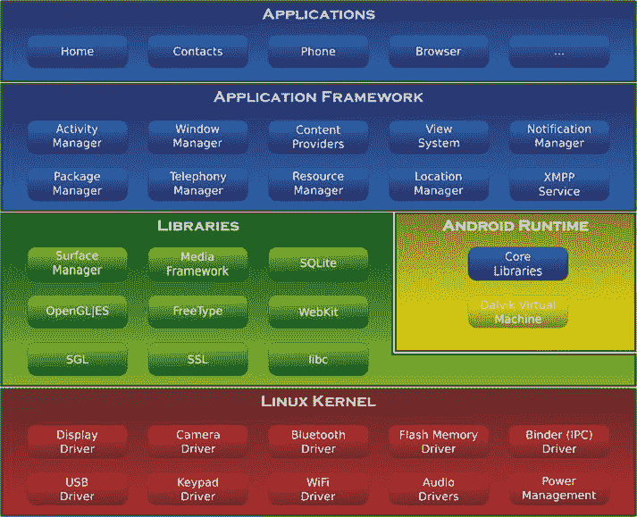

# 一、Android 操作系统的历史和演变

我要毁掉安卓，因为它是偷来的产品。我愿意为此进行热核战争。

—史蒂夫·乔布斯，苹果公司

Android，Inc. 的创始人有着明确的使命。根据 Android 创始人之一安迪·鲁宾的说法，Android Inc. 是为了开发“更智能的移动设备，更了解其所有者的位置和偏好。”鲁宾进一步指出，“如果人们聪明的话，这些信息开始被整合到消费产品中。”那是 2003 年，地点是加州的帕洛阿尔托。这是 Android 诞生的一年。

虽然安卓公司开始秘密运作，但今天全世界都知道了安卓。众所周知，Android 是现代智能手机、平板电脑和即将问世的笔记本电脑的操作系统，但这到底意味着什么呢？Android 以前是什么样子的？它是如何走到今天这一步的？所有这些问题以及更多的问题都将在这简短的一章中得到解答。

起源

2005 年，当价值数十亿美元的技术公司谷歌收购安卓公司时，安卓首次出现在技术雷达上。当时，人们对安卓以及谷歌打算用它做什么知之甚少。直到 2007 年，当谷歌宣布世界上第一个真正的移动设备开放平台时，信息才变得稀少。

Android 第一次发行

2007 年 11 月 5 日，开放手机联盟发布了一份新闻稿，为 Android 平台的未来奠定了基础。该联盟将 Android 的一些目标表述为:“促进移动设备的创新，并为消费者提供比当今移动平台上的大部分产品更好的用户体验。”

当时，全球使用的手机数量超过 20 亿部，而截至 2010 年使用的手机数量为 46 亿部。然而，提供移动设备的各个公司之间没有平台的协调。随着 Android 的引入，单一操作系统消除了重新实现手机应用和中间件的需要。开发新设备的公司现在可以更专注于硬件和底层组件。

但是这些公司并不是唯一从安卓发布中受益的公司；软件开发人员现在可以将应用发布到多种设备上，只需对底层代码做很少的修改。这使得开发人员可以花更多的时间在这些手机运行的应用上，并创建我们都习惯的丰富而令人印象深刻的应用。这部分是由于 Android 背后的开源哲学和 Apache 许可证，这是大多数 Android 源代码使用的许可证。

开源 Apache 许可

Apache 许可证只是开源社区中存在的许多不同许可证之一。尽管所有这些许可证都有所不同，但它们都促进了相同的开源思维，这可以总结如下:

“自由软件”是自由的问题，而不是价格的问题。为了理解这个概念，你应该把“免费”理解为“言论自由”，而不是“免费啤酒”。

理查德·史泰曼

Apache 许可证特别授予出于任何目的使用软件的自由，以及分发、修改或分发修改版本的能力。Apache 许可证也是许可的，这意味着修改后的版本不必屈从于 Apache 许可证。有关 Apache 许可的更多信息，请访问`http://www.apache.org/licenses/LICENSE-2.0`。

安卓是什么？

那么 Android 到底是什么？Android 操作系统是运行在全球超过 4 亿台设备上的开源技术栈。这个技术堆栈由各种组件组成，允许开发人员和设备制造商独立工作。这可以分为五个主要部分——应用、应用框架、本地库、Android 运行时和 Linux 内核——如图图 1-1 所示。

Android OS(维基百科)`http://en.wikipedia.org/wiki/File:Android-System-Architecture.svg`

图 1-1 。Android 系统架构

应用

应用存在于最高层。这些都是每个使用 Android 的人最熟悉的工具。Android 配备了各种支持日常电话需求的强大应用，如消息传递、电子邮件、互联网浏览和各种第三方应用。这些应用主要用 Java 编程语言编写。在最近一次与甲骨文的法律诉讼中，谷歌的安卓主管安迪·鲁宾解释了他为什么选择 Java 作为开发者的使用语言。Rubin 的主要观点是 Java 有一个众所周知的品牌名称，而且全世界几乎所有的大学都教授 Java。

这些应用通过各种方式分发，最常见的是来自谷歌 Play 商店(以前的 Android market place)；然而，Android 操作系统也支持通过 USB 连接和 SD 卡安装应用。

应用框架

Android 为开发人员提供了为用户创建广泛的、交互式的、丰富的图形应用的能力和工具，并且旨在将这些应用部署到谷歌 Play 商店。开发人员可以访问核心应用内部使用的相同 API，也可以访问几乎所有现有的 Java 库。Android 应用的开发流程请参考 **第六章:安装 Android SDK 进行英特尔应用开发。**

本机库

下一层是岔路口。原生库和 Android 运行时存在于大致相同的空间。本机库是 Android 系统所依赖的编译和预装的 C/C++ 二进制文件。这些包括图 1-1 绿色部分的所有库。接下来的章节描述了 Android 中一些比较突出的本地库和它们的功能。

地面管理器

这通常被称为 Android 的窗口管理器。Surface Manager 用于合成任何单个屏幕的外观。它还做一些更微妙的事情来帮助 Android 顺利运行，如屏幕外缓冲和过渡。

SQLite〔??〕〔??〕

这是一个用于在 Android 设备的会话间保存信息的数据库。在 Android 上，SQLite 数据库存储在设备的内部存储器中，因此 SD 卡可以互换，而不会丢失设备特定的信息。

WebKit

WebKit 允许快速有效地将 HTML 渲染并显示到 Android 上。这是 Android 系统中的默认浏览器引擎，可供系统和第三方应用使用。

OpenGL/ES

OpenGL 引擎处理 Android 中的图形。OpenGL 可以在 Android 上渲染 2D 和 3D 对象。这也支持带有专用图形芯片的设备上的硬件加速。

Android 运行时

Android 运行时内部有两个主要组件:Android 提供的核心 Java 库和 Dalvik 虚拟机。Dalvik 虚拟机是 Google 对 Java 的实现，它被优化用于移动设备。Dalvik 内部更具体的差异是非常技术性的，不在本书中讨论。

Linux 内核

最后一层是 Linux 内核。Android 最初基于 Linux 2.6 内核，并针对移动使用进行了一些优化。当前版本的 Android 基于 Linux 3.1 内核。Linux 内核提供了尽可能接近硬件的访问。因此，驱动程序是在内核空间中编写的，以尽可能快速高效地运行。这些包括控制内部无线电、打开立体声和摄像头、处理电源和电池充电，以及操作设备上的物理键盘或按钮。与 Android 一样，Linux 内核也是一个开源项目，并被广泛使用，尤其是在企业环境中的服务器上。

开放手机联盟

2007 年 11 月，开放手机联盟(OHA) 由致力于开发开放移动标准的 34 个创始成员成立，包括谷歌、移动设备制造商、应用开发商、嵌入式系统开发商和商业化公司。网站中描述的该联盟的目标如下:

Open Handset Alliance 是一个由 84 家技术和移动公司组成的团体，旨在加速移动领域的创新，为消费者提供更丰富、更便宜、更好的移动体验。

目前，OHA 有 84 家公司正在开发和从事该联盟迄今为止唯一的主要项目——Android。由于 OHA 成员提供的服务和产品，设备和相关服务以更低的价格生产出更高的质量。

**Android 开源项目**

收购安卓公司后，安卓开源项目(AOSP)成立，并由谷歌领导。AOSP 负责 Android 软件栈的开发和维护。如 Google 所述，该项目的目标如下:

Android 开源项目的目标是创造一个成功的现实产品，改善最终用户的移动体验。

Android 的设计和维护考虑到了向后功能。这意味着新设备可以运行早在 Android 的 Cupcake (1.5)上开发的应用。Android SDK 的官方支持只追溯到 Cupcake (1.5)，所以为 Cupcake 之前的设备编写的应用不能保证在最新的 Android 设备上运行。

在 AOSP 的发展过程中，已经有许多不同版本的 Android 发布在移动设备上。当新的 Android 版本发布时，移动设备所有者可以选择是否升级他们的操作系统。随着 Android 的每一次迭代，新的 SDK 都可供开发人员使用，各种新功能也添加到受支持的设备中。软件开发人员在开发新的应用时，需要注意以前版本的遗留特性。

天文 （1.0）

Astro 是 Android 的起点，于 2007 年 11 月作为测试版发布，并于 2008 年 9 月在 HTC Dream 上向公众发布。Astro 展示了 Android 操作系统的各种核心功能，包括许多 Android 用户现在知道和喜欢的应用。这些应用包括安卓市场、网络浏览器、电子邮件/Gmail、谷歌地图、信息服务、媒体播放器、YouTube 以及其他各种应用。

纸杯蛋糕(1.5)

2009 年 4 月 30 日发布的 Cupcake 是 Android 下一个登陆商业市场的主要版本。Cupcake 基于 Linux 内核 2.6.27，并为用户和开发人员提供了许多新特性。主要的变化是支持虚拟键盘，支持主屏幕上的小部件，在不同地方添加动画，以及支持蓝牙设备的自动配对和立体声。有趣的是，从纸杯蛋糕开始，迄今为止所有的安卓版本都以甜点命名。

甜甜圈(1.6)

2009 年 9 月 15 日，谷歌发布 Android 版本，命名为 Donut。Donut 带来了从 2.6.27 到 2.6.29 的 Linux 内核更新，以及一些新特性和支持的设备。主要功能包括联系人/网页/书签的语音和文本搜索，支持 WVGA 屏幕，以及相机功能和速度的改进。Donut 是 1.x 系列中最后一个发布的 Android 版本。

闪电(2.0/2.1)

clair 于 2009 年 10 月 26 日发布，它继续构建在 Linux 内核版本 2.6.29 上。SDK 2.0 版为开发者和消费者带来了许多新的特性和功能。Android 在有能力的设备上的外观和感觉发生了巨大的变化，包括许多不同应用的速度显著提高。Android 2.0 的首要设备是威瑞森无线的摩托罗拉的 droid。

2009 年 12 月 3 日，谷歌将 Android 更新到 2.0.1 版本，努力修复一些小错误，并为开发者更新 API。直到 2010 年 1 月 12 日，Android 才搬到 2.1 版本。与 12 月的更新类似，2.1 版本主要包括对底层 API 的更新和错误修复。

弗罗约(2.2.x)

2010 年 5 月 20 日，Android SDK 版(Froyo)发布，搭载 Linux 内核 2.6.32。谷歌的 Nexus One 是市场上第一款展示 Froyo 及其新功能的设备。Froyo 增加了非常重要的功能，包括 Adobe Flash 支持、Android 云到设备的消息传递、Wi-Fi 热点功能和显著的性能优化。需要注意的是，Android SDK 建议选择 Froyo 作为您的基础开发版本，以达到 Android 用户的最大当前用户群。

Android 2.2 SDK 随后发布了三个更新:2011 年 1 月 18 日的 2.2.1、1 月 22 日的 2.2.2 和 11 月 21 日的 2.2.3。这些更新主要是对 Android 的错误修复和安全更新。

姜饼(2.3.x)

Gingerbread 于 2010 年 12 月 6 日发布，基于 Linux 内核 2.6.35。与 Froyo 的发布类似，谷歌的 Nexus S 也是为了展示姜饼而推出的。Gingerbread 的功能包括支持 WXGA 和其他超大屏幕尺寸，改进虚拟键盘，支持更多内部传感器(即陀螺仪和气压计)，支持多个和前置摄像头，以及读取近场通信 (NFC)标签的能力。

从 2011 年 2 月到 9 月，Gingerbread 2 . 3 . 3–7 发布了五个更新。这些更新带来了各种功能、安全更新和错误修复。引入的最重要的功能之一是开放附件支持，它允许兼容设备作为兼容软件平台的 USB 外设。

蜂巢(3.x)

2011 年 2 月，摩托罗拉 Xoom 上发布了第一个仅支持平板电脑的 Android 版本 Honeycomb。因为 Honeycomb 是专门为平板设备设计的，所以 Android 被调整以允许更大的屏幕空间带来更愉快的体验。这包括对屏幕键盘的重新设计，允许快速访问通知和导航的系统栏，允许更轻松地使用网络的多个浏览器选项卡，以及对多核处理器的支持。

在当前的生命周期中，Honeycomb 已经更新了六次，其中两次是主要的。第一次更新是 2011 年 5 月 10 日的 Android SDK 版本 3.1，即增加了对 USB 附件的支持，如键盘、操纵杆和其他人机界面设备(hid)。SDK 的第二次重大更新是 2011 年 7 月 15 日的 3.2。3.2 最显著的特点是兼容不是为平板电脑设计的 Android 应用的显示模式。Honeycomb 的最近四次更新是小的改进、错误修复和安全更新。

冰淇淋三明治(4.0.x)

冰淇淋三明治(ICS) 发布于 2011 年 10 月 19 日，基于 Linux 内核 3.0.1。三星的 Galaxy Nexus 是上市时与 ICS 一起发布的设备。ICS 对 Android 用户界面(UI)进行了大量的功能和改进。一些功能包括可定制的启动器、选项卡式网络浏览器、解锁设备的面部识别、内置照片编辑器、UI 的硬件加速以及最初在 3.x (Honeycomb)中引入的软件按钮。值得注意的是，ICS 将 3.x 版(蜂巢)和 2.3.x 版(姜饼)合并为一个支持手机和平板电脑的单一操作系统。

从 2011 年 11 月到 2012 年 3 月，已经发布了四个针对 ICS 设备的小更新。这些更新集中在稳定性改进、相机性能和错误修复上。

糖豆(4.1.x)

果冻豆于 2012 年 7 月 9 日发布，基于 Linux 内核 3.1.10。华硕的 Nexus 7 平板设备是果冻豆的旗舰用户。Jelly Bean 发布了许多对 Android 用户界面和音频的改进和性能升级。2012 年 11 月 13 日发布的基于 Linux 内核 3.4.0 的 4.2 版增加了可访问性改进。4.3 版本于 2013 年 7 月 24 日发布，添加了 OpenGL ES 3.0 支持，以获得更好的游戏图形、安全性增强和升级的数字版权管理 API。Jelly Bean 版本的其他功能包括可定制的键盘布局、可扩展的通知、特定于应用的通知过滤和多声道音频。

KitKat (4.4.x)

撰写本文时，Android 的最新版本 KitKat 发布于 2013 年 9 月 3 日。它的功能包括内存更少的设备的性能优化，扩展的可访问性 API，无线打印能力，以及一个新的实验性运行时虚拟机，称为 ART，它可能会取代 Dalvik。KitKat 于 10 月 31 日在谷歌自己的 Nexus 5 智能手机上首次亮相。2013.

概观

通过所有这些版本的 Android，操作系统的功能和变化带来了丰富的以用户为中心的体验。对该设备的技术方面知之甚少甚至一无所知的普通用户可以像第二天性一样操作该设备。现在，您已经对使这成为可能的底层系统和架构有了更多的了解，剩下唯一要问的是，下一步是什么？