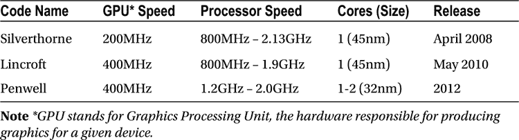

# 五、英特尔移动式处理器

如果通用汽车能像计算机行业一样跟上技术的发展，我们都会开着 25 美元、每加仑能跑 1000 英里的汽车。

—比尔·盖茨

英特尔是最初的微处理器设计者:第一个商业化的微处理器是 1971 年的英特尔 4004。英特尔处理器目前主导着高性能市场，占领了几乎所有的现代高端服务器。英特尔的奔腾系列处理器在 20 世纪 90 年代的个人计算中无处不在，其 Core i 系列是当今笔记本电脑和超极本最受欢迎的中央处理器。此外，英特尔凭借移动专用微处理器产品进入移动市场，与移动领域的市场领导者 ARM Ltd .展开竞争。结合 Android 操作系统的健壮性和灵活性，x86 系列处理器的强大功能和兼容性为移动市场带来了极具竞争力的新设备家族。

英特尔的 x86 产品线

x86 构成了庞大的英特尔处理器家族的基础架构，从最早的英特尔 8086 到奔腾系列、I 系列、最新的配备虚拟化管理程序的服务器处理器、专为移动和嵌入式应用设计的低功耗 Atom 和 Haswell 微处理器 ，以及面向可穿戴计算的微型 Quark 片上系统。最初，8086 架构是为嵌入式系统设计的。但是，英特尔 8086 架构的早期实现非常成功，导致了一长串的修改和升级，增加了功能和丰富的特性。

x86 架构是一个复杂指令集计算(CISC)系统 ，由更复杂的指令构建而成，便于使用和简化实现。英特尔移动处理器的主要竞争对手 ARM 是精简指令集计算(RISC)系统 ，没有这些特性。例如，在 RISC 系统中，将一个给定的值加载到内存中可能需要三到四条指令，而在 CISC 系统中，只有一条专门编写的指令来完成这个任务。x86 架构也是基于寄存器到内存的，这意味着指令可以影响寄存器和内存。

历史

英特尔是世界上历史最悠久的半导体制造公司之一，以在计算机硬件和相关行业开发创新和功能技术而闻名。该公司由鲍勃·诺伊斯和戈登·摩尔于 1968 年创办。风险投资家亚瑟·洛克(Arthur Rock)用 1 万美元的初始投资和后来的 250 万美元的出资巩固了这家公司，从而获得了董事长的职位。

英特尔在 1969 年发布了他们的前两款产品:3101 肖特基双极随机存取存储器，以及 1101，世界上第一款金属氧化物半导体(MOS) 。如前所述，第一款英特尔处理器发布于 1971 年，它被称为 4004。

1978 年，英特尔首次发布了将改变世界的 8086 系列处理器架构。仅仅五年后，英特尔可以正式称自己为十亿美元公司。英特尔是全球最大的半导体公司，根据 2012 年年终报告，其市场份额为 15.7%，收入为 475 亿美元。最初的 x86 体系结构已经拆分、多样化、添加了新的规范，并被重新塑造成更小的外形，继续在世界各地的产品中使用。对英特尔来说，在 x86 平台上整合 Android 只是又向前迈进了一步。

因为 x86 体系结构已经在很多技术中使用，从服务器到个人电脑、移动电话、笔记本电脑和平板电脑，所以汇编其设备的完整列表将非常困难。它的广泛使用导致开发人员创建了专用于 x86 平台的工具、应用、框架和库。

这一切都始于 1978 年的英特尔 8086，最初是作为英特尔 8080 8 位微处理器的实验性 16 位扩展而构建的。8086 是驱动“IBM 个人电脑”及其所有复制品的处理器。x86 一词源自 8086 的后继产品，所有产品都以“86”结尾 1985 年，英特尔继续采用 x86 架构，推出首款 32 位处理器英特尔 80386。直到 2005 年，随着奔腾 4 的发布，x86 64 位处理器才进入市场。

英特尔基于 x86 架构的最新家庭计算处理器系列被戏称为英特尔酷睿 I 系列。该系列支持 64 位操作，专注于性能和速度。所有处理器都支持超线程，并拥有多个内核，支持并发处理。与个人计算核心 I 系列微处理器并行运行的是面向移动设备的基于 x86 的凌动系列。

优势和劣势

作为半导体市场的行业领导者，英特尔处理器拥有独特的优势。首先也是最重要的一点，英特尔处理器拥有其他处理器中最高的性能。该性能包括处理器速度以及内核和虚拟内核的数量。x86 体系结构还允许开发人员访问最大的可用软件集合。最后一个主要优势是使用英特尔 CPU 的高端系统的可扩展性；处理器的增加直接提高了性能。

表 5-1 强调了英特尔凌动处理器家族的一些差异，这些处理器家族采用 x86 指令集。英特尔凌动处理器家族针对每种平台类型包含许多不同的品种，包括平板电脑、智能手机、上网本和其他移动消费电子产品，而表 5-1 代表了每种平台的可比高端型号。

表 5-1 。英特尔凌动处理器家族对比


有些情况下，x86 系列不是微处理器的正确选择。英特尔家族在物理上比其他品牌的 CPU 大得多，在 Core 系列中占据了超过一英寸的空间。直到英特尔凌动系列，英特尔处理器的功耗对嵌入式设备的要求太高；然而，领先的凌动处理器与 ARM 竞争电池寿命。最后，英特尔处理器的成本非常高，而且在有些系统中，4 核 3GHz 处理器是多余的。在这些情况下，可能需要使用 ARM 或其他低性能 CPU。

商业模式

在家庭计算方面，英特尔一直在为笔记本电脑、超极本和台式机平台生产功能强大、高能效的处理器。最接近的竞争对手是半导体公司 Advanced Micro Devices，Inc .在 2006 年，台式机市场曾一度接近被 AMD 和 Intel 瓜分，但现在不再是这样了。截至 2012 年 11 月，英特尔 CPU 的市场份额约为 71%，而 AMD 为 28%。

随着笔记本电脑和平板电脑越来越受欢迎，英特尔发布了凌动系列处理器。凌动处理器平衡了热量和功率，其性能专门针对需要长时间使用电池的产品。Atom 系列可用于超过 1 亿台设备，目前正在扩展到移动市场。

移动巨头的冲突:ARM 对 Intel

ARM 于 1983 年进入微处理器市场，并在某些领域成为强有力的竞争对手。英特尔及其基于 x86 的处理器已经成功占领了大部分桌面和家庭计算市场。另一方面，ARM 是目前移动和嵌入式设备市场的领导者。下一节详细讨论每个公司的处理器的特性，包括它的优点和缺点。

手臂

如果你看看单位销售额，ARM 是目前移动领域的赢家。目前市场上有超过 300 亿台设备，每天售出 1600 万台，ARM 每年的收入超过 9 亿美元。ARM 的历史、业务战略和未来计划都与 ARM 的成功有关。

历史

ARM 的故事始于英国个人电脑公司 Acorn。最初的 Acorn RISC 机器是在 1984 年到 1985 年间开发的。1982 年，在 ARM 之前，英国广播公司(BBC)与 Acorn 签约开发一种家用电脑，后来被称为 BBC 微型计算机。BBC micro 取得了巨大的成功，并使 Acorn 从一个只有几名员工的小公司成长为拥有数百名员工的中型企业。

在 BBC 微型时代结束时，Acorn 开始寻找下一个处理器来推进他们的新个人电脑。Acorn 尝试了各种 16 位和 32 位处理器，包括苹果 IIGS 中使用的 65C816，但没有找到一款具有 Acorn 所需性能的处理器。Acorn 解决这个问题的方法很简单，就是开发一种新的处理器，ARM1。

尽管 ARM1 拥有令人难以置信的能力和性能，但直到第一个真正基于 ARM 的平台 Archimedes 的发布，ARM 1 才得到广泛使用。阿基米德是一台台式电脑，于 1987 年中期发布，主要用于学校和其他教育环境。尽管取得了不太大的成功，并得到了消费者的响应，但 ARM 团队继续努力，开发了 ARMv3，专注于提高性能，以与英特尔和摩托罗拉工作站竞争。

1990 年，Acorn RISC 机器成为高级 RISC 机器，高级 RISC 机器有限公司成立。在创始合作伙伴苹果、Acorn 和 VLSI Technology 的帮助下，该公司成立的唯一目的是继续开发 ARM 处理器。在此基础上，ARMv6 诞生了，并于 2002 年 10 月发布给授权厂商。ARMv6 架构及其最近的亲戚 ARMv7 和 ARMv8 如今广泛用于嵌入式和移动设备。

优势和劣势

ARM 处理器有一些非常吸引人的品质。首先，它们非常小。事实上，最现代的 ARM11 系列处理器还不到 2 毫米 <sup>2</sup> 。由于外形小巧，使用时产生的热量通常很低，足以避免任何类型的散热器或冷却系统。即使很小，ARM 芯片也可以在一片硅片中包含许多核心系统组件。这些组件包括 CPU、GPU 和 DSP。最后一个主要优势是相对于竞争对手而言功耗极低；一些报告声称节省了高达 66%的成本。用电量越少，电池寿命越长，电费就越便宜。

表 5-2 展示了目前在移动市场上使用的一些较为流行的 ARM 处理器。该表只是 ARM 为移动设备提供的众多选项中的一个示例，但是与表 5-1 的比较表明了与英特尔处理器家族的显著差异。可比的 ARM 移动处理器提供的处理器速度要低得多，即使在 A15 的高端也是如此。

表 5-2 。ARM Cortex-A 系列对比


尽管 ARM 芯片有很多优点，但也有很多缺点。首先，ARM 芯片缺乏任何繁重处理情况所需的严肃性能。ARM 处理器本身的可扩展性也较差，尤其是与现代英特尔 CPU 相比。ARM 的软件需要专门为架构创建；幸运的是，ARM 已经有了一些更常用的工具和工具。

商业模式

对 ARM 公司决策的分析有助于揭示他们在处理器市场的关注点。显而易见，人们看重的是 RISC 架构、高性能、低功耗和低价位。这些差异使 ARM 非常适合移动市场，也是 ARM 处理器几乎只用于智能手机的关键原因。

然而，ARM 处理器不是由 ARM 有限公司销售或制造的。相反，处理器架构被授权给相关方。ARM 有限公司提供各种条款和不同的费用。对于所有的被许可方，ARM 提供了深入的文档、完整的软件开发工具集，以及带许可 CPU 的制造芯片的销售权。

这种商业模式为公司带来了好处；在 2013 年第二季度，ARM 报告将 51%的收入归类为版税，39%来自许可。该报告继续详细说明了版税和许可证的数量。每单位版税的平均成本约为 0.07 美元，超过 26 亿单位。另一方面，该季度签署了 25 份新许可证，平均每份许可证价值约 184 万美元。

将来的

ARM 公开发布的最新处理器是 ARM7，有各种修改的实现。ARM7 广泛应用于现代智能手机市场。公司内部有传言称，ARM 将在处理器方面寻求更多发展方向。

随着面向 x86 的 Windows 8 的发布，微软为 ARM 处理器创建了一个名为 Windows RT 的 Windows 版本。Windows RT 几乎完全是从零开始编写的，并且已经设法消除了许多(但不是全部)现代向后兼容 Windows 版本的瓶颈。测试表明，RT 应用的运行速度比竞争对手英特尔芯片上的相同应用快 20%。

专家还预测 ARM 将进入服务器和数据中心市场。在基于 ARM 的 Linux 服务器操作系统的支持下，这越来越成为现实。可以想象，在 ARM 上运行高性能系统意味着更低的功耗。这在高端 ARM 系统的当前性能与高端 Intel 系统的性能之间还有待观察。

英特尔的凌动系列微处理器

凌动处理器是移动设备的特色。典型设备包括小型笔记本电脑、上网本、平板电脑、电视和新型智能手机。Atom 平衡了性能和功耗，使设备的电池续航时间更长。

随着超过 1 亿个 Atom CPUs 的出货，Atom 的影响力显而易见。与所有英特尔处理器一样，凌动是英特尔架构(IA)家族 的一员。IA 系列独特的交叉可移植性允许处理器之间快速轻松的转换。

英特尔凌动进化

英特尔凌动处理器是主要用于笔记本电脑的低功耗处理器英特尔 A100 和 A110 的继任者。A100 和 A110 的代号为 Stealey，最初的尺寸为 90 纳米。表 5-3 和 5-4 强调了 Atom 在平板电脑和智能手机上的一些迭代，从 2008 年 4 月处理器家族的婴儿期到其现代版本。

表 5-3 。英特尔凌动智能手机处理器



表 5-4 。英特尔凌动平板电脑处理器


乍一看，表 5-3 中列出的处理器似乎只是稍微好一点，但是为了真正理解发生了什么，您需要考虑所有的变量。Penwell 是英特尔今天为智能手机生产的处理器的先驱，尺寸仅为 32 纳米，支持多核，具有嵌入式 GPU 支持的顶级操作频率。对于现代设备制造商来说，这显然是英特尔的选择。

与表 5-3 中的现有处理器相比，表 5-4 中列出的平板电脑处理器能力更强。这些平板电脑处理器支持更多内核，具有更快的 GPU 速度，有助于容纳更大且通常高分辨率的显示组件。

英特尔凌动安全技术

在当今时代，随着技术的发展，安全性始终是一个问题。英特尔凌动处理器支持许多安全特性。其中包括安全启动、英特尔平台信任技术、硬件增强加密和操作系统级密钥存储。安全启动是当前统一可扩展固件接口(UEFI)规范的一部分，用英特尔自己的话说就是最好的描述:

启用并完全配置后，安全引导有助于计算机抵御恶意软件的攻击和感染。安全引导通过验证数字签名来检测对引导加载程序、关键操作系统文件和未授权选项 rom 的篡改。检测在攻击或感染系统之前被阻止运行。

英特尔平台信任技术(简称 PTT)是平板电脑上的虚拟智能卡读卡器，允许通过 CPU 进行基于证书的认证。

英特尔凌动特性

英特尔凌动处理器支持其他英特尔处理器中存在的大量特性。能效是英特尔世界的一个新概念，而凌动将这一概念推向了前沿。凌动处理器可以定制，以实现超低功耗与不同性能可扩展性选项之间的正确平衡。在性能方面，凌动支持英特尔超线程和英特尔突发技术，以帮助处理所需的性能和能效。英特尔推出的凌动处理器的最后一个主要特性是移动性概念，支持 NFC、高级相机成像、3G 和 4G LTE。

Android 和 Atom

Atom 处理器是当前 Android 平台首选的 x86 处理器。Atom Android 团队带来了一个装满顶级功能的衣柜。这包括支持多种格式的 1080p 高清 3D 图形、屏幕共享和设备配对、优化的网页渲染和简单的交叉计算能力。Atom Android 平台支持 Android SDK 应用的开箱即用。在大多数情况下，Android NDK 应用只需要重新编译就能得到完全支持。关于兼容性和转换过程的更多信息可以在以下标题为**应用兼容性**的章节和 **第七章:创建和移植基于 NDK 的 Android 应用**中找到。

Medfield 片上系统内部

英特尔的 Medfield 平台旨在用于运行 Android 操作系统的智能手机和平板电脑。一款名为英特尔凌动 Z2610 片上系统(SOC) 的 Medfield 模型将在稍后详细讨论(见图 5-1 )。如前所述，英特尔最近开始生产独立的移动处理器，包括一个代号为 Penwell 的处理器。虽然 Penwell 处理器包含一些与 Medfield SoC 相同的部分，即 Saltwell 系列微处理器架构，但 Penwell 是一款主要针对智能手机的独立处理器，而不是 Medfield 针对智能手机和平板电脑的多部分高性能系统。


图 5-1 。梅菲尔德框图

这个 Medfield 模型，Z2610，在物理上分为两个复合体，北复合体和南复合体。North Complex 包括一个 Saltwell 系列单核处理器、一个 32 位双通道 LPDDR2 内存控制器、一个 3D 图形内核、视频解码和编码引擎、一个能够支持多达三台显示器的 2D 显示控制器，以及一个用于摄像机输入的图像处理器。South Complex 包括完成智能手机设计所需的所有 I/O 接口，如安全引擎、支持 SD/eMMC 存储卡的存储控制器、USB OTG 控制器、3G 调制解调器、免费无线解决方案(CWS)接口、SPI 和 UART。参见图 5-1 。

放大 Saltwell CPU 架构

Saltwell CPU 架构相当简单。该设计的理念是创建一种在优化性能和高效功耗之间取得平衡的处理器。该处理器使用有序架构，这不同于市场上的大多数其他处理器，它们使用无序执行。该处理器有一个 64kb 的 L1 缓存和一个 512k b 的 L2 缓存。该处理器支持英特尔突发性能技术，可让处理器动态提高 CPU 速度。Saltwell 有三种频率模式:低频模式(LFM) 运行在 600MHz，高频模式(HFM) 运行在 900MHz，突发频率模式(BFM) 运行在 1.6GHz。在电源优化特性中，Saltwell 有一个超低功耗智能 L2 高速缓存，在 CPU 处于 C6 状态时保存数据，以降低 C 状态恢复期间的延迟。此外，Saltwell 为内核和 SoC 的其余部分提供了单独的电源层和时钟输入，这使得电源和时钟门控可以通过英特尔智能闲置技术(英特尔 SIT)轻松配置。该技术可使 CPU 在 SoC 仍处于开启状态(S0 状态)时完全关闭。

英特尔的 Saltwell 和 ARM 的 Cortex A15 的架构差异

如书中所列，*脱离英特尔凌动处理器:架构迁移指南，* <sup>1</sup> 英特尔凌动架构与 ARM 架构在各方面都有很大不同。表 5-5 显示了 Saltwell 和 ARM Cortex 架构之间的高级差异列表。

表 5-5 。Saltwell 和 ARM 之间的高级别差异(Cortex A15)

| 

特征

 | 

索尔特韦尔

 | 

手臂皮层

 |
| --- | --- | --- |
| 技术 | 32 纳米 | 28 纳米 |
| 体系结构 | 按顺序 | 无序的 |
| 整数流水线 | Sixteen | Fifteen |
| L1 高速缓存 | 64KB | 可配置高达 64KB |
| L2 高速缓存 | 512KB | 最大 4MB |
| 指令组 | IA32，英特尔流 SIMD 扩展，英特尔补充流 SIMD 扩展 3 | 手臂，拇指 |
| 多核/线程支持 | 采用英特尔超线程技术的单核 | 多核 |
| 安全技术 | 英特尔智能安全技术(英特尔 S&ST) | TrustZone*技术 |

架构

如前所述，Saltwell 的架构与英特尔凌动系列的其他处理器相似。它使用有序执行设计。对于有序处理器，所有指令都按照它们被提取的顺序来执行，而无序处理器能够同时执行多条指令，并且稍后在流水线中对它们进行重新排序。ARM 处理器使用乱序架构，这种架构的优势是以最小的延迟执行指令。然而，这增加了核心设计的复杂性。取消重新排序逻辑是英特尔凌动处理器的节能举措之一。

整数流水线

英特尔凌动管道分为六个阶段:详情列于表 5-6 中。

表 5-6 。英特尔凌动指令阶段和流水线阶段

| 

阶段

 | 

流水线阶段

 |
| --- | --- |
| 取指令 | three |
| 指令解码 | three |
| 指令发布 | three |
| 数据存取 | three |
| 执行 | one |
| 回复 | three |

这种指令架构导致英特尔凌动处理器中共有 16 条整数流水线，并且需要三个额外的阶段来执行浮点指令。最新的 ARM 处理器有 15 个整数流水线。ARM 处理器中漫长的流水线牺牲了能量和性能。Saltwell 每个时钟周期可以解码多达两条指令，而最新的 ARM 处理器是三重超标量体系结构。

指令集

ARM 指令集始终是 32 位的，并在一个 4 字节的边界上对齐，而 IA32 指令集大小不同，不需要任何对齐。ARM 指令和 IA32 指令的另一个区别是指令的执行方式。对于 ARM，所有指令都有条件地执行，以减少分支开销和分支期间的误预测。每个指令都需要满足条件标志才能生效，否则该指令将作为 NOP 并被丢弃。英特尔架构中也有条件指令；这些被称为条件 MOV 指令。IA32 中的其他指令不是有条件执行的。

多核/线程支持

如前所述，Saltwell 支持英特尔超线程技术(英特尔 HT 技术)，通过使用共享资源来完成任务。该技术的细节将在下一节中进一步讨论。ARM 多核架构拥有独特的资源，可在每个内核上执行任务。内核的一致性由 AMBA 4 AXI 处理，这是一个兼容的从接口，直接与内核接口。

安全技术

Medfield 中有一个名为英特尔智能安全技术(英特尔 S&ST)的安全子系统。它是一个完整的硬件和软件安全架构。该子系统符合行业标准，支持 AES、DES、3DES、RSA、ECC、SHA-1/2 和 DRM。它还支持 1，000 位 OTP 并支持 SecureBoot。安全系统在 ARM 处理器中的实现是不同的。英特尔实施的安全子系统没有单独的控制器。ARM 处理器使用 TrustZone 技术，其中系统中的资源(如处理器和内存)被分为两个世界:正常世界(??)和安全世界(??)。这种信任区体系结构有三个动机:

*   提供一个安全框架，允许设计人员根据用例定制所需的功能。
*   在不需要为安全任务配备专用处理器的情况下，节省芯片面积和功耗。
*   通过提供单个调试组件，防止在调试期间对*安全世界*中的安全敏感任务或*正常世界*中的非安全敏感任务的入侵。

英特尔超线程技术

英特尔超线程技术(英特尔 HT 技术)支持软件查看物理处理器封装中的多个逻辑处理器。Saltwell CPU 架构使用英特尔超线程技术来提升其性能。在单个有序架构处理器中拥有第二个线程，可以使 Saltwell 在一个时钟周期内执行多个指令，并在两个线程之间共享执行资源，与单线程处理器相比，性能提高了 50%，如图图 5-2 所示。


图 5-2 。英特尔超线程技术的优势

在英特尔超线程技术中，处理器拥有由通用寄存器、控制寄存器、高级可编程中断控制器(APIC)寄存器和一些机器状态寄存器组成的架构状态副本。架构状态的复制是软件可以将一个内核处理器视为两个逻辑处理器的原因。两个线程共享缓存、执行单元、分支预测器、控制逻辑和总线。这就产生了一个问题，即线程之间可能存在资源争用和工作负载不平衡。然而，大多数当前的开发套件(如 Dalvik 和 JavaScript)已经具备支持多线程环境的能力，为开发人员提供了一种简单的方法来生成利用英特尔超线程技术优势的应用。Android 上的应用开发人员还可以利用英特尔 VTune 性能工具来分析工作负载，并对他们的应用执行资源调整。

应用兼容性:原生开发套件和二进制翻译器

Android 已经移植到 x86，所有进一步的版本都将在 x86 和 ARM 架构中提供。在英特尔凌动平台上运行操作系统不成问题。然而，在某些情况下，现有的 Android 应用可能需要在修改或不修改源代码的情况下重新编译。

据信，谷歌 Play 商店大约 75–80%(通常引用的数字)的 Android 应用运行在 Dalvik VM 之上，并使用 Android 框架(见图 5-3 )。使用 Android 软件开发工具包(SDK)用 Java 语言编写的绝大多数 Dalvik VM 应用都是与处理器无关的。它们在英特尔凌动平台上透明运行，无需移植。对于包含 C 和 C++ 代码的应用子集，开发人员需要使用最新的 Android 原生开发工具包 (NDK)重新编译他们的代码。


图 5-3 。Android 框架

在大多数情况下，NDK 应用开发人员只需重新编译项目，该项目支持 x86 (x86)、ARMv5 (armeabi)和 ARMv7 (armeabi-v7a)。针对 x86 的编译(通过带有编译器标志`-march=i686 –msse3 –mstackrealign –mfpmath=sse`的 GCC)将生成完全符合英特尔凌动 CPU 特性集的代码。只有使用 ARM 供应商特定功能的应用才需要重写源代码，然后重新编译。

所得到的 APK 应用包可以包括用于 x86、ARMv5 和 ARMv7 的三个版本的机器代码。在安装时，只有适当版本的代码被解包并安装到目标平台上。

其余的应用要么是使用为 ARM 构建的 Java 本地接口(JNI)库的 Dalvik VM 应用，要么是未针对 x86 编译的本地开发工具包(NDK)应用。由于调用了本地库(尤其是特定于 ARM 的本地库)，这些应用无法在英特尔凌动平台上运行。

英特尔和谷歌携手合作，确保在英特尔凌动平台上“按原样”执行原生应用，无需进行移植。英特尔提供二进制翻译(BT)，在执行过程中将 ARM 代码动态翻译为 x86 代码，如图 5-4 中的所示。这种转换减轻了尚未移植到 x86 的 JNI 库和 NDK 应用的不便。它允许设备公开自己支持两个应用二进制接口(ABI):x86 和 ARMv5。这可以从`build.prop`观察到，如图图 5-4 所示。

```java
ro.product.cpu.abi=x86
...
ro.product.cpu.abi2=armeabi
```


图 5-4 。二进制翻译

如果 NDK 应用没有为 x86 平台重新构建，二进制翻译器会在本地将 armeabi 版本翻译成 x86。这同样适用于请求基于 ARM 的 JNI 库的 Dalvik VM 应用。翻译流程经过优化，对最终用户完全透明。

所有这些努力的结合应该会导致 Google Play 中大约 90%的应用立即工作。另外 10%的应用可能需要一些额外的配置和设置才能完全正常工作。在 **第七章:创建和移植基于 NDK 的 Android 应用**中，我们将涉及更多关于使用 x86 进行本地代码开发的细节，这将提供一些通用的建议来帮助任何适合这一类别的应用。

概观

本章从公司和处理器的角度简要介绍了英特尔和 ARM 的历史。您了解了英特尔和 Arm 的一些特定处理器，并了解了它们各自带来的优势。在简要介绍了每家公司之后，我们花了一些时间讨论了英特尔凌动处理器以及其现代版本的特性和特点。最后，我们进入了关于英特尔凌动 Medfield 架构的技术讨论，这是最新 x86 手机和平板电脑的特色。我们已经讨论了整数流水线如何流动，采用了哪些安全系统，甚至英特尔超线程技术如何优化性能。我们详细讨论了二进制翻译，并解释了基于 NDK 的应用必须如何准备才能移植到英特尔平台。

<sup>1</sup> 马塔萨、洛里和马克斯·多梅卡、*脱离英特尔凌动处理器:架构迁移指南*。英特尔出版社，2010 年。