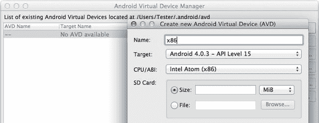
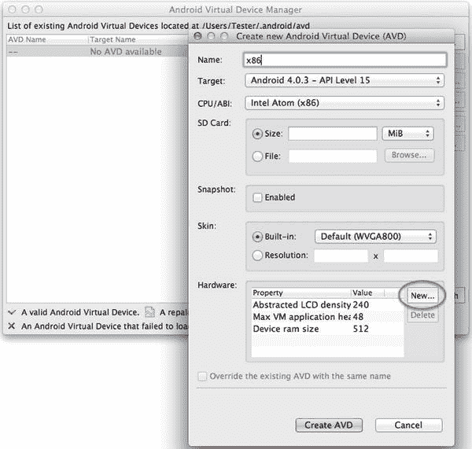

# 六、为英特尔应用开发安装 Android SDK

在一个有英特尔和微软的国家，2000 年问题怎么会成为问题呢？

—阿尔·戈尔

本章涵盖在英特尔架构处理器上开发 Android 应用的必要信息。第一步是安装软件开发套件(SDK ),并为在基于英特尔架构的 Android 设备上运行的应用开发设置合适的环境。SDK 包括工具和平台组件，供开发人员开发、构建、测试、调试和优化他们的 Android 应用，以及管理 Android 平台组件安装。SDK 还提供了与构建和开发环境集成的简单方法，例如与 Eclipse 或 Apache Ant 集成。

准备安装 SDK

下一节将致力于建立一个可用的开发环境，以便您可以开始在英特尔平台上开发 Android 应用。如果您已经有了 Android 开发环境设置，您可以跳过这一部分。

支持的操作系统

支持以下操作系统:

*   Windows XP (32 位)、Vista (32 位或 64 位)、Windows 7 (32 位或 64 位)和 Windows 8 (32 位或 64 位)
*   Mac OS X (32 位或 64 位)
*   Linux (Ubuntu，Fedora)；需要 GNU C 库(`glibc` ) 2.7 或更高版本
*   在 Ubuntu Linux 上，需要 8.04 或更高版本
*   在 Fedora 上，目标版本是 F-12 和更高版本
*   64 位发行版必须能够运行 32 位应用

硬件要求

Android SDK 要求为您选择安装的所有组件提供磁盘存储。运行模拟器需要额外的磁盘空间，例如，为 Android 虚拟设备(avd)创建 SD 卡。

安装 JDK

SDK 至少需要 Java JDK 5 或 JDK 6。JDK 7 也受支持。仅有 JRE (Java 运行时环境)是不够的。如果您的系统没有安装 JDK 5、6 或 7，您可以从`http://www.oracle.com/technetwork/java/javase/downloads/index.html`下载 JDK SE 7 并安装在您的系统上。

安装 Eclipse

强烈推荐使用 Eclipse 的 SDK 来开发 Android 应用。可以去`http://www.eclipse.org/downloads/`下载或者更新 Eclipse。我们建议使用以下 Eclipse 设置来开发面向英特尔架构的 Android 应用:

*   Eclipse 3.5(伽利略)或更高版本
*   Eclipse Classic(版本 3.5.1 和更高版本)
*   Android 开发工具插件(推荐)

安装 Apache Ant(可选)

强烈推荐使用 Eclipse 等集成开发环境开发 Android 应用。但是作为替代，您可以使用 Apache Ant 与 SDK 一起构建 Android 应用。您可以访问`http://ant.apache.org/`下载二进制发行版并安装 Ant。要使用 SDK，需要 Ant 1.8 或更高版本。

下载 SDK 启动包并添加 SDK 组件

您可以在`http://developer.android.com/sdk/index.html`下载 SDK starter 包。SDK starter 包不包含开发 Android 应用所需的特定于平台的组件。它只提供核心 SDK 工具供您下载其余的平台组件。

安装 SDK 启动包后，运行 Android SDK 和 AVD 管理器。

*   在 Windows 上，选择开始所有程序 Android SDK 工具 SDK 管理器
*   在 Linux 上，运行`your-android-sdk-directory/tools/android`

在 Android SDK 和 AVD 管理器对话框的左侧面板中，选择可用的包，在右侧面板中，点击并展开 Android Repository 节点，选择要安装的包，如图图 6-1 所示。


图 6-1 。在 Linux 中安装 Android SDK 和 AVD 管理器

 **注意**如果你试图从防火墙后下载，你可能会看到一条错误信息。如果出现这种情况，请在防火墙外重试。如果您仍然看到错误消息，请关闭 SDK 管理器，然后在开始菜单中右键单击它，并选择以管理员身份运行。这两个步骤将解决您在尝试下载时看到的大多数错误信息。

设置 Eclipse 以使用 SDK

如果您使用 Eclipse IDE 开发软件，我们强烈建议您安装并设置 Android 开发工具(ADT)插件。

为 Eclipse 安装 ADT 插件

要安装 Eclipse 的 ADT 插件，请遵循以下步骤:

1.  启动 Eclipse，在安装对话框中选择 Help 安装新软件，点击 Add 按钮。
2.  In the Add Repository dialog box, enter `ADT Plugin` in the Name field and enter `https://dl-ssl.google.com/android/eclipse/` in the Location fields, as shown in Figure 6-2. Then click OK.

    

    图 6-2 。存储库对话框

3.  It will go back to the Install dialog box, connect to the Google repository server, and display the available ADT packages, as shown in Figure 6-3.

    

    图 6-3 。ADT 软件包列表

4.  选择下一步，接受许可协议，然后选择完成。
5.  重启 Eclipse。

配置 ADT 插件

要配置 ADT 插件，请执行以下步骤:

1.  启动 Eclipse 并选择 Windows 首选项。
2.  在首选项对话框中，从左侧面板中选择 Android。在右侧面板中，使用浏览按钮导航到您的 Android SDK 安装目录，然后单击应用。您已经安装的 SDK 目标列表将会出现，如图 6-4 所示。此时，单击确定。


图 6-4 。ADT SDK 目标列表

完成这些步骤后，您将拥有开始 Android 开发的必要工具。现在，您已经具备了编写第一个应用所需的一切，但最好还是在此时安装英特尔架构(x86)仿真器 ，这样您就可以在应用准备就绪后立即对其进行测试。下一节将带您完成英特尔架构(x86)仿真器的安装。我们讨论用 AOSP 源代码构建一个仿真器映像，并仿真 x86 的最终系统映像。

Android 开发者工具 会定期更新以包含最新的 API。构建仿真器映像时，构建最新 Android 版本的工具唾手可得。如果您选择下载预构建的仿真器系统映像，您的选择将会过时几个月。在本章中，我们使用模拟 Android 2.3(代号为姜饼，涵盖 API 级别 9 和 10)和 Android 4.0(代号为冰激凌三明治，涵盖 API 级别 14 和 15)的案例研究。姜饼是第一个在 ARM 以外的平台上发布的 Android 版本，它的新功能直接来自 Android 开源项目的努力，这在 **第一章:Android OS 的历史和演变**中讨论过。

Android 虚拟设备仿真概述

Android 可以在各种不同屏幕尺寸、硬件功能和特性的设备上运行。典型的设备具有多种软件(Android API)和硬件功能，如传感器、GPS、摄像头、SD 卡和特定尺寸的多点触摸屏。

该仿真器非常灵活，可配置不同的软件和硬件配置选项。开发者可以使用名为 Android 虚拟设备(AVD) 的仿真器配置定制仿真器。AVD 基本上是一组指定不同 Android 软件和设备硬件功能的配置文件。Android 模拟器使用这些 AVD 配置在模拟器上配置和启动适当的 Android 虚拟映像。

正如 Android 网站上记录的那样(参见`http://developer.android.com/guide/developing/devices/index.html`)，典型的 AVD 配置具有:

*   指定所有设备功能(如照相机和传感器)的硬件配置文件。
*   一个*系统映像*，这个 AVD 的模拟器使用它(指定目标 API 级别，比如 10 代表 Gingerbread，19 代表 KitKat)。
*   一个*数据映像*，作为用户数据、设置和 SD 卡的专用存储空间。
*   其他选项包括模拟器皮肤、屏幕尺寸和 SD 卡大小。

开发人员被鼓励针对不同的 API 级别、屏幕尺寸和硬件功能(比如摄像头、传感器和多点触控)。AVD 配置可用于根据需要定制仿真器。开发人员可以根据需要创建任意数量的 avd，每个 avd 都针对不同的基于英特尔架构的 Android 设备。例如，开发人员可以创建基于英特尔架构的姜饼 AVD，内置类似 WVGA800 的皮肤，或者手动指定屏幕分辨率的自定义皮肤。

Android SDK 从版本 r12 开始就支持基于英特尔架构的 Android 仿真。SDK 将这种支持集成到所有开发人员工具中，包括 eclipse ADT 插件。图 6-5 是运行 Gingerbread 的 x86 Android 模拟器的示例截图。突出显示型号，并显示 x86 模拟器上的完整 Android。


图 6-5 。安卓模拟器

关于如何使用模拟器的详细说明，请参考以下 Android 文档:`http://developer.android.com/tools/devices/emulator.html`。

你应该使用哪个模拟器

在撰写本文时，仿真器映像可用于 Android 2.3.7(姜饼)、Android 4.0.4(冰淇淋三明治)和 Android 4.3(果冻豆)的英特尔架构(x86)。您可以在`http://software.intel.com/en-us/articles/android-43-jelly-bean-x86-emulator-system-image`找到最近的图像。

尽管为最新的 Android 操作系统版本开发有许多优势，但许多开发人员更喜欢以 Android 2.x 或 Android 4.x 为目标，因为大多数 Android 手机都运行 Android 4.x 或更高版本。这个百分比会随着时间的推移而变化，因此强烈建议您在确定目标操作系统时牢记市场条件。

要了解更多特定于 Gingerbread 的操作系统信息，下面的文章可能会很有用:`http://blogs.computerworld.com/17479/android_gingerbread_faq`。

冰淇淋三明治资讯，用这篇文章:`http://www.computerworld.com/s/article/9230152/Android_4.0_The_ultimate_guide_plus_cheat_sheet_`。

为什么要使用模拟器

首先，它是免费的。Android SDK 及其第三方插件完全不需要任何成本，并且允许开发人员模拟他们不拥有并且可能无法访问的设备。这一点很重要，因为并非所有手机都通过空中下载(OTA)更新获得最新的 Android 操作系统版本，而且开发者购买每一款预计支持其软件包的设备也不可行。

*   *开发和测试。* 开发者可以使用 SDK 创建几个 Android 虚拟设备(AVD)配置，用于开发和测试目的。每个 AVD 可以有不同的屏幕尺寸、SD 卡大小，甚至是 Android SDK 的版本(这对于测试与以前的 Android 版本的向后兼容性很有用)。
*   玩新版本。该模拟器允许开发人员尽情享受新版本的 Android，并对其有更多的了解。

现在让我们浏览一下在 x86 构建上构建和运行模拟器映像所需的步骤。为了简单起见，这一节重点介绍姜饼模拟器，尽管大部分内容也适用于冰淇淋三明治模拟器。

构建仿真器映像

第一步是遵循这里列出的设置说明:`http://source.android.com/source/initializing.html`。

Google 已经在`http://source.android.com/source/downloading.html`发布了姜饼文档。

目前，默认的回购初始化指令仅用于获取最新的主分支或特定分支，例如使用命令`android-2.3.7_r1`时。没有给出构建 Gingerbread x86 模拟器映像的 repo 和 branch 指令。

使用标签为`gingerbread`的分支下载最新的 Android 源码分支，如清单 6-1 所示。这个分支拥有构建 x86 SDK 模拟器映像所需的构建文件和模块。

***清单 6-1*** 。设置资源库

```java
$ repo init –u
https://android.googlesource.com/platform/manifest-b gingerbread
$ repo sync
```

初始化构建环境，如清单 6-2 所示。

***清单 6-2*** 。构建环境初始化

```java
$ source build/envsetup.sh
including device/htc/passion/vendorsetup.sh
including device/samsung/crespo4g/vendorsetup.sh
including device/samsung/crespo/vendorsetup.sh
```

使用`lunch`命令配置构建 x86 SDK 的版本，如清单 6-3 所示。这将为 x86 构建模拟器映像，以及其他 SDK 模块。

***清单 6-3*** 。午餐命令

```java
$ lunch sdk_x86-eng
=====================================================
PLATFORM_VERSION_CODENAME=REL
PLATFORM_VERSION=2.3.7
TARGET_PRODUCT=sdk_x86
TARGET_BUILD_VARIANT=eng
TARGET_SIMULATOR=false
TARGET_BUILD_TYPE=release
TARGET_BUILD_APPS=
TARGET_ARCH=x86
TARGET_ARCH_VARIANT=x86_atom
HOST_ARCH=x86
HOST_OS=linux
HOST_BUILD_TYPE=release
BUILD_ID=GINGERBREAD
=====================================================
```

最后，发出`make sdk`命令来开始构建，如清单 6-4 中的所示。

***清单 6-4*** 。制作 SDK

```java
$ make sdk
=====================================================
PLATFORM_VERSION_CODENAME=REL
PLATFORM_VERSION=2.3.7
TARGET_PRODUCT=sdk_x86
TARGET_BUILD_VARIANT=eng
TARGET_SIMULATOR=false
TARGET_BUILD_TYPE=release
TARGET_BUILD_APPS=
TARGET_ARCH=x86
TARGET_ARCH_VARIANT=x86_atom
HOST_ARCH=x86
HOST_OS=linux
HOST_BUILD_TYPE=release
BUILD_ID=GINGERBREAD
=====================================================
```

此外，您可以使用`–j`参数为`make`指定并行作业的数量，以加快构建过程。(建议您使用至少大于或等于系统中 CPU 总数的值。)

构建将创建三个映像，包括 QEMU Android 内核`image:t system.img` (Android)、`userdata.img`和`ramdisk.img`。

当构建完成后，图像会在`build`文件夹`$ANDROID_BUILD_TOP/out/target/product/generic_x86/`中，如图图 6-6 所示。

```java
$ ls $ANDROID_BUILD_TOP/out/target/product/generic_x86/ -Altr
```


图 6-6 。图像位置

QEMU ( `kernel-qemu`)的 Android 内核映像来自 Android 源代码。位于预建文件夹(`$ANDROID_BUILD_TOP/prebuilt/android-x86/kernel`)下，如图图 6-7 所示。

```java
$ ls $ANDROID_BUILD_TOP/prebuilt/android-x86/kernel -Altr
```


图 6-7 。内核映像

现在，您已经拥有了在 Android x86 模拟器上运行 x86 Android Gingerbread 映像所需的所有映像文件。您需要用 SDK 设置图像文件，这将在下一节中介绍。

设置 SDK 以使用 x86 模拟器映像

Android SDK 工具(Android 和 AVD 管理器)期望 x86 模拟器映像出现在平台映像的默认 SDK 文件夹中，这是`/platforms/android-10/images`。

下面的图片假设`$ANDROID_SDK_TOP`环境变量被设置为 Android SDK 安装文件夹的位置。

如图 6-8 中的所示，默认情况下，Android-10 自带 ARM 的模拟器图像。为了在 SDK 中设置 x86 模拟器映像，您需要创建一个`x86`文件夹，并将您构建的映像复制到该文件夹中。您也可以将手臂图像移动到它们自己的文件夹中，如清单 6-5 中的所示。

```java
$ cd $ANDROID_SDK_TOP/platforms/android-img/
$ls -l
```


图 6-8 。图像位置

***清单 6-5*** 。手臂折叠器

```java
$ mkdir arm
$ mv *.img kernel-qemu arm/
```

清单 6-6 显示了 x86 文件夹的指令。

***清单 6-6*** 。x86 指令

```java
$ mkdir x86
$ cp $ANDROID_BUILD_TOP/out/target/product/generic_x86/*img x86/
$ cp $ANDROID_BUILD_TOP/prebuilt/android-x86/kernel/kernel-qemu x86/

$ cp NOTICE.txt arm/
$ cp NOTICE.txt x86/
```

Android-10 平台的最终图片文件夹如图图 6-9 所示。

```java
$ ls –l *
```


图 6-9 。最终图像文件夹

在 x86 模拟器上使用 Gingerbread 英特尔架构映像之前，您必须创建一个 AVD 配置，指定所需的软件和硬件定制。有关 AVDs 的更多详细信息，请参阅英特尔软件网络文章“面向英特尔架构的 Android 虚拟设备仿真”(`http://software.intel.com/en-us/articles/android-virtual-device-emulation-for-intel-architecture`)。

此时，您的模拟器和 x86 映像就可以使用了。请注意，如果您将英特尔硬件加速执行管理器(英特尔 HAXM)与此系统映像配合使用，仿真器性能将会显著提高，否则性能可能会有所不同。(英特尔 HAXM 需要支持英特尔 VT-x 的英特尔处理器。有关英特尔 HAXM 的更多信息，请参见 **第十一章:使用英特尔硬件加速执行管理器在 x86 仿真上加速 Android**。

现在是时候使用 Gingerbread x86 模拟器来模拟 x86 映像了。

打开 Android 工具或者直接从 Eclipse 中调出 AVD 创建工具。

图 6-10 和 6-11 显示了使用英特尔凌动(x86) CPU 为姜饼创建 AVD。


图 6-10 。新的 AVD 创作


图 6-11 。成功对话框

通过选择 AVD 并点击开始来测试 x86 姜饼 AVD，如图 6-12 所示。


图 6-12 。发射选项

图 6-13 显示了模拟器 x86 上的英特尔凌动(x86)姜饼的主屏幕。


图 6-13 。主屏幕

建议您使用支持英特尔 VT 硬件加速的 x86 仿真器。在 Linux 上，您可以使用 Linux KVM 来完成这项工作。Ubuntu 在`https://help.ubuntu.com/community/KVM`有更多关于如何配置和使用它的文档。

***清单 6-7*** 。KVM

```java
$ emulator-x86 –avd gbx86 –qemu –m 512 –enable-kvm
```

使用 KVM，如清单 6-7 ( `-enable-kvm`)所示，用户可能会注意到 Android 启动期间的性能提升，以及更快的仿真器响应速度。

姜饼的主要特点

下一节重点介绍 Gingerbread 支持的一些关键特性。这些功能在最新版本的 Android 中也得到支持，并计划继续提供支持。

电池使用统计

在关于手机中，如图图 6-14 所示，有一个电池使用部分。电池状态会因仿真设备和版本而异。在开发者可以`telnet`进入仿真设备的情况下，一些简单的命令可以用来模拟电池消耗。在`http://android-er.blogspot.com/2010/09/how-to-set-battery-status-of-android.html`看一个这样的例子。


图 6-14 。关于电话视图

任务管理器

从设置应用运行服务中，选择运行选项卡。它显示了当前正在运行的程序，如你在图 6-15 中所见。


图 6-15 。任务管理器的运行选项卡

例如，开发者可以通过点击项目并选择停止来关闭设置过程。

剪切和粘贴文本

打开“信息”应用并选取“新信息”可让您像发送短信一样键入信息。通过在文本字段中点击并在主机键盘上键入，字符会无缝地出现在 Android 屏幕上。输入`Hello 2.3.5!`后，屏幕看起来像图 6-16 。


图 6-16 。信息传递乐趣

如果您将鼠标拖动到找到`Hello 2.3.5!`的文本字段，然后按住鼠标按钮(或触摸板按钮)大约两秒钟，会出现一个工具提示菜单来编辑文本。如果选择全选，然后重复鼠标操作，可以剪切文本。剪切文本后，可以再次重复鼠标操作，将文本粘贴到其他地方。

冰淇淋三明治模拟

x86 Android 4.0.4 模拟器系统映像使您能够在开发机器上运行 Android 冰激凌三明治的模拟。结合 Android SDK，您可以在基于英特尔架构(x86)的虚拟 Android 设备上测试您的 Android 应用。

为了安装仿真器系统映像，您可以使用 Android SDK 管理器(推荐方法)，或者您可以下载二进制 ZIP 文件并将包含的目录解压缩并复制到您的 Android SDK 安装的`add-ons`目录中。(请注意，此方法不允许自动更新附加组件。)

以下部分提供了 ICS 映像安装指南。

先决条件

Android x86 模拟器映像需要安装 Android SDK。有关安装和配置 Android SDK 的说明，请参考 Android 开发者网站(参见`http://developer.android.com/sdk/`)。

 **注意**可以使用英特尔硬件加速执行管理器(英特尔 HAXM)对面向 Android 的 x86 仿真器映像进行加速。有关更多信息，请参见 **第十一章:使用英特尔硬件加速执行管理器在 x86 仿真上加速 Android**。

通过 Android SDK 管理器下载

1.  启动 Android SDK 管理器。
2.  Under Android 4.0.4 (some screenshots may refer to older versions), select Intel x86 Atom System Image, as shown in Figure 6-17.

    

    图 6-17 。英特尔 x86 凌动系统映像

3.  选中后，单击“安装软件包”按钮。
4.  查看英特尔公司许可协议。如果您接受这些条款，请选择接受并单击安装。
5.  SDK 管理器将下载系统映像并提取到 Android SDK 目录中的适当位置。

使用系统图像

1.  Start the Android AVD Manager and create a new AVD, setting Target to Android 4.0.X, and CPU/ABI to Intel Atom (x86), as shown in Figure 6-18.

    

    图 6-18 。设定目标

     **注意**如果英特尔凌动(x86) CPU/ABI 选项不可用，请确保系统映像安装正确。

2.  单击创建 AVD 按钮。
3.  The AVD has been successfully created and is now ready to use, as shown in Figure 6-19.

    

    图 6-19 。图像就绪

手动下载

1.  转到`http://www.intel.com/software/android`。
2.  下载英特尔 x86 凌动系统映像(位于工具和下载选项卡下)。
3.  Navigate to the directory containing the Android SDK, as shown in Figure 6-20.

    

    图 6-20 。Android SDK 目录

4.  The `system-images` directory contains Android’s system images, separated by architecture, as shown in Figure 6-21.

    

    图 6-21 。分离的图像

5.  Expand `android-15` (this directory contains API level 15 system images), as shown in Figure 6-22.

    

    图 6-22 。API 级

6.  将下载的系统镜像档案中包含的`x86`目录直接解压到`android-15`目录中。
7.  The directory structure should now look like Figure 6-23.

    

    图 6-23 。预期的目录结构

8.  系统映像现在已经安装好，可以使用了。

CPU 加速

借助基于硬件的虚拟化和英特尔 VT-x 技术，您可以提高面向 Android 冰激凌三明治的英特尔凌动 x86 映像的性能。如果您的计算机配备了支持 VT-x 的英特尔处理器，建议您将英特尔 HAXM 用于此系统映像。有关英特尔 HAXM 的更多信息，请访问`http://int-software.intel.com/en-us/android`。

 **注意**英特尔 HAXM 仅适用于 Windows 和 OS X 操作系统。对于 Linux 主机，您可以使用基于内核的虚拟机(KVM)来提高仿真性能。有关在 Ubuntu 上安装和配置 KVM 的信息，请参考下面的指南`https://help.ubuntu.com/community/KVM/Installation`。

GPU 加速

面向 Android 冰激凌三明治的英特尔凌动 x86 映像可以利用硬件 GPU 特性来提高游戏、图形密集型程序和用户界面元素的性能。

 **注意**GPU 加速的功能和性能高度依赖于您计算机的显卡和图形驱动程序。

要使用硬件 GPU 加速，请执行以下步骤:

1.  打开 Android AVD 管理器。
2.  选择 AVD 并单击编辑。
3.  The AVD editor window will appear. In the Hardware section, click New, as shown in Figure 6-24.

    

    图 6-24 。硬件部分

4.  In the Property drop-down box, select GPU Emulation, as shown in Figure 6-25.

    

    图 6-25 。GPU 仿真选项

5.  单击确定。
6.  After the GPU Emulation property has been added, change the Value to Yes, as shown in Figure 6-26.

    

    图 6-26 。值已更改为是

7.  单击编辑 AVD 保存 AVD。
8.  After the AVD has been modified, a dialog box will appear confirming the AVD settings, shown in Figure 6-27.

    

    图 6-27 。确认对话框

在确认对话框中，`hw.gpu.enabled=yes`行表示为该特定 AVD 启用了 GPU 加速。

 **注意**必须基于每个 AVD 启用 GPU 加速。

概观

在这一章中，你建立了一个全功能的 Android 开发环境。您还安装了 Android 和 SDK 的先决条件。本章详细讨论了 Android 模拟器，您创建了一个 x86 模拟器以便于测试。您甚至在虚拟 x86 平台上创建了一个全功能的 Android 4.0.4(冰激凌三明治)模拟器，用于测试 Android 的最新特性。在下一章中，您将学习如何安装和使用 Android 原生开发套件，以便为英特尔平台创建和移植应用。