# 八、调试 Android

并非所有的问题都有技术上的答案，但当它们有了，那才是更持久的解决方案。

—安迪·格罗夫，半导体制造先驱

在以 Android 操作系统为目标的应用或 Android 系统软件堆栈中，识别运行时问题和可能有问题的代码的过程非常相似。无论底层平台架构是基于英特尔架构和最新一代凌动处理器，还是基于 ARM 架构，挑战和方法都是相同的。本章概述了英特尔架构上针对 Android 的软件的可用调试方法。在本章的前一部分，我们还将涉及针对 Android 和英特尔架构的应用和系统软件调试环境的设置和配置。在这样做的过程中，我们还将指出在为 ARM 架构开发时体验的不同之处。

先决条件

本章介绍了在运行 Android 操作系统的基于英特尔凌动处理器的设备上启用远程应用调试所必需的英特尔 USB 驱动程序。此外，我们还将了解面向 Android 仿真器的英特尔凌动 x86 系统映像。如果没有物理调试目标可用，那么在 Android SDK 的设备仿真层中仿真一个基于英特尔凌动处理器的虚拟设备是下一个最佳选择。这两个先决条件与 Android SDK 一起为基于英特尔凌动处理器的平板电脑或智能手机的交叉开发奠定了基础。

用于 Android 设备的英特尔 USB 驱动程序

本节介绍英特尔 Android USB 驱动程序包，它使您能够将主机开发机器连接到内置英特尔凌动处理器的 Android 设备。在第一个例子中，我们假设一个 Windows 开发主机。类似的原则也适用于 Linux 或 OS X 主机系统。

1.  从`http://www.intel.com/software/android`下载安装包。
2.  运行安装程序并接受 Windows 用户帐户控制(UAC)提示(如果适用)。
3.  You will see the screen in Figure 8-1. Click Next to continue. (If the installer detects an older version of the driver, accept to uninstall it.)

    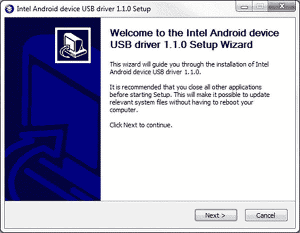

    图 8-1 。USB 设备驱动安装开始屏幕

4.  阅读并同意英特尔 Android USB 驱动程序最终用户许可协议(EULA)。
5.  系统将提示您选择组件。单击“下一步”按钮继续。
6.  选择安装路径，然后单击安装。
7.  The installer will proceed to install the Android USB drivers. This may take a few minutes (see Figure 8-2).

    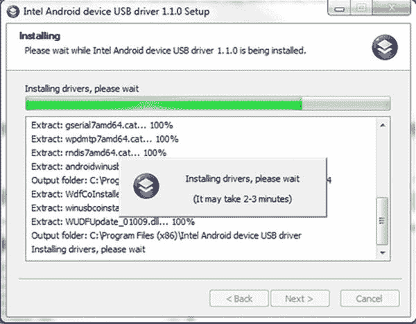

    图 8-2 。USB 设备驱动程序安装进度屏幕

8.  驱动程序安装完成后，单击弹出提示上的确定，然后单击完成关闭安装程序。

为 Android 仿真器安装英特尔凌动 x86 系统映像

对于使用 Android 虚拟设备管理器在开发主机上进行调试的替代方案，第一个先决条件是适当的系统映像的可用性。

使用 Android 模拟器需要安装英特尔凌动 x86 系统映像和 Android SDK。有关 Android SDK 的安装说明，请参考 Android 开发者网站(`http://developer.android.com/sdk/installing.html`)，或者参考 **第六章:为英特尔应用开发安装 Android SDK**。Android SDK 管理器允许您下载并安装英特尔凌动 Android x86 仿真器映像插件，然后安装必要的英特尔凌动 x86 系统映像。

请遵循以下步骤:

1.  启动 Android SDK 管理器程序。
2.  在软件包 Android 4.x.x (API 1x)下，选中复选框以选择英特尔公司的英特尔凌动 x86 系统映像。
3.  Once selected, click the Install Package button, as shown in Figure 8-3.

    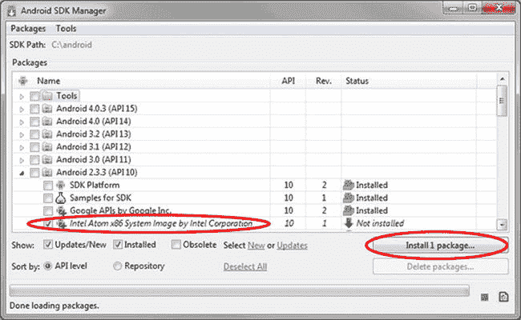

    图 8-3 。x86 系统映像的 Android SDK 管理器选择

     **注意**根据您或 Android SDK 管理程序选择的其他包，您可能需要安装多个包。

4.  Review the Intel Corporation license agreement. If you accept the terms, select the Accept option and click the Install button, as shown in Figure 8-4.

    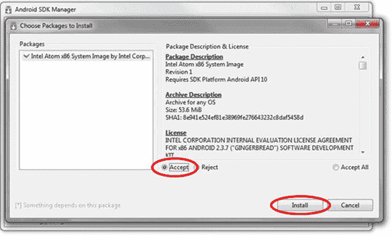

    图 8-4 。Android SDK 管理器—接受许可条款

5.  此时，Android SDK 管理器将下载并安装附加组件到您的 Android SDK 附加组件文件夹(`<sdk>/add-ons/`)。根据您的连接速度，下载和安装将需要几分钟时间。
6.  Select Manage AVDs from the Tools menu (see Figure 8-5).

    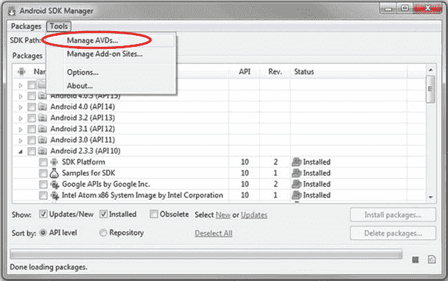

    图 8-5 。Android SDK 管理器—管理 Android 虚拟设备

7.  The Android Virtual Device Manager window should appear. Click New (see Figure 8-6).

    

    图 8-6 。添加新的 Android 虚拟设备

8.  在名称字段中输入虚拟设备的名称。名称中不允许有空格。
9.  Select Intel Atom x86 System Image (Intel Corporation) – API Level 10 from the Target field drop-down list (see Figure 8-7).

    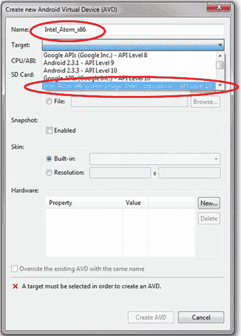

    图 8-7 。作为虚拟设备目标的英特尔凌动 x86 系统映像

10.  选择配置设置后，单击创建 AVD 按钮。
11.  The new virtual device should appear on the Android Virtual Device Manager. Select the new device and click the Start button, as shown in Figure 8-8.

    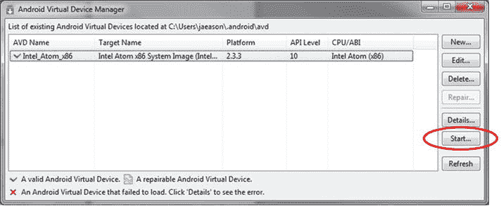

    图 8-8 。启动 Android 虚拟设备

12.  The Launch Options window should appear. Select the screen size and DPI for your system. Otherwise, the emulator might exceed the dimensions of your viewing screen. Click the Launch button (see Figure 8-9).

    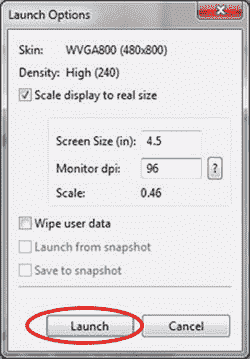

    图 8-9 。虚拟设备启动选项

13.  After a few moments, the emulator will launch and show you the screen in Figure 8-10.

    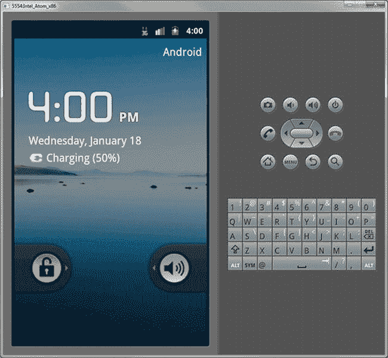

    图 8-10 。基于英特尔架构的 Android 设备的 AVD 仿真

使用 Android 调试桥进行应用调试

Android Debug Bridge(ADB)是一个命令行工具，处理主机上的调试器(通常是 DDMS GDB(dal vik Debug Monitor Server)或 ADT)与目标上运行的 Android 映像之间的调试通信。目标映像可以在设备仿真或物理开发设备上运行，您可以通过 USB OTG(移动)或 USB 转以太网加密狗与之通信。简而言之，ADB 是使 Android 上的应用调试成为可能的粘合剂。

您要连接或仿真的设备可能涵盖多种外形规格。通常是智能手机或平板电脑。它也可以是医疗平板电脑或工业环境中的嵌入式设备、家庭能源管理、仓储或任何智能系统应用。

设置 Android 调试桥以允许基于英特尔凌动处理器的平台的远程调试与其他架构上的调试没有太大区别。

建立亚洲开发银行

首先你需要 Android SDK，包括安装在开发主机上的 ADB。这方面的说明可在`http://developer.android.com/sdk/installing.html`找到。

如果您的目标映像在物理设备上运行，您需要包括 USB OTG 或 USB 转以太网支持。对于 USB 到以太网的支持，需要更改和重建内核配置。如果需要，您的 OEM 将为您提供必要的信息。

远程应用调试的标准方法是使用大多数 Android 设备现有的 USB-OTG 接口。Android 开发者网站`http://developer.android.com/guide/developing/device.html`详细描述了设置。

关键步骤是:

1.  在您的 Android 清单中将您的应用声明为“可调试的”。
2.  在设备上打开 USB 调试。
3.  在设备上，进入设置应用开发并启用 USB 调试(在 Android 4.x.x 设备上，该设置位于设置开发者选项中)。
4.  设置您的系统以检测您的设备。

如果你在 Windows 上开发，你需要为 ADB 安装一个 USB 驱动——访问`http://developer.android.com/tools/extras/oem-usb.html`获取驱动下载和先决条件。

如果您在 Ubuntu Linux 上开发，您需要添加一个`udev rules`文件，其中包含您想要用于开发的每种设备的 USB 配置。在`rules`文件中，每个设备制造商由一个唯一的供应商 ID 标识，由`ATTR{idVendor}`属性指定。有关供应商 id 的列表，请参见`http://developer.android.com/tools/device.html#VendorIds`。

要在 Ubuntu Linux 上设置设备检测，以`root`的身份登录并创建这个文件:

```java
/etc/udev/rules.d/51-android.rules
```

使用此格式将每个供应商添加到文件中:

```java
SUBSYSTEM=="usb", ATTR{idVendor}=="????", MODE="0666", GROUP="plugdev"
```

`MODE`分配指定读/写权限，而`GROUP`定义哪个 UNIX 组拥有设备节点。

执行:

```java
chmod a+r /etc/udev/rules.d/51-android.rules
```

当通过 USB 插入时，您可以通过从 SDK 平台-工具/目录执行 ADB 设备来验证您的设备是否已连接。如果已连接，您会看到设备名称以`device`的形式列出。

在 SDK 上引导 Android 操作系统后，将 USB OTG 电缆连接到 SDK 上的(USB mini b)端口，并将电缆的另一端(USB A)连接到您的开发主机。

如果一切正常，您应该能够运行以下命令来查看连接的设备:

```java
$ adb devices
* daemon not running. starting it now *
* daemon started successfully *
List of devices attached
0123456789ABCDEF  device
```

 **注意**要查看在 Linux `dev.`主机上哪个设备名称被分配给这个连接，您可以查看`dmesg`来找到`usb-storage: device found at <num>`的地址，然后运行`ls -l /dev/bus/usb/*`清单来找到那个号码。

Windows 上的 ADB

从`http://www.eclipse.org/downloads/`下载并安装 Eclipse Classic。

从`http://developer.android.com/sdk/index.html` ( `android-sdk_r18-windows.zip`或`installer_r18-windows.exe`)下载 Windows 的 Android SDK 包。

安装 Android SDK 后，`adb.exe`将位于`<install-dir>\android-sdk\platform-tools`。

亚行主机-客户端通信

到目前为止，我们专注于在开发主机上安装 ADB。实际上，它是一个客户机-服务器程序，包括三个组件:

*   在您的开发机器上运行的客户端。您可以通过发出 ADB 命令从 shell 调用客户机。其他 Android 工具，如 ADT 插件和 DDMS，也可以创建 ADB 客户端。
*   在开发机器上作为后台进程运行的服务器。服务器管理客户端和运行在仿真器或设备上的 ADB 守护程序之间的通信。
*   在每个模拟器或设备实例上作为后台进程运行的守护程序。

当您启动 ADB 客户端时，客户端首先检查是否有 ADB 服务器进程正在运行。如果没有，它将启动服务器进程。当服务器启动时，它绑定到本地 TCP 端口 5037 并监听从 ADB 客户端发送的命令，所有 ADB 客户端都使用端口 5037 与 ADB 服务器通信。

然后，服务器建立到所有正在运行的仿真器/设备实例的连接。它通过扫描 5555 到 5585 范围内的奇数端口来定位仿真器/设备实例，这是仿真器/设备使用的范围。当服务器找到一个 ADB 守护进程时，它会建立一个到该端口的连接。请注意，每个仿真器/设备实例都需要一对顺序端口，一个偶数端口用于控制台连接，一个奇数端口用于 ADB 连接。例如:

```java
 Emulator 1, console: 5554
 Emulator 1, adb: 5555
 Emulator 2, console: 5556
 Emulator 2, adb: 5557 …
```

如图所示，在端口 5555 上连接到 ADB 的模拟器实例与其控制台在端口 5554 上侦听的实例是相同的。

一旦服务器建立了到所有模拟器实例的连接，您就可以使用 ADB 命令来控制和访问这些实例。因为服务器管理到仿真器/设备实例的连接并处理来自多个 ADB 客户端的命令，所以您可以从任何客户端(或从脚本)控制任何仿真器/设备实例。

开始亚行

类型`adb shell`。您将看到一个 **#** 符号，表示连接成功。

```java
$ adb shell
#
```

主要 ADB 设备命令

在表 8-1 中列出的命令有助于将被调试应用从命令行转移到目标设备或仿真上。这非常有用，尤其是在没有 ssh 终端连接的情况下。

表 8-1 。主要 ADB 设备命令

| 

命令

 | 

描述

 |
| --- | --- |
| `adb push <local> <remote>` | 将`file/dir`复制到设备 |
| `adb pull <remote> [<local>]` | 从设备复制`file/dir` |
| `adb sync [ <directory> ]` | 仅在更改时复制`host->device`(`-l`表示列表但不复制)(参见`adb help all`) |
| `adb shell` | 交互式运行远程 shell |
| `adb shell <command>` | 运行远程 shell 命令 |
| `adb emu <command>` | 运行模拟器控制台命令 |
| `adb logcat [ <filter-spec> ]` | 查看设备日志 |
| `adb forward <local> <remote>` | 正向套接字连接
正向规格为:

*   `tcp:<port>`
*   `localabstract:<unix domain socket name>`
*   `localreserved:<unix domain socket name>`
*   `localfilesystem:<unix domain socket name>`
*   `dev:<character device name>`

`jdwp:<process pid> (remote only)` |
| `adb jdwp` | 列出主持 JDWP 传输的进程的 PID |
| `adb install [-l] [-r] [-s] <file>` | 将此包文件推送到设备并安装
( `-l`表示向前锁定应用)
( `-r`表示重新安装应用，保留其数据)
( `-s`表示安装在 SD 卡上，而不是内部存储) |

有关 ADB 设置和使用的更多详细信息，请参见`http://developer.android.com/guide/developing/tools/adb.html`。

使用 Eclipse 的 Android 调试工具插件

对于基于英特尔架构的设备，设置过程与`http://developer.android.com/sdk/eclipse-adt.html#installing`中描述的过程没有显著不同。Android 调试工具 (ADT )插件为基于英特尔架构的仿真器以及目标设备提供完整的 Eclipse IDE 集成应用调试。它提供了两种具有不同特性集的不同调试视角。您可以根据需要在两者之间切换，在调试应用时，它们都提供不同的优势。

Eclipse 中的调试透视图

Eclipse 中的调试透视图，如图 8-11 中的所示，允许您访问以下选项卡:

*   *调试*。显示以前和当前调试的 Android 应用及其当前运行的线程。
*   *变量*。设置断点时，在代码执行期间显示变量值。
*   *断点*。显示应用代码中设置的断点列表。
*   *LogCat* 。允许您实时查看系统日志消息。LogCat 选项卡在 DDMS 视角中也是可用的。

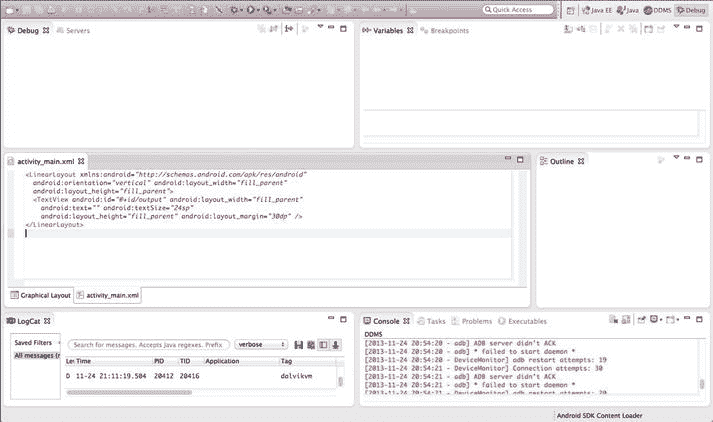

图 8-11 。Eclipse 中的调试透视图

您可以通过单击窗口打开透视图调试来访问调试透视图。有关更多信息，请参考 Eclipse 调试器的相应文档。

DDMS 的视角

Eclipse 中的 DDMS 透视图，如图 8-12 所示，允许您从 Eclipse IDE 中访问 DDMS 的所有特性。DDMS 的以下部分可供您选择:

*   *设备*。显示了连接到 ADB 的设备和 avd 的列表。
*   *仿真器控制*。允许您执行设备功能。
*   *LogCat* 。允许您实时查看系统日志消息。
*   *螺纹*。显示虚拟机中当前运行的线程。
*   *堆*。显示虚拟机的堆使用情况。
*   *分配跟踪器*。显示对象的内存分配。
*   *文件浏览器*。允许您浏览设备的文件系统。

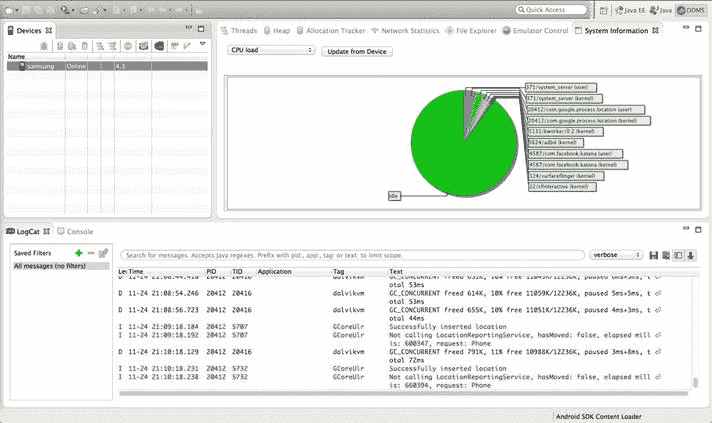

图 8-12 。《月蚀》中的 DDMS 视角

**应用运行时调试环境**

调试以基于英特尔架构的设备为目标的 Android 应用的不同之处在于设置调试目标设备。

使用 Android 虚拟设备管理器(Android SDK 的一部分)选择目标设备，进入 Eclipse IDE 下拉菜单中的窗口 AVD 管理器。您需要确保选择英特尔凌动(x86)作为操作系统映像和设备仿真的 EABI 目标(参见图 8-13 )。

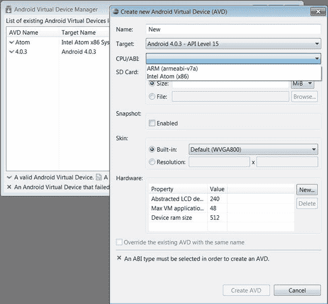

图 8-13 。在 Android 虚拟设备管理器中选择基于英特尔凌动处理器的设备

如果您按照本章开头概述的步骤设置 ADB 并建立到物理设备的调试桥，您将在 Eclipse IDE 中看到一个设备选择器条目，您可以从中选择应用部署和调试的目标。

否则，调试以英特尔架构为目标的 Android 应用与调试以 ARM 架构为目标的 Android 应用没有什么不同。

英特尔硬件加速执行管理器

英特尔硬件加速执行管理器(HAXM 结合英特尔和官方 Android SDK 管理器提供的 Android x86 仿真器映像，英特尔 HAXM 可在支持英特尔 VT 的系统上实现更快的 Android 仿真。有关安装和使用英特尔 HAXM 的更多信息，请参考 **第十一章:使用英特尔硬件加速执行管理器在 x86 仿真** 上加速 Android。

x86 Android 4.0.4(冰激凌三明治)仿真器系统映像使您能够在开发机器上运行 Android 仿真。结合 Android SDK，您可以在基于英特尔架构的虚拟 Android 设备上测试您的 Android 应用，从而充分利用底层的英特尔架构和英特尔虚拟化技术。

为了安装仿真器系统映像，您需要使用 Android SDK 管理器。

英特尔 HAXM 可以通过 Android SDK 管理器安装(参见图 8-14 )。英特尔 HAXM 要求安装 Android SDK(版本 17 或更高)。有关更多信息，请参考 Android 开发者网站(`http://developer.android.com/sdk/`)。

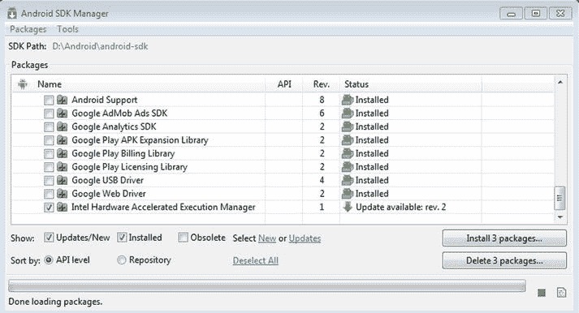

图 8-14 。英特尔硬件加速执行管理器下载

英特尔 HAXM 可用于 Linux、Windows 和 OS X 主机操作系统。作为一个例子，我们概述了在 Ubuntu 64 位操作系统上的安装，因为这是 Google 为 Android 版本验证和支持的主要平台。

下一节包含如何安装 KVM、在 Ubuntu 主机平台上启用 KVM 以及使用英特尔硬件辅助虚拟化(hypervisor)启动英特尔 Android x86 仿真器的快速步骤。当 AVD 利用英特尔 HAXM 时，操作系统的运行速度将比没有虚拟机管理程序时明显更快、更流畅。

KVM 安装

1.  To see if your processor supports hardware virtualization, you can review the output from this command:

    ```java
    $ egrep -c '(vmx|svm)' /proc/cpuinfo
    ```

    如果这个命令返回`0`，你的 CPU 不支持硬件虚拟化。

2.  Next, install CPU checker:

    `$ sudo apt-get install cpu-checker`

3.  Now you can check if your CPU supports KVM:

    `$kvm-ok`

    1.  If you see:

        ```java
        "INFO: Your CPU supports KVM extensions
        INFO: /dev/kvm exists
        KVM acceleration can be used"
        ```

        使用 KVM 扩展，您可以更快地运行虚拟机。

    2.  If you see:

        ```java
        "INFO: KVM is disabled by your BIOS
        HINT: Enter your BIOS setup and enable Virtualization Technology (VT),
        and then hard poweroff/poweron your system
        KVM acceleration can NOT be used"
        ```

        您需要进入 BIOS 设置并启用英特尔 VT。

使用 64 位内核

建议在主机操作系统上运行 64 位内核，但这不是必需的。要为虚拟机提供超过 2GB 的内存，您必须使用 64 位内核。在 32 位内核安装中，对于给定的虚拟机，您最多只能使用 2GB 的 RAM。此外，64 位系统可以承载 32 位和 64 位来宾。32 位系统只能托管 32 位来宾。

1.  To see if your processor is 64-bit, you can run this command:

    ```java
    $ egrep -c ' lm ' /proc/cpuinfo
    ```

    如果打印出`0`，说明你的 CPU 不是 64 位。如果打印的是`1`或更高版本，则为。注意:`lm`代表长模式，相当于 64 位 CPU。

2.  To see whether your running kernel is 64-bit, just issue the following command:

    ```java
    $ uname -m
    ```

    返回值`x86_64`表示正在运行的 64 位内核。如果您看到`i386`、`i486`、`i586`或`i686`，那么您运行的是 32 位内核。

安装 KVM

要安装 KVM，请按照下列步骤操作:

1.  For Ubuntu 12.04 or later:

    ```java
    $ sudo apt-get install qemu-kvm libvirt-bin ubuntu-vm-builder bridge-utils
    ```

    通过选择无配置，您可以忽略图 8-15 中显示的后缀配置请求。

    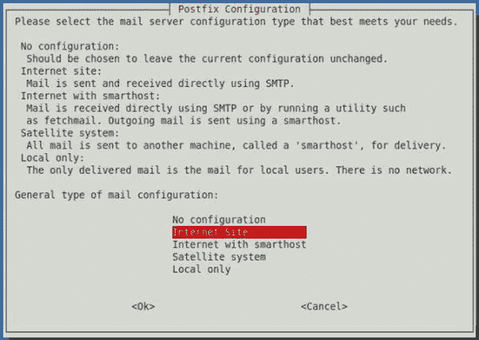

    图 8-15 。KVM 安装后缀配置设置

2.  Next, add your `<username>` account to the group `kvm` and `libvirtd`:

    ```java
    $ sudo adduser your_user_name kvm
    $ sudo adduser your_user_name libvirtd
    ```

    安装完成后，您需要再次登录，以便您的用户帐户成为`kvm`和`libvirtd`用户组的活动成员。该组的成员可以运行虚拟机。

    要验证安装，您可以使用以下命令测试安装是否成功:

    ```java
    $ sudo virsh -c qemu:///system list
    ```

启动 Android 虚拟设备

Android for x86 英特尔仿真器(参见图 8-16 )可以使用以下命令启动:

```java
$ <SDK directory>/tools/emulator-x86 -avd Your_AVD_Name -qemu -m 2047 -enable-kvm
```

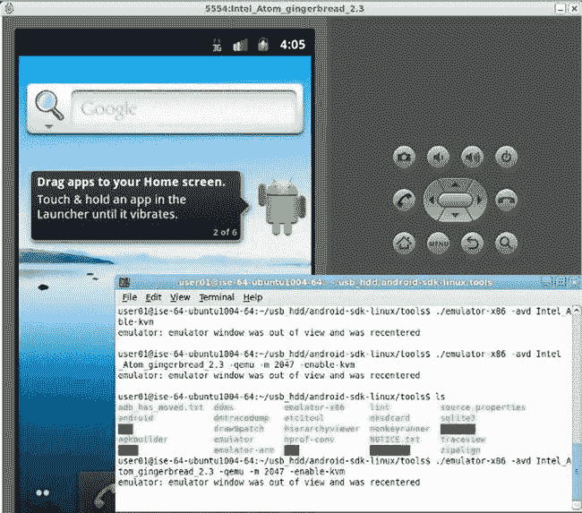

图 8-16 。在英特尔架构仿真层运行 Android 的 AVD

用`Your_AVD_Name`作为你选择的名字；`-qemu`为 qemu 提供选项，`-m`为仿真的 Android(也就是 guest)指定内存量。如果您使用的内存值太小，则可能会因为频繁的交换活动而影响性能。

使用 Eclipse 中的 AVD 管理器来启动虚拟设备

Google 推荐使用以下步骤从 Eclipse IDE 中使用 AVD 开始调试应用:

1.  在 Eclipse 中，单击您的 Android 项目文件夹，然后选择 Run  Run Configurations。
2.  在运行配置对话框的左侧面板中，选择您的 Android 项目运行配置或创建一个新配置。
3.  单击目标选项卡。
4.  选择您之前创建的基于英特尔架构的 AVD。
5.  In the Additional Emulator Command Line Options field, enter:

    `-qemu -m 2047 -enable-kvm`

6.  使用这个运行配置运行您的 Android 项目。

在 Oracle VirtualBox 中运行 Android】

在 Oracle VirtualBox 虚拟机内的桌面 PC 上运行完整的 Android 操作系统映像是 Windows 主机系统上 KVM 和 QEMU 的一种有价值的替代方案，尤其是对于那些希望在 Android 上开发和调试本机代码的开发人员而言。

在本节中，我们将分享以下一些详细信息:

*   从 Google x86 VirtualBox 官方目标`vbox-x86-eng`(包含在 Android 4.0.1 源代码树中)构建面向 x86 的 Android 4.0.x VirtualBox 安装程序。
*   使用英特尔提供的 Linux 2.6 内核为 VirtualBox 添加特定功能。
*   如何使用`installer.vdi`将 Android ICS 4.0 安装到 VirtualBox 中？

除了由英特尔硬件加速执行管理器(英特尔 HAXM)技术支持的谷歌 AVD 仿真器之外，面向 x86 VirtualBox 的 Android 正在运行一个真正基于虚拟化英特尔架构的环境。因此，它为开发人员和合作伙伴提供了另一种快速、高性能的工具，用于快速应用开发和测试。在典型的英特尔酷睿 i5 主机系统上，在 VirtualBox 中启动 Android 4.0.x 大约需要 10 秒钟。速度、性能和用户体验是 VirtualBox 在 Android 开发人员中受欢迎的原因，尤其是在基于英特尔架构的平台上。基于英特尔架构的 Android 平板电脑和智能手机在市场上的可用性仍然有限，使用开发主机系统上的虚拟环境开始开发可能比依赖 USB 调试通信更方便。特别是对于基于英特尔架构的开发主机和 Android 目标设备，这成为一个有效且有趣的替代方案。

Google x86 VirtualBox 为 Android 4.x 构建目标

如果你之前一直在使用 Google 的 Android 4.0.x 源码库，你可能会注意到 Google 提供了一个 x86 版本的 VirtualBox target `vbox_x86-eng`。在开始构建之前使用`lunch`命令，Google 为 Android 4.0.x 提供的前三个目标是:

```java
$ lunch
1\. full-eng
2\. full_x86-eng
3\. vbox_x86-eng
```

有了`vbox_x86-eng (#3)`目标，应用开发人员和系统开发人员都可以创建`android_disk.vdi`和`android installer.vdi`包。然后，这些可以用于在 VirtualBox 中运行 Android 4.x，以便在 Windows、Linux 和 OS X 上进行应用开发和系统集成。

下载源代码树并安装存储库

要安装、初始化和配置存储库，请遵循以下步骤(您可以在`http://source.android.com/source/downloading.html`找到更多信息):

```java
$ mkdir ∼/bin
$ PATH=∼/bin:$PATH
$ curlhttps://dl-ssl.google.com/dl/googlesource/git-repo/repo> ∼/bin/repo
$ chmod a+x ∼/bin/repo
$ mkdir ANDROID_TOP_PATH
$ cd ANDROID_TOP_PATH
```

要获得可用分支的列表(从您的 Android 存储库签出根目录)，请使用以下命令:

```java
$ git --git-dir .repo/manifests/.git/ branch –a
```

运行`repo init`以获得包含所有最新更新的可用存储库子分支的当前列表:

```java
$ repo init -uhttps://android.googlesource.com/platform/manifest-b android-4.0.1_r1
```

要使用 Gerrit 代码审查工具，您需要一个连接到注册的 Google 帐户的电子邮件地址。请确保这是一个您可以接收邮件的实时地址。内核版本和内部版本号将被分配给你的内部版本，信息将显示在 Android/Settings/About Phone/页面上。

成功的初始化将以一条消息结束，该消息指出 Repo 已在您的工作目录中初始化。您的客户机目录现在应该包含一个`.repo`目录，其中存储了诸如清单之类的文件。

要将文件从存储库中拉到您的工作目录中，如默认清单中所指定的，运行

```java
$ repo sync
```

默认情况下，对 Android 源代码的访问是匿名的。为了防止服务器过度使用，每个 IP 地址都与一个配额相关联。

构建支持鼠标的自定义内核

由于 Android 是为触摸屏设备设计的，默认情况下它不支持鼠标指针。此外，它可能不包括硬连线以太网支持的驱动程序，因为大多数 Android 设备只使用无线无线电进行网络通信。要添加这些功能，您需要用鼠标支持以及您需要的任何附加特性来重建内核。为此，请按照下列步骤操作:

1.  通过 Android SDK 管理器下载 Android x86 模拟器映像插件。
2.  创建一个新文件夹并将`kernel_sdk_x86.tar.gz`解压到其中，创建一个包含内核源代码树的文件夹。
3.  切换到保存内核文件的目录。
4.  现在您已经有了内核源代码，需要修改配置以匹配用作 VirtualBox 主机系统的硬件并重新构建。内核源代码提供的`menuconfig`图形用户界面将允许方便地做到这一点:

```java
$ cp ANDROID_TOP_PATH/your_kernel_path/arch/x86/configs/vbox_defconfig  .config
$ make CC=gcc-4.4 CXX=g++-4.4 ARCH=x86 menuconfig
```

这将需要几秒钟的时间来编译和加载。一旦加载完毕，您就可以使用

*   向上/向下箭头导航
*   回车选择(展开)
*   要包含的 y(或空格)

要启用鼠标支持，请导航至设备驱动程序输入设备支持鼠标。

 **注** `menuconfig`可用于确保支持您的应用或系统集成所需的所有功能可用。对于应用开发人员来说，在默认的 Android 版本上测试和验证应用同样重要。只有这样，才能保证与多个不同设备制造商的 Android 设备的最大兼容性。

对内核配置做了必要的修改后，现在可以编译它了。不需要太长时间，所以我选了一个低`–j`值。重要的是要注意，如果你省略了`CC`和`CCX`参数，编译将会提前终止(在这个设置上)，没有一个明确的错误，因为它将使用 4.6 版本。

```java
$ make CC=gcc-4.4 CXX=g++-4.4 ARCH=x86 –j8
```

`–j`参数提供了可用于编译的内核数量。此示例假设四核系统启用了英特尔超线程技术。

构建成功完成后，构建日志的最后一行将会显示

```java
Kernel: arch/x86/boot/bzImage is ready
```

添加修补的内核

内核映像`bzImage`需要重命名为`kernel-vbox`并复制到`/ANDROID_TOP_PATH/prebuilt/android-x86/kernel/kernel-vbox`:

`$ cp /ANDROID_TOP_PATH/kernel/arch/x86/boot/bzImage   /ANDROID_TOP_PATH/prebuilt/android-x86/kernel/kernel-vbox`

使用 CCACHE 减少编译时间

通过使用编译器缓存，可以大大减少后续编译的编译时间。要设置 50GB 缓存，请执行以下操作:

1.  安装 CCcache 程序并为您的`ccache` :

    ```java
    $ sudo apt-get install ccache
    $ sudo mkdir /ANDROID_TOP_PATH/ccache
    $ sudo chown $LOGNAME  /ANDROID_TOP_PATH/ccache
    ```

    创建一个目录
2.  Set up your environment variables for `ccache` support by modifying `∼/.bashrc`:

    `$ sudo gedit ∼/.bashrc`

3.  添加以下内容:

    ```java
    export CCACHE_DIR=/ANDROID_TOP_PATH/ccache
    export USE_CCACHE=1
    ```

4.  设置`ccache`尺寸。

    ```java
    $ ccache -F 100000
    $ ccache -M 50G
    ```

用新内核构建 Android 4.0.x

要设置环境，请执行以下操作:

```java
$ /ANDROID_TOP_PATH/> source build/envsetup.sh
```

对于 ICS 4.0.1，您将看到:

```java
including device/samsung/maguro/vendorsetup.sh
including device/samsung/tuna/vendorsetup.sh
including device/ti/panda/vendorsetup.sh
including sdk/bash_completion/adb.bash
```

为了确保在使用`lunch`命令时选择一个有效的目标，只需简单地执行以下操作即可:

```java
$ lunch
```

并从列表中选择所需的目标:

```java
1\. full-eng
2\. full_x86-eng
3\. vbox_x86-eng
4\. full_maguro-userdebug
5\. full_tuna-userdebug
6\. full_panda-eng
Which would you like? [full-eng]
```

 **注意**确保选择`3\. vbox_x86-eng`。

```java
PLATFORM_VERSION_CODENAME=REL
PLATFORM_VERSION=4.0.1
TARGET_PRODUCT=vbox_x86
TARGET_BUILD_VARIANT=eng
TARGET_BUILD_TYPE=release
TARGET_BUILD_APPS=
TARGET_ARCH=x86
TARGET_ARCH_VARIANT=x86
HOST_ARCH=x86 HOST_OS=linux
HOST_BUILD_TYPE=release
BUILD_ID=ITL41D
```

运行`make`:

```java
$ make -j8
```

构建 VirtualBox 磁盘和 Android 安装程序

最后，将`Android_disk.vdi`和`installer_vdi`构建在一起:

```java
$ make android_disk_vdi  installer_vdi  -j8
```

如果构建成功，您将在构建日志中看到以下输出:

```java
Done with VirtualBox bootable disk image -
[ out/target/product/vbox_x86/android_disk.vdi ]-
Done with VirtualBox bootable installer image -
[ out/target/product/vbox_x86/installer.vdi ]-
```

使用`android_disk.vdi`，可以在 VirtualBox 中选择新建创建新的虚拟机。你可以使用`android_disk.vdi`作为现有的磁盘镜像来作为虚拟机的基础，它现在会自动引导 Android 4.0.x。

为 VirtualBox 设置启动参数非常简单。进入关于此手机的设置，查看图 8-17 中所示的制造信息。

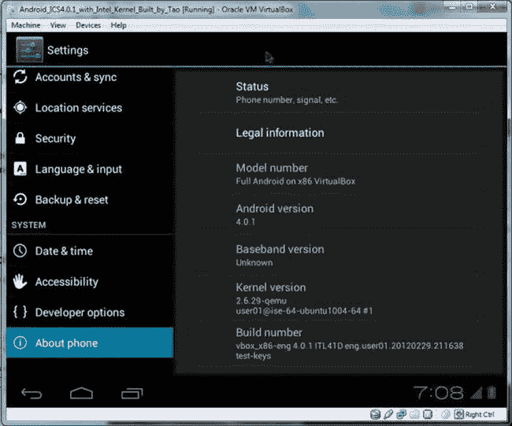

图 8-17 。Oracle VirtualBox 中的 Android 4.0.x 构建信息

使用 Android 安装盘创建一个大的虚拟分区

即使 VirtualBox 中的文件大小扩展到 550MB，它仍然太小，无法加载应用进行测试。将 Android 安装到一个更大的分区(最好大于 4GB)需要一个 Android 安装盘。

首先从 VirtualBox 菜单栏中选择 Machine  New，并使用 Create New Virtual Machine 向导在 IDE 控制器配置条目下创建一个更大的磁盘。

然后在虚拟机的设置存储中，添加`installer.vdi`作为主 IDE 从机，如图图 8-18 所示。现在你可以在刚刚创建的 4GB 硬盘上安装 Android 了。

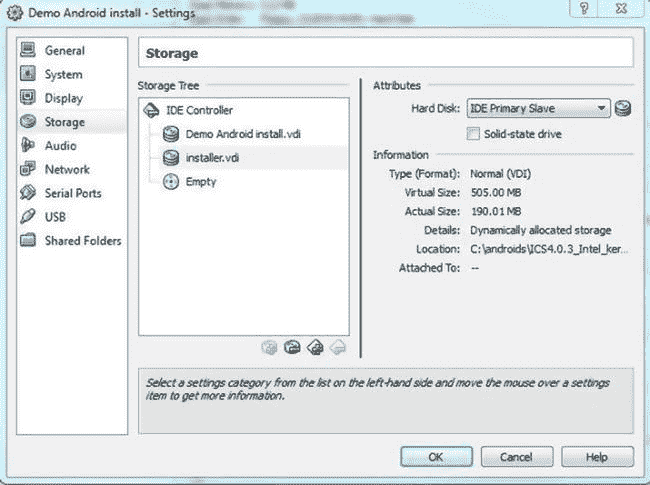

图 8-18 。为虚拟机配置存储设置

1.  启动模拟器。
2.  使用 F12 进入 BIOS 引导菜单。引导至辅助驱动器。
3.  使用`grub`选择安装选项:2。从主要从机启动(参见图 8-19)。

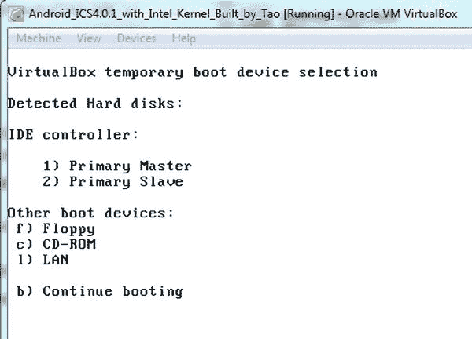

图 8-19 。在 VirtualBox 中引导安装程序映像

当你看到`Done processing installer config`时，输入`reboot`。

 **注意**第一次在目标虚拟磁盘上安装时，安装可能会失败。将打印一条消息，告诉您再次运行安装程序。通过使用以下命令来完成此操作:

`$ installer`

重新启动后，您可以看到您的 Android 正在从您创建的更大的磁盘上运行，并且您可以在 VirtualBox IDE 控制器设置下安全地从存储中删除`installer.vdi`。

串口

默认情况下，虚拟机中的串行端口支持处于启用状态。但是，COM1 串行端口在使用前需要初始化和配置。以下指令使 VirtualBox 在您的主目录中创建一个名为`.vbox_pipe`的命名管道。在命令行上，输入:

```java
$ VBoxManage modifyvm Android --uart1 0x03f8 4
$ VBoxManage modifyvm Android --uartmode1 server /home/user/.vbox_pipe
```

或者，在 VirtualBox GUI 中，使用虚拟机设置菜单中的串行端口选项卡来启用 COM1 作为主机管道。选择创建管道，将其创建为`/home/user/.vbox_pipe`。

若要连接到此命名管道，请使用:

```java
$ socat unix-client:$HOME/.vbox_pipe stdout
```

 **注意** VirtualBox 可能不理解环境变量(比如`$HOME`)，所以你必须指定一个完整的显式路径，比如`/home/user/.vbox_pipe`。

以太网

镜像中的 DHCP 启用了以太网端口(`eth0`)。要通过 ADB 连接到它，您需要查找已经分配的 DHCP 地址。

如果您使用的是桥接以太网，您可以从 shell 提示符处获得该地址，或者从串行端口获得，或者使用以下命令从 Developer Tools 终端仿真器获得:

```java
$ netcfg
```

如果您使用的是主机专用适配器`vboxnet0`，您应该使用地址 192.168.56.101。

最终注释

现在你有了一个运行 Android 4.0.x 的 VirtualBox 映像，它完全是根据谷歌的官方目标构建的(见图 8-20)。

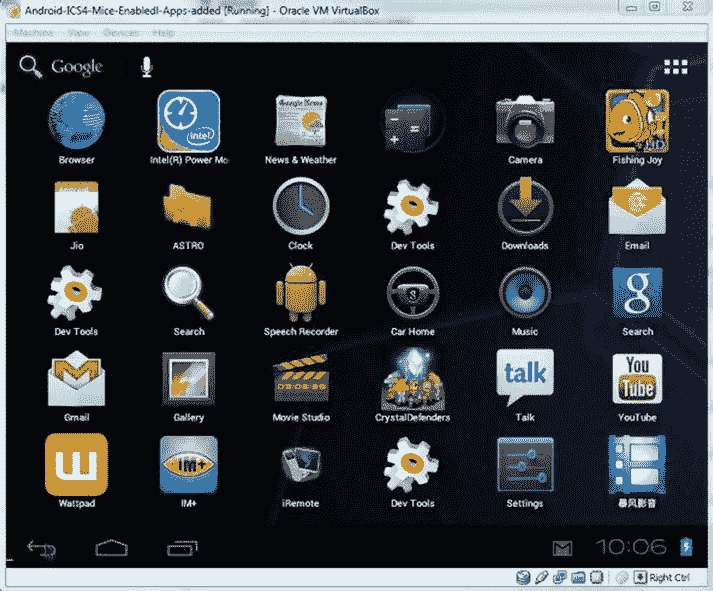

图 8-20 。Android 操作系统在 VirtualBox 虚拟机中完全启动

使用 GNU 项目调试器 GDB 进行调试

Android NDK 包括 GDB，GNU 调试器，允许你启动、暂停、检查和修改程序。在 Android 设备上，更普遍的是在嵌入式设备上，GDB 被配置为客户端/服务器模式。该程序在作为服务器和远程客户端的设备上运行。开发人员的工作站连接到它，并发送类似于本地应用的调试命令。GDB 本身就是一个命令行工具。在查看 Eclipse CDT 集成之前，您将首先查看它的基本使用模型。

用 GDB 调试时，`gdbserver` 在设备上运行处理调试通讯。然而，您可能仍然使用底层 USB 到以太网加密狗驱动程序和 ADB 与传输层通信，在传输层上`gdbserver`通过 TCP/IP 与运行在开发主机上的 GDB 通信。

有一个`gdbclient`应用设置调试通信环境，并在被调试设备上启动`gdbserver`。

```java
usage: gdbclient EXECUTABLE :PORT [PROG_PATH]
EXECUTABLE  executable name (default app_process)
PORT        commection port (default :1234)
PROG_PATH   executable full path on target (ex /system/bin/mediaserver)
```

如果`PROG_PATH`被设置，`gdclient`尝试启动`gdbserver`并将其连接到正在运行的`PROG_PATH`。

要显式启动`gdbserver`，您可以使用以下命令:

```java
# gdbserver :1234 --attach 269
Attached; pid = 269
Listening on port 1234
```

以下分步调试会话启动说明说明了即使使用 GDB(而非 ADT 或 DDMS)进行调试，ADB 仍然是调试通信的基础。假设正在使用端口 1234。

午餐流程如下:

```java
gdbserver :1234 /system/bin/executable
```

要附加到现有流程，请执行以下操作:

```java
gdbserver :1234 --attach pid
```

在您的工作站上，将端口 1234 转发到带有`adb`的设备:

```java
adb forward tcp:1234 tcp:1234
```

启动一个特殊版本的`gdb`，它位于源代码树的“预构建”区域:

`prebuilt/Linux/toolchain-eabi-4.x.x/bin/i686-android-linux-gdb`(对于 Linux)或

`prebuilt/darwin-x86/toolchain-eabi-4.x.x/bin/i686-android-linux-gdb`(为达尔文)。

如果你找不到 GDB 的任何一个特殊版本，运行这个

```java
 $find prebuilt –name i686-android-linux-gdb
```

在源代码树中找到并运行最新版本。请确保使用 symbols 目录中的可执行文件副本，而不是主 Android 目录，因为主目录中的副本已经去掉了符号信息。

在 GDB，告诉 GDB 在哪里可以找到将要加载的共享库:

```java
set solib-absolute-prefix /absolute-source-path/out/target/product/product-name/symbols
set solib-search-path /absolute-source-path/out/target/product/product-name/symbols/system/lib
```

到您的源代码树的路径是*绝对源代码路径*??。确保你指定了正确的目录——如果你犯了错误，GDB 可能不会告诉你。通过发出`gdb`命令连接到设备:

```java
(gdb) target remote :1234
```

`:1234`告诉 GDB 连接到本地主机端口 1234，该端口由 ADB 桥接到设备。

现在你可以开始用 GDB 调试运行在 Android 上的原生 C/C++ 代码，就像你习惯的那样。如果您还安装了 Eclipse(如果您使用 Android SDK 进行基于 Dalvik/Java 的应用开发，您可能会这样做)，Eclipse 和 Eclipse 的 GDB 集成可以直接用于添加断点和检查程序。

事实上，使用 Eclipse，您可以在 Java 和 C/C++ 源文件中轻松插入断点。你只需点击文本编辑器的左边。得益于 ADT 插件，Java 断点可以开箱即用，该插件通过 Android 调试桥管理调试。CDT 不是这样的，它当然不支持 Android。因此，插入断点没有任何作用，除非您将 CDT 配置为使用 NDK 的 GDB，它本身需要绑定到原生 Android 应用以便调试它。首先，按照以下步骤在应用中启用调试模式:

1.  有一件重要的事情要做，但是很容易忘记，那就是激活你的 Android 项目中的调试标志。这是在应用清单`AndroidManifest.xml`中完成的。不要忘记为本地代码使用合适的 SDK 版本:

    ```java
    <?xml version="1.0" encoding="utf-8"?> <manifest ...>
    <uses-sdk android:minSdkVersion="10"/> <application ...
    android:debuggable="true"> ...
    ```

2.  启用清单中的调试标志。这将自动激活本机代码中的调试模式。然而，`APP_OPTIM`标志也控制调试模式。如果它已经在`Android.mk`中被手动设置，那么检查它的值是否被设置为调试(而不是发布)或者简单地删除它:

    ```java
    APP_OPTIM := debug
    ```

3.  Now configure the GDB client that will connect to the device. Recompile the project and plug your device in or launch the emulator. Run and leave your application. Ensure the application is loaded and its PID is available. You can check it by listing processes using the following command (use Cygwin in Windows):

    ```java
    $ adb shell ps |grep gl2jni
    ```

    应该返回一行:

    ```java
    app_75 13178 1378 201108 68672 ffffffff 80118883 S com.android.gl2jni
    ```

4.  Open a terminal window and go to your project directory. Run the `ndk-gdb` command (located in the Android NDK folder, for example `android-ndk-r8\`):

    ```java
    $ ndk-gdb
    ```

    该命令不应返回消息，但会在`obj\local\x86`目录中创建三个文件:

    *   `gdb.setup`。这是为 GDB 客户端生成的配置文件。
    *   `app_process`。该文件直接从您的设备中检索。它是一个系统可执行文件，在系统启动时启动，并分叉以启动一个新的应用。GBD 需要这个参考文件来寻找它的标记。在某些方面，它是你的应用的二进制入口。
    *   `libc.so`。这也是从您的设备中检索的。它是 GDB 用来跟踪运行时创建的所有本机线程的 Android 标准 C 库(通常称为 bionic)。
5.  在您的项目目录中，复制`obj\local\x86\gdb.setup`并将其命名为`gdb2.setup`。打开它并删除下面一行，它请求 GDB 客户端连接到运行在设备上的 GDB 服务器(将由 Eclipse 执行):

    ```java
    (gdb) target remote :1234
    ```

6.  在 Eclipse 主菜单中，转到 Run | Debug Configurations，并在 C/C++ 应用中创建一个名为`GL2JNIActivityDefault`的新调试配置。此配置将在您的计算机上启动 GDB 客户端，并连接到设备上运行的 GDB 服务器。
7.  In the Main tab (see Figure 8-21), set the project to your own project directory. Set the C/C++ application to point to `obj\local\ x86\app_proc`ess using the Browse button (you can use an absolute or relative path).

    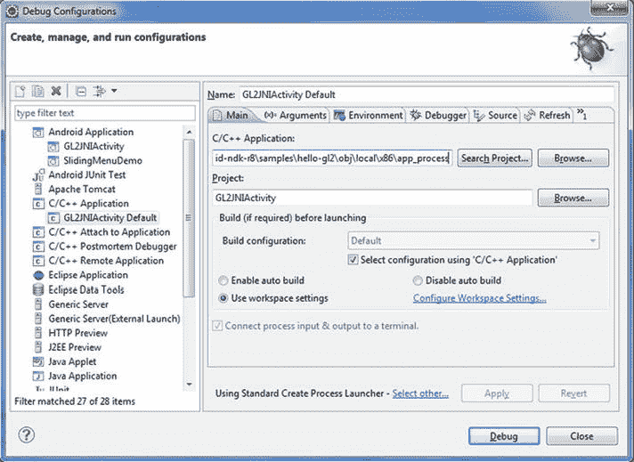

    图 8-21 。C/C++ 应用的调试配置

8.  Switch the launcher type to Standard Create Process Launcher (see Figure 8-22) using the link Select Other link at the bottom of the window.

    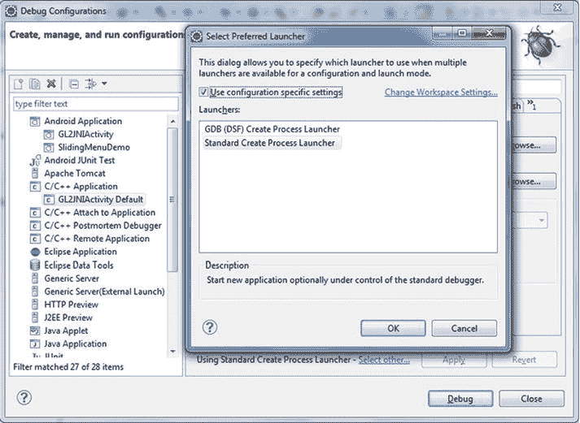

    图 8-22 。选择首选发射器

9.  Go to the debugger file and set the debugger type to `gdbserver`. Set the GDB debugger to `android-ndk-r8\toolchains\x86-4.4.3\prebuilt\windows\bin\i686-android-linux-gdb.exe`. The GDB command file (see Figure 8-23) needs to point to the `gdb2.setup` file located in `\obj\local\x86` (you can use an absolute or relative path).

    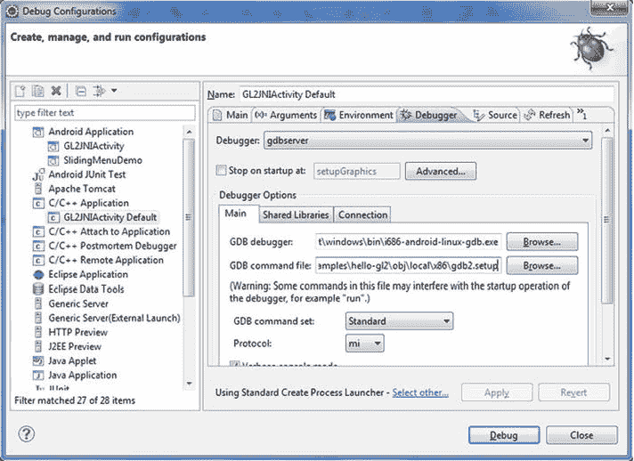

    图 8-23 。调试器设置面板

10.  Go to the Connection tab (see Figure 8-24) and set Type to TCP. Keep the default values for hostname or IP address and port number (localhost, 5039).

    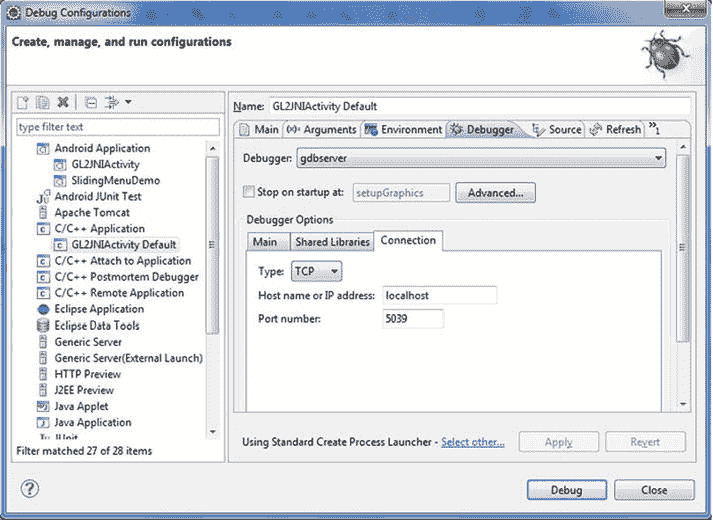

    图 8-24 。调试器设置面板上的连接设置

11.  Now, let’s configure Eclipse to run a GDB server on the device. Make a copy of `android-ndk-r8\ndk-gdb` and open it with a text editor. Find the following line:

    ```java
    $GDBCLIENT -x 'native_path $GDBSETUP'
    ```

    将其注释掉，因为 GDB 客户端将由 Eclipse 本身运行:

    `#$GDBCLIENT -x 'native_path $GDBSETUP'`

12.  In the Eclipse main menu, go to Run | External Tools | External Tools | Configurations (see Figure 8-25), and create a new configuration `GL2JNIActivity_GDB`. This configuration will launch GDB server on the device.

    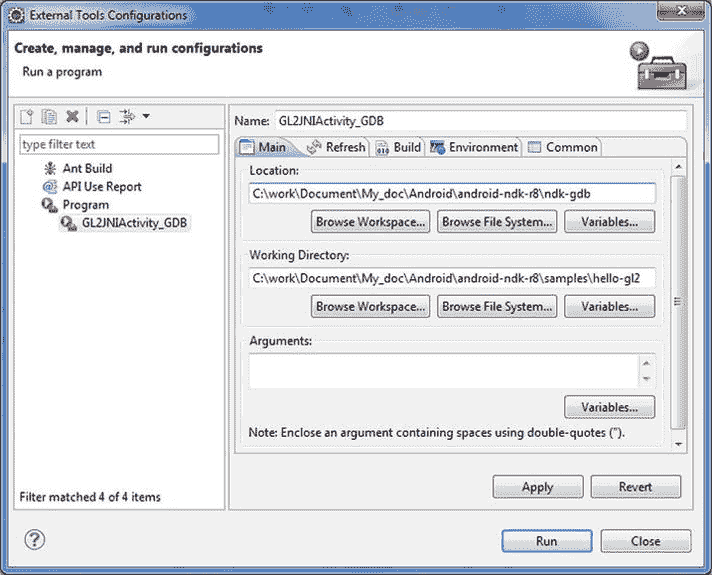

    图 8-25 。外部工具配置

13.  在主选项卡上，设置指向`android-ndk-r8`中修改的`ndk-gdb`的位置。将工作目录设置为您的应用目录位置。或者，设置参数文本框:
    *   Verbose:查看 Eclipse 控制台中发生的详细情况。
    *   强制:自动终止任何先前的会话。
    *   Start:让 GDB 服务器启动应用，而不是在应用启动后连接它。如果您只调试本机代码而不调试 Java，那么这个选项很有意思。
14.  现在，像往常一样启动应用。
15.  一旦应用启动，您可以通过控制台直接启动`ndk-gdb`或者启动外部工具配置`GL2JNIActivity_GDB`，这将启动设备上的 GDB 服务器。GDB 服务器接收远程 GDB 客户端发送的调试命令，并在本地调试您的应用。
16.  Open `jni\gl_code.cpp` and set a breakpoint (see Figure 8-26) in setupgraphics by double-clicking the left margin of the text editor (or right-clicking and selecting Toggle Breakpoint).

    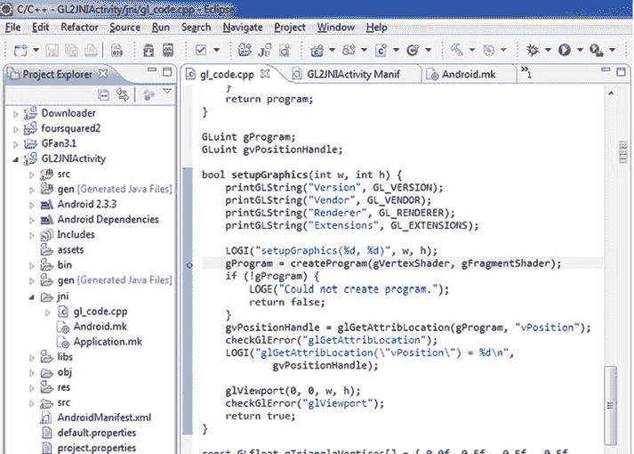

    图 8-26 。设置断点

17.  最后，启动`GL2JNIActivity`默认 C/C++ 应用配置来启动 GDB 客户端。它通过套接字连接将调试命令从 Eclipse CDT 中继到 GDB 服务器。从开发人员的角度来看，这几乎就像调试本地应用一样。

英特尔图形性能分析器(英特尔 GPA)

还有一些调试图形性能的特定工具。英特尔 GPA 系统分析器是英特尔图形性能分析器(GPA)的之一，支持基于英特尔的 Android 设备，旨在帮助应用和驱动工程师优化其 OpenGL ES 工作负载。

本节介绍了如何通过 USB 连接在 Android 设备上配置和使用英特尔 GPA。当连接到 Android 设备时，英特尔 GPA 系统分析器提供 OpenGL ES API、CPU 和 GPU 性能指标，并提供多种图形管道状态覆盖，以帮助您分析 OpenGL ES 应用性能。

要在基于 Android x86 的设备上使用英特尔 GPA 系统分析器，您需要从文档中检查目标机器和固件版本。

要开始收集指标，您需要在客户端系统上安装英特尔 GPA 系统分析器，并将其连接到目标设备:

1.  在 Windows/Linux 客户机上安装英特尔 GPA 2013 。
2.  启动英特尔 GPA 系统分析器。
3.  确保使用 USB 电缆将 Android 设备连接到客户端系统。
4.  等待 10 秒钟，让您的客户端系统检测目标设备。找到的设备出现在窗口中。目标设备列表每五到六秒刷新一次。
5.  Find the device you want to connect to and click Connect (see Figure 8-27). The Intel GPA System Analyzer will copy the required components to the target device and generate the list of installed applications. You can interrupt the connection process by clicking Stop.

    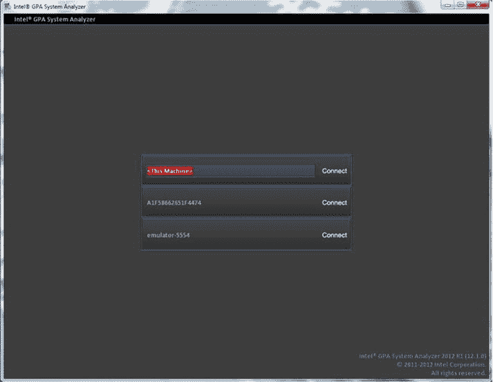

    图 8-27 。选择连接的设备

6.  Select the desired application from the list of available ones. The Application List screen (see Figure 8-28) displays all user and system applications installed on the Android device.

    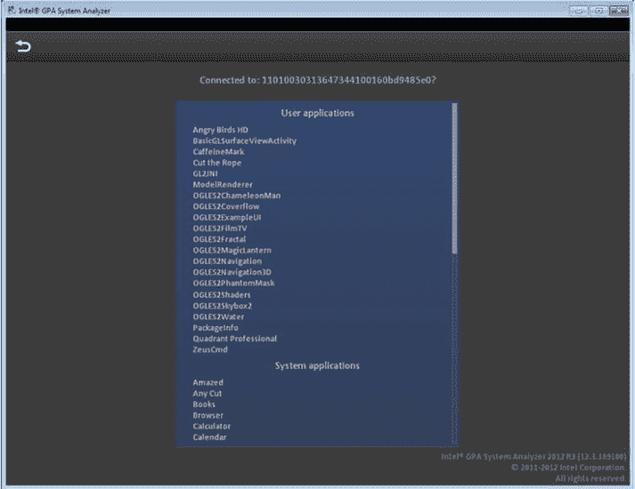

    图 8-28 。应用列表

7.  应用将会启动，您将会在英特尔 GPA 系统分析器窗口中看到其数据。
8.  要切换到不同的应用，请单击“上一步”。请注意，正在运行的应用将被强制关闭。
9.  To switch to a different target device, click Back. The PowerVR graphics architecture consists of the following core modules that convert the submitted 3D application data into a rendered image—Tile Accelerator (TA), Image Synthesis Processor (ISP), and the Texture & Shading Processor (TSP). Intel GPA metrics in the “GPU” group correspond to one of these core modules, and the order of metrics in the Metrics List depends on the order of the core modules in the graphics pipeline (see Figure 8-29).

    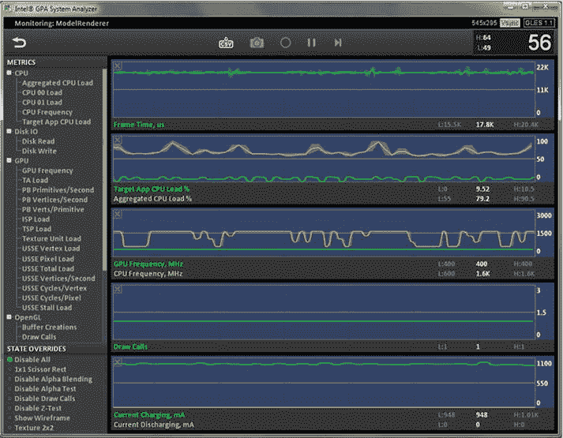

    图 8-29 。英特尔 GPA 系统分析器窗口

运行在英特尔凌动处理器上的 Android 操作系统的系统调试

到目前为止，本章一直专注于开发和调试应用，无论它们是单独使用 Android 的 Java 运行时，还是作为 x86 英特尔架构二进制文件和共享对象本机运行。

对于系统集成商和设备制造商来说，可能还需要处理设备驱动程序和系统软件堆栈层。如果需要实施额外的特定于平台的外围设备支持，或者如果要将第一个操作系统移植到基于英特尔凌动处理器的新设备上，这一点尤为重要。

在接下来的章节中，您将了解联合测试行动小组 IEEE 1149.1 (JTAG ) 基于标准的调试解决方案，以及 ARM 和英特尔架构之间可能影响系统级调试的架构差异。

JTAG 调试

对于真正的固件、操作系统级和设备驱动程序调试，世界上最常用的方法是使用 JTAG 调试接口。从历史上看，联合测试行动小组是由行业领导者在 20 世纪 80 年代成立的，旨在定义测试接入端口和印刷电路板的标准。IEEE 在 20 世纪 90 年代采用他们的标准作为 IEEE 1149.1 标准测试接入端口和边界扫描架构。为了简洁起见，测试标准通常被称为 JTAG。从最初用于电路板测试，它已经发展成为独立于操作系统和操作系统级平台调试的事实上的接口标准。

关于 JTAG 及其在现代系统软件堆栈调试中的使用的更多背景信息可在文章“JTAG 101；IEEE 1149.x 和软件调试”，作者是兰迪·约翰逊和斯图尔特·克里斯蒂(见`http://www.intel.com/content/www/us/en/intelligent-systems/jtag-101-ieee-1149x-paper.html`)。

从 OEM 及其合作伙伴应用和驱动程序开发人员的角度来看，了解在片上系统(SoC)集成智能系统或智能手机外形设备的不同部分上运行的驱动程序和软件堆栈组件之间的交互对于确定平台稳定性至关重要。从芯片验证者的角度来看，底层软件栈提供了一个测试环境，该环境模拟了平台在真实用例中将要面临的压力因素。简而言之，现代 SOC 需要理解完整的封装及其复杂的真实世界交互，而不仅仅是单个硬件组件的积极单元测试结果。这是基于 JTAG 的系统软件调试方法所能提供的洞察力水平。这可以通过将 JTAG 固有的深度硬件感知与导出目标上运行的 Android 操作系统的状态信息的能力相结合来实现。

尤其对于设备驱动程序调试，了解芯片组上外围设备的确切状态以及设备驱动程序与操作系统层和软件堆栈其余部分的交互非常重要。

如果你从系统调试的角度来看 Android 看设备驱动和操作系统内核——它实际上只是 Linux 的一个专门分支。因此可以像对待任何 2.6.3x 或更高版本的 Linux 一样对待它。

英特尔凌动处理器 Z2460 支持 IEEE-1149.1 和 IEEE-1149.7 (JTAG)边界扫描和 MPI 并行跟踪接口(PTI)，以及通过英特尔 JTAG 兼容扩展调试端口(XDP)进行的基于分支跟踪存储(BTS)的指令跟踪。

各 JTAG 厂商提供支持 Android 的系统调试解决方案，包括:

*   河风(`http://www.windriver.com/products/JTAG-debugging/`)
*   劳特巴赫〔??〕
*   英特尔 （ `http://software.intel.com/en-us/articles/embedded-using-intel-tools` ）

Android OS 调试，

让调试基于 Android 的平台变得复杂的是，Android 积极利用低功耗空闲状态和睡眠状态来优化功耗。因此，真正的挑战变成了通过低功率状态进行调试，或者通过一些低功率状态保持 JTAG 功能，或者当这不可能时，一旦 JTAG 的芯片组功率域被重新启用，就重新连接 JTAG。

这些类型的平台上的许多操作系统级问题往往集中在电源模式变化和睡眠/唤醒序列上。

无论是基于调试代理还是使用 JTAG 设备接口，系统调试器都是非常有用的工具，有助于满足操作系统开发的几个关键目标。

调试器可用于验证引导过程，并分析和纠正稳定性问题，如运行时错误、分段错误或引导期间未正确启动的服务。

通过提供页表、描述符表和指令跟踪的详细访问和表示，它还可以用于识别和纠正操作系统配置问题。指令跟踪和内存表访问的结合是一个非常强大的工具，可以识别堆栈溢出、内存泄漏甚至数据中止情况的根本原因。

图 8-30 显示了对英特尔 JTAG 调试器提供的页面转换属性和描述符表的详细访问。x86 在定义转换表的深度和寻址内存块的粒度方面具有高度的灵活性，这种内存布局的易访问性和可见性对于操作系统级别的系统开发变得更加重要。

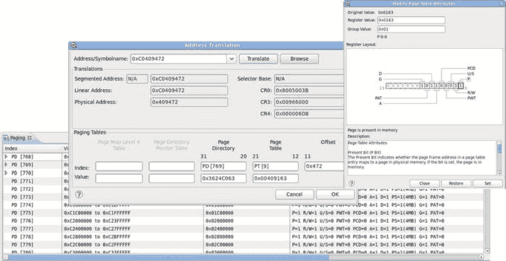

图 8-30 。内存配置的调试器视图示例

这突出了在英特尔架构和许多其他架构上开发和配置 Android 操作系统软件堆栈的两个关键区别。选择器基址和偏移寻址模型与本地描述符表(LDT)和全局描述符表(GDT)相结合，支持从物理内存到虚拟内存的深度、多层地址转换，并且具有可变的地址块粒度。对于具有受保护的隔离内存空间的分隔环境中的自定义内存配置，这是一个强大的功能。但是，如果使用不当，它也会增加内存访问时间。

英特尔架构与其他架构的另一个区别是处理系统中断。例如，在 ARM 上，从 0x0 到 0x20 的保留地址空间中有一组预定义的硬件中断。这些位置然后包含到中断处理程序的跳转指令。在英特尔架构上，采用了专用的硬件中断控制器。硬件中断不是通过内存空间直接访问的，而是通过访问 Intel 8529 中断控制器。这种方法的优点是中断处理程序已经允许直接处理附加设备的 I/O 中断。在不使用专用中断控制器的架构中，IRQ 中断通常需要用更复杂的中断处理程序来过载才能完成。

设备驱动调试

一个好的用于操作系统级调试的 JTAG 调试器解决方案应该进一步提供内核线程和活动内核模块以及内核导出的其他信息的可见性。为了允许调试动态加载的服务和设备驱动程序，可以使用导出驱动程序的初始化方法和销毁方法的存储位置的内核补丁或内核模块。

特别是对于系统配置和设备驱动程序调试，能够直接访问和检查设备配置寄存器的内容也很重要。位域编辑器的概念，如图 8-31 所示，对此非常有用。*位域编辑器*是 SoC 设备寄存器的按位可视化，允许在相关设备驱动程序与之交互时实时监控设备状态的变化。

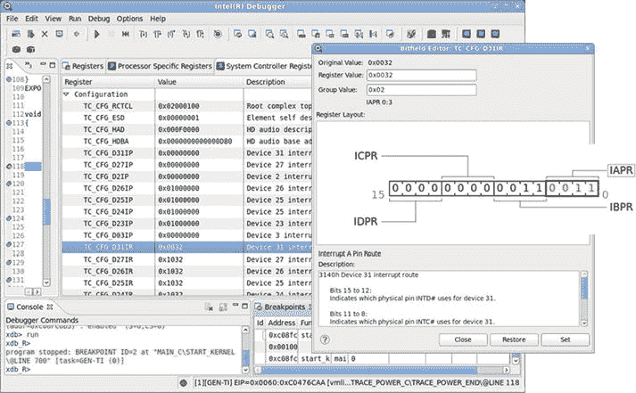

图 8-31 。设备寄存器位域编辑器视图

在 Android 压缩的`zImage`内核映像被解压到内存中之后，可以通过简单地释放调试器中的运行控制来分析代码，直到到达`start_kernel`。这意味着包含内核符号信息的`vmlinux`文件已经被加载。此时，可以使用软件断点。在引导过程的这一点之前，应该只使用基于断点寄存器的硬件断点，以避免调试器试图将断点指令写入未初始化的内存。一旦到达空闲循环`mwait_idle`，操作系统就成功启动。

此外，如果您的调试解决方案提供对基于分支跟踪存储(BTS)的指令跟踪的访问，此功能可以与 JTAG 调试器的所有常规运行控制功能结合使用，用于在异常时强制执行停止。然后，您可以反向分析执行流，以确定运行时问题的根本原因。

硬件断点

正如在 ARM 架构上一样，基于英特尔架构的处理器支持软件断点的断点指令以及数据和代码的硬件断点。在 ARM 架构上，通常会有一组断点和数据断点的专用寄存器(称为*观察点*)。常见的实现倾向于每种都提供两个。当这些寄存器包含一个值时，处理器检查通过程序计数器寄存器或存储器读/写对设置的存储器地址的访问。一旦发生访问，执行就会停止。这不同于软件断点，因为一旦遇到断点指令，它们的执行就被停止。由于断点指令替换了通常位于给定存储器地址的汇编指令，所以在通常位于断点位置的指令被执行之前，执行有效地停止。

英特尔架构上的硬件断点的实现与 ARM 上的非常相似，尽管它更灵活一些。

在所有英特尔凌动处理器内核上，都有四个存储地址的 DR 寄存器，这些寄存器会在内存提取之前(有时是之后)与内存总线上提取的地址进行比较。

您可以使用所有这四个寄存器来提供触发以下任何调试运行控制事件的地址:

*   00.指令执行中断
*   01.仅在数据写入时中断
*   10.未定义的`OR`(如果架构允许)I/O 读取或写入中断
*   11.数据读取或写入时中断，但取指令时不中断

因此，所有四个硬件断点都可以用作断点或观察点。观察点可以是只写的或读写的(或 I/O)。

交叉调试 :英特尔凌动处理器和 ARM 架构

许多以英特尔凌动处理器为目标的开发人员都有过主要针对具有固定指令长度的 RISC 架构进行开发的经验。MIPS 和 ARM 是具有固定长度的 ISAs 的主要例子。一般来说，英特尔凌动处理器和 ARM 架构处理器之间的交叉调试使用模式非常相似。许多概念性的调试方法和问题是相同的。

然而，在基于英特尔架构的开发主机上针对英特尔凌动处理器目标进行开发确实具有两大优势，尤其是当选择的嵌入式操作系统是 Linux 或 Windows 等常见标准操作系统的衍生产品时。第一个优势是丰富的性能、功耗分析和调试工具生态系统，可用于英特尔架构上更广泛的软件开发市场。第二个优点是调试应用的功能正确性和多线程行为可以在本地完成。这个优点将在本章后面讨论。

开发人员应该了解英特尔凌动处理器和 ARM 处理器之间的一些差异。接下来的两个小节总结了这些差异。

可变长度指令

IA-32 和 Intel 64 指令集具有可变的指令长度。调试器不能仅仅以固定的 32 位间隔检查代码，还必须根据这些指令的上下文解释和反汇编应用的机器指令。下一条指令的位置取决于前一条指令的位置、大小和正确解码。相比之下，在 ARM 架构上，调试器需要监控的只是从 ARM 模式切换到 Thumb 模式或增强 Thumb 模式的代码序列。一旦进入特定模式，所有指令和存储器地址的大小都是 32 位或 16 位。固件开发人员和设备驱动程序开发人员需要精确地将调用与特定的设备寄存器对齐，并且可能希望依赖于对调试器的内存窗口打印输出的理解，他们应该了解可变长度指令的潜在影响。

硬件中断

调试系统代码时可能相关的另一个架构差异是如何处理硬件中断。在 ARM 架构上，以下异常向量从地址 0x0 映射到地址 0x20:

*   0.重置
*   1.流产
*   2.数据中止
*   3.预取中止
*   4.未定义指令
*   5.中断(IRQ)
*   6.快速中断(FIRQ)

这个内存区域受到保护，通常不能被重新映射。通常，0x0 到 0x20 的所有向量位置都包含到实际异常处理程序代码所在的内存地址的跳转。对于复位向量，这意味着在 0x0 将跳转到固件或平台引导代码的位置。这种方法使得硬件中断和 OS 信号处理程序的实现在 ARM 架构上不太灵活，但也更加标准化。只需在 0x0 至 0x20 地址范围内的向量位置设置一个硬件断点，就可以很容易地在调试器中捕获中断。

在英特尔架构上，采用了专用的硬件中断控制器。以下中断不能通过处理器内存地址空间直接访问，而是通过访问英特尔 8259 中断控制器来处理:

*   0.系统记时器
*   1.键盘
*   2.级联第二中断控制器
*   3.com 2—串行接口
*   4.COM1—串行接口
*   5.LPT—并行接口
*   6.软盘控制器
*   7.有空的
*   8.CMOS 实时时钟
*   9.声卡
*   10.网络适配器
*   11.有空的
*   12.有空的
*   13.数字处理器
*   14.IDE—硬盘接口
*   15.IDE—硬盘接口

正如您所看到的中断列表，控制器已经允许直接处理附加设备的硬件 I/O 中断，这些中断是通过 ARM 平台上的 IRQ 中断或快速中断来处理的。这一特性使得在英特尔架构上实现操作系统级的正确中断处理变得更加容易，尤其是对于设备 I/O。软件异常(如数据中止或分段故障)的映射在英特尔架构上也更加灵活，并且对应于通过中断描述符表(IDT)寻址的中断控制器端口。IDT 到硬件中断的映射可由软件栈定义。此外，从软件栈无关的调试实现中捕获这些异常并不容易。为了在英特尔架构上捕获触发硬件中断的软件事件，需要一些操作系统层的知识。有必要了解这些异常的操作系统信号如何映射到底层中断控制器。最常见的是，即使在系统级调试器中，来自操作系统的存储器映射信号表将捕获异常，而不是试图直接在硬件级捕获异常。

单步执行

ARM 架构没有明确的单步指令。在英特尔架构上，汇编级单步通常直接通过这样的指令在调试器中实现。在 ARM 上，单个指令步骤被实现为“运行直到中断”命令。调试器需要做一些代码检查，以确保所有可能的代码路径都被覆盖(特别是当它从分支指令或类似指令中脱离时)。从调试器实现的角度来看，这确实会产生轻微的开销，但不会过多，因为这种“运行到中断”的实现无论如何都是高级语言步进经常需要的。一般来说，软件开发人员应该意识到这种差异，因为这会导致略微不同的步进行为。

虚拟内存映射

虚拟内存映射的描述符表和页面转换实现惊人地相似，至少在概念上是如此。在英特尔架构上，全局描述符表(GDT)和局部描述符表(LDT )支持将内存页面的嵌套粗糙度调整映射到虚拟地址空间。图 8-32 使用调试器的页面转换功能来图形化表示英特尔架构上的线性到物理地址转换。

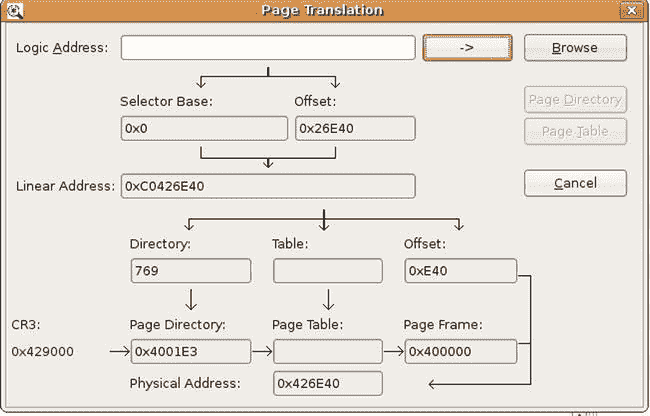

图 8-32 。英特尔架构页面翻译

在 ARM 上，第一级和第二级页表定义了更直接的、最多一级或两级深度的虚拟内存页搜索。图 8-33 显示了一个线性地址到物理地址转换的例子。

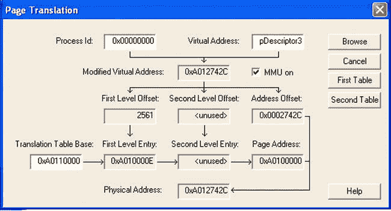

图 8-33 。ARM 上的页面翻译

英特尔架构为描述符表、页表、实模式下的 32 位地址空间访问和保护模式下的 64 位寻址提供了多种粗糙程度，具体取决于选择器`base:offset`型号。ARM 在其各种模式下不使用`base:offset`。在英特尔架构上，页表搜索可以更深入。在 ARM 上，定义的集合是两个页表。在英特尔架构上，描述符表实际上可以屏蔽嵌套表，因此页表运行的真正深度很容易达到 ARM 上深度的两倍或三倍。

英特尔架构上的页面转换机制在系统内存布局和机制方面提供了更大的灵活性，操作系统层使用这些机制来分配特定的内存块作为应用执行的受保护块。然而，它确实增加了开发人员对内存虚拟化的全面了解，从而避免内存泄漏和内存访问违规(分段错误)的挑战。在一个拥有大量内存的全功能操作系统上，这个问题不太值得关注。对内存处理具有更多可见性的实时操作系统可能更容易受到此问题的影响。

英特尔超线程技术的注意事项

从调试的角度来看，物理处理器内核和通过英特尔超线程技术实现的逻辑内核之间实际上没有什么区别。启用超线程是 BIOS 中平台初始化过程的一部分。因此，从应用的角度来看，真正的物理处理器内核和额外的逻辑处理器内核之间没有明显的区别。由于该技术支持多线程的并发执行，因此调试挑战类似于真正的多核调试。

SoC 与异构多核的交互

在 SOC 上交互的许多软件组件和硬件组件增加了调试期间发现根本原因问题所需的时间。不同软件组件之间的交互通常是时间敏感的。当试图调试组件间有许多交互的代码库时，单步调试一个特定的组件通常不是一个可行的选择。传统的 **printf** 调试在这种情况下也是无效的，因为调试更改会对计时行为产生负面影响，并导致更糟糕的问题(也称为“Heisenbugs”)。

斯文(系统可见事件关系)

SVEN 是一种软件技术(和 API ),它收集实时的、全系统可见的软件“事件跟踪”SVEN 目前内置于所有媒体/显示驱动程序中，是英特尔媒体处理器 CE3100 和英特尔凌动处理器 CE4100 平台的主要调试工具。SVEN 提供了调试、性能测量和回归测试功能。

最终，SVEN 只是一个带有高分辨率时间戳的软件事件列表。SVEN API 为开发人员提供了一种从任何操作系统上下文和固件传输事件的方法。SVEN 调试基础设施由一个小型快速的“事件传输”(SVEN-TX)库和一个详细的捕获和分析(SVEN-RX)功能组成。

SVEN-TX 库形式的这种所谓的系统可见事件关系提供了一种具有低的确定性开销的工具 API。它不会引起任何额外的时序相关效应。由于仪器观察，系统的行为没有变化。换句话说，不存在软件海森堡效应。要监控的事件可以由整个平台上的任何软件组件发出。这些可以是中断服务程序(ISR)，驱动程序，应用，甚至固件。

一个名为 SVEN-RX 的实时监控界面对 SVEN-TX API 导出的数据进行实时和离线分析。SVEN-RX 可以监视正在执行的系统，并分析正在执行的应用的故障。此外，它还提供了细粒度性能调优的详细信息。

最后，SVEN Debug console 是一个命令行工具，它连接到 Nexus 并观察由 SVEN-TX 检测代码(驱动程序、用户应用和库)生成的所有事件。可脚本化的过滤器动态地接受或拒绝任何可描述的事件类别(例如，仅记录来自 MPEG 解码器的事件)。可编写脚本的“触发器”停止记录事件，以暂停导致故障的事件的本地捕获。反向工程功能将所有寄存器读/写从物理地址转移到单元和外部架构规范(EAS)寄存器。

SVEN 调试控制台可以将从 SoC 收集的记录事件保存到磁盘文件中，以便进行离线调试。

信号编码/解码调试

SVEN 调试控制台有一个内置的流媒体解码器(SMD)缓冲区流监视器，用于检查 SMD 端口/队列中驱动程序之间的数据流。它还对一段时间内的 SMD 循环缓冲区利用率进行采样。它的健康监控器能够触发执行停止和数据捕获，例如，如果它未能在指定的时间段内检测到视频翻转或音频解码。

斯文福利

SVEN 支持加速平台调试过程，为开发人员提供问题分类所需的所有证据。包含的自动化工具可以自动诊断大多数常见的系统故障。简而言之，它缩短了开发人员理解所有系统组件之间的数据交换和握手过程中出现的问题的时间，从而加快了基于英特尔凌动处理器的复杂 SoC 设计的开发周期。

概观

本章讲述了必要的驱动程序和调试工具的配置和安装细节。此外，我们强调了一些可能影响调试的底层架构差异，但通常只针对那些对非常接近系统层的开发感兴趣的开发人员。

正如您在可用调试解决方案和调试配置概述中看到的，有一整套调试环境可以满足 Java 应用开发人员、本机 C/C++ 代码开发人员以及系统软件堆栈开发人员的需求。

谷歌提供的标准 Android SDK 和 Android NDK 工具集支持在英特尔架构上进行调试。此外，英特尔和其他生态系统参与者还提供调试解决方案，这些解决方案扩展了这些可用的调试工具，并提供系统软件堆栈调试和图形性能调试的解决方案。

如果您熟悉运行在 ARM 架构上的 Android 的调试和开发，同样的调试方法也适用于英特尔架构。可用的调试工具和开发工具基础架构基于 Android SDK，并由英特尔以及生态系统合作伙伴(通常也熟悉 ARM)的解决方案进行了扩展。因此，与基于 ARM 的设备相比，在基于英特尔凌动处理器的 Android 设备上调试软件应该不会有什么意外。