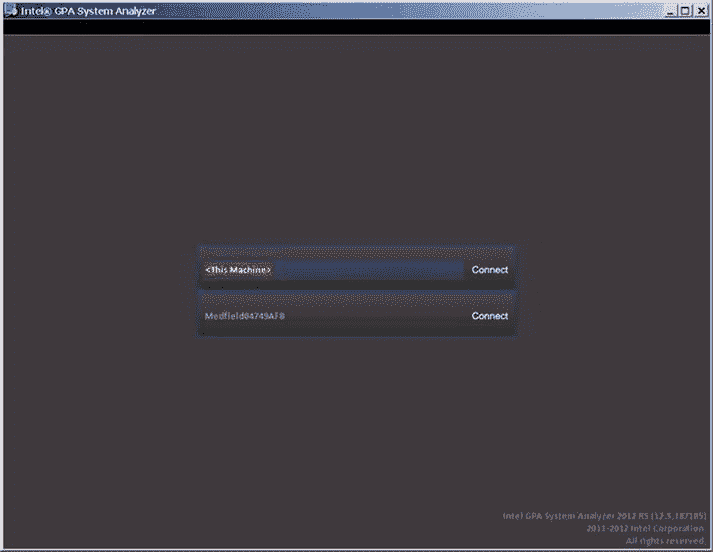
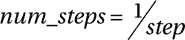
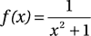
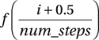

# 九、x86 平台上 Android 应用的性能优化

就像生活中的许多其他事情一样，你很少只得到你优化过的东西。

-埃里克大帝

性能优化是每个应用开发人员一直想要追求的重要目标之一，无论该应用是用于一般的桌面 Windows 计算机还是 Android 设备。Android 是一个资源有限的系统，因此在空间和处理时间上需要非常严格的资源利用。因此，与桌面系统相比，Android 应用的性能优化更加重要。

不同的应用需要不同的优化重点。Android 系统的性能优化通常分为三类:

*   优化应用的运行速度
*   代码大小
*   优化以降低功耗

一般来说，基于英特尔凌动处理器的 Android 系统的存储空间和成本并不是瓶颈，因此在本章中，我们将重点讨论如何通过性能优化来提高应用的运行速度。

我们将首先介绍 SOC 性能优化的基本原理。接下来，我们将介绍在英特尔架构上运行的 Android 应用的性能优化原则和方法。我们将讨论使用原生开发套件的 Android 应用开发，并分享使用特定工具(如英特尔图形性能分析器)的具体案例研究。

性能优化的基本概念

优化旨在减少根据规格准确完成特定任务所需的时间。这是通过基于硬件或软件优化的应用的结构调整或重构来实现的。

有几个与应用性能优化结果相关的基本原则需要遵循:

*   *等值原则*:性能优化后，应用执行的结果没有变化。
*   *功效原理*:性能优化后，目标代码运行速度更快。
*   *组合值原则*:有时候，性能优化在某些方面获得了性能提升，但在另一些方面却降低了性能。在决定是否需要性能优化时，需要考虑综合的整体性能。

性能优化的一个重要考虑因素是用空间换取时间。例如，为了进行函数计算，可以预先计算函数值，并将其作为表格放入程序存储区(内存)。当程序运行时，为了减少执行时间，程序可以直接从表中获取值，而不是花费时间对函数进行重复计算来获取值。对于搜索操作，这可以使用散列方法在大空间上完成。

性能优化最常用的方法是减少指令和执行频率。比如从数据结构和算法的角度来看，冒泡排序中比较和交换的指令需要执行 O(n <sup>2</sup> 次。然而，通过使用快速排序，指令时间减少到 O(n log n)次。在循环优化中，代码编译可以将无关的公共代码从循环中提取出来，并将公共代码的执行时间从 n 减少到 1，从而大幅降低执行频率。此外，C 和 C++ 支持的内嵌函数可用于更改函数调用、函数调用的指令以及返回指令的实现。

选择更快的指令

利用不同的指令可以实现相同的功能。不同的指令需要不同的机器时钟周期，因此执行时间也大不相同。这给了我们选择使用更快指令的机会。

降低计算强度是通过选择更快的指令集来实现性能优化的一个典型例子。例如，要将一个整数乘以 4，运算可以通过将运算符左移两位来完成。移位指令占用的时钟周期比乘法和除法指令少得多，运行速度也快得多。

这类优化的另一个例子是使用硬件提供的特殊指令来代替通用指令，以实现更快的指令执行。例如，英特尔凌动处理器提供流 SIMD 扩展(SSE) 指令集支持。对于向量运算，SSE 指令应始终用于完成运算，因为它们运行得更快，这得益于指令级并行处理。英特尔凌动处理器的普通加法指令宽度为 32 位，而 SSE 指令能够处理四倍于 32 位的数据。因此，使用 SSE 指令的优化代码大大缩短了耗时。

提高并行度

并行度可以在多个层面提高，包括指令、表达式、函数、线程。

包括英特尔凌动处理器在内的许多现代嵌入式处理器都支持指令流水线执行。这实现了一种称为指令级并行的优化方法。代码链可以分解为几个不依赖于链的代码单元，并且可以在流水线中并行执行。

此外，许多嵌入式系统处理器，如英特尔凌动处理器，在物理上支持线程的并发执行。使用适当数量的并发线程而不是单线程可以提高运行速度。为了利用线程并发优化的优势，程序员需要有意识地采用多线程技术；有时优化需要在编译器的支持下完成。

寄存器缓存的有效使用

进出高速缓存寄存器的读写比进出内存的读写要快得多。缓存优化的目标是尝试将正在使用和经常使用的数据和指令放入缓存，以提高缓存命中率并减少缓存冲突。缓存优化经常出现在嵌套循环的优化过程中。寄存器优化包括有效地使用寄存器，并尽可能多地将频繁使用的数据保存在寄存器中。

缓存基于局部性。也就是说，高速缓存假定要使用的数据位于已经在使用的最新数据中，或者在它们自己的寄存器附近。这被称为*局域性原理* 或*局域性原理*，它深深地影响着硬件、软件和系统的设计和性能。处理器所需的指令和数据总是首先被高速缓存访问读取。如果高速缓存有需要的数据，处理器总是直接访问高速缓存。在这种情况下，这种访问被称为高速*缓存命中*。如果高速缓存不包含所需的数据，这被称为失败命中或*缓存未命中*。

如果发生这种情况，处理器需要将数据从内存复制到高速缓存中。如果高速缓存的相应位置已经被其他数据占用，缓存中不再需要的数据将需要被清除并写回内存。失败的命中将导致访问时间急剧增加；因此，提高缓存效率的目标是提高命中率和降低故障率。缓存和内存之间的数据交换是通过块单元执行的，块单元用于将所需的数据复制或回写块到内存中。

局部性描述了将被访问或引用的数据位置收集到可预测的群集中的方式，以便于处理器将来引用。有两种重要的局部性情况，简要解释如下:

*   *空间局部性* :当一个特定的数据对象被引用时，统计上很可能在不久的将来会引用附近*的*数据。相邻数据的一部分被标记为单个块，以便处理器能够更快地访问该位置。
*   *时间局部性* :当一个特定的数据对象被引用时，在统计上也有可能在不久的将来再次引用*相同的*数据。被引用的数据被移动到高速缓存中，以便在新的位置可以更快地被引用。

性能优化的方法

性能优化有许多方法和技术。可以同时利用一个或多个综合优化原则，例如修改源代码以运行得更快。根据分类标准的类型，优化方法可以分为不同的类别。

依赖于机器的优化只能在特定的硬件或架构上进行。例如，将普通矢量指令计算切换到 SSE 指令的优化依赖于英特尔凌动处理器的许多底层细节，只能在支持 SSE 指令的英特尔处理器上使用。很难在具有不同架构的其他机器上使用这种优化，例如 ARM 或未指定的架构。一般来说，与机器无关的优化的复杂性高于与机器相关的优化，并且难以实现。

性能优化方法

在理想的情况下，编译器应该能够编译我们编写的任何代码，并将其优化为最有效的机器代码。但事实是，编译器实际上只能自动化所有可能的优化中的一部分，因为有些优化可能会被编译器的优化阻止程序默认阻止。一般来说，根据人工或自动化工具的作用大小，性能优化方法可以分为三大类:

*   由编译器自动完成的性能优化
*   借助开发工具完成的性能优化
*   由程序员手动完成的性能优化

下面几节介绍了开发人员实现性能优化的几种途径和方法。

由编译器自动完成的性能优化

现代编译器自动完成最常见的代码优化。由编译器完成的这些自动优化也称为编译器优化或编译优化。编译器优化需要由适当的扩展选项或开关变量来触发。

Android 应用的 C/C++ 代码优化可以通过位于本机开发工具包中的 GNU 编译器集合工具来实现。我们将在下一章详细讨论这个话题。

由开发工具 辅助的性能优化

要实现一个大型程序的整体综合优化是非常困难的。幸运的是，对于基于英特尔架构的应用，有许多有用的工具可以帮助用户完成优化。例如，英特尔 Profiler、图形性能分析器(GPA) 、电源监控工具和其他工具可以帮助用户分析程序，并指导他们完成完整的优化。

VTune 和 GPA 是英特尔产品开发工具的一部分，只能用于英特尔处理器，如英特尔凌动处理器。英特尔档案器是一个 GNU 链工具，可用于所有类型的处理器。它可以用来创建一个分析过程，显示程序的哪些区域执行频繁并使用更多的计算资源，哪些区域实现不频繁。分析数据为开发人员完成优化提供了有价值的信息。

profile-guided optimization(PGO)的一个典型例子就是 switch 语句的优化(比如 C#的 switch-case 语句)。在本例中，根据收集的样本运行的概要，在获得每个 case 语句的实际出现频率后，case 语句在 switch 语句中按频率顺序排序。最频繁出现的语句被移到前面(这些语句的执行需要最少的比较次数)，以便用最少的比较次数获得最佳结果。在 GNU 术语中，这个过程被称为概要引导优化(PGO)。

与 GNU 评测器一样，英特尔 VTune 能够定位程序中的热点。热点区域指的是执行时间长的程序代码段(这意味着计算能力更强)。借助 VTune，程序员可以找到耗时的代码段，然后采取措施优化这些代码。与 GNU 档案器相比，VTune 具有更高的分辨率(精细粒度)和更多定位热点的功能，包括显示程序的汇编代码、失败的缓存命中以及英特尔处理器的分支预测失误事件。

英特尔 GPA 最初是一种用于图形处理单元(GPU)分析的开发工具。它现在已经发展成为一个用于 CPU 速度分析、定制和设备功耗分析的综合工具。英特尔 GPA 可用于获取 CPU 负载、工作频率和功耗信息。它可以指导用户优化应用，尤其是多线程优化。英特尔 GPA 不仅是一个速度优化工具，也是一个非常方便的功耗优化工具。

有了优化工具，开发人员不再需要在试图寻找大型程序优化的起点时迷失方向和感到困惑。这些工具允许您轻松定位最需要优化的区域，也就是最有可能出现问题的代码段。快速找到热点可以让您用更少的时间和精力实现优化。当然，典型的性能优化是复杂的。工具只是起到指导和支持的作用——真正的优化还是需要编译器或者开发者手动完成。

高性能库的使用

高性能库 是一组软件库，通常由硬件原始设备制造商(OEM)开发，提供一些常用的操作和服务。这些库代码基于处理器特性的组合进行了精心优化，并且具有比普通代码更高的计算速度。简而言之，高性能数据库是通过各种方法优化的库，这些方法利用了处理器的全部潜力。例如，英特尔集成性能基元(IPP)库已经基于面向处理器的 SSE 指令、超线程/多线程并行流水线执行和瀑布流程进行了优化。与未优化的代码相比，英特尔 IPP 库可以提高英特尔处理器的处理能力并节省功耗。对于一些重要的代码和算法，使用高性能库实际上是一种简单、实用的优化方法，并提供了“站在巨人的肩膀上”的好处英特尔 IPP 是英特尔的高性能库之一。它是英特尔处理器的函数库，包括英特尔凌动处理器和英特尔芯片组。英特尔 IPP 功能强大；它可用于数学计算、信号处理、多媒体、图像和图形处理、向量计算和其他领域。英特尔 IPP 采用 C/C++ 编程接口。

手动完成性能优化

在优化的各个阶段，人的因素不应该被忽略。一些高级全局优化，如算法和数据结构的优化，不能由编译器自动完成。优化必须由人工完成。作为程序员，为了写出高效的代码，有必要学习各种算法和优化技术，养成良好的编程习惯和风格。即使编译器可以自动完成优化，仍然需要程序员的额外帮助来编写以下级别的高效代码:

*   *源代码(*即高级语言*)级优化* :这种优化是由程序员在源代码级完成的。程序员使用高级语言源代码的表达式来修改和转换程序。
*   *汇编语言级优化* :有时使用高级语言并不足以达到最佳效果，程序员可能需要修改代码，使其降到汇编语言级。在一些关键的计算领域，尽管汇编级优化的过程很繁琐，但结果的性能优势是值得的。
*   *编译指令级优化* :这是一种由执行者通过添加和修改编译器指令来完成的优化，例如典型的编译器指令修改“pragma”和/或增加 OpenMP 中的并行度。

程序交互优化是编程艺术的真实反映，其完成程度符合“人机合一”的理想这种统一是本章的重点。相对而言，在汇编语言级别或指令级别的编译阶段执行的优化要求程序员在处理器架构、硬件、系统等方面拥有全面的专业知识。因此，对于基于英特尔架构的 Android 系统，我们建议在源代码级别进行性能优化。在下面的例子中，我们重点介绍 Android 多线程设计的性能优化。

毫无疑问，优化可以通过多种方式完成，这些方式相互关联，在结构上不可分割，但每种方式都有其独特的功能。整个过程如图图 9-1 所示。


图 9-1。推荐用户优化

如图图 9-1 所示，编译器优化、手动优化和高性能库函数是捆绑在一起的。它们是优化的最后步骤。为了修改源代码，需要使用手动优化和高性能库。在开始这些优化之前，使用优化工具分析程序已被证明对开发人员非常有益，并且是一个必不可少的步骤。

使用英特尔 VTune 进行性能调整

对于 Linux 平台，概要分析是最重要的软件性能分析类型。概要分析通常包括用户在各种工具的帮助下分析和识别需要优化的源代码。分析运行在英特尔处理器上的软件性能的最佳工具是英特尔 VTune 系列产品。

英特尔 VTune 性能放大器 (通常称为 VTune 分析器或 VTune)是一款性能分析软件，是英特尔处理器的有用优化工具。凭借分析程序性能的能力，VTune 可以帮助并指导程序员和编译器优化各种应用。VTune 提供用户友好的图形用户界面，不需要重新编译应用。性能分析可以直接在可执行应用上进行。VTune 适用于从嵌入式系统到超级计算机的各种应用，具有跨平台能力，可以在 Android、Tizen、Windows、Linux、Mac OS 等平台上运行。

VTune 基于热点区域分析来指导和支持应用的性能优化。热点是需要过长执行时间的代码段。除了热点分析之外，用户还需要考虑是什么导致了热点以及如何解决它。对于高级用户，VTune 可用于跟踪关键函数调用，监控特殊的 CPU 事件(如缓存未命中)，以及执行一系列其它高级功能。

英特尔不断为 VTune 性能分析器添加功能，并在 2012 年将其重命名为工具。该公司的前身是带有英特尔线程档案器的英特尔 VTune 性能分析器，现更名为英特尔 VTune Amplifier XE。更新后的工具包括英特尔并行放大器的所有特性和功能，还为需要深入研究问题的程序员提供了一些高级特性。其主要功能将在以下章节中介绍。

如图 9-2 所示，VTune 性能放大器列出程序的整个运行时间，以及最耗时的前五个函数的信息(当程序的函数少于五个时，它只列出实际的函数号)，例如前五个函数所用的运行时间占整个程序总运行时间的百分比。


图 9-2。 VTune 运行时间与统计

VTune 提供运行时统计数据,具体到指向单个代码行的指针，可以帮助用户定位哪些代码段最耗时。如图图 9-3 所示，VTune 显示程序源代码语句的运行时间(滴答、时钟滴答)占总消耗时间和指令完成时间(失效指令)的百分比。


图 9-3 。VTune 显示最耗时的源代码行

VTune 在调用图中以直观的方式显示程序函数调用关系，如图图 9-4 所示，其中函数调用以图形形式显示。在显示中高亮显示，从根到当前函数的函数调用关系称为*关键路径* (也称为*焦点函数* )。


图 9-4 。函数调用关系的 VTune 调用图

VTune 可以直接显示在与目标文件对应的源代码中的汇编代码中。图 9-5 显示了程序功能对应的汇编代码。有了这个特性，用户可以进行编译分析，定位耗时的代码，并执行汇编级优化。


图 9-5 。VTune 中的汇编代码与源代码

VTune 提供图形界面，显示时间及其它处理器事件的统计数据，包括缓存未命中、分支预测失误及其它信息。图 9-6 显示了对应于应用四个线程的处理器事件的统计数据。四个线程中的每一个都包括三个条形:顶部条形，表示执行指令时发生的时钟信号数的平均消耗(每条失效指令的时钟信号数)；中间的条形显示消耗的最大时钟周期数(时钟信号)；底部条表示已经完成的指令(失效的指令)。


图 9-6 。其它处理器事件的 VTune 显示

VTune 可以显示应用的 CPU 使用情况，以及应用并发程度的分布。信息可以用来分析并行度。图 9-7 是使用英特尔凌动 N270 处理器的设备上一个应用的 1000HC 截图。


图 9-7 。线程和 CPU 使用分布

英特尔凌动 N270 是一款单核处理器，但它支持英特尔超线程技术。应用使用两个线程来计算图 9-7 中所示力矩的平行度。CPU 利用率(CPU 时间)可以高达 200%。

通过比较前面介绍的 VTune 特性，我们可以按照调整的使用方式(优化分析)对这些特性进行分类。总之，VTune 函数调整可以分为三个级别，下面几节将对此进行介绍。

系统调整

系统调谐是 VTune Amplifier XE 的设计目的，但不是应用优化的主要目标。系统调优的目的是更改内存页面上的硬件配置，如网络带宽、每秒磁盘读/写操作数和命中故障。系统调优和优化主要是针对原设备厂商的产品。然而，作为一种高级工具，VTune 还可以用于实现某些辅助优化，例如锁定和等待分析。在这里，VTune 可以测量网络套接字对象完成磁盘写 I/O 的等待时间，这可以配置为减少线程到块的等待时间。另一个用途是运行热点分析并查找热点。如果结果适用，您可以通过手动添加线程化任务来并行化您的代码，或者您可以使用编译器通过英特尔线程构建模块(TBB)自动并行化代码。当然，您也可以通过检查函数调用关系和删除重复计算来调整或调优算法，以减少函数调用的数量。

在另一个场景中，程序已经并行化，您需要 VTune 运行*并行分析* 来确定程序的并行度，并运行热点分析来查找热点以及热点处的并行度。当热点处的并行度较低时(例如在线程不与其他线程并行的情况下，函数消耗大部分 CPU 时间)，两个可能的原因是每个线程的任务分配不均匀，这可以通过调整算法来优化，以及*线程阻塞* (等待时间)，这是由共享资源或另一个线程持有的“锁”引起的。您可以使用 VTune 进行锁定，并等待分析找出阻塞的原因。在这种情况下，您需要确定是否需要在其他线程中占有共享资源，以及是否优化了时间。解决方案是尽可能地减少热区以减少数据依赖性，或者使用更“轻量级”的锁

基于处理器微体系结构的调整

当调整基于处理器的微体系结构时，开发人员通常需要对处理器有详细的了解。这通常会给应用开发人员带来困难，但当在热点分析中发现太多热点(或调用太多热点函数)时，特定于处理器的调整是必要的。在前面描述的两个不同级别的调整中，算法调整对应用优化最有用。

VTune 的两种模式

当 VTune 处于本地模式时，被测试程序的分析和 VTune 本身在同一台机器上工作。在远程模式下，应用的测试在一台机器上进行，VTune 安装在另一台机器上。对于台式机，VTune 一般用在本地模式，相对简单。Android 系统通常用于远程模式。在这里，VTune 安装在 Ubuntu/Win/MAC 开发系统上，大多数开发和 SDK 都位于该系统中，Android 设备通过 USB 网线或 Wi-Fi 网络连接到开发系统。

英特尔为非商业用途提供 VTune 的免费试用版，通常持续一年。还为学生和学术机构提供特殊折扣价格。读者可以去英特尔官方网站(`http://www.intel.com`)下载 Linux 版本的 VTune Amplifier XE。在下载之前，英特尔会让您填写电子邮件信息，序列号会发送给您。以下内容摘自英特尔 VTune Amplifier XE 2011 下载。

您已经注册了英特尔 VTune Amplifier XE Linux*版(以前称为 VTune 性能分析器 Linux *版)。您将收到一封电子邮件，其中包含下面列出的序列号以及供您将来参考的下载链接:

```java
... ...

Serial Number:XXXX-XXXXXXXX

File to download: Install Package for IA-32 and Intel 64 (143 MB)

... ...

Intel VTune Amplifier XE for Linux*

Download:

Install Package for IA-32 and Intel 64

......
```

当读者前往下载链接时，序列号将显示为 XXXX-XXXXXXXX。将名为 vtune _ amplifier _ xe _ 2011 _ update 4 . tar . gz 的软件包(文件大小约为 150 MB)下载到本地驱动器并安装。

请注意，要在 Android 设备上安装和使用 VTune，您需要相应的驱动程序支持。需要使用 Android 课程代码编译和生成驱动程序。典型的用户很少能接触到或者熟悉 Android 设备的源代码。驱动准备一般是 Android 设备 OEM 生产的。大多数厂商都不愿意给商业级设备(比如手机)安装相关驱动，甚至连 root 权限都不开放。对于非 OEM 用户来说，在 Android 设备上本地使用 VTune 仍然是一个挑战，因为有些系统级配置只有 Android 系统工程师才能处理。然而，英特尔正在加紧开发和改进 VTune 在 Android 上的使用，估计在不久的将来，应用开发人员、学生和学术界可以访问强大的 VTune 工具，并在 Android 设备上本地使用它。

英特尔图形性能分析器

英特尔图形性能分析器(英特尔 GPA) 是一套优化和分析工具，仅用于支持基于英特尔酷睿和英特尔凌动处理器的硬件平台的英特尔处理器。英特尔 GPA 为 CPU/GPU 速度分析和定制功能提供了图形用户界面。它使开发人员能够发现性能瓶颈，并针对基于英特尔芯片组平台的设备优化应用。英特尔 GPA 由系统分析器、帧分析器和软件开发套件(SDK)组成。

介绍

英特尔 GPA 支持运行在英特尔凌动处理器上的所有 Android 设备。该套件提供以下功能:

*   实时显示几十个关键指标，包括 CPU、GPU 和 OpenGL ES API
*   几个图形管道测试，即时提供以隔离图形瓶颈
*   与作为主机开发系统的 Microsoft Windows 或 Ubuntu OS 兼容

英特尔 GPA 目前仅支持使用英特尔凌动处理器的真实 Android 设备，不支持对 Android 虚拟设备(AVD)的分析。面向 Android 的英特尔 GPA 使用 Android 应用交叉开发中常用的典型硬件部署模型，其中主机系统(Windows 或 Ubuntu)和目标设备(Android 基于英特尔的设备)通过 USB 连接进行连接，以监控 Android 应用。Android GPA 在 Android Debug Bridge utility (adb，此处绑定到本地服务器)上运行，以实现对目标 Android 设备上的应用的监控。adb(服务器)运行在 Android 设备上，GPA 作为 adb 客户端应用运行在主机系统上，实现目标机监控。GPA 配置如图图 9-8 所示。


图 9-8 。英特尔 GPA 配置，用于监控 Android 设备上的应用

鉴于英特尔 GPA 是基于 adb 来工作的，开发人员应该谨慎。由于 Eclipse 和 DDMS 也使用 adb，如果 GPA、DDMS 和 Eclipse 由于服务器冲突同时运行，英特尔 GPA 可能无法正常工作。使用英特尔 GPA 时，最好关闭其他 Android 软件开发工具，如 Eclipse 或 DDMS。图 9-9 显示了在 Android 设备上监控运行的应用过程中的英特尔 GPA 图形界面。


图 9-9 。GPA 图形界面监控 Android 设备上运行的应用

如联想 K800 智能手机的截图图 9-9 所示，GPA 界面显示两个框架和一个工具栏窗格。指标工具栏显示被测量的指标，这些指标以树形结构组织，如下所示:

*   在 CPU 指标下是聚合的 CPU 负载、CPU XX 负载、CPU XX 频率、目标应用 CPU 负载等。CPU XX 号由英特尔 GPA 监控的 CPU 数量决定。要获得 CPU 信息，如内核数量、型号和频率，我们可以在终端窗口使用 cat/proc/cpuinfo 命令。图中的联想 K800 智能手机采用了单核英特尔凌动 Z2460 处理器。该图显示了支持英特尔超线程技术(HTT)的两个逻辑处理器。因此，CPU 负载和 CPU 频率中显示的两个项目被索引为 00 和 01。在 CPU XX Load 中，XX 是 CPU 编号:它显示 CPU XX 的负载状态，而 CPU XX Frequency 显示 CPU XX 的频率状态。汇总的 CPU 负载是 CPU 的总负载。目标应用 CPU 负载是目标设备上应用的 CPU 负载。
*   在设备 IO 指标下是磁盘读取、磁盘写入、网络接收和网络发送项目，它们分别列出了磁盘读取、磁盘写入以及通过网络发送和接收的数据包的状态和信息。
*   内存指标下是应用驻留内存、可用内存等。
*   在功率度量下是电流充电和电流放电，它们提供充电和放电的状态。

默认情况下，右窗格显示两个实时状态显示窗口。这些窗口显示指定指示器的类似示波器的状态。横轴表示经过的时间，纵轴表示相应指示器的值。用户可以将索引条目从左窗格拖放到两个窗口之一，该条目的实时指示器将显示在窗口中。在图 9-9 中，CPU 00 负载被拖放到顶部显示窗口，CPU 01 负载被拖放到底部显示窗口，垂直轴显示 CPU 利用率。最大利用率为 100%。

在实时状态显示窗口的上方是工具栏，提供截图和暂停显示等工具。用户可以使用这些工具来实现一些辅助功能。

安装

托管英特尔 GPA 可以在 Windows 或 Ubuntu 中完成。以下部分给出了适用于 Windows 平台的英特尔 GPA 安装流程示例。用户可以参考英特尔 GPA 发行说明或相关的英特尔 GPA 网站，了解在 Ubuntu 平台上的安装过程和使用方法。

英特尔 GPA 要求安装 4.0 版或更高版本的。NET Framework 安装为在 Windows 平台上运行。在 Windows 平台上安装英特尔 GPA 包括两个主要步骤:第一步是安装。Net 框架，第二步是真正的英特尔 GPA 安装。下面是在 Windows 主机平台上安装英特尔 GPA 的详细分步说明。

1.  **Install .Net Framework.**

    。Net Framework v4.0 版用于这些指令。确保您的计算机上安装了最新的 Windows service pack 和关键更新。如果平台是 64 位版本的 XP 或 Windows 2003，您可能需要安装 Windows 映像组件。要安装它，请访问`http://www.microsoft.com/en-us/download/details.aspx?id=17851`并下载。Net 框架 4.0。

    接下来双击 dotNetFx40_Full_setup.exe，出现图 9-10(a) 所示的弹出窗口界面，开始安装。按照逐步安装提示完成安装。

    

    

    图 9-10 。Net Framework 4.0 安装界面

2.  **Install Intel GPA**

    安装先决条件如下:确保您的计算机上安装了最新的 Windows service pack 和关键更新。用户可以直接去英特尔官方网站下载英特尔 GPA(这里测试用的是 GPA _ 12.5 _ release _ 187105 _ windows . exe 版本):`http://intel.com/software/gpa`或者`http://software.intel.com/en-us/vcsource/tools/intel-gpa` `,`如图图 9-11 。双击 GPA _ 12.5 _ release _ 187105 _ windows . exe 运行程序。这是一个自解压文件。未压缩的文件保存在原始文件所在的文件夹中。双击解压缩文件夹中的 setup.exe 进行安装。

    

    图 9-11 。英特尔 GPA 软件下载网站

    双击 GPA _ 12.5 _ release _ 187105 _ windows . exe 运行程序，该程序为自解压文件；未压缩的文件保存在原始文件所在的文件夹中。

    接下来，双击解压后的文件夹中的 setup.exe，如上所示进行安装。

    如果。如果没有安装. Net Framework，将出现英特尔 GPA 必备设置 并提示用户必要的信息，如图图 9-12 所示。

    

    图 9-12 。英特尔 GPA 安装弹出窗口。找不到. Net Framework

    单击安装按钮。出现如图图 9-13 所示的对话框。

    

    图 9-13 。安装对话框

    一旦安装了先决条件，您将返回到安装英特尔 GPA 的第一步。英特尔 GPA 的安装进度条如图 9-14 所示。

    

    图 9-14 。英特尔 GPA 安装的进度条

    一旦英特尔 GPA 加载完毕，如图 9-15(a) 所示，点击下一步继续。英特尔 GPA 将测试兼容性和硬件支持，并提醒您下一步，如图图 9-15(b) 所示。单击确认继续。

    

    

    图 9-15 。英特尔 GPA 安装的消息框

    图 9-16 显示了目标文件夹选择框(在这个例子中，你会选择 D:\GPA\2012 R5)。

    

    图 9-16 。英特尔 GPA 目标文件夹选择

    按照逐步说明完成安装。

英特尔 GPA 在 Android 上的使用示例

以下示例展示了如何使用英特尔 GPA 监控 Android 设备上的应用。在本例中，目标机器是运行英特尔凌动处理器的联想 K800 智能手机。

在英特尔 GPA 能够监控 Android 设备上的应用之前，必须使用 Eclipse 来设置特定的应用参数。然后，应用可以由 Eclipse 生成和部署、运行和监控。

我们在此使用的英特尔 GPA 监控示例应用是 MoveCircle。操作界面如图 9-17(a) 所示。

该应用是一个简单的拖动游戏。用户界面是一个简单的圆形。当用户触摸圆圈内的任何一点并拖动它时，一个黑色的圆圈将跟随触摸点并四处移动。当用户停止触摸圆圈中的点时，圆圈将变得静止。此时，当用户将圆拖动到圆外(即，该圆内的初始触摸点)时，圆不会移动。如果用户按下手机的后退键，就会弹出退出对话框。选择退出将允许您退出应用，如图图 9-17(b) 所示。


图 9-17 。MoveCircle 应用

应用的主要计算任务发生在拖动圆的过程中。您需要不断计算圆的新位置并刷新(重画)显示。

以下是英特尔 GPA 监控示例应用的步骤:

1.  在 Eclipse 中构建和部署将由英特尔 GPA 监控的应用。
2.  使用常规过程创建应用项目。将应用命名为 MoveCircle。
3.  Write the related code for the project. The document framework is shown in Figure 9-18.

    

    图 9-18 。应用 MoveCircle 的文档框架

4.  Edit the AndroidManifest.xml file and add the following code:

    ```java
    1.      <manifest xmlns:android="http://schemas.android.com/apk/res/android"
    2.          package="com.example.movecircle"
    3.          android:versionCode="1"
    4.          android:versionName="1.0" >
    5.
    6.          <uses-sdk
    7.              android:minSdkVersion="8"
    8.              android:targetSdkVersion="15" />
    9.              <uses-permission android:name="android.permission.INTERNET"/>
    10.
    11.         <application
    12.             android:icon="@drawable/ic_launcher"
    13.             android:debuggable="true"
    14.             android:label="@string/app_name"
    15.             android:theme="@style/AppTheme" >
    16.             <activity
    17.                 android:name=".MainActivity"
    18.                 android:label="@string/title_activity_main" >
    19.                 <intent-filter>
    20.                     <action
    21.     android:name="android.intent.action.MAIN" />

    22.                     <category android:name="android.intent.category.LAUNCHER" />
    23.                 </intent-filter>
    24.             </activity>
    25.         </application>
    26.
    27.     </manifest>
    ```

    在第 9 行，我们添加了 uses-permission 元素的描述 ，这是应用的同一级别，我们授予应用的 Internet 写/读访问权限。在第 13 行，我们指定应用是可调试的。

5.  生成应用包并将应用部署到真正的目标设备。在开始下一步之前，一定要关闭 Eclipse。
6.  Start Intel GPA on the host machine to monitor the application
    1.  将 Android 手机连接到 PC。确保屏幕没有被锁定，否则您可能会得到错误的错误不成功的电话连接。
    2.  确保关闭所有使用亚行服务器的工具，如 Eclipse 和 DDMS。否则，您可能会得到错误不成功的电话连接。(可跳过此步骤)确保 adb 服务器已启动并正在运行(参见图 9-19 )。

    

    图 9-19 。亚行服务器显示我们的医疗设备

7.  选择 Windows 菜单“开始\程序\英特尔图形性能分析器 2012 RS \英特尔 GPA 系统分析器”启动英特尔 GPA。
8.  The Intel GPA initial window then pops up, suggesting the machine that will be monitored, as shown in Figure 9-20. Since the tuning target is a phone in this case, select the phone (in this case the Medfield04749AFB) by clicking the Connect button to the right of name of the phone.

    

    图 9-20 。用于连接受监控设备的英特尔 GPA 接口

9.  Once you are connected, Intel GPA does an initial analysis of the applications installed on the monitored smartphone, dividing the apps into two groups: analyzable applications and nonanalyzable applications, as shown in Figure 9-21.

    

    图 9-21 。英特尔 GPA 连接到受监控的手机设备后的初始界面(应用列表)

    窗口顶部是可分析的应用类别，可通过英特尔 GPA 进行调整或调试。不可分析的应用列在底部面板中。在可分析的应用列表中，您可以看到我们用作英特尔 GPA 监控练习示例的 MoveCircle 应用。英特尔 GPA 无法分析应用的原因通常是因为其参数的设置方式与我们在本节课前面所述的方式不同。

10.  Click the name of the application that you want Intel GPA to monitor in the Analyzable applications window (in this case, MoveCircle). An icon of a rolling circle showing ongoing progress appears on the left side of the app (MoveCircle). See Figure 9-22.

    

    图 9-22 。英特尔 GPA 中的应用初始化接口

    此时，手机上会显示应用启动屏幕。屏幕会提示您正在等待调试器，如图图 9-23 所示。请注意，您不应该单击强制关闭按钮，而是应该等到消息框在界面中自动关闭。

    

    图 9-23 。当英特尔 GPA 开始监控应用时，目标手机上出现初始消息

11.  Next, Intel GPA monitoring interface appears, as shown in Figure 9-24.

    

    图 9-24 。应用启动时，英特尔 GPA 上显示的初始监控界面

    与此同时，MoveCircle 应用开始在手机上运行，如图图 9-25 所示。

    

    图 9-25 。显示在目标手机设备上的 MoveCircle 应用

    将 CPU 00 负载拖放到显示窗口顶部的实时状态显示面板上，将 CPU 01 负载拖放到显示窗口底部的实时状态显示面板上。单击并拖动移动圆几秒钟，然后停止交互几秒钟。相应的英特尔 GPA 监控屏幕如图 9-26 所示。

    

    图 9-26 。英特尔 GPA 监控 MoveCircle 应用并实时显示 CPU 负载

    在图 9-26 中，我们可以看到一个规律:当我们拖动圆圈时，两个 CPU 负载都会上升到一定高度；当我们不与应用交互时，两个 CPU 的负载将立即下降到接近 0%。应用的主要计算任务集中在拖动和移动圆上，当不移动圆时，没有或只有很低的 CPU 负载。

    要结束英特尔 GPA 分析，请退出应用，如图 9-17(b) 所示。英特尔 GPA 将返回到图 9-20 所示的启动界面。

    前面的示例只演示了对 CPU 负载的监控。感兴趣的读者可以尝试其他应用示例和其他监控指标。以 MoveCircle 应用为例，我们为顶部显示窗口选择了磁盘读取指标，为底部显示窗口选择了磁盘写入指标。然后我们交换了应用，查看了一些照片文件。当我们回到 MoveCircle app 时，磁盘读取的即时动作显示了磁盘读取活动的存在，如图图 9-27 所示。

    

    图 9-27 。英特尔 GPA 监控窗口显示 MoveCircle 应用和其他应用的磁盘读取

Android 多线程设计

英特尔凌动处理器支持超线程和多核配置。多线程设计是增加并行度和提高性能的好方法。英特尔凌动 N 系列处理器支持多线程的并行执行。虽然大多数用于手机和其他移动设备的英特尔凌动 Z 系列处理器都是单核处理器，但它们支持英特尔超线程技术。因此，Z 系列处理器构成了两个或四个逻辑 CPU，并在物理上支持一定程度的并行执行。

请注意，这里使用的词是平行的，而不是并发的。对于某些任务，我们可以遵循并行计算中称为“分而治之”的经典方法论，将它们分成两个或更多个基本单元。我们将这些单元分配给不同的线程同时执行。通过这种方式，处理器的性能潜力得到了充分利用，从而加快了执行速度，使软件运行得更快、更高效。

基于 Java 多线程编程接口，Android 扩展为 Android 开发者提供了更强大的多线程编程接口。借助这个编程接口，开发人员可以轻松实现 Java 语言级别的多线程开发和设计，而无需使用繁琐的底层操作系统 interface。

Android 框架还是一个线程

Android 线程编程框架 基于 Java。Java 中实现多线程编程有两种方法。第一种是从 Thread 类继承并重写 run 方法。第二是实现 Runnable 接口和 run 方法。

Java 线程编程接口

实现多线程编程的第一种方法(从线程继承)的一般代码框架如下:首先，定义线程类(在本例中，称为`MyThread`的线程类)及其代码，如图图 9-28 所示。


图 9-28 。示例自定义线程类

然后，创建一个我们自定义的线程类的实例并启动它，如图图 9-29 所示。


图 9-29 。开始线程

等待线程结束，如果出现问题就进行处理，如图图 9-30 所示。


图 9-30 。等待线程完成

用 Java 实现多线程编程的第二种方法是使用 Runnable 接口实现。以下是 Runnable 的通用代码框架。第一步是创建一个自定义的可运行接口，如图图 9-31 所示。


图 9-31 。自定义可运行

接下来，您需要实际启动线程并给它一个 Runnable。如图图 9-32 所示。


图 9-32 。开始线程

这两种方法效果相同，只是使用的场合不同。熟悉 Java 的开发者都知道，它没有*多重继承*，所以用接口实现代替。要单独实现一个线程，可以使用第一种方法，线程继承。

但是有些类本身是从另一个类继承而来的。在这种情况下，如果希望线程运行，就必须使用第二种方法(Runnable 接口方法)来实现线程实现。在这个方法中，您可以声明该类实现 Runnable 接口，然后将作为线程运行的代码放入 run 函数中。这样，它就不会影响它以前的继承层次，也可以作为一个线程来运行。

关于 Java 的线程框架，请注意以下几点:

1.  在 Java 运行时中，系统为线程执行实现了一个线程调度器，用于确定线程在 CPU 上运行的时间。
2.  在 Java 技术中，线程通常是抢占式的，不需要时间片分配过程(给每个线程分配相等的 CPU 时间)。在抢占式调度模型中，所有线程都处于准备运行状态(等待状态)，但实际上只有一个线程在运行。该线程继续运行，直到它终止或者一个更高优先级的线程变得可运行。在这种情况下，低优先级线程终止，并将运行权交给高优先级线程。
3.  Java 线程调度器支持具有不同优先级的线程的这种抢占式方案，但是调度器本身不支持具有相同优先级的线程的时间片轮换。
4.  如果运行 Java 运行时的操作系统支持时间片的旋转，那么 Java 线程调度器支持相同优先级线程的时间片旋转。
5.  不应该过分依赖系统的线程调度程序。例如:低优先级线程也必须获得运行的机会。

关于 Android 应用的 Java 多线程编程方法的更多详细信息，开发者可以参考相关的 Java 编程书籍。

线程编程扩展和支持

Android 运行时，Dalvik 虚拟机支持多个并发 CPU。也就是说，如果机器有不止一个逻辑处理器，Dalvik 虚拟机将遵循某些策略，自动分配不同的线程在不同的 CPU 上运行。这样，Android 可以在物理上并行运行不同的线程。除了 Java 提供的线程编程接口，Android 还提供了重要的扩展和支持。第一个是 Looper-Message 机制。

Android 的界面，包括各种各样的活动，都是在应用的主线程(也称为 UI 线程、接口线程或默认线程)中运行的。默认情况下，应用只有一个线程，即主线程。因此，应用被认为是单线程的。一些耗时的任务(计算)，如果默认运行在主线程上，会导致主界面的交互长时间没有响应。为了防止主界面交互长时间处于停滞状态，应该将那些耗时的任务分配给独立线程来执行。

在后台运行的独立线程(也称为辅助线程或后台线程)经常需要与主线程的接口进行通信，例如通过更新显示接口。如果后台线程调用一个接口对象的函数来更新接口，Android 会给出执行错误消息 CalledFromWrongThreadException。

比如在一个应用中(这里是 GuiExam)，如果一个 worker 线程直接调用界面中 TextView 对象的 setText 函数来更新显示，系统会立即遇到错误，终止正在运行的应用，如图图 9-33 所示。


图 9-33 。工作线程直接调用 UI 对象的函数时运行错误消息

为了使工作线程和主线程接口能够很好地通信，您需要理解循环消息机制。为了解决这样的问题，Android 有一个叫做*消息队列*的机制，其中线程可以由消息队列、处理处理器和 Looper 组件组合起来交换信息。

消息

Java 类消息定义了线程之间交换的信息。当幕后的线程需要更新接口时，它会向 UI 线程(主线程)发送包含数据的消息。

处理者

Handler 类是 Message 类的主处理器，负责发送消息以及消息内容的执行和处理。后台线程利用传入的处理对象，调用 sendMessage 函数发送消息。要使用 Handler 类，您需要一个方法来实现 handleMessage 类，该类负责处理消息操作内容，如更新接口。handleMessage 方法通常需要子类化。

Handler 类本身并不用于打开一个新线程。处理程序更像是主线程的秘书，一个触发器，负责管理来自子线程的更新数据，然后更新主线程中的接口。后台线程处理 sendMessage()方法发送消息，处理程序将回调(自动调用)handleMessage 方法中的处理来处理消息。

消息队列

消息队列用于根据先入先出执行规则存储处理程序发送的消息。对于每个消息队列，都有一个相应的处理程序。该处理程序使用两种方法向消息队列发送消息:sendMessage 或 post。根据先入先出规则，这两种类型的消息将被插入到消息队列的末尾。这两种方法发送的消息以稍微不同的方式执行:sendMessage 发送的消息是一个消息队列对象，将由处理程序的 handleMessage 函数处理，而通过 post 方法发送的消息是一个 runnable 对象，将自动实现。

Android 没有全局消息队列，自动为主线程(UI 线程之一)建立消息队列，但是子线程中还没有建立消息队列，所以必须调用 Looper.getMainLooper()来获取主线程的 Looper。主线程不会循环到 NULL，但是调用 Looper.myLooper()来获取 Looper 的当前线程的循环，就有可能为 NULL。

尺蠖

Looper 类是每个线程的消息队列的管家。循环是处理程序和消息队列之间的桥梁。程序组件首先通过处理程序将消息传递给循环程序，然后循环程序将消息放入队列。

对于应用默认 UI 的主线程，系统已经建立了消息队列和 looper，不需要在源代码中写消息队列和 Looper 操作代码。尽管如此，两者对于默认的主线程都是“透明”的。然而，该处理程序对于默认的主线程是不透明的。为了向主线程发送消息并处理它们，用户必须建立自己的处理程序对象。

异步任务

除了使用 Looper-Message 机制来实现工作线程和 GUI 主线程之间的通信，还可以使用一种叫做*异步任务* (AsyncTask) *机制*的技术来实现通信。使用 AsyncTask 框架的一般过程描述如下:

1.  Implement the AsyncTask according one or several of the following methods:
    *   onPreExecute():在执行之前开始准备工作。
    *   doInBackground(参数...):开始后台执行，在这个里面调用 publishProgress 方法更新实时任务进度。
    *   onProgressUpdate(进度...):publishProgress 方法被调用后，UI 线程会调用该方法来显示任务界面的进度；例如，通过显示进度条。
    *   onPostExecute(Result):操作执行完成后，将结果发送给 UI 线程。

    在这四个函数中，没有一个可以手动调用。除了 doInBackground(参数...)方法，其他三个都是 UI 线程调用的，导致以下需求:

    *   必须在 UI 线程中创建 AsyncTask 实例。
    *   必须在 UI 线程中调用 AsyncTask.execute 函数。

请记住，该任务只能执行一次。多次调用将导致不一致和不确定的结果。

线程示例

运行界面应用 GuiExam 如图 9-34 中所示。这里我们用一个例子来说明 Android 线程化编程的使用。


图 9-34 。多线程代码框架的演示用户界面

如图图 9-34 所示，演示 app 有三个主要的活动按钮:开始线程运行、停止线程运行、退出 App；前两个按钮用于控制辅助线程的操作。点击开始线程运行按钮，线程开始运行，如图图 9-34(b) 所示。点击停止线程运行，线程运行结束，如图图 9-34(c) 所示。工作线程每隔一段时间(在本例中为 0.5 s)刷新输出文本显示 TextView，在屏幕上显示“Done Step。x 从 0 递增到 x。单击“退出”关闭活动并退出应用演示。”

演示应用的结构和程序如下:

1.  Edit the main activity file (in this example: activity_main.xml), delete the originalTextView window component, and then add three buttons and two TextView window components. The properties of Button’s ID are respectively: @+id/startTaskThread,@+id/stopTaskThread,@+id/exitApp. The TextView property is respectively startTaskThread, exitApp, taskThreadOutputInfo, and stopTaskThread. There is one ID of TextView for which the property is set as @+id/taskThreadOuputInfo to display the text output of the worker thread. The TextView Outline for the Demo App is shown in Figure 9-35.

    

    图 9-35 。演示应用 activity_main.xml 中的多线程代码框架

2.  Edit the source code MainActivity.java of activity_main class. The content is listed below:

    ```java
    1.      package com.example.guiexam;
    2.      import android.os.Bundle;
    3.      import android.app.Activity;
    4.      import android.view.Menu;
    5.      import android.widget.Button;
    6.      import android.view.View;
    7.      import android.view.View.OnClickListener;
    8.      import android.os.Process;
    9.      import android.widget.TextView;
    10.     import android.os.Handler;
    11.     import android.os.Message;

    12.     public class MainActivity extends Activity {
    13.            private Button btn_StartTaskThread;
    14.            private Button btn_StopTaskThread;
    15.            private Button btn_ExitApp;
    16.            private TextView threadOutputInfo;
    17.            private MyTaskThread myThread = null;
    18.            private Handler mHandler;;

    19.         @Override
    20.         public void onCreate(Bundle savedInstanceState) {
    21.            super.onCreate(savedInstanceState);
    22.            setContentView(R.layout.activity_main);
    23.            threadOutputInfo = (TextView)findViewById(R.id.taskThreadOuputInfo);
    24.            threadOutputInfo.setText("Thread Not Run");

    25.            mHandler = new Handler() {
    26.                public void handleMessage(Message msg) {
    27.                     switch (msg.what)
    28.                     {
    29.                     case MyTaskThread.MSG_REFRESHINFO:
    30.                             threadOutputInfo.setText((String)(msg.obj));
    31.                             break;
    32.                     default:
    33.                             break;
    34.                     }
    35.                }
    36.            };

    37.            btn_ExitApp = (Button) findViewById(R.id.exitApp);
    // Code for <Exit App>Button
    38.            btn_ExitApp.setOnClickListener(new /*View.*/OnClickListener(){
    39.                public void onClick(View v) {
    40.                                     finish();
    41.                     Process.killProcess(Process.myPid());
    42.                }
    43.            });

    44.            btn_StartTaskThread = (Button) findViewById(R.id.startTaskThread);
    45.    // Code for<Start Thread Run>
    46.            btn_StartTaskThread.setOnClickListener(new /*View.*/OnClickListener(){
    47.                public void onClick(View v) {
    48.                     myThread = new MyTaskThread(mHandler);  // Create a thread
    49.                     myThread.start();       // Start Thread
    50.                     setButtonAvailable();
    51.                 }
    52.            });

    53.            btn_StopTaskThread = (Button) findViewById(R.id.stopTaskThread);
    54.    //code for <Stop Thread Run>
    55.            btn_StopTaskThread.setOnClickListener(new /*View.*/OnClickListener(){
    56.                public void onClick(View v) {
    57.                     if (myThread!=null && myThread.isAlive())
    58.                             myThread.stopRun();
    59.                     try {
    60.                             if (myThread!=null){
    61.                                     myThread.join();
    62.    // Wait for Thread Run to end
    63.                                     myThread =null;
    64.                             }
    65.                     } catch (InterruptedException e) {
    66.                              // Empty statement block, ignored forcibly abort exception
    67.                     }
    68.                     setButtonAvailable();
    69.                 }
    70.            });
    71.            setButtonAvailable();
    72.        }

    73.        @Override
    74.        public boolean onCreateOptionsMenu(Menu menu) {
    75.            getMenuInflater().inflate(R.menu.activity_main, menu);
    76.            return true;
    77.        }

    78.        private void setButtonAvailable()     // New function is used to set the button optional
    79.        {
    80.             btn_StartTaskThread.setEnabled(myThread==null);
    81.             btn_ExitApp.setEnabled(myThread==null);
    82.             btn_StopTaskThread.setEnabled(myThread!=null);
    83.        }
    84.    }
    ```

    在刚刚给出的代码的第 17 行和第 18 行，我们分别将已定义线程类的变量 myThread 定义为 MyTaskThread，将默认的主线程处理程序对象定义为 mHandler。从第 25 行到第 36 行，我们定义了处理程序类。消息类的 What 属性字段指示消息的类型。自定义处理程序类根据消息类型对不同的处理程序使用 switch-case 语句，其中 MSG_REFRESHINFO 是自定义线程类 MyTaskThread 的消息类型，这意味着工作线程需要更新的界面显示消息。第 29 到 31 行的目的是处理消息。代码非常简单；它根据带有参数对象的消息更新 TextView 的小部件显示。

    第 47 到 49 行包含单击 start running threads 按钮时给出的响应代码。它首先创建自定义的 thread 对象，然后调用 Thread.start 函数，使自定义的线程类 MyTaskThread 运行，它将 run 函数中的执行代码作为单线程运行。第 49 行调用自定义的 setButtonAvailable 函数来设置每个按钮的选项(也就是说，灰色表示不可选，白色表示可选)。

    第 55 到 65 行是负责停止线程运行按钮的代码。第 55 行首先确定线程是否已经存在或正在运行，然后通过调用自定义线程类 MyTaskThread 中定义的 stop-the-thread 原型函数，然后调用 Thread.join()函数，停止第 56 行中的线程运行。然后，它等待线程运行结束。最后，它设置界面按钮的可选状态。

    第 75 到 80 行包含一个定制的函数，用于确定每个按钮的可选状态:白色表示可选；灰色表示不可选。

3.  在应用中创建一个新类 MyTaskThread。该类从 Thread 继承，用于实现工作线程。这个类的源代码文件 MyTaskThread.java 如下:如下

    ```java
    1.      package com.example.guiexam;
    2.      import android.os.Handler;
    3.      import android.os.Message;
    4.
    5.      public class MyTaskThread extends Thread {
    6.              private static final int stepTime = 500;
    7.      // Execution timeof each step(unite:ms)
    8.              private volatile boolean isEnded;
    9.      //mark if the thread is running. Used to stop thread run
    10.             private Handler mainHandler;
    11.     //Handler used to send message
    12.             public static final int MSG_REFRESHINFO = 1;
    // Update message on interface
    13.
    14.             public MyTaskThread(Handler mh)
    // Define a constructor
    15.             {
    16.                     super();
    // Call the parent class builder to create objects
    17.                     isEnded = false;
    18.                     mainHandler = mh;
    19.             }
    20.
    21.         @Override
    22.             public void run()
    // Write run code in thread body run method
    23.             {
    24.             Message msg ;
    25.                     for (int i = 0; !isEnded; i++)
    26.                     {
    27.                             try {
    28.                                     Thread.sleep(stepTime);
    // designate time for every  step of the thread to sleep
    29.                             String s = "Complete" + i +"step";
    30.                             msg = new Message();
    31.                             msg.what = MSG_REFRESHINFO;
    // Define message type
    32.                             msg.obj = s;
    // attach data to message
    33.                             mainHandler.sendMessage(msg);
    // send message
    34.                             } catch (InterruptedException e) {
    35.                                     e.printStackTrace();
    36.                             }
    37.                     }
    38.             }
    39.
    40.         public void stopRun()
    // Stop control function for stop thread run
    41.         {
    42.             isEnded = true;
    43.         }
    42.     }
    ```

这是自定义线程类 MyTaskThread 的实现代码，它是这个应用的关键。这个应用使用第一种方法，线程继承，来实现线程化。在第 5 行，让定制的类从 Thread 继承，然后从第 14 行到第 39 行，让线程运行重写 run 函数上的代码。为了应付线程的工作，在第 6 行到第 9 行我们定义了相关的变量。常量 stepTime 表示线程延迟时间的每一步的长度，以毫秒为单位。标记 isEnded 控制是否继续 run 函数中循环体的每一步以继续。请注意，变量前面是 volatile 修饰符:Volatile variables。每次线程访问变量时，都会在变量被修改后读取内存中的最终值。写请求也必须写入内存。这可以避免缓存或寄存器中的副本与内存变量中的值不匹配，从而导致错误。mainHandler 是保存主线程处理程序的变量。MSG_REFRESHINFO 是处理自定义消息的常量类型。

第 10 行到第 15 行是构造函数。在这个函数体中，我们初始化线程运行控制变量 isEnded 的值，然后将 mainHandler 保存为作为参数传递的主线程处理程序对象。

第 16 行到第 33 行是重写 run 函数的核心线程代码。代码由一个循环组成，决定是否继续使用控制变量 isEnded。在这里，我们称一个循环为一个步骤。工作的每一步也很简单:当线程类静态函数 sleep 在指定时间后在第 28 行被调用时，一条消息被生成并在第 24 行到第 27 行被组装。最后，在第 28 行，消息被发送到指定的(消息循环)处理程序。

第 34 行到第 37 行是一个定制的控制函数，用来停止线程的运行。代码非常简单；它改变运行回路控制变量值。

线程同步

多线程进程不可避免地涉及一个问题:如何处理线程对共享数据的访问，这涉及到线程同步。线程数据共享也被称为*临界段* 。对共享数据的访问也被称为对资源访问的竞争。一般来说，在操作系统教科书中，线程同步不仅包括这种被动选择访问共享数据的同步，还包括线程之间主动选择同步，以便协作完成任务。线程同步特别关注对共享数据的访问。在本节中，我们将讨论共享数据访问的同步问题。

在多线程编程中，如果对共享数据的访问不使用某些同步机制，就无法保证数据的一致性和完整性。有两种方法可以实现 Java 线程同步:一种叫做内部锁数据对象，另一种叫做同步。这两种方法都是用 synchronized 关键字实现的。由 synchronized 块修改的语句可以保证线程间操作的排他性，在操作系统中被认为是唯一的或*原子的* 。在 Java 中它被称为*同步。*同步块也被称为*同步锁*。

在锁定数据对象的第一种方法中，在任何时候，只有一个线程可以访问被锁定的对象。代码框架如图图 9-36 所示。


图 9-36 。方法一

在上面的代码中， *var* 必须是每个线程都可以访问的变量，这样就变成了同步变量。实际上，同步变量和共享变量可以是相同或不同的变量。图中代码中的 Object 类可以替换为 Object 的子类，因为除了 Java 中的简单类，任何类都可以是 Object 子代类。对象可以被任何类替换。

注意，一个原语类型(如 int 和 float，但不是 String 类)不能是同步变量，如图图 9-37 所示。


图 9-37 。无效的同步块

当使用第二种方法，即同步方法时，任何时候只有一个线程访问一个代码段，如图图 9-38 所示。


图 9-38 。同步方法

除了上图所示的通用类(函数)的同步，还有对类的静态函数的同步，如图图 9-39 所示。


图 9-39 。同步静态方法

在同步方法中，被锁定的是调用同步方法的对象。当 MyClass: obj1 的一个对象在不同的线程中实现同步方法时，会形成互斥来达到同步的结果。但是由 MyClass 类生成的另一个对象 obj2 可以用 synchronized 关键字调用这个方法。因此，上图中的代码可以用与图 9-40 中的代码等效的术语来编写。


图 9-40 。同步一般方法

静态同步方法是图 9-41 中所示的。


图 9-41 。锁定一个类

在第二个方法，静态方法中，类被当作一个锁。它生成与同步静态函数相同的结果。获得锁定的时机也很特殊；当调用该对象所属的类，而不再是该类生成的特定对象时，会获得锁。

下面的概括了 Java 通过同步函数实现锁的规则:

*   *规则 1* :当两个并行线程访问同一个对象的 synchronized(this)同步代码段时，任何时候只能运行一个线程。另一个线程必须等待，直到当前线程运行完该代码段，才能运行同一代码段。
*   *规则二*:当一个线程访问一个对象的同步(this)同步代码段时，另一个线程仍然可以访问一个对象的非同步(this)同步代码段。
*   *规则 3* :当一个线程访问一个对象的 synchronized(this)同步代码段时，所有其他线程对该对象所有其他 synchronized(this)同步代码段的访问都会被阻塞。
*   *规则 4* :当一个线程访问一个对象的 synchronized(this)同步代码段时，获取这个对象的对象锁。因此，其他线程对一个对象的所有同步(这个)同步代码段的所有访问都将被暂时锁定。
*   *规则 5* :前述规则适用于所有其他对象锁。

尽管同步可以保证所执行的对象或语句块的粒度，但是这种粒度的互斥性降低了线程的并发性，使得原本可以并行运行的代码不得不串行执行。因此，我们需要谨慎，将 synchronized 函数的使用限制在需要同步锁的情况下。另一方面，我们需要使锁粒度尽可能小，以便既保证程序的正确性，又提高运行效率。这是通过尽可能提高并发度来实现的。

线程通信

在多线程设计中，随着线程之间的数据交换，设置信号协作来完成任务是一个常见的问题。广义的线程问题是问题的主要部分，类似于生产者-消费者问题的典型例子。这些线程必须协作才能完成任务。

通常建议使用信号量来实现线程同步原语。Java 并不直接提供信号量原语或编程接口，而是用一个类函数来实现信号量的功能，比如 wait、notify、notifyAll 等等。

wait、notify 和 notifyAll 类属于 Object 类的函数，而不是 Thread 类的一部分。在 Java 中，每个对象都有一个等待队列(等待集)。当一个对象刚刚被创建时，它的等待队列是空的。

等待函数可以让当前线程中的对象一直等待，直到另一个线程调用这个对象的 notify 或 notifyAll 方法。换句话说，当一个调用在对象的队列中等待时，有一个线程进入等待状态。只有当 notify 方法被调用时，我们才能将线程从队列中放出来，使这个线程变得可运行。notifyAll 方法等待队列中的所有线程变为可运行。Notify 和 notifyAll 在功能上差别不大。

wait、notify 和 notifyAll 函数需要与 synchronized 结合使用来建立同步模型，这样可以保证前面函数的粒度。例如，在调用 wait 之前，我们需要获取对象的同步锁，以便调用这个函数。否则编译器可以调用 wait 函数，但它将收到一个 IllegalMonitorStateException 运行时异常。

下面是 wait、notify 和 notifyAll 的代码框架的几个例子。

图 9-42 显示了等待资源的代码。


图 9-42 。锁定一个对象

图 9-43 显示了使用 notify 和提供资源的代码(一个例子是完全使用资源并返回给系统)。


图 9-43 。使用通知

上图是同步对象 obj 的独立用例。我们也可以在类中编写同步代码。这段代码的框架可以写成如图图 9-44 所示。


图 9-44 。同步的类示例

等待资源的线程调用 myclass.func1 函数，提供资源的线程调用 myclass.func2 函数。

英特尔凌动处理器多线程优化的原则

多线程软件设计允许不同线程中的程序代码同时运行。然而，盲目或过度使用多线程编程可能不会带来性能提升，甚至可能会降低软件性能。所以我们需要看看 Android x86 上多线程优化的原理。

首先，线程的启动或调度需要一定的开销，并占用一定的处理器时间。对于不支持超线程和多核处理的处理器，系统不能在物理上让线程同时运行。如果我们使用虚拟化技术将一个物理处理器拆分为多个逻辑处理器，让每个线程在一个逻辑内核上运行，以支持多线程程序，则会产生巨大的开销。这种多线程策略不仅难以提高性能，甚至可能导致多线程的执行速度比单线程程序慢。因此，要使用多线程设计实现多线程性能加速(比单线程执行速度更快的先决条件)，处理器必须支持超线程、包含多核或拥有多个处理器。

其次，对于支持超线程或多核的处理器来说，线程越多软件运行越快并不总是正确的。有一个性价比需要考虑。性能调优中多线程设计的物理基础可以解释为允许多个线程在物理层上同时并行运行。因此，处理器支持的最大并发线程数是多线程优化的最佳线程数。

英特尔超线程技术可以支持两个线程并行运行，并且多核支持多个线程并行运行。例如，对于支持英特尔超线程技术的双核英特尔处理器，支持并行运行的最大线程数为:

2 核×2(HTT)= 4 个线程

因此，这台机器支持多线程优化，线程(并发运行的线程)的最大数量等于四。

例如，如果目标机器是联想 K800 手机，它使用单核英特尔凌动 Z2460 处理器，按照上面的公式，我们可以得出结论，运行两个线程可以使机器达到最佳性能。对于使用单核英特尔凌动 Z2480 处理器的摩托罗拉 MT788 目标机，最佳线程数是两个。如果目标机器是采用双核处理器的联想 K900、采用 HTT 的英特尔凌动 Z2580 处理器，那么达到的最佳线程数将是 4。

一般来说，当我们在 Android 平台上考虑多线程优化时，有必要仔细查看处理器信息，看看它是否支持超线程或多核技术。

案例研究:英特尔 GPA 辅助的 Android 应用多线程优化

在上一节中，我们解释了几种优化技术和原则。在这一节中，我们用一个综合的例子来解释优化的知识。在这种情况下，多线程优化与英特尔 GPA 辅助优化相结合，优化应用，使其运行更快。

我们用作示例的应用执行圆周率(π)的计算。我们现在来介绍一下这个 app 的背景。我们知道数学公式如下:


我们知道积分公式可以用不定式来表示:


其实∈*x*不可能无限小，所以我们只能让∈*x*尽可能小。因此，公式的结果更接近 *π* 。如果我们用*步*来表示∈*x*，那么



必须是最大值才能得到圆周率的精确近似值。考虑一下



是凸起的函数。这里，我们取一个中值来计算总和；也就是说，我们使用



替换


计算总数。用此公式计算的结果并不总是小于π的实际值。所以最终我们得到了这个应用所基于的最终公式:


基于这个公式，我们可以推导出等价的计算源代码。

原始申请 和英特尔 GPA 分析

我们可以从上一节刚刚得出的公式中推导出案例研究应用的源代码。源代码不会被优化。我们将它称为原始应用，并将其命名为 SerialPi 。

该应用的设计与前面**线程示例**部分给出的示例相同。计算π的任务放在一个工作线程中(这里称为*任务线程*)。在主应用屏幕上设置一个按钮来控制线程的运行，并使用一个文本视图来显示任务线程的结果。显示 app 单次运行的界面如图图 9-45 所示。


图 9-45 。SerialPi 的 App 运行界面

应用启动后出现的界面如图图 9-45(a) 所示。当点击开始计算按钮时，界面上的所有按钮都变灰，直到*π线程*的计算完成。然后界面显示π的计算结果以及线程的总运行时间。可以点击【退出应用】按钮，如图图 9-45(b) 所示，退出应用。从显示的界面我们知道这个 app 计算π大概需要 22 秒。当重复运行这个应用时，每次的计算时间都差不多(22 秒)。

应用步骤和关键代码的结构如下:

1.  新版本 SerialPi。建议的项目属性设置为使用默认值。请注意，[Build SDK]被设置为支持 x86 API。
2.  Edit activity_main.xml; place two Buttons and two TextViews in the layout, the ID attribute of a TextView is set as @+id/taskOuputInfo, which is used to display the results of the task thread, as shown in Figure 9-46.

    

    图 9-46 。SerialPi 应用的主要概述

3.  Create a new thread class MyTaskThread in the new project and use it to calculate the value of π. Edit the source code file MyTaskThread.java as follows:

    `1.      package com.example.serialpi;`
    `2.      import android.os.Handler;`
    `3.      import android.os.Message;`

    `4.      public class MyTaskThread extends Thread {`
    `5.              private Handler mainHandler;`
    `6.              public static final int MSG_FINISHED = 1;`
    `7.      // Defined the message type  for the end of the calculation`

    `8.              private static final long num_steps = 200000000;`
    `9.      // num_steps variables in Formula, the total number of steps`
    `private static final double step = 1.0 / num_steps;`
    `10.     // Step variable  in formula, step length`
    `11.             public static double pi = 0.0;`

    `12.     // the calculation of results of π`

    `14.             static String msTimeToDatetime(long msnum){`
    `15.     // The function converts the number of milliseconds into hours: minutes: seconds. Milliseconds "format`
    `16.             long hh,mm,ss,ms, tt= msnum;``16.             long hh,mm,ss,ms, tt= msnum;``16.             long hh,mm,ss,ms, tt= msnum;`

    `19.             mm = tt % 60; tt = tt / 60;`

    哈哈哈`" + ms +"Miliseconds";``24.``25.         @Override``25.         @Override``26.             public void run()``26.             public void run()``26.             public void run()``26.             public void run()``26.             public void run()``26.             public void run()``26.             public void run()``26.             public void run()``26.             public void run()``26.             public void run()`

    类似于前面**线程示例**部分中给出的框架和代码示例，线程继承法则用于实现线程初始化。请密切注意以灰色突出显示的代码段。它们是与π的计算最直接相关的。在第 7 行和第 8 行，我们以静态变量的形式在计算π的公式中定义了同名的变量。第 9 行定义了保存π计算结果的变量。注意，这个变量是公共的，所以主线程可以访问它。

    第 22 到 28 行是根据公式计算π的代码。其中 *x* 变量是函数的自变量 *x*

    

    总和是∑的累积变量。累计∑后，最后在第 28 行，让π = *步* × ∑计算最终结果。参见前面**线程实例**章节中的两段较长的代码框架；理解代码背后的数学原理应该不难。

    注意，在线程的 run 函数中，一旦计算完成，消息将在第 29 行被发送到主线程(接口)。

4.  Edit the source code of the main activity class file: MainActivity.java. The code is allowed to control the run of the thread and displays the calculated results as follows:

    `1.      package com.example.serialpi;`
    `2.      import android.os.Bundle;`
    `3.      import android.app.Activity;`
    `4.      import android.view.Menu;`
    `5.      import android.widget.Button;`
    `6.      import android.view.View;`
    `7.      import android.view.View.OnClickListener;`
    `8.      import android.os.Process;`
    `9.      import android.widget.TextView;`
    `10.     import android.os.Handler;`
    `11.     import android.os.Message;`

    `12.     public class MainActivity extends Activity {`
    `13.             private MyTaskThread myThread = null;`
    `14.         private TextView tv_TaskOutputInfo; // Display (Calculated) Task thread output`

    `15.         private Handler mHandler;;`
    `16.             private long end_time;`
    `17.             private long time;`

    `20.         public void onCreate(Bundle savedInstanceState) {`
    `21.             super.onCreate(savedInstanceState);`
    `22.             setContentView(R.layout.activity_main);`
    `23.             tv_TaskOutputInfo = (TextView)findViewById(R.id.taskOuputInfo);`

    `25.             btn_ExitApp.setOnClickListener(new /*View.*/OnClickListener(){`
    `26.                 public void onClick(View v) {` `Pi= "+ MyTaskThread.pi+ "  Time consumed:"`
    `46.                                                              +`
    `47.     MyTaskThread.msTimeToDatetime(time);`
    `48.                             tv_TaskOutputInfo.setText(s);`
    `49.                             btn_ExitApp.setEnabled(true);`
    `48.                             tv_TaskOutputInfo.setText(s);``32.                 public void onClick(View v) {``32.                 public void onClick(View v) {``31.             btn_StartTaskThread.setOnClickListener(new /*View.*/OnClickListener(){``31.             btn_StartTaskThread.setOnClickListener(new /*View.*/OnClickListener(){`

    这里列出的代码类似于**线程示例**部分中示例 MainActivity 类的代码框架。以灰色突出显示的代码行是为了估计任务代码的运行时间而添加的。第 16 行到第 18 行首先定义了三个变量: *start_time* 为任务的开始时间， *end_time* 为任务的结束时间， *time* 为任务运行时间的长度。这三个变量是以下公式的一部分:

    `time = end_time - start_time`

    在第 65 行，当我们启动任务线程时，机器的当前时间被记录在 start_time 变量中。在第 43 行到第 44 行，当接收到任务线程已经结束运行的消息时，机器的时间被记录在 end_time 中。currentTimeMillis 函数是 java.lang 包中的 Java 系统类提供的静态函数。该函数以毫秒为单位返回当前时间。

5.  参考**Android 上英特尔 GPA 的示例使用**部分中给出的示例，修改项目 AndroidManifest.xml 文件，使其符合英特尔 GPA 监控的要求。

在编码完成和应用编译生成之后，我们可以将应用部署到实际的目标设备上。在这种情况下，我们使用联想 K800 手机作为测试目标。

现在我们使用英特尔 GPA 来分析我们的 SerialPi 应用。具体步骤可以在**Android 上英特尔 GPA 的示例使用**部分找到。第一步是监视和分析两个 CPU 负载的情况。单击英特尔 GPA 开始按钮将开始记录 CPU 负载。分析结果如图图 9-47 (a)、(b)、(c)所示。


图 9-47 。SerialPi 的英特尔 GPA 分析屏幕

图 9-47 (a) 显示了点击开始按钮的分析，任务线程在开始时运行。图 9-47(b) 显示任务线程正在运行。图 9-47(c) 显示了运行结束时的任务线程。从这三个画面可以看出，在 app 开始运行前或者运行结束后，CPU 上的负载处于较低水平。一旦计算任务线程开始运行，CPU 上的负载就会急剧上升到满负载水平的 100%。我们还可以看到，在任务线程运行期间，两个 CPU 中只有一个处于满负荷状态，而另一个处于低负荷水平。通过分析该图，您会注意到 100%满载并不总是发生在特定的 CPU 上。相反，100%满负载在两个 CPU 之间交替轮换，这反映了 Java 运行时对任务调度的支持；处理器系统本身对应用是透明的。尽管两个 CPU 的负载率会发生变化，但负载率处于“互补”状态:一个 CPU 上的负载上升意味着另一个 CPU 上的负载下降。也就是说，总负载(任何时候两个 CPU 的负载之和)不会超过单个 CPU 的 100%满负载，这在运行多个应用时非常有用。

优化应用和英特尔 GPA 分析

前面的例子是直接从计算π值的公式中导出的代码。这个简单的数学例子，还有优化的空间吗？答案肯定是肯定的！优化需要我们研究应用的算法，并应用我们刚刚学到的原则，充分利用英特尔凌动处理器的硬件特性来释放全部性能潜力。

您如何挖掘英特尔凌动处理器的性能潜力？如前所述，采用英特尔超线程技术的多核英特尔凌动处理器支持在多个物理内核上并行运行多线程。例如，联想 K800 手机使用英特尔凌动 Z2460 处理器，并支持并行运行的两个线程。这是我们按照前面提到的分而治之的策略进行算法优化的切入点。通过仔细分析 MyTaskThread 类的 Run 函数的代码，我们设法使分配给多个线程的计算任务运行起来(在本例中是两个)；并行运行的线程可以使应用运行得更快。为了计算π的积分面积的累积值，在第 24 行中，我们一步一步地计算积分面积，并加上累积和。现在我们采用不同的方法，将积分区域分成许多块，让每个线程负责计算一个这样的块。最后，我们将每个线程计算的块的累积面积相加，得到π值。这样，我们用一种“分而治之”的策略来完成任务分配，得到最终的结果。我们称这种算法优化方法为 ThreadPi。当 ThreadPi 在计算积分面积的累加值(也就是π值)时，我们让每个线程的计算步长累加步长来增加线程总数。这允许他们每个人负责他们自己的区块区域的累积和。

app ThreadPi 运行时的 UI 如图图 9-48 所示。


图 9-48 。单独运行的 ThreadPi 用户界面

这个优化的应用(ThreadPi)的接口与原始应用(SerialPi)中的接口相同。在图 9-48(b) 中，我们可以看到这个应用用了十三秒来完成π值的计算。它的时间减少到原来的一半(22 秒)。唯一不同的是，优化的应用使用两个线程来计算π。

此应用基于修改原始应用代码；所做的主要更改如下:

1.  The thread class of the computing tasks’ MyTaskThread source code file was modified to MyTaskThread.java as follows:

    `1.      package com.example.threadpi;`
    `2.      import android.os.Handler;`
    `3.      import android.os.Message;`

    `4.      public class MyTaskThread extends Thread {`
    `5.              private Handler mainHandler;`
    `6.              public static final int MSG_FINISHED = 1;`
    `7.              private static final long num_steps = 200000000;`
    `8.      // num_steps variable in formula, total steps`
    `9.              private static final double step = 1.0 / num_steps;`
    `10.     // step variable in formula, step length`
    

    `12.             public static final int num_threads = 2; // Thread count`
    `13.             private int myNum;                              // Thread #`
    `private static Object sharedVariable = new Object();`
    `14.     // synchronization lock variable for Pi variable`
    `15.             private static int finishedThreadNum = 0;`

    `17.`
    `18.             static String msTimeToDatetime(long msnum){`
    `19.     // The function to convert the number of milliseconds into hours: minutes: seconds. Millis`
    `20.             long hh,mm,ss,ms, tt= msnum;`
    `21.             ms = tt % 1000; tt = tt / 1000;`
    `22.             ss = tt % 60; tt = tt / 60;`
    `mm = tt % 60; tt = tt / 60;`
    `23.             hh = tt % 60;`
    `24.             String s = "" + hh +"hour "+mm+"minute "+ss + "`秒`" + ms +"milliseconds";`
    `25.             return s;`
    

    `27.             public void setStepStartNum(int n)`
    `28.     // set thread # for thread, in response to startting position of i`
    `29.             {`
    `30.                     myNum = n;`
    

    `32.`
    `33.             @Override`
    `34.             public void run()`

    `36.                     double x, partialSum = 0.0;`
    `37.             long i;`
    `38.                     for (i = myNum; i < num_steps; i += num_threads) {`
    `39.                             x = (i + 0.5) * step;`
    `40.                             partialSum += 4.0 / (1.0 + x * x);`
    `41.                     }`
    `42.                     synchronized (sharedVariable) {`
    `43.                             pi += partialSum * step;`

    `45.                             if (finishedThreadNum >= num_threads) {`
    `//waiting all threads finishing run and send message`

    `46.                                     Message msg = new Message();`
    `47.                                     msg.what = MSG_FINISHED; //Define message type`
    

    `49.                             }`
    

    `51.             }`

    `public MyTaskThread(Handler mh) // constructor`
    `{`
    `super();`
    `mainHandler = mh;`
    `}`
    `}`

    前面代码中以灰色突出显示的代码段代表了应用(ThreadPi)和原始应用(SerialPi)之间的主要区别。在第 10 到 13 行，我们定义了多线程计算任务所需的变量。当计算任务开始时，变量 num_threads 计算线程的数量。在这种情况下，联想 K800 有一个带有两个逻辑 CPU 的英特尔凌动处理器，因此该值被设置为 2。myNum 变量计算线程数量，该数量在 0 到 num_threads-1 的范围内选择。变量 sharedVariable 是由应用于变量 pi 的同步锁引入的。由于 pi 是一个简单的变量，所以不能直接锁定。finishedThreadNum 变量表示用于完成计算的线程数。当 finishedThreadNum 的值等于 num_threads 的值时，我们认为所有的计算线程都在运行的末尾。

    在第 23 到 26 行，我们专门为 MyTaskThread 添加了一个函数。它标记了线程的索引号。

    第 30 到 44 行是计算线程的原型代码。第 30 到 35 行是计算π的直接代码。对比原应用的对应代码，我们可以看到原应用的 sum 变量被 partialSum 代替了，这反映了这个线程的面积只是总面积的一部分。最重要的区别在第 32 行:步长变量 I 不是 1，而是 num_threads，这意味着每次运行应用时，线程计数器都会向前移动若干步。变量 I 的初始位置不是 0，而是从线程号导出的。这有点像田径比赛，每个运动员(线程)从他们的泳道的起点开始，而不是在同一个起点。遵循线程计算就像运动员在自己的跑道上跑步一样。

    当一个线程计算累计和并需要将该数据添加到总累计和(即 pi 变量)时，这是一个由多线程共享的变量，因此需要添加一个同步锁。这一步对应于第 36 行到第 44 行。在第 36 行，我们添加了一个同步锁，而在第 37 行，线程自己的计算结果被添加到 pi 的公共结果中。在第 38 行，我们在计算结束时给线程数加 1。在第 39 行，通过比较完成计算的线程数与线程总数，我们确定是否所有计算线程都已运行完成。只有在所有线程结束时，消息才会发送到主线程。

2.  The source code file of the main activity class MainActivity MainActivity.java was modified, as in the following:

    `1.      package com.example.threadpi;`
    `2.      import android.os.Bundle;`
    `3.      import android.app.Activity;`
    `4.      import android.view.Menu;`
    `5.      import android.widget.Button;`
    `6.      import android.view.View;`
    `7.      import android.view.View.OnClickListener;`
    `8.      import android.os.Process;`
    `9.      import android.widget.TextView;`
    `10.     import android.os.Handler;`
    `11.     import android.os.Message;`

    

    `13.             private MyTaskThread thrd[] = null;`

    `14.         private TextView tv_TaskOutputInfo;`
    `15.         private Handler mHandler;;`
    `16.             private long end_time;`
    `17.             private long time;`

    `21.             super.onCreate(savedInstanceState);` `Pi="+ MyTaskThread.pi+ "  Time spent:"`
    `50.                                                     + MyTaskThread.msTimeToDatetime(time);`
    `51.                             tv_TaskOutputInfo.setText(s);`
    `52.                             btn_ExitApp.setEnabled(true);`

    `54.                      default:`
    `55.                             break;``56.                      }`

    `69.                 for( int i=0; i < MyTaskThread.num_threads; i++){`
    `70.                     thrd[i] = new MyTaskThread(mHandler);            // Create a thread`
    `71.                     thrd[i].setStepStartNum(i);`
    `72.                     thrd[i].start();`
    

    `73.         }`
    `74.`
    

    `76.                     for (int i = 0; i < MyTaskThread.num_threads && thrd != null; i++) {`
    `77.                             try {`
    `78.                                      thrd[i].join(); // Wait for thread running to end`
    `79.                             } catch (InterruptedException e) {`
    `80.                             }`

    `82.                     finish();`
    `83.             Process.killProcess(Process.myPid());`
    `}`

源代码中以灰色突出显示的代码段代表了优化应用和原始应用之间的主要区别。在第 13 行，原始应用的单线程对象变量变成了一个线程数组。在从第 67 行到第 71 行的关于启动计算任务的部分中，启动原始应用中的单个线程被更改为启动数组中的所有线程，并在启动应用时设置线程的索引号。至于线程号的含义，在 MyTaskThread 代码描述中已经介绍过了。其他变化包括等待单个线程的结束，以便等待线程数组的结束(第 74 到 79 行)。

完成这些优化后，我们需要编译、生成应用，并将其部署到目标设备上，就像我们处理原始应用一样。我们可以独立运行应用，并测量这个优化应用的运行时间。计算时间减少到原来的一半。

图 9-49 显示了使用英特尔 GPA 分析这一优化应用(ThreadPi)的结果。分析过程与我们用于原始应用(SerialPi)的过程相同。


图 9-49 。ThreadPi 的英特尔 GPA 分析截图

如图所示，当单击 Start 按钮时，计算(任务)线程开始运行。两个 CPU 负载都从低负载上升到 100%满负载。当计算完成时，两个 CPU 负载降回到低负载条件。与原始应用(SerialPi)不同，在计算任务运行期间，两个 CPU 都是 100%满载的。不再有任何负载旋转。这表明优化的应用(ThreadPi)有两个并行的 CPU 在计算任务上满负荷工作，这使得应用的运行速度提高了一个数量级。

概述

在本章中，我们深入探讨了 Android x86 平台上的性能优化。从性能优化方法的高级概述开始，我们讨论了需要记住的要点:减少指令、降低执行频率、选择最高效的指令、正确使用并行性以及优化可用的缓存特性。我们还讨论了为我们做的优化以及对性能的常见误解。从这里，我们了解了英特尔 VTune，一款面向 Android 和 x86 的性能评测工具，以及深入的安装和设置指南。接下来，我们讨论了 Android 特有的多线程和设计，并从深入的、以代码为中心的角度研究了它是如何实现的。最后，我们将所有的点连接起来，使用英特尔 GPA 来观察我们的 Android 应用，然后对正确的并行实现应该是什么样子进行了一个小案例研究。