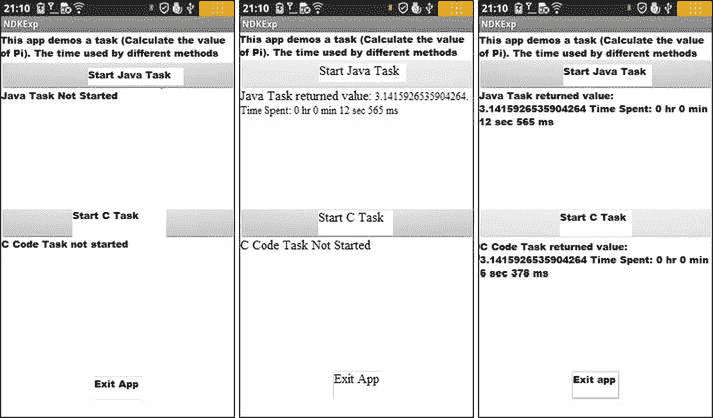
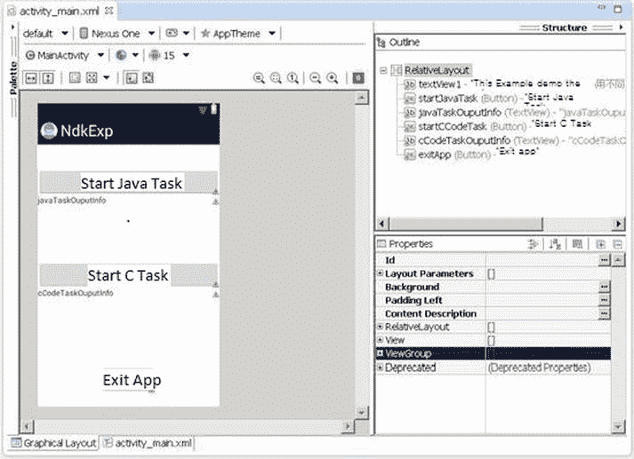
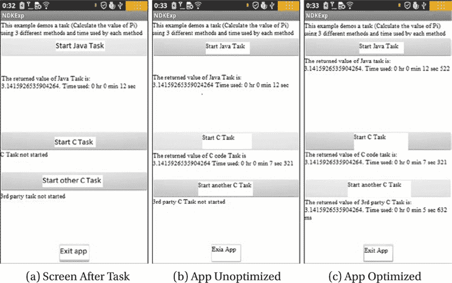
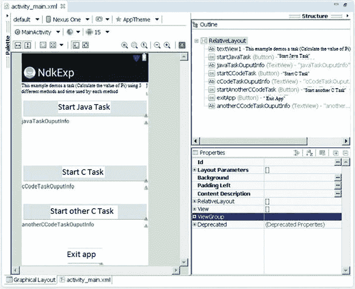
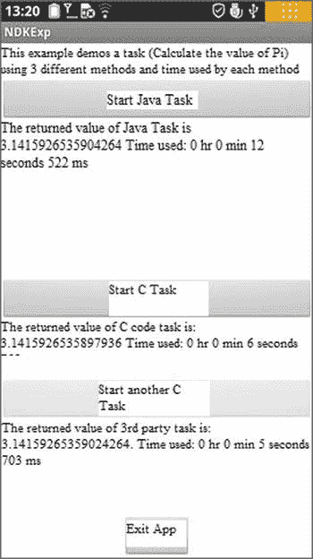

# 十、x86 NDK 和 C/C++ 优化

技术进步只是为我们提供了更有效的倒退手段。

Aldous Leonard 赫胥黎

在前一章中，我们介绍了性能优化的基本原则、优化方法和 Android 应用开发的相关工具。由于 Java 是 Android 开发人员的主要应用开发语言，前一章介绍的优化工具主要是针对 Java 的。我们知道 Java 应用是在虚拟机中运行的，速度天生就比 C/C++ 应用慢，C/c++ 应用是直接编译运行在硬件指令上的。此外，由于 C/C++ 的底层和基础性质，C/C++ 应用的开发人员已经创建了更多的优化工具。

矢量化

英特尔编译器支持高级代码生成，包括*自动矢量化*。对于英特尔 C/C++ 编译器，矢量化是指通过同时对几个元素执行单指令、多数据(SIMD)指令的生成来展开循环。开发者可以手动展开循环，并插入对应于 SIMD 指令的适当的函数调用。这种方法不能向前扩展，并且会导致高开发成本。当具有高级指令支持的新微处理器发布时，这项工作必须重做。例如，早期的英特尔凌动微处理器无法从处理双精度浮点的循环向量化中受益，而单精度则由 SIMD 指令有效处理。

自动向量化 简化了编程任务，因为程序员不必学习每个特定微处理器的指令集。例如，英特尔编译器始终支持最新一代的英特尔微处理器。

`-vec`选项为支持 IA32 架构的微处理器(包括英特尔和非英特尔)开启默认优化级别的矢量化功能。为了提高矢量化的质量，您需要指定代码将在其上执行的目标微处理器。为了在基于英特尔架构的 Android 智能手机上获得最佳性能，最好使用`–xSSSE3_ATOM`选项。英特尔 C++ 编译器以`-O2`及更高的优化级别支持矢量化。

许多循环是自动矢量化的，大多数时候编译器会自己生成最佳代码。然而，有时可能需要程序员的指导。高效矢量化的最大问题是让编译器尽可能精确地估计数据依赖关系。

为了充分利用英特尔编译器矢量化功能，以下技术非常有用:

*   生成并理解矢量化报告
*   通过指针歧义消除提高性能
*   使用过程间优化提高性能
*   使用编译器编译指示

矢量化报告

本节从内存复制的实现开始。循环采用 Android 源代码中常用的结构:

***清单 10-1*** 。内存复制实现

```java
// It is assumed that the memory pointed to by dst
// does not intersect with the memory pointed to by src

void copy_int(int* dst, int* src, int num)
{
int left = num;
if ( left <= 0 ) return;
do {
    left--;
    *dst++ = *src++;
} while ( left > 0 );
}
```

对于矢量化实验，您将重用`hello-jni`项目。为此，将函数添加到名为`jni/copy_cpp.cpp`的新文件中。将该文件添加到`jni/Android.mk`的源文件列表中，如下所示:

***清单 10-2*** 。矢量化失败

```java
LOCAL_SRC_FILES := hello-jni.c copy_int.cpp
```

要启用详细的矢量化报告，请将`–vec-report3`选项添加到`jni/Application.mk`中的`APP_CFLAGS`变量:

```java
APP_CFLAGS := -O3 -xSSSE3_ATOM  -vec-report3
```

如果您重新构建`libhello-jni.so`，您会注意到生成了几条注释:

```java
jni/copy_int.cpp(6): (col. 5) remark: loop was not vectorized: existence of vector dependence.
jni/copy_int.cpp(9): (col. 10) remark: vector dependence: assumed ANTI dependence between src line 9 and dst line 9.
jni/copy_int.cpp(9): (col. 10) remark: vector dependence: assumed FLOW dependence between dst line 9 and src line 9.
...
```

不幸的是，自动矢量化失败了，因为编译器可用的信息太少。如果矢量化成功，赋值将被替换如下:

```java
*dst++ = *src++;
//The previous statement would be replaced with
*dst = *src;
*(dst + 1) = *(src + 1);
*(dst + 2) = *(src + 2);
*(dst + 3) = *(src + 3);
dst += 4; src += 4;
```

前四个任务将由 SIMD 指令并行执行。但是如果在赋值的左边访问的存储器也在赋值的右边访问，那么赋值的并行执行是无效的。例如，考虑当`dst+1`等于`src+2`时的情况。在这种情况下，`dst+2`的最终值将是不正确的。

备注指出编译器保守假设哪些类型的依赖关系会阻止向量化:

*   *流*依赖性是来自同一存储器位置的较早存储和较晚加载之间的依赖性。
*   *反*依赖性是对同一存储器位置的较早加载和较晚存储之间的依赖性。
*   *输出*依赖于两次存储到同一个内存位置。

从代码注释中，可以安全地假设作者要求由`dst`和`src`指向的内存不重叠。为了向编译器传递信息，只需向`dst`和`src`参数添加限制限定符:

```java
void copy_int(int * __restrict__ dst, int * __restrict__ src, int num)
```

restrict 限定符被添加到 1999 年发布的 C 标准中。要启用对 C99 的支持，您需要将`–std=c99`添加到选项中。或者，您可以使用`–restrict`选项为 C++ 和其他 C 语言启用它。在前面的代码中，`__restrict__`关键字已经被插入，并且总是被认为是`restrict`关键字的同义词。

如果您再次重建库，您会注意到循环被矢量化了:

```java
jni/copy_int.cpp(6): (col. 5) remark: LOOP WAS VECTORIZED.
```

在本例中，由于编译器保守分析，矢量化失败。还有其他循环未矢量化的情况，包括:

*   指令集不允许有效的向量化。以下说明指出了这种类型的问题:
    *   "使用了非单位步幅"
    *   "混合数据类型"
    *   "运算符不适合矢量化"
    *   "第 XX 行包含不可计算的语句"
    *   “条件可以保护异常”
*   编译器试探法会阻止矢量化。矢量化是可能的，但实际上可能会导致速度变慢。如果是这种情况，诊断将包含:
    *   “矢量化是可能的，但似乎效率不高”
    *   "低行程计数"
    *   “非内部循环”
*   矢量器的缺点:
    *   "条件太复杂"
    *   "下标太复杂"
    *   "不支持的循环结构"

矢量器产生的信息量由`–vec-reportN`控制。您可以在编译器文档中找到更多详细信息。

杂注

如您所见，您可以使用`restrict`指针限定符来避免对数据依赖性的保守假设。但是有时候插入`restrict`关键词很棘手。如果在循环中访问许多数组，注释所有指针也可能太费力。为了在这些情况下简化矢量化，您可以使用英特尔特有的编译指令`simd`。假设迭代之间没有依赖关系，您可以使用它来矢量化内部循环。

Pragma `simd`仅适用于在本机整数和浮点类型上操作的`for`循环:

*   `for`循环应该是可计数的，在循环开始之前知道迭代的次数。
*   循环应该在最里面。
*   循环中的所有内存引用都不应该出错(这对屏蔽的间接引用很重要)。

要用 pragma 对循环进行矢量化，需要将代码重写为一个`for`循环，如清单 10-3 所示。

***清单 10-3*** 。可以向量化的内存复制实现

```java
void copy_int(int* dst, int* src, int num)
{
#pragma simd
for ( int i = 0; i < num; i++ ) {
*dst++ = *src++;
}
}
```

重新构建示例，注意循环是矢量化的。简单的循环重组`pragma simd`的和在 Android OS 源代码中插入`#pragma simd`允许您在不修改基准本身的情况下将 Softweg 基准的性能提高 1.4 倍。

自动矢量化和限制

前面几节中的例子是基于这样的假设，即在开始优化工作之前，您已经很好地理解了代码。如果您不熟悉代码，可以通过扩展分析范围来帮助编译器分析它。在复制的例子中，编译器应该做出保守的假设，因为它对`copy_int`例程的参数一无所知。如果调用点可用于分析，编译器可以尝试证明参数对于矢量化是安全的。

为了扩展分析的范围，您需要启用*过程间优化* 。在单个文件编译期间，默认情况下会启用其中的一些优化。过程间优化将在单独的章节中介绍。

矢量化不能用来加速 Linux 内核代码，因为在内核模式下使用`–mno-sse`选项禁用了 SIMD 指令。这是内核开发人员有意为之的。

过程间优化

如果编译器可以跨函数边界进行优化，它可以执行额外的优化。例如，如果编译器知道某个函数调用参数是常量，那么它可以创建一个专门为该常量参数定制的特殊版本的函数。这个特殊版本以后可以利用参数值的知识进行优化。

要在单个文件中启用优化，请指定`–ip`选项。当指定此选项时，编译器会生成一个可由系统链接器处理的最终目标文件。生成目标文件的缺点是几乎完全丢失信息；编译器甚至不会尝试从目标文件中提取信息。

由于信息丢失，单个文件范围可能不足以进行分析。在这种情况下，需要添加`–ipo`选项。使用此选项时，编译器会将文件编译成中间表示形式，稍后由特殊的英特尔工具 xiar 和 xild 进行处理。

您使用 xiar 工具而不是 GNU archiver ar 来创建静态库，并且使用 xild 而不是 GNU linker ld。只有在直接调用链接器和归档器时才需要它。更好的方法是使用编译器驱动程序`icc`或`icpc` 进行最终链接。扩展范围的缺点是失去了单独编译的优势——每次修改源代码都需要重新链接，而重新链接会导致完全重新编译。

从全局分析中受益的高级优化技术有很多。 **第九章:x86 平台上 Android 应用的性能优化**介绍了其中一些技术，其他的将在本章后面讨论。请注意，有些优化是英特尔特有的，并通过`–x*`选项启用。

不幸的是，就共享库而言，Android 中的事情稍微复杂一些。默认情况下，所有全局符号都是可抢占的。可抢占性很容易用例子来解释。考虑以下库链接到同一个可执行文件的情况:

***清单 10-4*** 。libone.so ，一个链接库示例

```java
int id(void) {
    return 1;
}
```

清单 10-4 是链接的第一个库，第二个在清单 10-5 中有描述。

***清单 10-5*** 。libtwo.so ，第二个链接库示例

```java
int id( void ) {
    return 2;
}
int foo( void ) {
    return id();
}

```

假设这些库是通过执行`icc –fpic –shared –o <libname>.so <libname>.c`创建的。只给出严格要求的选项`–fpic`和`–shared`。

如果系统动态链接器在库`libtwo.so`之前加载库`libone.so`，那么函数`foo()`对函数`id()`的调用在`libone.so`库中解析。

当编译器优化函数`foo()`时，它不能使用来自`libtwo.so`库的关于`id()`的知识。例如，它不能内联`id()`函数。如果编译器内联了`id()`函数，就会破坏涉及`libone.so`和`libtwo.so`的场景。

因此，当您编写共享库时，您应该仔细指定哪些函数可以被抢占。默认情况下，所有全局函数和变量在共享库之外都是可见的，并且可以被抢占。当您实现几个本机方法时，默认设置并不方便。在这种情况下，您只需要导出由 Dalvik Java 虚拟机直接调用的符号。

符号的可见性属性指定一个符号在模块外是否可见，以及它是否可以被抢占:

*   “默认”可见性使全局符号在共享库之外可见，并且能够被抢占。
*   “受保护的”可见性使符号在共享库之外可见，但该符号不能被抢占。
*   “隐藏”可见性使全局符号仅在共享库中可见，并禁止抢占。

回到`hello-jni`应用，有必要指定默认可见性是隐藏的，并且为 JVM 导出的函数具有受保护的可见性。

要将默认可见性设置为隐藏，将`-fvisibility=hidden`添加到`jni/Application.mk`中的`APP_CFLAGS`变量:

```java
APP_CFLAGS := -O3 -xSSSE3_ATOM  -vec-report3 -fvisibility=hidden -ipo
```

要覆盖`Java_com_example_hellojni_HelloJni_stringFromJNI`的可见性，将属性添加到函数定义中:

```java
Jstring __attribute__((visibility("protected")))
  Java_com_example_hellojni_HelloJni_stringFromJNI(JNIEnv* env, jobject thiz)
```

设置此标志后，默认可见性被隐藏。这是英特尔 NDK 应用的过程间优化程度。

利用 IPP 进行优化

从第七章你知道，Android 应用可以绕过 NDK 开发工具，使用第三方开发的现有`.so`共享库。在本章中，我们以英特尔 IPP 函数库为例。使用该库的典型应用包括多媒体和流应用，但是任何时间性能都是问题的应用都将从该工具中受益。

英特尔 IPP (集成性能基元)是英特尔提供的高性能库之一。它是英特尔处理器和芯片组的强大函数库，涵盖数学、信号处理、多媒体、图像和图形处理、矢量计算和其他领域。英特尔 IPP 的一个显著特点是其代码已经基于任何英特尔处理器的特性使用多种方法进行了广泛的优化。可以说是一个与英特尔处理器关联的高度优化的高性能服务库。英特尔 IPP 具有跨平台特性；它提供了一组跨平台和操作系统的通用 API，可用于 Windows、Linux 和其他操作系统，并支持嵌入式、桌面、服务器和其他处理器规模的系统。

事实上，IPP 是一组函数库，每个函数库在相应的函数库中都有不同的功能区域，并且英特尔 IPP 中的函数库在不同处理器架构支持的功能数量上略有不同。例如，英特尔 IPP 5。x 图像处理功能在英特尔架构中可支持 2570 个功能，而在 IXP 处理器架构中仅支持 1574 个功能。

包括英特尔 IPP 在内的各种高性能图书馆提供的服务是多方面和多层次的。应用可以直接或间接使用 IPP。IPP 为应用、其它组件和库提供支持。

使用 IPP 的应用可以分为两个层次——直接使用英特尔 IPP 函数接口，或者使用样本代码间接使用英特尔 IPP。此外，使用 OpenCV 库(一个跨平台开源计算机视觉库)相当于间接使用英特尔 IPP 库。英特尔 IPP 和英特尔 MKL 函数库最终都可以在各种架构的高性能英特尔处理器上运行。

考虑到 IPP 的强大功能，并根据英特尔处理器优化特性的特点，您可以使用英特尔 IPP 库来替换一些经常运行且耗费大量时间的关键源代码。您可以获得比一般代码更高的性能加速。这简直就是一个“站在巨人肩膀上”的实用优化方法。用户无需在关键区域手动编写代码即可实现优化。

英特尔最近发布了名为 Beacon Mountain 的英特尔 Android 开发环境代码。它为 Android 应用开发人员提供了 IPP 和英特尔线程构建模块(TBB)。普通用户可以轻松使用英特尔 IPP、英特尔 TBB、英特尔 GPA 和其他工具进行 Android 应用开发。英特尔 IPP 的示例可在`http://software.intel.com/en-us/articles/intel-integrated-performance-primitives-intel-ipp-intel-ipp-sample-code`找到。

NDK 集成优化示例

我们已经介绍了基于 NDK 优化的知识和基本理论的优化。本节使用一个案例研究来演示通过将 NDK 与 C/C++ 相集成的综合优化技术。

本案分为两步。第一步演示了一种在从 C/C++ 代码编译的本地函数上使用的技术，以加速传统的基于 Java 的程序中的计算任务。第二步演示了使用 NDK 编译器优化来实现 C/C++ 优化任务本身。我们在这一章的以下两个部分中介绍每个步骤，这两个部分是紧密联系的。

C/C++:原始应用加速

在前一章中，我们介绍了使用 Java 代码示例(SerialPi)来计算π。在这一节中，我们将把计算任务从 Java 改为 C 代码，使用 NDK 把它变成一个本地库。然后，我们将它与原始的 Java 代码任务进行比较，您将获得一些使用 C/C++ 本地库函数实现传统的基于 Java 的任务加速的第一手经验。

用于本案例研究的应用名为 NDKExp ，我们使用联想 K800 作为目标手机，它运行图 10-1 所示的界面。



图 10-1 。NDKExp 运行界面的原始版本

图 10-1 (a)显示了应用的主界面，包括三个按钮——启动 Java 任务、启动 C 任务、退出 App。点击启动 Java 任务按钮会启动一个传统的 Java 任务(如 Java 写的 SerialPi 源代码所示，它计算π)。当任务完成后，计算的结果将显示在按钮下方，同时显示花费的时间，如图图 10-1 (b)所示。点击启动 C 任务按钮将启动一个用 C 编写的计算任务，使用相同的数学公式计算π。当任务完成后，计算的结果将显示在按钮下方，同时显示花费的时间，如图图 10-1 (c)所示。

如图图 10-1 所示，同样的任务，用传统 Java 编写的应用需要 12.565 秒才能完成；用 C 语言编写并由 NDK 开发工具编译的应用需要 6.378 秒才能完成。这个例子可以让您直观地体验到使用 NDK 来实现性能优化的强大功能。

该示例实现如下。

步骤 1 :创建一个新的 Android 应用项目

1.  在 Eclipse 中生成项目，将项目命名为`NDKExp`，并选择 Build SDK 选项以支持 x86 版本的 API(在本例中为 Android 4.0.3)。其他人使用默认值。完成所有这些步骤后，生成项目。
2.  Modify the main layout file. Put three text views and three buttons in the layout, set their Text and ID attributes, and adjust their size and position, as shown in Figure 10-2.

    

    图 10-2 。原始版本 NDKExp 的布局

3.  Modify the main layout of the class source code file `MainActivity.java`. It reads as follows:

    ```java
    1.  package com.example.ndkexp;
    2.  import android.os.Bundle;
    3.  import android.app.Activity;
    4.  import android.view.Menu;
    5.  import android.widget.Button;
    6.  import android.view.View;
    7.  import android.view.View.OnClickListener;
    8.  import android.os.Process;
    9.  import android.widget.TextView;
    10\. import android.os.Handler;
    11\. import android.os.Message;
    12.
    13\. public class MainActivity extends Activity {
    14.    private JavaTaskThread javaTaskThread = null;
    15.    private CCodeTaskThread cCodeTaskThread = null;
    16.      private TextView tv_JavaTaskOuputInfo;
    17.      private TextView tv_CCodeTaskOuputInfo;
    18.      private Handler mHandler;;
    19.    private long end_time;
    20.    private long time;
    21.    private long start_time;
    22.      @Override
    23.      public void onCreate(Bundle savedInstanceState) {
    24.          super.onCreate(savedInstanceState);
    25.          setContentView(R.layout.activity_main);
    26.          tv_JavaTaskOuputInfo = (TextView)findViewById    (R.id.javaTaskOuputInfo);
    27.        tv_JavaTaskOuputInfo.setText("Java the task is not    started ");
    28.          tv_CCodeTaskOuputInfo = (TextView)findViewById    (R.id.cCodeTaskOuputInfo);
    29.          tv_CCodeTaskOuputInfo.setText("C  code task is not    start ");
    30.          final Button btn_ExitApp = (Button) findViewById    (R.id.exitApp);
    31.          btn_ExitApp.setOnClickListener(new /*View.*/    OnClickListener(){
    32.              public void onClick(View v) {
    33.                exitApp();
    34.              }
    35.          });
    36.          final Button btn_StartJavaTask = (Button)     findViewById(R.id.startJavaTask);
    37.          final Button btn_StartCCodeTask = (Button)     findViewById(R.id.startCCodeTask);
    38.           btn_StartJavaTask.setOnClickListener(new /*View.*/    OnClickListener(){
    39.              public void onClick(View v) {
    40.                btn_StartJavaTask.setEnabled(false);
    41.                btn_StartCCodeTask.setEnabled(false);
    42.                btn_ExitApp.setEnabled(false);
    43.                startJavaTask();
    44.                }
    45.          });
    46.          btn_StartCCodeTask.setOnClickListener(new /*View.*/    OnClickListener(){
    47.              public void onClick(View v) {
    48.                btn_StartJavaTask.setEnabled(false);
    49.                btn_StartCCodeTask.setEnabled(false);
    50.                btn_ExitApp.setEnabled(false);
    51.                startCCodeTask();
    52.                }
    53.          });
    54.          mHandler = new Handler() {
    55.              public void handleMessage(Message msg) {
    56.              String s;
    57.               switch (msg.what)
    58.                {
    59.                case JavaTaskThread.MSG_FINISHED:
    60.                    end_time = System.currentTimeMillis();
    61.                    time = end_time - start_time;
    62.                    s = " The return value of the Java task "+     (Double)(msg.obj) +"  Time consumed:"
    63.               + JavaTaskThread.msTimeToDatetime(time);
    64.                    tv_JavaTaskOuputInfo.setText(s);
    65.                    btn_StartCCodeTask.setEnabled(true);
    66.                  btn_ExitApp.setEnabled(true);
    67.                break;
    68.                case CCodeTaskThread.MSG_FINISHED:
    69.                    end_time = System.currentTimeMillis();
    70.                    time = end_time - start_time;
    71.                    s = " The return value of the C code     task"+ (Double)(msg.obj) +"  time consumed:"
    72.               + JavaTaskThread.msTimeToDatetime(time);
    73.                    tv_CCodeTaskOuputInfo.setText(s);
    74.                     btn_StartJavaTask.setEnabled(true);
    75.                  btn_ExitApp.setEnabled(true);
    76.                break;
    77.                default:
    78.                  break;
    79.                }
    80.              }
    81.          };
    82.      }
    83.
    84.      @Override
    85.      public boolean onCreateOptionsMenu(Menu menu) {
    86.          getMenuInflater().inflate(R.menu.activity_main, menu);
    87.          return true;
    88.      }
    89.
    90.      private void startJavaTask() {
    91.        if (javaTaskThread == null)
    92.          javaTaskThread = new JavaTaskThread(mHandler);
    93.        if (! javaTaskThread.isAlive())
    94.        {
    95.               start_time = System.currentTimeMillis();
    96.               javaTaskThread.start();
    97.               tv_JavaTaskOuputInfo.setText("The Java task is     running...");
    98.        }
    99.      }
    100.
    101.      private void startCCodeTask() {
    102.        if (cCodeTaskThread == null)
    103.          cCodeTaskThread = new CCodeTaskThread(mHandler);
    104.        if (! cCodeTaskThread.isAlive())
    105.        {
    106.               start_time = System.currentTimeMillis();
    107.               cCodeTaskThread.start();
    108.               tv_CCodeTaskOuputInfo.setText("C codes task is     running...");
    109.        }
    110.      }
    111.      private void exitApp() {
    112.        try {
    113.          if (javaTaskThread !=null)
    114.          {
    115.            javaTaskThread.join();
    116.            javaTaskThread = null;
    117.          }
    118.        } catch (InterruptedException e) {
    119.        }
    120.        try {
    121.          if (cCodeTaskThread  !=null)
    122.          {
    123.            cCodeTaskThread.join();
    124.            cCodeTaskThread = null;
    125.          }
    126.        } catch (InterruptedException e) {
    127.        }
    128.      finish();
    129.        Process.killProcess(Process.myPid());
    130.      }
    131.
    132.    static {
    133.      System.loadLibrary("ndkexp_extern_lib");
    134.    }
    135.  }
    ```

    前面的代码与 SerialPi 的示例代码基本相同。第 123 到 134 行的代码是唯一的新部分。这段代码要求在应用运行之前加载`libndkexp_extern_lib.so`共享库文件。应用需要使用这个库中的本地函数。

4.  项目中的新线程任务类`JavaTaskThread`用于计算π。代码类似于 SerialPi 示例中的`MyTaskThread`类代码，此处省略。
5.  The thread task class `CCodeTaskThread` in the new project calls the local function to calculate π; its source code files `CCodeTaskThread.java` read as follows:

    ```java
    1.  package com.example.ndkexp;
    2.  import android.os.Handler;
    3.  import android.os.Message;

    4.  public class CCodeTaskThread extends Thread {
    5.    private Handler mainHandler;
    6.    public static final int MSG_FINISHED = 2;
            // The message after the end of the task
    7.    private native double cCodeTask();
           // Calling external C functions to accomplish computing     tasks
    8.    static String msTimeToDatetime(long msnum){
    9.    long hh,mm,ss,ms, tt= msnum;
    10.      ms = tt % 1000; tt = tt / 1000;
    11.      ss = tt % 60; tt = tt / 60;
    12.      mm = tt % 60; tt = tt / 60;
    13.      hh = tt % 60;
    14.      String s = "" + hh +" Hour "+mm+" Minute "+ss + " Second     " + ms +" Millisecond ";
    15.      return s;
    16.      }
    17.      @Override
    18.      public void run()
    19.      {
    20.      double pi = cCodeTask();
            // Calling external C function to complete the calculation
    21.      Message msg = new Message();
    22.      msg.what = MSG_FINISHED;
    23.      Double dPi = Double.valueOf(pi);
    24.        msg.obj = dPi;
    25.        mainHandler.sendMessage(msg);
    26.      }

    27.      public CCodeTaskThread(Handler mh)
    28.      {
    29.         super();
    30.         mainHandler = mh;
    31.      }
    32.  }
    ```

    前面的代码类似于 SerialPi 示例的`MyTaskThread`类的代码框架。主要区别在第 20 行。原来计算π的 Java 代码被替换为调用一个本地函数`cCodeTask`。要声明`cCodeTask`函数是一个局部函数，您必须在第 7 行添加该函数的局部声明。

6.  在 Eclipse 中构建项目。同样，这里我们只是构建，而不是运行。
7.  在项目根目录下创建`jni`子目录。

第二步:编写 cCodeTask 函数的 C 实现代码

根据第七章:创建和移植基于 NDK 的 Android 应用****的 **NDK 示例**部分描述的方法，**你需要将文件编译成一个`.so`库文件。主要步骤如下:**

1.  Create a C interface file. Since the case is a `CCodeTaskThread` class using a local function, you need to generate the class header file according to the class file of this class. At the command line, go to the project directory and then run the following command:

    ```java
    E:\temp\Android Dev\workspace\NdkExp> javah -classpath "D:\Android\android-sdk\platforms\android-15\android.jar";bin/classes  com.example.ndkexp.CCodeTaskThread
    ```

    该命令将在项目目录中生成一个名为`com_example_ndkexp_CCodeTaskThread.h`的文件。文件的主要内容如下:

    ```java
       ...
    23.  JNIEXPORT jdouble JNICALL Java_com_example_ndkexp_   CCodeTaskThread_cCodeTask
    24.  (JNIEnv *, jobject);
       ...
    ```

    在第 23–24 行，定义了本地函数`cCodeTask`的原型。

2.  Based on the previous header files, you create corresponding C code files in the `jni` directory of the project. In this case, we named it `mycomputetask.c`, which reads as follows:

    ```java
    1.  #include <jni.h>
    2.  jdouble Java_com_example_ndkexp_CCodeTaskThread_cCodeTask
    (JNIEnv* env,  jobject thiz )
    3.  {
    4.    const long num_steps = 100000000;  // The total step length
    5.    const double step = 1.0 / num_steps;
    6.      double x, sum = 0.0;
    7.      long i;
    8.    double pi = 0;
    9.
    10.    for (i=0; i< num_steps; i++){
    11.          x = (i+0.5)*step;
    12.          sum = sum + 4.0/(1.0 + x*x);
    13.      }
    14.      pi = step * sum;
    15.
    16.    return (pi);
    17.  }
    ```

    第 4 行到第 16 行是函数的主体——计算π的代码，这是对应于 SerialPi 示例中的`MyTaskThread`类的代码。注意，在第 4 行，变量`num_steps`(总步长)的值必须与`JavaTaskThread`类表示的相同步长的值相同。否则，比较没有意义。

    每个`jni`文件的第一行必须包含标题。第 2 行是`cCodeTask`函数原型，基于上一步获得的稍微修改过的头文件。

    第 16 行显示了返回结果。使用 Java 的`double`类型，对应于 C 的`jdouble`类型，C 可以有一个直接返回给它的`double`类型的`pi`变量。这是我们在本章介绍中讨论过的内容。

3.  In the project `jni` directory, you must create the `Android.mk` and `Application.mk` files. The content of `Android.mk` reads as follows:

    ```java
    1.  LOCAL_PATH := $(call my-dir)
    2.  include $(CLEAR_VARS)
    3.  LOCAL_MODULE     := ndkexp_extern_lib
    4.  LOCAL_SRC_FILES  := mycomputetask.c
    5.  include $(BUILD_SHARED_LIBRARY)
    ```

    第 4 行指定了案例文件中的 C 代码。第 3 行表示生成的库的文件名，其名称必须与项目文件`MainActivity.java`的第 133 行`System.loadLibrary`函数的参数一致。

4.  按照 **第七章** 关于 **NDK 实例**一节中描述的方法，将 C 代码编译到项目`lib`目录下的`.so`库文件中。
5.  部署:运行项目。

应用运行界面如图 10-3 所示。



图 10-3 。扩展版 NDKExp 运行界面

编译器优化扩展应用

在前面的示例中，您见证了 NDK 在应用加速方面的能力。然而，这个应用只实现了一个局部函数，不能为您提供比较编译器优化效果的信息。为此，您需要重新构建应用，并使用它来试验编译器优化的效果。

运行该界面的应用如图 10-3 所示。

该应用有四个按钮。当您单击 Start Java Task 按钮时，响应代码不会改变。

当你点击 Start C Task 或 Start Other C Task 按钮时，应用将启动一个本地函数来运行。

两个函数的代码(函数体)是一样的。它计算π的值，但名称不同。第一个调用`cCodeTask`函数，第二个调用`anotherCCodeTask`函数。这两个函数位于`mycomputetask.c`和`anothertask.c`文件中，编译后分别对应库文件`libndkexp_extern_lib.so`和`libndkexp_another_lib.so`。在这种情况下，使用`-O0`选项编译`libndkexp_extern_lib.so`,使用`-O3`选项编译`libndkexp_another_lib.so`,因此一个是非优化编译，另一个是优化编译。

因此，点击启动 C 任务将运行 C 函数的未优化版本，如图图 10-3 (b)所示，点击启动其他 C 任务将运行 C 函数的优化版本，如图图 10-3 (c)所示。任务执行后，系统显示时间消耗的计算结果。

从图中可以看出，无论是否使用编译器优化，本地函数的运行时间总是比 Java 函数的运行时间(12.522 秒)短。相对而言，`-O3`优化函数的执行时间(5.632 秒)比未优化(`-O0`编译器选项)函数的执行时间(7.321 秒)要短。

从这个比较中，您可以看到使用编译器优化实际上减少了应用的执行时间。不仅如此，它甚至比原来的应用运行时间(6.378 秒)还要短。这是因为没有编译器选项的原始应用默认为优化的`-O1`级别，而`-O3`优化级别甚至比原始应用更高，因此它的运行时间最短也就不足为奇了。

下面的应用是原始应用 NDKExp 的修改和扩展版本。步骤如下。

步骤 1:修改应用的 Android 部分

1.  Modify the main layout file. Add a text view and a button in a layout. Set their Text and ID properties, and adjust their size and position, as shown in Figure 10-4.

    

    图 10-4 。扩展版本 NDKExp 布局

2.  Modify the class source code file `MainActivity.java` of the main layout. The main changes are as follows:

    ```java
       ...
    13.  public class MainActivity extends Activity {
    14.    private JavaTaskThread javaTaskThread = null;
    15.    private CCodeTaskThread cCodeTaskThread = null;
    16.    private AnotherCCodeTaskThread anotherCCodeTaskThread = null;
    17.    private TextView tv_JavaTaskOuputInfo;
    18.    private TextView tv_CCodeTaskOuputInfo;
    19.    private TextView tv_AnotherCCodeTaskOuputInfo;
       ...
    182.   static {
    183.      System.loadLibrary("ndkexp_extern_lib");
    184.      System.loadLibrary("ndkexp_another_lib");
    185.   }
    186\. }
    ```

    在第 16 行和第 19 行，为新的 Start Other C Task 按钮添加必需的变量。

    关键的变化在第 184 行。除了加载原始共享库文件之外，这些文件还会被添加到另一个库文件中。

3.  In the project, add a thread task class  with the name `AnotherCCodeTaskThread` that calls a local function to calculate π. Its source code file `AnotherCCodeTaskThread.java` reads as follows:

    ```java
    1.  package com.example.ndkexp;
    2.  import android.os.Handler;
    3.  import android.os.Message;

    4.  public class AnotherCCodeTaskThread extends Thread {
    5.    private Handler mainHandler;
    6.    public static final int MSG_FINISHED = 3;
          // The message after the end of the task
    7.    private native double anotherCCodeTask();
         // Calling external C functions to complete computing tasks

    8.    static String msTimeToDatetime(long msnum){
    9.      long hh,mm,ss,ms, tt= msnum;
    10.     ms = tt % 1000; tt = tt / 1000;
    11.     ss = tt % 60; tt = tt / 60;
    12.     mm = tt % 60; tt = tt / 60;
    13.     hh = tt % 60;
    14.     String s = "" + hh +"Hour "+mm+"Minute "+ss + "Second " +     ms +"Millisecond";
    15.     return s;
    16.     }

    17.    @Override
    18.    public void run()
    19.    {
    20.    double pi = anotherCCodeTask();
           // Calling external C function to complete the calculation
    21.        Message msg = new Message();
    22.        msg.what = MSG_FINISHED;
    23.        Double dPi = Double.valueOf(pi);
    24.        msg.obj = dPi;
    25.        mainHandler.sendMessage(msg);
    26.    }

    27.    public CCodeTaskThread(Handler mh)
    28.    {
    29.    super();
    30.    mainHandler = mh;
    31.    }
    32.  }
    ```

    前面的代码几乎是抄录了`CCodeTaskThread`类的代码。它只通过调用另一个名为`anotherCCodeTask`的外部 C 函数来完成第 20 行的计算任务，做了一点处理。在第 7 行中，它为本地函数提供了适当的指令，并在第 6 行中更改了消息类型的值。这样，它通过前面的 C 函数将自己与完整的消息区分开来。第 4 行显示了从`thread`类继承而来的`task`类。

4.  在 Eclipse 中构建项目。类似地，在这里，你只有一个构建，而不是运行。

第二步:修改 mycomputetask.c 的 Makefile 文件,重新构建库文件

1.  Modify the `Android.mk` file under the `jni` directory of the project, which reads as follows:

    ```java
    1.  LOCAL_PATH := $(call my-dir)
    2.  include $(CLEAR_VARS)
    3.  LOCAL_MODULE    := ndkexp_extern_lib
    4.  LOCAL_SRC_FILES := mycomputetask.c
    5.  LOCAL_CFLAGS    := -O0
    6.  include $(BUILD_SHARED_LIBRARY)
    ```

    与原来的应用不同，在第 5 行中，您添加了传递给`gcc`的命令`LOCAL_CFLAGS`的参数。值`-O0`表示没有优化。

2.  将 C 代码文件编译成项目的`lib`目录下的`.so`库文件。
3.  将项目的`lib`目录中的`.so`库文件(在本例中，该文件是`libndkexp_extern_lib.so`)保存到磁盘中的某个其他目录中。以下操作将删除这个`.so`库文件。

步骤 2:为 anotherCCodeTask 函数编写 C 实现代码

从上一节复制`cCodeTask`功能的处理步骤。然后将文件编译成`.so`库文件。主要步骤如下:

1.  Create a C interface file. At the command line, go to the project directory, and then run the following command:

    ```java
    E:\temp\Android Dev\workspace\NdkExp> javah -classpath "D:\Android\android-sdk\platforms\android-15\android.jar";bin/classes  com.example.ndkexp.AnotherCCodeTaskThread
    ```

    该命令将生成一个名为`project com_example_ndkexp_AnotherCCodeTaskThread.h`的目录文件。该文件的主要内容有:

    ```java
       ...
    23.  JNIEXPORT jdouble JNICALL Java_com_example_ndkexp_AnotherCCodeTaskThread_anotherCCodeTask
    24.  (JNIEnv *, jobject);
       ...
    ```

    第 23–24 行定义了本地函数`anotherCCodeTask`原型。

2.  According to the previously mentioned header files in the project `jni` directory, establish corresponding C code files, in this case named `anothertask.c`, the content of which is based on the `mycomputetask.c` modification. The modification as follows:

    ```java
    1.  #include <jni.h>
    2.  jdouble Java_com_example_ndkexp_AnotherCCodeTaskThread_anotherCCodeTask (JNIEnv* env,  jobject thiz )
    3.  {
       ...
    17\. }
    ```

    `mycomputetask.c`的第二行被替换为`anotherCCodeTask`函数的原型。这是从关于`.h`文件的函数原型的描述中复制的同一个函数原型，它是在前面的步骤中创建的，只做了微小的修改。最终的形式可以在代码行 2 中看到。

3.  Modify the `Android.mk` file under the `jni` directory in the project, as follows:

    ```java
    1.  LOCAL_PATH := $(call my-dir)
    2.  include $(CLEAR_VARS)
    3.  LOCAL_MODULE       := ndkexp_another_lib
    4.  LOCAL_SRC_FILES    := anothertask.c
    5.  LOCAL_CFLAGS       := -O3
    6.  include $(BUILD_SHARED_LIBRARY)
    ```

    在第 4 行，该值被替换为新的 C 代码文件`anothertask.c`。在第 3 行，该值被替换为新的库文件名，这与`System.loadLibrary`函数的参数一致(在项目中的`MainActivity.java`文件的第 184 行)。在第 5 行，用于传递的`gcc`命令的`LOCAL_CFLAGS`参数的值被替换为`-O3`，这表示最高级别的优化。

4.  将 C 代码文件编译成项目的`lib`目录下的`.so`库文件。然后你可以看到项目中`lib`目录下的`libndkexp_extern_lib.so`文件消失了，取而代之的是一个新生成的`libndkexp_another_lib.so`文件。保存库文件是非常重要的。
5.  Put the previously saved `libndkexp_extern_lib.so` library file back into the `libs` directory in the project.

    现在目录中有两个文件。您可以使用`dir`命令来验证:

    ```java
    E:\temp\Android Dev\workspace\NdkExp>dir libs\x86
    2013-02-28  00:31             5,208 libndkexp_another_lib.so
    2013-02-28  00:23             5,208 libndkexp_extern_lib.so
    ```

6.  您重新部署并运行项目。

运行界面的应用如本章前面的图 10-3 所示。

编译器优化扩展的多种情况比较

通过本章中的案例研究，您将获得关于编译器优化效果的第一手经验。任务执行时间从优化前的 7.321 秒缩短到优化后的 5.632 秒。我们只比较了`gcc -O3`和`-O0`命令的区别。您可以通过在编译`mycomputetask.c`和`anothertask.c`两个文件时修改`Android.mk`文件来扩展这种配置，然后继续比较使用不同编译器命令选项时优化效果的差异。要修改`Android.mk`文件，只需要修改`LOCAL_CFLAGS`项的值即可。您可以选择`gcc`命令的多个选项进行比较。这里有几个例子来说明这个过程。

示例:使用 SSE 指令比较优化结果

可以让启动 C 任务按钮对应`mycomputetask.c`编译的`Android.mk`文件:

```java
LOCAL_CFLAGS     := -mno-sse
```

并使启动其他 C 任务按钮对应于`anothertask.c`编译的`Android.mk`文件:

```java
LOCAL_CFLAGS     := -msse3
```

前者告诉编译器不要编译 SSE 指令；后者允许编译器编程为 SSE3 指令。选择 SSE3 指令的原因是 SSE3 是英特尔凌动处理器支持的最高级别的指令。

运行应用的结果如图 10-5 所示。



图 10-5 。应用 NDKExp 的编译器 SSE 指令优化比较

从图 10-5 可以看出，同样的任务使用 SSE 指令执行时间比不使用 SSE 指令要短。执行时间从原来的 6.759 秒缩短到 5.703 秒。

需要注意的是，在这个例子中，我们完成了对`Android.mk`文件的修改，并重新运行`ndk-build`来生成`.so`库文件。我们立即部署并运行了 NDKExp 项目，但发现我们无法达到预期的效果。原因是因为只有`.so`库文件被更新。Eclipse 的项目经理没有意识到项目需要重新构建。结果，`apk`没有得到更新，目标机器码上的 NDKExp 应用也不会更新原代码。考虑到这种情况，您可以使用以下方法来避免此问题:

1.  从手机上卸载应用。
2.  从宿主项目目录的`bin`子目录中删除`classes.dex`、`jarlist.cache`和`NdkExp.apk`文档。
3.  在 Eclipse 中删除项目。
4.  在 Eclipse 中，重新导入项目。
5.  最后，重新部署并运行项目，这样您就可以获得想要的效果。

此示例仅比较 SSE 指令的效果。有兴趣的读者可以尝试其他的`gcc`编译器选项，比较它们的运行结果。

此外，在前面的例子中，我们只关心 NDK 效应，所以 C 函数仍然使用单线程代码。有兴趣的读者可以将本章学到的 NDK 优化知识与上一章的多线程优化结合起来，将 C 函数改为多线程，与编译器优化一起实现。在各种应用中编写这样一套优化技术肯定会让应用运行得更快。

概观

与第九章类似，本章主要关注基于英特尔 x86 架构的 Android NDK 的代码和技术方面。我们创建了一个简单的 Android NDK 应用，展示了所有这些部分是如何连接并在 x86 模拟器上运行的。本章还提供了 Android NDK 编译器可以为其开发者提供的优化的高级视图。然后我们看了英特尔的集成性能原语库(IPP)，这是一个提供给 x86 开发人员的高性能库。最后，我们用一些如何使用所有讨论的工具和技巧的例子来结束这一章。