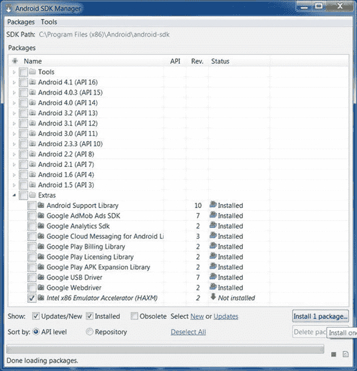
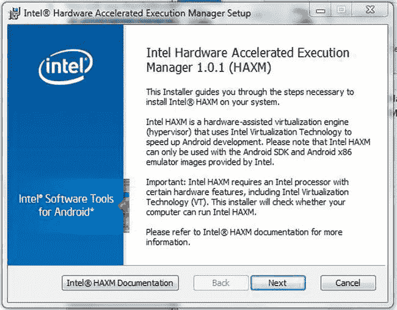
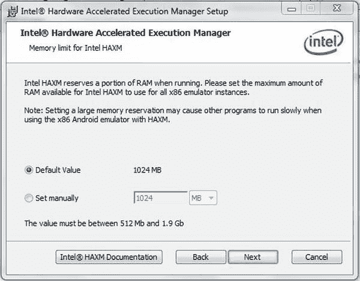
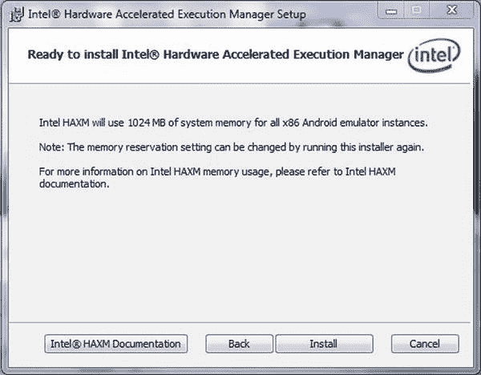
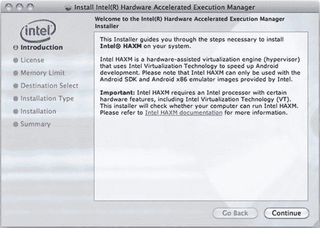
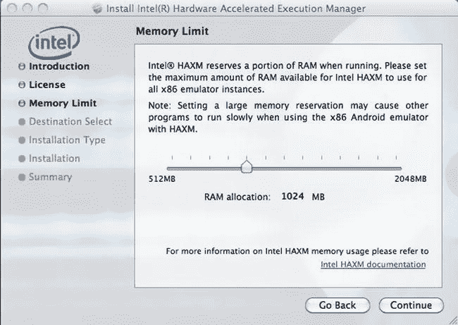
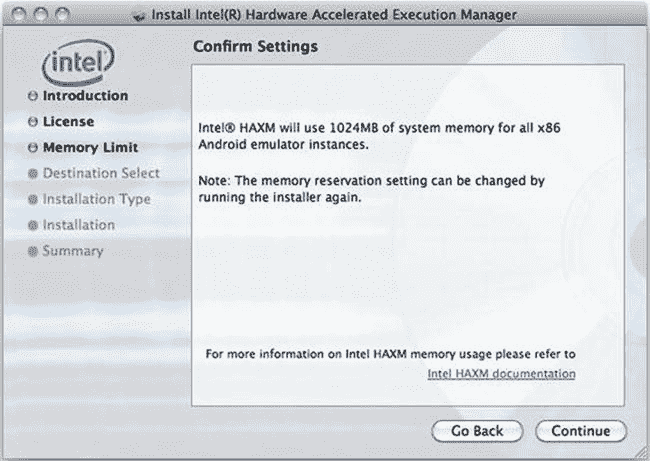
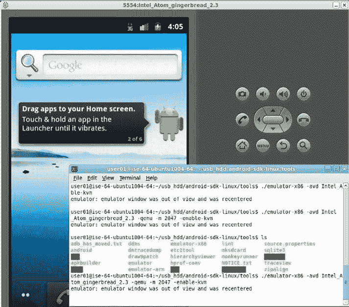

# 十一、在 Windows、Mac OS 和 Linux 上使用英特尔硬件加速执行管理器来加速 x86 仿真上的 Android

我不害怕电脑。我担心他们的缺乏。

艾萨克·阿西莫夫

一旦安装了 Android SDK，运行了 Android 模拟器，并且您的开发环境设置符合您的喜好，前面还有一个挫折:Android 模拟器可能非常慢。尤其是在测试和调试较大的应用时，模拟器的速度是开发中一个明显的瓶颈。最佳解决方案是采用英特尔虚拟化技术(英特尔 VT)的英特尔硬件加速执行管理器(英特尔 HAXM) 。如果您的开发系统使用受支持的英特尔处理器之一，这种硬件辅助虚拟化引擎或虚拟机管理程序将支持闪电般的 Android 仿真。

介绍

该软件:

*   使用英特尔 VT，在特定的英特尔处理器上提供。
*   提供英特尔 x86 Android 虚拟设备的硬件加速仿真。
*   与 Android SDK 集成。
*   英特尔 HAXM 要求安装 Android SDK(版本 17 或更高)。为了获得最佳性能，建议使用 SDK 2.0 版或更高版本。
*   最新的 Windows 或 Mac OS X (32/64 位)。

重要的是，英特尔 HAXM 不能在没有英特尔处理器的系统上使用，也不能在没有所需硬件特性的英特尔处理器上使用。要确定您的英特尔处理器的性能，请访问`http://ark.intel.com/`。此外，英特尔 HAXM 只能为仿真器 x86 加速 Android x86 系统映像。HAXM 已通过英特尔在`http://www.intel.com/software/android`提供的 x86 系统映像的验证。

**下载英特尔 HAXM**

英特尔 HAXM 可以通过 Android SDK 管理器(推荐)安装，也可以通过从英特尔网站下载安装程序来手动安装。

 **注意**英特尔 HAXM 不会自动检查更新。要获得最新版本，请使用 Android SDK 管理器(推荐)或从英特尔软件网络 Android 开发人员网站下载英特尔 HAXM 软件包。

通过 Android SDK 管理器下载

1.  启动 Android SDK 管理器。
2.  Under Extras, check the box next to Intel x86 Emulator Accelerator (HAXM), as seen in Figure 11-1.

    

    图 11-1 。下载英特尔 x86 模拟器加速器(HAXM)

3.  单击安装软件包按钮。
4.  查看英特尔公司许可协议。如果您接受这些条款，请选择接受并单击安装。
5.  SDK 管理器会将安装程序下载到主 SDK 目录下的 Tools 目录中。
6.  提取工具目录中的安装程序，并按照您的平台的安装说明进行操作。

手动下载

1.  转到`http://www.intel.com/software/android`。
2.  为您的平台选择英特尔 HAXM 安装程序包。
3.  提取安装程序，并按照您的平台的安装说明进行操作。

**在 Windows 上安装英特尔 HAXM**

 **警告**如果您的系统不符合系统要求，包括对英特尔处理器特性的支持，如英特尔虚拟化技术(英特尔 VT)，英特尔 HAXM 安装将会失败。

1.  从`http://www.intel.com/software/android`或使用 SDK 管理器下载安装包。
2.  运行安装程序(如果适用，接受 UAC 提示)。
3.  If an older version Intel HAXM is installed, you will see something like Figure 11-2.

    

    图 11-2 。通知对话框

4.  单击是升级英特尔 HAXM，或单击否退出安装并保留当前安装的英特尔 HAXM 版本。
5.  You will see a screen like Figure 11-3.

    

    图 11-3 。HAXM 安装屏幕

     **注**您可以通过点击英特尔 HAXM 文档随时访问文档。

6.  单击下一步。
7.  阅读英特尔 HAXM 最终用户许可协议(EULA ),如果您同意，接受 EULA 并继续安装英特尔 HAXM。
8.  You will be prompted to adjust the amount of RAM allocated to Intel HAXM, as shown in Figure 11-4.

    

    图 11-4 。HAXM RAM 调整屏幕

     **注意**安装程序也可以作为英特尔 HAXM 的配置工具。要更改内存设置，请再次运行安装程序。

9.  Figure 11-5 confirms your Intel HAXM memory allocation settings.

    

    图 11-5 。英特尔 HAXM 准备安装

10.  英特尔 HAXM 安装完成后，单击完成退出安装程序。

英特尔 HAXM 现已安装完毕，可以使用了。要验证英特尔 HAXM 是否正在运行，请打开命令提示符窗口并执行以下命令:

```java
sc query
intelhaxm
```

如果英特尔 HAXM 正在工作，该命令将显示一条状态消息，指示状态为`4 RUNNING`。

要停止英特尔 HAXM，请使用以下命令:

```java
sc stop
intelhaxm
```

要启动英特尔 HAXM，请使用以下命令:

```java
sc start
intelhaxm
```

**调整英特尔 HAXM 内存分配**

要更改分配给英特尔 HAXM 的内存量，请再次运行安装程序。

 **注意**对英特尔 HAXM 内存设置的更改将在英特尔 HAXM 重启后生效。当前运行的模拟器将继续使用以前的内存设置。

**英特尔虚拟化技术(英特尔 VT-x)能力**

安装英特尔 HAXM 时，您可能会遇到有关英特尔 VT-x 支持的错误。以下情况可能会触发此错误消息:

*   您的计算机处理器不支持英特尔 VT-x。
*   英特尔 VT-x 未启用。

不支持英特尔 VT-x

英特尔 HAXM 需要具有英特尔 VT-x 功能的英特尔处理器，并且不能在缺乏该硬件特性的系统上使用。要确定您的英特尔处理器的性能，请访问`http://ark.intel.com/`。

英特尔 VT-x 未启用

在某些情况下，英特尔 VT-x 可能在系统 BIOS 中被禁用，必须在 BIOS 设置工具中启用。要访问 BIOS 设置工具，您需要在计算机启动过程中按某个键。该键取决于使用的 BIOS，但通常是 F2、Delete 或 Esc 键。在 BIOS 设置工具中，英特尔虚拟化可通过术语“虚拟化”、“虚拟化技术”或“虚拟化-d”来识别。请确保启用所有虚拟化功能。有关进入 BIOS 设置和启用英特尔 VT 的具体信息，请联系您的硬件制造商。

**小窍门**

下面的列表包含了一些使用英特尔 HAXM 驱动程序从 Android 模拟器获得最佳体验的建议:

*   在 AVD 管理器中为您的映像启用 GPU 加速。HAXM 驱动程序通过处理器中的英特尔虚拟化技术本机执行大多数 CPU 指令，GPU 加速将 OpenGL 调用卸载到主机 GPU。截至 SDK release 19，GPU 加速被谷歌认为是“实验性的”。
*   从命令行启动模拟器以获得更详细的输出。
*   使用以下命令启动模拟器:

`emulator-x86 –avd <avd name> -partition-size 1024 –gpu on –verbose`

*   1024 的分区大小允许安装 1GB 的应用。这与 AVD 管理器中的 SDCard 大小选项不同，后者指定在仿真器内部分配多少存储空间来存储媒体文件。将 GPU 设置为`on`将提供更好的图形性能。
*   确保在控制面板系统高级系统设置环境变量中设置了 GPU 仿真库的`Path`环境变量。您也可以在每次启动新的命令提示符时手动设置它。如果您使用多个 SDK 安装，建议手动设置它。以下`<sdk install location>`通常是指:

`"c:\Users\<your username>\android-sdk" set PATH=%PATH%;<sdk install location>\tools\lib`

*   安装英特尔 HAXM 时，将驱动程序设置为使用系统中一半的可用内存。例如，如果您的系统安装了 6GB 的内存，则使用 3GB 用于英特尔 HAXM 驱动程序。与系统内存相比，这为 HAXM 驱动程序提供了良好的内存平衡。
*   创建映像时，不要将设备 RAM 大小选项设置为大于分配给英特尔 HAXM 驱动程序的 RAM 数量。在前面的示例中，设备 RAM 大小不应大于 3GB，因为只有 3GB 分配给了英特尔 HAXM。
*   32 位系统可选择的英特尔 HAXM 驱动程序的最大内存为 1.6 GB。对于 64 位系统，最大值为 8GB。

有时，当第一次启动一个映像时，它会出现在启动屏幕上。引导过程已完成，但主屏幕没有出现。点击模拟器上的主页按钮，显示主页屏幕。

Mac OS 系统

1.  从`http://www.intel.com/software/android`或使用 SDK 管理器下载安装包。
2.  打开 DMG 文件，然后运行里面的安装程序。
3.  如果安装了旧版本的英特尔 HAXM，您会看到一个通知对话框。单击“确定”关闭对话框。然后，您可以退出安装程序以保留当前版本的英特尔 HAXM，或者继续安装并升级您的英特尔 HAXM 版本。
4.  You will see a welcome screen, like Figure 11-6.

    

    图 11-6 。Mac OS 上的英特尔 HAXM 欢迎屏幕

5.  单击继续。
6.  阅读英特尔 HAXM 最终用户许可协议(EULA ),如果您同意，接受 EULA 并继续安装英特尔 HAXM。
7.  You will be prompted to adjust the amount of RAM that will be allocated to Intel HAXM, as shown in Figure 11-7.

    

    图 11-7 。Mac OS 上的英特尔 HAXM RAM 调整屏幕

8.  Figure 11-8 confirms your Intel HAXM memory allocation settings.

    

    图 11-8 。Mac OS 上的英特尔 HAXM 完成屏幕

9.  选择将安装英特尔 HAXM 的驱动器，然后单击继续。
10.  安装英特尔 HAXM 后，单击关闭退出安装程序。
11.  英特尔 AXM 现已安装完毕，可以使用了。

要验证英特尔 HAXM 是否正在运行，请打开终端窗口并执行以下命令:

```java
kextstat | grep
intel
```

如果英特尔 HAXM 运行正常，该命令将显示一条状态消息，指示名为`com.intel.kext.intelhaxm`的内核扩展已加载。

要停止英特尔 HAXM，请使用以下命令:

```java
sudo kextunload -b
com.intel.kext.intelhaxm
```

要启动英特尔 HAXM，请使用以下命令:

```java
sudo kextload -b
com.intel.kext.intelhaxm
```

**调整英特尔 HAXM 内存分配**

要更改分配给英特尔 HAXM 的内存量，请再次运行安装程序。

 **注意**对英特尔 HAXM 内存设置的更改将在英特尔 HAXM 重启后生效。当前运行的模拟器将继续使用以前的内存设置。

**移除英特尔 HAXM**

要卸载英特尔 HAXM，请打开终端窗口并执行以下命令:

```java
sudo
/System/Library/Extensions/intelhaxm.kext/Contents/Resources/uninstall.sh
```

系统将提示您输入当前用户密码。按照卸载程序的提示删除英特尔 HAXM。

 **重要提示**移除英特尔 HAXM 将禁用所有英特尔 x86 Android 仿真器的加速。现有的 Android 虚拟设备将继续运行，但不再加速。再次安装英特尔 HAXM 将重新启用 Android 模拟器加速。

**故障排除**

英特尔 HAXM 需要英特尔提供的 Android x86 系统映像。您可以通过 Android SDK 管理器或从英特尔开发人员专区网站手动下载这些图像。

**英特尔执行禁用(XD)位功能错误**

安装英特尔 HAXM 时，您可能会遇到有关英特尔 XD 支持的错误。

以下情况可能会触发此错误消息:

*   您的计算机处理器不支持英特尔 XD。
*   英特尔 XD 未启用。

不支持英特尔 XD

英特尔 HAXM 需要具有执行禁用(XD)位功能的英特尔处理器，不能在缺少此硬件功能的系统上使用。要确定您的英特尔处理器的性能，请访问`http://ark.intel.com/`。

英特尔 XD 未启用

 **注意**如果处理器支持，苹果电脑会永久启用英特尔 XD。

如果您收到一条错误消息，指出英特尔 XD 未启用，则您的计算机不符合使用英特尔 HAXM 的最低系统要求。要确定您的英特尔处理器的性能，请访问`http://ark.intel.com/`。

**英特尔虚拟化技术(VT-x)能力**

安装英特尔 HAXM 时，您可能会遇到有关英特尔 VT-x 支持的错误。

以下情况可能会触发此错误消息:

*   您的计算机处理器不支持英特尔 VT-x。
*   英特尔 VT-x 未启用。

不支持英特尔 VT-x

英特尔 HAXM 需要具有英特尔 VT-x 功能的英特尔处理器，并且不能在缺乏该硬件特性的系统上使用。要确定您的英特尔处理器的性能，请访问`http://ark.intel.com/`。

英特尔 VT-x 未启用

 **注意**如果处理器支持，苹果电脑会永久启用英特尔 VT-x。

如果您收到一条错误消息，指出英特尔 VT 未启用，则您的计算机不符合使用英特尔 HAXM 的最低系统要求。要确定您的英特尔处理器的性能，请访问`http://ark.intel.com/`。

**小窍门**

以下列表包含使用英特尔 HAXM 驱动程序从 Android 模拟器获得最佳体验的建议:

*   在 AVD 管理器中为您的映像启用 GPU 加速。英特尔 HAXM 驱动程序通过处理器中的英特尔虚拟化技术本机执行大多数 CPU 指令，GPU 加速将 OpenGL 调用卸载到主机 GPU。
*   在终端中使用以下命令启动模拟器:

`./emulator-x86 –avd <avd name> -partition-size 1024 –gpu on`

*   1024 的分区大小允许安装 1GB 的应用。这与 AVD 管理器中的 SDCard 大小选项不同，后者指定在仿真器内部分配多少存储空间来存储媒体文件。将 GPU 设置为`on`将提供更好的图形性能。
*   确保 GL 库的环境变量设置正确。在终端中使用以下命令设置`LD_LIBRARY_PATH`变量。修改命令以指向您的 SDK 安装。

`export LD_LIBRARY_PATH=<sdk install location>/tools/lib`

*   要在新终端启动时自动运行该命令，您可以将该命令添加到您的`∼/.bash_profile`脚本中。
*   安装英特尔 HAXM 时，将驱动程序设置为使用系统中一半的可用内存。例如，如果您的系统安装了 6GB 的内存，则使用 3GB 用于英特尔 HAXM 驱动程序。与系统内存相比，这使得英特尔 HAXM 驱动程序的内存达到了良好的平衡。
*   创建映像时，不要将设备 RAM 大小选项设置为大于分配给英特尔 HAXM 驱动程序的 RAM 数量。在前面的示例中，设备 RAM 大小不应大于 3GB，因为只有 3GB 分配给了英特尔 HAXM。
*   在 32 位系统上，英特尔 HAXM 驱动程序的最大内存为 1.6GB。对于 64 位系统，最大内存为 8GB。
*   有时，当第一次启动一个映像时，它会出现在启动屏幕上。启动过程已完成，但主屏幕没有出现。点击模拟器上的主页按钮，显示主页屏幕。

Linux〔??〕

由于 Google 主要支持 Linux 平台上的 Android 构建，并且许多 Android 开发人员正在 Linux 系统托管的 Eclipse 上使用 AVD，因此 Android 开发人员利用面向 Linux 的英特尔硬件辅助 KVM 虚拟化非常重要，就像面向 Windows 和 IOS 的英特尔 HAXM 一样。要在 Ubuntu 主机平台上启用 KVM，并开始使用支持英特尔硬件辅助虚拟化(hypervisor)的英特尔 Android x86 仿真器，请执行以下步骤。

**KVM 安装**

第一步是按照 Ubuntu 社区页面的说明(`https://help.ubuntu.com/community/KVM/Installation`)安装所需的 KVM。要检查您系统的处理器是否支持硬件虚拟化，请使用以下命令:

```java
$ egrep -c '(vmx|svm)' /proc/cpuinfo
```

如果输出是`0`，说明你的 CPU 不支持硬件虚拟化。

下一步是安装 CPU 检查器:

```java
$ sudo apt-get install cpu-checker
```

现在，您可以通过发出以下命令来检查您的 CPU 是否支持 KVM:

```java
$kvm-ok
```

如果您看到此消息:

```java
"INFO: Your CPU supports KVM extensions
INFO: /dev/kvm exists
KVM acceleration can be used"
```

这意味着您可以使用 KVM 扩展更快地运行虚拟机。

但是，如果你看到这个:

```java
"INFO: KVM is disabled by your BIOS
HINT: Enter your BIOS setup and enable Virtualization Technology (VT),
and then hard poweroff/poweron your system
KVM acceleration can NOT be used"
```

您需要进入 BIOS 设置并启用英特尔 VT。

安装 KVM

对于 Ubuntu Lucid (10.04)或更高版本，请使用以下命令:

```java
$ sudo apt-get install qemu-kvm libvirt-bin ubuntu-vm-builder bridge-utils
```

接下来，将您的`<username>`帐户添加到`kvm`和`libvirtd`组:

```java
$ sudo adduser your_user_name kvm
$ sudo adduser your_user_name libvirtd
```

安装完成后，您需要再次登录，以便您的用户帐户成为`kvm`和`libvirtd`用户组的有效成员。这些组的成员可以运行虚拟机。您可以使用以下命令验证安装是否成功:

```java
$ sudo virsh -c qemu:///system list
```

如果安装成功，您的屏幕将显示以下内容:

```java
Id Name                              State
```

**从终端**直接从 Android SDK 启动 AVD

现在使用以下命令启动 Android for x86 英特尔仿真器，如图 11-9 所示:

```java
$ <SDK directory>/tools/emulator-x86 -avd Your_AVD_Name -qemu -m 2047 -enable-kvm
```



图 11-9 。Linux 上的英特尔 HAXM

只有 64 位的 Ubuntu 才允许你运行 2GB 或更大的内存。我的 64 位 Ubuntu 有 6GB 内存，所以我用了三分之一用于 Android AVD。我的名为`Intel_Atom_gingerbread_2.3\. '-qemu'`的 AVD 提供了到`qemu`的选项，`-m`指定了仿真 Android(也就是 guest)的内存量。如果使用的值太小，可能会因为频繁的交换活动而影响性能。添加`-show-kernel`查看来自内核的消息。

**在 Eclipse 中通过 AVD 管理器启动 AVD**

以下是谷歌推荐的程序。如果您从 Eclipse 运行模拟器，请使用基于 x86 的 AVD 运行您的 Android 应用，并包含 KVM 选项:

1.  在 Eclipse 中，单击您的 Android 项目文件夹，然后选择 Run  Run Configurations。
2.  在运行配置对话框的左侧面板中，选择您的 Android 项目来运行配置或创建新的配置。
3.  单击目标选项卡。
4.  选择您之前创建的基于 x86 的 AVD。
5.  在附加仿真器命令行选项字段中，输入:

    ```java
    -qemu -m 2047 -enable-kvm
    ```

6.  使用这个运行配置运行您的 Android 项目。

概观

本章介绍了采用英特尔虚拟化技术(英特尔 VT)的英特尔硬件加速执行管理器(英特尔 HAXM)的安装。作为 Android x86 开发人员，这些工具为您提供了最快、最高效的全方位体验。本章包括特定于每个主要操作系统的部分——Windows、Mac OS 和 Linux。这些部分不仅强调了安装过程，还强调了排除一些常见问题的提示和技巧。