# 十二、通过平台调整执行性能测试和分析应用

我没有失败。我刚刚发现了一万种行不通的方法。

—托马斯·爱迪生

在计算中，硬件加速涉及使用计算机硬件来执行功能，其速度比运行在通用 CPU 上的软件更快。通常，处理器是顺序的，指令是一个接一个执行的。各种各样的技术被用来提高处理性能，硬件加速，正如在 **第十一章** 中所讨论的，就是其中之一。硬件和软件优化之间的主要区别可以说是抽象层次。由于硬件优化的性质，它们可能比软件优化提供更大的速度提升。硬件加速器是为计算密集型软件代码设计的。

越来越多的开发者使用 FFmpeg 开发 Android 视频应用和 OpenCV 开发图像处理软件，这些都有 NDK 的改编。多媒体应用通常有高性能要求，本章介绍一些 x86 Android 上常见的优化技术。

从您的第一台 x86 全格式视频播放器开始

Android 上内置的编解码程序非常有限，所以开发者使用 FFmpeg 免费开源媒体框架支持全格式解码。FFmpeg 项目包括音频/视频编解码器库和一个用于转换多媒体文件代码的命令行程序，并根据您选择的组件，使用 LGPL 或 GPL 许可证支持跨平台的音频和视频流。它提供录制、转换和流式音频和视频功能。FFmpeg 是用于多媒体 Android 开发的最流行的开源框架；这是研究英特尔架构性能软件调整的良好起点。有关 FFmpeg 项目的更多信息，请访问`http://www.ffmpeg.org/`。

我们将从制作一款全新的全格式 x86 播放器开始。本项目推荐使用开源的`tewilove_faplayer` 。它基于 VLC 播放器，但是`tewilove_faplayer`包含了所有需要的组件，而 VLC 播放器必须首先做一个引导来下载所有的组件。VLC 玩家的编译脚本也比`tewilove_faplayer`复杂。项目 URL 为`https://github.com/shaobin0604/faplayer`，在这里可以阅读项目笔记，下载 ZIP 文件。`tewilove_faplayer`可以在 ARM 平台上轻松使用；对于 x86，有一些必要的修改:

1.  修改`vlc_fixups.h`。删除`__cplusplus`，否则会导致编译问题。
2.  修改`\jni\vlc\config.h`。添加此处定义的宏:

    ```java
    #define CAN_COMPILE_MMX  1
    #define CAN_COMPILE_MMXEXT 1
    #define CAN_COMPILE_SSE 1
    #define CAN_COMPILE_SSE2 1
    #define asm __asm__
    #define MODULE_NAME_IS_i422_yuy2_sse2
    #define MODULE_NAME_IS_i420_yuy2_sse2
    #define MODULE_NAME_IS_i420_rgb_sse2
    ```

3.  修改`libvlcjni.h`。删除`yuv2rgb`；是 ARM NEON 代码，不是 x86 代码。
4.  修改`Application.mk`如下:

    ```java
    APP_ABI := x86
    BUILD_WITH_NEON := 0
    OPT_CPPFLAGS += -frtti –fexceptions
    ```

5.  删除`ext\ffmpeg`中的`Android.mk`；您必须将其替换为 x86 FFmpeg 版本。

编译 x86 FFmpeg:交叉编译

一般来说，开源程序通常支持交叉编译。FFmpeg 也不例外。这里有一个脚本文件，可以用来在 Linux 和 Android 上构建 FFmpeg:

```java
#!/bin/bash
NDK=$ANDROID_NDK_ROOT  #your ndk root path
PLATFORM=$NDK/platforms/android-14/arch-x86
#PREBUILT=$NDK/toolchains/arm-linux-androideabi-4.4.3/prebuilt/linux-x86
PREBUILT=$NDK/toolchains/x86-4.4.3/prebuilt/linux-x86
function build_one
{
./configure --target-os=linux \
    --prefix=$PREFIX \
    --enable-cross-compile \
    --extra-libs="-lgcc" \
    --arch=x86 \
    --cc=$PREBUILT/bin/i686-android-linux-gcc \
    --cross-prefix=$PREBUILT/bin/i686-android-linux- \
    --nm=$PREBUILT/bin/i686-android-linux-nm \
    --sysroot=$PLATFORM \
    --extra-cflags=" -O3 -fpic -DANDROID -DHAVE_SYS_UIO_H=1 -Dipv6mr_interface=ipv6mr_ifindex -fasm -Wno-psabi -fno-short-enums -fno-strict-aliasing -finline-limit=300 $OPTIMIZE_CFLAGS " \
    --disable-shared --enable-static \
    --extra-ldflags="-Wl,-rpath-link=$PLATFORM/usr/lib -L$PLATFORM/usr/lib -nostdlib -lc -lm" \
    --disable-ffplay --disable-avfilter --disable-avdevice --disable-ffprobe \
--disable-yasm \
    $ADDITIONAL_CONFIGURE_FLAG

make clean
make  -j4 install
}

#x86
CPU=x86
OPTIMIZE_CFLAGS="-march=atom -ffast-math -msse3 -mfpmath=sse"
PREFIX=./android/$CPU
ADDITIONAL_CONFIGURE_FLAG=
build_one
```

运行这个脚本后，可以使用`libavcode.a`、`libavformat.a`、`libavutil.a`、`libswscale.a`；将这些库作为预链接静态库链接到你的项目。

x86 FFmpeg 编译:Android.mk

最好交叉编译 FFmpeg 简单快捷。但是如果需要 FFmpeg 来编译`Android.mk` ，这个还是可以的。 *Havlenapetr* FFmpeg 可以用来构建这个脚本。

Havlenapetr 是早期的 Android FFmpeg 项目，因此具有相对简单的音频和视频同步功能。适合初学者学习如何在 Android 上移植 FFmpeg。它的项目 URL 是`https://github.com/havlenapetr`。

当你下载了所有的工具，准备工作完成后，就该制作 *faplayer x86* 了，这是一款全格式的 x86 播放器。你必须首先在设备上播放 1080p MP4 这将使用 Android 默认播放器。软件调谐时，修改`PlayerActivity.java`中的`selectMediaPlayer`功能，将`useDefault`设置为`false`。安卓 2.3 再玩一次 1080p MP4。正如预期的那样，性能是次优的。幸运的是，通过软件调优，您可以提高性能。(如果您无法在 Android 4.0 上显示图像，请参阅本章后面标题为**如何使用 Android 4.0 NDK** 显示图像的章节。)

如何确定 CPU 使用率并找到热点

强烈建议将英特尔的图形性能分析器(GPA) 和 VTune amplifier 作为调整工具，但是如果 GPU 的使用不是目标，还有其他调整工具选项，例如 OProfile(这将需要构建系统映像)。

在屏幕上动态显示 CPU 使用情况

CPU 使用情况可以通过`/proc/stat`查询，在 Linux 上使用命令`cat /proc/stat`(因此在 Android 上也是如此)。该命令将生成如下所示的字符串:

```java
cpu  4884 440 2841 75755 1681 320 121 0 0 0
cpu02211 212 1639 38296  462 223  90 0 0 0
cpu12673 228 1202 37459 1219  97  31 0 0 0
```

下面是一些用 Java 写的 CPU 使用函数。您可以使用它们在屏幕上显示 CPU 使用情况:

```java
/sys/devices/system/cpu/cpu0/cpufreq/cpuinfo_max_freq
/sys/devices/system/cpu/cpu0/cpufreq/cpuinfo_min_freq
/sys/devices/system/cpu/cpu0/cpufreq/scaling_cur_freq
/proc/stat
    public static long getCurCpuFreq() {
        String result = "N/A";
        try {
                FileReader fr = new FileReader(
                           /sys/devices/system/cpu/cpu0/cpufreq/scaling_cur_freq");
                BufferedReader br = new BufferedReader(fr);
                String text = br.readLine();
                br.close();
                fr.close();
                result = text.trim();
        } catch (FileNotFoundException e) {
                e.printStackTrace();
        } catch (IOException e) {
                e.printStackTrace();
        }
        return Long.parseLong(result)/1000;
    }
    public static long getCurUsage() {
        try
        {
             BufferedReader reader = new BufferedReader( new InputStreamReader( new FileInputStream( "/proc/stat" ) ), 1000);
             String load = reader.readLine();
             reader.close();
             String[] toks = load.split(" ");
             long currTotal = Long.parseLong(toks[2]) + Long.parseLong(toks[3]) + Long.parseLong(toks[4])+Long.parseLong(toks[6])
+Long.parseLong(toks[7])+Long.parseLong(toks[8]);
             long currIdle =
Long.parseLong(toks[5]);

             usage =(long) ((currTotal - total) * 100.0f / (currTotal - total + currIdle - idle));
             total = currTotal;
             idle = currIdle;
        }
        catch( IOException ex )
        {
            ex.printStackTrace();
        }
        return usage;
    }
```

获取函数运行时间

1.  使用`function clock()`(必须包含`time.h`)。
2.  使用`register rdtsc`。

    ```java
    static inline uint64_t read_time(void)
    {
        uint32_t a, d;
        __asm__ volatile("rdtsc" : "=a" (a), "=d" (d));
        return ((uint64_t)d << 32) + a;
    }
    ```

这两个函数返回函数的运行时。

使用 Yasm 获得性能最佳的 x86 库

Yasm 是一个 x86 ASM 汇编程序。在 FFmpeg 移植的情况下，通常建议您在编译 ARM 版本时添加`-disable-yasm`选项。但是如果你正在编译一个 x86 版本，`disable-yasm`将会丢弃大量的优化代码，这会显著降低性能。

Yasm 是 NASM 汇编器在“新”BSD 许可下的完全重写(一些部分在其他许可下；详见`http://yasm.tortall.net/`的 Yasm 网站)。Yasm 目前支持 x86 和 AMD64 指令集；接受 NASM 和 GAS 汇编程序语法；输出二进制、ELF32、ELF64、32 位和 64 位 Mach-O、RDOFF2、COFF、Win32 和 Win64 对象格式。并生成 STABS、DWARF 2 和 CodeView 8 格式的源代码调试信息。

如何使用 Yasm

如果 Yasm 是交叉编译的，那就相当简单了。在 Linux 上下载了 Yasm 源码，安装了 make 之后，运行`configure`、`make`、`make install`就这么简单了。

```java
./configure --enable-shared --prefix=/usr/local
make
make install
```

然后运行`delete -disable-yasm`并再次运行构建脚本。但是如果你直接使用`Android.mk`，注意谷歌 NDK 构建脚本不支持`.asm`。以下链接是对谷歌 NDK 构建脚本的改进。更多详情可以访问`http://software.intel.com/en-us/articles/using-yasm-compiler-on-android-ndkbuild`。

使用 Yasm 的结果

对于 1080p mp4 软件解码，图 12-1 比较了三种配置。

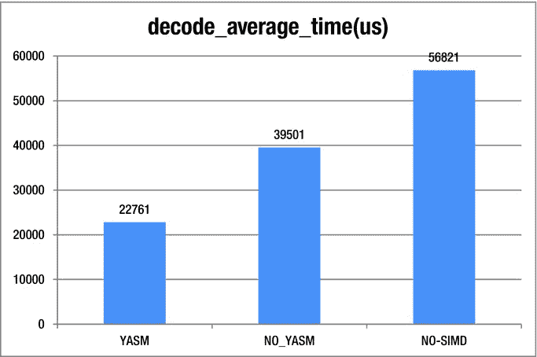

图 12-1 。YASM 比较，单位为纳秒

```java
YASM: -enable yasm –enable asm
NO-YASM: -disable yasm -enable asm
NO-SIMD: -disable yasm -disable asm
```

启用 Yasm 可以显著提高性能。在前面的例子中，仅通过启用 Yasm，平均时间就减少了 57.6%。(同时启用 Yasm 和 asm 时，平均时间下降了 150%；有关 SIMD 和 ASM 的更多信息，请参见本章的下一节。)下载并安装 Yasm 对于许多种类的开源优化项目来说都是很有价值的一步，包括那些基于 x264、Vp8 和 manifestly x86 的项目。

使用 SSE(英特尔的流式 SIMD 扩展)优化色彩空间转换

图像的*颜色空间* 以机器可读的格式表示颜色。正如不同的人可能会将文森特·梵高的*虹膜*描述为“紫色”或“靛蓝”，等离子电视以 RGB 格式呈现颜色 <sup>1</sup> 而这幅画的海报的打印文件使用 CMYK 代码。 <sup>2</sup> 要在这些不同的色彩空间格式之间转换图像，必须进行色彩空间转换。视频一般是 YUV 格式；液晶屏是 RGB 格式；而相机输出一般是 nv21 格式。FFmpeg 提供了`swscale`函数来执行这种转换。对于大型图像文件，色彩空间转换将消耗更多的 CPU 能力，正如您在表 12-1 中看到的。使用英特尔的 SIMD 流扩展(SSE)指令集可以产生 6-16 倍的性能提升。

表 12-1 。SSE 优化

| 

3040×1824 NV21-RGB888

 | 

SWS _ 双线性

 | 

SWS _ FAST _ 双线性

 |
| --- | --- | --- |
| 不使用 Yasm | 425 毫秒 | 158 毫秒 |
| 使用 Yasm | 179 毫秒 | 155 毫秒 |
| 使用 SSE NV21-RGB888 | 27 毫秒 | 27 毫秒 |

SSE (SIMD 技术)是 x86 Android (ARM 有 NEON——也是 SIMD 技术)上最重要的优化技术，尤其是对于多媒体 app。这是因为它提供了全面的性能优化。

什么是 SIMD？

单指令多数据(SIMD) 设备具有多个处理元件，可同时对多个数据点执行相同的操作。大多数现代 CPU 设计包括 SIMD 指令，以提高多媒体性能。英特尔的 Medfield CPUs 支持 MMX、MMX2、SSE、SSE2、SSE3 和 SSSE3，但不支持 SSE4 和 AVX。SIMD 支持也可以在运行时动态检查(参见 FFmpeg 1.0 上的`cpuid`—`cpu.c`上的函数`ff_get_cpu_flags_x86`)。

有三种方法可以实现 SIMD 码。

*   C/C++ 语言级的内在函数，用`emmintrin.h`定义。直到现在，除了 WEBP，很少有开源库使用它。如果 SIMD 代码以这种方式实现，它很容易适应所有的硬件平台。(例如，它可以与 ARM 平台的 NEON 代码互换。)
*   内嵌汇编程序(使用最广泛)。它不需要单独的组装和链接步骤，比单独的组装器更方便。
*   单独的汇编程序。它有多种风格(NASM、TASM、MASM 等)，文件扩展名为`.s`、`.asm`。(扩展名为`.asm`的汇编程序，安卓 NDK 无法正常编译；您必须使用上一节“如何使用 Yasm”中提供的补丁程序)

SIMD 是如何运作的

要添加两个 8 位整数数组，通用 C 代码如下所示:

```java
Int s[16];
for(int i=0;i<16;i++){
     S[i]=data1[i]+data2[i];  //ensure s[i] is 0∼255
}
```

但是如果你使用 SSE，你只需要:

```java
movups data1,xmm1
movups data2,xmm2
paddusb xmm1,xmm2
movntq xmm2,S
```

使用一条指令`paddusb`，可以同时执行 16 个`add`操作。这听起来很棒，但它实际上有局限性。所有的数据必须组织良好，算法可以矢量化。然而，这确实提高了性能，尤其是对于多媒体应用。

SIMD 有五种类型的指令:

*   数据移动，如`movd`、`movq`、`movups`
*   布尔逻辑:`psllw`和`psrlw`
*   数学:`paddb`和`pmulhw`
*   比较 : `pcmpeqb`
*   数据打包:`packssdw`、`punpcklbw`、`pshufb`

数据打包(见图 12-2 和 12-3 )对 SIMD 来说是最困难的部分。在下面两张图中，您可以看到两种不同的操作，它们的组织和结构，以及它们如何执行数据打包过程。

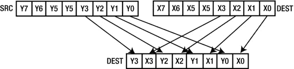

图 12-2 。使用 Punpcklbw 进行数据打包

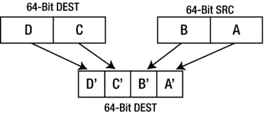

图 12-3 。用 Packssdw 打包数据

压缩混洗字节(`pshufb`)取寄存器中的字节 R =【R0 R1 R2...R15]和 M = [M0 M1 M2...M15]并用 R<sub>M0</sub>R<sub>M1</sub>R<sub>M2</sub>代替 R...r<sub>M15</sub>；除了如果 M <sub>i</sub> 的最高位被置位，它用 0 替换第 I 个条目。这显示在以下代码中:

![image

```java
R0 := (mask0 & 0x80) ? 0 : SELECT(a, mask0 & 0x07)
R1 := (mask1 & 0x80) ? 0 : SELECT(a, mask1 & 0x07)
...
R15 := (mask15 & 0x80) ? 0 : SELECT(a, mask15 & 0x0f)
```

`pshufb`指令可以根据 128 位掩码将任意 8 位数据放入任意位置。

实施 NV21-RGB SSE 代码

FFmpeg `yuv2rgb`是 MMX2 码，所以必须先修改成 SSE 码，因为 MMX 是 8 位对齐，SSE 是 16 位对齐。您必须将数据放大到 16 位:

1.  Modify `swscale_internal.h` and `yuv2rgb_mmx.c`:

    ```java
    DECLARE_ALIGNED(8, uint64_t, redDither);
    ==>
    DECLARE_ALIGNED(16, uint64_t, redDither);
    DECLARE_ALIGNED(8, uint64_t, redDither1);

    DECLARE_ASM_CONST(16, uint64_t, mmx_redmask) = 0xf8f8f8f8f8f8f8f8ULL;
    ==>
    DECLARE_ASM_CONST(8, uint64_t, mmx_redmask1) = 0xf8f8f8f8f8f8f8f8ULL;
    DECLARE_ASM_CONST(16, uint64_t, mmx_redmask) = 0xf8f8f8f8f8f8f8f8ULL;
    ```

    现在`redDither`和`mmx_redmask`可以作为 8 位数据或者 16 位数据。

2.  Change the `mov` and `mm` instructions:

    ```java
    #if HAVE_SSE2
         #define MM1 "%xmm"
         #define MM "%%xmm"
         #define MOVD "movq"
         #define MOVQ "movups"
         #define MOVNTQ "movntps"
         #define SFENCE "sfence"
         #define SIMD8   "16"
    #else
    #if HAVE_MMX2
         #define MM1 "%mm"
         #define MM "%%mm"
         #define MOVD "movd"
         #define MOVQ "movq"
         #define MOVNTQ "movntq"
         #define SFENCE "sfence"
         #define SIMD8 "8"
    #endif
    ```

    MMX 使用一个`mm`寄存器，而 SSE 使用一个`xmm`寄存器。因为 SSE 有 128 位数据长度(16 字节)，所以使用 SSE 时数据偏移量是 16(SIMD 8 是 16)。

3.  `RGB_PACK24` must be rewritten due to fact that the data length of MMX and SSE are different.

    ```java
    DECLARE_ASM_CONST(16, uint8_t, rmask1[16]) = {0x00,0x80,0x80,0x01,0x80,0x80,0x02,0x80,0x80,0x03,0x80,0x80,0x04,0x80,0x80,0x05};
    ...
    MOVQ"      "MM""red",          "MM"5 \n"\
    "pshufb    "MANGLE(rmask1)",   "MM"5 \n"\
    MOVNTQ"    "MM"5,              (%1) \n"\
    ```

    这里用的是`pshufb`。关键思想是用`pshufb`把每个 R，G，B 值放到正确的位置，用它得到`RGB888`数据。以下代码显示了每个 RGB 段由什么组成。例如，RGB0 是 R0、G0 和 B0。

    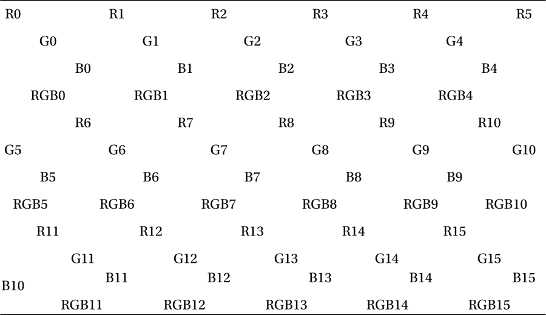

4.  添加`ff_nv2rgb_init_mmx`，在`ff_get_unscaled_swscale` :

    ```java
        /* yuv2bgr */
        if ((srcFormat==PIX_FMT_YUV420P || srcFormat==PIX_FMT_YUV422P || srcFormat==PIX_FMT_YUVA420P) && isAnyRGB(dstFormat)
            && !(flags & SWS_ACCURATE_RND) && !(dstH&1)) {
            c->swScale= ff_yuv2rgb_get_func_ptr(c);
        }
        /* nv2bgr */
        if (srcFormat==PIX_FMT_NV21 && isAnyRGB(dstFormat)&& !(flags & SWS_ACCURATE_RND) && !(dstH&1)) {
            c->swScale= ff_nv2rgb_get_func_ptr(c);
        }
    ```

    函数中添加`ff_nv2rgb_get_func_ptr`

如何使用 Android 4.0 NDK 显示图像

`Surface_lock`和`Surface_unlockAndPost`可用于 NDK 层，在设备上显示图像。这两个功能在安卓 4.0 上从`libsurfaceflinger_client.so`移到`libgui.so`，又移到`libui.so`。

使用`nm` (Windows 为`nm.exe`)可以对`libui.so`进行分析。比如在 Windows 上，可以用`nm.exe libui.so >>1.txt`，用`open 1.txt`找`Surface_lock`。可以找到字符串`"_ZN7android7Surface4lockEPNS0_11SurfaceInfoEPNS_6RegionE"`，配合`dlsym`使用，然后从`libui.so`获取函数句柄。

```java
    clz = (*env)->GetObjectClass(env, s);
    f_Surface_mSurface = (*env)->GetFieldID(env, clz, "mSurface", "I");
    if (f_Surface_mSurface == 0)
    {
        jthrowable e = (*env)->ExceptionOccurred(env);
        if (e)
        {
            (*env)->DeleteLocalRef(env, e);
            (*env)->ExceptionClear(env);
        }
        f_Surface_mSurface = (*env)->GetFieldID(env, clz, "mNativeSurface", "I");
    }
    (*env)->DeleteLocalRef(env, clz);
    surface = (*env)->GetIntField(env, s, f_Surface_mSurface);
```

有了这个，就可以添加`jni`函数上面的代码；它接收 Java 层表面对象，并从该对象获取表面句柄。`f_Surface_mSurface`和 Surface_lock 和`Surface_unlockAndPost`函数可用于显示 NDK 图层上的图像。

通用交叉编译脚本

开源配置文件一般可以用于 Android 的交叉编译。以下是 x86 平台的通用脚本。它使用 SSE 来优化 JPEG 编码和解码。

```java
#!/bin/bash

HOSTCONF=x86
BUILDCONF=i686-pc-linux-gnu
NDK=$ANDROID_NDK_ROOT

TOOLCHAIN=$NDK/toolchains/x86-4.4.3/prebuilt/linux-x86
PLATFORM=$NDK/platforms/android-14/arch-x86
PREFIX=/home/lym/libjpeg-turbo-1.2.1/android/x86
ELF=$TOOLCHAIN/i686-android-linux/lib/ldscripts/elf_i386.x

export ARCH=x86
export SYSROOT=$PLATFORM
export PATH=$PATH:$TOOLCHAIN/bin:$SYSROOT
export CROSS_COMPILE=i686-android-linux
export CC=${CROSS_COMPILE}-gcc
export CXX=${CROSS_COMPILE}-g++
export AR=${CROSS_COMPILE}-ar
export AS=${CROSS_COMPILE}-as
export LD=${CROSS_COMPILE}-ld
export RANLIB=${CROSS_COMPILE}-ranlib
export NM=${CROSS_COMPILE}-nm
export STRIP=${CROSS_COMPILE}-strip
export CFLAGS="-I$PLATFORM/usr/include -O3 -nostdlib -fpic -DANDROID -fasm -Wno-psabi -fno-short-enums -fno-strict-aliasing -finline-limit=300 -fomit-frame-pointer -march=i686 -msse3 -mfpmath=sse"
export CXXFLAGS=$CFLAGS
export LDFLAGS="-Wl,-T,$ELF -Wl,-rpath-link=$PLATFORM/usr/lib -L$PLATFORM/usr/lib -nostdlib -lc -lm"

./configure  --enable-shared --host=$HOSTCONF --build=$BUILDCONF  --with-sysroot=$SYSROOT --prefix=$PREFIX
make clean
make  -j4 install
```

受益于 x86 平台的悠久历史，几乎所有开源项目都在 x86 平台上进行了优化，尤其是在多媒体领域。大量的算术函数被写入 SIMD 代码

(FFmpeg)、vp8、x264 和 OpenCV)。通常，您需要选择正确的源代码并使用正确的编译脚本。必要时，可以在 Linux 上调试 NDK 汇编代码。

使用硬件加速进行测试和分析

在 Android 4.0 NDK 中，视频和音频解码基于 OpenMAX AL 1.0.1，允许软件和硬件解码。由 Khronos 集团开发的 OpenMAX(开放媒体加速)是一个免版税的跨平台 API。它的 C 语言编程接口集为音频、视频和静态图像提供了对象抽象。它允许这些资源在各种平台上轻松移植。它面向处理或消费大量多媒体数据的设备，尤其是嵌入式和移动设备，如智能手机和平板电脑。OpenMAX 有三层接口，如图图 12-4 所示——应用层(AL)、集成层(IL)、开发层(DL)。

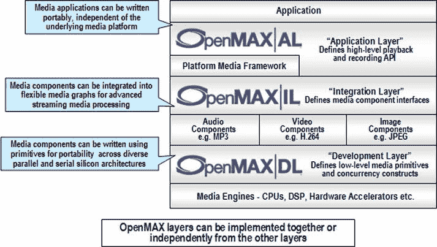

图 12-4 。OpenMAX 图层

使用集成层(IL) 进行硬件编码

在 Android 4.1 之前，谷歌没有向开发者公开任何硬件编解码接口，所以大量多媒体 app 不得不使用 FFmpeg、x264、VP8 作为视频编解码。尤其是视频编码时，软件编码会占用大部分 CPU 资源(640×480 H.264 编码对于一个 ARM v9 1.2-GHz 双核会占用近 90%的 CPU 资源)。这对 Android 设备的性能是一个巨大的消耗。所以直到 4.1 版本，还没有为 Android 开发出精彩的视频录制应用。开发者和用户的兴趣当然是存在的，但是这样的应用是不可行的。现在，开发人员可以使用 OpenMAX 集成层(IL)来获得硬件编码器接口。(澄清一下，ARM 和 Intel 架构都可以使用这种方法进行硬件编码，但是 ARM 架构会遇到兼容性问题。)OpenMAX IL 由不同的供应商实现，谷歌不保证它的兼容性，因此不能保证它在所有支持 Android 的硬件系统上都能很好地工作。但是对于基于英特尔架构的 Android，兼容性问题已经得到解决。

如何在面向英特尔架构的 Android 上获得 OMX-伊尔界面

`Libwrs_omxil_core_pvwrapped.so`是 Medfield 英特尔架构平台上的 OMX-IL 接口层。开发人员可以如下加载它来访问 OMX-伊尔接口。

```java
pf_init = dlsym( dll_handle, "OMX_Init" );
pf_deinit = dlsym( dll_handle, "OMX_Deinit" );
pf_get_handle = dlsym( dll_handle, "OMX_GetHandle" );
pf_free_handle = dlsym( dll_handle, "OMX_FreeHandle" );
pf_component_enum = dlsym( dll_handle, "OMX_ComponentNameEnum" );
pf_get_roles_of_component = dlsym( dll_handle, "OMX_GetRolesOfComponent" );
```

得到这些句柄后，就可以调用`pf_component_enum`和`pf_get_roles_of_component`来得到正确的硬件编码接口。这里列出了所有的视频编解码接口:

```java
component OMX.Intel.VideoDecoder.AVC
  - role: video_decoder.avc
component OMX.Intel.VideoDecoder.H263
  - role: video_decoder.h263
component OMX.Intel.VideoDecoder.WMV
  - role: video_decoder.wmv
component OMX.Intel.VideoDecoder.MPEG4
  - role: video_decoder.mpeg4
component OMX.Intel.VideoDecoder.PAVC
  - role: video_decoder.pavc
component OMX.Intel.VideoDecoder.AVC.secure
  - role: video_decoder.avc
component OMX.Intel.VideoEncoder.AVC
  - role: video_encoder.avc
component OMX.Intel.VideoEncoder.H263
  - role: video_encoder.h263
component OMX.Intel.VideoEncoder.MPEG4
  - role: video_encoder.mpeg4
```

可以根据自己的需求选择合适的组件。比如要做 MP4 编码，可以选择`OMX.Intel.VideoEncoder.MPEG4`，调用`pf_get_handle`获取硬件 MP4 编码句柄。

OMX-IL 是如何工作的？

为了创建或配置和连接 OpenMAX 组件，应用被编写为集成层(IL)客户端。该 IL 客户端用于调用不同组件的 OpenMAX APIs，如图 12-5 所示。在这个应用中，组件分配视频缓冲区以响应 IL 客户端上的 OMX API。IL 客户端负责从一个组件获取缓冲区，并将它们传递给其他组件。功能`OMX_GetParameter`和`OMX_SetParameter`用作参数/配置`set`，而`get. OMX_SendCommand`用于向组件发送命令，包括启用/禁用端口命令和状态改变命令。`OMX_EmptyThisBuffer`和`OMX_FillThisBuffer`将缓冲区传递给组件。调用`pf_get_handle`时必须注册`OmxEventHandler`、`OmxEmptyBufferDone`和`OmxFillBufferDone (OMX_CALLBACKTYPE)`。

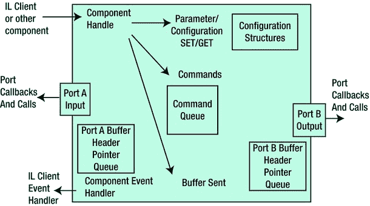

图 12-5 。OpenMAX 组件和集成层客户端

分配 OMX 缓冲区并调用`OMX_SendCommand`设置`OMX_StateExecuting`状态后，就可以使用`FillThisBuffer`和`EmptyThisBuffer`及其回调函数做硬件编码了。图 12-6 显示了调用顺序。

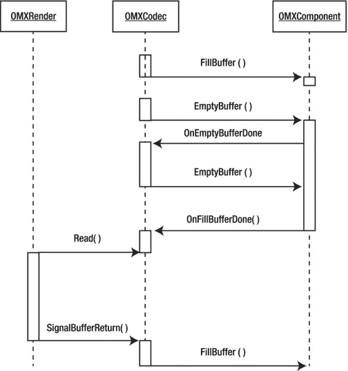

图 12-6 。OMX-伊尔渲染管道

调用`FillThisBuffer`将一张 raw 图片填充到 OMX 本地缓冲区，调用`EmptyThisBuffer`让 OMX 组件进行硬件编码；当你完成编码或者当本地输出缓冲区已满时，OMX 组件将调用`OnEmptyThisBufferDone`来告诉客户端再次执行`EmptyThisBuffer`。所以一个`FillThisBuffer`可能会产生几个`OnEmptyThisBufferDone`的实例。如果 OMX 组件发现输入缓冲区是空的，它将调用`OnFillThisBufferDone`来告诉客户端填充更多的缓冲区空间。

演示:特效录像机

在本节中，您将使用硬件视频编码器来实现特殊效果视频录像机。这个想法是从相机获取数据，并在相机预览图像中添加一个标记。重新编码时，应将标记记录到视频文件中。这听起来是一个简单的设计，但在 Android 4.1 之前，唯一的选择是软件编码器(FFmpeg 或 x264)，这会浪费大量的 CPU 资源。从 Android 4.1 开始，引入了新的类`MediaCodec`；它与 OMX-IL 相同，但由谷歌实现，谷歌保证其兼容性。

表 12-2 展示了三台录像机的 CPU 使用情况。录像机文件格式为. MP4，使用 MPEG-4 编码器。一般来说，VP8 视频编码对 CPU 的占用最少，其次是 MPEG-4 编码，而 H.264 编码占用的 CPU 资源最多)。

表 12-2 。硬件与软件编码器

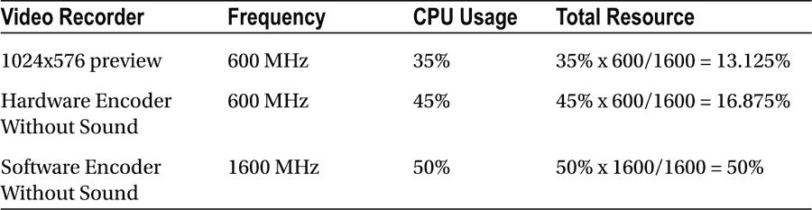

如果您使用硬件编码器，所需的总 CPU 资源仅为 3.7%(硬件编码–预览)，而软件编码器将需要 46.9%。本例中使用的分辨率为 1024×576。如果想要 1080P 的视频录制，软件解决方案是不可能的！

封装一个硬件视频编码器库

下面的代码展示了一个名为`libomx.so`的动态库。它提供了三个简单的功能— `EncInit`、`EncVideo`和`EncRelease`。用法也很简单——你调用`EncInit`初始化硬件编码器，调用`EncVideo`做硬件编码，调用`EncRelease`释放硬件编码器。两个主要结构是`stEncConfig`和`stEncPic`:

```java
–    stEncConfig (use in EncInit)
–         stcfg.id = ENC_MPEG4;      //choose the encoder
–         stcfg.type = ENC_DEFAULT;  //for feature use, now must this value
–         stcfg.w=1080;              //encoding size
–         stcfg.h=1920;
–         stcfg.framerate = 15;      //encoding framerate
–         stcfg.controlrate = enum OMX_VIDEO_CONTROLRATETYPE;
–         stcfg.bitrate = xxxx;      //your bitrate

–    stEncPic(use in EncVideo)
–         pic.w=1080;                //picture size
–         pic.h=1920;
–         pic.stride = 1080;         //picture stride
–         pic.pbuf[0]=pmem;          //yuv420 image data
–         pic.pbuf[1]=pmem+1920*1080;
–         pic.pbuf[2]=pmem+1920*1080/4;
```

实现相机预览

因为不能使用通用的 Google Android API 来开发这个演示，所以必须实现摄像头预览。我推荐用`setPreviewCallbackWithBuffer`来获取相机预览数据。虽然`setPreviewCallbackWithBuffer`和`setPreviewCallback`都可以获得预览数据，但是前者更高效，并且会避免 Java 垃圾收集。

准则:为频繁使用保留足够的内存。这样做可以避免伪 Java 垃圾收集。

在预览回调，你应该传递图像数据到 NDK 层；不要添加不必要的代码。我添加了`camera.getParameters().getPreviewSize().width`作为例子来说明它消耗了大量的 CPU 资源。

准则:尽可能少地调用任何对象函数。将其值赋给一个变量，并使用该变量。

在 NDK 层，将预览数据从 NV21 转换为 RGB565(或 RGB88，根据您的屏幕配置)，然后将数据显示到屏幕上(使用`Surface_lock`和`Surface_unlockAndPost`)。

用 Traceview 分析 Java 代码

您可以使用 Traceview 来分析 Java 代码的性能。Traceview 已经通过一个新的插件集成到 Eclipse 中。该插件与 DDMS 插件集成在一起，因此使用开始/停止概要分析按钮将直接在 Eclipse 中打开跟踪，而不是启动独立的工具。此外，如果您按住 Ctrl 键单击(在 Mac 上按住 Command 键单击)某个方法，它将在编辑器中打开源文件(您必须添加`android:debuggable="true"`)。

选择正确的包名`com.Filters`，按开始方法剖析，如图 12-7 所示。等待一会儿，然后停止剖析:你可以在图 12-8 的中看到跟踪结果。

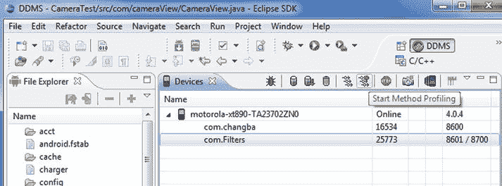

图 12-7 。在 Eclipse 中使用过滤器

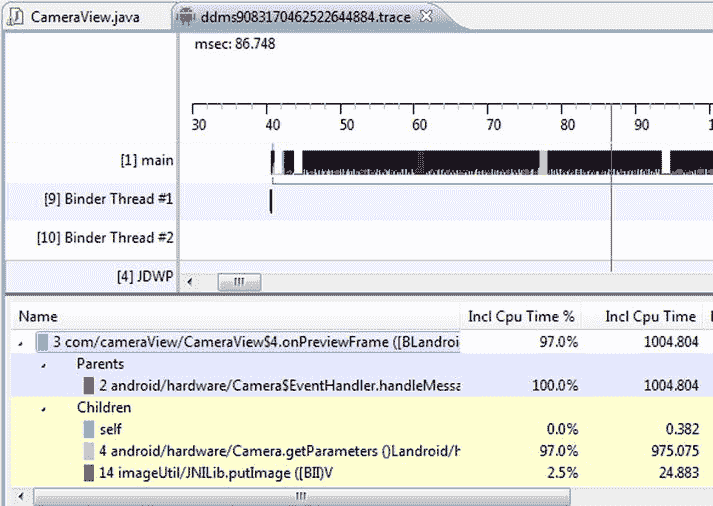

图 12-8 。剖析相机应用

从结果中，很容易看出`Camera.getParameters`将耗费大部分 CPU 资源(97%)。那就是`PreviewCallback`里的`camera.getParameters().getPreviewSize().width`。Traceview 只能分析 Java 代码。如果您想评测 NDK 代码，可以使用英特尔工具 VTune，它可以从`http://software.intel.com/en-us/intel-vtune-amplifier-xe`获得。

启动记录线程

要在 FFmpeg 中引用来自`-example.c`的输出，您可以使用它作为基础版本。剩下的工作是确定如何在记录线程中获取视频和声音数据。总体思路是，一旦获得一帧视频(或音频)，就可以锁定缓冲区并调用一个记录线程开始工作。然而，这是非常低效的。相机预览线程、音频线程和硬件记录线程的并行性已经被破坏，大多数时候，CPU 只是等待。这就是`CircleBuffer`类的用武之地；生产者(相机预览线程、音频线程)会谨慎地将缓冲区填充到`CircleBuffer`(如果缓冲区已满，只需重叠最后一个缓冲区，这样即使记录线程很慢，数据也会一直刷新)，消费者会谨慎地从中获取缓冲区(如果缓冲区为空，可以选择获取前一个缓冲区或等待)。

*准则:尽可能保持所有线程的并行性。* `CircleBuffer` *一般是不错的选择。*

添加特殊效果

现在，视频原始数据已经在 NDK 图层上处理过了，所以你可以很容易地添加特殊效果，比如视频标记。只需将您的标记图像(Y 数据，丢弃 UV 数据)阿尔法混合到视频原始数据中。这项工作可以由 CPU 完成，也可以由 GPU 完成。事实上，谷歌视频录制也支持有限(非常有限)的视频效果。它使用 GPU 而不是 CPU 来降低 CPU 负载。GPU 渲染(OpenGL-ES)非常复杂，很难理解。即使代码很简单，开发人员也应该对 OpenGL 有深入的了解。这里我只是解释一下 GPU 渲染的一个基本工作流程。

1.  获取并初始化默认的 EGL 显示。

    ```java
    EGLDisplay eglDisplay = eglGetDisplay(EGL_DEFAULT_DISPLAY);
    eglInitialize(mEglDisplay, &majorVersion, &minorVersion);
    ```

2.  创建一个只有一个元素的整数数组。它将保存返回值，该值指示与由`configAttributes`数组指定的属性相匹配的 EGL 配置的数量。创建一个包含一个元素的`EGLConfig`数组来存储匹配属性的第一个 EGL 配置。调用`eglChooseConfig()`并作为参数提供您在步骤 1 中初始化的`EGLDisplay`对象、指定要匹配的配置属性的数组、第一个匹配的`EGLConfig`对象的占位符、`EGLConfig`占位符的大小以及存储匹配的配置数量的`num_configs`数组。将来自`eglConfigs`数组的单个配置存储在`EGLConfig`变量`eglConfig`中。

    ```java
    EGLint configAttribs[] = {
        EGL_SURFACE_TYPE, EGL_WINDOW_BIT,
        EGL_RENDERABLE_TYPE, EGL_OPENGL_ES2_BIT,
        EGL_RED_SIZE, 8,
        EGL_GREEN_SIZE, 8,
        EGL_BLUE_SIZE, 8,
        EGL_NONE
    };
    eglChooseConfig(mEglDisplay, configAttribs, &config, 1, &numConfigs);
    ```

3.  调用`eglCreateWindowSurface()`创建一个 EGL 表面，并提供`eglDisplay`和`eglConfig`作为参数，它们是您在步骤 1 和 2 中设置的`EGLDisplay`和`EGLConfig`的实例。在下面的代码示例中，从一个从`Screen`类派生的类中调用`eglCreateWindowSurface()`，该参数将`EGLSurface`对象绑定到当前屏幕。

    ```java
    eglCreateWindowSurface(mEglDisplay, config,mNativeWindow.get(), NULL);
    ```

4.  调用`eglCreateContext()`创建一个 EGL 上下文。

    ```java
    eglCreateContext(mEglDisplay, config, EGL_NO_CONTEXT,contextAttribs);
    ```

5.  调用`eglMakeCurrent()`将 EGL 上下文绑定到 EGL 表面和 EGL 显示。

    ```java
    eglMakeCurrent(mEglDisplay, mEglSurface, mEglSurface, mEglContext);
    ```

6.  创建程序和加载着色器到 EGL。你的特效函数需要实现为一个着色器。

    ```java
    loadShader(GL_FRAGMENT_SHADER, fSrc[i], &fShader);
    createProgram(vShader, fShader, &mProgram[i]);
    ```

7.  做渲染。

    ```java
    glTexSubImage2D(GL_TEXTURE_2D, 0, 0, 0, mFrameWidth, mFrameHeight, GL_RGB, GL_UNSIGNED_SHORT_5_6_5, pixels);
    glDrawElements(GL_TRIANGLES, 6, GL_UNSIGNED_BYTE, 0);
    ```

8.  如果你想看 EGL 的图像，你可以打电话给`glReadPixels`。

其实，你也可以用`GLSurfaceView` **。**一个`GLSurfaceView`提供以下功能:

*   管理一个 surface，它是一块特殊的内存，可以合成到 Android view 系统中。
*   管理 EGL 显示，这使 OpenGL 能够呈现到图面中。
*   接受用户提供的进行实际渲染的渲染器对象。
*   在专用线程上呈现，以将呈现性能与 UI 线程分离。
*   支持按需渲染和连续渲染。
*   可选地包装、跟踪和/或错误检查渲染器的 OpenGL 调用。

有关`GLSurfaceView`**的更多信息，请查看`http://developer.android.com/reference/android/opengl/GLSurfaceView.html`。你可以在`http://www.learnopengles.com/how-to-use-opengl-es-2-in-an-android-live-wallpaper`找到它的样品。**

 **在 Android 4.0 上使用 OpenMAX AL

OpenMAX AL API 通过为系统的媒体回放和录制功能提供通用抽象，为应用级多媒体解决方案提供跨一系列平台的可移植性。API 围绕一组高级对象组织这种抽象。应用从一个“引擎”对象获取所有对象，该对象封装了一个 OpenMAX AL 会话，并作为所有其他对象的保护伞。

使用原生多媒体 API (OpenMAX AL)的优势

从 Android 4.0 开始，谷歌包括了基于 Khronos group OpenMAX AL 1.0.1 标准的 Android 原生多媒体 API，截至 Android API level 14 (Android 平台版本 4.0)及更高版本。它为低级流式多媒体提供了直接、高效的路径。对于需要在将媒体数据传递给平台进行呈现之前保持对媒体数据的完全控制的应用来说，新路径是理想的。

例如，媒体应用现在可以从任何来源检索数据，应用专有的加密/解密，然后将数据发送到平台进行显示。应用现在还可以将处理后的数据作为 MPEG-2 传输流格式的音频/视频内容的多路复用流发送到平台。该平台对内容进行解复用、解码和呈现。音频轨道被渲染到活动的音频设备，而视频轨道被渲染到`Surface`或`SurfaceTexture`。当渲染到一个`SurfaceTexture` 流格式时，应用可以使用 OpenGL 对每一帧应用后续的图形效果。

 **注意**虽然它基于 OpenMAX AL，但 Android 原生多媒体 API 并不是 OpenMAX AL 1.0.1 配置文件(媒体播放器或媒体播放器/记录器)的符合实现。这是因为 Android 没有实现任何一个配置文件所需的所有特性。在接下来的“Android 扩展”一节中描述了任何已知的 Android 行为与规范不同的情况。Android OpenMAX AL 实现具有有限的功能，主要用于某些对性能敏感的本地流媒体应用，如视频播放器。表 12-3 表示 Android 的 OpenMAX AL 实现支持的对象和接口。阴影单元格表示该功能受支持。

表 12-3 。Android 的 OpenMAX AL 实现支持的对象和接口

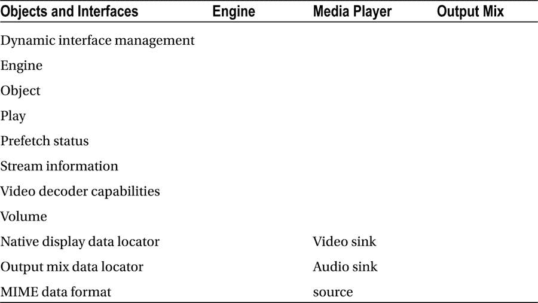

演示:流媒体播放器

Google 提供了一个流媒体播放器的样本。您可以在您的`android-sdk`文件夹中查看`samples\native-media\jni \native-media-jni.c`中的样本。函数`Java_com_example_nativemedia_NativeMedia_createStreamingMediaPlayer`将创建一个本地流媒体播放器。

用法很简单，但是你要注意两点:

*   视频源必须是 NativeWindow。可以调用`ANativeWindow_fromSurface`从`Surface`获取原生窗口，它是从 Java 层传过来的。而`Surface`必须是`GLSurfaceView`才能保证硬件渲染。
*   用于填充流缓冲区的寄存器`XA_ANDROIDBUFFERQUEUEEVENT_PROCESSED`回调。这个演示是从一个文件中读取缓冲区，但是你也可以从网上读取缓冲区，这样你就可以实现一个 P2P 流媒体播放器。

使用强大的媒体 API:Android 4.1 上的 MediaCodec

Android 有一个很棒的媒体库，允许各种强大的动作。直到最近，还没有编码和解码音频/视频的方法，这使得开发人员几乎可以做任何事情。幸运的是，Jelly Bean 版本引入了`android.media.MediaCodec` API。它的设计遵循与 OpenMAX(媒体行业的知名标准)相同的原则和架构，从纯粹的高级媒体播放器过渡到编码器/解码器级别。

示例代码:音频解码器

此示例代码显示了如何实现解码器。它使用两个类— `MediaCodec` 和`MediaExtractor. MediaExtractor`来促进从数据源中提取解复用的(通常是编码的)媒体数据。`MediaCodec`当然是用作低级编解码器。

首先你应该使用`MediaExtractor` 来获取媒体格式:

```java
MediaExtractor extractor = new MediaExtractor();
extractor.setDataSource(sampleFD.getFileDescriptor(),sampleFD.getStartOffset(), sampleFD.getLength());
MediaFormat format = extractor.getTrackFormat(0);
```

其次，可以创建`MediaCodec`并进行配置。

```java
MediaCodec codec;
ByteBuffer[] codecInputBuffers;
ByteBuffer[] codecOutputBuffers;

MediaCodec codec = MediaCodec.createByCodecName(name);
codec.configure(format, null,null,0);  //no display, so surface is null
codec.start();
```

最后，你做解码。像 OMX-伊尔一样，它有两个港口。你要调用`dequeueInputBuffer`发送解码缓冲到`MediaCodec`，调用`dequeueOutputBuffer`?? 接收外部缓冲。

```java
int inputBufIndex = codec.dequeueInputBuffer(TIMEOUT_US);
if (inputBufIndex >= 0) {
    ByteBuffer dstBuf = codecInputBuffers[inputBufIndex];
    int sampleSize = extractor.readSampleData(dstBuf, 0);
    long presentationTimeUs = 0;
    if (sampleSize < 0) {
            sawInputEOS = true;  sampleSize = 0;
    } else {
            presentationTimeUs = extractor.getSampleTime();
    }
    codec.queueInputBuffer(inputBufIndex, 0, sampleSize,
                    presentationTimeUs,
                    sawInputEOS ? MediaCodec.BUFFER_FLAG_END_OF_STREAM : 0);
    if(!sawInputEOS){
            extractor.advance();
    }
}
final int res = codec.dequeueOutputBuffer(info, TIMEOUT_US);
if(res >= 0){
        int outputBufIndex = res;
        ByteBuffer buf = codecOutputBuffers[outputBufIndex];
        final byte[] chunk = new byte[info.size];
        buf.get(chunk);
        buf.clear();
        if(chunk.length > 0){
               audioTrack.write(chunk,0,chunk.length);
        }
        codec.releaseOutputBuffer(outputBufIndex, false);
        if((info.flags && MediaCodec.BUFFER_FLAG_END_OF_STREAM) != 0){
                sawOutputEOS = true;
        }
} else if(res == MediaCodec.INFO_OUTPUT_BUFFERS_CHANGED){
        codecOutputBuffers = codec.getOutputBuffers();

} else if(res == MediaCodec.INFO_OUTPUT_FORMAT_CHANGED){
        final MediaFormat offormat = codec.getOutputFormat();
mAudioTrack.setPlaybackRate(oformat.getInteger(MediaFormat.KEY_SAMPLE_RATE));
}
```

在 NDK 使用 media codec

`MediaCodec`是一个 Java 层类，但是你必须用 C 代码进行解码(或编码)，这是在 NDK 层。因此，在 NDK 中调用 Java 类是很重要的。这可以通过使用`jni`功能`FindClass`来完成。

这里显示了`FindClass`的示例代码:

```java
jclass audio_record_class = jni_env->FindClass("android/media/AudioRecord");
int size = jni_env->CallStaticIntMethod(audio_record_class
,jni_env->GetStaticMethodID(audio_record_class,"getMinBufferSize", "(III)I")
              ,prefered_rate
              ,2/*CHANNEL_CONFIGURATION_MONO*/
              ,2/*  ENCODING_PCM_16BIT */);
```

用 surface 配置`MediaCodec`将提供最佳性能，因为它可以使用硬件渲染。您可以引用本地媒体(例如，OpenMAX AL)来添加表面(或 GLSurfaceView)。如果你使用的是普通的 surface，你可以使用 textview 作为字幕，imageview 作为播放栏。如果您使用的是 GLSurfaceView，可以扩展这个类并实现自己的渲染器。

概述

目前只有两种硬件加速技术可以用在 Android 应用层:OpenGL 和 OpenMAX。OpenGL 包括 NDK 中的 GLSurfaceView 和 OpenGL-ES 1.0 和 2.0，它通常用作渲染器或用于多媒体效果处理。OpenMAX 包括 NDK 的 OpenMAX AL、MediaCodec 和 OMX-IL(不是 Google 代码，但必须由作者实现)。每种技术都有使用场景和适用的 Android 版本。到目前为止，流行的 Android 版本是 2.3 和 4.0，所以本章只介绍了从 Android 2.3 到 Android 4.1 的版本。表 12-4 表示哪些硬件加速器可以与哪个版本的 Android 配合使用。

表 12-4 。硬件加速器与安卓版本的兼容性

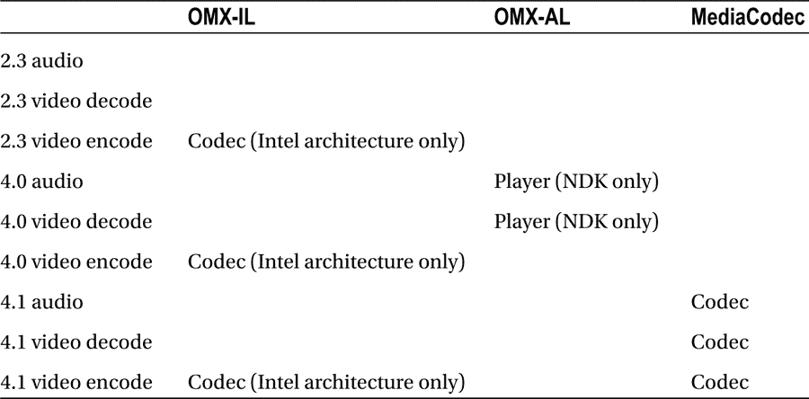

OpenGL 比较复杂但是使用场景相对固定(视频效果和图像处理)，所以表格只列出了 OpenMAX 的用法。

Android 4.1 `MediaCodec` 是多媒体应用的重要更新。它让应用能够在编码前或解码后处理图像。即使在 Android 4.1 之前，在英特尔架构上使用 Android 也可以获得这种能力，在 4.1 之后，硬件加速仍然可以提供越来越好的效果。

<sup>1</sup> 红绿蓝(RGB)码是基于光的三原色的加色模型。虹膜的颜色表示为 69、102、137。

<sup>2</sup> 虹膜的 CMYK 值为 50、26、0、46。**