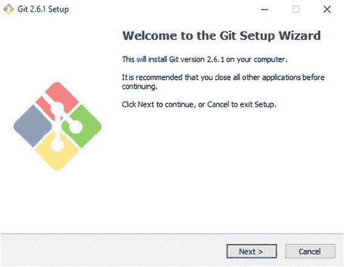
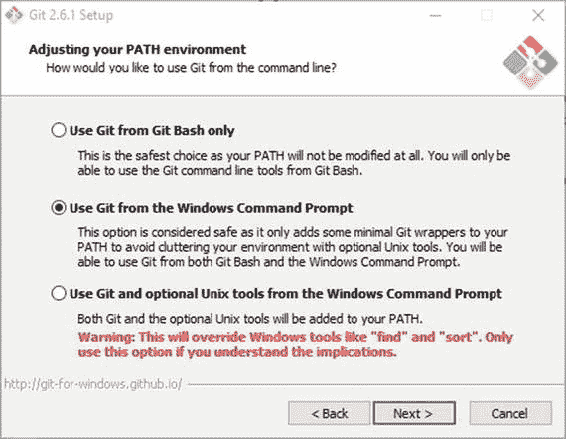
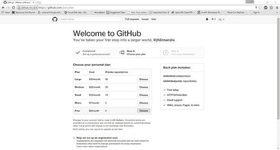
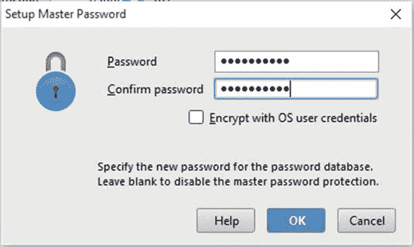
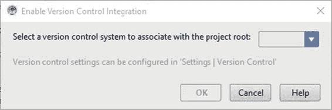
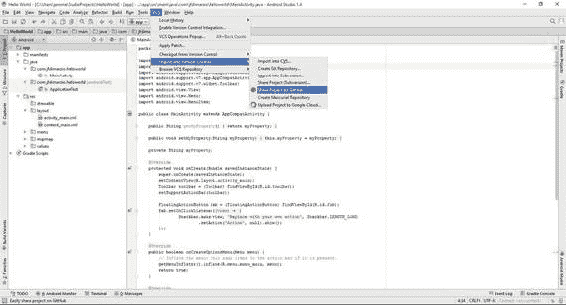
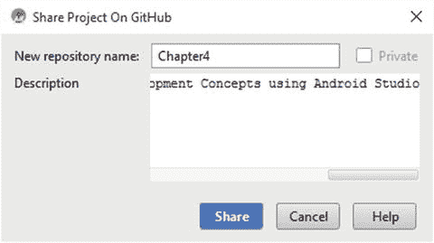

# 四、作为您的 VCS 的 GitHub

在本章中，您将在 Android Studio 中设置一个版本控制系统(VCS) 。这将是接近游戏设计概念之前的最后一个设置步骤。

那么什么是版本控制系统呢？在最基本的层面上，VCS 是一个存储库，用于存储不同的版本，或者保存您的代码变更。例如，当您在计算机上处理一个 Word 文档时，您对该文档所做的任何更改都会覆盖您系统上该文档的任何先前版本；只留给您最近的一组更改。在软件开发中，这是一个不太理想的结果。很多时候，在你意识到有一个更好的方法来基于你在保存你的改变之前所拥有的东西做一些事情之前，你可能已经进行了几天的改变。

VCS 可以让您返回并访问您以前保存的任何内容。然而，这并不是好的 VCS 的唯一伟大特征。VCS 的另一个特点是它允许你在所有的项目上进行合作。朋友、同事和公众信任的成员可以被允许查看甚至分支你的基本代码的变更。这使得创建和使用软件的过程成为一种共享的体验。如果您不希望其他人查看或更改您的代码，您只需使用一个私有存储库——一个只有您可以访问的存储库。

虽然有许多版本控制系统可供您使用，但我们在本书中重点介绍的是 GitHub。

要使用 GitHub，你首先需要的是 Git。Git 是 GitHub 给你的版本控制库。Git 可以从 http://git-scm.com/download 的 [下载安装。Git 安装向导如](http://git-scm.com/download)[图 4-1](#Fig1) 所示。

###### [图 4-1](#_Fig1) 。Git 安装向导

虽然你通常可以接受所有的默认设置，但如果你运行的是基于 Windows 的系统，我会建议你从 Windows 命令提示符选项中选择使用 Git，如图 4-2 所示。

###### [图 4-2](#_Fig2) 。从 Windows 命令提示符选项中选择使用 Git

一旦 Git 安装在您的系统上，您就可以设置一个 GitHub 帐户。

## 设置 GitHub 帐户

在您可以将 GitHub 添加为您的版本控制系统之前，您必须在 http://github.com 创建一个帐户。账户创建界面位于 GitHub 的主页上，如[图 4-3](#Fig3) 所示。

###### [图 4-3](#_Fig3) 。 GitHub 的账户创建页面

一旦您创建了您的帐户，您必须指定一个计划。计划从免费到每月 50 美元不等。这两个计划的主要区别在于您获得的私有存储库的数量。GitHub 的免费版本不允许你使用私有库。计划选择页面如[图 4-4](#Fig4) 所示。

###### [图 4-4](#_Fig4) 。GitHub 计划选择页面

一旦您选择了您的计划，请单击页面底部的“完成注册”按钮。这就是设置 GitHub 的全部内容。现在我们来设置 Android Studio 端。

## 在 Android Studio 中设置 VCS

在 Android Studio 中将 GitHub 设置为你的 VCS 应该是一个相当轻松的过程。首先，点击文件菜单，进入设置。在设置菜单中，展开版本控制并选择 GitHub，如图 4-5 所示。

###### [图 4-5](#_Fig5) 。在版本控制设置窗口选择 GitHub

在窗口的右侧，系统会提示您输入在上一节中创建的 GitHub 帐户信息。将主机保留为默认设置—github.com。提供您的登录名和密码，然后单击“应用”。

鉴于这应该是你第一次在 Android Studio 中添加带密码的东西，你应该会收到一个弹出窗口，要求你设置主密码——如下图 4-6 所示。此主密码用于存储您所有帐户密码的密码数据库。我建议不要把这个密码设置成和你在 GitHub 上使用的密码一样。

###### [图 4-6](#_Fig6) 。主密码弹出

设置好您的主密码后，您可以单击“确定”来完成该过程。

**注意** GitHub 可能会要求您在添加任何存储库之前验证您的电子邮件地址。

## 在 GitHub 上分享项目

现在 GitHub 已经配置好了，需要启用 Git 来允许您使用 GitHub 共享您的 Git。点击 Android Studio 菜单栏中的 VCS 菜单项，选择启用版本控制集成，如图所示[图 4-7](#Fig7) 。

###### [图 4-7](#_Fig7) 。启用版本控制集成

这将打开启用版本控制集成弹出窗口，如图[图 4-8](#Fig8) 所示。从该弹出窗口的下拉列表中选择 Git。

###### [图 4-8](#_Fig8) 。启用版本控制集成弹出窗口

**注意**如果设置 Git 后，你收到 Android Studio 找不到 git.exe 的错误通知，不要害怕。单击标记为修复它的链接。这将打开 Git 的设置。从这里你可以将 Android Studio 指向你的 git.exe 的位置，如果你接受默认的安装，它应该是 Program Files\Git\bin。一旦您将 Android Studio 指向您的 git.exe，您必须按照步骤再次启用版本控制集成。

现在您可以将您的第一个项目保存到 GitHub。为此，从 Android Studio 菜单栏中选择 VCS，然后点击 GitHub 上的导入到版本控制共享项目，如图 4-9 中的[所示。](#Fig9)

###### [图 4-9](#_Fig9) 。在 GitHub 上分享项目

GitHub 现在会要求你命名你的库并提供一个简短的描述。如果您要公开这个存储库(默认)，请尝试将其命名为其他人能够识别的名称。图 4-10 中显示了一个例子。

###### [图 4-10](#_Fig10) 。命名 GitHub 存储库

在您命名了您的存储库之后，系统会提示您希望添加项目中的哪些文件。这通常是所有的文件，但是如果你的任何文件中有任何敏感信息，在将这些文件包含在任何公共存储库中之前，请记住这一点。

现在，如果您检查您的 GitHub 配置文件，您应该会看到您的新存储库。包含本书代码的 GitHub 位于[https://github.com/jfdimarzio/AndroidStudioGameDev](https://github.com/jfdimarzio/AndroidStudioGameDev)。

在下一章，你将学习游戏开发的概念。