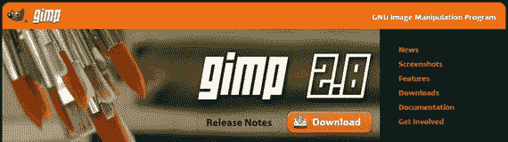
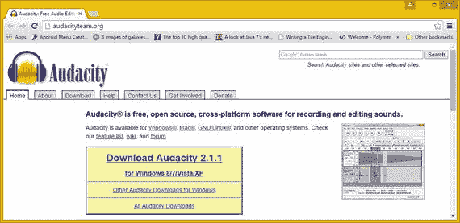
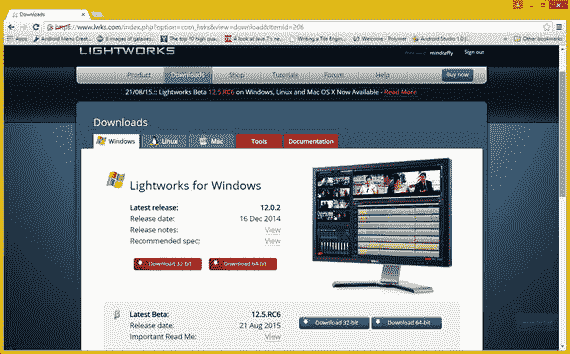
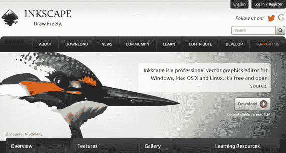
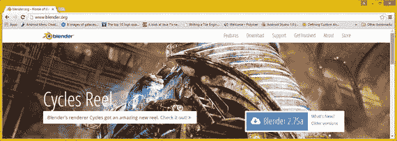

# 一、增强 Android 应用：使用新媒体素材

欢迎来到 Android Studio 新媒体基础。这本书将带你了解新媒体原则和概念的基础，让你对 Android Studio 和 Android OS 在新媒体支持领域所提供的东西有一个坚实的基础。新媒体，有时被称为富媒体或多媒体，跨越了许多专业的艺术家职业，这就是为什么一个多媒体制作人必须擅长制作所有形式的新媒体。这本书旨在增强您对新媒体基础知识的了解，以及它们如何应用于 Android Studio，以便您可以制作更刺激感官的 Android 应用，从而更受欢迎！

在这一章中，你将看到 Android 操作系统支持的不同形式的新媒体，以及它们如何帮助你的应用在竞争中脱颖而出。您还将为每种新媒体类型安装专业质量的开源软件应用，以便能够为 Android 应用制作新的媒体内容。

本书假设您已经熟悉了 Android Studio 及其特性集——您已经下载并安装了它，并且正忙于编写 Android 应用。我写这本书是为了增强你对 Android Studio 等式的新媒体部分的知识，这样你就能够向你的 Android 应用添加定制的多媒体资源，而不是使用操作系统自带的 UI 组件。

在本书的其余部分，每种新媒体类型(流派)有两个章节，让您快速了解基础知识，并了解 Android Studio 如何支持这些新媒体类型；您还将了解数据占用优化的原则。

这本书没有涉及 Android Studio，至少没有直接涉及；我假设您已经下载并安装了 Android Studio，并且您知道一些基础知识。如果你需要这些基础知识，我有一本《绝对初学者的 Android 应用》( Apress，2014)涵盖了这些主题。

## 新媒体类型:多媒体饼图切片

有许多不同类型(或流派)的新媒体，所有这些都在 Java 和 JavaFX(支持 Android 和 Linux 内核)以及 Android OS 中得到支持。这些支持把我喜欢称之为新媒体的“素材”添加到 Android 应用代码中。我猜大多数你都很熟悉:像 Pinterest 或 Instagram 上的数字图像，或者像 Spotify 或 Pandora 上的数字音频。数字视频可以用来播放电影或你喜欢的电视节目。不太多产的新媒体类型包括 2D 矢量或看起来像 2D 卡通的数字插图媒体，以及 3D 矢量或交互式 3D 媒体，就像你看到的人们在 Xbox 等流行的游戏机上玩体育或冒险游戏。所有这些例子都是高感官用户体验，所以在你的 Android 应用开发过程中添加新的媒体素材或元素就是如何让你的应用更上一层楼！

### 将你的应用从人群中分离出来:新媒体

在 Android Studio 中，将新媒体素材整合到您的 Android 应用开发中的主要优势是您可以添加到应用中的视觉和听觉“惊喜因素”。这使它有别于其他应用，并代表你的用户产生口碑营销效果，而你不必为此付费。这就是我所说的“意外之财”，这也是本书的目标，即带给你 Android 应用开发知识库和 Android Studio 内容制作的新媒体素材。例如，在涉及数字图像时，不要使用纯色背景，而是使用柔和的纹理或微妙的颜色渐变，这实际上是数字插图，你会在本书的课程中学到这一点(没有双关语)。

就数字音频而言，自定义音频用户界面声音用于用户交互反馈，用户会感觉他们更紧密地联系在一起，或者是你的 Android 应用的一部分。数字音频比您可能给予的高质量音频信用更能增强用户体验！

数字视频和交互式 3D 更多地是在应用增强频谱的内容制作方面，而不是在用户界面设计方面；然而，它们同样重要。经过良好优化的数字视频可以通过较慢的连接更流畅地播放，除了流行的 3D 游戏，交互式 3D 或 i3D 应用很少。

接下来让我们看看 Android 操作系统包含的新媒体文件格式。我所说的“包含”是指文件格式的编解码器(code-decode)实际上是 Android 操作系统的一部分，并且已经安装在硬件上了！

### Android Studio 新媒体支持:文件格式

将新媒体内容制作与 Android Studio 开发环境联系起来的关键是 Android 5 或更高版本当前支持的新媒体文件格式。大部分都是 Android 4 支持的。Android 的早期版本也支持其中的许多功能，如 1.6、2.37 和 3.2。运行这些版本 Android 的设备变得越来越难找；很快你所要担心的就是 32 位的 Android 4.4 和 64 位的 Android 5.4。Android 的专业版本(如 Android Wear、Android TV 或 Android Auto SDK)支持这些相同的新媒体文件(数据)格式和编解码器。所以不用担心！表 1-1 总结了这些流行的新媒体文件格式。

表 1-1。

Android New Media File Format Support by Version

<colgroup><col> <col> <col></colgroup> 
| 新媒体文件格式 | 新媒体类型 | Android 操作系统版本级别 |
| --- | --- | --- |
| PNG8， PNG24， PNG32 | 数字图像 | 所有操作系统版本 |
| 联合图像专家组 | 数字图像 | 所有操作系统版本 |
| WebP | 数字图像 | Android OS 4.0+ |
| GIF 格式 | 数字图像 | 所有操作系统版本 |
| 挽救（saving 的简写） | 数字插图 | 所有操作系统版本 |
| 计算机图形学 | 三维（three dimension 的缩写） | 所有操作系统版本 |
| WebM (VP8、VP9) | 数字视频 | Android OS 2.3.3+ |
| MPEG-4 | 数字视频和音频 | 所有操作系统版本 |
| MPEG-3 | 数字音频 | 所有操作系统版本 |
| 还有沃比斯 | 数字音频 | 所有操作系统版本 |
| 无损音频编解码器 | 数字音频 | Android OS 3.1+ |
| 波浪 | 数字音频 | 所有操作系统版本 |
| 伊法夫 | 数字音频 | 所有操作系统版本 |
| 自主移动机器人（Adaptive Multi-Rate 的缩写） | 数字音频 | 所有操作系统版本 |

Android Studio 数字图像支持目前包括 JPEG、PNG、GIF 和 WebP。您将在第三章了解每种格式的属性，该章涵盖了数字图像优化，但我相信您知道 JPEG 是使用最广泛的数字图像格式，CompuServe GIF 是最古老的数字图像格式，而 PNG(便携式网络图形)是最新的数字图像格式。WebP 是与您的 WebM 视频编解码器相同的编解码器，除了它是压缩一帧，通常称为“静止”图像。

Android Studio 数字音频支持目前包括 MPEG4 音频(M4A)、MPEG3 音频(MP3)、免费无损音频编解码器(FLAC)、OGG Vorbis、Windows Wave (WAV)音频、Macintosh 音频交错文件格式(AIFF)以及许多其他格式。在第五章中，您将了解每种技术的属性，这一章涵盖了数字音频数据足迹优化。

Android Studio 数字视频支持目前包括 MPEG4 AVC 和 WebM (VP8 和 VP9)。虽然数字音频支持范围很广，但数字视频支持仅包括两种编解码器产品，即 HTML5 中支持的两种编解码器。这两种编解码器都是开源的，因为谷歌收购了 ON2，并将 VP8 和 VP9 (WebM)编解码器开源。MPEG 专利将于 2027 年到期(全部)，尽管有些已经到期。HTML5 和 Android 已经授权 MPEG4，所以你可以在 Android 中使用。您将在第七章中了解这些编解码器，其中涵盖了数字视频数据占用空间优化。

Android Studio 使用可缩放矢量图形(SVG)来支持数字插图；事实上，Java(通过 JavaFX)支持一个完整的类库，允许您创建、读取、呈现 SVG 数字插图数据并制作动画。在第九章中，当讨论到数字插图数据占用优化时，您将了解到其中每一个的属性。

3D 建模和动画支持 OpenGL，以及 OpenGL 导入程序支持的所有 3D 数据格式，如。FBX。DAE (Collada)、. 3DS (3D Studio)、。OBJ(波前)，. X3D，.STL(立体平版印刷)和其他开放的 3D 几何格式。你将在第十章中找到每一种 i3D 数据格式，其中涵盖了 3D 建模、渲染和动画概念。

## 下载并安装您的软件

在这一章的后半部分，我将用几页的篇幅向大家展示一个专业级的开源软件包，分别适用于本书中涉及的五种新媒体类型。这样，如果您没有涵盖这种新媒体开发类型的软件包，您可以下载并安装一个免费的商业使用软件包，它具有付费软件包所具有的所有专业功能。一旦您安装并启动这些软件包，您将会惊讶于它们所提供的价值。

### 数字图像编辑和合成:GIMP

你需要有一个这样或那样的数字成像软件包。如果您没有任何数字成像软件，您可以使用免费的商业版 GIMP 2.8.14，这是当前的稳定版本，至少在 2016 年 GIMP 3.0 问世之前是如此。

要下载 GIMP 2.8.14，进入 [`www.gimp.org`](http://www.gimp.org/) 网站，点击橙色的下载按钮；或者，点击下载链接，如图右侧 1-1 所示。

图 1-1。

Go to gimp.org and click the Download button

为您的操作系统下载 GIMP-2.8.14.exe 安装程序文件，双击它开始安装。安装程序可以确定您是需要 32 位版本还是 64 位版本，因此您所要做的就是选择您希望在软件中使用的语言，然后单击“确定”按钮。您将看到一个 GIMP 安装对话框，在这里您单击 Install 按钮开始安装过程。

如果您想要自定义安装，可以单击“自定义”按钮，并准确选择要在系统上安装的组件。我建议您使用完全安装。这为您提供了一个基本的 GIMP 软件安装，包括所有稳定的插件、过滤器和文件导出支持。

安装过程完成后，单击 Finish 按钮，为您的操作系统的快速启动任务栏创建一个快捷图标，这样您就可以通过单击来启动 GIMP。

### 数字音频编辑和效果:大胆

您需要一个数字音频编辑和效果软件包来处理音频。如果你没有自己的理由，你可以使用开源的 Audacity 2.1 软件。

要下载 Audacity 2.1.1，这是当前的稳定版本，进入 [`www.audacityteam.org`](http://www.audacityteam.org/) ，点击蓝色下载 Audacity 2.1.1 链接，如图 1-2 所示；或者，点击 Audacity 徽标下的下载选项卡。

图 1-2。

Go to audacityteam.org and click Download

下载 audacity-win-2.1.1.exe 安装程序文件(我的是 Windows 8 操作系统的)。下载完成后，双击它开始安装。该软件目前是 32 位版本，除非您使用的是 64 位 Linux，所以您所要做的就是选择您希望在该软件中使用的安装语言，然后单击 OK 按钮。接下来，您将看到欢迎使用 Audacity 安装向导对话框，它建议您关闭所有打开的程序。

单击“下一步”按钮并查看许可信息屏幕，然后单击“下一步”按钮前进到“目标位置说明”对话框，然后单击“下一步”接受在`C:\Program Files(x86)\Audacity`文件夹中的默认安装位置。单击“下一步”,将出现“选择附加任务”对话框，允许您选择创建桌面图标和重置首选项的选项。

单击“下一步”显示“准备安装”对话框，然后单击“安装”按钮开始安装过程。安装对话框向您显示进度条，安装完成后，您会看到一个对话框，其中有启动 Audacity 的选项。选择此选项，然后单击“完成”按钮。看一看 Audacity——你会发现它相当令人印象深刻。

在您的操作系统上为快速启动任务栏创建一个快捷图标，这样您只需单击一下就可以启动 Audacity。

### 数字视频编辑和效果:Lightworks

所有 Android 开发人员都应该有一个这样或那样的专业数字视频编辑和特效软件包，无论是 Adobe AfterEffects，索尼 Vegas Pro，还是苹果 Final Cut Pro。如果您没有这些软件，您可以下载免费的商业版 Editshare Lightworks 12.5。

要下载 Lightworks 12.5，请前往 [`www.lwks.com`](http://www.lwks.com/) 。如果您没有帐户，请创建一个，以便能够下载 Lightworks 12.5 的免费版本。点击图 1-3 左上角的蓝色下载按钮，然后点击您正在运行的操作系统的选项卡。

图 1-3。

Go to lwks.com and click the Downloads tab

对我来说，这是 Windows 8.1 操作系统。单击与您的操作系统匹配的版本；对于大多数人来说，这应该是 64 位的。

要确定您的计算机是 32 位还是 64 位，请右键单击开始菜单(Window 7、XP 或 Vista)中的计算机链接，然后选择属性。在 Windows 8.1 或 10 中，右键单击 Windows 菜单图标，并选择系统菜单选项，这将显示计算机系统信息对话框。

在其他操作系统上，您也可以在操作系统控制面板中的“计算机”或“系统”下查看此信息，该信息表明计算机系统运行的是 32 位还是 64 位操作系统。

我点击了 64 位下载按钮来下载用于 Windows 的 light works _ 12.5 _ full _ 64 bit _ setup . exe 安装程序文件，并双击它开始安装。

第一个安装程序语言对话框要求您选择要在软件中使用的语言。单击 OK 按钮，欢迎使用 Lightworks 设置。

单击下一步。在“许可协议”对话框中，选择“我接受许可协议条款”选项，然后再次单击“下一步”按钮。保留“选择组件”对话框的默认设置，并再次单击“下一步”按钮。

保留“选择安装位置”对话框的默认设置，然后单击“下一步”在`C:\Program Files\Lightworks`文件夹中安装 Lightworks。单击下一步。出现“选择开始菜单文件夹”对话框，允许您再次接受明显的 Lightworks 文件夹名称默认设置。

一旦你点击下一步按钮，你会看到一个安装对话框的进度条，在这里你可以观察安装过程——如果你是一个快速阅读者的话。安装完成后，单击下一步按钮，然后单击完成按钮。

为操作系统的快速启动任务栏创建一个快捷图标，这样只需单击一下就可以启动 Lightworks。

### 数字插图和 2D 建模:Inkscape

因为 Java、JavaFX 和 Android 都 100%支持 SVG，所以您还需要一种或另一种数字插图软件，无论是 Adobe Illustrator、Corel Draw 还是 Macromedia Freehand。如果你没有这些，你可以使用免费的商业用 Inkscape 软件包，它拥有你在专业水平上使用 SVG 2D 矢量数据所需的所有功能。

要下载 Inkscape 0.91，这是 Inkscape 的当前稳定版本，请进入 [`www.inkscape.org`](http://www.inkscape.org/) 并点击绿色下载按钮，如图 1-4 所示；或者单击网站左上角的下载链接。Inkscape 支持其软件的 32 位和 64 位版本；我假设您现在已经确定了您的操作系统的位级！我下载的文件是 inkscape-0.91-x64.msi 安装程序文件。双击操作系统位级的安装程序文件开始安装。

图 1-4。

Go to inkscape.org and click the Download button

启动 Inkscape 安装程序后，您会看到欢迎使用 Inkscape 安装向导对话框。单击“下一步”按钮进入“最终用户许可协议”对话框。

选择“我接受许可协议中的条款”复选框，然后单击“下一步”按钮进入“选择安装类型”对话框。单击典型按钮，然后单击安装按钮开始安装。您会看到“安装 Inkscape”对话框，它会告诉您正在安装什么。

安装过程完成后，单击“完成”按钮，并为您的操作系统的快速启动任务栏创建一个快捷图标，这样，如果需要，只需单击鼠标即可启动 Inkscape。

### 3D 建模、渲染和动画:Blender

Java、JavaFX 和 Android 也通过称为 OpenGL 的开源 3D 图形库支持 3D 新媒体。因此，你还需要有一种或另一种风格的 3D 建模和动画软件，无论是 Autodesk 3D Studio Max、Cinema 4D XL 还是 NewTek Lightwave。如果您没有任何这些，您可以使用免费的商业用途 Blender 软件包，它具有您在专业水平上处理 OpenGL 3D 矢量数据和 3D 格式所需的所有功能。

要下载 Blender 2.76，Blender 的当前稳定版本(在下一个版本 2.8 之前，预计在 2016 年的某个时间推出，以及备受期待的 Blender 3.0 的前身)，请前往 [`www.blender.org`](http://www.blender.org/) 并单击蓝色下载按钮，或者您可以单击下载链接，如图 1-5 所示。

图 1-5。

Go to blender.org and click the download cloud

Blender 支持 32 位和 64 位版本的软件；我假设您现在已经确定了您的操作系统的位级，所以选择与您的操作系统匹配的版本。我下载的文件是 blender-2.75a-windows64.msi 安装程序文件。双击安装程序文件开始安装。

一旦你点击确定按钮，你会得到一个欢迎搅拌机设置向导对话框。单击“下一步”按钮，进入“最终用户许可协议”对话框。

选择“我接受许可协议中的条款”复选框，然后单击“下一步”按钮进入自定义设置对话框。接受默认功能设置，然后单击下一步按钮。然后单击“安装”按钮开始安装。你会看到安装 Blender 对话框，它会告诉你正在实时安装什么。

安装过程完成后，单击“完成”按钮并为操作系统的快速启动任务栏创建一个快捷图标，这样您就可以在需要时启动 Blender 3D。

## 摘要

这一章提供了新媒体的概述，包括一般的和在 Android Studio 和 Android OS 环境下的。你看了看不同的新媒体类型，发现了为什么它们可以帮助你的 Android 应用脱颖而出。您了解了 Android 操作系统和 Android Studio 允许您利用不同的文件格式来为您的 Android 软件创作增加视觉和听觉效果。

在本章的第二部分，您确保安装了领先的开源新媒体内容制作软件包，并准备好进行探索。

在下一章中，你将会看到像素是如何存储在 X，Y 数组中的，你将会学到长宽比，颜色深度，抗锯齿，以及其他一些重要的成像概念。