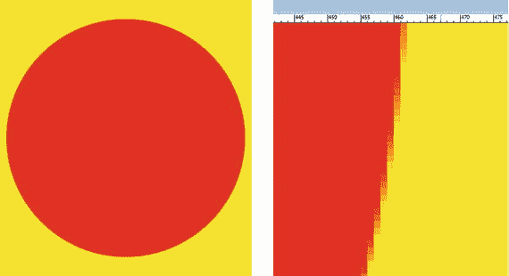
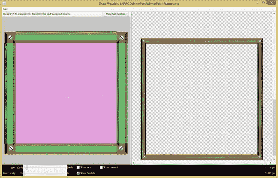
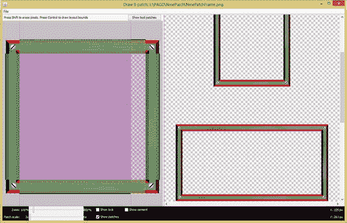

# 二、数字图像：概念和术语

现在，您已经了解了新媒体内容的主要领域以及 Android Studio 和 Android OS 支持的文件格式，是时候一个接一个地分解这些多媒体内容了，一次两章。让我们从数字图像开始，因为它是最多产、最受欢迎和最主流的新媒体类型。我将在这一章中讲述一切，从构成这些光栅图像的像素构建块到包含像素的数组以及定义该数组的分辨率和纵横比。您将看到像素特征，如位置、颜色通道、alpha 通道、颜色深度，甚至高级主题，如 PorterDuff 混合模式和 NinePatchDrawables，这两种模式都在 Android API 中受支持，它们有自己的类、方法和常数。

您将了解基于 2D 像素的光栅图像与基于 2D(或 3D)顶点和直线(或曲线)的矢量图像之间的区别。既然您现在拥有了 GIMP，我可以用 GIMP 展示书中的概念，您也可以跟着我。

单个像素只是空间中的一个点，被称为 1D 或一维(不要这样称呼你的配偶)，而图像实际上是像素的 2D 阵列或网格，同时使用 X 和 Y 维度。

## 像素:您的数字图像构建模块

数字图像由二维或 2D 阵列(或网格)组成，其中包含一些称为“像素”的东西这个行业术语 pixel 是两个术语的组合:图片(通常称为“pix”)和元素(简称为“els”)。因此，你将在 Android Studio 中使用的任何数字图像的基础都是它的图片元素。这些像素决定了数字图像素材的一切，如文件大小、尺寸、颜色、透明度和形状。需要注意的是，数字插图资源不是由像素组成的。

### 光栅与矢量:图像与插图

除了像素这个术语，让我们先来区分一些与像素相关的关键术语，以便清楚地定义数字图像和数字插图之间的区别。由像素组成的图像在技术上被称为光栅图像。其原因是因为像素阵列被显示像素的设备显示屏“光栅化”。这些硬件设备包括从 iTV 到平板电脑、电子书阅读器、智能手机、智能手表、上网本、笔记本电脑到个人电脑的所有设备。

还有另一种类型的数字图像称为“矢量”图像，它是使用数学而不是像素来定义的。矢量图像使用 2D 空间中称为顶点的点，以及将这些顶点连接在一起的线或曲线，根据指令“绘制”出您的数字插图，这些指令是基于文本的，可以被视为标记或代码。

“数字插图”是新媒体行业对矢量图像的通俗称呼。矢量图像有自己的“流派”的 2D 软件，称为数字插图软件。您已经在前一章下载并安装了 Inkscape，因此您已经为第八章准备好了它。3D 矢量图像称为 3D 渲染，动画 3D 矢量项目称为 3D 动画。添加编程逻辑，3D 矢量项目被称为交互式 3D，或 i3D。你会在第十章中看到 i3D 新媒体。

### 渲染:将矢量形状转换为光栅图像

矢量影像可以通过称为“渲染”的过程转换为光栅影像渲染图像本质上是光栅图像，2D 矢量作品和 3D 矢量作品都可以渲染为光栅图像，正如您现在所知，这是基于像素的图像。与矢量影像相比，栅格影像的数据量要大得多，因为您需要存储一组像素(兆字节)来重新创建影像，而不是一组简洁的文本指令(千字节)。

此时，本章和下一章中概述的所有概念都可以应用于这些像素格式的光栅图像素材。

将矢量图稿渲染为光栅图像格式时，一定要记住保留“原始”矢量图稿的备份，以便您可以在以后对其进行增强或优化，并随时重新渲染。

与栅格影像相比，矢量插图的主要优势在于，因为它是使用数学定义的，所以可以放大或缩小到任意大小。放大或“上采样”2D 栅格影像会导致所谓的像素化。接下来，我们来看看数组！

## 分辨率:图像像素的数量

您的数字图像素材中包含的像素数量应该用一个称为分辨率的术语来表示。这是图像中包含的像素数量。图像有宽度，通常用 W 表示，或者用 X 表示 X 轴，还有高度，通常用 H 表示，或者用 Y 表示 Y 轴。影像分辨率为您提供了数字影像的 2D 维度。

Android Studio 中图像资源的分辨率需要用两个整数来表示，一个是宽度，即 X 值，另一个是高度，即 Y 值，用 XML 标记或 Java 代码表示。图像分辨率一般用两个中间带×的整数来表示。例如，VGA 分辨率表示为 640×480。或者，您也可以使用单词“by”，例如 640×480 像素。

让我们来看看分辨率的基本数学，这样你就可以知道如何计算图像中的像素数量，这与它使用的内存量有很大关系。

### 做数学:计算你的总图像像素

要找到任何 2D 数字图像中包含的像素总数，您需要将宽度像素乘以高度像素，或者用 Java 术语来说:`Resolution = Width * Height;`如果您正在编写代码。希望你还记得小学时矩形方程的面积。这又是在一个专业的 Android 数字图像应用环境中。当我在小学的时候，我没有意识到所教授的东西有专业应用，所以我没有真正听，因此我不得不回去重新学习我的数学和物理。

例如，如果将宽度和高度相乘，HDTV 分辨率为 1920×1080 的图像包含 2，073，600 个像素。如果你对数码摄影感兴趣，你会对两百万像素这个术语很熟悉，它指的是 200 万像素。这就是 HDTV 分辨率给你的本质。

数字图像中包含的像素越多，分辨率就越高。更高分辨率的图像给观众更多的细节或图像主题定义。这就是为什么 HDTV 代表高清晰度电视，也是为什么新的 4K 分辨率的 UHD 电视是超高清晰度的。

接下来，让我们仔细看看一些流行的 Android 5 消费电子设备分辨率，这些分辨率从 240 到 4096 像素不等，比智能手表设备和 4K iTV 设备高出十七倍以上(即 17 倍)。Android 中的 UI(用户界面)设计需要能够在不同分辨率之间“变形”。这在我的书 Pro Android UI (Apress，2014)中有所涉及。

### 匹配 Android 设备的图像分辨率

开发用于 Android Studio 的优化数字图像素材的一个目标是将数字图像中的像素数量与将要查看的目标硬件设备相匹配。过去市场上有几十种不同分辨率的 Android 设备。最近，在 Android 设备上发现的不同分辨率的数量一直在减少，这对开发者来说是非常好的。原因是越来越多的显示器，尤其是智能手机、电子阅读器和平板电脑，已经符合三大 iTV set 分辨率。由于有机发光二极管(有机发光二极管)等显示技术，显示屏的像素间距(点尺寸)越来越小，这已经成为可能。这些柔性屏幕可以在显示屏上实现类似激光打印机的分辨率。

第一个高清电视屏幕是我所说的“伪高清”，是 1280×720 蓝光 DVD 分辨率(1280×720 = 921，600 像素，所以你说的差不多是 100 万像素)。对于 Android 5，1280×720 分辨率用于入门级智能手机或入门级平板电脑、上网本和笔记本电脑，因此这是一种常见的分辨率。这种通用性的原因是因为许多电影、视频和电视内容都是为这种蓝光(1280×720)分辨率制作的。将内容分辨率与设备分辨率相匹配将为您提供最佳的图像质量，因为像素缩放为零。接下来将介绍像素缩放。

市场上出现的下一个高清电视分辨率是真正的高清分辨率，即 1920×1080 分辨率。如您所知，这为您提供了 200 万像素，而 1280 伪高清分辨率为 100 万像素。使用真正高清分辨率的 Android OS 设备包括 iTV 电视机、智能手机、中型平板电脑和电子书阅读器。你也可以在高端的 Windows 和 Mac OS X 笔记本电脑(或笔记本电脑)上看到这种分辨率。

目前市场上最新的高清显示器被称为超高清显示器，即 UHD，分辨率为 4096×2160。如果你计算一下，这个显示屏分辨率包含 8，847，360 像素。当你读到这本书的时候，将会有 UHD iTV 开始运行 Android TV SDK，所以交互式 IMAX 分辨率应用即将到来！

这是 900 万像素，相比之下，1920×1080 真高清分辨率的像素为 200 万。你已经在 UHD iTV 电视机、领先的智能手机、高端平板电脑和高端电子书阅读器以及最新的 UHD 笔记本电脑(也称为 UHD 笔记本电脑)上看到了超高清分辨率。

还有一类消费电子设备叫做智能手表，分辨率有 320×320 和 400×400(华为)。到 2016 年，智能手表领域的像素密度(像素间距)将会更高，达到 480×480 像素屏幕，到 2017 年有望达到 560×560 或 640×640 像素屏幕。

## 纵横比:宽高像素的 2D 比率

与数字图像的像素数密切相关的是数字图像中 X 与 Y 的比率。这就是所谓的长宽比。纵横比的概念比图像分辨率更复杂，因为它是图像分辨率维度内的宽高比，或 W:H。如果你喜欢用图像的 X 轴和 Y 轴来思考，那就是 X:Y。有趣的是，Java、JavaFX 和 Android 使用宽度和高度，X 和 Y 可以互换(也就是说，不一致)，所以我不能建议你应该如何考虑像素引用。这个纵横比定义了图像的形状，也适用于显示屏的形状。例如，智能手表具有方形外观(1:1)，而宽屏 iTV 电视机具有矩形外观(2:1)。

1:1 纵横比的数字图像(或显示屏)是完美的正方形。因为这是纵横比，根据其定义，1:1 的纵横比与 2:2 或 3:3 的纵横比相同。值得注意的是，正是这两个数字之间的比率定义了图像或屏幕的形状，而不是数字本身，这就是为什么它被称为纵横比，尽管它通常被简称为纵横比。2:1 的宽高比创建了宽屏宽高比。

### 屏幕形状:常见的显示器纵横比

上一节讨论的许多 HDTV 分辨率显示屏使用 16:9 的 HDTV 宽屏宽高比。但是，有些显示器使用较窄或较高的 16:10(或 8:5，如果您喜欢最低的公分母)宽高比。更宽的屏幕肯定也会很快出现在市场上，所以请寻找 16:8(或 2:1，如果你喜欢最小公分母)的超宽屏幕，它将具有 2160×1080 的屏幕分辨率。

早期的电视屏幕几乎是方形的；他们使用了 3:2 的长宽比。电脑屏幕以 4:3 的纵横比为特色，例如 Macintosh 的 512×384 或 PC 的 640×480 VGA 屏幕分辨率。一旦你在本章的下一节中学会了如何计算长宽比，你就可以自己检查数学了。

随着时间的推移，PC 显示器不断变宽。2:1 宽屏 2160×1080 显示器于 2013 年问世，不久之后，UHD 2:1 显示器(4096×2048)将出现在市场上。最近的一次长宽比变化是在 2015 年推出的 Android 智能手表，它使用 1:1 的长宽比显示屏。自定义屏幕纵横比可能会变得相当极端；你们都见过 9:1 宽高比的屏幕环绕在体育馆的顶部。

### 做数学:如何得出长宽比

图像长宽比通常使用长宽比冒号两侧可以达到(减少)的最小数字集或对来表示。如果你在高中时注意过，当你在学习最小公分母时，那么长宽比数学对你来说应该很容易计算。

我会继续把两边除以 2 来做这个数学入学考试。让我们以一个相当怪异的 1280×1024(称为 SXGA)分辨率为例。

1280:1024 的一半是 640:512；因此，640:512 的一半是 320:256。一半是 160:128，一半是 80:64。一半是 40:32，一半是 20:16。一半是 10:8，一半是 5:4。因此，SXGA 分辨率使用 5:4 的纵横比。

有趣的是，前面所有的比值都是相同的长宽比，都是有效的。因此，如果您想采取真正简单的方法，用冒号替换图像分辨率中的“×”，您将获得图像的纵横比。行业标准包括将长宽比提取到最低格式，正如您在这里所做的那样，因为这是一个更有用的比例。

## 颜色理论:使用像素颜色通道

在构成分辨率和长宽比的图像像素阵列中，每个像素都使用 Android 中的三个颜色通道来保存颜色值，Android 使用 RGB 颜色空间。颜色通道最初用于数字图像合成程序(如 GIMP)中，用于合成在显示屏上使用的数字图像，或者在打印机上使用油墨打印，打印机使用称为 CMYK 的不同颜色空间。在印刷行业中，颜色通道有时被称为“色板”，因为老式印刷机使用金属板，其中一些至今仍在使用。在 GIMP 中，颜色通道有自己的通道调色板，并允许您只在该颜色通道(或调色板)上工作，这对于特殊效果或其他高级图像操作非常有用。

Android 允许您使用 drawables APIs 访问每个像素的 RGB 组件，我在我的 Pro Android Graphics (Apress，2013)标题中对此进行了介绍。RGB 代表红色、绿色、蓝色。使用加色模型，这三种颜色的光可以创建可见色谱中的任何颜色(想想彩虹)。

加色(RGB)的对立面是减色(CMYK)，它用于印刷并涉及使用油墨。油墨是相互减色的，而不是加色的，这是通过使用光线组合颜色时发生的情况。

使用红色和绿色作为加色的例子，结果是红色+绿色=黄色。使用减色法，红色+绿色=紫色。如你所见，加色给你更亮的颜色(增加光线)，而减色给你更暗的颜色(即减少光线)。

要使用这些 RGB 颜色通道创建数百万个不同的颜色值，您需要使用 Java 代码为 Android 做的是改变每个单独的 RGB 颜色值的级别或强度。在我讲述了 RGB 颜色的数学知识之后，我将向您展示如何用十六进制表示法在 Android 上实现这一点，这涉及到颜色的位和字节。

### RGB 颜色的数学:增加你的强度

红色、绿色和蓝色值的数量或强度水平决定了您能够复制的颜色总数。对于今天的 Android 设备，像素可以为每种红、绿、蓝(RGB)颜色产生 256 级光强度。需要为每个图像像素生成颜色；因此，对于这些 RGB(红色、绿色和蓝色)颜色数据值中的每一个，图像中的每个像素具有 256 级颜色强度。

这些 RGB 通道、印版或平面中的每一个都使用一个字节或八位的颜色强度数据。作为一名 Android 程序员，您知道 8 位数据最多可以容纳 256 个不同的值，因此每个像素的红色、绿色和蓝色通道组件有 256 个亮度级别。

每个数字图像像素内的颜色强度(亮度)数据用每种颜色的亮度级来表示。范围从 0(亮度关闭)到 255(亮度完全打开)，控制数码图像中每种红色、绿色和蓝色的每个像素贡献的颜色量。

计算可用颜色的总量很容易，因为这也是简单的乘法。如果乘以 256 × 256 × 256，得到 16，777，216 种颜色。这代表红色、绿色和蓝色的独特颜色组合，您可以使用这三种不同的加色通道中的每种颜色的 256 个级别(数据值)来获得这些颜色组合。

### 表示 RGB 颜色值:使用十六进制数据值

在 Android 中，您需要为每个红色、绿色和蓝色像素颜色通道表示这 256 个亮度级别的数据。这是通过指定 8 位(值)的数字数据值来实现的，这允许 Java 代码或 XML 标记控制每个红色、绿色和蓝色通道值的颜色亮度变化，从最小值 0 到最大值 255。

用于表示数字图像像素颜色的位数可以使用 16 进制或十六进制表示法进行编码。基数 16 从 0 到 F 计数，因此有 16 个值(位)来表示颜色。这些十六进制值中的两个给出 16 × 16 = 256 个值，这是每个 RGB 颜色通道可用的亮度级别数。

在 Android Studio 中，也很方便地在 HTML5、CSS3 和 JavaScript 中，这是通过使用散列或井号(#)来完成的。例如，在 Java 代码或 XML 标记中，要表示黑色，即所有值都关闭或为零，则如下所示:

`colorValue =``#000000`

另一方面，白色是所有像素完全打开:

`colorValue =``#FFFFFF`

红色仅打开红色通道像素:

`colorValue =``#FF0000`

绿色打开绿色通道像素:

`colorValue =``#00FF00`

蓝色打开您的蓝色通道像素:

`colorValue =``#0000FF`

黄色打开红色和绿色通道:

`colorValue =``#FFFF00`

在本章的下一节中，您将了解这些位深度如何应用于不同的数字图像文件格式，如 8 位 GIF、24 位 JPEG 或 32 位 PNG。Android 操作系统还支持 48 位 HDR(高动态范围)颜色，用于即将推出的一些更先进的智能手机硬件中的相机！您可能已经猜到，48 位颜色使用 16 位颜色通道。

## 颜色深度:定义颜色的位级

数字图像中每个像素可用的颜色量在行业中被称为图像的色深。数字图像资源中使用的常见颜色深度包括 8 位、16 位、24 位、32 位、48 位和 64 位。Android 支持其中三种颜色深度:8 位使用 GIF 和 PNG8，24 位使用 JPEG 和 PNG24，32 位使用 PNG32。Android Camera 2 API 还支持新的高动态范围成像(HRDI)格式，可以存储 48 位颜色数据。64 位 HDRI 图像支持三个 16 位(RGB)通道和一个 16 位 alpha 通道。阿尔法通道将在本节稍后介绍。

高色深图像具有 24 位色深，因此包含 16，777，216 种颜色。支持 24 位颜色深度的文件格式包括 JPEG(或 JPG)、PNG、BMP、XCF、PSD、TGA、TIFF 和 WebP。JavaFX 支持其中的三种，JPG、PNG24 (24 位)和 PNG32 (32 位)。使用 24 位色深可以获得最高的质量水平。这就是为什么我推荐你的 Java 游戏使用 PNG24 或 PNG32。接下来，让我们看看如何使用调色板来表示索引图像的颜色！

### 索引颜色:使用调色板保存 256 种颜色

最低色深存在于 8 位索引的彩色图像中。这些图像最多有 256 个颜色值，这就是为什么它们是 8 位图像，并使用索引“调色板”的颜色，这就是为什么它们被称为索引彩色图像。索引颜色的常用图像文件格式包括 GIF、PNG、TIFF、BMP 或 Targa。当您从成像软件包(如 GIMP)中“导出”文件时，索引调色板由索引颜色编解码器创建。Codec 代表 COde-DECode，是一种可以使用压缩来优化文件大小的算法。

Android OS 支持两种索引彩色图像格式:GIF 和 PNG。在 Photoshop 中将 24 位真彩色图像数据转换为索引彩色图像格式(GIF 或 PNG)的方法是使用文件“➤存储为 Web 所用格式”菜单序列。这将打开“存储为 Web 所用格式”对话框，可让您设定文件格式(GIF 或 PNG)、颜色数量(从 2 到 256)、颜色转换算法(感知、选择、自适应或限制)、抖动算法(扩散、图案或噪波)以及许多其他高级选项，如渐进隔行扫描。我推荐使用感知色彩转换，256 色，和扩散抖动算法来获得最佳视觉效果。

要使用 GIMP 2.8.14 将真彩色图像数据转换为索引彩色图像数据，请使用图像➤模式➤索引菜单序列。这将调用索引颜色转换对话框。与 Photoshop 的“存储为 Web 所用格式”对话框相比，它的选项较少，但重要的选项都在那里，因此您可以指定颜色深度和扩散抖动。我推荐使用 GIMP Floyd-Steinberg 扩散抖动算法。甚至有一种算法可以减少渗色，保持图像边缘干净清晰。

以颜色深度为例，如果您选择 2 种颜色，它将是 1 位(PNG1)图像，4 种颜色将是 PNG2 (2 位颜色深度)图像，16 种颜色将是 4 位 PNG4 颜色深度图像，64 种颜色将是 6 位 PNG6 图像，128 种颜色将是 7 位 PNG7 图像。

接下来，我们来看看 Android 中推荐使用的其他主要格式，24 位真彩色或者 32 位。

### 真彩色:使用 24 位彩色图像

世界上最广泛使用的数字图像文件格式之一是 JPEG 文件格式，它只有一种风格:24 位颜色。支持 24 位颜色数据的其他文件格式包括 Windows BMP、TIFF、Targa (TGA)、Photoshop (PSD)和 PNG24。由于 PNG 也支持 8 位(PNG8)或 32 位(PNG32)颜色，准确地说，我称之为 24 位 PNG 格式 PNG24。Android 支持其中两种流行的格式:JPEG 和 PNG。

Android 真彩色(或 true color)图像使用 RGB_888 颜色空间(或颜色通道数据配置)。Android 支持的这些真彩色文件格式的主要差异归结为一个主要的区别因素:有损压缩与无损压缩。

有损压缩是指一种算法，也称为编解码器，丢弃一些数据以实现更小的数据足迹。因此，在应用任何有损压缩(在本例中为 JPEG)之前，请使用无损数据格式保存原始的未压缩文件格式。

无损压缩—用于 PNG、BMP、TGA 和 TIFF 格式—不会丢弃任何原始图像数据；它应用一种算法来查找导致使用更少数据的模式，并且可以 100%重建所有原始像素值。

真彩色 24 位图像主要用于 Android 用户界面设计，或用于实际的应用内容。它们还可以用于 Android 设备上显示的其他数字内容，如网站、电子书、iTV 程序、游戏、智能手表、数字标牌和社交媒体共享论坛。

在你的 Android 应用中使用多个图像被称为图像合成。合成涉及使用多个图像层。背景或背板图像使用 24 位图像数据。背景板上的合成堆栈中的所有其他层都需要支持透明度，因此需要 32 位数据，也称为 ARGB 或 RGBA。

这种透明性是由第四个通道提供的，称为“alpha 通道”我将在本章的下一节向你介绍这一点，因为这是一个关键的合成概念。

如果你有兴趣了解更多关于在 Android 中使用图像合成管道的知识，我会在 Pro Android Graphics 中详细介绍。为 Android 应用使用图像会给它带来更多的活力，但使用图像合成管道可以实现更高水平的特殊效果和交互性，在 Android 应用开发工作流程中使用数字图像可以实现这一点。这是我在这里包含 alpha 通道的一个很好的理由！

### 真彩色加 Alpha:使用 32 位数字图像

除了 8 位、16 位和 24 位数字图像之外，还有 32 位数字图像。支持 32 位颜色数据的格式包括 PNG、TIFF、TARGA (TGA)、位图(BMP)和 Photoshop。我喜欢用 PNG32，因为它在 HTML5、Java、JavaFX、CSS3、JavaScript、Android 都支持；而其他文件格式没有与开源操作系统和浏览器集成，如 PNG(发音为“ping”)格式。这 32 位图像数据包括 24 位 RGB 颜色数据，加上 8 位“alpha”或透明度值数据，保存在通常称为 alpha 通道中。

既然您现在知道 8 位保存 256 个值，那么 alpha 通道为数字图像中的每个像素保存 256 个不同级别的透明度数据值是有意义的。这对数字图像合成很重要，因为它允许保存 32 位图像数据的层允许颜色数据的一部分(从 0 到 255，或该像素的所有颜色)渗透到下面的层(或与之混合)。

我们来看看 Android Studio 中四个数据通道是如何翻译的。没错，您使用的是十六进制表示法，带有两个额外的 alpha 槽，因此是 ARGB_8888 数据格式。

在 Android Studio 以及 HTML5、CSS3、JavaScript 和 XML 中，颜色加 alpha 的十六进制采用 ARGB 格式，因此，两个 alpha 值位置需要放在前面。

例如，要表示透明色，即所有值都关闭，或代码中的 0，它看起来像这样:

`colorValue =``#00000000`

另一方面，在每个 alpha 通道数据值槽中，具有 50%透明度的白色是白色加 8(从 0 开始计数时为 7)的所有 RGB 像素完全打开:

`colorValue =``#77FFFFFF`

半透明度为 25%的红色对每个 alpha 通道槽使用值 3，并使用 FF 仅打开红色通道像素，或完全打开，绿色和蓝色完全关闭:

`colorValue =``#33FF0000`

绿色和 37.5%的半透明度对每个 alpha 通道使用值 5，并使用 FF 仅打开绿色通道像素，或完全打开，让红色和蓝色完全关闭:

`colorValue =``#5500FF00`

半透明度为 75%的蓝色对每个 alpha 通道槽使用 B 值，并使用 FF 仅打开蓝色通道像素，或完全打开，并完全关闭绿色和红色:

`colorValue =``#BB0000FF`

接下来，让我们仔细看看阿尔法通道是做什么的。

## Alpha 通道:定义透明度

让我们看看 alpha 通道如何定义数字图像像素透明度值，以及如何在 Android 中使用它们来合成数字图像。Alpha 通道在数字图像合成软件包(如 GIMP)中提供透明度，我称之为“静态”使用，但也可以通过 PNG32 图像资源使用开放平台(如 Android Studio、HTML5、CSS3、Java 或 JavaFX)实时合成数字图像。我称之为“动态”使用，因为代码允许你在一毫秒内访问像素透明度值，所以你可以用任何你喜欢的方式动画数据；例如，在游戏、动画用户界面或交互式电子书中。

数字图像合成涉及一层以上数字图像的无缝混合，正如您可能想象的那样，每像素透明度是一个重要的概念。数字图像合成用于图形设计、故事片、游戏设计和 Android Studio 应用开发。

当您想要在显示器上创建一个看起来像是单个图像(或动画)但实际上是多个合成图像层的无缝集合的图像时，需要使用数字图像合成。您希望设置图像或动画合成的主要原因之一是，通过在不同的层上设置组件，您可以更好地控制图像合成中的各种元素。Android Studio 有一个 LayerDrawable 类，它提供了与 GIMP 中完全相同的多层图像合成功能，除了为在 Android 应用中使用而优化之外。

要完成多层合成，您始终需要有一个 alpha 通道透明度值，您可以利用它来精确控制像素的颜色与其下方其他层上相同 X，Y 图像位置的像素的混合。

像 RGB 颜色通道一样，alpha 通道具有从 100%透明(0)到 100%不透明(255)的 256 个透明度级别。每个像素有不同的 alpha 透明度数据，就像每个像素有不同的 RGB 颜色数据一样。

Android Studio 中几乎所有可以在显示屏上绘制的东西都支持 alpha 通道值，通过使用十六进制符号的 ARGB 8888 数字图像格式。这包括用户界面元素、主题、风格和可绘制性。我向您展示了如何使用散列(磅)符号对其进行格式化，您可以在 XML 标记和 Java 代码中使用这种十六进制数字格式。记住这一点，因为很少有开发者用！

## PorterDuff:算法混合模式

图像合成还有一个强大的方面，叫做混合模式。任何 Photoshop 或 GIMP 用户都知道，数字图像合成软件包中的每一层都可以设置为使用不同的混合模式。混合模式是指定一个层的像素如何与之前的层(在该层下面)混合(数学上)的算法。Android API 有一个 PorterDuff 类，允许您在 Android 应用中访问所有这些混合模式算法。

这些像素混合算法考虑了像素透明度水平；因此，在两个图像合成控件之间，你可以在 Android Studio 中实现几乎任何你想要的合成结果。

与 Android 的主要区别在于混合模式可以使用定制的 Java 编程逻辑进行交互控制。对于 Android 开发者来说，这是令人兴奋的部分。

这些强大的 PorterDuff 类混合模式包括 XOR、加网、叠加、变暗、变亮、相乘和相加。Pro Android Graphics 介绍了如何在复杂的图像合成管道中实现 PorterDuff 混合模式，如果您有兴趣更详细地了解 Android 的这一领域。

## 平滑边缘:抗锯齿

抗锯齿是一种成像技术，也是通过使用算法来实现的。该算法所做的是找到两种相邻颜色沿边缘相遇的地方，并混合锯齿边缘周围的像素。消除锯齿沿两个彩色区域之间的边缘添加平均颜色，以便沿(以前的)锯齿状边缘在视觉上平滑这两种颜色。这使得锯齿状边缘看起来很平滑，尤其是当图像缩小并且像素不是单独可见时。抗锯齿的作用是让你的眼睛看到更平滑的边缘，以消除通常所说的“锯齿”抗锯齿提供了令人印象深刻的效果，它对那些位于图像边缘并需要看起来更平滑的像素使用几个(通常少于八个)中间平均颜色值。

我说的“平均颜色”指的是介于两种颜色之间的颜色或色谱，沿着反锯齿边缘相交。我为您创建了一个抗锯齿的可视化示例来展示最终的效果。

我首先在黄色背景下创建了看似平滑的红色圆圈，如图 2-1 所示。我放大到那个圈的边缘，然后就抓拍到了这个截图。

图 2-1。

A zoomed in view (right) shows anti-aliasing effect

我将它放在缩小的圆圈旁边，以显示红色和黄色之间的抗锯齿(橙色)像素值，这些颜色值沿着圆圈的边缘彼此接壤。请注意，有七八种平均颜色用于创建这种视觉效果。

我在 Android 中实现自己的反走样效果的技巧之一是通过 Android 中的 ConvolutionMatrix 类使用高斯模糊。这也适用于 GIMP 和 Photoshop。确保在带有锯齿状边缘的对象(及其 alpha 通道)上使用低模糊值(0.125 到 0.375)。

这提供了与你在图 2-1 中看到的相同的抗锯齿，不仅如此，它还“模糊”了 alpha 通道的透明度值。

模糊 alpha 通道允许 alpha 通道消除 32 位图像对象与任何背景图像的锯齿，您可能会尝试对其进行无缝合成。接下来我们来看图像优化！

在下一章，你将深入了解如何在 Photoshop 和 GIMP 中使用 alpha 通道数据；它只是变得更加令人兴奋。

## 九补丁素材:9 补丁数字图像

Android OS 中还有另一种类型的数字图像“drawable”叫做 NinePatchDrawable 它允许 Android 开发人员开发一种特殊类型的可变形 PNG8、PNG24 或 PNG32 图像资源。使用 Android Draw 9-patch 工具创建的图像素材本质上是一个独立于 XY 轴的可缩放 PNG 光栅图像，它使用图像素材中的九个不同象限来支持独立于轴的缩放。

由于内置的 NinePatchDrawable 类和 NinePatch 类支持，Android 可以自动调整开发人员的 9 补丁图像素材的大小，以适应任何 Android View 对象的内容，在该对象中，开发人员已经放置了 9 补丁图像素材作为背景(或源)图像素材参考。

这是通过 Android NinePatch 类和 Android NinePatchDrawable 类以及 Draw 9-patch 软件工具中的算法实现的。这个工具可以在 Android SDK 文件夹的`/sdk/tools`子文件夹中找到。

NinePatch 图像资源的一个使用示例是在背景图像内部使用 android:background XML 参数，该参数通常与标准 android 按钮小部件一起使用。按钮 UI 小部件几乎总是需要拉伸，至少在一个维度上，通常在 X 和 Y 两个维度上，以便适应使用不同字符串和不同字体样式和大小的文本。

这个 NinePatchDrawable 对象使用 Android 推荐的 PNG 数字图像格式；它还包括一个额外的一个像素宽的边框来保存缩放准则。要被 Android 识别为 9 补丁图像资源，需要使用. 9.png 文件扩展名保存它们。我提到的单像素边界对您的最终用户是不可见的，而是由 Android NinePatch 类算法用来定义图像素材的可缩放区域和静态(固定，即不可缩放)的区域。

### NinePatch 类:在 Android 中创建 NinePatch

Android NinePatch 类是 Java java.lang.Object 基类的直接子类，这意味着它被唯一编码以定义 Android 中的 NinePatch 对象。使用 Android NinePatch 类构建的对象允许 Android 缩放，然后使用 9 补丁 PNG 图像资源中的 9 个离散的可缩放部分或区域来呈现 9 补丁图像资源。您可能已经猜到，这个类存储在 android.graphics 包中。它的类层次结构如下所示:

`java.lang.Object`

`> android.graphics.` `NinePatch`

一个很好的类比是指南针。这些 9 片图像的四个角(东北、西北、东南和西南)是未缩放的；而四个边(N、E、S 或 W)沿一个轴缩放。指南针的中间(9 片图像)沿其两个轴缩放，就像任何正常图像在 Android 操作系统中缩放一样。

理想情况下，9 片源图像资源的中间部分是 100%透明的。这是为了在您将视图用作微型合成容器的情况下，9-patch 可以为您的视图对象提供围绕开放的可合成内容区域的可缩放图像框架，因为一些视图对象(如 ImageView)可以具有源和背景图像(以及其他元素),它们将通过透明区域显示。

Android Draw 9-patch 工具为开发人员提供了一个简单、有用的工具，用于使用 WYSIWYG(所见即所得)图像编辑器创建九补丁图像。我们现在来看看这个。

### Draw 9-patch:创建一个 NinePatchDrawable 图像

本节介绍如何使用 Android Draw 9-patch 工具创建 9-patch 图像资源。您需要一个源 PNG 图像来创建 NinePatchDrawable 对象；我提供了一个名为 NinePatchFrame.png 的示例 PNG32 图像素材。如果您对创建 9 补丁图像素材感兴趣，我将在本章的最后一节带您浏览，以便您了解基本的 9 补丁工具工作流程。

首先在 Android SDK 文件夹层次结构的 tools 子文件夹中找到你的 Draw 9-patch 工具。打开 tools 子文件夹后，您会看到 draw9patch.bat Windows 批处理文件，这是运行 draw9patch 需要启动的文件。

有两种方法可以打开 PNG32 图像进行 9 补丁开发。您可以将 PNG 图像拖动到 Draw 9-patch 窗口中，并拖动到中间的下拉箭头上，或者您可以使用文件➤打开 9-patch 工作流程在 NinePatch images 子文件夹中找到该文件。

找到 NinePatchFrame 源图像 PNG 资源后，选择它并单击“打开”按钮。您会看到 Draw 9-patch 软件，在编辑器和预览区域中有 PNG 文件。左窗格是您进行编辑的地方，使用单像素黑线创建补丁、定义补丁或缩放区域，以及由填充线定义的中心内容区域。

右窗格是生成的 9 补丁预览区域，如图 2-2 所示，在这里您可以查看您的 9 补丁图像素材缩放后的样子。要定义面片，请在透明的顶部边框中单击，然后向左拖动以绘制一条定义 X 维可缩放面片的黑线。一旦你画出了你想要的近似值，你可以使用线段两端的细线对其进行微调。

图 2-2。

Defining patches in the Android Draw 9-patch tool

将光标放在细线上，它会变成一个双箭头。单击并拖动灰色区域，直到它与 NinePatchFrame.png 图像中心的透明区域像素级吻合。也可以右键单击来擦除先前绘制的线。

查找“显示修补程序”选项旁边的复选框；选择它以打开此功能。如图 2-2 所示，这使用紫色和绿色的组合在您选择的区域提供颜色。这可以清楚地显示图像素材中的哪个区域受到了影响。您可以看到在编辑面板的底部还有几个其他有用的控件。其中包括缩放滑块，允许您调整编辑区域中源图形的缩放级别，以及面片比例滑块，允许您调整预览影像的比例。

当鼠标悬停在图形上时，显示锁定选项允许您可视化图形的不可绘制区域。“显示内容”选项在预览图像中突出显示您的内容区域，其中紫色显示可以放置内容的区域。

最后，在编辑区域的顶部，有一个显示坏补丁按钮。这会在补丁区域周围添加一个红色边框，当图像缩放时可能会在图像中产生伪像。如果你努力在 9 补丁设计中消除所有这些坏补丁，你的缩放图像的视觉效果是可以实现的。

图 2-2 显示了带有顶部和左侧单像素边框黑线定义的 9 块图像素材。如您所见，由于 Show patches 选项，我现在已经定义了静态区域和具有外科手术精度的可扩展区域。

另请注意图 2-3 ，在右侧预览中，9 片图像定义的结果给了我一个专业的缩放结果。我抓住屏幕右侧的滚动条并将其拉下，这样您就可以看到纵向和横向形状的 9 片刻度。

图 2-3。

Draw 9-patch preview shows axis-independent scaling

您还可以看到我使用编辑窗格右侧和底部的单像素黑色边框线定义的填充区域。图 2-3 显示我正在底部绘制一个 1 像素的黑色边框线段，以定义 9 片图像的中心填充区域的 X 尺寸。

## 摘要

在第二章中，您了解了数字图像的概念、术语和实现图像素材的 Android 类。您了解了像素、分辨率、纵横比、颜色通道、颜色深度、alpha 通道、抗锯齿、混合模式和 PorterDuff 以及 NinePatchDrawable 对象。在下一章中，您将进一步了解图像数据占用优化。