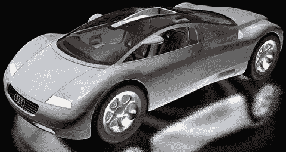
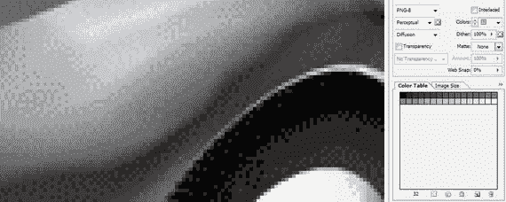

# 三、数字图像素材：数据足迹优化

现在，您已经了解了数字图像新媒体内容的基本概念、术语和原则，以及 Android Studio 和 Android OS 支持的文件格式，是时候更进一步了解数据占用优化了。数据足迹优化包括以占用最少数据存储量的方式保存您的数字图像素材；也就是说，它具有最小的文件大小。在本章中，您将了解所有新媒体领域的数据占用优化，因为您为 Android 应用制作的新媒体素材越小，Android 应用在谷歌 Play 商店中的位置就越小，下载、加载到内存中以及在内存中运行的速度就越快。

您将看到基于 2D 像素的光栅图像与基于 2D(或 3D)顶点和直线(或曲线)的矢量图像之间的区别。既然您现在拥有了 GIMP，我可以用 GIMP 展示书中的概念——您也可以跟着我。

## 优化数字图像:关键因素

有许多技术因素会影响数字图像压缩，数字图像压缩是使用编解码器或算法来查看图像数据并找到一种方法将其存储为使用较少数据的文件的过程。编解码器编码器本质上找到图像中的“数据模式”,并将这些模式转换成编解码器的解码器部分可以通过算法重构原始图像数据的数据形式。一个好的编解码器是数据足迹等式的一部分，但是你交给编解码器压缩的图像数据可以产生不同！

让我们从讨论对数据足迹影响最大的图像属性开始，并检查这些方面如何对任何给定数字图像的数据足迹优化做出贡献。有趣的是，这些类似于你在第二章中提到的数字成像概念的顺序。

### 图像分辨率:数组中的像素数

对生成的图像文件大小或数据占用空间影响最大的因素是数码图像的像素数或分辨率。这是合乎逻辑的，因为需要存储这些像素中的每一个，以及每个 RGB 颜色通道的颜色值。因此，在保持良好细节的同时，图像分辨率越小，生成的文件就越小，因为要压缩的数据越少，因为图像只是一组像素值。

众所周知，原始未压缩图像的大小是通过公式`width` × `height` × `color channels`计算出来的。24 位 RGB 图像有三个 RGB 颜色通道，32 位图像有四个 ARGB 颜色通道。值得注意的是，一旦解码器将其压缩格式解压缩到系统内存中，原始(未压缩)图像数据占用的空间恰好也是您的图像将占用的系统内存量。

这一级别的数据占用优化的关键是遵循我在第二章中的建议，并使图像分辨率与图像的目标观看设备相匹配。

几乎所有人都在做的错误的事情是使用打印分辨率图像，它使用相机分辨率 CCD(电荷耦合器件)来创建包含 2400 万到 4800 万像素的数字图像文件数据。如你所知，流行的高清显示设备有 100 万或 200 万像素的分辨率，或者，在 4K 或 UHDTV，最多有 900 万像素的分辨率。因此，您应该使用双三次(Photoshop)或三次(GIMP)插值算法，将打印分辨率缩减采样到至多 4K 分辨率。

在当今大多数 Android 设备上使用新的超精细点距显示器，您甚至可以将 HDTV(200 万像素)图像升采样(升级)到 UHD(800 万像素)，并且仍然会有足够的像素，使您的图像在任何精细点距显示器上看起来都非常清晰和逼真。

对图像进行下采样的最佳方式是所谓的“2 的幂”，类似于二进制:2、4、8、16 等等。因此，如果你的相机给你一个 8192×6144(4800 万像素)的图像，在每个轴上向下采样 2 到 4096×3072，或者在每个轴上向下采样 4 到 2048×1536，或者在每个轴上向下采样 8 到 1024×768。

很多人问我为什么很多智能手机都用 2560×1440 的分辨率。答案是，制造商知道大多数视频内容是蓝光(1280×720)格式，如果在每个轴上加倍，则得到 2560×1440，因此全屏视频是以 2 的幂进行缩放，并获得最佳图像质量，因为缩放算法中不涉及部分像素。从数学上来说，这意味着只有均匀的分割，没有余数，所以边缘保持清晰。这适用于上采样或下采样。

### 图像颜色深度:每个像素的颜色通道

因为 Android 中图像的数组(分辨率)中的每个像素具有 8 位(一个通道的颜色数据)、24 位(三个通道的颜色数据)或 32 位(四个通道的颜色和 alpha 数据)的颜色深度。因此，这是影响图像数据足迹的第二大因素。我怀疑这是索引彩色(8 位或一个颜色通道)图像仍然被广泛使用的原因之一，通常是 PNG8 图像格式，它具有更好的无损压缩算法，至少与 GIF 编解码器相比是如此。

如你所知，PNG 等无损压缩算法零图像数据丢失，保持 100%质量；而有损压缩算法(如 JPEG 和 WebP)会丢弃数据，从而降低图像质量，以实现更高的数据压缩。

#### PNG32:使用具有 Alpha 通道的真彩色图像

如果您使用的是合成层图像资源，即包含包含对象遮罩的 alpha 通道或包含半透明(变化)特殊效果的 PNG32 图像，Android 中只有一个选项，即 PNG32 图像格式。这些图像需要压缩的数据最多，因此希望 PNG 编解码器能够很好地压缩图像数据。

每个图像都包含一个独特的像素值集合，因此您永远不知道任何给定的图像是否会被很好地压缩，因为它最终都是算法中的数学运算。

一般来说，图像越混乱(细节越精细)，图像的边缘越清晰，生成的文件就越大。清晰的像素过渡(边缘)越少，包含的颜色渐变越平滑，因为平滑的过渡更容易压缩，所以生成的文件就越小。

#### 真彩色图像:使用 24 位颜色深度

24 位图像也有同样的混乱和边缘问题，但是如果你想得到更小的文件，除了 PNG 还有另一种编码方式，尽管它会丢弃原始图像数据并引入视觉伪像。如您所知，JPEG 是一种有损编解码器，但它可以以牺牲视觉质量为代价来减小文件大小。因此，如果您正在寻求最高质量的数字图像结果，请尝试使用 PNG 编解码器和格式，因为它不会引入伪像(除非您使用 PNG8 和扩散抖动，这在本章稍后深入研究索引彩色图像时会有更深入的介绍)。正如我提到的，一些 PNG24 图像压缩得相当好；你真的只需要通过一个编解码器运行数据，并找出答案！

因此，如果您使用的是 24 位图像，没有 alpha 通道数据，并且图像中使用的颜色范围有限，那么可以考虑使用 PNG8 索引颜色格式，使用 256 色和扩散抖动，在不损失质量的情况下将数据占用空间减少 300%到 400%。索引彩色图像在超精细点距显示器上看起来很棒，因为抖动点太小看不见！

这种同样的超细点距优势也适用于 JPEG 压缩伪像，使它们小到看不见。然而，值得注意的是，Android 建议尽可能使用 PNG24 或 PNG32 而不是 JPEG，以尽可能提高应用的图像质量，这也是 Android 想要的最终目标，因为就操作系统而言，它处于激烈的竞争中。Android OS 自发布以来一直在稳步赢得新的市场份额；让我们保持这种方式！

#### 索引颜色:使用高达 8 位的扩散抖动颜色

如果用于构成图像的颜色总数变化不太大，索引彩色图像可以模拟真彩色图像。如您所知，索引彩色图像仅使用 8 位数据或 256 种颜色来定义图像像素色板。这是通过使用最佳选择的调色板来完成的。例如，如果你有一张天空中的云的照片，或者一片美丽的森林，或者一束玫瑰，调色板中可能有足够的槽来复制这几种颜色及其包含的渐变，特别是如果你使用扩散抖动并有一个超精细点距的设备。

根据 24 位源图像中使用的颜色数量，使用 256 种颜色来表示包含 24 位色深的图像可能会导致一种称为条纹的效果。这是你的调色板中相邻颜色之间的转换在视觉上不是渐变的，因此看起来不是平滑的颜色渐变。

索引彩色图像可以选择对条带进行视觉校正，这称为抖动。正如你已经知道的，抖动是一种算法过程，用于沿着图像中任何相邻颜色之间的边缘创建点图案。这会欺骗你的眼睛，让你以为使用了第三种颜色。

抖动使用 256 色调色板为您提供最大感知数量的颜色。如果这 256 种颜色中的每一种都与其他 256 种颜色相邻，您可以模拟最大数量的 65，536 种颜色(16 位颜色)，但这很少发生。您仍然可以看到创建其他颜色的潜力，并且您会惊讶于索引颜色编解码器和数据格式(PNG8 或 GIF)在涉及某些影像的压缩场景中可以实现的效果，这些影像具有正确数量的颜色和最适合索引颜色的主题。

让我们优化一个真彩色图像，如图 3-1 所示，并使用 PNG5 索引彩色图像格式保存，向您展示扩散抖动。你将在奥迪 3D 图像上看到驾驶员侧后挡泥板的抖动效果，因为它包含一个灰色渐变。

图 3-1。

A PNG24 image created with Autodesk 3DS MAX to compress as PNG5

有趣的是，在 8 位索引彩色图像中，允许使用少于 256 种最大值的颜色。这样做通常是为了进一步减少数字图像数据的占用空间。

例如，仅使用 32 种颜色就可以获得很好效果的图像实际上是一个 5 位图像，从技术上讲，它被称为 PNG5，尽管这种格式本身通常被称为 PNG8，因为它的最大使用级别是 256 色。

您将设置如图 3-2 所示的索引色 PNG 图像，以使用 5 位颜色(32 色，或 PNG5)。这是为了让你可以清楚地看到抖动效果。正如你在图 3-2 左侧的图像预览区域所看到的，抖动在你相邻的颜色之间创建了点状图案，以创建额外的颜色。在这种情况下，它是灰度值。

图 3-2。

Select Diffusion Dither and 32 colors creating PNG5

另外，请注意，您可以设置抖动的百分比。我经常选择 0%或 100%设置；但是，您可以在这两个极端值之间的任何地方微调扩散抖动效果。

你也可以选择抖动算法；您可能已经猜到，抖动效果是使用抖动算法创建的，抖动算法是索引文件格式(本例中为 PNG8)编码器压缩例程的一部分。

我更喜欢扩散抖动，它有一个平滑的效果，特别是沿着不规则形状的梯度，如图 3-2 所示的奥迪驾驶侧后挡泥板。

您可以使用更加随机的“噪波”选项，或者不那么随机的“图案”选项。扩散选项通常会给出最好的结果，这就是为什么我在使用索引色时使用它(这并不常见，因为我使用 PNG32)。

正如你所想象的，抖动将数据模式添加到图像中，这更难压缩。这是因为图像中的平滑区域(如渐变)比尖锐过渡(边缘)区域或随机像素模式(如抖动)或来自数码相机 CCD 的“噪声”更容易被压缩算法压缩。

因此，应用扩散抖动选项将总是增加几个百分点的数据足迹。请务必检查应用和不应用抖动(在“导出”对话框中选择)的结果文件大小，以查看它是否值得提供更好的视觉效果。请注意，索引彩色 PNG 影像还有一个透明度选项(复选框)。请务必注意，用于 PNG8 图像的 alpha 通道是 1 位(开或关)，而不是 PNG32 的 8 位。

### 图像 Alpha 通道:像素透明度通道

到目前为止，您所了解的可以增加图像中数据占用空间的最后一个概念是添加一个 alpha 通道来定义合成的透明度。这是因为添加 alpha 通道会给图像添加一个 8 位透明通道。如果您需要一个 alpha 通道来保持图像的透明度，除了包含这个 alpha 通道数据之外，没有太多的选择。

如果您的 alpha 通道包含全零或使用全黑填充颜色(这将定义您的 alpha 通道为完全透明)，或包含 FF 值，或使用白色填充颜色(这将定义您的 alpha 通道为完全不透明)，您将基本上(在实际使用中)定义一个不包含有用的 alpha 数据值的 alpha 通道。

因此，需要移除透明 alpha 通道，并且需要将不透明图像定义为 PNG24 数字图像，而不是 PNG32，从而节省一个数据通道。

最后，用于遮罩数字图像的 RGB 颜色通道中的对象的 alpha 通道压缩得非常好。这是因为这些 alpha 通道主要是白色(不透明)和黑色(透明)的区域，沿着两种颜色之间的边缘有一些灰度值，以消除蒙版的锯齿。

这些灰色区域包含 alpha 通道中的抗锯齿值，在图像的颜色通道中的对象与其后面使用的任何背景颜色或背景图像之间提供视觉上平滑的边缘过渡。

这是因为 alpha 通道图像的遮罩包含从白到黑的 8 位透明度渐变。这定义了透明度的级别，它应该被认为是每像素混合(不透明度)的强度。

因此，蒙版中每个对象边缘的中灰度值(包含在此 alpha 通道中)将基本上平均对象边缘和任何目标背景的颜色。无论每个像素可能包含什么颜色或图像数据值，它都可以做到这一点。

这为可能使用的任何目标背景(包括动画背景)提供了实时抗锯齿，因为这种基于 alpha 通道的透明度混合将由每秒能够进行数百万(如果不是数十亿)次操作的 CPU 对每个动画帧进行计算。

现在，您已经学习了数字图像的概念、格式、API、术语和数据占用优化，接下来您可以开始学习数字音频，这是另一种流行的新媒体类型。

## 摘要

在本章中，您了解了数字图像数据占用空间优化的概念、原则以及压缩和解压缩数字图像素材的 Android 格式。您了解了分辨率、颜色通道、颜色深度和 alpha 通道如何有助于减少数据占用空间。

在第四章中，您将了解数字音频新媒体的概念、术语和原则，以便您可以将数字音频素材添加到您的 Android Studio 应用中。