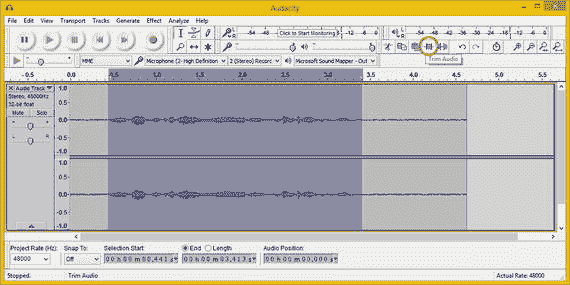

# 五、数字音频素材：数据足迹优化

现在，您已经了解了数字音频新媒体内容的基本概念、术语和原则，以及 Android Studio 和 Android OS 支持的文件格式。因此，现在是时候开始优化数字音频数据占用空间，为您的音频素材获得尽可能小的数字音频文件大小，同时获得高质量的音频回放。

您将会看到开源的 Audacity 2.1.1 软件包，并了解如何使用它来记录、编辑、增强、压缩和优化数字音频素材，因为您会将在第四章中学到的模拟和数字波形概念应用到 Android Studio 中。

您将了解优化您的 Android 数字音频素材(包括设备兼容性)的主要考虑因素、衡量压缩的基准素材以及每个编解码器。

## 音频优化:设备兼容性

优化您的数字音频素材以便在市场上最广泛的 Android 设备上播放将比优化数字视频或数字图像更容易。这是因为屏幕分辨率和显示器纵横比的差异要比数字音频播放硬件支持的差异大得多，除了具有新的 24 位高清音频播放兼容性的 Android 硬件。

人的耳朵无法像眼睛在数字图像中那样感知数字音频中的质量差异。对于跨 Android 设备的数字音频支持，您应该瞄准两个重要的“最佳点”。较低质量的音频(旁白轨道、简短的声音效果)可以使用 11 kHz 或 22 kHz 的采样速率，采样分辨率为 8 位、12 位或 16 位。高质量音频目标包括使用 16 位或 24 位分辨率、48 kHz 采样速率的 CD 或 HD 质量音频。

您在 Android 设备上优化数字音频素材的逻辑工作流程包括创建 16 位素材，因为所有 Android 设备都支持 16 位音频。您将使用 48 kHz 的采样速率，以便获得高质量的未压缩起点，然后使用 Android 中支持的所有不同编解码器优化(压缩)PCM 格式。

一旦该工作流程完成，您将能够确定哪些数字音频素材能够为您提供最高质量的数字音频播放，同时尽可能减少数据占用空间。让我们开始吧！

## 数字音频优化:工作流程

让我们通过点击任务栏上的快速启动图标来启动 Audacity 2.1.1。单击位于 Audacity 左下方的采样频率下拉菜单。如图 5-1 所示使用中；如您所见，我选择了 48 kHz 的采样速率。采样速率选择器旁边是捕捉设置，以及用于选择开始、结束或长度和音频位置的小时、分钟、秒和毫秒显示，用于微调。

图 5-1。

Set a sampling rate to 48 kHz in the drop-down menu

现在，您可以开始录制您的画外音了。我用这本书的名字录了一句话，Android Studio 新媒体基础。在 Audacity 2.1 中录制音频的方法是点击 record 按钮(Audacity transport 右侧的一个红点，位于程序的左上方)，如图 5-1 所示。对着桌面麦克风朗读画外音；我用的是在沃尔玛买的罗技立式麦克风，最初是用于 Skype 的，只花了几美元。

使用“消费者”麦克风会带来背景噪音问题，但这给了我机会向您展示 Audacity 2.1 的一些专业级特性，比如降噪。准备好大吃一惊吧。我在第五章中记录了我的声音。wav 文件包括在这本书里，以防你没有麦克风，只是想跟着走。

然而，我建议你练习使用 Audacity 来录制你自己的短语。在任何情况下，一旦你录制了你的声音，你会看到 Audacity 中显示的左右声道波形，如图 5-2 的中间所示。

图 5-2。

Click the Audio Track drop-down menu ; select Set Sample Format ➤ 16-bit PCM to convert 32-bit resolution to 16-bit

由于您在录制声乐音轨之前将采样速率设置为 48 kHz，现在您需要从 Audacity 用来录制的 32 位设置中设置采样分辨率。这为您提供了最大的数据分辨率；选择音轨➤集样本格式➤ 32 位浮点设置显示，如图 5-2 所示。

数据占用优化工作流程的第一步是将原始音频样本数据格式从 32 位 48 kHz 更改为 16 位 48 kHz 原始音频样本数据格式，这是我们 PCM WAV 格式基线使用的格式。

在图 5-2 中，这显示在屏幕的左下方。在设置样本格式子菜单中选择 16 位 PCM 作为样本格式选项(而不是 Audacity 默认设置的 32 位浮点选项)。

这立即将进入编码器的音频数据量减少了 100%!您想要设置一个合理的 16 位 48 kHz 音频数据基线，以便可以看到每种格式相对于未压缩 PCM 结果的压缩结果。

### 修剪音频样本:移除未使用的音频

为了减少总体数据占用量，您需要做的下一件事是删除不属于画外音样本的任何额外音频数据。这些数据通常是在你开始讲话之前和结束讲话之后，在你按下停止按钮结束录音功能之前。为此，使用走带控制按钮右侧的竖条(选择音频)工具仅选择相关的音频数据，如图 5-3 所示。

图 5-3。

Setting audio sample resolution to 16-bit PCM (uncompressed) before you export to various formats

现在您已经准备好使用 Audacity Trim 特性了，该特性用于修剪掉未使用的音频数据。在图 5-3 中，您想要点击以修剪掉样本中未被选择(未使用)部分的图标被圈起来，同时弹出工具提示。

这仅提供了您的声乐短语音频部分，您的显示器可能会有足够的空间来放大音频波形，以便您可以更准确地看到您正在处理的内容。

放大镜缩放工具位于选择工具的正下方；它是一个看起来像文本插入光标的竖条。选择缩放工具并单击波形以放大它。您可以向右调整 Audacity 窗口的大小，以显示音频样本的结尾，这样您就可以看到整个波形，如图 5-4 所示。

图 5-4。

Select an area with only noise and use the Effect ➤ Noise Reduction menu sequence

要试听修剪后的波形，请点按位于走带控制中的播放图标。这是一个绿色的向右箭头，位于“录制和回放传输 UI”面板的左侧，控制您处理音频时音频的操作。

### 降噪:去除背景噪音

回放数字音频样本时，您会听到明显的背景噪音，这种噪音在 Android Studio 应用中不够专业。让我们获得一些使用 Audacity 效果菜单去除背景噪音的经验。

在 Audacity 中消除噪音的工作流程是使用垂直条工具选择音频样本中只有噪音的部分，Audacity 非常适合配音音轨。降噪算法使用该数据来确定在其噪声去除工作过程的第二步中从整个音频样本中去除什么数据。

正如您在图 5-4 中看到的，我选择了样本数据中有噪声但没有声音内容的部分。然后我选择了无畏效果菜单➤降噪选项。

这将打开降噪对话框，如图 5-5 所示，您可以点击获取噪声分布图按钮。

图 5-5。

Click the Get Noise Profile button in the Noise Reduction dialog, and then apply the algorithm by clicking OK

在此输入您选择的仅噪声数据(参见图 5-4 )并将该数据传递给降噪算法，作为降噪对话框中为您概述的降噪工作流程的第一步。

值得注意的是，即使对话框告诉您选择“几秒钟”的噪声数据，您也没有那么多噪声，因此您选择的是十分之一秒，这也很好，因为十分之一秒的数字音频包含大量数据。如果你有很长的样本，比如阅读一个段落，你可以选择几秒钟。

或者，您可以在执行修剪操作之前应用降噪，在音频样本的开头和结尾提供更多未使用的噪声数据。

一旦您单击“获取噪波配置文件”按钮，这将为降噪算法提供它需要处理的数据,“确定”按钮将变为启用状态。然后进入第 2 步，实际处理噪声数据，并将其从人声音频样本中完全移除。Audacity Effect 特性(实际上更像是一个过滤器)本身就值 Audacity 的成本。等一下——Audacity 是免费的！抱歉，我忘了。

### 建立基线:导出 PCM 格式

工作流程的下一步是将您的“基准”16 位未压缩 PCM 编解码器格式导出为 WAV 音频文件。wav)文件(Windows)或 AIFF 音频文件(Macintosh)。您将使用它来查看最大可能的音频文件大小，用作基线，并查看 3.45 秒画外音的 16 位 48 kHz 音频样本将使用多少系统内存。

在 Audacity 中导出(保存)数字音频文件格式素材的方法是选择文件➤导出音频菜单序列，如图 5-6 左侧所示。如果您只想选择和保存(导出)一段音频样本，还有一个文件➤导出选定的音频菜单序列。

图 5-6。

Use the File ➤ Export Audio menu sequence to export

如果您的音频样本包含您想要从较长的音频数据样本中提取的音频“片段”,则导出所选音频功能非常方便。在这种情况下，您可以使用此功能从完整的声乐中提取每个单词。

导出音频对话框如图 5-7 所示，包括名称、选项、文件位置和编解码器选择等关键区域。

图 5-7。

Export a PCM file named Chapter5noiseReduced.wav to use as a baseline to measure other codec compression results

Save in folder 说明符，它指向一个 CH05 book assets 文件夹，告诉 Audacity 我想在哪里保存一个音频素材。文件列表窗格显示文件夹内容。文件名数据输入字段是您命名文件的地方；在这种情况下，Chapter5noise reduced . wav .下面是 Save as type 下拉选择器，它包含 Audacity 导出的所有文件格式。

为了让这个下拉菜单为您提供 Android Studio 支持的所有编解码器格式，您需要在您的系统上安装最新的 LAME 和 FFmpeg 编解码器库，以便 Audacity 可以在启动时找到它们。

请注意，我将导出文件对话框设置为以 wav(微软)签名的 16 位 PCM 格式导出第五章 noiseReduced.wav。您不需要指定。如果不希望文件名的 wav 扩展名部分，由于编解码器说明符。

如果您点按位于“导出音频”对话框右下角的“选项”按钮，您会发现对于 WAV 音频格式，您会看到一个对话框，通知您没有 PCM 文件的编码选项。这是因为 PCM 包含未压缩的数据，所以没有要设置的选项。

单击“保存”按钮后，将出现“编辑元数据”对话框，供您输入想要包含在音频文件中的任何元数据(参见图 5-8 )。这些数据与音频数据一起以每种文件格式存储；可以用安卓访问。每个音频格式的导出都会出现此对话框。

图 5-8。

Export an M4A AAC audio file named buttonaudio.m4a using the maximum quality setting of 500

该对话框具有包含文本值的数据字段，例如艺术家姓名、曲目标题、专辑标题、曲目编号、年份、流派和注释。

因为我正在优化基线数据占用，并且应用不需要音频元数据，所以我现在将这些字段留空，以便您可以准确了解文件大小；即只包含音频数据的文件。如果您想知道 Android Studio 应用如何读取和支持音频元数据，并希望将这些数据安装在音频文件中，答案是 Android 的 MediaMetadataRetriever 类，开发人员利用它来实现这一非常具体的目的。

如果您的 Android 应用需要使用音频媒体元数据，您应该使用编辑元数据对话框和 Android MediaMetadataRetriever 类，您可以在 [`http://developer.android.com/reference/android/media/MediaMetadataRetriever.html`](http://developer.android.com/reference/android/media/MediaMetadataRetriever.html) 了解更多信息。

如果您查看刚刚保存的 Chapter5noiseReduced.wav 16 位 PCM WAV 文件，您会发现文件大小为 558 KB，略大于半兆字节。

因此，这个 3.45 秒按钮音效样本的基线未压缩数据(和内存)占用量为 558 KB。您可以使用这个数字来确定所有 Android 数字音频格式的压缩量。

### 导出无损 FLAC: FLAC 音频文件

您要尝试的第一种格式是 FLAC 音频编解码器，因为它使用无损压缩。这让您很好地了解了在不丢弃任何原始音频数据的情况下，使用压缩可以减少什么样的数据占用空间，这将为您提供与 16 位 PCM WAV 音频一样完美的结果！

为此，你将再次使用文件➤导出音频菜单序列，而这一次，你将下拉一个另存为类型菜单，并选择 FLAC 文件格式，如图 5-9 所示。

图 5-9。

Export a FLAC file named Chapter5.flac with Level 8 compression and a Bit depth of 16-bit

同样，将这个文件命名为 Chapter5.flac。我将把它保存到本书的 CH05 文件夹中。请注意，只有 FLAC 文件列在该对话框的中间区域。这是因为现在您已经选择了 FLAC 文件格式，对话框中间的这个区域只显示 FLAC 文件，而 CH05 文件夹中目前没有 FLAC 文件。因为我想显示每种格式的文件大小，我事先保存了文件，所以大小包括在屏幕截图中，以及设置和选项对话框中。

若要设置 FLAC 编解码器选项，请单击“选项”按钮，并将质量级别设置为 8(最佳)，并将位深度设置为使用 16 位数据分辨率。请注意，在“位深度”下拉列表下，您也可以使用此 FLAC 编解码器来获得无损的 24 位高清音频。请注意，我将导出音频和选项对话框放在一个统一的屏幕上，以减少我使用的截图数量。

一旦你输出了你的 buttonaudio.flac 音频素材，进入文件管理器，看看文件大小。您将看到它是 212 KB，或者减少了 100%以上。212 ÷ 558 = 0.38，只有 PCM 文件的 38%。

接下来，让我们看看另一种开源格式 Ogg Vorbis，看看它是否能给我们带来更小的数据占用空间。由于 Ogg Vorbis 是一种有损文件格式，它应该提供比 FLAC 更小的文件大小。

### 导出有损耗的 Ogg Vorbis: OGG 音频文件

再次使用文件➤导出音频工作过程，因为你已经在前面打开这个导出音频对话框，并选择 Ogg Vorbis 文件选项从您的保存类型下拉菜单。我将文件命名为 Chapter5，这样就产生了一个 Chapter5.ogg 文件名，放入 CH05 文件夹，如图 5-10 所示。点按“选项”按钮，并选择介于 0 和 10 之间的质量设置级别。我一开始使用的最大设置是 10。在实际的数据占用优化会话中，您可能会尝试几种设置，以查看质量设置滑块如何影响数据占用与质量的权衡。

图 5-10。

Export an OGG Vorbis file named Chapter5.ogg using a Quality level of 10

一旦你输出了你的 Chapter5.ogg 音频资源，看看文件的大小。您会看到它是 149 KB，文件大小减少了 400%:149÷558 = 0.27，大约等于四分之一，或者说小了四倍。这是一个显著的大小缩减，音频听起来与使用有损压缩之前的音频一样，500 分之 350，即 70%的质量(350 ÷ 500=0.7)。

接下来，我们来看看 MP3，这是目前最常见的有损音频格式。看看 MP3 是否能提供比 Ogg Vorbis 开源编解码器更小的数据占用空间(149 KB)应该会很有趣。

### 导出有损 MPEG-3 格式:MP3 音频文件

再次使用文件➤导出音频菜单序列，调出导出音频对话框，将保存类型下拉选择器设置为 MP3 文件，如图 5-11 所示。我将文件命名为 Chapter5 并选中 CH05 文件夹，然后点击 MP3 选项按钮打开指定 MP3 选项对话框，如图 5-11 右侧所示。我使用 320 kbps 的最大比特率质量设置，这对于音频数据来说是相当高的，但我试图获得 MP3 压缩的高端基线，并仍然将 MP3 与未压缩的 PCM 基线进行比较。我还选择了恒定比特率模式，因为这是最容易解码的，立体声通道模式，因为文件是立体声。

图 5-11。

Export an MP3 file named Chapter5.mp3 using Stereo Channel Mode, a Quality of 320 kbps and Constant Bit Rate Mode

如果您愿意，您还可以尝试不同的质量比特率设置以及可变和平均比特率模式，看看它如何影响 MP3 音频文件的数据足迹。如果您决定这样做，为了区分您的文件，只需使用文件名中的设置来命名文件。例如，具有可变比特率模式的 320 kbps 质量设置的文件应该被命名为:例如，Chapter6_320_kbps_vbr.mp3。

这样，您可以比较 MP3(或任何其他编解码器文件格式)和音频文件的大小，并做简单的数学计算，以计算出您的百分比数据足迹减少。

Chapter5.mp3 文件大小为 119 KB，数据占用空间减少了 469%。我们来计算一下:119 ÷ 558 = 0.21326，是原始的、未压缩的文件大小的 21%；100%–21% = 79%的文件大小缩减。

如果你在计算器上使用 1/x(反转)键，你可以从另一个方向得到一个百分比的减少。将 0.21326 取反得到 4.689，这意味着文件大小减少了 4.689 倍，相当于减少了 469%。这是一个相当可观的数据占用空间减少！

既然您已经看到. MP3 文件比 Ogg Vorbis 文件小，那么让我们来看看与 MPEG-3 相比，M4A 文件格式的 MPEG-4 AAC 数据压缩如何提高文件的大小质量比。由于 MPEG-4 使用更先进(更新)的编解码器算法，M4A 应该为您提供更好的文件大小与质量的优化比例。

### 导出有损 MPEG-4 格式:M4A 音频文件

按照通常的文件➤导出音频工作过程调用导出音频对话框，并从保存类型下拉选择器中选择 M4A (AAC)文件(FFmpeg)。像往常一样，将文件命名为 Chapter5，在您单击 Save 之后，导出器将其命名为 Chapter5.m4a。将其保存在 CH05 目录下，或者任何你的数字音频素材文件夹下，然后点击选项按钮打开指定 AAC 选项对话框，如图 5-12 所示。我选择将我的质量设置为 350。单击“确定”设置质量，然后单击“保存”导出第五章. m4a 文件。

图 5-12。

Export an M4A file named Chapter5.m4a using a Quality of 350 out of 500

您的 Chapter5.m4a 文件大小为 74 KB，相当于未压缩数据空间的 13%,或者说数据减少了 87%。为了解决这个问题，74 ÷ 558 = 0.1326，这是原始未压缩文件大小的 13%；100%–13% = 87%的文件大小缩减。取 0.1326 的倒数，数据占用空间减少了 7.54%，即 754%。

现在，您已经看到您的 M4A AAC 文件大小是迄今为止最令人印象深刻的数据足迹减少，让我们看看更加专业的 AMR-NB(窄带)数据压缩编解码器是否比 MPEG-4 AAC 提供了任何进一步的数据足迹改进。

由于这种编解码器是为语音优化的，因此结果可能会比您迄今为止遇到的任何编解码器都要好。所以抓紧你的帽子！关于录音，有一点需要注意，那就是它不需要立体声。

### 导出窄带格式:AMR 音频文件

尽管这种 MPEG-4 AMR-NB 编解码器和数据格式是专门为语音记录应用而设计和优化的，但可能还有一些其他应用；例如，通过使用此编解码器，某些短脉冲声音效果可能会获得合理(如果不是很好)的效果。如您所知，任何编解码器都只是使用软件实现的复杂的数学算法。它没有区别，所以真正找出哪种编解码器将为您提供任何给定资源的最佳压缩质量结果的唯一方法是通过编解码器运行原始的未压缩音频数据，看看会发生什么。

让我们接下来做这件事，然后你将完成对 Android Studio 中支持的和 Audacity 2.1.1 中也提供的音频编解码器的比较。幸运的是，我想在 Android 应用中使用的所有工具都在 Audacity 中。

遵循通常的文件➤导出音频工作流程，以便调用 Audacity 导出文件对话框，然后从保存类型下拉菜单选择器中选择您的 AMR(窄带)文件(FFmpeg)选项。像往常一样，将文件命名为 Chapter5，在您单击 Save 之后，导出器将它命名为 Chapter5.amr。将文件保存在您的 CH05 目录中，或者您的数字音频素材文件夹的名称，然后单击选项按钮打开指定 AMR-NB 选项对话框(参见图 5-13 的右侧)。我选择使用 12.20 kbps 比特率设置来获得此编解码器的最高质量结果。

图 5-13。

Export an AMR file named Chapter5.amr using a Bit Rate of 12.20 kbps

单击 Save，如您所见，这是迄今为止您获得的最小数据占用量，仅使用了 5 KB 的数据。

有趣的是，当您回放这个 AMR 音频样本时，它听起来仍然很像您到目前为止生成的其他受支持的编解码器格式中包含的音频。

Chapter5.amr 文件大小为 5 KB，表示数据占用空间减少了 99%以上。让我们来算一下:5 ÷ 558 是 0.0089，是原始未压缩文件大小的 0.89%；100%–1% = 99%的文件大小缩减。如果对 0.00896 求逆，则得到 111.6，这表示数据占用空间减少了 11，600%。

我不知道你怎么想，但由于它只是一个会说话的应用，我决定使用 5 KB 的音频素材，而不是 74 KB、119 KB、149 KB 或 212 KB 的音频素材。

## 摘要

在本章中，您了解了关于六种主要 Android 数字音频格式的数字图像数据足迹优化概念和原则，这些格式可以解压缩您的数字音频素材(使用开源 Audacity 2.1.1 专业音频编辑和效果软件应用创建)。

您还了解了如何将数字音频素材的规格与目标 Android 设备的硬件功能相匹配。对于高质量的音频，这意味着为高清音频设备使用 24 位 48 kHz 音频，或为所有 Android 设备使用 16 位 48 kHz 音频。

您了解了如何使用 Audacity 录制音频、修剪音频剪辑、将降噪算法应用于立体声音轨，以及导出到当今 Android Studio 应用开发中使用最广泛的六种数字音频编解码器格式。

您学习了如何计算数据占用空间减少百分比，并将其应用于六种不同的数据格式，以查看从 FLAC 到 AMR-NB 编解码器的 62%到 99%以上的减少幅度。

在下一章中，您将了解数字视频的概念、术语和原理。