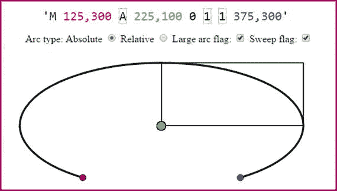

# 八、数字插图：概念和术语

现在，您已经了解了 Android Studio 的数字图像、数字音频和数字视频新媒体内容的基本概念、术语、原则和数据占用优化，是时候进入 2D 和 3D 矢量新媒体领域了。Android Studio 只支持一种开源的 2D 矢量格式，称为 SVG，或可伸缩矢量图形，所以这很容易。在本章中，您可以将重点放在概念和术语上，然后在下一章中创建和优化可缩放矢量图形素材。在第十章中，你可以通过观看 3D 矢量图像将 2D 矢量图像带入第三维空间。

在本章中，您将了解如何创建数字插图，使用 2D 空间中的点、连接这些点的直线和曲线来创建形状，以及这些 2D 矢量形状中的颜色填充、渐变和图案。您还将看到 Android Studio 以及其他开放平台(如 Java 和 HTML5)支持的开源数字插图 SVG 数据文件格式。

## 数字插图是渲染的，而不是存储的

正如您在第二章中了解到的，基于像素的数字影像在技术上被称为光栅影像，因为像素值的阵列被光栅化到屏幕上，显示使用这些像素创建的图像。数字插图或矢量图像不是作为图像元素(像素)的数组存储的；相反，它被绘制或“渲染”到屏幕上，就像有人看着你画时你会画一样，只是计算机使用指令来做你创建它时所做的事情。这相当于你在第四章第四章中学到的 MIDI 概念，其中演奏(在这种情况下，它是在作曲)是由计算机处理器重新创建的，它使用回放指令将其呈现到屏幕(SVG)或合成器(MIDI)上。

对于矢量图像，这是通过 2D X，Y 空间中的坐标以及定义曲线的数学来完成的，并使用看起来很像代码的 SVG 指令来传达。然而，你首先需要学习矢量插图的基本结构，这样你才能理解它们是如何结合在一起的。之后，您将看到 SVG 格式如何通过使用 Java 或 JavaFX SVG 兼容的类将这些转换成可以在 Android Studio 中处理的指令。HTML5 设备也可以处理 SVG。

## 向量组件:顶点和曲线

数字插图矢量图像由使用 2D 空间坐标的点以及将这些点连接在一起的直线或曲线组成。在本节中，您将了解这些点和线的概念和术语。如果您创建一个“封闭”的形状，即没有开口的形状，以便填充(颜色、图案或渐变)逸出，您也可以填充矢量形状，这样形状看起来是实心的，而不是空的。

### 顶点:2D 形状的基础

任何 2D 或 3D 矢量资源的基础称为顶点。需要多个顶点来创建直线或圆弧(需要两个顶点)或闭合形状(至少需要三个顶点)。顶点既用于 2D 矢量(SVG)数据处理，也用于 3D 矢量(OpenGL ES)数据处理，这两者都集成到 Android Studio 中。

正如您可能已经猜到的那样，顶点数据在 SVG 中是用 X，Y 坐标表示的，这告诉处理器顶点在 2D 空间中的位置。如果没有这些顶点坐标，就无法绘制直线和曲线，因为作为直线绘制操作的一部分，它们必须有一个原点和一个目标顶点坐标。直线和圆弧是开放形状的示例。

当您开始创建和查看 SVG 数据时，您会注意到这些 X，Y 数字对是 SVG 数据的主要部分，它们可以使用 XML 格式包含，或者包含在 Android Studio 应用的 Java SVG 对象中。SVG 数据也可以在您的 JavaScript (HTML5)代码中使用，也可以在 JavaFX (Java 8 或 Java 9)代码中使用，因此它可以兼容您的每个开放平台应用开发工作流。

一个单独的 X，Y 坐标叫做一维坐标，或 1D。(确保不要在你的配偶周围使用这个词，如果你这样做，确保它指的是你配偶以外的东西。)需要两个顶点坐标才能被认为是二维的，或 2D；所以一条线或一条曲线(开放的形状)，或一个封闭的形状是一个 2D 对象。

### 路径:连接顶点以创建形状

路径是在 SVG 中使用“path”数据元素定义的。根据 SVG 规范，开放形状和封闭形状在技术上都是路径。SVG 路径表示开放或闭合形状的轮廓，可以填充或描边，也可以用作剪辑路径。本章将详细介绍这些概念，但填充处理路径的内部，描边处理构成路径的直线或曲线，而裁剪路径用于布尔运算。

在 SVG 数据中，SVG 路径对象表示用于描绘路径对象轮廓的 2D“几何图形”。事实上，在 JavaFX 中，该类实际上被称为 SVGPath 类。SVG 路径数据可以用 SVG 命令来定义，我将在本章后面使用表 8-1 对其进行概述。其中包括一个 moveto 命令，用于设置当前点；lineto 命令，绘制直线；curveto 命令，用于绘制三次贝塞尔曲线；椭圆弧命令，用于绘制椭圆弧；以及 closepath 命令，它关闭当前形状，在其起点绘制一条线。还有一些高级的 SVG 命令。

表 8-1。

SVG Commands to Use for Creating SVG Path Data

<colgroup><col> <col> <col> <col> <col></colgroup> 
| SVG 命令 | 标志 | 类型 | 参数 | 描述 |
| --- | --- | --- | --- | --- |
| 动起来了 | M | 绝对的 | x，Y | 使用绝对坐标在 X，Y 处定义路径的起点 |
| 动起来了 | M | 亲戚 | x，Y | 使用相对坐标在 X，Y 处定义路径的起点 |
| 帕尔帕思 | Z | 绝对的 | 没有人 | 通过从最后一个点到第一个点绘制一条线来闭合 SVG 路径 |
| 帕尔帕思 | Z | 亲戚 | 没有人 | 通过从最后一个点到第一个点绘制一条线来闭合 SVG 路径 |
| 利托 | L | 绝对的 | x，Y | 从当前点到下一点画一条线 |
| 利托 | L | 亲戚 | x，Y | 从当前点到下一点画一条线 |
| 水平直线 | H | 绝对的 | X | 从当前点到下一点画一条水平线 |
| 水平直线 | H | 亲戚 | X | 从当前点到下一点画一条水平线 |
| 垂直线条 | V | 绝对的 | Y | 从当前点到下一点画一条垂直线 |
| 垂直线条 | V | 亲戚 | Y | 从当前点到下一点画一条垂直线 |
| 弯曲的 | C | 绝对的 | X，Y，X，Y，X | 从当前点到下一点绘制一条三次贝塞尔曲线 |
| 弯曲的 | C | 亲戚 | X，Y，X，Y，X | 从当前点到下一点绘制一条三次贝塞尔曲线 |
| 短而平滑的曲线 | S | 绝对的 | X，Y，X，Y | 从当前点到下一点绘制一条三次贝塞尔曲线 |
| 短而平滑的曲线 | S | 亲戚 | X，Y，X，Y | 从当前点到下一点绘制一条三次贝塞尔曲线 |
| 二次贝塞尔曲线 | Q | 绝对的 | X，Y，X，Y | 绘制二次贝塞尔曲线(当前点到下一点) |
| 二次贝塞尔曲线 | Q | 亲戚 | X，Y，X，Y | 绘制二次贝塞尔曲线(当前点到下一点) |
| 短二次贝塞尔曲线 | T | 绝对的 | x，Y | 绘制一个短的二次贝塞尔曲线(当前点到下一点) |
| 短二次贝塞尔曲线 | T | 亲戚 | x，Y | 绘制一个短的二次贝塞尔曲线(当前点到下一点) |
| 椭圆弧 | A | 绝对的 | rX，rY，红色 | 从当前点到下一点绘制椭圆弧 |
| 椭圆弧 | A | 亲戚 | rX，rY，红色 | 从当前点到下一点绘制椭圆弧 |

复合路径在 SVG 中也是可能的；这些允许你创建复杂的，布尔型的特殊效果。例如，您可以使用复合路径在形状中创建一个洞。

#### 线条:最简单的路径组件

沿着路径连接点坐标的最简单方法是使用直线。使用 lineto 命令可以创建不同的形状，如三角形、正方形、五边形和六边形。有三个 lineto 命令:一个 lineto、一个水平 lineto 和一个垂直 lineto，如表 8-1 所示。

要使用 SVG 对八边形进行编码，可以从 60，0 处的点(顶点)使用 moveto (M)命令，然后使用 lineto (L)命令绘制七条线。这看起来像下面这样:

`M 60 0``L``120 0``L``180 60``L``180 120``L``120 180``L``60 180``L``0 120``L``0 60`

接下来让我们看看椭圆弧，它本质上是一条简单的曲线，其 SVG 命令有一组复杂的规范数据，这就是为什么我通常从建模的角度坚持使用曲线，正如你将在第九章中看到的。

#### 椭圆弧:圆弧和椭圆弧

三种曲线命令中的最后一种是椭圆弧，它使用大写 A(绝对弧)或小写 A(相对弧)。arc 命令绘制椭圆的一段。它采用这些曲线绘制相关命令中最大数量的参数，并使用以下基本格式:

`M``x,y``A rx,ry x-axis-rotation large-arc-flag sweep-flag`

这里，`M` (moveto) `x,y`是圆弧的起点；`rx`是椭圆的 x 半径；`ry`是椭圆的 y 轴半径；`x-axis-rotation`是旋转 x 轴的度数，一个大/小弧的两个开/关标志，一个扫弧/无扫弧；而最后的`x,y`坐标就是圆弧的终点。

值得注意的是，将 x 和 y 半径(`rx`和`ry`值)设置为相同的值会创建一个圆而不是一个椭圆，因为这使得曲率对称。

椭圆弧有许多参数，包括一个坐标对、所描述的椭圆大小、一个角度和两个改变渲染的标志。此示例还允许您修改弧坐标相对于起点(由红色斑点定义)是绝对坐标(A)还是相对坐标(A)。图 8-1 显示了一个椭圆弧命令和坐标序列的例子。如果您希望此椭圆的缺失部分位于底部，请取消选择(或设置为零)大圆弧标志和扫描标志，这将绘制较小部分的圆弧，并将其镜像到 x 轴周围。该命令如下所示:

图 8-1。

Elliptical arc with Sweep and Large Arc Flags on

`M 125,300 A 225,100 0 1 1 375,300`

正如你所看到的，rx，ry 参数创建了不同的角度，这扭曲了圆形的形状，使其成为椭圆形。如果您想试验这些参数，互联网上有许多 SVG 曲线生成器。

#### 三次贝塞尔曲线

如果你曾经在 Photoshop 或 GIMP 中使用过钢笔工具，或者在第九章中使用过 Inkscape，或者其他 3D 建模工具，那么你可能对贝塞尔曲线很熟悉。我不打算深入研究如何以数学方式构建曲线背后的所有数学知识，因为这是一本基础书籍，而不是高级书籍，但是您将了解如何使用开源工具来生成您的 Android Studio 应用所需的数字插图矢量素材。简而言之，您可以使用 SVG 命令通过定义起点和终点以及两个控制点来绘制三次贝塞尔曲线:一个控制点用于起点，一个控制点用于终点。这些控制曲线的曲率，在行业中也称为样条，从第一个点离开，进入第二个点。

三次贝塞尔曲线命令使用以下格式:

`M x,y C (or c)``x1,y1 x2,y2`

起点由 moveto `M x,y`定义，`C (or c)`定义绝对或相对三次贝塞尔曲线类型。`x1,y1`是曲线起点的控制点，`x2,y2`是曲线终点的控制点。最后，命令字符串末尾的`x,y`坐标是三次贝塞尔曲线的终点。在下一章中，你将看到如何用 Inkscape 实时创建贝塞尔曲线。

#### 二次贝塞尔曲线

人们倾向于认为二次贝塞尔曲线更复杂，因为“四边形”意味着四个，因此这种类型的曲线有更多的控制点。然而，实际情况正好相反，因为二次贝塞尔曲线实际上只有一个控制点连接到曲线段的起点和终点，移动它可以控制曲线在两点之间的形状。因此，如果你正在寻找 100%的坐标数据减少，只要控制点规格去，使用二次贝塞尔曲线。因此，二次贝塞尔曲线的 SVG 命令规范如下所示:

`M x,y Q (or q)``x1,y1`

因此，二次贝塞尔命令只需要一个控制点，然后用作起点和终点的控制点。因此，这就像三次贝塞尔曲线中的两个控制点连接成一个控制点，同时将曲率从起点移动到终点。如果您想试验这些参数，网上有许多 SVG 曲线生成器。

### 填充:用颜色填充封闭的形状

一旦使用直线、圆弧和曲线定义了形状，您就可以填充它，使它成为实心的，而不是空心的。填充可以是颜色、渐变或平铺图像图案。如果愿意，您可以填充一个开放的形状，连接起点和终点的(假想)线定义了填充边界，因此填充不会遍布您的数字插图中的所有地方！填充操作和描边操作(接下来将介绍)称为绘制操作。这是在 Android Studio 中使用 Paint 和 Canvas 类定义的。

#### 颜色填充:用纯色值填充形状

为了填充您在前面的线条部分看到的八边形，将在数据语句后添加一个`fill="green"`语句，这将创建用绿色填充的形状。使用 SVG XML，这两个声明将位于 path XML 标记内，使用以下 XML 标记 SVG 数据结构:

`<path>`

`d = "M 60 0 L 120 0 L 180 60 L 180 120 L 120 180 L 60 180 L 0 120 L 0 60"`

`fill = "green"`

`</path>`

然而，纯色填充不如渐变有用，因为小心使用渐变甚至可以模拟使用 2D SVG 图形的 3D 效果。定义渐变更复杂，所以，接下来让我们看看线性和圆形渐变。

#### 渐变填充:线性渐变和径向渐变

在 SVG 中有两种类型的梯度，线性梯度和径向梯度。线性渐变是你会遇到的最常见的渐变类型，所以让我们先从那种类型开始。适用于如何设置线性渐变的大部分内容也适用于径向渐变，径向渐变只是使用了不同的 XML 标记。我将向你展示如何在 XML 中使用 SVG 设置一个`<linearGradient>`标签，你可以简单地在以后把它改成一个`<radialGradient>`来改变你的渐变类型。

渐变是在 SVG XML 的`<defs>`或“定义”标签中定义的。`<defs>`标签放在“父标签”`<svg>`标签中，并将`<linearGradient>`标签作为它的“子标签”。在`<linearGradient>`标签中有两个`<stop>`子标签。色标用于定义渐变中的颜色、它们在整个渐变中所占的百分比以及渐变部分的 alpha 或透明度值。至少要有两站。您可以根据需要使用任意数量的渐变段。

确保你的止损补偿值最终达到 100%。这是你如何用红色和黄色的线性渐变填充你的八角形；如您所见，这要复杂得多:

`<` `svg` `xmlns='` [`http://www.w3.org/2000/svg`](http://www.w3.org/2000/svg) `' height="300" width="300">`

`<``defs`

`<``linearGradient``id="``LinearGradient`

`<``stop`

`<``stop`

`</linearGradient>`

`</defs>`

`<path>`

`d="M 60 0 L 120 0 L 180 60 L 180 120 L 120 180 L 60 180 L 0 120 L 0 60"`

`fill="url(#``LinearGradient`

`</path>`

`</svg>`

使用`<linearGradient>`标签内的`id="name"`参数将渐变连接到填充中，然后在`<path>`标签内的`fill="url(#name)"`参数中引用该名称。

#### 图案填充:用可平铺的图像图案填充形状

SVG XML 中的`<defs>`标记中也定义了模式。标签`<pattern>`放在父标签`<defs>`的内部，并将标签`<image>`作为子标签。在`<image>`标签中是对图像素材的引用和规范。图案是用 2D 纹理贴图填充形状的无缝图像拼贴。你将在第十章学到更多关于纹理贴图的知识。

确保图案的宽度和高度值与图像的宽度和高度值相匹配。图像 X 和 Y 将图案的起点定位在左上角，该位置始终为 0，0。下面是你如何用 8 像素的平铺图像模式填充一个八边形；正如你将看到的，这是一个比梯度更复杂的定义:

`<svg xmlns='`[`http://www.w3.org/2000/svg`](http://www.w3.org/2000/svg)

`<defs>`

`<pattern id="``pName``" patternUnits="userSpaceOnUse" width="``8``" height="``8`

`<image xlink:href="data:image/filename.png"`

`x="0" y="0" width="``8``" height="``8`

`</image>`

`</pattern>`

`</defs>`

`<path>`

`d="M 60 0 L 120 0 L 180 60 L 180 120 L 120 180 L 60 180 L 0 120 L 0 60"`

`fill="url(#``pName`

`</path>`

`</svg>`

虽然我向您展示如何做到这一点，因为这本书是针对 Android Studio 程序员或开发人员的，但我们大多数人都使用 Inkscape 或 Illustrator 等软件包来创建矢量插图并将其导出为 SVG 格式。

然而，在一天工作结束时，您需要知道如何将 SVG 命令结构与 Java 代码联系起来。我将在这一章中讲述基本的 SVG 命令，以便您了解 Android Studio 应用开发的 SVG 基础知识。

### 描边:控制线条和曲线的外观

最后，让我们看看如何对使用这些 SVG 命令创建的线条、弧线和曲线进行描边(或着色)和样式化(或加粗)。描边参数可让您使用圆形、方形或斜角常量来定义描边颜色、不透明度、像素宽度、虚线阵列图案以及线条如何被覆盖或连接在一起。让我们将这些与笔画相关的参数添加到您之前为八边形创建的`<path>`中，并使用以下 SVG XML 标记为其提供 3 像素厚的黑色边框，圆角、虚线和 50%的不透明度:

`<path>`

`d = "M 60 0 L 120 0 L 180 60 L 180 120 L 120 180 L 60 180 L 0 120 L 0 60"`

`fill = "green"`

`stroke = "black" stroke-width = "3" stroke-dasharray = "5, 10, 5"`

`stroke-linecap = "square" stroke-linejoin = "round" stroke-opacity = "0.5"`

`</path>`

接下来，让我们通过查看您将在 Android Studio 编码以及 CSS3 和 JavaFX 编程中使用的主要 SVG 数据命令来结束。

## SVG 格式:编码矢量形状数据

SVG 数据字符串中的数字(X，Y 数据点坐标位置)数据可以使用十种不同的字母。每个都有大写(绝对引用)和小写(相对引用)版本。正如您在表 8-1 中看到的，SVG 数据命令为您在 Android Studio 应用开发中定义自定义曲线提供了极大的灵活性。您甚至可以将所有这些 SVG 命令与 Java 代码结合起来，创建前所未有的交互式矢量(数字插图)作品。由于这是一个 Android Studio 新媒体基础知识的标题，您将在本书的大部分内容中关注新媒体素材的创建过程，而不是像大多数其他书籍一样关注应用编码。

了解如何使用这些强大的 SVG 数据路径绘制命令的最佳方法是学习使用矢量插图工具创建 SVG 数据的工作流程和导出工作流。您将学习如何在 Inkscape 中做到这一点，使用“快速和肮脏”的方法；也就是说，让 Inkscape 完成 90%的路径创建工作，然后将命令数据字符串剪切并粘贴到 Java 代码中。

如果您是一名游戏程序员，您还可以将这些路径数据构造用作碰撞检测多边形，并用于与边界相关的矢量数据的类似非图形用途，而不是视觉 2D 渲染的数字插图。如果你感兴趣，我在 Java 8 游戏开发入门(Apress，2015)中介绍了使用 JavaFX 的 SVGPath 类来完成这项工作的工作流程。

## 摘要

在本章中，您了解了数字插图，也称为 2D 矢量插图，以及它的相关概念、原理和 Android Studio 支持的 SVG 格式，以及使用 CSS3 和 JavaScript 的 JavaFX 和 HTML5。您了解了顶点或点坐标、直线、弧线、曲线、填充、图案、渐变和路径描边如何影响数字插图素材的创建过程。

在下一章中，您将学习使用 Inkscape 创建数字插图素材和优化数据占用空间。