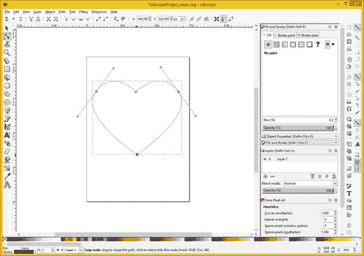

# 九、数字插图：数据足迹优化

现在，您已经了解了有关数字插图的基本概念、术语和原则，是时候了解如何创建 2D 矢量新媒体以及如何优化数据足迹了。

2D 或 3D 矢量素材的真正优化是使用它，因为光栅图像由于在数字图像中存储单个像素元素的大阵列以及在数字视频中存储单个帧而固有地数据繁重。

在本章中，您将了解如何使用流行的开源 Inkscape 软件创建数字插图，这样您就不必用 XML 标记或 Java 代码手动编写 SVG 命令和坐标数据。您还将学习如何使用一个工作流程导出这些命令和坐标数据字符串，该工作流程让 Inkscape 将您的 SVG vector 对象的数据编写为 XML 或 Java 代码。

## Inkscape:矢量插图形状数据

由于矢量新媒体素材本身已经过优化，只要您使用尽可能少的顶点来创建 2D 和 3D 素材，并为您的目标使用正确类型的贝塞尔曲线，您就可以专注于如何使用 Inkscape 来创建 2D 矢量素材。在本章中，您还将学习如何使用导出函数将这些数据转换成可以在 Android Studio、JavaFX 和 HTML5 中使用的命令数据和 XML 标记。

对于矢量图像，这是通过 2D X，Y 空间中的坐标以及使用 SVG 指令定义曲线的数学来完成的，这看起来很像代码。让我们来看看矢量插图的基本结构。

### 布局:Inkscape 中关键区域的概述

Inkscape 用户界面非常复杂，因为该软件为您提供了 2D 矢量新媒体素材创建工作流程所需的几乎所有东西。简而言之，有三个垂直工具栏:左侧的主要功能工具，最右侧的吸附设置，以及右侧工具栏内侧的命令工具(见图 9-1 )。画布右侧还有浮动调色板停靠区，这是占据你 UI 大部分的白色区域。最上面是菜单，下面是包含所选工具选项的水平工具栏；在图 9-1 中，这是按节点编辑路径工具，如左侧弹出工具提示所示。(我在这张截图中特别提到它，因为它是一个工具，您将使用它为您的 Android Studio 游戏和应用创建复杂的样条数据。)在用户界面的底部是一个用于形状填充和曲线描边的色样选择器，下面是一个状态栏，以数字形式显示您正在进行的操作和其他重要的工作流程设置。UI 中间的方块是您正在处理的页面。

图 9-1。

Inkscape tools, floating palettes, option selectors

让我们开始学习如何在 Inkscape 中使用形状创建工具，以及如何导出 XML path 命令数据。

### 多边形形状:创建基本闭合形状

多边形形状，在第十章中有进一步的介绍，是周边有直线的形状，如三角形、正方形、五边形、六边形和八边形。让我们使用 Inkscape 多边形工具来创建你在第九章中用 SVG 命令创建的绿色八边形。选择创建星形和多边形工具，如图 9-2 所示。然后选择选项工具栏左上角的多边形选项。将“角”微调器设置为 8，然后单击页面中间并拉出八边形。您可以使用右上方的填充和描边调色板将填充颜色设置为绿色。

图 9-2。

Create a green octagon using the polygon tool

从中心拉出多边形时，可以控制其大小和旋转。我将尺寸与页面的顶部、底部和侧面对齐。

正如你在左下方看到的，描边和填充属性被总结，就像你在其上绘制形状的层一样。对于填充和图层 1，100%的不透明度在屏幕右侧的调色板中显示为灰色，正如您将在将要导出的 SVG 路径数据中看到的那样。接下来让我们看看如何将这个形状转换成 SVG 路径数据。

### SVG 数据导出:使用 Inkscape 文件➤另存为

许多开源软件包，如 GIMP 和 Blender，使用文件➤另存为菜单序列来保存它们的原生文件格式，并使用文件➤导出菜单序列来保存不同的数据格式。Inkscape 使用文件➤另存为来保存(导出)成不同的数据格式，如图 9-3 所示。使用 Plain SVG 获取 XML 数据，您可以编辑这些数据并从中提取路径命令数据。

图 9-3。

Use File ➤ Save As menu sequence; select Plain SVG

将文件命名为 octagon.svg，在文本编辑器中打开，如图 9-4 所示。您的路径数据字符串以蓝色显示。

图 9-4。

Open this octagon.svg file in your OS text editor

您可能已经注意到 JavaFX 和 HTML5 导出支持，以及其他平台，如 PostScript 和 Flash，在图 9-3 的另存为对话框中。如果您打算在 Android 或 iOS 中使用 JavaFX，您可以使用这个选项，但是使用 plain SVG 是为您在 Inkscape 中创建的路径提取原始 SVG 命令数据字符串的最佳方式。如果您有一个复杂的多层结构，也可以选择将层作为单独的 SVG，这样您就可以将 SVG 路径命令数据模块化。

### 样条曲线形状:创建复杂形状

我会让你使用其他基本的形状工具，比如椭圆弧工具和文字工具。在这一章，重点是画多边形和贝塞尔曲线。这些主题也将在下一章中讨论，下一章的重点是 3D 新媒体，所以我将通过一个 2D 矢量软件包让你熟悉它们。此外，您为 Android Studio 应用创建的大部分内容都是由多边形或贝塞尔曲线组成的，因此在 Inkscape 中关注这些形状创建工具是很实际的。

#### 使用绘制贝塞尔曲线工具:绘制你的粗略形状

使用文件➤新建菜单序列在 Inkscape 中启动一个新项目。选择绘制贝塞尔曲线和直线工具。这可以在图 9-5 的屏幕左侧看到，大约在 Inkscape 工具栏的中间位置。我让工具提示可见，这样你可以更容易地看到它。您可以将鼠标悬停在工具和其他用户界面元素上，通过使用这个方便的弹出工具提示功能来查看它们的功能。现在，让我们创建一个复杂的贝塞尔曲线形状，例如一颗心，只用四个数据点来完成(因为本章是关于优化的)。正如我提到的，优化向量的方法是使用更少的数据点，并利用样条张力手柄。

图 9-5。

Click start point, click to right, pull out handles

要在 Inkscape 中创建一个心形，请选择“绘制贝塞尔曲线和直线”工具，并在页面中心从顶部向下大约 25%处单击。Inkscape 中的起点用一个空心的方形点来显示。

单击此起点右侧靠近页面右侧的第二个点。在图 9-5 中，显示了蓝色花键张紧手柄与绿色曲线段(一个)和红色电流曲线段(两个)相遇的地方。

在单击(并拖动)第二个点时，从第二个点拉出样条曲线控制柄，以创建粗略曲线。稍后您将对此进行微调，因此它不必是完美的。一旦放开(释放鼠标以停止拖动控制柄模式)，就可以向下移动样条线，朝向心脏的底部。

接下来，单击将成为心形底部点的点，该点应位于起点的正下方，从页面顶部向下大约 60%，或从页面底部向上 40%。

绘制心脏曲线的第三段，直到与第二个点相反或成镜像的点，这次是在起点的左侧。这应该与你的第二个点从页面右侧到页面左边缘的距离相同，如图 9-6 所示。点按起点左侧靠近页面左侧的第三个点。如图 9-6 所示，这是蓝色花键张紧手柄相遇的地方，也是绿色曲线段(三个)和红色电流曲线段(四个)相遇的地方。

图 9-6。

Click bottom point, click to left of start, pull out handles, and then place end point of heart over start point

再次，从第三个点拉出样条线手柄，同时单击并拖动它以创建一条粗略的曲线。一旦放开(释放鼠标以停止拖动控制柄模式)，就可以移动第四个曲线段的终点，这次是在心形(路径)的起点上。如果将路径绘制操作的终点放在路径绘制操作的起点上，则共有点会变成红色，如图 9-6 所示。然后你可以点击关闭心脏的路径。

单击起点后，第五个终点和起点成为同一个(起点)，因此您仅使用了四个点和四个曲线段来创建优化的闭合心形(路径)。

关闭形状后，绿色和红色线段颜色参考线消失，整个贝塞尔曲线颜色为黑色，厚度为一个像素。请注意，这只是显示您的贝塞尔曲线路径在哪里，因为从数学上来说，路径实际上没有厚度。

正如你在图 9-7 中看到的，心脏的左侧实际上比右侧更好。在本章的下一节中，您将了解如何在 Inkscape 中编辑样条曲线构造。

图 9-7。

Click end point on start point and close the heart’s path

编辑路径是通过不同的 Inkscape 工具完成的，该工具称为“按节点编辑路径”工具。提供它是为了让艺术家可以返回并微调节点(控制点或顶点)手柄，或者让矢量艺术家可以进一步编辑现有的路径。

请注意，有许多不同的术语用于点(控制点)，或顶点，或节点，或坐标，它们组成了由贝塞尔曲线组成的路径(形状)。

接下来，让我们使用“按节点编辑路径”工具(Inkscape 中最常用的工具之一)来优化心形并改进其路径形状，正如它在 Inkscape 主工具栏中箭头(选择)工具正下方的位置所示。

#### 使用按节点编辑路径工具:优化心形

“编辑路径工具”(简称)的图标显示一个锐角三角形光标，用于选择要编辑的节点，样条线张力控制柄从节点中伸出。选择此工具后，心形会将贝塞尔曲线线段之间的节点(点或顶点)显示为空心点。该工具在图 9-8 中显示为选中状态(蓝色)。

图 9-8。

Select the Edit Paths tool and click the second node

让我们从选择第二个节点开始，它位于心脏的右侧。单击并选择该节点后，它会变为红色，样条线拉伸控制柄会从该节点出现。这些控制节点每侧两个不同曲线段的曲率。使用手柄末端的圆移动顶部手柄，控制第一条线段进入第二个顶点的曲率。

底部手柄也随手柄末端的圆一起移动，它控制第二条线段从第二个顶点出来的曲率。

正如您在第八章中所学，移动样条控制柄的端点会改变控制柄的角度，并影响曲线的曲率，曲线连接到顶点并由该顶点定义。

如果通过将端点移动到更靠近(或更远离)顶点本身来缩短或延长控制柄，则使用较长的控制柄会使曲线变得更弯曲，而使用较短的样条线拉伸控制柄会使曲线变得不那么弯曲。

如果您将控制点放在顶点的顶部，或者将它们缩回到顶点中，那么它将成为一个角点，从该点出来的曲线将成为一条线(多边形)。

也有不同的键盘修改器可以打开角度捕捉(控制)，锁定曲率(交替)或控制柄长度，以及打破顶点或节点的控制柄对称性(偏移)。这是一个工具，你需要练习使用一段时间才能熟练或专业地使用它。也请务必浏览 Inkscape 左上角的“按节点编辑路径”工具选项工具栏。

在这个目前不完善的心脏路径中，你首先需要修复的是球形的右侧。为了修复这个曲率，你需要调整从你的第二个顶点出来的曲线，这是通过使用张紧手柄的下段来完成的，如图 9-8 所示(连同心脏缺损一起)；在图 9-9 中显示为红色选中(固定)。

图 9-9。

Adjusting spline tensioning handle for second curve

如果你想了解你正在 Inkscape 中进行的心脏手术，你可以在这本书的资源库中打开你的`InkscapeProject_heart.svg`文件。

为了减少心脏右侧曲线的膨胀，将下手柄的端点拉得更近，直到第二条曲线与第三条曲线对称，如图 9-9 所示。

如果你比较图 9-8 和图 9-9 你可以看到，我已经缩短了大约 15%的手柄长度，也减少了弯曲的程度。

使用“按节点编辑路径”工具需要通常所说的“扭曲”，这意味着对顶点及其张力控制柄进行多次轻微调整，以便逐渐优化形状，在本例中，它是一颗心。

现在顶点二的底部(曲线)调整好了，让我们在顶部工作；也就是进入顶点 2 的曲线。

正如你在图 9-9 中看到的，心脏的右上半部分是方形的，需要像左半部分一样更圆一些。

正如你在图 9-10 中所看到的，我已经将样条线张力手柄的顶部缩短了大约 15%,通过减少进入第二个顶点的曲率量，使曲率再次更好地匹配心形的另一侧(左侧)。

图 9-10。

Adjust the top tensioning handle to make the shape rounder

现在心脏的上半部分已经改进了，你现在应该开始调整顶部和底部的中心点，继续进一步优化这个心脏形状。

下拉底部顶点细化心脏高度，如图 9-11 。由于心脏的尖端没有任何圆形曲线(它是尖锐的)，这意味着样条线张力控制柄直接位于第三个顶点的顶部。

图 9-11。

Pull down the bottom vertex and center it with top

如果要将心形的底部风格化，按住 Shift 键，拉出顶点的样条线拉伸手柄。我在图 9-13 中展示了这一点，以便你能明白我的意思。

可以下拉顶点，如图 9-12 所示。

图 9-12。

Pull down the top vertex and center it with bottom

在调整过程的这一点上，心脏的形状只是一个味道的问题，所以继续调整四个贝塞尔曲线顶点，直到你得到你想要的结果。

如果您想要样式化位于第三个顶点的心尖，您可以将拉伸手柄拖回锐角之外，如图 9-13 所示，方法是按住 Shift 键盘修改器，单击选定的顶点，并将鼠标拖离选定的(红色)控制点(节点或顶点)。

图 9-13。

Use the Shift key and drag handle out of vertex #3

由于这是一个数据足迹优化章节，我将向您展示如何从您的心脏路径向量定义中删除 47 个字符(大约一半)的 SVG 命令字符串数据。

## 数据占用优化:使用整数

使用您在本章第一部分中学习的文件➤另存为➤ Plain SVG 工作流程，并将文件命名为 heart_PlainSVG(如图 9-14 屏幕顶部(标题栏)所示)。使用缩进的 XML 约定格式化您的数据(我在这里已经为您完成了)，并查看命令数据，它在子标签`<path>`内的`d=`后面的引号中。

图 9-14。

View the floating point version of your path data

正如您所看到的，坐标数据具有非常精确的浮点精度，这在使用整数值寻址像素的 Android Studio 应用中不一定是准确的。将这些浮点值四舍五入到最接近的整数值，如图 9-15 所示。

图 9-15。

Convert your floating-point data into integer data

这将向量数据占用空间减少了大约 100%。

## 摘要

在本章中，您了解了数字插图数据占用空间优化以及如何使用 Inkscape 矢量插图软件。您了解了如何创建样条线和多边形，如何导出 SVG 命令数据，以及如何优化在 Android Studio 和 Java 中的使用。

在下一章中，您将学习使用 Blender 创建 3D 素材和优化数据足迹。