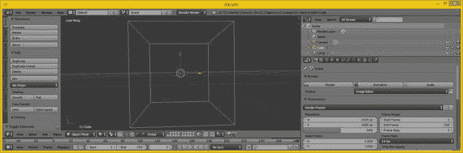
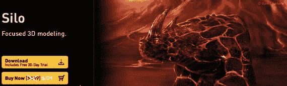
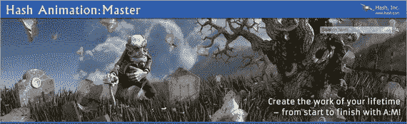
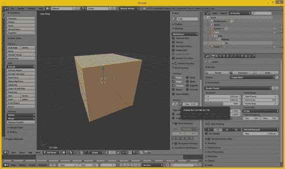
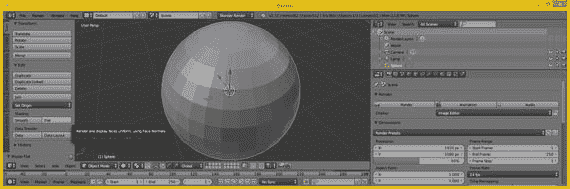
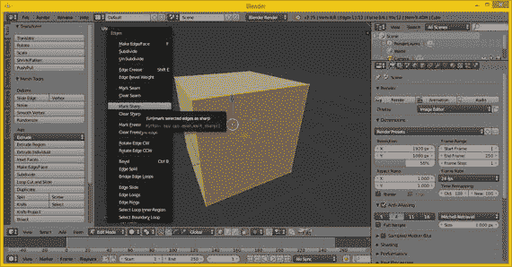
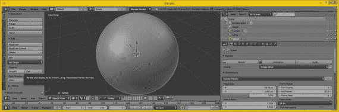
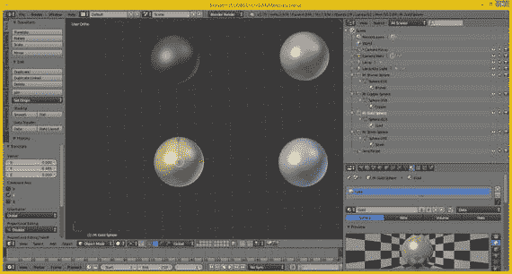
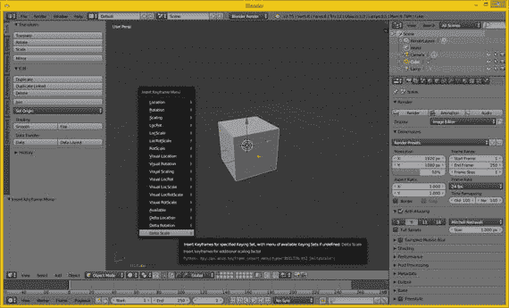
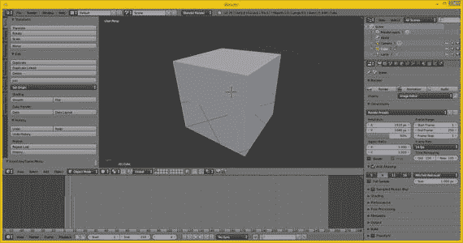

# 十、3D 新媒体：概念和术语

现在，您已经了解了用于 Android Studio 的 2D 数字图像、数字音频、数字视频和矢量数字插图新媒体内容的基本概念、术语、原则和数据占用优化，是时候进入更复杂的 3D 新媒体素材领域了，在 Android Studio 中，3D 新媒体素材可以成为 i3D 或交互式 3D，用于游戏应用、电子学习和模拟的素材。

Android Studio 只支持一个开源、实时、i3D 矢量渲染平台，称为 OpenGL，代表开放图形库。与 SVG 不同，SVG 与 OpenGL 相比相对简单，我无法在仅仅几个章节，甚至几本书中介绍 i3D。

然而，如果你正在用 Android Studio 创建 i3D OpenGL 应用，这完全是一种不同类型的应用。如果你想为 Android 开发 3D 应用，你需要专门研究这方面的书籍，因为与 Android Studio 和 Android OS 中的其他新媒体资源支持相比，3D 是一个完全不同的领域。像 Android 支持的那些新媒体素材一样，Android i3D 支持完全是开源的，所以这当然是个好消息。

在这一章中，我将尽可能多地向您概述 3D，因为它远比您的 2D 新媒体素材更广阔，不仅仅是因为它具有数字视频和数字音频所具有的第三维(深度)或第四维(动画)。主要原因是它用于凭空创建照片级的真实环境，这主要是由主机游戏行业和好莱坞电影业推动的。您可以利用这些 3D 进步！

您将了解 3D 矢量图像、3D 动画、3D 建模、3D 纹理映射、3D 粒子效果、3D 物理模拟、角色动画以及所有类似的复杂的 i3D 相关主题中使用的基本概念、原理和格式。

## 交互式 3D 资源:3D 矢量内容

交互式 3D 矢量对象可以使用 Android 代码，使用 Java 7 或 JavaFX 类和方法，或使用 3D 软件包，如 Autodesk 3D Studio Max(我使用的就是它)，或 Blender，一种接近类似专业功能水平的开源软件。

交互式 3D，通常称为 i3D，矢量资源主要由 3D 空间中的 3D 矢量几何体或顶点组成。这是用 2D 光栅图像表现出来的，你在第二章中学到了，并且用关键帧制作了动画，你在第六章中看到了。要使 3D 具有交互性，需要定义 3D 对象(内部)层次，并为 3D 对象的每个部分嵌入编程逻辑，告诉它如何工作。创建一个静态 3D 或动态 i3D 对象的“层”比你在 Android Studio 的 2D 新媒体区找到的要多得多。

请务必注意，您的所有其他新媒体素材都包含在 i3D 新媒体素材中。这意味着你在前九章所学的一切也是复杂的 3D 模型创建工作过程的一部分，你很快就会看到。数字图像用于 3D 模型几何的皮肤，数字视频提供动画纹理映射，SVG 几何用于或渲染到 3D 表面上以获得纹理映射效果，数字音频用于声音效果或使 i3D 角色说话。可能性是无限的。

让我们从顶点开始向上，就像你在 2D 矢量插图一章中所做的那样。我将向您展示 3D 素材的各种属性，从 3D 几何图形到 3D 模型，到 3D 层次结构，到 3D 动画，再到 i3D 对象。

顶点是最不常用的新媒体素材类型；在 HTML5(网站和智能手机)中使用 WebGL 2，在 Android 中使用 OpenGL ES 3.1，在 Java 7、8 和 9 中使用 JavaFX。

### 3D 的基础:网格的几何学

正如 2D SVG 新媒体一样，3D 新媒体资源的最低层是顶点及其与其他顶点的连接。使用 3D，顶点之间的连接变得更加复杂，不仅因为这些连接在三维空间中出现，还因为 3D 引入了通常称为多边形或“多边形”的三角形面，或称为四边形或“四边形”的矩形面顶点之间的连接称为“边”在 3D 几何图形进行纹理映射之前，它在 3D 行业中被称为“网格”或“线框”，因为这是您的 3D 几何图形在使用数字图像进行纹理映射或“蒙皮”之前的样子。您将在下一节中讨论这一点。

#### 3D 空间中的数据点:3D 顶点的原点

就像 2D 顶点(在 Illustrator 中称为“锚点”，在 Inkscape 中称为“路径节点”)一样，顶点是 3D 几何和有机建模的基础。就像 2D 多边形使用直线一样，3D 几何模型使用直线，3D 有机模型使用通过 NURBS(非均匀有理 B 样条)、Catmull-Rom 样条和哈希面片定义的 3D 曲线。顶点定义了模型基础结构(无论是边还是样条线)在 3D 空间中的位置。

在 3D 几何中，顶点数据可以保存表面颜色数据、表面法线数据、UVW 纹理映射数据以及顶点 X、Y、Z 位置数据。这类似于 2D 的像素，它保存 X 和 Y 数据；RGB 数据；和阿尔法通道数据。

熟悉 3D 数据扫描仪的人都知道术语“点云”所以顶点仍然是你在 3D 产业中创造的一切的基础，从游戏到模拟到虚拟世界等等。

对于 Java 7、8 和 9 编程，JavaFX VertexFormat 类保存顶点数据，包括顶点位置、法线信息(法线很快将被涵盖)和 3D 纹理坐标。因此，您可以使用 JavaFX 代码为您的游戏或物联网应用放置顶点，或者您可以使用 Hexagon 等 3D 建模器，或者 Blender 等 3D 建模器和动画包。

#### 连接 3D 顶点:边将 3D 顶点连接在一起

3D 几何模型使用称为边的东西将两个顶点连接在一起。边缘是一个向量，或者直线，所以它看起来像 3D 空间中剃刀的边缘，正如你在 Blender 中看到的图 10-1 。形成多边形需要三条边，形成四边形需要四条边。多边形和四边形被称为“面”，这将在下一节中介绍。建模 3D 几何对象时，可以选择模型的组件，如顶点、边或多边形。

图 10-1。

Blender 3D geometry having 8 vertices and 12 edges

如果您已经使用更高级的基于样条的建模范式创建了 3D 几何图形，例如使用 MoI 3D 的 NURBS，或使用 SILO 2 的四边形(仅 160 美元)，或使用 Animation:Master 的散列面片(仅 80 美元)，您将需要将您的模型“抽取”为多边形(三角形)，这就是 Android Studio (OpenGL，Java，JavaFX)用于其 3D 渲染的方式。

目前，Android、JavaFX 或 HTML5 中没有对样条线或四边形的 OpenGL“原生”渲染支持。这些都使用 OpenGL ES 3.1。ES 代表“嵌入式系统”，指的是便携式低功耗消费电子设备。

从 3D 几何图形的其他样条或四边形表示抽取成多边形的算法过程将这些建模范例中使用的无限平滑曲线转变成具有直边的三角形面的集合。

这是通过滑块或对话框设置使用抽取或平滑数字因子来完成的。这或者是 3D 软件内部的抽取功能，或者是在文件导出功能中提供的，该功能将样条建模格式从基于曲线的建模器输出到多边形几何模型格式。这方面的一个很好的例子是在灵感的时刻 V3 NURBS 建模软件。现在让我们看看多边形、四边形和样条曲线是如何形成 3D 曲面的。

#### 曲面:三条边形成多边形，四条边形成四边形

一旦你有三条三角形的边，你就有了一个多边形。这可用作表面，并可作为“皮肤”或“纹理”的宿主，以使 3D 数据看起来更真实。经验法则是，三角形越均匀(正方形)，渲染效果越好。狭长的(长而细的三角形)会导致渲染“伪像”或视觉异常，但通常不会。你觉得幸运吗？然后使用狭长多边形。建模者通常更喜欢用四边形建模，并使用四边形建模器使它们尽可能地方形，例如 NeverCenter 的流行 Silo 2.3(如图 10-2 所示)，它仅售 109 美元。

图 10-2。

Silo quad modeling software is affordable at $109

可以看到，Silo(目前是 2.3.1 版本)可以用于角色建模。这通常是使用有机样条建模器来完成的，例如 Hash Animation:Master(见图 10-3 )使用专有的 Hash patch 样条算法。

图 10-3。

Hash A:M character modeling software is only $79

一旦你有了一个曲面，对于 Android 来说需要是一个三角形，你也定义了你的曲面法线。在图 10-1 所示的 Blender 2.76 项目中，基本立方体上的面是四边形，但是正如你将看到的，四边形，就像 tris 一样，也有曲面法线。

法线是用于将纹理贴图应用到 3D 网格几何体以使其看起来实心的东西之一。

纹理映射将在本章的下一个主要章节中介绍。有一个与相邻多边形或面相关的原则，称为平滑组，您将在曲面法线之后看到它。

因此，曲面多边形、三角形、四边形或面至少包含一个法线、几个纹理贴图和一个平滑组的数据。正如我提到的，i3D 素材比 2D 媒体素材先进得多。3D 资源呈现在客户端，或正在观看它们的设备上。我将在本章的后面介绍渲染。涵盖大量的 i3D 主题！

#### 表面朝向的方向:表面法线的概念

如果你知道如何在 3D 软件中打开“显示法线”功能，你可以看到你的 3D 面表面法线，它显示在面的正中心，正如你在图 10-4 中看到的浅蓝色。Blender 中也有显示顶点法线的按钮，顶点法线从顶点指向外；因此，对于这个模型，顶点法线从立方体的角(45 度)斜向指向外，与面法线的结果正好相反，面法线从每个面的中心垂直向上指向(90 度，像摩天大楼一样)。

图 10-4。

Display face normals as lines button shows normals

正如你在图 10-4 中看到的，看到的两条法线实际上与 X 轴(红色)和 Y 轴(绿色)对齐，它们与立方体成 90 度角相交。在 3D 编辑模式视图的左下角，您的轴向导显示哪个轴是 X 轴，哪个是 Y 轴，哪个是 z 轴。

这个曲面法线的函数相当简单。表面法线告诉渲染引擎表面面对的方向:向内或向外。同样的逻辑适用于顶点法线；它显示渲染引擎处理 3D 几何图形的哪一侧进行表面渲染。

如果这个立方体几何体的法线指向内侧，而不是外侧，那么这个立方体在渲染时将完全不可见。3D 软件中有一个翻转法线操作(算法),用于反转法线方向。这是为模型普遍做的；所有法线翻转 180 度。

渲染场景时使用翻转法线，渲染场景后导入的 3D 对象不可见。这几乎总是因为 3D 导入工具将导入的 3D 几何体的曲面法线指向(翻转)了错误的方向。相对于导入曲面法线的软件，3D 建模工具的导出器可能会以错误的方向导出曲面法线。这是一个相当常见的现象，所以，如果你打算使用 3D 或 i3D 新媒体资源，请定期使用翻转法线。

如果您需要某种东西(例如，一所房子)，其中的 3D 几何体必须从外部和内部进行渲染(这在 3D 虚拟世界中很常见，也是固有的 i3D 模拟)，因为您必须能够在其中导航，所以您必须将几何体的面创建为双面多边形。你需要应用一个双面纹理贴图，我将在下一节介绍。

需要注意的是，在 i3D 中，使用双面几何体和双面纹理需要 CPU 和 FPU 进行更多的实时渲染引擎处理。

#### 平滑多面曲面:使用平滑组

您已经看到了渲染为实体(而不是线框)的 3D 模型，但看起来像是经过雕琢的；也就是说，你可以看到渲染的多边形(面)就像是平面一样，如图 10-5 所示。这通常被称为平阴影；渲染引擎不应用平滑。如果在启用平滑的情况下渲染相同的几何体，这种效果会消失，3D 几何体看起来就像预期的那样，无限平滑，就像是使用样条线创建的一样，而实际上是使用多边形。让渲染引擎进行平滑比拥有大量网格(多边形)数据更有效。渲染器使用称为平滑组的东西来应用平滑，该平滑组应用于每个面，以告诉渲染器何时在两个面之间平滑，何时不平滑，这留下了通常称为“接缝”的部分平滑组使用简单的整数。如果边的每一侧的数字都匹配(对于该边相对侧的每个相邻面)，则渲染为平滑的颜色过渡。如果数字不同，它会渲染一条接缝，并且边缘清晰可见，因为边缘每一侧的颜色渐变不同，所以颜色渐变在两个面(多边形)之间不是无缝的。

图 10-5。

Set faceted shading via Transform ➤ Shading ➤ Flat

在某些 3D 软件包(例如 Autodesk 3D Studio Max)中，平滑组编号模式位于用户界面中。在其他情况下，如 Blender，使用 Blender Edges 菜单中的 Mark Seam、Clear Seam、Mark Sharp 或 Clear Sharp 命令，编号被隐藏，平滑组的功能被“暴露”,如图 10-6 左侧所示，标记 Sharp 选项为蓝色。

图 10-6。

The Blender Edges menu allows you to set smoothing

在 Blender 中，一些 3D 建模者(人，而不是软件)会犯错误，试图通过实际分割 3D 几何本身中的边来暴露其 3D 几何中的接缝或锐边，这实现了这种视觉效果，但也可能在 3D 几何拓扑优化工作过程中导致问题，因为您的模型会不断优化。通过在 Blender 中使用“标记接缝”或“标记锐边”修改器，可以避免分割几何体边以获得接缝。

这些特定的混合器修改器是基于平滑组的，因此可以实现平滑(或边缝)效果，而不会实际影响 3D 几何体拓扑本身。3D 几何拓扑是多边形相对于彼此的布局方式。

Blender 中的修改器是在渲染之前应用的，因此实际上不会影响底层 3D 几何体的实际数学拓扑。如果您熟悉映射中使用的术语“拓扑”,那么拓扑非常类似，因为它是一个 3D 术语，指的是如何构建 3D 几何图形的表面。

使用 Blender 修改器始终是一种更灵活的 i3D 内容创建方法，因为它在渲染引擎级别应用平滑度或其他所需的效果或结果，而不是在 3D 几何体拓扑级别。这使得 3D 网格保持完整，最终更加简单。一如既往，越简单越好。

通过使用变换面板和阴影面板区域，然后单击平滑按钮，可以对 3D 模型全局(同时对所有面)应用平滑，如图 10-7 所示。这会将平滑组应用于整个模型，从而产生平滑的表面颜色渐变。

图 10-7。

Set smoothing using Transform ➤ Shading ➤ Smooth

接下来，让我们来看看如何应用一个“皮肤”到你的网格几何体表面，使用一种叫做纹理映射的东西。

### 蒙皮 3D 模型:纹理映射概念

完成 3D 几何图形(这是 3D 模型的基础)后，可以对其应用纹理贴图，以创建 3D 模型的实体外观。纹理贴图还可以用来为 3D 模型添加细节和特殊效果，使其看起来更真实。如果您想知道 3D 几何体和 3D 模型之间的区别，3D 几何体只是网格或线框，而 3D 模型应该已经应用了纹理贴图。如果你购买第三方 3D 模型，你希望它们呈现时看起来像它们应该呈现的样子，而不是单调的灰色，这是没有应用任何纹理映射(和没有顶点颜色)信息的渲染模型的样子，如图 10-7 所示。

#### 纹理贴图基础:通道，阴影，效果和 UVW 贴图

纹理映射几乎与创建拓扑正确的几何图形一样复杂。事实上，3D 的每个领域都同样复杂，这也是 3D 成为整体上最复杂的新媒体类型的原因。这就是为什么 3D 故事片雇佣艺术家专门关注(工作)和处理你在这一章中看到的每一个领域。纹理映射是 3D 新媒体素材制作的主要领域之一，能够使用 2D 矢量和 2D 光栅图像素材。

值得注意的是，还有一个使用 3D 纹理算法的更复杂的 3D 纹理映射领域。它通常被称为体积纹理；它使用算法来创建真正的 3D 纹理效果，这些效果贯穿整个 3D 对象，就好像它是实心的，而不是空心的或需要双面纹理映射的 3D 对象。

纹理映射背后的一个基本概念是利用你在本书中学到的资源，将 2D 资源应用到 3D 几何体的表面。这是通过使用 UVW 映射坐标来实现的。这些 3D 坐标显示了如何将 2D 图像(平面)定向或投影到 3D 几何表面拓扑上。UVW 曾经与 XYZ 不同，但它们代表着相同的维度(宽度、高度、深度)。有必要使用不同于 XYZ 的字母，因此在 XYZ (UVW-XYZ)之前的字母表中有三个字母，这样你就不会在应用你的纹理贴图坐标时感到困惑！).

通过使用纹理通道，可以将多个纹理贴图添加到 3D 几何体的表面。这些类似于您在 2D 图像中用来定义每个像素特征的颜色和 alpha 通道。Android、HTML5 和 JavaFX 等开放平台目前支持四种最重要的纹理通道。这些包括漫反射纹理贴图(基本 ARGB 颜色值)，高光纹理贴图(表面有光泽或暗淡)，照明纹理贴图(也称为发光贴图)，以及凹凸纹理贴图。

3D 软件支持用于附加纹理效果的其他高级纹理贴图通道类型。要将它们引入 Android，你必须使用一种叫做“纹理烘焙”的过程

烘焙纹理贴图包括将所有的纹理通道渲染到一个主漫射纹理贴图中，因为这是 Android 支持的。这提供了与在 3D 包中渲染 3D 对象时类似的视觉效果。

正如你在图 10-8 中看到的，Blender 2.76 也使用场景图，就像大多数现代 3D 软件包一样，JavaFX 也提供了相同的场景图功能。

图 10-8。

Using a scene graph (right) to apply a gold texture map and shader (bottom) to a sphere object in Blender

这个球体几何体和它的纹理映射在一个场景图形层次中组合在一起，我已经为你展开了这个层次。纹理映射定义包含一个或多个纹理通道；在这种情况下，漫反射(颜色)和镜面反射(表面特征，如光泽、金属光泽等)。

正如你在图 10-8 中看到的，你可以从 Android、JavaFX 和 HTML5 等开放平台现在支持的少数纹理通道中获得大量良好的蒙皮结果。

随着时间的推移，OpenGL ES 3.1 可以添加更多的纹理通道支持，为开发人员的 3D 新媒体资源使用提供更大的视觉灵活性。透明区域(不透明贴图)和表面细节(法线贴图)是高级纹理贴图支持的两个最重要的区域，需要添加到 Android Studio、JavaFX 和 HTML5 中。

这些最终将需要添加到 Android Studio 中，要么通过支持 JavaFX API，以便开发人员能够为 Java 7、8 或 9 创建逼真的 3D 模型，要么通过使用 nVidia 的 Android 扩展包(AEP ),您目前必须安装该包，但最终将成为 Android Studio、Android APIs 和 Android OS 的永久组成部分。

着色器定义是纹理通道和控制这些通道相互关系的任何代码的集合，也是它们相对于彼此如何合成、应用和渲染的集合。

着色器在行业中也通常被称为“材质”。着色器和着色器语言(3D 和 i3D Android Studio 应用开发的另一个专门和复杂的领域)将在下一节中介绍。正如你所看到的，i3D 产品有很多“层”——其中涉及到着色器，子层！

#### 着色器设计:着色器通道和 GLSL 着色器语言

正如本章中涉及的 3D 对象创建的每个领域一样，纹理贴图着色器设计本身也是另一种艺术形式。数百名着色器艺术家在 3D 电影、流行的控制台游戏和电视节目中工作，确保用于纹理或皮肤 3D 几何图形的着色器使生成的 3D 模型看起来尽可能真实。这通常是 3D 和 i3D 的主要目标:通过创建一个虚拟世界并让计算机(渲染农场)为您创建所有相机运动，将它们转化为像素(图像)、帧(视频)或体验(游戏或应用)，来取代更昂贵的摄像机拍摄(以及后续的重拍)。

基本着色器由一系列矢量形状和光栅图像(或算法，体积纹理)组成，保存在不同类型的纹理通道中。这些纹理通道使用矢量和光栅资源来应用各种类型的效果，如扩散(RGB 颜色通道)、不透明度(透明度)、发光(自发光)、镜面反射(表面特征)、环境(周围环境)、凹凸(高度)、法线(拓扑)以及类似的增强照片真实感的细节效果通道。

在此基础上，像 Open GL 着色器语言(GLSL)这样的高级着色器语言使用代码来定义这些通道如何相互关联，如何应用或处理通道中包含的数据，以及基于时间、方向或 i3D 空间中的位置等因素的这些通道中数据的其他复杂应用。着色器的复杂性也意味着着色器越复杂，渲染时处理周期就越耗时。

这可能是 OpenGL ES3 目前支持四种最容易处理的基本着色器的主要原因。随着硬件变得更加强大(消费电子产品中的 4 核或 8 核 CPU)，OpenGL ES 可能会添加最后两个重要的着色器通道:不透明度(alpha 通道)和法线贴图。

一旦在着色器内部定义了纹理通道，您需要将 2D 资源定向到 3D 几何体，这是通过使用纹理映射坐标来完成的。如果需要，每个通道都有自己的坐标系，以便将每个效果应用到网格，从而实现所需的效果。

这是通过一种叫做 UVW 映射的东西来实现的，在你进入第四维空间并学习 3D 动画原理和术语之前，下一节也会涉及到它。

#### 纹理贴图方向:投影类型和 UVW 坐标

将 2D 纹理贴图通道中的细节特征(尤其是基本的漫反射颜色通道，因为它对对象的表面进行绘制或着色)与 i3D 几何体正确对齐是非常重要的。如果您没有正确地做到这一点，在渲染 3D 对象时会出现一些非常奇怪的结果，或者至少在视觉上是不正确的。对齐需要在 3D 空间中完成，因为纹理映射这是 UVW(特别是对于体积“真正的 3D”纹理，但对于 2D 纹理也是如此)来定义它们如何投影到 i3D 几何图形上、顶部或包围 i3D 几何图形。

实现这一点的一个简单方法是应用纹理贴图投影类型及其相关设置。这将自动为您设置 UVW 映射数值。这些 UVW 地图坐标值定义了 2D 影像平面在 3D 空间中映射到 3D 几何的方式。这提供了你的“数学桥梁”，在你的 2D 空间和你的三维空间之间。可以手动设置或调整 UVW 贴图浮点值，以微调纹理贴图的视觉效果。

最简单的投影类型是平面投影，因为平面就是一个简单的 2D 正方形。您可以想象这种类型的贴图，就好像您的 2D 纹理贴图图像在 3D 对象的前面，并且您用灯光穿过它，因此它看起来就像您的漫反射纹理贴图中的颜色被投影到 3D 对象上。平面投影对于计算机来说也是最简单的处理方法，所以如果你能得到你的 Android Studio 应用所需要的结果，就使用它。平面贴图通常用于静态 3D 对象，如广告牌，因为一旦您将(相机)移动到 3D 模型的侧面，这种类型的投影贴图不会提供照片级的真实效果。

相机投影非常类似于平面投影，因为相机将来自相机镜头的纹理投影到 3D 对象表面，就像幻灯机一样。投影与镜头前部 100%平行。这应该用于将视频背景投影到场景中，以便您可以在投影前对 3D 资源进行建模或最终制作动画。如果相机移动，相机投影贴图将保持与镜头前方平行。这有时被称为广告牌映射模式(广告牌投影)。

下一个最简单的类型是圆柱投影，它为纹理贴图提供了更多的 3D 应用。一个圆柱形的贴图在你的上下(3D z 轴)维度上围绕着物体，把你的图像投射到你的物体周围！如果你在 3D 物体上走来走去，在另一个维度上会有独特的纹理细节，这是平面或相机投影所不能提供的。确保你的纹理贴图沿着 y 轴无缝拼接！

一种更复杂的投影贴图类型称为球形投影。这为你的纹理贴图提供了比圆柱投影更完整的 3D 应用。球形投影试图处理所有三个(x、y 和 z 轴)投影方向。同样，你要确保你的纹理贴图是可平铺的，以避免任何“视觉接缝”

与球形投影相似的是立方体投影。这就像有六个立方体格式的平面投影，并使用特殊的立方体纹理贴图数据格式给出类似于球形投影的结果。

当您将立方投影贴图类型应用到 i3D 对象时，正如您可能已经猜到的那样，对象的面被指定给立方纹理贴图中的特定面。这是基于每个 3D 对象的多边形法线的方向，或者通过面与立方体纹理贴图(坐标)UVW 贴图空间的接近度。然后使用平面投影方法从立方体纹理贴图的面投影立方体纹理。

如果使用体积纹理，则空间投影是通过 3D 对象的体积投影的三维 UVW 纹理投影。它通常用于需要内部结构的程序或体积纹理，如木材、大理石、海绵、玛瑙等。如果对 3D 对象进行切片，或者相对于 3D 对象变换纹理贴图坐标，随后会显示体积或程序纹理的不同部分。

还有一个更简单的纹理贴图叫做 UV 贴图(没有 W 维度)。这将在二维空间而不是三维空间中应用你的纹理，并且因为它有较少的数据，所以更容易处理。您可能会使用 3D 软件在 Android Studio 之外映射您的 3D 模型，然后使用模型导入器将您已经纹理映射的 3D 对象导入 Java 或 JavaFX。现在你已经准备好看一看第四维和 3D 动画了。

### 3D 动画:关键帧、运动曲线和 IK

在你已经创建了你的 3D 几何图形，并使用着色器和 UVW 贴图坐标对其进行了纹理贴图后，你可能想要让它以某种方式移动；让我们以一个飞行直升机模型为例。正如您可能想象的那样，您所了解的数字视频资源的概念同样适用于 3D 动画资源，因为两者都使用关键帧。3D 软件包通常被称为“轨迹编辑器”，它允许您向轨迹添加关键帧和“运动曲线”。每个轨迹都与一个 3D 模型相关。如果 3D 模型使用子组件分组，那么可以有必要的组和子组的轨迹，以实现 Android Studio 应用、游戏或 3D 虚拟世界的任何复杂动画或模拟。

#### 线性动画:轨迹、关键帧、循环和范围

最简单的 3D 和 2D 动画是线性动画。线性动画使用的处理能力最少，因此效率最高。如果可以使用线性动画来实现 3D 动画目标，请使用最少数量的轨迹和最少数量的关键帧，因为这样使用的系统内存最少。图 10-9 显示了如何在 Blender 2.76 中添加一个关键帧到立方体对象，方法是使用热键“I”访问一个插入关键帧菜单并选中一个立方体对象。我选择了增量缩放关键帧类型，它从当前缩放值添加一个增量(差)缩放值。

图 10-9。

Use Insert Keyframe menu; add Delta Scale keyframe

如果动画运动是重复的，请使用无缝循环，而不是包含重复关键帧数据的长范围。一个无缝运动循环比一个长范围占用的内存少，特别是当该范围包含同一运动的多个副本时，这是非常多余的。所以循环是线性 3D 动画中一个很好的优化原则。

接下来让我们看看一些更复杂的动画类型，包括那些非线性的。它们不会在一条直线上，关键帧间隔均匀。您还将了解角色动画和用于物理模拟和粒子系统的程序动画。

#### 非线性动画:运动路径和运动曲线

一种更复杂的非线性动画类型不太规则，通常看起来更真实，尤其是在涉及人体运动和简单物理模拟的情况下，它为动画 3D 对象或元素(层次中的子对象)实现了一条运动路径。为了给沿该路径的运动添加更多的复杂性，可以使用运动曲线，以便运动本身可以加速或减速，模拟重力或摩擦等情况。使用这些运动曲线直观表示的数学算法称为插值器。JavaFX 有一个插值器类，它包含了各种最标准的(如果有效使用的话，功能非常强大)运动曲线算法。下一章将介绍 JavaFX，包括 3D 格式、平台、场景图和编程相关的主题。

非线性不规则运动关键帧的一个很好的例子是一个橡胶球在多风的路上弹跳。道路的弯曲路径使用运动路径来确保球停留在道路曲率上，并且球地板符合道路的坡度(角度)。球的反弹应该使用运动曲线，也称为运动插值器，以使每次反弹在空间运动的加速或减速时间上看起来更真实。在这种情况下，这就是球对地面的反应。

图 10-10 在屏幕底部显示了一个 Blender 时间线编辑器；它有两个旋转关键帧，用垂直黄线表示，当前帧设置是垂直绿线。

图 10-10。

The Blender 2.75 Timeline editor with two keyframes at Frame 0 and Frame 10 and current Frame 6 setting

复杂的物理模拟和角色动画可以使用关键帧完成，如果你想花几个月的时间；然而，编写算法和代码例程来实现这一点实际上比绘制运动曲线和关键帧来尝试和模拟这些现象更容易。

因此，接下来将介绍角色动画原理和程序动画原理，因为您将从较不高级的概念发展到更高级的概念。

接下来让我们概述一下角色动画，因为它是 JavaFX 和 Android Studio 的类似 3D 平台可能支持的 3D 动画类型。

#### 角色动画:骨骼、肌肉和反向运动学

更复杂的动画类型是角色动画。角色动画师是 3D 电影、游戏或电视内容制作团队中最受欢迎的职位之一。角色动画涉及许多复杂的层，包括使用反向运动学设置骨骼，以控制附着到肌肉和皮肤的骨骼；所以角色动画的事情是在不使用直接编码的情况下尽可能复杂的，这被称为程序动画。有一个为制作角色动画定制的动画软件包，叫做 Hash Animation:Master，或 A:M，幸运的是，它有一个负担得起的 79 美元年费，可以拥有它并获得免费升级。如图 10-3 所示。正如你所看到的，这是一个惊人的产品，在二十多年的第 18 次修订中，从 Amiga 3000 上的玩伴开始。

在角色动画的最底层，您有自己的骨骼，它使用反向运动学算法。这控制了运动(旋转)的范围，所以你不会有弯曲错误的肘部，或者像驱魔人一样旋转的头部。

骨骼以层次结构连接在一起，形成骨骼。这是您稍后将设置动画(关键帧)以赋予角色生命的内容。还可以通过将肌肉和皮肤附加到骨骼来模拟肌肉和皮肤，并定义骨骼运动应该如何为角色弯曲肌肉和拉伸皮肤。肌肉伸缩和皮肤变形也是复杂的算法，就像 IK 算法控制骨骼组成部分的运动范围一样。

可以想象，设置所有这些可能是一个非常漫长而复杂的过程；这是角色动画的一个领域，叫做“操纵”是的，正如我提到的 3D 和 i3D 素材创造的所有领域，如果你想在电影或主机游戏行业工作，索具是它自己的工作领域。3D 非常复杂，每个领域都有自己的专长。

#### 程序动画:物理、流体、头发和粒子系统

最复杂的动画类型是程序动画，因为它需要使用算法来完成。在 3D 包中，这通常使用 C++、Python 或 Java 来完成。Android Studio 应用中的程序化 3D 动画应该使用 Java APIs、JavaFX APIs 和第三方 API 的组合来完成，这将在下一章中介绍。

这是最复杂也是最强大的 3D 动画类型。这就是为什么程序动画程序员是 3D 电影、游戏、物联网和电视制作行业中另一个更受欢迎的 3D 职位空缺的原因。你开始明白为什么 i3D 是最复杂的新媒体类型，为什么我把它留到了本书的最后部分。

3D 建模和动画包中有许多功能，如 Blender、A:M、Silo 和 3D Studio Max，它们实际上是程序动画算法插件。

这些插件将用户界面展示给用户，以指定参数，这些参数在程序动画应用于 3D 模型或使用 3D 软件创建的复杂 3D 模型层级时控制程序动画的结果。

以下是一些具有模拟和控制功能的程序动画算法的示例:粒子系统、流体动力学、布料动力学、绳索动力学、毛发动力学、软体动力学、刚体动力学和视频运动跟踪。其中许多包括现实世界物理模拟支持，这些支持通常是添加到高级 3D 动画软件包中的插件。还有许多其他的高级特性需要合理的努力来实现算法。3D 就是利用计算机处理器和内存来创建内容！

## 摘要

在本章中，您了解了 3D 新媒体的概念和术语。您了解了 3D 网格几何体以及添加纹理贴图如何使其成为完整的 3D 模型。您了解了 UVW 贴图以及如何使用投影贴图、着色器和着色器语言以及不同类型的 3D 动画(从简单的线性动画到复杂的动画类型，如角色动画和程序或算法动画)轻松应用它。您已经看到了 3D 新媒体领域的复杂性，因为它支持高级主机游戏和电影电视制作。

在下一章中，您将学习使用场景图层次 3D 素材组织的 3D 平台和 3D 文件格式。