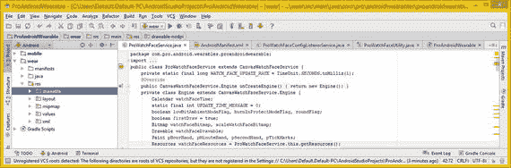

# 十二、在 Android Studio 中引用新媒体素材

现在我们已经介绍了 Android Studio 的新媒体内容，是时候看看这些新媒体素材是如何集成到 Android Studio 中的了，这些新媒体素材是您将使用所有新获得的多媒体制作知识创建的。这些知识的基础是这些素材需要在 Android Studio 项目中的位置，以便在 Java 代码或 XML 标记中被正确引用，如果您喜欢这样设置的话。

本章介绍了用于图像资源的不同 Drawable-DPI 文件夹以及用于视频或音频资源的 raw 文件夹。您还将了解如何在 Android Studio 中引用 2D 或 3D 矢量资源。您将了解如何在应用用户界面设计中引用新媒体素材，以及如何直接显示内容。

## Android 素材:可绘制内容和原始数据

正如您在第二章中所了解到的，基于像素的数字影像在技术上被称为光栅影像，因为一组像素值被光栅化到显示使用这些像素创建的图像的屏幕上。数字插图或矢量图像不是作为图像元素(像素)的数组存储的，而是被绘制或“渲染”到屏幕上，就像有人看着你画一样，只是使用计算机使用的指令来做你创建它时所做的事情。

这相当于您在第四章中了解到的 MIDI 概念，该章重点介绍数字音频，其中的演奏由计算机处理器重新创建，并使用回放指令将其渲染到屏幕(SVG)或合成器(MIDI)上。

### Android 资源:素材子文件夹层次结构

如果您想在 Android 项目中添加自定义动画、自定义主题、数字视频、数字音频或矢量资源，您可能需要在项目文件夹层次结构中添加新文件夹。你将在本章中学习如何做到这一点。在这一节中，我将向您概述不同的项目资源文件夹名称，以及 Android Studio 应用中可能的新媒体素材类型。这让您对 Android 开发中的可能性有了一个高层次的概述。

您的外部新媒体素材——也就是那些主要使用 GIMP 2.8 和 Audacity 2.1 等软件在 Android 之外创建的素材——保存在 resources 文件夹中。在图 12-1 中，这个文件夹是打开的，以显示我为我的 Pro Android Wearables (Apress，2015)书创建的 2D 项目的各种资源子文件夹。这些只是潜在文件夹名称的一半。

图 12-1。

Resource subfolders for ProAndroidWearable project

其他非多媒体资源素材也可以保存在项目资源目录的子文件夹中，包括样式、常量、主题、颜色、动画、应用图标 mipmaps、XML 定义文件和用户界面布局定义。

外部化资源允许 Android Studio 项目开发工作流程更加模块化和有组织，因此在应用开发期间可以更快地访问。Android 中有许多不同的资源类型，它们或者在`/res`项目文件夹中有自己的子文件夹，或者在`/res/values`文件夹中有自己的 XML 文件。我将在表 12-1 中概述 10 个主要资源子文件夹名称和它们持有的素材类型。因为它们对 Android 开发非常重要，所以我将讨论与您在本书中学到的新媒体素材相关的内容。与新媒体相关的有 anim、drawable、mipmap 和 raw。

表 12-1。

Android Studio Project Resource Subfolder Types

<colgroup><col> <col></colgroup> 
| 资源子文件夹 | 资源子文件夹包含的素材类型 |
| --- | --- |
| 鼓舞者 | 包含属性动画的 XML 定义 |
| 生命 | 包含 2D 帧动画的 XML 定义 |
| 颜色 | 包含颜色常数的 XML 定义 |
| 可拉的 | 数字图像素材(PNG8、PNG24、PNG32) |
| 米帕普 | 数字图像应用图标(PNG32) |
| 布局 | 用户界面布局的 XML 定义 |
| 菜单 | 包含菜单结构的 XML 定义 |
| 生的 | 数字视频、数字音频、SVG、3D 格式 |
| 价值观念 | 包含属性值的 XML 定义 |
| 可扩展标记语言 | 包含非 Android XML 的 XML 定义 |

新媒体资源的主要类型包括存放在`/res/drawable`文件夹中的数字图像素材；存放在`/res/raw`文件夹中的数字视频和数字音频资源；在`/res/anim`文件夹中的数字图像或数字视频程序动画，或移动、旋转和缩放；最后是 Android 应用图标 PNG32 数字图像素材，它们放在`/res/mipmap`文件夹中。

表 12-1 中定义的名称是标准化的 Android Studio 文件夹名称；也就是说，它们被“硬编码”到操作系统中，并且有专门在这个`/res`文件夹中寻找它们的代码。只要遵循基本的文件夹命名规则，您就可以定义自己的自定义文件夹名称。这些文件夹被称为“替代”文件夹，因为它们提供替代素材。

### 备用资源文件夹:自定义文件夹名称

您还可以在 Android 应用项目文件夹层次结构中提供一个叫做备用资源文件夹的东西。备用资源文件夹通过将新媒体素材、用户界面设计、样式和主题定义分组到专门命名的备用资源文件夹中，为各种设备物理硬件规格提供自定义素材支持。一个很好的例子是`/res/drawable-dpi`文件夹层次结构，这是 Eclipse IDE 在 Android 5 之前为您创建的。Android 曾经创建一个`/res/drawable-hdpi`文件夹和一个`/res/drawable-xhdpi`文件夹，用于存储不同像素密度的图像素材。本章的下一节将介绍不同密度的可绘制图像素材。

替代资源文件夹允许开发人员设计一个应用，以便它可以在一系列消费电子硬件设备上工作，从智能手表到 UHD iTV 电视机。对于数字图像，这相当于为每种资源提供一个以上的版本，使用不同的像素密度，或从低到高的分辨率资源，以适应大不相同的屏幕硬件分辨率。

对于用户界面设计，这相当于提供一个以上的设计。不同的用户界面布局使用不同的长宽比，特别是纵向，在 Android 中称为端口，横向，在 Android 中称为陆地。UI 布局也考虑屏幕分辨率，使用宽度(w#dp)、高度(h#dp)和最小宽度(sw#dp)文件夹命名约定。还有一种宽屏文件夹命名约定叫做 long，还有一种普通屏幕命名约定叫做 notlong。屏幕大小也分为四个基本命名约定类别:小、正常(中等)、大和超大(超大)。表 12-2 显示了这些文件夹命名惯例，都在一个位置。

表 12-2。

Android OS Alternate Folder Naming Conventions

<colgroup><col> <col></colgroup> 
| 名称修改 | 使用此备用文件夹名称修饰符的目的 |
| --- | --- |
| 陆地 | 屏幕使用横向或侧面方向 |
| 港口 | 屏幕使用纵向或上下方向 |
| 长的 | 屏幕使用宽屏宽高比 |
| 诺龙 | 屏幕使用正常的屏幕宽高比(不宽) |
| sw#dp | 名称修饰符要求的最小屏幕宽度 |
| 在#dp 中 | 文件夹名称修饰符要求的屏幕宽度 |
| h#dp | 文件夹名称修饰符要求的屏幕高度 |
| 小的 | 小显示屏(智能手表、翻盖手机) |
| 标准 | 中型显示屏(智能手机、迷你平板电脑) |
| 大的 | 大显示屏(平板电脑、上网本、笔记本电脑) |
| 品牌介绍 | 超大显示屏(高清或 UHD 独立电视) |

在运行时，也就是说，当您的应用正在运行时，Android 操作系统会根据设备屏幕硬件规格使用适当的备用资源文件夹素材。

例如，如果要提供符合物理屏幕大小、形状或方向(纵向和横向)的不同 UI 设计布局，可以使用自定义 UI 布局文件夹名称来定义用户界面布局设计。

例如，您可以为特定于横向的 UI 布局设计定义一个`/res/layout-land`文件夹，或者为特定于纵向的 UI 布局设计定义一个`/res/layout-port`。如果你想确保你的肖像用户界面设计至少有 720 像素的屏幕宽度，你可以创建一个/ `res/layout-port-sw720dp`文件夹。对于 HDTV 或 UHDTV 的 UI 设计，您可以指定一个针对 HD 或 UHD iTV 设置宽屏分辨率的`/res/layout-land-sw1920dp`文件夹。如果只针对 UHD 设备，你可以对 UHD 智能手机使用`/res/layout-land-sw3840dp`、`/res/layout-port-sw4096dp`或`/res/layout-port-sw2160dp`。

接下来，我们来看看 Android 可绘制对象和屏幕密度修改器，因为这些也直接关系到你在本书中学到的内容。

### Android Drawable:将素材绘制到任何 DPI 屏幕上

Android 中的可绘制图形是可以在你的显示器上绘制的任何图形。我在表 12-3 中列出了设备 DPI 密度常数。

表 12-3。

Seven Android Studio Device Density DPI Constants

<colgroup><col> <col> <col> <col> <col> <col> <col> <col></colgroup> 
| 设备 DPI | 屏幕尺寸常数 | 以 DPI 表示的像素密度 | 像素倍增指数 | 最小屏幕尺寸 | 启动图标大小 | 动作栏图标 | 通知图标大小 |
| --- | --- | --- | --- | --- | --- | --- | --- |
| LDPI 低密度 | 小的 | One hundred and twenty | Zero point seven five | 426×320 | 36×36 | 24×24 | 18×18 |
| MDPI 培养基 | 标准 | One hundred and sixty | One | 470×320 | 48×48 | 32×32 | 24×24 |
| 1280 高清电视 | 高清晰度电视 | Two hundred and thirteen | One point three three | 1280×720 | 64×64 | 48×48 | 32×32 |
| HDPI 高密度 | 大的 | Two hundred and forty | One point five | 640×480 | 72×72 | 48×48 | 36×36 |
| XHDPI 额外高 | 品牌介绍 | Three hundred and twenty | Two | 960×720 | 96×96 | 64×64 | 48×48 |
| XXHDPI 超高 | 二十大 | Four hundred and eighty | Three | 1280×960 | 144×144 | 96×96 | 72×72 |
| XXXHDPI 超高 | xxxlarge | Six hundred and forty | Four | 1920×1080 | 192×192 | 128×128 | 96×96 |

drawables——也就是你的数字图像和数字视频素材——需要根据表 12-3 中列出的七个屏幕密度常数为你的 Android 应用进行分类。

如果您查看表 12-3 右侧的三列，您会发现您需要为这些屏幕密度级别中的每一个创建 UI 元素，如应用启动、通知和操作栏图标，以支持市场上使用 Android 操作系统的数千种硬件设备。如果你需要比第二章第二章和第三章更高级的数字成像，有一本《数字图像合成基础》(Apress，2015)的书可能会帮助你将数字图像编辑和合成知识提高一两个层次。这个工作过程也在我的 Android Apps for Absolute 初学者第三版标题(Apress，2013)中讨论过。

有几种类型的可绘制素材需要放置(定位、保存或存储)在可绘制文件夹中，以便这些素材对 Android 应用可见并可访问。主要的一个是 BitmapDrawable，我将在下一节介绍它，还有用位图创建的媒体素材，比如帧动画。

任何引用 XML 定义文件格式的位图或帧动画的资源也保留在该文件夹中，任何创建 ShapeDrawables (2D 矢量插图)的 XML 定义也是如此。矢量形状在我的《数字插图基础》(Apress，2015)一书中有详细介绍。

### 可绘制对象:引用内存中的资源

Android 中有许多不同类型的可绘制对象，每一种都有自己的类，允许您微调该可绘制对象的属性，并在系统内存中将其作为 Java 对象引用，以便您可以在应用中使用它。

一些重要的可绘制类型有 BitmapDrawable，它引用您的数字图像素材 ShapeDrawable，它引用您的数字插图素材；NinePatchDrawable，它引用可平铺的 PNG 9-patch 素材；AnimationDrawable，它引用您的动画素材；LayerDrawable，用于将图像素材合成到层中；TransitionDrawable，用于将你的图像素材相互过渡或淡入；ScaleDrawable，可用于重采样(缩放)任何图像素材；ClipDrawable，可用于剪辑(裁剪)图像素材；InsetDrawable，用于将图像素材放入另一个 Drawable 中；StateListDrawable，为不同的状态定义图像素材；和 LevelListDrawable，它为每个级别定义了一个图像素材，例如智能手机信号级别指示器上的信号级别。在使用之前，你需要研究每一个 Drawable 类！

如果您想在专业的 Android 级别深入了解这些图形类，请查看 Pro Android Graphics (Apress 2013)，它涵盖了所有这些可绘制的对象、类和资源，以及在您的 Android Studio 应用中实现它们所需的工作流。接下来，让我们看看新媒体素材如何被用于 Android 用户界面设计。

### Android 布局:XML UI 设计中使用的资源

Android 的布局名副其实，因为它定义了用户界面元素和可绘制资源在 Android 设备显示屏上的相对“布局”。如果你想让一个 Android 应用为每种类型的设备(iTV 电视机、智能手机、平板电脑、智能手表)定制设计，你可能会有很多这样的定制`/res/layout`文件夹，而不仅仅是一个`/res/layout-land`和一个`/res/layout-port`文件夹，就像我之前举的例子一样。

你可能还会有大量复杂的备用资源文件夹，比如平板电脑的`/res/layout-sw800dp-land`，智能手机的`/res/layout-sw1280dp-port-long`，智能手表的`/res/layout-sw240dp-land`。你定义的越多，应用在不同制造商的 Android 硬件设备产品之间的变形就越完美。

您的`/res/layout`文件夹和您可能创建的任何自定义布局替代资源文件夹通常包含 UI 布局 XML 定义文件。

这些是用户界面设计，使用 XML 标记手工制作，存储在 filenamehere.xml 文件中。这些文件位于`/res/layout`文件夹或您创建的一个替代布局资源文件夹中。

因为这是您的 Android Studio 新媒体基础书籍，而不是 Android 编程书籍，所以我将 XML 和 Java 编程留给其他更专业的书籍，例如我的 Pro Android UI (Apress，2014)书名。

### 素材引用:Android 资源类

Android 操作系统有一个应用资源系统，可以跟踪所有与您的应用相关的非编程素材。您可以使用 Android 资源类来访问应用资源。这个资源类是一个公共类，它扩展了 java.lang.Object 基类，这意味着它是由 Android OS 开发团队专门为您的 Android Studio 项目提供资源而编写的。因此，Resources 类的 Java 类层次结构如下所示:

`java.lang.Object`

`> android.content.res.` `Resources`

Resources 类有一个名为 MockResources 的已知直接子类。另一个不相关的类 ResourceCompat 也可以用来访问所有以前版本的 Android 操作系统中的资源。但是，通常您希望使用 Resources 类。您应该使用 getResources()获取与您的应用相关联的资源实例。因此，要导入一个数字图像素材，您可以使用一个`.getResources.getDrawable (int id, Resources.Theme theme)`方法调用。

值得注意的是，这个方法调用的简单版本`.getResources.getDrawable (int id)`在 Android API Level 22 中被弃用。这可能是为了迫使开发人员在获取 drawable 时显式声明主题对象。

因此，在您现有的 Android Java 代码中，如果您有一个如下所示的 Java 语句:

`getResources()``.getDrawable(``R.drawable`

您应该用下面的 Java 语句替换它:

`Resources` `.getDrawable(` `getResources()` `, R.drawable.your_drawable_name,` `null`

`null`表示“使用为我的应用定义的当前主题对象”作为一名 Android 开发者，你知道的`R`相当于`/res`文件夹，而`.drawable`相当于你的`/drawable`子文件夹。这些是用于引用新媒体素材的符号。所以布局定义在 R.layout.name 中，它引用了一个 XML UI 布局定义文件。同样，这些都是你应该已经知道的信息。为了完整起见，我把它包括在这里。

所以 Android Studio Java 中的 R.drawable.filename 相当于路径结构`/res/drawable/filename.png`，不过话说回来，作为 Android 开发者，你已经知道了。

Android 的 SDK 工具在构建时将应用资源层次结构编译到应用二进制文件中。要使用新的媒体素材作为资源，您必须将其正确安装在您的项目`/res`目录文件夹层次结构中，然后在所有素材安装在正确的文件夹名称中后构建应用，正如我在本章中概述的那样。

作为应用的 Gradle 构建过程的一部分，SDK 工具为每个资源生成符号，您可以在应用代码中使用这些符号来直接访问资源。

使用外部新媒体资源、UI 布局定义和常量等应用资源，可以轻松地更新应用的各种特性，而不必修改 Java 代码，随着应用大小和复杂性的增加，这确实非常方便。

更重要的是，通过使用备用资源子文件夹命名约定提供大量备用资源，您能够针对各种 Android 硬件设备类型和不同制造商设备配置优化应用。

您还可以利用这一功能为不同的语言、屏幕大小、长宽比和像素密度微调和定制应用，所有这些都基于本章中重点介绍的常量表。

除了最大限度地使用本书中的新媒体素材知识，使用最后一章中的资源“技巧和提示”应该是开发您的 Android 应用的一个非常重要的方面。如果你开发的应用能广泛兼容不同类型的设备，那就相当于显著增加了销售额，从而提高了你的底线利润。

## 摘要

在这最后一章中，您了解了 Android Studio 中关于在 Android SDK 和 OS 中引用新媒体素材的一些关键问题。您了解了受支持的文件夹命名常量、七个像素密度常量、几乎十几种不同类型的可绘制对象、如何正确创建备用资源文件夹名称，以及如何使用 Resources 或 ResourcesCompat 类将新媒体素材导入系统内存，以便在熟悉多媒体的 Android Studio 应用中使用。

当然，这只是对所有 Android 开发人员的一个回顾，但我想把它包括在这里，以使其更全面，并向您展示本书过程中涉及的所有新媒体素材类型如何与 Android Studio 项目和 Android SDK 和 OS 挂钩。

我希望你喜欢这篇关于 Android 可以用新媒体素材做什么的探索，并且在不久的将来，你会探索在你的 Android Studio 应用中使用新媒体。