# 四、输入

在 ADK 板的环境中，*输入*是板上的引脚和连接器，通过它们可以接收数据或测量值。虽然通用 USB 型连接器从技术上来说也是输入，但本章将只关注可用于测量或检测数字状态变化的输入。这种意义上的输入是 ADK 董事会的引脚。

ADK 板上的大多数引脚都可以用作输入引脚。请记住，数字引脚可以配置为输出和输入。默认情况下，数字引脚配置为输入引脚。您可以使用`pinMode`方法将它们设置为输入模式，但您不一定需要这样做。

此外，ADK 板有专用的模拟输入引脚。使用模拟输入引脚，您可以测量这些引脚上施加电压的变化。测得的模拟电压被映射为数字表示，您可以在代码中进行处理。

以下两个项目描述了两种输入引脚类型及其使用情况。

### 项目 3:读取按钮的状态

在这个项目中，您将学习如何使用 ADK 板上的数字输入引脚来检测按钮或开关的状态。对于额外的硬件，你需要一个按钮或一个开关和一个电阻。你可以在这个项目中使用按钮或开关，因为它们的工作方式基本相同。这两个元件都可以用来闭合或断开电路。您将编写一个 Arduino 草图，它读取按钮的当前状态，并将状态更改传输到 Android 应用。接收状态变化的 Android 应用将在`TextView`中传播该变化，并且每当按下按钮时，您的 Android 设备的振动器将被触发振动。

#### 零件

到现在为止，你已经知道了这个项目的大部分内容。不过，我将解释按钮或开关的原理、所谓上拉电阻的使用以及配置为输入引脚的数字引脚的使用。在该项目中，您将需要以下硬件(如[图 4-1](#fig_4_1) 所示):

*   ADK 董事会
*   试验板
*   按钮或开关
*   10kΩ上拉电阻
*   一些电线

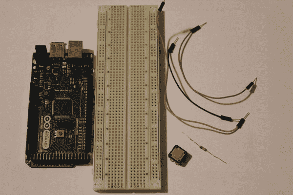

***图 4-1。**项目 3 部分(ADK 板、试验板、电阻、按钮、电线)*

##### 按钮或开关

*按钮*或*开关*是用于控制电路状态的元件。电路可以是闭合的，这意味着电源有回路，也可以是断开的，这意味着电路的回路被阻断或没有连接到电路。为了实现从开路到闭路的转换，需要使用按钮或开关。在`ON`状态下，按钮或开关本身没有电压降，也没有限流特性。在其`OFF`状态，按钮或开关理想地没有电压限制和无穷大的电阻值。在一个简单的电路图中，一个闭合电路看起来像图 4-2 中的[所示。](#fig_4_2)

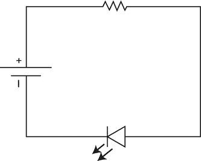

***图 4-2。**闭路*

如你所见，功率可以通过电路的元件流向回路。如果您将一个开关或按钮连接到该电路，您可以控制该电路是断开还是闭合。通过按下按钮或将开关切换到`ON`位置，您可以闭合电路，这样电力就可以流过电路。如果您松开按钮或将开关切换回其`OFF`位置，您将断开电路，从而使其保持打开状态。按钮或开关的电路图符号在电路中显示为开路部分。在[图 4-3](#fig_4_3) 的电路图中可以看到开关的符号。

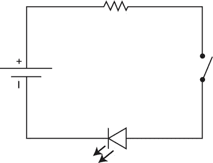

***图 4-3。**带开关的电路*

按钮和开关有多种类型和尺寸。典型的按钮可以是*按钮*，您需要按住它来闭合电路，松开它来打开电路，或者它们可以是*拨动按钮*，在被按下后保持其当前状态。开关也有几种形状和应用类型，但最常见的是众所周知的定义两种状态的`ON` / `OFF`开关，以及可以在多种状态之间切换的拨动开关(见[图 4-4](#fig_4_4) )。

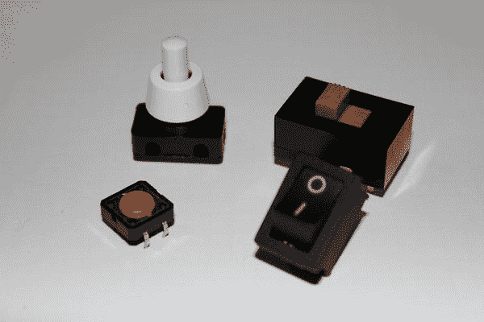

***图 4-4。**按钮和开关*

##### 上拉电阻

你已经用一个电阻来限制电路中的电流。在这个项目中，您将使用一个电阻和一个按钮或开关将输入引脚拉至`LOW` (0V)或`HIGH` (5V)。这可以通过特殊的电路设置来实现。

在某些情况下，您可能希望输入引脚处于定义的状态。因此，例如，当一个数字引脚被配置为输入，并且没有元件与之相连时，您仍然会测量到电压波动。这些波动是外部信号或其他电干扰的结果。引脚上测得的电压将介于 0V 和 5V 之间，这将导致引脚状态的数字读数连续变化(`LOW` / `HIGH`)。为了消除这些干扰，您需要将该输入引脚上的电压拉高。在这种用例中，电阻器被称为*上拉电阻器*。

上拉电阻必须放置在电路内的电压源和输入引脚之间。按钮或开关位于输入引脚和地之间。该设置的简单示意图如图 4-5 所示。

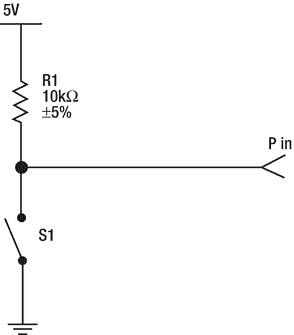

***图 4-5。**上拉电阻电路*

这里发生的事情的一个简单解释是，如果开关或按钮没有按下，输入只连接到 Vcc (5V)，线被拉高，输入被设置为`HIGH`。当按下开关或按钮且输入连接到 Vcc 和 GND (0V)时，电流在 10kΩ电阻处的电阻大于开关或按钮处的电阻，后者的电阻非常低(通常远低于 1ω)。在这种情况下，输入被设置为`LOW`,因为到 GND 的连接强于到 Vcc 的连接。

还需要高阻值电阻来限制电路中的总电流。如果你按下开关或按钮，你直接连接 Vcc 到 GND。如果没有高阻值电阻，会让太多的电流直接流向 GND，从而导致短路。高电流会导致热量积聚，在大多数情况下，会永久性地损坏您的部件。

##### ADK 董事会

您已经使用了配置为输出引脚的 ADK 板的数字引脚。在这个项目中，您将使用处于输入模式的引脚。通过使用数字引脚作为输入引脚，您可以测量数字信号:数字`HIGH`表示输入引脚上大约 5V 的电压，而数字`LOW`接近 0V。您已经了解到，上拉电阻可用于稳定输入引脚，通过将引脚稳定上拉至 5V 电源电压，使其不受干扰影响。ADK 电路板的一个特点是，嵌入式 ATmega 芯片集成了可以通过代码激活的上拉电阻。要激活集成上拉电阻，只需将引脚设置为输入模式，并将其设置为`HIGH`。

`pinMode(pin, INPUT); // set digital pin to input mode
digitalWrite(pin, HIGH); // turn on pullup resistor for pin`

不过，我不建议在这个项目中使用这种技术，这样您可以直接了解上拉电阻的基本原理。如果您手头没有高值电阻，您仍然可以如上所示更改该项目的代码来激活内部上拉电阻。请注意，如果在代码中之前输入引脚被用作输出引脚，那么您只需使用`pinMode`方法来定义输入引脚。默认情况下，所有数字引脚都被配置为输入，因此，如果该引脚始终仅用作输入，则不必显式设置`pinMode`。

#### 设置

您刚刚了解到需要将想要使用的数字输入引脚连接到上拉电阻电路。在[图 4-6](#fig_4_6) 中可以看到，ADK 板的+5V Vcc 引脚必须连接到 10kΩ上拉电阻的一个引线上。另一根引线连接到数字输入引脚 2。数字引脚 2 也连接到开关或按钮的一个引线。相反的引线接地。就这么简单。通过这种设置，当按钮或开关未按下时，将输入引脚拉至 5V，使数字输入引脚测量数字`HIGH`。如果现在按下按钮或开关，数字输入引脚被拉至 GND，导致输入测量数字`LOW`。

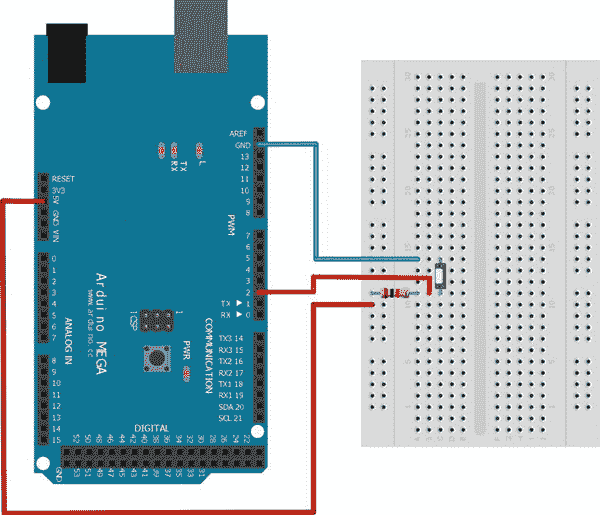

***图 4-6。**项目 3 设置*

#### 软件

如本章开头的项目描述所述，您将编写一个 Arduino 草图，持续监控数字输入引脚的状态。每当 pin 码的状态从`HIGH`变为`LOW,`或者相反，你就会向连接的 Android 设备发送一条消息。Android 应用将监听传入的状态变化，并在一个`TextView`中显示当前状态。此外，只要按下按钮，Android 设备的振动器就会被激活。

##### Arduino 草图

和以前一样，Arduino sketch 实现非常简单。看看清单 4-1 中的[，稍后我会解释细节。](#list_4_1)

*清单 4-1。项目三:Arduino 草图*

`#include <Max3421e.h>
#include <Usb.h>
#include <AndroidAccessory.h>

**#define COMMAND_BUTTON 0x1**
**#define TARGET_BUTTON 0x1**
**#define VALUE_ON 0x1**
**#define VALUE_OFF 0x0**
**#define INPUT_PIN 2**

AndroidAccessory acc("Manufacturer",
"Model",
"Description",
"Version",
"URI",
"Serial");

**byte sntmsg[3];**
**int lastButtonState;**
**int currentButtonState;**

void setup() {
Serial.begin(19200);
acc.powerOn();
**sntmsg[0] = COMMAND_BUTTON;**
**sntmsg[1] = TARGET_BUTTON;**
}

**void loop() {**
**if (acc.isConnected()) {**
**currentButtonState = digitalRead(INPUT_PIN);**
**if(currentButtonState != lastButtonState) {**
**if(currentButtonState == LOW) {**
**sntmsg[2] = VALUE_ON;**
**} else {**
**sntmsg[2] = VALUE_OFF;**
**}**
**acc.write(sntmsg, 3);**
**lastButtonState = currentButtonState;**
**}**
**delay(100);**
**}**
**}**`

这里要做的第一件事是为按钮状态消息定义一些新的消息字节。

`#define COMMAND_BUTTON 0x1
#define TARGET_BUTTON 0x1
#define VALUE_ON 0x1
#define VALUE_OFF 0x0
#define INPUT_PIN 2`

因为消息的前两个字节不会改变，所以您已经可以在您的`setup`方法中设置它们了。

`sntmsg[0] = COMMAND_BUTTON;
sntmsg[1] = TARGET_BUTTON;`

注意，没有必要在`setup`方法中调用`pinMode`方法，因为默认情况下数字引脚是输入引脚。

第一种新方法是`digitalRead`方法，它测量输入引脚上施加的电压，并将其转换为两种可能的数字状态:`HIGH`或`LOW`。提供给该方法的唯一参数是 pin，应该读取它。

`currentButtonState = digitalRead(INPUT_PIN);`

接下来，您会看到当前状态与之前的状态进行了比较，因此只有在状态发生变化时，才会向 Android 设备发送消息。

`if(currentButtonState != lastButtonState) {
if(currentButtonState == LOW) {
sntmsg[2] = VALUE_ON;
} else {
sntmsg[2] = VALUE_OFF;
}
acc.write(sntmsg, 3);
lastButtonState = currentButtonState;
}`

现在让我们来看看 Android 应用。

##### Android 应用

这个项目的 Android 应用没有引入新的 UI 元素。在已知的`TextView`的帮助下，您将看到按钮或开关的状态变化。但是，您将学习如何调用系统服务来处理某些系统或硬件功能。对于这个项目，Android 设备的振动器服务将负责控制设备中的振动器电机。首先，看看清单 4-2 中的代码。我将在后面解释新的功能。同样，没有改变的已知代码部分被缩短了，这样您就可以专注于重要的部分。

*清单 4-2。项目三:ProjectThreeActivity.java*

`**package project.three.adk;**

import …;` `**public class ProjectThreeActivity extends Activity {**

…

**private static final byte COMMAND_BUTTON = 0x1;**
**private static final byte TARGET_BUTTON = 0x1;**
**private static final byte VALUE_ON = 0x1;**
**private static final byte VALUE_OFF = 0x0;**

**private static final String BUTTON_PRESSED_TEXT = "The Button is pressed!";**
**private static final String BUTTON_NOT_PRESSED_TEXT = "The Button is not pressed!";**

**private TextView buttonStateTextView;**

**private Vibrator vibrator;**
**private boolean isVibrating;**

@Override
public void onCreate(Bundle savedInstanceState) {
super.onCreate(savedInstanceState);

…

setContentView(R.layout.main);
**buttonStateTextView = (TextView) findViewById(R.id.button_state_text_view);**

**vibrator = ((Vibrator) getSystemService(VIBRATOR_SERVICE));**
}

@Override
public void onResume() {
super.onResume();
…
}

@Override
public void onPause() {
super.onPause();
closeAccessory();
**stopVibrate();**
}

@Override
public void onDestroy() {
super.onDestroy();
unregisterReceiver(mUsbReceiver);
}

private final BroadcastReceiver mUsbReceiver = new BroadcastReceiver() {
@Override
public void onReceive(Context context, Intent intent) {` `…
}
};

private void openAccessory(UsbAccessory accessory) {
mFileDescriptor = mUsbManager.openAccessory(accessory);
if (mFileDescriptor != null) {
mAccessory = accessory;
FileDescriptor fd = mFileDescriptor.getFileDescriptor();
mInputStream = new FileInputStream(fd);
mOutputStream = new FileOutputStream(fd);
**Thread thread = new Thread(null, commRunnable, TAG);**
**thread.start();**
Log.d(TAG, "accessory opened");
} else {
Log.d(TAG, "accessory open fail");
}
}

private void closeAccessory() {
…
}

**Runnable commRunnable = new Runnable() {**

**@Override**
**public void run() {**
**int ret = 0;**
**final byte[] buffer = new byte[3];**

**while (ret >= 0) {**
**try {**
**ret = mInputStream.read(buffer);**
**} catch (IOException e) {**
**break;**
**}**

**switch (buffer[0]) {**
**case COMMAND_BUTTON:**

**if(buffer[1] == TARGET_BUTTON) {**
**if(buffer[2] == VALUE_ON) {**
**startVibrate();**
**} else if(buffer[2] == VALUE_OFF){**
**stopVibrate();**
**}**
**runOnUiThread(new Runnable() {**

**@Override**
**public void run() {**` `**buttonStateTextView.setText(buffer[2] == VALUE_ON ?**
**BUTTON_PRESSED_TEXT : BUTTON_NOT_PRESSED_TEXT);**
**}**
**});**
**}**
**break;**

**default:**
**Log.d(TAG, "unknown msg: " + buffer[0]);**

**break;**
**}**
**}**
**}**
**};**

**public void startVibrate() {**
**if(vibrator != null && !isVibrating) {**
**isVibrating = true;**
**vibrator.vibrate(new long[]{0, 1000, 250}, 0);**
**}**
**}**

**public void stopVibrate() {**
**if(vibrator != null && isVibrating) {**
**isVibrating = false;**
**vibrator.cancel();**
**}**
**}**
}`

看看这个项目增加了哪些变量:

`private static final byte COMMAND_BUTTON = 0x1;
private static final byte TARGET_BUTTON = 0x1;
private static final byte VALUE_ON = 0x1;
private static final byte VALUE_OFF = 0x0;

private static final String BUTTON_PRESSED_TEXT = "The Button is pressed!";
private static final String BUTTON_NOT_PRESSED_TEXT = "The Button is not pressed!";

private TextView buttonStateTextView;

private Vibrator vibrator;
private boolean isVibrating;`

您应该已经认识到稍后验证发送的消息所需的协议字节。然后你会看到两个`String`常量，如果按钮或开关的状态改变了，它们用来更新`TextView`的文本。最后两个变量用于引用系统振动器服务，并检查振动器是否已被激活。

在`onCreate`方法中，您请求设备振动器的系统服务:

`vibrator = ((Vibrator) getSystemService(VIBRATOR_SERVICE));`

`getSystemService`方法返回 Android 设备系统服务的句柄。这个方法可以从`Context`类的每个子类中调用，或者直接从`Context`引用中调用。所以你可以从一个`Activity`或者一个`Service`以及一个`Application`子类中访问系统服务。`Context`类还定义了访问系统服务的常量。

在[第 2 章](02.html#ch2)中，您已经了解了从您的`HelloWorld`应用接收数据消息的实现细节。一个单独的线程检查传入的数据并处理消息。根据接收到的按钮状态值，调用`startVibrate`或`stopVibrate`方法。`startVibrate`方法检查您是否仍然拥有系统服务的有效句柄，以及振动器是否已经停止振动。然后，它设置布尔标志来描述振动器被激活，并定义要立即开始的振动模式。

`public void startVibrate() {
if(vibrator != null && !isVibrating) {
isVibrating = true;
vibrator.vibrate(new long[]{0, 1000, 250}, 0);
}
}`

系统服务的方法有两个参数。第一个是数据类型为 long 的数组。它包含三个值:振动开始前的等待时间、振动时间和关闭振动时间。`vibrate`方法的第二个参数定义了模式中应该重复的索引。传入值 0 意味着从头开始一遍又一遍。如果不想重复这个模式，只需传入一个值-1。值的时间单位是毫秒。所以这个模式所做的就是立即启动，振动一秒钟，关闭 250 毫秒，然后重新开始。

如果你的应用暂停了，你应该确保不要留下不必要的资源分配，所以如果发生这种情况，一定要停止振动器。这就是为什么在`onPause`生命周期方法中调用`stopVibrate`方法的原因。实现很简单。

`public void stopVibrate() {
if(vibrator != null && isVibrating) {
isVibrating = false;
vibrator.cancel();
}
}`

首先检查你是否仍然有一个有效的服务参考，振动器是否还在振动。然后重置布尔标志并取消振动。

现在，将 Arduino 草图上传到您的 ADK 板上，并将 Android 应用部署到您的设备上。如果你做的一切都正确，你的项目应该看起来像图 4-7 中的[所示，并且你的 Android 设备应该在你每次按下连接到你的 ADK 板的按钮或开关时振动并改变它的`TextView`。](#fig_4_7)

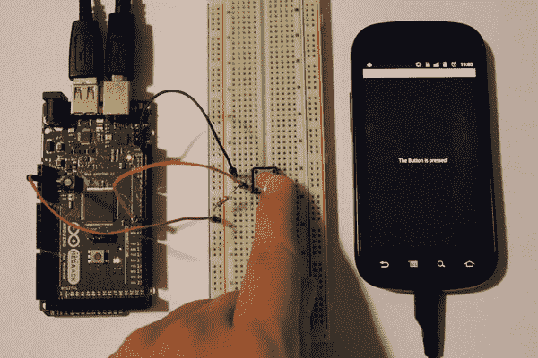

***图 4-7** 。项目 3:最终结果*

### 项目 4:用电位计调节模拟输入

模拟输入测量用于识别模拟输入引脚上施加电压的变化。许多传感器和部件通过改变它们的输出电压来表示值的变化。这个项目将教你如何使用电路板的模拟输入引脚，以及如何将模拟输入映射到你可以在代码中使用的数字值。为了改变模拟输入，你将使用一种叫做电位计的新元件。您将更改模拟值，该值将被转换为数字值，并传输到 Android 应用。在 Android 应用中，您将使用一个`ProgressBar` UI 元素来可视化接收到的值的变化。

#### 零件

对于这个项目，您只需要一个电位计和一些电线作为附加硬件组件(如图[图 4-8](#fig_4_8) 所示):

*   ADK 董事会
*   试验板
*   电位计
*   一些电线

***图 4-8** 。项目 4 部分(ADK 板、试验板、电位器、电线)*

##### ADK 董事会

这是您第一次不用 ADK 板的数字 IO 引脚。相反，您将使用电路板上的模拟输入引脚。顾名思义，它们只能用作输入。这些引脚的特殊之处在于它们可以测量模拟值，即施加电压的变化。ADK 板能够将这些测量值转换成数字值。这个过程被称为*模数转换*。这是由一个叫做 ADC 的内部组件完成的，ADC 是一个*模数转换器*。在 ADK 板的情况下，这意味着从 0V 到 5V 的值被映射到从 0 到 1023 的数字值，因此它能够可视化 10 位范围内的值的变化。模拟输入引脚位于电路板上数字引脚的另一侧，通常标有模拟输入和引脚编号前缀 a，因此模拟引脚 5 应标为 A5。你可以在[图 4-9](#fig_4_9) 中看到那些针脚。

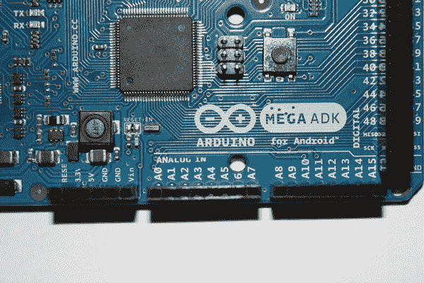

***图 4-9** 。模拟输入引脚*

##### 电位计

电位计是一种可变电阻器。它有三根导线可以连接到电路上。它有两种功能，取决于你如何连接它。如果您只是将一个外部端子和一个中间端子连接到您的电路，它只是一个简单的可变电阻器，如图[图 4-10](#fig_4_10) 所示。

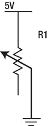

***图 4-10** 。电位器作为可变电阻*

如果你还连接了第三根引线，它就充当了所谓的分压器。*分压器*(也称为*分压器*)是一种特殊的电路设置，顾名思义，它能够将电路中的电压分成电路组件之间的不同电压电平。典型的分压电路由两个串联电阻或一个电位计组成。在[图 4-11](#fig_4_11) 中可以看到电路可视化。

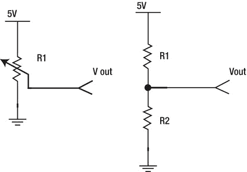

***图 4-11** 。带电位计的分压器(左)，带两个串联电阻的分压器(右)*

Vin 是施加在两个串联电阻上的电压，Vout 是第二个电阻(R2)上的电压。确定输出电压的公式如下:

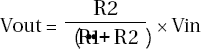

让我们看一个例子。考虑这样一个使用案例，您有一个 9V 电池，但您的一个电子元件只能在 5V 电压下工作。您已经确定了 Vin(9V)和 Vout(5V)。唯一缺少的是电阻值，这是你需要的。

让我们尝试使用一个 27k 电阻来测量 R2。现在唯一缺少的是 R1。将这些值输入公式，结果如下:

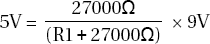

重新排列公式，以便确定缺失的变量 R1。

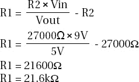

由于您找不到这样一个特定的电阻值，因此可以采用下一个更高的值，即 22k。对于 R1 的那个值，你将得到 4.96V，这非常接近于目标 5V。

如果你扭动电位器，你基本上改变了它的内阻比例，也就是说如果左边端子和中间端子之间的电阻减小，右边端子和中间端子之间的电阻增大，反之亦然。因此，如果你将这个原理应用于分压公式，这意味着如果 R1 值增加，R2 值就会减少，反之亦然。因此，当电位计内的电阻比例发生变化时，会导致 Vout 发生变化。电位计有几种形状和电阻范围。最常见的类型是*微调器*，其通过使用螺丝刀或类似的装配物体来调整，以及*旋转电位计*，其具有轴或旋钮来调整电阻值(如图[图 4-12](#fig_4_12) 所示)。在这个项目中，我使用微调类型，因为它通常比旋转电位器便宜一点。

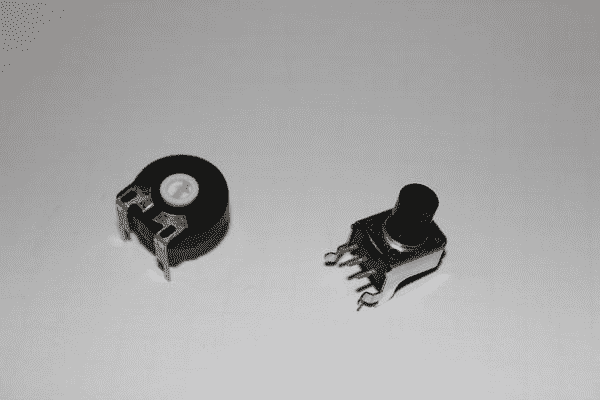

***图 4-12** 。电位器:微调(左)，旋转电位器(右)*

#### 设置

这个项目的设置很简单。只需将+5V 引脚连接到电位计的一个外部引线，并将 GND 引脚连接到相反的外部引线。将模拟引脚 A0 连接到电位计的中间引线，就大功告成了。你的设置应该看起来像[图 4-13](#fig_4_13) 。如果调整电位计，模拟引脚上的测量值将会改变。

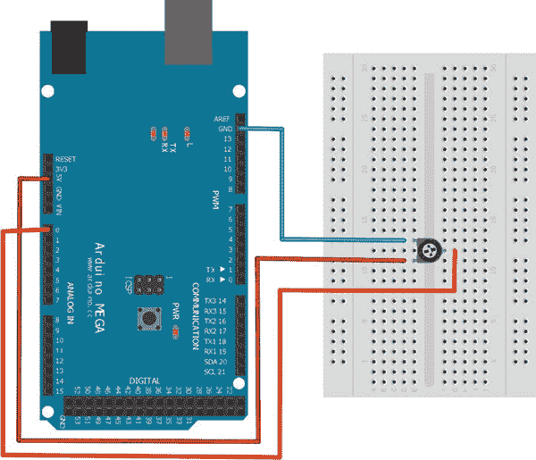

***图 4-13** 。项目 4 设置*

#### 软件

Arduino 草图负责读取模拟引脚的 ADC 值。传输的 10 位值将由 Android 应用接收，值的变化将显示在`TextView`和`ProgressBar` UI 元素中。您还将学习传输大值的转换技术。

##### Arduino 草图

看看清单 4-3 中完整的 Arduino 草图。之后我会讨论新的内容。

***清单 4-3。**项目 4: Arduino 草图*

`#include <Max3421e.h>
#include <Usb.h>
#include <AndroidAccessory.h>

**#define COMMAND_ANALOG 0x3**
**#define TARGET_PIN 0x0**
**#define INPUT_PIN A0**

AndroidAccessory acc("Manufacturer",
"Model",
"Description",
"Version",
"URI",
"Serial");

**byte sntmsg[6];**
**int analogPinReading;**

void setup() {
Serial.begin(19200);
acc.powerOn();
sntmsg[0] = COMMAND_ANALOG;
sntmsg[1] = TARGET_PIN;
}

**void loop() {**
**if (acc.isConnected()) {**
**analogPinReading = analogRead(INPUT_PIN);**
**sntmsg[2] = (byte) (analogPinReading >> 24);**
**sntmsg[3] = (byte) (analogPinReading >> 16);**
**sntmsg[4] = (byte) (analogPinReading >> 8);**
**sntmsg[5] = (byte) analogPinReading;**
**acc.write(sntmsg, 6);**
**delay(100);**
**}**
**}**`

第一个可以看到的新方法是`analogRead`方法。它将模拟电压值转换为 10 位数字值。因为它是一个 10 位的值，所以太大而不能存储在字节变量中。这就是为什么你必须把它存储在一个整型变量中。

`**analogPinReading = analogRead(INPUT_PIN);**`

问题是你只能传输字节，所以你必须把整数值转换并拆分成几个字节。作为一种数据类型，整数的大小有 4 个字节那么大，这就是为什么你必须把整数转换成 4 个单字节，以便以后传输。为了转换该值，这里使用了一种称为移位的技术。移位意味着值以二进制表示进行处理，二进制表示由单个位组成，并且您将所有位向某个方向移位。

为了更好地理解什么是移位，请看一个例子。假设您想要传输值 300。正如您已经知道的，这个值是一个整数。该值的二进制表示如下:

`00000000 00000000 00000001 00101100 = 300`

正确的数学表达式更短，不需要你写所有的前导零。只是前缀是 0b。

`0b100101100 = 300`

如果将该值简单地转换为一个字节，则只有最后八位将构成字节值。在这种情况下，您最终得到的值是 44。

`00101100 = 44`

那只是整个价值的一部分。要转换其余的位，您需要首先将它们放到适当的位置。这就是使用移位的地方。您可以使用运算符<>，向两个方向移动位，将它们移动到右侧。在这种情况下，您需要右移，所以您使用>>操作符。在将该值转换为新的字节之前，需要将它向右移动八次。因为您需要将它移位几次来构造所有四个字节，所以完整的语法应该是这样的:

`(byte) (300 >> 24)
(byte) (300 >> 16)
(byte) (300 >> 8)
(byte) 300`

在其新的二进制表示中，上述值如下所示:

`00000000
00000000
00000001
00101100`

可以看到，移出的位被简单地忽略了。现在，您可以传输所有四个数据字节，并在另一端将它们重新转换回初始整数。

##### Android 应用

在 Android 应用中，接收到的四字节值将被转换回整数值，测量值的变化将通过显示当前值的`TextView`可视化。第二个可视指示器是`ProgressBar` UI 元素。它看起来与已经推出的`SeekBar`相似，但是这里用户没有与工具条交互的可能性。看看清单 4-4 中的代码。稍后我会解释细节。

***清单 4-4。项目四:ProjectFourActivity.java***

`**package project.four.adk;**

import …;

**public class ProjectFourActivity extends Activity {**

**…**

**private static final byte COMMAND_ANALOG = 0x3;**
**private static final byte TARGET_PIN = 0x0;**

**private TextView adcValueTextView;**
**private ProgressBar adcValueProgressBar;**

@Override
public void onCreate(Bundle savedInstanceState) {
super.onCreate(savedInstanceState);

…

setContentView(R.layout.main);
**adcValueTextView = (TextView) findViewById(R.id.adc_value_text_view);**
**adcValueProgressBar = (ProgressBar) findViewById(R.id.adc_value_bar);**
}

@Override
public void onResume() {
super.onResume();
…
}

@Override
public void onPause() {
super.onPause();
…
}

@Override
public void onDestroy() {
super.onDestroy();
…
}

private final BroadcastReceiver mUsbReceiver = new BroadcastReceiver() {
@Override
public void onReceive(Context context, Intent intent) {
…
}
};

private void openAccessory(UsbAccessory accessory) {
mFileDescriptor = mUsbManager.openAccessory(accessory);
if (mFileDescriptor != null) {
mAccessory = accessory;
FileDescriptor fd = mFileDescriptor.getFileDescriptor();
mInputStream = new FileInputStream(fd);
mOutputStream = new FileOutputStream(fd);
Thread thread = new Thread(null, commRunnable, TAG);
thread.start();
Log.d(TAG, "accessory opened");
} else {
Log.d(TAG, "accessory open fail");
}
}

private void closeAccessory() {
…
}

**Runnable commRunnable = new Runnable() {**

**@Override**
**public void run() {**
**int ret = 0;**
**byte[] buffer = new byte[6];**

**while (ret >= 0) {**
**try {**
**ret = mInputStream.read(buffer);**
**} catch (IOException e) {**
**Log.e(TAG, "IOException", e);**
**break;**
**}**

**switch (buffer[0]) {**
**case COMMAND_ANALOG:**

**if (buffer[1] == TARGET_PIN) {**
**final int adcValue = ((buffer[2] & 0xFF) << 24)**
**+ ((buffer[3] & 0xFF) << 16)**
**+ ((buffer[4] & 0xFF) << 8)**
**+ (buffer[5] & 0xFF);**
**runOnUiThread(new Runnable() {**

**@Override**
**public void run() {**
**adcValueProgressBar.setProgress(adcValue);**
**adcValueTextView.setText(getString(R.string.adc_value_text,**
**adcValue));**
**}**
**});**
**}**
**break;**

**default:**
**Log.d(TAG, "unknown msg: " + buffer[0]);**
**break;**
**}**
**}**
**}**
**};**
}`

正如您所看到的，这个代码片段中的新变量与 Arduino 草图中的消息定义字节相同，还有我在开始时描述的两个 UI 元素。

`private static final byte COMMAND_ANALOG = 0x3;
private static final byte TARGET_PIN = 0x0;

private TextView adcValueTextView;
private ProgressBar adcValueProgressBar;`

看看需要在[清单 4-5](#list_4_5) 所示的`main.xml`布局文件中进行的 UI 元素定义。除了这两个元素通常的布局属性之外，您还必须定义`ProgressBar`的`max`值属性，以便可以在从 0 到 1023 的正确范围内进行图形可视化。

你可以看到还有第二个重要的属性。属性告诉系统以某种风格呈现 UI 元素的外观。如果省略该属性，`ProgressBar`将以默认样式呈现，这是一个加载类型的旋转轮。这不是你想要的，所以你可以用另一个样式覆盖它。这种特殊样式查找的语法看起来有点奇怪。前缀`?android:`意味着这个特殊的资源不能在当前项目的 res 文件夹中找到，但是可以在 Android 系统资源中找到。

***清单 4-5。**项目 4: main.xml*

`<?xml version="1.0" encoding="utf-8"?>
<LinearLayout xmlns:android="http://schemas.android.com/apk/res/android"
android:orientation="vertical"
android:layout_width="fill_parent"
android:layout_height="fill_parent"
android:gravity="center">
<TextView android:id="@+id/adc_value_text_view"
android:layout_width="wrap_content"
android:layout_height="wrap_content"/>
**<ProgressBar android:id="@+id/adc_value_bar"
android:layout_width="fill_parent"
android:layout_height="wrap_content"
android:max="1023"
style="?android:attr/progressBarStyleHorizontal"/>**
</LinearLayout>`

在项目 3 中，您对接收到的输入感兴趣，因此接收数据的逻辑基本保持不变。一个单独的线程负责读取 inputstream 并处理接收到的消息。您可以看到，通过使用移位技术，接收到的消息的最后四个字节被再次转换为一个整数值—只是这一次，移位发生在另一个方向。

`final int adcValue = ((buffer[2] & 0xFF) << 24)
+ ((buffer[3] & 0xFF) << 16)
+ ((buffer[4] & 0xFF) << 8)
+ (buffer[5] & 0xFF);`

您还可以看到，字节值在进行位移之前已经改变。这种操作称为按位 AND。通过应用值 0xFF，可以消除处理负数和正数时可能出现的符号位错误。

如果您考虑前面的示例，并假设测得的值为 300，那么四个接收到的字节在没有移位的情况下将具有以下值:

`00000000 = 0
00000000 = 0
00000001 = 1
00101100 = 44`

要重建原始的整数值，你需要像上面那样左移字节值。

`00000000 << 24 = 00000000 00000000 00000000 00000000 = 0
00000000 << 16 = 00000000 00000000 00000000 00000000 = 0
00000001 << 8 = 00000000 00000000 00000001 00000000 = 256
00101100 = 00000000 00000000 00000000 00101100 = 44`

现在，如果您将接收到的字节值相加，您将再次得到原始的整数值。

`0 + 0 + 256 + 44 = 300`

最后要做的是将价值可视化给用户。使用 helper 方法`runOnUiThread`，两个 UI 元素都被更新。`TextView`相应地获取其文本设置，`ProgressBar`设置其新的进度值。

上传 Arduino sketch 和 Android 应用，查看调整电位计后数值如何变化。最终结果如[图 4-14](#fig_4_14) 所示

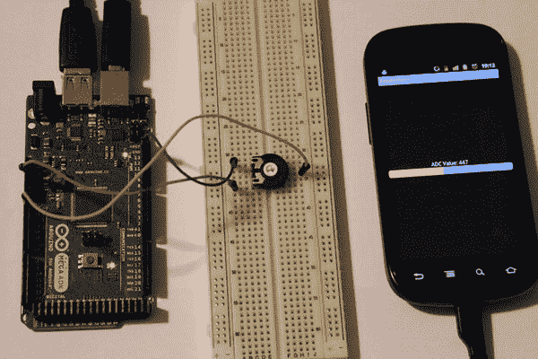

***图 4-14。**项目 4:最终结果*

### 总结

本章展示了如何从 ADK 板的输入引脚读取数值。您使用输入配置中的数字引脚来读取`HIGH`和`LOW`的数字输入。按钮或开关用于在这两种状态之间切换，每当按钮被按下或开关关闭时，Android 应用就会通过振动来表达当前状态。您还了解了通过将 ADK 板模拟输入引脚上的模拟电压读数转换为 0 到 1023 范围内的数字表达式来测量数值范围的第二种可能性。一个 Android 应用用一个新的 UI 元素`ProgressBar`将当前阅读可视化。您通过应用不同的样式更改了 UI 元素的外观。在此过程中，您了解了分压器和上拉电阻的原理，并了解到移位可以作为一种数据转换方式。