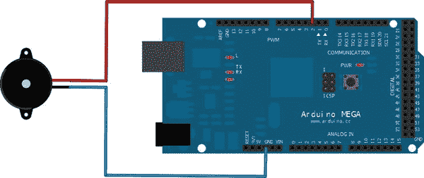

# 五、声音

ADK 板本身不能产生或检测声音。幸运的是，有一个组件可以帮助完成这两项任务:压电蜂鸣器。

声音的定义是什么？一般来说，声音是一组可以通过固体、液体和气体传播的压力波。压电蜂鸣器通过不同频率的振动在空气中传播声音。这些波的不同频率组成了你能听到的不同声音。人类能够听到 20Hz 到 20，000Hz 范围内的频率。频率的单位是赫兹。它定义了每秒的周期数。所以人耳每秒探测到的声波越多，感知到的声音就越高。如果你曾经站在一个大的音频音箱附近，你可能会看到扬声器的薄膜在振动。这实质上是扬声器产生不同频率的压力波。

在接下来的两个项目中，你将学习如何使用压电蜂鸣器发声，以及如何探测附近的声音。第一个项目将为您提供一种为自己的项目生成声音的方法，以便您可以构建音频警报系统、通知设备或简单的乐器。第二个项目将向你展示一种检测近距离声音甚至振动的方法。例如，这些功能用于爆震传感器项目或测量可能伤害敏感商品的振动。

### 项目 5:用压电蜂鸣器发声

这个项目将向你展示如何使用压电蜂鸣器来产生声音。它将解释逆压电效应的原理。您将使用您的 Android 设备来选择一个音符的频率值，该值将被传输到您的 ADK 板，以通过压电蜂鸣器产生声音。

#### 零件

对于这个项目，你需要一个新的组件:压电组件，也就是压电蜂鸣器。除此之外，您只需要以下组件(如图图 5-1 所示):

*   ADK 董事会
*   面包板
*   压电蜂鸣器
*   一些电线

***图 5-1。**项目 5 部分(ADK 板、试验板、电线、压电蜂鸣器)*

##### ADK 董事会

您将使用支持脉宽调制(PWM)的 ADK 板的一个数字引脚。您已经使用了数字引脚的 PWM 功能来调暗 LED。再次使用 PWM 特性来产生方波，稍后将应用于压电蜂鸣器。方波特性的变化将导致压电蜂鸣器产生不同的振荡频率，从而产生不同的声音。

##### 压电蜂鸣器

*压电蜂鸣器*是一种可以利用压电效应和逆压电效应的压电元件。这意味着它可以感知和产生声音。典型的压电蜂鸣器由放置在金属板上的陶瓷片组成。陶瓷晶片包含对振荡敏感的压电晶体。

*压电效应*描述了压力等机械力导致压电元件上产生电荷。压力波让陶瓷晶片膨胀和收缩。它与金属板一起引起振动，由此产生的压电晶体变形产生可测量的电荷。(参见图 5-2 。)在第二个项目中，压电效应被用于感应其附近的振动。

***图 5-2。**压电效应(压电元件的膨胀和收缩)*

逆压电效应描述了当施加电势时产生机械力(例如压力波)的压电元件的效应。在电势的刺激下，压电元件再次收缩和膨胀，由此产生的振动产生声波，该声波甚至可以被共振的中空壳体放大。产生的不同声波取决于振荡的频率。这种效果将在本章的第一个项目中演示，以生成不同频率的声音。

最常见的压电蜂鸣器装在塑料外壳中，但你也可以找到陶瓷压电蜂鸣器板(图 5-3 )。

***图 5-3。**压电蜂鸣器*

压电蜂鸣器用于家用电器、工业机器，甚至音乐设备。你可能在火警系统、无障碍系统中听到过它们，或者当你的洗衣机或烘干机试图告诉你它们的工作完成了。有时你会看到它们作为拾音器连接在原声吉他上，将共鸣吉他琴体的振动转换成电信号。

#### 设置

这个项目的设置非常简单(见图 5-4 )。你只需要将压电蜂鸣器的一个连接到 GND，另一个连接到你的 ADK 板的数字引脚 2。请记住，一些压电蜂鸣器可能有一定的极性。通常它们被相应地标记或者它们已经连接了相应的电线。在这种情况下，将负极线连接到 GND，正极线连接到数字引脚 2。

***图 5-4。**项目 5 设置*

#### 软件

对于这个项目，您将编写一个 Android 应用，让用户通过`Spinner` UI 元素选择一个注释，这是一个类似下拉列表的东西，您可能从 Web 上了解到。音符将被映射到其代表频率，其值将被传输到 ADK 板。在 Arduino 端，您利用 Arduino `tone`方法，它是 Arduino IDE 的一部分，在连接的压电蜂鸣器上生成相应的声音。

##### Arduino 草图

这个项目的 Arduino 草图与项目 2 中使用的非常相似。只是这一次，您将使用`tone`方法，而不是使用`analogWrite`方法直接写入输出引脚，这种方法会生成必要的波形来产生所需的声音。在内部，它利用寻址的数字 PWM 引脚的能力来产生波形。看看完整的清单 5-1 。我将在后面解释`tone`方法的作用。

***清单 5-1。**项目 5: Arduino 草图*

`#include <Max3421e.h>
#include <Usb.h>
#include <AndroidAccessory.h>

#define COMMAND_ANALOG 0x3
#define TARGET_PIN_2 0x2

AndroidAccessory acc("Manufacturer",
"Model",
"Description",
"Version",` `"URI",
"Serial");

byte rcvmsg[6];

void setup() {
Serial.begin(19200);
pinMode(TARGET_PIN_2, OUTPUT);
acc.powerOn();
}

void loop() {
if (acc.isConnected()) {
int len = acc.read(rcvmsg, sizeof(rcvmsg), 1);
if (len > 0) {
if (rcvmsg[0] == COMMAND_ANALOG) {
if (rcvmsg[1] == TARGET_PIN_2){
**int output = ((rcvmsg[2] & 0xFF) << 24)**
**+ ((rcvmsg[3] & 0xFF) << 16)**
**+ ((rcvmsg[4] & 0xFF) << 8)**
**+ (rcvmsg[5] & 0xFF);**
**//set the frequency for the desired tone in Hz**
**tone(TARGET_PIN_2, output);**
}
}
}
}
}`

Arduino IDE 提供了一个名为`tone`的重载特殊方法来生成方波，它可以用来通过扬声器或压电蜂鸣器产生声音。在其第一个变体中，`tone`方法接受两个参数，蜂鸣器连接的数字 PWM 引脚和以 Hz 为单位的频率。

`tone(pin, frequency);`

它的第二个变体甚至接受第三个参数，您可以指定音调的持续时间，单位为毫秒。

`tone(pin, frequency, duration);`

在内部，`tone`方法实现使用`analogWrite`方法利用 ADK 板的 PWM 功能来产生波形。正如你所看到的，这个例子中使用了双参数的`tone`方法来产生一个稳定连续的音调。在将接收到的频率值馈送到音调方法之前，通过使用移位技术对其进行转换。

##### Android 应用

对于 Android 部分，您将使用一个名为`Spinner`的类似下拉列表的 UI 元素，让用户选择一个将被映射到其相应频率的音符。您将学习如何初始化类似列表的 UI 元素，以及如何使用它们。在我解释细节之前，请看一下完整的清单 5-2 。

***清单 5-2。**项目五:ProjectFiveActivity.java*

`package project.five.adk;

import …;

public class ProjectFiveActivity extends Activity {

…

private static final byte COMMAND_ANALOG = 0x3;
private static final byte TARGET_PIN_2 = 0x2;

**private Spinner notesSpinner;**
**private ArrayAdapter<CharSequence> adapter;**
**private int[] notes = {/*C3*/ 131, /*D3*/ 147, /*E3*/ 165,**
**/*F3*/ 175, /*G3*/ 196, /*A3*/ 220, /*B3*/ 247};**

/** Called when the activity is first created. */
@Override
public void onCreate(Bundle savedInstanceState) {
super.onCreate(savedInstanceState);

…

setContentView(R.layout.main);
**notesSpinner = (Spinner) findViewById(R.id.spinner);**
**notesSpinner.setOnItemSelectedListener(onItemSelectedListener);**
**adapter = ArrayAdapter.createFromResource(this, R.array.notes,**
**android.R.layout.simple_spinner_item);**
**adapter.setDropDownViewResource(android.R.layout.simple_spinner_dropdown_item);**
**notesSpinner.setAdapter(adapter);**
}

/**
* Called when the activity is resumed from its paused state and immediately
* after onCreate().
*/
@Override
public void onResume() {
super.onResume();
…
}

/** Called when the activity is paused by the system. */
@Override
public void onPause() {
super.onPause();
closeAccessory();
}` 
`/**
* Called when the activity is no longer needed prior to being removed from
* the activity stack.
*/
@Override
public void onDestroy() {
super.onDestroy();
unregisterReceiver(mUsbReceiver);
}

**OnItemSelectedListener onItemSelectedListener = new OnItemSelectedListener() {**

**@Override**
**public void onItemSelected(AdapterView<?> adapterView, View view, int position,**
**long id) {**
**new AsyncTask<Integer, Void, Void>() {**

**@Override**
**protected Void doInBackground(Integer... params) {**
**sendAnalogValueCommand(TARGET_PIN_2, notes[params[0]]);**
**return null;**
**}**
**}.execute(position);**
**}**

**@Override**
**public void onNothingSelected(AdapterView<?> arg0) {**
**// not implemented**
**}**
**};**

private final BroadcastReceiver mUsbReceiver = new BroadcastReceiver() {
@Override
public void onReceive(Context context, Intent intent) {
…
}
};

private void openAccessory(UsbAccessory accessory) {
…
}

private void closeAccessory() {
…
}

**public void sendAnalogValueCommand(byte target, int value) {**
**byte[] buffer = new byte[6];**
**buffer[0] = COMMAND_ANALOG;**
**buffer[1] = target;**
**buffer[2] = (byte) (value >> 24);**` 
`**buffer[3] = (byte) (value >> 16);**
**buffer[4] = (byte) (value >> 8);**
**buffer[5] = value;**
**if (mOutputStream != null) {**
**try {**
**mOutputStream.write(buffer);**
**} catch (IOException e) {**
**Log.e(TAG, "write failed", e);**
**}**
**}**
**}**
}`

让我们先来看看新的变量。

`private Spinner notesSpinner;
private ArrayAdapter<CharSequence> adapter;
private int[] notes = {/*C3*/ 131, /*D3*/ 147, /*E3*/ 165,
/*F3*/ 175, /*G3*/ 196, /*A3*/ 220, /*B3*/ 247};`

您将使用一个名为`Spinner`的 UI 元素为用户提供选择注释的可能性。`Spinner`是一个列表元素，非常类似于下拉列表。它是一个 input 元素，单击时会展开一个列表。列表中的元素是可以选择的可能输入值。类似列表的 UI 元素用适配器管理它们的内容。这些适配器负责用内容填充列表，并在以后访问它。您在这里看到的`ArrayAdapter`就是这样一个适配器，可以保存内容元素的类型化数组。这里的最后一件事是一个映射数组，它将所选的音符映射到它以后的频率表示。这些值非常接近相应音符的频率，单位为赫兹(Hz)。

在你给变量分配新的视图元素之前，你必须在你的布局`main.xml`文件中定义它(见清单 5-3 )。

***清单 5-3。**项目 5: main.xml*

`<?xml version="1.0" encoding="utf-8"?>
<LinearLayout xmlns:android="http://schemas.android.com/apk/res/android"
android:orientation="vertical"
android:layout_width="fill_parent"
android:layout_height="fill_parent"
android:gravity="center">
**<Spinner android:id="@+id/spinner"**
**android:layout_width="fill_parent"**
**android:layout_height="wrap_content"**
**android:prompt="@string/notes_prompt"/>**
</LinearLayout>`

`Spinner`有一个新的属性叫做`prompt`,定义了显示`Spinner`的列表内容时的提示。您可以在该属性中引用的`strings.xml`文件中定义一个简短的描述性标签。

`<string name="notes_prompt">Choose a note</string>`

现在您可以在`onCreate`方法中正确初始化视图元素了。

`/** Called when the activity is first created. */
@Override
public void onCreate(Bundle savedInstanceState) {
super.onCreate(savedInstanceState);

…

setContentView(R.layout.main);
notesSpinner = (Spinner) findViewById(R.id.spinner);
notesSpinner.setOnItemSelectedListener(onItemSelectedListener);
adapter = ArrayAdapter.createFromResource(this, R.array.notes, android.R.layout.simple_spinner_item);
adapter.setDropDownViewResource(android.R.layout.simple_spinner_dropdown_item);
notesSpinner.setAdapter(adapter);
}`

如果选择了新值，为了得到通知并做出反应，您必须在`Spinner`上设置一个监听器。在这种情况下，您将使用一个`OnItemSelectedListener`，稍后您将实现它。负责内容管理的`ArrayAdapter`可以通过一个名为`createFromResource`的静态方法轻松初始化。顾名思义，它从资源定义中构造内容。这个定义是在 strings.xml 文件中进行的。您只需要定义一个字符串项数组，如下所示。

`<string-array name="notes">
<item>C3</item>
<item>D3</item>
<item>E3</item>
<item>F3</item>
<item>G3</item>
<item>A3</item>
<item>B3</item>
</string-array>`

必须给它一个`name`属性，以便以后可以引用它。初始化方法调用需要三个参数。第一个是上下文对象。这里您可以使用当前活动本身，因为它扩展了上下文类。第二个参数是内容定义的资源 id。这里您将使用之前定义的 notes 数组。最后一个参数是下拉框布局本身的资源 id。您可以使用一个定制的布局，或者通过使用标识符`android.R.layout.simple_spinner_item`使用默认的系统微调项目布局。

`ArrayAdapter.createFromResource(this, R.array.notes,
android.R.layout.simple_spinner_item);`

您还应该设置列表中单个内容项的外观。这也是通过使用布局 id 调用`setDropDownViewResource`方法来完成的。同样，您可以在这里使用系统默认值。

`adapter.setDropDownViewResource(android.R.layout.simple_spinner_dropdown_item);`

最后，您可以将已配置的适配器与`Spinner`相关联。

`notesSpinner.setAdapter(adapter);`

初始步骤已经完成，是时候实现负责处理值已被选择的情况的监听器了。

`OnItemSelectedListener onItemSelectedListener = new OnItemSelectedListener() {

@Override
public void onItemSelected(AdapterView<?> adapterView, View view, int position,
long id) {
new AsyncTask<Integer, Void, Void>() {

@Override
protected Void doInBackground(Integer... params) {
sendAnalogValueCommand(TARGET_PIN_2, notes[params[0]]);
return null;
}
}.execute(position);
}

@Override
public void onNothingSelected(AdapterView<?> arg0) {
// not implemented
}
};`

当实现`OnItemSelectedListener`时，您将不得不处理两个方法。一个是`onNothingSelected`方法，在这种情况下不感兴趣；另一个是`onItemSelected`方法，当用户做出选择时被触发。当它被系统调用时，它提供四个参数:带有底层适配器的`AdapterView`、被选择的视图元素、被选择的项目在列表中的位置以及列表项目的 id。现在您已经知道选择了哪个项目，您可以将音符映射到它的实际频率，并将值发送到 ADK 板。这是在一个`AsyncTask`中完成的，这样 IO 操作就不会发生在 UI 线程上。

`new AsyncTask<Integer, Void, Void>() {

@Override
protected Void doInBackground(Integer... params) {
sendAnalogValueCommand(TARGET_PIN_2, notes[params[0]]);
return null;
}
}.execute(position);`

在将频率整数值作为四字节数据包传输之前，必须在 sendAnalogValueCommand 方法中对其进行位移。

一切都准备好了，你可以开始了(图 5-5 )。部署 Android 应用和 Arduino 草图，并聆听压电蜂鸣器的声音。你甚至可以扩展这个项目，用压电蜂鸣器演奏旋律。关于如何做到这一点的教程可以在 Arduino 主页的教程区找到，网址是`[`www.arduino.cc/en/Tutorial/PlayMelody`](http://www.arduino.cc/en/Tutorial/PlayMelody).`

***图 5-5。**项目 5:最终结果*

### 项目 6:用压电蜂鸣器感知声音

本章的第二个项目将向你展示压电效应的原理。您将使用压电蜂鸣器构建一个爆震传感器，当压电元件振荡时，它会产生电荷。您将编写一个 Android 应用，在该应用中，每次检测到敲门声时，背景都会发生变化。一个简单的`ProgressBar` UI 元素将显示已检测到的当前 ADC 值。

#### 零件

这个项目唯一需要的额外部件是一个高阻值电阻。您将使用一个 1Mω的下拉电阻。其他组件已经在之前的项目中使用过(见图 5-6 ):

*   ADK 董事会
*   试验板
*   1Mω下拉电阻
*   压电蜂鸣器
*   一些电线

***图 5-6。**项目 6 部分(ADK 板、试验板、电线、1Mω电阻器、压电蜂鸣器)*

##### ADK 董事会

由于需要测量压电蜂鸣器振荡时的电压变化，因此需要使用 ADK 板上的一个模拟输入引脚。模拟输入将被转换成数字值(ADC)，稍后可以在您的 Android 应用中进行处理。

##### 压电蜂鸣器

正如已经提到的，你将在这个项目中利用压电蜂鸣器的压电效应。爆震或突然的压力波以某种方式影响压电元件，使其振荡。振荡频率对压电元件上产生的电荷有影响。所以振荡的频率与产生的电荷成正比。

##### 下拉电阻

在前一章中，您使用上拉电阻将数字输入引脚稳定地拉至状态`HIGH` (+5V)，以避免电路处于空闲状态时产生静态噪声。当按下连接按钮，电路连接到`GND` (0V)时，电阻最小的路径通向`GND`，输入引脚设置为 0V。

由于现在需要测量模拟引脚上施加的电压，将输入引脚上拉至 5V 毫无意义。您无法正确测量压电蜂鸣器引起的电压变化，因为输入引脚会持续在 5V 左右浮动。为了继续避免空闲状态下产生的静态噪声，同时能够测量电压变化，您可以将输入引脚拉低至`GND` (0V)，并在压电元件产生负载时测量电压。该用例的简单电路原理图如图 5-7 中的所示。

***图 5-7。**压电蜂鸣器输入测量下拉电阻电路*

#### 设置

该项目的设置(如图图 5-8 所示)仅与之前略有不同。你只需要将高阻值电阻并联到压电蜂鸣器上。压电蜂鸣器的正极引线连接到电阻器的一端和 ADK 板的模拟输入引脚 A0。负极引线连接到电阻器和 GND 的另一端。

***图 5-8。**项目 6 设置*

#### 软件

您将编写一个读取模拟输入引脚 A0 的 Arduino 草图。如果压电蜂鸣器振荡，并在该引脚上测量到电压，相应的值将被转换为数字值，并可以传输到 Android 设备。Android 应用将通过`ProgressBar` UI 元素可视化传输的值，如果达到某个阈值，容器视图元素的背景颜色将变为随机颜色。所以每次敲击最终都会产生一个新的背景色。

##### Arduino 草图

这个项目的 Arduino 草图与项目 4 中的基本相同。您将测量引脚 A0 上的模拟输入，并将转换后的 ADC 值(范围为 0 至 1023)传输至连接的 Android 设备。参见完整的清单 5-4 。

***清单 5-4。**项目 6: Arduino 草图*

`#include <Max3421e.h>
#include <Usb.h>
#include <AndroidAccessory.h>

#define COMMAND_ANALOG 0x3
#define INPUT_PIN_0 0x0

AndroidAccessory acc("Manufacturer",
"Model",
"Description",
"Version",
"URI",` `"Serial");

byte sntmsg[6];

void setup() {
Serial.begin(19200);
acc.powerOn();
sntmsg[0] = COMMAND_ANALOG;
sntmsg[1] = INPUT_PIN_0;
}

void loop() {
if (acc.isConnected()) {
int currentValue = analogRead(INPUT_PIN_0);
sntmsg[2] = (byte) (currentValue >> 24);
sntmsg[3] = (byte) (currentValue >> 16);
sntmsg[4] = (byte) (currentValue >> 8);
sntmsg[5] = (byte) currentValue;
acc.write(sntmsg, 6);
delay(100);
}
}`

同样，您可以看到，在通过预定义的消息协议将模数转换后的整数值传输到 Android 设备之前，您必须使用移位技术将它们编码为字节。

##### Android 应用

Android 应用对接收到的消息进行解码，并将接收到的字节转换回测得的整数值。如果达到阈值 100，`LinearLayout`视图容器将随机改变它的背景颜色。作为第二个可视化元素，您将为`LinearLayout`添加一个`ProgressBar`，这样如果用户在压电蜂鸣器附近敲门，就可以看到测量中的尖峰。

***清单 5-5。项目六:ProjectSixActivity.java***

`**package project.six.adk;**

import …;

**public class ProjectSixActivity extends Activity {**

…

private static final byte COMMAND_ANALOG = 0x3;
private static final byte TARGET_PIN = 0x0;

**private LinearLayout linearLayout;**
**private TextView adcValueTextView;**
**private ProgressBar adcValueProgressBar;**` 
`**private Random random;**
**private final int THRESHOLD = 100;**

/** Called when the activity is first created. */
@Override
public void onCreate(Bundle savedInstanceState) {
super.onCreate(savedInstanceState);

…

setContentView(R.layout.main);
**linearLayout = (LinearLayout) findViewById(R.id.linear_layout);**
**adcValueTextView = (TextView) findViewById(R.id.adc_value_text_view);**
**adcValueProgressBar = (ProgressBar) findViewById(R.id.adc_value_bar);**

**random = new Random(System.currentTimeMillis());**
}

/**
* Called when the activity is resumed from its paused state and immediately
* after onCreate().
*/
@Override
public void onResume() {
super.onResume();
…
}

/** Called when the activity is paused by the system. */
@Override
public void onPause() {
super.onPause();
closeAccessory();
}

/**
* Called when the activity is no longer needed prior to being removed from
* the activity stack.
*/
@Override
public void onDestroy() {
super.onDestroy();
unregisterReceiver(mUsbReceiver);
}

private final BroadcastReceiver mUsbReceiver = new BroadcastReceiver() {
@Override
public void onReceive(Context context, Intent intent) {
…
}
};` 
`private void openAccessory(UsbAccessory accessory) {
mFileDescriptor = mUsbManager.openAccessory(accessory);
if (mFileDescriptor != null) {
mAccessory = accessory;
FileDescriptor fd = mFileDescriptor.getFileDescriptor();
mInputStream = new FileInputStream(fd);
mOutputStream = new FileOutputStream(fd);
Thread thread = new Thread(null, commRunnable, TAG);
thread.start();
Log.d(TAG, "accessory opened");
} else {
Log.d(TAG, "accessory open fail");
}
}

private void closeAccessory() {
try {
if (mFileDescriptor != null) {
mFileDescriptor.close();
}
} catch (IOException e) {
} finally {
mFileDescriptor = null;
mAccessory = null;
}
}

Runnable commRunnable = new Runnable() {

@Override
public void run() {
int ret = 0;
byte[] buffer = new byte[6];

while (ret >= 0) {
try {
ret = mInputStream.read(buffer);
} catch (IOException e) {
Log.e(TAG, "IOException", e);
break;
}

switch (buffer[0]) {
case COMMAND_ANALOG:

if (buffer[1] == TARGET_PIN) {
final int adcValue = ((buffer[2] & 0xFF) << 24)
+ ((buffer[3] & 0xFF) << 16)
+ ((buffer[4] & 0xFF) << 8)
+ (buffer[5] & 0xFF);
**runOnUiThread(new Runnable() {**` 
`**@Override**
**public void run() {**
**adcValueProgressBar.setProgress(adcValue);**
**adcValueTextView.setText(getString(R.string.adc_value_text,**
**adcValue));**
**if(adcValue >= THRESHOLD) {**
**linearLayout.setBackgroundColor(Color.rgb(**
**random.nextInt(256), random.nextInt(256),**
**random.nextInt(256)));**
**}**
**}**
**});**
}
break;

default:
Log.d(TAG, "unknown msg: " + buffer[0]);
break;
}
}
}
};
}`

这里对你来说唯一新的东西是`Random`类。`Random`类提供了为各种数字数据类型返回伪随机数的方法。特别是`nextInt`方法有一个重载的方法签名，它接受一个上限整数`n`，因此它只返回从 0 到`n`的值。在从 ADK 爆震传感器接收到的值被重新转换成整数后，它将对照阈值进行检查。如果该值超过阈值，则调用`random`对象的`nextInt`方法来生成三个随机整数。这些数字用于产生 RGB 颜色(红、绿、蓝)，其中每个整数定义相应色谱的强度以形成新的颜色。屏幕的`linearLayout`视图容器用新的颜色更新，这样它的背景颜色在每次敲门时都会改变。

如果您已经完成了 Arduino 草图和 Android 应用的编写，请将它们部署到设备上并查看您的最终结果。它应该看起来像图 5-9 。

***图 5-9。**项目 6:最终结果*

### 总结

在本章中，您学习了压电效应和反向压电效应的原理，从而能够感知并产生声音。你影响了压电蜂鸣器产生声音的振荡频率。您还使用压电蜂鸣器来检测由蜂鸣器附近的压力波或振动引起的压电元件的振荡。在这个过程中，您学习了 Arduino `tone`方法以及如何使用 Android `Spinner` UI 元素。您再次利用 ADK 板的模拟功能读取模拟值并将其转换为数字值，以感测您附近的声音或振动。你可以在自己的进一步项目中使用所有这些知识，例如，给出听觉反馈或感知振动。