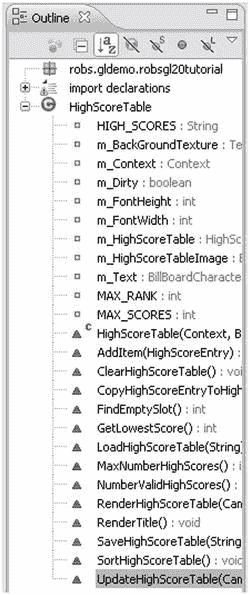
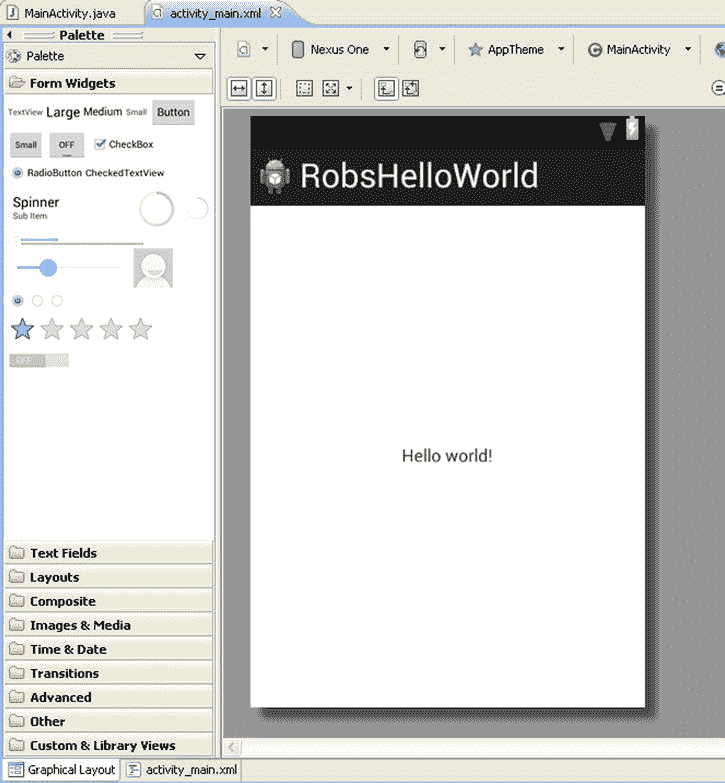

# 一、让我们看一看安卓

Abstract

Android 手机在移动智能手机市场占据主导地位，甚至超过了苹果的 iPhone。全球 190 多个国家有数亿部手机使用 Android 操作系统。每天都有 100 万新用户开始使用他们的 Android 手机上网、给朋友发电子邮件、下载应用和游戏。事实上，仅在谷歌 Play 商店，每月就有 15 亿次安卓游戏和应用下载。如果你包括其他提供 Android 游戏和应用销售的网站，如亚马逊 Android 应用商店，那么这个数字甚至更高。

Android 手机在移动智能手机市场占据主导地位，甚至超过了苹果的 iPhone。全球 190 多个国家有数亿部手机使用 Android 操作系统。每天都有 100 万新用户开始使用他们的 Android 手机上网、给朋友发电子邮件、下载应用和游戏。事实上，仅在谷歌 Play 商店，每月就有 15 亿次安卓游戏和应用下载。如果你包括其他提供 Android 游戏和应用销售的网站，如亚马逊 Android 应用商店，那么这个数字甚至更高。

在本章中，您将了解 Android 软件开发工具包(SDK)。您将学习如何设置 Android 开发环境。您还将了解这个环境的主要组件，比如 Eclipse。然后，我们将为 Android 创建和部署一个简单的“Hello World”程序，它既有一个虚拟的 Android 模拟器程序，也有一个真实的 Android 设备。

## Android 概述

Android 操作系统是一种广泛应用于手机和平板电脑的操作系统。它甚至被用在一个叫做 Ouya 的视频游戏控制台上。Android 手机从需要合同的昂贵手机到不需要任何合同的廉价预付费手机。为 Android 平台开发程序不需要任何开发者费用，不像苹果移动设备需要年费才能在他们的设备上运行你的程序。一部可以使用 OpenGL ES 2.0 开发 3D 游戏的性能良好的预付费非合约 Android 手机可以在`Amazon.com`上买到，价格低至 75-100 美元，免运费。

## Android SDK 概述

本节讨论 Android SDK。将涵盖开发系统需求和 SDK 的重要部分，如 SDK 管理器、Android 虚拟设备管理器和实际的 Android 仿真器。

### Android 软件开发工具包(SDK)要求

Android 开发可以在 Windows PC、Mac OS 机器或 Linux 机器上进行。确切的操作系统要求如下:

操作系统:

*   Windows XP (32 位)、Vista (32 位或 64 位)或 Windows 7 (32 位或 64 位)
*   Mac OS X 10.5.8 或更高版本(仅限 x86)
*   Linux(在 Ubuntu Linux、Lucid Lynx 上测试)
    *   需要 GNU C 库(glibc) 2.7 或更高版本。
    *   在 Ubuntu Linux 上，需要 8.04 版或更高版本。
    *   64 位发行版必须能够运行 32 位应用。

开发 Android 程序还需要安装 Java 开发工具包。Java 开发套件要求是 JDK 6 或更高版本，位于 [`www.oracle.com/technetwork/java/javase/downloads/index.html`](http://www.oracle.com/technetwork/java/javase/downloads/index.html) 。

如果你用的是 Mac，那么可能已经安装了 Java。

用 Android 开发工具(ADT)插件修改的 Eclipse IDE 程序构成了 Android 开发环境的基础。Eclipse 的要求如下:

*   日食 3.6.2(太阳神)或以上位于 [`http://eclipse.org`](http://eclipse.org/)
*   Eclipse JDT 插件(包含在大多数 Eclipse IDE 包中)
*   Eclipse 的 Android 开发工具(ADT)插件位于 [`http://developer.android.com/tools/sdk/eclipse-adt.html`](http://developer.android.com/tools/sdk/eclipse-adt.html)

Notes

最新版本的 ADT 不再支持 Eclipse 3.5 (Galileo)。有关 Android 开发工具的最新信息，请访问 [`http://developer.android.com/tools/index.html`](http://developer.android.com/tools/index.html) 。

### Android SDK 组件概述

Android SDK 的不同组件是 Eclipse 程序、Android SDK 管理器以及 Android 虚拟设备管理器和仿真器。让我们更详细地看一下每一个。

#### 带有 Android 开发工具插件的 Eclipse

您将花费大部分时间处理的 Android SDK 的实际部分是一个名为 Eclipse 的程序，它是通过 ADT 软件插件专门为 Android 定制的。你将输入新的代码，创建新的类，在 Android 模拟器和真实设备上运行程序。在旧的、功能较弱的计算机上，仿真器可能运行得很慢，以至于最好的选择是在实际的 Android 设备上运行程序。因为我们在本书中处理 CPU 密集型 3D 游戏，所以您应该使用实际的 Android 设备来运行示例项目(参见图 1-1 )。

图 1-1。

Eclipse with Android Development Tools plug-ins

#### Android SDK 管理器

Android SDK 管理器允许您通过其界面下载新的 Android 平台版本和工具。还会显示当前安装的工具和平台版本。比如图 1-2 中，已经安装了 Android 2.2 平台，准备用于开发。这意味着您可以针对该平台编译您的源代码。

图 1-2。

The Android SDK Manager

#### Android 虚拟设备

Android SDK 还支持虚拟设备仿真器(见图 1-3 )。在许多情况下，你可以在开发系统的软件模拟器上运行你的 Android 程序，而不是在实际的设备上。但是，这最适合非图形密集型应用。因为这本书是关于 3D 游戏的，所以我们不会使用这个软件模拟器，而是一个真正的 Android 设备。Android 虚拟设备管理器允许您创建新的虚拟 Android 设备，编辑现有的 Android 设备，删除现有的设备，以及启动现有的虚拟 Android 设备。图 1-3 表示有一个名为“Android22”的有效虚拟 Android 设备，它模拟 2.2 版本的 Android 操作系统(API Level 8)并模拟 ARM CPU 类型。Android 操作系统的 2.2 版本非常重要，因为它是第一个支持 OpenGL ES 2.0 的版本，我们将在本书中使用它来开发我们的 3D 图形。OpenGL 是允许程序员在 Android 平台上创建 3D 图形的图形系统。它被设计成独立于硬件的。也就是说，OpenGL 图形命令被设计成在许多不同的硬件平台上是相同的，例如 PC、Mac、Android 等。OpenGL 的 OpenGL 2.0 版本是包含可编程顶点和片段着色器的第一个 OpenGL 版本。OpenGL ES 是常规 OpenGL 的子集，包含的功能较少。

图 1-3。

The Android Virtual Device Manager

图 1-4 描绘了实际仿真器启动后的样子。所描述的仿真器是用于 Android 操作系统 2.2 版本的仿真器。

图 1-4。

The actual Android Virtual Device emulator

### 如何为发展而设置

首先，您需要下载并安装 Java 开发工具包版本 6 或更高版本。Android 开发环境要求将此作为先决条件。在您验证它已经安装并运行之后，您将不得不安装 Android SDK 的主要组件。

最快、最简单的方法是下载位于 [`http://developer.android.com/sdk/index.html`](http://developer.android.com/sdk/index.html) 的 ADT 包，该包位于“其他平台下载”部分。

ADT 包是一个可下载的 zip 文件，其中包含一个特殊版本的 Eclipse，带有 Android 开发工具插件、Android 虚拟设备管理器、SDK 管理器和工具，以及最新的 Android 平台和 Android 模拟器的最新 Android 系统映像。要安装这个 ADT 包，您需要做的就是创建一个新目录并将文件解压缩到其中。您可以使用免费工具如 7-Zip 来解压缩文件。这样做之后，您可以通过执行位于主包目录下的 Eclipse 目录中的`eclipse.exe`文件来执行新的 ADT 集成开发环境。

Note

7-Zip 可以在 [`www.7-zip.org`](http://www.7-zip.org/) 下载。

### Android 开发工具集成开发环境(IDE)概述

Eclipse IDE 由几个重要的部分组成，我将在这里讨论它们。重要的部分是包资源管理器窗口、源代码区域窗口、大纲窗口和消息窗口，包括一个输出程序员指定的调试消息的窗口，称为 LogCat 窗口。还有其他可用的信息窗口，但它们不太重要，不在本节讨论。

#### 包资源管理器

当你开始一个新的 Android 编程项目时，你将为它创建一个新的包。在 Eclipse 中，有一个名为 Package Explorer 的窗口，默认情况下位于左侧。该窗口列出了位于当前工作空间的所有 Android 包。例如，图 1-5 列出了诸如“AndroidHelloWorld”、“AndroidHelloWorldTest”和“ApiDemos”之类的包

图 1-5。

Package Explorer

您还可以展开一个包，以便通过单击包名称旁边的“加号”来访问与该包相关的所有文件。Java 源代码文件位于“src”目录中，与项目相关的资源，如纹理、3D 模型等。，位于“res”(资源的简称)目录中。双击源代码文件或资源文件，在 Eclipse 中查看它。源文件也可以扩展，这样您就可以对该类的变量和函数有一个总体的了解。您可以双击一个变量或函数，在 Eclipse 的 source view 窗口中找到该变量或函数。在图 1-6 中，“AndroidHelloWorldActivity”类中只有一个函数，就是“onCreate”最后，每个 Android 包都有一个`AndroidManifest.xml`文件，该文件定义了运行程序所需的权限、程序特定信息(如版本号、程序图标和程序名称)以及运行程序所需的最低 Android 操作系统。

图 1-6。

A closer look into a package

#### 源代码区域

默认情况下，Eclipse 的中间是 Java 源代码显示窗口。每个不同的 Java 源代码或`.xml`文件都显示在各自的选项卡中(见图 1-7 )。

图 1-7。

Java source code area

请注意，在最后一个选项卡的末尾，有一个“➤”，后面跟着“4”这意味着有四个隐藏文件没有显示。您可以通过单击“➤4”区域调出完整的文件列表来访问这些文件。以粗体字列出的文件不会显示，您可以通过用鼠标指针高亮显示并左键单击来选择这些文件进行查看(参见图 1-8 )。

图 1-8。

Accessing hidden Java source and `.xml` files

#### 概述

Eclipse 中的 Outline 窗口默认位于右侧，它列出了在源代码窗口中选择的类的变量和函数。在 Outline 窗口中点击变量或函数，可以很容易地跳转到源代码窗口中对应的类变量或类函数(见图 1-9 )。

图 1-9。

Outline window in Eclipse

在图 1-9 中，首先列出了类变量或“字段”，然后是类函数。类变量的一些例子是`HIGH_SCORES`、`m_BackGroundTexture`和`m_Dirty`。一些类函数的例子有`FindEmptySlot()`、`RenderTitle()`和`SortHighScoreTable()`。

#### 达尔维克调试监控服务器(DDMS)

带有 ADT 插件的 Eclipse 还提供了一种通过 Dalvik Debug Monitor 服务器或 DDMS 轻松连接实际 Android 硬件的方式。访问 DDMS 的按钮位于 Eclipse IDE 的右上角。点击此按钮将视图切换到 DDMS(见图 1-10 )。

图 1-10。

The DDMS button

在 DDMS 视图中，您可以使用位于视图右侧的文件浏览器选项卡查看 Android 设备上的实际目录和文件。图 1-11 对此进行了说明。

图 1-11。

Exploring files on your Android device

在左侧，如果您有一个通过 USB 端口连接的实际物理 Android 设备，该设备将显示在设备选项卡中，如图 1-12 所示。

图 1-12。

Devices tab on DDMS

另请注意设备窗口右上角的摄像头图标。如果你点击这个按钮，那么你会捕捉到 Android 设备上当前内容的截图(见图 1-13 )。

图 1-13。

Device Screen Capture in DDMS

从这个弹出窗口中，您可以旋转图像并保存图像，如果您愿意的话。在向最终用户推销您的应用时，这是获取促销图片截图的好方法。

#### 日志猫窗口

在 Eclipse IDE 的底部，默认有几个矩形窗口。其中一个更重要的窗口称为 LogCat 窗口，该窗口显示调试和错误信息，这些信息直接来自运行在 Android 设备上的程序，该设备通过 USB 电缆连接到您的计算机(见图 1-14 )。

图 1-14。

LogCat debugging tab

#### 从 Eclipse 启动 SDK 管理器和 AVD 管理器

要从 Eclipse IDE 中启动 Android SDK 管理器和 AVD 管理器，请单击顶部菜单栏中的“Window ”,并使用列表底部附近的菜单项。SDK 管理器使您能够下载新版本的 Android 平台和其他开发工具。AVD 管理器允许您为 Android 设备仿真器创建和管理虚拟 Android 设备(参见图 1-15 )。

图 1-15。

Launching SDK and AVD Managers from Eclipse

## 实践示例:非 OpenGL ES 文本“Hello World”程序

在这个动手的例子中，我们将创建一个新的 Android 项目，它将输出一个简单的“Hello World”文本字符串。启动 Eclipse IDE。

首先要做的是指定一个工作空间，您将在那里放置这个新项目。从 Eclipse 主菜单中选择 File ➤ SwitchWorkSpace ➤ Other，弹出一个窗口，您可以在其中选择一个目录作为存储新项目的当前工作空间。使用弹出窗口上的 Browse 按钮导航到要用作工作空间的文件夹，然后点击 OK 按钮将该文件夹设置为当前工作空间。

### 创建新的 Android 项目

要创建一个新的 Android 项目，选择文件➤新建菜单下的“Android 应用项目”(见图 1-16 )。

图 1-16。

Creating a new Android project in Eclipse

这将弹出一个窗口，您可以在其中指定您的应用名称、项目名称、包名称和 SDK 信息(参见图 1-17 )。

图 1-17。

Entering project and SDK info

在“应用名称”编辑框中，输入“RobsHelloWorld”，这是将显示给程序用户的应用的名称。在项目名称编辑框中，输入“RobsHelloWorld”，这是 Eclipse IDE 中显示的项目名称。输入“com.robsexample.robshelloworld”作为与这个新的 Android 项目相关联的包名。此包名必须是唯一的。

对于最低要求的 SDK 选择 Android 2.2 (Froyo)，因为这是支持 OpenGL ES 2.0 的最低 Android 平台。对于目标 SDK，选择您预期已经成功测试您的应用的最高 Android 平台 API。在“编译方式”列表框中，选择要为其编译应用的 API 版本。您可以保留主题列表框的默认值。单击“下一步”按钮进入下一个屏幕。

接下来要做的是配置项目。对于本例，只需接受默认值并点击下一步按钮(见图 1-18 )。

图 1-18。

Configuring a new project

在下一个屏幕中，如果您愿意，您可以配置启动器图标。然而，对于这个例子，你可以接受默认值(见图 1-19 )。

图 1-19。

Configure Launcher Icon

单击下一步按钮。下一个屏幕允许您选择想要创建的活动类型。选择空白活动并点击下一步按钮(参见图 1-20 )。

图 1-20。

Select activity type and Create Activity

接受空白活动的默认值。默认的活动名称是“MainActivity”默认布局名称是“activity_main”，默认导航类型是“None”点击完成按钮创建新的 Android 应用(见图 1-21 )。

图 1-21。

Creating a New Blank Activity

在 Eclipse IDE 左侧的 Package Explorer 窗口中，您应该会看到一个名为“RobsHelloWorld”的新条目，这是我们的新示例程序。关键目录是“src”目录，其中存储了 Java 源代码；“libs”目录，存储外部库；以及“res”目录，其中存储了图形、3D 模型和布局等资源。在“res”目录下，“layout”目录存储应用的图形布局规范；“菜单”目录存储应用菜单相关的布局信息；“values”目录存储实际显示的“Hello World”字符串。最后，一个关键文件是`AndroidManifest.xml`文件，它包含关于权限的信息和其他应用特定的信息。(见图 1-22“RobsHelloWorld”项目布局。)

图 1-22。

“RobsHelloWorld” Android project

### 在 Android 模拟器上运行

在模拟器上运行我们的示例之前，我们必须首先设置一个 Android 虚拟设备。从 Eclipse 菜单中选择窗口➤ Android 虚拟设备管理器来启动虚拟设备管理器。单击新建按钮。应该会弹出另一个窗口，标题为“创建新的 Android 虚拟设备(AVD)”。在“AVD 名称:”字段中输入虚拟设备的名称。选择要仿真的设备并作为目标，如图 1-23 所示。接受其余输入的默认值。单击确定按钮。

图 1-23。

Creating a new Android Virtual Device

接下来，我们必须运行我们的示例。如果您是第一次运行此应用，您必须指定如何运行此应用。确保突出显示“RobsHelloWorld”项目。从 Eclipse 主菜单中选择 Run ➤ Run。

当弹出窗口出现时，选择“Android Application”并单击 OK 按钮运行示例。如果您没有通过 USB 电缆连接到计算机的实际 Android 设备，Eclipse 将在 Android 模拟器上运行该程序(参见图 1-24 )。

图 1-24。

Running your “HelloWorld” example

Android 模拟器应该默认启动并运行我们的示例程序。该程序的实际代码将在本章后面显示(见图 1-25 )。

图 1-25。

“RobsHelloWorld” example running on the Android emulator

### 在实际的 Android 设备上运行

为了在实际的 Android 设备上下载和运行程序，设备必须进入 USB 调试模式。按下菜单键，这是 Android 手机底部最左边的键。点按“设置”按钮，然后点按“应用”按钮和“开发”按钮。单击“USB 调试”选项。完成后，应检查该项目，如图 1-26 所示。

图 1-26。

Setting USB Debugging mode Note

在 Android 4.0 和更新的机型上，USB 调试选项在设置➤开发者选项下。在 Android 4.2 和更新的机型上，开发者选项默认是隐藏的。若要使其可用，请前往“设置”“➤”“关于手机”,然后轻按内部版本号七次。返回上一屏幕，查找开发人员选项。

接下来，您必须在您的开发系统上安装适用于您的 Android 手机型号的 USB 软件驱动程序。尝试先将您的 Android 设备连接到您的电脑，看看它是否会自动安装正确的驱动程序。如果你不能在你的设备上运行这个程序，那么你必须安装制造商提供的设备驱动程序。通常你的手机制造商有一个可以下载驱动程序的网站。完成此操作后，使用 USB 电缆将您的手机连接到您的开发系统，该电缆很可能包含在您的手机中。

现在，您可以开始使用该设备了。从 Eclipse 主菜单中选择 Run ➤ Run。应该会出现一个窗口，您可以在其中选择在实际的 Android 设备或 Android 虚拟设备上运行该程序(参见图 1-27 )。选择硬件设备，然后单击“确定”按钮。

图 1-27。

Choose a device on which to run your program

设备上运行的程序应与图 1-25 所示的相同。按返回键退出程序。

### 主要源代码

当你在 Android 开发框架内创建一个新的程序时，你实际上是在编码方面创建一个新的活动。你需要做的是从现有的`Activity`类中派生出一个新的类，它是标准 Android 代码库的一部分(见清单 1-1)。

清单 1-1。`MainActivity.java`源代码为“RobsHelloWorld”的例子

`package com.robsexample.robshelloworld;`

`import android.os.Bundle;`

`import android.app.Activity;`

`import android.view.Menu;`

`public class MainActivity extends Activity` `{`

`@Override`

`protected void onCreate(Bundle savedInstanceState) {`

`super.onCreate(savedInstanceState);`

`setContentView(R.layout.activity_main);`

`}`

`@Override`

`public boolean onCreateOptionsMenu(Menu menu) {`

`// Inflate the menu; this adds items to the action bar if it is present.`

`getMenuInflater().inflate(R.menu.activity_main, menu);`

`return true;`

`}`

`}`

例如，我们的“HelloWorld”程序包含一个新类`MainActivity`，它是从`Activity`类派生而来的。

创建这个新活动时，会调用`onCreate()`函数。它首先通过`super.onCreate()`语句调用其父类中的`onCreate()`函数。然后，它将活动的视图设置为项目“res/layout”目录中的`activity_main.xml`文件中指定的布局。R 类是一个生成的类，位于“gen”目录中，反映了资源或“res”目录中的当前文件(见图 1-2x2)。

`OnCreateOptionsMenu()`功能为程序创建选项菜单。菜单规格位于“res/menu”目录下的`activity_main.xml`文件中。

### 图形布局

本例中的图形布局文件`.xml`由代码`R.layout.activity_main`引用，该代码引用位于本项目“res/layout”目录中的`activity_main.xml`文件(见清单 1-2)。)

清单 1-2。“RobsHelloWorld”的图形布局

`<RelativeLayout xmlns:android="`[`http://schemas.android.com/apk/res/android`](http://schemas.android.com/apk/res/android)

`xmlns:tools="`[`http://schemas.android.com/tools`](http://schemas.android.com/tools)

`android:layout_width="match_parent"`

`android:layout_height="match_parent"`

`tools:context=".MainActivity" >`

`<TextView`

`android:layout_width="wrap_content"`

`android:layout_height="wrap_content"`

`android:layout_centerHorizontal="true"`

`android:layout_centerVertical="true"`

`android:text="@string/hello_world"` `/>`

`</RelativeLayout>`

这种图形布局规范是一种相对布局类型，具有一个 TextView 组件，其中可以显示静态字母数字文本。

代码`android:text`设置要显示的文本。

要显示的文本被设置为一个名为“`hello_world`”的字符串变量，它位于“res/values”目录下的文件`strings.xml`中。

您可以通过删除“`@string/`”部分来硬编码一个字符串值，只需将想要显示的文本用引号括起来，例如

`android:text="Hello World EveryBODY!!!"`

但是，不建议这样做。

您还可以在 Eclipse 中预览和编辑布局，方法是选择布局文件并单击位于文件视图左下方的图形布局选项卡(参见图 1-28 )。)

图 1-28。

Graphical layout preview in Eclipse

### 实际的“Hello World”数据

最后，显示实际“Hello World”数据的文件是`strings.xml`文件，如清单 1-3 所示。

清单 1-3。“Hello World”的数据

`<?xml version=``"1.0"``encoding=``"utf-8"`

`<resources>`

`<string name=``"app_name"`

`<string name=``"hello_world"`

`<string name=``"menu_settings"`

`</resources>`

用于显示文本的关键变量是“`hello_world`”，相关的文本数据是“Hello world！”

## 摘要

在这一章中，我概述了 Android 游戏开发中的关键组件。我首先讨论了 Android 软件开发工具包(SDK)的主要组件。我讨论了 Eclipse IDE、Android SDK 管理器、Android 虚拟设备管理器和实际的 Android 设备仿真器。接下来，我解释了如何设置开发系统来创建和部署 Android 程序。我讨论了 Eclipse IDE 的关键组件，比如项目浏览器窗口、源代码窗口、大纲窗口和 LogCat 窗口。接下来，我带您一步一步地完成了一个实际操作的例子，这个例子涉及到创建一个“Hello World”程序，这个程序既可以在 Android 模拟器上运行，也可以在实际的 Android 设备上运行。最后，我讨论了这个示例“Hello World”程序是如何构造的。