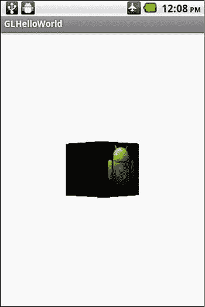

# 二、Android 中的 Java

Abstract

在这一章中，我将介绍 Android 3D 游戏开发中的 Java 语言组件。我将从 Android 上的基本 Java 语言的简要概述和回顾开始。然后，我将介绍 Android 上所有应用的基本 Java 程序框架。接下来，我将介绍 Android 上专门利用 OpenGL ES 图形的应用的基本 Java 编程框架。最后，我提供了一个 3D Android OpenGL ES 程序的实际例子。

在这一章中，我将介绍 Android 3D 游戏开发中的 Java 语言组件。我将从 Android 上的基本 Java 语言的简要概述和回顾开始。然后，我将介绍 Android 上所有应用的基本 Java 程序框架。接下来，我将介绍 Android 上专门利用 OpenGL ES 图形的应用的基本 Java 编程框架。最后，我提供了一个 3D Android OpenGL ES 程序的实际例子。

## Java 语言概述

关于 Java 语言的这一节旨在作为对计算机编程以及面向对象编程有所了解的人的快速入门指南。本节不是 Java 参考手册。它也不打算涵盖 Java 编程语言的所有特性。

Android 的 Java 语言运行在 Java 虚拟机上。这意味着，同一个编译好的 Java Android 程序可以在许多不同的 Android 手机上运行，这些手机具有不同的中央处理器(CPU)类型。这是未来更快处理单元可扩展性方面的一个关键特性，包括那些专门为增强 3D 游戏而设计的处理单元。这样做的代价是速度。Java 程序比用本机语言为 CPU 编译的程序运行得慢，因为 Java 虚拟机必须解释代码，然后在本机处理器上执行。已经为特定本机处理器编译的程序不需要解释，跳过这一步可以节省执行时间。

但是，您可以使用 Android 原生开发工具包或 NDK 为特定的 Android 处理器类型编译 C/C++ 代码。您还可以从 Java 编程框架中调用本机 C/C++ 函数。因此，对于需要本机编译代码速度的关键函数，您可以将这些函数放入使用 NDK 编译的 C/C++ 函数中，并在主程序中从 Java 代码中调用。

## Java 注释

Java 注释可以由单行注释和多行注释组成。

*   单行注释以两个斜杠字符(`//`)开始。

`// This is a single-line Java comment`

*   多行注释以斜杠后跟星号(`/*`)开始，以星号后跟斜杠(`*/`)结束。

`/*`

`This is`

`a multiline`

`comment`

`*/`

## Java 基本数据类型

Java 数据类型本质上可以是数字、字符或布尔值。

*   byte:8 位数字，取值范围为-128 到 127，包括-128 和 127
*   short:16 位数字，取值范围为-32，768 到 32，767，包括这两个值
*   int:32 位数字，取值范围为-2，147，483，648 到 2，147，483，647，包括这两个值
*   long:64 位数字，取值范围为-9，223，372，036，854，775，808 到 9，223，372，036，854，775，807，包括这两个值
*   float:单精度 32 位 IEEE 754 浮点数
*   double:双精度 64 位 IEEE 754 浮点数
*   char:单个 16 位 Unicode 字符，范围从`'\u0000'`(或 0)到`'\uffff'`(或 65，535，含 65，535)
*   布尔型的:值为真或假的

### 数组

在 Java 中，您可以根据上一节中列出的基本 Java 数据类型创建元素数组。下面的语句创建了一个名为`m_ProjectionMatrix`的 16 个 float 类型元素的数组。

`float``[] m_ProjectionMatrix =``new float`

### 数据修饰符

数据修饰符允许程序员控制如何访问和存储变量。它们包括以下内容:

*   private:私有变量只能从声明它们的类中访问。下面声明`m_ProjectionMatrix`是私有的，只能从它自己的类中访问:

`private float``[] m_ProjectionMatrix =``new float`

*   public:可以从任何类访问公共变量。以下变量是公共的:

`public float``[] m_ProjectionMatrix =``new float`

*   static:声明为 static 的变量只有一个副本与声明它们的类相关联。下面的静态数组被声明为 static，并驻留在 Cube 类中。该数组定义了三维立方体的图形数据。这个 3D 立方体对于 cube 类的所有实例都是相同的，因此将`CubeData`数组设为静态是有意义的。

`static float CubeData[] =`

`{`

`// x,     y,    z,   u,       v         nx,   ny, nz`

`-0.5f,  0.5f, 0.5f, 0.0f,   0.0f,   -1,  1, 1,  // front top left`

`-0.5f, -0.5f, 0.5f, 0.0f,   1.0f,   -1, -1, 1,  // front bottom left`

`0.5f, -0.5f, 0.5f, 1.0f,   1.0f,    1, -1, 1,   // front bottom right`

`0.5f,  0.5f, 0.5f, 1.0f,   0.0f,    1,  1, 1,   // front top right`

`-0.5f,  0.5f, -0.5f, 0.0f,   0.0f,  -1,  1, -1, // back top left`

`-0.5f, -0.5f, -0.5f, 0.0f,   1.0f,  -1, -1, -1, // back bottom left`

`0.5f, -0.5f, -0.5f, 1.0f,   1.0f,   1, -1, -1,  // back bottom right`

`0.5f,  0.5f, -0.5f, 1.0f,   0.0f,   1,  1, -1   // back top right`

`};`

*   final:final 修饰符表示变量不会改变。例如，下面声明变量`TAG`的类型为`String`，并且是私有的、静态的，不能被改变。

`private static final String TAG = "MyActivity";`

## Java 运算符

在这一节中，我们将讨论算术、一元、条件、按位和位移运算符。

### 算术运算符

*   `+`加法运算符(也用于`String`串联)
*   `-`减法运算符
*   `*`乘法运算符
*   `/`除法运算符
*   `%`余数运算符

### 一元运算符

*   `+`一元加运算符
*   -对表达式求反
*   `++`将数值增加 1
*   -将值减 1
*   `!`反转布尔值

### 条件运算符

*   `&&`条件-与
*   `||`条件-或
*   `=`赋值运算符
*   `==`等于
*   `!=`不等于
*   `>`大于
*   `>=`大于或等于
*   `<`小于
*   `<=`小于或等于

### 按位和位移运算符

*   `∼`一元按位补码
*   `<<`带符号左移
*   `>>`带符号右移
*   `>>>`无符号右移
*   `&`按位与
*   `^`按位异或
*   `|`按位异或

## Java 流控制语句

*   `if then`声明

`if (expression)`

`{`

`// execute statements here if expression evaluates to true`

`}`

*   `if then else`声明

`if (expression)`

`{`

`// execute statements here if expression evaluates to true`

`}`

`else`

`{`

`// execute statements here if expression evaluates to false`

`}`

*   `switch`声明

`switch(expression)`

`{`

`case label1:`

`// Statements to execute if expression evaluates to`

`// label1:`

`break;`

`case label2:`

`// Statements to execute if expression evaluates to`

`// label2:`

`break;`

`}`

*   `while`声明

`while (expression)`

`{`

`// Statements here execute as long as expression evaluates // to true;`

`}`

*   `for`声明

`for (variable counter initialization;`

`expression;`

`variable counter increment/decrement)`

`{`

`// variable counter initialized when for loop is first`

`// executed`

`// Statements here execute as long as expression is true`

`// counter variable is updated`

`}`

## Java 类

Java 是一种面向对象的语言。这意味着您可以派生或扩展现有的类，以形成现有类的新的定制类。派生类将具有父类的所有功能，以及您可能想要添加的任何新功能。

下面的类是其派生的父类的自定义版本，该父类是 Activity 类。

`public class MainActivity extends Activity`

`{`

`// Body of class`

`}`

### 包和类

包是 Java 中把以某种方式相关的类和接口组合在一起的一种方式。例如，一个包可以代表一个游戏或其他单个应用。下面是我在本章末尾提到的“Hello Droid”Android 项目的包名称。

`package com.robsexample.glhelloworld;`

### 访问包中的类

为了访问位于其他包中的类，您必须使用“import”语句将它们显示出来。例如，为了使用位于 android.opengl.GLSurfaceView 包中的 GLSurfaceView 类，您必须使用以下语句导入它:

`import android.opengl.GLSurfaceView;`

然后，您可以使用没有完整包名的类定义，例如

`private GLSurfaceView m_GLView;`

请参考主要的 Android 开发者网站，了解有关 Android 内置类的更多信息，以及在您自己的程序中使用这些类需要指定的确切导入。

### Java 接口

Java 接口的目的是为程序员提供一种标准的方法，在派生类的代码中实现接口中的实际功能。一个接口不包含任何实际的代码，只有函数定义。具有实际代码的函数体必须由实现该接口的其他类来定义。实现接口的类的一个很好的例子是 render 类，它用于在 Android 平台上渲染 OpenGL 中的图形。

`public class MyGLRenderer implements GLSurfaceView.Renderer`

`{`

`// This class implements the functions defined in the`

`// GLSurfaceView.Renderer interface`

`// Custom code`

`private PointLight m_Light;`

`public PointLight m_PublicLight;`

`void SetupLights()`

`{`

`// Function Body`

`}`

`// Other code that implements the interface`

`}`

### 访问类变量和函数

您可以通过“`.`”操作符访问类的变量和函数，就像在 C++ 中一样。请参见以下示例:

`MyGLRenderer m_Renderer;`

`m_Renderer.m_PublicLight = null; // ok`

`m_Renderer.SetupLights();        // ok`

`m_Renderer.m_Light = null;       // error private member`

## Java 函数

Java 函数的一般格式与其他语言相同，比如 C/C++。函数标题以可选修饰符开始，如 private、public 或 static。接下来是返回值，如果没有返回值或基本数据类型或类，返回值可以是空的。接下来是函数名和参数列表。

`Modifiers Return_value FunctionName(ParameterType1 Parameter1, ...)`

`{`

`// Code Body`

`}`

在本章末尾的“Hello Droid”示例中，我们的 Vector3 类中的一个函数示例是:

`static Vector3 CrossProduct(Vector3 a, Vector3 b)`

`{`

`Vector3 result = new Vector3(0,0,0);`

`result.x= (a.y*b.z) - (a.z*b.y);`

`result.y= (a.z*b.x) - (a.x*b.z);`

`result.z= (a.x*b.y) - (a.y*b.x);`

`return result;`

`}`

同样在 Java 中，所有作为对象的参数都是通过引用传递的。

### 调用父函数

使用`@Override`注释，派生类中的函数可以覆盖父类或超类中的函数。这不是必需的，但有助于防止编程错误。如果意图是重写父函数，但该函数实际上并没有这样做，那么将会产生一个编译器错误。

为了让派生类中的函数实际调用父类中相应的函数，可以使用超级前缀，如下所示。

`@Override`

`public void onCreate(Bundle savedInstanceState)`

`{`

`super.onCreate(savedInstanceState);`

`// Create a MyGLSurfaceView instance and set it`

`// as the ContentView for this Activity`

`m_GLView = new MyGLSurfaceView(this);`

`setContentView(m_GLView);`

`}`

Note

更多 Java 教程可以在 [`http://docs.oracle.com/javase/tutorial/`](http://docs.oracle.com/javase/tutorial/) 上找到。

## 基本的 Android Java 程序框架

在这一节中，我将介绍基本的 Android Java 程序框架。这个框架适用于所有 Android 程序，而不仅仅是 Android 3D 游戏或一般的游戏。我从活动生命周期的概述开始。然后，我将介绍生命周期中的关键案例，并通过添加代码来跟进，通过使用 debug 语句，您可以看到活动生命周期中的变化。

### Android 活动生命周期概述

Activity 类是 Android 框架中的主要入口，程序员可以在这里创建新的 Android 应用和游戏。为了在这个框架内有效地编码，您必须理解活动类的生命周期。图形流程图样式概述见图 2-1 。

图 2-1。

Activity class callback life cycle

#### 关键活动生命周期案例

在编写活动类时，有一些关键的情况需要考虑。

*   另一个活动来到前台:当前活动暂停；也就是说，活动的`onPause()`函数被调用。
*   电源键关闭:调用当前活动的`onPause()`函数；电源键重新打开；然后调用活动的`onResume()`函数，接着返回到活动的恢复。
*   手机方向改变:调用当前活动的`onPause()`函数。调用活动的`onStop()`函数。活动的`onDestroy()`函数被调用。最后，使用新的方向创建先前活动的新实例，并调用`onCreate()`。
*   按下返回键:调用当前活动的`onPause()`函数。调用活动的`onStop()`函数。最后，调用活动的`onDestroy()`函数。该活动不再有效。
*   按下 Home 键:调用当前活动的`onPause()`函数。调用`onStop()`功能，用户被带到主屏幕，在那里可以开始其他活动。如果用户试图通过点击图标开始之前停止的活动，则调用之前活动的`onRestart()`函数。接下来，调用`onStart()`函数。然后调用`onResume()`函数。该活动再次激活并正在运行。

从图 2-1 中得到的重要概念是，无论何时`onPause()`被调用，你都应该保存游戏状态。

### 查看活动生命周期的运行

清单 2-1 展示了这些回调函数在我们在第一章中创建的新 MainActivity 类中的样子。添加到每个回调中的日志语句将错误日志消息输出到 LogCat 窗口，指示正在执行哪个回调。尝试输入额外的代码并运行程序，亲眼看看正在执行的生命周期回调。

清单 2-1。添加了生命周期回调的“RobsHelloWorld”示例

`package com.robsexample.robshelloworld;`

`import android.os.Bundle;`

`import android.app.Activity;`

`import android.util.Log;`

`import android.view.Menu;`

`public class MainActivity extends Activity {`

`private static final String TAG = "MyActivity";`

`@Override`

`protected void onCreate(Bundle savedInstanceState) {`

`super.onCreate(savedInstanceState);`

`setContentView(R.layout.activity_main);`

`Log.e(TAG,"onCreate() called!");`

`}`

`@Override`

`public boolean onCreateOptionsMenu(Menu menu) {`

`// Inflate the menu; this adds items to the action bar if it is present.`

`getMenuInflater().inflate(R.menu.activity_main, menu);`

`return true;`

`}`

`@Override`

`protected void onStart() {`

`super.onStart();`

`Log.e(TAG, "onStart() called!");`

`}`

`@Override`

`protected void onRestart() {`

`super.onRestart();`

`Log.e(TAG, "onRestart() called!");`

`}`

`@Override`

`protected void onStop() {`

`super.onStop();`

`Log.e(TAG, "onStop() called!");`

`}`

`@Override`

`protected void onResume() {`

`// Ideally a game should implement onResume() and onPause()`

`// to take appropriate action when the activity looses focus`

`super.onResume();`

`Log.e(TAG, "onResume() called!");`

`}`

`@Override`

`protected void onPause() {`

`// Ideally a game should implement onResume() and onPause()`

`// to take appropriate action when the activity looses focus`

`super.onPause();`

`Log.e(TAG, "onPause() called!");`

`}`

`@Override`

`protected void onDestroy()`

`{`

`// Implement onDestroy() to release objects and free up memory when`

`// an Activity is terminated.`

`super.onDestroy();`

`Log.e(TAG, "onDestroy() called!");`

`}`

`}`

## 基本的 Android Java OpenGL 框架

在这一节中，我将介绍基本的 Android Java OpenGL 框架，它是所有 OpenGL 相关应用的基础，包括游戏。我首先用一个单一的 OpenGL 视图介绍了程序的基本框架。接下来，我将介绍一个包含多个视图的框架，这些视图将 OpenGL 视图作为用户界面的一部分。

### 用于单视图 OpenGL ES 应用的基本 Android OpenGL ES 框架

在这一节中，我将讨论如何创建一个只有一个 OpenGL ES 2.0 视图的 OpenGL ES 2.0 Android 应用。我首先讨论定制的 GLSurfaceView 类。然后，我讨论了我们需要的自定义渲染器来绘制 3D OpenGL ES 对象。

#### 自定义 GLSurfaceView 视图

为了创建你自己的基于 OpenGL ES 的自定义游戏，你必须创建一个自定义`GLSurfaceView`，一个绘制这个自定义`GLSurfaceView`的自定义渲染器，然后通过你的自定义活动类中的`setContentView()`函数将这个新的自定义`GLSurfaceView`设置为主视图。

当活动暂停或恢复时，必须通知自定义 GLSurfaceView 对象。这意味着在活动中调用`onPause()`或`onResume()`时，必须调用 GLSurfaceView 对象中的`onPause()`和`onResume()`函数。

在下面的自定义 MyGLSurfaceView 类(从 GLSurfaceView 类派生)中，您还必须通过在构造函数内调用 setEGLContextClientVersion(2)来将要使用的 OpenGL ES 版本设置为 2.0。您还必须在构造函数中使用`setRenderer(new MyGLRenderer())`语句设置您的自定义渲染器，在下面的示例中是 MyGLRenderer。参见清单 2-2。

清单 2-2。单个 OpenGL ES View 应用的活动类

`package robs.demo.robssimplegldemo;`

`import android.app.Activity;`

`import android.content.Context;`

`import android.opengl.GLSurfaceView;`

`import android.os.Bundle;`

`public class RobsSimpleOpenGLDemoActivity extends Activity`

`{`

`private GLSurfaceView m_GLView;`

`@Override`

`public void onCreate(Bundle savedInstanceState)`

`{`

`super.onCreate(savedInstanceState);`

`// Create a MyGLSurfaceView instance and set it`

`// as the ContentView for this Activity`

`m_GLView = new MyGLSurfaceView(this);`

`setContentView(m_GLView);`

`}`

`@Override`

`protected void onPause()`

`{`

`super.onPause();`

`m_GLView.onPause();`

`}`

`@Override`

`protected void onResume()`

`{`

`super.onResume();`

`m_GLView.onResume();`

`}`

`}`

`///////////////////////////////////////////////////////////////////////////`

`class MyGLSurfaceView extends GLSurfaceView {`

`public MyGLSurfaceView(Context context) {`

`super(context);`

`// Create an OpenGL ES 2.0 context.`

`setEGLContextClientVersion(2);`

`// Set the Renderer for drawing on the GLSurfaceView`

`setRenderer(new MyGLRenderer());`

`}`

`}`

#### 自定义渲染器

自定义的 MyGLRenderer 类实现了 GLSurfaceView.Renderer 的接口。这意味着这个类需要实现函数`onSurfaceCreated()`、`onSurfaceChanged()`和`onDrawFrame()`。

当创建 OpenGL 表面或用于 OpenGL ES 渲染的 EGL 上下文丢失时，调用函数`onSurfaceCreated()`。在这里创建和初始化你的游戏需要的任何 OpenGL 对象和资源。

每当 OpenGL 表面改变尺寸或创建新表面时，调用 o `nSurfaceChanged()`函数。

当需要将 OpenGL 表面渲染到 Android 屏幕时，会调用`onDrawFrame()`函数。在这里输入代码来渲染你的 3D 物体。

完整的自定义渲染器类实现见清单 2-3。

清单 2-3。MyGLRenderer 自定义渲染器类

`package robs.demo.robssimplegldemo;`

`import java.nio.ByteBuffer;`

`import java.nio.ByteOrder;`

`import java.nio.FloatBuffer;`

`import javax.microedition.khronos.egl.EGLConfig;`

`import javax.microedition.khronos.opengles.GL10;`

`import android.opengl.GLES20;`

`import android.opengl.GLSurfaceView;`

`public class MyGLRenderer implements GLSurfaceView.Renderer`

`{`

`@Override`

`public void onSurfaceCreated(GL10 unused, EGLConfig config)`

`{`

`// Called when an new surface has been created`

`// Create OpenGL resources here`

`}`

`@Override`

`public void onSurfaceChanged(GL10 unused, int width, int height)`

`{`

`// Called when new GL Surface has been created or changes size`

`// Set the OpenglES camera viewport here`

`}`

`@Override`

`public void onDrawFrame(GL10 unused)`

`{`

`// Put code to draw 3d objects to screen here`

`}`

`}`

### 用于多视图 OpenGL ES 应用的基本 Android OpenGL ES 框架

在本节中，我们将介绍 OpenGL 程序的基本框架，该程序在用户界面或布局中包含多个视图对象，如文本视图、编辑框视图以及 OpenGL 视图。例如，您可以在屏幕的一部分显示编辑框视图，用户可以使用已经内置在软件中的标准虚拟 Android 键盘输入自己的名字，而在屏幕的另一部分运行 OpenGL 动画。

#### XML 布局文件

以下 XML 布局文件是具有三个视图组件的线性布局:TextView 组件、EditText 组件和名为 MyGLSurfaceView 的自定义 GLSurfaceView 组件。

要在此视图中使用的自定义 GLSurfaceView 类由以下语句指定，该语句是包含其所在的包的类的完整名称:

`robs.demo.TestDemoComplete.MyGLSurfaceView`

该视图的 id 由以下语句指定:

`android:id="@+id/MyGLSurfaceView"`

“`@`”符号告诉编译器将字符串的其余部分作为身份资源进行解析和扩展。“`+`”告诉编译器这个新 id 必须添加到位于 gen/R.java 文件中的资源文件中。“MyGLSurfaceView”是实际的 id(见清单 2-4)。

清单 2-4。多视图 OpenGL ES 应用的 XML 布局

`<?xml version="1.0" encoding="utf-8"?>`

`<LinearLayout xmlns:android="http://schemas.android.com/apk/res/android"`

`android:id="@+id/layout"`

`android:layout_width="fill_parent"`

`android:layout_height="fill_parent"`

`android:orientation="vertical">`

`<TextView`

`android:id="@+id/Text1"`

`android:layout_width="fill_parent"`

`android:layout_height="wrap_content"`

`android:text="@string/hello"/>`

`<EditText`

`android:id="@+id/EditTextBox1"`

`android:layout_width="fill_parent"`

`android:layout_height="wrap_content"`

`android:text="@string/hello"/>`

`<robs.demo.TestDemoComplete.MyGLSurfaceView`

`android:id="@+id/MyGLSurfaceView"`

`android:layout_width="wrap_content"`

`android:layout_height="wrap_content"/>`

`</LinearLayout>`

#### 活动类和 GLSurfaceView 类

前面部分中的 XML 布局被 Activity 类中的语句`setContentView()`设置为用户界面。

在 Activity 类中，我们使用`findViewById()`函数获取对新创建的 MyGLSurfaceView 对象的引用，因此我们可以在 Activity 类中引用它。

MyGLSurfaceView 类中添加了一个新的构造函数。这是必要的，因为我们在 XML 布局中添加了 MyGLSurfaceView 类(见清单 2-5)。

清单 2-5。多视图 OpenGL ES 活动

`package robs.demo.TestDemoComplete;`

`import android.app.Activity;`

`import android.os.Bundle;`

`import android.content.Context;`

`import android.opengl.GLSurfaceView;`

`import android.view.MotionEvent;`

`import android.util.AttributeSet;`

`public class OpenGLDemoActivity extends Activity`

`{`

`private GLSurfaceView m_GLView;`

`@Override`

`public void onCreate(Bundle savedInstanceState)`

`{`

`super.onCreate(savedInstanceState);`

`setContentView(R.layout.main);`

`MyGLSurfaceView V = (MyGLSurfaceView)this.findViewById (R.id.MyGLSurfaceView);`

`m_GLView = V;`

`}`

`@Override`

`protected void onPause()`

`{`

`super.onPause();`

`m_GLView.onPause();`

`}`

`@Override`

`protected void onResume()`

`{`

`super.onResume();`

`m_GLView.onResume();`

`}`

`}`

`////////////////////////////////////////////////////////////////////////////`

`class MyGLSurfaceView extends GLSurfaceView`

`{`

`private final MyGLRenderer m_Renderer;`

`// Constructor that is called when MyGLSurfaceView is created`

`// from within an Activity with the new statement.`

`public MyGLSurfaceView(Context context)`

`{`

`super(context);`

`// Create an OpenGL ES 2.0 context.`

`setEGLContextClientVersion(2);`

`// Set the Renderer for drawing on the GLSurfaceView`

`m_Renderer = new MyGLRenderer();`

`setRenderer(m_Renderer);`

`}`

`// Constructor that is called when MyGLSurfaceView is created in the XML`

`// layout file`

`public MyGLSurfaceView(Context context,  AttributeSet attrs)`

`{`

`super(context, attrs);`

`// Create an OpenGL ES 2.0 context.`

`setEGLContextClientVersion(2);`

`// Set the Renderer for drawing on the GLSurfaceView`

`m_Renderer = new MyGLRenderer();`

`setRenderer(m_Renderer);`

`}`

`}`

## 动手示例:一个 3D OpenGL“Hello Droid”示例

在这个动手练习中，我将介绍一个简单的 3D OpenGL 示例，它为您提供了我将在本书后面介绍的内容的预览。

### 将项目示例导入 Eclipse

为了运行本书中的项目示例，您需要将它们导入到当前的 Eclipse 工作空间中。在 Eclipse 主菜单下，选择文件➤导入。这应该会打开另一个窗口。选择 Android ➤现有的 Android 代码到工作空间，开始将现有的代码导入到您当前的工作空间。按照下一个窗口中的指示选择一个根目录。选择您想要导入的项目，以及您是否想要将代码复制到现有的工作空间。完成后，单击“完成”按钮。

启动 Eclipse IDE。将第二章项目导入到您当前的工作空间，如果您还没有这样做的话。选择 GLHelloWorld 项目，并在 Eclipse IDE 的 Package Explorer 窗口区域显示源代码列表。

### MainActivity 和 MyGLSurfaceView 类

在 Package Explorer 窗口中双击 MainActivity Java 文件，将其显示在源代码区域。该文件定义了新的程序或活动，并遵循前面讨论的单一 OpenGL 视图布局的相同格式(见清单 2-6)。)

清单 2-6。MainActivity 和 MyGLSurfaceView 类

`package com.robsexample.glhelloworld;`

`import android.os.Bundle;`

`import android.app.Activity;`

`import android.view.Menu;`

`import android.opengl.GLSurfaceView;`

`import android.content.Context;`

`public class MainActivity extends Activity {`

`private GLSurfaceView m_GLView;`

`@Override`

`public void onCreate(Bundle savedInstanceState)`

`{`

`super.onCreate(savedInstanceState);`

`// Create a MyGLSurfaceView instance and set it`

`// as the ContentView for this Activity`

`m_GLView = new MyGLSurfaceView(this);`

`setContentView(m_GLView);`

`}`

`@Override`

`protected void onPause()`

`{`

`super.onPause();`

`m_GLView.onPause();`

`}`

`@Override`

`protected void onResume()`

`{`

`super.onResume();`

`m_GLView.onResume();`

`}`

`@Override`

`public boolean onCreateOptionsMenu(Menu menu) {`

`// Inflate the menu; this adds items to the action bar if it is present.`

`getMenuInflater().inflate(R.menu.activity_main, menu);`

`return true;`

`}`

`}`

`///////////////////////////////////////////////////////////////////////////////`

`class MyGLSurfaceView extends GLSurfaceView`

`{`

`public MyGLSurfaceView(Context context)`

`{`

`super(context);`

`// Create an OpenGL ES 2.0 context.`

`setEGLContextClientVersion(2);`

`// Set the Renderer for drawing on the GLSurfaceView`

`setRenderer(new MyGLRenderer(context));`

`}`

`}`

### MyGLRenderer 类

双击包资源管理器窗口中的 MyGLRenderer 源代码文件，在 Eclipse IDE 源代码窗口区域显示它(参见清单 2-7)。

清单 2-7。MyGLRenderer

`package com.robsexample.glhelloworld;`

`import javax.microedition.khronos.egl.EGLConfig;`

`import javax.microedition.khronos.opengles.GL10;`

`import android.opengl.GLES20;`

`import android.opengl.GLSurfaceView;`

`import android.content.Context;`

`public class MyGLRenderer implements GLSurfaceView.Renderer`

`{`

`private Context m_Context;`

`private PointLight m_PointLight;`

`private Camera m_Camera;`

`private int m_ViewPortWidth;`

`private int m_ViewPortHeight;`

`private Cube m_Cube;`

`public MyGLRenderer(Context context)`

`{`

`m_Context = context;`

`}`

`void SetupLights()`

`{`

`// Set Light Characteristics`

`Vector3 LightPosition = new Vector3(0,125,125);`

`float[] AmbientColor = new float [3];`

`AmbientColor[0] = 0.0f;`

`AmbientColor[1] = 0.0f;`

`AmbientColor[2] = 0.0f;`

`float[] DiffuseColor = new float[3];`

`DiffuseColor[0] = 1.0f;`

`DiffuseColor[1] = 1.0f;`

`DiffuseColor[2] = 1.0f;`

`float[] SpecularColor = new float[3];`

`SpecularColor[0] = 1.0f;`

`SpecularColor[1] = 1.0f;`

`SpecularColor[2] = 1.0f;`

`m_PointLight.SetPosition(LightPosition);`

`m_PointLight.SetAmbientColor(AmbientColor);`

`m_PointLight.SetDiffuseColor(DiffuseColor);`

`m_PointLight.SetSpecularColor(SpecularColor);`

`}`

`void SetupCamera()`

`{`

`// Set Camera View`

`Vector3 Eye = new Vector3(0,0,8);`

`Vector3 Center = new Vector3(0,0,-1);`

`Vector3 Up = new Vector3(0,1,0);`

`float ratio = (float) m_ViewPortWidth / m_ViewPortHeight;`

`float Projleft    = -ratio;`

`float Projright   = ratio;`

`float Projbottom  = -1;`

`float Projtop     = 1;`

`float Projnear    = 3;`

`float Projfar     = 50; //100;`

`m_Camera = new Camera(m_Context,`

`Eye,`

`Center,`

`Up,`

`Projleft, Projright,`

`Projbottom,Projtop,`

`Projnear, Projfar);`

`}`

`void CreateCube(Context iContext)`

`{`

`//Create Cube Shader`

`Shader Shader = new Shader(iContext, R.raw.vsonelight, R.raw.fsonelight);   // ok`

`//MeshEx(int CoordsPerVertex,`

`//            int MeshVerticesDataPosOffset,`

`//            int MeshVerticesUVOffset,`

`//            int MeshVerticesNormalOffset,`

`//            float[] Vertices,`

`//            short[] DrawOrder`

`MeshEx CubeMesh = new MeshEx(8,0,3,5,Cube.CubeData, Cube.CubeDrawOrder);`

`// Create Material for this object`

`Material Material1 = new Material();`

`//Material1.SetEmissive(0.0f, 0, 0.25f);`

`// Create Texture`

`Texture TexAndroid = new Texture(iContext,R.drawable.ic_launcher);`

`Texture[] CubeTex  = new Texture[1];`

`CubeTex[0]         = TexAndroid;`

`m_Cube = new Cube(iContext,`

`CubeMesh,`

`CubeTex,`

`Material1,`

`Shader);`

`// Set Intial Position and Orientation`

`Vector3 Axis = new Vector3(0,1,0);`

`Vector3 Position = new Vector3(0.0f, 0.0f, 0.0f);`

`Vector3 Scale = new Vector3(1.0f,1.0f,1.0f);`

`m_Cube.m_Orientation.SetPosition(Position);`

`m_Cube.m_Orientation.SetRotationAxis(Axis);`

`m_Cube.m_Orientation.SetScale(Scale);`

`//m_Cube.m_Orientation.AddRotation(45);`

`}`

`@Override`

`public void onSurfaceCreated(GL10 unused, EGLConfig config)`

`{`

`m_PointLight = new PointLight(m_Context);`

`SetupLights();`

`CreateCube(m_Context);`

`}`

`@Override`

`public void onSurfaceChanged(GL10 unused, int width, int height)`

`{`

`// Ignore the passed-in GL10 interface, and use the GLES20`

`// class's static methods instead.`

`GLES20.glViewport(0, 0, width, height);`

`m_ViewPortWidth = width;`

`m_ViewPortHeight = height;`

`SetupCamera();`

`}`

`@Override`

`public void onDrawFrame(GL10 unused)`

`{`

`GLES20.glClearColor(1.0f, 1.0f, 1.0f, 1.0f);`

`GLES20.glClear( GLES20.GL_DEPTH_BUFFER_BIT | GLES20.GL_COLOR_BUFFER_BIT);`

`m_Camera.UpdateCamera();`

`m_Cube.m_Orientation.AddRotation(1);`

`m_Cube.DrawObject(m_Camera, m_PointLight);`

`}`

`}`

首先调用`onSurfaceCreated()`函数。在这个函数中，创建并初始化了一个新的光源，同时也创建了一个 3D 立方体对象。

接下来，调用`onSurfaceChanged()`函数。在这个函数中，摄像机被创建和初始化。定义相机的属性，如位置、方向和相机镜头质量。

在`onDrawFrame()`功能中，背景被清除为白色。然后摄像机被更新。接下来，将立方体旋转一度，最后，绘制立方体对象。

### 类别概述

在本书中，3D 对象的基类是 Object3d 类。其他 3D 对象，如 Cube 类，直接或间接从 Object3d 类派生或扩展。

Object3d 类包含其他关键类，如方向类、MeshEx 类、纹理类、材质类和着色器类。

Orientation 类保存 3D 对象的位置、旋转和缩放数据。

MeshEx 类定义了一种用于表示 3D 对象的 OpenGL 3D 网格。

Texture 类定义了一个由位图图像组成的纹理，它可以应用于 3D 对象。

Material 类定义对象的材质属性，这些属性定义对象的颜色和照明属性。这些属性包括发射、环境光、漫射、镜面反射、镜面反射亮度和 Alpha。

*   发光是指物体本身发出的光。
*   环境光指的是环境光照射时材质反射的颜色。环境光在整个对象上是恒定的，不受灯光位置或观察者位置的影响。
*   漫射属性指的是当受到漫射光照射时，材质反射的颜色。穿过对象的漫射光的强度取决于对象的顶点法线与光方向所成的角度。
*   镜面反射属性是指材质反射的镜面反射颜色。镜面反射的颜色取决于观察者的位置，灯光的位置，以及物体的顶点法线。
*   Specular _ Shininess 属性指的是对象上的高光反射的强度。
*   Alpha 值是对象的透明度。

Shader 类定义如何绘制和照亮 3D 对象。它由顶点着色器和像素或片段着色器组成。顶点着色器确定对象顶点在 3D 世界中的位置。片段着色器确定被着色对象的颜色。

Camera 类表示进入 OpenGL 3D 世界的视图。位置、方向和相机镜头属性都包含在这个类中。

Cube 类包含顶点位置数据、顶点纹理数据和顶点法线数据，这些数据是用纹理和光照渲染 3D 立方体所需要的。

PointLight 类代表我们的光源。这种光是仿照点光源，如太阳。这种光位于空间中的单个点，光向各个方向辐射。灯光特性包括环境颜色、漫射颜色和镜面颜色。

Vector3 类保存由 x、y 和 z 分量组成的 3D 矢量的数据，以及 3D 矢量数学函数。

我将在后面的章节中更详细地介绍上面提到的类，所以如果您没有完全理解所有的概念，请不要担心。这一章的目的是给你一个包含在本书中的一些关键类的简要概述，并向你展示它们是如何在实际程序中使用的。

### 实验“你好机器人”

让我们做一些动手实验，摆弄一下灯光。在装有 2.2 版或更高版本操作系统的 Android 手机上运行“GLHelloWorld”程序。图 2-2 显示了默认情况下您应该看到的内容。你应该看到一个 3D 旋转立方体，它的两面都有机器人的纹理。

图 2-2。

Default output

通过注释掉旋转立方体的`onDrawFrame()`函数中的语句来停止立方体旋转，如下所示:

`//m_Cube.m_Orientation.AddRotation(1);`

通过更改语句，将背景颜色更改为黑色

`GLES20.``glClearColor`

到

`GLES20.``glClearColor`

它也位于`onDrawFrame()`函数中。图 2-3 显示了你现在应该看到的。

图 2-3。

Light positioned in front of and above cube

接下来，让我们改变灯光的位置，使其位于机器人的右侧。我们是向下看负 z 轴，正 x 轴指向右边，负 x 轴指向左边，正 y 轴向上。机器人位于原点，即位置(0，0，0)。将 SetupLights()中的灯光位置更改为以下位置:

`Vector3 LightPosition =``new`

这将把光线移到机器人的右边。运行程序(参见图 2-4 )。你可以清楚地看到左臂变暗了，因为大部分光线都落在立方体的右侧。

接下来，更改灯光位置，使灯光位于立方体的左侧。

`Vector3 LightPosition =``new`

运行程序。您应该会看到类似图 2-5 的内容。

接下来，更改灯光位置，使灯光位于立方体上方。将灯光位置更改为以下位置:

`Vector3 LightPosition =``new`

您应该会看到类似图 2-6 的内容。注意，机器人的腿是深色的。

图 2-6。

Light positioned high above cube

图 2-5。

Light positioned on left side of cube

图 2-4。

Light positioned on right side of cube

接下来，将灯放置在立方体下方远处(见图 2-7 )。

`Vector3 LightPosition =``new`

图 2-7。

Light positioned far below cube

运行程序。您应该会看到类似于图 2-7 的内容。

在`SetupLights()`函数中随意试验更多的光属性。例如，尝试更改“漫反射”、“环境光”和“高光”的值，看看它们对对象会有什么影响。

## 摘要

在这一章中，我介绍了与 Android 编程相关的 Java 编程语言。首先，我介绍了 Java 的基础知识，比如数据类型、函数、类和操作符。然后我们看了适用于所有 Android 应用的基本 Java 程序框架。接下来，我介绍了专门应用于 OpenGL ES 应用的特定 Java 程序框架。最后，我展示了一个“Hello Droid”项目，它让您预览了本书中其余代码的结构。