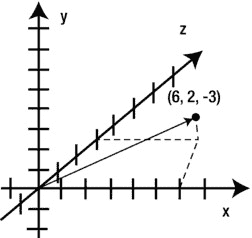
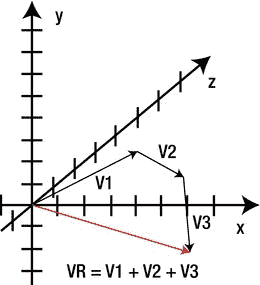
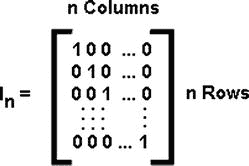

# 三、3D 数学回顾

Abstract

在这一章中，我将介绍向量和矩阵。向量和矩阵是 3D 游戏编程的关键，例如确定 3D 对象在场景中的位置以及如何将 3D 对象投影到 2D 屏幕上。向量也可用于定义速度和力等属性。我从讨论向量和可以用向量执行的操作开始。然后，我将介绍矩阵以及可以用矩阵执行的与 3D 图形相关的基本操作。最后，我将给出一个实际操作的例子，演示如何在 Android 设备上的真实 3D 图形程序中实际使用向量和矩阵。

在这一章中，我将介绍向量和矩阵。向量和矩阵是 3D 游戏编程的关键，例如确定 3D 对象在场景中的位置以及如何将 3D 对象投影到 2D 屏幕上。向量也可用于定义速度和力等属性。我从讨论向量和可以用向量执行的操作开始。然后，我将介绍矩阵以及可以用矩阵执行的与 3D 图形相关的基本操作。最后，我将给出一个实际操作的例子，演示如何在 Android 设备上的真实 3D 图形程序中实际使用向量和矩阵。

## 向量和向量运算

向量是与 3D 图形相关的基本主题。在这一节，我将介绍什么是向量以及它们的用途。我还介绍了一些重要的向量函数，比如点积和叉积。

### 什么是向量？

矢量是一个有方向和大小的量。出于本书的目的，向量将是 3D 向量，在 3D 世界中具有 x、y 和 z 方向的分量。向量可以表示位置、速度、方向、对象的旋转轴、对象的局部轴以及作用在对象上的力。在 OpenGL ES 的 Android 上，坐标系由构成地平面的 x、z 轴和表示高度的 y 轴组成(见图 3-1 )。

图 3-1。

3D vectors and the Android OpenGL ES coordinate system

#### 代表位置的向量

一个向量可以代表一个物体在 Android 3D OpenGL ES 世界中的位置。事实上，在第二章的例子中的 Orientation 类中，对象的位置是一个由 Vector3 类表示的 3D 向量。

`private Vector3 m_Position;`

从图形上看，你可以在图 3-2 中看到一个代表物体在 3D 世界中位置的矢量。

图 3-2。

Vector representing a position

#### 代表方向的向量

向量也可以表示方向。长度或大小为 1 的矢量称为单位矢量(见图 3-3 )。单位向量很重要，因为您可以设置属性，如对象的速度或作用在对象上的力，方法是首先找到您希望对象移动的方向向量的单位向量，然后将该单位向量乘以一个数字。这个数字代表物体速度的大小或你想施加在物体上的力的大小。最终矢量将包含物体的方向或力的方向以及物体的速度或施加到物体上的力的大小。

图 3-3。

Unit vector representing a direction

#### 代表旋转轴的向量

矢量也可以表示物体的旋转轴。旋转轴是物体绕其旋转的线。在第二章的中的 Orientation 类中，变量`m_RotationAxis`是物体绕其旋转的局部轴。

`private Vector3 m_RotationAxis;`

局部旋转轴的图示见图 3-4 。

图 3-4。

Vector representing a rotation axis of an object

#### 代表力的矢量

向量也可以表示力。力有方向和大小，所以很适合用矢量来表示。在图 3-5 中，你看到一个力矢量作用在一个球上。力的方向是负 x 方向。我将在本书后面更深入地讨论作用在 3D 物体上的力。更具体地说，力将在第五章“运动和碰撞”中讨论

图 3-5。

Vector representing force

#### 代表局部轴的向量

向量也可以表示对象的局部轴。图 3-6 显示了一个三维立方体对象的局部 x、y 和 z 轴。局部轴很重要，因为它们定义了对象的方向。也就是说，它们定义了对象的哪一侧被认为是向上的，对象的哪一部分是右侧，以及对象的哪一部分被认为是前面或向前的部分。例如，如果一个 3D 对象表示一个交通工具，如坦克或汽车，那么知道对象的哪一部分是前面就很好了。例如，如果您想要向前移动坦克或汽车，您将需要世界坐标中的前方或向前向量作为下一个位置计算的一部分。Orientation 类将对象的局部轴定义为`m_Right`、`m_Up`和`m_Forward`。

`// Local Axes`

`private Vector3 m_Right;`

`private Vector3 m_Up;`

`private Vector3 m_Forward;`

图 3-6。

Vectors representing local axes

### 我们的向量类

根据本书的代码，向量在 Vector3 类中表示(见清单 3-1)。

清单 3-1。Vector3 类

`class Vector3`

`{`

`public float x;`

`public float y;`

`public float z;`

`// Vector3 constructor`

`public Vector3(float _x, float _y, float _z)`

`{`

`x = _x;`

`y = _y;`

`z = _z;`

`}`

`}`

在 Vector3 类中，向量的 x、y 和 z 分量由浮点数表示。构造函数接受三个表示 3D 向量的浮点值。例如:

`Vector3 m_MyVector = new Vector3(1,2,3);`

声明一个名为`m_MyVector`的新 Vector3 类，用值 x = 1、y = 2 和 z = 3 初始化。

### 矢量幅度

向量的大小是向量的标量值，是向量的长度。回想一下，标量值是一个没有关联方向的数值。物体的速度可以用矢量来表示，它有方向和速度两个分量。速度是标量分量，通过找到矢量的大小来计算。矢量的大小通过对 x、y 和 z 分量求平方，将它们相加，然后求平方根得到(见图 3-7 )。

图 3-7。

Vector magnitude calculation

在代码中，向量的大小是由 Vector3 类中的`Length()`函数计算的，如清单 3-2 所示。

清单 3-2。长度或幅度函数

`float Length()`

`{`

`return FloatMath.sqrt(x*x + y*y + z*z);`

`}`

### 向量归一化

向量的规范化意味着向量的长度或大小变为 1，同时保持向量的方向。规范化是设置向量的好方法，例如速度和力。首先，你会在期望的方向上找到一个向量，然后你会把它规格化，把它的长度变成 1。最后，你可以将向量乘以你想赋予它的大小，比如速度或力量。为了标准化一个矢量，你用矢量的长度除矢量的每个分量(见图 3-8 )。

图 3-8。

Normalizing a vector

在代码中，Vector3 类中的`Normalize()`函数执行规范化(见清单 3-3)。

清单 3-3。`Normalize()`功能

`void Normalize()`

`{`

`float l = Length();`

`x = x/l;`

`y = y/l;`

`z = z/l;`

`}`

### 向量加法

矢量可以加在一起产生一个合成矢量，它是所有单个矢量的效果的组合。你可以把向量首尾相连，用图形方式相加。合成矢量 VR 是从起始矢量的尾部到前一个矢量的头部绘制的矢量(见图 3-9 )。

图 3-9。

Adding vectors together

代码方面，Vector3 类中的`Add()`函数将两个向量相加，返回结果向量。向量的每个分量 x、y 和 z 加在一起形成合成向量的新分量(见清单 3-4)。

清单 3-4。加法函数将两个向量相加

`static Vector3 Add(Vector3 vec1, Vector3 vec2)`

`{`

`Vector3 result = new Vector3(0,0,0);`

`result.x = vec1.x + vec2.x;`

`result.y = vec1.y + vec2.y;`

`result.z = vec1.z + vec2.z;`

`return result;`

`}`

### 矢乘法

也可以将标量值乘以向量。例如，如果您想要设置一个对象的速度，它是方向和速度的组合，您将找到一个指向所需方向的向量，将该向量规格化以使向量长度为 1，然后将该向量乘以速度。最终的合成矢量 VR 将指向期望的方向，并具有速度的大小值(见图 3-10 )。

图 3-10。

Multiplying a unit vector of length 1 with a scalar value

在代码方面，Vector3 类中的`Multiply()`函数将一个标量值乘以向量。向量的每个分量 x、y 和 z 都乘以标量值(见清单 3-5)。

清单 3-5。`Multiply`功能

`void Multiply(float v)`

`{`

`x *= v;`

`y *= v;`

`z *= v;`

`}`

#### 向量否定

向量求反意味着将向量乘以–1，也就是将向量的每个分量乘以–1。基本上，矢量的方向是相反的。看看图 3-11 ，看看这是什么样的图形。

图 3-11。

Vector negation

在代码方面，Vector3 类中的`Negate()`函数执行求反(见清单 3-6)。

清单 3-6。`Negate`功能

`void Negate()`

`{`

`x = -x;`

`y = -y;`

`z = -z;`

`}`

### 直角三角形

当试图将向量分解成分量时，直角三角形就派上了用场。例如，如果你知道坦克炮弹的速度和炮弹轨迹与地面形成的角度，那么你就可以得到坦克炮弹的水平和垂直速度。水平速度可以用直角三角形邻边的公式来计算。垂直速度可以用三角形对边的公式来计算。我们来复习一下与直角三角形相关的基本三角恒等式，如图 3-12 所示。

图 3-12。

The right triangle

以下是标准三角恒等式的列表，描述了直角三角形各边的长度与图 3-12 中所示的角度θ之间的关系:

*   sin(θ)=对边/斜边
*   cos(θ)=邻边/斜边
*   相反=斜边* Sin(θ)
*   相邻=斜边* Cos(θ)

### 向量点积

两个矢量的矢量点积是矢量 A 的幅值乘以矢量 B 的幅值乘以它们之间角度的余弦。点积通常用于计算两个向量之间的角度。点积的一个应用是在广告牌上，一个上面有复杂图像(如一棵树)的 2D 矩形被转向面向摄像机。这是一种实现类似 3D 效果的方法，方法是让图像始终面向摄像机。如果使用复杂的背景图像，例如一棵树，当从不同角度观看时，观众可能不会注意到这是同一幅图像(见图 3-13 )。

图 3-13。

Dot product formula

你也可以用点积求出两个向量之间的角度。两个向量之间的角度是其余弦由向量 A 和向量 B 的点积除以向量 A 的大小，再乘以向量 B 的大小给出的角度(见图 3-14 )。

图 3-14。

Finding angle from dot product

你可以通过归一化两个向量，然后取点积，来简化上面的等式。分母变成 1，角度是矢量 A 和矢量 b 的点积的反余弦。

通过将向量 A 中的每个分量乘以向量 B 中的相应分量，并将结果相加，可以直接从向量中获得点积。诸如

`Dot Product = (Ax * Bx) + (Ay * By) + (Az * Bz)`

清单 3-7 给出了实现这一点的 Java 代码。

清单 3-7。`DotProduct`功能

`float DotProduct(Vector3 vec)`

`{`

`return (x * vec.x) + (y * vec.y) + (z * vec.z);`

`}`

### 向量叉积

两个矢量 A 和 B 的叉积是垂直于 A 和 B 的第三个矢量(见图 3-15 )。叉积可用于广告牌等应用，在这些应用中，您需要找到一个旋转轴，并知道代表图像正面的向量和指向您要转向的对象的向量。清单 3-8 中的代码计算了叉积。

图 3-15。

Cross product

清单 3-8。`Cross Product`功能

`void crossProduct(Vector3 b)`

`{`

`Set((y*b.z) - (z*b.y),`

`(z*b.x) - (x*b.z),`

`(x*b.y) - (y*b.x));`

`}`

## 矩阵和矩阵运算

在这一节中，我将介绍矩阵和矩阵运算。我首先讨论矩阵的定义。然后，我将介绍与矩阵数学相关的各种关键主题以及矩阵的关键属性，因为它们与在 Android 移动平台上开发 3D 游戏所需的 3D 计算机图形相关。本节并不打算涵盖矩阵的每个方面，而是一个矩阵和矩阵数学运算的快速入门指南，对 3D 游戏编程至关重要。

### 什么是矩阵？

矩阵是三维图形的关键。它们用于确定 3D 对象的最终位置、3D 对象的旋转和 3D 对象的缩放等属性。图 3-16 中定义了一个矩阵。矩阵由数字的列和行组成。我们将使用的一般符号是 Amn。下标 m 表示行号，n 表示列号。例如，A23 表示第 2 行第 3 列的数字。

图 3-16。

Definition of a matrix

就代码而言，我们将矩阵表示为 16 个元素的浮点数组。这转化为 4×4 矩阵；即，具有四行四列的矩阵。下面声明了一个 float 类型的 4x 4 矩阵(总共 16 个元素),该矩阵对于它所在的类是私有的:

`private float[] m_OrientationMatrix = new float[16];`

### 内置 Android 矩阵类

标准 Android 类库中有一个矩阵类，提供了很多矩阵函数。您可以使用以下 import 语句来访问该类:

`import android.opengl.Matrix;`

### 单位矩阵

单位矩阵是一个正方形矩阵，具有相等数量的行和列，对角线上包含 1，其余的值设置为 0。单位矩阵可用于初始化或重置矩阵变量的值。乘以单位矩阵的矩阵返回原始矩阵。这相当于将一个数乘以 1。例如，假设你有一个跟踪物体旋转的矩阵。为了将对象重置回其原始旋转，您需要将矩阵设置为单位矩阵(见图 3-17 )。

图 3-17。

The identity matrix

就代码而言，您可以使用以下语句将矩阵设置为单位矩阵:

`//static void setIdentityM(float[] sm, int smOffset)`

`Matrix.setIdentityM(m_OrientationMatrix, 0);`

浮动数组`m_OrientationMatrix`中包含的矩阵将被设置为单位矩阵。数组中相对于矩阵数据的起始位置有 0 偏移。

### 矩阵转置

通过将矩阵的行重写为列来创建矩阵的转置。你将不得不使用矩阵转置来计算法线矩阵的值，该矩阵用于照明(见图 3-18 )。

图 3-18。

Matrix transpose

以下代码语句转置一个 4x 4 矩阵`m_NormalMatrixInvert`，并将结果放入`m_NormalMatrix`。两个矩阵的数据中的偏移量都是 0。

`//static void transposeM(float[] mTrans, int mTransOffset,`

`//                       float[] m, int mOffset)`

`Matrix.transposeM(m_NormalMatrix, 0, m_NormalMatrixInvert, 0);`

### 矩阵乘法

矩阵 A 和矩阵 B 的矩阵乘法是通过将 A 的行中的元素乘以 B 的列中的相应元素并将乘积相加来完成的。矩阵乘法在平移对象、旋转对象、缩放对象和在 2D 屏幕上显示 3D 对象时是必不可少的。比如图 3-19 中，矩阵 A 正在乘以矩阵 B，结果放入矩阵 c。

图 3-19。

Matrix multiplication

`C11 = (A11 * B11) + (A12 * B21) + (A13 * B31)`

`C12 = (A11 * B12) + (A12 * B22) + (A13 * B32)`

`C21 = (A21 * B11) + (A22 * B21) + (A23 * B31)`

`C22 = (A21 * B12) + (A22 * B22) + (A23 * B32)`

在代码中，使用位于标准 Android 内置 Matrix 类中的`multiplyMM()`函数。这个函数将两个 4x 4 矩阵相乘，并将结果存储在第三个 4x 4 矩阵中。以下语句将`m_PositionMatrix`乘以`m_RotationMatrix`，并将结果放入`TempMatrix`。矩阵数据的所有数组偏移量都是 0。

`//static void multiplyMM(float[] result, int resultOffset,`

`//                       float[] lhs, int lhsOffset,`

`//                       float[] rhs, int rhsOffset)`

`Matrix.multiplyMM(TempMatrix, 0, m_PositionMatrix, 0, m_RotationMatrix, 0);`

### 矩阵求逆

如果矩阵 A 是 n 行 n 列，并且存在另一个也是 n 行 n 列的矩阵 B，使得 AB =单位矩阵，BA =单位矩阵，那么 B 是 A 的逆。这是矩阵逆的定义。

在代码中，您可以使用函数`invertM()`来寻找 4x 4 矩阵的逆矩阵。您必须使用矩阵求逆来计算法线矩阵的值，该矩阵用于计算 3D 对象的光照。以下代码反转`m_NormalMatrix`并将结果存储在`m_NormalMatrixInvert`中。

`//static boolean invertM(float[] mInv, int mInvOffset,`

`//                       float[] m, int mOffset)`

`Matrix.invertM(m_NormalMatrixInvert, 0, m_NormalMatrix, 0);`

### 齐次坐标

齐次坐标是射影几何中使用的坐标系。它们指定 3D 世界中的点。齐次坐标很重要，因为它们用于构建发送到顶点着色器的矩阵，以平移、旋转和缩放 3D 对象的顶点。OpenGL 在内部将所有坐标表示为 3D 齐次坐标。我们在本章前面用来指定点的坐标系是欧几里得坐标系中的笛卡尔坐标系。

齐次坐标的一般形式是(x，y，z，w)。齐次坐标中的点可以通过将所有坐标除以 w 坐标来转换为正常的 3D 欧几里得空间坐标。例如，给定齐次坐标(x，y，z，w)中的点，3D 欧氏空间中的点是(x/w，y/w，z/w)。

由(x，y，z)表示的 3D 欧几里得空间中的点可以在齐次空间中由(x，y，z，1)表示。

我们将在第四章“使用 OpenGL ES 2.0 的 3D 图形”中更深入地讨论 OpenGL ES 2.0 顶点和片段着色器

### 使用矩阵移动对象

矩阵可以用来做很多事情，例如平移对象、旋转对象、缩放对象以及将 3D 对象投影到 2D 屏幕上。用于在 3D 世界中移动对象的矩阵称为平移矩阵。在图 3-20 中，新位置是通过将旧位置转换成齐次坐标，从这个齐次坐标创建一个矩阵，然后乘以平移矩阵来计算的。值 Tx、Ty、Tz 表示在平面上沿 x、y 和 z 方向移动对象的量。使用矩阵乘法来查找新的 x、y 和 z 坐标会产生以下结果:

`x' = x + Tx`

`y' = y + Ty`

`z' = z + Tz`

图 3-20。

Translating an object

在代码方面，我们使用`translateM()`函数将输入矩阵转换为 x、y 和 z 值。

例如，以下代码适当地转换了`m_PositionMatrix`矩阵:

`//static void    translateM(float[] m, int mOffset, float x, float y, float z)`

`//Translates matrix m by x, y, and z in place.`

`Matrix.translateM(m_PositionMatrix, 0, position.x, position.y, position.z);`

### 使用矩阵旋转对象

矩阵也用于旋转 3D 对象。图 3-21 显示了如何构建绕 x 轴旋转的旋转矩阵的一个例子。

图 3-21。

Rotation matrix

就代码而言，Matrix 类中有一个内置函数，您可以在该函数中围绕任意旋转轴旋转矩阵，旋转角度以度为单位。

`rotateM()`函数将矩阵 m 绕轴(x，y，z)旋转角度 a。您还可以指定矩阵数据开始位置的偏移量。

`//rotateM(float[] m, int mOffset, float a, float x, float y, float z)`

`//Rotates matrix m in place by angle a (in degrees) around the axis (x, y, z)`

`Matrix.rotateM(m_RotationMatrix, 0,`

`AngleIncrementDegrees,`

`m_RotationAxis.x,`

`m_RotationAxis.y,`

`m_RotationAxis.z);`

### 使用矩阵缩放对象

您也可以使用矩阵来缩放对象。正方形 4x 4 矩阵的对角线包含 x、y 和 z 方向的比例因子(见图 3-22 )。

图 3-22。

Scale matrix

就代码而言，Matrix 类中的`scaleM()`函数在 x、y 和 z 方向上缩放一个矩阵。

`//static void scaleM(float[] m, int mOffset, float x, float y, float z)`

`//Scales matrix m in place by sx, sy, and sz`

`Matrix.scaleM(m_ScaleMatrix, 0, Scale.x, Scale.y, Scale.z);`

### 组合矩阵

通过将矩阵相乘，可以将对象的平移、旋转和缩放效果结合起来。为了在游戏中渲染 3D 物体，我们需要一个关键的组合矩阵，那就是模型矩阵。模型矩阵是平移矩阵、旋转矩阵和缩放矩阵的组合，相乘后形成一个最终矩阵(见图 3-23 )。

图 3-23。

Model matrix

关于矩阵乘法，需要理解的重要一点是乘法的顺序很重要。也就是说，矩阵乘法是不可交换的。因此，AB 不等于 BA。

例如，如果你想围绕一个轴旋转一个对象，然后平移它，你需要在右手边有旋转矩阵，在左手边有平移矩阵。在代码中，如下所示:

`// Rotates object around Axis then translates it`

`// public static void multiplyMM (float[] result, int resultOffset,`

`//                                float[] lhs, int lhsOffset,`

`//                                float[] rhs, int rhsOffset)`

`//                                 Matrix A             Matrix B`

`Matrix.multiplyMM(TempMatrix, 0, m_PositionMatrix, 0, m_RotationMatrix, 0);`

`multiplyMM()`函数将两个矩阵 A 和 B 相乘。就效果而言，首先应用矩阵 B，然后应用矩阵 A。因此，上面的代码首先围绕其旋转轴旋转对象，然后将其平移到一个新位置。

因此，图 3-23 中的模型矩阵被设置为首先缩放一个对象，然后围绕其旋转轴旋转该对象，然后平移该对象。

## 动手操作示例:在 3D 空间中操纵对象

在这个动手操作的例子中，我们将集中于操纵 3D 对象的位置、旋转和缩放，以演示本章中涉及的向量和矩阵的概念。

这个例子使用了一些像前面提到的`Negate()`这样的向量函数。请确保将这些函数，以及您希望试验的其他函数添加到第二章的 Vector3 类中。你也可以在 [`apress.com`](http://apress.com/) 的源代码/下载区找到这个例子的代码。

### 构建 3D 对象的模型矩阵

Orientation 类保存 3D 对象的位置、旋转和缩放的数据。它还计算对象的模型矩阵，其中包含对象的位置、旋转和缩放信息(参见上图 3-23 )。

模型矩阵在我们的代码中称为`m_OrientationMatrix`。`m_PositionMatrix`是平移矩阵；`m_RotationMatrix`是我们的旋转矩阵；而`m_ScaleMatrix`就是我们的规模矩阵。我们也有一个`TempMatrix`用于矩阵的临时存储。

`SetPositionMatrix()`函数首先通过调用`setIdentity()`将矩阵初始化为单位矩阵，然后通过调用作为标准 Android 库一部分的默认矩阵类中的`translateM()`来创建转换矩阵，从而创建转换矩阵。

`SetScaleMatrix()`函数通过首先将矩阵初始化为单位矩阵，然后从矩阵类库中调用`scaleM()`来创建比例矩阵，从而创建比例矩阵。

`UpdateOrientation()`函数实际上构建了模型矩阵。

It first creates the translation matrix by calling `SetPositionMatrix()`.   Next, `SetScaleMatrix()` is called to create the Scale Matrix.   Then, the final model matrix starts to be built by calling `Matrix.multiplyMM()` to multiply the translation matrix by the rotation matrix.   Finally, the result matrix from step 3 is multiplied by the scale matrix and then returned to the caller of the function. The net result is that a matrix is created that first scales a 3D object, then rotates it around its axis of rotation, and then finally puts it into the 3D world at a location specified by `m_Position` (see Listing 3-9).  

清单 3-9。在定向类中构建模型矩阵

`// Orientation Matrices`

`private float[] m_OrientationMatrix = new float[16];`

`private float[] m_PositionMatrix = new float[16];`

`private float[] m_RotationMatrix = new float[16];`

`private float[] m_ScaleMatrix = new float[16];`

`private float[] TempMatrix = new float[16];`

`// Set Orientation Matrices`

`void SetPositionMatrix(Vector3 position)`

`{`

`// Build Translation Matrix`

`Matrix.setIdentityM(m_PositionMatrix, 0);`

`Matrix.translateM(m_PositionMatrix, 0, position.x, position.y, position.z);`

`}`

`void SetScaleMatrix(Vector3 Scale)`

`{`

`// Build Scale Matrix`

`Matrix.setIdentityM(m_ScaleMatrix, 0);`

`Matrix.scaleM(m_ScaleMatrix, 0, Scale.x, Scale.y, Scale.z);`

`}`

`float[] UpdateOrientation()`

`{`

`// Build Translation Matrix`

`SetPositionMatrix(m_Position);`

`// Build Scale Matrix`

`SetScaleMatrix(m_Scale);`

`// Then Rotate object around Axis then translate`

`Matrix.multiplyMM(TempMatrix, 0, m_PositionMatrix, 0, m_RotationMatrix, 0);`

`// Scale Object first`

`Matrix.multiplyMM(m_OrientationMatrix, 0, TempMatrix, 0, m_ScaleMatrix, 0);`

`return m_OrientationMatrix;`

`}`

### 将旋转添加到对象

使用第二章中的“Hello Droid”项目，让我们用代码来演示矢量和矩阵如何在 Android 的 OpenGL ES 2.0 上工作。

在 MyGLRenderer 类的`onDrawFrame()`函数中，确保

`m_Cube.m_Orientation.AddRotation(1)`

语句未被注释。这将在每次执行`onDrawFrame()`时增加 1 度的旋转，这将是连续的(见清单 3-10)。

清单 3-10。`onDrawFrame()`MyGLRenderer 中的函数

`@Override`

`public void onDrawFrame(GL10 unused)`

`{`

`GLES20.glClearColor(0.0f, 0.0f, 0.0f, 1.0f);`

`GLES20.glClear( GLES20.GL_DEPTH_BUFFER_BIT | GLES20.GL_COLOR_BUFFER_BIT);`

`m_Camera.UpdateCamera();`

`m_Cube.m_Orientation.AddRotation(1);`

`m_Cube.DrawObject(m_Camera, m_PointLight);`

`}`

`AddRotation()`函数是 Orientation 类的一部分，如清单 3-11 所示。

清单 3-11。`AddRotation()`定位类中的功能

`void AddRotation(float AngleIncrementDegrees)`

`{`

`m_RotationAngle += AngleIncrementDegrees;`

`//rotateM(float[] m, int mOffset, float a, float x, float y, float z)`

`//Rotates matrix m in place by angle a (in degrees) around the axis (x, y, z)`

`Matrix.rotateM(m_RotationMatrix, 0,`

`AngleIncrementDegrees,`

`m_RotationAxis.x,`

`m_RotationAxis.y,`

`m_RotationAxis.z);`

`}`

这里发生的是对象要旋转的角度被加到变量`m_RotationAngle`中，该变量保存对象的当前旋转角度。然后修改旋转矩阵`m_RotationMatrix`，以反映新角度增量的增加。运行程序，你会看到立方体旋转，如图 3-24 所示。

图 3-24。

Cube rotating

### 在 3D 空间中移动对象

现在，我们将引导你沿着 z 轴来回移动立方体。因为 z 轴正对着你，立方体会变大变小。

首先，我们应该停止立方体的旋转。注释掉`AddRotation()`函数，如清单 3-12 所示。

接下来，将`m_CubePositionDelta`变量添加到 MyGLRenderer 类中。该变量保存每次调用`onDrawFrame()`时将应用于立方体的位置变化的方向和幅度。

新代码的关键部分执行实际的位置更新、边界测试和`m_CubePositionDelta`变量方向的改变。

该代码执行以下操作:

Gets the current position of the cube.   Tests the position to see if it is within the z position 4 to –4\. If the cube is outside these boundaries, then the cube’s direction is reversed. That is, the `m_CubePositionDelta` vector is negated.   The current position vector of the cube is added to the `m_CubePositionDelta` vector and then set as the new position of the cube.  

添加清单 3-10 中突出显示的新代码并运行程序。

清单 3-12。添加代码以沿 Z 轴移动立方体

`private Vector3 m_CubePositionDelta = new Vector3(0.0f,0,0.1f);`

`@Override`

`public void onDrawFrame(GL10 unused)`

`{`

`GLES20.glClearColor(0.0f, 0.0f, 0.0f, 1.0f);`

`GLES20.glClear( GLES20.GL_DEPTH_BUFFER_BIT | GLES20.GL_COLOR_BUFFER_BIT);`

`m_Camera.UpdateCamera();`

`// Add Rotation to Cube`

`//m_Cube.m_Orientation.AddRotation(1);`

`// Add Translation to Cube`

`Vector3 Position = m_Cube.m_Orientation.GetPosition();`

`if ((Position.z > 4) || (Position.z < -4))`

`{`

`m_CubePositionDelta.Negate();`

`}`

`Vector3 NewPosition  = Vector3.Add(Position, m_CubePositionDelta);`

`Position.Set(NewPosition.x, NewPosition.y, NewPosition.z);`

`m_Cube.DrawObject(m_Camera, m_PointLight);`

`}`

你应该会看到机器人的图像在一个循环中来回移动(见图 3-25 )。

图 3-25。

Translating an object on z axis

### 缩放对象

在这里，我将涵盖缩放对象。首先在之前添加的`m_CubePositionDelta`变量条目下添加以下语句。

`private Vector3 m_CubeScale = new Vector3(4,1,1);`

`m_CubeScale`变量代表在 x、y 和 z 方向缩放对象的数量。在此示例中，立方体在局部 x 轴方向上按正常大小的四倍缩放，在 y 和 z 方向上按正常大小(1)缩放。

以下语句设置立方体的比例。在您添加的前一个代码后，将此输入到`onDrawFrame()`函数中。

`// Set Scale`

`m_Cube.m_Orientation.SetScale(m_CubeScale);`

运行程序，您应该会看到图 3-26 中的内容。

图 3-26。

Scaling in the x direction

尝试代码。我做了一些修改，改变了背景颜色以及平移的方向(沿对角线来回移动)和缩放(见图 3-27 )。

图 3-27。

Experimenting with the code

看看你能否复制这些变化。

## 摘要

在这一章中，我讲述了与向量和矩阵相关的 3D 数学基础。我首先介绍了向量和与向量相关的运算，比如加法、乘法、点积和叉积。接下来，我讲述了矩阵和涉及矩阵的运算，比如矩阵乘法，这是 3D 游戏编程的基本要素。最后，我给出了一个实际例子，演示了向量和矩阵在平移、旋转和缩放 3D 对象中的实际应用。