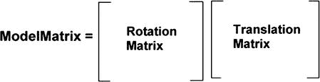
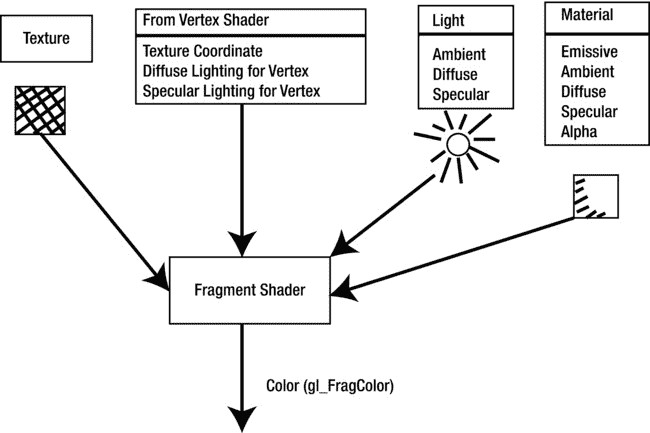

# 四、使用 OpenGL ES 2.0 的 3D 图形

Abstract

在这一章中，我们将看看 Android 版 OpenGL ES 2.0 的 3D 图形。我首先给你一个关于 OpenGL 如何渲染 3D 物体的概述。接下来，我将使用矩阵数学、矩阵变换以及顶点和片段着色器来更详细地介绍这是如何实现的。然后，我将介绍用于顶点和片段着色器的着色器语言，并给你一个语言和一些例子的快速回顾。

在这一章中，我们将看看 Android 版 OpenGL ES 2.0 的 3D 图形。我首先给你一个关于 OpenGL 如何渲染 3D 物体的概述。接下来，我将使用矩阵数学、矩阵变换以及顶点和片段着色器来更详细地介绍这是如何实现的。然后，我将介绍用于顶点和片段着色器的着色器语言，并给你一个语言和一些例子的快速回顾。

接下来，我将介绍演示 OpenGL ES 2.0 概念的自定义类，这些概念对于渲染 3D 图形至关重要，它们是

*   着色器类
*   相机类
*   MeshEx 类
*   点光源类别
*   材料类别
*   纹理类别

## Android 上的 OpenGL ES 2.0 概述

在这一节中，我首先介绍在 OpenGL 中渲染 3D 对象的一般概念。然后我进入更多的细节，包括将一个 3D 对象从我们的 3D 虚拟世界转换到平面屏幕上的 2D 图像所需的确切步骤。

### OpenGL 对象渲染概述

本节将讨论在 OpenGL 中渲染 3D 对象的一般过程。以下常规步骤用于在 OpenGL 中将 3D 对象渲染到最终的查看窗口。

图 4-4。

Viewport transformation Transfer the projected view onto the final viewport for viewing: Take the 2D image generated from the projection shown in Figure 4-3 and resize it to fit the final viewport (see Figure 4-4).  

图 4-3。

Using a frustrum to project the 3D view onto a 2D surface Project the 3D view onto a 2D surface using a specific camera lens: For the examples in this book, we use a frustrum, in which objects that are farther away are smaller than objects that are closer to the viewer. A frustrum is basically a pyramid with the top capstone cut off (see the section entitled “Building the Projection Matrix” later in this chapter for a more detailed description). The frustrum also defines which objects are included in the final view. In Figure 4-3, only the pyramid is included in the final view, because it is the only object included in the frustrum volume.  

图 4-2。

Placing the camera or viewer into the world Place camera into the world: Place the viewer, which you can think of as a camera or as a human eye, into the 3D world (see Figure 4-2 ).  

图 4-1。

Putting 3D objects into the world Put 3D objects in the world: Place the 3D objects you are going to use in the 3D world (see Figure 4-1 ).  

### 渲染过程的具体概述

让我们更详细地讨论如何使用 OpenGL ES 2.0 在屏幕上渲染 3D 对象。矩阵变换和顶点和片段着色器都包括在内。

#### 变换 3D 对象的顶点

在这一节中，我将详细讨论如何在屏幕上放置一个 3D 对象。为了在屏幕上显示 3D 对象，我们必须转换对象的每个顶点坐标，考虑对象在世界中的位置、摄像机的位置和方向、投影类型和视口规格(见图 4-5 )。请记住，坐标是(x，y，z)格式，但在内部以齐次顶点格式表示，即(x，y，z，1)。这就是为什么在 OpenGL 中需要 4 乘 4 的矩阵来转换一个顶点。

图 4-5。

Vertex transformation procedure

##### 构建模型矩阵

你需要建立的第一件事是把 3D 物体放入 3D 世界的模型矩阵；也就是说，将模型从最初定义对象的局部对象坐标转换到世界坐标。通过设置平移、旋转和缩放矩阵，然后将它们与对象坐标中的原始顶点相乘，可以实现这一点。这将把对象转换到您想要放置的位置。如果你愿意，它还可以旋转和缩放矩阵。

正如前面在第三章提到的，矩阵乘法的顺序是关键。矩阵乘法是不可交换的，乘法的顺序确实很重要。例如，假设我们想先旋转对象，然后沿 x 轴平移它，如图 4-6 所示。

图 4-6。

Rotate then translate object

其模型矩阵的形式如图 4-7 所示。

图 4-7。

Model matrix form for rotating then translating an object

请注意乘法的顺序，旋转矩阵首先应用于对象的顶点，然后应用平移矩阵。

再举一个例子，你想平移然后绕轴旋转物体(见图 4-8 )。

图 4-8。

Object is translated and then rotated around the rotation axis

这种情况下模型矩阵的一般格式如图 4-9 所示。

图 4-9。

Model matrix for object that is translated then rotated

##### 构建视图矩阵

默认情况下，OpenGL 的相机视图位于原点，镜头指向 z 轴的负方向。相机可以在 3D 世界的任何地方移动和旋转。这实际上意味着相机是静止的，但是对象顶点被平移和旋转以模拟相机的移动。完成这项工作的矩阵称为视图矩阵。产生的坐标称为眼睛坐标。

在 Android 中有一个简单的方法可以做到这一点，那就是使用`Matrix.setLookAtM()`函数，该函数根据相机或眼睛的位置生成一个视图矩阵；照相机的中心，视图聚焦的地方；和照相机的向上方向。相机类代表我们的相机，图 4-10 显示了指定相机方向的上、中和右向量。

图 4-10。

Camera or eye

清单 4-1 用代码展示了如何在我们的 Camera 类的`SetCameraView()`函数中创建视图矩阵。

清单 4-1。在 Camera 类中设置视图矩阵

`void SetCameraView(Vector3 Eye,`

`Vector3 Center,`

`Vector3 Up)`

`{`

`// Create Matrix`

`Matrix.setLookAtM(m_ViewMatrix,0,`

`Eye.x, Eye.y, Eye.z,`

`Center.x, Center.y, Center.z,`

`Up.x, Up.y, Up.z);`

`}`

##### 构建投影矩阵

投影矩阵将 3D 对象顶点变换到 2D 观察表面上。对于 3D 游戏编程，我们需要使用截头圆锥体将 3D 图像投影到 2D 曲面上。如前所述，截头锥体是一个形状类似于顶部顶点被切掉的金字塔的观察区域。它由六个裁剪平面定义，分别命名为顶、底、右、左、近和远，如图 4-11 所示。通过使用平截头体，离观察者较近的物体比较远的物体大。平截头体还将观察区域限制在平截头体内的区域，并排除平截头体外的顶点。顶点从世界坐标转换到剪辑坐标。

图 4-11。

The projection frustrum

代码方面，Camera 类中的函数`SetCameraProjection()`创建投影矩阵，并将其放入`m_ProjectionMatrix`变量中。参见清单 4-2。

清单 4-2。在 Camera 类中构建投影矩阵

`void SetCameraProjection(float Projleft,`

`float Projright,`

`float Projbottom,`

`float Projtop,`

`float Projnear,`

`float Projfar)`

`{`

`m_Projleft   = Projleft;`

`m_Projright  = Projright;`

`m_Projbottom = Projbottom;`

`m_Projtop    = Projtop;`

`m_Projnear   = Projnear;`

`m_Projfar    = Projfar;`

`Matrix.frustumM(m_ProjectionMatrix, 0,`

`m_Projleft, m_Projright,`

`m_Projbottom, m_Projtop,`

`m_Projnear, m_Projfar);`

`}`

##### 设置视口

视口变换将从投影矩阵生成的 2D 图像映射到实际的观察窗。它水平或垂直拉伸图像，使其适合视窗。`glViewport()`功能设置视窗规格。它位于 Renderer 类的`onSurfacedChanged()`函数中。在《??》第三章的例子中，那将是 MyGLRenderer 类。在 Android 上，设置最终视口规格的确切语句如下:

`GLES20.``glViewport`

前两个参数指定视口的左下角坐标。接下来的两个参数指定视口的宽度和高度。

#### 将矩阵和照明信息发送到顶点和片段着色器

接下来，您必须将矩阵实际发送到 OpenGL ES 2.0 用来渲染 3D 对象的顶点和片段着色器。

顶点着色器使用前面几节中提到的模型、视图和投影矩阵变换将对象的顶点放置到 3D 世界中。它们还可以确定顶点处的漫反射和镜面反射照明，并将此信息传递给片段着色器。

片段或像素着色器实际上决定了顶点的最终颜色。在片段着色器中，对象的纹理、光照和材质属性都可以提供最终颜色的输入。然后，整个对象的颜色可以从这些顶点颜色进行插值。

在我们的代码框架中，顶点和片段着色器都在 Shader 类中表示。

在 Shader 类中，`GLES20.glUniformXXXX()`系列函数实际上负责将矩阵、照明和材质属性数据发送到顶点和片段着色器。

我将在本章的后面讨论照明和材质。

#### 渲染场景

接下来，我们必须实际渲染场景。我们在渲染器类 MyGLRenderer 的`onDrawFrame()`函数中渲染场景。实际进行渲染的代码语句是

`m_Cube.DrawObject(m_Camera, m_PointLight);`

`DrawObject()`位于 Object3d 类中，接受两个参数作为输入:摄像机和用于照亮场景的点光源。

在这一章的后面，我将会更详细地介绍绘制对象的 OpenGL 特定函数。

## OpenGL ES 2.0 着色语言概述

本节列出了 OpenGL ES 2.0 中用于顶点和像素着色器的着色器语言的基础知识。它并不意味着是该语言各个方面的完整参考指南，而是一个快速概述。本节的目的是让你熟悉这门语言的基础。如果你想了解更多关于着色器语言的细节，请访问网站 [`www.khronos.org/registry/gles/`](http://www.khronos.org/registry/gles/) 。

### 基本数据类型

OpenGL ES 2.0 着色器语言的基本数据类型有:

*   void:没有函数返回值
*   布尔值：布尔值
*   int:有符号整数
*   float:浮动标量
*   vec2、vec3、vec4: 2、3 和 4 分量浮点向量
*   bvec2、bvec3、bvec4: 2、3 和 4 分量布尔向量
*   ivec2、ivec3、ivec4: 2、3 和 4 分量有符号整数向量
*   mat2、mat3、mat4: 2 乘 2、3 乘 3 和 4 乘 4 浮点矩阵
*   sampler2D:用于表示和访问 2D 纹理
*   samplerCube:用于表示和访问立方体贴图纹理
*   float floatarray[3]:一维数组；可以是浮点、向量和整数等类型

### 向量分量

在顶点和片段着色器语言中，可以用不同的方式引用向量组件。例如，可以通过以下方式对 vec4 类型中的组件进行寻址:

*   {x，y，z，w}:当访问表示点或法线的向量时，可以使用这种表示。

`vec3 position;`

`position.x = 1.0f;`

*   {r，g，b，a}:当访问表示颜色的向量时，可以使用这种表示。

`vec4 color;`

`color.r = 1.0f;`

*   {s，t，p，q}:当访问表示纹理坐标的向量时，可以使用这种表示。

`vec2 texcoord;`

`texcoord.s = 1.0f;`

### 运算符和表达式

下面列出了顶点和片段着色器语言中的语句和表达式所涉及的一些重要运算符。这些运算符基本上类似于 Java 和 C++ 语言中的相应运算符。

*   `++`增量运算符
*   `--`减量运算符
*   `+`加法运算符
*   `-`减法运算符
*   `!`非运算符
*   `*`乘法运算符
*   `/`除以运算符
*   `<`小于关系运算符
*   `>`大于关系运算符
*   `<=`小于或等于关系运算符
*   `>=`大于或等于关系运算符
*   `==`条件等于运算符
*   `!=`不等于条件运算符
*   `&&`逻辑与运算符
*   `^^`逻辑异或运算符
*   `||`逻辑“或”运算符
*   `=`赋值运算符
*   `+=`加法和赋值运算符
*   `-=`减法和赋值运算符
*   `*=`乘法和赋值运算符
*   `/=`除法和赋值运算符

### 程序流控制语句

OpenGL ES 2.0 着色器语言的重要程序流控制语句如下。

*   for 循环:要使用一个`for`循环，在开始循环之前初始化计数器值；如果表达式的计算结果为 true，则执行循环；在循环结束时，更新计数器值；如果`for`循环中的表达式计算结果为真，则重复该循环。

`for(Initial counter value;`

`Expression to be evaluated;`

`Counter increment/decrement value)`

`{`

`// Statements to be executed.`

`}`

*   while 循环:执行`while`循环中的语句，只要待求值的表达式为真。

`while( Expression to evaluate )`

`{`

`// Statement to be executed`

`}`

*   if 语句:如果表达式的值为 true，那么执行`if`块中的语句。

`if (Expression to evaluate )`

`{`

`// Statements to execute`

`}`

*   `if else`语句:执行`if`块中的语句；如果表达式的计算结果为`true else`，则执行`else`块中的语句。

`if (Expression to evaluate)`

`{`

`// Statement to execute if expression is true`

`}`

`else`

`{`

`// Statement to execute if expression is false`

`}`

### 存储限定符

存储限定符指示变量将如何在着色器程序中使用。根据这些信息，编译器可以更有效地处理和存储着色器变量。

*   const:const 限定符指定一个编译时常数或只读函数参数。

`Const int NumberLights = 3;`

*   属性:属性限定符为逐顶点数据指定了顶点着色器和主 OpenGL ES 2.0 程序之间的链接。可以使用属性限定符的变量类型的一些例子是顶点位置、顶点纹理和顶点法线。

`attribute vec3 aPosition;`

`attribute vec2 aTextureCoord;`

`attribute vec3 aNormal;`

*   uniform:uniform 限定符指定值不会在被处理的原语中改变。统一变量形成了顶点或片段着色器与主 OpenGL ES 2.0 应用之间的链接。适用统一限定符的变量示例包括照明值、材质值和矩阵。

`uniform vec3 uLightAmbient;`

`uniform vec3 uLightDiffuse;`

`uniform vec3 uLightSpecular;`

*   varying:varying 限定符指定一个同时出现在顶点着色器和片段着色器中的变量。这为插值数据创建了顶点着色器和片段着色器之间的链接。这些通常是将从顶点着色器传递到片段着色器的漫反射和镜面反射照明的值。纹理坐标(如果存在的话)也是变化的。漫反射和镜面反射照明以及纹理的值会在着色器渲染的对象中进行插值或“变化”。可变变量的一些例子是顶点纹理坐标、顶点的漫反射颜色和顶点的镜面反射颜色。

`varying vec2 vTextureCoord;`

`varying float vDiffuse;`

`varying float vSpecular;`

### 保留变量

我们将在本书中使用的 OpenGL ES 2.0 着色器语言中的主要重要保留变量名在以下列表中指定。

*   vec4 gl_Position:顶点着色器中的保留变量，用于保存要在屏幕上显示的最终转换顶点
*   vec4 gl_FragColor:片段着色器中的保留变量，保存刚刚由顶点着色器处理的顶点的颜色

### 内置函数

这个列表提供了着色语言中一些重要的内置函数。

*   浮点弧度(浮点度数):将度数转换为弧度并返回弧度
*   浮点度数(浮点弧度):将弧度转换为度数并返回度数
*   float sin(浮点角度):返回以弧度度量的角度的正弦值
*   float cos(float angle):返回以弧度度量的角度的余弦值
*   float tan(float angle):返回以弧度度量的角度的正切值
*   float asin(float x):返回正弦为 x 的角度
*   float acos(float x):返回余弦值为 x 的角度
*   float atan(float y，float x):返回其切线由斜率 y/x 指定的角度
*   float atan(float slope):返回切线为坡度的角度
*   浮点 abs(浮点 x):返回 x 的绝对值
*   浮点长度(vec3 x):返回向量 x 的长度
*   浮动距离(vec3 点 0，vec3 点 1):返回点 0 和点 1 之间的距离
*   float dot(vec3 x，vec3 y):返回两个向量 x 和 y 之间的点积
*   vec3 cross(vec3 x，vec3 y):返回两个向量 x 和 y 的叉积
*   vec3 normalize(vec3 x):将向量规范化为长度为 1，然后返回它
*   float pow(float x，float y):计算 x 的 y 次方并返回它
*   float min(float x，float y):返回 x 和 y 之间的最小值
*   float max(float x，float y):返回 x 和 y 之间的最大值

## 顶点着色器概述

在 OpenGL ES 2.0 中，渲染 3D 对象需要顶点着色器和片段着色器。顶点着色器的一般用途是在 3D 世界中定位顶点，并确定顶点属性，如该顶点的漫反射和镜面反射照明。清单 4-3 给出了一个简单的顶点着色器例子。

清单 4-3。简单顶点着色器

`// Vertex Shader`

`uniform mat4 uMVPMatrix;`

`attribute vec3 aPosition;`

`uniform vec3 vColor;`

`varying vec3 Color;`

`void main()`

`{`

`gl_Position = uMVPMatrix * vec4(aPosition,1);`

`Color = vColor;`

}

变量`uMVPMatrix`保存将用于转换顶点的 4x 4 ModelViewProjection 矩阵。模型视图投影矩阵是模型矩阵、视图矩阵和投影矩阵的简单乘积，形成一个矩阵。使用统一限定符，因为该矩阵在呈现对象时不会改变。也就是说，相同的矩阵用于正在渲染的对象上的所有顶点。

`aPosition`变量是一个向量，保存对象顶点在其初始局部对象坐标中的(x，y，z)位置。属性限定符表示该变量将从主 OpenGL ES 2.0 应用接收输入。这就是顶点着色器程序被发送顶点数据的方式。

`vColor`变量是一个向量，保存要渲染的对象的(r，g，b)输入颜色值。

`vColor`被复制到`Color`变量中，并发送到片段着色器进行处理。链接到片段着色器的变量必须声明为 varying。

主代码本身位于`main()`块内。`gl_Position`变量是一个保留变量，它通过将顶点的位置乘以 uMVPMatrix (ModelViewProjection 矩阵)来转换顶点。这将产生 3D 顶点在 2D 表面上的投影，并将顶点放在剪辑坐标中。另外，注意如何通过使用`vec4(aPosition,1)`构造函数将`vec3`转换为`vec4`。

### 复杂的顶点着色器

前面的顶点示例着色器非常简单。更复杂的顶点着色器如图 4-12 所示。

发送到顶点着色器的顶点数据现在包括纹理坐标和顶点法线，以及顶点位置。

还有照明形式的新数据。灯光的世界位置和灯光的亮度被输入到顶点着色器。观察者的位置或眼睛的位置也被输入到顶点着色器中。

照明和查看器信息用于确定每个顶点的漫反射和镜面反射颜色。

片段着色器的输出包括纹理坐标、顶点的漫反射和镜面反射光照。我将在本章的后面讨论光照，包括执行光照所需的顶点和碎片着色器。

图 4-12。

Complex vertex shader

最后，在本书中，我们将实际的单个顶点和片段着色器文件存储在 res/raw 目录中。

## 片段或像素着色器概述

片段着色器用于确定渲染的 3D 对象屏幕上像素的颜色。清单 4-4 通过变化的矢量变量`Color`输出从上一节的顶点着色器传入的颜色。

清单 4-4。简单片段着色器

`// Fragment Shader`

`varying vec3 Color;`

`void main()`

`{`

`gl_FragColor = vec4(Color,1);`

`}`

`gl_FragColor`变量是一个保留变量，输出片段的实际颜色。

图 4-13 中图示了一个更复杂的片段着色器示例。在这里，纹理、纹理坐标、漫射光、镜面光、光源和对象材质都会影响被渲染对象的最终颜色。我将在本章后面更详细地讨论这些主题。

图 4-13。

Complex fragment shader

## 着色器类概述

Shader 类包含顶点和片段着色器，以及用于将数据从主应用发送到着色器程序的函数(参见图 4-14 )。

图 4-14。

Shader program overview

Shader 类持有`m_FragmentShader`中片段着色器的句柄。顶点着色器的句柄在`m_VertexShader`中。顶点着色器和片段或像素着色器附加到的主着色器程序的句柄是`m_ShaderProgram`。最后，`m_Context`保存了这个着色器对象所属的活动的引用(见清单 4-5)。这些变量都是私有的，不能在类外访问。只有类成员函数可以访问这些变量。

清单 4-5。着色器类数据

`private Context m_Context;`

`private int     m_FragmentShader;`

`private int     m_VertexShader;`

`private int     m_ShaderProgram;`

Shader 类的构造函数将顶点、片段和主着色器程序句柄初始化为 0。它还将表示实际着色器源文本文件的顶点和片段着色器资源 id 作为输入。然后用这些着色器资源 id 调用`InitShaderProgram()`函数(见清单 4-6)。

清单 4-6。着色器类构造函数

`public Shader(Context context, int VSResourceId, int FSResourceId)`

`{`

`// Shader Variables`

`m_FragmentShader = 0;`

`m_VertexShader   = 0;`

`m_ShaderProgram  = 0;`

`m_Context = context;`

`InitShaderProgram(VSResourceId, FSResourceId);`

`}`

`InitShaderProgram()`函数接收顶点和片段着色器资源 id，并创建实际的主着色器程序。

首先，通过`GLES20.glCreateProgram()`函数创建主着色器程序。

接下来，调用`InitVertexShader()`来创建顶点着色器，调用`InitFragmentShader()`来创建片段着色器。

创建两个着色器后，使用`GLES20.glLinkProgram(m_ShaderProgram)`语句将它们链接起来(见清单 4-7)。

清单 4-7。`InitShaderProgram`功能

`void InitShaderProgram(int VSResourceId, int FSResourceId)`

`{`

`m_ShaderProgram = GLES20.glCreateProgram();`

`InitVertexShader(VSResourceId);`

`InitFragmentShader(FSResourceId);`

`GLES20.glLinkProgram(m_ShaderProgram);`

`String DebugInfo = GLES20.glGetProgramInfoLog(m_ShaderProgram);`

`Log.d("DEBUG - SHADER LINK INFO ", DebugInfo);`

`}`

最后通过调用`glGetProgramInfoLog()`获取日志信息，然后通过`Log()`语句显示到 Android 日志窗口，检索并显示链接操作的日志文件。

Note

`GLES20`前缀表示该函数来自 Android 的 OpenGL ES 2.0 规范的标准实现。

清单 4-7 中的`InitShaderProgram()`函数调用了`InitVertexShader()`函数。顶点着色器源代码被读入一个名为`tempBuffer`的临时字符串缓冲区。

然后使用`glCreateShader()`函数创建一个空的顶点着色器。

接下来，使用`glShaderSource()`函数将保存源代码的`tempBuffer`与顶点着色器相关联。

然后，使用`glCompileShader()`函数编译顶点着色器本身。

接下来，通过调用`glGetShaderiv()`函数来检查编译错误状态。如果没有错误，顶点着色器被连接到主着色器程序(见清单 4-8)。

清单 4-8。`InitVertexShader()`功能

`void InitVertexShader(int ResourceId)`

`{`

`StringBuffer tempBuffer = ReadInShader(ResourceId);`

`m_VertexShader= GLES20.glCreateShader(GLES20.GL_VERTEX_SHADER);`

`GLES20.glShaderSource(m_VertexShader,tempBuffer.toString());`

`GLES20.glCompileShader(m_VertexShader);`

`IntBuffer CompileErrorStatus = IntBuffer.allocate(1);`

`GLES20.glGetShaderiv(m_VertexShader,`

`GLES20.GL_COMPILE_STATUS,`

`CompileErrorStatus);`

`if (CompileErrorStatus.get(0) == 0)`

`{`

`Log.e("ERROR - VERTEX SHADER ",`

`"Could not compile Vertex shader!! " +`

`String.valueOf(ResourceId));`

`Log.e("ERROR - VERTEX SHADER ",`

`GLES20.glGetShaderInfoLog(m_VertexShader));`

`GLES20.glDeleteShader(m_VertexShader);`

`m_VertexShader = 0;`

`}`

`else`

`{`

`GLES20.glAttachShader(m_ShaderProgram,m_VertexShader);`

`Log.d("DEBUG - VERTEX SHADER ATTACHED ", "In InitVertexShader()");`

`}`

`}`

从`InitShaderProgram()`调用`InitFragmentShader()`函数，如清单 4-7 所示。

首先，片段着色器源代码被读入并存储在`tempBuffer`字符串缓冲区中。

然后，创建一个空的片段着色器。然后，`tempBuffer`变量中的源代码被链接到刚刚创建的片段着色器。接下来，如果没有错误，着色器被编译并附加到主着色器程序(见清单 4-9)。

清单 4-9。`InitFragmentShader()`功能

`void InitFragmentShader(int ResourceId)`

`{`

`StringBuffer tempBuffer = ReadInShader(ResourceId);`

`m_FragmentShader= GLES20.glCreateShader(GLES20.GL_FRAGMENT_SHADER);`

`GLES20.glShaderSource(m_FragmentShader,tempBuffer.toString());`

`GLES20.glCompileShader(m_FragmentShader);`

`IntBuffer CompileErrorStatus = IntBuffer.allocate(1);`

`GLES20.glGetShaderiv(m_FragmentShader,`

`GLES20.GL_COMPILE_STATUS,`

`CompileErrorStatus);`

`if (CompileErrorStatus.get(0) == 0)`

`{`

`Log.e("ERROR - FRAGMENT SHADER ",`

`"Could not compile Fragment shader file =  " +`

`String.valueOf(ResourceId));`

`Log.e("ERROR - FRAGMENT SHADER ",`

`GLES20.glGetShaderInfoLog(m_FragmentShader));`

`GLES20.glDeleteShader(m_FragmentShader);`

`m_FragmentShader = 0;`

`}`

`else`

`{`

`GLES20.glAttachShader(m_ShaderProgram,m_FragmentShader);`

`Log.d("DEBUG - FRAGMENT SHADER ATTACHED ",`

`"In InitFragmentShader()");`

`}`

`}`

`ReadInShader()`函数由`InitFragmentShader()`和`InitVertexShader()`函数调用(见清单 4-10)。

清单 4-10。`ReadInShader()`功能

`StringBuffer ReadInShader(int ResourceId)`

`{`

`StringBuffer TempBuffer = new StringBuffer();`

`InputStream inputStream = m_Context.getResources().openRawResource(ResourceId);`

`BufferedReader in = new BufferedReader(new InputStreamReader(inputStream));`

`try`

`{`

`String read = in.readLine();`

`while (read != null)`

`{`

`TempBuffer.append(read + "\n");`

`read = in.readLine();`

`}`

`}`

`catch (Exception e)`

`{`

`//Send a ERROR log message and log the exception.`

`Log.e("ERROR - SHADER READ ERROR",`

`"Error in ReadInShader(): " +`

`e.getLocalizedMessage());`

`}`

`return TempBuffer;`

`}`

首先，创建一个新的字符串缓冲对象，名为`TempBuffer`。

接下来，使用文件的资源 id 从着色器源文件创建一个新的`InputStream`对象。这个输入流然后被用来创建一个`InputStreamReader`，它然后被用来创建一个名为`in`的`BufferedReader`对象然后使用`in`对象逐行读入着色器源代码，每一行都被添加到首先创建的`TempBuffer`字符串缓冲区中。如果出现任何错误，就会在 Eclipse IDE 的 Android LogCat 窗口中打印出一条错误消息。

最后，着色器源代码在一个`StringBuffer`对象中返回。

将 BufferedReader、InputStreamReader 和 InputStream 引入当前名称空间的导入如下:

`import java.io.BufferedReader;`

`import java.io.InputStreamReader;`

`import java.io.InputStream;`

Note

这些类是 Android 开发库中的标准，你可以在 Android 官方网站 [`http://developer.android.com`](http://developer.android.com/) 了解更多。

一旦着色器被成功创建，它就在使用前通过调用`ActivateShader()`函数被激活(见清单 4-11)。这实际上是一个包装器函数，它只是调用了`glUseProgram()`函数，这是一个标准的 OpenGL 2.0 调用。再次注意，`GLES20`前缀表示位于标准 Android 库中的标准 OpenGL 2.0 调用。

清单 4-11。激活着色器

`void ActivateShader()`

`{`

`GLES20.glUseProgram(m_ShaderProgram);`

`}`

你也可以调用`DeActivateShader()`来使一个着色器停止工作。该函数调用输入为 0 的`glUseProgram()`函数，以指示在渲染对象时不应使用任何着色器程序。这会将渲染管道设置为 OpenGL ES 1.0 的固定渲染管道。(参见清单 4-12)。

清单 4-12。停用着色器

`void DeActivateShader()`

`{`

`GLES20.glUseProgram(0);`

`}`

清单 4-13 所示的函数`GetShaderVertexAttributeVariableLocation()`用于检索用户定义的顶点着色器变量的位置，例如那些用于顶点位置、纹理坐标和法线的变量。这些位置将通过`glVertexAttribPointer()`函数绑定到实际的顶点数据流。我将在后面讨论这个用于绘制 3D 网格的函数。这个函数调用标准的 OpenGL ES 2.0 函数`glGetAttribLocation()`。

清单 4-13。获取顶点属性变量位置

`int GetShaderVertexAttributeVariableLocation(String variable)`

`{`

`return (GLES20.glGetAttribLocation(m_ShaderProgram, variable));`

`}`

要在顶点或片段着色器中设置统一变量，可以使用标准 GLES20 库中包含的`glUniformXXX`系列函数。首先，您可以用`glGetUniformLocation()`函数获得统一的变量位置索引，然后使用`glUniformXXX()`函数针对您想要设置的变量类型来设置它。

例如，在清单 4-14 中，使用`glUniform1f()`函数设置了一个值为 float 类型的统一变量。

清单 4-14。设置浮动统一着色器变量

`void SetShaderUniformVariableValue(String variable, float value)`

`{`

`int loc = GLES20.glGetUniformLocation(m_ShaderProgram,variable);`

`GLES20.glUniform1f(loc, value);`

`}`

下面清单 4-15 中的`SetShaderUniformVariableValue()`函数设置一个统一着色器`vec3`变量，将一个`Vector3`对象作为输入，并使用一个`glUniform3f()`函数来设置实际的着色器变量。和以前一样，`glGetUniformLocation()`函数从着色器程序中获取所需变量的索引。

清单 4-15。使用`Vector3`对象设置`Vector3`统一着色器变量

`void SetShaderUniformVariableValue(String variable, Vector3 value)`

`{`

`int loc = GLES20.glGetUniformLocation(m_ShaderProgram,variable);`

`GLES20.glUniform3f(loc, value.x, value.y, value.z);`

`}`

清单 4-16 中下面的`SetShaderUniformVariableValue()`函数设置了一个`vec3`着色器变量，将一个浮点数组作为输入。该函数使用浮点数组的前三个值设置`vec3`着色器变量。

清单 4-16。使用浮点数组设置`vec3`统一着色器变量

`void SetShaderUniformVariableValue(String variable, float[] value)`

`{`

`int loc = GLES20.glGetUniformLocation(m_ShaderProgram,variable);`

`GLES20.glUniform3f(loc, value[0], value[1], value[2]);`

`}`

清单 4-17 中的函数`SetShaderVariableValueFloatMatrix4Array()`设置一个统一的 4x 4 矩阵着色器变量或数组。以下代码将名为`uModelViewMatrix`的 mat4 着色器变量设置为来自浮点数组`ModelViewMatrix`的数据。count 变量设置为 1，因为只有一个 4x 4 矩阵。Transpose 设置为 false，表示将使用默认的 OpenGL 矩阵格式。Offset 是进入`ModelViewMatrix`的偏移量，矩阵数据从这里开始。

`m_Shader.SetShaderVariableValueFloatMatrix4Array("uModelViewMatrix", 1, false, ModelViewMatrix, 0);`

清单 4-17。设置统一的 Mat4 着色器变量

`void SetShaderVariableValueFloatMatrix4Array(String variable,`

`int count,`

`boolean transpose,`

`float[] value,`

`int offset)`

`{`

`int loc = GLES20.glGetUniformLocation(m_ShaderProgram,variable);`

`GLES20.glUniformMatrix4fv (loc, count, transpose, value, offset);`

`}`

## 照相机

为我们提供 3D 世界视图的相机由 camera 类表示，之前在图 4-10 中已有说明。

摄像机的位置和原始方向保存在变量`m_Orientation`中，该变量是 orientation 类的一个对象。最终的摄像机位置保持在`m_Eye`中。在`m_Center`举行了对镜头指向的最后一次审视。表示相机顶部的最终上矢量保存在`m_Up`中(见清单 4-18)。

清单 4-18。相机方向

`// Camera Location and Orientation`

`private Vector3 m_Eye = new Vector3(0,0,0);`

`private Vector3 m_Center= new Vector3(0,0,0);`

`private Vector3 m_Up = new Vector3(0,0,0);`

`private Orientation m_Orientation = null;`

摄像机的视锥数据由六个剪裁平面定义，如清单 4-19 所示。

清单 4-19。查看挫折变量

`// Viewing Frustrum`

`private float m_Projleft   = 0;`

`private float m_Projright  = 0;`

`private float m_Projbottom = 0;`

`private float m_Projtop    = 0;`

`private float m_Projnear   = 0;`

`private float m_Projfar    = 0;`

这个摄像机类的关键变量是保存摄像机投影矩阵和摄像机视图矩阵的矩阵。这些是 float 类型的 4x 4 矩阵，分配为 16 个元素的一维数组(矩阵中 4 乘 4 个元素；。参见清单 4-20)。请记住:这是两个关键矩阵，你需要转换一个对象的顶点，使它可以显示在屏幕上。

清单 4-20。相机的矩阵

`private float[] m_ProjectionMatrix = new float[16];`

`private float[] m_ViewMatrix       = new float[16];`

清单 4-21 显示了 Camera 类的构造函数。构造函数用输入参数初始化摄像机，并执行以下功能:

*   创建一个名为`m_Orientation`的新方向类对象。
*   使用用户指定的输入参数`Projleft`、`Projright`、`Projbottom`、`Projtop`、`Projnear`和`Projfar`设置相机投影截锥。
*   设置相机的局部坐标轴和位置。设置向前局部轴(z 轴)、向上局部轴(y 轴)和向右局部轴(x 轴)。从中心向量和上向量的叉积计算右局部轴。

清单 4-21。Camera 类的构造函数

`Camera(Context context,`

`Vector3 Eye,  Vector3 Center, Vector3 Up,`

`float Projleft, float Projright,`

`float Projbottom, float Projtop,`

`float Projnear, float Projfar)`

`{`

`m_Orientation = new Orientation(context);`

`// Set Camera Projection`

`SetCameraProjection(Projleft, Projright, Projbottom, Projtop, Projnear, Projfar);`

`// Set Orientation`

`m_Orientation.GetForward().Set(Center.x, Center.y, Center.z);`

`m_Orientation.GetUp().Set(Up.x, Up.y, Up.z);`

`m_Orientation.GetPosition().Set(Eye.x, Eye.y, Eye.z);`

`// Calculate Right Local Vector`

`Vector3 CameraRight = Vector3.CrossProduct(Center, Up);`

`CameraRight.Normalize();`

`m_Orientation.SetRight(CameraRight);`

`}`

`SetCameraProjection()`函数实际上设置了投影矩阵，使用`Matrix.frustumM()`函数生成矩阵，并将其放入`m_ProjectionMatrix`(见清单 4-22)。

清单 4-22。设置相机光圈

`void SetCameraProjection(float Projleft,`

`float Projright,`

`float Projbottom,`

`float Projtop,`

`float Projnear,`

`float Projfar)`

`{`

`m_Projleft   = Projleft;`

`m_Projright  = Projright;`

`m_Projbottom = Projbottom;`

`m_Projtop    = Projtop;`

`m_Projnear   = Projnear;`

`m_Projfar       =       Projfar;`

`Matrix.frustumM(m_ProjectionMatrix, 0,`

`m_Projleft, m_Projright,`

`m_Projbottom, m_Projtop,`

`m_Projnear, m_Projfar);`

`}`

实际创建和设置摄像机视图矩阵的函数是`SetCameraView()`函数(见清单 4-23)。该函数调用标准 Android Matrix 类的一部分`setLookAtM()`函数来创建放入`m_ViewMatrix`的实际矩阵。该函数将相机或眼睛的位置、相机的中心或焦点以及指向相机上方的向量作为参数。

清单 4-23。设置摄像机视图矩阵

`void SetCameraView(Vector3 Eye,`

`Vector3 Center,`

`Vector3 Up)`

`{`

`// Create Matrix`

`Matrix.setLookAtM(m_ViewMatrix,0,`

`Eye.x, Eye.y, Eye.z,`

`Center.x, Center.y, Center.z,`

`Up.x, Up.y, Up.z);`

`}`

为了产生精确的相机视图，你必须在世界坐标中有精确的相机中心，或注视，向上，和眼睛向量，而不仅仅是局部坐标。在函数`CalculateLookAtVector()`(见清单 4-24)中，你可以通过以下方式找到中心或`LookAt`向量

Finding the Forward camera vector that represents the direction the camera lens is pointing in world coordinates, which is how the Forward vector is pointing with respect to the world coordinate system. The Forward vector will be returned normalized with length 1.   Note

为了将对象的局部轴方向从局部对象坐标转换到世界坐标，必须使用`Matrix.multiplyMV()`函数将局部轴乘以旋转矩阵。这是在 Orientation 类的`GetForwardWorldCoords()`函数中完成的。

Lengthening the Forward vector by how far you wish to look into the scene. In this case, we chose 5.   Adding your camera’s current position to the lengthened Forward vector you calculated in the previous step to determine the final Center, or LookAt, vector. This result is stored in `m_Center`.  

清单 4-24。计算相机`LookAt`矢量

`void CalculateLookAtVector()`

`{`

`m_Center.Set(m_Orientation.GetForwardWorldCoords().x,`

`m_Orientation.GetForwardWorldCoords().y,`

`m_Orientation.GetForwardWorldCoords().z);`

`m_Center.Multiply(5);`

`m_Center = Vector3.Add(m_Orientation.GetPosition(), m_Center);`

`}`

`CalculateUpVector()`函数在世界坐标中设置相机的上方向矢量(见清单 4-25)。

清单 4-25。计算相机上方向向量

`void CalculateUpVector()`

`{`

`m_Up.Set(m_Orientation.GetUpWorldCoords().x,`

`m_Orientation.GetUpWorldCoords().y,`

`m_Orientation.GetUpWorldCoords().z);`

`}`

你将相机的上矢量局部坐标转换成世界坐标的方式与我们在前面的例子中提到的清单 4-24 中的前向矢量是一样的。为了直观地看到这一点，让我们看一下图 4-15 和图 4-16 。

图 4-15 为旋转前的相机，其中局部上轴与局部上轴的世界坐标相同，都是沿 y 轴正方向指向 1 个单位。

图 4-15。

Camera local y axis before rotation

图 4-16 为旋转后的相机。局部轴仍然沿 y 轴指向 1 个单位；然而，局部轴的世界坐标现在已经改变。从图中可以清楚地看到，上相机矢量不再沿着正 y 轴指向上。局部轴的新世界坐标通过将局部上轴向量(0，1，0)乘以对象(在这种情况下是相机)的旋转矩阵来找到。

图 4-16。

Camera local y axis after rotation

接下来，`CalculatePosition()`函数将保存在`m_Orientation`变量中的当前摄像机位置设置到`m_Eye`变量中(见清单 4-26)。

清单 4-26。计算`Position()`功能

`void CalculatePosition()`

`{`

`m_Eye.Set(m_Orientation.GetPosition().x,`

`m_Orientation.GetPosition().y,`

`m_Orientation.GetPosition().z);`

`}`

不断调用`UpdateCamera()`函数更新玩家视点。它计算中心(`LookAt`)向量、上方向向量和眼睛(位置)向量，然后通过设置`m_ViewMatrix`来设置相机视图(见清单 4-27)。

清单 4-27。`UpdateCamera()`功能

`void UpdateCamera()`

`{`

`CalculateLookAtVector();`

`CalculateUpVector();`

`CalculatePosition();`

`SetCameraView(m_Eye, m_Center, m_Up);`

`}`

Camera 类还提供了检索截头体宽度、高度和深度的函数(见清单 4-28)。

清单 4-28。摄像机截锥参数

`// Camera Dimensions`

`float GetCameraViewportWidth() {return (Math.abs(m_Projleft-m_Projright));}`

`float GetCameraViewportHeight(){return (Math.abs(m_Projtop-m_Projbottom));}`

`float GetCameraViewportDepth(){return (Math.abs(m_Projfar-m_Projnear));}`

还有许多函数可以访问 Camera 类中的私有变量，比如与方向、相机向量、相机截头体信息以及相机的投影和视图矩阵相关的变量(见清单 4-29)。

清单 4-29。访问私有变量的函数

`// Get Orientation`

`Orientation GetOrientation() {return m_Orientation;}`

`// Camera Vectors`

`Vector3 GetCameraEye() {return m_Eye;}`

`Vector3 GetCameraLookAtCenter() {return m_Center;}`

`Vector3 GetCameraUp(){return m_Up;}`

`// Camera Frustrum`

`float GetProjLeft(){return m_Projleft;}`

`float GetProjRight(){return m_Projright;}`

`float GetProjBottom() {return m_Projbottom;}`

`float GetProjTop(){return m_Projtop;}`

`float GetProjNear(){return m_Projnear;}`

`float GetProjFar(){return m_Projfar;}`

`// Camera Matrices`

`float[] GetProjectionMatrix(){return m_ProjectionMatrix;}`

`float[] GetViewMatrix(){return m_ViewMatrix;}`

## 3D 对象网格

在本节中，我将详细讨论 3D 对象的各个组件，例如对象的顶点，以及如何使用 OpenGL ES for Android 渲染这些顶点。

### 网格顶点数据

OpenGL 中的 3D 对象由顶点组成。每个顶点可以有不同的属性，例如顶点位置、顶点纹理坐标和顶点法线(见图 4-17 )。

图 4-17。

Vertex data format

在清单 4-30 中，我们在第三章的程序中得到的带有 Android 纹理的立方体 3D 模型有如下网格数据:

清单 4-30。立方体网格数据

`static float CubeData[] =`

`{`

`// x,     y,    z,   u,       v    nx,  ny, nz`

`-0.5f,  0.5f, 0.5f, 0.0f,   0.0f,   -1,  1, 1,  // front top left`

`-0.5f, -0.5f, 0.5f, 0.0f,   1.0f,   -1, -1, 1,  // front bottom left`

`0.5f, -0.5f, 0.5f, 1.0f,   1.0f,    1, -1, 1,   // front bottom right`

`0.5f,  0.5f, 0.5f, 1.0f,   0.0f,    1,  1, 1,   // front top right`

`-0.5f,  0.5f, -0.5f, 0.0f,   0.0f,  -1,  1, -1, // back top left`

`-0.5f, -0.5f, -0.5f, 0.0f,   1.0f,  -1, -1, -1, // back bottom left`

`0.5f, -0.5f, -0.5f, 1.0f,   1.0f,   1, -1, -1, // back bottom right`

`0.5f,  0.5f, -0.5f, 1.0f,   0.0f,   1,  1, -1  // back top right`

`};`

在顶点数据方面，它有三个位置坐标，两个顶点纹理坐标，以及三个顶点法线坐标。位置坐标是局部模型或对象空间坐标中对象顶点的位置。纹理坐标允许您在 3D 对象上放置图像，范围从 0 到 1。法线坐标允许您使用漫射灯光效果来渲染对象，并模拟灯光和阴影的效果。

### MeshEx 类

MeshEx 类保存 3D 对象的图形数据和相关函数。在这里，我给你一个这个类的概述，以及关键类函数的细节。

#### MeshEx 类概述

MeshEx 类使用`glDrawElements()`函数来实际渲染网格。该函数使用索引方法渲染顶点，其中顶点列表存储在`m_VertexBuffer` FloatBuffer 变量中，索引列表存储在`m_DrawListBuffer` ShortBuffer 变量中需要绘制的三角形的顶点中。

`m_VertexBuffer`保存了顶点数据的列表。每个顶点可以有位置坐标、纹理坐标和顶点法线坐标的值。此外，顶点数据中也有偏移量，表示位置、纹理坐标和顶点法线数据的实际起始位置(见图 4-18 )。该图还显示了顶点步距，即单个顶点的数据的字节长度。

图 4-18。

The vertex buffer

`m_DrawListBuffer`保存一个数字数组，该数组映射到`m_VertexBuffer`数组中的一个顶点(参见图 4-19 )。

图 4-19。

The `m_DrawListBuffer`

清单 4-31 提供了一个顶点索引列表的例子。

清单 4-31。顶点绘制顺序索引列表

`static final short CubeDrawOrder[] =`

`{`

`0, 3, 1, 3, 2, 1,        // Front panel`

`4, 7, 5, 7, 6, 5,        // Back panel`

`4, 0, 5, 0, 1, 5,        // Side`

`7, 3, 6, 3, 2, 6,        // Side`

`4, 7, 0, 7, 3, 0,        // Top`

`5, 6, 1, 6, 2, 1         // Bottom`

`}; // order to draw vertices`

#### MeshEx 类构造函数

MeshEx 构造函数如清单 4-32 所示。这个构造函数的一个例子来自于第三章中的实践例子。下面的代码创建一个新的 MeshEx 对象

*   每个顶点八(8)个坐标:3 个位置坐标、2 个纹理坐标和 3 个顶点法线坐标
*   位置坐标的零(0)偏移
*   纹理 uv 坐标的三(3)个坐标偏移
*   顶点法线的五(5)个坐标偏移
*   立方体。顶点数据的立方体数据
*   立方体。用于绘制网格三角形的顶点索引列表的立方体绘制顺序

`MeshEx CubeMesh = new MeshEx(8,0,3,5,Cube.CubeData, Cube.CubeDrawOrder);`

构造函数以浮点数组的形式接受输入顶点，并创建一个浮点缓冲区。FloatBuffer 最初是作为 ByteBuffer 创建的。从输入短数组顶点索引列表创建一个短缓冲区。

如果 UV 纹理偏移为负，则没有纹理坐标。如果大于等于 0，则有纹理坐标。如果法线偏移为负，则没有顶点法线。如果大于或等于 0，则存在顶点法线。因此，你可以有一个带有或不带有纹理或光照信息的顶点。

Note

FloatBuffer、ShortBuffer 和 ByteBuffer 是标准的 Android 类。你可以在官方的 Android 开发者网站上找到更多关于它们的信息。

清单 4-32。MeshEx 构造函数

`public MeshEx(int CoordsPerVertex,`

`int MeshVerticesDataPosOffset,`

`int MeshVerticesUVOffset,`

`int MeshVerticesNormalOffset,`

`float[] Vertices,`

`short[] DrawOrder)`

`{`

`m_CoordsPerVertex               = CoordsPerVertex;`

`m_MeshVerticesDataStrideBytes   = m_CoordsPerVertex * FLOAT_SIZE_BYTES;`

`m_MeshVerticesDataPosOffset     = MeshVerticesDataPosOffset;`

`m_MeshVerticesDataUVOffset      = MeshVerticesUVOffset ;`

`m_MeshVerticesDataNormalOffset  = MeshVerticesNormalOffset;`

`if (m_MeshVerticesDataUVOffset >= 0)`

`{`

`m_MeshHasUV = true;`

`}`

`if (m_MeshVerticesDataNormalOffset >=0)`

`{`

`m_MeshHasNormals = true;`

`}`

`// Allocate Vertex Buffer`

`ByteBuffer bb = ByteBuffer.allocateDirect(`

`// (Number of coordinate values * 4 bytes per float)`

`Vertices.length * FLOAT_SIZE_BYTES);`

`bb.order(ByteOrder.nativeOrder());`

`m_VertexBuffer = bb.asFloatBuffer();`

`if (Vertices != null)`

`{`

`m_VertexBuffer.put(Vertices);`

`m_VertexBuffer.position(0);`

`m_VertexCount = Vertices.length / m_CoordsPerVertex;`

`}`

`// Initialize DrawList Buffer`

`m_DrawListBuffer = ShortBuffer.wrap(DrawOrder);`

`}`

#### MeshEx 类错误调试功能

函数`CheckGLError()`通过调用函数`GLES20.glGetError()`并抛出一个异常来停止程序并显示一个错误，来检查 OpenGL 操作后发生的错误(见清单 4-33)。

清单 4-33。类错误调试功能

`public static void CheckGLError(String glOperation)`

`{`

`int error;`

`while ((error = GLES20.glGetError()) != GLES20.GL_NO_ERROR)`

`{`

`Log.e("ERROR IN MESHEX", glOperation + " IN CHECKGLERROR() : glError - " + error);`

`throw new RuntimeException(glOperation + ": glError " + error);`

`}`

`}`

#### MeshEx 类网格绘制函数

MeshEx 类实际绘制 3D 对象的函数称为`DrawMesh()`。执行所需设置的功能在`SetUpMeshArrays()`中完成。实际上，三角形是基于`m_DrawListBuffer`变量中的顶点索引绘制的。

例如，`m_VertexBuffer`包含图 4-20 中立方体的八个顶点。`m_DrawListBuffer`包含值 0、3、1、3、2、1。那么绘制的两个三角形将包含第一个三角形的 v0，v3，v1 和第二个三角形的 v3，v2，v1。这些将一起形成立方体的正面。

Note

OpenGL ES 中不支持四边形图元，因为它们在常规 OpenGL 中是受支持的。因此，您将需要两个三角形来替换覆盖所有四个顶点的 1 个四边形。

图 4-20。

Drawing triangles

在`SetUpMeshArrays()`函数中，设置顶点位置数据、顶点纹理坐标(如果有)和顶点法线数据(如果有)基本上有三个准备步骤。它们如下:

Setting the starting position in the `m_VertexBuffer` for the vertex property being activated using the `position()` function.   Linking the vertex attribute data to a variable in the vertex shader that handles that vertex attribute by using the `glVertexAttribPointer()` function. The parameters to this function are the attribute handle, which is the link to the shader variable;   the size of the attribute in number of coordinates;   the type of the coordinate;   whether the data is normalized, which is false;   the stride in bytes, that is, the length of a single vertex;   the vertex buffer that holds the vertex data.     Enabling the sending of that vertex attribute to the shader by calling `glEnableVertexAttribArray()` with the handle to that shader variable (see Listing 4-34).  

清单 4-34。为绘图设置网格

`void SetUpMeshArrays(int PosHandle, int TexHandle, int NormalHandle)`

`{`

`// Set up stream to position variable in shader`

`m_VertexBuffer.position(m_MeshVerticesDataPosOffset);`

`GLES20.glVertexAttribPointer(PosHandle, 3, GLES20.GL_FLOAT, false, m_MeshVerticesDataStrideBytes, m_VertexBuffer);`

`GLES20.glEnableVertexAttribArray(PosHandle);`

`if (m_MeshHasUV)`

`{`

`// Set up Vertex Texture Data stream to shader`

`m_VertexBuffer.position(m_MeshVerticesDataUVOffset);`

`GLES20.glVertexAttribPointer(TexHandle, 2, GLES20.GL_FLOAT, false, m_MeshVerticesDataStrideBytes, m_VertexBuffer);`

`GLES20.glEnableVertexAttribArray(TexHandle);`

`}`

`if (m_MeshHasNormals)`

`{`

`// Set up Vertex Texture Data stream to shader`

`m_VertexBuffer.position(m_MeshVerticesDataNormalOffset);`

`GLES20.glVertexAttribPointer(NormalHandle, 3, GLES20.GL_FLOAT, false, m_MeshVerticesDataStrideBytes, m_VertexBuffer);`

`GLES20.glEnableVertexAttribArray(NormalHandle);`

`}`

`}`

清单 4-35 中的`DrawMesh()`函数首先调用`SetUpMeshArrays()`函数来准备发送给着色器的顶点属性。

清单 4-35。主绘图功能 DrawMesh

`void DrawMesh(int PosHandle, int TexHandle, int NormalHandle)`

`{`

`SetUpMeshArrays(PosHandle, TexHandle, NormalHandle);`

`GLES20.glDrawElements(GLES20.GL_TRIANGLES, m_DrawListBuffer.capacity(), GLES20.GL_UNSIGNED_SHORT, m_DrawListBuffer);`

`// Disable vertex array`

`GLES20.glDisableVertexAttribArray(PosHandle);`

`CheckGLError("glDisableVertexAttribArray ERROR - PosHandle");`

`if (m_MeshHasUV)`

`{`

`GLES20.glDisableVertexAttribArray(TexHandle);`

`CheckGLError("glDisableVertexAttribArray ERROR - TexHandle");`

`}`

`if (m_MeshHasNormals)`

`{`

`GLES20.glDisableVertexAttribArray(NormalHandle);`

`CheckGLError("glDisableVertexAttribArray ERROR - NormalHandle");`

`}`

`}`

接下来，使用以下参数调用`glDrawElements()`函数:

Primitive drawing type, which is `GL_TRIANGLES`   The number of vertex indices to be processed   The type of the vertex index, which is `GL_UNSIGNED_SHORT`   The buffer that contains the vertex indices to process, which is `m_DrawListBuffer`  

最后，每个被激活的顶点属性现在被`glDisableVertexAttribArray()`函数禁用。还调用了`CheckGLError()`函数来检查是否发生了任何 OpenGL 错误。

从 Object3d 类中的`DrawObject()`函数调用`DrawMesh()`。`GetVertexAttribInfo()`函数获取`DrawMesh()`调用所需的顶点属性句柄。

Object3d 类中的`DrawObject()`函数将是贯穿本书渲染 3d 对象的主要入口点。

## 照明设备

在这一节中，我将深入介绍 OpenGL ES 2.0 照明。我从照明概述开始。然后，我将讨论我们的自定义点光源类，以及如何在顶点和片段着色器中执行光照。

### 照明概述

通过将照明分为三种不同的类型，可以对照明进行建模:

*   环境照明:这种类型的照明对对象上的照明进行建模，该照明在所有对象顶点处保持不变，并且不依赖于灯光的位置。
*   漫射照明:这种类型的照明根据对象的顶点法线与光源所成的角度来模拟对象上的照明。
*   镜面照明:这种类型的照明根据对象顶点法线与光源所成的角度以及查看器或相机的位置来模拟对象上的照明。

决定照明的关键部件如图 4-21 所示，它们是

图 4-21。

Important lighting vectors

*   灯光向量:表示从对象顶点到光源方向的向量。
*   法线向量:指定给对象顶点的向量，用于确定来自漫射光源的顶点照明。法向量也是垂直于曲面的向量。
*   视线向量:表示从对象顶点到观察者或摄像机位置的方向的向量。这用于镜面照明计算。
*   点光源:向所有方向辐射光线的光源，在 3D 空间中有位置。点光源包含环境光、漫射光和镜面反射光组件。

在 OpenGL ES 2.0 中，光照计算是在可编程顶点和片段着色器中进行的。我将在本节稍后讨论这些着色器；然而，首先让我们看一下代表我们的点光源的类。

### 聚光灯类

点光源类将为我们的 3D 场景提供照明。这个类包含的数据如清单 4-36 所示。

清单 4-36。点光源数据

`private float[] m_light_ambient = new float[3];`

`private float[] m_light_diffuse = new float[3];`

`private float[] m_light_specular = new float[3];`

`private float m_specular_shininess = 5;`

`private Vector3 m_Position;`

数组变量`m_light_ambient`保存从这个灯发出的环境光的颜色值。

数组变量`m_light_diffuse`保存从该灯光发出的漫射光的颜色值。

数组变量`m_light_specular`保存从该灯光发出的镜面光的颜色值。

对于所有前面的变量数组，第一个数组元素是红色值，第二个元素是绿色值，第三个元素是蓝色值。这些值的范围从 0 到 1。r、g、b 颜色的全 1 值表示白色，全 0 值表示黑色。

`m_specular_shininess`变量设置由`m_light_specular`引起的镜面反射亮度。

`m_Position`变量保存光线在 3D 空间中的位置。

清单 4-37 显示了点光源构造函数。默认情况下，PointLight 对象由构造函数初始化，以发出白光的最大强度(红色、绿色、蓝色值均为 1.0)的光，用于环境光、漫反射光和镜面反射光。灯光的默认位置是原点。

清单 4-37。点光源构造函数

`public PointLight(Context context)`

`{`

`m_light_ambient[0] = 1.0f;`

`m_light_ambient[1] = 1.0f;`

`m_light_ambient[2] = 1.0f;`

`m_light_diffuse[0] = 1.0f;`

`m_light_diffuse[1] = 1.0f;`

`m_light_diffuse[2] = 1.0f;`

`m_light_specular[0] = 1.0f;`

`m_light_specular[1] = 1.0f;`

`m_light_specular[2] = 1.0f;`

`m_Position = new Vector3(0,0,0);`

`}`

`SetAmbientColor()`函数将一个浮点数组作为输入，设置灯光的环境颜色。

`SetDiffuseColor()`函数将一个浮点数组作为输入，设置灯光的漫射颜色。

`SetSpecularColor()`函数将一个浮点数组作为输入来设置光线的镜面颜色(见清单 4-38)。

清单 4-38。设置灯光功能

`void SetAmbientColor(float[] ambient)`

`{`

`m_light_ambient[0] = ambient[0];`

`m_light_ambient[1] = ambient[1];`

`m_light_ambient[2] = ambient[2];`

`}`

`void SetDiffuseColor(float[] diffuse)`

`{`

`m_light_diffuse[0] = diffuse[0];`

`m_light_diffuse[1] = diffuse[1];`

`m_light_diffuse[2] = diffuse[2];`

`}`

`void SetSpecularColor(float[] spec)`

`{`

`m_light_specular[0] = spec[0];`

`m_light_specular[1] = spec[1];`

`m_light_specular[2] = spec[2];`

`}`

输入浮点数组分别在数组位置 0、1 和 2 保存红色、绿色和蓝色值。

有两个`SetPosition()`功能可以设置光线在 3D 世界中的位置。一个函数获取光线位置的 x、y 和 z 浮点值，另一个函数获取一个`Vector3`对象(见清单 4-39)。

清单 4-39。`SetPosition`功能

`void SetPosition(float x, float y, float z)`

`{`

`m_Position.x = x;`

`m_Position.y = y;`

`m_Position.z = z;`

`}`

`void SetPosition(Vector3 Pos)`

`{`

`m_Position.x = Pos.x;`

`m_Position.y = Pos.y;`

`m_Position.z = Pos.z;`

`}`

最后，PointLight 类具有允许你检索包含在类中的私有数据的功能(见清单 4-40)。

清单 4-40。存取函数

`Vector3 GetPosition(){return m_Position;}`

`float[] GetAmbientColor(){return m_light_ambient;}`

`float[] GetDiffuseColor(){return m_light_diffuse;}`

`float[] GetSpecularColor(){return m_light_specular;}`

`float GetSpecularShininess(){return m_specular_shininess;}`

### 构建标准矩阵

为了确定一个对象的漫反射和镜面反射照明，您需要将发送到顶点着色器的顶点法线转换为眼睛空间坐标。为此，您必须使用正规矩阵。

法线矩阵是由

Finding the matrix inverse of the ModelView Matrix.   Finding the matrix transpose of the matrix inverse calculated in step 1.  

清单 4-41 展示了如何在 Object3d 类的`GenerateMatrices()`函数中用代码构建一个法线矩阵。以下是步骤:

The Model Matrix is multiplied by the View Matrix to generate the ModelView Matrix, which is placed in the `m_NormalMatrix` variable.   This ModelView Matrix is inverted using the `Matrix.invertM()` function.   The transpose of this inverted ModelView Matrix is taken and put in `m_NormalMatrix`.  

清单 4-41。在`GenerateMatrices()`函数中构建正规矩阵

`// Create Normal Matrix for lighting`

`Matrix.multiplyMM(m_NormalMatrix, 0, Cam.GetViewMatrix(), 0, m_ModelMatrix, 0);`

`Matrix.invertM(m_NormalMatrixInvert, 0, m_NormalMatrix, 0);`

`Matrix.transposeM(m_NormalMatrix, 0, m_NormalMatrixInvert, 0);`

然后，这个法线矩阵被发送到顶点着色器，并放置在`NormalMatrix`着色器变量中，这是一个 4x 4 的矩阵(见清单 4-42)。

清单 4-42。在顶点着色器中使用法线矩阵

`uniform mat4 NormalMatrix; // Normal Matrix`

`attribute vec3 aNormal;`

`// Put Vertex Normal Into Eye` `Coords`

`vec3 EcNormal = normalize(vec3(NormalMatrix * vec4(aNormal,1)));`

然后通过将输入顶点法线`aNormal`乘以`NormalMatrix`来计算顶点法线的眼睛坐标，然后将其转换为`vec3`向量，然后将结果向量归一化为长度 1。变量`EcNormal`，现在包含眼睛坐标中的顶点法线，现在可以用来计算漫射和镜面照明。

### 顶点着色器中的光照

我现在将转向如何在顶点着色器中进行光照。为了我们的模拟，光将由环境，漫射和镜面反射组成。

#### 环境的

环境照明在整个对象上是相同的，因此在所有顶点上都是相同的。因为所有对象顶点的照明都是相同的，所以可以在片段着色器中处理环境照明。在顶点着色器中，不需要为环境照明的特定顶点计算唯一的值。

#### 传播

顶点的漫射照明值是 0 或顶点法线向量与灯光向量的点积的最大值。

回想一下，两个向量的点积的值是它们的大小乘以它们之间角度的余弦的乘积。如果向量被归一化为长度 1，那么点积就是向量之间角度的余弦值。

如果法线向量和光线向量垂直，向量之间的余弦为 0，因此点积和漫射照明为 0(参见图 4-22 )。

如果法向量和光线向量的夹角为 0，向量夹角的余弦为 1，点积和漫射光照最大，为 1(见图 4-23 )。

图 4-23。

Diffuse light value is 1

图 4-22。

Diffuse light value is 0

在代码中，我们通过以下方式找到漫射照明

Finding the world coordinates of the Vertex Position, by multiplying the incoming vertex position by the ModelMatrix  

`vec3 WcVertexPos = vec3(uModelMatrix * vec4(aPosition,1));`

Finding the world coordinates of the Light Vector which is from the vertex to the light source through standard vector math by subtracting the vertex world position from the light source world position  

`vec3 WcLightDir = uWorldLightPos - WcVertexPos;`

Finding the Light Vector in eye coordinates by multiplying the Light Vector in world coordinates by the ViewMatrix  

`vec3 EcLightDir = normalize(vec3(uViewMatrix * vec4(WcLightDir,1)));`

Finding the diffuse light amount by taking the dot product between the Vertex Normal in eye coordinates and the Light Vector in eye coordinates or 0, whichever is greater  

`vDiffuse = max(dot(EcLightDir, EcNormal), 0.0);`

清单 4-43 是完整的着色器代码。

清单 4-43。顶点着色器中的漫射计算

`// Calculate Diffuse Lighting for vertex`

`// maximum of ( N dot L, 0)`

`vec3 WcVertexPos = vec3(uModelMatrix * vec4(aPosition,1));`

`vec3 WcLightDir = uWorldLightPos - WcVertexPos;`

`vec3 EcLightDir = normalize(vec3(uViewMatrix * vec4(WcLightDir,1)));`

`vDiffuse = max(dot(EcLightDir, EcNormal), 0.0);`

然后将`vDiffuse`着色器变量作为可变浮点变量传递给片段着色器:

`varying float vDiffuse;`

#### 镜子的

灯光的镜面反射值旨在模拟当被光源照射时，从某个角度查看对象时所发出的光，例如，当被太阳光照射时，从某个角度查看时，在汽车的镀铬保险杠上发出的光。

顶点的镜面反射光量计算如下

图 4-24。

Specular lighting Calculating the vector S, which is the sum of the Light Vector and the Eye Vector (see Figure 4-24).   Calculating the dot product of the S value and the Vertex Normal value. If this value is less than or equal to zero, the value of the specular color amount is 0\. Otherwise, raise this value to the power of the light shininess level. The result is the final specular light value for that vertex.  

清单 4-44 中的代码实现了下面的步骤来计算顶点的镜面反射值。

The `EyeVec` or `EyeDir` from the vertex to the viewer or eye position is determined by subtracting the vertex position in world coordinates from the Eye or Viewer position in world coordinates.  

`vec3 EyeDir = uEyePosition - WcVertexPos;`

The S vector is determined by adding the light vector or `WcLightDir` and the eye vector or `EyeDir` using vector addition.  

`vec3 S  = WcLightDir + EyeDir;`

The S vector is converted from world coordinates to eye coordinates by multiplying it by the ViewMatrix.  

`vec3 EcS = normalize(vec3(uViewMatrix * vec4(S,1)));`

The specular lighting for the vertex is calculated by taking the dot product between S and the Vertex Normal, taking the greater value between 0 and the dot product to filter out negative results and raising the result to the power of `uLightShininess. uLightShininess` is input to the vertex shader as a uniform float variable that is defined by the programmer.  

`vSpecular = pow(max(dot(EcS, EcNormal), 0.0), uLightShininess);`

清单 4-44。计算顶点着色器中的镜面反射项

`// S = LightVector + EyeVector`

`// N = Vertex Normal`

`// max (S dot N, 0) ^ Shininess`

`vec3 EyeDir = uEyePosition - WcVertexPos;`

`vec3 S  = WcLightDir + EyeDir;`

`vec3 EcS = normalize(vec3(uViewMatrix * vec4(S,1)));`

`vSpecular = pow(max(dot(EcS, EcNormal), 0.0), uLightShininess);`

然后将`vSpecular`变量作为可变变量传递给片段着色器:

`varying float vSpecular;`

### 片段着色器中的照明

我现在将讨论片段着色器中的照明。照明将分为环境，漫射和镜面组件。

#### 环境照明

环境照明通过统一向量变量`uLightAmbient`发送到片段着色器。

`uniform vec3 uLightAmbient;`

这可以直接发送到`AmbientTerm`，它是决定从片段着色器产生的片段的最终颜色的组件之一。

`vec3 AmbientTerm  = uLightAmbient;`

#### 漫射照明

光源漫射部分的颜色直接发送到`uLightDiffuse`均匀矢量变量。

`uniform vec3 uLightDiffuse;`

漫射顶点值`vDiffuse`是从顶点着色器接收的，如可变限定符所示。记住:变化的变量提供了从顶点着色器到片段着色器的链接。

`varying float vDiffuse;`

最终片段颜色的漫反射部分由从顶点着色器计算的漫反射值乘以漫反射光源的颜色来确定。记住`vDiffuse`项的范围是从 0 到 1。如果该值为 1，漫反射灯光颜色将处于最大强度。如果该值为 0，漫反射灯光颜色将为黑色，因此不会影响片段的最终颜色。

`vec3 DiffuseTerm  = vDiffuse * uLightDiffuse;`

#### 镜面照明

光源的镜面颜色作为名为`uLightSpecular`的统一矢量变量输入。

`uniform vec3 uLightSpecular;`

`vSpecular`变量保存来自顶点着色器的镜面反射光的值。

`varying float vSpecular;`

最终片段颜色的镜面反射项是通过将顶点着色器计算的当前顶点处的镜面反射光量乘以光源的镜面反射颜色来计算的。

`vec3 SpecularTerm = vSpecular * uLightSpecular;`

#### 最终片段颜色

最终的碎片颜色是`AmbientTerm`、`DiffuseTerm`和 S `pecularTerm`的总和。`gl_FragColor`是返回片段颜色的片段着色器中的保留变量。最终的颜色向量值是(r，g，b，alpha)格式。Alpha 是启用混合时激活的透明度级别。

`vec4 tempColor = (vec4(DiffuseTerm,1) + vec4(SpecularTerm,1) + vec4(AmbientTerm,1));`

`gl_FragColor = vec4(tempColor.r,tempColor.g, tempColor.b, 1);`

## 材料

构成对象的材料会影响它反射的颜色以及它发出的任何颜色。在这里，我将介绍材质类，以及如何在片段着色器中使用材质。

### 材料类

一个对象也可以有一个材质，由 material 类表示。这种材料具有以下颜色成分

*   发射色:物体发出的光的颜色
*   环境颜色:由材质反射的环境光的颜色
*   漫射颜色:被材质反射的漫射光的颜色
*   镜面颜色:由材质反射的镜面光的颜色
*   Alpha:材质的不透明程度，1 表示完全不透明，0 表示完全透明

请参见清单 4-45，了解前面颜色组件列表的实现。

清单 4-45。材料类别的数据

`private float[] m_Emissive = new float[3];`

`private float[] m_Ambient  = new float[3];`

`private float[] m_Diffuse  = new float[3];`

`private float[] m_Specular = new float[3];`

`private float m_Alpha      = 1.0f;`

Material 类还具有设置和检索这些私有数据项的功能。更多详细信息，请参考第三章示例中的实际代码。

### 片段着色器中的材质

清单 4-46 显示了你必须添加到一个物体材质中的片段着色器代码。关键的新增内容以粗体显示。一个新的术语`EmissiveTerm`用于导出最终的输出颜色。材质的环境光、漫反射和镜面反射属性用于计算最终颜色的环境光、漫反射和镜面反射分量。材质 alpha 值用于最终颜色的 alpha 值。

清单 4-46。添加了对象材质的片段着色器

`uniform vec3 uMatEmissive;`

`uniform vec3 uMatAmbient;`

`uniform vec3 uMatDiffuse;`

`uniform vec3 uMatSpecular;`

`uniform float uMatAlpha;`

`vec3 EmissiveTerm = uMatEmissive;`

`vec3 AmbientTerm  =``uMatAmbient`

`vec3 DiffuseTerm  = vDiffuse * uLightDiffuse *``uMatDiffuse`

`vec3 SpecularTerm = vSpecular * uLightSpecular *``uMatSpecular`

`vec4 tempColor = vec4(DiffuseTerm,1) + vec4(SpecularTerm,1) + vec4(AmbientTerm,1)``+ vec4(EmissiveTerm,1)`

`gl_FragColor = vec4(tempColor.r,tempColor.g, tempColor.b,``uMatAlpha`

## 口感

3D 对象可以映射图像或纹理。纹理具有沿 U 或 S 水平方向和 V 或 T 垂直方向的纹理坐标。可以使用这些坐标将纹理映射到顶点与这些坐标匹配的对象。基本上就是根据顶点 UV 纹理坐标将纹理包裹在 3D 物体周围(见图 4-25 )。

图 4-25。

Texture UV coordinate mapping

### 纹理放大和缩小

将固定大小的纹理映射到可以被缩放、旋转和平移到离观看者可变距离的 3D 对象的纹理映射要求将各个纹理元素(纹理的像素)映射到最终观看屏幕上的各个像素。如果纹理元素在显示时被放大，纹理放大就发生了。如果纹理元素在屏幕上显示时收缩，则纹理缩小(见图 4-26 )。

图 4-26。

Texture magnification and minification

在这两种情况下，必须过滤纹理，以将纹理的颜色映射到屏幕上显示的最终颜色。实现这一点的两种方法如下:

*   `GLES20.GL_NEAREST`:一种过滤方法，寻找与屏幕上显示的纹理像素最接近的纹理元素。
*   `GLES20.GL_LINEAR`:一种过滤方法，使用与屏幕上显示的纹理像素最接近的 2 乘 2 组纹理像素的加权平均值。

### 纹理夹紧和重复

纹理坐标一般是 0 到 1，包括 0 和 1。但是，您可以将此范围之外的纹理坐标分配给顶点，并夹紧或重复纹理(参见图 4-27 )。纹理夹紧对大于 1 的纹理坐标使用 1.0，对小于 0 的纹理坐标使用 0。纹理重复尝试将纹理的多个副本放入大于 1 或小于 0 的纹理坐标中。

图 4-27。

Texture clamping and repeating

### 纹理类

在我们的纹理类中，我们使用一个位图变量来保存读入的实际纹理图像(见清单 4-47)。此外，`m_TextureId`保存了创建的纹理的句柄，而`m_Context`保存了对该纹理类对象所属的活动的引用。

清单 4-47。纹理类的数据

`private Context m_Context;`

`private int m_TextureId;`

`Bitmap m_Bitmap;`

纹理类构造函数如清单 4-48 所示。此构造函数通过以下方式创建并初始化纹理对象

First calling the `InitTexture()` function to load in the Texture from a resource using the `ResourceId` that is supplied an input parameter to the constructor   Setting the filter type for texture minification, which is set to `GL_NEAREST`   Setting the filter type for texture magnification, which is set to `GL_LINEAR`   Setting the way textures are mapped in the U or S (horizontal) and V or T (vertical) to clamping  

清单 4-48。纹理类构造函数

`public Texture(Context context, int ResourceId)`

`{`

`// Create new Texture resource from ResourceId`

`m_Context = context;`

`InitTexture(ResourceId);`

`// Setup Default Texture Parameters`

`SetTextureWRAP_MIN_FILTER(GLES20.GL_NEAREST);`

`SetTextureWRAP_MAG_FILTER(GLES20.GL_LINEAR);`

`SetTextureWRAP_S(GLES20.GL_CLAMP_TO_EDGE);`

`SetTextureWRAP_T(GLES20.GL_CLAMP_TO_EDGE);`

`}`

`InitTexture()`函数加载纹理并将其初始化为 2D 纹理对象(见清单 4-49)。

清单 4-49。初始化纹理

`boolean InitTexture(int ResourceId)`

`{`

`int[] textures = new int[1];`

`GLES20.glGenTextures(1, textures, 0);`

`m_TextureId = textures[0];`

`GLES20.glBindTexture(GLES20.GL_TEXTURE_2D, m_TextureId);`

`// Loads in Texture from Resource File`

`LoadTexture(ResourceId);`

`GLUtils.texImage2D(GLES20.GL_TEXTURE_2D, 0, m_Bitmap, 0);`

`return true;`

`}`

该函数通过以下方式初始化纹理

Calling `glGenTextures()` to get an unused texture name from OpenGL   Calling nexgt `glBindTexture()` to create a new texture object of 2 dimensions that has length and width   Calling next `LoadTexture()` to read in the texture from a resource file and store it in our bitmap variable `m_Bitmap`   Calling finally the `GLUtils.texImage2D()` function to define the 2D texture as that data in our `m_Bitmap` variable that holds our texture data that we loaded in from the `LoadTexture()` function  

`LoadTexture()`函数执行从文件加载纹理图像的实际工作。打开资源图像文件进行读取，并附加到一个`InputStream. BitmapFactory.decodeStream()`上，然后用于读入文件并将数据转换为位图形式。参见清单 4-50。

清单 4-50。LoadTexture 函数

`void LoadTexture(int ResourceId)`

`{`

`InputStream is = m_Context.getResources()`

`.openRawResource(ResourceId);`

`try`

`{`

`m_Bitmap = BitmapFactory.decodeStream(is);`

`}`

`finally`

`{`

`try`

`{`

`is.close();`

`}`

`catch(IOException e)`

`{`

`Log.e("ERROR - Texture ERROR", "Error in LoadTexture()! ");`

`}`

`}`

`}`

您还必须设置所有纹理相关功能运行的活动纹理单元。这是通过`SetActiveTextureUnit()`函数中的`glActiveTexture()`函数完成的。出于本书的目的，活动纹理单位将总是 0(见清单 4-51)。

清单 4-51。设置活动纹理单元

`static void SetActiveTextureUnit(int UnitNumber)`

`{`

`GLES20.glActiveTexture(UnitNumber);`

`}`

为了选择这个纹理对象作为当前对象，你必须通过调用`ActivateTexture()`激活它。用`m_TextureId`调用`glBindTexture()`来激活它(见清单 4-52)。

清单 4-52。激活纹理

`void ActivateTexture()`

`{`

`// Activate Texture`

`if (m_TextureId != 0)`

`{`

`GLES20.glBindTexture (GLES20.GL_TEXTURE_2D, m_TextureId);`

`}`

`else`

`{`

`Log.e("ERROR - Texture ERROR- m_TextureId = 0", "Error in ActivateTexture()! ");`

`}`

`}`

### 顶点着色器中的纹理

对于我们的基本光照方法，顶点着色器中的纹理信息基本上被传递给片段着色器。`aTextureCoord`接收输入的顶点纹理坐标。

`attribute vec2 aTextureCoord;`

`vTextureCoord`变量将这个纹理坐标信息传递给片段着色器。

`varying vec2 vTextureCoord;`

`vTextureCoord = aTextureCoord;`

### 片段着色器中的纹理

片段着色器中的纹理信息与对象产生的漫反射、镜面反射、环境光和发射光结合使用，以找到其最终颜色。通过`texture2D()`函数找到当前活动纹理中与`vTextureCoord`中的纹理坐标相匹配的颜色。然后，该颜色会被该顶点的漫反射、镜面反射、环境光和发射光颜色的总组合光所修改。

`uniform sampler2D sTexture;`

`varying vec2 vTextureCoord;`

`vec4 color = texture2D(sTexture, vTextureCoord);`

`vec4 tempColor = color * (vec4(DiffuseTerm,1) + vec4(SpecularTerm,1) + vec4(AmbientTerm,1) + vec4(EmissiveTerm,1));`

## 摘要

在这一章中，我介绍了 Android 版 OpenGL ES 2.0 中图形编程的基本概念。我从 OpenGL 渲染如何工作的一般描述开始，然后转向更具体的解释，讨论 3D 数学、变换以及所涉及的顶点和片段着色器。接下来，我给出了用于顶点和片段着色器的着色器语言的概述，以及一些示例。然后，我介绍了与 OpenGL ES 2.0 中的基本概念相关的核心自定义类，这些类对于创建 3D 游戏和任何 OpenGL ES 2.0 图形应用都是必不可少的。