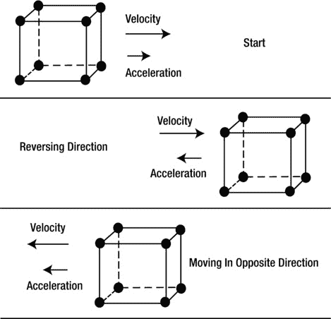
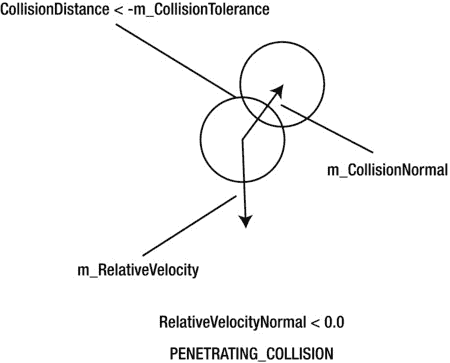

# 五、运动和碰撞

Abstract

在这一章中，我将讨论运动和碰撞。在运动方面，我将讨论物体的线速度、线加速度、角速度和角加速度的基础知识。我讲述了牛顿的三大运动定律，以及我们为实现这些运动定律而创建的新物理课程。然后，我将讨论一个实际操作的例子，用一个弹跳和旋转的立方体演示如何对对象应用线性和角加速度。接下来，我将介绍碰撞检测和碰撞响应，并在我们的物理类中添加代码来实现这种碰撞检测和碰撞响应。然后，我将通过一个实践示例，在之前实践示例的基础上添加另一个立方体，并演示我们新的冲突检测和响应代码。最后，我们创建了一个重力网格，然后通过将这个网格添加到前面两个碰撞立方体的动手示例中来演示它的使用。

在这一章中，我将讨论运动和碰撞。在运动方面，我将讨论物体的线速度、线加速度、角速度和角加速度的基础知识。我讲述了牛顿的三大运动定律，以及我们为实现这些运动定律而创建的新物理课程。然后，我将讨论一个实际操作的例子，用一个弹跳和旋转的立方体演示如何对对象应用线性和角加速度。接下来，我将介绍碰撞检测和碰撞响应，并在我们的物理类中添加代码来实现这种碰撞检测和碰撞响应。然后，我将通过一个实践示例，在之前实践示例的基础上添加另一个立方体，并演示我们新的冲突检测和响应代码。最后，我们创建了一个重力网格，然后通过将这个网格添加到前面两个碰撞立方体的动手示例中来演示它的使用。

## 运动概述

我将首先讲述线速度、角速度和加速度，以及牛顿的三大运动定律，然后将所有这些应用到动手操作的例子中。

### 线速度和线加速度

线速度是一个有方向和大小的矢量。例如，假设一辆汽车以每小时 35 英里的速度在街道上向东北方向行驶。这可以用一个指向东北方向的矢量来表示，其大小相当于每小时 35 英里。假设司机踩下刹车。这会产生一个与速度方向相反的加速度，从而使汽车减速。汽车停下来后，司机将汽车倒挡，沿着街道往回开。产生的速度和加速度向量现在又对齐了。(见图 5-1 。)

图 5-1。

Car reversing then moving backward

图 5-1 显示了这辆车在街道上行驶、减速、然后转向时的速度和加速度矢量。

平均速度是距离的变化除以时间的变化。图 5-2 显示了这个定义，变量 x 代表位置，t 代表时间。

图 5-2。

Average velocity definition

如果汽车在整个时间间隔内保持恒定速度，平均速度可能是一个很好的表示。然而，如果在该时间间隔期间，汽车的速度在一段时间内非常高，而在另一段时间内非常低，则平均速度不能很好地代表汽车的行为。

瞬时速度是当时间间隔接近 0 时，物体位置的变化除以时间的变化。如果给你一个函数，它代表一个物体相对于时间 x(t)的位置，那么这个函数的一阶导数，或 x'(t)，就是速度函数。(见图 5-3 。)

图 5-3。

Instantaneous velocity definition

物体的平均加速度是速度的变化除以时间的变化。(见图 5-4 。)

图 5-4。

Average acceleration definition

瞬时加速度是当时间间隔变为 0 时，速度的变化除以时间的变化。(见图 5-5 。)

图 5-5。

Instantaneous acceleration definition

### 牛顿运动定律

为了改变物体的速度，必须对该物体施加外力。牛顿运动定律被用来根据物体的质量和加速度来描述这个力。有三个运动定律，描述如下:

图 5-8。

Newton’s third law demonstrated by colliding spheres

*   牛顿第三定律:物体受到的外力成对出现。也就是说，如果物体 1 与物体 2 碰撞，它会在物体 2 上施加一个力。物体 2 也对物体 1 施加一个大小相等方向相反的力。(参见图 5-8 。)

图 5-7。

Newton’s second law scalar equations

图 5-6。

Newton’s second law vector equation

*   牛顿第一定律:考虑一个没有净力作用的物体。如果物体静止，它将保持静止。如果物体以恒定速度运动，它将继续这样运动。
*   牛顿第二定律:作用在物体上的外力总和等于该物体的质量乘以其加速度。图 5-6 显示了该定律的矢量形式。图 5-7 显示了该定律的标量版本，力沿着 x、y 和 z 轴分组。

### 重力

地球引力也是一种可以作用于物体的力。例如，牛顿第二定律可以被修改以适用于地球引力。地球上物体的重量实际上是一个力，这个力等于物体的质量乘以物体所在位置的重力加速度或自由落体加速度。(参见图 5-9 。)

图 5-9。

Force of gravity

### 角速度和角加速度

根据物体的角运动，它也可以有速度和加速度。对象绕其旋转轴旋转的距离以弧度或角度来度量。在图 5-10 中，你看到一个物体绕着它的旋转轴旋转。初始起点是角度θ1，结束角度是θ2。该变化或角度增量是θ2-θ1。

图 5-10。

Rotating an object

平均角速度是角位置的变化除以时间的变化。瞬时角速度是角位置对时间的一阶导数。(见图 5-11 。)

图 5-11。

Angular velocity

平均角加速度是角速度的变化除以时间的变化。瞬时角加速度是角速度的一阶导数。(参见图 5-12 。)

图 5-12。

Angular acceleration

### 旋转力

物体角速度的变化是由一个力引起的，当这个力施加到物体上时，会改变物体绕其旋转轴的旋转速率。这种引起物体旋转变化的力叫做扭矩。扭矩可以测量为产生扭矩的力与该力到旋转轴的垂直距离的乘积。(参见图 5-13 。)

图 5-13。

Torque

还有一个牛顿第二定律的角当量，就是作用在物体上的扭力等于被旋转物体的惯性，乘以物体的角加速度。(参见图 5-14 。)

图 5-14。

Torque equation

物体的惯性取决于物体的形状和旋转轴的精确取向。例如，图 5-15 显示了穿过环中心的旋转轴的转动惯量。

图 5-15。

Inertia of a hoop

## 物理课

我们的 Physics 类包含与更新对象的位置和旋转相关的代码，基于应用于对象的线性和旋转力。Object3d 类包含一个名为`m_Physics`的物理类变量。所有对象的物理相关数据(如速度和加速度)和物理功能(如对 3D 对象施加力)都包含在该变量中。这部分涵盖了我们的物理课。

清单 5-1 显示了我们物理课上用到的一些有用的常数。`PI`以弧度定义，相当于 180 度或半圆。`TWO_PI`定义为以弧度表示的`PI`值的两倍，是 360 度，或一个整圆。`HALF_PI`定义为`PI/2`，是 90 度，或者说是直角。A `QUARTER_PI`定义为`PI/4`，为 45 度。

清单 5-1。静态物理常数

`static float PI         = (float)(3.14159265358979323846264338327950288419716939937511);`

`static float TWO_PI     = (float)(2.0*PI);`

`static float HALF_PI    = (float)(PI/2.0);`

`static float QUARTER_PI = (float)(PI/4.0);`

在清单 5-2 中，我定义了与线速度和加速度相关的变量。变量`m_Velocity`保存对象在 x、y 和 z 方向的线速度，并被创建和初始化为`(0,0,0)`。变量`m_Acceleration`保存对象在 x、y 和 z 方向的线性加速度，并被创建和初始化为`(0,0,0)`。变量`m_MaxVelocity`保存物体在 x、y、z 方向上可以达到的最大绝对线速度。`m_MaxAcceleration`变量保存对象在 x、y 和 z 方向上可以达到的最大绝对线性加速度。

清单 5-2。线性相关的物理变量

`private Vector3 m_Velocity        = new Vector3(0,0,0);`

`private Vector3 m_Acceleration    = new Vector3(0,0,0);`

`private Vector3 m_MaxVelocity     = new Vector3(1.25f, 1.25f, 1.25f);`

`private Vector3 m_MaxAcceleration = new Vector3(1.0f,1.0f,1.0f);`

清单 5-3 中的代码处理角速度和加速度。`m_AngularVelocity`变量保存物体绕其旋转轴的角速度。`m_AngularAcceleration`变量保存物体绕其旋转轴的角加速度。`m_MaxAngularVelocity`变量保存角速度的最大绝对值。`m_MaxAngularAcceleration`变量保存对象角加速度的最大绝对值。

清单 5-3。角速度和加速度变量

`private float   m_AngularVelocity          = 0;`

`private float   m_AngularAcceleration      = 0;`

`private float   m_MaxAngularVelocity       = 4 * PI;`

`private float   m_MaxAngularAcceleration   = HALF_PI;`

清单 5-4 显示了物理类中与重力相关的变量。如果重力将被应用于对象，则`m_ApplyGravity`变量为真，默认情况下为假。变量`m_Gravity`指定了作用在物体上的重力加速度。`m_GroundLevel`变量指定了地面的高度。如果物体刚刚碰到地面，变量`m_JustHitGround`为真。`m_Mass variable`掌握着物体的质量。

清单 5-4。重力相关变量

`private boolean m_ApplyGravity   = false;`

`private float   m_Gravity        = 0.010f;`

`private float   m_GroundLevel    = 0;`

`private boolean m_JustHitGround  = false;`

`private float   m_Mass           = 100.0f;`

`ApplyTranslationalForce()`功能将一个力矢量作为输入，并将该力转化为一个线性加速度值，该值被添加到对象的总线性加速度中。基本上，这个函数给物体增加了一个新的平移力。加速度值由牛顿第二定律计算得出，即 F = ma。基于这个公式的加速度是 a = F/m，或者说线加速度等于作用在物体上的力除以物体的质量。(参见清单 5-5。)

清单 5-5。施加平移力

`void ApplyTranslationalForce(Vector3 Force)`

`{`

`// Apply a force to the object`

`// F = ma`

`// F/m = a`

`// 1\. Calculate translational acceleration on object due to new force and add this`

`// to the current acceleration for this object.`

`Vector3 a = new Vector3(Force);`

`if (m_Mass != 0)`

`{`

`a.Divide(m_Mass);`

`}`

`m_Acceleration.Add(a);`

`}`

`ApplyRotationalForce()`功能向对象施加新的旋转力。该函数将力和从该力应用到对象旋转轴的垂直长度作为输入。

使用以下公式将力转换为角加速度

*   角加速度=(力* r) /转动惯量。

这个新的角加速度然后被加到要应用于该物体的总角加速度上。转动惯量简化为半径为 1 的环，这样转动惯量就正好是物体的质量。(参见清单 5-6。)

清单 5-6。对对象应用旋转力

`void ApplyRotationalForce(float Force, float r)`

`{`

`// 1\. Torque = r X F;`

`//    T = I * AngularAcceleration;`

`//    T/I = AngularAccleration;`

`//`

`//    I = mr² = approximate with hoop inertia with r = 1 so that I = mass;`

`float Torque   = r * Force;`

`float aangular = 0;`

`float I        = m_Mass;`

`if (I != 0)`

`{`

`aangular = Torque/I;`

`}`

`m_AngularAcceleration += aangular` `;`

`}`

根据极限参数，函数`UpdateValueWithinLimit`以增量更新输入值。也就是说，该函数返回范围-限制和限制内的增量值。(参见清单 5-7。)

清单 5-7。`UpdateValueWithinLimit`功能

`float UpdateValueWithinLimit(float value, float increment, float limit)`

`{`

`float retvalue = 0;`

`// Increments the value by the increment if the result`

`// is within +- limit value`

`float tempv = value + increment;`

`if (tempv > limit)`

`{`

`retvalue = limit;`

`}`

`else if (tempv < -limit)`

`{`

`retvalue = -limit;`

`}`

`else`

`{`

`retvalue += increment;`

`}`

`return retvalue` `;`

`}`

`TestSetLimitValue()`功能将输入参数值钳位至极限值。(参见清单 5-8。)

清单 5-8。`TestSetLimitValue`功能

`float TestSetLimitValue(float value, float limit)`

`{`

`float retvalue = value;`

`// If value is greater than limit then set value = limit`

`// If value is less than -limit then set value = -limit`

`if (value > limit)`

`{`

`retvalue = limit;`

`}`

`else if (value < -limit)`

`{`

`retvalue = -limit;`

`}`

`return retvalue` `;`

`}`

`ApplyGravityToObject()`功能将重力加速度的力施加到物体加速度的 y 分量上。(参见清单 5-9。)

清单 5-9。对物体施加重力

`void ApplyGravityToObject()`

`{`

`// Apply gravity to object - Assume standard OpenGL axis orientation of positive y being up`

`m_Acceleration.y = m_Acceleration.y - m_Gravity;`

`}`

`UpdatePhysicsObject()`功能是主要的更新功能，根据外力对物体造成的线性和角加速度，更新物体的位置、速度和加速度。(参见清单 5-10。)

该函数执行以下操作:

Adds the acceleration caused by the force of gravity to the object, if `m_ApplyGravity` is true   Updates the linear acceleration of the object and clamps the values to within the range `-m_MaxAcceleration` to `m_MaxAcceleration`. Updates the linear velocity of the object, based on the linear acceleration, and clamps the value to within the range `-m_MaxVelocity` to `m_MaxVelocity`   Updates the angular acceleration and clamps the value to within the range `-m_MaxAngularAcceleration` to `m_MaxAngularAcceleration`. Updates the angular velocity, based on the angular acceleration, and clamps the value to `-m_MaxAngularVelocity` to `m_MaxAngularVelocity`   Sets the linear and angular accelerations to 0\. All linear and angular accelerations caused by external forces acting on this object have been accounted for and processed.   Updates the linear position and takes gravity and the height of the ground into account, if applicable. If the object has just hit the ground, `m_JustHitGround` is set to true. The y component of the object’s velocity is set to 0, and the position of the object is set to the ground level specified by `m_GroundLevel`, if the object is below the ground level and falling.   Updates the angular position of the object  

清单 5-10。更新对象的物理特性

`void UpdatePhysicsObject(Orientation orientation)`

`{`

`// 0\. Apply Gravity if needed`

`if (m_ApplyGravity)`

`{`

`ApplyGravityToObject();`

`}`

`// 1\. Update Linear Velocity`

`/////////////////////////////////////////////////////////////////////////////`

`m_Acceleration.x` `= TestSetLimitValue(m_Acceleration.x, m_MaxAcceleration.x);`

`m_Acceleration.y  = TestSetLimitValue(m_Acceleration.y, m_MaxAcceleration.y);`

`m_Acceleration.z  = TestSetLimitValue(m_Acceleration.z, m_MaxAcceleration.z);`

`m_Velocity.Add(m_Acceleration);`

`m_Velocity.x = TestSetLimitValue(m_Velocity.x, m_MaxVelocity.x);`

`m_Velocity.y = TestSetLimitValue(m_Velocity.y, m_MaxVelocity.y);`

`m_Velocity.z = TestSetLimitValue(m_Velocity.z, m_MaxVelocity.z);`

`// 2\. Update Angular Velocity`

`/////////////////////////////////////////////////////////////////////////////////`

`m_AngularAcceleration = TestSetLimitValue(m_AngularAcceleration, m_MaxAngularAcceleration);`

`m_AngularVelocity += m_AngularAcceleration;`

`m_AngularVelocity` `= TestSetLimitValue(m_AngularVelocity,m_MaxAngularVelocity);`

`// 3\. Reset Forces acting on Object`

`//    Rebuild forces acting on object for each update`

`////////////////////////////////////////////////////////////////////////////////`

`m_Acceleration.Clear();`

`m_AngularAcceleration = 0;`

`//4\. Update Object Linear Position`

`////////////////////////////////////////////////////////////////////////////////`

`Vector3 pos = orientation` `.GetPosition();`

`pos.Add(m_Velocity);`

`// Check for object hitting ground if gravity is on.`

`if (m_ApplyGravity)`

`{`

`if ((pos.y < m_GroundLevel)&& (m_Velocity.y < 0))`

`{`

`if (Math.abs(m_Velocity.y) > Math.abs(m_Gravity))`

`{`

`m_JustHitGround = true;`

`}`

`pos.y = m_GroundLevel;`

`m_Velocity.y = 0;`

`}`

`}`

`//5\. Update Object Angular Position`

`////////////////////////////////////////////////////////////////////////////////`

`// Add Rotation to Rotation Matrix`

`orientation.AddRotation(m_AngularVelocity)` `;`

`}`

## 动手示例:使用力的线性运动和角运动

在这里，我将通过一个实际操作的例子来指导您使用力在 3D 对象中创建线性和角运动。为了继续这个练习，最好的办法是在您的开发系统上创建一个新的工作空间，从`apress.com`下载本章的代码，然后将项目导入到您的新工作空间中。

### 创建一个四面纹理立方体

在前面的例子中，我们使用了一个两面都有纹理的立方体。因为我们在这里演示的是角度旋转，所以如果立方体在面向观察者的所有四个面上都有纹理，会更容易看到效果。清单 5-11 中的代码已经被添加到了 Cube 类中，用来生成一个四面都有纹理映射的立方体。

清单 5-11。立方体类中具有四面纹理的立方体

`static float CubeData4Sided[] =`

`{`

`// x,     y,    z,    u,      v      nx,  ny, nz`

`-0.5f,  0.5f,  0.5f, 0.0f,   0.0f,   -1,  1,  1,  // front top left      0`

`-0.5f, -0.5f,  0.5f, 0.0f,   1.0f,   -1, -1,  1,  // front bottom left   1`

`0.5f,  -0.5f,  0.5f, 1.0f,   1.0f,    1, -1,  1,  // front bottom right  2`

`0.5f,   0.5f,  0.5f, 1.0f,   0.0f,    1,  1,  1,  // front top right     3`

`-0.5f,  0.5f, -0.5f, 1.0f,   0.0f,   -1,  1, -1,  // back top left       4`

`-0.5f, -0.5f, -0.5f, 1.0f,   1.0f,   -1, -1, -1,  // back bottom left    5`

`0.5f,  -0.5f, -0.5f, 0.0f,   1.0f,    1, -1, -1,  // back bottom right   6`

`0.5f,   0.5f, -0.5f,` `0.0f,   0.0f,    1,  1, -1   // back top right      7`

`};`

### 修改 Object3d 类

必须修改 Object3d 类来添加我们的 Physics 类的功能。首先，我们必须添加两个新变量。`m_Physics`变量是我们与物体物理属性的接口。

`private Physics m_Physics;`

我们必须添加的另一个变量是`m_Visible`变量，如果我们希望该对象可见并因此被绘制到屏幕上，这个变量为真。

`private boolean m_Visible = true;`

在 Object3d 类的构造函数中，我们必须创建一个新的物理对象。

`m_Physics = new Physics(iContext);`

然后，我们必须添加设置和测试可见性的函数。`SetVisibility()`函数设置对象是否可见。

`void SetVisibility(boolean value) { m_Visible = value; }`

如果对象可见，函数返回真，否则返回假。

`boolean IsVisible() { return m_Visible; }`

我们还必须添加允许从类外部访问`m_Physics`对象的`GetObjectPhysics()`函数。

`Physics GetObjectPhysics() { return m_Physics; }`

`UpdateObjectPhysics()`函数用对象的方向调用`UpdatePhysicsObject()`函数来进行实际的物理更新。

`UpdateObject3d()`是更新我们物体物理特性的主要入口。如果对象可见，则更新该对象的物理特性。(参见清单 5-12。)

清单 5-12。Object3d 类中的物理更新入口点

`void UpdateObjectPhysics()`

`{`

`m_Physics.UpdatePhysicsObject(m_Orientation);`

`}`

`void UpdateObject3d()`

`{`

`if (m_Visible)`

`{`

`UpdateObjectPhysics();`

`}`

`}`

最后，如果对象可见，`DrawObject()`函数绘制对象。清单 5-13 中用粗体显示了前面例子中对这个函数的添加。

清单 5-13。绘制可见的对象

`void DrawObject(Camera Cam, PointLight light)`

`{`

`if (m_Visible)`

`{`

`DrawObject(Cam,`

`light,`

`m_Orientation.GetPosition(),`

`m_Orientation.GetRotationAxis(),`

`m_Orientation.GetScale());`

`}`

`}`

### 修改 MyGLRenderer 类

MyGLRenderer 类也必须修改，因为最终的程序将由一个受重力影响的立方体组成。立方体受到一个线性向上的力，立方体落地时受到一个旋转力。最终结果是，立方体在落地时看起来像是在跳跃，并且开始越来越快地旋转。

变量`m_Force1`是立方体撞击地面时施加在立方体上的线性力。

`private Vector3 m_Force1 = new Vector3(0,20,0);`

`m_RotationalForce`变量是立方体每次落地时受到的旋转力。

`private float m_RotationalForce = 3;`

在`CreateCube()`函数中，`Cube.CubeData4Sided`用于在立方体的四个边而不是两个边上提供纹理映射。

`MeshEx CubeMesh = new MeshEx(8,0,3,5,Cube.CubeData4Sided, Cube.CubeDrawOrder);`

`m_Cube`的重力被设置为真，这样立方体就会下落，直到碰到地面。

`m_Cube.GetObjectPhysics().SetGravity(true);`

在`onDrawFrame()`函数中(见清单 5-14)，增加了新的粗体代码

Updates the cube physics by calling `UpdateObject3d()`   Tests if the cube has just hit the ground by calling `GetHitGroundStatus()`   Applies, the upward translational force `m_Force1` and the rotational force `m_RotationalForce` to the cube, if the cube has just hit the ground   Resets the just-hit-ground status  

这是创建弹跳/旋转立方体效果的关键代码。(参见图 5-16 。)

清单 5-14。修改`onDrawFrame()`功能

`@Override`

`public void onDrawFrame(GL10 unused)`

`{`

`GLES20.glClearColor(0.0f, 0.0f, 0.0f, 1.0f);`

`GLES20.glClear( GLES20.GL_DEPTH_BUFFER_BIT | GLES20.GL_COLOR_BUFFER_BIT);`

`m_Camera.UpdateCamera();`

`////////////////////////// Update Object Physics`

`// Cube1`

`m_Cube.UpdateObject3d();`

`boolean HitGround = m_Cube.GetObjectPhysics().GetHitGroundStatus();`

`if (HitGround)`

`{`

`m_Cube.GetObjectPhysics().ApplyTranslationalForce(m_Force1);`

`m_Cube.GetObjectPhysics().ApplyRotationalForce(m_RotationalForce, 10.0f);`

`m_Cube.GetObjectPhysics().ClearHitGroundStatus();`

`}`

`//////////////////////////// Draw Object`

`m_Cube.DrawObject` `(m_Camera, m_PointLight);`

`}`

图 5-16。

The jumping rotating cube

## 碰撞概述

在对碰撞的概述中，我将介绍碰撞检测以及作用力和反作用力在两个碰撞物体上的实际应用。

### 冲突检出

我们将在本书中使用的碰撞检测类型基于一个球体，其中整个 3D 对象都在碰撞球体的边界内。在 V1Final 和 V2Final 碰撞后，碰撞中涉及的两个对象的初始速度分别为 V1Initial 和 V2Initial 和 final。假设 Body1 和 Body2 的质心都位于边界或碰撞球体的中心。碰撞法线是通过两个对象的质心的向量，是确定最终碰撞速度和对象方向的关键。根据牛顿第三运动定律，当物体碰撞时，作用在物体上的力将沿着碰撞法线方向作用，并且大小相等，方向相反。(参见图 5-17 。)

图 5-17。

Collision between two 3D objects represented by bounding spheres

### 修改 MeshEx 类

首先，我们必须能够计算 3D 物体的碰撞球体的半径。为了做到这一点，我们必须向我们的 MeshEx 类添加一些代码。

添加了以下变量。`m_Size`变量测量三维物体网格在 x、y 和 z 方向的最大尺寸。

`private Vector3 m_Size  = new Vector3(0,0,0);`

`m_Radius`变量保存包含整个对象的碰撞球体的半径。

`private float m_Radius = 0;`

`m_RadiusAverage`变量保存对象在 x、y 和 z 轴方向上最大部分的平均值。这个半径可能不包含整个对象，并且不用于我们稍后讨论的碰撞检测方法。

`private float m_RadiusAverage = 0;`

在`MeshEx`构造函数中，我们调用计算正在创建的网格的包围球的函数，也就是`CalculateRadius()`。(参见清单 5-15。)

`CalculateRadius()`函数通过执行以下操作计算 3D 对象的边界球半径:

Searching through all the object’s vertices and determining the smallest and largest x, y, and z coordinates.   Finding the size of the object along its x, y, and z axes, based on the minimum and maximum values of the x, y, and z coordinates found in the step above.   Calculating the collision radius from the largest portion of the object in the x, y, or z axes direction. Assuming the object is centered at the origin, the largest size values in either the x, y, or z direction would represent the object’s diameter. The collision radius would be half of that diameter.   Calculating the average radius based on the average of the object’s x, y, and z lengths as the diameter. The final average radius is half of this diameter.  

清单 5-15。计算对象网格的半径

`void CalculateRadius()`

`{`

`float XMin = 100000000;`

`float YMin = 100000000;`

`float ZMin = 100000000;`

`float XMax = -100000000;`

`float YMax = -100000000;`

`float ZMax = -100000000;`

`int ElementPos = m_MeshVerticesDataPosOffset;`

`// Loop through all vertices and find min and max values of x,y,z`

`for (int i = 0; i < m_VertexCount; i++)`

`{`

`float x = m_VertexBuffer.get(ElementPos);`

`float y = m_VertexBuffer.get(ElementPos+1);`

`float z = m_VertexBuffer.get(ElementPos+2);`

`// Test for Min`

`if (x < XMin)`

`{`

`XMin = x;`

`}`

`if (y < YMin)`

`{`

`YMin = y;`

`}`

`if (z < ZMin)`

`{`

`ZMin = z;`

`}`

`// Test for Max`

`if (x > XMax)`

`{`

`XMax = x;`

`}`

`if (y > YMax)`

`{`

`YMax = y;`

`}`

`if (z > ZMax)`

`{`

`ZMax = z;`

`}`

`ElementPos` `= ElementPos + m_CoordsPerVertex;`

`}`

`// Calculate Size of Mesh in the x,y,z directions`

`m_Size.x = Math.abs(XMax - XMin);`

`m_Size.y = Math.abs(YMax - YMin);`

`m_Size.z = Math.abs(ZMax - ZMin);`

`// Calculate Radius`

`float LargestSize = -1;`

`if (m_Size.x > LargestSize)`

`{`

`LargestSize = m_Size.x;`

`}`

`if (m_Size.y > LargestSize)`

`{`

`LargestSize = m_Size.y;`

`}`

`if (m_Size.z > LargestSize)`

`{`

`LargestSize = m_Size.z;`

`}`

`m_Radius = LargestSize/2.0f;`

`// Calculate Average Radius;`

`m_RadiusAverage = (m_Size.x + m_Size.y + m_Size.z) / 3.0f;`

`m_RadiusAverage` `= m_RadiusAverage/2.0f;`

`}`

### 修改 Object3d 类

`GetRadius()`函数已经添加到 Object3d 类中。该函数返回对象网格的碰撞半径。(参见清单 5-16。)

清单 5-16。`GetRadius()`功能

`float GetRadius()`

`{`

`if (m_MeshEx != null)`

`{`

`return m_MeshEx.GetRadius();`

`}`

`return -1;`

`}`

`GetScaledRadius()`函数返回由对象的比例因子缩放的对象的边界/碰撞球体的半径。(参见清单 5-17。)因此，缩放两倍于原始网格大小的对象将具有两倍于原始网格的半径。

清单 5-17。获取缩放的对象 3d 网格半径

`float GetScaledRadius()`

`{`

`float LargestScaleFactor = 0;`

`float ScaledRadius = 0;`

`float RawRadius = GetRadius();`

`Vector3 ObjectScale` `= m_Orientation.GetScale();`

`if (ObjectScale.x > LargestScaleFactor)`

`{`

`LargestScaleFactor = ObjectScale.x;`

`}`

`if (ObjectScale.y > LargestScaleFactor)`

`{`

`LargestScaleFactor = ObjectScale.y;`

`}`

`if (ObjectScale.z > LargestScaleFactor)`

`{`

`LargestScaleFactor = ObjectScale.z;`

`}`

`ScaledRadius = RawRadius * LargestScaleFactor;`

`return ScaledRadius;`

`}`

### 碰撞的类型

我们将在这一节中考虑的两种碰撞是普通碰撞和穿透碰撞。正常碰撞是指两个对象的边界球体在碰撞容差级别内的边界处发生碰撞。(参见图 5-18 。)

图 5-18。

Collision

穿透碰撞是指两个对象的边界球体重叠，并且两个球体彼此相向移动。两个球体彼此相向移动，因为两个球体之间的碰撞法线和相对速度指向不同的方向。也就是说，它们的点积小于 0。(参见图 5-19 。)

图 5-19。

Penetrating collision

另一个你必须考虑的情况是当两个边界球重叠，但彼此远离。当对象彼此远离时，碰撞法线和相对速度之间的点积大于或等于 0。这种情况不被认为是碰撞，因为物体彼此远离(见图 5–20)。我们将在本节的后面更详细地讨论这些情况。

图 5-20。

Penetrating

### 修改物理课

Physics 类拥有碰撞检测的主要实现。我们必须给这个类添加一些变量和一个函数。

我们添加了一个名为 CollisionStatus 的枚举来保存我们的冲突检测测试的结果。这些值如下:

*   发生了碰撞。
*   被测试的身体完全没有接触。
*   被测试的物体相互穿透，但相互远离，因此没有碰撞。
*   被测试的物体互相穿透，并向对方移动，因此发生碰撞。

`enum CollisionStatus`

`{`

`COLLISION,`

`NOCOLLISION,`

`PENETRATING,`

`PENETRATING_COLLISION`

`}`

接下来，我们添加碰撞容差的变量。如果碰撞距离在范围`-COLLISIONTOLERANCE`到`COLLISIONTOLERANCE`内，两个物体将被认为是相互碰撞，并且返回值`COLLISION`。

`private float COLLISIONTOLERANCE = 0.1f;`

`private float m_CollisionTolerance = COLLISIONTOLERANCE;`

`m_CollisionNormal`矢量是从一个物体的质心到另一个物体的质心的矢量。

`private Vector3 m_CollisionNormal;`

`m_RelativeVelocity`矢量是一个矢量，表示一个物体相对于正在进行碰撞测试的另一个物体的相对速度。

`private Vector3 m_RelativeVelocity;`

`CheckForCollisionSphereBounding()`是对两个 3D 对象进行碰撞检测的函数。它接受两个对象作为输入，并返回一个类型为 CollisionStatus 的值。该功能执行以下步骤，以确定碰撞状态。

Calculate the collision distance between the two objects.   Calculate the collision normal between the two objects.   Calculate the relative velocity of the two objects along the collision normal.   Determine the collision status based on the collision distance and the relative velocity along the collision normal.  

`ImpactRadiusSum`变量是对象 1 的半径和对象 2 的半径之和。如果碰撞正好在碰撞球体的边界，那么两个物体之间的碰撞距离将为零，物体质心之间的距离将正好为`ImpactRadiusSum`，如图 5-21 所示。

图 5-21。

The perfect collision

碰撞距离测量两个对象的碰撞球体边界之间的距离。它是通过从物体质心之间的距离中减去`ImpactRadiusSum`来计算的。(见图 5-22 。)

图 5-22。

The collision distance

通过归一化上一步中计算的两个质心之间的距离向量来计算碰撞法线。还计算两个物体之间的相对速度。通过取相对速度矢量和碰撞法向矢量之间的点积，可以找到沿着碰撞法向的相对速度的大小。(见图 5-23 。)

图 5-23。

Calculating the collision direction

现在你知道了碰撞距离和沿着碰撞法线的相对速度，你就有了所有你需要的信息来确定物体是否碰撞。根据碰撞距离，你知道它们是否互相接触，根据物体沿碰撞法线的相对速度，你知道它们是否互相靠近。请参见清单 5-18 查看实际代码。

清单 5-18。碰撞检测功能

`CollisionStatus CheckForCollisionSphereBounding(Object3d body1, Object3d body2)`

`{`

`Float   ImpactRadiusSum         = 0;`

`float   RelativeVelocityNormal  = 0;`

`float   CollisionDistance       = 0;`

`Vector3 Body1Velocity;`

`Vector3 Body2Velocity;`

`CollisionStatus retval;`

`// 1\. Calculate Separation`

`ImpactRadiusSum = body1.GetScaledRadius() + body2.GetScaledRadius();`

`Vector3 Position1 = body1.m_Orientation.GetPosition();`

`Vector3 Position2 =body2.m_Orientation.GetPosition();`

`Vector3 DistanceVec = Vector3.Subtract(Position1, Position2);`

`CollisionDistance = DistanceVec.Length() - ImpactRadiusSum;`

`// 2\. Set Collision Normal Vector`

`DistanceVec.Normalize();`

`m_CollisionNormal = DistanceVec;`

`// 3\. Calculate Relative Normal Velocity:`

`Body1Velocity = body1.GetObjectPhysics().GetVelocity();`

`Body2Velocity = body2.GetObjectPhysics().GetVelocity();`

`m_RelativeVelocity = Vector3.Subtract(Body1Velocity, Body2Velocity);`

`RelativeVelocityNormal` `= m_RelativeVelocity.DotProduct(m_CollisionNormal);`

`// 4\. Test for collision`

`if((Math.abs(CollisionDistance) <= m_CollisionTolerance) && (RelativeVelocityNormal < 0.0))`

`{`

`retval = CollisionStatus.COLLISION;`

`}`

`else`

`if ((CollisionDistance < -m_CollisionTolerance) && (RelativeVelocityNormal < 0.0))`

`{`

`retval = CollisionStatus.PENETRATING_COLLISION;`

`}`

`else`

`if (CollisionDistance < -m_CollisionTolerance)`

`{`

`retval = CollisionStatus.PENETRATING;`

`}`

`else`

`{`

`retval = CollisionStatus.NOCOLLISION;`

`}`

`return retval;`

`}`

### 计算碰撞

现在我们将推导出用于计算两个碰撞物体撞击后所受力的公式。根据牛顿第三运动定律，作用在物体上的力大小相等，方向相反。

下面列出了我们需要的三个方程。前两个方程是牛顿第二定律，适用于两个物体，其中一个物体上的力与另一个物体相反。第三个方程是恢复系数或“e”，它决定了碰撞的弹性。完全弹性碰撞将产生一个动能守恒，e = 1 的碰撞。完全非弹性碰撞将产生动能完全丧失的碰撞，e = 0。我们方程中的 e 是由物体碰撞后的最终相对速度与碰撞前的相对速度之比计算出来的。这给出了一个很好的概念，在碰撞后有多少动能被保留。

`Force = mass1 * acceleration1`

`-Force = mass2 * acceleration2`

`E = -(V1Final – V2Final) / (V1Initial – V2Initial);`

用速度变化的变量代替加速度。我们有三个方程和三个未知数。未知数是这两个物体碰撞产生的`V1Final`、`V2Final`、`Force`。

`Force = mass1 * ( V1Final – V1Initial )`

`-Force = mass2 * ( V2Final – V2Initial )`

`e = -(V1Final – V2Final) / (V1Initial – V2Initial);`

求解第一个方程为`V1Final`。

`Force/mass1 = mass1 * ( V1Final – V1Initial )/mass1`

`Force/mass1 = V1Final – V1Initial`

`Force/mass1 + V1Initial = V1Final`

求解第二个方程为`V2Final`。

`-Force/mass2 = mass2 * ( V2Final – V2Initial ) / mass2`

`-Force/mass2 = V2Final  - V2Initial`

`-Force/mass2 + V2Initial = V2Final`

将`V1Final`和`V2Final`代入恢复系数方程，或 e。

`e = -(V1Final – V2Final) / (V1Initial – V2Initial);`

`-e(V1Initial – V2Initial) = V1Final – V2Final`

`-e(V1Initial – V2Initial) = Force/mass1 + V1Initial – (-Force/mass2 + V2Initial )`

`-e(V1Initial – V2Initial)  - V1Initial = Force/mass1 + Force/mass2 – V2Initial`

`-e(V1Initial – V2Initial)  - V1Initial + V2Initial = Force/mass1 + Force/mass2`

`-e(V1Initial – V2Initial)  - V1Initial + V2Initial = (1/mass1 + 1/mass2) Force`

替换`VRelative = V1initial – V2Initial`。

`-e(VRelative)  - VRelative = (1/mass1 + 1/mass2) Force`

`VRelative( -e –1 ) = (1/mass1 + 1/mass2) Force`

`-VRelative( e + 1 ) = (1/mass1 + 1/mass2) Force`

`-VRelative( e + 1 ) /  (1/mass1 + 1/mass2) = Force`

因此，作用在物体上的最终力是

`ForceAction = -VRelative( e + 1 ) /  (1/mass1 + 1/mass2)`

`ForceReaction = - ForceAction`

### 修改物理课

接下来，我们必须添加代码来处理冲突。

Physics 类中的`ApplyLinearImpulse()`函数(见清单 5-19)实际上实现了碰撞动作和反作用力。这一职能有三个主要组成部分

Calculate the force generated by the collision along the collision normal of the two objects.   Find the vector form of the action force, by taking that magnitude of the collision force found in step 1 and putting this along the collision normal between the objects. The reaction force is found by taking the negative of the action force.   Add the forces acting on both objects to each of the objects, by using the `ApplyTranslationalForce()` function.  

清单 5-19。`ApplyLinearImpulse()`功能

`void ApplyLinearImpulse(Object3d body1, Object3d body2)`

`{`

`float m_Impulse;`

`// 1\. Calculate the impulse along the line of action of the Collision Normal`

`m_Impulse = (-(1+m_CoefficientOfRestitution) * (m_RelativeVelocity.DotProduct(m_CollisionNormal))) / ((1/body1.GetObjectPhysics().GetMass() + 1/body2.GetObjectPhysics().GetMass()));`

`// 2\. Apply Translational Force to bodies`

`// f = ma;`

`// f/m = a;`

`Vector3 Force1 =  Vector3.Multiply( m_Impulse, m_CollisionNormal);`

`Vector3 Force2 =  Vector3.Multiply(-m_Impulse, m_CollisionNormal);`

`body1.GetObjectPhysics().ApplyTranslationalForce(Force1);`

`body2.GetObjectPhysics().ApplyTranslationalForce(Force2);`

`}`

## 动手示例:碰撞

在本练习中，我们将在上一个动手示例中创建的立方体之上创建另一个立方体。这个立方体会掉下来并与第一个立方体碰撞。净效应将是两个立方体不断相互碰撞。

### 修改 MyGLRenderer 类

我们需要对项目中的 MyGLRenderer 类进行一些修改。修改包括添加代码来创建第二个立方体，以及添加代码来处理这个新的立方体和前面动手示例中的旧立方体之间的冲突。

首先，我们必须为新的立方体添加变量，即`m_Cube2`。

`private Cube m_Cube2;`

接下来，我们必须创建新的立方体。新多维数据集的创建类似于第一个多维数据集的创建。(参见清单 5-20。)

清单 5-20。创建新的多维数据集

`void CreateCube2(Context iContext)`

`{`

`//Create Cube Shader`

`Shader Shader = new Shader(iContext, R.raw.vsonelight, R.raw.fsonelight);      // ok`

`MeshEx CubeMesh` `= new MeshEx(8,0,3,5,Cube.CubeData4Sided, Cube.CubeDrawOrder);`

`// Create Material for this object`

`Material Material1 = new Material();`

`// Create Texture`

`Texture TexAndroid = new Texture(iContext,R.drawable.ic_launcher);`

`Texture[] CubeTex = new Texture[1];`

`CubeTex[0] = TexAndroid;`

`m_Cube2 = new Cube(iContext,`

`CubeMesh,`

`CubeTex,`

`Material1,`

`Shader);`

`// Set Intial Position and Orientation`

`Vector3 Axis = new Vector3(0,1,0);`

`Vector3 Position = new Vector3(0.0f, 4.0f, 0.0f);`

`Vector3 Scale = new Vector3(1.0f,1.0f,1.0f);`

`m_Cube2.m_Orientation.SetPosition(Position);`

`m_Cube2.m_Orientation.SetRotationAxis(Axis);`

`m_Cube2.m_Orientation.SetScale(Scale);`

`// Gravity`

`m_Cube2.GetObjectPhysics().SetGravity(true);`

`}`

必须修改`onSurfaceCreated()`函数来创建新的立方体。清单 5-21 中用粗体列出了所需的更改。

清单 5-21。`onSurfaceCreated()`功能变化

`@Override`

`public void onSurfaceCreated(GL10 unused, EGLConfig config)`

`{`

`m_PointLight = new PointLight(m_Context);`

`SetupLights();`

`// Create a 3d Cube`

`CreateCube(m_Context);`

`// Create a Second Cube`

`CreateCube2(m_Context);`

`}`

在`onDrawFrame()`函数中，第二个立方体的物理属性通过`UpdateObject3d()`函数更新。检查两个球体的有效碰撞类型，如果为真，则对每个对象应用适当的线性力。(参见清单 5-22。)

清单 5-22。`onDrawFrame()`修改

`@Override`

`public void onDrawFrame(GL10 unused)`

`{`

`GLES20.glClearColor(0.0f, 0.0f, 0.0f, 1.0f);`

`GLES20.glClear( GLES20.GL_DEPTH_BUFFER_BIT | GLES20.GL_COLOR_BUFFER_BIT);`

`m_Camera.UpdateCamera();`

`////////////////////////// Update Object Physics`

`// Cube1`

`m_Cube.UpdateObject3d();`

`boolean HitGround = m_Cube.GetObjectPhysics().GetHitGroundStatus();`

`if (HitGround)`

`{`

`m_Cube.GetObjectPhysics().ApplyTranslationalForce(m_Force1);`

`m_Cube.GetObjectPhysics().ApplyRotationalForce(m_RotationalForce, 10.0f);`

`m_Cube.GetObjectPhysics().ClearHitGroundStatus` `();`

`}`

`// Cube2`

`m_Cube2.UpdateObject3d();`

`// Process Collisions`

`Physics.CollisionStatus TypeCollision = m_Cube.GetObjectPhysics().CheckForCollisionSphereBounding(m_Cube, m_Cube2);`

`if ((TypeCollision == Physics.CollisionStatus.COLLISION) ||`

`(TypeCollision == Physics.CollisionStatus.PENETRATING_COLLISION))`

`{`

`m_Cube.GetObjectPhysics().ApplyLinearImpulse(m_Cube, m_Cube2);`

`}`

`//////////////////////////// Draw Objects`

`m_Cube.DrawObject(m_Camera, m_PointLight);`

`m_Cube2.DrawObject(m_Camera, m_PointLight);`

`}`

图 5-24 显示了最终的结果，两个立方体沿着垂直的 y 轴不断相互碰撞。

图 5-24。

The two colliding cubes

## 牛顿引力定律

牛顿引力定律表明，宇宙中的每一个物体都相互吸引。例如，假设有两个相距 r 的质量，质量 2 对质量 1 施加一个力，质量 1 对质量 2 施加一个大小相等方向相反的力。(见图 5-25 。)

图 5-25。

Two masses attracting each other

力等于两个物体质量的乘积，除以它们之间的距离，平方，再乘以引力常数。(见图 5-26 。)

图 5-26。

Newton’s law of gravity

出于本书的目的，我们将对重力网格使用图 5-26 中方程的一般修改形式，重力网格将根据牛顿重力定律以类似的方式做出反应。重力网格的主要目的是产生一些视觉上令人印象深刻的效果。

## 无人机网格案例研究:使用顶点着色器创建重力网格

在本案例研究中，我们将在之前的两个碰撞立方体相互碰撞的动手示例中添加一个重力网格。重力网格由根据牛顿重力定律运行的点网格组成。也就是说，网格点被模拟为被放置在网格上的其他质量吸引的质量。本例中重力网格的目的是说明立方体的运动如何改变重力网格的形状，从而产生一些视觉上有趣的效果。此外，将在网格上添加的体量下放置一个聚光灯。聚光灯的目的是突出和增强重力网格上由质量引起的变形。

### 修改物理课

需要修改 Physics 类，以保持添加到网格中的对象下方网格上显示的聚光灯的半径。变量`m_MassEffectiveRadius`是网格上聚光灯的半径。

`private float m_MassEffectiveRadius = 10;  // Radius for mass effect on gravity grid`

功能`GetMassEffectiveRadius()`和`SetMassEffectiveRadius()`检索和设置聚光灯的半径。

`float GetMassEffectiveRadius() {return m_MassEffectiveRadius;}`

`void SetMassEffectiveRadius(float value) { m_MassEffectiveRadius = value;}`

### 修改 MeshEx 类

接下来，我们必须向 MeshEx 类添加一些代码。这个新代码将用于绘制直线而不是三角形。

MeshType 是一个新的枚举，具有三角形和直线的值。

`enum MeshType`

`{`

`Triangles,`

`Lines`

`}`

MeshType 中还添加了一个名为`m_MeshType`的新变量。

`private MeshType m_MeshType;`

在`MeshEx()`构造函数中，要绘制的网格类型默认为三角形。

`m_MeshType = MeshType.Triangles;`

还添加了设置和检索正在绘制的网格类型的函数。

`void SetMeshType(MeshType Type){m_MeshType = Type;}`

`MeshType GetMeshType() {return m_MeshType;}`

在`DrawMesh()`函数中，我们添加并更改代码来实际绘制网格。我们根据`m_MeshType`的值绘制三角形或直线。(参见清单 5-23。)

清单 5-23。绘制三角形或直线的代码

`if (m_MeshType == MeshType.Triangles)`

`{`

`GLES20.glDrawElements(``GLES20.GL_TRIANGLES`

`m_DrawListBuffer.capacity(),`

`GLES20.GL_UNSIGNED_SHORT,`

`m_DrawListBuffer);`

`}`

`else`

`if (m_MeshType == MeshType.Lines)`

`{`

`GLES20.glDrawElements(``GLES20.GL_LINES`

`m_DrawListBuffer.capacity(),`

`GLES20.GL_UNSIGNED_SHORT,`

`m_DrawListBuffer);`

`}`

### GravityGridEx 类

接下来，我们创建一个名为 GravityGridEx 的新类。这是表示我们的对象将被放置的重力网格的类。

实际的网格对象属于 MeshEx 类型，名为`m_LineMeshGrid`。

`private MeshEx m_LineMeshGrid;`

必须定义网格的顶点数据。每个顶点的坐标数为 3，它们是网格点位置的 x、y 和 z 值。

`private int m_CoordsPerVertex = 3;`

顶点数组中顶点位置数据的偏移量为 0。

`private int m_MeshVerticesDataPosOffset = 0;`

顶点数组到 uv 纹理的偏移量是-1，这意味着该栅格没有纹理。

`private int m_MeshVerticesUVOffset = -1;`

顶点数组到顶点法线的偏移量是-1，这意味着这个网格没有顶点法线。

`private int m_MeshVerticesNormalOffset = -1;`

`m_Vertices`数组保存网格的顶点数据。

`private float[] m_Vertices;`

`m_DrawOrder`数组存储了保存在`m_Vertices`中的顶点的渲染顺序。

`private short[] m_DrawOrder;`

网格上的质量数保存在`m_NumberMasses`中。

`private int m_NumberMasses = 0;`

质量数组数据的索引保存在`MassesIndex`中。

`private int MassesIndex = 0;`

网格上允许的最大质量数保存在`MAX_MASSES`中。

`private int MAX_MASSES = 30;`

网格上每个质量的值保存在一个名为`m_MassValues`的数组中。

`private float[] m_MassValues = new float[MAX_MASSES];`

网格上质量的位置值保存在一个名为`m_MassLocations`的数组中，每个质量的格式为 x，y，z。所以数组中每三个浮点元素代表一个质量。

`private float[] m_MassLocations = new float[MAX_MASSES*3];`

绘制聚光灯的半径值存储在`m_MassEffectiveRadius`中。

`private float[] m_MassEffectiveRadius = new float[MAX_MASSES];`

每个质量在网格上放置的聚光灯颜色以 r、g、b 格式存储在`m_MassSpotLightColor`中。因此，每三个浮点数组元素代表一个质量的数据。

`private float[] m_MassSpotLightColor  = new float[MAX_MASSES*3]; // 3 r,g,b values per mass`

该网格的着色器保存在`m_Shader`中。

`private Shader m_Shader;`

着色器中顶点位置变量的链接保存在`m_PositionHandle`中。

`private int m_PositionHandle;`

网格的颜色保存在`m_GridColor`中。

`private Vector3 m_GridColor;`

发送到着色器中 modelviewprojection 矩阵的值位于`m_MVPMatrix`中。

`private float[] m_MVPMatrix = new float[16];`

沿 x 轴的网格位置边界保存在以下变量中:

`private float m_XMinBoundary;`

`private float m_XMaxBoundary;`

沿 z 轴的网格位置边界保存在以下变量中:

`private float m_ZMinBoundary;`

`private float m_ZMaxBoundary;`

`GravityGridEx`构造函数根据构造函数的输入参数创建网格。

在构造函数中创建重力网格时，执行以下步骤:

The array that holds the vertex data `m_Vertices` is initialized by allocating enough memory to hold all the vertex data.   Two nested `for` loops, the outer loop running the length of the z axis of the grid and the other inner loop running the length of the x axis of the grid, create the points of the grid and puts them into the `m_Vertices` array.   The array `m_DrawOrder`, which holds the indices into `m_Vertices` for the actual method of how to draw the mesh, is initialized by allocating enough memory to hold each line to be drawn.   The `m_DrawOrder` array is filled with the indices of the vertices that need to have lines drawn between them. Because we are drawing lines, each two entries of `m_DrawOrder` would represent one line. This is done in two loops, one for the horizontal lines, and the other for vertical lines of the grid.   The actual grid is created using the `m_Vertices` and the `m_DrawOrder` arrays created in the previous steps and stored in the `m_LineMeshGrid` variable.   The mesh type to draw is set to lines.   The call to the `ClearMasses()` function sets the mass value of all the objects on the grid to 0.  

关于执行上述步骤的代码的详细信息，请参见清单 5-24。

清单 5-24。`GravityGridEx`构造器

`// Creates a grid of lines on the XZ plane at GridHeight height`

`// of size GridSizeZ by GridSizeX in number of grid points`

`GravityGridEx(Context iContext,`

`Vector3 GridColor,`

`float GridHeight,`

`float GridStartZValue, float GridStartXValue,`

`float GridSpacing,`

`int GridSizeZ, int GridSizeX,`

`Shader iShader)`

`{`

`m_Context = iContext;`

`m_Shader = iShader;`

`m_GridColor = GridColor;`

`// Set Grid Boundaries`

`float NumberCellsX = GridSizeX - 1;`

`float NumberCellsZ = GridSizeZ - 1;`

`m_XMinBoundary` `= GridStartXValue;`

`m_XMaxBoundary = GridStartXValue + (NumberCellsX * GridSpacing);`

`m_ZMinBoundary = GridStartZValue;`

`m_ZMaxBoundary = GridStartZValue + (NumberCellsZ * GridSpacing);`

`int NumberVertices = GridSizeZ * GridSizeX;`

`int TotalNumberCoords = m_CoordsPerVertex * NumberVertices;`

`Log.e("GRAVITYGRIDEX", "TotalNumberCoords = " + TotalNumberCoords);`

`m_Vertices = new float[TotalNumberCoords];`

`// Create Vertices for Grid`

`int index = 0;`

`for (float z = 0; z < GridSizeZ; z++)`

`{`

`for (float x = 0; x < GridSizeX; x++)`

`{`

`// Determine World Position of Vertex`

`float xpos = GridStartXValue + (x * GridSpacing);`

`float zpos = GridStartZValue + (z * GridSpacing);`

`if (index >= TotalNumberCoords)`

`{`

`Log.e("GRAVITYGRIDEX", "Array Out of Bounds ERRROR, Index >= TotalNumberCoords");`

`}`

`// Assign Vertex to array`

`m_Vertices[index]     = xpos;        //x coord`

`m_Vertices[index + 1] = GridHeight;  // y coord`

`m_Vertices[index + 2] = zpos` `;`

`// z coord`

`// Increment index counter for next vertex`

`index = index + 3;`

`}`

`}`

`// Create DrawList for Grid`

`int DrawListEntriesX = (GridSizeX-1) * 2;`

`int TotalDrawListEntriesX = GridSizeZ * DrawListEntriesX;`

`int DrawListEntriesZ = (GridSizeZ-1) * 2;`

`int TotalDrawListEntriesZ = GridSizeX * DrawListEntriesZ;`

`int TotalDrawListEntries = TotalDrawListEntriesX + TotalDrawListEntriesZ;`

`Log.e("GRAVITYGRIDEX", "TotalDrawListEntries = " + TotalDrawListEntries);`

`m_DrawOrder = new short[TotalDrawListEntries];`

`index = 0;`

`for (int z = 0; z < GridSizeZ; z++)`

`{`

`// Create Draw List for Horizontal Lines`

`for (int x = 0; x < (GridSizeX-1);x++)`

`{`

`if (index >= TotalDrawListEntries)`

`{`

`Log.e("GRAVITYGRIDEX", "Array Out of Bounds ERRROR- Horizontal, Index >= TotalDrawListEntries");`

`}`

`int CurrentVertexIndex = (z*GridSizeX) + x;`

`m_DrawOrder[index] = (short)CurrentVertexIndex;`

`m_DrawOrder[index + 1]= (short)(CurrentVertexIndex + 1);`

`index = index + 2;`

`}`

`}`

`for (int z = 0; z < (GridSizeZ-1); z++)`

`{`

`// Create Draw List for Vertical Lines`

`for (int x = 0; x < (GridSizeX);x++)`

`{`

`if (index >= TotalDrawListEntries)`

`{`

`Log.e("GRAVITYGRIDEX", "Array Out of Bounds ERRROR-Vertical, Index >= TotalDrawListEntries");`

`}`

`int CurrentVertexIndex      = (z*GridSizeX) + x;`

`int VertexIndexBelowCurrent = CurrentVertexIndex + GridSizeX;`

`m_DrawOrder[index]          = (short)CurrentVertexIndex;`

`m_DrawOrder[index + 1]      = (short)VertexIndexBelowCurrent;`

`index = index + 2;`

`}`

`}`

`// Create Mesh`

`m_LineMeshGrid = new MeshEx(m_CoordsPerVertex, m_MeshVerticesDataPosOffset, m_MeshVerticesUVOffset, m_MeshVerticesNormalOffset,m_Vertices,m_DrawOrder);`

`m_LineMeshGrid.SetMeshType(MeshType.Lines);`

`// Clear Value of Masses`

`ClearMasses();`

`}`

函数`ClearMasses` `()`实际工作是从`m_MassValues`数组中清除所有质量的网格。每次帧更新都必须从网格中清除所有质量，因为像敌人这样的质量会被破坏，因此需要从重力网格中移除。对于每次帧更新，只有当前活动的质量才会添加到重力栅格中。(参见清单 5-25。)

清单 5-25。清除网格

`void ClearMasses()`

`{`

`for (int i = 0; i < MAX_MASSES; i++)`

`{`

`m_MassValues[i] = 0;`

`}`

`}`

`ResetGrid()`函数清除所有质量的网格和所有其他需要跟踪质量数的相关变量。(参见清单 5-26。)

清单 5-26。重置网格

`void ResetGrid()`

`{`

`// Clears Grid of All Masses`

`MassesIndex = 0;`

`m_NumberMasses = 0;`

`ClearMasses``()`

`}`

清单 5-27 中的代码提供了对关键网格数据的访问，包括以下内容:

The maximum number of masses allowed on the gravity grid   The current number of masses on the gravity grid   The x boundaries of the gravity grid   The z boundaries of the gravity grid  

清单 5-27。访问关键网格数据

`int GetMaxMasses(){return MAX_MASSES;}`

`int GetNumberMassesOnGrid(){return m_NumberMasses;}`

`float GetXMinBoundary(){return m_XMinBoundary;}`

`float GetXMaxBoundary() {return m_XMaxBoundary;}`

`float GetZMinBoundary(){return m_ZMinBoundary;}`

`float GetZMaxBoundary(){return m_ZMaxBoundary;}`

清单 5-28 中的函数`AddMass()`将一个物体添加到重力网格中。该函数必须与`ClearMasses()`函数一起使用，以确保当前重力网格上的所有质量都是最新的。

该函数执行以下操作:

Calculates the indices for the location and spotlight arrays for this new object   Checks to see if the gravity grid is already full. If it is, then it returns with a false value   Places the value of the new object’s mass in the `m_MassValues` array   Places the x, y, z position of the new object in the `m_MassLocations` array using the index calculated from step 1   Places the radius of the spotlight for the object in the `m_MassEffectiveRadius` array   Places the spotlight color for the object in the `m_MassSpotLightColor` array using the index calculated in step 1  

清单 5-28。向重力网格添加质量

`boolean AddMass(Object3d Mass)`

`{`

`boolean result = true;`

`int MassLocationIndex         = MassesIndex * 3; // each mass has 3 components x,y,z`

`int SpotLightLocationIndex    = MassesIndex * 3; // each spotlight has 3 components r,g,b`

`if (m_NumberMasses >= MAX_MASSES)`

`{`

`result = false;`

`return result;`

`}`

`float[] Color;`

`// Add Value of the Mass`

`m_MassValues[MassesIndex] = Mass.GetObjectPhysics().GetMass();`

`// Add the x,y,z location of the Mass`

`m_MassLocations[MassLocationIndex]    = Mass.m_Orientation.GetPosition().x;`

`m_MassLocations[MassLocationIndex + 1]= Mass.m_Orientation.GetPosition().y;`

`m_MassLocations[MassLocationIndex + 2]= Mass.m_Orientation.GetPosition().z;`

`MassLocationIndex = MassLocationIndex + 3;`

`// Add the Radius of the Spotlight for the Mass`

`m_MassEffectiveRadius[MassesIndex] = Mass.GetObjectPhysics().GetMassEffectiveRadius();`

`// Add the SpotLight Color for the mass`

`Color = Mass.GetGridSpotLightColor();`

`m_MassSpotLightColor[SpotLightLocationIndex] = Color[0];`

`m_MassSpotLightColor[SpotLightLocationIndex + 1] = Color[1];`

`m_MassSpotLightColor[SpotLightLocationIndex + 2] = Color[2];`

`SpotLightLocationIndex = SpotLightLocationIndex + 3;`

`MassesIndex++;`

`m_NumberMasses++;`

`return result;`

`}`

清单 5-29 所示的`AddMasses()`函数将质量数组中的`iNumberMasses`对象添加到重力网格中。这与清单 5-28 中的函数基本相同，除了不是读入一个对象的数据，而是从一个数组中读入多个对象。

清单 5-29。从阵列中添加多个质量

`boolean AddMasses(int iNumberMasses, Object3d[] Masses)`

`{`

`boolean result = true;`

`int MassLocationIndex = MassesIndex * 3; // each mass has 3 components x,y,z`

`int SpotLightLocationIndex = MassesIndex * 3; // each spotlight has 3 components r,g,b`

`float[] Color;`

`for (int i = 0; i < iNumberMasses; i++)`

`{`

`if (m_NumberMasses >= MAX_MASSES)`

`{`

`return false` `;`

`}`

`// Add Value of the Mass`

`m_MassValues[MassesIndex]` `= Masses[i].GetObjectPhysics().GetMass();`

`// Add the x,y,z location of the Mass`

`m_MassLocations[MassLocationIndex]    = Masses[i].m_Orientation.GetPosition().x;`

`m_MassLocations[MassLocationIndex + 1]= Masses[i].m_Orientation.GetPosition().y;`

`m_MassLocations[MassLocationIndex + 2]= Masses[i].m_Orientation.GetPosition().z;`

`MassLocationIndex = MassLocationIndex + 3;`

`// Add the Radius of the Spotlight for the Mass`

`m_MassEffectiveRadius[MassesIndex] = Masses[i].GetObjectPhysics().GetMassEffectiveRadius();`

`// Add the SpotLight Color for the mass`

`Color = Masses[i].GetGridSpotLightColor();`

`m_MassSpotLightColor[SpotLightLocationIndex] = Color[0];`

`m_MassSpotLightColor[SpotLightLocationIndex + 1] = Color[1];`

`m_MassSpotLightColor[SpotLightLocationIndex + 2] = Color[2];`

`SpotLightLocationIndex = SpotLightLocationIndex + 3;`

`MassesIndex++;`

`m_NumberMasses++;`

`}`

`return result` `;`

`}`

`SetUpShader()`函数准备顶点着色器来渲染重力网格。

该函数执行以下操作:

Activates the shader   Gets the position handle that serves to link the vertex position variable in the shader to the main program that will send the vertex data to the shader   Sets the specific values of the masses that are on the grid, such as the mass value, radius of the spotlight, mass location, and the color of the spotlight   Sets the color of the gravity grid in the shader   Sets the value of the modelviewprojection matrix in the shader  

实际的代码细节见清单 5-30。

清单 5-30。为重力栅格设置顶点着色器

`void SetUpShader()`

`{`

`// Add program to OpenGL environment`

`m_Shader.ActivateShader();`

`// get handle to vertex shader's vPosition member`

`m_PositionHandle = m_Shader.GetShaderVertexAttributeVariableLocation("aPosition");`

`// Set Gravity Line Variables`

`m_Shader.SetShaderUniformVariableValueInt("NumberMasses", m_NumberMasses);`

`m_Shader.SetShaderVariableValueFloatVector1Array("MassValues", MAX_MASSES, m_MassValues, 0);`

`m_Shader.SetShaderVariableValueFloatVector3Array("MassLocations", MAX_MASSES, m_MassLocations, 0);`

`m_Shader.SetShaderVariableValueFloatVector1Array` `("MassEffectiveRadius", MAX_MASSES, m_MassEffectiveRadius, 0);`

`m_Shader.SetShaderVariableValueFloatVector3Array("SpotLightColor",MAX_MASSES, m_MassSpotLightColor, 0);`

`// Set Color of Line`

`m_Shader.SetShaderUniformVariableValue("vColor", m_GridColor);`

`// Set View Proj Matrix`

`m_Shader.SetShaderVariableValueFloatMatrix4Array("uMVPMatrix", 1, false, m_MVPMatrix, 0);`

`}`

函数`GenerateMatrices()`从视图矩阵和投影矩阵构建模型视图投影矩阵。网格不需要在任何地方移动或旋转，所以我们可以跳过将模型平移和旋转到世界空间的步骤。(参见清单 5-31。)

清单 5-31。生成模型视图投影矩阵

`void GenerateMatrices(Camera Cam)`

`{`

`Matrix.multiplyMM(m_MVPMatrix, 0, Cam.GetProjectionMatrix(), 0, Cam.GetViewMatrix(), 0);`

`}`

`DrawGrid()`函数创建所需的矩阵，设置用于渲染的顶点着色器，然后绘制实际的重力网格。(参见清单 5-32。)

清单 5-32。绘制重力网格

`void DrawGrid(Camera Cam)`

`{`

`// Set up Shader`

`GenerateMatrices(Cam);`

`SetUpShader();`

`// Draw Mesh`

`m_LineMeshGrid.DrawMesh(m_PositionHandle, -1, -1)` `;`

`}`

### 创建新的顶点着色器

需要创建新的顶点着色器，以便为栅格网格对象更改顶点在 3D 世界中的放置方式。这个新的顶点着色器的基本思想是，重力网格上的每个顶点或点都将计算来自网格上所有质量的所有引力，这些力的总和将有助于确定每个网格点的最终位置。网格上所有对象的聚光灯颜色贡献也会针对每个网格点进行计算，并添加到原始颜色中。(见图 5-27 。)

图 5-27。

The gravity grid

接下来，我将讨论实际重力网格顶点着色器中的代码。模型视图投影矩阵保存在`uMVPMatrix`中。

`uniform mat4 uMVPMatrix;`

网格顶点位置从主程序发送到`aPosition`变量。

`attribute vec3 aPosition;`

清单 5-33 中的代码创建了着色器变量，用于处理以下内容:

The number of masses currently on the grid   The maximum number of masses on the grid   The mass values of all the objects on the grid   The locations of all the objects on the grid   The radius of the grid spotlight under the object   The spotlight color related to the object that is displayed on the grid  

清单 5-33。网格对象信息

`uniform int NumberMasses;`

`const int MAX_MASSES = 30;`

`uniform float MassValues[MAX_MASSES];`

`uniform vec3  MassLocations[MAX_MASSES];`

`uniform float MassEffectiveRadius[MAX_MASSES];`

`uniform vec3 SpotLightColor[MAX_MASSES];`

输入到着色器的顶点颜色保存在`vColor`中。

`uniform vec3 vColor;`

顶点的最终颜色，包括聚光灯贡献的颜色，由`Color`变量发送到片段着色器。

`varying vec3 Color;`

函数`IntensityCircle()`返回从 0 到 1 的强度值，该值在圆心处最强，当半径=最大半径时为 0。(参见清单 5-34。)

清单 5-34。聚光灯的强度圈

`float IntensityCircle(float Radius, float MaxRadius)`

`{`

`float retval;`

`retval = 1.0 - (Radius/MaxRadius);`

`return retval;`

`}`

#### `Main()`着色器的功能

在着色器的`main()`函数中，实际的着色器代码开始执行，我们首先创建一个`NewPos`向量变量来保存传入的顶点位置。

`vec3  NewPos;`

`NewPos = aPosition;`

清单 5-35 中显示的着色器代码部分是主循环，它处理网格上的所有对象，并确定网格上所有对象作用在当前网格顶点上的净力。它还根据原始颜色和来自对象的总聚光灯颜色来确定顶点的最终颜色。

清单 5-35 中的代码执行以下操作:

Sets a maximum force through the `ForceMax` variable   Initializes the cumulative spotlight color from all the objects on the grid to black `(0,0,0)`   Initializes the cumulative spotlight color for each of the active objects on the grid (`Mass > 0`)   Calculates the direction to the object from the vertex   Calculates the distance from the object to the vertex   Calculates the gravitational force attraction, using the formula Force = `(MassValues[i] * (2.0)) / (R * R)`, which roughly approximates Newton’s law of gravity, where both objects’ masses are the same and the gravitational constant is 1   Uses the `IntensityCircle` function to determine the vertex’s spotlight color for that object, if the distance to the object from the vertex is within the object’s spotlight distance   Choses from Newton’s law of gravity and `ForceMax` the minimum force from the current force calculated   Adds the displacement that this force causes the grid vertex by adding this force to the current vertex position  

清单 5-35。计算网格点的力和颜色

`// F = G *( M1 * M2)/ (R*R)`

`// F = m * a`

`// F/m = a`

`// Force = (MassOnGravityGrid * MassVertex) / (RadiusBetweenMasses * RadiusBetweenMasses);`

`float Force;`

`float ForceMax = 0.6; //0.5;`

`vec3 VertexPos = NewPos;`

`vec3 MassSpotLightColor` `= vec3(0,0,0);`

`for (int i = 0; i < MAX_MASSES; i++)`

`{`

`// If mass value is valid then process this mass for the grid`

`if (MassValues[i] > 0.0)`

`{`

`vec3 Mass2Vertex = VertexPos - MassLocations[i];`

`vec3 DirectionToVertex = normalize(Mass2Vertex);`

`vec3 DirectionToMass = -DirectionToVertex;`

`float R = length(Mass2Vertex);`

`Force =  (MassValues[i] * (2.0)) / (R * R);`

`if (R < MassEffectiveRadius[i])`

`{`

`float Intensity = IntensityCircle(R, MassEffectiveRadius[i]);`

`MassSpotLightColor = MassSpotLightColor + (SpotLightColor[i] * Intensity);`

`}`

`Force = min(Force, ForceMax);`

`VertexPos = VertexPos + (Force * DirectionToMass);`

`}`

`}`

保存在`gl_Position`中的最终顶点位置通过将模型视图投影矩阵乘以`VertexPos`中的顶点位置来计算。

`gl_Position = uMVPMatrix * vec4(VertexPos,1);`

顶点的最终颜色`Color`来源于顶点的原始颜色`vColor`，加上重力网格上所有物体的聚光灯颜色总和。

`Color = vColor + MassSpotLightColor;`

### 修改 MyGLRenderer 类

接下来，我们必须向 MyGLRenderer 类添加更多代码。这段代码创建并更新重力网格。

实际的重力网格保存在变量`m_Grid`中，该变量是 GravityGridEx 类。

`private GravityGridEx m_Grid;`

`CreateGrid()`函数实际上创建了 33x 33 块大小的重力网格，网格线是深蓝色的。(参见清单 5-36。)

清单 5-36。创建重力网格

`void CreateGrid(Context iContext)`

`{`

`Vector3 GridColor      = new Vector3(0,0.0f,0.3f);`

`float  GridHeight      = -0.5f;`

`float  GridStartZValue = -15;`

`float  GridStartXValue = -15;`

`float  GridSpacing     = 1.0f;`

`int    GridSizeZ       = 33;  // grid vertex points in the z direction`

`int    GridSizeX       = 33;  // grid vertex point in the x direction`

`Shader  iShader = new Shader(iContext, R.raw.vsgrid, R.raw.fslocalaxis);`

`m_Grid = new GravityGridEx(iContext,`

`GridColor,`

`GridHeight,`

`GridStartZValue,`

`GridStartXValue,`

`GridSpacing,`

`GridSizeZ,`

`GridSizeX,`

`iShader);`

`}`

在`CreateCube()`功能中，您必须设置您的对象将产生的网格聚光灯颜色，并设置聚光灯的半径或质量有效半径。在我们的第一个立方体的例子中，聚光灯的颜色是红色，聚光灯的半径是 6。(参见清单 5-37。)

清单 5-37。添加到`CreateCube()`功能

`Vector3 GridColor = new Vector3(1,0,0);`

`m_Cube.SetGridSpotLightColor(GridColor);`

`m_Cube.GetObjectPhysics().SetMassEffectiveRadius(6);`

在`CreateCube2()`函数中，我们添加代码将网格聚光灯颜色设置为绿色，并将对象`m_Cube2`的聚光灯半径设置为 6。(参见清单 5-38。)

清单 5-38。添加到`CreateCube2()`功能

`Vector3 GridColor = new Vector3(0,1,0);`

`m_Cube2.SetGridSpotLightColor(GridColor);`

`m_Cube2.GetObjectPhysics().SetMassEffectiveRadius(6);`

我们添加了一个函数`UpdateGravityGrid()`，它通过重置网格来清除所有质量，从而更新我们的重力网格。然后我们添加我们希望出现在网格上的质量。让我们添加第一个红色聚光灯的立方体。(参见清单 5-39。)

清单 5-39。更新重力网格

`void UpdateGravityGrid()`

`{`

`// Clear Masses from Grid from Previous Update`

`m_Grid.ResetGrid();`

`// Add Cubes to Grid`

`m_Grid.AddMass(m_Cube);`

`}`

在`onSurfaceCreated()`函数中，我们添加了一个对`CreateGrid()`函数的调用，以便在 GL 表面创建完成后创建新的重力网格。(参见清单 5-40。)

清单 5-40。修改`onSurfaceCreated()`功能

`@Override`

`public void onSurfaceCreated(GL10 unused, EGLConfig config)`

`{`

`m_PointLight = new PointLight(m_Context);`

`SetupLights();`

`// Create a 3d Cube`

`CreateCube(m_Context);`

`// Create a Second Cube`

`CreateCube2(m_Context);`

`// Create a new gravity grid`

`CreateGrid(m_Context);`

`}`

必须修改`onDrawFrame()`函数来更新和绘制重力网格。这些变化用粗体字表示。(参见清单 5-41。)

清单 5-41。修改`onDrawFrame()`功能

`@Override`

`public void onDrawFrame(GL10 unused)`

`{`

`GLES20.glClearColor(0.0f, 0.0f, 0.0f, 1.0f);`

`GLES20.glClear( GLES20.GL_DEPTH_BUFFER_BIT | GLES20.GL_COLOR_BUFFER_BIT);`

`m_Camera.UpdateCamera();`

`////////////////////////// Update Object Physics`

`// Cube1`

`m_Cube.UpdateObject3d();`

`boolean HitGround = m_Cube.GetObjectPhysics().GetHitGroundStatus();`

`if (HitGround)`

`{`

`m_Cube.GetObjectPhysics().ApplyTranslationalForce(m_Force1);`

`m_Cube.GetObjectPhysics().ApplyRotationalForce(m_RotationalForce, 10.0f);`

`m_Cube.GetObjectPhysics().ClearHitGroundStatus();`

`}`

`// Cube2`

`m_Cube2.UpdateObject3d();`

`// Process Collisions`

`Physics.CollisionStatus TypeCollision = m_Cube.GetObjectPhysics().CheckForCollisionSphereBounding(m_Cube, m_Cube2);`

`if ((TypeCollision == Physics.CollisionStatus.COLLISION) ||`

`(TypeCollision == Physics.CollisionStatus.PENETRATING_COLLISION))`

`{`

`m_Cube.GetObjectPhysics().ApplyLinearImpulse(m_Cube, m_Cube2);`

`}`

`//////////////////////////// Draw Objects`

`m_Cube.DrawObject(m_Camera, m_PointLight);`

`m_Cube2.DrawObject(m_Camera, m_PointLight);`

`////////////////////////// Update and Draw Grid`

`UpdateGravityGrid();`

`m_Grid.DrawGrid(m_Camera);`

`}`

现在运行应用。您应该会看到类似图 5-28 的东西。

图 5-28。

Gravity grid with one cube added

现在，让我们将另一个立方体添加到重力网格中。转到`UpdateGravityGrid()`功能，添加以下行:

`m_Grid.AddMass(m_Cube2);`

这将第二个立方体添加到重力网格中。您应该会看到类似于图 5-29 的内容。请注意，网格下的聚光灯颜色发生了变化，由于添加了新的体量，网格通常看起来会更高。

图 5-29。

Gravity grid with two cubes added

## 摘要

在这一章中，我讨论了运动和碰撞。我从线速度，角速度，加速度和牛顿三大运动定律开始。然后，我介绍了我们的自定义物理类，它实现了对象的运动。然后，我展示了一个动手操作的例子，在这个例子中，我们演示了在一个物体上应用线性和角向力。接下来，我讲述了碰撞检测和碰撞响应。我们通过添加另一个不断与第一个立方体碰撞的立方体来增加我们之前的动手示例。然后我们设计了一个遵守牛顿引力定律的引力网格。最后，我们在一个实际例子中实现并演示了这个重力网格。