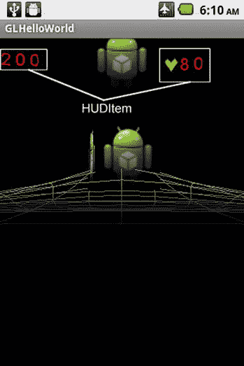

# 六、游戏环境

Abstract

在这一章中，我将介绍游戏环境。我从讲述 Android 上的声音创作开始。我将介绍我们的自定义声音类，然后介绍我们需要对其他类对象进行的修改，以便将声音集成到它们之中。然后，我会通过一个实际操作的例子，当两个立方体相互碰撞时，我们会播放爆炸的声音。然后，我将介绍如何创建平视显示器(HUD)。我们将介绍实现 HUD 所需的新类，随后是一个案例研究，其中为游戏创建了一个平视显示器。接下来，我将介绍保存和加载数据，并展示如何在类中添加代码来保存和加载类数据。最后，我讨论了一个实际操作的例子，在这个例子中，我们修改了我们的案例研究，以保留 HUD 项目数据以及相互碰撞的两个立方体的方向和物理状态。

在这一章中，我将介绍游戏环境。我从讲述 Android 上的声音创作开始。我将介绍我们的自定义声音类，然后介绍我们需要对其他类对象进行的修改，以便将声音集成到它们之中。然后，我会通过一个实际操作的例子，当两个立方体相互碰撞时，我们会播放爆炸的声音。然后，我将介绍如何创建平视显示器(HUD)。我们将介绍实现 HUD 所需的新类，随后是一个案例研究，其中为游戏创建了一个平视显示器。接下来，我将介绍保存和加载数据，并展示如何在类中添加代码来保存和加载类数据。最后，我讨论了一个实际操作的例子，在这个例子中，我们修改了我们的案例研究，以保留 HUD 项目数据以及相互碰撞的两个立方体的方向和物理状态。

## Android 上的声音概述

在这一节中，我将讨论 Sound 类和 Object3d 类中的其他变化，这些变化是为了给我们的 3d 对象添加声音。

### 声音课

Sound 类使用现有的 Android SoundPool 类来播放和管理声音。对保存主声音池的现有 SoundPool 对象的引用保存在`m_SoundPool`中。

`private SoundPool m_SoundPool;`

声音池中特定声音的索引保存在`m_SoundIndex`中。

`private int m_SoundIndex = -1;`

声音构造函数创建一个新的声音。声音从资源 ResourceID 加载到 SoundPool 对象`Pool`。一个索引被返回到这个声音池中新创建的声音。(参见清单 6-1。)

清单 6-1。声音构造器

`Sound(Context iContext, SoundPool Pool, int ResourceID)`

`{`

`m_SoundPool = Pool;`

`m_SoundIndex = m_SoundPool.load(iContext, ResourceID, 1);`

`}`

在播放声音方面，左扬声器音量输出`m_LeftVolume`接受 0 到 1 的范围。

`float   m_LeftVolume = 1;`

右扬声器音量水平`m_RightVolume`也接受 0 到 1 的范围。

`float   m_RightVolume = 1;`

根据回放的优先级`m_Priority`(资源有限时需要)，数字越大，优先级越高。

`int     m_Priority = 1;`

变量`m_Loop`决定声音是否循环。负值意味着声音将永远循环播放。正数指定声音循环的次数。0 表示没有循环。

`int     m_Loop = 0;`

变量`m_Rate`决定了回放声音的速率。1.0 可以正常播放声音。2.0 会以两倍于正常的速率播放声音。范围是 0.5 到 2.0。

`float  m_Rate = 1;`

`PlaySound()`函数通过调用相关声音池的`play()`函数来回放声音，该函数带有声音的索引`m_SoundIndex`，以及描述应该如何播放声音的参数。默认情况下，我们以正常速率在左右扬声器上以最大音量播放声音，没有任何声音循环。(参见清单 6-2。)

清单 6-2。播放声音

`void PlaySound()`

`{`

`/*`

`*      soundID         a soundID returned by the load() function`

`leftVolume      left volume value (range = 0.0 to 1.0)`

`rightVolume     right volume value (range = 0.0 to 1.0)`

`priority        stream priority (0 = lowest priority)`

`loop           loop mode (0 = no loop, -1 = loop forever)`

`rate           playback rate (1.0 = normal playback, range 0.5 to 2.0)`

`*`

`*/`

`m_SoundPool.play(m_SoundIndex, m_LeftVolume` `, m_RightVolume, m_Priority, m_Loop, m_Rate);`

`}`

### 修改 Object3d 类

接下来，必须修改 Object3d 类以使用我们新的 Sound 类。

首先，必须添加新的声音相关变量。

单个 Object3d 类的最大声音数量保存在`MAX_SOUNDS`中。

`private int MAX_SOUNDS = 5;`

当前可用的声音数量保存在`m_NumberSounds`中。

`private int m_NumberSounds = 0;`

音效实际上保存在数组`m_SoundEffects`中，每个元素都是 sound 类型的。有关声音类别的更多信息，请参考“声音类别”一节(前面)。

`private Sound[] m_SoundEffects = new Sound[MAX_SOUNDS];`

数组保存允许你打开或关闭声音效果的布尔值。

`private boolean[] m_SoundEffectsOn = new boolean[MAX_SOUNDS];`

`AddSound()`函数将一个声音对象添加到下一个可用槽的`m_SoundEffects`数组中。如果操作成功，则返回存储该对象的槽号。如果没有可用的插槽，则返回-1。(参见清单 6-3。)

清单 6-3。添加声音对象

`int AddSound(Sound iSound)`

`{`

`int Index = m_NumberSounds;`

`if (m_NumberSounds >= MAX_SOUNDS)`

`{`

`return -1;`

`}`

`m_SoundEffects[Index] = iSound;`

`m_NumberSounds++;`

`return Index;`

`}`

`SetSFXOnOff()`函数打开或关闭所有与 Object3d 类相关的声音。(参见清单 6-4。)

清单 6-4。打开或关闭 SFX

`void SetSFXOnOff(boolean Value)`

`{`

`for (int i = 0; i < m_NumberSounds;i++)`

`{`

`m_SoundEffectsOn[i] = Value;`

`}`

`}`

`AddSound()`函数从资源`ResourceID`和声音池`Pool`创建一个新的声音类对象，并将声音添加到保存这个类的声音效果的`m_SoundEffects`数组中。(参见清单 6-5。)

清单 6-5。从资源创建新声音

`int AddSound(SoundPool Pool, int ResourceID)`

`{`

`int SoundIndex = -1;`

`Sound SFX = new Sound(m_Context, Pool, ResourceID);`

`SoundIndex = AddSound(SFX);`

`return SoundIndex` `;`

`}`

`PlaySound()`功能播放与该类的`SoundIndex`输入参数相关的声音效果。回想一下，每次向 Object3d 类添加新声音时，都会返回一个索引句柄。如果你想回放声音，你必须使用这个索引句柄作为`PlaySound()`函数的输入。(参见清单 6-6。)

清单 6-6。播放声音

`void PlaySound(int SoundIndex)`

`{`

`if ((SoundIndex < m_NumberSounds) &&`

`(m_SoundEffectsOn[SoundIndex]))`

`{`

`// Play Sound`

`m_SoundEffects[SoundIndex].PlaySound();`

`}`

`else`

`{`

`Log.e("OBJECT3D", "ERROR IN PLAYING SOUND, SOUNDINDEX = " + SoundIndex);`

`}`

`}`

## 动手示例:声音

在这一节中，我们将在前面章节中的两个立方体碰撞时加入爆炸声音的播放。每个立方体都会有自己的爆音，每次立方体碰撞都会播放。对于这个动手示例，您必须从`apress.com`的源代码/下载区域下载源代码，并将其安装到您的开发系统的新工作空间中。两个声音效果以`.wav`文件的形式被添加到项目中，并且位于 res/raw 目录中。

### 修改 MyGLRenderer 类

对于这个动手操作的示例，我们需要向 MyGLRenderer 类添加一些代码。

我们将用来存储和回放声音的声音池位于`m_SoundPool`中。

`private SoundPool      m_SoundPool;`

我们的第一个立方体的爆炸声音的声音索引存储在`m_SoundIndex1`中。

`private int m_SoundIndex1;`

我们的第二个立方体的爆炸声音的声音索引存储在`m_SoundIndex2`中。

`private int m_SoundIndex2;`

`m_SFXOn`变量决定声音效果是开还是关。

`private boolean m_SFXOn = true;`

函数创建声音池，用于创建和存储立方体碰撞的声音。(参见清单 6-7。)

SoundPool 构造函数接受以下参数:

*   MaxStreams:这是 SoundPool 对象的最大并发流数，设置为 10。
*   StreamType:音频流类型和游戏的音频流类型通常为`STREAM_MUSIC`。
*   SrcQuality:这是采样速率转换器的质量，目前无效，默认值为 0。

清单 6-7。创建声音池

`void CreateSoundPool()`

`{`

`int maxStreams = 10;`

`int streamType = AudioManager.STREAM_MUSIC;`

`int srcQuality = 0;`

`m_SoundPool = new SoundPool(maxStreams, streamType, srcQuality);`

`if (m_SoundPool == null)`

`{`

`Log.e("RENDERER " , "m_SoundPool creation failure!!!!!!!!!!!!!!!!!!!!!!!!!!!!!!!!!!!!!!!!!!!!!!!!!!!!");`

`}`

`}`

函数使用声音池和特定音效的资源 id 作为输入，创建一个声音并添加到我们的立方体中。每个立方体的声音效果也被打开。(参见清单 6-8。)

清单 6-8。为我们的立方体创造声音

`void CreateSound(Context iContext)`

`{`

`m_SoundIndex1 = m_Cube.AddSound(m_SoundPool, R.raw.explosion2);`

`m_Cube.SetSFXOnOff(m_SFXOn);`

`m_SoundIndex2 = m_Cube2.AddSound(m_SoundPool, R.raw.explosion5);`

`m_Cube2.SetSFXOnOff(m_SFXOn);`

`}`

我们通过调用`onSurfaceCreated()`函数中的`CreateSoundPool()`和`CreateSound()`为每个立方体创建声音池和声音效果，该函数在创建 OpenGL 表面时被调用。(参见清单 6-9。)

清单 6-9。为我们的立方体创建声音池和声音效果

`@Override`

`public void onSurfaceCreated(GL10 unused, EGLConfig config)`

`{`

`m_PointLight = new PointLight(m_Context);`

`SetupLights();`

`// Create a 3d Cube`

`CreateCube(m_Context);`

`// Create a Second Cube`

`CreateCube2(m_Context);`

`// Create a new gravity grid`

`CreateGrid(m_Context);`

`// Create SFX`

`CreateSoundPool();`

`CreateSound(m_Context);`

`}`

接下来，我们必须修改`onDrawFrame()`函数，以播放与每个立方体相关的碰撞声音。每个立方体通过`PlaySound()`函数播放自己的爆炸声音，使用与声音关联的声音索引。参见清单 6-10 中突出显示的代码。

清单 6-10。修改`onDrawFrame()`功能

`@Override`

`public void onDrawFrame(GL10 unused)`

`{`

`GLES20.glClearColor(0.0f, 0.0f, 0.0f, 1.0f);`

`GLES20.glClear( GLES20.GL_DEPTH_BUFFER_BIT | GLES20.GL_COLOR_BUFFER_BIT);`

`m_Camera.UpdateCamera();`

`////////////////////////// Update Object Physics`

`// Cube1`

`m_Cube.UpdateObject3d();`

`boolean HitGround = m_Cube.GetObjectPhysics().GetHitGroundStatus();`

`if (HitGround)`

`{`

`m_Cube.GetObjectPhysics().` `ApplyTranslationalForce(m_Force1);`

`m_Cube.GetObjectPhysics().ApplyRotationalForce(m_RotationalForce, 10.0f);`

`m_Cube.GetObjectPhysics().ClearHitGroundStatus();`

`}`

`// Cube2`

`m_Cube2.UpdateObject3d();`

`// Process Collisions`

`Physics.CollisionStatus TypeCollision` `= m_Cube.GetObjectPhysics().CheckForCollisionSphereBounding(m_Cube, m_Cube2);`

`if ((TypeCollision == Physics.CollisionStatus.COLLISION) ||`

`(TypeCollision == Physics.CollisionStatus.PENETRATING_COLLISION))`

`{`

`m_Cube.GetObjectPhysics().ApplyLinearImpulse(m_Cube, m_Cube2);`

`// SFX`

`m_Cube.PlaySound(m_SoundIndex1);`

`m_Cube2.PlaySound(m_SoundIndex2);`

`}`

`//////////////////////////// Draw Objects`

`m_Cube.DrawObject(m_Camera, m_PointLight)` `;`

`m_Cube2.DrawObject(m_Camera, m_PointLight);`

`////////////////////////// Update and Draw Grid`

`UpdateGravityGrid();`

`m_Grid.DrawGrid(m_Camera)` `;`

`}`

最后的任务是运行我们的项目。每次立方体相互碰撞时，您都会听到碰撞声。

## 平视显示器概述

在这一节中，我将介绍平视显示器的基本特性，以及我们需要创建来支持 HUD 的必要类。

### 我们的 HUD 概述

我们的 HUD 由 HUDItem 类的组件组成。每个 HUD 项目的实际图形图像是一个实现 2D 广告牌系统的 BillBoard 类。在广告牌中，一个扁平的矩形，上面有我们想要在 HUD 上显示的项目的图像，如分数和球员的健康状况，被放置在摄像机前面并转向摄像机，这样图像就显得扁平(见图 6-1 )。HUD 项目通过将新的图形数据直接拷贝到与 HUD 项目相关联的纹理来更新。

图 6-1。

HUD diagram

### 创建广告牌类

在广告牌中，基本的想法是拍摄一个 2D 矩形图像，然后旋转它，使它面向摄像机。通常，这是一种使 2D 图像看起来三维的廉价方法。布告板是在我们的 BillBoard 类中完成的，我将在本节中介绍。

BillBoard 类派生自 Cube 类，而 Cube 类又派生自 Object3d 类。

`public class BillBoard extends Cube`

BillBoard 类的构造函数如清单 6-11 所示。构造函数首先调用超类立方体的构造函数。接下来，将广告牌的比例设置为沿 x 和 y 局部轴的法线，并在 z 轴上最小化，以使广告牌尽可能薄。

清单 6-11。BillBoard 类构造函数

`BillBoard(Context iContext,`

`MeshEx iMeshEx,`

`Texture[] iTextures,`

`Material iMaterial,`

`Shader iShader )`

`{`

`super(iContext, iMeshEx, iTextures, iMaterial, iShader );`

`Vector3 Scale = new Vector3(1.0f,1.0f,0.1f);`

`m_Orientation.SetScale(Scale);`

`}`

`SetBillBoardTowardCamera()`功能是广告牌实际转向摄像机或观众的地方。

实施公告板的过程如下:

Get the front vector of the billboard object and project it onto the xz plane, which is `ForwardVecProj`.   Get the billboard position and project it onto the xz plane, which is `BillBoardPositionProj`.   Get the position of the camera and project it onto the xz plane, which is `CameraPositionProj`.   Calculate the vector from the billboard to the camera, which is `Bill2CameraVecProj`.   Find the angle between the forward or front vector of the billboard object and the camera, which is Theta.   Calculate the rotation axis by calculating the cross-product of the billboard’s front vector and the billboard to camera vector to form the rotation axis.   Rotate the billboard toward the camera.  

前面步骤的可视化描述见图 6-2 ，实现公告板程序的代码见清单 6-12。

图 6-2。

Billboarding

清单 6-12。广告牌程序

`void SetBillBoardTowardCamera(Camera Cam)`

`{`

`// 1\. Get Front Vector of Billboard Object projected on xz plane`

`Vector3 ForwardVecProj = new Vector3(m_Orientation.GetForwardWorldCoords().x,  0, m_Orientation.GetForwardWorldCoords().z);`

`// 2\. Get The BillBoard Position projected on xz plane`

`Vector3 BillBoardPositionProj = new Vector3(m_Orientation.GetPosition().x, 0, m_Orientation.GetPosition().z);`

`// 3\. Get Position of Camera on 2d XZ Plane`

`Vector3 CameraPositionProj = new Vector3(Cam.GetCameraEye().x, 0, Cam.GetCameraEye().z);`

`// 4\. Calculate Vector from Billboard to Camera`

`Vector3 Bill2CameraVecProj = Vector3.Subtract(CameraPositionProj , BillBoardPositionProj);`

`Bill2CameraVecProj.Normalize();`

`// 5\. Find Angle between forward of Billboard object and camera`

`// P = forwardxy`

`// Q = Vec_Bill_Camera`

`// P and Q are normalized Vectors`

`// P.Q = P*Q*cos(theta)`

`// P.Q/P*Q = cos(theta)`

`// acos(P.Q/P*Q) = theta;`

`// P.Q > 0 then angle between vectors is less than 90 deg`

`// P.Q < 0 then angle between vectors is greater than 90 deg.`

`// P.Q = 0 then angle between vector is exactly 90 degs.`

`// Get current theta`

`// returns 0-PI radians`

`float Theta = (float)Math.acos(ForwardVecProj.DotProduct(Bill2CameraVecProj));`

`float DegreeTheta = Theta * 180.0f/Physics.PI;`

`// 6\. Cross Product to form rotation axis`

`Vector3 RotAxis = Vector3.CrossProduct(ForwardVecProj, Bill2CameraVecProj);`

`// 7\. Rotate BillBoard Toward Camera`

`// cos in radians`

`if ((Math.cos(Theta) < 0.9999) && (Math.cos(Theta) > -0.9999))`

`{`

`m_Orientation.SetRotationAxis(RotAxis);`

`m_Orientation.AddRotation(DegreeTheta);`

`}`

`else`

`{`

`//Log.e( "BILLBOARD", "No Cylindrical Rotation!! , Theta = " + Theta);`

`}`

`}`

最后，通过调用清单 6-13 中讨论的`SetBillBoardTowardCamera()`函数，继续调用`UpdateObject3d()`函数来更新广告牌对象的方向。

清单 6-13。更新广告牌

`void UpdateObject3d(Camera Cam)`

`{`

`super.UpdateObject3d();`

`SetBillBoardTowardCamera(Cam);`

`}`

### 创建 BillBoardFont 类

BillBoardFont 类用于将特定字符与广告牌纹理图像相关联。

BillBoardFont 类派生自 BillBoard 类。

`public class BillBoardFont extends BillBoard`

变量`m_Character`用于保存表示该类广告牌纹理的字母数字值。

`private char m_Character;`

清单 6-14 显示了`BillBoardFont()`构造函数。首先，调用超类的构造函数，这将是 BillBoard 类的构造函数。然后，这个广告牌所代表的字符被设置在变量`m_Character`中。

清单 6-14。`BillBoardFont()`构造器

`BillBoardFont(Context iContext,  MeshEx iMeshEx, Texture[] iTextures, Material iMaterial, Shader iShader, char Character)`

`{`

`super(iContext, iMeshEx, iTextures, iMaterial, iShader );`

`m_Character = Character;`

`}`

`GetCharacter()`函数返回与该广告牌相关联的字符。

`char GetCharacter() {return m_Character;}`

`SetCharacter()`功能设置将与该广告牌关联的字符。

`void SetCharacter(char value) { m_Character = value;}`

如果输入参数值是该广告牌纹理所代表的字母数字字符，则`IsFontCharacter()`函数返回 true，否则返回 false。(参见清单 6-15。)

清单 6-15。测试字符值

`boolean IsFontCharacter(char value)`

`{`

`if (m_Character == value)`

`{`

`return true;`

`}`

`else`

`{`

`return false;`

`}`

`}`

### 修改纹理类

接下来，我们必须修改纹理类来添加一个新函数。

`CopySubTextureToTexture()`函数将输入参数`BitmapImage`中的纹理复制到与纹理对象相关的位图中。使用此功能的主要目的是更新 HUD 上的数据，如分数、健康等。HUD 上显示的每个字母和数字都有一个与之关联的单独的图形位图。例如,“乐谱”的 HUD 项目有一个关联的广告牌纹理。当分数需要更新时，使用`CopySubTextureToTexture()`函数将单个位图复制到广告牌纹理，并放置在位图上的 XOffset，YOffset 位置。(参见清单 6-16。)

清单 6-16。复制纹理

`void CopySubTextureToTexture(int Level, int XOffset, int YOffset, Bitmap BitmapImage)`

`{`

`// Copies the texture in BitmapImage to the bitmap associated with this Texture object`

`/*`

`public static void texSubImage2D (int target, int level, int xoffset, int yoffset, Bitmap bitmap)`

`Added in API level 1`

`Calls glTexSubImage2D() on the current OpenGL context. If no context is current the`

`behavior is the same as calling glTexSubImage2D() with no current context, that is, eglGetError()`

`will return the appropriate error. Unlike glTexSubImage2D() bitmap cannot be null and will raise`

`an exception in that case. All other parameters are identical to those used for glTexSubImage2D().`

`*/`

`ActivateTexture();`

`GLUtils.texSubImage2D(GLES20.GL_TEXTURE_2D, Level, XOffset, YOffset, BitmapImage);`

`CheckGLError("GLUtils.texSubImage2D");`

`}`

### 创建 BillBoardCharacterSet 类

BillBoardCharacterSet 类保存用于 HUD 的字体。`Settext()`函数设置您想要显示的文本，然后您使用`RenderToBillBoard()`函数将该文本放在输入广告牌对象的纹理上。

该组中的最大字符数由`MAX_CHARACTERS`指定。

`static int MAX_CHARACTERS = 50;`

字符集中实际的字符数保存在`m_NumberCharacters`中。

`private int m_NumberCharacters = 0; // Number characters in the character set`

字符集本身由一个数组`BillBoardFonts`组成。

`private BillBoardFont[] m_CharacterSet = new BillBoardFont[MAX_CHARACTERS];`

调用`Settext()`函数时要放在广告牌上的文本存储在`m_Text`中，它是一个长度为`MAX_CHARACTERS_TEXT`的字符数组。

`private int MAX_CHARACTERS_TEXT = 100;`

`private char[] m_Text = new char[MAX_CHARACTERS_TEXT];`

对应于`m_Text`中字符的 BillBoardFont 对象存储在`m_TextBillBoard`中。

`private BillBoardFont[] m_TextBillBoard = new BillBoardFont[MAX_CHARACTERS_TEXT];`

`GetNumberCharactersInSet()`函数返回字符集中的当前字符数。

`int GetNumberCharactersInSet() {return m_NumberCharacters;}`

`GetCharacter()`函数返回与该字符集相关的位于位置索引的 BillBoardFont 对象。(参见清单 6-17。)

清单 6-17。`GetCharacter`功能

`BillBoardFont GetCharacter(int index)`

`{`

`BillBoardFont Font = null;`

`if (index < m_NumberCharacters)`

`{`

`Font = m_CharacterSet[index];`

`}`

`return Font` `;`

`}`

`GetFontWidth()`函数获取代表该字符集字符的位图宽度。(参见清单 6-18。)

清单 6-18。获取字体的宽度

`int GetFontWidth()`

`{`

`int Width = 0;`

`if (m_NumberCharacters > 0)`

`{`

`BillBoardFont Character = m_CharacterSet[0];`

`Texture Tex = Character.GetTexture(0);`

`Bitmap Image = Tex.GetTextureBitMap();`

`Width = Image.getWidth();`

`}`

`return Width;`

`}`

函数的作用是:返回代表该字符集字符的位图高度。(参见清单 6-19。)

清单 6-19。获取字体高度

`int GetFontHeight()`

`{`

`int Height = 0;`

`if (m_NumberCharacters > 0)`

`{`

`BillBoardFont Character = m_CharacterSet[0];`

`Texture Tex = Character.GetTexture(0);`

`Bitmap Image = Tex.GetTextureBitMap();`

`Height = Image.getHeight();`

`}`

`return Height` `;`

`}`

`AddToCharacterSet()`函数将一个 BillBoardFont 对象添加到字符集中。如果添加成功，该函数返回 true，如果没有足够的空间，则返回 false。(参见清单 6-20。)

清单 6-20。将 BillBoardFont 对象添加到字符集中

`boolean AddToCharacterSet(BillBoardFont Character)`

`{`

`if (m_NumberCharacters < MAX_CHARACTERS)`

`{`

`m_CharacterSet[m_NumberCharacters] = Character;`

`m_NumberCharacters++;`

`return true;`

`}`

`else`

`{`

`Log.e("BILLBOARD CHARACTER SET" , "NOT ENOUGH ROOM TO ADD ANOTHER CHARACTER TO CHARACTER SET");`

`return false;`

`}`

`}`

`FindBillBoardCharacter()`功能在字符集中搜索输入字符。如果找到了，则返回相应的 BillBoardFont 对象。否则返回 Null。(参见清单 6-21。)

清单 6-21。搜索字符集

`BillBoardFont FindBillBoardCharacter(char character)`

`{`

`BillBoardFont Font = null;`

`for (int i = 0; i < m_NumberCharacters; i++)`

`{`

`if (m_CharacterSet[i].IsFontCharacter(character))`

`{`

`Font = m_CharacterSet[i];`

`}`

`}`

`return Font;`

`}`

函数的作用是:将一个字符数组转换成存储在数组中的相应的 BillBoardFont 对象数组。(参见清单 6-22。)

清单 6-22。设置要呈现的文本

`void SetText(char[] Text)`

`{`

`String TextStr = new String(Text);`

`TextStr = TextStr.toLowerCase();`

`m_Text = TextStr.toCharArray();`

`for (int i = 0; i < m_Text.length; i++)`

`{`

`BillBoardFont Character = FindBillBoardCharacter(m_Text[i]);`

`if (Character != null)`

`{`

`m_TextBillBoard[i] = Character;`

`}`

`else`

`{`

`Log.e("CHARACTER SET ERROR" , "SETTEXT ERROR , " + m_Text[i] + " NOT FOUND!!!!!")` `;`

`}`

`}`

`}`

`DrawFontToComposite()`函数将 BillBoardFont 对象`Obj`中的位图图像复制到 BillBoard 对象`Composite`上的位图图像中，从位置 X，y 开始。`Composite`变量中目标纹理的宽度也被测试，以确保源纹理适合目标纹理。(参见清单 6-23。)

清单 6-23。将字体从字符集绘制到广告牌对象

`void DrawFontToComposite(BillBoardFont Obj, int X, int Y, BillBoard Composite)`

`{`

`Texture TexSource = Obj.GetTexture(0);`

`Bitmap BitmapSource = TexSource.GetTextureBitMap();`

`int BitmapSourceWidth = BitmapSource.getWidth();`

`Texture TexDest = Composite.GetTexture(0);`

`Bitmap BitmapDest = TexDest.GetTextureBitMap();`

`int BitmapDestWidth = BitmapDest.getWidth();`

`// Put Sub Image on Composite`

`int XEndTexture = X + BitmapSourceWidth;`

`if (XEndTexture >= BitmapDestWidth)`

`{`

`Log.e("BillBoardCharacterSet::DrawFontToComposite" , "ERROR Overwriting Dest Texture, Last X Position To Write = " + XEndTexture + ", Max Destination Width = " + BitmapDestWidth);`

`}`

`else`

`{`

`TexDest.CopySubTextureToTexture(0, X, Y, BitmapSource)` `;`

`}`

`}`

`RenderToBillBoard()`函数将`SetText()`函数设置的文本渲染到位图上位置 XOffset，YOffset 的`Composite`输入变量中的位图纹理，0，0 表示纹理的左上角。使用`DrawFontToComposite()`功能在`Composite`上绘制每个角色图形。(参见清单 6-24。)

清单 6-24。将文本渲染到广告牌上

`void RenderToBillBoard(BillBoard Composite, int XOffset, int YOffset)`

`{`

`int Length = m_Text.length;`

`for (int i = 0; i < Length; i++)`

`{`

`BillBoardFont Character = m_TextBillBoard[i];`

`if (Character != null)`

`{`

`// Draw this font to the composite by copying the bitmap image data`

`Texture Tex = Character.GetTexture(0);`

`Bitmap Image = Tex.GetTextureBitMap();`

`int Width = Image.getWidth();`

`int XCompositeOffset = XOffset + (Width * i);`

`DrawFontToComposite(Character, XCompositeOffset, YOffset, Composite);`

`}`

`}`

`}`

### 创建 HUDItem 类

HUDItem 类保存单个 HUD 项目的数据，如分数或健康统计数据。

如果这个 HUDItem 正在使用并且有效，那么`m_ItemValid`为真；否则就是假的。

`private boolean m_ItemValid;`

用于引用该 HUD 项目的名称保存在`m_ItemName`中。

`private String m_ItemName;`

与该 HUD 项目相关的数值(如果有)保存在`m_NumericalValue`中。

`private int m_NumericalValue;`

与该 HUD 项目相关的文本值(如果有)保存在`m_TextValue`中。

`private String m_TextValue = null;`

HUD 项目在本地 HUD 坐标中的位置，x = 0，y = 0 是摄像机视图的中心。

`private Vector3 m_ScreenPosition;`

`m_Text`变量保存与 HUD 项目相关的文本和文本字符图形，如果有的话。

`private BillBoardCharacterSet m_Text;`

`m_Icon`变量保存一个与 HUD 项目相关的图标，如果有的话。健康统计的心脏图形就是一个例子。

`private Texture m_Icon;`

`m_HUDImage`变量存储 HUD 项目的实际完整图形图像。字母数字字符和图形图标被复制到该广告牌上，以便最终显示在 HUD 上。

`private BillBoard m_HUDImage;`

如果`m_Dirty`为真，那么`m_HUDImage`广告牌必须被更新，因为该项已经改变了值。比如玩家的分数变了。

`private boolean m_Dirty = false;`

如果 HUD 项目可见，则`m_IsVisible`为真。否则就是假的。

`private boolean m_IsVisible = true;`

还有一些函数可以从类外部访问前面的私有变量。更多信息请参考`apress.com`源代码/下载区的实际代码。

清单 6-25 显示了 HUDItem 类的构造函数。

清单 6-25。HUDItem 构造函数

`HUDItem(String ItemName,`

`int NumericalValue,`

`Vector3 ScreenPosition,`

`BillBoardCharacterSet Text,`

`Texture Icon,`

`BillBoard HUDImage)`

`{`

`m_ItemName = ItemName;`

`m_NumericalValue= NumericalValue;`

`m_ScreenPosition= ScreenPosition;`

`m_Text = Text;`

`m_Icon = Icon;`

`m_HUDImage= HUDImage;`

`}`

### 创建 HUD 类

现在，我们需要创建实际的 HUD 类来表示我们的 HUD。

变量`MAX_HUDITEMS`保存 HUD 中可以包含的最大项目数，设置为 10。

`private int MAX_HUDITEMS = 10;`

`m_HUDItems`数组保存了这个 HUD 的项目。

`private HUDItem[] m_HUDItems = new HUDItem[MAX_HUDITEMS];`

由黑色背景组成的空白纹理保存在`m_BlankTexture`中。

`private Texture m_BlankTexture;`

HUD 构造函数如清单 6-26 所示。构造器从`R.drawable.blankhud`资源中创建并加载一个新的空白纹理，并将其分配给`m_BlankTexture`。HUD 项目的所有插槽都用一个空项目初始化，并设定为无效。

清单 6-26。平视显示器构造器

`HUD(Context iContext)`

`{`

`m_BlankTexture = new Texture(iContext, R.drawable.blankhud);`

`String  ItemName = "NONE";`

`int     NumericalValue= 0;`

`Vector3 ScreenPosition= null;`

`BillBoardCharacterSet CharacterSet = null;`

`Texture Icon = null;`

`BillBoard HUDImage = null;`

`// Initialize m_HUDItems`

`for (int i = 0; i < MAX_HUDITEMS; i++)`

`{`

`m_HUDItems[i] = new HUDItem(ItemName, NumericalValue, ScreenPosition, CharacterSet,Icon, HUDImage);`

`m_HUDItems[i].SetItemValidState(false);`

`}`

`}`

`FindEmptyHUDItemSlot()`函数查找并返回一个空的 HUD 项目插槽的索引，如果没有插槽可用，则返回-1。(参见清单 6-27。)

清单 6-27。查找空的 HUD 项目插槽

`int FindEmptyHUDItemSlot()`

`{`

`int EmptySlot = -1;`

`for (int i = 0; i < MAX_HUDITEMS; i++)`

`{`

`if (m_HUDItems[i].IsValid() == false)`

`{`

`return i;`

`}`

`}`

`return EmptySlot;`

`}`

`AddHUDItem()`功能向 HUD 中添加一个新项目。该项目被设置为有效的 HUD 项目，也设置为 dirty，因为我们必须在添加新项目后将其渲染到 HUD 上。(参见清单 6-28。)

清单 6-28。添加新的 HUD 项目

`boolean AddHUDItem(HUDItem Item)`

`{`

`boolean result = false;`

`int EmptySlot =  FindEmptyHUDItemSlot();`

`if (EmptySlot >= 0)`

`{`

`m_HUDItems[EmptySlot] = Item;`

`m_HUDItems[EmptySlot].SetItemValidState(true);`

`m_HUDItems[EmptySlot].SetDirty(true);`

`result = true;`

`}`

`return result` `;`

`}`

`FindHUDItem()`函数返回名称为 ID 的 HUD 项目的索引，如果没有这样的项目，则返回-1。(参见清单 6-29。)

清单 6-29。使用 ID 在 HUD 上查找项目

`int FindHUDItem(String ID)`

`{`

`int Slot = -1;`

`for (int i = 0; i < MAX_HUDITEMS; i++)`

`{`

`if ((m_HUDItems[i].GetName() == ID) &&`

`(m_HUDItems[i].IsValid()))`

`{`

`Slot = i;`

`}`

`}`

`return Slot;`

`}`

如果 HUD 中有一个名为`ItemID`的项目，`GetHUDItem()`函数将返回一个 HUDItem 对象。如果 HUD 中没有这样的项目，则返回一个空指针。(参见清单 6-30。)

清单 6-30。按项目 ID 取回 HUD 项目

`HUDItem GetHUDItem(String ItemID)`

`{`

`HUDItem Item = null;`

`int Slot = FindHUDItem(ItemID);`

`if (Slot >= 0)`

`{`

`Item = m_HUDItems[Slot];`

`}`

`return Item` `;`

`}`

`DeleteHUDItem()`功能通过将其状态设置为无效，从 HUD 中删除名为`ItemName`的 HUD 项目(如果存在)。然后它返回 true。如果找不到 HUD 项目，该函数将返回 false。(参见清单 6-31。)

清单 6-31。删除 HUD 中的项目

`boolean DeleteHUDItem(String ItemName)`

`{`

`boolean result = false;`

`int Slot =  FindHUDItem(ItemName);`

`if (Slot >= 0)`

`{`

`m_HUDItems[Slot].SetItemValidState(false);`

`result = true;`

`}`

`return result;`

`}`

`UpdateHUDItemNumericalValue()`函数查找并更新与 ID 匹配的 HUD 项目的数值。它还将 dirty 状态设置为 true，这样更新的图形数据将被复制到与 HUD 项目相关联的`m_HUDImage` billboard 纹理中。(参见清单 6-32。)

清单 6-32。更新数字 HUD 项目

`void UpdateHUDItemNumericalValue(String ID, int NumericalValue)`

`{`

`int Slot =  FindHUDItem(ID);`

`HUDItem HItem = m_HUDItems[Slot];`

`if (HItem != null)`

`{`

`// Update Key fields in HUDItem`

`HItem.SetNumericalValue(NumericalValue);`

`HItem.SetDirty(true` `);`

`}`

`}`

`UpdateHUDItem()`功能使用摄像头更新 HUD 项目`Item`。这意味着

The position in the world for this HUD item is calculated based on the camera’s position, orientation, and the local HUD coordinates of the HUD item. In local HUD coordinates, the x = 0 and y = 0 means the center of the camera viewpoint. So, local coordinates of (1,2) mean that the HUD item is placed 1 unit to the right of center and 2 units up above the center. When z = 0, this means the HUD item is placed at the position of the near projection plane, which would probably make the item unviewable, so you require a positive value here, such as 0.5.   If the HUD item is dirty, its billboard texture is updated. That is the billboard texture associated with the HUDItem object, which is `m_HUDImage` updated.   First `m_HUDImage` is cleared by copying a blank texture over it.   If there is an icon associated with this HUD item, it is copied to `m_HUDImage`.   The numerical value of the HUD item is rendered to `m_HUDImage`.   If there is a string value associated with the HUD item, then it is rendered to `m_HUDImage`.   The HUD item has been updated as “cleaned,” so it is no longer set to “dirty.”   The HUD item is positioned in the world using the location calculated in the first step.   The `m_HUDImage`’s `UpdateObject3d()` function is then called, so that the billboard is turned to face the camera.  

源代码见清单 6-33。

清单 6-33。更新 HUD 项目

`void UpdateHUDItem(Camera Cam, HUDItem Item)`

`{`

`// Update HUDItem position and rotation in the 3d world`

`// to face the camera.`

`Vector3 PositionLocal = Item.GetLocalScreenPosition();`

`Vector3 PositionWorld = new Vector3(0,0,0);`

`Vector3 CamPos = new Vector3(Cam.GetCameraEye().x, Cam.GetCameraEye().y, Cam.GetCameraEye().z);`

`Vector3 CameraForward = Cam.GetOrientation().GetForwardWorldCoords();`

`Vector3 CameraUp = Cam.GetOrientation().GetUpWorldCoords();`

`Vector3 CameraRight = Cam.GetOrientation().GetRightWorldCoords();`

`// Local Camera Offsets`

`Vector3 CamHorizontalOffset = Vector3.Multiply(PositionLocal.x, CameraRight);`

`Vector3 CamVerticalOffset = Vector3.Multiply(PositionLocal.y, CameraUp);`

`float ZOffset = Cam.GetProjNear() + PositionLocal.z;`

`Vector3 CamDepthOffset = Vector3.Multiply(ZOffset, CameraForward);`

`// Create Final PositionWorld Vector`

`PositionWorld = Vector3.Add(CamPos, CamHorizontalOffset);`

`PositionWorld = Vector3.Add(PositionWorld, CamVerticalOffset);`

`PositionWorld = Vector3.Add(PositionWorld, CamDepthOffset);`

`// Put images from icon and numerical data onto the composite hud texture`

`BillBoard HUDComposite = Item.GetHUDImage();`

`Texture HUDCompositeTexture = HUDComposite.GetTexture(0);`

`Bitmap  HUDCompositeBitmap = HUDCompositeTexture.GetTextureBitMap();`

`BillBoardCharacterSet Text = Item.GetText();`

`int FontWidth = Text.GetFontWidth();`

`Texture Icon = Item.GetIcon();`

`int IconWidth = 0;`

`if (Item.IsDirty())`

`{`

`// Clear Composite Texture;`

`Bitmap BlankBitmap = m_BlankTexture.GetTextureBitMap();`

`HUDCompositeTexture.CopySubTextureToTexture(0, 0, 0, BlankBitmap);`

`if (Icon != null)`

`{`

`// Draw Icon on composite`

`Bitmap HealthBitmap = Icon.GetTextureBitMap();`

`IconWidth = HealthBitmap.getWidth();`

`HUDCompositeTexture.CopySubTextureToTexture(0,0,0, HealthBitmap);`

`}`

`// Update Numerical Value and render to composite billboard`

`String text = String.valueOf(Item.GetNumbericalValue());`

`Text.SetText(text.toCharArray());`

`Text.RenderToBillBoard(HUDComposite, IconWidth, 0);`

`// Update Text Value and render to composite billboard`

`String TextValue = Item.GetTextValue();`

`if (TextValue != null)`

`{`

`int XPosText = IconWidth + (text.length() * FontWidth);`

`Text.SetText(TextValue.toCharArray());`

`Text.RenderToBillBoard(HUDComposite, XPosText, 0);`

`}`

`Item.SetDirty(false);`

`}`

`HUDComposite.m_Orientation.GetPosition().Set(PositionWorld.x, PositionWorld.y, PositionWorld.z);`

`// Update BillBoard orientation`

`HUDComposite.UpdateObject3d(Cam);`

`}`

`UpdateHUD()`函数通过调用`UpdateHUDItem()`函数更新每个可见且有效的 HUD 项目。(参见清单 6-34。)

清单 6-34。更新 HUD

`void UpdateHUD(Camera Cam)`

`{`

`for (int i = 0; i < MAX_HUDITEMS; i++)`

`{`

`if (m_HUDItems[i].IsValid() && m_HUDItems[i].IsVisible())`

`{`

`UpdateHUDItem(Cam,m_HUDItems[i]);`

`}`

`}`

`}`

`RenderHUD()`函数为每个可见且有效的 HUD 项目呈现`m_HUDImage`广告牌对象。(参见清单 6-35。)

清单 6-35。渲染 HUD

`void RenderHUD(Camera Cam, PointLight light)`

`{`

`for (int i = 0; i < MAX_HUDITEMS; i++)`

`{`

`if (m_HUDItems[i].IsValid()&& m_HUDItems[i].IsVisible())`

`{`

`HUDItem Item = m_HUDItems[i];`

`BillBoard HUDComposite = Item.GetHUDImage();`

`HUDComposite.DrawObject(Cam, light);`

`}`

`}`

`}`

### 修改 Object3d 类

接下来，我们需要向 Object3d 类添加一些代码，以便 HUD 项目的黑色部分在与其他对象一起显示在屏幕上时是透明的。

如果我们想要将正在渲染的对象的颜色与背景中已经存在的颜色相结合，那么变量`m_Blend`被设置为 true，否则为 false。

`private boolean m_Blend = false;`

`GetMaterial()`函数返回对象材质的引用。

`Material GetMaterial() {return m_Material;}`

`SetBlend()`函数设置`m_Blend`变量。

`void SetBlend(boolean value) { m_Blend = value; }`

添加了`DrawObject()`函数代码，以在`m_Blend`为真时启用混合，并在渲染对象后禁用混合。参见清单 6-36 中粗体显示的代码。

清单 6-36。修改`DrawObject()`功能

`void DrawObject(Camera Cam, PointLight light)`

`{`

`if (m_Blend)`

`{`

`GLES20.glEnable(GLES20.GL_BLEND);`

`GLES20.glBlendFunc(GLES20.GL_SRC_ALPHA, GLES20.GL_ONE);`

`}`

`if (m_Visible)`

`{`

`DrawObject(Cam, light, m_Orientation.GetPosition(), m_Orientation.GetRotationAxis(), m_Orientation.GetScale());`

`}`

`if (m_Blend)`

`{`

`GLES20.glDisable(GLES20.GL_BLEND);`

`}`

`}`

## 无人机网格案例研究:创建平视显示器

在本节中，我们将为我们的无人机网格案例研究游戏创建 HUD。抬头显示器将包括两个抬头显示器项目。一项是玩家的分数，另一项是玩家的健康。如果你还没有这样做，你需要下载本章的 Android 项目，并将其安装到一个新的工作空间。该项目将包含字体的图形和球员健康的图标。

### 修改 MyGLRenderer 类

我们将不得不修改 MyGLRenderer 类，使其不同于之前处理声音的动手示例。

`m_CharacterSetTextures`数组保存 HUD 的字符集纹理，由字母、数字和额外的字符组成。

`private Texture[] m_CharacterSetTextures = new Texture[BillBoardCharacterSet.MAX_CHARACTERS];`

`m_CharacterSet`变量保存我们将用于 HUD 的字符集。

`private BillBoardCharacterSet m_CharacterSet = null;`

`m_HUDTexture`保存用于 HUD 项目的纹理。

`private Texture m_HUDTexture = null;`

`m_HUDComposite`保存了一个将用于 HUD 项目的广告牌的引用。

`private BillBoard m_HUDComposite = null;`

HUD 是`m_HUD`。

`private HUD m_HUD = null;`

玩家的生命值存储在`m_Health`中。

`private int m_Health = 100;`

玩家的分数存储在`m_Score`中。

`private int m_Score = 0;`

`m_CharacterSet`所需的纹理在`CreateCharacterSetTextures()`函数中初始化，并放在`m_CharacterSetTextures`中。(参见清单 6-37。)

清单 6-37。为角色集创建纹理

`void CreateCharacterSetTextures(Context iContext)`

`{`

`// Numeric`

`m_CharacterSetTextures[0] = new Texture(iContext, R.drawable.charset1);`

`m_CharacterSetTextures[1] = new Texture(iContext, R.drawable.charset2);`

`m_CharacterSetTextures[2] = new Texture(iContext, R.drawable.charset3);`

`m_CharacterSetTextures[3] = new Texture(iContext, R.drawable.charset4);`

`m_CharacterSetTextures[4] = new Texture(iContext, R.drawable.charset5);`

`m_CharacterSetTextures[5] = new Texture(iContext, R.drawable.charset6);`

`m_CharacterSetTextures[6] = new Texture(iContext, R.drawable.charset7);`

`m_CharacterSetTextures[7] = new Texture(iContext, R.drawable.charset8);`

`m_CharacterSetTextures[8] = new Texture(iContext, R.drawable.charset9);`

`m_CharacterSetTextures[9]` `= new Texture(iContext, R.drawable.charset0);`

`// Alphabet`

`m_CharacterSetTextures[10] = new Texture(iContext, R.drawable.charseta);`

`m_CharacterSetTextures[11] = new Texture(iContext, R.drawable.charsetb);`

`m_CharacterSetTextures[12] = new Texture(iContext, R.drawable.charsetc);`

`m_CharacterSetTextures[13] = new Texture(iContext, R.drawable.charsetd);`

`m_CharacterSetTextures[14] = new Texture(iContext, R.drawable.charsete);`

`m_CharacterSetTextures[15] = new Texture(iContext, R.drawable.charsetf);`

`m_CharacterSetTextures[16] = new Texture(iContext, R.drawable.charsetg);`

`m_CharacterSetTextures[17] = new Texture(iContext, R.drawable.charseth);`

`m_CharacterSetTextures[18] = new Texture(iContext, R.drawable.charseti);`

`m_CharacterSetTextures[19] = new Texture(iContext, R.drawable.charsetj);`

`m_CharacterSetTextures[20] = new Texture(iContext, R.drawable.charsetk);`

`m_CharacterSetTextures[21] = new Texture(iContext, R.drawable.charsetl);`

`m_CharacterSetTextures[22] = new Texture(iContext, R.drawable.charsetm);`

`m_CharacterSetTextures[23] = new Texture(iContext, R.drawable.charsetn);`

`m_CharacterSetTextures[24] = new Texture(iContext, R.drawable.charseto);`

`m_CharacterSetTextures[25] = new Texture(iContext, R.drawable.charsetp);`

`m_CharacterSetTextures[26] = new Texture(iContext, R.drawable.charsetq);`

`m_CharacterSetTextures[27] = new Texture(iContext, R.drawable.charsetr);`

`m_CharacterSetTextures[28] = new Texture(iContext, R.drawable.charsets);`

`m_CharacterSetTextures[29]` `= new Texture(iContext, R.drawable.charsett);`

`m_CharacterSetTextures[30] = new Texture(iContext, R.drawable.charsetu);`

`m_CharacterSetTextures[31] = new Texture(iContext, R.drawable.charsetv);`

`m_CharacterSetTextures[32] = new Texture(iContext, R.drawable.charsetw);`

`m_CharacterSetTextures[33] = new Texture(iContext, R.drawable.charsetx);`

`m_CharacterSetTextures[34] = new Texture(iContext, R.drawable.charsety);`

`m_CharacterSetTextures[35] = new Texture(iContext, R.drawable.charsetz);`

`// Debug Symbols`

`m_CharacterSetTextures[36] = new Texture(iContext, R.drawable.charsetcolon);`

`m_CharacterSetTextures[37] = new Texture(iContext, R.drawable.charsetsemicolon);`

`m_CharacterSetTextures[38] = new Texture(iContext, R.drawable.charsetcomma);`

`m_CharacterSetTextures[39] = new Texture(iContext, R.drawable.charsetequals);`

`m_CharacterSetTextures[40] = new Texture(iContext, R.drawable.charsetleftparen);`

`m_CharacterSetTextures[41] = new Texture(iContext, R.drawable.charsetrightparen);`

`m_CharacterSetTextures[42]` `= new Texture(iContext, R.drawable.charsetdot);`

`}`

`SetUpHUDComposite()`函数将`m_HUDComposite`初始化为 BillBoard 对象，该对象将用于创建 HUD 项目。`m_HUDComposite`将显示玩家的实际得分或健康水平。(参见清单 6-38。)

清单 6-38。设置用于 HUD 项目的广告牌对象

`void SetUpHUDComposite(Context iContext)`

`{`

`m_HUDTexture = new Texture(iContext, R.drawable.hud);`

`Shader Shader = new Shader(iContext, R.raw.vsonelight, R.raw.fsonelight);      // ok`

`MeshEx Mesh = new MeshEx(8,0,3,5,Cube.CubeData, Cube.CubeDrawOrder);`

`// Create Material for this object`

`Material Material1 = new Material();`

`Material1.SetEmissive(1.0f, 1.0f, 1.0f);`

`Texture[] Tex = new Texture[1];`

`Tex[0] = m_HUDTexture;`

`m_HUDComposite = new BillBoard(iContext, Mesh, Tex, Material1, Shader);`

`// Set Intial Position and Orientation`

`Vector3 Position = new Vector3(0.0f, 3.0f, 0.0f);`

`Vector3 Scale = new Vector3(1.0f,0.1f,0.01f);`

`m_HUDComposite.m_Orientation.SetPosition(Position);`

`m_HUDComposite.m_Orientation.SetScale(Scale);`

`m_HUDComposite.GetObjectPhysics().SetGravity(false);`

`// Set black portion of HUD to transparent`

`m_HUDComposite.GetMaterial().SetAlpha(1.0f)` `;`

`m_HUDComposite.SetBlend(true);`

`}`

`CreateCharacterSet()`函数创建一个新的 BillBoardCharacterSet 对象用于我们的 HUD。对于我们想要添加到字符集的每个字符、数字或其他符号，我们创建一个新的 BillBoardFont 对象，并用与其相关联的纹理和文本值初始化它。然后我们用新创建的字体调用`AddToCharacterSet()`，将这个字体添加到我们的字符集中。还要注意，我们使用了不同于普通的片段着色器，即`R.raw.fsonelightnodiffuse`。该片段着色器仅使用纹理的颜色来确定片段的最终颜色。(参见清单 6-39。)

清单 6-39。创建字符集

`void CreateCharacterSet(Context iContext)`

`{`

`//Create Shader`

`Shader Shader = new Shader(iContext, R.raw.vsonelight, R.raw.fsonelightnodiffuse);`

`// ok`

`// Create Debug Local Axis Shader`

`MeshEx Mesh = new MeshEx(8,0,3,5,Cube.CubeData, Cube.CubeDrawOrder);`

`// Create Material for this object`

`Material Material1 = new Material();`

`Material1.SetEmissive(1.0f, 1.0f, 1.0f);`

`// Create Texture`

`CreateCharacterSetTextures(iContext);`

`// Setup HUD`

`SetUpHUDComposite(iContext);`

`m_CharacterSet = new BillBoardCharacterSet();`

`int NumberCharacters = 43;`

`char[] Characters = new char[BillBoardCharacterSet.MAX_CHARACTERS];`

`Characters[0] = '1';`

`Characters[1] = '2';`

`Characters[2] = '3';`

`Characters[3] = '4';`

`Characters[4] = '5';`

`Characters[5] = '6';`

`Characters[6] = '7';`

`Characters[7] = '8';`

`Characters[8] = '9';`

`Characters[9] = '0';`

`// AlphaBets`

`Characters[10] = 'a';`

`Characters[11] = 'b';`

`Characters[12] = 'c';`

`Characters[13] = 'd';`

`Characters[14] = 'e';`

`Characters[15] = 'f';`

`Characters[16] = 'g';`

`Characters[17] = 'h';`

`Characters[18] = 'i';`

`Characters[19] = 'j';`

`Characters[20] = 'k';`

`Characters[21] = 'l';`

`Characters[22] = 'm';`

`Characters[23] = 'n';`

`Characters[24] = 'o';`

`Characters[25] = 'p';`

`Characters[26] = 'q';`

`Characters[27] = 'r';`

`Characters[28] = 's';`

`Characters[29] = 't';`

`Characters[30] = 'u';`

`Characters[31] = 'v';`

`Characters[32] = 'w';`

`Characters[33] = 'x';`

`Characters[34] = 'y';`

`Characters[35] = 'z';`

`// Debug`

`Characters[36] = ':';`

`Characters[37] = ';';`

`Characters[38] = ',';`

`Characters[39] = '=';`

`Characters[40] = '(';`

`Characters[41] = ')';`

`Characters[42] = '.';`

`for (int i = 0; i < NumberCharacters; i++)`

`{`

`Texture[] Tex = new Texture[1];`

`Tex[0] = m_CharacterSetTextures[i];`

`BillBoardFont Font = new BillBoardFont(iContext,  Mesh, Tex, Material1, Shader, Characters[i]);`

`Font.GetObjectPhysics().SetGravity(false);`

`m_CharacterSet.AddToCharacterSet(Font);`

`}`

`}`

`CreateHealthItem()`功能为我们的玩家健康创建一个新的 HUDItem，并将其添加到 HUD 中。(参见清单 6-40。)

清单 6-40。创建健康项目并将其添加到 HUD

`void CreateHealthItem()`

`{`

`Texture HUDTexture = new Texture(m_Context, R.drawable.hud);`

`Shader Shader = new Shader(m_Context, R.raw.vsonelight, R.raw.fsonelightnodiffuse);`

`// ok`

`MeshEx Mesh = new MeshEx(8,0,3,5,Cube.CubeData, Cube.CubeDrawOrder);`

`// Create Material for this object`

`Material Material1 = new Material();`

`Material1.SetEmissive(1.0f, 1.0f, 1.0f);`

`Texture[] Tex = new Texture[1];`

`Tex[0] = HUDTexture;`

`BillBoard HUDHealthComposite = new BillBoard(m_Context,  Mesh, Tex, Material1, Shader);`

`Vector3 Scale = new Vector3(1.0f,0.1f,0.01f);`

`HUDHealthComposite.m_Orientation.SetScale(Scale);`

`HUDHealthComposite.GetObjectPhysics().SetGravity(false);`

`// Set Black portion of HUD to transparent`

`HUDHealthComposite.GetMaterial().SetAlpha(1.0f);`

`HUDHealthComposite.SetBlend(true);`

`// Create Health HUD`

`Texture HealthTexture = new Texture(m_Context, R.drawable.health);`

`Vector3 ScreenPosition = new Vector3(0.8f, m_Camera.GetCameraViewportHeight()/2, 0.5f);`

`HUDItem HUDHealth = new HUDItem("health", m_Health, ScreenPosition,m_CharacterSet,HealthTexture, HUDHealthComposite);`

`if (m_HUD.AddHUDItem(HUDHealth) == false)`

`{`

`Log.e("ADDHUDITEM" , "CANNOT ADD IN NEW HUD HEALTH ITEM");`

`}`

`}`

`CreateHUD()`函数创建 HUD 和 HUD 中的两个项目，分别是玩家的生命值和玩家的分数。(参见清单 6-41。)

清单 6-41。创建 HUD

`void CreateHUD()`

`{`

`// Create HUD`

`m_HUD = new HUD(m_Context);`

`// Create Score HUD`

`Vector3 ScreenPosition = new Vector3(-m_Camera.GetCameraViewportWidth()/2 + 0.3f, m_Camera.GetCameraViewportHeight()/2, 0.5f);`

`// Create Score Item for HUD`

`HUDItem HUDScore = new HUDItem("score", 0, ScreenPosition,m_CharacterSet,null,m_HUDComposite);`

`if (m_HUD.AddHUDItem(HUDScore) == false)`

`{`

`Log.e("ADDHUDITEM" , "CANNOT ADD IN NEW HUD ITEM");`

`}`

`CreateHealthItem();`

`}`

`UpdateHUD()`功能更新 HUD 中玩家生命值和玩家分数的数值。(参见清单 6-42。)

清单 6-42。更新 HUD

`void UpdateHUD()`

`{`

`m_HUD.UpdateHUDItemNumericalValue("health", m_Health);`

`m_HUD.UpdateHUDItemNumericalValue("score",m_Score);`

`}`

`onSurfaceCreated()`功能需要一些修改来初始化我们的 HUD。首先，检索实际 Android 设备上的视图高度和宽度。然后用这些值修改相机。接下来，将与 HUD 一起使用的字符集被初始化。最后，创建 HUD。(参见清单 6-43。)

清单 6-43。修改`onSurfaceCreated()`功能

`@Override`

`public void onSurfaceCreated(GL10 unused, EGLConfig config)`

`{`

`m_PointLight = new PointLight(m_Context);`

`SetupLights();`

`// Create a 3d Cube`

`CreateCube(m_Context);`

`// Create a Second Cube`

`CreateCube2(m_Context);`

`// Create a new gravity grid`

`CreateGrid(m_Context);`

`// Create SFX`

`CreateSoundPool();`

`CreateSound(m_Context);`

`// Create HUD`

`// Get Width and Height of surface`

`m_ViewPortHeight = m_Context.getResources().getDisplayMetrics().heightPixels;`

`m_ViewPortWidth = m_Context.getResources().getDisplayMetrics().widthPixels;`

`SetupCamera();`

`// Create Character Set`

`CreateCharacterSet(m_Context);`

`CreateHUD`

`}`

必须修改`onDrawFrame()`功能以适应我们的 HUD。我们已经添加了代码，每次两个立方体相互碰撞时，都会降低生命值并增加 HUD 上的分数。我们还添加了代码来更新 HUD 上的数值，更新 HUD，并将 HUD 渲染到屏幕上。(参见清单 6-44。)

清单 6-44。修改`onDrawFrame()`功能

`if ((TypeCollision == Physics.CollisionStatus.COLLISION) || (TypeCollision == Physics.CollisionStatus.PENETRATING_COLLISION))`

`{`

`m_Cube.GetObjectPhysics().ApplyLinearImpulse(m_Cube, m_Cube2);`

`// SFX`

`m_Cube.PlaySound(m_SoundIndex1);`

`m_Cube2.PlaySound(m_SoundIndex2);`

`// HUD`

`m_Health = m_Health - 1;`

`if (m_Health < 0)`

`{`

`m_Health = 0;`

`}`

`m_Score = m_Score + 10;`

`}`

`///////////////////////// HUD`

`UpdateHUD();`

`m_HUD.UpdateHUD(m_Camera);`

`m_HUD.RenderHUD(m_Camera, m_PointLight);`

现在，运行应用，您应该会看到 HUD，每次两个立方体发生碰撞时，分数都会增加，生命值会减少。您应该会看到类似于本章前面显示的图 6-1 的内容。

## 持久数据概述

您可能已经注意到，当您更改 Android 设备的方向时，我们之前示例中的程序会重新启动，两个立方体之前的方向和物理特性会丢失。HUD 中的分数和健康项目也会丢失和重置。在 Android 系统中，您可以使用`SharedPreferences`来保存和加载数据，以保存您游戏的环境。

要保存一个类对象的状态，你可以添加一个函数，如清单 6-45 所示的`SaveState()`，它:

Creates a `SharedPreferences` variable by calling `getSharedPreferences()` on the context with the name of the record you want to save the data in   Creates a `SharedPreferences.Editor` editor variable that is used to store the data from the class object   Puts the data into the record by calling putXXXX(“name”, value) on the editor variable to associate the value with the “name.” The XXXX is a data type such as Float, Int, etc.   Saves the data by calling the `commit()` function on the editor  

清单 6-45。保存对象的状态

`void SaveState(String handle)`

`{`

`SharedPreferences settings = m_Context.getSharedPreferences(handle, 0);`

`SharedPreferences.Editor editor = settings.edit();`

`editor.putFloat("x", m_Position.x);`

`// Commit the edits!`

`editor.commit();`

`}`

要加载一个类对象的状态，你可以添加一个类，如清单 6-46 所示的`LoadState()`，它:

Creates a `SharedPreferences` variable by calling `getSharedPreferences()` on the context with the name of the record you want to load the data from   Gets the data from the record by calling getXXXX(“name”, default value), in which XXXX is the data type, such as Float, Int, etc. If “name” does not exist, then the default value is returned.  

清单 6-46。加载对象的状态

`void LoadState(String handle)`

`{`

`// Restore preferences`

`SharedPreferences settings = m_Context.getSharedPreferences(handle, 0);`

`float x = settings.getFloat("x", 0);`

`}`

### 修改方向类

我们在 Orientation 类中添加了一个`SaveState()`和`LoadState()`函数。它们遵循前面清单 6-45 和清单 6-46 中示例的格式。为了节省空间，我决定不在这里包含代码。请从`apress.com`下载本章代码。

### 修改物理课

我们在物理课上增加了一个`SaveState()`和`LoadState()`函数。它们遵循前面清单 6-45 和清单 6-46 中示例的格式。为了节省空间，我决定不在这里包含代码。请从`apress.com`下载本章代码。

### 修改 Object3d 类

我们在 Object3d 类中添加了一个`SaveObjectState()`和`LoadObjectState()`函数。它们遵循前面清单 6-45 和清单 6-46 中示例的格式。为了节省空间，我决定不在这里包含代码。请从`apress.com`下载本章代码。

## 实践示例:保存持久数据

在这一节中，我将介绍一个实际操作的例子，在这个例子中，我们保存两个立方体的方向和物理状态。我们也在 HUD 上保存分数和健康项目。添加了新代码，因此当健康值达到 0 时，它会滚回 100。这使得当程序退出或屏幕方向改变时，更容易看到它被保存。

### 修改 MyGLRenderer 类

必须修改 MyGLRenderer 类。

使用`SaveCubes()`函数保存两个冲突立方体的状态。(参见清单 6-47。)

清单 6-47。保存两个立方体的状态

`void SaveCubes()`

`{`

`m_Cube.SaveObjectState("Cube1Data");`

`m_Cube2.SaveObjectState("Cube2Data");`

`}`

使用`LoadCubes()`函数将两个冲突立方体的状态加载回来。(参见清单 6-48。)

清单 6-48。加载两个立方体的状态

`void LoadCubes()`

`{`

`m_Cube.LoadObjectState("Cube1Data");`

`m_Cube2.LoadObjectState("Cube2Data");`

`}`

`LoadGameState()`函数加载分数和健康 HUD 项目，以及两个立方体的状态，如果它们的状态先前被保存的话。(参见清单 6-49。)

清单 6-49。加载游戏状态

`void LoadGameState()`

`{`

`SharedPreferences settings = m_Context.getSharedPreferences("gamestate", 0);`

`int StatePreviouslySaved = settings.getInt("previouslysaved", 0);`

`if (StatePreviouslySaved != 0)`

`{`

`// Load in previously saved state`

`m_Score = settings.getInt("score", 0);`

`m_Health = settings.getInt("health", 100);`

`LoadCubes();`

`}`

`}`

`SaveGameState()`函数保存多维数据集的得分、健康、状态值，并将 1 保存为“previouslysaved”(参见清单 6-50。)

清单 6-50。保存游戏状态

`void SaveGameState()`

`{`

`// We need an Editor object to make preference changes.`

`SharedPreferences settings = m_Context.getSharedPreferences("gamestate", 0);`

`SharedPreferences.Editor editor = settings.edit();`

`editor.putInt("score", m_Score);`

`editor.putInt("health", m_Health);`

`SaveCubes();`

`editor.putInt("previouslysaved", 1);`

`editor.commit();`

`}`

在`onSurfaceCreated()`函数中，我们添加代码来调用函数加载保存的游戏状态，如果存在的话。

`LoadGameState();`

接下来，我们需要更改代码，以便在生命值达到 0 时将它转回 100。(参见清单 6-51。)

清单 6-51。滚动健康

`if ((TypeCollision == Physics.CollisionStatus.COLLISION) || (TypeCollision == Physics.CollisionStatus.PENETRATING_COLLISION))`

`{`

`m_Cube.GetObjectPhysics().ApplyLinearImpulse(m_Cube, m_Cube2);`

`// SFX`

`m_Cube.PlaySound(m_SoundIndex1);`

`m_Cube2.PlaySound(m_SoundIndex2);`

`// HUD`

`m_Health = m_Health - 1;`

`if (m_Health < 0)`

`{`

`m_Health = 100;`

`}`

`m_Score = m_Score + 10;`

`}`

### 修改 MyGLSurfaceView 类

我们还必须修改 MyGLSurfaceView 类。

添加一行包含对自定义 GLRenderer 的引用。

`public MyGLRenderer CustomGLRenderer = null;`

接下来，我们必须对构造函数进行一些修改。(参见清单 6-52。)

清单 6-52。MyGLSurfaceView 构造函数修改

`public MyGLSurfaceView(Context context)`

`{`

`super(context);`

`// Create an OpenGL ES 2.0 context.`

`setEGLContextClientVersion(2);`

`// Set the Renderer for drawing on the GLSurfaceView`

`//setRenderer(new MyGLRenderer(context));`

`CustomGLRenderer = new MyGLRenderer(context);`

`setRenderer(CustomGLRenderer)` `;`

`}`

### 修改 MainActivity 类

接下来，我们必须对 MainActivity 类进行修改。

m_GLView 需要更改为:

`private MyGLSurfaceView m_GLView;`

调用`onPause()`时，必须修改`onPause()`函数来保存游戏状态。(参见清单 6-53。)

清单 6-53。修改`onPause()`功能

`@Override`

`protected void onPause()`

`{`

`super.onPause();`

`m_GLView.onPause();`

`// Save State`

`m_GLView.CustomGLRenderer.SaveGameState();`

`}`

最后，运行项目，改变方向，退出并重复重新进入程序。你现在应该有一个分数和生命值，当你退出程序或改变方向时会保存下来。您还应该看到两个立方体的方向和物理特性也被保存了。

## 摘要

在这一章中，我介绍了游戏环境。我们从创造声音开始。提供了支持声音创建和回放的代码。接下来，我们通过一个实际操作的例子，在这个例子中，我们添加了声音效果，将这个代码应用到两个碰撞的立方体上。讨论了平视显示器。然后讨论了实现这个 HUD 所需的代码，接着是一个使用该代码实现 HUD 的案例研究。最后，提出了一种保存游戏环境状态的方法。还展示了一个实际操作的例子，演示了如何保存 HUD 的状态以及游戏中对象的状态。