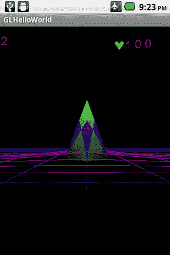
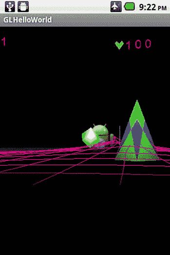
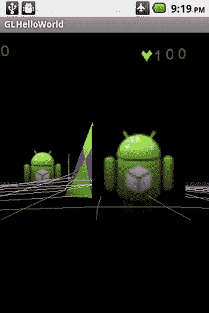
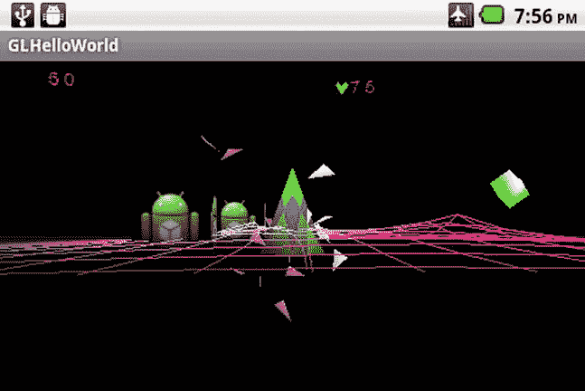

# 七、无人机网格案例研究：创建玩家

Abstract

本章介绍了一个名为“无人机网格”的 3D 游戏的案例研究。游戏的目标是保护你的金字塔，它位于操场的中心，免受敌人的攻击。你将通过触摸屏幕和向敌人发射射弹来摧毁他们。你会在操场边缘的一个固定位置，你可以左转或右转 90 度。首先，介绍表示游戏中玩家图形的类的创建。接下来，我们创建与玩家观点和玩家输入相关的类。接下来是创建处理玩家武器和弹药的类。接下来，我们创建处理爆炸的类和处理游戏对象属性的类。最后，我们给出一个实际操作的例子来说明我们的新类的用法，你将使用你的武器来击中立方体。

本章介绍了一个名为“无人机网格”的 3D 游戏的案例研究。游戏的目标是保护你的金字塔，它位于操场的中心，免受敌人的攻击。你将通过触摸屏幕和向敌人发射射弹来摧毁他们。你会在操场边缘的一个固定位置，你可以左转或右转 90 度。首先，介绍表示游戏中玩家图形的类的创建。接下来，我们创建与玩家观点和玩家输入相关的类。接下来是创建处理玩家武器和弹药的类。接下来，我们创建处理爆炸的类和处理游戏对象属性的类。最后，我们给出一个实际操作的例子来说明我们的新类的用法，你将使用你的武器来击中立方体。

## 创建播放器图形

无人机网格案例研究的玩家图形将是一个金字塔。为了创建这个金字塔，必须构建几个类，包括一个新的 Mesh 类，它绘制对象顶点的方式与我们之前创建的 MeshEx 类略有不同。还需要修改其他类，包括 Object3d 类。

### 创建网格类

Mesh 类与你在第四章中了解到的 MeshEx 类非常相似。主要区别在于对象顶点的定义和绘制方式。在 MeshEx 类中，一个对象的顶点列在一个数组中，一个从中绘制三角形或直线的顶点列表列在另一个数组中。在 Mesh 类中，只有一个数组，它由组成要绘制的三角形的顶点组成。清单 7-1 显示了由三个顶点组成的单一三角形的顶点数据，用于一个网格类。如果你想画一个额外的三角形，你必须为这个新的三角形增加三个顶点数据条目。因为更复杂的图形是由许多三角形组成的，所以很明显，您必须向复杂对象的顶点数据中添加更多的三角形。

清单 7-1。为网格类定义的三角形

`// Left Side             u   v   nx, ny, nz`

`-1.5f, -1.5f, -1.5f,     0,  1,  -1, -1, -1,        // v0 =  left, bottom, back`

`-1.5f, -1.5f,  1.5f,     1,  1,  -1, -1,  1,        // v1 =  left, bottom, front`

`0.0f,  3.2f,  0.0f,  0.5f,  0,   0,  1,  0,        // v2 =  top point`

`DrawMesh()`函数绘制网格，类似于 MeshEx 类中的对应函数。关键的区别在于，使用 OpenGL 函数`glDrawArrays()`而不是`glDrawElements()`来绘制网格。(参见清单 7-2。)

`glDrawArrays()`函数按顺序取为参数:

The graphics primitive to draw, in this case `GL_TRIANGLES`   The number of the starting vertex to draw   The number of vertices to draw  

清单 7-2。`DrawMesh`功能

`void DrawMesh(int PosHandle, int TexHandle, int NormalHandle)`

`{`

`SetUpMeshArrays(PosHandle, TexHandle, NormalHandle);`

`// Draw the triangle`

`//glDrawArrays (int mode, int first, int count)`

`GLES20.glDrawArrays(GLES20.GL_TRIANGLES, 0, m_VertexCount);`

`// Disable vertex array`

`GLES20.glDisableVertexAttribArray(PosHandle);`

`if (m_MeshHasUV)`

`{`

`GLES20.glDisableVertexAttribArray(TexHandle);`

`}`

`if (m_MeshHasNormals)`

`{`

`GLES20.glDisableVertexAttribArray(NormalHandle);`

`}`

`}`

### 修改 Object3d 类

接下来，需要修改 Object3d 类以使用 Mesh 类。

添加了一个新的网格类变量`m_Mesh`。

`private Mesh m_Mesh = null;`

还必须修改 Object3d 类的构造函数，以考虑新网格变量的添加。参见清单 7-3 中粗体显示的变化。

清单 7-3。Object3d 构造函数

`Object3d(Context iContext``, Mesh iMesh`

`{`

`m_Context        = iContext;`

`m_Mesh           = iMesh;`

`// REst of Code`

`}`

修改`GetRadius()`函数以返回对象的`m_Mesh`变量的半径，如果它存在的话。(参见清单 7-4。)对象的网格现在可以保存在网格或 MeshEx 中。

清单 7-4。`GetRadius()`功能修改

`float GetRadius()`

`{`

`if (m_Mesh != null)`

`{`

`return m_Mesh.GetRadius();`

`}`

`if (m_MeshEx != null)`

`{`

`return m_MeshEx.GetRadius();`

`}`

`return -1;`

`}`

绘制实际对象网格的`DrawObject()`函数被修改，以测试`m_Mesh`变量是否包含有效对象。如果是的话，网格的`DrawMesh()`函数被调用来进行物体的实际渲染。(参见清单 7-5。)

清单 7-5。修改`DrawObject()`功能

`void DrawObject(Camera Cam,PointLight light,Vector3 iPosition,Vector3 iRotationAxis,Vector3 iScale)`

`{`

`// Activate and set up the Shader and Draw Object's mesh`

`// Generate Needed Matrices for Object`

`GenerateMatrices(Cam, iPosition,iRotationAxis,iScale);`

`// Add program to OpenGL environment`

`m_Shader.ActivateShader();`

`// Get Vertex Attribute Info in preparation for drawing the mesh`

`GetVertexAttribInfo();`

`// Sets up the lighting parameters for this object`

`SetLighting(Cam, light, m_ModelMatrix, Cam.GetViewMatrix(), m_ModelViewMatrix, m_NormalMatrix);`

`// Apply the projection and view transformation matrix to the shader`

`m_Shader.SetShaderVariableValueFloatMatrix4Array("uMVPMatrix", 1, false, m_MVPMatrix, 0);`

`// Activates texture for this object`

`ActivateTexture();`

`// Enable Hidden surface removal`

`GLES20.glEnable(GLES20.GL_DEPTH_TEST);`

`// Draw Mesh for this Object`

`if (m_Mesh != null)`

`{`

`m_Mesh.DrawMesh(m_PositionHandle, m_TextureHandle, m_NormalHandle);`

`}`

`else`

`if (m_MeshEx != null)`

`{`

`m_MeshEx.DrawMesh(m_PositionHandle, m_TextureHandle, m_NormalHandle)` `;`

`}`

`else`

`{`

`Log.d("class Object3d :", "No MESH in Object3d");`

`}`

`}`

### 修改使用 Object3d 类的其他类

使用 Object3d 类的其他类也必须进行修改。例如，从 Object3d 类派生的多维数据集类必须进行修改，将网格输入参数添加到构造函数中，并调用 Object3d 构造函数。(参见清单 7-6。)

清单 7-6。修改多维数据集类

`public class Cube extends Object3d`

`Cube(Context iContext,``Mesh iMesh`

`{`

`super(iContext``, iMesh`

`}`

请从 [`apress.com`](http://apress.com/) 的源代码/下载区域下载本章的示例项目，以查看必须对其他类进行的其他更改。

### 创建金字塔类

金字塔类包含我们的玩家图形的实际顶点数据，它将是一个金字塔形状的 3D 对象。金字塔类顶点数据包含在`PyramidVertices`数组中，设计用于网格类。(参见清单 7-7。)

清单 7-7。金字塔阶层

`public class Pyramid extends Object3d`

`{`

`static float[] PyramidVertices =`

`{`

`// Triangle Shape`

`// Left Side             u   v  nx, ny, nz`

`-1.5f, -1.5f, -1.5f,     0,  1, -1, -1, -1,       // v0 =  left, bottom, back`

`-1.5f, -1.5f,  1.5f,     1,  1, -1, -1,  1,       // v1 =  left, bottom, front`

`0.0f,  3.2f,  0.0f,   .5f,  0,  0,  1,  0,       // v2 =  top point`

`// Right Side`

`1.5f, -1.5f,  1.5f,     0,  1,  1, -1,  1,       // v3 = right, bottom, front`

`1.5f, -1.5f, -1.5f,     1,  1,  1, -1, -1,       // v4 = right, bottom, back`

`0.0f,  3.2f,  0.0f,  0.5f,  0,  0,  1,  0,       // v2 =  top point`

`// Front`

`-1.5f, -1.5f,  1.5f,     1,  1, -1, -1,  1,       // v1 =  left, bottom, front`

`1.5f, -1.5f,  1.5f,     0,  1,  1, -1,  1,       // v3 = right, bottom, front`

`0.0f,  3.2f,  0.0f,  0.5f,  0,  0,  1,  0,       // v2 =  top point`

`// Back`

`-1.5f, -1.5f, -1.5f,     0,  1, -1, -1, -1,       // v0 =  left, bottom, back`

`1.5f, -1.5f, -1.5f,     1,  1,  1, -1, -1,       // v4 = right, bottom, back`

`0.0f,  3.2f,  0.0f,  0.5f,  0,  0,  1,  0,       // v2 =  top point`

`// Bottom`

`-1.5f, -1.5f, -1.5f,     0,  0, -1, -1, -1,       // v0 =  left, bottom, back`

`1.5f, -1.5f, -1.5f,     0,  1,  1, -1, -1,       // v4 = right, bottom, back`

`1.5f, -1.5f,  1.5f,     1,  1,  1, -1,  1,       // v3 = right, bottom, front`

`// Bottom 2`

`-1.5f, -1.5f, -1.5f,     0,  0, -1, -1, -1,       // v0 =  left, bottom, back`

`-1.5f, -1.5f,  1.5f,     1,  0, -1, -1,  1,       // v1 =  left, bottom, front`

`1.5f, -1.5f,  1.5f,     1,  1,  1, -1,  1        // v3 = right, bottom, front`

`};`

`Pyramid(Context iContext,  Mesh iMesh, MeshEx iMeshEx, Texture[] iTextures, Material iMaterial, Shader iShader, Shader LocalAxisShader)`

`{`

`super(iContext, iMesh, iMeshEx, iTextures, iMaterial, iShader);`

`}`

`}`

### 创建 PowerPyramid 类

PowerPyramid 类是您将用来表示玩家在游戏中的物理存在的类。

`m_ExplosionSFXIndex`变量保存金字塔被击中时爆炸声音的索引。

`CreateExplosionSFX()`函数为功率金字塔创建爆炸声音效果，并将该声音的索引保存在`m_ExplosionSFXIndex`变量中。

`PlayExplosionSFX()`功能回放由`CreateExplosionSFX()`功能创建的爆炸。(参见清单 7-8。)

清单 7-8。玩家的 PowerPyramid 类

`public class PowerPyramid extends Object3d`

`{`

`private int m_ExplosionSFXIndex = -1;`

`PowerPyramid(Context iContext, Mesh iMesh, MeshEx iMeshEx, Texture[] iTextures, Material iMaterial, Shader iShader)`

`{`

`super(iContext, iMesh, iMeshEx, iTextures, iMaterial, iShader);`

`}`

`// Sound Effects`

`void CreateExplosionSFX(SoundPool Pool, int ResourceID)`

`{`

`m_ExplosionSFXIndex = AddSound(Pool, ResourceID);`

`}`

`void PlayExplosionSFX()`

`{`

`if (m_ExplosionSFXIndex >= 0)`

`{`

`PlaySound(m_ExplosionSFXIndex);`

`}`

`}`

`}`

玩家的金字塔是 PowerPyramid 类的一个实例，如图 7-1 所示。

图 7-1。

Player’s power pyramid

## 创建玩家的视点和输入

玩家在这个游戏中的视角将是第一人称视角，在这个视角中，玩家可以向左和向右旋转 90 度。玩家可以通过触摸屏幕来发射 3D 炮弹。创建玩家的视点和玩家的输入需要修改 MyGLRenderer 类和 MyGLSurfaceview 类。

### 修改 MyGLRenderer 类

必须修改 MyGLRenderer 类，以添加代码来计算玩家的视点和玩家的输入。

`CameraMoved()`函数将玩家视角绕 x 和 y 轴的旋转变化作为输入。角度位置的 x 和 y 变化由`ScaleFactor`变量改变，您可以通过该变量增大或减小旋转。(参见清单 7-9。)

清单 7-9。计算相机移动增量

`void CameraMoved(float DeltaXAxisRotation, float DeltaYAxisRotation)`

`{`

`m_CameraMoved = true;`

`float ScaleFactor = 3;`

`m_DeltaXAxisRotation = DeltaXAxisRotation/ScaleFactor;`

`m_DeltaYAxisRotation = DeltaYAxisRotation/ScaleFactor;`

`}`

`ProcessCameraMove()`功能基于`m_DeltaYAxisRotation`中的值并受`m_MaxCameraAngle`和`m_MinCameraAngle`值的限制，更新摄像机绕 y 轴的左/右旋转。(参见清单 7-10。)

清单 7-10。处理玩家的相机移动

`void ProcessCameraMove()`

`{`

`Vector3 Axis = new Vector3(0,1,0);`

`// Test Limits`

`float CameraRotation = m_Camera.GetOrientation().GetRotationAngle();`

`float NextRotationAngle = CameraRotation + m_DeltaYAxisRotation;`

`if (NextRotationAngle > m_MaxCameraAngle)`

`{`

`m_DeltaYAxisRotation = m_MaxCameraAngle - CameraRotation;`

`}`

`else`

`if (NextRotationAngle < m_MinCameraAngle)`

`{`

`m_DeltaYAxisRotation = m_MinCameraAngle - CameraRotation;`

`}`

`// Camera Test`

`// Rotate Camera Around Y Axis`

`m_Camera.GetOrientation().SetRotationAxis(Axis);`

`m_Camera.GetOrientation().AddRotation(m_DeltaYAxisRotation);`

`m_CameraMoved = false;`

`}`

如果`m_CameraMoved`已被设置为真，则必须通过调用`ProcessCameraMove()`来修改`onDrawFrame()`函数，以处理玩家视角的变化。(参见清单 7-11。)

清单 7-11。对`onDrawFrame()`的修改

`@Override`

`public void onDrawFrame(GL10 unused)`

`{`

`GLES20.glClearColor(0.0f, 0.0f, 0.0f, 1.0f);`

`GLES20.glClear( GLES20.GL_DEPTH_BUFFER_BIT | GLES20.GL_COLOR_BUFFER_BIT);`

`// Player Update`

`if (m_CameraMoved)`

`{`

`ProcessCameraMove();`

`}`

`m_Camera.UpdateCamera();`

`// Rest of code`

`}`

`ProcessTouch()`功能处理用户的触摸。用户触摸屏幕的起点(Startx，Starty)和用户从屏幕抬起他或她的手指的终点(x，y)是输入参数。

`ProcessTouch()`函数(见清单 7-12)执行以下操作:

Finds the distance between the point at which the user touches the screen and the point at which the user lifts his or her finger   Sets the variable that keeps track of screen touches to true and sets the x, y screen coordinates of the touch location (`m_TouchX`, `m_TouchY`) if this distance is less than 10 (which means the intention of the user was to touch the screen to fire a weapon, instead of moving the view)  

清单 7-12。处理用户的触摸

`void ProcessTouch(float Startx, float Starty, float x, float y)`

`{`

`Vector3 DiffVec = new Vector3(Startx - x, Starty - y, 0);`

`float length = DiffVec.Length();`

`if (length < 10)`

`{`

`// Player weapon has been fired`

`m_ScreenTouched = true;`

`m_TouchX = x;`

`m_TouchY = y;`

`}`

`}`

### 修改 MyGLSurfaceView 类

MyGLSurfaceView 类也必须进行修改，以提供对玩家视图和玩家触摸输入的支持。

`m_PreviousX`和`m_PreviousY`变量跟踪用户在`onTouchEvent()`功能中最后一次触摸的 x 和 y 屏幕位置。

`private float m_PreviousX = 0;`

`private float m_PreviousY = 0;`

`m_dx`和`m_dy`变量保存用户触摸屏幕时 x 和 y 屏幕位置的变化。

`private float m_dx = 0;`

`private float m_dy = 0;`

当用户第一次触摸屏幕时，`m_Startx`和`m_Starty`变量保存 x 和 y 屏幕位置。

`private float m_Startx = 0;`

`private float m_Starty = 0;`

`onTouchEvent()`函数是更新玩家视图和玩家输入的主要挂钩。

`onTouchEvent()`函数(见清单 7-13)执行以下操作:

Gets the current x and y screen position and stores it into variables `x` and `y`   Based on the user’s action, one of the following occurs:

*   如果用户开始新的触摸，则该 x，y 起始位置被保存在`m_Startx`和`m_Starty`中。
*   如果用户通过抬起手指退出触摸，则调用 MyGLRenderer 类中的`ProcessTouch()`函数。
*   如果用户在屏幕上移动手指，就会调用 MyGLRenderer 类中的`CameraMoved()`函数来更新玩家的视图。
*   当前 x、y 屏幕位置被保存为预期下一次`onTouchEvent()`调用的先前位置。

清单 7-13。添加和修改`onTouchEvent()`功能

`@Override`

`public boolean onTouchEvent(MotionEvent e)`

`{`

`// MotionEvent reports input details from the touch screen`

`// and other input controls. In this case, you are only`

`// interested in events where the touch position changed.`

`float x = e.getX();`

`float y = e.getY();`

`switch (e.getAction())`

`{`

`case MotionEvent.ACTION_DOWN:`

`m_Startx = x;`

`m_Starty = y;`

`break;`

`case MotionEvent.ACTION_UP:`

`CustomGLRenderer.ProcessTouch(m_Startx, m_Starty, x, y);`

`break;`

`case MotionEvent.ACTION_MOVE:`

`m_dx = x - m_PreviousX;`

`m_dy = y - m_PreviousY;`

`CustomGLRenderer.CameraMoved(m_dy, m_dx);`

`break;`

`}`

`m_PreviousX = x;`

`m_PreviousY = y;`

`return true;`

`}`

## 创建玩家武器和弹药

我们需要为玩家的武器和武器使用的弹药创建新的职业。

弹药类派生自 Object3d 类。

`public class Ammunition extends Object3d`

如果这枚弹药已经发射，变量`m_FireStatus`为真。

`private boolean        m_FireStatus = false;`

`m_AmmunitionSpent`变量允许你跟踪这一枚弹药是否已经用完。

`private boolean        m_AmmunitionSpent = false;`

`m_AmmunitionRange`变量保存弹药的最大射程，在 OpenGL 世界中默认为 50 单位。

`private float        m_AmmunitionRange = 50;`

`m_AmmunitionStartPosition`变量保存弹药发射的位置，并被初始化为 0，0，0。

`private Vector3 m_AmmunitionStartPosition = new Vector3(0,0,0);`

每次更新用 OpenGL 世界单位表示的弹药速度保存在`m_AmmoSpeed`中，默认为 0.5。

`private float m_AmmoSpeed = 0.5f;`

如果存在的话，这个弹药的音效的 SFX 索引是`m_FireSFXIndex`。缺省值为-1，表示没有与此弹药相关的声音效果。

`private int m_FireSFXIndex = -1;`

弹药构造函数通过调用其基本构造函数并设置弹药射程、弹药速度和弹药质量(默认为 1)来初始化该对象。(参见清单 7-14。)

清单 7-14。弹药制造商

`Ammunition(Context iContext, Mesh iMesh, MeshEx iMeshEx, Texture[] iTextures, Material iMaterial, Shader iShader, float AmmunitionRange,float AmmunitionSpeed)`

`{`

`super(iContext, iMesh, iMeshEx, iTextures, iMaterial, iShader );`

`m_AmmunitionRange = AmmunitionRange;`

`m_AmmoSpeed = AmmunitionSpeed;`

`GetObjectPhysics().SetMass(1.0f);`

`}`

`CreateFiringSFX()`功能创建与弹药对象相关的新音效。(参见清单 7-15。)

清单 7-15。创造声音效果

`void CreateFiringSFX(SoundPool Pool, int ResourceID)`

`{`

`m_FireSFXIndex = AddSound(Pool, ResourceID);`

`}`

`PlayFiringSFX()`功能播放由`CreateFiringSFX()`功能创建的声音效果。(参见清单 7-16。)

清单 7-16。回放弹药音效

`void PlayFiringSFX()`

`{`

`if (m_FireSFXIndex >= 0)`

`{`

`PlaySound(m_FireSFXIndex);`

`}`

`}`

`Reset()`功能将弹药的发射状态和弹药耗尽状态设置为假，以指示弹药尚未发射并准备就绪。它还将速度设置为 0。(参见清单 7-17。)

清单 7-17。重置弹药

`void Reset()`

`{`

`m_FireStatus = false;`

`m_AmmunitionSpent = false;`

`GetObjectPhysics().GetVelocity().Set(0, 0, 0);`

`}`

`RenderAmmunition()`函数通过调用父 Object3d 类中的`DrawObject()`函数将弹药绘制到屏幕上。(参见清单 7-18。)

清单 7-18。渲染弹药

`void RenderAmmunition(Camera Cam, PointLight light, boolean DebugOn)`

`{`

`DrawObject(Cam, light);`

`}`

`UpdateAmmunition()`函数通过调用超类中的`UpdateObject3d()`函数来更新弹药对象。(参见清单 7-19。)

清单 7-19。更新弹药

`void UpdateAmmunition()`

`{`

`// 1\. Update Ammunition Physics, Position, Rotation`

`UpdateObject3d();`

`}`

在实际发射这个类代表的弹药方面，`Fire()`函数是关键函数。

`Fire()`函数(见清单 7-20)执行以下操作:

Sets the `m_FireStatus` to true to indicate that this piece of ammunition has been fired and is currently moving through the 3D world   Calculates the velocity of the ammunition based on the input `Direction` vector, the `m_AmmoSpeed` ammunition speed, and the `OffsetVelocity` vector, which represents the movement of the object firing the ammunition   Sets the position of the ammunition based on the input `AmmoPosition` parameter   Sets the `m_AmmunitionStartPosition` class member variable  

清单 7-20。发射弹药

`void Fire(Vector3 Direction,`

`Vector3 AmmoPosition,`

`Vector3 OffSetVelocity)`

`{`

`// 1\. Set Fire Status to true`

`m_FireStatus = true;`

`// 2\. Set direction and speed of Ammunition`

`// Velocity of Ammo`

`Vector3 DirectionAmmo = new Vector3(Direction.x, Direction.y, Direction.z);`

`DirectionAmmo.Normalize();`

`Vector3 VelocityAmmo = Vector3.Multiply(m_AmmoSpeed, DirectionAmmo);`

`// Velocity of Object with Weapon that has fired Ammo`

`// Total Velocity`

`Vector3 VelocityTotal = Vector3.Add(OffSetVelocity, VelocityAmmo);`

`GetObjectPhysics().SetVelocity(VelocityTotal);`

`m_Orientation.GetPosition().Set(AmmoPosition.x, AmmoPosition.y, AmmoPosition.z);`

`// 3\. Set Ammunition Initial World Position`

`m_AmmunitionStartPosition.Set(AmmoPosition.x, AmmoPosition.y, AmmoPosition.z);`

`}`

接下来，我们必须创建玩家的武器职业，它使用前面讨论过的弹药。武器类是从 Object3d 类派生的。

`public class Weapon extends Object3d`

`MAX_DEFAULTAMMO`变量表示这种武器一次可以容纳的最大射弹数量。

`private int MAX_DEFAULTAMMO = 20;`

可变数组实际上保存了武器的弹药。

`private Ammunition[] m_WeaponClip = new Ammunition[MAX_DEFAULTAMMO];`

变量保存了这件武器最后一次发射的时间，以毫秒为单位。

`private long m_TimeLastFired = 0;`

`m_TimeReadyToFire`变量是这种武器下一次能够发射弹药的时间，以毫秒计。

`private long m_TimeReadyToFire = 0;`

`m_FireDelay`变量是射弹发射之间的最小时间间隔(毫秒)。

`private long m_FireDelay = 500;`

武器构造函数调用 Object3d 的构造函数。(参见清单 7-21。)

清单 7-21。武器制造商

`Weapon(Context iContext, Mesh iMesh, MeshEx iMeshEx, Texture[] iTextures, Material iMaterial, Shader iShader)`

`{`

`super(iContext, iMesh, iMeshEx, iTextures, iMaterial, iShader );`

`}`

`TurnOnOffSFX()`功能打开或关闭与武器弹药相关的音效。(参见清单 7-22。)

清单 7-22。打开/关闭弹药音效

`void TurnOnOffSFX(boolean value)`

`{`

`for (int i = 0; i < MAX_DEFAULTAMMO; i++)`

`{`

`m_WeaponClip[i].SetSFXOnOff(value);`

`}`

`}`

`ResetWeapon()`功能重置武器的所有弹药。(参见清单 7-23。)

清单 7-23。重置武器

`void ResetWeapon()`

`{`

`// Reset All the Ammunition in the Weapon's Magazine`

`for (int i = 0; i < MAX_DEFAULTAMMO; i++)`

`{`

`m_WeaponClip[i].Reset();`

`}`

`}`

`LoadAmmunition()`功能将弹药弹药放入`m_WeaponClip array`的槽`AmmoSlot`中。(参见清单 7-24。)

清单 7-24。将弹药装入武器

`void LoadAmmunition(Ammunition Ammo, int AmmoSlot)`

`{`

`if (AmmoSlot >= MAX_DEFAULTAMMO)`

`{`

`AmmoSlot = MAX_DEFAULTAMMO - 1;`

`}`

`m_WeaponClip[AmmoSlot] = Ammo;`

`}`

`FindReadyAmmo()`函数返回第一个可发射弹药的索引号，如果没有可用弹药，则返回-1。(参见清单 7-25。)

清单 7-25。寻找备用弹药

`int FindReadyAmmo()`

`{`

`for (int i = 0; i < MAX_DEFAULTAMMO; i++)`

`{`

`// If Ammo is not Fired`

`if (m_WeaponClip[i].IsFired() == false)`

`{`

`return i;`

`}`

`}`

`return -1; // No More Ammo Available`

`}`

`CheckAmmoCollision()`功能测试输入物体`obj`是否与武器发射的弹药发生碰撞。如果有冲突，它返回对对象的引用；如果没有冲突，它返回 null。(参见清单 7-26。)

清单 7-26。检查武器弹药与物体的碰撞

`Object3d CheckAmmoCollision(Object3d obj)`

`{`

`Object3d ObjectCollided = null;`

`for (int i = 0; i < MAX_DEFAULTAMMO; i++)`

`{`

`if (m_WeaponClip[i].IsFired() == true)`

`{`

`//Check Collision`

`Physics.CollisionStatus result = m_WeaponClip[i].CheckCollision(obj);`

`if ((result == Physics.CollisionStatus.COLLISION) ||`

`(result == Physics.CollisionStatus.PENETRATING_COLLISION))`

`{`

`ObjectCollided = m_WeaponClip[i];`

`}`

`}`

`}`

`return ObjectCollided;`

`}`

`GetActiveAmmo()`函数将来自武器的所有有效发射弹药的引用放入输入数组`ActiveAmm`中，并返回有效弹药的数量。(参见清单 7-27。)

清单 7-27。获取所有有效弹药

`int GetActiveAmmo(int StartIndex, Object3d[] ActiveAmmo)`

`{`

`// Put all active fired ammunition in ActiveAmmo array`

`// and return the number of fired ammunition`

`int AmmoNumber = StartIndex;`

`for (int i = 0; i < MAX_DEFAULTAMMO; i++)`

`{`

`if (m_WeaponClip[i].IsFired() == true)`

`{`

`ActiveAmmo[AmmoNumber] = m_WeaponClip[i];`

`AmmoNumber++;`

`}`

`}`

`return (AmmoNumber - StartIndex);`

`}`

`Fire()`功能在输入参数`Direction`中保持的方向上发射与武器相关的射弹，并从`WeaponPosition`位置开始。

`Fire()`函数(见清单 7-28)执行以下操作:

Continues if the weapon is ready to fire, based on a minimum time delay value between firings; otherwise, it returns from the function   Finds a piece of ammunition that has not been fired yet   Calls an ammunition’s `Fire()` function and plays any associated sound effects associated with that ammunition, if that ammunition exists   Calculates the time that the weapon can be fired again and puts this in the `m_TimeReadyToFire` variable   Returns true if the weapon could be fired and false otherwise  

清单 7-28。发射武器

`boolean Fire(Vector3 Direction, Vector3 WeaponPosition)`

`{`

`boolean WeaponFired = false;`

`// 0\. Test if this weapon is ready to fire`

`long CurrentTime = System.currentTimeMillis();`

`if (CurrentTime < m_TimeReadyToFire)`

`{`

`return false;`

`}`

`// 1\. Find Ammo That is not spent`

`int AmmoSlot = FindReadyAmmo();`

`// 2\. If Ammo Found then Fire Ammunition`

`if (AmmoSlot >= 0)`

`{`

`WeaponFired = true;`

`m_WeaponClip[AmmoSlot].Fire(Direction,WeaponPosition,GetObjectPhysics().GetVelocity());`

`// Play SFX if available`

`m_WeaponClip[AmmoSlot].PlayFiringSFX();`

`}`

`else`

`{`

`Log.e("AMMUNITION ", "AMMUNITION NOT FOUND");`

`WeaponFired = false;`

`}`

`// 3\. Firing Delay`

`m_TimeLastFired = System.currentTimeMillis();`

`m_TimeReadyToFire = m_TimeLastFired + m_FireDelay;`

`return WeaponFired;`

`}`

`RenderWeapon()`函数渲染所有已经发射并且当前处于活动状态的武器弹药。(参见清单 7-29。)

清单 7-29。渲染武器的弹药

`void RenderWeapon(Camera Cam, PointLight light, boolean DebugOn)`

`{`

`// 1\. Render Each Fired Ammunition in Weapon`

`for (int i = 0; i < MAX_DEFAULTAMMO; i++)`

`{`

`if (m_WeaponClip[i].IsFired() == true)`

`{`

`m_WeaponClip[i].RenderAmmunition(Cam, light, DebugOn);`

`}`

`}`

`}`

`UpdateWeapon()`功能更新武器的弹药。(参见清单 7-30。)

对于武器中的每一枚弹药，`UpdateWeapon()`功能执行以下操作:

If the ammunition has been fired, it continues updating it. If not, then it checks to see if the next piece of ammunition has been fired.   It adds a rotational force to the ammunition and updates the object’s physics.   If the distance the ammunition has traveled since it was fired is greater than the ammunition’s range, it destroys the ammunition by calling the ammunition’s `Reset()` function.  

清单 7-30。更新武器

`void UpdateWeapon()`

`{`

`// 1\. Update Each Ammunition in Weapon`

`for (int i = 0; i < MAX_DEFAULTAMMO; i++)`

`{`

`// If Ammunition is fired then Update Ammunition and Emit More AmmoDust Trail particles`

`if (m_WeaponClip[i].IsFired() == true)`

`{`

`// Add Spin to Ammunition`

`m_WeaponClip[i].GetObjectPhysics().ApplyRotationalForce(30, 1);`

`m_WeaponClip[i].UpdateAmmunition();`

`// 2\. Check if Ammunition is spent`

`float AmmoRange        = m_WeaponClip[i].GetAmmunitionRange();`

`Vector3 AmmoCurrentPos = m_WeaponClip[i].m_Orientation.GetPosition();`

`Vector3 AmmoInitPos    = m_WeaponClip[i].GetAmmunitionStartPosition();`

`Vector3 DistanceVector = Vector3.Subtract(AmmoCurrentPos, AmmoInitPos);`

`float DistanceMag = DistanceVector.Length();`

`if (DistanceMag > AmmoRange)`

`{`

`// Ammo is Spent so Reset Ammunition to ready to use status.`

`m_WeaponClip[i].Reset();`

`}`

`}`

`}`

`}`

图 7-2 显示玩家的武器正在开火。图片中央的绿色立方体是玩家从武器中取出的弹药。

图 7-2。

Player’s weapon fired

## 制造爆炸

我们游戏的爆炸将由许多三角形组成。我们的爆炸的关键类是 PolyParticleEx 类，它表示粒子，以及 SphericalPolygonExplosion 类，它包含将组成我们的爆炸的粒子。

### 创建 PolyParticleEx 类

PolyParticleEx 类表示我们想要创建的爆炸粒子，以及管理和操作粒子的函数。

PolyParticleEx 类派生自 Object3d 类。

`public class PolyParticleEx extends Object3d`

`PolyParticleVertices`变量数组保存了一个`PolyParticleEx`粒子的网格数据。该粒子是一个三角形，没有纹理坐标，但有顶点法线形式的照明数据。(参见清单 7-31。)

清单 7-31。粒子网格定义

`static float[] PolyParticleVertices =`

`{`

`// Triangle Shape`

`// Left Side              nx, ny,  nz`

`0.0f,  0.0f, -0.5f,       0,  0,  -1,        // v0 =  bottom, back`

`0.0f,  0.0f,  0.5f,       0,  0,   1,        // v1 =  bottom, front`

`0.0f,  0.5f,  0.0f,       0,  1,   0,        // v2 =  top point`

`};`

`m_Color`变量保存多边形粒子的当前颜色。

`private Vector3      m_Color = new Vector3(0,0,0);`

`m_TimeStamp`变量以毫秒为单位保存粒子被创建的时间。

`private long         m_TimeStamp;    // Time in milliseconds that Particle is created`

`m_TimeDelay`变量以毫秒为单位保存粒子的寿命。

`private float        m_TimeDelay;    // LifeSpan of Particle in milliseconds`

如果设置为启动或使用中，则`m_Locked`变量为真，如果可用，则为假。

`private boolean      m_Locked;       // true if set to launch or in use, false if available for use`

如果粒子在屏幕上并且必须被渲染，变量`m_Active`为真。否则就是假的。

`private boolean      m_Active;       // Onscreen = Render particle if Active`

`m_ColorBrightness`变量保存粒子颜色的当前亮度等级。

`private float        m_ColorBrightness;`

`m_FadeDelta`变量是粒子淡出的速率。

`private float        m_FadeDelta;`

`m_OriginalColor`变量是粒子创建时的原始颜色。

`private Vector3      m_OriginalColor = new Vector3(0,0,0);`

PolyParticleEx 构造函数调用 Object3d 构造函数，然后初始化类成员变量。(参见清单 7-32。)

清单 7-32。PolyParticleEx 构造函数

`public PolyParticleEx(Context iContext, Mesh iMesh, MeshEx iMeshEx, Texture[] iTextures, Material iMaterial, Shader iShader)`

`{`

`super(iContext, iMesh, iMeshEx, iTextures, iMaterial, iShader);`

`m_Color.Clear();`

`m_TimeStamp              = 0;`

`m_TimeDelay              = 1000;`

`m_Locked                 = false;`

`m_Active                 = false;`

`m_ColorBrightness        = 1;`

`m_OriginalColor.Clear();`

`m_FadeDelta              = 0.0000f;`

`}`

`SetColor()`函数设置粒子的颜色，包括粒子的材质，根据材质的环境、漫射和发射属性。(参见清单 7-33。)

清单 7-33。设定粒子的颜色

`void SetColor(Vector3 value)`

`{`

`m_Color.x = value.x;`

`m_Color.y = value.y;`

`m_Color.z = value.z;`

`GetMaterial().SetAmbient(value.x, value.y, value.z);`

`GetMaterial().SetDiffuse(value.x, value.y, value.z);`

`GetMaterial().SetEmissive(value.x, value.y, value.z);`

`}`

`SetActiveStatus()`功能设置粒子的活动状态，并将粒子的颜色亮度重置为 100%。(参见清单 7-34。)

清单 7-34。设置活动状态

`void SetActiveStatus(boolean value)`

`{`

`m_Active        = value;`

`// Reset Brightness Level`

`m_ColorBrightness= 1;`

`}`

`Destroy()`功能将粒子重置为初始状态。(参见清单 7-35。)

清单 7-35。摧毁粒子

`void Destroy()`

`{`

`GetObjectPhysics().GetVelocity().Clear();`

`m_Locked    = false;     // Particle is now free to be used again by the Particle Manager.`

`m_Active    = false;     // Do not draw on screen`

`m_TimeStamp = 0;`

`// Restore Particle to Original Color`

`m_Color.x = m_OriginalColor.x;`

`m_Color.y = m_OriginalColor.y;`

`m_Color.z = m_OriginalColor.z;`

`}`

`Create()`函数将粒子的颜色设置为`Color`，并将`m_OriginalColor`变量设置为`Color`。(参见清单 7-36。)

清单 7-36。创建一个新粒子

`void Create(Vector3 Color)`

`{`

`m_Color.x = Color.x;`

`m_Color.y = Color.y;`

`m_Color.z = Color.z;`

`m_OriginalColor.x = m_Color.x;`

`m_OriginalColor.y = m_Color.y;`

`m_OriginalColor.z = m_Color.z;`

`}`

`LockParticle()`功能可用于设置要使用的粒子。(参见清单 7-37。)

`Lock Particle()`功能执行以下操作:

Sets up the particle for use by setting `m_Active` to false and `m_Locked` to true   Applies a translational force taken from the input parameter `Force` along the direction `DirectionNormalized`   Sets the `m_TimeStamp` variable to the `CurrentTime` input parameter   Sets the particle color to the original color for the particle at the time of first creation  

清单 7-37。准备好粒子以供使用

`void LockParticle(float Force, Vector3 DirectionNormalized, long CurrentTime)`

`{`

`// 1\. Setup particle for use`

`m_Active = false;`

`m_Locked = true;`

`// 2\. Apply Initial Force`

`Vector3 FVector = new Vector3(DirectionNormalized.x, DirectionNormalized.y, DirectionNormalized.z);`

`FVector.Multiply(Force);`

`GetObjectPhysics().ApplyTranslationalForce(FVector);`

`// 3\. Apply Time`

`m_TimeStamp = CurrentTime;`

`// 4\. Calculate Color for Fade`

`m_Color.x = m_OriginalColor.x;`

`m_Color.y = m_OriginalColor.y;`

`m_Color.z = m_OriginalColor.z;`

`}`

`FadeColor()`函数将参考颜色`ColorIn`作为输入，并将亮度`m_ColorBrightness`降低`m_FadeDelta`，最小值为`m_ColorBrightness`的 0。然后通过`m_ColorBrightness`缩放颜色。(参见清单 7-38。)

清单 7-38。淡化粒子的颜色

`void FadeColor(Vector3 ColorIn)`

`{`

`// Fade Color to Black.`

`// Adjust Brightness Level Down from full brightness = 1 to no brightness = 0;`

`m_ColorBrightness -= m_FadeDelta;`

`if (m_ColorBrightness < 0)`

`{`

`m_ColorBrightness = 0;`

`}`

`// 1\. Adjust Color so that everything is at the same Brightness Level`

`ColorIn.x *= m_ColorBrightness;`

`ColorIn.y *= m_ColorBrightness;`

`ColorIn.z *= m_ColorBrightness` `;`

`}`

`FadeColor()`函数通过调用`FadeColor()`来淡化粒子的颜色，然后调用`SetColor()`来设置粒子的颜色。(参见清单 7-39。)

清单 7-39。淡化粒子的颜色

`void FadeColor(long ElapsedTime)`

`{`

`FadeColor(m_Color);`

`SetColor(m_Color);`

`}`

`UpdateParticle()`函数(见清单 7-40)以如下方式更新粒子:

If the particle is active, that is `m_Active = true`, then it continues with the update; otherwise, it returns.   It applies a rotational force to the particle.   It updates the physics of the particle.   If the time that passes since the particle was created is greater than the particle life span, which is `m_TimeDelay`, it destroys the particle by calling `Destroy()`. Otherwise, it calls `FadeColor()` to fade the color of the particle toward black.  

清单 7-40。更新粒子

`void UpdateParticle(long current_time)`

`{`

`// If particle is Active (on the screen)`

`if (m_Active)`

`{`

`// Update Particle Physics and position`

`GetObjectPhysics().ApplyRotationalForce(40, 1);`

`GetObjectPhysics().UpdatePhysicsObject(m_Orientation);`

`long TimePassed = current_time - m_TimeStamp;`

`if (TimePassed > m_TimeDelay)`

`{`

`// Destroy Particle`

`Destroy();`

`}`

`else`

`{`

`FadeColor(TimePassed);`

`}`

`}`

`}`

`Render()`函数通过调用 Object3d 类中的`DrawObject()`将粒子绘制到屏幕上。(参见清单 7-41。)

清单 7-41。渲染粒子

`void Render(Camera Cam, PointLight light)`

`{`

`DrawObject(Cam, light);`

`}`

### 创建 SphericalPolygonExplosion 类

接下来，我们必须创建表示爆炸的类，这是 SphericalPolygonExplosion 类。这个类所做的是创建一组`PolyParticleEx`多边形，并用它们来创建一个爆炸。

`MAX_POLYGONS`变量保存了我们的爆炸可以组成的多边形的最大数量。

`private int MAX_POLYGONS = 1000;`

`m_Particles`变量保存用于创建爆炸的`PolyParticleEx`多边形。

`private PolyParticleEx[] m_Particles = new PolyParticleEx[MAX_POLYGONS];`

`m_ExplosionDirection`变量保存了`m_Particles`中每个粒子的速度。

`private Vector3[] m_ExplosionDirection = new Vector3[MAX_POLYGONS];`

`m_NumberParticles`变量保存构成爆炸的粒子数量。

`int m_NumberParticles;`

`m_ParticleColor`变量保存粒子的颜色。

`Vector3        m_ParticleColor;`

`m_ParticleSize`变量保存粒子的比例，1 代表粒子网格的正常比例。

`Vector3        m_ParticleSize;`

`m_ParticleLifeSpan`变量以毫秒为单位保存粒子激活并显示在屏幕上的时间。

`long           m_ParticleLifeSpan;`

`m_ExplosionCenter`变量保存爆炸中所有粒子的起始位置。

`Vector3        m_ExplosionCenter;`

如果粒子的颜色是随机的，变量`m_RandomColors`为真。

`boolean        m_RandomColors;                  // true if Particles set to have Random colors`

如果爆炸中的粒子在每次渲染时随机改变颜色，则`m_ParticleColorAnimation`变量为真。

`boolean        m_ParticleColorAnimation;        // true if Particles change colors during explosion`

如果爆炸仍处于活动状态，并且必须渲染到屏幕上并更新，则`m_ExplosionActive`变量为真。

`boolean        m_ExplosionActive;`

`m_RandNumber`变量用于生成随机数。

`private Random m_RandNumber = new Random();`

`GenerateRandomColor()`函数使用`m_RandNumber`生成并返回随机颜色。`nextFloat()`函数生成并返回一个 0-1 范围内的随机数。(参见清单 7-42。)

清单 7-42。生成随机颜色

`Vector3 GenerateRandomColor()`

`{`

`Vector3 Color = new Vector3(0,0,0);`

`// 1\. Generate Random RGB Colors in Range of 0-1;`

`Color.x = m_RandNumber.nextFloat();`

`Color.y = m_RandNumber.nextFloat();`

`Color.z = m_RandNumber.nextFloat();`

`return Color;`

`}`

`GenerateRandomRotation()`函数生成并返回 0-max value 范围内的随机旋转值。(参见清单 7-43。)

清单 7-43。产生随机旋转

`float GenerateRandomRotation(float MaxValue)`

`{`

`float Rotation;`

`// 1\. Generate Random Rotation in Range of 0-1 * MaxValue;`

`Rotation = MaxValue * m_RandNumber.nextFloat();`

`return Rotation;`

`}`

`GenerateRandomRotationAxis()`函数生成并返回一个归一化的随机生成的旋转轴。(参见清单 7-44。)

清单 7-44。生成随机旋转轴

`Vector3 GenerateRandomRotationAxis()`

`{`

`Vector3 RotationAxis = new Vector3(0,0,0);`

`// 1\. Generate Random Rotation in Range of 0-1`

`RotationAxis.x = m_RandNumber.nextFloat();`

`RotationAxis.y = m_RandNumber.nextFloat();`

`RotationAxis.z = m_RandNumber.nextFloat();`

`RotationAxis.Normalize();`

`return RotationAxis` `;`

`}`

SphericalPolygonExplosion 构造函数创建并初始化一个新的爆炸。它创建并初始化`m_NumberParticles`新的粒子，当爆炸开始时，这些粒子将具有随机的方向。(参见清单 7-45。)

清单 7-45。`SphericalPolygonExplosion()`构造器

`SphericalPolygonExplosion(int NumberParticles, Vector3        Color,long ParticleLifeSpan,boolean        RandomColors, boolean ColorAnimation,float FadeDelta,Vector3 ParticleSize,Context iContext, Mesh iMesh, MeshEx iMeshEx, Texture[] iTextures, Material iMaterial, Shader iShader )`

`{`

`m_NumberParticles        = NumberParticles;`

`m_ParticleColor          = new Vector3(Color.x, Color.y, Color.z);`

`m_ParticleLifeSpan       = ParticleLifeSpan;`

`m_RandomColors           = RandomColors;      // true if Particles set to have Random colors`

`m_ParticleColorAnimation = ColorAnimation;`

`m_ExplosionActive        = false;`

`m_ParticleSize           = new Vector3(ParticleSize.x, ParticleSize.y, ParticleSize.z);`

`if (NumberParticles > MAX_POLYGONS)`

`{`

`m_NumberParticles = MAX_POLYGONS;`

`}`

`// For each new Particle`

`for (int i = 0; i < m_NumberParticles; i++)`

`{`

`int signx = 1;`

`int signy = 1;`

`int signz = 1;`

`if (m_RandNumber.nextFloat() > 0.5f)`

`{`

`signx = -1;`

`}`

`if (m_RandNumber.nextFloat() > 0.5f)`

`{`

`signy = -1;`

`}`

`if (m_RandNumber.nextFloat() > 0.5f)`

`{`

`signz = -1;`

`}`

`// Find random direction for particle`

`float randomx = (float)signx * m_RandNumber.nextFloat();`

`float randomy = (float)signy * m_RandNumber.nextFloat();`

`float randomz = (float)signz * m_RandNumber.nextFloat();`

`// Generate random x,y,z coords`

`Vector3        direction = new Vector3(0,0,0);`

`direction.x = randomx;`

`direction.y = randomy;`

`direction.z = randomz;`

`direction.Normalize();`

`// Set Particle Explosion Direction Array`

`m_ExplosionDirection[i]        =        direction;`

`// Create New Particle`

`m_Particles[i] = new PolyParticleEx(iContext, iMesh, iMeshEx, iTextures, iMaterial, iShader);`

`// Set Particle Array Information`

`if (RandomColors)`

`{`

`m_Particles[i].SetColor(GenerateRandomColor());`

`}`

`else`

`{`

`m_Particles[i].Create(m_ParticleColor);`

`}`

`m_Particles[i].SetTimeDelay(ParticleLifeSpan);`

`m_Particles[i].SetFadeDelta(FadeDelta);`

`// Generate Random Rotations`

`Vector3 Axis = GenerateRandomRotationAxis();`

`m_Particles[i].m_Orientation.SetRotationAxis(Axis);`

`float rot = GenerateRandomRotation(360);`

`m_Particles[i].m_Orientation.SetRotationAngle(rot);`

`}`

`}`

`GetRandomParticleVelocity()`函数(见清单 7-46)创建并返回一个随机速度，该速度基于爆炸创建时粒子设置的方向和一个随机速度。

该函数执行以下操作:

Gets the normalized direction of particle `ParticleNumber` from the `m_ExplosionDirection` array   Creates a new vector variable, `ParticleVelocity`, to hold the final particle velocity and initializes it with the explosion direction found in step 1   Generates a random speed for the particle between the `MinVelocity` and `MaxVelocity` input parameters   Calculates the final new random particle velocity by multiplying the `ParticleVelocity` variable that holds the direction of the particle by the random speed in the `RandomVelocityMagnitude` variable  

清单 7-46。获得随机粒子速度

`Vector3 GetRandomParticleVelocity(int ParticleNumber, float MaxVelocity, float MinVelocity)`

`{`

`Vector3 ExplosionDirection = m_ExplosionDirection[ParticleNumber];`

`Vector3 ParticleVelocity= new Vector3(ExplosionDirection.x, ExplosionDirection.y, ExplosionDirection.z);`

`float RandomVelocityMagnitude = MinVelocity + (MaxVelocity - MinVelocity)* m_RandNumber.nextFloat();`

`ParticleVelocity.Multiply(RandomVelocityMagnitude);`

`return ParticleVelocity;`

`}`

调用`StartExplosion()`函数在`Position`位置开始实际爆炸，粒子速度从`MinVelocity`到`MaxVelocity`。

`StartExplosion()`函数(见清单 7-47)执行以下操作:

Sets the `m_ExplosionActive` variable to true to indicate the explosion is in progress   Sets the particles in the explosion to active, which means that they will be rendered and updated   Sets the timestamp on all the particles to the current system time, which is the start of the explosion   Sets the position of all the particles to the input parameter `Position`   Sets random velocities for all the particles   Sets the scale of the particles to `m_ParticleSize`   Sets a random color for all the particles, if random colors for the particles are selected, to `m_RandomColors = true`; otherwise, sets the color of the particle to `m_ParticleColor`   Sets the particle’s life span time to `m_ParticleLifeSpan`  

清单 7-47。开始爆炸

`void StartExplosion(Vector3        Position,float MaxVelocity, float MinVelocity)`

`{`

`// 1\. Set Position of Particles`

`m_ExplosionActive = true;`

`for (int i = 0; i < m_NumberParticles; i++)`

`{`

`m_Particles[i].SetActiveStatus(true);`

`m_Particles[i].SetTimeStamp(System.currentTimeMillis());`

`m_ExplosionCenter = new Vector3(Position.x, Position.y, Position.z);`

`m_Particles[i].m_Orientation.SetPosition(m_ExplosionCenter);`

`m_Particles[i].GetObjectPhysics().SetVelocity(GetRandomParticleVelocity(i,MaxVelocity,MinVelocity));`

`m_Particles[i].m_Orientation.SetScale(m_ParticleSize);`

`if (m_RandomColors)`

`{`

`m_Particles[i].SetColor(GenerateRandomColor());`

`}`

`else`

`{`

`m_Particles[i].SetColor(m_ParticleColor);`

`}`

`m_Particles[i].SetTimeDelay(m_ParticleLifeSpan` `);`

`}`

`}`

`RenderExplosion()`函数将组成爆炸的所有粒子都绘制到屏幕上。(参见清单 7-48。)

清单 7-48。渲染爆炸

`void RenderExplosion(Camera Cam, PointLight light)`

`{`

`// Render Explosion`

`for (int i = 0; i < m_NumberParticles; i++)`

`{`

`if (m_Particles[i].GetActiveStatus() == true)`

`{`

`m_Particles[i].Render(Cam, light);`

`}`

`}`

`}`

`UpdateExplosion()`函数更新爆炸。(参见清单 7-49。)

该函数执行以下操作:

If the explosion is not active, then it returns.   For the active particles, it sets the color randomly, if particle color animation is turned on.   For the active particles, it updates the particle by calling `UpdateParticle()`.   If any particle is active, then the entire explosion is set to active.  

清单 7-49。更新爆炸

`void UpdateExplosion()`

`{`

`if (!m_ExplosionActive)`

`{`

`return;`

`}`

`boolean ExplosionFinished = true;`

`for (int i = 0; i < m_NumberParticles; i++)`

`{`

`// If all Particles are not active then explosion is finished.`

`if (m_Particles[i].GetActiveStatus() == true)`

`{`

`// If Color Animation is on then set particle to random color`

`if(m_ParticleColorAnimation)`

`{`

`m_Particles[i].SetColor(GenerateRandomColor());`

`}`

`// For each particle update particle`

`m_Particles[i].UpdateParticle(System.currentTimeMillis());`

`ExplosionFinished = false;`

`}`

`}`

`if (ExplosionFinished)`

`{`

`m_ExplosionActive = false;`

`}`

`}`

### 修改 Object3d 类

接下来，我们必须向 Object3d 类添加一些代码，这样它就可以使用爆炸。

`MAX_EXPLOSIONS`变量保存与该对象相关的最大爆炸次数。

`private int MAX_EXPLOSIONS = 3;`

`m_NumberExplosions`变量保存与该对象相关的实际爆炸次数。

`private int m_NumberExplosions = 0;`

`m_Explosions`变量保存对与该对象相关联的`SphericalPolygonExplosion`对象的引用，如果有的话。

`private SphericalPolygonExplosion[] m_Explosions = new SphericalPolygonExplosion[MAX_EXPLOSIONS];`

我们还添加了函数`RenderExplosions()`，来渲染爆炸；`UpdateExplosions()`，更新爆款；和`ExplodeObject()`，开始爆炸。这些函数相当简单，所以为了节省空间，请在 [`apress.com`](http://apress.com/) 查看本章的源代码/下载区域以了解全部细节。

必须通过调用`RenderExplosions()`函数修改`DrawObject()`函数来渲染爆炸。(参见清单 7-50。)

清单 7-50。修改`DrawObject()`函数来渲染爆炸

`void DrawObject(Camera Cam, PointLight light)`

`{`

`RenderExplosions(Cam,light);`

`// Rest of Code`

`}`

必须修改`UpdateObject3d()`函数，通过调用`UpdateExplosions()`来更新爆炸。(参见清单 7-51。)

清单 7-51。修改`UpdateObject3d()`功能

`void UpdateObject3d()`

`{`

`if (m_Visible)`

`{`

`// Update Object3d Physics`

`UpdateObjectPhysics();`

`}`

`// Update Explosions associated with this object`

`UpdateExplosions();`

`}`

## 创建游戏对象统计

为了跟踪游戏相关的属性，比如健康，我们必须创建一个新的类来保存这些统计数据。

### 创建统计类

Stats 类保存游戏对象的游戏相关统计数据。我们将在无人机网格示例中使用的游戏相关属性是生命值、杀伤值和伤害值。

`m_Health`变量保存一个游戏对象的生命值，默认为 100，表示完全健康。

`private int m_Health = 100;`

`m_KillValue`变量表示该对象被破坏时的点值。

`private int m_KillValue = 50;`

`m_DamageValue`变量是这个物体与玩家的力量金字塔发生碰撞时，从玩家生命值中减去的量。

`private int m_DamageValue = 25;`

`SaveStats()`函数保存游戏相关的统计数据。对于你自己的游戏，你可以根据需要修改这个职业的属性。例如，如果您正在创建一个角色扮演游戏，您可以添加生命值和角色等级。如果是这样，您必须修改`SaveStats()`函数来保存这些新的统计数据。(参见清单 7-52。)

清单 7-52。保存统计数据

`void SaveStats(String Handle)`

`{`

`SharedPreferences settings = m_Context.getSharedPreferences(Handle, 0);`

`SharedPreferences.Editor editor = settings.edit();`

`// Health`

`String HealthHandle = Handle + "Health";`

`editor.putInt(HealthHandle, m_Health);`

`// Commit the edits!`

`editor.commit();`

`}`

`LoadStats()`函数加载游戏相关的统计数据。(参见清单 7-53。)

清单 7-53。正在加载统计数据

`void LoadStats(String Handle)`

`{`

`// Restore preferences`

`SharedPreferences settings = m_Context.getSharedPreferences(Handle, 0);`

`// Health`

`String HealthHandle = Handle + "Health";`

`m_Health = settings.getInt(HealthHandle, 100);`

`}`

在这个类中检索和设置游戏相关统计数据的函数如清单 7-54 所示。它们由与伤害值、生命值和杀伤值相关的函数组成。

清单 7-54。获取和设置游戏相关的统计数据

`int GetDamageValue(){return m_DamageValue;}`

`int GetHealth(){return m_Health;}`

`int GetKillValue(){return m_KillValue;}`

`void SetDamageValue(int value){m_DamageValue = value;}`

`void SetHealth(int health){m_Health = health;}`

`void SetKillValue(int value){m_KillValue = value;}`

### 修改 Object3d 类

必须修改 Object3d 类才能集成到 Stats 类中。

`m_ObjectStats`变量保存这个对象的游戏相关统计数据。

`private Stats m_ObjectStats;`

必须修改 Object3d 构造函数来创建一个新的`Stats`对象。

`m_ObjectStats = new Stats(iContext);`

通过`GetObjectStats()`函数可以访问`m_ObjectStats`变量。

`Stats GetObjectStats(){return m_ObjectStats;}`

`TakeDamage()`功能根据`DamageObj`输入对象造成的伤害调整对象的健康状态。(参见清单 7-55。)

清单 7-55。受到另一个物体的伤害

`void TakeDamage(Object3d DamageObj)`

`{`

`int DamageAmount = DamageObj.GetObjectStats().GetDamageValue();`

`int Health = m_ObjectStats.GetHealth();`

`Health = Health - DamageAmount;`

`// Health can never be negative`

`if (Health < 0)`

`{`

`Health = 0;`

`}`

`m_ObjectStats.SetHealth(Health);`

`}`

必须修改`SaveObjectState()`函数，首先添加一个`StatsHandl` e 变量来保存游戏对象统计数据的句柄。

`String StatsHandle = Handle + "Stats";`

接下来，我们需要添加代码来用`StatsHandle`调用`SaveStats()`函数。

`m_ObjectStats.SaveStats(StatsHandle);`

必须修改`LoadObjectState()`函数，添加一个`StatsHandle`变量来保存游戏统计数据的句柄。

`String StatsHandle = Handle + "Stats";`

接下来，我们添加代码来加载之前保存的游戏统计数据。

`m_ObjectStats.LoadStats(StatsHandle);`

## 动手例子:打靶！

现在，是时候使用一些我在本章前面讨论过的新类了。这个例子建立在前面的例子上，增加了玩家的力量金字塔，一个可以左右转动的可移动玩家视角，以及一个可以通过用户触摸屏幕来发射射弹的武器。一个立方体放在玩家的金字塔前面，另一个立方体放在金字塔后面。

我们必须对 MyGLRenderer 类进行修改，以添加代码来创建玩家的金字塔，创建玩家的武器，并处理金字塔前面的立方体与金字塔之间以及玩家武器的投射物与立方体之间的碰撞。

### 创建播放器

为了创建玩家的权力金字塔，我们必须添加一些新的变量和函数。

玩家的力量金字塔是`m_Pyramid`。

`private PowerPyramid m_Pyramid;`

用于玩家金字塔的纹理保存在`m_TexPyramid1`和`m_TexPyramid2`中。

`private Texture m_TexPyramid1;`

`private Texture m_TexPyramid2;`

`PyramidCreateTexture()`函数为我们玩家的力量金字塔创建纹理，并将这些纹理存储在`m_TexPyramid1`和`m_TexPyramid2`中。(参见清单 7-56。)

清单 7-56。为金字塔创建纹理

`public void PyramidCreateTexture(Context context)`

`{`

`m_TexPyramid1 = new Texture(context,R.drawable.pyramid1);`

`m_TexPyramid2 = new Texture(context,R.drawable.pyramid2);`

`}`

`CreatePyramid()`功能创建玩家的金字塔图形。(参见清单 7-57。)

该函数执行以下操作:

Creates a shader for use in rendering the pyramid.   Creates a new `Mesh` object using the data from the `PyramidVertices` array in the Pyramid class.   Creates a new `Material` object that sets the glow animation to true, so that when the material is updated, the emissive color property cycles between the values set with `GetEmissiveMin()` and `GetEmissiveMax()`.   Creates the pyramid’s textures by calling `PyramidCreateTexture()` and setting them up in an array called `PyramidTex` for use with the player’s pyramid.   Creates a new power pyramid object.   Sets the texture animation properties for the pyramid, so that the textures cycle between one another.   Sets the initial position, rotation, and scale of the pyramid.   Sets the effect of gravity on the pyramid to none.   Sets the pyramid’s grid spotlight and spotlight radius.   Sets the pyramid’s mass to 2000 to indicate that this is a very large structure compared to other enemy objects in the game that will be colliding with it. The collisions that occur with other objects in the game will reflect this.   Creates the explosion sound associated with the pyramid and sets the sound effects on for the pyramid.   Creates a `SphericalPolygonExplosion` explosion and adds it to the pyramid using the `AddExplosion()` function.  

清单 7-57。创建玩家的权力金字塔

`void CreatePyramid(Context iContext)`

`{`

`//Create Cube Shader`

`Shader Shader = new Shader(iContext, R.raw.vsonelight, R.raw.fsonelight);        // ok`

`// Create Debug Local Axis Shader`

`Mesh PyramidMesh = new Mesh(8,0,3,5,Pyramid.PyramidVertices);`

`// Create Material for this object`

`Material Material1 = new Material();`

`Material1.SetEmissive(0.0f, 0.0f, 0.5f);`

`Material1.SetGlowAnimation(true);`

`Material1.GetEmissiveMax().Set(0.45f, 0.45f, 0.25f);`

`Material1.GetEmissiveMin().Set(0, 0, 0);`

`// Create Texture`

`PyramidCreateTexture(iContext);`

`Texture[] PyramidTex = new Texture[2];`

`PyramidTex[0] = m_TexPyramid1;`

`PyramidTex[1] = m_TexPyramid2;`

`m_Pyramid = new PowerPyramid(iContext, PyramidMesh, null, PyramidTex, Material1, Shader );`

`m_Pyramid.SetAnimateTextures(true, 0.3f, 0, 1);`

`// Set Initial Position and Orientation`

`Vector3 Axis     = new Vector3(0,1,0);`

`Vector3 Position = new Vector3(0.0f, 0.0f, 0.0f);`

`Vector3 Scale    = new Vector3(0.25f,0.30f,0.25f);`

`m_Pyramid.m_Orientation.SetPosition(Position);`

`m_Pyramid.m_Orientation.SetRotationAxis(Axis);`

`m_Pyramid.m_Orientation.SetScale(Scale);`

`m_Pyramid.m_Orientation.AddRotation(45);`

`m_Pyramid.GetObjectPhysics().SetGravity(false);`

`Vector3 ColorGrid = new Vector3(1.0f, 0.0f, 0.5f);`

`m_Pyramid.SetGridSpotLightColor(ColorGrid);`

`m_Pyramid.GetObjectPhysics().SetMassEffectiveRadius(7);`

`m_Pyramid.GetObjectPhysics().SetMass(2000);`

`//SFX`

`m_Pyramid.CreateExplosionSFX(m_SoundPool, R.raw.explosion2);`

`m_Pyramid.SetSFXOnOff(true);`

`// Create Explosion`

`int        NumberParticles  = 20;`

`Vector3    Color            = new Vector3(1,1,0);`

`long       ParticleLifeSpan = 2000;`

`boolean    RandomColors     = false;`

`boolean    ColorAnimation   = true;`

`float      FadeDelta        = 0.001f;`

`Vector3    ParticleSize     = new Vector3(0.5f,0.5f,0.5f);`

`// No textures`

`Mesh PolyParticleMesh = new Mesh(6,0,-1,3,PolyParticleEx.PolyParticleVertices);`

`// Create Material for this object`

`Material Material2 = new Material();`

`Material2.SetSpecular(0, 0, 0);`

`//Create Cube Shader`

`Shader Shader2 = new Shader(iContext, R.raw.vsonelightnotexture, R.raw.fsonelightnotexture);        // ok`

`SphericalPolygonExplosion explosion = new` `SphericalPolygonExplosion(NumberParticles, Color, ParticleLifeSpan, RandomColors, ColorAnimation, FadeDelta, ParticleSize, m_Context, PolyParticleMesh, null, null, Material2, Shader2 );`

`m_Pyramid.AddExplosion(explosion);`

`}`

最后，在`onSurfaceCreated()`函数中，添加并调用了`CreatePyramid()`函数，以便在创建 GL 表面时实际创建金字塔。

`CreatePyramid(m_Context);`

### 创造玩家的武器

接下来，需要在 MyGLRenderer 类中创建玩家的武器及其使用的弹药。

玩家的武器是`m_Weapon`。

`private Weapon  m_Weapon         = null;`

玩家武器的音效保存在`m_PlayerWeaponSFX`中。

`private Sound m_PlayerWeaponSFX = null;`

玩家的武器是在`CreateWeapon()`函数中创建的。

`CreateWeapon()`函数(见清单 7-58)执行以下操作:

Creates a new shader that uses vertex shaders and fragment shaders that require no texture. This is for the ammunition that does not use a texture.   Creates a cube mesh for use as the 3D model for the weapon’s ammunition.   Creates a new `Material` object and sets its emissive property to green.   Creates a new weapon and sets its ammunition range and speed.   Creates and loads in new ammunition into the weapon by calling the weapon’s `LoadAmmunition()` function. These pieces of ammunition are green cubes that are created from the cube mesh and `Material` object created in previous steps.  

清单 7-58。制造武器

`void CreateWeapon(Context iContext)`

`{`

`//Create Cube Shader`

`Shader Shader = new Shader(iContext, R.raw.vsonelightnotexture, R.raw.fsonelightnotexture);        // ok`

`// Create`

`MeshEx CubeMesh = new MeshEx(6,0,-1,3,Cube.CubeDataNoTexture, Cube.CubeDrawOrder);`

`// Create Material for this object`

`Material Material1 = new Material();`

`Material1.SetEmissive(0.0f, 1.0f, 0.0f);`

`// Create Weapon`

`m_Weapon = new Weapon(iContext, null, null, null, Material1, Shader);`

`float AmmunitionRange = 100;`

`float AmmunitionSpeed = 0.5f;`

`for (int i = 0; i < m_Weapon.GetMaxAmmunition(); i++)`

`{`

`Ammunition Ammo = new Ammunition(iContext, null, CubeMesh, null, Material1, Shader,AmmunitionRange,AmmunitionSpeed);`

`// Set Intial Position and Orientation`

`Vector3 Axis = new Vector3(1,0,1);`

`Vector3 Scale = new Vector3(0.3f,0.3f,0.3f);`

`Ammo.m_Orientation.SetRotationAxis(Axis);`

`Ammo.m_Orientation.SetScale(Scale);`

`Ammo.GetObjectPhysics().SetGravity(false);`

`Ammo.GetObjectPhysics().SetGravityLevel(0.003f);`

`Vector3 GridColor = new Vector3(1,0f,0);`

`Ammo.SetGridSpotLightColor(GridColor);`

`Ammo.GetObjectPhysics().SetMassEffectiveRadius(10);`

`Ammo.GetObjectPhysics().SetMass(100);`

`Ammo.GetObjectStats().SetDamageValue(25);`

`m_Weapon.LoadAmmunition(Ammo, i);`

`}`

`}`

`MapWindowCoordsToWorldCoords()`函数使用`gluUnProject()`函数将用户触摸产生的屏幕坐标转换为世界坐标，这些坐标以浮点数组的形式返回。

使用`MapWindowCoordsToWorldCoords()`功能(见清单 7-59)，可以完成以下操作:

A new float array, `ObjectCoords`, is created to return in homogeneous coordinates the 3D world coordinates that correspond to the screen coordinates.   The y screen position is translated from screen coordinates to the y coordinate system that OpenGL uses, by subtracting the y location in screen coordinates from the Android’s screen height. For example, a point that was input as `(0,0)` is now sent to the `gluUnProject()` function as `(0, screenheight)`. A point that was input as `(0, screenheight)` would be transformed into `(0,0)`.   The `GLU.gluUnProject()` function is then called to convert the screen touch coordinates into 3D world coordinates.   The `ObjectCoords` float array that holds the 3D world coordinates is returned.  

清单 7-59。将窗口坐标映射到 3D 世界坐标

`float[] MapWindowCoordsToWorldCoords(int[] View, float WinX, float WinY, float WinZ)`

`{`

`// Set modelview matrix to just camera view to get world coordinates`

`// Map window coordinates to object coordinates. gluUnProject maps the specified`

`// window coordinates into object coordinates using model, proj, and view. The result is`

`// stored in obj.`

`// view        the current view, {x, y, width, height}`

`float[] ObjectCoords = new float[4];`

`float realy = View[3] - WinY;`

`int result = 0;`

`//public static int gluUnProject (float winX, float winY, float winZ,`

`//                        float[] model, int modelOffset,`

`//                        float[] project, int projectOffset,`

`//                        int[] view, int viewOffset,`

`//                        float[] obj, int objOffset)`

`result = GLU.gluUnProject (WinX, realy, WinZ, m_Camera.GetViewMatrix(), 0, m_Camera.GetProjectionMatrix(), 0, View, 0, ObjectCoords, 0);`

`if (result == GLES20.GL_FALSE)`

`{`

`Log.e("class Object3d :", "ERROR = GLU.gluUnProject failed!!!");`

`Log.e("View = ", View[0] + "," + View[1] + ", " + View[2] + ", " + View[3]);`

`}`

`return ObjectCoords;`

`}`

`CreatePlayerWeaponSound()`功能为玩家的武器创造新的音效。(参见清单 7-60。)

清单 7-60。创建玩家的武器音效

`void CreatePlayerWeaponSound(Context iContext)`

`{`

`m_PlayerWeaponSFX = new Sound(iContext, m_SoundPool, R.raw.playershoot2);`

`}`

`PlayPlayerWeaponSound()`功能播放武器音效。(参见清单 7-61。)

清单 7-61。播放武器的音效

`void PlayPlayerWeaponSound()`

`{`

`if (m_SFXOn)`

`{`

`m_PlayerWeaponSFX.PlaySound();`

`}`

`}`

当用户触摸屏幕并发射玩家的武器时，调用`CheckTouch()`函数(见清单 7-62)。

该函数执行以下操作:

Creates an integer array `View` that holds the current screen view parameters of the Android device.   Calls `MapWindowCoordsToWorldCoords()` function with the view parameters, along with the x and y locations that the user has touched and a z value of 1\. The 3D homogeneous world coordinates are returned in the `WorldCoords` float array.   Converts the homogeneous coordinates to Cartesian coordinates by dividing `WorldCoords` by the w value or fourth element in the `WorldCoords` array. The result is stored in `TargetLocation`.   Defines the `WeaponLocation` variable as the location of the camera or viewer.   Defines the `Direction` variable, which is the direction the weapon is to be fired, as a vector going from the `WeaponLocation` to the `TargetLocation`.   Fires the player’s weapon with the projectile starting at the `WeaponLocation` location and in the direction `Direction`.   Plays the player’s weapon sound effect.  

清单 7-62。检查使用者开火时的触觉

`void CheckTouch()`

`{`

`// Player Weapon Firing`

`int[] View = new int[4];`

`View[0] = 0;`

`View[1] = 0;`

`View[2] = m_ViewPortWidth;`

`View[3] = m_ViewPortHeight;`

`float[] WorldCoords = MapWindowCoordsToWorldCoords(View, m_TouchX, m_TouchY, 1); // 1 = far clipping plane`

`Vector3 TargetLocation = new Vector3(WorldCoords[0]/WorldCoords[3],WorldCoords[1]/WorldCoords[3], WorldCoords[2]/WorldCoords[3]);`

`Vector3 WeaponLocation = m_Camera.GetCameraEye();`

`Vector3 Direction = Vector3.Subtract(TargetLocation, WeaponLocation);`

`if ((Direction.x == 0) && (Direction.y == 0) && (Direction.z == 0))`

`{`

`return;`

`}`

`if (m_Weapon.Fire(Direction, WeaponLocation) == true)`

`{`

`// WeaponFired`

`PlayPlayerWeaponSound();`

`}`

`}`

最后，必须添加新代码以在`onSurfaceCreated()`函数中创建玩家的武器。

`CreateWeapon(m_Context);`

还需要添加新的代码来创建武器的声音效果。

`CreatePlayerWeaponSound(m_Context);`

### 处理冲突

`ProcessCollisions()`函数处理游戏对象之间的碰撞。

`ProcessCollisions()`函数(见清单 7-63)执行以下操作:

Checks for collision between the player’s ammunition and `m_Cube2`. If there is a collision, then it applies a linear force to the two colliding objects and increases the player’s score by the kill value of `m_Cube2`.   Checks for collision between the player’s ammunition and `m_Cube`. If there is a collision, it applies a linear force to the two colliding objects and increases the player’s score by the kill value of `m_Cube`.   Checks for a collision between the player’s pyramid and `m_Cube2`, which is the cube in front of the pyramid.   If there is a collision, it Starts the explosion associated with the pyramid   Plays the explosion sound effect associated with the pyramid   Applies the linear impulse to both objects   Resets the pyramid state to eliminate any accelerations, because the pyramid is stationary   Calculates the damage to the pyramid    

清单 7-63。处理游戏物体碰撞

`void ProcessCollisions()`

`{`

`Object3d CollisionObj = m_Weapon.CheckAmmoCollision(m_Cube2);`

`if (CollisionObj != null)`

`{`

`CollisionObj.ApplyLinearImpulse(m_Cube2);`

`m_Score = m_Score + m_Cube2.GetObjectStats().GetKillValue();`

`}`

`CollisionObj = m_Weapon.CheckAmmoCollision(m_Cube);`

`if (CollisionObj != null)`

`{`

`CollisionObj.ApplyLinearImpulse(m_Cube);`

`m_Score = m_Score + m_Cube.GetObjectStats().GetKillValue();`

`}`

`float ExplosionMinVelocity = 0.02f;`

`float ExplosionMaxVelocity = 0.4f;`

`//Check Collision with Cube2`

`Physics.CollisionStatus result = m_Pyramid.CheckCollision(m_Cube2);`

`if ((result == Physics.CollisionStatus.COLLISION) ||`

`(result == Physics.CollisionStatus.PENETRATING_COLLISION))`

`{`

`m_Pyramid.ExplodeObject(ExplosionMaxVelocity, ExplosionMinVelocity);`

`m_Pyramid.PlayExplosionSFX();`

`m_Pyramid.ApplyLinearImpulse(m_Cube2);`

`// Set Pyramid Velocity and Acceleration to 0`

`m_Pyramid.GetObjectPhysics().ResetState();`

`m_Pyramid.TakeDamage(m_Cube2);`

`}`

`}`

### 修改`onDrawFrame()`功能

为了渲染和更新玩家的视角、图形和武器，函数`onDrawFrame()`也必须被修改。(参见清单 7-64。)

必须进行以下修改:

The collisions between the player’s ammunition and the two cubes and the collision between the cubes and the player’s pyramid must all be processed.   If the camera has moved, this movement must be processed.   The player’s power pyramid must be updated and drawn.   If the user has touched the screen, you must process the touch and fire the player’s weapon.   Update and draw the player’s weapon and ammunition.  

清单 7-64。修改`onDrawFrame()`功能

`@Override`

`public void onDrawFrame(GL10 unused)`

`{`

`GLES20.glClearColor(0.0f, 0.0f, 0.0f, 1.0f);`

`GLES20.glClear( GLES20.GL_DEPTH_BUFFER_BIT | GLES20.GL_COLOR_BUFFER_BIT);`

`// Player Update`

`// Player's Weapon`

`ProcessCollisions();`

`if (m_CameraMoved)`

`{`

`ProcessCameraMove();`

`}`

`m_Camera.UpdateCamera();`

`////////////////////////// Update Object Physics`

`// Cube1`

`m_Cube.UpdateObject3d();`

`// Cube2`

`m_Cube2.UpdateObject3d();`

`// Process Collisions`

`Physics.CollisionStatus TypeCollision = m_Cube.GetObjectPhysics().CheckForCollisionSphereBounding(m_Cube, m_Cube2);`

`if ((TypeCollision == Physics.CollisionStatus.COLLISION) ||`

`(TypeCollision == Physics.CollisionStatus.PENETRATING_COLLISION))`

`{`

`m_Cube.GetObjectPhysics().ApplyLinearImpulse(m_Cube, m_Cube2);`

`// SFX`

`m_Cube.PlaySound(m_SoundIndex1);`

`m_Cube2.PlaySound(m_SoundIndex2);`

`}`

`//////////////////////////// Draw Objects`

`m_Cube.DrawObject(m_Camera, m_PointLight);`

`m_Cube2.DrawObject(m_Camera, m_PointLight);`

`////////////////////////// Update and Draw Grid`

`UpdateGravityGrid();`

`m_Grid.DrawGrid(m_Camera);`

`// Player's Pyramid`

`m_Pyramid.UpdateObject3d();`

`m_Pyramid.DrawObject(m_Camera, m_PointLight);`

`// Did user touch screen`

`if (m_ScreenTouched)`

`{`

`// Process Screen Touch`

`CheckTouch();`

`m_ScreenTouched = false;`

`}`

`m_Weapon.UpdateWeapon();`

`m_Weapon.RenderWeapon(m_Camera, m_PointLight, false);`

`///////////////////////// HUD`

`// Update HUD`

`UpdateHUD();`

`m_HUD.UpdateHUD(m_Camera);`

`// Render HUD`

`m_HUD.RenderHUD(m_Camera, m_PointLight);`

`}`

现在，运行应用。您应该会看到类似图 7-3 的内容。

图 7-3。

Initial screen

触摸屏幕发射你的武器。试着把金字塔前面的立方体敲进金字塔。当弹药击中立方体时，分数应该增加。当立方体击中金字塔时，玩家的生命值会减少，会显示一个爆炸的图形动画，并播放声音效果。(见图 7-4 。)

图 7-4。

Hitting the cube into the player’s pyramid

## 摘要

在本章中，我介绍了如何为我们的无人机网格案例研究游戏构建与玩家相关的代码。我开始创建构建玩家力量金字塔所需的职业。然后我讲述了实现玩家视图和玩家输入所需的代码。接下来，介绍了实现玩家武器的代码和武器中使用的弹药。接下来是关于爆炸和管理我们游戏对象的游戏属性的讨论。最后，我们进行了一个动手操作的例子，在这个例子中，我们演示了玩家的武器如何被用来击中 3D 物体，以及这些 3D 物体如何对我们的金字塔造成损害。