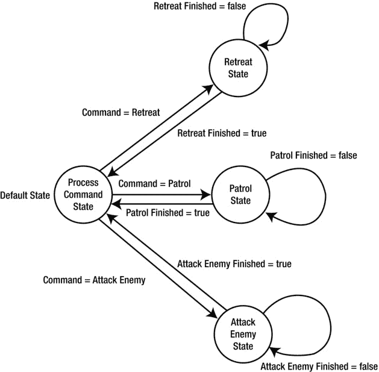
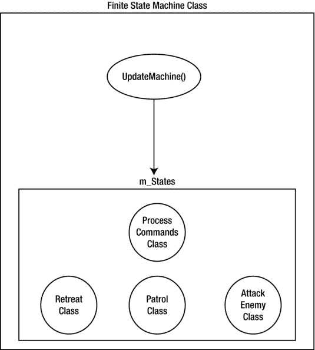
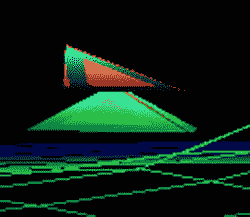
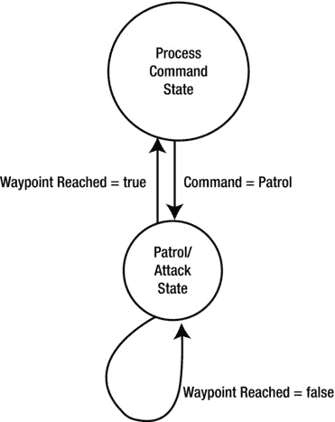
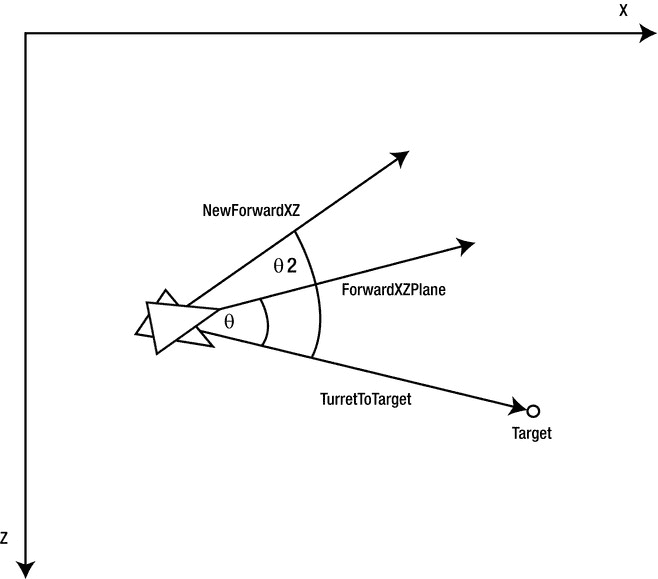
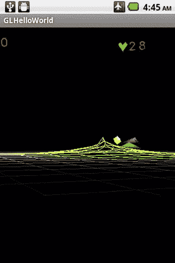
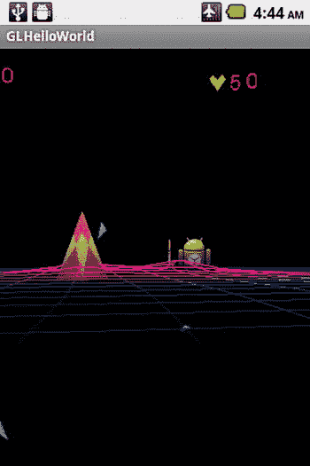

# 八、无人机网格案例研究：创造敌人

Abstract

本章将介绍无人机网格案例研究中敌人的创建。首先介绍的是 arena 对象，它们具有相对简单的行为。接下来，我掩护坦克敌人，它的行为要复杂得多。为了理解这种行为，我介绍了有限状态机的基础知识。接下来，我将介绍有限状态机和特定于我们的计算机控制坦克的相关类。然后我会介绍在我们的游戏中实现坦克所需的其他类。最后，我将讨论一个实际例子，它使用了我之前在一个工作例子中介绍过的类。

本章将介绍无人机网格案例研究中敌人的创建。首先介绍的是 arena 对象，它们具有相对简单的行为。接下来，我掩护坦克敌人，它的行为要复杂得多。为了理解这种行为，我介绍了有限状态机的基础知识。接下来，我将介绍有限状态机和特定于我们的计算机控制坦克的相关类。然后我会介绍在我们的游戏中实现坦克所需的其他类。最后，我将讨论一个实际例子，它使用了我之前在一个工作例子中介绍过的类。

## 创建竞技场对象

竞技场物体是穿过重力网格区域的简单的敌人物体。它们在重力网格内直线行进，直到碰到网格边界或玩家的力量金字塔。在碰到网格边界或能量金字塔后，它们会以与之前相同的速度反转方向。

ArenaObject3d 类派生自 Object3d 类。

`public class ArenaObject3d extends Object3d`

`m_ArenaObjectID`变量可以保存一个字符串来标识游戏世界中的一个单独的对象。

`private String m_ArenaObjectID = "None";`

`m_XmaxBoundary`和`m_XminBoundary`变量保存游戏网格或游戏竞技场沿 x 轴的最大和最小边界。

`private float m_XMaxBoundary = 1;`

`private float m_XMinBoundary = 0;`

`m_ZmaxBoundary`和`m_ZminBoundary`变量保存游戏竞技场沿 z 轴的最大和最小边界。

`private float m_ZMaxBoundary = 1;`

`private float m_ZMinBoundary = 0;`

当竞技场物体落地时,`m_HitGroundSFXIndex`变量持有音效的句柄。

`private int m_HitGroundSFXIndex = -1;`

`m_ExplosionSFXIndex`变量保存竞技场物体爆炸时播放的声音效果的句柄。

`private int m_ExplosionSFXIndex = -1;`

ArenaObject3d 构造函数调用 Object3d 类的构造函数，然后为这个 arena 对象设置游戏竞技场边界。(参见清单 8-1。)

清单 8-1。ArenaObject3d 构造函数

`ArenaObject3d(Context iContext, Mesh iMesh, MeshEx iMeshEx, Texture[] iTextures, Material iMaterial,Shader iShader, float XMaxBoundary,float XMinBoundary,float ZMaxBoundary,float ZMinBoundary)`

`{`

`super(iContext, iMesh, iMeshEx, iTextures, iMaterial, iShader);`

`m_XMaxBoundary =  XMaxBoundary;`

`m_XMinBoundary =  XMinBoundary;`

`m_ZMaxBoundary =  ZMaxBoundary;`

`m_ZMinBoundary =  ZMinBoundary;`

`}`

`CreateExplosionSFX()`通过调用 Object3d 类中的`AddSound()`函数创建一个新的爆炸声音效果，该函数带有要创建的声音的资源 id 和保存它的声音池。新创建声音的索引保存在`m_ExplosionSFXIndex`中。(参见清单 8-2。)

清单 8-2。制造爆炸声音效果

`void CreateExplosionSFX(SoundPool Pool, int ResourceID)`

`{`

`m_ExplosionSFXIndex = AddSound(Pool, ResourceID);`

`}`

`PlayExplosionSFX()`函数通过调用 Object3d 类中带有爆炸声音效果索引的`PlaySound()`函数来播放爆炸的声音效果(如果有的话)。(参见清单 8-3。)

清单 8-3。播放爆炸音效

`void PlayExplosionSFX()`

`{`

`if (m_ExplosionSFXIndex >= 0)`

`{`

`PlaySound(m_ExplosionSFXIndex);`

`}`

`}`

`CreateHitGroundSFX()`函数通过调用 Object3d 类中的`AddSound()`函数来创建一个新的声音效果，该函数带有声音效果的资源 id 和将要存储声音的声音池。新创建的声音的索引被返回并放入`m_HitGroundSFXIndex`。(参见清单 8-4。)

清单 8-4。创造击中地面的音效

`void CreateHitGroundSFX(SoundPool Pool, int ResourceID)`

`{`

`m_HitGroundSFXIndex = AddSound(Pool, ResourceID);`

`}`

`PlayHitGoundSFX()`功能播放竞技场物体落地的声音效果，如果有的话。(参见清单 8-5。)

清单 8-5。播放击中地面的声音效果

`void PlayHitGoundSFX()`

`{`

`if (m_HitGroundSFXIndex >= 0)`

`{`

`PlaySound(m_HitGroundSFXIndex);`

`}`

`}`

函数将竞技场对象绘制到屏幕上。它还测试物体是否刚刚落地。如果它刚刚落地，则播放落地音效，并重置物理类中的落地状态。(参见清单 8-6。)

清单 8-6。渲染竞技场对象

`void RenderArenaObject(Camera Cam, PointLight light)`

`{`

`// Object hits ground`

`boolean ShakeCamera = GetObjectPhysics().GetHitGroundStatus();`

`if (ShakeCamera)`

`{`

`GetObjectPhysics().ClearHitGroundStatus();`

`PlayHitGoundSFX();`

`}`

`DrawObject(Cam, light);`

`}`

`UpdateArenaObject()`函数更新竞技场目标敌人。(参见清单 8-7。)

清单 8-7。更新竞技场对象

`void UpdateArenaObject()`

`{`

`if (IsVisible() == true)`

`{`

`// Check Bounds for Z`

`if (m_Orientation.GetPosition().z >= m_ZMaxBoundary)`

`{`

`Vector3 v = GetObjectPhysics().GetVelocity();`

`if (v.z > 0)`

`{`

`v.z = -v.z;`

`}`

`}`

`els` `e`

`if (m_Orientation.GetPosition().z <= m_ZMinBoundary)`

`{`

`Vector3 v = GetObjectPhysics().GetVelocity();`

`if (v.z < 0)`

`{`

`v.z = -v.z;`

`}`

`}`

`// Check bounds for X`

`if (m_Orientation.GetPosition().x >= m_XMaxBoundary)`

`{`

`Vector3 v = GetObjectPhysics().GetVelocity();`

`if (v.x > 0)`

`{`

`v.x = -v.x;`

`}`

`}`

`if (m_Orientation.GetPosition().x <= m_XMinBoundary)`

`{`

`Vector3 v = GetObjectPhysics().GetVelocity();`

`if (v.x < 0)`

`{`

`v.x = -v.x;`

`}`

`}`

`}`

`// Update Physics for this object`

`UpdateObject3d();`

`}`

该函数执行以下操作:

If the object is visible, it continues with the update, otherwise it returns.   Checks the max z boundary to see if the object is outside it. If it is, and it is going farther outside the boundary, then it reverses the z component of the object’s velocity. Then it checks the minimum z boundary to see if the object is outside it. If it is, and it is going farther outside the boundary, then it reverses the z component of the object’s velocity.   Repeats step 2 for the x boundary and reverses the x component of the object’s velocity instead of the z component.  

最后，图 8-1 显示了我们在本章后面的动手示例中使用的一个 arena 对象的示例。

图 8-1。

An example of an arena object

## 人工智能概述

复杂的人工智能(AI)通常应用于视频游戏的方式是通过使用有限状态机。有限状态机由一组状态组成，代表您想要模拟的人、实体或车辆的行为。每个状态都包含实现这种行为的代码，并检查游戏条件是否有变化，从而导致状态的变化。如果需要改变状态，则有限状态机根据前一状态的转换规则，将当前执行状态设置为前一状态指定的状态。

例如，假设你希望玩家能够控制一队机器人，并让这些机器人根据玩家发送给机器人的命令执行特定的任务。玩家可以选择的行为有

*   撤退
*   巡逻
*   攻击敌人

使用有限状态机，这些行为中的每一个都将在单独的状态下实现。初始状态将处理玩家的当前命令，并转换到执行该命令的相应状态。一旦每个命令都完成了，有限状态机就会转换回处理玩家命令的状态。该过程将被重复，并且状态机将转换到实现玩家当前命令的状态。(参见图 8-2 。)

图 8-2。

The finite state machine

就用代码实现有限状态机而言，我们有一个有限状态机类用于我们想要控制的敌人类型。这种类型的敌人的每个行为都由一个单独的类来表示，并被加载到有限状态机中进行处理。有限状态机类中的`UpdateMachine()`函数被调用来更新状态机。参见图 8-3 ,图中显示了我们在图 8-2 中的状态机如何在代码中实现的一般类级视图。

图 8-3。

Implementing the finite state machine

## 创造坦克敌人

坦克敌人由坦克的图形和坦克的人工智能组成。

### 创建坦克图形

坦克的图形是两个金字塔形的多边形。代表坦克车体的下面的多边形与代表坦克炮塔的上面的多边形相同，只是稍微大一点。

Pyramid2 类保存了列表 8-8 中`Pyramid2Vertices`数组中的坦克车体和坦克炮塔的数据。)

清单 8-8。坦克图形

`public class Pyramid2  extends Object3d`

`{`

`static float[] Pyramid2Vertices =`

`{`

`// Triangle Shape`

`// Left Side            u  v   nx, ny, nz`

`-0.5f, -0.5f, -0.5f,    0, 1,  -1, -1, -1,  // v0 = left, bottom, back`

`0.0f, -0.5f,  0.5f,    1, 1,   0,  0,  1,  // v1 = left, bottom, front`

`0.0f,  0.5f, -0.5f, 0.5f, 0,   0,  1,  0,  // v2 = top point`

`// Right Side`

`0.5f, -0.5f, -0.5f,    0, 1,   1, -1, -1,  // v3 = right, bottom, back`

`0.0f, -0.5f,  0.5f,    1, 1,   0,  0,  1,  // v4 = right, bottom, front`

`0.0f,  0.5f, -0.5f, 0.5f, 0,   0,  1,  0,  // v2 = top point`

`// Back`

`-0.5f, -0.5f, -0.5f,    0, 1,  -1, -1, -1,  // v0 = left, bottom, back`

`0.5f, -0.5f, -0.5f,    1, 1,   1, -1, -1,  // v3 = right, bottom, back`

`0.0f,  0.5f, -0.5f, 0.5f, 0,   0,  1,  0,  // v2 = top point`

`// Bottom`

`-0.5f, -0.5f, -0.5f,    0, 1,  -1, -1, -1,  // v0 = left, bottom, back`

`0.5f, -0.5f, -0.5f,    1, 1,   1, -1, -1,  // v3 = right, bottom, back`

`0.0f, -0.5f,  0.5f, 0.5f, 0,   0,  0,  1,  // v4 = right, bottom, front`

`};`

`Pyramid2(Context iContext, Mesh iMesh, MeshEx iMeshEx, Texture[] iTextures, Material iMaterial, Shader iShader)`

`{`

`super(iContext, iMesh, iMeshEx, iTextures, iMaterial, iShader);`

`}`

`}`

图 8-4 显示了最终的复合敌方坦克物体，包括炮塔和主坦克车体。

图 8-4。

The tank 3D object

### 创建坦克状态

坦克状态机由两种状态组成。一个是处理命令状态，处理发送给坦克的命令，选择执行命令的坦克的行为。另一种状态是巡逻/攻击状态，在向玩家的力量金字塔开火的同时，根据路点驾驶坦克绕着游戏场行驶。坦克的有限状态机如图 8-5 所示。

图 8-5。

The tank’s finite state machine

枚举识别坦克状态机内部使用的不同状态 id，以便状态机可以识别并在需要时转换到相应的状态。

`FSM_StatesTank`枚举(见清单 8-9)包括

*   FSM_STATE_NONE:这表示没有状态。
*   FSM_STATE_STEER_WAYPOINT:这个状态 id 对应于巡逻/攻击状态。
*   FSM_STATE_PROCESS_COMMAND:这个状态 id 对应于进程命令状态。

清单 8-9。坦克状态

`enum FSM_StatesTank`

`{`

`FSM_STATE_NONE,`

`FSM_STATE_STEER_WAYPOINT,`

`FSM_STATE_PROCESS_COMMAND,`

`};`

StateTank 类包含基类，坦克的所有其他状态都是从该基类派生的。

变量`m_Parent`保存了一个对坦克驾驶员的引用，并提供了对 AI 控制的车辆和坦克物体本身的命令和数据的访问。

`private Driver m_Parent;`

`m_StateID`变量保存标识坦克可能处于的状态的 id。完整列表见清单 8-9。

`private FSM_StatesTank m_StateID;`

当这个类对象所属的有限状态机第一次被创建和重置时，调用一次`Init()`函数。

`void Init()     {}`

当第一次从不同的状态进入该状态时，调用`Enter()`函数。

`void Enter()   {}`

在退出一个状态到另一个状态之前，调用`Exit()`函数。

`void Exit() {}`

调用`Update()`函数来更新状态。

`void Update() {}`

`CheckTransitions()`函数根据游戏条件检查到另一个状态的转换，默认情况下不返回任何状态，除非被子类覆盖。

清单 8-10 显示了整个 StateTank 类。

清单 8-10。坦克状态的基类

`public class StateTank`

`{`

`private Driver m_Parent;`

`private FSM_StatesTank m_StateID;`

`StateTank(FSM_StatesTank ID, Driver Parent)`

`{`

`m_StateID = ID;`

`m_Parent = Parent;`

`}`

`void Init()     {}`

`void Enter()   {}`

`void Exit() {}`

`void Update() {}`

`FSM_StatesTank  CheckTransitions()`

`{`

`return FSM_StatesTank.FSM_STATE_NONE;`

`}`

`Driver GetParent() {return m_Parent;}`

`FSM_StatesTank GetStateID() { return m_StateID;}`

`}`

### 创建车辆命令

接下来，我们必须创建一个类来保存坦克车辆要执行的命令。首先，我们必须定义几个枚举。

`AIVehicleCommand`枚举(见清单 8-11)保存了车辆要执行的实际命令类型。

清单 8-11。车辆指挥

`enum AIVehicleCommand`

`{`

`None,`

`Patrol,`

`};`

车辆命令可以是

*   None:指定没有命令
*   巡逻:告诉坦克向车辆指挥类对象中指定的路点移动，同时向玩家的力量金字塔开火

`AIVehicleObjectsAffected`枚举(见清单 8-12)保存受命令影响的项目，例如

无:表示没有受命令影响的对象。

航路点:指示航路点将受命令影响。

PrimaryWeapon:表示将使用主要武器。

SecondaryWeapon:表示将使用副武器。

清单 8-12。受命令影响的对象

`enum AIVehicleObjectsAffected`

`{`

`None,`

`WayPoints,`

`PrimaryWeapon,`

`SecondaryWeapon`

`};`

VehicleCommand 类表示我们将发送给坦克的命令。

如前所述，`m_Command`变量以`AIVehicleCommand`枚举的形式保存实际的车辆命令。

`private AIVehicleCommand m_Command;`

如前所述，`m_ObjectsAffected`变量在`AIVehicleObjectsAffected`枚举中保存受命令影响的对象(如果有的话)。

`private AIVehicleObjectsAffected m_ObjectsAffected;`

`m_NumberObjectsAffected`变量保存受命令影响的对象数量，如果有的话。

`private int m_NumberObjectsAffected;`

`m_DeltaAmount`变量保存一次发射的子弹数。

`private float  m_DeltaAmount;`

`m_DeltaIncrement`变量以毫秒为单位保存武器发射间隔的发射延迟时间。

`private float  m_DeltaIncrement;`

`m_MaxValue`变量保存与命令相关的最大值，如果有的话。

`private float  m_MaxValue;`

`m_MinValue`变量保存与命令相关的最小值，如果有的话。

`private float  m_MinValue;`

`MAX_WAYPOINTS`变量保存该命令中可保存的最大航路点数量。路点是一系列依次到达的地点。

`static int MAX_WAYPOINTS = 50;`

`m_NumberWayPoints`变量保存该命令中实际保存的路点数。

`private int m_NumberWayPoints = 0;`

`m_CurrentWayPointIndex`保存车辆正在前往的当前航路点的索引。

`private int m_CurrentWayPointIndex = 0;`

`m_WayPoints`数组保存车辆将移动到的位置的值。

`private Vector3[] m_WayPoints = new Vector3[MAX_WAYPOINTS];`

变量`m_Target`保存坦克开火的位置，如果有的话。

`private Vector3 m_Target;`

变量`m_TargetObject`保存坦克将要射击的目标，如果有的话。

`private Object3d m_TargetObject;`

VehicleCommand 构造函数通过设置前面讨论的类成员变量来创建 vehicle 命令。(参见清单 8-13。)

清单 8-13。车辆制造商

`VehicleCommand(Context iContext,AIVehicleCommand Command, AIVehicleObjectsAffected ObjectsAffected, int NumberObjectsAffected,float DeltaAmount,float DeltaIncrement,float MaxValue,float MinValue, int NumberWayPoints,Vector3[] WayPoints,Vector3 Target,Object3d  TargetObject)`

`{`

`m_Context = iContext;`

`m_Command = Command;`

`m_ObjectsAffected      =ObjectsAffected;`

`m_NumberObjectsAffected=      NumberObjectsAffected;`

`m_DeltaAmount = DeltaAmount;`

`m_DeltaIncrement =   DeltaIncrement;`

`m_MaxValue = MaxValue;`

`m_MinValue = MinValue;`

`m_NumberWayPoints =  NumberWayPoints;`

`m_WayPoints = WayPoints;`

`m_Target =Target;`

`m_TargetObject= TargetObject;`

`}`

`SaveState()`函数保存 VehicleCommand 类成员数据，使用输入句柄字符串作为存储车辆命令数据的主索引名。

`SaveState()`功能执行以下操作:

Gets a SharedPreferences object associated with the Activity specified in `m_Context` and the input Handle.   Sets up an editor variable from the SharedPreferences object in step 1 that is used to put the class member data into the shared preferences file.   Saves the value of each class member variable. The general procedure is to   Create a handle to the class member variable by concatenating the Handle that is an input parameter to the function and a string representing the variable. For example, `Handle + "Command"`.   Next, if needed, convert the variable into a form that can be written into a SharedPreferences object such as a string or integer. For example, an enumeration can be converted to a string by adding it to a null string `""`. The statement `m_Command + ""` will convert the enumeration to a string.   Store the variable in a key value pair format using the handle specific to that class member variable as the key and the value of the class member variable as the value.   Saves the changes made to all the data to the shared preferences file by calling `commit()` on the editor variable created in step 2.  

请参见清单 8-14。为了节省篇幅，清单被缩短了。有关本章的完整代码，请参见位于`apress.com`的源代码/下载区。

清单 8-14。保存车辆命令

`void SaveState(String Handle)`

`{`

`SharedPreferences settings = m_Context.getSharedPreferences(Handle, 0);`

`SharedPreferences.Editor editor = settings.edit();`

`// Command`

`String CommandHandle = Handle + "Command";`

`String CommandStr = m_Command + "";`

`editor.putString(CommandHandle, CommandStr);`

`//  Code to save reset of class member variables`

`// Commit the edits!`

`editor.commit();`

`}`

`MatchCommand()`函数将一个字符串值转换成一个`AIVehicleCommand`枚举并返回它。该函数在`LoadState()`函数中用于加载保存的车辆命令对象。(参见清单 8-15。)

清单 8-15。将字符串命令与枚举匹配

`static AIVehicleCommand MatchCommand(String CommandStr)`

`{`

`AIVehicleCommand Command = AIVehicleCommand.None;`

`if (CommandStr.equalsIgnoreCase("None"))`

`{`

`Command = AIVehicleCommand.None;`

`}`

`else`

`if (CommandStr.equalsIgnoreCase("Patrol"))`

`{`

`Command = AIVehicleCommand.Patrol;`

`}`

`return Command;`

`}`

函数将一个字符串转换成一个枚举。该函数在`LoadState()`函数中用于加载车辆命令对象。(参见清单 8-16。)

清单 8-16。将字符串转换为`AIVehicleObjectsAffected`枚举

`static AIVehicleObjectsAffected MatchObjectsAffected(String ObjectsAffectedStr)`

`{`

`AIVehicleObjectsAffected ObjectsAffected = AIVehicleObjectsAffected.None;`

`if (ObjectsAffectedStr.equalsIgnoreCase("None"))`

`{`

`ObjectsAffected = AIVehicleObjectsAffected.None;`

`}`

`else`

`if (ObjectsAffectedStr.equalsIgnoreCase("WayPoints"))`

`{`

`ObjectsAffected = AIVehicleObjectsAffected.WayPoints;`

`}`

`else`

`if (ObjectsAffectedStr.equalsIgnoreCase("PrimaryWeapon"))`

`{`

`ObjectsAffected = AIVehicleObjectsAffected.PrimaryWeapon;`

`}`

`else`

`if (ObjectsAffectedStr.equalsIgnoreCase("SecondaryWeapon"))`

`{`

`ObjectsAffected = AIVehicleObjectsAffected.SecondaryWeapon;`

`}`

`return ObjectsAffected;`

`}`

`LoadState()`函数将共享首选项条目中的数据加载到类成员变量中。

`LoadState()`功能执行以下操作:

Gets the shared preferences object associated with the input parameter Handle.   Loads data for each of the class member variables. The general format for doing this follows:   Create the handle specific to that class member variable by concatenating the input Handle parameter and the string identifier for that variable.   Read in the data using this new handle created in step 1.   If necessary, convert the data into a data type that can be stored in that class member variable.  

请参见清单 8-17。为了节省篇幅，清单被缩短了。有关本章的完整代码，请参见位于`apress.com`的源代码/下载区。

清单 8-17。加载车辆命令

`void LoadState(String Handle)`

`{`

`SharedPreferences settings = m_Context.getSharedPreferences(Handle, 0);`

`// Command`

`String CommandHandle = Handle + "Command";`

`String CommandStr = settings.getString(CommandHandle, "None");`

`m_Command =  MatchCommand(CommandStr);`

`// Rest of Code`

`....`

`}`

`IncrementWayPointIndex()`功能增加`m_CurrentWayPointIndex`变量，该变量保存车辆正驶向的当前航路点的索引。如果已经到达该组路点中的最后一个点，则下一个路点是起始路点。(参见清单 8-18。)

清单 8-18。增加航路点索引

`void IncrementWayPointIndex()`

`{`

`int NextWayPointIndex = m_CurrentWayPointIndex + 1;`

`if (NextWayPointIndex < m_NumberWayPoints)`

`{`

`m_CurrentWayPointIndex = NextWayPointIndex;`

`}`

`else`

`{`

`// Loop Waypoints`

`m_CurrentWayPointIndex = 0;`

`}`

`}`

`ClearCommand()`功能将车辆命令和`m_ObjectsAffected`变量清除为无。(参见清单 8-19。)

清单 8-19。清除车辆指令

`void ClearCommand()`

`{`

`m_Command = AIVehicleCommand.None;`

`m_ObjectsAffected  = AIVehicleObjectsAffected.None;`

`}`

### 创建坦克状态以处理命令

处理坦克命令的状态是从 StateTank 类派生的 StateTankProcessCommand 类。

`public class StateTankProcessCommand extends StateTank`

`ProcessAIVehicleCommand()`功能根据给坦克的命令设置下一个坦克状态。(参见清单 8-20。)

清单 8-20。处理人工智能车辆命令

`void ProcessAIVehicleCommand()`

`{`

`VehicleCommand CurrentOrder = GetParent().GetCurrentOrder();`

`if (CurrentOrder == null)`

`{`

`return;`

`}`

`if (CurrentOrder.GetCommand() == AIVehicleCommand.None)`

`{`

`return;`

`}`

`AIVehicleCommand Command = CurrentOrder.GetCommand();`

`// Process Commands`

`if (Command == AIVehicleCommand.Patrol)`

`{`

`m_NextState = FSM_StatesTank.FSM_STATE_STEER_WAYPOINT;`

`}`

`else`

`{`

`m_NextState = FSM_StatesTank.FSM_STATE_PROCESS_COMMAND;`

`}`

`}`

该函数执行以下操作:

It gets the current order for this vehicle.   If the order is nonexistent or the command is none (`AIVehicleCommand.None`), the function returns.   If there is a valid order, the command is retrieved. If the command is to patrol the arena (`AIVehicleCommand.Patrol`), then set the tank’s state to the patrol/attack state, which has the state id of `FSM_STATE_STEER_WAYPOINT`. Otherwise, set the tank’s state to the process command state to wait for a command that can be executed by the tank.  

`CheckTransitions()`函数调用`ProcessAIVehicleCommand()`来设置返回的`m_NextState`变量的下一个状态。(参见清单 8-21。)

清单 8-21。检查状态转换

`FSM_StatesTank  CheckTransitions()`

`{`

`ProcessAIVehicleCommand();`

`return m_NextState;`

`}`

### 创建车辆转向类别

转向类别代表车辆的转向控制。

`HorizontalSteeringValues`枚举(见清单 8-22)保存了车辆水平转向的值，这些值是

*   无:表示没有转向值
*   右:告诉车辆向右转
*   左:告诉车辆向左转

清单 8-22。水平转向

`enum HorizontalSteeringValues`

`{`

`None,`

`Right,`

`Left`

`}`

`VerticalSteeringValues`枚举(见清单 8-23)保存了车辆垂直转向的数值。这些值是

*   无:表示没有垂直转向值
*   向上:告诉车辆向上移动
*   向下:告诉车辆向下移动

清单 8-23。垂直转向值

`enum VerticalSteeringValues`

`{`

`None,`

`Up,`

`Down`

`}`

`Speed` `SteeringValues`枚举(见清单 8-24)保存车辆的加速度控制值。这些值是

*   无:没有加速度值。告诉车辆保持相同的速度
*   加速:告诉车辆增加速度
*   减速:告诉车辆降低速度

清单 8-24。加速度值

`enum SpeedSteeringValues`

`{`

`None,`

`Accelerate,`

`Deccelerate`

`}`

`m_HoriontalSteering`变量保存左/右车辆转向值。

`private HorizontalSteeringValues m_HoriontalSteering;`

如适用，`m_VerticalSteering`变量保存车辆的上/下转向值。

`private VerticalSteeringValues m_VerticalSteering;`

`m_SpeedSteering`变量保存车辆的加速转向值。

`private SpeedSteeringValues   m_SpeedSteering;`

`m_MaxPitch`变量保存车辆向上或向下的最大倾斜度，如适用。

`private float m_MaxPitch = 45; // degrees`

`m_TurnDelta`变量保存车辆在一次更新中转动的度数。

`private float m_TurnDelta = 1; // degrees`

`m_MaxSpeed`变量保存每次更新的最大速度或位置变化。

`private float m_MaxSpeed = 0.1f;`

`m_MinSpeed`变量保存每次更新的最小速度或位置变化。

`private float m_MinSpeed = 0.05f;`

`m_SpeedDelta`变量保存每次车辆更新的速度变化量。

`private float m_SpeedDelta = 0.01f;`

`ClearSteering()`功能将车辆的水平、垂直和速度输入清零。这个函数在第一次构造转向对象时被调用。(参见清单 8-25。)

清单 8-25。清除转向

`void ClearSteering()`

`{`

`m_HoriontalSteering = HorizontalSteeringValues.None;`

`m_VerticalSteering = VerticalSteeringValues.None;`

`m_SpeedSteering = SpeedSteeringValues.None;`

`}`

`SetSteeringHorizontal()`功能设置车辆转向输入的水平值和每次车辆更新的转弯速率或转弯增量。(参见清单 8-26。)

清单 8-26。设置车辆的水平转向值

`void SetSteeringHorizontal(HorizontalSteeringValues Horizontal, float TurnDelta)`

`{`

`m_HoriontalSteering = Horizontal;`

`m_TurnDelta = TurnDelta;`

`}`

`SetSteeringVertical()`功能设置车辆转向输入的垂直向上/向下值，以及车辆可以倾斜的最大上下倾斜度。(参见清单 8-27。)

清单 8-27。设置垂直转向值

`void SetSteeringVertical(VerticalSteeringValues Vertical, float MaxPitch)`

`{`

`m_VerticalSteering = Vertical;`

`m_MaxPitch = MaxPitch;`

`}`

`SetSteeringSpeed()`功能设置车辆的加速或减速输入、车辆的最大速度、车辆的最小速度以及速度或速度增量的变化率。(参见清单 8-28。)

清单 8-28。设定车速

`void SetSteeringSpeed(SpeedSteeringValues Speed, float MaxSpeed, float MinSpeed, float SpeedDelta)`

`{`

`m_SpeedSteering = Speed;`

`m_MaxSpeed = MaxSpeed;`

`m_MinSpeed = MinSpeed;`

`m_SpeedDelta = SpeedDelta;`

`}`

### 创建坦克的巡逻/攻击状态

主要的坦克状态是巡逻/攻击状态，在这种状态下，坦克根据路点在操场周围移动，同时向玩家的力量金字塔开火。更具体地说，坦克的底部转向当前的路点并向其移动，而坦克的顶部转向金字塔并向其开火。

StateTankSteerWayPoint 类实现了坦克的巡逻/攻击状态，它是从前面讨论的 StateTank 类派生而来的。

`public class StateTankSteerWayPoint extends StateTank`

`m_WayPoint`变量保存了车辆正在驶向的当前航点的位置。

`private Vector3 m_WayPoint  = new Vector3(0,0,0);`

`m_WayPointRadius`变量保存航路点的半径。如果坦克在由当前航路点和航路点半径指示的区域内，则认为坦克已经到达航路点。

`private float m_WayPointRadius = 0;`

`m_LastWayPoint`变量保存先前到达的航路点，就在当前航路点之前。

`private Vector3 m_LastWayPoint   = new Vector3(5000,5000,5000);`

如果坦克的炮塔指向目标加上或减去`m_TargetAngleTolerance`值，坦克将向目标开火。

`private float m_TargetAngleTolerance = Physics.PI/16.0f;`

`m_Target`变量保存射击目标的位置，如果有的话。

`private Vector3 m_Target;`

`m_TargetObj`变量保存要射击的目标对象，如果有的话。

`private Object3d m_TargetObj;`

`m_WeaponType`变量包含向目标开火的主要或次要武器类型。

`private AIVehicleObjectsAffected m_WeaponType;`

`m_RoundsToFire`变量保存一次发射的子弹数。

`private float m_RoundsToFire = 0;`

`m_NumberRoundsFired`变量记录每次爆炸发射的弹药数量。

`private int m_NumberRoundsFired = 0;`

`m_TimeIntervalBetweenFiring`变量设置坦克武器连续发射的时间间隔。

`private long m_TimeIntervalBetweenFiring = 0;`

变量保存坦克最后一次开火的时间。

`private long m_StartTimeFiring = 0;`

如果坦克的武器应该开火，变量`m_FireWeapon`为真，否则为假。

`private boolean m_FireWeapon = false;`

StateTankSteerWayPoint 类的构造函数调用具有`FSM_StatesTank` id 的 StateTank 超类的构造函数，该构造函数向有限状态机和 Driver 父对象标识这是哪个状态，Driver 父对象包含关于此车辆的命令和 Tank 对象的信息。(参见清单 8-29。)

清单 8-29。构造函数

`StateTankSteerWayPoint(FSM_StatesTank ID, Driver Parent)`

`{`

`super(ID, Parent);`

`}`

当有限状态机第一次进入这个状态时，调用`Enter()`函数。该函数初始化关键变量。一些数据来自父驾驶员类对象，例如当前航点、航点半径或来自车辆命令的数据。`Enter()`函数也让父驱动类对象知道当前执行的命令是巡逻/攻击命令。(参见清单 8-30。)

清单 8-30。第一次进入状态

`void Enter()`

`{`

`// Weapon is not firing when state is entered initially`

`m_NumberRoundsFired = 0;`

`m_FireWeapon = false;`

`// Get WayPoint Data`

`m_WayPoint = GetParent().GetWayPoint();`

`m_WayPointRadius = GetParent().GetWayPointRadius();`

`// Get Targeting and firing parameters`

`m_Target = GetParent().GetCurrentOrder().GetTarget();`

`m_TargetObj = GetParent().GetCurrentOrder().GetTargetObject();`

`m_WeaponType = GetParent().GetCurrentOrder().GetObjectsAffected();`

`m_RoundsToFire = GetParent().GetCurrentOrder().GetDeltaAmount();`

`m_TimeIntervalBetweenFiring = (long)GetParent().GetCurrentOrder().GetDeltaIncrement();`

`// Tell the Pilot class what command is actually being executed in the FSM`

`GetParent().SetCommandExecuting(AIVehicleCommand.Patrol);`

`}`

在有限状态机退出该状态之前，调用`Exit()`函数。该功能将当前航路点增加到下一个航路点，表示已经到达当前航路点，坦克需要移动到列表中的下一个航路点。(参见清单 8-31。)

清单 8-31。离开这个州

`void Exit()`

`{`

`// Update Current Waypoint to next WayPoint`

`GetParent().IncrementNextWayPoint();`

`}`

`TurnTurretTowardTarget()`功能决定坦克炮塔的水平或左/右转向方向，使坦克的武器转向面对目标。(完整的源代码见清单 8-32。)

清单 8-32。将坦克炮塔转向目标

`void TurnTurretTowardTarget(Vector3 Target)`

`{`

`// 1\. Find vector from front of vehicle to target`

`Vector3 ForwardXZPlane = new Vector3(0,0,0);`

`ForwardXZPlane.x = GetParent().GetAIVehicle().GetTurret().m_Orientation.GetForwardWorldCoords().x;`

`ForwardXZPlane.z = GetParent().GetAIVehicle().GetTurret().m_Orientation.GetForwardWorldCoords().z;`

`Vector3 TurretPosition = new Vector3(0,0,0);`

`TurretPosition.x = GetParent().GetAIVehicle().GetTurret().m_Orientation.GetPosition().x;`

`TurretPosition.z = GetParent().GetAIVehicle().GetTurret().m_Orientation.GetPosition().z;`

`Vector3 WayPointXZPlane = new Vector3(Target.x, 0, Target.z);`

`Vector3 TurretToTarget = Vector3.Subtract(WayPointXZPlane, TurretPosition);`

`// 2\. Normalize Vectors for Dot Product operation`

`ForwardXZPlane.Normalize();`

`TurretToTarget.Normalize();`

`// P.Q = P*Q*cos(theta)`

`// P.Q/P*Q = cos(theta)`

`// acos(P.Q/P*Q) = theta;`

`// 3\. Get current theta`

`double Theta = Math.acos(ForwardXZPlane.DotProduct(TurretToTarget));`

`// 4\. Get Theta if boat is turned to left by PI/16`

`Orientation NewO = new Orientation(GetParent().GetAIVehicle().GetTurret().m_Orientation);`

`Vector3 Up = NewO.GetUp();`

`NewO.SetRotationAxis(Up);`

`NewO.AddRotation(Physics.PI/16);`

`Vector3 NewForwardXZ = NewO.GetForwardWorldCoords();`

`NewForwardXZ.y = 0;`

`NewForwardXZ.Normalize();`

`double Theta2 = Math.acos(NewForwardXZ.DotProduct(TurretToTarget));`

`// Check if angle within tolerance for firing`

`float Diff = Math.abs((float)(Theta));`

`if (!m_FireWeapon)`

`{`

`if (Diff <= m_TargetAngleTolerance)`

`{`

`m_FireWeapon = true;`

`m_StartTimeFiring = System.currentTimeMillis();`

`}`

`}`

`// 5\. Set Steering`

`if (Theta2 > Theta)`

`{`

`GetParent().GetTurretSteering().SetSteeringHorizontal(HorizontalSteeringValues.Right, 1);`

`}`

`else`

`if (Theta2 < Theta)`

`{`

`GetParent().GetTurretSteering().SetSteeringHorizontal(HorizontalSteeringValues.Left, 1);`

`}`

`else`

`{`

`GetParent().GetTurretSteering().SetSteeringHorizontal(HorizontalSteeringValues.None,0);`

`}`

`}`

`TurnTurretTowardTarget()`功能执行以下操作:

图 8-6。

Turning the turret toward the target Finds the vector representing the firing direction of the tank’s weapon in world coordinates, which is `ForwardXZPlane` (see Figure 8-6).   Finds the vector representing the direction from the tank’s turret to the target that the tank needs to hit, which is `TurretToTarget`.   Normalizes the `ForwardXZPlane` and `TurretToTarget` vectors so that the length of the vectors is 1.   Finds the angle Theta between the `ForwardXZPlane` and `TurretToTarget` vectors.   Creates a new Orientation class object that is the same as the orientation of the tank’s turret but turned by a small angle PI/16, which is NewO.   Finds the forward vector of this new tank turret orientation, which is `NewForwardXZ`, and then normalizes it.   Finds the angle Theta2 between the `NewForwardXZ` and the `TurretToTarget` vectors.   If the tank weapon is not firing and the tank turret is directly facing the target plus or minus the `m_TargetAngleTolerance` value, set the tank weapon to fire and set the `m_StartTimeFiring` variable to the current time.   If Theta2 is greater than Theta, turn the tank turret to the right.   If Theta2 is less than Theta, turn the tank turret to the left.  

`FireTurretWeapon()`功能根据`AIVehicleObjectsAffected`值发射坦克的主要或辅助武器。如果武器成功发射，那么`m_NumberRoundsFired`变量增加 1。(参见清单 8-33。)

清单 8-33。发射坦克的炮塔武器

`void FireTurretWeapon()`

`{`

`Vector3 Direction = GetParent().GetAIVehicle().GetTurret().m_Orientation.GetForwardWorldCoords();`

`boolean IsFired = false;`

`if (m_WeaponType == AIVehicleObjectsAffected.PrimaryWeapon)`

`{`

`IsFired = GetParent().GetAIVehicle().FireWeapon(0, Direction);`

`}`

`else`

`if (m_WeaponType == AIVehicleObjectsAffected.SecondaryWeapon)`

`{`

`IsFired = GetParent().GetAIVehicle().FireWeapon(1, Direction);`

`}`

`if (IsFired)`

`{`

`m_NumberRoundsFired++;`

`}`

`}`

`SteerVehicleToWayPointHorizontal()`功能将主油箱向左或向右转向航路点。(完整的源代码见清单 8-34。)

清单 8-34。将车辆转向当前航路点

`void SteerVehicleToWayPointHorizontal(Vector3 WayPoint)`

`{`

`// 1\. Find vector from front of vehicle to target`

`Vector3 ForwardXZPlane = new Vector3(0,0,0);`

`ForwardXZPlane.x = GetParent().GetAIVehicle().GetMainBody().m_Orientation.GetForwardWorldCoords().x;`

`ForwardXZPlane.z = GetParent().GetAIVehicle().GetMainBody().m_Orientation.GetForwardWorldCoords().z;`

`Vector3 VehiclePosition = new Vector3(0,0,0);`

`VehiclePosition.x = GetParent().GetAIVehicle().GetMainBody().m_Orientation.GetPosition().x;`

`VehiclePosition.z = GetParent().GetAIVehicle().GetMainBody().m_Orientation.GetPosition().z;`

`Vector3 WayPointXZPlane = new Vector3(WayPoint.x, 0, WayPoint.z);`

`Vector3 VehicleToWayPoint = Vector3.Subtract(WayPointXZPlane, VehiclePosition);`

`// 2\. Normalize Vectors for Dot Product operation`

`ForwardXZPlane.Normalize();`

`VehicleToWayPoint.Normalize();`

`// P.Q = P*Q*cos(theta)`

`// P.Q/P*Q = cos(theta)`

`// acos(P.Q/P*Q) = theta;`

`// 3\. Get current theta`

`double Theta = Math.acos(ForwardXZPlane.DotProduct(VehicleToWayPoint));`

`// 4\. Get Theta if boat is turned to left by PI/16`

`Orientation NewO = new Orientation(GetParent().GetAIVehicle().GetMainBody().m_Orientation);`

`Vector3 Up = NewO.GetUp();`

`NewO.SetRotationAxis(Up);`

`NewO.AddRotation(Physics.PI/16);`

`Vector3 NewForwardXZ = NewO.GetForwardWorldCoords();`

`NewForwardXZ.y = 0;`

`NewForwardXZ.Normalize();`

`double Theta2 = Math.acos(NewForwardXZ.DotProduct(VehicleToWayPoint));`

`// 5\. Set Steering`

`if (Theta2 > Theta)`

`{`

`GetParent().GetAISteering().SetSteeringHorizontal(HorizontalSteeringValues.Right, 1);`

`}`

`else`

`if (Theta2 < Theta)`

`{`

`GetParent().GetAISteering().SetSteeringHorizontal(HorizontalSteeringValues.Left, 1);`

`}`

`else`

`{`

`GetParent().GetAISteering().SetSteeringHorizontal(HorizontalSteeringValues.None,0);`

`}`

`}`

该函数执行以下操作:

Finds the main tank body’s forward vector, which is `ForwardXZPlane`.   Calculates the vector, which is `VehicleToWayPoint`, from the tank to the waypoint.   Normalizes the `ForwardXZPlane` and `VehicleToWayPoint` vectors.   Calculates the angle Theta between the `ForwardXZPlane` and `VehicleToWayPoint` vectors.   Creates a new Orientation class object that is the same as the orientation of the tank’s main body but turned by a small angle PI/16, which is NewO.   Finds the forward vector of this new tank main body orientation, which is `NewForwardXZ`, and then normalizes it.   Finds the angle Theta2 between the `NewForwardXZ` and the `VehicleToWayPoint` vectors.   If Theta2 is greater than Theta, turn the tank’s main body to the right.   If Theta2 is less than Theta, turn the tank’s main body to the left.  

`SteerVehicleWaypointSpeed()`功能使坦克在航路点附近减速。如果油箱在最后一个航路点或当前航路点的转弯区半径内，该功能使油箱减速；否则，该功能会加速油箱。(参见清单 8-35。)

清单 8-35。在路点附近改变车速

`void SteerVehicleWaypointSpeed(Vector3 WayPoint)`

`{`

`// If vehicle is close to waypoint then slow down vehicle`

`// else accelerate vehicle`

`Tank AIVehicle = GetParent().GetAIVehicle();`

`Vector3 VehiclePos = AIVehicle.GetMainBody().m_Orientation.GetPosition();`

`Vector3 DistanceVecLastWayPoint = Vector3.Subtract(VehiclePos,m_LastWayPoint);`

`Vector3 DistanceVecCurrentWayPoint = Vector3.Subtract(VehiclePos, m_WayPoint);`

`float TurnArea = GetParent().GetTurnArea();`

`float DLastWayPoint = DistanceVecLastWayPoint.Length();`

`float DCurrentWayPoint = DistanceVecCurrentWayPoint.Length();`

`if ((DLastWayPoint <= TurnArea) || (DCurrentWayPoint <= TurnArea))`

`{`

`// Decrease speed`

`GetParent().GetAISteering().SetSteeringSpeed(SpeedSteeringValues.Deccelerate, 0.04f, 0.03f, 0.005f);`

`GetParent().GetAISteering().SetTurnDelta(3.0f);`

`}`

`else`

`{`

`GetParent().GetAISteering().SetSteeringSpeed(SpeedSteeringValues.Accelerate, 0.04f, 0.03f, 0.005f);`

`}`

`}`

`SteerVehicleToWayPoint()`功能通过调用`SteerVehicleToWayPointHorizontal()`将车辆向左或向右转向航路点位置，并通过调用`SteerVehicleWaypointSpeed()`调整坦克的速度。(参见清单 8-36。)

清单 8-36。将车辆转向航路点

`void SteerVehicleToWayPoint(Vector3 WayPoint)`

`{`

`SteerVehicleToWayPointHorizontal(WayPoint);`

`SteerVehicleWaypointSpeed(WayPoint);`

`}`

`Update()`功能为巡逻/攻击状态更新坦克的人工智能。(参见清单 8-37。)

清单 8-37。更新坦克巡逻/攻击状态

`void Update()`

`{`

`// Steer Main Tank Body to Waypoint`

`SteerVehicleToWayPoint(m_WayPoint);`

`// Turn Tank Turret towards target and fire`

`if (m_Target != null)`

`{`

`TurnTurretTowardTarget(m_Target);`

`}`

`else`

`if (m_TargetObj != null)`

`{`

`TurnTurretTowardTarget(m_TargetObj.m_Orientation.GetPosition());`

`}`

`else`

`{`

`Log.e("STATETANKSTEERWAYPOINT", "NO TARGET FOR TANK TO SHOOT AT!!!!");`

`}`

`if (m_FireWeapon)`

`{`

`if (m_NumberRoundsFired >= m_RoundsToFire)`

`{`

`m_NumberRoundsFired = 0;`

`m_FireWeapon = false;`

`}`

`else`

`{`

`// Find Time Elapsed Between firing sequences`

`long ElapsedTime = System.currentTimeMillis() - m_StartTimeFiring;`

`if (ElapsedTime > m_TimeIntervalBetweenFiring)`

`{`

`FireTurretWeapon();`

`}`

`}`

`}`

`}`

`Update()`功能执行以下操作:

Sets the steering and acceleration for the tank by calling `SteerVehicleToWayPoint()` with the target waypoint.   Calls `TurnTurretTowardTarget()` with the target location, which turns the tank’s turret toward the target, if a target location is in `m_Target`.   Calls `TurnTurretTowardTarget()` with `m_TargetObj`’s position, in order to turn the tank’s turret toward that target, if there is no location in `m_Target` and `m_TargetObj` is not null.   If `m_FireWeapon` is true, then either of the following occurs:   `m_FireWeapon` resets to false, if the number of rounds to fire for this burst is equal to the number of rounds that are required to be fired.   The weapon is fired by calling `FireTurretWeapon()`, if the required time delay has passed since the `m_FireWeapon` was set to true.  

`CheckTransitions()`功能根据游戏条件检查到不同状态的转换。如果坦克在目标航路点的`m_WayPointRadius`距离内，当前航路点保存在`m_LastWayPoint`变量中，该函数返回的状态为过程命令状态。如果坦克不在目标航路点的`m_WayPointRadius`距离内，状态不变，返回巡逻/攻击状态。(参见清单 8-38。)

清单 8-38。检查转换

`FSM_StatesTank  CheckTransitions()`

`{`

`Object3d AIVehicle = GetParent().GetAIVehicle().GetMainBody();`

`Vector3 VehiclePos = AIVehicle.m_Orientation.GetPosition();`

`Vector3 Distance   = Vector3.Subtract(VehiclePos,m_WayPoint);`

`float   D = Distance.Length();`

`if (D <= m_WayPointRadius)`

`{`

`m_LastWayPoint.Set(m_WayPoint.x, m_WayPoint.y, m_WayPoint.z);`

`return FSM_StatesTank.FSM_STATE_PROCESS_COMMAND;`

`}`

`else`

`{`

`return FSM_StatesTank.FSM_STATE_STEER_WAYPOINT;`

`}`

`}`

### 创建坦克有限状态机

坦克的有限状态机类是 FSMDriver 类。有限状态机实际上通过在每个坦克状态下调用适当的函数来执行坦克 AI。

FSMDriver 类的使用方法是

Add new tank states with the `AddState()` function.   Set the default state that the machine starts in with the `SetDefaultState()` command.   Initialize the machine by calling `Reset()`.   Update the machine by calling `UpdateMachine()`.  

`MAX_STATES`变量保存该机器可以保存的最大状态数。

`private int MAX_STATES = 20;`

`m_NumberStates`变量保存这个状态机中的状态数。

`private int m_NumberStates = 0;`

`m_States`数组保存组成有限状态机的坦克状态。

`protected StateTank[] m_States = new StateTank[MAX_STATES];`

变量`m_CurrentState`保存一个对当前执行的坦克状态的引用。

`protected StateTank m_CurrentState = null;`

`m_DefaultState`变量保存了对有限状态机启动时的默认状态的引用。

`protected StateTank m_DefaultState = null;`

`m_GoalState`是有限状态机将要转换到的状态。

`protected StateTank m_GoalState = null;`

`m_GoalID`是识别坦克状态类型的枚举，以转换到过程命令状态或巡逻/攻击状态。

`protected FSM_StatesTank m_GoalID;`

`Reset()`函数初始化有限状态机并执行以下操作(见清单 8-39):

If there is a current state being executed, it exits that state by calling `Exit()` on the state object.   It sets the current state to the default state of the machine.   For all the states in the machine, it initializes them by calling each state’s `Init()` function.   If there is a current state, it then “enters” that state by calling `Enter()` on that state.  

清单 8-39。重置有限状态机

`void Reset()`

`{`

`if(m_CurrentState != null)`

`{`

`m_CurrentState.Exit();`

`}`

`m_CurrentState = m_DefaultState;`

`for(int i = 0;i < m_NumberStates;i++)`

`{`

`m_States[i].Init();`

`}`

`if(m_CurrentState != null)`

`{`

`m_CurrentState.Enter();`

`}`

`}`

`AddState()`函数向有限状态机添加坦克状态。该函数首先检查是否有空间容纳更多的状态，如果有，将它们添加到`m_States`数组，增加机器中的状态数，并返回 true。否则返回 False。(参见清单 8-40。)

清单 8-40。向有限状态机添加状态

`boolean AddState(StateTank State)`

`{`

`boolean result = false;`

`if (m_NumberStates < MAX_STATES)`

`{`

`m_States[m_NumberStates] = State;`

`m_NumberStates++;`

`result = true;`

`}`

`return result;`

`}`

`TransitionState()`函数搜索机器中的所有状态，并尝试将目标输入状态 id `FSM_StatesTank`枚举与每个状态的 id 相匹配。如果找到匹配，那么`m_GoalState`被设置为该状态，并返回 true。否则，返回 false。(参见清单 8-41。)

清单 8-41。状态之间的转换

`boolean TransitionState(FSM_StatesTank Goal)`

`{`

`if(m_NumberStates == 0)`

`{`

`return false;`

`}`

`for(int i = 0; i < m_NumberStates;i++)`

`{`

`if(m_States[i].GetStateID() == Goal)`

`{`

`m_GoalState = m_States[i];`

`return true;`

`}`

`}`

`return false;`

`}`

`UpdateMachine()`函数更新坦克的有限状态机。(参见清单 8-42。)

清单 8-42。更新有限状态机

`void UpdateMachine()`

`{`

`if(m_NumberStates == 0)`

`{`

`return;`

`}`

`if(m_CurrentState == null)`

`{`

`m_CurrentState = m_DefaultState;`

`}`

`if(m_CurrentState == null)`

`{`

`return;`

`}`

`FSM_StatesTank OldStateID = m_CurrentState.GetStateID();`

`m_GoalID = m_CurrentState.CheckTransitions();`

`if(m_GoalID != OldStateID)`

`{`

`if(TransitionState(m_GoalID))`

`{`

`m_CurrentState.Exit();`

`m_CurrentState = m_GoalState;`

`m_CurrentState.Enter();`

`}`

`}`

`m_CurrentState.Update();`

`}`

该函数执行以下操作:

Returns, if there are no states in the machine.   Sets the current state to the default state, if there is no current state.   Returns, if the current state is still nonexistent.   Gets the current state’s id.   Checks the current state for a state transition by calling `CheckTransitions()`.   If the goal id that is returned is not the same as the id from the current state, then a transition to a new state must be made. The `TransitionState()` function is then called and, if the goal state has been found, is processed. The current state is exited by calling `Exit()` on the state object. The current state is then set to the goal state in `m_GoalState` that was set by the `TransitionState()` function. The current state is then entered by calling the `Enter()` function.   Updates the current state by calling the state’s `Update()` function.  

### 为坦克创建驱动程序

驱动程序类拥有作为坦克大脑的有限状态机。它还保存其他关键信息，例如要执行的车辆命令和其他游戏信息。

`m_CurrentOrder`变量保存对坦克当前`VehicleCommand`命令的引用，该命令将在坦克的有限状态机中执行。

`private VehicleCommand  m_CurrentOrder      = null; // Order to be executed in the FSM`

`m_LastOrder`变量保存了对坦克最后一次执行的命令的引用。

`private VehicleCommand  m_LastOrder  = null;`

`m_CommandExecuting`指当前在有限状态机中执行的实际车辆命令，无或巡逻。

`private AIVehicleCommand m_CommandExecuting = null; // Command that is currently being executed in the Finite State Machine`

`m_FiniteStateMachine`是指实现坦克人工智能的坦克有限状态机。

`private FSMDriver m_FiniteStateMachine = null;`

`m_AISteer`变量保存有限状态机生成的坦克转向输入值。

`private Steering m_AISteer = new Steering();`

`m_TurretSteering`变量保存有限状态机生成的坦克炮塔转动输入值。

`private Steering m_TurretSteering = new Steering();`

`m_TurnArea`是靠近该航路点的区域，在这里车辆减速转向下一个航路点。

`private float  m_TurnArea = 2.0f;`

`m_WayPoint`变量保存当前航路点。

`private Vector3 m_WayPoint = new Vector3(0,0,0);`

`m_WayPointRadius`变量保存航路点的半径。

`private float m_WayPointRadius = 1.0f;`

`m_AITank`变量保存由驱动程序类控制的坦克对象。

`private Tank m_AITank = null;`

驱动构造器(见清单 8-43)通过以下方式初始化类对象

Setting the reference to the tank, which is held in `m_AITank`.   Creating the tank’s finite state machine by creating a new `FSMDriver` object.   Creating the new tank states `StateTankSteerWayPoint` and `StateTankProcessCommand` and adding them to the finite state machine by calling the `AddState()` function.   Setting the default state of the finite state machine to the process command state.   Resetting the finite state machine by calling `Reset()`.  

清单 8-43。驱动程序构造函数

`Driver(Tank Vehicle)`

`{`

`// Set Vehicle that is to be controlled`

`m_AITank = Vehicle;`

`//construct the state machine and add the necessary states`

`m_FiniteStateMachine = new FSMDriver();`

`StateTankSteerWayPoint SteerWayPoint = new StateTankSteerWayPoint(FSM_StatesTank.FSM_STATE_STEER_WAYPOINT, this);`

`StateTankProcessCommand ProcessCommand = new StateTankProcessCommand(FSM_StatesTank.FSM_STATE_PROCESS_COMMAND,this);`

`m_FiniteStateMachine.AddState(SteerWayPoint);`

`m_FiniteStateMachine.AddState(ProcessCommand);`

`m_FiniteStateMachine.SetDefaultState(ProcessCommand);`

`m_FiniteStateMachine.Reset();`

`}`

`SaveDriverState()`函数保存驱动程序类中的关键类数据成员。为了节省空间，清单 8-44 被简化了。完整版本请参考位于`apress.com`的源代码/下载区。

清单 8-44。拯救司机

`void SaveDriverState(String Handle)`

`{`

`SharedPreferences settings = m_AITank.GetMainBody().GetContext().getSharedPreferences(Handle, 0);`

`SharedPreferences.Editor editor = settings.edit();`

`// Turn Area`

`String TurnAreaKey = Handle + "TurnArea";`

`editor.putFloat(TurnAreaKey, m_TurnArea);`

`.. Rest of code`

`}`

`LoadDriverState()`函数加载驱动程序类的关键数据。清单 8-45 中的代码已被缩写。如需完整代码，请参见位于`apress.com`的源代码/下载区。

清单 8-45。加载驱动程序状态

`void LoadDriverState(String Handle)`

`{`

`SharedPreferences settings = m_AITank.GetMainBody().GetContext().getSharedPreferences(Handle, 0);`

`// Turn Area`

`String TurnAreaKey = Handle + "TurnArea";`

`m_TurnArea = settings.getFloat(TurnAreaKey, 4.0f);`

`.. Rest of code`

`}`

如果当前命令是巡逻命令，则`IncrementNextWayPoint()`功能将`m_WayPoint`设置为坦克的下一个航路点。(参见清单 8-46。)

清单 8-46。寻找下一个航路点

`void IncrementNextWayPoint()`

`{`

`AIVehicleCommand Command = m_CurrentOrder.GetCommand();`

`if (Command ==  AIVehicleCommand.Patrol)`

`{`

`m_CurrentOrder.IncrementWayPointIndex();`

`m_WayPoint = m_CurrentOrder.GetCurrentWayPoint();`

`}`

`}`

`SetOrder()`功能将当前命令保存在`m_LastOrder`变量中，并将当前命令设置为车辆命令输入参数。如果命令是巡逻命令，当前航路点变量`m_WayPoint`被设置为第一个航路点。(参见清单 8-47。)

清单 8-47。为坦克建立新的秩序

`void SetOrder(VehicleCommand Command)`

`{`

`m_LastOrder = m_CurrentOrder;`

`m_CurrentOrder = Command;`

`if (m_CurrentOrder.GetCommand() == AIVehicleCommand.Patrol)`

`{`

`// Set Inital WayPoint`

`Vector3[] WayPoints = m_CurrentOrder.GetWayPoints();`

`m_WayPoint = WayPoints[0];`

`}`

`}`

`Update()`功能清除坦克的转向输入，并更新控制坦克的有限状态机。(参见清单 8-48。)

清单 8-48。更新驱动程序

`void Update()`

`{`

`// Clear AISteering`

`m_AISteer.ClearSteering();`

`// Update FSM Machine`

`m_FiniteStateMachine.UpdateMachine();`

`}`

### 修改物理课

物理课必须修改以支持我们新的坦克车。

必须将`UpdatePhysicsObjectHeading()`函数添加到物理类中(见清单 8-49)。`UpdatePhysicsObjectHeading()`功能执行以下操作:

Applies gravity to the object, if gravity is on.   Updates the linear velocity of the object.   Updates the angular velocity of the object.   Resets the forces acting on the object to 0 by setting the linear and angular acceleration to 0.   Adjusts the velocity so that all the object’s speed is redirected along the Heading. If the speed of the object is greater than `m_MaxSpeed`, set the speed to `m_MaxSpeed`. If gravity is on, use the y component of the velocity from step 1 in the calculation of the object’s new velocity.   Updates the object’s linear position, taking into account the gravity and ground floor settings in adjusting the object’s vertical position.   Updates the object’s angular position.  

清单 8-49。更新坦克的物理特性

`void UpdatePhysicsObjectHeading(Vector3 Heading, Orientation orientation)`

`{`

`// Adjust for Gravity`

`if (m_ApplyGravity)`

`{`

`ApplyGravityToObject();`

`}`

`// 1\. Update Linear Velocity`

`/////////////////////////////////////////////////////////////////////////////`

`m_Acceleration.x = TestSetLimitValue(m_Acceleration.x, m_MaxAcceleration.x);`

`m_Acceleration.y = TestSetLimitValue(m_Acceleration.y, m_MaxAcceleration.y);`

`m_Acceleration.z = TestSetLimitValue(m_Acceleration.z, m_MaxAcceleration.z);`

`m_Velocity.Add(m_Acceleration);`

`m_Velocity.x = TestSetLimitValue(m_Velocity.x, m_MaxVelocity.x);`

`m_Velocity.y = TestSetLimitValue(m_Velocity.y, m_MaxVelocity.y);`

`m_Velocity.z = TestSetLimitValue(m_Velocity.z, m_MaxVelocity.z);`

`// 2\. Update Angular Velocity`

`/////////////////////////////////////////////////////////////////////////////////`

`m_AngularAcceleration = TestSetLimitValue(m_AngularAcceleration, m_MaxAngularAcceleration);`

`m_AngularVelocity += m_AngularAcceleration;`

`m_AngularVelocity = TestSetLimitValue(m_AngularVelocity, m_MaxAngularVelocity);`

`// 3\. Reset Forces acting on Object`

`//    Rebuild forces acting on object for each update`

`////////////////////////////////////////////////////////////////////////////////`

`m_Acceleration.Clear();`

`m_AngularAcceleration = 0;`

`// 4\. Adjust Velocity so that all the velocity is redirected along the heading.`

`//////////////////////////////////////////////////////////////////////////////////`

`float VelocityMagnitude       = m_Velocity.Length();`

`if (VelocityMagnitude > m_MaxSpeed)`

`{`

`VelocityMagnitude = m_MaxSpeed;`

`}`

`Vector3 NewVelocity = new Vector3(Heading);`

`NewVelocity.Normalize();`

`NewVelocity.Multiply(VelocityMagnitude);`

`Vector3 OldVelocity = new Vector3(m_Velocity);`

`if (m_ApplyGravity)`

`{`

`m_Velocity.Set(NewVelocity.x, OldVelocity.y, NewVelocity.z);`

`}`

`else`

`{`

`m_Velocity.Set(NewVelocity.x, NewVelocity.y, NewVelocity.z);`

`}`

`//5\. Update Object Linear Position`

`////////////////////////////////////////////////////////////////////////////////`

`Vector3 pos = orientation.GetPosition();`

`pos.Add(m_Velocity);`

`orientation.SetPosition(pos);`

`// Check for object hitting ground if gravity is on.`

`if (m_ApplyGravity)`

`{`

`if ((pos.y < m_GroundLevel)&& (m_Velocity.y < 0))`

`{`

`if (Math.abs(m_Velocity.y) > Math.abs(m_Gravity))`

`{`

`m_JustHitGround = true;`

`}`

`pos.y = m_GroundLevel;`

`m_Velocity.y = 0;`

`}`

`}`

`//6\. Update Object Angular Position`

`////////////////////////////////////////////////////////////////////////////////`

`// Add Rotation to Rotation Matrix`

`orientation.AddRotation(m_AngularVelocity);`

`}`

### 修改 Object3d 类

`UpdateObject3dToHeading()`函数被添加到 Object3d 类中。`UpdateObject3dToHeading()`函数用物理模型更新 Object3d 对象，其中对象在方向向量的方向上移动。这个物理模型是针对坦克的运动。(参见清单 8-50。)

清单 8-50。沿着标题更新对象

`void UpdateObject3dToHeading(Vector3 Heading)`

`{`

`if (m_Visible)`

`{`

`// Update Object3d Physics`

`m_Physics.UpdatePhysicsObjectHeading(Heading, m_Orientation);`

`}`

`// Update Explosions associated with this object`

`UpdateExplosions();`

`}`

### 创建坦克类

坦克班代表我们的坦克敌人。

`m_VehicleID`可以保存一个唯一的 id 来识别这个特定的车辆或车辆类别，例如“lasertank03”

`private String m_VehicleID = "None";`

`m_Driver`变量保存坦克的驱动类对象，包含实现坦克人工智能的有限状态机。

`private Driver m_Driver;`

`m_MainBody`变量包含坦克下部的 3D 网格部分，它转向航路点并控制坦克上部炮塔部分的移动。

`private Object3d m_MainBody;`

`m_Turret`变量包含坦克的上部 3D 网格部分，它转向目标并向目标发射炮弹。

`private Object3d m_Turret;`

`m_Heading`表示坦克移动的方向。

`private Vector3 m_Heading = new Vector3(0,0,0);`

变量保存了这辆坦克可以拥有的最大武器数量。

`private int MAX_WEAPONS = 5;`

变量保存了这辆坦克目前拥有的武器数量。

`private int m_NumberWeapons = 0;`

阵列存放坦克的武器。

`private Weapon[] m_Weapons = new Weapon[MAX_WEAPONS];`

`m_TurretOffset`保持坦克炮塔从坦克主体中心的偏移位置。

`private Vector3 m_TurretOffset = new Vector3(0,0,0);`

`m_HitGroundSFXIndex`保存了坦克着地时要播放的音效的索引。

`private int m_HitGroundSFXIndex = -1;`

`m_ExplosionSFXIndex`保存了当坦克爆炸或被玩家的弹药击中时要播放的声音效果的索引。

`private int m_ExplosionSFXIndex = -1;`

坦克构造器通过为坦克主体和炮塔设置 3D 网格，以及设置炮塔偏移值和为坦克创建新的驱动程序类对象来初始化坦克。(参见清单 8-51。)

清单 8-51。坦克制造商

`Tank(Object3d MainBody, Object3d Turret, Vector3 TurretOffset)`

`{`

`m_MainBody = MainBody;`

`m_Turret = Turret;`

`m_TurretOffset = TurretOffset;`

`// Create new Pilot for this vehicle`

`m_Driver = new Driver(this);`

`}`

`SaveTankState()`功能保存储罐的状态。该功能保存坦克主体、炮塔和驾驶员的状态。(参见清单 8-52。)

清单 8-52。保存油箱状态

`void SaveTankState(String Handle)`

`{`

`// Main Body`

`String MainBodyHandle = Handle + "MainBody";`

`m_MainBody.SaveObjectState(MainBodyHandle);`

`// Turret`

`String TurretHandle = Handle + "Turret";`

`m_Turret.SaveObjectState(TurretHandle);`

`// Driver`

`String DriverHandle = Handle + "Driver";`

`m_Driver.SaveDriverState(DriverHandle);`

`}`

`LoadTankState()`功能加载先前保存的坦克主体、炮塔和驾驶员的数据。(参见清单 8-53。)

清单 8-53。加载油箱状态

`void LoadTankState(String Handle)`

`{`

`//Driver`

`String DriverHandle = Handle + "Driver";`

`m_Driver.LoadDriverState(DriverHandle);`

`// Main Body`

`String MainBodyHandle = Handle + "MainBody";`

`m_MainBody.LoadObjectState(MainBodyHandle);`

`// Turret`

`String TurretHandle = Handle + "Turret";`

`m_Turret.LoadObjectState(TurretHandle);`

`}`

`Reset()`功能重置坦克驾驶员和坦克武器。(参见清单 8-54。)

清单 8-54。重置油箱

`void Reset()`

`{`

`// Reset Driver`

`if (m_Driver != null)`

`{`

`m_Driver.DriverReset();`

`}`

`// Reset Weapons`

`for (int i = 0; i < m_NumberWeapons; i++)`

`{`

`Weapon TempWeapon = m_Weapons[i];`

`TempWeapon.ResetWeapon();`

`}`

`}`

如果有更多的空间，功能`AddWeapon()`会将武器`iWeapon`添加到坦克的武器组中。如果成功，该函数返回 true，如果不成功，则返回 false。(参见清单 8-55。)

清单 8-55。给坦克添加武器

`boolean AddWeapon(Weapon iWeapon)`

`{`

`boolean result = false;`

`if (m_NumberWeapons < MAX_WEAPONS)`

`{`

`m_Weapons[m_NumberWeapons] = iWeapon;`

`m_NumberWeapons++;`

`result = true;`

`}`

`return result;`

`}`

`FireWeapon()`功能从坦克的炮塔位置开始，在方向方向上发射坦克的武器编号`WeaponNumber`。如果武器已经发射，函数返回真，否则返回假。(参见清单 8-56。)

清单 8-56。发射坦克武器

`boolean FireWeapon(int WeaponNumber, Vector3 Direction)`

`{`

`boolean result = false;`

`if (WeaponNumber < m_NumberWeapons)`

`{`

`result = m_Weapons[WeaponNumber].Fire(Direction, m_Turret.m_Orientation.GetPosition());`

`}`

`return result;`

`}`

`RenderVehicle()`功能将坦克的主体、炮塔和武器的射弹绘制到屏幕上，并且在坦克刚刚落地时播放声音效果。(参见清单 8-57。)

清单 8-57。渲染坦克

`void RenderVehicle(Camera Cam, PointLight Light, boolean DebugOn)`

`{`

`// Render Vehicle`

`m_MainBody.DrawObject(Cam, Light);`

`m_Turret.DrawObject(Cam, Light);`

`// Render Vehicles Weapons and Ammunition if any`

`for (int i = 0 ; i < m_NumberWeapons; i++)`

`{`

`m_Weapons[i].RenderWeapon(Cam, Light, DebugOn);`

`}`

`// Shake Camera if Tank hits ground`

`boolean ShakeCamera = m_MainBody.GetObjectPhysics().GetHitGroundStatus();`

`if (ShakeCamera)`

`{`

`m_MainBody.GetObjectPhysics().ClearHitGroundStatus();`

`PlayHitGoundSFX();`

`}`

`}`

`TurnTank()`功能将坦克主体转动δ度。(参见清单 8-58。)

清单 8-58。转动水箱

`void TurnTank(float TurnDelta)`

`{`

`Vector3 Axis = new Vector3(0,1,0);`

`m_MainBody.m_Orientation.SetRotationAxis(Axis);`

`m_MainBody.m_Orientation.AddRotation(TurnDelta);`

`}`

`ProcessSteering()`函数(见清单 8-59)处理坦克的转向输入值。该函数执行以下操作:

Processes the horizontal or left/right steering by calling the `TurnTank()` to actually turn the tank’s main body   Processes the tank’s acceleration by setting the maximum speed allowed that is associated with the tank’s steering input and applying a translation force to the tank’s main body   Processes the tank’s deceleration by calculating a slower speed and setting the maximum speed of the tank to this new slower speed  

清单 8-59。处理坦克的转向

`void ProcessSteering()`

`{`

`Steering DriverSteering = m_Driver.GetAISteering();`

`HorizontalSteeringValues  HorizontalTurn  = DriverSteering.GetHorizontalSteering();`

`SpeedSteeringValues  Acceleration  = DriverSteering.GetSpeedSteering();`

`float TurnDelta  = DriverSteering.GetTurnDelta();`

`float MaxSpeed = DriverSteering.GetMaxSpeed();`

`float MinSpeed = DriverSteering.GetMinSpeed();`

`float SpeedDelta = DriverSteering.GetSpeedDelta();`

`// Process Tank Steering`

`// Process Right/Left Turn`

`if (HorizontalTurn == HorizontalSteeringValues.Left)`

`{`

`TurnTank(TurnDelta);`

`}`

`else if (HorizontalTurn == HorizontalSteeringValues.Right)`

`{`

`TurnTank(-TurnDelta);`

`}`

`// Process Acceleration`

`if (Acceleration == SpeedSteeringValues.Accelerate)`

`{`

`m_MainBody.GetObjectPhysics().SetMaxSpeed(MaxSpeed);`

`Vector3 Force = new Vector3(0,0,30.0f);`

`m_MainBody.GetObjectPhysics().ApplyTranslationalForce(Force);`

`}`

`else`

`if (Acceleration == SpeedSteeringValues.Deccelerate)`

`{`

`float Speed = m_MainBody.GetObjectPhysics().GetVelocity().Length();`

`if (Speed > MinSpeed)`

`{`

`float NewSpeed = Speed - SpeedDelta;`

`m_MainBody.GetObjectPhysics().SetMaxSpeed(NewSpeed);`

`}`

`}`

`}`

`TurnTurret()`功能根据`TurnDelta`输入参数转动坦克的炮塔。(参见清单 8-60。)

清单 8-60。转动坦克的炮塔

`void TurnTurret(float TurnDelta)`

`{`

`Vector3 Axis = new Vector3(0,1,0);`

`m_Turret.m_Orientation.SetRotationAxis(Axis);`

`m_Turret.m_Orientation.AddRotation(TurnDelta);`

`}`

`ProcessTurret()`功能根据炮塔的转向输入值向左或向右转动坦克炮塔。(参见清单 8-61。)

清单 8-61。处理坦克的炮塔转向

`void ProcessTurret()`

`{`

`Steering TurretSteering = m_Driver.GetTurretSteering();`

`HorizontalSteeringValues HorizontalTurn = TurretSteering.GetHorizontalSteering();`

`float TurnDelta  = TurretSteering.GetTurnDelta();`

`// Process Right/Left Turn`

`if (HorizontalTurn == HorizontalSteeringValues.Left)`

`{`

`TurnTurret(TurnDelta);`

`}`

`else if (HorizontalTurn == HorizontalSteeringValues.Right)`

`{`

`TurnTurret(-TurnDelta);`

`}`

`}`

`UpdateVehicle()`函数(见清单 8-62)更新坦克类对象。该函数执行以下操作:

If the main tank body is visible, it updates the tank’s driver object, processes the tank’s steering, and processes the tank’s turret movements.   Updates the tank’s physics by calling `UpdateObject3dToHeading()`, using the forward vector of the tank’s main body in world coordinates as the heading.   If the main tank body is visible, it calculates and sets the turret’s final position, based on the position of the main tank body and the turret offset.   Updates the tank’s weapons and the active ammunition that has been fired from those weapons.  

清单 8-62。更新油箱

`void UpdateVehicle()`

`{`

`if (m_MainBody.IsVisible())`

`{`

`// Update AIPilot`

`m_Driver.Update();`

`// Update Right/Left and Up/Down Rotation of Vehicle based on AIPilot's Steering`

`ProcessSteering();`

`// Process Turret Steering`

`ProcessTurret();`

`}`

`// Update Vehicle Physics, Position, Rotation, and attached emitters and explosions`

`m_Heading = m_MainBody.m_Orientation.GetForwardWorldCoords();`

`m_MainBody.UpdateObject3dToHeading(m_Heading);`

`if (m_MainBody.IsVisible())`

`{`

`// Tie Turret to Main Body`

`Vector3 Pos = m_MainBody.m_Orientation.GetPosition();`

`Vector3 ZOffset = Vector3.Multiply(m_TurretOffset.z, m_MainBody.m_Orientation.GetForwardWorldCoords());`

`Vector3 XOffset = Vector3.Multiply(m_TurretOffset.x, m_MainBody.m_Orientation.GetRightWorldCoords());`

`Vector3 YOffset = Vector3.Multiply(m_TurretOffset.y, m_MainBody.m_Orientation.GetUpWorldCoords());`

`Vector3 OffsetPos = new Vector3(Pos);`

`OffsetPos.Add(XOffset);`

`OffsetPos.Add(YOffset);`

`OffsetPos.Add(ZOffset);`

`m_Turret.m_Orientation.GetPosition().Set(OffsetPos.x, OffsetPos.y,OffsetPos.z);`

`}`

`// Update Weapons and Ammunition`

`for (int i = 0 ; i < m_NumberWeapons; i++)`

`{`

`m_Weapons[i].UpdateWeapon();`

`}`

`}`

## 动手示例:竞技场物体和坦克

现在，让我们在一个实际操作的例子中使用 Arena 对象类和 Tank 类。我们必须根据第七章的实践例子对我们的代码做一些修改。从`apress.com`的源代码/下载区也可以获得这个动手操作的例子。

### 修改 MyGLRenderer 类

`m_Cube`变量的类型已更改为 ArenaObject 类。

`private ArenaObject3d m_Cube;`

在`CreateCube()`函数中，我们创建了一个新的 ArenaObject 而不是一个 Cube 对象。

`m_Cube = new ArenaObject3d(iContext, null,CubeMesh, CubeTex, Material1, Shader,XMaxBoundary,XMinBoundary,ZMaxBoundary,ZMinBoundary);`

`onDrawFrame()`函数现在用`UpdateArenaObject()`而不是`UpdateObject3d()`更新`m_Cube`。

`m_Cube.UpdateArenaObject();`

接下来，我们必须为我们的新坦克添加一些代码。我将在这一部分讨论关键功能。

添加变量`m_Tank`来代表我们的敌人坦克。

`private Tank m_Tank;`

`CreateTankType1()`函数(见清单 8-63)创建坦克对象。`CreateTankType1()`功能执行以下操作:

Creates the tank’s weapon and ammunition   Creates the material for the tank’s main body   Creates the tank’s main body texture   Creates the mesh for the main tank body with data from `Pyramid2.Pyramid2Vertices`   Creates the material for the tank’s turret   Creates the texture for the tank’s turret   Creates the tank’s turret mesh with data from `Pyramid2.Pyramid2Vertices`   Creates the tank’s turret offset   Creates the tank’s shader   Initializes the tank properties, such as the tank’s position, scale, sound effects, color that it makes on the grid, etc.   Creates an explosion that is used when the tank is hit by the player’s weapon projectiles   Creates the tank, sets the sound effects associated with the tank to true, and returns the tank  

清单 8-63。创建坦克

`Tank CreateTankType1(Context iContext)`

`{`

`//Weapon`

`Weapon TankWeapon = CreateTankWeaponType1(iContext);`

`// Material`

`Material MainBodyMaterial = new Material();`

`MainBodyMaterial.SetEmissive(0.0f, 0.4f, 0.0f);`

`// Texture`

`Texture TexTankMainBody = new Texture(iContext,R.drawable.ship1);`

`int NumberMainBodyTextures = 1;`

`Texture[] MainBodyTexture = new Texture[NumberMainBodyTextures];`

`MainBodyTexture[0] = TexTankMainBody;`

`boolean AnimateMainBodyTex = false;`

`float MainBodyAnimationDelay = 0;`

`// Mesh`

`Mesh MainBodyMesh = new Mesh(8,0,3,5,Pyramid2.Pyramid2Vertices);`

`MeshEx MainBodyMeshEx= null;`

`// Turret`

`//Material`

`Material TurretMaterial=new Material();`

`TurretMaterial.SetEmissive(0.4f, 0.0f, 0.0f);`

`// Texture`

`Texture TexTankTurret = new Texture(iContext,R.drawable.ship1);`

`int NumberTurretTextures = 1;`

`Texture[] TurretTexture = new Texture[NumberTurretTextures];`

`TurretTexture[0] = TexTankTurret;`

`boolean AnimateTurretTex = false;`

`float TurretAnimationDelay = 0;`

`// Mesh`

`Mesh TurretMesh= new Mesh(8,0,3,5,Pyramid2.Pyramid2Vertices);`

`MeshEx TurretMeshEx = null;`

`// Turret Offset`

`Vector3 TurretOffset = new Vector3(0, 0.2f, -0.3f);`

`// Shaders`

`Shader iShader = new Shader(iContext, R.raw.vsonelight, R.raw.fsonelight); // ok`

`// Initilization`

`Vector3 Position = new Vector3(-2.0f, 7.0f, 2.0f);`

`Vector3 ScaleTurret = new Vector3(1.5f/2.0f, 0.5f/2.0f, 1.3f/2.0f);`

`Vector3 ScaleMainBody = new Vector3(1, 0.5f/2.0f, 1);`

`float GroundLevel = 0.0f;`

`Vector3 GridColor= new Vector3(0.0f,1.0f,0.0f);`

`float MassEffectiveRadius = 7.0f;`

`int HitGroundSFX =R.raw.explosion2;`

`int ExplosionSFX=R.raw.explosion1;`

`// Create Explosion`

`int NumberParticles = 20;`

`Vector3 Color = new Vector3(0,0,1);`

`long ParticleLifeSpan= 3000;`

`boolean RandomColors   = false;`

`boolean ColorAnimation = true;`

`float   FadeDelta = 0.001f;`

`Vector3 ParticleSize= new Vector3(0.5f,0.5f,0.5f);`

`SphericalPolygonExplosion Explosion = CreateExplosion(iContext,NumberParticles,Color,ParticleSize, ParticleLifeSpan,RandomColors,ColorAnimation,FadeDelta);`

`Tank TankType1 = CreateInitTank(iContext,TankWeapon,MainBodyMaterial,NumberMainBodyTextures, MainBodyTexture,AnimateMainBodyTex,MainBodyAnimationDelay,MainBodyMesh, MainBodyMeshEx, TurretMaterial, NumberTurretTextures, TurretTexture, AnimateTurretTex,TurretAnimationDelay, TurretMesh,TurretMeshEx, TurretOffset, iShader, Explosion,Position,ScaleMainBody,ScaleTurret,GroundLevel, GridColor, MassEffectiveRadius,HitGroundSFX, ExplosionSFX);`

`TankType1.GetMainBody().SetSFXOnOff(true);`

`TankType1.GetTurret().SetSFXOnOff(true);`

`return TankType1;`

`}`

`GenerateTankWayPoints()`函数为坦克创建四个航路点，并返回创建的航路点数量。(参见清单 8-64。)

清单 8-64。生成坦克的路径点

`int GenerateTankWayPoints(Vector3[] WayPoints)`

`{`

`int NumberWayPoints = 4;`

`WayPoints[0] = new Vector3( 5, 0, 10);`

`WayPoints[1] = new Vector3( 10, 0,-10);`

`WayPoints[2] = new Vector3(-10, 0,-10);`

`WayPoints[3] = new Vector3(-5, 0, 10);`

`return NumberWayPoints;`

`}`

`CreatePatrolAttackTankCommand()`功能创建巡逻/攻击车辆命令，并将其发送给敌方坦克。(参见清单 8-65。)

清单 8-65。创建巡逻/攻击命令

`VehicleCommand CreatePatrolAttackTankCommand(AIVehicleObjectsAffected ObjectsAffected,int NumberWayPoints,Vector3[] WayPoints, Vector3 Target, Object3d TargetObj, int NumberRoundToFire,int FiringDelay)`

`{`

`VehicleCommand TankCommand = null;`

`AIVehicleCommand Command = AIVehicleCommand.Patrol;`

`Int    NumberObjectsAffected = 0;`

`Int    DeltaAmount = NumberRoundToFire;`

`Int    DeltaIncrement = FiringDelay;`

`Int     MaxValue = 0;`

`Int     MinValue = 0;`

`TankCommand = new VehicleCommand(m_Context,Command,ObjectsAffected,NumberObjectsAffected, DeltaAmount,DeltaIncrement,MaxValue,MinValue,NumberWayPoints,WayPoints,Target,TargetObj);`

`return TankCommand;`

`}`

`CreateTanks()`函数(见清单 8-66)通过以下方式创建敌人的坦克

Creating the tank object and assigning it to `m_Tank`.   Setting the tank main body material to emit a green glow.   Setting the tank turret material to emit a red glow.   Setting the tank id to “tank1”.   Creating the patrol/attack tank command by calling the `CreatePatrolAttackTankCommand()` function. The tank is ordered to fire three rounds of projectiles at the player’s pyramid, then pause for five seconds, then repeat the firing sequence.   Sending the Patrol/Attack command to the Driver of the tank by calling the `SetOrder()` function.  

清单 8-66。创建坦克

`void CreateTanks()`

`{`

`m_Tank= CreateTankType1(m_Context);`

`// Set Material`

`m_Tank.GetMainBody().GetMaterial().SetEmissive(0.0f, 0.5f, 0f);`

`m_Tank.GetTurret().GetMaterial().SetEmissive(0.5f, 0, 0.0f);`

`// Tank ID`

`m_Tank.SetVehicleID("tank1");`

`// Set Patrol Order`

`int MAX_WAYPOINTS = 10;`

`Vector3[] WayPoints = new Vector3[MAX_WAYPOINTS];`

`int NumberWayPoints = GenerateTankWayPoints(WayPoints);`

`AIVehicleObjectsAffected ObjectsAffected = AIVehicleObjectsAffected.PrimaryWeapon;`

`Vector3 Target = new Vector3(0,0,0);`

`Object3d TargetObj = null;`

`int NumberRoundToFire = 3;`

`int FiringDelay = 5000;`

`VehicleCommand Command = CreatePatrolAttackTankCommand(ObjectsAffected,NumberWayPoints, WayPoints, Target,TargetObj,NumberRoundToFire,FiringDelay);`

`m_Tank.GetDriver().SetOrder(Command);`

`}`

`ProcessTankCollisions()`功能处理坦克与玩家弹药以及坦克武器弹药与玩家力量金字塔的碰撞。(参见清单 8-67。)

清单 8-67。处理坦克碰撞

`void ProcessTankCollisions()`

`{`

`float ExplosionMinVelocity = 0.02f;`

`float ExplosionMaxVelocity = 0.4f;`

`if (!m_Tank.GetMainBody().IsVisible())`

`{`

`return;`

`}`

`// Check Collisions between Tank and Player's Ammunition`

`Object3d CollisionObj = m_Weapon.CheckAmmoCollision(m_Tank.GetMainBody());`

`if (CollisionObj != null)`

`{`

`CollisionObj.ApplyLinearImpulse(m_Tank.GetMainBody());`

`m_Tank.GetMainBody().ExplodeObject(ExplosionMaxVelocity, ExplosionMinVelocity);`

`m_Tank.PlayExplosionSFX();`

`// Process Damage`

`m_Tank.GetMainBody().TakeDamage(CollisionObj);`

`int Health = m_Tank.GetMainBody().GetObjectStats().GetHealth();`

`if (Health <= 0)`

`{`

`int KillValue = m_Tank.GetMainBody().GetObjectStats().GetKillValue();`

`m_Score = m_Score + KillValue;`

`m_Tank.GetMainBody().SetVisibility(false);`

`m_Tank.GetTurret().SetVisibility(false);`

`}`

`}`

`// Tank Weapons and Pyramid`

`int NumberWeapons = m_Tank.GetNumberWeapons();`

`for (int j=0; j < NumberWeapons; j++)`

`{`

`CollisionObj = m_Tank.GetWeapon(j).CheckAmmoCollision(m_Pyramid);`

`if (CollisionObj != null)`

`{`

`CollisionObj.ApplyLinearImpulse(m_Pyramid);`

`//Process Damage`

`m_Pyramid.TakeDamage(CollisionObj);`

`// Obj Explosion`

`m_Pyramid.ExplodeObject(ExplosionMaxVelocity, ExplosionMinVelocity);`

`m_Pyramid.PlayExplosionSFX();`

`// Set Pyramid Velocity and Acceleration to 0`

`m_Pyramid.GetObjectPhysics().ResetState();`

`}`

`}`

`}`

`ProcessTankCollisions()`功能执行以下操作:

Returns, if the tank’s main body is not visible.   Checks for a collision with the player’s ammunition and the enemy tank’s main body.   If there is a collision, it   Applies forces to the player’s ammunition and the tank   Starts an explosion sequence for the tank   Plays an explosion sound effect   Processes the damage caused by the player’s ammunition on the tank’s main body   Adds the kill value of the tank to the player’s score, if the health of the tank’s main body is less than or equal to 0\. It also sets the visibility of the tank’s main body and the tank’s turret to false.   Checks for a collision between the weapon’s ammunition and the player’s power pyramid for each of the tank’s weapons.   If there is a collision, it   Applies forces to the ammunition and the pyramid   Processes the damage to the pyramid   Starts the pyramid’s explosion effect   Plays the pyramid’s explosion sound effect   Resest the pyramid’s physics so that it does not move from the collision with the tank’s ammunition.  

接下来，我们必须对`UpdateGravityGrid()`函数进行修改。如果坦克的主体是可见的，我们必须将坦克的主体和坦克的主动弹药添加到重力网格中。(参见清单 8-68。)

清单 8-68。修改`UpdateGravityGrid()`功能

`if (m_Tank.GetMainBody().IsVisible())`

`{`

`m_Grid.AddMass(m_Tank.GetMainBody());`

`NumberMasses = m_Tank.GetWeapon(0).GetActiveAmmo(0, Masses);`

`m_Grid.AddMasses(NumberMasses, Masses);`

`}`

还必须用额外的代码修改`onDrawFrame()`函数。

必须通过调用`UpdateVehicle()`函数来更新储罐。

`m_Tank.UpdateVehicle();`

使用`RenderVehicle()`函数渲染坦克。

`m_Tank.RenderVehicle(m_Camera, m_PointLight, false);`

接下来，运行项目，您应该会看到类似于图 8-7 和图 8-8 的内容。

图 8-8。

The tank

图 8-7。

The arena object

## 摘要

在本章中，我介绍了无人机网格案例研究中的敌人。首先，我讨论了竞技场物体。接下来，我对有限状态机进行了概述。然后我具体讨论了我们坦克的有限状态机将会是什么。然后检查实现有限状态机和坦克状态的类。还介绍了对其他类的必要修改。最后，给出了一个在游戏演示中创建和实现这些敌人的动手示例。