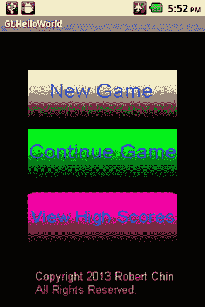
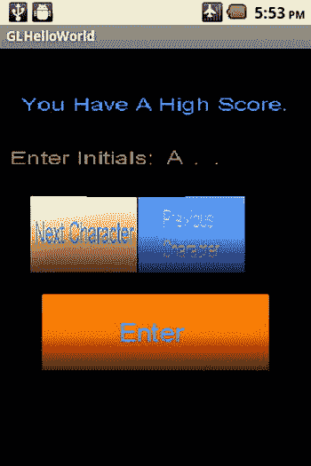
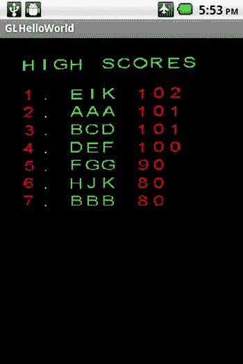

# 九、无人机网格案例研究：用户界面

Abstract

本章将介绍我们的无人机网格案例研究游戏的用户界面。首先是主菜单系统，它允许玩家在新游戏、继续旧游戏或查看高分表之间进行选择。接下来，将介绍高分表的创建，包括用于实现它的类。然后与用来实现该菜单系统的类讨论高分入口菜单。最后，给出了一个实际例子来演示这些用户界面。

本章将介绍我们的无人机网格案例研究游戏的用户界面。首先是主菜单系统，它允许玩家在新游戏、继续旧游戏或查看高分表之间进行选择。接下来，将介绍高分表的创建，包括用于实现它的类。然后与用来实现该菜单系统的类讨论高分入口菜单。最后，给出了一个实际例子来演示这些用户界面。

## 创建主菜单系统

我们游戏的菜单系统将由一个 main menu 类表示的主菜单组成。主菜单中的每一项都由一个 MenuItem 类表示。

### MenuItem 类

MenuItem 类包含一个菜单项，该菜单项也包含实际的 3D 图形。

MenuItem 类派生自 BillBoard 类。

`public class MenuItem extends BillBoard`

MenuItem 构造函数调用其父 BillBoard 类的构造函数。(参见清单 9-1。)

清单 9-1。MenuItem 构造函数

`MenuItem(Context iContext, Mesh iMesh, MeshEx iMeshEx, Texture[] iTextures, Material iMaterial, Shader iShader)`

`{`

`super(iContext, iMesh, iMeshEx, iTextures, iMaterial, iShader);`

`}`

`GetObject3dWindowCoords()`函数获取菜单项对象上一个点的窗口坐标，该点可以偏移`ObjOffset`并显示在由`ViewPortWidth`和`ViewPortHeight`输入参数定义的视窗内。(参见清单 9-2。)

清单 9-2。获取 MenuItem 对象的窗口坐标

`float[] GetObject3dWindowCoords(int ViewPortWidth,int ViewPortHeight,Vector3 ObjOffset)`

`{`

`float[] WindowCoords;`

`int[] View = new int[4];`

`View[0] = 0;`

`View[1] = 0;`

`View[2] = ViewPortWidth;`

`View[3] = ViewPortHeight;`

`WindowCoords = MapObjectCoordsToWindowCoords(View, 0, ObjOffset);`

`// Flip Y starting point so that 0 is at top of window`

`WindowCoords[1] = ViewPortHeight - WindowCoords[1];`

`return WindowCoords;`

`}`

该函数执行以下操作:

Creates the `View` variable, which is a viewport window defined by the coordinates (0,0) and (`ViewPortWidth, ViewPortHeight`)   Gets the window coordinates of the menu item object at `ObjOffset` offset position by calling the `MapObjectCoordsToWindowCoords()` function   Converts the y component of the window coordinates to screen space from OpenGL space   Returns the window coordinates  

如果输入屏幕触摸坐标`TouchX`和`TouchY`映射到该菜单项内，则`Touched()`功能返回 true。(参见清单 9-3。)

清单 9-3。测试用户的触摸输入

`boolean Touched(float TouchX, float TouchY,int ViewPortWidth,int ViewPortHeight)`

`{`

`boolean result = false;`

`float Radius = GetRadius();`

`Vector3 ObjCoordsUpperLeft  = new Vector3(-Radius,  Radius, 0);`

`Vector3 ObjCoordsUpperRight = new Vector3( Radius,  Radius, 0);`

`Vector3 ObjCoordsLowerLeft  = new Vector3(-Radius, -Radius, 0);`

`float[] UpperLeft  = GetObject3dWindowCoords(ViewPortWidth, ViewPortHeight, ObjCoordsUpperLeft);`

`float[] UpperRight = GetObject3dWindowCoords(ViewPortWidth, ViewPortHeight, ObjCoordsUpperRight);`

`float[] LowerLeft  = GetObject3dWindowCoords(ViewPortWidth, ViewPortHeight, ObjCoordsLowerLeft);`

`if ((TouchX >= UpperLeft[0]) && (TouchX <= UpperRight[0]) &&`

`(TouchY >= UpperLeft[1]) && (TouchY <= LowerLeft[1]))`

`{`

`result = true;`

`}`

`return result;`

`}`

以下是`Touched()`功能的属性:

For our menu items, we will use a Cube class object that has equal lengths on all sides. We get the radius of this cube by calling the `GetRadius()` function and store it in the `Radius` variable.   Using the Radius value, we create the object’s upper left, upper right, and lower left object coordinates. We store these values in the variables `ObjCoordsUpperLeft`, `ObjCoordsUpperRight`, and `ObjCoordsLowerLeft`.   The function retrieves the window coordinates of the upper left, upper right, and lower left corners of the menu item object by calling `GetObject3dWindowCoords()` using the object’s upper left, upper right, and lower left object coordinates created in step 2.   The function tests to see if the screen coordinates (`TouchX, TouchY`) are within the bounds of the screen coordinates of the menu item. If they are, then return true; otherwise, return false.  

### MainMenu 类

MainMenu 类表示我们的无人机网格案例研究游戏的实际主菜单界面。

`MenuStates`枚举代表主菜单的可用菜单选项(见清单 9-4 ),例如

*   无:这意味着没有选择菜单项
*   新游戏:这意味着玩家想要开始玩一个全新的游戏
*   ContinueCurrentGame:这意味着玩家想继续上次保存的游戏
*   HighScoreTable:这意味着玩家想要查看高分表
*   版权:用于调试模式，帮助测试高分录入系统

清单 9-4。菜单显示

`enum MenuStates`

`{`

`None,`

`NewGame,`

`ContinueCurrentGame,`

`HighScoreTable,`

`Copyright`

`}`

如果用户想开始一个新游戏，变量`m_NewGameItem`保存一个菜单项的引用。

`MenuItem m_NewGameItem;`

`m_ContinueGameItem`变量保存了一个菜单项的引用，如果用户想继续上次保存的游戏，他或她可以触摸这个菜单项。

`MenuItem m_ContinueGameItem;`

`m_HighScoresItem`变量保存了一个菜单项的引用，如果用户想要查看高分表，可以触摸该菜单项。

`MenuItem m_HighScoresItem;`

`m_CopyRightItem`变量保存一个菜单项的引用，该菜单项用于调试高分输入系统。

`MenuItem m_CopyRightItem;`

MainMenu 构造函数通过向主菜单中的每个菜单项分配对象来初始化 MainMenu 类。(参见清单 9-5。)

清单 9-5。MainMenu 构造函数

`MainMenu(MenuItem NewGameItem,MenuItem ContinueGameItem,MenuItem HighScoresItem,MenuItem CopyRightItem)`

`{`

`m_NewGameItem      = NewGameItem;`

`m_ContinueGameItem = ContinueGameItem;`

`m_HighScoresItem   = HighScoresItem;`

`m_CopyRightItem    = CopyRightItem;`

`}`

`GetMainMenuStatus()`功能测试主菜单项，查看是否有任何菜单项在屏幕位置被触摸(`TouchX`、`TouchY`)。通过调用按钮上的`Touched()`功能，对每个菜单项按钮进行测试，以查看其是否被触摸。返回被触摸的按钮类型，或者如果没有触摸菜单按钮，则返回 None。(参见清单 9-6。)

清单 9-6。获取主菜单状态

`MenuStates GetMainMenuStatus(float TouchX, float TouchY,int ViewPortWidth,int ViewPortHeight)`

`{`

`MenuStates Selection = MenuStates.None;`

`boolean Touched = false;`

`// New Game Menu Item`

`Touched = m_NewGameItem.Touched(TouchX, TouchY, ViewPortWidth, ViewPortHeight);`

`if (Touched)`

`{`

`Selection = MenuStates.NewGame;`

`}`

`// New ContinueGame Menu Item`

`Touched =  m_ContinueGameItem.Touched(TouchX, TouchY, ViewPortWidth, ViewPortHeight);`

`if (Touched)`

`{`

`Selection = MenuStates.ContinueCurrentGame;`

`}`

`// New HighScoreTable Menu Item`

`Touched =  m_HighScoresItem.Touched(TouchX, TouchY, ViewPortWidth, ViewPortHeight);`

`if (Touched)`

`{`

`Selection = MenuStates.HighScoreTable;`

`}`

`// CopyRight Menu Item`

`Touched =  m_CopyRightItem.Touched(TouchX, TouchY, ViewPortWidth, ViewPortHeight);`

`if (Touched)`

`{`

`Selection = MenuStates.Copyright;`

`}`

`return Selection;`

`}`

`RenderMenu()`功能将主菜单项绘制到屏幕上。(参见清单 9-7。)

清单 9-7。呈现主菜单

`void RenderMenu(Camera Cam, PointLight Light, boolean DebugOn)`

`{`

`m_NewGameItem.DrawObject(Cam, Light);`

`m_ContinueGameItem.DrawObject(Cam, Light);`

`m_HighScoresItem.DrawObject(Cam, Light);`

`m_CopyRightItem.DrawObject(Cam, Light);`

`}`

`UpdateMenu()`功能更新每个主菜单项，并通过调用`UpdateObject3d()`功能将每个菜单项(广告牌)转向摄像机。所有主菜单项，包括新游戏按钮、继续游戏按钮、显示高分按钮和版权图形，都在这里处理。(参见清单 9-8。)

清单 9-8。更新主菜单

`void UpdateMenu(Camera Cam)`

`{`

`m_NewGameItem.UpdateObject3d(Cam);`

`m_ContinueGameItem.UpdateObject3d(Cam);`

`m_HighScoresItem.UpdateObject3d(Cam);`

`m_CopyRightItem.UpdateObject3d(Cam);`

`}`

## 创建高分表

保存玩家在游戏中最高分数的高分表由两个类组成:HighScoreEntry 类和 high score table 类。

### HighScoreEntry 类

HighScoreEntry 类保存高分条目的数据。这个类实现了 Comparable 公共接口，并定义了一个函数，允许对高分条目进行比较和排序。

`public class HighScoreEntry implements Comparable<HighScoreEntry>`

如果该高分条目有效，则`m_ItemValid`变量设置为真，并应显示在高分表中。

`private boolean m_ItemValid;`

`m_Initials`变量保存玩家的姓名首字母。

`private String  m_Initials;`

`m_Score`变量保存玩家的分数。

`private int     m_Score;`

HighScoreEntry 构造函数通过设置首字母和分数来初始化条目。(参见清单 9-9。)

清单 9-9。HighScoreEntry 构造函数

`HighScoreEntry(String Initials,int Score)`

`{`

`m_Initials = Initials;`

`m_Score    = Score;`

`}`

`compareTo()`函数与`Collections.sort()`函数结合使用，以降序排列高分表格条目，高分排在第一位(见清单 9-10)。通常情况下，`compareTo()`函数按升序对条目进行排序。因为我们是按降序排序，所以需要做一些关键的更改。

*   如果该条目实例中的分数大于输入参数变量`Another`的分数，则该函数返回一个负整数。
*   如果该条目实例中的分数小于输入参数变量`Another`的分数，则该函数返回一个正整数。

清单 9-10。比较和排序条目

`public int compareTo(HighScoreEntry Another)`

`{`

`/*`

`Normally ascending sorting - Returns`

`a negative integer if this instance is less than another; a positive integer if this`

`instance is greater than another; 0 if this instance has the same order as another.`

`*/`

`int result = 0;`

`if (m_Score > Another.m_Score)`

`{`

`result = -1;`

`}`

`else`

`if (m_Score < Another.m_Score)`

`{`

`result = 1;`

`}`

`return result;`

`}`

### HighScoreTable 类

HighScoreTable 类表示包含所有玩家高分条目的高分表。

`HIGH_SCORES`字符串变量保存加载和保存高分表的句柄。

`private String HIGH_SCORES = "HighScores";`

`MAX_RANK`变量保存要显示的高分的最大数量。

`private int MAX_RANK = 10;`

`MAX_SCORES`变量保存内部存储的用于处理和计算的最大分数。

`private int MAX_SCORES = 11;`

`m_HighScoreTable`数组保存实际的高分条目。

`private HighScoreEntry[] m_HighScoreTable = new HighScoreEntry[MAX_SCORES];`

`m_Text`变量保存将用于打印高分表格图形文本的字符集。

`private BillBoardCharacterSet m_Text;`

`m_FontWidth`变量保存用于打印高分表格文本的字符集中每个字符的宽度。

`private int m_FontWidth;`

`m_FontHeight`变量保存用于打印高分表文本的字符集中每个字符的高度。

`private int m_FontHeight;`

`m_BackGroundTexture`变量保存用于清除高分表纹理的纹理。

`private Texture m_BackGroundTexture;`

`m_HighScoreTableImage`变量保存一个对 BillBoard 对象的引用，该对象包含带有玩家高分的纹理。

`private BillBoard m_HighScoreTableImage;`

如果自从上次更新以来高分表已经被改变，则`m_Dirty`变量为真，否则为假。

`private boolean m_Dirty = false;`

`HighScoreTable()`构造函数(见清单 9-11)通过以下方式创建一个新的高分表

Creating a new background texture for the high score table   Initializing the high score table by creating blank high score entries in the `m_HighScoreTable` array   Initializing other class member variables   Loading in the player’s previously saved high scores, if any  

清单 9-11。HighScoreTable 构造函数

`HighScoreTable(Context iContext,BillBoardCharacterSet CharacterSet,BillBoard HighScoreTableImage)`

`{`

`m_Context = iContext;`

`m_BackGroundTexture = new Texture(iContext, R.drawable.background);`

`String  Initials        = "AAA";`

`int     Score   = 0;`

`// Initialize High Score Entries`

`for (int i = 0; i < MAX_SCORES; i++)`

`{`

`m_HighScoreTable[i] = new HighScoreEntry(Initials,Score);`

`m_HighScoreTable[i].SetItemValidState(false);`

`}`

`m_Text = CharacterSet;`

`m_FontWidth = m_Text.GetFontWidth();`

`m_FontHeight = m_Text.GetFontHeight();`

`m_HighScoreTableImage = HighScoreTableImage;`

`// Load In Saved high Scores`

`LoadHighScoreTable(HIGH_SCORES);`

`m_Dirty = true;`

`}`

`SaveHighScoreTable()`功能保存由玩家姓名首字母和玩家分数组成的玩家前`MAX_RANK`号高分条目。(参见清单 9-12。)

清单 9-12。保存高分表

`void SaveHighScoreTable(String Handle)`

`{`

`// We need an Editor object to make preference changes.`

`// All objects are from android.context.Context`

`SharedPreferences settings = m_Context.getSharedPreferences(Handle, 0);`

`SharedPreferences.Editor editor = settings.edit();`

`for (int i = 0; i < MAX_RANK; i++)`

`{`

`editor.putString("Name" + i, m_HighScoreTable[i].GetInitials());`

`editor.putInt("Score" + i, m_HighScoreTable[i].GetScore());`

`}`

`// Commit the edits!`

`editor.commit();`

`}`

`LoadHighScoreTable()`函数加载玩家的高分数据，包括玩家的名字或首字母以及玩家的分数。如果玩家的分数大于 0，则条目有效。(参见清单 9-13。)

清单 9-13。加载高分表

`void LoadHighScoreTable(String Handle)`

`{`

`// Restore preferences`

`SharedPreferences settings = m_Context.getSharedPreferences(Handle, 0);`

`for (int i = 0; i < MAX_RANK; i++)`

`{`

`String Name = settings.getString("Name" + i, "...");`

`int Score = settings.getInt("Score" + i, 0);`

`m_HighScoreTable[i].SetName(Name);`

`m_HighScoreTable[i].SetScore(Score);`

`if (Score > 0)`

`{`

`m_HighScoreTable[i].SetItemValidState(true);`

`}`

`}`

`}`

`NumberValidHighScores()`函数查找高分表中有效高分条目的数量。(参见清单 9-14。)

清单 9-14。寻找有效高分的数量

`int NumberValidHighScores()`

`{`

`int NumberValidScores = 0;`

`for (int i = 0; i < MAX_RANK; i++)`

`{`

`if (m_HighScoreTable[i].IsValid())`

`{`

`NumberValidScores++;`

`}`

`}`

`return NumberValidScores;`

`}`

`GetLowestScore()`功能从高分表`m_HighScoreTable`中检索最低有效玩家分数。(参见清单 9-15。)

清单 9-15。得到最低分

`int GetLowestScore()`

`{`

`// Get Lowest valid score`

`int LowestScore = 0;`

`int ValidScores = 0;`

`for (int i = 0; i < MAX_RANK; i++)`

`{`

`if (m_HighScoreTable[i].IsValid())`

`{`

`ValidScores++;`

`}`

`}`

`if (ValidScores > 0)`

`{`

`LowestScore = m_HighScoreTable[ValidScores-1].GetScore();`

`}`

`return LowestScore;`

`}`

`FindEmptySlot()`函数检索`m_HighScoreTable`中的空(意味着无效)高分入口槽的索引。(参见清单 9-16。)

清单 9-16。为高分条目寻找空位置

`int FindEmptySlot()`

`{`

`int EmptySlot = -1;`

`for (int i = 0; i < MAX_SCORES; i++)`

`{`

`if (m_HighScoreTable[i].IsValid() == false)`

`{`

`return i;`

`}`

`}`

`return EmptySlot;`

`}`

如果找到一个空位置，函数`AddItem()`将一个高分条目添加到高分表格中的一个空位置。更具体地说，如果有一个空槽，则将高分条目分配给`m_HighScoreTable`数组中的那个槽，将条目的有效状态设置为真，并将`m_Dirty`值设置为真，以指示需要对高分表进行排序和呈现。(参见清单 9-17。)

清单 9-17。向高分表添加项目

`boolean AddItem(HighScoreEntry Item)`

`{`

`boolean result = false;`

`int EmptySlot =  FindEmptySlot();`

`if (EmptySlot >= 0)`

`{`

`m_HighScoreTable[EmptySlot] = Item;`

`m_HighScoreTable[EmptySlot].SetItemValidState(true);`

`result = true;`

`m_Dirty = true;`

`}`

`return result;`

`}`

`SortHighScoreTable()`函数按降序对高分表进行排序。按照降序对前 10 个条目进行排序后，该函数获取第 11 个高分条目，并将状态设置为无效，这样，如果需要，可以将高分表中的新条目放在最后。(参见清单 9-18。)

清单 9-18。对高分表进行排序

`void SortHighScoreTable()`

`{`

`Collections.sort(Arrays.asList(m_HighScoreTable));`

`// Only keep top 10 and make room for another to be added to end of array`

`m_HighScoreTable[MAX_SCORES-1].SetItemValidState(false);`

`}`

`ClearHighScoreTable()`功能通过使用`CopySubTextureToTexture()`功能将空白纹理`m_BackGroundTexture`复制到高分表格纹理图像上来清除`m_HighScoreTableImage`中保存的高分表格纹理图像。(参见清单 9-19。)

清单 9-19。清除高分表

`void ClearHighScoreTable()`

`{`

`Texture HighScoreTableTexture = m_HighScoreTableImage.GetTexture(0);`

`// Clear Composite Texture;`

`Bitmap BackGroundBitmap = m_BackGroundTexture.GetTextureBitMap();`

`HighScoreTableTexture.CopySubTextureToTexture(0, 0, 0, BackGroundBitmap);`

`}`

`RenderTitle()`函数将文本“High Scores”呈现给`m_HighScoreTableImage`，后者是为高分表保存最终合成纹理的广告牌。(参见清单 9-20。)

清单 9-20。渲染高分表的标题

`void RenderTitle()`

`{`

`m_Text.SetText("High".toCharArray());`

`m_Text.RenderToBillBoard(m_HighScoreTableImage, 0, 0);`

`m_Text.SetText("Scores".toCharArray());`

`m_Text.RenderToBillBoard(m_HighScoreTableImage, 5*m_FontWidth, 0);`

`}`

`CopyHighScoreEntryToHighScoreTable()`功能将高分条目复制到用于显示最终玩家高分的最终合成`m_HighScoreTableImage`高分广告牌。(参见清单 9-21。)

清单 9-21。将高分条目复制到最终的合成广告牌纹理对象

`void CopyHighScoreEntryToHighScoreTable(int Rank, Camera Cam, HighScoreEntry Item)`

`{`

`// Put HighScore Entry onto Final Composite Bitmap`

`// CharacterPosition`

`int HeightOffset = 10;`

`int CharPosX = 0;`

`int CharPosY = m_FontHeight + (Rank * (m_FontHeight + HeightOffset));`

`// Render Rank`

`String RankStr = Rank + ".";`

`m_Text.SetText(RankStr.toCharArray());`

`m_Text.RenderToBillBoard(m_HighScoreTableImage, CharPosX, CharPosY);`

`// Render Player Name/Initials and render to composite billboard`

`String Name = Item.GetInitials();`

`m_Text.SetText(Name.toCharArray());`

`CharPosX = CharPosX + m_FontWidth * 3;`

`m_Text.RenderToBillBoard(m_HighScoreTableImage, CharPosX, CharPosY);`

`// Render Numerical Value and render to composite billboard`

`String Score = String.valueOf(Item.GetScore());`

`m_Text.SetText(Score.toCharArray());`

`int BlankSpace = 4 * m_FontWidth;`

`CharPosX = CharPosX + Name.length() + BlankSpace;`

`m_Text.RenderToBillBoard(m_HighScoreTableImage, CharPosX, CharPosY);`

`}`

该函数执行以下操作:

Calculates the beginning x,y position for the high score entry, based on the height of the character font to be used, the rank of the score (1st, 2nd, 3rd, etc.), and the `HeightOffset` variable   Renders the high score entry’s rank to the `m_HighScoreTableImage` billboard   Renders the high score entry’s player’s initials to the `m_HighScoreTableImage` billboard   Renders the high score entry’s player’s score to the `m_HighScoreTableImage` billboard  

`UpdateHighScoreTable()`函数更新高分表。(参见清单 9-22。)

清单 9-22。更新高分表

`void UpdateHighScoreTable(Camera Cam)`

`{`

`if (m_Dirty)`

`{`

`// Sort High Score Table in descending order for score`

`SortHighScoreTable();`

`// Clear High Score Table and set background texture`

`ClearHighScoreTable();`

`// Render Title`

`RenderTitle();`

`// For the Top Ranked entries copy these to the HighScore Table BillBoard`

`for (int i = 0; i < MAX_RANK; i++)`

`{`

`if (m_HighScoreTable[i].IsValid())`

`{`

`CopyHighScoreEntryToHighScoreTable(i+1, Cam, m_HighScoreTable[i]);`

`}`

`}`

`// Save High Scores`

`SaveHighScoreTable(HIGH_SCORES);`

`m_Dirty = false;`

`}`

`// Update BillBoard orientation for Score`

`m_HighScoreTableImage.UpdateObject3d(Cam);`

`}`

该函数执行以下操作:

If `m_Dirty` is true, it adds a new high score entry and processes and renders it to the high score table billboard.   If `m_Dirty` is true, it   Sorts the high score table in descending order, with the highest score listed first, by calling the `SortHighScoreTable()` function   Clears the high score table by calling the `ClearHighScoreTable()` function   Renders the high score table’s heading by calling the `RenderTitle()` function   Renders the top 10 high scores to the high score table by calling the `CopyHighScoreEntryToHighScoreTable()` function   Saves the high score table by calling the `SaveHighScoreTable()` function   Sets `m_Dirty` to false to indicate that the high score table has been updated   Updates the high score table billboard by calling the `UpdateObject3d()` function to turn the billboard toward the camera  

`RenderHighScoreTable()`函数将高分表广告牌和包含玩家高分的纹理绘制到屏幕上。(参见清单 9-23。)

清单 9-23。渲染高分表

`void RenderHighScoreTable(Camera Cam, PointLight Light, boolean DebugOn)`

`{`

`// Render Final High Score Table Composite Image`

`m_HighScoreTableImage.DrawObject(Cam, Light);`

`}`

## 创建高分进入系统

HighScoreEntryMenu 类控制输入玩家高分的菜单。

`EntryMenuStates`枚举保存了被点击的菜单按钮的类型(见清单 9-24)，包括

*   无:没有点击按钮。
*   NextCharacterPressed:按下下一个字符按钮，将选择中的字符更改为用户选择的字符集中的下一个字符。
*   PreviousCharacterPressed:按下 previous character 按钮，将选择中的字符更改为用户选择的字符集中的前一个字符。
*   输入:输入当前显示的字符作为该位置的字符。

清单 9-24。高分条目菜单按钮

`enum EntryMenuStates`

`{`

`None,`

`NextCharacterPressed,`

`PreviousCharacterPressed,`

`Enter`

`}`

`MAX_ENTRY_CHARACTERS`变量包含输入玩家名字或首字母的最大字符数。

`private int MAX_ENTRY_CHARACTERS = 3;`

`m_EntryIndex`变量保存玩家名字/初始选择输入中的当前角色位置。例如，0 表示玩家正在选择要输入的首字母。

`private int m_EntryIndex = 0;`

`m_Entry`变量保存玩家的名字/首字母。

`private char[] m_Entry = new char[MAX_ENTRY_CHARACTERS];`

`m_NextCharacterButton`按钮在可用于输入玩家姓名/首字母的字符集中向前循环。

`private MenuItem m_NextCharacterButton;`

`m_PreviousCharacterButton`按钮在可用于输入玩家姓名/首字母的字符集中向后循环。

`private MenuItem m_PreviousCharacterButton;`

按下`m_EnterButton`按钮，选择当前玩家姓名/初始进入位置的角色。

`private MenuItem m_EnterButton;`

`m_Text`变量保存将用于玩家名字/首字母的字符集。

`private BillBoardCharacterSet m_Text;`

`m_NumberCharactersInSet`变量保存了`m_Text`字符集中的字符数。

`private int m_NumberCharactersInSet = 0;`

`m_CharacterSetIndex`变量用于跟踪用户选择输入其姓名/首字母的当前字符。

`private int m_CharacterSetIndex = 0;`

`m_FontWidth`是字符集`m_Text`中使用的字符字体的宽度。

`private int m_FontWidth;`

`m_FontHeight`是字符集`m_Text`中使用的字符字体的高度。

`private int m_FontHeight;`

`m_HighScoreEntryMenuImage`变量保存高分入口菜单的广告牌。

`private BillBoard m_HighScoreEntryMenuImage;`

如果`m_HighScoreEntryMenuImage`必须更新，则`m_Dirty variable`为真。

`private boolean m_Dirty = true;`

`m_StartingEntryPositionX`变量保存玩家姓名/首字母输入字段的起始 x 位置。

`private int m_StartingEntryPositionX;`

`m_StartingEntryPositionY`变量保存玩家姓名/首字母输入字段的起始 y 位置。

`private int m_StartingEntryPositionY;`

`m_CurrentEntryPositionX`变量保存玩家名字/首字母输入位置的当前 x 位置。

`private int m_CurrentEntryPositionX;`

`m_CurrentEntryPositionY`变量保存玩家名字/首字母输入位置的当前 y 位置。

`private int m_CurrentEntryPositionY;`

如果用户已经完成输入他或她的名字/首字母，变量`m_EntryFinished`为真。

`private boolean m_EntryFinished = false;`

HighScoreEntryMenu 构造函数初始化并重置高分入口菜单以供使用。(参见清单 9-25。)

清单 9-25。HighScoreEntryMenu 构造函数

`HighScoreEntryMenu(MenuItem NextCharacterButton,MenuItem PreviousCharacterButton,MenuItem EnterButton,BillBoardCharacterSet Text,BillBoard HighScoreEntryMenuImage,int StartingEntryXPos,int StartingEntryYPos)`

`{`

`m_NextCharacterButton = NextCharacterButton;`

`m_PreviousCharacterButton = PreviousCharacterButton;`

`m_EnterButton = EnterButton;`

`m_Text = Text;`

`m_HighScoreEntryMenuImage = HighScoreEntryMenuImage;`

`m_FontWidth = m_Text.GetFontWidth();`

`m_FontHeight = m_Text.GetFontHeight();`

`m_NumberCharactersInSet = m_Text.GetNumberCharactersInSet();`

`m_CurrentEntryPositionX = StartingEntryXPos;`

`m_CurrentEntryPositionY = StartingEntryYPos;`

`m_StartingEntryPositionX = StartingEntryXPos;`

`m_StartingEntryPositionY = StartingEntryYPos;`

`ResetMenu();`

`}`

`ResetMenu()`功能将菜单重置为初始状态，用户可以从首字母开始输入他或她的首字母。默认首字母被重置为`"..."`。(参见清单 9-26。)

清单 9-26。重置高分入口菜单

`void ResetMenu()`

`{`

`m_CharacterSetIndex = 10;`

`m_EntryIndex = 0;`

`m_CurrentEntryPositionX = m_StartingEntryPositionX;`

`m_CurrentEntryPositionY = m_StartingEntryPositionY;`

`m_Text.SetText("...".toCharArray());`

`m_Text.RenderToBillBoard(m_HighScoreEntryMenuImage, m_CurrentEntryPositionX, m_CurrentEntryPositionY);`

`m_EntryFinished = false;`

`FindCurrentCharacter()`函数查找匹配用户当前初始输入选择的字符并返回它。(参见清单 9-27。)

清单 9-27。查找当前选定的首字母

`char FindCurrentCharacter()`

`{`

`BillBoardFont Font = m_Text.GetCharacter(m_CharacterSetIndex);`

`return Font.GetCharacter();`

`}`

`ProcessEnterMenuSelection()`功能输入当前选择的首字母作为当前玩家姓名/初始位置的条目，并将入口点增加到下一个初始入口位置。`m_Dirty`变量也被设置为 true，表示需要更新菜单的广告牌。(参见清单 9-28。)

清单 9-28。处理菜单选择

`void ProcessEnterMenuSelection()`

`{`

`char EnteredChar = FindCurrentCharacter();`

`m_Entry[m_EntryIndex] = EnteredChar;`

`m_EntryIndex++;`

`if (m_EntryIndex >= MAX_ENTRY_CHARACTERS)`

`{`

`m_EntryFinished = true;`

`}`

`m_CurrentEntryPositionX = m_CurrentEntryPositionX + m_FontWidth;`

`m_Dirty = true;`

`}`

`ProcessPreviousMenuSelection()`功能通过减少用于从`m_Text`中保存的字符集中检索当前字符选择的索引来处理前一个字符菜单按钮。如果索引小于 0，它会绕回指向字符集中的最后一个字符。`m_Dirty`变量也被设置为真。(参见清单 9-29。)

清单 9-29。处理前一个字符菜单选择按钮

`void ProcessPreviousMenuSelection()`

`{`

`// Go to next character`

`m_CharacterSetIndex--;`

`if (m_CharacterSetIndex < 0)`

`{`

`m_CharacterSetIndex = m_NumberCharactersInSet-1;`

`}`

`m_Dirty = true;`

`}`

`ProcessNextMenuSelection()`功能通过增加索引来处理下一个字符菜单按钮，该索引用于从`m_Text`中保存的字符集中检索当前字符选择。如果索引大于数组中的最后一个元素，它会绕回指向字符集中的第一个字符。`m_Dirty`变量也被设置为真。(参见清单 9-30。)

清单 9-30。处理下一个菜单选择按钮

`void ProcessNextMenuSelection()`

`{`

`// Go to next character`

`m_CharacterSetIndex++;`

`if (m_CharacterSetIndex >= m_NumberCharactersInSet)`

`{`

`m_CharacterSetIndex = 0;`

`}`

`m_Dirty = true;`

`}`

`RenderTextToMenu()`功能将输入字符`Character`渲染到高分入口菜单的屏幕位置`XPos, YPos`，即广告牌`m_HighScoreEntryMenuImage`。(参见清单 9-31。)

清单 9-31。将文本呈现到输入菜单

`void RenderTextToMenu(String Character, int XPos, int YPos)`

`{`

`m_Text.SetText(Character.toCharArray());`

`m_Text.RenderToBillBoard(m_HighScoreEntryMenuImage, XPos, YPos);`

`}`

`RenderEntryToMenu()`功能将当前选择的玩家姓名首字母字符呈现到输入菜单中。(参见清单 9-32。)

清单 9-32。呈现当前条目选择

`void RenderEntryToMenu()`

`{`

`char CurrentCharacter = FindCurrentCharacter();`

`String StringCharacter = CurrentCharacter + "";`

`RenderTextToMenu(StringCharacter, m_CurrentEntryPositionX, m_CurrentEntryPositionY);`

`}`

`GetEntryMenuStatus()`功能测试输入屏幕坐标`TouchX`和`TouchY`以确定用户是否按下了高分输入菜单按钮。如果他或她有，则返回按钮类型。(参见清单 9-33。)

清单 9-33。获取入口菜单状态

`EntryMenuStates GetEntryMenuStatus(float TouchX, float TouchY,int ViewPortWidth,int ViewPortHeight)`

`{`

`EntryMenuStates Selection = EntryMenuStates.None;`

`boolean Touched = false;`

`// Next character Menu Item`

`Touched = m_NextCharacterButton.Touched(TouchX, TouchY, ViewPortWidth, ViewPortHeight);`

`if (Touched)`

`{`

`Selection = EntryMenuStates.NextCharacterPressed;`

`}`

`// Previous character Menu Item`

`Touched =  m_PreviousCharacterButton.Touched(TouchX, TouchY, ViewPortWidth, ViewPortHeight);`

`if (Touched)`

`{`

`Selection = EntryMenuStates.PreviousCharacterPressed;`

`}`

`// Enter Menu Item`

`Touched =  m_EnterButton.Touched(TouchX, TouchY, ViewPortWidth, ViewPortHeight);`

`if (Touched)`

`{`

`Selection = EntryMenuStates.Enter;`

`}`

`return Selection;`

`}`

`UpdateHighScoreEntryMenu()`功能更新组成高分输入菜单的所有组件，包括用户选择的输入字符、下一个字符按钮、上一个字符按钮、输入按钮和高分输入菜单广告牌。(参见清单 9-34。)

清单 9-34。更新高分条目菜单

`void UpdateHighScoreEntryMenu(Camera Cam)`

`{`

`//Update Menu Texture if changed`

`if (m_Dirty)`

`{`

`// If need to alter Menu texture then render new texture data`

`RenderEntryToMenu();`

`m_Dirty = false;`

`}`

`// Update Buttons`

`m_NextCharacterButton.UpdateObject3d(Cam);`

`m_PreviousCharacterButton.UpdateObject3d(Cam);`

`m_EnterButton.UpdateObject3d(Cam);`

`// Update Initial Entry Area`

`m_HighScoreEntryMenuImage.UpdateObject3d(Cam);`

`}`

`RenderHighScoreEntryMenu()`函数(见清单 9-35)按照以下顺序将高分入口菜单的所有组件呈现在屏幕上:

Renders the cycle to the Next Character button   Renders the cycle to the Previous Character button   Renders the Enter player initial selection button   Renders the `m_HighScoreEntryMenuImage` billboard, which contains the player’s input and the rest of the high score entry menu graphics data  

清单 9-35。呈现高分入口菜单

`void RenderHighScoreEntryMenu(Camera Cam, PointLight Light, boolean DebugOn)`

`{`

`// Render Buttons`

`m_NextCharacterButton.DrawObject(Cam, Light);`

`m_PreviousCharacterButton.DrawObject(Cam, Light);`

`m_EnterButton.DrawObject(Cam, Light);`

`// Render Billboard with Entry Menu info`

`m_HighScoreEntryMenuImage.DrawObject(Cam, Light);`

`}`

## 动手示例:演示用户界面

在这个动手示例中，我们将把用户界面与第八章中的动手示例挂钩。我们将构建一个工作主菜单，用户可以从中选择一个新的游戏或继续以前保存的游戏。对于高分表，我们将使用一个测试按钮来手动输入一些高分，然后在第十章中让这个功能在最终游戏中完全发挥作用。

### 修改 MyGLRenderer 类

必须修改 MyGLRenderer 类，以便集成主菜单、高分表和高分条目菜单。

`GameState`枚举(见清单 9-36)保存了游戏的一般状态，可以是下列之一:

*   主菜单:显示主菜单的状态
*   ActiveGamePlay:游戏处于活动状态
*   HighScoreTable:显示高分表格的状态
*   高分输入:玩家在获得高分后输入自己姓名首字母的状态

清单 9-36。游戏状态

`enum GameState`

`{`

`MainMenu,`

`ActiveGamePlay,`

`HighScoreTable,`

`HighScoreEntry`

`}`

`m_GameState`变量保存游戏的状态。

`private GameState m_GameState = GameState.MainMenu;`

`m_MainMenu`变量保存对实现主菜单的 MainMenu 类对象的引用。

`private MainMenu m_MainMenu;`

`m_HighScoreEntryMenu`变量包含对 HighScoreEntryMenu 类对象的引用，该类对象实现了高分入口菜单系统。

`private HighScoreEntryMenu m_HighScoreEntryMenu;`

`m_HighScoreTable`变量保存对实现高分表的类对象的引用。

`private HighScoreTable m_HighScoreTable;`

如果有一个先前保存的游戏，用户可以从那里继续，那么`m_CanContinue`变量为真。

`private boolean m_CanContinue = false;`

`CreateInitBillBoard()`函数根据输入纹理资源、对象位置和对象比例值创建并返回一个新的 BillBoard 对象。(参见清单 9-37。)

清单 9-37。创建广告牌对象

`BillBoard CreateInitBillBoard(Context iContext,int TextureResourceID,Vector3 Position,Vector3 Scale)`

`{`

`BillBoard NewBillBoard = null;`

`Texture BillBoardTexture = new Texture(iContext, TextureResourceID);`

`//Create Shader`

`Shader Shader = new Shader(iContext, R.raw.vsonelight, R.raw.fsonelight);      // ok`

`MeshEx Mesh = new MeshEx(8,0,3,5,Cube.CubeData, Cube.CubeDrawOrder);`

`// Create Material for this object`

`Material Material1 = new Material();`

`// Create Texture for BillBoard`

`Texture[] Tex = new Texture[1];`

`Tex[0] = BillBoardTexture;`

`// Create new BillBoard`

`NewBillBoard = new BillBoard(iContext, null, Mesh, Tex, Material1, Shader );`

`// Set Initial Position and Orientation`

`NewBillBoard.m_Orientation.SetPosition(Position);`

`NewBillBoard.m_Orientation.SetScale(Scale);`

`NewBillBoard.GetObjectPhysics().SetGravity(false);`

`return NewBillBoard;`

`}`

`CreateHighScoreTable()`函数创建分配给`m_HighScoreTable`变量的高分表。(参见清单 9-38。)

清单 9-38。创建高分表

`void CreateHighScoreTable(Context iContext)`

`{`

`int TextureResourceID = R.drawable.background;`

`Vector3 Position = new Vector3(0.5f, 1, 4);`

`Vector3 Scale = new Vector3(4.5f,5,1);`

`BillBoard HighScoreTableImage = CreateInitBillBoard(iContext,TextureResourceID,Position,Scale);`

`m_HighScoreTable = new HighScoreTable(iContext,m_CharacterSet,HighScoreTableImage);`

`}`

`CreateHighScoreEntryMenu()`功能创建高分输入菜单。(参见清单 9-39。)

清单 9-39。创建高分条目菜单

`void CreateHighScoreEntryMenu(Context iContext)`

`{`

`// Create High Score Entry Menu Billboard`

`int TextureResourceID = R.drawable.backgroundentrymenu;`

`Vector3 Position = new Vector3(0.0f, 1, 4);`

`Vector3 Scale = new Vector3(4.5f,5,1);`

`BillBoard HighScoreEntryMenuImage = CreateInitBillBoard(iContext,TextureResourceID,Position,Scale);`

`// Create Menu Buttons`

`Shader ObjectShader = new Shader(iContext, R.raw.vsonelight, R.raw.fsonelight);     // ok`

`MeshEx MenuItemMeshEx = new MeshEx(8,0,3,5,Cube.CubeData, Cube.CubeDrawOrder);`

`Mesh MenuItemMesh = null;`

`// Create Material for this object`

`Material Material1 = new Material();`

`Material1.SetEmissive(0.3f, 0.3f, 0.3f);`

`// Create Texture`

`int NumberTextures = 1;`

`Texture TexNextButton = new Texture(iContext,R.drawable.nextbutton);`

`Texture[] Tex = new Texture[NumberTextures];`

`Tex[0] = TexNextButton;`

`boolean AnimateTextures = false;`

`float TimeDelay = 0.0f;`

`Position = new Vector3(-1.0f, 1.3f, 4.25f);`

`Scale = new Vector3(1.4f,1.0f,1.0f);`

`// Next Character Button`

`MenuItem NextCharacterButton = CreateMenuItem(iContext, MenuItemMesh,MenuItemMeshEx, Material1,NumberTextures,Tex,AnimateTextures,TimeDelay,Position,Scale,ObjectShader );`

`// Previous Character Button`

`Position = new Vector3(0.5f, 1.3f, 4.25f);`

`Texture TexPreviousGameButton = new Texture(iContext,R.drawable.previousbutton);`

`Tex = new Texture[NumberTextures];`

`Tex[0] = TexPreviousGameButton;`

`MenuItem PreviousCharacterButton = CreateMenuItem(iContext, MenuItemMesh,MenuItemMeshEx, Material1, NumberTextures,Tex,AnimateTextures,TimeDelay,Position,Scale,ObjectShader);`

`// Enter Button`

`Position = new Vector3(0.0f, 0.0f, 4.25f);`

`Texture TexEnterButton = new Texture(iContext,R.drawable.enterbutton);`

`Tex = new Texture[NumberTextures];`

`Tex[0] = TexEnterButton;`

`Scale = new Vector3(3.0f,1.0f,1.0f);`

`MenuItem EnterButton = CreateMenuItem(iContext, MenuItemMesh, MenuItemMeshEx, Material1, NumberTextures, Tex, AnimateTextures, TimeDelay, Position, Scale, ObjectShader);`

`int StartingEntryXPos = 168;`

`int StartingEntryYPos = 100;`

`m_HighScoreEntryMenu = new HighScoreEntryMenu(NextCharacterButton, PreviousCharacterButton, EnterButton, m_CharacterSet, HighScoreEntryMenuImage, StartingEntryXPos, StartingEntryYPos);`

`}`

`CreateMenuItem()`函数创建一个新的 MenuItem 对象。(参见清单 9-40。)

清单 9-40。创建菜单项

`MenuItem CreateMenuItem(Context iContext, Mesh MenuItemMesh, eshEx MenuItemMeshEx, Material Material1, int NumberTextures, Texture[] Tex, boolean AnimateTextures, float TimeDelay, Vector3 Position, Vector3 Scale, Shader ObjectShader)`

`{`

`MenuItem NewMenuItem = null;`

`NewMenuItem = new MenuItem(iContext, MenuItemMesh, MenuItemMeshEx, Tex, Material1, ObjectShader);`

`NewMenuItem.SetAnimateTextures(AnimateTextures, TimeDelay, 0, NumberTextures-1);`

`NewMenuItem.m_Orientation.SetPosition(Position);`

`NewMenuItem.m_Orientation.SetScale(Scale);`

`NewMenuItem.GetObjectPhysics().SetGravity(false);`

`return NewMenuItem;`

`}`

`CreateMainMenu()`功能为我们的游戏创建主菜单。该功能还在主菜单中创建单独的菜单项，例如新游戏菜单项、继续游戏菜单项、显示高分表菜单项和版权菜单项。(参见清单 9-41。)

清单 9-41。创建主菜单

`void CreateMainMenu(Context iContext)`

`{`

`// Create New Game Button`

`Shader ObjectShader = new Shader(iContext, R.raw.vsonelight, R.raw.fsonelight);        // ok`

`MeshEx MenuItemMeshEx = new MeshEx(8,0,3,5,Cube.CubeData, Cube.CubeDrawOrder);`

`Mesh MenuItemMesh = null;`

`// Create Material for this object`

`Material Material1 = new Material();`

`// Create Texture`

`int NumberTextures = 1;`

`Texture TexNewGameButton = new Texture(iContext,R.drawable.newgamebutton);`

`Texture[] Tex = new Texture[NumberTextures];`

`Tex[0] = TexNewGameButton;`

`boolean AnimateTextures = false;`

`float TimeDelay = 0.0f;`

`Vector3 Position = new Vector3(0.0f, 2.5f, 4.25f);`

`Vector3 Scale = new Vector3(3.0f,1.0f,1.0f);`

`MenuItem NewGameMenuItem = CreateMenuItem(iContext, MenuItemMesh,MenuItemMeshEx, Material1, NumberTextures, Tex, AnimateTextures, TimeDelay, Position, Scale, ObjectShader);`

`// Continue Game`

`Position = new Vector3(0.0f, 1.3f, 4.25f);`

`Texture TexContinueGameButton = new Texture(iContext, R.drawable.continuegamebutton);`

`Tex = new Texture[NumberTextures];`

`Tex[0] = TexContinueGameButton;`

`MenuItem ContinueGameMenuItem = CreateMenuItem(iContext, MenuItemMesh, MenuItemMeshEx, Material1, NumberTextures, Tex, AnimateTextures, TimeDelay, Position, Scale, ObjectShader);`

`// View High Scores`

`Position = new Vector3(0.0f, 0.0f, 4.25f);`

`Texture TexHighScoresButton = new Texture(iContext, R.drawable.highscoresbutton);`

`Tex = new Texture[NumberTextures];`

`Tex[0] = TexHighScoresButton;`

`MenuItem HighScoreMenuItem = CreateMenuItem(iContext, MenuItemMesh, MenuItemMeshEx, Material1, NumberTextures, Tex, AnimateTextures, TimeDelay, Position, Scale, ObjectShader);`

`// CopyRight Notice`

`Position = new Vector3(0.0f, -1.3f, 4.25f);`

`Texture TexCopyrightButton = new Texture(iContext,R.drawable.copyright);`

`Tex = new Texture[NumberTextures];`

`Tex[0] = TexCopyrightButton;`

`Material Material2 = new Material();`

`Material2.SetEmissive(0.3f, 0.3f, 0.3f);`

`MenuItem CopyrightMenuItem = CreateMenuItem(iContext, MenuItemMesh, MenuItemMeshEx, Material2, NumberTextures, Tex, AnimateTextures, TimeDelay, Position, Scale, ObjectShader);`

`m_MainMenu = new MainMenu(NewGameMenuItem, ContinueGameMenuItem, HighScoreMenuItem, CopyrightMenuItem);`

`}`

必须修改`CheckTouch()`函数(见清单 9-42)。`CheckTouch()`函数在用户触摸屏幕时被调用，用于处理用户触摸。

清单 9-42。修改`CheckTouch()`功能

`if (m_GameState == GameState.MainMenu)`

`{`

`// Reset camera to face main menu`

`MenuStates result = m_MainMenu.GetMainMenuStatus(m_TouchX, m_TouchY, m_ViewPortWidth, m_ViewPortHeight);`

`if (result == MenuStates.NewGame)`

`{`

`ResetGame();`

`m_GameState = GameState.ActiveGamePlay;`

`}`

`else`

`if (result == MenuStates.ContinueCurrentGame)`

`{`

`LoadContinueStatus(MainActivity.SAVE_GAME_HANDLE);`

`if (m_CanContinue)`

`{`

`LoadGameState(MainActivity.SAVE_GAME_HANDLE);`

`}`

`else`

`{`

`ResetGame();`

`}`

`m_GameState = GameState.ActiveGamePlay;`

`}`

`else`

`if (result == MenuStates.HighScoreTable)`

`{`

`m_GameState = GameState.HighScoreTable;`

`}`

`else`

`if (result == MenuStates.Copyright)`

`{`

`m_GameState = GameState.HighScoreEntry;`

`}`

`return;`

`}`

`else`

`if (m_GameState == GameState.HighScoreTable)`

`{`

`m_GameState = GameState.MainMenu;`

`return;`

`}`

`else`

`if (m_GameState == GameState.HighScoreEntry)`

`{`

`// If User presses finished button from High Score Entry Menu`

`EntryMenuStates result = m_HighScoreEntryMenu.GetEntryMenuStatus(m_TouchX, m_TouchY, m_ViewPortWidth, m_ViewPortHeight);`

`if (result == EntryMenuStates.NextCharacterPressed)`

`{`

`m_HighScoreEntryMenu.ProcessNextMenuSelection();`

`}`

`else`

`if (result == EntryMenuStates.PreviousCharacterPressed)`

`{`

`m_HighScoreEntryMenu.ProcessPreviousMenuSelection();`

`}`

`else`

`if (result == EntryMenuStates.Enter)`

`{`

`m_HighScoreEntryMenu.ProcessEnterMenuSelection();`

`if (m_HighScoreEntryMenu.IsEntryFinished())`

`{`

`char[] Initials = m_HighScoreEntryMenu.GetEntry();`

`String StrInitials = new String(Initials);`

`CreateHighScoreEntry(StrInitials, m_Score);`

`m_GameState = GameState.HighScoreTable;`

`m_HighScoreEntryMenu.ResetMenu();`

`}`

`}`

`return;`

`}`

对于`CheckTouch()`功能的修改

If the main menu is being displayed, get the main menu’s status in terms of finding out what menu item has been pressed.   If the new game menu item has been pressed, reset the game and set the game state to ActiveGamePlay.   If the continue current game menu item has been pressed, load the `m_CanContinue` status. If the status is true, load the previously saved game; otherwise, reset the game. Set the game state to ActiveGamePlay.   If the high score table menu item has been selected, set the game state to HighScoreTable.   If the copyright menu item has been selected, set the game state to HighScoreEntry to activate the high score entry menu. This is a debug button that will be commented out in the final game. In this chapter, we use it to test the high score menu entry system.   If the high score table is being displayed, set the game state to the main menu.   If the high score entry menu is being displayed, process the menu item being clicked.   If the next character button was clicked, call `ProcessNextMenuSelection()`.   If the previous character button was clicked, call `ProcessPreviousMenuSelection()`.   If the enter button was clicked, call `ProcessEnterMenuSelection()` to process it. If the entry was complete, add the new high score to the high score table and set the game state to display the high score table.  

必须修改`onDrawFrame()`函数，根据`m_GameState`变量更新和呈现主菜单、高分表和高分入口菜单。(参见清单 9-43。)

清单 9-43。修改`onDrawFrame()`功能

`if (m_GameState == GameState.MainMenu)`

`{`

`m_MainMenu.UpdateMenu(m_Camera);`

`m_MainMenu.RenderMenu(m_Camera, m_PointLight, false);`

`return;`

`}`

`// High Score Table`

`if (m_GameState == GameState.HighScoreTable)`

`{`

`m_HighScoreTable.UpdateHighScoreTable(m_Camera);`

`m_HighScoreTable.RenderHighScoreTable(m_Camera, m_PointLight, false);`

`return;`

`}`

`// High Score Entry`

`if (m_GameState == GameState.HighScoreEntry)`

`{`

`m_HighScoreEntryMenu.UpdateHighScoreEntryMenu(m_Camera);`

`m_HighScoreEntryMenu.RenderHighScoreEntryMenu(m_Camera, m_PointLight, false);`

`return;`

`}`

现在，运行程序。您应该会看到下面的主菜单出现。(见图 9-1 。)

图 9-1。

The main menu

如果点击版权按钮，应该会弹出高分入口菜单。对于这个动手操作示例，尝试手动输入一些高分，条目包含不同的分值。例如，您可以在实际源代码中将分数(`m_Score`)设置为 93，然后保存文件，重新编译，运行程序，并在高分表中创建新条目。表格中的新条目应该是您分配给源代码中的`m_Score`值的分数。(见图 9-2 。)

`private int m_Score = 93;`

图 9-2。

Entering a new high score

输入一些首字母，当你完成时，你应该被带到高分台。(见图 9-3 。)

图 9-3。

The high score table

## 摘要

在这一章中，我介绍了案例研究游戏的用户界面。我首先讨论了主菜单，包括实现主菜单所需的 Android Java 类和代码。接下来，我介绍了高分表以及如何用代码实现它。然后，我看了一遍高分入口菜单。最后，我们在一个工作演示中实现了主菜单、高分表和高分入口菜单。