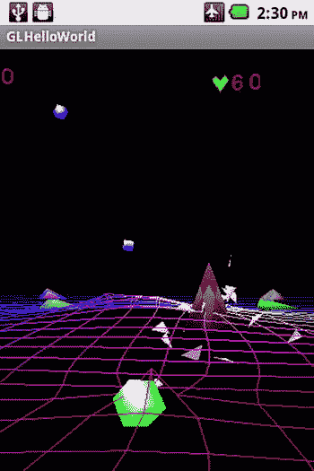

# 十、最终的无人机网格游戏

Abstract

这一章涵盖了最终的无人机网格游戏。我首先介绍了在游戏中帮助管理敌人物品所需的职业。然后讨论 GamePlayController 类，它控制诸如什么类型的敌人被添加到游戏场之类的元素。接下来，代码修改和保存和加载游戏状态的新功能将被涵盖。接下来讨论在无人机网格游戏中实现图形游戏和州代码游戏。最后，还包括一个实践示例，演示了本章前面讨论的概念和类。

这一章涵盖了最终的无人机网格游戏。我首先介绍了在游戏中帮助管理敌人物品所需的职业。然后讨论 GamePlayController 类，它控制诸如什么类型的敌人被添加到游戏场之类的元素。接下来，代码修改和保存和加载游戏状态的新功能将被涵盖。接下来讨论在无人机网格游戏中实现图形游戏和州代码游戏。最后，还包括一个实践示例，演示了本章前面讨论的概念和类。

## 组织和控制敌人团体

在我们的最终游戏中，我们将需要一些支持职业来让我们更容易的操作我们的敌人。我们需要的两个类是 ArenaObjectSet 类，它控制我们的竞技场敌人，和 TankFleet 类，它控制我们的坦克敌人。

### ArenaObjectSet 类

ArenaObjectSet 类包含一组 arena 对象，并具有管理这些对象的函数。

变量`MAX_ARENA_OBJECTS`保存了该集合将保存的竞技场对象的最大数量。

`private int MAX_ARENA_OBJECTS = 25;`

变量`m_NumberArenaObjects`保存集合中竞技场对象的实际数量。

`private int m_NumberArenaObjects = 0;`

变量数组保存了将在这个类中使用的一组 arena 对象。

`private ArenaObject3d[] m_ArenaObjectSet = new ArenaObject3d[MAX_ARENA_OBJECTS];`

如果`m_ArenaObjectSet`中相应的 arena 对象是活动的，并且必须被渲染和更新，则`m_Active`布尔数组对元素成立。

`private boolean[] m_Active = new boolean[MAX_ARENA_OBJECTS];`

`m_ExplosionMinVelocity`变量保存与这组竞技场对象相关的爆炸中粒子的最小速度。

`private float m_ExplosionMinVelocity = 0.02f;`

`m_ExplosionMaxVelocity`变量保存与这组竞技场对象相关的爆炸中粒子的最大速度。

`private float m_ExplosionMaxVelocity = 0.4f;`

`Init()`函数将该类中的所有 arena 对象初始化为 null，并且`m_Active`状态被设置为 false，这意味着它是不活动的，并且不被渲染、更新或处理。(参见清单 10-1。)

清单 10-1。初始化竞技场对象

`void Init()`

`{`

`for (int i = 0; i < MAX_ARENA_OBJECTS; i++)`

`{`

`m_ArenaObjectSet[i] = null;`

`m_Active[i] = false;`

`}`

`}`

ArenaObjectSet 构造函数通过调用`Init()`函数初始化 ArenaObject 集合。(参见清单 10-2。)

清单 10-2。ArenaObjectSet 构造函数

`ArenaObjectSet(Context iContext)`

`{`

`m_Context = iContext;`

`Init();`

`}`

`SaveSet()`函数保存 ArenaObject 集合的数据。(参见清单 10-3。)

`SaveSet()`功能执行以下操作:

Retrieves a SharedPreferences object for the input parameter Handle by calling the `getSharedPreferences()` function   Retrieves an Editor object by calling `edit()` on the SharedPreferences object from Step 1   Saves the values of the `m_Active` array to the shared preferences by creating a unique handle consisting of the input parameter Handle, the “Active” keyword, and the index i   Saves the arena objects by calling the `SaveObjectState()` function using a handle composed of the input parameter Handle, the “ArenaObject” keyword, and the index i for all the elements in the `m_ArenaObjectSet` array, if there is a valid element for that array index slot   Saves and commits the changes to the shared preferences  

清单 10-3。保存 ArenaObject 集合

`void SaveSet(String Handle)`

`{`

`SharedPreferences settings = m_Context.getSharedPreferences(Handle, 0);`

`SharedPreferences.Editor editor = settings.edit();`

`for (int i = 0; i < MAX_ARENA_OBJECTS; i++)`

`{`

`// Active Status`

`String ActiveHandle = Handle + "Active" + i;`

`editor.putBoolean(ActiveHandle, m_Active[i]);`

`if (m_ArenaObjectSet[i] != null)`

`{`

`String ArenaObjectHandle = Handle + "ArenaObject" + i;`

`m_ArenaObjectSet[i].SaveObjectState(ArenaObjectHandle);`

`}`

`}`

`// Commit the edits!`

`editor.commit();`

`}`

`LoadSet()`函数加载 ArenaObject 集合数据。(参见清单 10-4。)

`LoadSet()`功能执行以下操作:

Retrieves a SharedPreferences object based on the input parameter Handle   Reads in all the elements of the `m_Active` boolean array from the shared preferences using a handle based on the input parameter Handle, “Active” keyword, and the slot index   Reads in the saved data by calling the `LoadObjectState()` function for each element in the `m_ArenaObjectSet` array that has a valid object  

清单 10-4。加载 ArenaObject 集合

`void LoadSet(String Handle)`

`{`

`// Restore preferences`

`SharedPreferences settings = m_Context.getSharedPreferences(Handle, 0);`

`for (int i = 0; i < MAX_ARENA_OBJECTS; i++)`

`{`

`// Active Status`

`String ActiveHandle = Handle + "Active" + i;`

`m_Active[i] = settings.getBoolean(ActiveHandle, false);`

`if (m_ArenaObjectSet[i] != null)`

`{`

`String ArenaObjectHandle = Handle + "ArenaObject" + i;`

`m_ArenaObjectSet[i].LoadObjectState(ArenaObjectHandle);`

`}`

`}`

`}`

`ResetSet()`函数通过将每个对象的活动状态更改为 false 并将对象的可见性设置为 false 来重置整个竞技场对象集。(参见清单 10-5。)

清单 10-5。重置设置

`void ResetSet()`

`{`

`// Sets all objects to inactive and invisible`

`for (int i = 0; i < MAX_ARENA_OBJECTS; i++)`

`{`

`if (m_ArenaObjectSet[i] != null)`

`{`

`m_Active[i] = false;`

`m_ArenaObjectSet[i].SetVisibility(false);`

`}`

`}`

`}`

函数返回集合中活动竞技场对象的数量。(参见清单 10-6。)

清单 10-6。获取活动竞技场对象的数量

`int NumberActiveArenaObjects()`

`{`

`int NumberActiveVehicles = 0;`

`for (int i = 0; i < MAX_ARENA_OBJECTS; i++)`

`{`

`if (m_Active[i] == true)`

`{`

`NumberActiveVehicles++;`

`}`

`}`

`return NumberActiveVehicles;`

`}`

`GetAvailableArenaObject()`函数(见清单 10-7)通过以下方式返回一个可用的竞技场对象

Searching through the entire set of arena objects in the `m_ArenaObjectSet` array and trying to find an ArenaObject3d object that is not null and not active   Processing a non-null object by setting the object’s visibility to true, setting the object to active by setting the corresponding slot in the `m_Active` array, and returning the object   Returning a null value if no available object is found  

清单 10-7。获取可用的竞技场对象

`ArenaObject3d GetAvailableArenaObject()`

`{`

`ArenaObject3d temp = null;`

`for (int i = 0; i < MAX_ARENA_OBJECTS; i++)`

`{`

`if (m_ArenaObjectSet[i] != null)`

`{`

`if (m_Active[i] == false)`

`{`

`m_ArenaObjectSet[i].SetVisibility(true);`

`m_Active[i] = true;`

`return m_ArenaObjectSet[i];`

`}`

`}`

`}`

`return temp;`

`}`

`GetRandomAvailableArenaObject()`函数(见清单 10-8)通过以下方式从一组竞技场对象中获取一个随机的竞技场对象

Creating a random number generator called `RandomNumber`   Creating an array that will hold the indices of available arena objects to choose from for our random selection   Building a list of available arena objects and putting the indices into the `AvailableObjects` array   Finding a random arena object based on the output of the random number generator and the list of available arena objects   Returning an available object after setting the visibility and active status to true  

清单 10-8。获取随机竞技场对象

`ArenaObject3d GetRandomAvailableArenaObject()`

`{`

`ArenaObject3d Obj = null;`

`Random RandomNumber = new Random();`

`int RandomIndex = 0;`

`int AvailableObjectsIndex = 0;`

`int[] AvailableObjects = new int[MAX_ARENA_OBJECTS];`

`// Build list of available objects`

`for (int i = 0; i < MAX_ARENA_OBJECTS; i++)`

`{`

`if (m_ArenaObjectSet[i] != null)`

`{`

`if (m_Active[i] == false)`

`{`

`AvailableObjects[AvailableObjectsIndex] = i;`

`AvailableObjectsIndex++;`

`}`

`}`

`}`

`// If there are Available Objects then choose one at random from the list of available objects`

`if (AvailableObjectsIndex > 0)`

`{`

`// Find Random Object from array of available objects`

`RandomIndex = RandomNumber.nextInt(AvailableObjectsIndex);`

`int ObjIndex = AvailableObjects[RandomIndex];`

`Obj =  GetArenaObject(ObjIndex);`

`if (Obj != null)`

`{`

`Obj.SetVisibility(true);`

`m_Active[ObjIndex] = true;`

`}`

`else`

`{`

`Log.e("ARENAOBJECTSSET", "Random Arena OBJECT = NULL ERROR!!!! ");`

`}`

`}`

`return Obj;`

`}`

`AddNewArenaObject()`函数(见清单 10-9)通过以下方式向竞技场对象集合中添加一个新的竞技场对象:

Finding an empty slot in the `m_ArenaObjectSet` array   If an empty slot is found, setting the new input arena object to invisible; setting the empty slot to point to the new arena object; increasing the number of arena objects in the set by incrementing the `m_NumberArenaObjects` variable; and returning true   Returning false if an empty slot is not found  

清单 10-9。向集合中添加新的竞技场对象

`boolean AddNewArenaObject(ArenaObject3d ArenaObj)`

`{`

`boolean result = false;`

`for (int i = 0; i < MAX_ARENA_OBJECTS; i++)`

`{`

`if (m_ArenaObjectSet[i] == null)`

`{`

`ArenaObj.SetVisibility(false);`

`m_ArenaObjectSet[i] = ArenaObj;`

`m_NumberArenaObjects++;`

`return true;`

`}`

`}`

`return result;`

`}`

`SetSoundOnOff()`功能根据输入参数`Value`将一组竞技场对象的音效设置为开或关。对于每个有效的竞技场对象，调用`SetSFXOnOff()`函数。(参见清单 10-10。)

清单 10-10。设置 ArenaObject 集合的声音效果

`void SetSoundOnOff(boolean Value)`

`{`

`for (int i = 0; i < MAX_ARENA_OBJECTS; i++)`

`{`

`if (m_ArenaObjectSet[i] != null)`

`{`

`m_ArenaObjectSet[i].SetSFXOnOff(Value);`

`}`

`}`

`}`

`ProcessCollisionsWeapon()`函数(见清单 10-11)处理武器弹药和竞技场物体之间的碰撞

Determining the active status for each element in the ArenaObject set   If the element is active, checking for collisions between that arena object and the ammunition from the input `iWeapon` weapon   If there is a collision, processing the collision by calling `ApplyLinearImpulse()` to apply action reaction forces to the arena object and the weapon’s ammunition   Starting the explosion graphic and sound associated with the arena object involved in the collision   Processing the damage to the arena object by calling the `TakeDamage()` function   Checking the health of the arena object and, if it is 0 or less, updating the total kill value, which is the total value of all the objects destroyed by the weapon’s ammunition, and destroying the arena object by setting its active status to false and its visibility to false   Returning the total kill value  

清单 10-11。武器弹药和非目标集合之间的碰撞检测

`int ProcessCollisionsWeapon(Weapon iWeapon)`

`{`

`int TotalKillValue = 0;`

`for (int i = 0; i < MAX_ARENA_OBJECTS; i++)`

`{`

`if ((m_ArenaObjectSet[i] != null) && (m_Active[i] == true))`

`{`

`Object3d CollisionObj = iWeapon.CheckAmmoCollision(m_ArenaObjectSet[i]);`

`if (CollisionObj != null)`

`{`

`CollisionObj.ApplyLinearImpulse(m_ArenaObjectSet[i]);`

`SphericalPolygonExplosion Exp = m_ArenaObjectSet[i].GetExplosion(0);`

`Exp.StartExplosion(m_ArenaObjectSet[i].m_Orientation.GetPosition(), m_ExplosionMaxVelocity, m_ExplosionMinVelocity);`

`m_ArenaObjectSet[i].PlayExplosionSFX();`

`// Process Damage`

`m_ArenaObjectSet[i].TakeDamage(CollisionObj);`

`int Health = m_ArenaObjectSet[i].GetObjectStats().GetHealth();`

`if (Health <= 0)`

`{`

`int KillValue = m_ArenaObjectSet[i].GetObjectStats().GetKillValue();`

`TotalKillValue = TotalKillValue + KillValue;`

`m_Active[i] = false;`

`m_ArenaObjectSet[i].SetVisibility(false);`

`}`

`}`

`}`

`}`

`return TotalKillValue;`

`}`

`AddArenaObjectsToGravityGrid()`函数将集合中所有活动的竞技场对象添加到作为输入参数的重力网格`iGrid`中。(参见清单 10-12。)

清单 10-12。将集合中的竞技场对象添加到重力网格

`void AddArenaObjectsToGravityGrid(GravityGridEx iGrid)`

`{`

`for (int i = 0; i < MAX_ARENA_OBJECTS; i++)`

`{`

`if ((m_ArenaObjectSet[i] != null) && (m_Active[i] == true))`

`{`

`// Add Mass of AirVehicle to grid`

`iGrid.AddMass(m_ArenaObjectSet[i]);`

`}`

`}`

`}`

`GetArenaObject()`函数从包含当前活动的输入 id 对象 ID 的`m_ArenaObjectSet`中的 arena 对象集合中返回 arena 对象。(参见清单 10-13。)

清单 10-13。根据 ID 获取 Arena 对象

`ArenaObject3d GetArenaObject(String ID)`

`{`

`ArenaObject3d temp = null;`

`for (int i = 0; i < MAX_ARENA_OBJECTS; i++)`

`{`

`if (m_ArenaObjectSet[i] != null)`

`{`

`if ((m_Active[i]== true) && (m_ArenaObjectSet[i].GetArenaObjectID() == ID))`

`{`

`return m_ArenaObjectSet[i];`

`}`

`}`

`}`

`return temp;`

`}`

`ProcessCollisionWithObject()`函数(见清单 10-14)通过以下方式处理输入对象`Obj`和 ArenaObject 集合之间的冲突:

For each arena object in the set that is active, it checks for a collision with the input `Obj` object.   If there is a collision, then it processes the collision by calling `ApplyLinearImpulse()` to apply the action and reaction forces on both colliding objects. It starts the explosion graphics and plays the explosion sound effect for the arena object that is colliding. It plays the explosion graphic for input object `Obj` that is involved in the collision. It processes the damage to the arena object and the object `Obj` from the collision. If the health of the arena object is less than or equal to 0, it adds the kill value of the arena object to the total kill value. The arena object is destroyed by setting the active status to false and the visible status to false.   The total kill value that equals the total of all the kill values of the destroyed arena objects that have just been destroyed by a collision with the input object `Obj` is returned.  

清单 10-14。处理对象和 ArenaObject 集之间的冲突

`int ProcessCollisionWithObject(Object3d Obj)`

`{`

`int TotalKillValue = 0;`

`for (int i = 0; i < MAX_ARENA_OBJECTS; i++)`

`{`

`if ((m_ArenaObjectSet[i] != null) && (m_Active[i] == true))`

`{`

`Physics.CollisionStatus result = Obj.CheckCollision(m_ArenaObjectSet[i]);`

`if ((result == Physics.CollisionStatus.COLLISION) ||`

`(result == Physics.CollisionStatus.PENETRATING_COLLISION))`

`{`

`// Process Collision`

`Obj.ApplyLinearImpulse(m_ArenaObjectSet[i]);`

`// Arena Object Explosion`

`SphericalPolygonExplosion Exp = m_ArenaObjectSet[i].GetExplosion(0);`

`if (Exp != null)`

`{`

`Exp.StartExplosion(m_ArenaObjectSet[i].m_Orientation.GetPosition(), m_ExplosionMaxVelocity,  m_ExplosionMinVelocity);`

`m_ArenaObjectSet[i].PlayExplosionSFX();`

`}`

`// Pyramid Explosion`

`Exp = Obj.GetExplosion(0);`

`if (Exp != null)`

`{`

`Exp.StartExplosion(Obj.m_Orientation.GetPosition(),m_ExplosionMaxVelocity,   m_ExplosionMinVelocity);`

`}`

`// Process Damage`

`Obj.TakeDamage(m_ArenaObjectSet[i]);`

`m_ArenaObjectSet[i].TakeDamage(Obj);`

`int Health = m_ArenaObjectSet[i].GetObjectStats().GetHealth();`

`if (Health <= 0)`

`{`

`int KillValue = m_ArenaObjectSet[i].GetObjectStats().GetKillValue();`

`TotalKillValue = TotalKillValue + KillValue;`

`m_Active[i] = false;`

`m_ArenaObjectSet[i].SetVisibility(false);`

`}`

`}`

`}`

`}`

`return TotalKillValue;`

`}`

`RenderArenaObjects()`函数呈现集合`m_ArenaObjectSet`数组中所有有效的非空对象。(参见清单 10-15。)

清单 10-15。渲染 ArenaObject 集

`void RenderArenaObjects(Camera Cam, PointLight Light, boolean DebugOn)`

`{`

`for (int i = 0; i < MAX_ARENA_OBJECTS; i++)`

`{`

`if (m_ArenaObjectSet[i] != null)`

`{`

`m_ArenaObjectSet[i].RenderArenaObject(Cam, Light);`

`}`

`}`

`}`

函数更新集合中所有有效的竞技场对象。(参见清单 10-16。)

清单 10-16。更新 ArenaObject 集

`void UpdateArenaObjects()`

`{`

`for (int i = 0; i < MAX_ARENA_OBJECTS; i++)`

`{`

`if (m_ArenaObjectSet[i] != null)`

`{`

`m_ArenaObjectSet[i].UpdateArenaObject();`

`}`

`}`

`}`

### 坦克舰队级

TankFleet 类拥有一组坦克对象，并包含帮助管理和操纵坦克车队的函数。TankFleet 类和 ArenaObjectSet 类之间有许多相似之处，所以我在这里只讨论 TankFleet 类中本质上不同或重要的函数。

`MAX_TANKS`变量保存该组中可容纳的最大罐数。

`private int MAX_TANKS = 5;`

`m_TankFleet`数组保存该集合的坦克对象。

`private Tank[] m_TankFleet = new Tank[MAX_TANKS];`

如果`m_TankFleet`数组中的相应坦克是活动的并且需要更新和渲染，则`m_InService`变量数组为元素保存真值。

`private boolean[] m_InService = new boolean[MAX_TANKS];`

TankFleet()构造函数初始化坦克车队，类似于 ArenaObjectSet 类的初始化方式。(参见清单 10-17。)

清单 10-17。坦克舰队建造者

`TankFleet(Context iContext)`

`{`

`m_Context = iContext;`

`Init();`

`}`

`ResetSet()`功能(见清单 10-18)通过以下方式重置坦克车队

Setting existing tanks to inactive, `m_InService = false`   Setting the main body and the turret to invisible   Resetting the tank’s finite state machine and weapons  

清单 10-18。重置水箱组件

`void ResetSet()`

`{`

`// Sets all objects to inactive and invisible`

`for (int i = 0; i < MAX_TANKS; i++)`

`{`

`if (m_TankFleet[i] != null)`

`{`

`m_InService[i] = false;`

`m_TankFleet[i].GetMainBody().SetVisibility(false);`

`m_TankFleet[i].GetTurret().SetVisibility(false);`

`m_TankFleet[i].Reset();`

`}`

`}`

`}`

`SetSoundOnOff()`功能打开/关闭坦克车队的音效。(参见清单 10-19。)打开或关闭坦克部件的声音效果，这些部件是

The tank’s main body   The tank’s turret   The tank’s weapons  

清单 10-19。为坦克设置音效

`void SetSoundOnOff(boolean Value)`

`{`

`for (int i = 0; i < MAX_TANKS; i++)`

`{`

`if (m_TankFleet[i] != null)`

`{`

`m_TankFleet[i].GetMainBody().SetSFXOnOff(Value);`

`m_TankFleet[i].GetTurret().SetSFXOnOff(Value);`

`int NumberWeapons = m_TankFleet[i].GetNumberWeapons();`

`for (int j = 0; j < NumberWeapons; j++)`

`{`

`m_TankFleet[i].GetWeapon(j).TurnOnOffSFX(Value);`

`}`

`}`

`}`

`}`

`AddTankFleetToGravityGrid()`功能将车队中所有现役坦克添加到输入参数重力网格`iGrid`中。更具体地说，坦克的主体和坦克武器的主动弹药都被添加到重力网格中。(参见清单 10-20。)

清单 10-20。将坦克舰队加入重力网格

`// Add in all the Air vehicles in the fleet to the gravity grid`

`void AddTankFleetToGravityGrid(GravityGridEx iGrid)`

`{`

`Object3d[] Masses = new Object3d[50];`

`int NumberMasses = 0;`

`for (int i = 0; i < MAX_TANKS; i++)`

`{`

`if ((m_TankFleet[i] != null) && (m_InService[i] == true))`

`{`

`// Add Mass of AirVehicle to grid`

`iGrid.AddMass(m_TankFleet[i].GetMainBody());`

`// Add Weapons Fire from AirVehicle to grid`

`int NumberWeapons = m_TankFleet[i].GetNumberWeapons();`

`for (int j = 0; j < NumberWeapons; j++)`

`{`

`NumberMasses =  m_TankFleet[i].GetWeapon(j).GetActiveAmmo(0, Masses);`

`iGrid.AddMasses(NumberMasses, Masses);`

`}`

`}`

`}`

`}`

`ProcessWeaponAmmoCollisionObject()`功能处理坦克车队中坦克的实弹与输入物体`Obj`的碰撞。(参见清单 10-21。)

对于坦克车队中的每辆现役坦克

Check for a collision between the ammunition from the tank’s weapons and the object Obj.   If there is a collision, apply a linear force to the ammunition and the object by calling the `ApplyLinearImpulse()` function   Process the damage to the object by calling `TakeDamage()`   Start the explosion graphic for the object by calling `StartExplosion()`  

清单 10-21。物体与坦克实弹的碰撞处理

`boolean ProcessWeaponAmmoCollisionObject(Object3d Obj)`

`{`

`Object3d CollisionObj = null;`

`boolean hitresult = false;`

`for (int i = 0; i < MAX_TANKS; i++)`

`{`

`if ((m_TankFleet[i] != null) && (m_InService[i] == true))`

`{`

`int NumberWeapons = m_TankFleet[i].GetNumberWeapons();`

`for (int j=0; j < NumberWeapons; j++)`

`{`

`CollisionObj = m_TankFleet[i].GetWeapon(j).CheckAmmoCollision(Obj);`

`if (CollisionObj != null)`

`{`

`hitresult = true;`

`CollisionObj.ApplyLinearImpulse(Obj);`

`//Process Damage`

`Obj.TakeDamage(CollisionObj);`

`// Obj Explosion`

`SphericalPolygonExplosion Exp = Obj.GetExplosion(0);`

`if (Exp != null)`

`{`

`Exp.StartExplosion(Obj.m_Orientation.GetPosition(), m_VehicleExplosionMaxVelocity, m_VehicleExplosionMinVelocity);`

`}`

`}`

`}`

`}`

`}`

`return hitresult;`

`}`

## GamePlayController 类

GamePlayController 类用于控制游戏的进行，包括每种类型的敌人在重力网格上的数量，他们第一次出现的位置，以及他们出现的速度。

`m_RandNumber`变量保存随机数发生器。

`private Random m_RandNumber = new Random();`

`m_ArenaObjectsSet`变量保存将在运动场上使用的一组竞技场对象。

`private ArenaObjectSet m_ArenaObjectsSet;`

变量`m_TankFleet`保存了将要在游戏场上使用的坦克组。

`private TankFleet m_TankFleet;`

`m_Grid`变量保存标记游戏区域边界的重力网格。

`private GravityGridEx  m_Grid;`

`DROP_HEIGHT`变量表示竞技场物体将被放入运动场的高度。

`private float DROP_HEIGHT = 13;`

`m_TimeDeltaAddArenaObject`变量保存添加新竞技场对象之间的毫秒数。

`private long m_TimeDeltaAddArenaObject = 1000 * 15;`

`m_TimeLastArenaObjectAdded`变量保存最后一个竞技场对象被添加到运动场的时间。

`private long m_TimeLastArenaObjectAdded = 0;`

`m_MinArenaObjectsOnPlayField`变量保存了必须在游戏场上的最小数量的竞技场对象。

`private int m_MinArenaObjectsOnPlayField = 1;`

`m_MaxSpeedArenaObjects`变量保存竞技场物体的最大速度。

`private float m_MaxSpeedArenaObjects = 0.1f;`

变量`m_TimeDeltaAddTank`保存将新坦克添加到游戏场之间的毫秒数。

`private long m_TimeDeltaAddTank = 1000 * 25;`

变量`m_TimeLastTankOnGrid`保存了坦克敌人最后一次加入游戏场的时间。

`private long m_TimeLastTankOnGrid = 0;`

`m_MaxTanksOnPlayField`变量保存游戏场上一次允许的最大坦克数量。

`private int m_MaxTanksOnPlayField = 2;`

`m_NumberTankRoutes`变量保存可供选择的坦克路线总数。

`private int m_NumberTankRoutes = 0;`

`m_TankRouteIndex`变量保存当前可用坦克路线的索引，也就是`m_TankRoutes`数组变量。

`private int m_TankRouteIndex = 0;`

`m_TankRoutes`数组变量保存由一组路点组成的坦克路线。

`private Route[] m_TankRoutes = null;`

GamePlayController()构造函数通过设置关键的类成员变量来初始化 GamePlayController 类，例如竞技场对象集、坦克车队、重力网格和可用的坦克路线。(参见清单 10-22。)

清单 10-22。GamePlayController 构造函数

`GamePlayController(Context iContext,ArenaObjectSet  ArenaObjectsSet,TankFleet TankFleet, GravityGridEx   Grid,int NumberTankRoutes,Route[] TankRoutes)`

`{`

`m_Context = iContext;`

`m_ArenaObjectsSet = ArenaObjectsSet;`

`m_TankFleet = TankFleet;`

`m_Grid = Grid;`

`m_NumberTankRoutes = NumberTankRoutes;`

`m_TankRoutes = TankRoutes;`

`}`

`GenerateRandomGridLocation()`生成并返回重力网格上的随机位置。(参见清单 10-23。)

该函数执行以下操作:

Gets the minimum x boundary for the gravity grid   Gets the maximum x boundary for the gravity grid   Finds the difference between the maximum x boundary and the minimum x boundary   Finds a random offset position based on the difference found in step 3 multiplied by a random number that ranges from 0 to 1   Calculates the final x position based on the minimum x value added with the randomly generated x offset value   Repeats steps 1 through 5 for the z axis, in order to find a random z coordinate   Returns a random location vector consisting of the random x and z values calculated in the previous steps and the `DROP_HEIGHT` value as the y value  

清单 10-23。生成随机网格位置

`Vector3 GenerateRandomGridLocation()`

`{`

`Vector3 Location = new Vector3(0,0,0);`

`// Get Random X`

`float MinX = m_Grid.GetXMinBoundary();`

`float MaxX = m_Grid.GetXMaxBoundary();`

`float DiffX = MaxX - MinX;`

`float RandomXOffset = DiffX * m_RandNumber.nextFloat(); // DiffX * (Number from 0-1);`

`float PosX = MinX + RandomXOffset;`

`// Get Random Z`

`float MinZ = m_Grid.GetZMinBoundary();`

`float MaxZ = m_Grid.GetZMaxBoundary();`

`float DiffZ = MaxZ - MinZ;`

`float RandomZOffset = DiffZ * m_RandNumber.nextFloat(); // DiffX * (Number from 0-1);`

`float PosZ = MinZ + RandomZOffset;`

`// Y is 0 for Ground Level for Playfield`

`float PosY = DROP_HEIGHT;`

`// Set Random Location`

`Location.Set(PosX, PosY, PosZ);`

`return Location;`

`}`

`GenerateGridLocationRestricted()`功能生成一个随机网格位置，用于在最小和最大边界内放下一个敌人。(参见清单 10-24。)

该函数执行以下操作:

The `GenerateRandomGridLocation()` function is called to create a random location within the grid.   Then, the location is limited or clamped to the maximum location value by taking the lesser value between Max and the randomly generated location from step 1.   Then the location is clamped to the minimum location value in Min by taking the greater value between Min and the clamped location from step 2.   The final clamped location from step 3 is returned.  

清单 10-24。在边界内生成随机网格位置

`Vector3 GenerateGridLocationRestricted(Vector3 Max, Vector3 Min)`

`{`

`Vector3 ClampedLocation = new Vector3(0,0,0);`

`Vector3 OriginalLocation = null;`

`OriginalLocation = GenerateRandomGridLocation();`

`ClampedLocation.x = Math.min(OriginalLocation.x, Max.x);`

`ClampedLocation.y = Math.min(OriginalLocation.y, Max.y);`

`ClampedLocation.z = Math.min(OriginalLocation.z, Max.z);`

`ClampedLocation.x = Math.max(ClampedLocation.x, Min.x);`

`ClampedLocation.y = Math.max(ClampedLocation.y, Min.y);`

`ClampedLocation.z = Math.max(ClampedLocation.z, Min.z);`

`return ClampedLocation;`

`}`

`GenerateRandomVelocityArenaObjects()`函数为 xz 平面上的竞技场对象生成随机速度。(参见清单 10-25。)

该函数执行以下操作:

Generates a random speed along the x axis by multiplying the maximum speed for an arena object by a randomly generated number within the range of 0 to 1   Generates a random speed along the z axis by multiplying the maximum speed for an arena object by a randomly generated number within the range of 0 to 1   Creates the final velocity by using the x and z values from steps 1 and 2 with a y value of 0   Returns the final random velocity  

清单 10-25。产生随机速度

`Vector3 GenerateRandomVelocityArenaObjects()`

`{`

`Vector3 Velocity = new Vector3(0,0,0);`

`float VelX = m_MaxSpeedArenaObjects * m_RandNumber.nextFloat();`

`float VelZ = m_MaxSpeedArenaObjects * m_RandNumber.nextFloat();`

`Velocity.Set(VelX, 0, VelZ);`

`return Velocity;`

`}`

`AddNewArenaObject()`函数将一个竞技场对象添加到运动场。(参见清单 10-26。)

该函数执行以下操作:

Tries to retrieve a new available arena object by calling the `GetRandomAvailableArenaObject()` function   If an arena object is available, it Sets its visibility to true and its health to 100   Creates a location vector called Max that holds the maximum location of the arena object along the x and z axes   Creates a location vector called Min that holds the minimum location of the arena object along the x and z axes   Calls the `GenerateGridLocationRestricted()` function with the Max and Min locations to retrieve a random location within the bounds of Max and Min   Sets the position of the new arena object to the location generated from the previous step   Returns true if a new arena object has been added to the game and false otherwise    

清单 10-26。添加新的竞技场对象

`boolean AddNewArenaObject()`

`{`

`boolean result = false;`

`ArenaObject3d AO = m_ArenaObjectsSet.GetRandomAvailableArenaObject();`

`if (AO != null)`

`{`

`// Respawn`

`AO.SetVisibility(true);`

`AO.GetObjectStats().SetHealth(100);`

`Vector3 Max = new Vector3(m_Grid.GetXMaxBoundary(), DROP_HEIGHT, -5.0f);`

`Vector3 Min = new Vector3(m_Grid.GetXMinBoundary(), DROP_HEIGHT, m_Grid.GetZMinBoundary());`

`Vector3 Position = GenerateGridLocationRestricted(Max, Min);`

`AO.m_Orientation.GetPosition().Set(Position.x, Position.y, Position.z);`

`result = true;`

`}`

`return result;`

`}`

函数`CreatePatrolAttackTankCommand()`创建一个新的巡逻/攻击坦克命令并返回它。(参见清单 10-27。)

该命令的关键数据字段是

The `Command` variable, which is set to `AIVehicleCommand.Patrol`   The `DeltaAmount` variable, which is set to the number of rounds for the tank to fire in one burst   The `DeltaIncrement` variable, which is set to the time delay in milliseconds between the tank’s bursts of fire  

清单 10-27。创建巡逻/攻击坦克指挥部

`VehicleCommand CreatePatrolAttackTankCommand(AIVehicleObjectsAffected ObjectsAffected, int NumberWayPoints, Vector3[] WayPoints, Vector3 Target, Object3d TargetObj, int NumberRoundToFire,int FiringDelay)`

`{`

`VehicleCommand TankCommand = null;`

`AIVehicleCommand Command = AIVehicleCommand.Patrol;`

`int     NumberObjectsAffected = 0;`

`int     DeltaAmount = NumberRoundToFire;`

`int     DeltaIncrement = FiringDelay;`

`int     MaxValue = 0;`

`int     MinValue = 0;`

`TankCommand = new VehicleCommand(m_Context,Command, ObjectsAffected, NumberObjectsAffected,  DeltaAmount, DeltaIncrement,MaxValue, MinValue, NumberWayPoints,WayPoints, Target, TargetObj);`

`return TankCommand;`

`}`

`SetTankOrder()`功能创建一个新的坦克巡逻/攻击命令，并将该命令下达给坦克。(参见清单 10-28。)

`SetTankOrder()`功能执行以下操作:

Sets the tank route index to cycle through all the available routes   Retrieves the selected tank route   Retrieves the tank’s waypoints from the route   Retrieves the number of waypoints from the route   Sets up the tank’s patrol/attack command to fire three-round bursts of ammunition at the target located at the origin every five seconds   Creates the tank’s patrol/attack command and sets this command for the input `TankVehicle`  

清单 10-28。设定巡逻/攻击坦克的顺序

`void SetTankOrder(Tank TankVehicle)`

`{`

`// Set Tank Route Index to cycle through all available routes`

`m_TankRouteIndex++;`

`if (m_TankRouteIndex >= m_NumberTankRoutes)`

`{`

`m_TankRouteIndex = 0;`

`}`

`// Set Patrol Order`

`Route SelectedRoute = m_TankRoutes[m_TankRouteIndex];`

`Vector3[] WayPoints = SelectedRoute.GetWayPoints();`

`int NumberWayPoints = SelectedRoute.GetNumberWayPoints();`

`AIVehicleObjectsAffected ObjectsAffected = AIVehicleObjectsAffected.PrimaryWeapon;`

`Vector3 Target = new Vector3(0,0,0);`

`Object3d TargetObj = null;`

`int NumberRoundToFire = 3;`

`int FiringDelay = 5000;`

`VehicleCommand Command = CreatePatrolAttackTankCommand(ObjectsAffected, NumberWayPoints, WayPoints, Target, TargetObj,NumberRoundToFire,FiringDelay);`

`TankVehicle.GetDriver().SetOrder(Command);`

`}`

`AddNewTank()`函数将坦克对象添加到游戏区。(参见清单 10-29。)

该函数执行以下操作:

Tries to retrieve a new available tank object by calling the `GetAvailableTank()` function.   If a tank object was available, it Resets the tank and its health to 100   Creates a location vector called Max that holds the maximum location of the tank object along the x and z axes   Creates a location vector called Min that holds the minimum location of the tank object along the x and z axes   Calls `GenerateGridLocationRestricted()` with the Max and Min locations to retrieve a random location within the bounds of Max and Min   Sets the position of the new tank object to the location generated from the previous step   Creates and sets the tank object’s order by calling `SetTankOrder()`   Returns true if a new tank object has been added to the game and false otherwise    

清单 10-29。在操场上增加一辆新坦克

`boolean AddNewTank()`

`{`

`boolean result = false;`

`Tank TankVehicle = m_TankFleet.GetAvailableTank();`

`if (TankVehicle != null)`

`{`

`TankVehicle.Reset();`

`TankVehicle.GetMainBody().GetObjectStats().SetHealth(100);`

`// Set Position`

`Vector3 Max = new Vector3(m_Grid.GetXMaxBoundary(), DROP_HEIGHT, -5.0f);`

`Vector3 Min = new Vector3(m_Grid.GetXMinBoundary(), DROP_HEIGHT, m_Grid.GetZMinBoundary());`

`Vector3 Position = GenerateGridLocationRestricted(Max, Min);`

`TankVehicle.GetMainBody().m_Orientation.GetPosition().Set( Position.x,  Position.y, Position.z);`

`// Set Command`

`SetTankOrder(TankVehicle);`

`result = true;`

`}`

`return result;`

`}`

如果需要的话,`UpdateArenaObjects()`函数会向游戏场添加更多的竞技场对象。(参见清单 10-30。)

`UpdateArenaObjects()`功能执行以下操作:

If there are fewer arena objects on the playfield than the minimum number, it creates a new arena object by calling `AddNewArenaObject()`.   If there are enough arena objects on the playfield, it checks to see if the elapsed time since adding the last arena object is greater or equal to `m_TimeDeltaAddArenaObject`. If it is, it adds another object by calling `AddNewArenaObject()`.  

清单 10-30。更新竞技场对象

`void UpdateArenaObjects(long CurrentTime)`

`{`

`// Check to see if need to add in more Arena Objects`

`int NumberObjects = m_ArenaObjectsSet.NumberActiveArenaObjects();`

`if (NumberObjects < m_MinArenaObjectsOnPlayField)`

`{`

`// Add another object to meet minimum`

`boolean result = AddNewArenaObject();`

`if (result == true)`

`{`

`m_TimeLastArenaObjectAdded = System.currentTimeMillis();`

`}`

`}`

`else`

`{`

`// Check to see if enough time has elapsed to add in another object.`

`long ElapsedTime = CurrentTime - m_TimeLastArenaObjectAdded;`

`if (ElapsedTime >= m_TimeDeltaAddArenaObject)`

`{`

`// Add New Arena Object`

`boolean result = AddNewArenaObject();`

`if (result == true)`

`{`

`m_TimeLastArenaObjectAdded = System.currentTimeMillis();`

`}`

`}`

`}`

`}`

如果当前坦克数量少于`m_MaxTanksOnPlayField`并且自从上一辆坦克被添加后经过的时间大于`m_TimeDeltaAddTank`，则`UpdateTanks()`功能通过调用`AddNewTank()`向游戏场添加一辆新坦克。(参见清单 10-31。)

清单 10-31。更新坦克

`void UpdateTanks(long CurrentTime)`

`{`

`int NumberTanks = m_TankFleet.NumberActiveVehicles();`

`long ElapsedTime = CurrentTime - m_TimeLastTankOnGrid;`

`if ((NumberTanks < m_MaxTanksOnPlayField)&&`

`(ElapsedTime > m_TimeDeltaAddTank))`

`{`

`// Add New Tank`

`boolean result = AddNewTank();`

`if (result == true)`

`{`

`m_TimeLastTankOnGrid = System.currentTimeMillis();`

`}`

`}`

`}`

如果需要的话，`UpdateController()`函数通过调用`UpdateArenaObjects()`更新游戏场上竞技场物体的数量，如果需要的话，通过调用`UpdateTanks()`更新游戏场上坦克物体的数量。(参见清单 10-32。)

清单 10-32。更新游戏控制器

`void UpdateController(long CurrentTime)`

`{`

`UpdateArenaObjects(CurrentTime);`

`UpdateTanks(CurrentTime);`

`}`

## 保存和加载游戏状态

为了保存游戏的状态并恢复这个状态，必须向 MainActivity 类和 MyGLRenderer 类添加新代码。

### 修改 MainActivity 类

对于 MainActivity 类，新代码被添加到`onPause()`函数中，该函数在 Android 游戏暂停时调用 MyGLRenderer 类中的`SaveGameState()`函数。(参见清单 10-33。)

清单 10-33。修改`onPause()`功能

`@Override`

`protected void onPause()`

`{`

`super.onPause();`

`m_GLView.onPause();`

`// Save State`

`m_GLView.CustomGLRenderer.SaveGameState(SAVE_GAME_HANDLE);`

`}`

### 修改 MyGLRenderer 类

MyGLRenderer 类必须通过添加在游戏状态中保存和加载的函数来修改。

如果游戏当前正在进行(`GameState.ActiveGamePlay`)，则`SaveGameState()`功能通过保存关键游戏变量来保存状态。(参见清单 10-34。)

保存的游戏的关键元素是

Player’s score   Player’s health   The `m_CanContinue` variable, which is true if there is a previously saved game to load and then to continue from   Camera’s state   Arena objects   Tank objects  

清单 10-34。保存游戏状态

`void SaveGameState(String Handle)`

`{`

`// Only save game state when game is active and being played not at`

`// menu or high score table etc.`

`if (m_GameState != GameState.ActiveGamePlay)`

`{`

`return;`

`}`

`// Save Player's Score`

`SharedPreferences settings = m_Context.getSharedPreferences(Handle, 0);`

`SharedPreferences.Editor editor = settings.edit();`

`// Player's Score`

`editor.putInt("Score", m_Score);`

`// Player's Health`

`editor.putInt("Health", m_Pyramid.GetObjectStats().GetHealth());`

`// Can Continue Game`

`editor.putBoolean("CanContinue", m_CanContinue);`

`// Commit the edits!`

`editor.commit();`

`// Camera`

`m_Camera.SaveCameraState("Camera");`

`// Arena Objects Set`

`m_ArenaObjectsSet.SaveSet(ARENA_OBJECTS_HANDLE);`

`// Tank Fleet`

`m_TankFleet.SaveSet(TANK_FLEET_HANDLE);`

`}`

`LoadGameState()`函数加载从`SaveGameState()`函数保存的数据。(参见清单 10-35。)

清单 10-35。加载游戏状态

`void LoadGameState(String Handle)`

`{`

`// Load game state of last game that was interrupted during play`

`// Restore preferences`

`SharedPreferences settings = m_Context.getSharedPreferences(Handle, 0);`

`// Load In Player Score`

`m_Score = settings.getInt("Score", 0);`

`// Load in Player's Health`

`int Health = settings.getInt("Health", 100);`

`m_Pyramid.GetObjectStats().SetHealth(Health);`

`// Can Continue`

`m_CanContinue = settings.getBoolean("CanContinue", false);`

`// Camera`

`m_Camera.LoadCameraState("Camera");`

`// Arena Objects Set`

`m_ArenaObjectsSet.LoadSet(ARENA_OBJECTS_HANDLE);`

`// Tank Fleet`

`m_TankFleet.LoadSet(TANK_FLEET_HANDLE);`

`}`

## 在游戏中添加游戏状态

我们必须添加到最终游戏中的最后一个特征是游戏结束信息。我们将不得不修改 MyGLRenderer 类，以添加新的代码来处理游戏的图形和游戏逻辑。

`m_GameOverBillBoard`变量保存告诉玩家游戏结束的图形。

`private BillBoard m_GameOverBillBoard;`

`m_GameOverPauseTime`变量保存在用户输入被处理以继续游戏之前，在图形上显示游戏的最小时间。

`private long m_GameOverPauseTime = 1000;`

`m_GameOverStartTime`变量保存游戏结束的时间。

`private long m_GameOverStartTime;`

`CreateGameOverBillBoard()`功能创建包含游戏结束图形的游戏结束广告牌，该图形在玩家的游戏结束时显示。广告牌实际上是通过调用函数`CreateInitBillBoard()`创建的。(参见清单 10-36。)

清单 10-36。创建广告牌上的游戏

`void CreateGameOverBillBoard(Context iContext)`

`{`

`// Put Game over Billboard in front of camera`

`int TextureResourceID = R.drawable.gameover;`

`Vector3 Position= new Vector3(0,0,0);`

`Vector3 Scale   = new Vector3(1, 0.5f, 0.5f);`

`m_GameOverBillBoard = CreateInitBillBoard(iContext,TextureResourceID, Position, Scale);`

`}`

`UpdateGameOverBillBoard()`功能计算并定位摄像机前面距离摄像机`DistanceToBillBoard`处的游戏广告牌。(参见清单 10-37。)

清单 10-37。更新广告牌上的游戏

`void UpdateGameOverBillBoard()`

`{`

`Vector3 TempVec = new Vector3(0,0,0);`

`float DistanceToBillBoard = 5;`

`TempVec.Set(m_Camera.GetOrientation().GetForwardWorldCoords().x, m_Camera.GetOrientation().GetForwardWorldCoords().y, m_Camera.GetOrientation().GetForwardWorldCoords().z);`

`TempVec.Multiply(DistanceToBillBoard);`

`Vector3 Position = Vector3.Add(m_Camera.GetOrientation().GetPosition(), TempVec);`

`m_GameOverBillBoard.m_Orientation.SetPosition(Position);`

`}`

`IsNewHighScore()`函数返回 true，这意味着如果玩家的分数大于高分表中的最低分数或者如果玩家的分数大于零并且高分表中的前十个分数中至少有一个空白位置，那么高分表中将有一个新条目。后一种情况处理玩家的分数等于或小于表中当前的最低分数，但是在高分数表中的前十个分数中留有空白条目的情况。(参见清单 10-38。)

清单 10-38。测试玩家是否有新的高分

`boolean IsNewHighScore()`

`{`

`boolean result = false;`

`int LowestScore = m_HighScoreTable.GetLowestScore();`

`int MaxScores = m_HighScoreTable.MaxNumberHighScores();`

`int NumberValidScores = m_HighScoreTable.NumberValidHighScores();`

`boolean SlotAvailable = false;`

`if (NumberValidScores < MaxScores)`

`{`

`SlotAvailable = true;`

`}`

`if ((m_Score > LowestScore) ||`

`((m_Score > 0) && SlotAvailable))`

`{`

`result = true;`

`}`

`return result;`

`}`

`SaveContinueStatus()`函数保存`m_CanContinue`变量，如果有先前保存的游戏可以加载然后继续，则该变量为真。(参见清单 10-39。)

清单 10-39。保存继续状态

`void SaveContinueStatus(String Handle)`

`{`

`SharedPreferences settings = m_Context.getSharedPreferences(Handle, 0);`

`SharedPreferences.Editor editor = settings.edit();`

`editor.putBoolean("CanContinue", m_CanContinue);`

`// Commit the edits!`

`editor.commit();`

`}`

必须修改`CheckTouch()`功能以整合游戏结束功能。(参见清单 10-40。)

如果用户触摸屏幕，并且状态是游戏结束屏幕，并且从游戏结束起已经过去的时间还不大于或等于`m_GameOverPauseTime`，则程序执行从功能返回，而不处理用户的触摸。这确保游戏结束消息将显示至少`m_GameOverPauseTime`毫秒。

如果所需的时间已经过去，则调用`IsNewHighScore()`函数来检查玩家是否获得了必须输入到高分表中的高分。如果有新的高分，游戏状态被设置为`GameState.HighScoreEntry`，以指示必须显示高分进入菜单。如果没有新的高分，必须显示主菜单。

然后，相机被重置到其初始位置和旋转。将`m_CanContinue`变量设置为 false，表示此游戏现在结束，以后不能继续，调用`SaveContinueStatus()`保存变量。

清单 10-40。修改`CheckTouch()`功能

`if (m_GameState == GameState.GameOverScreen)`

`{`

`long CurTime = System.currentTimeMillis();`

`long Delay = CurTime - m_GameOverStartTime;`

`if (Delay < m_GameOverPauseTime)`

`{`

`return;`

`}`

`// Test for High Score`

`if (IsNewHighScore())`

`{`

`// Go to High Score Entry Screen`

`m_GameState = GameState.HighScoreEntry;`

`}`

`else`

`{`

`m_GameState = GameState.MainMenu;`

`}`

`ResetCamera();`

`// Cannot continue further since game is now over`

`m_CanContinue = false;`

`SaveContinueStatus(MainActivity.SAVE_GAME_HANDLE);`

`return;`

`}`

必须修改`UpdateScene()`函数来处理游戏结束状态。(参见 10-41 清单。)

如果游戏状态是游戏结束屏幕状态，`UpdateScene()`功能会更新游戏结束广告牌的位置，以确保其位于摄像头前方并面向摄像头。如果玩家力量金字塔的健康度小于或等于 0，`UpdateScene()`功能会将游戏状态设置为游戏结束屏幕状态，并将“可以继续”状态设置为 false，以指示此游戏已经结束，以后不能继续。

列出 10-41。修改`UpdateScene()`功能

`if (m_GameState == GameState.GameOverScreen)`

`{`

`// Update Game Over Screen Here`

`UpdateGameOverBillBoard();`

`m_GameOverBillBoard.UpdateObject3d(m_Camera);`

`return;`

`}`

`if (m_Pyramid.GetObjectStats().GetHealth() <= 0)`

`{`

`m_GameState = GameState.GameOverScreen;`

`m_GameOverStartTime = System.currentTimeMillis();`

`// Game is over cannnot continue current game.`

`m_CanContinue = false;`

`}`

必须修改`RenderScene()`功能，以便当游戏状态处于游戏结束屏幕状态时，游戏结束广告牌被渲染到屏幕上。(参见清单 10-42。)

清单 10-42。修改`RenderScene()`功能

`if (m_GameState == GameState.GameOverScreen)`

`{`

`// Update Game Over Screen Here`

`m_GameOverBillBoard.DrawObject(m_Camera, m_PointLight);`

`}`

## 动手示例:无人机网格游戏

这个动手操作的例子将演示最终的无人机网格游戏，它有一个完全可用的菜单系统，并使用本章前面讨论的类来创建和管理一组竞技场对象和坦克。此外，我还编写了控制游戏帧率的代码，使游戏以平稳恒定的帧率运行。所有这些添加和更改都在 MyGLRenderer 类中进行。

### 修改 MyGLRenderer 类

`m_GamePlayController`变量保存了对这个游戏的游戏控制器的引用。

`private GamePlayController m_GamePlayController;`

字符串保存了一组竞技场对象的句柄名称。

`private String ARENA_OBJECTS_HANDLE = "ArenaObjectsSet";`

字符串保存了坦克舰队的名字。

`private String TANK_FLEET_HANDLE = "TankFleet";`

变量`m_ArenaObjectsSet`保存了一个将在这个游戏中使用的竞技场对象集合的引用。

`private ArenaObjectSet m_ArenaObjectsSet;`

变量`m_TankFleet`保存了游戏中将要使用的坦克车队的引用。

`private TankFleet m_TankFleet;`

`k_SecondsPerTick`变量保存游戏每次滴答或更新的毫秒时间。这个变量用来帮助游戏以恒定的速率更新。

`private float   k_SecondsPerTick    =       0.05f   * 1000.0f/1.0f; // milliseconds 20 frames /sec`

`m_ElapsedTime`变量保存从游戏最后一次更新以来经过的时间。

`private long   m_ElapsedTime          =     0;`

`m_CurrentTime`变量以毫秒为单位保存当前时间。

`private long  m_CurrentTime          =      0;`

`m_UpdateTimeCount`变量用于跟踪游戏中需要更新的次数，基于自上次更新以来经过的时间。

`private long  m_UpdateTimeCount      =      0;`

如果帧更新时序控制相关变量已经初始化，则`m_TimeInit`变量为真，否则为假。

`private boolean m_TimeInit           =  false;`

`CreateArenaObjectsSet(`)函数为游戏创建 ArenaObject 集合，并用两个 arena 对象填充它。通过调用`AddNewArenaObject()`函数添加新的竞技场对象。(参见清单 10-43。)

清单 10-43。为游戏创建 ArenaObject 集合

`void CreateArenaObjectsSet(Context iContext)`

`{`

`m_ArenaObjectsSet = new ArenaObjectSet(iContext);`

`// Cube 1`

`float MaxVelocity = 0.1f;`

`ArenaObject3d Obj = CreateArenaObjectCube1(iContext);`

`Obj.SetArenaObjectID("cube1");`

`Obj.GetObjectStats().SetDamageValue(10);`

`Obj.GetObjectPhysics().GetMaxVelocity().Set(MaxVelocity, 1, MaxVelocity);`

`boolean result = m_ArenaObjectsSet.AddNewArenaObject(Obj);`

`// Cube 2`

`Obj = CreateArenaObjectCube2(iContext);`

`Obj.SetArenaObjectID("cube2");`

`Obj.GetObjectStats().SetDamageValue(10);`

`Obj.GetObjectPhysics().GetMaxVelocity().Set(MaxVelocity, 1, MaxVelocity);`

`result = m_ArenaObjectsSet.AddNewArenaObject(Obj);`

`}`

`CreateTankFleet()`函数通过生成两种不同类型的坦克并通过调用`AddNewTankVehicle()`函数将它们添加到`m_TankFleet`数组来创建坦克舰队。(参见清单 10-44。)

清单 10-44。创建坦克车队

`void CreateTankFleet(Context iContext)`

`{`

`m_TankFleet = new TankFleet(iContext);`

`// Tank1`

`Tank TankVehicle = CreateTankType1(iContext);`

`// Set Material`

`TankVehicle.GetMainBody().GetMaterial().SetEmissive(0.0f, 0.5f, 0f);`

`TankVehicle.GetTurret().GetMaterial().SetEmissive(0.5f, 0, 0.0f);`

`// Tank ID`

`TankVehicle.SetVehicleID("tank1");`

`// Set Patrol Order`

`int MAX_WAYPOINTS = 10;`

`Vector3[] WayPoints = new Vector3[MAX_WAYPOINTS];`

`int NumberWayPoints = GenerateTankWayPoints(WayPoints);`

`AIVehicleObjectsAffected ObjectsAffected = AIVehicleObjectsAffected.PrimaryWeapon;`

`Vector3 Target = new Vector3(0,0,0);`

`Object3d TargetObj = null;`

`int NumberRoundToFire = 2;`

`int FiringDelay = 5000;`

`VehicleCommand Command = CreatePatrolAttackTankCommand(ObjectsAffected, NumberWayPoints, WayPoints, Target,TargetObj, NumberRoundToFire,FiringDelay);`

`TankVehicle.GetDriver().SetOrder(Command);`

`boolean result = m_TankFleet.AddNewTankVehicle(TankVehicle);`

`// Tank 2`

`TankVehicle = CreateTankType2(iContext);`

`// Set Material`

`TankVehicle.GetMainBody().GetMaterial().SetEmissive(0, 0.5f, 0.5f);`

`TankVehicle.GetTurret().GetMaterial().SetEmissive(0.5f, 0, 0.5f);`

`// Tank ID`

`TankVehicle.SetVehicleID("tank2");`

`// Set Patrol Order`

`WayPoints = new Vector3[MAX_WAYPOINTS];`

`NumberWayPoints = GenerateTankWayPoints2(WayPoints);`

`Target = new Vector3(0,0,0);`

`TargetObj = null;`

`NumberRoundToFire = 3;`

`FiringDelay = 3000;`

`Command = CreatePatrolAttackTankCommand(ObjectsAffected, NumberWayPoints, WayPoints, Target, TargetObj, NumberRoundToFire, FiringDelay);`

`TankVehicle.GetDriver().SetOrder(Command);`

`result = m_TankFleet.AddNewTankVehicle(TankVehicle);`

`}`

`CreateTankRoute1()`函数创建一个路径对象，该对象由坦克要驶向的路点组成，然后返回该对象。Route 类非常简单，为了节省空间，我决定不包含它。有关路由类的更多信息，请参考位于`apress.com`的源代码/下载区域中的完整源代码。(参见清单 10-45。)

清单 10-45。创建坦克路线

`Route CreateTankRoute1()`

`{`

`// Around Pyramid`

`Route TankRoute = null;`

`int NumberWayPoints = 4;`

`Vector3[] WayPoints = new Vector3[NumberWayPoints];`

`WayPoints[0] = new Vector3(  7, 0, -10);`

`WayPoints[1] = new Vector3( -7, 0, -10);`

`WayPoints[2] = new Vector3( -7, 0, 5);`

`WayPoints[3] = new Vector3(  7, 0, 5);`

`TankRoute = new Route(NumberWayPoints, WayPoints);`

`return TankRoute;`

`}`

`CreateTankRoutes()`函数创建一个路由数组，并在`TankRoutes`数组中返回这些路由，以及数组中路由的数量。(参见清单 10-46。)

清单 10-46。创建坦克路线列表

`int CreateTankRoutes(Route[] TankRoutes)`

`{`

`int NumberRoutes = 6;`

`TankRoutes[0] = CreateTankRoute1();`

`TankRoutes[1] = CreateTankRoute2();`

`TankRoutes[2] = CreateTankRoute3();`

`TankRoutes[3] = CreateTankRoute4();`

`TankRoutes[4] = CreateTankRoute5();`

`TankRoutes[5] = CreateTankRoute6();`

`return NumberRoutes;`

`}`

`CreateGamePlayController()`函数创建一个坦克路线数组，游戏控制器用它来分配到敌人坦克的路径，然后创建实际的游戏控制器。(参见清单 10-47。)

清单 10-47。创建游戏控制器

`void CreateGamePlayController(Context iContext)`

`{`

`int MaxNumberRoutes = 10;`

`// Tanks`

`int NumberTankRoutes = 0;`

`Route[] TankRoutes = new Route[MaxNumberRoutes];`

`NumberTankRoutes = CreateTankRoutes(TankRoutes);`

`m_GamePlayController = new GamePlayController(iContext, m_ArenaObjectsSet, m_TankFleet, m_Grid, NumberTankRoutes, TankRoutes);`

`}`

接下来，`onDrawFrame()`函数中更新和渲染游戏元素的代码被分成了`UpdateScene()`和`RenderScene()`中的代码。这是实现额外的新代码所需要的，这些代码有助于以固定的帧速率和游戏速度运行游戏，我将在本节稍后讨论。

`UpdateScene()`函数更新游戏元素的位置、方向、状态等。一些元素，如主菜单、高分表、高分入口菜单和游戏结束图形，仅在游戏处于特定状态时更新，更新后返回，不更新其余的元素。(参见清单 10-48。)

清单 10-48。更新游戏

`void UpdateScene()`

`{`

`m_Camera.UpdateCamera();`

`// Main Menu`

`if (m_GameState == GameState.MainMenu)`

`{`

`m_MainMenu.UpdateMenu(m_Camera);`

`return;`

`}`

`// High Score Table`

`if (m_GameState == GameState.HighScoreTable)`

`{`

`m_HighScoreTable.UpdateHighScoreTable(m_Camera);`

`return;`

`}`

`// High Score Entry`

`if (m_GameState == GameState.HighScoreEntry)`

`{`

`// Update HighScore Entry Table`

`m_HighScoreEntryMenu.UpdateHighScoreEntryMenu(m_Camera);`

`return;`

`}`

`// Game Over Screen`

`if (m_GameState == GameState.GameOverScreen)`

`{`

`// Update Game Over Screen Here`

`UpdateGameOverBillBoard();`

`m_GameOverBillBoard.UpdateObject3d(m_Camera);`

`return;`

`}`

`// Check if Game has ended and go to`

`if (m_Pyramid.GetObjectStats().GetHealth() <= 0)`

`{`

`m_GameState = GameState.GameOverScreen;`

`m_GameOverStartTime = System.currentTimeMillis();`

`// Game is over cannot continue current game.`

`m_CanContinue = false;`

`}`

`// Process the Collisions in the Game`

`ProcessCollisions();`

`////////////////////////// Update Objects`

`// Arena Objects`

`m_ArenaObjectsSet.UpdateArenaObjects();`

`// Tank Objects`

`m_TankFleet.UpdateTankFleet();`

`////////////////////////// Update and Draw Grid`

`UpdateGravityGrid();`

`// Player's Pyramid`

`m_Pyramid.UpdateObject3d();`

`// Player's Weapon`

`m_Weapon.UpdateWeapon();`

`///////////////////////// HUD`

`// Update HUD`

`UpdateHUD();`

`m_HUD.UpdateHUD(m_Camera);`

`// Update Game Play Controller`

`m_GamePlayController.UpdateController(System.currentTimeMillis());`

`}`

`RenderScene()`函数将游戏元素渲染到屏幕上。不更新元素，只将对象绘制到屏幕上。(参见清单 10-49。)

清单 10-49。渲染游戏

`void RenderScene()`

`{`

`// Main Menu`

`if (m_GameState == GameState.MainMenu)`

`{`

`m_MainMenu.RenderMenu(m_Camera, m_PointLight, false);`

`return;`

`}`

`// High Score Table`

`if (m_GameState == GameState.HighScoreTable)`

`{`

`m_HighScoreTable.RenderHighScoreTable(m_Camera, m_PointLight, false);`

`return;`

`}`

`// High Score Entry`

`if (m_GameState == GameState.HighScoreEntry)`

`{`

`m_HighScoreEntryMenu.RenderHighScoreEntryMenu(m_Camera, m_PointLight, false);`

`return;`

`}`

`// Game Over Screen`

`if (m_GameState == GameState.GameOverScreen)`

`{`

`// Update Game Over Screen Here`

`m_GameOverBillBoard.DrawObject(m_Camera, m_PointLight);`

`}`

`//////////////////////////// Draw Objects`

`m_ArenaObjectsSet.RenderArenaObjects(m_Camera, m_PointLight,false);`

`m_TankFleet.RenderTankFleet(m_Camera, m_PointLight,false);`

`////////////////////////// Update and Draw Grid`

`m_Grid.DrawGrid(m_Camera);`

`// Player's Pyramid`

`m_Pyramid.DrawObject(m_Camera, m_PointLight);`

`// Player's Weapon`

`m_Weapon.RenderWeapon(m_Camera, m_PointLight, false);`

`///////////////////////// HUD`

`// Render HUD`

`m_HUD.RenderHUD(m_Camera, m_PointLight);`

`}`

`CalculateFrameUpdateElapsedTime()`函数计算自上一次帧更新以来经过的时间，并将该值存储在`m_ElapsedTime`中。(参见清单 10-50。)

清单 10-50。计算帧更新所用的时间

`void CalculateFrameUpdateElapsedTime()`

`{`

`long Oldtime;`

`// Elapsed Time Since Last in this function`

`if (!m_TimeInit)`

`{`

`m_ElapsedTime = 0;`

`m_CurrentTime = System.currentTimeMillis();`

`m_TimeInit = true;`

`}`

`else`

`{`

`Oldtime = m_CurrentTime;`

`m_CurrentTime = System.currentTimeMillis();`

`m_ElapsedTime = m_CurrentTime - Oldtime;`

`}`

`}`

`FrameMove()`函数通过调用`UpdateScene()`来更新游戏，如果需要的话，还会调用`ProcessCameraMove()`函数。该功能的目的是以恒定平滑的帧速率更新游戏，尽可能接近每`k_SecondsPerTick`更新一次游戏的速率。(参见清单 10-51。)

`FrameMove()`功能执行以下操作:

The `UpdateScene()` and `ProcessCameraMove()` functions are called only if the elapsed time since the last update is greater than `k_SecondsPerTick`, which is the time for one update to occur.   After `UpdateScene()` is called, `m_UpdateTimeCount` is changed to reflect that an update has happened, by subtracting `k_SecondsPerTick`, which is the time for a single frame update or “tick.”   If more frame updates have to occur in order to meet the goal of one game update every `k_SecondsPerTick`, which means that `m_UpdateTimeCount ➤ k_SecondsPerTick`, `UpdateScene()` is called repeatedly, until the elapsed time since the last game update is equal to or less than `k_SecondsPerTick`.  

清单 10-51。更新游戏

`void FrameMove()`

`{`

`m_UpdateTimeCount += m_ElapsedTime;`

`if (m_UpdateTimeCount > k_SecondsPerTick)`

`{`

`while(m_UpdateTimeCount > k_SecondsPerTick)`

`{`

`// Update Camera Position`

`if (m_CameraMoved)`

`{`

`ProcessCameraMove();`

`}`

`// update the scene`

`UpdateScene();`

`m_UpdateTimeCount -= k_SecondsPerTick;`

`}`

`}`

`}`

`onDrawFrame()`功能修改(见清单 10-52)包括以下内容:

New code for sound control is added. If `m_SFXOn` is true, the sound effects are turned on for the arena objects, tanks, and pyramid by calling `TurnSFXOnOff()`. Otherwise, the sound effects are turned off for these game elements.   The time that has elapsed since the last game update is calculated by calling the `CalculateFrameUpdateElapsedTime()` function.   The game is updated by calling `FrameMove()`.   The game objects are rendered to the screen by calling `RenderScene()`.  

清单 10-52。修改`onDrawFrame()`功能

`public void onDrawFrame(GL10 unused)`

`{`

`GLES20.glClearColor(0.0f, 0.0f, 0.0f, 1.0f);`

`GLES20.glClear( GLES20.GL_DEPTH_BUFFER_BIT | GLES20.GL_COLOR_BUFFER_BIT);`

`// UPDATE SFX`

`if (m_SFXOn)`

`{`

`TurnSFXOnOff(true);`

`}`

`else`

`{`

`TurnSFXOnOff(false);`

`}`

`// Did user touch screen`

`if (m_ScreenTouched)`

`{`

`// Process Screen Touch`

`CheckTouch();`

`m_ScreenTouched = false;`

`}`

`CalculateFrameUpdateElapsedTime();`

`FrameMove();`

`RenderScene();`

`}`

现在，运行并玩游戏，您应该会看到如下图所示的内容 10-1 到 10-4 。

图 10-4。

Game over screen

图 10-3。

Android arena object

图 10-2。

Two different tank types

图 10-1。

Heart arena object

## 摘要

在这一章中，我已经讨论了最终的无人机网格游戏。我首先讨论了管理玩家敌人所需的职业。然后，我讲述了 GamePlayController 类，它用于控制我们的敌人如何呈现的重要元素。接下来，我检查了保存和加载最终游戏状态所需的代码和函数。然后讨论了图形游戏和相关的游戏逻辑。最后，给出了一个实际操作的例子，说明了本章中给出的类、代码和概念。