# 十一、Android 本地开发套件（NDK）

Abstract

本章涵盖了 Android 本地开发工具包，或 NDK。我从 NDK 的概述开始，讨论 NDK 实际上是什么，然后检查为了使用这个工具包开发 Android 程序必须满足的系统和软件需求。然后，讨论 Java 本机接口，或 JNI，包括如何使用它来创建在从 C/C++ 代码编译的本机代码中运行的函数，并可以从我们在本书中使用的默认 Java 框架内的 Java 函数中调用。接下来，给出了一个使用 JNI 的“Hello World”示例，该示例提供了创建一个简单 Android 程序的分步指南，该程序使用 JNI 和用 C 语言编写的本机代码来输出字符串。最后，我们将展示另一个动手操作的示例，它从我们的无人机网格游戏中提取一些现有代码，并将现有的 Java 代码转换为本地代码。

本章涵盖了 Android 本地开发工具包，或 NDK。我从 NDK 的概述开始，讨论 NDK 实际上是什么，然后检查为了使用这个工具包开发 Android 程序必须满足的系统和软件需求。然后，讨论 Java 本机接口，或 JNI，包括如何使用它来创建在从 C/C++ 代码编译的本机代码中运行的函数，并可以从我们在本书中使用的默认 Java 框架内的 Java 函数中调用。接下来，给出了一个使用 JNI 的“Hello World”示例，该示例提供了创建一个简单 Android 程序的分步指南，该程序使用 JNI 和用 C 语言编写的本机代码来输出字符串。最后，我们将展示另一个动手操作的示例，它从我们的无人机网格游戏中提取一些现有代码，并将现有的 Java 代码转换为本地代码。

## NDK 概述

NDK 是一组工具，旨在与现有的 Android 开发工具(如 Eclipse)一起工作，将从 C 和 C++ 代码编译的本机代码嵌入到 Android 程序中。NDK 可以用来将 C/C++ 代码编译成一个库，然后由 Eclipse 用来编译最终的 Android 应用。一个重要的问题是，只有 Android 操作系统版本 1.5 (Cupcake)或更高版本可以使用 NDK 在 Android 应用中嵌入本机代码。

## NDK 系统要求

需要完整的 Android SDK 安装(包括所有依赖项)。需要 Android 1.5 SDK 或更高版本。

支持的操作系统包括:

*   Windows XP (32 位)或 Vista (32 位或 64 位)
*   Mac OS X 10.4.8 或更高版本(仅限 x86)
*   Linux (32 位或 64 位；Ubuntu 8.04 或其他使用 GLibc 2.7 或更高版本的 Linux 发行版)

所需的开发工具:

*   对于所有开发平台，都需要 GNU Make 3.81 或更高版本。GNU Make 的早期版本可能可以工作，但是还没有经过测试。
*   还需要 awk 的最新版本(GNU Awk 或 Nawk)。
*   对于 Windows，需要 Cygwin 1.7 或更高版本。NDK 不适用于 Cygwin 1.5 安装。

Note

Cygwin 程序可以从 [`www.cygwin.com`](http://www.cygwin.com/) 下载。

## Android 平台兼容性

由 NDK 生成的针对特定 CPU 架构的本机代码需要最低 Android 操作系统版本，具体取决于所针对的 CPU。

*   ARM，ARM-NEON 目标代码需要 Android 1.5(API 3 级)及更高版本。实际上，目前几乎 100%的可用 Android 设备至少是 1.5 或更高。
*   x86 目标代码需要 Android 2.3 (API Level 9)及更高版本。
*   MIPS 目标代码需要 Android 2.3 (API Level 9)及更高版本。

## 安装 Android NDK

安卓 NDK 主安装文件位于安卓官方网站 [`www.android.com`](http://www.android.com/) 。NDK 是一个 zip 文件，你必须下载并解压到你的硬盘上。(见图 11-1 。)

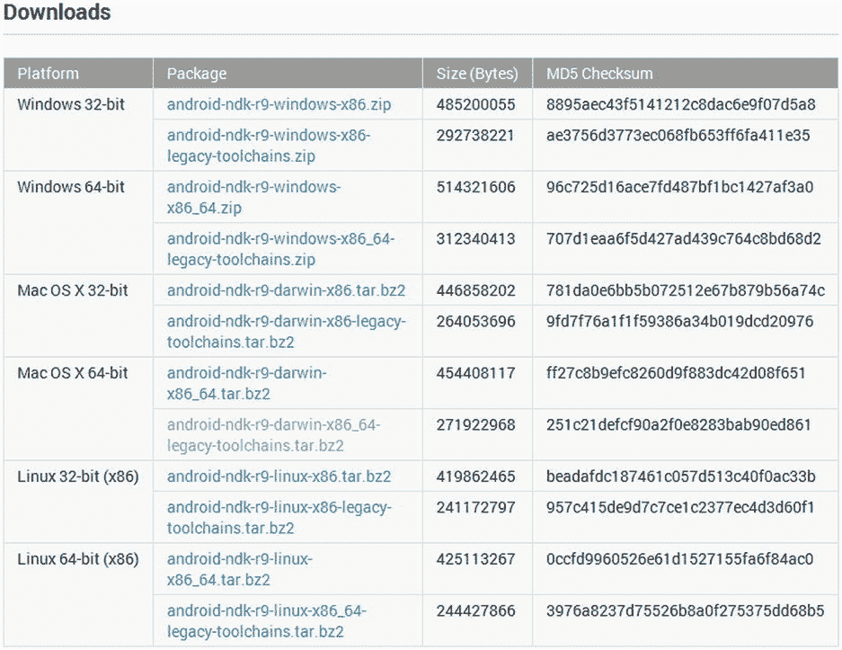

图 11-1。

Android NDK downloads

如果您在 Windows 平台上进行开发，您必须下载并安装 Cygwin，这是一个 Unix 风格的命令行界面，允许您在 PC 上执行 Unix 命令。(见图 11-2 。)

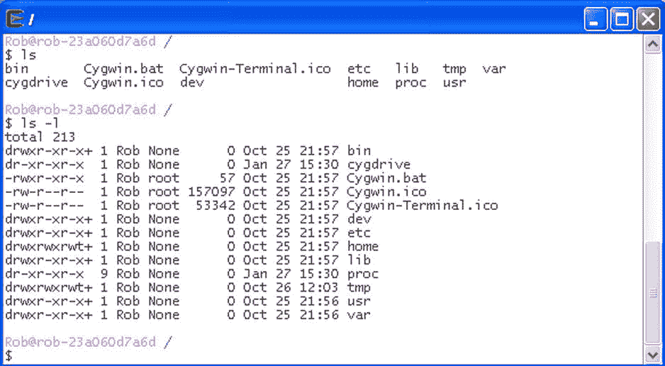

图 11-2。

Cygwin Unix command shell for Windows

## 安卓 NDK 的使用方法

有两种方法可以使用安卓 NDK。

*   使用 Android Java 框架，并使用 Java 本地接口或 JNI 从基于 Java 的 Android 程序中调用本地代码。
*   使用 Android SDK 提供的 NativeActivity 类正常替换 Java 语言生命周期回调，如`onCreate()`、`onPause()`、`onResume()`等。，用 C/C++ 写的原生代码。但是原生活动必须运行在 Android 操作系统 2.3 版(API Level 9)及更高版本上。此外，一些 Android 框架服务不能本地访问。

在这一章中，我将介绍如何使用 JNI 从 Java 框架中访问本地代码。

## Java 本地接口概述

JNI 允许在 Android 虚拟机中运行的 Java 代码与用其他编程语言(如 C、C++ 和汇编语言)编写的应用和库一起运行。本节将讨论 Java 接口指针。处理本机 C/C++ 编码方法，包括与 JNI 一起使用的变量类型、本机 C/C++ 函数所需的命名约定以及这些函数所需的输入参数。给出了将本机函数集成到 Java 代码中的过程。本节还提供了如何从 Java 中使用本机代码以及如何从本机代码中使用 Java 函数的示例。

### Java 接口指针

C/C++ 中的本机代码通过 JNI 函数访问 Java 虚拟机，这些函数是通过 Java 接口指针访问的。JNI 接口指针是指向 JNI 函数的指针数组的指针。(见图 11-3 。)

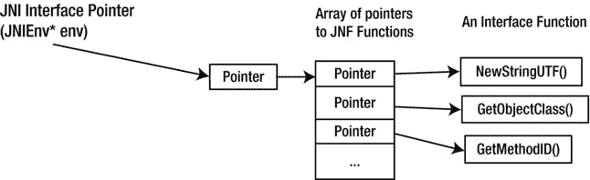

图 11-3。

The Java Interface Pointer

### 加载和链接本机 C/C++ 方法

为了在 Android Java 代码中使用本地类(参见清单 11-1)，您必须

Load the compiled library by using the `System.loadLibrary()` function.   Declare the native class that is defined in the C/C++ source code as native in the Android Java code by using the native keyword in a function declaration.  

清单 11-1。从 Android Java 代码加载和链接本地 C/C++ 方法

`package robs.gldemo.robsgl20tutorial;`

`class GLES20TriangleRenderer implements GLSurfaceView.Renderer`

`{`

`/* this is used to load the 'hello-jni' library on application`

`* startup. The library has already been unpacked into`

`* /data/data/com.example.hellojni/lib/libhello-jni.so at`

`* installation time by the package manager.`

`*/`

`static {`

`System.loadLibrary("hello-jni");`

`}`

`public native String  RobsstringFromJNI();`

`}`

### 命名本机函数

Java 代码中声明的本机函数必须根据特定格式与本机 C/C++ 代码中声明的函数名匹配，如下所示:

The function starts with “Java.”   It is followed by the package name “`robs_gldemo_robsgl20tutorial`” from the example in Listing 11-1.   This is followed by the class name “`GLES20TriangleRenderer`” from the example in Listing 11-1.   Next comes the function name “`RobsstringFromJNI`” from the example in Listing 11-1.  

在清单 11-2 中可以看到完整的函数名。

清单 11-2。原生`RobsstringFromJNI()`函数

`jstring`

`Java_robs_gldemo_robsgl20tutorial_GLES20TriangleRenderer_RobsstringFromJNI` `(JNIEnv* env, jobject thiz )`

`{`

`return (*env)->NewStringUTF(env, "Rob’s String Text Message!");`

`}`

### 本机函数参数

本地函数的参数列表总是以一个指向 JNIEnv 的指针开始，它是 Java 接口指针，例如，在清单 11-2 的本地函数中的`env`。

`JNIEnv* env`

第二个参数是对对象的引用，如果本地函数是非静态的，例如清单 11-2 中的本地函数示例中的`thiz`。

`jobject thiz`

但是，如果本机函数是静态的，第二个参数是对其 Java 类的引用。

### C 与 C++ 本机函数格式

清单 11-2 中的函数是利用 Java 本地接口的 C 本地函数。C++ 版本略有不同，但是底层机制是相同的(见清单 11-3)。主要区别是

The `extern "C"` specification   The change from `(*env)->` to `env->` for accessing the JNI functions   The removal of `env` as the first parameter of the JNI function call  

清单 11-3。相当于 C++ 的本机函数

`extern "C" /* specify the C calling convention */`

`jstring`

`Java_robs_gldemo_robsgl20tutorial_GLES20TriangleRenderer_RobsstringFromJNI` `(JNIEnv* env, jobject thiz )`

`{`

`return env->NewStringUTF("Rob’s String Text Message!");`

`}`

### 本地类型

JNI 本地数据类型及其 Java 等价物包括

*   jboolean:这种本机类型相当于布尔型 Java 类型，大小为无符号 8 位。
*   jbyte:这种本机类型相当于 byte Java 类型，大小为 8 位。
*   jchar:这种本机类型相当于 char Java 类型，大小是无符号的 16 位。
*   jshort:这种本机类型相当于短 Java 类型，大小为 16 位。
*   jint:这种本机类型相当于 int Java 类型，大小为 32 位。
*   jlong:这种本地类型相当于 long Java 类型，大小为 64 位。
*   jfloat:这个本机类型相当于 float Java 类型，大小为 32 位。
*   jdouble:这种本机类型相当于双 Java 类型，大小为 64 位。

### 参考类型

JNI 包括一些对应于各种 Java 对象的引用类型。参见图 11-4 ,了解分层视图中这些参考类型的列表。

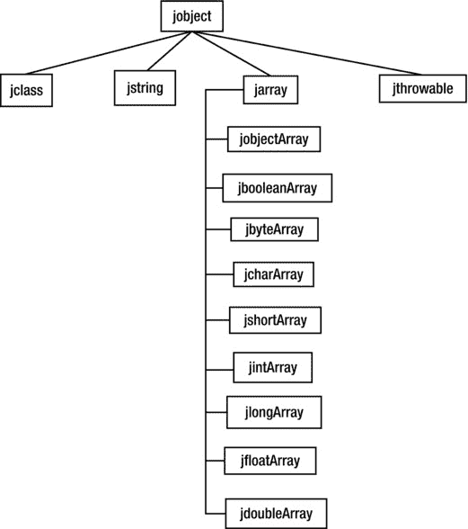

图 11-4。

Reference type hierarchy

### JNI 签名类型

JNI 使用 Java 虚拟机的签名类型表示，这些签名类型用于定义特定的函数，包括其返回值类型和输入参数的类型。签名类型如下:

*   z 布尔类型
*   b 字节类型
*   c 字符类型
*   s 短型
*   I int 类型
*   j 长型
*   f 浮动型
*   d 双型
*   l 完全合格级；完全合格的类别
*   [ type type[]数组
*   (arg-types) ret-type(方法)返回类型
*   五.无效

例如，Java 方法

`long JavaMethod1(int number, String str, int[] intarray1);`

具有以下类型签名:

`(ILjava/lang/String;[I)J`

另一个例子是 Orientation 类中的`AddRotation()`函数。

`void AddRotation(float AngleIncrementDegrees)`

这个函数的签名类型是

`(F)V`

`F`表示浮点输入参数，而`V`表示 void 返回类型。

### 从 Java 调用本机代码和从本机代码访问 Java 方法

要从 Java 代码中调用本机函数，您可以使用不带额外标识信息的损坏前缀的本机函数名。例如，要调用清单 11-5 所示的本机函数`AddRotationNative()`,可以使用清单 11-4 所示的代码。

清单 11-4。从 Java 调用本机代码

`void AddRotationToObject(Orientation O, float AngleAmount)`

`{`

`AddRotationNative(O, AngleAmount);`

`}`

清单 11-5 中显示的本地函数`AddRotationNative()`为定向对象调用`AddRotation()`函数，该定向对象被传递到函数中并保存在`Orient`变量中。

`AddRotationNative()`功能执行以下操作:

Gets the class of the Java object `Orient` by calling the `GetObjectClass()` JNI function and assigns it to the `OrientationClass` variable   Gets the method id of a specific function by calling the `GetMethodID()` JNI function with parameters including the function name, which is `"AddRotation"`; the function signature type, which is `"(F)V"`; and the Java class object that contains the function, which is `OrientationClass`. This method id is assigned to the `MethodID` variable.   Calls the `Orient` Java object’s `AddRotation()` function with parameter `RotationAngle` by calling the `CallVoidMethod()` JNI function  

清单 11-5。从本机代码访问 Java 方法

`Java_robs_gldemo_robsgl20tutorial_Physics_AddRotationNative(JNIEnv* env,`

`jobject thiz,`

`jobject Orient,`

`jfloat RotationAngle)`

`{`

`/*`

`GetObjectClass`

`jclass GetObjectClass(JNIEnv *env, jobject obj);`

`*/`

`jclass OrientationClass = (*env)->GetObjectClass(env, Orient);`

`/*`

`GetMethodID`

`jmethodID GetMethodID(JNIEnv *env, jclass clazz, const char *name, const char *sig);`

`*/`

`jmethodID  MethodID = (*env)->GetMethodID(env,`

`OrientationClass,`

`"AddRotation",`

`"(F)V");`

`/*`

`NativeType Call<type>Method(JNIEnv *env, jobject obj, jmethodID methodID, ...);`

`*/`

`(*env)->CallVoidMethod(env, Orient, MethodID, RotationAngle);`

`}`

### JNI 函数

除了清单 11-5 中讨论的，还有很多 JNI 函数。例如，如果我们要调用的 Java 函数返回一个双数值，那么对于返回 void 的函数，我们必须调用`CallDoubleMethod()`函数而不是`CallVoidMethod`。我们不会在这里尝试和讨论每一个 JNI 函数，因为这不是 JNI 的参考手册。如果您想了解更多关于支持的 JNI 功能的完整列表，请访问 [`http://docs.oracle.com/javase/6/docs/technotes/guides/jni/spec/functions.html#wp9502`](http://docs.oracle.com/javase/6/docs/technotes/guides/jni/spec/functions.html#wp9502) 。

Note

JNI 规格的主要网站是 [`http://docs.oracle.com/javase/6/docs/technotes/guides/jni/spec/jniTOC.html`](http://docs.oracle.com/javase/6/docs/technotes/guides/jni/spec/jniTOC.html) 。

## Android JNI Makefile

Android makefile ( `Android.mk`)是一个描述您想要编译到 NDK 编译系统的本机代码的文件。

`LOCAL_PATH`变量保存源文件的位置。NDK 编译系统已经定义了`my-dir`的值，指向包含`Android.mk` makefile 的当前目录。你要做的是把这个 makefile 文件放在 JNI 目录下，连同你要编译的所有 C 源代码文件。

`LOCAL_PATH := $(call my-dir)`

`CLEAR_VARS`变量已经由 NDK 构建系统定义，并指向一个 makefile，该 makefile 将清除构建系统中使用的许多局部变量。

`include $(CLEAR_VARS)`

`LOCAL_MODULE`变量设置将从本地源代码文件生成的库名。库名格式将是前缀“`lib`”+“`hello-jni`”+后缀“`.so`”。但是，如果库名已经以“`lib`”开头，则前缀“`lib`”不会添加到最终文件名中。

`LOCAL_MODULE    := hello-jni`

`LOCAL_SRC_FILES`变量保存 C/C++ 源文件的名称，NDK 编译系统将编译这些文件并从中创建最终的库。

`LOCAL_SRC_FILES := hello-jni.c`

`BUILD_SHARED_LIBRARY`变量由 NDK 构建系统定义，指向一个 makefile 文件，该文件收集并处理构建最终库所需的所有信息。

`include $(BUILD_SHARED_LIBRARY)`

完整的 makefile 如清单 11-6 所示。

清单 11-6。Android JNI Makefile

`LOCAL_PATH := $(call my-dir)`

`include $(CLEAR_VARS)`

`LOCAL_MODULE    := hello-jni`

`LOCAL_SRC_FILES := hello-jni.c`

`include $(BUILD_SHARED_LIBRARY)`

## 实际操作示例:“来自 JNI 和本地代码的 Hello World”

在这个动手示例中，讨论了一个简单的“Hello World”示例，其中实际的字符串“Hello World from JNI 和本机代码”是从本机 C 代码生成的，并返回给 Java 调用者，然后在那里打印到日志窗口。

首先，我们必须为 Android 项目创建`jni`目录。选择要在其中创建`jni`目录的主项目目录。转到文件➤新➤文件夹，调出新文件夹对话框窗口。在文件夹名称编辑框中输入文件名“jni ”,点击完成按钮，创建一个名为`jni`的新目录。(见图 11-5 。)

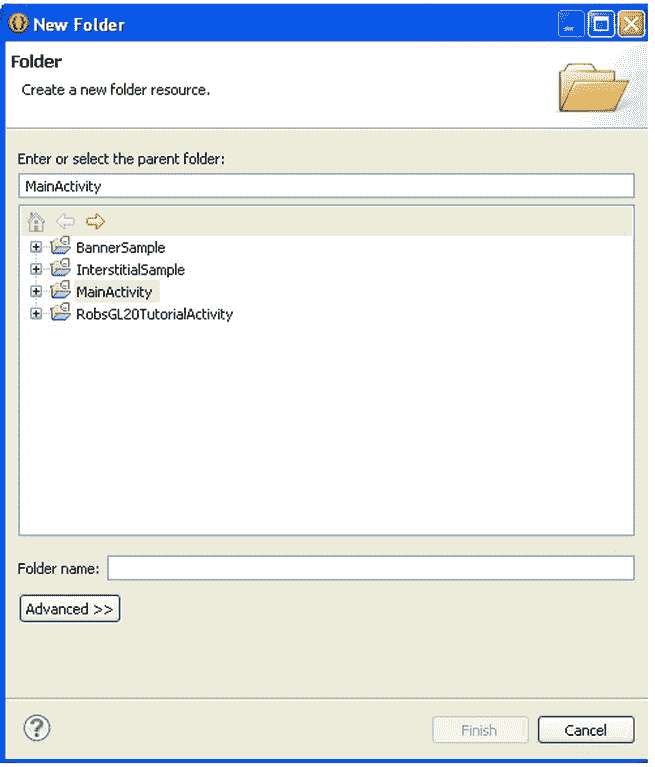

图 11-5。

New Folder window dialog

`jni`目录应该出现在主项目目录下。(见图 11-6 。)

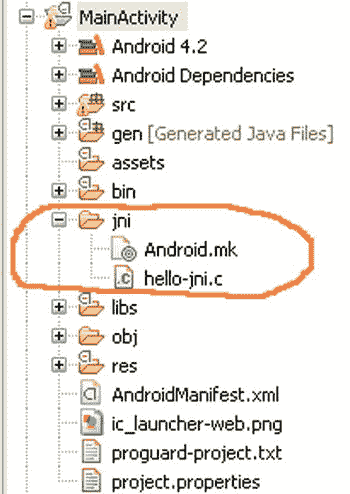

图 11-6。

Creating the `jni` directory

接下来，通过选择文件➤新➤文件在`jni`目录下创建一个新文件，以打开一个新文件窗口对话框。(见图 11-7 。)

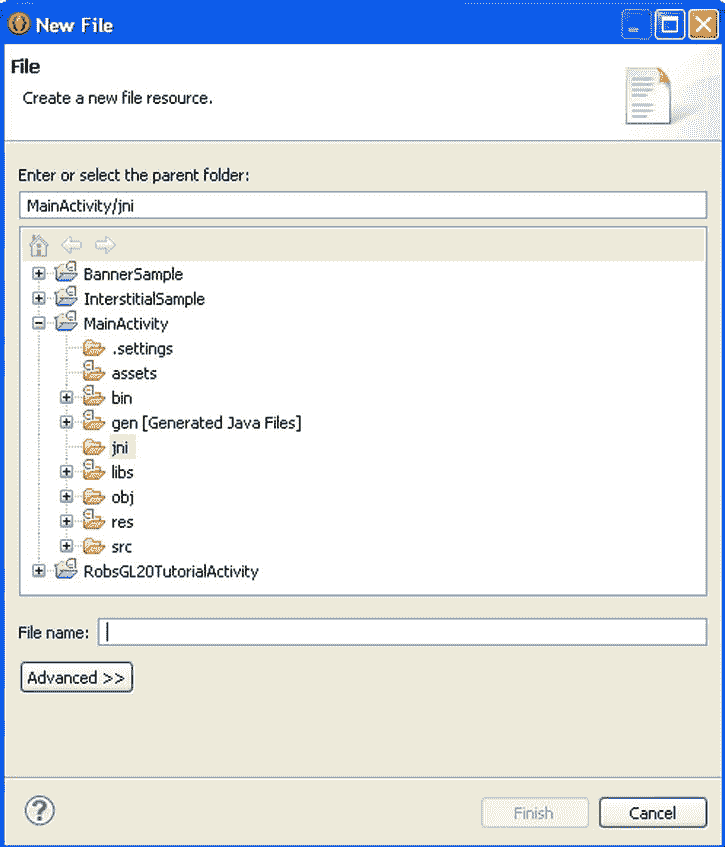

图 11-7。

New File window dialog

键入“Android.mk”作为文件名，然后单击 Finish 按钮创建新文件。双击 Package Explorer 窗口中的文件，在 Eclipse 源代码区域显示文本。将清单 11-6 中的 makefile 代码复制到新文件中，并通过选择文件➤全部保存来保存它。

接下来，重复前面的步骤，为 C 源代码文件创建一个新文件，命名为“hello-jni.c”，将清单 11-7 所示的源代码复制到`hello-jni.c`。

清单 11-7。Hello-Jni.c 源代码

`#include <string.h>`

`#include <jni.h>`

`// package = com.robsexample.glhelloworld;`

`// class = MyGLRenderer`

`jstring`

`Java_com_robsexample_glhelloworld_MyGLRenderer_RobsstringFromJNI(JNIEnv* env,`

`jobject thiz )`

`{`

`return (*env)->NewStringUTF(env, "Hello World from JNI and Native Code.");`

`}`

清单 11-7 显示了本机 C 函数`RobsstringFromJNI()`。该函数通过调用`NewStringUTF()`函数创建一个新的 Java 字符串，并将该字符串返回给 Java 调用者。

接下来，必须使用 NDK 编译系统编译本机代码。为了做到这一点，我们必须启动 Cygwin Unix 模拟器，如果您使用 PC 进行 Android 开发，它允许您在 Windows PC 上运行 Unix 命令。

您必须使用 Unix 命令导航到您之前创建的`jni`目录。使用“cd ..”命令将目录更改为上一级目录，命令“cd foldername”将当前目录更改为文件夹名。使用“ls”命令列出当前目录中的文件和文件夹。使用“pwd”命令获取当前所在的目录路径。

您必须转到根目录，并将目录更改为`cygdrive/`文件夹。然后将目录更改为存储 Android 项目的驱动器，并转到本地源文件所在的特定文件夹。一旦你进入包含 makefile 和源代码的`jni`目录，你必须从你下载并解压到硬盘的 Android NDK 中运行`ndk-build`脚本。例如，假设您的文件在`/cygdrive/c/AndroidWorkSpaces/WorkSpace1/MainActivity/jni`目录中。您可以在当前目录下通过输入脚本的完整路径来执行`ndk-build`脚本，比如`/cygdrive/c/AndroidNDK/andoird-ndk-r9/ndk-build`。然后，构建脚本将执行并产生如图 11-8 所示的输出。

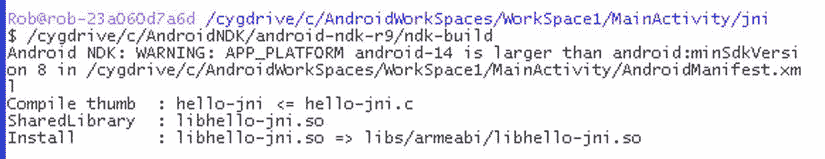

图 11-8。

Running the `ndk-build` script in the `jni` directory

`ndk-build`脚本将处理您的本地代码文件，并将它们打包到一个名为`libhello-jni.so`的共享库，该库位于`libs/armeabi`目录中。(见图 11-9 。)

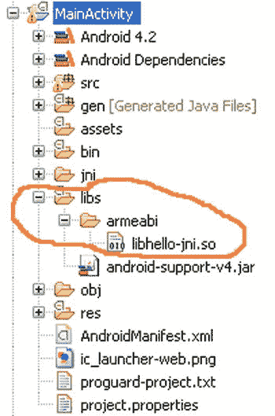

图 11-9。

The shared library generated by the `ndk-build` script

### 修改 MyGLRenderer 类

为了使用编译后的本地代码，我们必须对上一章的动手示例中的 MyGLRenderer 类进行一些修改。

必须使用`loadLibrary()`函数加载带有本机代码的共享库。

`static {`

`System.loadLibrary("hello-jni");`

`}`

库中的本机 C 函数必须用 native 关键字声明，才能被识别和使用。

`public native String  RobsstringFromJNI();`

在`onDrawFrame()`函数中，`String`变量`TestJNIString`被赋予调用`RobsstringFromJNI()`函数的返回值。该返回值包含在调试日志语句中。(参见清单 11-8。)

清单 11-8。修改`onDrawFrame()`功能

`String  TestJNIString = RobsstringFromJNI();`

`Log.e("RENDERER", "JNI STRING = " + TestJNIString);`

运行程序。您应该在日志窗口中看到调试语句。log 语句的最终输出如图 11-10 所示。

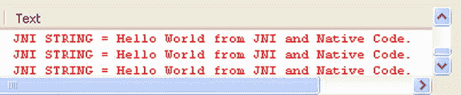

图 11-10。

JNI test results in Log window

## 实践示例:将本机功能添加到无人机网格游戏案例研究

这个动手的例子将演示如何将我们的无人机网格游戏的一部分从 Java 代码转换为本机 C 代码，以及如何从本机 C 代码调用 Java 函数。

### 在本机代码中计算重力

重力计算可以在我们的无人机网格游戏中修改，这样实际的重力计算就可以用 C 编译，并在 Android 上用本机代码执行。为此，我们必须修改`hello-jni.c`文件和物理类。

#### 修改`hello-jni.c`文件

必须修改`hello-jni.c`文件以包含 C 源代码。

`Gravity`变量保存我们的 3D 游戏世界的重力加速度值。

`float Gravity = 0.010f;`

`ApplyGravityToObjectNative()`函数计算我们游戏中重力加速度应用后物体的新加速度。然后返回这个新的加速度。(参见清单 11-9。)

清单 11-9。计算物体的新的 Y 加速度

`jfloat`

`Java_com_robsexample_glhelloworld_Physics_ApplyGravityToObjectNative(JNIEnv* env,`

`jobject thiz,`

`jfloat YAccel)`

`{`

`YAccel = YAccel - Gravity;`

`return YAccel;`

`}`

#### 修改物理课

接下来，必须修改物理类来调用 native 类。

必须在物理类中将`ApplyGravityToObjectNative()`函数声明为原生函数。

`native float ApplyGravityToObjectNative(float YAccel);`

`ApplyGravityToObject()`函数通过用对象的当前 y 加速度调用本机函数`ApplyGravityToObjectNative()`来计算加速度的新 y 分量。(参见清单 11-10。)

清单 11-10。调用本机重力计算函数

`void ApplyGravityToObject()`

`{`

`// Do Native Apply Gravity`

`float YAccel = m_Acceleration.y;`

`m_Acceleration.y = ApplyGravityToObjectNative(YAccel);`

`}`

### 从本机代码旋转对象

使用 Java 函数演示对象从本机 C 代码的旋转需要修改`hello-jni.c`文件、Physics 类和 MyGLRenderer 类。

#### 修改`hello-jni.c`文件

必须修改`hello-jni.c`文件来添加本地类`AddRotationNative()`。

`AddRotationNative()`函数几乎与我们在清单 11-5 中讨论的函数相同。不同之处在于完整的函数名涉及不同的包和类。`AddRotationNative()`所做的是将`RotationAngle`度加到对象的旋转上，该对象的方向由输入的`Orient`参数表示。这是通过调用实际的 Java 语言方法`"AddRotation()"`来完成的。(参见清单 11-11。)

清单 11-11。添加旋转

`Java_``com_robsexample_glhelloworld_Physics`

`jobject thiz,`

`jobject Orient,`

`jfloat RotationAngle)`

`{`

`/*`

`GetObjectClass`

`jclass GetObjectClass(JNIEnv *env, jobject obj);`

`*/`

`jclass OrientationClass = (*env)->GetObjectClass(env, Orient);`

`/*`

`GetMethodID`

`jmethodID GetMethodID(JNIEnv *env, jclass clazz, const char *name, const char *sig);`

`*/`

`jmethodID  MethodID = (*env)->GetMethodID(env, OrientationClass,"AddRotation", "(F)V");`

`/*`

`NativeType Call<type>Method(JNIEnv *env, jobject obj, jmethodID methodID, ...);`

`*/`

`(*env)->CallVoidMethod(env, Orient, MethodID, RotationAngle);`

`}`

#### 修改物理课

物理类也必须被修改以使用自然旋转函数。

必须在 Physics 类中用 native 关键字声明`AddRotationNative()`函数。

`native void  AddRotationNative(Orientation O, float RotationAngle);`

`AddRotationToObject()`函数调用`AddRotationNative()`函数在对象上执行旋转，并充当本机函数的 Java 包装器接口。(参见清单 11-12。)

清单 11-12。`AddRotationNative()`的包装功能

`void AddRotationToObject(Orientation O, float AngleAmount)`

`{`

`AddRotationNative(O, AngleAmount);`

`}`

通过添加 Java 函数`AddRotationToObject()`来修改`UpdatePhysicsObject()`函数，该函数调用本地 C 函数来旋转对象，作为物理更新的一部分。旧的`AddRotation()`功能也被注释掉了。(参见清单 11-13。)

清单 11-13。修改`UpdatePhysicsObject()`功能

`void UpdatePhysicsObject(Orientation orientation)`

`{`

`// 0\. Apply Gravity if needed`

`if (m_ApplyGravity)`

`{`

`ApplyGravityToObject();`

`}`

`// 1\. Update Linear Velocity`

`/////////////////////////////////////////////////////////////////////////////`

`m_Acceleration.x = TestSetLimitValue(m_Acceleration.x, m_MaxAcceleration.x);`

`m_Acceleration.y = TestSetLimitValue(m_Acceleration.y, m_MaxAcceleration.y);`

`m_Acceleration.z = TestSetLimitValue(m_Acceleration.z, m_MaxAcceleration.z);`

`m_Velocity.Add(m_Acceleration);`

`m_Velocity.x = TestSetLimitValue(m_Velocity.x, m_MaxVelocity.x);`

`m_Velocity.y = TestSetLimitValue(m_Velocity.y, m_MaxVelocity.y);`

`m_Velocity.z = TestSetLimitValue(m_Velocity.z, m_MaxVelocity.z);`

`// 2\. Update Angular Velocity`

`/////////////////////////////////////////////////////////////////////////////////`

`m_AngularAcceleration = TestSetLimitValue(m_AngularAcceleration, m_MaxAngularAcceleration);`

`m_AngularVelocity += m_AngularAcceleration;`

`m_AngularVelocity = TestSetLimitValue(m_AngularVelocity,m_MaxAngularVelocity);`

`// 3\. Reset Forces acting on Object`

`//    Rebuild forces acting on object for each update`

`////////////////////////////////////////////////////////////////////////////////`

`m_Acceleration.Clear();`

`m_AngularAcceleration = 0;`

`//4\. Update Object Linear Position`

`////////////////////////////////////////////////////////////////////////////////`

`Vector3 pos = orientation.GetPosition();`

`pos.Add(m_Velocity);`

`// Check for object hitting ground if gravity is on.`

`if (m_ApplyGravity)`

`{`

`if ((pos.y < m_GroundLevel)&& (m_Velocity.y < 0))`

`{`

`if (Math.abs(m_Velocity.y) > Math.abs(m_Gravity))`

`{`

`m_JustHitGround = true;`

`}`

`pos.y = m_GroundLevel;`

`m_Velocity.y = 0;`

`}`

`}`

`//5\. Update Object Angular Position`

`////////////////////////////////////////////////////////////////////////////////`

`// Add Rotation to Rotation Matrix`

`//orientation.AddRotation(m_AngularVelocity);`

`// Call Native Method`

`AddRotationToObject(orientation, m_AngularVelocity);`

`}`

#### 修改 MyGLRenderer 类

最后，必须修改 MyGLRenderer 类。

必须修改`CreateArenaObjectsSet()`函数，以将旋转力应用到竞技场对象，从而演示在旋转对象中使用原生函数。应用于竞技场对象的旋转力值保存在`RotationalForce`变量中，并设置为 5000。`ApplyRotationalForce()`功能用于对竞技场物体施加实际的力。(参见清单 11-14。)

清单 11-14。修改竞技场对象集创建功能

`void CreateArenaObjectsSet(Context iContext)`

`{`

`m_ArenaObjectsSet = new ArenaObjectSet(iContext);`

`// Cube`

`float RotationalForce = 5000;`

`float MaxVelocity = 0.1f;`

`ArenaObject3d Obj = CreateArenaObjectCube1(iContext);`

`Obj.SetArenaObjectID("cube1");`

`Obj.GetObjectStats().SetDamageValue(10);`

`Obj.GetObjectPhysics().GetMaxVelocity().Set(MaxVelocity, 1, MaxVelocity);`

`Obj.GetObjectPhysics().ApplyRotationalForce(RotationalForce, 1);`

`// Add new Object`

`boolean result = m_ArenaObjectsSet.AddNewArenaObject(Obj);`

`///////////////////////////////////////////////`

`Obj = CreateArenaObjectCube2(iContext);`

`Obj.SetArenaObjectID("cube2");`

`Obj.GetObjectStats().SetDamageValue(10);`

`Obj.GetObjectPhysics().GetMaxVelocity().Set(MaxVelocity, 1, MaxVelocity);`

`Obj.GetObjectPhysics().ApplyRotationalForce(RotationalForce, 1);`

`// Add new Object`

`result = m_ArenaObjectsSet.AddNewArenaObject(Obj);`

`}`

### 从本机代码计算碰撞的反作用力

为了计算碰撞的反作用力，必须对`hello-jni.c`文件和物理类进行修改。

#### 修改`hello-jni.c`文件

必须通过添加两个函数来修改`hello-jni.c`文件。

`DotProduct()`函数计算两个向量(x1，y1，z1)和(x2，y2，z2)之间的点积并返回。(参见清单 11-15。)

清单 11-15。计算两个向量的点积

`float DotProduct(float x1, float y1, float z1,`

`float x2, float y2, float z2)`

`{`

`return ((x1 * x2) + (y1 * y2) + (z1 * z2));`

`}`

`CalculateCollisionImpulseNative()`函数计算两个物体相互碰撞产生的碰撞反作用力，并返回值。(参见清单 11-16。)

清单 11-16。计算碰撞的反作用力

`jfloat`

`Java_com_robsexample_glhelloworld_Physics_CalculateCollisionImpulseNative(JNIEnv* env,`

`jobject thiz,`

`jfloat CoefficientOfRestitution,`

`jfloat Mass1,`

`jfloat Mass2,`

`jfloat RelativeVelocityX,`

`jfloat RelativeVelocityY,`

`jfloat RelativeVelocityZ,`

`jfloat CollisionNormalX,`

`jfloat CollisionNormalY,`

`jfloat CollisionNormalZ)`

`{`

`// 1\. Calculate the impulse along the line of action of the Collision Normal`

`//float Impulse = (-(1+CoefficientOfRestitution) * (RelativeVelocity.DotProduct(CollisionNormal))) /`

`//                        (1/Mass1 + 1/Mass2);`

`float RelativeVelocityDotCollisionNormal = DotProduct(RelativeVelocityX, RelativeVelocityY, RelativeVelocityZ, CollisionNormalX, CollisionNormalY, CollisionNormalZ);`

`float Impulse = (-(1+CoefficientOfRestitution) * RelativeVelocityDotCollisionNormal)/(1/Mass1 + 1/Mass2);`

`return Impulse;`

`}`

#### 修改物理课

物理类也必须修改以实现反作用力计算。

`CalculateCollisionImpulseNative()`函数必须声明为本机函数才能使用。

`native float CalculateCollisionImpulseNative(float CoefficientOfRestitution,`

`float Mass1,float Mass2,`

`float RelativeVelocityX,  float RelativeVelocityY, float RelativeVelocityZ,`

`float CollisionNormalX, float CollisionNormalY, float CollisionNormalZ);`

必须修改`ApplyLinearImpulse()`函数，以便它调用`CalculateCollisionImpulseNative()`函数来计算碰撞的反作用力。对现有的反作用力计算进行了评论。(参见清单 11-17。)

清单 11-17。修改`ApplyLinearImpulse()`功能

`void ApplyLinearImpulse(Object3d body1, Object3d body2)`

`{`

`float m_Impulse = 0;`

`/*`

`// 1\. Calculate the impulse along the line of action of the Collision Normal`

`m_Impulse = (-(1+m_CoefficientOfRestitution) * (m_RelativeVelocity.DotProduct(m_CollisionNormal))) / ((1/body1.GetObjectPhysics().GetMass() + 1/body2.GetObjectPhysics().GetMass()));`

`*/`

`m_Impulse = CalculateCollisionImpulseNative(m_CoefficientOfRestitution,`

`body1.GetObjectPhysics().GetMass(),`

`body2.GetObjectPhysics().GetMass(),`

`m_RelativeVelocity.x,`

`m_RelativeVelocity.y,`

`m_RelativeVelocity.z,`

`m_CollisionNormal.x,`

`m_CollisionNormal.y,`

`m_CollisionNormal.z);`

`// 2\. Apply Translational Force to bodies`

`// f = ma;`

`// f/m = a;`

`Vector3 Force1 = Vector3.Multiply( m_Impulse, m_CollisionNormal);`

`Vector3 Force2 = Vector3.Multiply(-m_Impulse, m_CollisionNormal);`

`body1.GetObjectPhysics().ApplyTranslationalForce(Force1);`

`body2.GetObjectPhysics().ApplyTranslationalForce(Force2);`

`}`

运行程序。在图 11-11 中，自然计算出的重力应该拉向地面物体，例如坦克。竞技场物体应该如图 11-12 旋转。碰撞后作用在物体上的碰撞力应该使物体相互偏离，如图 11-13 所示。

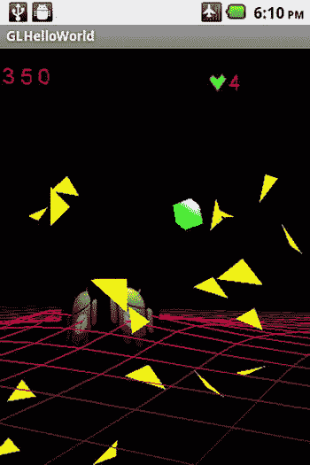

图 11-13。

Collision between player’s ammunition and an arena object with reaction force calculated natively

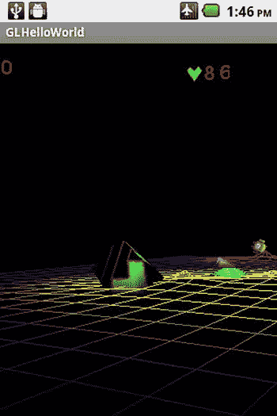

图 11-12。

Arena object turning from natively called rotation

图 11-11。

Tank falling from natively calculated gravity

## 摘要

在这一章中，我介绍了 Android 本地开发工具包(NDK)。我首先概述了 NDK 到底是什么，以及使用 NDK 需要哪些系统要求、软件要求和实际的 Android 硬件要求。然后，讲述了 Java 本机接口，或 JNI，并用来演示 Java 函数如何调用用 C 编写的本机函数，以及用 C 编写的本机函数如何用于调用 Java 函数。然后介绍了一个简单的“Hello World from JNI 和本机代码”实践示例，并带您一步步地将本机代码实现到现有的 Java 程序中。最后，我们展示了另一个实践示例，展示了如何将本机代码集成到我们现有的无人机网格游戏案例研究中。