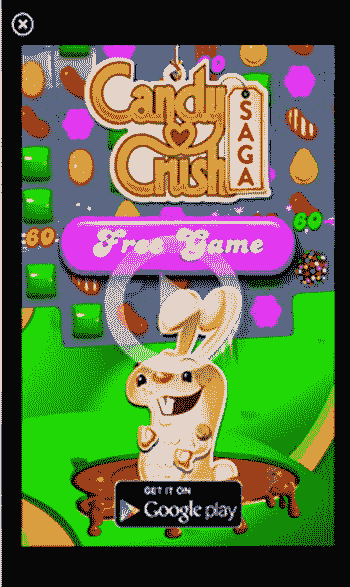

# 十二、发布和营销您的最终游戏

Abstract

在这一章中，我将介绍你最终游戏的出版和营销。我首先讨论如何创建用户将要安装的最终游戏发行版文件。然后，我将介绍如何通过复制发行版文件并将其安装在实际的 Android 设备上来测试它。接下来，我将介绍一个 Android 市场列表，您可以在其中上传游戏发行文件进行销售和/或下载。然后，众多支持 Android 的广告网络呈现给那些想通过广告从他们的游戏中赚钱的人。提供了评论 Android 游戏的游戏网站列表。最后，列出了其他对 Android 游戏开发者有帮助的网站。

在这一章中，我将介绍你最终游戏的出版和营销。我首先讨论如何创建用户将要安装的最终游戏发行版文件。然后，我将介绍如何通过复制发行版文件并将其安装在实际的 Android 设备上来测试它。接下来，我将介绍一个 Android 市场列表，您可以在其中上传游戏发行文件进行销售和/或下载。然后，众多支持 Android 的广告网络呈现给那些想通过广告从他们的游戏中赚钱的人。提供了评论 Android 游戏的游戏网站列表。最后，列出了其他对 Android 游戏开发者有帮助的网站。

## 创建最终分发文件

您将提交给用户下载和安装的最终发行版文件是一个从安装了 Android 开发工具的 Eclipse 程序生成的`.apk`文件。

要开始创建一个`.apk`分发文件，选择 File ➤ Export from Eclipse，如图 12-1 所示。

图 12-1。

Selecting Export from the File menu

应该会弹出“导出窗口”对话框。在 Android 文件夹下，选择导出 Android 应用，然后单击下一步按钮。(见图 12-2 。)

图 12-2。

Exporting an Android application

接下来，应该会弹出导出 Android 应用窗口。点击 Browse 按钮，选择一个要导出的 Android 项目，并将其转换成一个`.apk`分发文件。一旦选择了一个项目，就会检查是否有任何可能妨碍项目打包的错误。然后，单击“下一步”按钮进入下一个屏幕。(见图 12-3 。)

图 12-3。

Select application to export

应该会出现密钥库选择窗口。选择“创建新的密钥库”单选按钮。单击浏览按钮并选择要存储新密钥库文件的目录。在密码框中键入密码，并在确认框中确认密码。单击“下一步”按钮继续。(见图 12-4 。)

图 12-4。

Create a new keystore selection

现在应该会显示密钥创建窗口。填写此表格将创建一个密钥，用于签署您的申请。填写表格，然后单击“下一步”按钮。(见图 12-5 。)

图 12-5。

Key Creation window Note

建议您将密钥库文件备份到安全的位置。如果您想要更新当前使用这个密钥库文件发布的游戏，您将必须使用这个密钥库文件。

应该会出现目的地和密钥/证书检查窗口。单击 Browse 按钮为您的分发文件`.apk`输入一个目录和文件名。单击 Finish 按钮开始创建您的最终发行版`.apk`文件。(见图 12-6 。)

图 12-6。

Creating the final `.apk` file

## 测试发行版`.apk`文件

现在让我们测试您刚刚创建的发行版`.apk`文件，将它安装在 Android 设备上。首先，必须将`.apk`文件复制到实际的 Android 设备上。有很多方法可以做到这一点，取决于你使用的是什么版本的 Android 操作系统，你的 Android 上安装了什么软件(比如 FTP)，你设置了什么网络连接。我将演示适用于所有 Android 操作系统的复制方法，无论您安装了什么文件传输软件或设置了什么网络连接。为此，我们可以使用 Android Debug Bridge (adb) push 命令将文件放在通过 USB 电缆连接到计算机的设备上。该命令的一般形式如下:

`adb push Filename LocationOnAndroidDevice`

使用位于`C:\Android\adt-bundle-windows-x86\sdk\platform-tools`的 adb 将`MainActivity.apk`文件放到安卓设备上的位置`/sdcard/Download`的具体命令是

`C:\Android\adt-bundle-windows-x86\sdk\platform-tools\adb push MainActivity.apk /sdcard/Download`

`C:`指的是安装 Android SDK 的驱动器盘符，可能会根据您存储 SDK 的位置和您使用的具体操作系统而有所不同。执行完命令后，`MainActivity.apk`文件现在应该在您的 Android 设备上的`/sdcard/Download`了，假设这个目录已经存在。(见图 12-7 。)

图 12-7。

Copying `MainActivity.apk` on an Android device

在尝试安装`.apk`文件之前，如果您使用的是 2.2 等较旧版本的 Android 操作系统，您必须转到“设置➤应用”部分，并选中“未知来源”下的复选框，该复选框允许安装来自未知来源的应用。在更高版本的 Android 操作系统上，你必须在设置➤安全下查找。(见图 12-8 。)

图 12-8。

Allowing installation of `.apk` files from unknown sources

回到 Android 的文件管理程序，导航到你复制了`.apk`文件的目录。点击`.apk`文件开始安装过程。应该会出现一个屏幕，询问您是否要安装该应用。单击安装按钮。(见图 12-9 。)

图 12-9。

Installing the `.apk`

安装完成后，应出现另一个屏幕，确认`.apk`已成功安装。(参见图 12-10 。)

图 12-10。

App installed verification screen

点击打开按钮开始无人机网格游戏。(参见图 12-11 。)

图 12-11。

The game running from the newly installed `.apk` file

既然你的游戏已经安装并运行在 Android 设备上，是时候开始营销你的游戏了。

## Android 市场和政策列表

本节列出了一些 Android 市场，您可以在其中上传您的应用供其他用户下载。每个市场都有自己的政策，这些政策会根据市场情况经常变化。例如，谷歌最近收紧了对其 Google Play 市场销售的应用中可以使用的广告类型的限制。亚马逊最近取消了其在 [`Amazon.com`](http://amazon.com/) 商店销售游戏和应用的年费。

### Google Play

Google Play 是主要的 Android 市场。注册 Google publisher 帐户的链接是

[`https://play.google.com/apps/publish`](https://play.google.com/apps/publish)

使用谷歌钱包需要支付 25 美元的一次性注册费。如果你想出售物品，你还需要一个谷歌钱包商家账户。您可以在 Google 开发者控制台中导航至财务报告➤立即设置商户帐户选项卡，申请 Google 钱包商户帐户。这应该会带你到谷歌钱包网站注册成为一个商家。

您可以通过开发者控制台快速发布和取消发布您的应用或游戏。谷歌在公开你的安卓程序之前不会对其进行筛选。

Google 政策的完整描述位于

[`http://play.google.com/about/developer-content-policy.html`](http://play.google.com/about/developer-content-policy.html)

Note

如果您决定在游戏中加入广告，请确保它们符合 Google Play 的广告政策，否则您的游戏可能会被禁止，您的帐户可能会永久停用。

### 应用商店

亚马逊运营着一个安卓应用和游戏商店，你可以在里面出售你的游戏或者提供免费下载。注册开发者账户的网址是

[`https://developer.amazon.com/welcome.html`](https://developer.amazon.com/welcome.html)

注册是免费的。如果你通过亚马逊的 Appstore 销售程序，你将获得该商品标价的 70%。

您需要将游戏提交给 Amazon 进行测试和验证，然后才能下载或购买。复习一般需要几天。

### 三星应用商店

三星运营着自己的安卓商店，你可以上传你的应用和游戏出售或免费下载。作为开发人员登录的 web 链接是

[`http://seller.samsungapps.com/login/signIn.as`](http://seller.samsungapps.com/login/signIn.as)

注册是免费的。如果您通过商店销售游戏，您将获得物品标价的 70%。

在销售或下载之前，您必须将游戏提交给三星审查。复习通常需要一周时间，但这取决于你选择测试游戏的设备数量。三星专门用不同型号的三星手机和平板电脑测试您的游戏，具体取决于您选择的型号。

### 阿普唑仑(抗抑郁药物)

Aptoide 不同于之前讨论的商店，因为每个开发者或发行者管理他/她自己的商店，并且用户必须下载 Aptoide 客户端并安装它，以便从这些商店下载和安装 Android 软件。官方网站是

[`www.aptoide.com`](http://www.aptoide.com/)

以下是官方网站的描述:“Aptoide 是一个网站，你可以通过一个软件客户端 Aptoide 将免费的应用下载到移动 Android 设备上。在 Aptoide 中，你还可以上传安卓应用，与他人分享。”

### 资本主义

Appitalism 是一个类似于 Google Play 的应用商店，开发者可以在其中销售或上传免费应用进行分发。官方网站是

[`www.appitalism.com`](http://www.appitalism.com/)

不收报名费。

利润方面，一件物品价格的 70%返还给开发商。

### GetJar

GetJar 允许你在它的网站上免费发布你的游戏或应用。主要网站是

[`www.getjar.mobi`](http://www.getjar.mobi/)

开发者登录链接是

[`http://developer.getjar.mobi`](http://developer.getjar.mobi/)

GetJar 声称其网站每天有超过 300 万次下载。但是，GetJar 不接受付费应用。

### SlideMe

SlideMe 是一个 Android 应用和游戏商店，你可以上传你的免费和付费 Android 游戏进行分发和/或销售。官方网站是

[`http://slideme.org/`](http://slideme.org/)

没有开发者费用。

### 社会主义者 Io 商城

社会主义者 Io Mall 是一个 Android 应用和游戏商店，接受免费和付费应用。官方开发者网站是

[`https://developer.soc.io/home`](https://developer.soc.io/home)

提交应用或游戏是免费的。

### 自己的 [`WebSite.Com`](http://website.com/)

请记住，使用 Android，您可以在自己的网站上发布您的最终发行版文件。然而，如果你希望为此获得收入，你可能不得不依赖其他实体，如处理信用卡和借记卡交易的支付处理器，或为你的程序用户点击他们的广告付费的广告网络。

## Android 广告网络列表

从你的游戏或应用中赚钱的一种方式是使用 Android 广告网络，根据用户点击网络在你的游戏中放置的广告的数量向你支付费用。每个广告网络通常都有自己的软件开发工具包(SDK ),你必须将它集成到你的游戏中。SDK 通常由一个以`.jar`文件形式的 Android 库和使用该库中的函数来显示广告的代码组成。不同的广告网络有不同风格的广告可供选择。这一部分首先列出了 Android 开发者社区中一些比较突出的公司，然后列出了其他广告网络和营销公司，它们可能对 Android 开发者赚钱和推广他们的游戏有用。

### AppFlood

AppFlood 是 PapayaMobile 的一个广告系统，总部位于中国北京，在美国旧金山和英国伦敦设有办事处。它有一个网站

[`http://appflood.com/`](http://appflood.com/)

它提供以下类型的广告:

*   通知广告:这些广告类型是推送到用户 Android 手机的通知。
*   图标广告:这些广告类型在用户手机屏幕上放置一个图标。请注意，这种类型的广告对许多用户来说很烦人，可能不符合 Google Play 的最新广告政策。

图 12-14。

AppFlood more games ad

*   更多游戏广告:这些广告显示一个大游戏广告，以及四个小游戏广告。(参见图 12-14 。)

图 12-13。

AppFlood app list

*   应用列表:这些广告模仿了典型的 Android 应用/游戏商店的外观和感觉。(参见图 12-13 。)

图 12-12。

AppFlood interstitial ad

*   间隙广告:这是全屏广告，通常在游戏中的自然断点处显示，如关卡结束或游戏结束。(参见图 12-12 。)

### 阿帕维兹

Appwiz 是一家成立于 2012 年的广告网络，其网站位于

[`www.appwiz.com`](http://www.appwiz.com/)

它提供给开发者的广告类型有

*   搜索图标:用户的主屏幕上有一个搜索图标。但是，请注意，这种类型的广告对许多用户来说是非常讨厌的。
*   书签:书签放置在用户的 web 浏览器中。
*   Offer wall:在 Appwiz 提供的其他子格式之间动态优化的全屏广告，如 AppWall、SmartWall、对话广告、视频广告和富媒体。
*   高级广告:放置在主屏幕上的快捷方式，链接到免费应用和热门交易。

### 铅螺栓

LeadBolt 是一家成立于 2010 年的广告网络，位于澳大利亚悉尼。它的网站是

[`www.leadbolt.com`](http://www.leadbolt.com/)

可用的广告类型有

*   旗帜
*   推送通知
*   主屏幕图标
*   浏览器书签
*   空隙的

### AppBucks

AppBucks 是一家位于美国佛罗里达州迈尔斯堡的广告网络。该公司的网站是

[`www.app-bucks.com`](http://www.app-bucks.com/)

AppBucks 提供的广告类型有

*   横幅广告:横幅广告显示横幅，通常横跨屏幕的顶部或底部。

图 12-16。

AppBucks slider ad

*   滑动广告:这种类型的广告在壁纸和面向服务的应用中效果很好，从屏幕的一侧滑出。(参见图 12-16 。)

图 12-15。

AppBucks interstitial ad

*   插播广告:这种类型的广告填满整个屏幕，通常用于游戏中的关键点，以引起用户的注意，例如一个关卡的结束。参见图 12-15 中 AppBucks 的插播广告示例。

### 移动核心

MobileCore 是一家位于以色列特拉维夫的广告网络，成立于 2009 年。该公司的网站是

[`www.mobilecore.com`](http://www.mobilecore.com/)

MobileCore 提供的广告类型有

*   AppWall 广告:提供其他应用或交易的半屏或全屏广告。开发者将从 AppWall 产生的每次点击或安装中获得报酬。
*   滑动广告:从屏幕一侧滑出的广告。

### AdMob

AdMob 由谷歌运营，如果你希望你的应用符合谷歌的市场政策，它可能是最安全的。违反这些政策会导致你的游戏或应用被禁和/或你的账户被冻结。AdMob 的网站是

[`www.google.com/ads/admob/`](http://www.google.com/ads/admob/)

AdMob 有以下类型的广告:

图 12-18。

AdMob interstitial ad

*   插播广告:插播广告是大型全屏广告，旨在吸引眼球。(参见图 12-18 。)

图 12-17。

AdMob banner ad

*   横幅广告:这些广告占据屏幕的一小部分，允许用户点击进入更详细的信息页面或网站。(参见图 12-17 。)

### 启动应用

StartApp 是 2010 年开始的移动广告平台。总部设在美国纽约，公司的网站是

[`www.startapp.com`](http://www.startapp.com/)

提供的广告类型有

图 12-23。

StartApp splash screen

*   闪屏:在程序加载时显示广告。(参见图 12-23 。)

图 12-22。

StartApp search box

*   搜索框:显示一个有用的滑动搜索框。(参见图 12-22 。)

图 12-21。

StartApp exit ad

*   退出广告:显示当用户点击后退按钮或主页按钮退出应用时出现的广告。(参见图 12-21 。)

图 12-20。

StartApp 3D banner ad

*   横幅广告:3D 横幅广告。(参见图 12-20 。)

图 12-19。

StartApp interstitial ad

*   间隙广告:全屏广告出现在开发者选择的任何位置。(参见图 12-19 。)

### 其他广告网络和营销相关公司

下面的列表涵盖了广告网络和营销相关的公司，它们可能对你的游戏营销和从游戏中投放的广告中赚钱都有帮助。

*   Aarki ( [`http://aarki.com`](http://aarki.com/) ): Aarki 是一家位于加州硅谷的移动广告供应器。
*   AdColony([`http://adcolony.com`](http://adcolony.com/)):AdColony 于 2011 年推出，是一家领先的移动视频广告和货币化平台，以闪电般的速度播放清晰的高清视频，并推动内容的深度参与。
*   Adfonic ( [`http://adfonic.com`](http://adfonic.com/) ): Adfonic 是一个移动广告购买平台，总部位于伦敦。
*   AdIQuity([`http://adiquity.com`](http://adiquity.com/)):AdIQuity 是一个全球移动广告平台，帮助移动发行商和应用开发者从他们的移动库存中获得高额收入。它还帮助广告公司、广告网络和其他媒体购买者获得高质量的全球移动流量。
*   AdMarvel([`www.admarvel.com`](http://www.admarvel.com/)):AdMarvel 是全球最大的出版商、代理商和运营商使用的移动广告优化工具。
*   Admoda ( [`www.admoda.com`](http://www.admoda.com/) ): Admoda 是一个移动广告网络。它的主要重点是为基于绩效的营销部门和联盟营销部门提供流量。
*   Applifier([`www.applifier.com`](http://www.applifier.com/)):Applifier 通过交叉推广，帮助各种规模的游戏和应用发行商增长应用。
*   Apprupt ( `www.apprupt.com` ): Apprupt 由移动营销专家组成。
*   Avocarrot([`www.avocarrot.com`](http://www.avocarrot.com/)):Avocarrot 是一家专门从事高参与度原生广告的独特移动广告网络。从一系列可定制的广告单元中进行选择，以创建无缝的用户体验，从而带来更高的收入。
*   buzz city([`www.buzzcity.com`](http://www.buzzcity.com/)):buzz city 是一个全球性的广告网络。
*   chart boost([`www.chartboost.com`](http://www.chartboost.com/)):chart boost 是一款专注于游戏的手机游戏服务。
*   Epom([`http://epom.com`](http://epom.com/)):Epom 成立于 2010 年，专注于广告服务和广告管理。
*   第四屏广告( [`www.4th-screen.com`](http://www.4th-screen.com/) ):成立于 2006 年，现在是 Opera 软件集团的一部分，第四屏广告是欧洲领先的优质移动广告销售机构。
*   Hunt Mobile Ads([`www.huntmads.com`](http://www.huntmads.com/)):Hunt Mobile 是领先的独立移动广告公司，面向西班牙语市场，包括所有拉丁美洲和美国西班牙语市场，并提供发现、建立品牌和利用移动互联网领域的解决方案。
*   InMobi ( [`www.inmobi.com`](http://www.inmobi.com/) ): InMobi 是一个基于表现的移动广告网络，由 Soft Bank 和 Kleiner Perkins cau field&Byers 支持。该公司于 2007 年在印度成立，并在多个国家设有办事处。
*   inner active([`http://inner-active.com`](http://inner-active.com/)):inner active 是一个面向移动发行商的全球程序化广告栈，专注于视频、超本地和应用内搜索广告。
*   Jampp ( `www.jampp.com` ): Jampp 是一个领先的数据驱动的移动应用营销平台，连接了大量的移动广告网络和实时竞价交易所。
*   Kiip ( [`www.kiip.com`](http://www.kiip.com/) ): Kiip 提供虚拟成就的真实奖励。
*   Komli Mobile([`www.komlimobile.com`](http://www.komlimobile.com/)):Komli Mobile 是全球领先的移动广告和出版网络。
*   lean market([`www.lean.com`](http://www.lean.com/)):lean market 专门研究营销效率问题。
*   loop me Media([`http://loopme.biz`](http://loopme.biz/)):loop me 是智能手机和平板电脑上社交广告发现领域的全球领先先驱。LoopMe 使消费者能够对广告进行反馈(“喜欢”、“停止”和“分享”)，这增加了点击互动、品牌参与度和通过社交认可的价值。
*   MdotM ( [`www.mdotm.com`](http://www.mdotm.com/) ): MdotM 是一家移动营销服务公司。
*   media lets([`http://medialets.com`](http://medialets.com/)):media lets 是一家移动广告公司。Medialets 的移动和平板广告服务平台 Servo 提供先进的测量技术和分析以及简化的活动管理。
*   千禧传媒(`www.millennialmedia.com`):千禧传媒是一家移动营销和广告公司。
*   MKmob ( `www.mkmob.com/` ): MKmob 是一个全球性的移动广告网络。
*   MMedia ( [`http://mmedia.com`](http://mmedia.com/) ): MMedia 是一个移动广告和货币化网络。
*   Mobbnet ( [`www.mobbnet.com`](http://www.mobbnet.com/) ): Mobbnet 是一个全球性的广告网络。
*   Mobfox ( [`www.mobfox.com`](http://www.mobfox.com/) ): MobFox 是一家移动广告网络，在 iPhone、Android、黑莓、Windows Mobile 和移动网站上运营。
*   Mobgold ( [`www.mobgold.com`](http://www.mobgold.com/) ): MobGold 帮助广告商在各种移动设备上接触目标用户，并帮助出版商将他们的移动流量货币化。
*   mobile fuse([`www.mobilefuse.com`](http://www.mobilefuse.com/)):mobile fuse 是一个移动广告网络，由战略上精选的优质网站和应用组成，覆盖 8500 万唯一用户。
*   移动理论( [`http://mobiletheory.com`](http://mobiletheory.com/) ):移动理论提供移动广告和服务。
*   Mocean Mobile([`www.moceanmobile.com`](http://www.moceanmobile.com/)):Mocean Mobile market place(MMM)是全球最大的移动广告市场。
*   Mojiva ( [`www.mojiva.com`](http://www.mojiva.com/) ): Mojiva 是一家专注于智能手机和平板电脑的移动广告网络。它最出名的是 Mojiva tab，这是一个专门为平板电脑设计的广告网络。
*   MoPub ( [`www.mopub.com`](http://www.mopub.com/) ): MoPub 是专为移动出版商打造的托管广告服务解决方案。
*   Nexage ( [`www.nexage.com`](http://www.nexage.com/) ): Nexage 通过增加移动广告收入和降低运营成本的解决方案来加强出版商和开发商的移动广告业务。
*   OnMOBi ( [`http://on-mobi.com`](http://on-mobi.com/) ): OnMOBi 是一家专注于游戏和金融的广告网络。
*   place play([`www.placeplay.com`](http://www.placeplay.com/)):place play 是一个针对 iOS 和 Android 的移动广告网络。
*   play haven([`www.playhaven.com`](http://www.playhaven.com/)):play haven 是一家专注于游戏的移动广告公司。
*   ponti flex([`www.pontiflex.com`](http://www.pontiflex.com/)):ponti flex 是一家专注于注册式广告的移动广告公司。
*   Revmob ( [`www.revmobmobileadnetwork.com`](http://www.revmobmobileadnetwork.com/) ): Revmob 为 Android 和 iOS 提供移动广告。
*   sell aring([`www.sellaring.com`](http://www.sellaring.com/)):sell aring 提供移动广告，专注于替代现有铃声的音频广告。
*   send droid([`http://senddroid.com`](http://senddroid.com/)):send droid 是一家专注于 Android 推送通知广告的移动广告公司。
*   session m([`www.sessionm.com`](http://www.sessionm.com/)):session m 是一家专注于游戏的移动广告公司。
*   Smaato ( [`www.smaato.com`](http://www.smaato.com/) ): Smaato 是全球领先的移动广告交易所。Smaato 的 SMX 平台是全球领先的移动实时竞价广告交易所，帮助移动应用开发商和出版商增加全球广告收入。
*   Sofialys([`www.sofialys.com`](http://www.sofialys.com/)):Sofialys 提供移动广告和营销解决方案，包括广告服务器和移动广告网络。
*   sponsor pay([`www.sponsorpay.com`](http://www.sponsorpay.com/)):sponsor pay 是一家广告货币化公司。
*   strike ad([`www.strikead.com`](http://www.strikead.com/)):strike ad 是一家总部位于美国和英国的移动广告公司。
*   Tapgage ( [`www.tapgage.com`](http://www.tapgage.com/) ): Tapgage 是一个移动的间隙广告网络，帮助应用开发者和出版商从他们的应用和网站中赚钱。
*   塔皮特。( [`www.tapit.com`](http://www.tapit.com/) ): TapIt！提供移动广告。
*   Tapjoy ( [`www.tapjoy.com`](http://www.tapjoy.com/) ): Tapjoy 是一家移动广告公司，允许用户安装一个应用来代替游戏内支付。
*   think near([`www.thinknear.com`](http://www.thinknear.com/)):think near 是一家专注于基于位置的广告的移动广告公司。
*   toda cell([`www.todacell.com`](http://www.todacell.com/)):toda cell 是一家优质的移动广告公司。
*   trade mob([`www.trademob.com`](http://www.trademob.com/)):trade mob 总部位于欧洲，提供移动应用营销。
*   Vserv ( [`www.vserv.mobi`](http://www.vserv.mobi/) ): Vserv 是一家专注于新兴市场的移动广告交易所。
*   Wapstart ( `wapstart.ru/en` ): Wapstart 是一家俄罗斯移动广告公司。
*   Webmoblink([`www.webmoblink.com`](http://www.webmoblink.com/)):Webmoblink 是一家领先的移动广告网络，面向拉丁美洲(西班牙语和葡萄牙语)和美国西班牙语市场。
*   Widespace([`www.widespace.com`](http://www.widespace.com/)):Widespace 是一家总部位于欧洲的优质移动广告网络。
*   XAd ( [`www.xad.com`](http://www.xad.com/) ): XAd 提供基于位置的移动广告。
*   y brant Mobile([`www.ybrantmobile.com`](http://www.ybrantmobile.com/)):y brant Mobile 通过定向广告活动提供移动广告。
*   YOC 移动广告( [`http://group.yoc.com`](http://group.yoc.com/) ): YOC 移动广告是欧洲最大的优质移动广告网络，在英国、德国、法国、西班牙和澳大利亚这五个主要市场拥有强大的影响力。
*   YOOSE ( [`www.yoose.com`](http://www.yoose.com/) ): YOOSE 是一个专注于定位广告的移动广告网络。
*   Zumobi ( [`www.zumobi.com`](http://www.zumobi.com/) ): Zumobi 是一家移动媒体和广告公司。

## Android 游戏评论网站列表

本部分列出了评论 Android 游戏的网站。Android 游戏评论网站是为你的游戏获得免费宣传的绝佳场所。其中一些网站专门致力于 Android，而另一些则是多平台的 Android 板块。

*   安德夫:??]
*   安卓和我: [`http://androidandme.com`](http://androidandme.com/)
*   Android 应用日志: [`www.androidapplog.com`](http://www.androidapplog.com/)
*   Android 语句: [`www.androidappdictions.com`](http://www.androidappdictions.com/)
*   Android 应用: [`http://android-apps.com`](http://android-apps.com/)
*   Android 应用: [`www.androidapps.com`](http://www.androidapps.com/)
*   Android 应用: [`www.androidapps.org`](http://www.androidapps.org/)
*   安卓应用图库: [`www.androidappsgallery.com`](http://www.androidappsgallery.com/)
*   安卓应用点评: [`www.androidapps-reviews.com`](http://www.androidapps-reviews.com/)
*   安卓权威: [`www.androidauthority.com`](http://www.androidauthority.com/)
*   安卓强哥: [`www.androidbloke.co.uk`](http://www.androidbloke.co.uk/)
*   安卓中央: [`www.androidcentral.com`](http://www.androidcentral.com/)
*   安卓社区: [`http://androidcommunity.com`](http://androidcommunity.com/)
*   Android 百科全书: [`www.androidencyclopedia.com`](http://www.androidencyclopedia.com/)
*   Android et te:[`www.androidetvous.com`](http://www.androidetvous.com/)
*   Android 论坛: [`http://androidforums.com`](http://androidforums.com/)
*   Android 法国:??〔??〕??〕
*   安卓游戏: [`www.android-games.com`](http://www.android-games.com/)
*   安卓游戏: [`www.android-games.fr`](http://www.android-games.fr/)
*   安卓游戏回顾: [`www.androidgamesreview.com`](http://www.androidgamesreview.com/)
*   Android gen:“??””
*   安卓家伙: [`www.androidguys.com`](http://www.androidguys.com/)
*   安卓头条: [`www.androidheadlines.com`](http://www.androidheadlines.com/)
*   安卓基： [`http://androidki.com`](http://androidki.com/)
*   Android 实验室: [`www.androidlab.it`](http://www.androidlab.it/)
*   安卓市场应用: [`www.androidmarketapps.com`](http://www.androidmarketapps.com/)
*   Android MT: [`www.android-mt.com`](http://www.android-mt.com/)
*   雄激素: [`www.androidng.com`](http://www.androidng.com/)
*   安卓手机主题: [`www.androidphonethemes.com`](http://www.androidphonethemes.com/)
*   Android pips:[`http://androidpimps.com`](http://androidpimps.com/)
*   Android Pit: [`www.androidpit.com`](http://www.androidpit.com/)
*   Android Pit(法国): [`www.androidpit.fr`](http://www.androidpit.fr/)
*   安卓警察: [`www.androidpolice.com`](http://www.androidpolice.com/)
*   安卓预览来源: [`www.androidappreviewsource.com`](http://www.androidappreviewsource.com/)
*   安卓破落: [`www.androidrundown.com`](http://www.androidrundown.com/)
*   安卓震惊: [`www.androidshock.com`](http://www.androidshock.com/)
*   安卓社交媒体: [`www.androidsocialmedia.com`](http://www.androidsocialmedia.com/)
*   Android 自旋: [`http://androidspin.com`](http://androidspin.com/)
*   安卓平板: [`www.androidtablets.net`](http://www.androidtablets.net/)
*   Android Tapp: [`www.androidtapp.com`](http://www.androidtapp.com/)
*   Android Techie: [`www.androidtechie.com`](http://www.androidtechie.com/)
*   安卓视频点评: [`www.androidvideoreview.net`](http://www.androidvideoreview.net/)
*   安卓病毒: [`www.androidviral.com`](http://www.androidviral.com/)
*   安卓世界: [`www.androidworld.it`](http://www.androidworld.it/)
*   Android 缩放: [`www.androidzoom.com`](http://www.androidzoom.com/)
*   自由日： [`www.androlib.com`](http://www.androlib.com/)
*   雄激素: [`www.andronica.com`](http://www.andronica.com/)
*   Apkfile: [`http://androidgamesapps.apkfile.us`](http://androidgamesapps.apkfile.us/)
*   App 大脑: [`www.appbrain.com`](http://www.appbrain.com/)
*   App 彩蛋:[`www.appeggs.com`](http://www.appeggs.com/)
*   app dang:[`www.appgefahren.de`](http://www.appgefahren.de/)
*   应用安卓: [`www.applicationandroid.com`](http://www.applicationandroid.com/)
*   申请人: [`www.applorer.com`](http://www.applorer.com/)
*   App 模式: [`www.appmodo.com`](http://www.appmodo.com/)
*   App 点评中心: [`www.appreviewcentral.net`](http://www.appreviewcentral.net/)
*   应用 400: [`www.apps400.com`](http://www.apps400.com/)
*   Appsplit: [`http://appsplit.com`](http://appsplit.com/)
*   App 风暴: [`http://android.appstorm.net`](http://android.appstorm.net/)
*   要使用的应用: [`www.appstouse.com`](http://www.appstouse.com/)
*   应用缩放: [`www.appszoom.com`](http://www.appszoom.com/)
*   问你的安卓: [`www.askyourandroid.com`](http://www.askyourandroid.com/)
*   atterods:[`www.attdroids.com`](http://www.attdroids.com/)
*   最佳安卓应用点评: [`www.bestandroidappsreview.com`](http://www.bestandroidappsreview.com/)
*   最佳安卓游戏奖: [`www.bestandroidgameaward.com`](http://www.bestandroidgameaward.com/)
*   最佳应用: [`http://best-apps.??.com`](http://best-apps.??.com/)
*   最佳机器人游戏: [`www.bestandroidgames.net`](http://www.bestandroidgames.net/)
*   Cnet: [`http://reviews.cnet.com`](http://reviews.cnet.com/)
*   疯狂麦克风应用: [`www.crazymikesapps.com`](http://www.crazymikesapps.com/)
*   每日 App 展示: [`www.dailyappshow.com`](http://www.dailyappshow.com/)
*   Droid 安卓游戏: [`www.droidandroidgames.com`](http://www.droidandroidgames.com/)
*   今日机器人应用: [`http://droidappoftheday.com`](http://droidappoftheday.com/)
*   DroidForums: [`www.droidforums.net`](http://www.droidforums.net/)
*   机器人玩家:??、??、??
*   机器人游戏: [`www.droidgaming.net`](http://www.droidgaming.net/)
*   机器人偶像: [`www.droididol.com`](http://www.droididol.com/)
*   机器人生命: [`www.droid-life.com`](http://www.droid-life.com/)
*   [`www.droidologist.com`](http://www.droidologist.com/)
*   Droid 评论中心: [`www.droidreviewcentral.com`](http://www.droidreviewcentral.com/)
*   Droid Soft: [`www.droidsoft.fr`](http://www.droidsoft.fr/)
*   Android 椭圆: [`www.elandroidelibre.com`](http://www.elandroidelibre.com/)
*   欧元机器人: [`www.eurodroid.com`](http://www.eurodroid.com/)
*   欧元玩家: [`www.eurogamer.net`](http://www.eurogamer.net/)
*   万物安卓: [`www.everythingandroid.org`](http://www.everythingandroid.org/)
*   弗兰德: [`www.frandroid.com`](http://www.frandroid.com/)
*   游戏阁楼: [`www.gameloft.com/android-games`](http://www.gameloft.com/android-games)
*   今日游戏玩法: [`www.gameplaytoday.com`](http://www.gameplaytoday.com/)
*   gampro:[`www.gamepro.de`](http://www.gamepro.de/)
*   游戏规则:
*   游戏地点: [`www.gamespot.com`](http://www.gamespot.com/)
*   gambino:“??””
*   获取安卓玩意儿: [`http://getandroidstuff.com`](http://getandroidstuff.com/)
*   GiggleApps: [`www.giggleapps.com`](http://www.giggleapps.com/)
*   铁杆机器人: [`www.hardcoredroid.com`](http://www.hardcoredroid.com/)
*   迷上安卓: [`www.hookedondroid.com`](http://www.hookedondroid.com/)
*   HTC 欲望游戏: [`www.htcdesireforum.com/htc-desire-games`](http://www.htcdesireforum.com/htc-desire-games)
*   IGN:[`www.ign.com/games/reviews/android`](http://www.ign.com/games/reviews/android)
*   iorpg:[`www.iosrpg.com`](http://www.iosrpg.com/)
*   jexadroid:[`www.jeuxandroid.org`](http://www.jeuxandroid.org/)
*   了解你的手机: [`www.knowyourmobile.com`](http://www.knowyourmobile.com/)
*   Kotaku: [`http://kotaku.com`](http://kotaku.com/)
*   最新安卓应用: [`www.latestandroidapps.net`](http://www.latestandroidapps.net/)
*   安卓的一生: [`www.lifeofandroid.com`](http://www.lifeofandroid.com/)
*   mobifip:[`www.mobiFlip.de`](http://www.mobiflip.de/)
*   手机应用图库: [`www.mobileappsgallery.com`](http://www.mobileappsgallery.com/)
*   手机 24: [`http://forum.mobiles24.com`](http://forum.mobiles24.com/)
*   动员主义: [`www.mobilism.org`](http://www.mobilism.org/)
*   N-Droid: [`www.n-droid.de`](http://www.n-droid.de/)
*   新应用回顾: [`www.newappsreview.com`](http://www.newappsreview.com/)
*   OmgDroid: [`www.omgdroid.com`](http://www.omgdroid.com/)
*   100 款最佳安卓应用: [`www.100bestandroidapps.com`](http://www.100bestandroidapps.com/)
*   101 款最佳安卓应用: [`www.101bestandroidapps.com`](http://www.101bestandroidapps.com/)
*   148 个应用: [`www.148apps.com`](http://www.148apps.com/)
*   phadroid:[`www.phandroid.com`](http://www.phandroid.com/)
*   PhoneDog: [`www.phonedog.com`](http://www.phonedog.com/)
*   玩安卓: [`www.playandroid.com`](http://www.playandroid.com/)
*   玩机器人: [`http://playdroid.blogspot.com`](http://playdroid.blogspot.com/)
*   口袋游戏玩家: [`www.pocketgamer.co.uk`](http://www.pocketgamer.co.uk/)
*   口袋不掉毛: [`www.pocket-lint.com`](http://www.pocket-lint.com/)
*   口袋战术: [`www.pockettactics.com`](http://www.pockettactics.com/)
*   Rpg 手表: [`www.rpgwatch.com`](http://www.rpgwatch.com/)
*   三星 Galaxy S 论坛:[??](http://www.samsunggalaxysforum.com/)
*   螺旋攻击: [`www.screwattack.com`](http://www.screwattack.com/)
*   幻灯片播放: [`www.slidetoplay.com`](http://www.slidetoplay.com/)
*   巧凯泰: [`www.smartkeitai.com`](http://www.smartkeitai.com/)
*   智能手机日报: [`www.smartphonedaily.co.uk`](http://www.smartphonedaily.co.uk/)
*   平板电脑: [`http://tablette.com`](http://tablette.com/)
*   安卓谈话: [`www.talkandroid.com`](http://www.talkandroid.com/)
*   Tapscape: [`www.tapscape.com`](http://www.tapscape.com/)
*   Tap 区: [`www.tapzone.info`](http://www.tapzone.info/)
*   科技蜂巢: [`www.techhive.com`](http://www.techhive.com/)
*   安卓星系: [`www.theandroidgalaxy.com`](http://www.theandroidgalaxy.com/)
*   安卓网站: [`www.theandroidsite.com`](http://www.theandroidsite.com/)
*   小贴士 4 理工: [`www.tips4tech.net`](http://www.tips4tech.net/)
*   最佳免费应用: [`http://topbestfreeapps.com`](http://topbestfreeapps.com/)
*   触摸街机: [`www.toucharcade.com`](http://www.toucharcade.com/)
*   24 Android: [`www.24android.com`](http://www.24android.com/)

## 其他对 Android 开发者有帮助的网站列表

下面的列表包含了其他对 Android 开发者有帮助的网站。在这些网站中，有一些提供免费图形和图形相关工具。

*   打开剪贴画( [`www.openclipart.org`](http://www.openclipart.org/) ):包含公共领域和免版税的图形。
*   矢量公开股票( [`www.vectoropenstock.com`](http://www.vectoropenstock.com/) ):包含自由矢量剪贴画
*   Blender 3D 渲染器( [`www.blender.org`](http://www.blender.org/) ):适用于 Mac OS X、Linux 和 Windows 的免费 3D 模型生成器和渲染器。
*   用安卓赚钱( [`www.makingmoneywithandroid.com`](http://www.makingmoneywithandroid.com/) ):专注于用安卓赚钱的网站。有一个论坛，里面有很多关于 Android 可用的最佳广告网络的讨论。

## 摘要

在这一章中，我讨论了你的游戏的出版和营销。我首先介绍了如何为你的游戏创建最终发行版文件，以及如何在实际的 Android 设备上测试这个最终发行版文件。接下来，我介绍了一些可用的 Android 市场，你可以在那里出售你的游戏或者提供免费下载。然后，我提出了一个广告网络列表，通过让这些广告网络在你的游戏中放置广告供用户查看和点击，你可以从中赚钱。接下来，我提供了一个游戏评论网站的列表，您可以从这些网站上获得免费的游戏宣传。最后，给出了其他有用网站的列表。