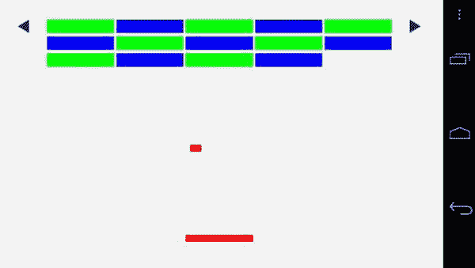
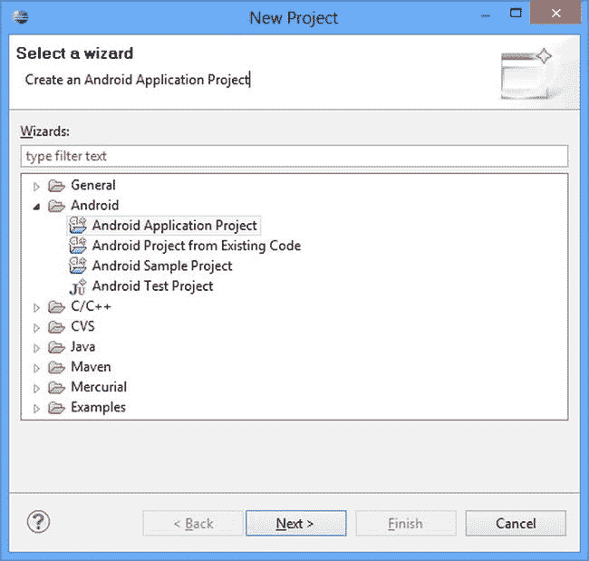
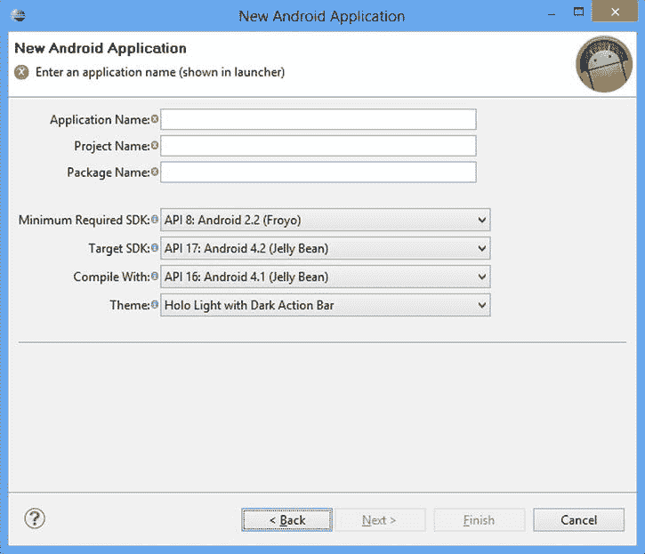
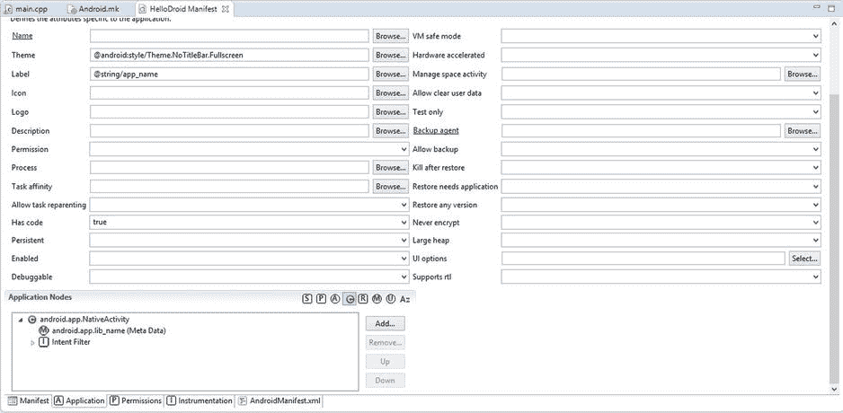

第二章

Android 游戏开发生态系统简介

在我们简要介绍了电子游戏的历史之后，我们将看看如何迈出定义未来的第一步。Android 平台为我们提供了前所未有的跨平台开发工具和 3D 图形硬件。这使得它成为游戏开发入门的理想候选平台。你所需要的只是一台电脑，所以让我们开始吧。

Java 和达尔维克虚拟机

Java 编程语言由 Sun Microsystems 于 1995 年发布，目前由 Oracle 维护。这种语言的语法是基于 C 的，因此对于许多已经熟练使用 C 和 C++的程序员来说是很熟悉的。C++和 Java 的主要区别在于，Java 是一种托管语言，代码在 Java 虚拟机上执行。

Android 推出时，Java 是应用开发者唯一可用的语言选项。Android 开发人员没有使用 Java 虚拟机，而是编写了自己的实现，他们将其命名为 Dalvik。Dalvik 最初没有许多与其他成熟 Java 虚拟机相关的特性。一个特别值得注意的遗漏是实时(JIT)编译。由于 Java 是一种在虚拟机中运行的托管语言，代码不是直接编译成本机 CPU 指令，而是编译成虚拟机可以使用的字节码。使用 JIT，虚拟机可以在程序需要之前将字节码块编译成机器码，因此可以提高运行程序的速度。这些编译后的单元也可以被缓存，以备将来提高速度。Android 直到 2.2 版本才有这个功能。

很多游戏编程相关的底层 API，在 Android 平台上也仍然是用 C 实现的，比如 Open GL。Android 上的 Java 通过使用 Java 本地接口(JNI) 来支持这些 API。JNI 提供了一种机制，用于支持从 Java 虚拟机向本地库的函数调用传递参数，以及本地库向 Java 虚拟机返回值。

这为游戏开发者创造了次优的条件。Java 语言的托管性质意味着开发人员不负责游戏在其生命周期内的内存管理。虽然有许多理由说明这对普通应用来说可能是一件好事，但需要实时执行的游戏不能将内存分配和垃圾收集的控制权完全交给外部系统，这也增加了用 Java 调用某些函数的隐性成本。

在集合上使用迭代器时，可以发现一个隐藏成本的好例子。和许多其他 Java 对象一样，迭代器是不可变的。这意味着一旦你有了迭代器，它就不能被改变。当从当前迭代器移动到集合中的下一个位置时，Java 会分配一个新的迭代器，并在新的位置将其返回给调用者，同时将旧的迭代器标记为删除。最终，Dalvik 将调用垃圾收集器来释放所有孤立的迭代器，这将导致帧率明显下降，甚至导致游戏停止。这让我们想到了 C++和 NDK。

C++ 和NDK

谷歌发布了 Android 原生开发套件(NDK)，为开发者在 Android 上开发应用提供了另一种选择。第一个版本是为 Android 1.5 发布的，但不包含对 SDK(如 OpenGL ES)的必要支持。NDK 的修订版 5 是我认为第一个可行的游戏编程 NDK 版本。这个版本增加了支持`NativeActivity`和原生应用胶水库的能力，允许开发者完全用 C++编写 Android 应用，而不需要任何 Java。这是可能的，因为 NDK 的这一版本还通过 OpenGL ES 增加了对音频的支持，原生音频支持，对系统传感器(如加速度计和陀螺仪)的原生访问，以及对 app APK 包内文件存储的原生访问。

用 C++编写 Android 应用有很多好处。现有的开发人员可以将对该平台的支持添加到他们现有的 C++代码库中，而不需要为系统维护 Java 代码和 C++代码，新的开发人员可以开始为 Android 编写应用，然后可以移植到其他平台或同时为多个平台开发。

用 C++开发游戏不会没有挑战。由于 C++被编译成本机代码，Android 支持多 CPU 指令集，因此确保编写的代码编译和执行无误并符合预期变得非常重要。迄今为止，Android 支持以下功能:

*   手臂ˌ武器ˌ袖子ˌ装备
*   ARM v7a
*   每秒百万条指令
*   x86

市场上有支持这些指令集的设备。由于 Java 编译成字节码并在虚拟机上运行，这对 Java 开发人员来说是透明的。在撰写本文时，NDK 工具集还不像 Java 工具集那样成熟，与 Eclipse IDE 的集成也有点复杂和麻烦，尤其是在代码完成、构建和调试功能方面。

尽管有麻烦和缺点，用 C++在 Android 上开发的性能优势仍然超过了使用 NDK 工具集的缺点，希望这些工具的成熟度和功能性只会随着时间的推移而提高。既然你已经看到了在游戏开发方面 C++相对于 Java 的优势，那么看看 Android 生态系统中这两种语言共有的一些问题是很重要的。这些问题并不完全是新的，在 PC 开发的 OpenGL 和 DirectX 领域已经遇到、处理和解决了很多年；然而，这些考虑对于许多手机开发者来说是新的。这些问题被归为一类，而“碎片化”这个术语被创造出来以包含所有这些问题。

碎片化和 Android 生态系统

对于 Android 平台上的碎片化对不同的人意味着什么，有很多观点和不同的定义。我会纯粹从游戏开发的角度来看问题。

安卓版本

从开发的角度来看，第一个问题是选择一个我们希望作为最低目标的 Android 版本。正如我在上一节中所讨论的，NDK 的许多基本特性都是在修订版 5 中添加的。NDK r5 支持 Android API level 9，在撰写本文时，Android 开发者仪表板显示，在过去 14 天内访问 Google Play 的 Android 设备中有 86.6%支持该版本；13.4%可能是一个相当大的市场，你可能不愿意放弃你的潜在客户群。为了便于开发，我决定不支持这个不断下降的 Android 版本比例是可以接受的。所以，明确一点，这本书会针对 Android API level 9。

屏幕分辨率和长宽比

下一个经常讨论的碎片问题是屏幕分辨率和纵横比。这是我从未完全理解的争论的一个方面。在过去的几十年里，游戏已经被编写为支持多种分辨率和宽高比。这是 PC、Xbox 360 和 PS3 以及之前开发过跨平台游戏的开发者的常见需求。早期版本的 iOS 设备支持相同的分辨率或多个分辨率，并保持相同的长宽比，这不太方便，但现在也不再是这样了。我们将在开发游戏时考虑多种屏幕分辨率和宽高比。

输入设备支持

另一个细分领域是对输入设备的支持。一些 Android 设备支持单点触摸，一些支持不同程度的多点触摸。有些有精确的传感器；有些根本没有这些传感器。最好的方法是设计你想制作的游戏，它支持可接受数量的设备。如果你的设计不需要多点触控支持，你将获得更广泛的受众，但如果有了这种支持，游戏会明显更好，那么就不值得降低你的工作质量，并通过支持不允许最佳体验的设备来损害销售。另一种选择是在可能的情况下提供多种控制方案，并在运行时选择使用哪一种。

绘图处理器

碎片化的最后一个主要领域是使用GPU。Android GPU 领域有四个主要参与者，更高级的图形编程技术会遇到一些问题，其中一些对某些 GPU 不是最佳的，或者根本不支持。例如，它们对纹理压缩格式都有不同的支持，但是这些问题超出了本书的范围。

我们的第一款安卓游戏

在消化了所有关于游戏、开发和 Android 平台的信息之后，现在是看一个小游戏例子的好时机。这个游戏是一个基本的*突破*克隆。您可以使用屏幕上的左右箭头来控制踏板。[图 2-1](#Fig1) 是在 Galaxy Nexus 上运行的游戏截图。



[图 2-1](#_Fig1) 。你好，克隆人越狱

部分代码相当复杂，将在后面的章节中讨论；其中一些代码涉及设置 Open GL、轮询 Android 系统事件和处理用户输入。《突围》是编写我们自己的游戏的伟大的第一次尝试，因为它融合了大型游戏的几个关键概念。

*   首先，有一个由用户控制的玩家实体，即球拍。
*   按钮中有一个基本的用户界面来控制踏板。
*   球和块中存在基本的非玩家实体，这也导致我们必须考虑实时碰撞检测和响应。

尽管相对原始的图形和简单的游戏机制，这是一个很好的练习，创造一个完整的游戏体验，这真的不是很久以前，当游戏并不比我们在接下来的几个部分创造的更多。

为了实现我们的目标，你需要完成为 Android 组织、编写和构建游戏所需的步骤。您将使用 Eclipse 将游戏组织到一个项目中，使用 NDK 编写代码，并使用 NDK 构建过程构建游戏。

创建新的 Eclipse 项目

Eclipse 是 Android 开发的首选 IDE。Google 的 Android 团队提供了一个 Eclipse 版本，其中捆绑了适用于所有平台的大多数 Android 工具。关于如何获得该 IDE 的最新信息可以从`http://developer.android.com/sdk/index.html`获得。

NDK 是一个单独的下载，经常更新。有关最佳安装说明，请访问`http://developer.android.com/tools/sdk/ndk/index.html`。

一旦你为你选择的平台下载、安装并配置了这些，就该开始你的第一个 Android 游戏了。这个过程的第一步是创建一个新项目。

1.  通过设置首选项中的选项，确保 Eclipse IDE 知道 NDK 在您的计算机上的位置。您可以通过打开窗口➤偏好设置，然后导航到 Android ➤ NDK 并设置进入 NDK 位置的适当路径来找到该选项。
2.  Start the New Project wizard (see [Figure 2-2](#Fig2)) from the File ➤ New ➤ Project menu.

    

    [图 2-2](#_Fig2) 。“新建项目”对话框

3.  From here, select the **Android Application Project** and click **Next**. The New Android Application box as shown in [Figure 2-3](#Fig3) should be shown.

    

    [图 2-3](#_Fig3) 。新的 Android 应用对话框

4.  在新建 Android 应用对话框中，输入您的应用的名称；我选择了`HelloDroid`。当您输入应用名称时，项目名称将被自动填充，并且是 Eclipse 用来在项目浏览器中标识项目的名称。
5.  包名是 Android 生态系统使用的唯一标识符。它通常被分成由句点分隔的独立部分。第一部分通常是`com`，它将应用的开发者标识为一家公司。下一个条目通常是公司名称、个人名称或项目名称的派生词。对于我的例子，我使用了`beginndkgamecode`。最后一项通常是项目的名称。我最后的包名是`com.beginndkgamecode.hellodroid`。
6.  将**最低要求 SDK** 更改为 **API 9: Android 2.3(姜饼)**是对这些选项的另一个更改。
7.  一旦设置好这些选项，点击下一个的**。**
8.  在下一个屏幕上，取消选中**创建自定义启动器图标**和**创建活动**。如果你对项目的路径满意，点击**完成**。

您的项目现在应该存在于项目浏览器中，我们可以继续设置项目以支持 Android NDK。

添加 NDK 支持

给这个项目增加 NDK 的支持是一项简单的任务。

1.  右键单击项目浏览器窗口中的项目，并导航到 **Android Tools** 。选择**添加原生支持。。。从弹出菜单中选择**。
2.  现在将要求您为构建过程将生成的本机代码库提供一个名称。只要您的应用的名称合理地唯一，提供的名称就足够了。对名称满意后点击**完成**。

现在，在我们准备开始向项目添加代码之前，我们还需要做一些更改。

首先我们需要设置`NativeActivity`支持，这将允许我们在不添加任何 Java 代码的情况下创建应用。我们通过将`android.app.NativeActivity`节点添加到清单中来实现这一点。

1.  Open the `AndroidManifest.xml`file, which can be found in the project folder (see [Figure 2-4](#Fig4)).

    

    [图 2-4](#_Fig4) 。Eclipse Android 清单编辑器视图

2.  我们需要访问的选项可以在**应用**选项卡上找到，所以现在点击它(见[图 2-4](#Fig4) 的底部)。
3.  点击**主题**选择框旁边的**浏览**，选择**主题。从提供的选项中选择。这个选项通知我们的应用全屏运行，也隐藏了 Android 状态栏。**
4.  将**的 HasCode** 设置为真。这是确保我们的应用正确构建所必需的。
5.  点击**添加**按钮，可以在**应用节点**窗口旁边找到。选择**活动**，点击**确定**。
6.  在活动部分的**属性中，点击**名称**条目旁边的**浏览**。取消选中**显示来自项目'<项目名称>'的类，只显示**，并在过滤框中键入 **NativeActivity** 。选择`NativeActivity`类并点击**确定**。**
7.  对于**标签**，输入`@string/app_name`。
8.  为**屏幕方向**选择**横向**，以确保我们的游戏将始终在横向模式下运行。
9.  在**应用节点**窗口中点击**本地活动**节点，再次点击**添加**。输入**名称**为`android.app.lib_name`，输入**值**为`LOCAL_MODULE`名称，可以在项目`jni`文件夹的`Android.mk`文件中找到。
10.  在**应用节点**窗口中选择 **NativeActivity** 节点(这是最后一次，唷！)和**添加**一个**意图过滤器**。**通过选择**和**添加**菜单，将**动作**和**类别**添加到**意图过滤器**中。
11.  将**动作的名称**设置为`android.intent.action.MAIN`，将**类别的名称**设置为`android.intent.category.LAUNCHER`。

您的项目设置现在已经完成。我们现在可以继续 NDK 构建流程了。

NDK 建筑系统一览

NDK 提供了一个称为 ndk-build 的构建过程。这个过程读取特定于 Android 的 makefiles，其中包含了构建一个本地库所需的所有信息。

**注意**Android NDK 包含一个基于 Make 的构建系统。Make 是一个流行的程序构建工具，尤其是在基于 Linux 的操作系统中，它可以在称为 makefiles 的文件中指定构建程序的参数。Android NDK 有这些文件的修改版本，我们将在本书的各个章节中看到。

默认的 `Android.mk`文件，可以在`jni`文件夹中找到，将包含以下文本:

```java

LOCAL_PATH := $(call my-dir)

include $(CLEAR_VARS)

LOCAL_MODULE    := hellodroid
LOCAL_SRC_FILES := hellodroid.cpp

include $(BUILD_SHARED_LIBRARY)

```

这个基本的 makefile 只执行几个步骤。

1.  它为 makefile 设置本地构建路径，这允许它找到相对于自己路径的其他文件。
2.  然后它调用一个外部命令来清除先前设置的构建变量。
3.  它定义了要在`LOCAL_MODULE`变量中构建的库的名称和要在`LOCAL_SRC_FILES`变量中编译的源文件。
4.  为了包装文件，它调用命令，使构建系统执行构建过程，编译并链接代码。

修改构建文件

我们需要修改这个文件来添加使用 NDK 构建游戏所必需的外部库，这需要这些特性。关于可用库的更多信息可以在 NDK 的`docs`文件夹中的`STABLE-APIS.html`文件中找到。

首先，我们使用`LOCAL_LDLIBS`定义我们的应用需要加载的外部库。

```java

LOCAL_LDLIBS := -llog -landroid -lEGL -lGLESv2

```

这一行告诉构建系统，我们希望我们的应用能够使用 Android 现有的`log`、`android`、`EGL`和`GLESv2` (Open GL ES 2.0)库。由于这些是许多应用和 Android 操作系统本身共有的，所以它们是动态链接的。

我们还需要一个静态的 NDK 图书馆与我们的应用相联系。这个静态库叫做`android_native_app_glue`，它提供了我们需要的功能，使我们能够用 C++编写应用，而不需要使用任何 Java。我们通过使用以下代码行将它作为静态库包括在内:

```java

LOCAL_STATIC_LIBRARIES := android_native_app_glue

```

我们还有最后一行要添加到 makefile 中。这一行告诉构建系统将静态库导入到我们的应用中。

```java

$(call import-module, android/native_app_glue)

```

最终的`Android.mk`文件将如下所示:

```java

LOCAL_PATH := $(call my-dir)

include $(CLEAR_VARS)

LOCAL_MODULE    := hellodroid
LOCAL_SRC_FILES := hellodroid.cpp
LOCAL_LDLIBS := -llog -landroid -lEGL -lGLESv2
LOCAL_STATIC_LIBRARIES := android_native_app_glue

include $(BUILD_SHARED_LIBRARY)

$(call import-module, android/native_app_glue)

```

添加应用级构建选项

还有我们需要设置的应用级构建选项。这些被添加到一个名为`Application.mk`的文件中。这个文件不是作为 Eclipse 中默认项目设置的一部分创建的，所以您必须自己创建这个文件。你可以右击`jni`文件夹，从菜单中选择**新建** ➤ **文件**。将新文件命名为`Application.mk`,并输入下面一行:

```java

APP_PLATFORM := android-9

```

这一行通知 NDK，我们正在使用其库的 API level 9。这就是我们目前需要的全部内容，但是我们将在以后向这些文件中添加更多内容。

此时，您应该能够右键单击项目名称并选择**构建项目**。这应该在输出控制台中输出文本，希望没有错误。如果此时遇到任何错误，请尝试处理列表中的第一个错误，然后重试。许多错误会导致级联效应，通常修复第一个错误就会修复所有后续错误。如果错误被证明是顽固的，你应该从头开始重新检查，并尝试寻找代码、makefiles 和项目与本章提供的示例之间的差异。一旦您发现了修复问题中的错误的差异，请尝试对配置或代码进行试验，以熟悉错误、如何发现它们，以及更重要的是，如何修复它们。游戏开发人员并不是一贯正确的，学习如何破译由我们的工具(如编译器)产生的错误是一项需要培养的重要技能，也是你可能需要经常使用的技能。

启用调试

为调试支持设置构建是我们必须完成的下一个任务。

1.  右键单击项目，将鼠标悬停在**构建配置**上，并选择**管理**。
2.  在出现的窗口中选择**新**。将新配置命名为**调试**，并复制**默认**的设置；点击**确定**。在**管理配置**窗口中再次点击**确定**。
3.  再次右键单击项目并选择**属性**。导航到 **C/C++构建**菜单并切换到调试配置。取消勾选**使用默认构建命令**并将输入的行更改为:

    ```java
    ndk-build NDK_DEBUG=1

    ```

**注意**如果您有一台多核机器，并且想要利用系统中的额外处理器，您还可以添加选项`-jX`，其中`X`是要创建的作业数量。我在支持超线程的四核系统上使用选项`-j8`。

现在，您可以通过**构建配置** ➤ **设置活动**菜单在可调试构建和优化构建之间切换。

我们的项目设置已经完成，可以开始了；现在我们可以添加一些代码来制作一个游戏。

运行游戏

游戏的源代码可以在本书附带的 Chapter2.cpp 文件中找到，也可以从本书的网站`http://www.apress.com/9781430258308`获得。

您可以将该文件的内容直接复制到项目中的`cpp`文件中，并在您的设备上构建和运行游戏。

核心游戏功能存在于以下函数中:

```java

static void

enigine_update_frame(struct engine* engine)

{
        if (engine->touchIsDown)
        {
                if (engine->touchX < 0.15f && engine->touchY < 0.2f)
                {
                        engine->playerX -= 0.015f;
                        if (engine->playerX < PADDLE_LEFT_BOUND)
                        {
                                engine->playerX = PADDLE_LEFT_BOUND;
                        }
                }
                else if (engine->touchX > 0.85f && engine->touchY < 0.2f)
                {
                        engine->playerX += 0.015f;
                        if (engine->playerX > PADDLE_RIGHT_BOUND)
                        {
                                engine->playerX = PADDLE_RIGHT_BOUND;
                        }
                }
        }

        engine->ballX += engine->ballVelocityX;
        if (engine->ballX < BALL_LEFT_BOUND || engine->ballX > BALL_RIGHT_BOUND)
        {
                engine->ballVelocityX = -engine->ballVelocityX;
        }

        engine->ballY += engine->ballVelocityY;
        if (engine->ballY > BALL_TOP_BOUND)
        {
                engine->ballVelocityY = -engine->ballVelocityY;
        }

        if (engine->ballY < BALL_BOTTOM_BOUND)
        {
                // reset the ball
                if (engine->ballVelocityY < 0.0f)
                {
                        engine->ballVelocityY = -engine->ballVelocityY;
                }

                engine->ballX = BALL_START_X;
                engine->ballY = BALL_START_Y;

                engine_init_blocks(engine);
        }

        float ballXPlusVelocity = engine->ballX + engine->ballVelocityX;
        float ballYPlusVelocity = engine->ballY + engine->ballVelocityY;

        const float ballLeft = ballXPlusVelocity - BALL_HALF_WIDTH;
        const float ballRight = ballXPlusVelocity + BALL_HALF_WIDTH;
        const float ballTop = ballYPlusVelocity + BALL_HALF_HEIGHT;
        const float ballBottom = ballYPlusVelocity - BALL_HALF_HEIGHT;
        const float paddleLeft = engine->playerX - PADDLE_HALF_WIDTH;
        const float paddleRight = engine->playerX + PADDLE_HALF_WIDTH;
        const float paddleTop = engine->playerY + PADDLE_HALF_HEIGHT;
        const float paddleBottom = engine->playerY - PADDLE_HALF_HEIGHT;
        if (!((ballRight < paddleLeft) ||
                        (ballLeft > paddleRight) ||
                        (ballBottom > paddleTop) ||
                        (ballTop < paddleBottom)))
        {
                if (engine->ballVelocityY < 0.0f)
                {
                        engine->ballVelocityY = -engine->ballVelocityY;
                }
        }
 )
        bool anyBlockActive = false;
        for (int32_t i=0; i<NUM_BLOCKS; ++i)
        {
                block& currentBlock = engine->blocks[i];
                if (currentBlock.isActive)
                {
                        const float blockLeft = currentBlock.x - BLOCK_HALF_WIDTH;
                        const float blockRight = currentBlock.x + BLOCK_HALF_WIDTH;
                        const float blockTop = currentBlock.y + BLOCK_HALF_HEIGHT;
                        const float blockBottom = currentBlock.y - BLOCK_HALF_HEIGHT;
                        if (!((ballRight < blockLeft) ||
                                        (ballLeft > blockRight) ||
                                        (ballTop < blockBottom) ||
                                        (ballBottom > blockTop)))
                        {
                                engine->ballVelocityY = -engine->ballVelocityY;

                                if (ballLeft < blockLeft ||
                                                ballRight > blockRight)
                                {
                                        engine->ballVelocityX = -engine->ballVelocityX;
                                }

                                currentBlock.isActive = false;
                        }
                        anyBlockActive = true;
                }
        }

        if (!anyBlockActive)
        {
                engine_init_blocks(engine);
        }
}
)

```

代码中缺少注释反映了这样一个事实，即代码在其简单性方面应该是相当自文档化的。这个函数的第一部分是当玩家按下屏幕的左上角或右上角时，更新拨片的位置。

当 Android 通知 app 用户已将手指放在屏幕上时，函数`engine_handle_input` 中的`touchIsDown`被设置为`true`；当 Android 通知我们手指已经抬起时，它再次设置为`false`。

```java

if (engine->touchIsDown)
{

```

触摸坐标从左上角的 0，0 开始，到右下角的 1，1。下面的`if`检查告诉应用玩家是否在触摸左上角；如果是这样，我们将玩家的位置向左移动。一旦玩家到了我们允许的最左边，我们就把他们的位置固定在那个点上。

```java

                if (engine->touchX < 0.15f && engine->touchY < 0.2f)
                {
        engine->playerX -= 0.015f;
        if (engine->playerX < PADDLE_LEFT_BOUND)
        {
                engine->playerX = PADDLE_LEFT_BOUND;
        }
}

```

下一个测试做的完全一样，除了检查右上角的触摸，并把玩家移到右边。

```java

        else if (engine->touchX > 0.85f && engine->touchY < 0.2f)
        {
                engine->playerX += 0.015f;
                if (engine->playerX > PADDLE_RIGHT_BOUND)
                {
                        engine->playerX = PADDLE_RIGHT_BOUND;
                }
        }
}

```

下一部分更新球的位置。

第一条线以水平速度水平移动球。

```java

engine->ballX += engine->ballVelocityX;

```

如果球移出屏幕的左侧或右侧，该测试将反转球的行进方向。

```java

if (engine->ballX < BALL_LEFT_BOUND || engine->ballX > BALL_RIGHT_BOUND)
{
        engine->ballVelocityX = -engine->ballVelocityX;
}

```

这段代码做了同样的事情，但是是针对垂直方向的，并且只针对屏幕的顶部进行测试。

```java

engine->ballY += engine->ballVelocityY;
if (engine->ballY > BALL_TOP_BOUND)
{
        engine->ballVelocityY = -engine->ballVelocityY;
}

```

这个代码检查玩家是否允许球落在屏幕的底部。如果球离开了底部，我们将球重置到它的起始位置，确保它在屏幕上向上移动，并重新启用所有的块。

```java

if (engine->ballY < BALL_BOTTOM_BOUND)
{
        // reset the ball
        if (engine->ballVelocityY < 0.0f)
        {
                engine->ballVelocityY = -engine->ballVelocityY;
        }

        engine->ballX = BALL_START_X;
        engine->ballY = BALL_START_Y;

        engine_init_blocks(engine);
}

```

下一段代码是通过对两个矩形进行重叠测试来检查玩家是否成功击球。

首先我们得到球的 x 和 y 坐标加上当前速度。这允许我们确定下一帧是否会有碰撞，并允许我们做出相应的反应。

```java

float ballXPlusVelocity = engine->ballX + engine->ballVelocityX;
float ballYPlusVelocity = engine->ballY + engine->ballVelocityY;

```

然后我们计算球的边界矩形的边缘位置。

```java

const float ballLeft = ballXPlusVelocity - BALL_HALF_WIDTH;
const float ballRight = ballXPlusVelocity + BALL_HALF_WIDTH;
const float ballTop = ballYPlusVelocity + BALL_HALF_HEIGHT;
const float ballBottom = ballYPlusVelocity - BALL_HALF_HEIGHT;

```

对桨做同样的操作:

```java

const float paddleLeft = engine->playerX - PADDLE_HALF_WIDTH;
const float paddleRight = engine->playerX + PADDLE_HALF_WIDTH;
const float paddleTop = engine->playerY + PADDLE_HALF_HEIGHT;
const float paddleBottom = engine->playerY - PADDLE_HALF_HEIGHT;

```

然后，我们使用 if 测试来确定两者是否重叠。测试的简单英语示例如下:

*   如果球的右边缘在球拍左边缘的左边，那么我们没有重叠。
*   或者如果球的左边缘比球拍的右边缘更靠右，那么我们没有重叠。
*   或者，如果球的底部边缘高于桨的顶部边缘，那么我们没有重叠。
*   或者，如果球的顶部边缘低于桨的底部边缘，那么我们没有重叠。
*   如果这些测试都不是真的，那么我们就重叠了。

```java

if (!((ballRight < paddleLeft) ||
                (ballLeft > paddleRight) ||
                (ballBottom > paddleTop) ||
                (ballTop < paddleBottom)))
{
        if (engine->ballVelocityY < 0.0f)
        {
                engine->ballVelocityY = -engine->ballVelocityY;
        }
}

```

这种重叠矩形算法可能会非常混乱，虽然此时的插图可能有助于澄清这一点，但我建议坐下来用笔和纸或剪下两个矩形，并在不同的场景中工作，直到它有意义为止。你也可以编辑代码来降低球的速度，并尝试解决运行游戏的机制。在游戏开发生涯中，对碰撞和可视化几何的牢固掌握将会派上用场。

然后我们循环所有的方块，并分别在球和每个方块之间进行相同的测试。

第一个`bool`用于跟踪我们是否还有剩余的块。我们最初将其设置为`false`。

```java

bool anyBlockActive = false;

```

然后我们循环遍历这些块。

```java

for (int32_t i=0; i<NUM_BLOCKS; ++i)
{
        block& currentBlock = engine->blocks[i];

```

我们检查该块是否仍处于活动状态:

```java

if (currentBlock.isActive)
{

```

然后计算矩形的边界边缘

```java

const float blockLeft = currentBlock.x - BLOCK_HALF_WIDTH;
const float blockRight = currentBlock.x + BLOCK_HALF_WIDTH;
const float blockTop = currentBlock.y + BLOCK_HALF_HEIGHT;
const float blockBottom = currentBlock.y - BLOCK_HALF_HEIGHT;

```

而如果球和块重叠。

```java

if (!((ballRight < blockLeft) ||
                (ballLeft > blockRight) ||
                (ballTop < blockBottom) ||
                (ballBottom > blockTop)))
{

```

我们反转球的垂直方向。

```java

engine->ballVelocityY = -engine->ballVelocityY;

```

这个测试决定了球是从左边还是右边击中了木块。如果球的左边缘比木块的左边缘更靠左，那么球一定是从左侧来的。我们可以算出，在类似的情况下，球是否是从右边击中的。

```java

if (ballLeft < blockLeft ||
                ballRight > blockRight)
{

```

如果球从侧面击出，我们逆转它的水平速度。

```java

        engine->ballVelocityX = -engine->ballVelocityX;
}

```

我们将该块设置为非活动状态。

```java

        currentBlock.isActive = false;
}

```

如果该块在这一帧是活动的，我们将 `anyBlockActive`设置为`true`。

```java

                anyBlockActive = true;
        }
}

```

一旦所有的积木都被破坏了，我们就重置它们，继续游戏。

```java

if (!anyBlockActive)
{
        engine_init_blocks(engine);
}

```

摘要

恭喜你:现在，你可以设置、构建和运行你的第一个 Android NDK 游戏应用了。它可能缺少许多专业头衔的精致特征，但它仍然涵盖了所有的基本要素。我们已经初始化了图形库，轮询了 Android 事件，处理了输入，并创建了一个游戏循环来逐帧更新和呈现游戏状态。

现在我们可以从头开始构建一个商业质量的游戏。