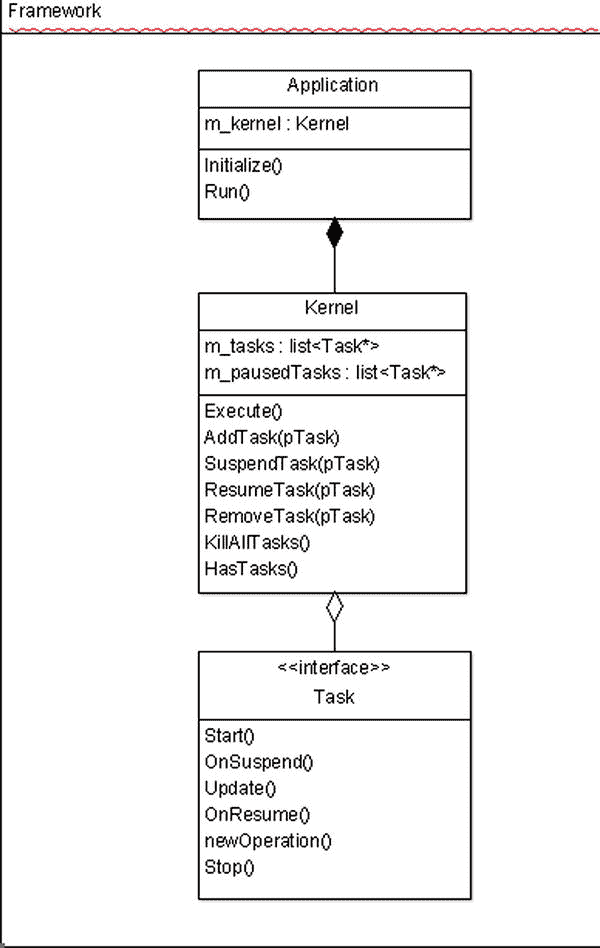

第三章

新手游戏设计:Droid Runner

开发一个视频游戏通常是一群人的合作努力。通常有艺术家、设计师、程序员和制作人员从游戏开发周期的开始一直参与到结束。也有可能你会把你的想法推销给第三方，可能是平台持有者或出版商，为你的作品获得资金或营销支持。

在所有这些情况下，在员工之间保持良好的沟通是至关重要的，以确保你的作品按计划制作。在开发的初始阶段，这种交流的中心焦点是游戏设计文档。

由于文档在游戏开发中是如此重要的一个支柱，所以在我们开始写代码之前，我们先来看看如何写我们自己的文档。

设计文档介绍

设计文档有几种不同的用途。首先，它们包含了游戏的功能规范。这个功能规范从用户的角度详细描述了游戏世界、机制和游戏系统。它有助于确定游戏将如何进行，以及游戏的不同部分如何结合起来创造用户体验。

设计文件的第二个目的是技术规格。技术设计部分将更详细地描述游戏的某些方面将如何实现。这在实现游戏时会很有用，因为它可以提供不同系统如何相互接口的高级概述。至少有一个粗略的规格来帮助安排开发也是很重要的。如果你在时间和预算有限的商业环境中开发游戏，尝试创建一个准确的时间表是至关重要的。

包含设计不同方面的多个文档并不少见，但是对于我们的小游戏来说，一个文档就足够了。第一个必需的部分是概述。

创造一个世界，讲述一个故事，并设置场景

每个游戏都需要讲一个故事。这个故事，无论多么详细，都有助于在玩家内部创造一种紧迫感和共鸣感，并可以将一系列机制转化为引人入胜的体验。即使是最早成功的游戏也设法讲述了一个故事:*大金刚*由任天堂于 1981 年发行，讲述了飞人试图从巨猿手中救出公主的故事。*吃豆人*的故事是关于玩家和人工智能之间的关系。四个鬼魂中的每一个都试图以自己的方式抓住吃豆人，直到玩家收集到一个能量球，桌子被翻转，然后鬼魂从吃豆人那里逃跑。讲故事的力量显而易见，开发者甚至给鬼魂起了独特的名字:Blinky、Pinky、inky 和 Clyde。

随着游戏技术的进步，现代游戏变得越来越受故事驱动。家用游戏机和电脑游戏现在通常是由参与好莱坞电影的作家编写的。大型游戏发行商已经以类似的方式编写和开发了面向 Android 等移动平台的游戏，虽然这超出了大多数小型开发者的能力，但故事感和旅程感仍然很重要。

我们的背景故事将在概览中介绍，我们真的不需要为我们的简单游戏添加任何内容。我们应该做的是牢记我们的故事，并确保我们添加到游戏中的一切都符合我们希望描绘的狭隘主题。对于我们的游戏来说，这是一个试图逃离一个我们被囚禁并且没有权力的地方的主题。

*Droid Runner* 设计概述

在接下来的章节中，我们将介绍游戏设计文档的不同部分。这个例子涵盖了我们向他人完整描述我们的游戏所需的最少部分。在设计游戏时，没有一套硬性的规则可以遵循。这有一定的意义，因为每个游戏都是不同的，没有两个文档可能包含相同的信息并描述完全不同的游戏设计。我们将从游戏概述开始。

第 1 部分-游戏概述

> *Droid Runner 是一款* *侧滚游戏，玩家自动在屏幕上从左向右移动。游戏中的主角是 Droid，一个绿色的机器人，他正试图逃离一个被利用为工具的环境。在周围巡逻的红色安全机器人会阻止机器人离开，如果他们设法抓住他的话。环境包含不同的障碍，Droid 必须克服这些障碍才能到达出口。*

上面的简短概述为*机器人信使*设定了基本场景。它有助于展示谁是玩家，以及谁是试图阻止玩家实现其目标的对手。由于我们正在使用一个新的平台创建我们的第一个游戏，这是一个我们将致力于创建的游戏的充分概述。接下来的部分将涵盖游戏的细节。

定义游戏和机制

设计文档的游戏性部分应该包括玩家在游戏中将要执行的动作的描述。这一部分分为游戏结构的高层次概述和将用于创建高层次体验的游戏机制的更详细分析。更复杂的游戏会有游戏发生的不同关卡的描述，对于带有角色扮演元素的游戏，技能系统的描述也会在这里找到。

第 2 部分-游戏性和机制

第 2.1 节-游戏性

> 一个关卡将从左向右前进，没有垂直移动。随着镜头的移动，玩家将会接触到敌人的角色以及他必须避开的障碍物。游戏的核心乐趣体验将通过设计关卡来创建，这些关卡以一种向玩家呈现挑战的方式来放置敌人和障碍，随着玩家在关卡中的前进，挑战的难度会增加。
> 
> 玩家将通过到达关卡最右端的目标区域来完成关卡。
> 
> 游戏结束场景 *将由玩家接触到障碍物或敌方机器人而触发。*

第 2.2 节-力学

第 2.2.1 节-运动

> 玩家会自动从左向右移动。玩家移动的速度将被调整到一个合适的速度，以确保挑战是通过障碍和敌人的定位来呈现的，这既不太容易也不太困难。
> 
> 玩家可以在代表关卡高度 33%的高度跳跃。向上和向下的速度将是对称的，以便提供一致的和可预测的跳跃行为。落地跳跃和开始另一个跳跃之间不会有延迟，因为游戏依赖于反应灵敏的控制和时机来创造紧张感和乐趣。跳跃的速度应该在最高点附近减慢，以创造一个漂浮的区域，让玩家有能力先发制人地跳过障碍，并利用时间优势。

第 2.2.2 节-障碍

> 板条箱——这一关将包含堆叠的板条箱，玩家必须跳过去或跳到上面。板条箱将是方形的，障碍将通过并排放置板条箱或一个放在另一个上面来创建。所有板条箱将具有相等的尺寸，边长等于屏幕高度的 25%。这将使玩家能够轻松地跳过 33%高度的箱子。
> 
> 敌人——这一关将包含敌人的机器人，它们将在两点之间沿着设定的路径前进。这些路径将是线性的，无论是垂直的还是水平的。水平路径不应覆盖 720p 屏幕可视宽度的 75%。垂直路径可以覆盖标高的整个高度。敌人将以比玩家水平速度稍慢的速度移动。这将允许玩家移动过去的敌人，只关心来自右边的新敌人。

第 2.2.3 节-皮卡

> *玩家将能够获得一个无敌皮卡，让他们能够* *穿过障碍和敌方玩家，而不会触发游戏结束的场景。*

关卡设计

许多游戏新手都在寻找一套关于如何构建关卡的完美规则。从我的经验来看，这样的一套规则是不存在的。如果这样的一套规则确实存在，我们可能会在不同游戏的水平变得非常相似的情况下结束，因为它们是根据相同的公式设计的，但那些水平可能不适合正在开发的游戏。这就是为什么我觉得关卡设计没有严格的规则的症结所在:每一个游戏都力求有稍微不同的机制，因此也有稍微不同的设计考虑。在为游戏设计关卡时，可以考虑一些关卡设计的原则。

踱

我认为关卡设计的首要原则是速度。当构建一个跨越多个关卡的完整游戏时，重要的是要考虑你多久引入一次新的游戏机制，然后在这个世界中使用这些机制。

《塞尔达传说》游戏提供了一个经典的使用节奏提升游戏难度的蓝图。一种新的武器被引入，将会有一个小任务需要完成，由武器提供的新能力来指导玩家如何使用它。接下来将会有一场 boss 遭遇战，这需要新的能力来完成地下城并在故事中前进。玩家将能够进入外部世界的新地图区域，这些区域以前是无法进入的，而且通常比以前进入的区域更困难。

游戏还可以使用强度的节奏来吸引玩家。持续一段时间的高强度水平可能会导致球员变得紧张。如果这种压力被视为困难，那么许多玩家会感到不知所措，并决定停止玩游戏。你应该争取的是节奏的变化，以创造一种兴趣感。玩家在高强度、高参与度的阶段之后应该保持相对的平静。这将会给球员一个机会恢复和重新获得一些冷静。在开始时，游戏可以有较长时间的平静和短时间的高强度爆发，而一旦玩家有经验并需要更高水平的挑战，游戏就会接近尾声。

我们将尝试使用障碍的复杂性和 AI 角色在我们关卡中的位置，在玩家需要快速连续点击屏幕以清除区域和低水平输入的时间段之间交替，这将表示平静。接近关卡末尾时，相对平静的时段可能与关卡早期的高强度区域一样强烈，但是玩家应该更有经验，因此在接近关卡末尾时这些区域的关卡压力会更小。

美学

关卡的美感对于向玩家传达设定和主题是至关重要的。如果一个游戏的一个区域让玩家感觉强烈，这取决于游戏的类型，如果处理得当，美学将有助于传达这种强烈的感觉。

美学也可以用来带领玩家通过一个关卡。一般来说，设计师希望玩家通过关卡的路径会在关键点使用明亮的灯光照亮。如果你发现自己迷失在第一人称射击游戏中，比如*光晕 4* ，花一点时间站着不动，环顾四周寻找任何路径开口或门，看起来它们可能被照亮得更亮或与其他颜色不同；很有可能这是你应该走的路。将秘密放置在较暗的区域也使得它们不太可能被下意识地沿着指引的路径前进的玩家发现，因此值得奖励给那些探索人迹罕至的区域的玩家。

规模

关卡的等级对于决定建造时间是很重要的。每个人都想要一个没有限制范围的游戏。像*天际*这样的 RPG 以其规模而闻名。规模不是免费的，你游戏的范围将与你关卡的规模紧密相连，反之亦然。

更大的级别通常需要大量的游戏机制来确保它们保持引人入胜。如果要求玩家一遍又一遍地重复完全相同的挑战，大型关卡会很快变得重复和乏味。对于可用机制的数量来说也很小的等级也可能意味着玩家可能无法使用他们被提供的一些最引人注目的功能，从而损害了游戏的感知质量。

关卡的规模也受到游戏目标硬件的影响。一个电脑游戏可以使用几千兆字节的内存，并且可以一次在内存中存储大量的数据。另一方面，Playstation 3 只有 256MB 的系统内存，因此只能存储更小级别的数据和其中包含的对象。诸如此类的问题将依赖于我们在下一节中看到的技术需求。

技术要求

技术需求文档详细说明了将用于创建游戏的底层系统的工程规格。该文档很少包含实现细节，而是给出了这样一个系统应该如何工作、要使用的算法以及允许不同系统通信的接口的概述。

写需求文档有几个重要的原因。这首先是为了团队沟通，这是相关的，即使你正在自己开发一个游戏，与你未来的自己沟通你所设想的系统如何与框架中的其他系统集成。

另一个是用于调度。有了经验，您将开始了解在编写需求文档时，实现一个给定的系统需要付出多少努力。这反过来将导致更好的预算和计划，这是构建商业上成功的游戏的一个重要方面。

给定系统的技术需求应该定义系统将向外界公开的接口。花时间设计接口将允许您理解数据将如何流入和流出系统，并将有助于识别任何高耦合和低内聚的区域。一旦开发已经开始，在设计时识别这些属性所在的区域有助于避免代价高昂的重构。

统一建模语言创建于 20 世纪 90 年代，旨在帮助技术作家可视化他们的面向对象设计。已经编写了一些软件来帮助构建你的系统模型，图 3-1 中的例子是用 ArgoUML 创建的。这个设计是为`Kernel`和`Task`系统设计的，我们将在本书稍后使用它们来创建我们的游戏循环。

[图 3-1](#_Fig1) 。核心 UML 类图

技术文档可以包含您认为必要的或多或少的文档；但是，需要注意的是，人们普遍认为，花在规划上的时间越多，花在实施上的时间就越少。实现系统通常是软件开发中花费最多时间和金钱的过程，所以任何有助于缩短这个周期的东西都是受欢迎的。在开始任何开发之前，没有必要编写所有的文档。使用像敏捷这样的开发方法意味着文档会随着你的进展而不断充实；然而，提前计划一些工作仍然是一个好主意，以确保系统接口对于手头的工作是足够的。

编写好的文档需要经验，在这一点上，我们对 Android 系统没有什么经验。对于你来说，为我们在接下来的章节中将要实现的系统写一些技术文档是一个很好的练习。撰写技术文档可能是一个令人生畏的前景和一项艰巨的任务。网站上提供了一些示例文档，以及本书中使用的示例的源代码。

摘要

本章介绍了通常称为生产前阶段的设计文档。这是开发阶段，原型被创建，头脑风暴会议发生，游戏的外观和感觉被研究出来。

我们已经看到将设计分成两个独立的部分是有用的；一个涵盖游戏性、逻辑和故事，另一个涵盖将用于创建远景的技术。这本书的其余部分将着眼于这两个部分同时向前发展。我们将从头开始构建游戏，首先创建一个游戏循环，与 Android 操作系统通信，然后初始化 OpenGL，然后从第 2 节开始学习更多以游戏逻辑为中心的代码。

我们将在下一章开始着手创建一个基于任务的游戏循环，并将 Android 本地应用 glue 事件轮询封装到一个任务中。