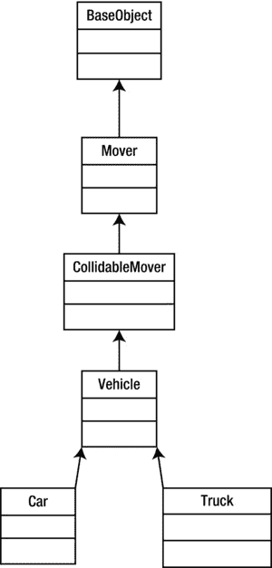

# 六、游戏实体

所有的游戏都是由不同的对象和这些对象的行为方式组成的。吃豆人拥有吃豆人本人、幽灵、吃豆点、能量球和墙壁等物品。这些对象中的每一个都有不同的行为。吃豆人对玩家的输入做出反应，通过吃能量球可以从猎物变成捕食者。这改变了鬼魂的行为，它们被置于一种逃离玩家的状态。

我们的游戏需要一组更简单的行为，但我们将使用最先进的方法来构造对象，以感受现代游戏是如何构造游戏对象的。传统上，游戏对象是用一个普通的类层次结构构建的，从一个基类开始，在每一层中添加专门化，直到我们有了一个在游戏中可用的类。这种方法的问题是不灵活。一旦游戏达到合理的复杂程度，添加新的类型会变得特别困难。还可能存在与菱形继承相关的问题，特定的对象不能很好地适应层次结构，导致理论上应该很简单的对象构造过于复杂。

今天，现代游戏架构更有可能使用基于组件的系统来构建。在这一章中，我们将看看如何使用这样的系统来构造对象。

我们还将看到一个事件系统，它将允许我们告诉游戏对象关于游戏事件的信息，然后他们可以对这些事件做出反应。这又是一个非常有用的现代系统，允许对象选择他们感兴趣的事件。以前，生成事件的系统负责通知它认为可能需要做出反应的每个对象。

最后，我们将继续实现玩家和 AI 对象，它们将在我们的游戏中使用。

什么是游戏实体？

游戏实体是一个非常简单的概念。游戏世界中存在的任何物体都是一个实体。从汽车到人，爆炸桶，电源和射弹，如果对象是一个需要在游戏世界中建模以对游戏产生影响的对象，它就是一个实体。

对于初学游戏的程序员来说，有些实体可能不太清楚。这些是世界上必须存在的物体，但不一定是可见的。灯、照相机、触发盒和声音发射器都可以是属于这一类别的游戏对象的例子。图 6-1 显示了车辆的传统等级体系。



图 6-1 。车辆对象层次结构

我们将有一个名为`GameObject`的类，而不是使用这个类的层次来定义我们将在游戏中使用的对象的类型。复杂对象将通过向该对象添加组件来构建。我们将在本章的后面看一下我们将需要什么类型的组件；目前，清单 6-1 显示了`GameObject`类。

***清单 6-1。*** 游戏对象类

```cpp
class GameObject
{
       template <class T>
       friend T* component_cast(GameObject& object);

       template <class T>
       friend T* component_cast(GameObject* pObject);

private:
       typedef std::tr1::unordered_map<unsigned int, Component*>    ComponentUnorderedMap;
       typedef ComponentUnorderedMap::iterator            ComponentUnorderedMapIterator;
       ComponentUnorderedMap                              m_components;

       template <class T>
       T*    GetComponent() { return static_cast<T*>(GetComponent(T::GetId())); }

       Component*    GetComponent(unsigned int id);

public:
       GameObject();
       ∼GameObject();

       template <class T>
       bool AddComponent();
};

```

清单 6-1 包含了我们到目前为止看到的一些最复杂的代码，所以我们将一行一行地浏览。C++ 中的关键字`friend`用于允许其他类或函数调用属于该类实例的私有方法。在我们的例子中，我们定义了一个名为`component_cast`的方法，它将被用来把一个对象转换成一个指向组件类型的指针。为了方便起见，`component_cast`方法 被重载以获取指向`GameObject`的指针或引用，这样我们就不需要在整个代码库中取消对指针的引用。这些方法也被模板化，这样我们就可以使用模板语法来指定要将对象转换成哪种类型的组件。

然后我们可以看到一个`typedef`表示一个`unordered_map`的`Component`指针，另一个表示一个 map 类型的迭代器。

模板方法 `GetComponent`是从`friend component_cast`函数中调用的方法，我们将在清单 6-2 中快速查看。这个方法调用`GetComponent`的非模板化版本，并从模板类型传递从`static GetId`方法获得的 id。如果通过模板作为类型传递的类不包含`static GetId`方法，我们将在编译时得到一个错误。

然后，在声明另一个用于向对象添加组件的模板化方法之前，我们声明我们的构造函数和析构函数。

清单 6-2 显示了重载`component_cast`方法的函数定义。

***清单 6-2。*** 组件 _ 铸件

```cpp
template <class T>
T* component_cast(GameObject& object)
{
       return object.GetComponent<T>();
}

template <class T>
T* component_cast(GameObject* pObject)
{
       T* pComponent = NULL;
       if (pObject)
       {
           pComponent = pObject->GetComponent<T>();
       }

       return pComponent;
}

```

这两种方法的主要区别在于，基于指针的版本在对传递的对象调用`GetComponent`之前会检查指针是否不为空。对于熟悉 C++ cast 类型如`static_cast` 的程序员来说，这种为`GameObject`包含的`Component`对象实现访问器的方法将会非常熟悉。实际中的代码看起来像清单 6-3 中的所示。

***清单 6-3。*** 组件 _cast 用法举例

```cpp
ComponentType* pComponent = component_cast<ComponentType>(pOurObject);

```

当我们在本章后面讨论*机器人跑垒员*的`Component`实现时，我们会更多地关注这一点。

清单 6-4 显示`GetComponent` ，这是一个简单的方法。

***清单 6-4。*** GetComponent

```cpp
Component* GameObject::GetComponent(unsigned int id)
{
       ComponentUnorderedMapIterator result = m_components.find(id);
       return result == m_components.end()
              ?      NULL
              :      result->second;
}

```

我们的`map`使用每个`Component`的 id 进行键控，所以我们可以通过简单地调用`find`并把 id 作为参数传递来从`map`中检索一个`Component`。

清单 6-5 中的所示的`AddComponent`方法 正如它的名字所暗示的那样:它给我们的对象添加了一个组件。

***清单 6-5。*** AddComponent

```cpp
template <class T>
bool GameObject::AddComponent()
{
       bool added = false;

       ComponentUnorderedMapIterator result = m_components.find(T::GetId());
       if (result == m_components.end())
       {
              T* pNewComponent = new T(this);

              if (pNewComponent)
              {
                     std::pair<unsigned int, Component*> newComponent(
                            T::GetId(),
                            pNewComponent);
                     std::pair< ComponentUnorderedMapIterator, bool> addedIter =
   m_components.insert(newComponent);
                     added = addedIter.second;
              }
       }

       return added;
}

```

首先，它调用 m_ `components` 上的`find`来检查我们是否已经将这种类型的`Component`添加到对象中。如果`Component`在`unordered_map`中还不存在，我们创建一个通过模板参数传递的类类型的新实例。对指针的有效性检查将有助于防止我们的代码在没有创建对象的情况下崩溃。`new`通常在内存不足的情况下会失败，所以如果失败了，我们很可能会看到很糟糕的事情发生。

为了给`unordered_map`添加一个元素，我们需要创建一个`std::pair`。我们的`pair`在键(在我们的例子中是由`T::GetId()`返回的值)和指向新创建组件的指针之间创建一个映射。`m_components.insert`以传递的`pair`作为参数被调用。`insert`返回另一个`pair`，由一个`iterator`到`map`和一个`bool`组成。如果新的`Component`被成功添加到`map`中，`bool`的值将为`true`。

`GameObject` 中最后一个注意的方法是析构函数。我们在的清单 6-6 中看看这个。

***清单 6-6。*** 游戏对象:*游戏对象

```cpp
GameObject::∼GameObject()
{
       for (ComponentUnorderedMapIterator iter = m_components.begin();
            iter != m_components.end();
            ++iter)
       {
             Component* pComponent = iter->second;
              if (pComponent)
              {
                     delete pComponent;
                     pComponent = NULL;
              }
       }
}

```

`GameObject`的析构函数有一个简单的工作:它遍历`m_components unordered_map`并删除每个添加的`Component`。

组件的基类是一段简单的代码，如清单 6-7 所示。

***清单 6-7。*** 组件声明

```cpp
class Component
{
private:
       GameObject*    m_pOwner;

public:
       explicit Component(GameObject* pOwner)
              :      m_pOwner(pOwner)
       {
       }

       virtual ∼Component()    {}

       virtual void Initialize()    = 0;

       GameObject* GetOwner() { return m_pOwner; }
};

```

如您所见，`Component`将只包含一个指向其所有者的指针和一个纯虚拟初始化方法。`GetOwner`方法稍后会有用，因为它允许`Components`访问它们所属的`GameObject`，并在必要时使用`component_cast`访问其他的`Components`。

既然我们已经有了一个封装我们的对象的类和一个组件的基本接口，我们应该看看将用于与对象通信的事件系统。

通过事件与游戏对象通信

与对象通信的正常过程是调用组成类的方法。这要求我们有一个合适的进程来访问对象，并且我们知道在该对象上调用哪些方法。如果我们需要在多个对象上调用同一个方法，我们会增加代码的复杂性，因为我们需要一个方法来收集我们将要调用的所有对象。随着游戏项目的增长，这些任务变得越来越难以正确管理，需要适当的规划和管理来确保它们不会消耗太多时间。

我们可以通过切换到基于事件的系统来避免所有这些问题。当我们希望对象执行一项任务时，我们不需要调用每个类的方法，而是简单地广播一条事件消息。订阅它们希望被通知的事件是其他对象的责任。真的就这么简单。

事件类

首先，我们来看看封装了一个`Event`的类。代码可以在清单 6-8 中看到。

***清单 6-8。*** 事件宣言

```cpp
typedef unsigned int EventID;

class Event
{
private:
       typedef std::vector<EventHandler*>        EventHandlerList;
       typedef EventHandlerList::iterator        EventHandlerListIterator;

       EventHandlerList                m_listeners;
       EventID                        m_id;

public:
       explicit Event(EventID eventId);
       ∼Event();

       void Send();
       void SendToHandler(EventHandler& eventHandler);
       void AttachListener(EventHandler& eventHandler);
       void DetachListener(EventHandler& eventHandler);

       EventID        GetID()    const            { return m_id; }
};

```

一个`Event`的类是另一个简单的类。你可以看到我们将在`m_listeners`中存储一个`EventHandler`指针的列表。我们的`Event`也将有一个`id`字段，我们将确保它对每个`Event`都是唯一的。

公共方法`Send`、`SendToHandler`、`AttachListener`和`DetachListener`是执行对象的主要工作的地方。

清单 6-9 展示了`Send`方法。

***清单 6-9。*** 事件::发送( )

```cpp
void Event::Send()
{
       for (EventHandlerListIterator iter = m_listeners.begin();
            iter != m_listeners.end();
            ++iter)
       {
              EventHandler* pEventHandler = *iter;
              assert(pEventHandler);
              if (pEventHandler)
              {
                     pEventHandler->HandleEvent(this);
              }
       }
}

```

这个方法简单地遍历`m_listeners`列表的所有成员，从迭代器中检索`EventHandler`指针，并在对象上调用`EventHandler::HandleEvent`。很简单。清单 6-10 展示了我们如何发送一个`Event`给一个单独的对象。

***清单 6-10。*** 事件::SendToHandler( )

```cpp
void Event::SendToHandler(EventHandler& eventHandler)
{
       for (EventHandlerListIterator iter = m_listeners.begin();
            iter != m_listeners.end();
            ++iter)
       {
              if (&eventHandler == *iter)
              {
                     eventHandler.HandleEvent(this);
              }
       }
}

```

在这里您可以看到，我们将只把事件发送给参数中传递的特定对象，并且只有当该对象存在于我们的侦听器列表中时。我们通过`AttachListener`和`DetachListener`方法管理列表。首先，`AttachListener`?? 如图清单 6-11 所示。

***清单 6-11。*** 事件::AttachListener()

```cpp
void Event::AttachListener(EventHandler& eventHandler)
{
       m_listeners.push_back(&eventHandler);
}

```

将一个对象附加到事件上就像将其地址推送到 m_ `listeners`上一样简单。

`DetachListener` 见清单 6-12 。

***清单 6-12。***Event::detach listener()

```cpp
void Event::DetachListener(EventHandler& eventHandler)
{
       for (EventHandlerListIterator iter = m_listeners.begin();
            iter != m_listeners.end();
            ++iter)
       {
              if (&eventHandler == *iter)
              {
                     m_listeners.erase(iter);
                     break;
              }
       }
}

```

要删除一个监听器，我们遍历`m_listeners`并在迭代器上调用 erase，该迭代器匹配参数中传递的`EventHandler`的地址。

您可能已经注意到，这些方法不能防止同一个对象被多次附加，并且只会从列表中删除侦听器的一个实例。为了简单起见，我将确保对象不会被多次添加到调用代码中。

EventHandler 类

现在我们知道了`Event`类的样子，我们将看看清单 6-13 中的`EventHandler`类。

***清单 6-13。*** 事件处理类 声明

```cpp
class EventHandler
{
public:
       virtual ∼EventHandler()    {}

       virtual void HandleEvent(Event* pEvent) = 0;
};

```

这门课实在是再简单不过了。我们提供了一个纯虚拟方法`HandleEvent`，让我们的继承类覆盖。

事件管理器

`EventManager` 如清单 6-14 所示。EventManager 是游戏代码和事件系统之间的接口。

***清单 6-14。***event manager 类声明

```cpp
class EventManager
       :      public Singleton<EventManager>
{
       friend void SendEvent(EventID eventId);
       friend void SendEventToHandler(EventID eventId, EventHandler& eventHandler);
       friend bool RegisterEvent(EventID eventId);
       friend void AttachEvent(EventID eventId, EventHandler& eventHandler);
       friend void DetachEvent(EventID eventId, EventHandler& eventHandler);

private:
       typedef std::tr1::unordered_map<EventID, Event*>    EventMap;
       typedef EventMap::iterator                EventMapIterator;

       EventMap                        m_eventMap;

       void SendEvent(EventID eventId);
       void SendEventToHandler(EventID eventId, EventHandler& eventHandler);
       bool RegisterEvent(EventID eventId);
       void AttachEvent(EventID eventId, EventHandler& eventHandler);
       void DetachEvent(EventID eventId, EventHandler& eventHandler);

public:
       EventManager();
       ∼EventManager();
};

```

从清单 6-14 中收集到的第一条重要信息是，我们已经把这个类变成了一个单例对象。Singleton 是一个有点争议的设计模式，它允许我们从代码库中的任何一点访问一个类的单个实例。这两个属性对我们的`EventManager`实现都很重要。关于如何实现 Singleton 的更多细节，请查看本书的附录。

事件管理器的朋友函数

你可以从清单 6-14 中的类中看到，我们再次利用了`friend`关键字来降低该类调用者代码的复杂性。我们来看看清单 6-15 中的朋友函数，看看为什么。

***清单 6-15。*** EventManager 的好友

```cpp
inline void SendEvent(EventID eventId)
{
       EventManager* pEventManager = EventManager::GetSingletonPtr();
       assert(pEventManager);
       if (pEventManager)
       {
              pEventManager->SendEvent(eventId);
       }
}

inline void SendEventToHandler(EventID eventId, EventHandler& eventHandler)
{
       EventManager* pEventManager = EventManager::GetSingletonPtr();
       assert(pEventManager);
       if (pEventManager)
       {
              pEventManager->SendEventToHandler(eventId, eventHandler);
       }
}

inline bool RegisterEvent(EventID eventId)
{
       EventManager* pEventManager = EventManager::GetSingletonPtr();
       assert(pEventManager);
       if (pEventManager)
       {
              pEventManager->RegisterEvent(eventId);
       }
}

inline void AttachEvent(EventID eventId, EventHandler& eventHandler)
{
       EventManager* pEventManager = EventManager::GetSingletonPtr();
       assert(pEventManager);
       if (pEventManager)
       {
              pEventManager->AttachEvent(eventId, eventHandler);
       }
}

inline void DetachEvent(EventID eventId, EventHandler& eventHandler)
{
       EventManager* pEventManager = EventManager::GetSingletonPtr();
       assert(pEventManager);
       if (pEventManager)
       {
              pEventManager->DetachEvent(eventId, eventHandler);
       }
}

```

每个友元函数包装了检索对象的`Singleton`指针的代码，验证它已经被创建，然后调用同名的`EventManager`类方法。这将安全调用所需的六行代码减少为调用代码中的一行代码，这将有助于提高代码的可读性和生产率。

大 o 符号〔??〕

如果你再看一下清单 6-14 中的，你会发现我们再次使用了一个`unordered_map`来存储我们的`Events`。我们上次在`GameObject`中使用了一个`unordered_map`来存储我们的`Components`，但是我们当时没有讨论为什么使用这个结构。可以根据算法预计完成所需的时间来评估算法。计算这个时间的方法叫做大 O 记数法。大 O 记数法本身并不测量时间；相反，它为我们提供了一种方法，用于评估对于给定的一组大小为 *n* 的元素，完成一个算法需要多长时间。

当我们访问一个`unordered_map`时，我们给容器一个哈希值，它将这个值转换成存储我们元素的地址。不管在我们的`unordered_map`中有多少个元素，这都需要相同的时间长度，因此被称为在常数时间内执行，或者用大 O 符号表示为 O(1)。如果我们使用了一个`list`容器来存储元素，`list`中的每个新元素都会增加以线性方式查找任何给定元素的时间。在大 O 符号中，这将是 O( *n* )，对于一个平衡良好的树容器，我们将看到一个大 O of O(log( *n* ))。

我选择使用`unordered_map`,因为我们将对组件和事件执行的最常见操作是从它们的容器中检索它们。当一个游戏试图尽可能快地执行它的代码时，我们可能会有这样的情况，我们有许多事件和组件附加到任何给定的对象上，这对于我们利用`unordered_map`访问的 O(1)属性来实现这个目的是有意义的。

EventManager 的接口方法

清单 6-16 显示了用于调用`Event`类的`Send`和`SendToHandler`方法的代码。

***清单 6-16。***event manager::send event()

```cpp
void EventManager::SendEvent(EventID eventId)
{
       EventMapIterator result = m_eventMap.find(eventId);
       if (result != m_eventMap.end())
       {
              assert(result->second);
              if (result->second)
              {
                     result->second->Send();
              }
       }
}

void EventManager::SendEventToHandler(EventID eventId, EventHandler& eventHandler)
{
       EventMapIterator result = m_eventMap.find(eventId);
       if (result != m_eventMap.end())
       {
              assert(result->second);
              if (result->second)
              {
                     result->second->SendToHandler(eventHandler);
              }
       }
}

```

我们从`m_eventMap`容器中检索`iterator`，然后在它包含的`Event`对象上调用相关方法。

清单 6-17 中的方法展示了我们如何向`m_eventMap` 容器添加一个新事件。

***清单 6-17。***event manager::RegisterEvent()

```cpp
bool EventManager::RegisterEvent(EventID eventId)
{
       bool added = false;

       EventMapIterator result = m_eventMap.find(eventId);
       if (result == m_eventMap.end())
       {
              Event* pNewEvent = new Event(eventId);

              if (pNewEvent)
              {
                     std::pair<EventID, Event*> newEvent(eventId, pNewEvent);
                     std::pair<EventMapIterator, bool> addedIter = m_eventMap.insert(newEvent);
                     added = addedIter.second;
              }
       }

       assert(added);
       return added;
}

```

正如我们之前对`unordered_map`所做的一样，我们创建了一个新元素，用它的`key`将它捆绑到一个`pair`中，并将`pair`插入到`unordered_map`中。

清单 6-18 显示了`EventManager`的析构函数以及从`m_eventMap`中清除元素所需的代码。

***清单 6-18\.*** 事件管理员:*事件管理员( )

```cpp
EventManager::∼EventManager()
{
       for (EventMapIterator iter = m_eventMap.begin(); iter != m_eventMap.end(); ++iter)
       {
              Event* pEvent = iter->second;
              if (pEvent)
              {
                     delete pEvent;
                     iter->second = NULL;
              }
       }

       m_eventMap.clear();
}

```

对`EventManager`最重要的最后两个方法是`AttachEvent`和`DetachEvent`方法。这些用于确保希望接收特定事件的对象被设置为这样做，如清单 6-19 所示。

***清单 6-19。*** 事件管理器的 AttachEvent 和 DetachEvent

```cpp
void EventManager::AttachEvent(EventID eventId, EventHandler& eventHandler)
{
       EventMapIterator result = m_eventMap.find(eventId);
       assert(result != m_eventMap.end());
       if (result != m_eventMap.end())
       {
              assert(result->second);
              result->second->AttachListener(eventHandler);
       }
}

void EventManager::DetachEvent(EventID eventId, EventHandler& eventHandler)
{
       EventMapIterator result = m_eventMap.find(eventId);
       assert(result != m_eventMap.end());
       if (result != m_eventMap.end())
       {
              assert(result->second);
              result->second->DetachListener(eventHandler);
       }
}

```

这是我们目前对`EventManager`类的所有内容。在下一节中，我们将创建一个可以添加到`GameObjects`中的`Component`，并告诉他们将自己添加到`Renderer`中。我们将通过使用一个`Event`来实现这一点，当游戏应该告诉它的对象进行渲染时，就会发送这个消息。

渲染对象

正如我们刚刚提到的，在这一节中，我们将通过创建一个`RenderableComponent`来实践我们刚刚学习过的类。

TransformComponent 类

在我们渲染一个物体之前，我们需要知道它应该放在游戏世界的什么地方。我们将把这些信息存储在另一个`Component`、`TransformComponent`中，如清单 6-20 所示。

***清单 6-20。***transform component 类声明

```cpp
class TransformComponent
       :      public Component
{
private:
       static const unsigned int s_id = 0;

       Transform    m_transform;

public:
       static unsigned int GetId()    { return s_id; }

       explicit TransformComponent(GameObject* pOwner);
       virtual ∼TransformComponent();

       virtual void Initialize();

       Transform& GetTransform()    { return m_transform; }
};

```

`TransformComponent`的构造函数、析构函数和`Initialize`方法都是空的，因为它们不需要执行任何任务。`TransformComponent`的唯一工作是为我们的游戏对象提供一个`Transform`对象。

转换类

转换类的定义如清单 6-21 中的所示。

***清单 6-21。*** 转换类声明

```cpp
class Transform
{
private:
       Matrix3        m_rotation;
       Vector3        m_translation;
       float          m_scale;
       Matrix4        m_matrix;

public:
       Transform();
       virtual ∼Transform();

       void                 Clone(const Transform& transform);

       void                 SetRotation(const Matrix3& rotation);
       const Matrix3&       GetRotation() const;

       void                 SetTranslation(const Vector3& translation);
       const Vector3&       GetTranslation() const;

       void                 SetScale(const float scale);
       const float          GetScale() const;

       void                 ApplyForward(const Vector3& in, Vector3& out) const;
       void                 ApplyInverse(const Vector3& in, Vector3& out) const;

       void                 UpdateMatrix();

       const Matrix4&       GetMatrix() const;
       void                 GetInverseMatrix(Matrix4& out) const;
       void                 GetInverseTransposeMatrix(Matrix4& out) const;
};

```

这个`Transform`类是从大卫·埃伯利在他的网站[`www.geometrictools.com/`](http://www.geometrictools.com/)上提供的实现中派生出来的。如果你需要复习你的数学技能，我在这本书的附录中提供了一个向量和矩阵的快速纲要。

`Transform`类的访问器方法是不言自明的，所以让我们看看清单 6-22 中的`UpdateMatrix` 。

***清单 6-22。*** 变换::更新矩阵( )

```cpp
void Transform::UpdateMatrix()
{
       m_matrix.m_m[0] = m_rotation.m_m[0] * m_scale;
       m_matrix.m_m[1] = m_rotation.m_m[1];
       m_matrix.m_m[2] = m_rotation.m_m[2];
       m_matrix.m_m[3] = 0.0f;
       m_matrix.m_m[4] = m_rotation.m_m[3];
       m_matrix.m_m[5] = m_rotation.m_m[4] * m_scale;
       m_matrix.m_m[6] = m_rotation.m_m[5];
       m_matrix.m_m[7] = 0.0f;
       m_matrix.m_m[8] = m_rotation.m_m[6];
       m_matrix.m_m[9] = m_rotation.m_m[7];
       m_matrix.m_m[10] = m_rotation.m_m[8] * m_scale;
       m_matrix.m_m[11] = 0.0f;
       m_matrix.m_m[12] = m_translation.m_x;
       m_matrix.m_m[13] = m_translation.m_y;
       m_matrix.m_m[14] = m_translation.m_z;
       m_matrix.m_m[15] = 1.0f;
}

```

`UpdateMatrix`顾名思义:它用转换的当前状态更新内部矩阵。3×3 旋转矩阵的每个成员都被复制到 4×4 变换矩阵的正确条目中，并在矩阵的对角线上进行适当的缩放。正如 OpenGL 所期望的那样，翻译值被复制到矩阵的翻译条目中的位置 12、13 和 14。

`GetMatrix`简单地返回一个我们在清单 6-22 中看到的内部矩阵的引用，所以我们将继续看方法`GetInverseMatrix` ，如清单 6-23 所示。

***清单 6-23。***Transform::getinversmatrix()

```cpp
void Transform::GetInverseMatrix(Matrix4& out) const
{
       float invScale = 1.0f / m_scale;
       out.m_m[0] = m_rotation.m_m[0] * invScale;
       out.m_m[1] = m_rotation.m_m[3];
       out.m_m[2] = m_rotation.m_m[6];
       out.m_m[3] = 0.0f;
       out.m_m[4] = m_rotation.m_m[1];
       out.m_m[5] = m_rotation.m_m[4] * invScale;
       out.m_m[6] = m_rotation.m_m[7];
       out.m_m[7] = 0.0f;
       out.m_m[8] = m_rotation.m_m[2];
       out.m_m[9] = m_rotation.m_m[5];
       out.m_m[10] = m_rotation.m_m[8] * invScale;
       out.m_m[11] = 0.0f;
       out.m_m[12] = -m_translation.m_x;
       out.m_m[13] = -m_translation.m_y;
       out.m_m[14] = -m_translation.m_z;
       out.m_m[15] = 1.0f;
}

```

如果你以前学过矩阵背后的数学，你可能已经知道逆矩阵是用来逆转原矩阵效果的矩阵。就简单代数而言 1 × 10 = 10。乘以 10 的倒数就是乘以 1/10，所以 10 × (1/10) = 1。逆矩阵执行相同的工作。计算矩阵的逆矩阵是一个计算量很大的过程，但是在游戏开发中，变换矩阵的逆矩阵计算起来要简单得多。

在这种情况下，我们可以使用一些特殊的属性。由于缩放是简单的乘法，我们可以乘以反倍数，正如你在`GetInverseMatrix`的第一行看到的，我们通过用 1 除以`m_scale`来计算反比例。

我们可以利用的下一个特殊属性是旋转矩阵的情况。旋转矩阵是一种特殊类型的矩阵，称为正交矩阵。这意味着矩阵中的每一行代表一个单位向量。在我们的例子中，旋转矩阵的每一行都应该是一个单位向量，代表要应用的旋转的 x、y 和 z 轴。正交矩阵的逆就是它的转置，所以我们很幸运，因为我们可以很容易地转置矩阵。查看清单 6-23 ，你可以从我们索引到代表矩阵的数组的方式中看到这一点:注意它们是如何不完全匹配的。例如，在第一行中，我们不是按 0，1，2 的顺序复制，而是取第一列 0，3，6。

最后但同样重要的是翻译组件。平移可以简单地认为是加法运算，因此我们可以通过将平移向量元素的负值相加来计算逆运算。

你可能会同意，这比使用传统方法计算倒数要简单得多。

可渲染组件

现在我们有了在世界中放置物体的方法，让我们看看我们将如何渲染它们(见清单 6-24 )。

***清单 6-24。***RenderableComponent

```cpp
class RenderableComponent
       :      public Component
       ,      public EventHandler
{
private:
       static const unsigned int s_id = 1;

       Renderable        m_renderable;

public:
       static unsigned int GetId()    { return s_id; }

       explicit RenderableComponent(GameObject* pOwner);
       virtual ∼RenderableComponent();

       virtual void Initialize();

       Renderable& GetRenderable()    { return m_renderable; }

       virtual void HandleEvent(Event* pEvent);
};

```

同样，我们有一个非常简单的组件。唯一的字段是`Renderable`，我们可以将它传递给`Renderer`。该声明与`TransformComponent`声明的主要区别在于`RenderableComponent`与`Component`一起继承了`EventHandler`。这意味着我们需要覆盖`HandleEvent`；它的代码在清单 6-25 中列出。

***清单 6-25。***RenderableComponent::handle event()

```cpp
void RenderableComponent::HandleEvent(Event* pEvent)
{
       assert(pEvent);
       if (pEvent->GetID() == RENDER_EVENT)
       {
              TransformComponent* pTransformComponent =
                     component_cast<TransformComponent>(GetOwner());
              if (pTransformComponent)
              {
                     m_renderable.GetTransform().Clone(pTransformComponent->GetTransform());
              }

              assert(Renderer::GetSingletonPtr());
              Renderer::GetSingleton().AddRenderable(&m_renderable);
       }
}

```

事情开始以这种方式第一次走到一起。第一个任务是检查我们被传递的事件是否是`RENDER_EVENT`。然后，我们使用之前编写的`component_cast`方法将所有者指针转换为`TransformComponent`指针。一旦我们有了一个有效的`TransformComponent`指针，我们就把它的`Transform`克隆到另一个`Transform`对象中，我们已经把它添加到了`Renderable`类中。

在这个方法中，你可以看到《??》第五章中代码的另一个变化是，我们从`Singleton`继承了`Renderer`。这允许我们从这个调用中直接将`Renderable`对象添加到`Renderer`中。

TransformShader 类

能够使用`Transform`呈现对象的下一步是创建一个支持矩阵的`Shader`。清单 6-26 显示了我们`TransformShader`的声明。

***清单 6-26。***transform shader 类声明

```cpp
class TransformShader
       :      public Shader
{
private:
       Matrix4        m_projection;

       GLint          m_transformUniformHandle;
       GLint          m_positionAttributeHandle;
       GLint          m_colorAttributeHandle;

public:
       TransformShader();
       virtual ∼TransformShader();

       virtual void Link();
       virtual void Setup(Renderable& renderable);
};

```

该着色器将具有统一的变换和顶点位置和颜色属性。我们在课堂上也有一个 4×4 矩阵。这是一项临时措施，将允许我们建立一个预测矩阵。当我们考虑实现游戏摄像机时，我们将在第八章中更详细地讨论投影。

清单 6-27 显示了我们的顶点和片段着色器的 GLSL 代码。

***清单 6-27。*** TransformShader 的构造函数

```cpp
TransformShader::TransformShader()
{
       m_vertexShaderCode =
                  "uniform mat4 u_mModel;                      \n"
                  "attribute vec4 a_vPosition;                 \n"
                  "void main(){                                \n"
                  "    gl_Position = u_mModel * a_vPosition;   \n"
                  "}                                           \n";

       m_fragmentShaderCode =
                  "precision highp float;                      \n"
                  "uniform vec4 a_vColor;                      \n"
                  "void main(){                                \n"
                  "    gl_FragColor = a_vColor;                \n"
                  "}                                           \n";
}

```

在顶点着色器中，我们有一个`uniform mat4`矩阵，它将存储从`Renderer`传来的变换矩阵。该矩阵用于乘以顶点位置，并将结果存储在`gl_Position`中。

对于片段着色器，我们有一个统一的片段颜色。这将允许我们使用着色器来渲染多个对象，并使每个对象具有不同的颜色。

现在我们来看看访问清单 6-28 中的统一和属性位置所需的代码。

***清单 6-28。***transform shader::Link()

```cpp
void TransformShader::Link()
{
       Shader::Link();

       m_transformUniformHandle     = glGetUniformLocation(m_programId, "u_mModel");
       m_positionAttributeHandle    = glGetAttribLocation(m_programId, "a_vPosition");
       m_colorAttributeHandle       = glGetUniformLocation(m_programId, "a_vColor");

       float halfAngleRadians  = 0.5f * 45.0f * (3.1415926536f / 180.0f);
       float m_top             = 1.0f * (float)tan(halfAngleRadians);
       float m_bottom          = -m_top;
       float m_right           = (1280.0f / 720.0f) * m_top;
       float m_left            = -m_right;
       float m_near            = 1.0f;
       float m_far             = 100.0f;

       m_projection.m_m[0]     = (2.0f * m_near) / (m_right - m_left);
       m_projection.m_m[1]     = 0.0f;
       m_projection.m_m[2]     = 0.0f;
       m_projection.m_m[3]     = 0.0f;
       m_projection.m_m[4]     = 0.0f;
       m_projection.m_m[5]     = (2.0f * m_near) / (m_top - m_bottom);
       m_projection.m_m[6]     = 0.0f;
       m_projection.m_m[7]     = 0.0f;
       m_projection.m_m[8]     = -((m_right + m_left) / (m_right - m_left));
       m_projection.m_m[9]     = -((m_top + m_bottom) / (m_top - m_bottom));
       m_projection.m_m[10]    = (m_far + m_near) / (m_far - m_near);
       m_projection.m_m[11]    = 1.0f;
       m_projection.m_m[12]    = 0.0f;
       m_projection.m_m[13]    = 0.0f;
       m_projection.m_m[14]    = -(2.0f * m_near * m_far) / (m_far - m_near);
       m_projection.m_m[15]    = 0.0f;
}

```

在这个清单中，您可以看到我们使用`glGetUniformLocation`来获取转换`u_mModel`的位置，使用`glGetAttribLocation`来获取`a_vPosition`和`a_vColor`的位置。

然后我们有一段代码，它计算出一个叫做平截头体的形状的边，并使用这个平截头体来构造一个透视投影矩阵。这个主题将在第八章中详细介绍，并将被纳入正式的`Camera`课程中。

清单 6-29 中的 `TransformShader::Setup`方法展示了我们如何将矩阵提供给着色器。

***清单 6-29。***transform shader::Setup()

```cpp
void TransformShader::Setup(Renderable& renderable)
{
       Geometry* pGeometry = renderable.GetGeometry();
       if (pGeometry)
       {
              Shader::Setup(renderable);

              Matrix4 mMVP;
              renderable.GetTransform().GetMatrix().Multiply(m_projection, mMVP);
              glUniformMatrix4fv(m_transformUniformHandle, 1, false, mMVP.m_m);

              glVertexAttribPointer(
                         m_positionAttributeHandle,
                         pGeometry->GetNumVertexPositionElements(),
                         GL_FLOAT,
                         GL_FALSE,
                         pGeometry->GetVertexStride(),
                         pGeometry->GetVertexBuffer());
              glEnableVertexAttribArray(m_positionAttributeHandle);

              Vector4& color = renderable.GetColor();
              glUniform4f(m_colorAttributeHandle, color.m_x, color.m_y, color.m_z, color.m_w);
       }
}

```

我们建立了一个临时矩阵，`mMVP`。该矩阵存储可渲染矩阵与投影矩阵相乘的结果。然后我们使用`glUniformMatrix4fv` 将矩阵传递给 OpenGL。第一个参数是统一变换的位置，第二个参数是要上传的矩阵数量，在我们的例子中是一个。传递的下一个参数是`false`，它告诉驱动程序我们不希望它在将矩阵发送到着色器之前转置我们的矩阵。最后，我们将指针传递给矩阵数据。

接下来的几行设置了顶点数据流，就像我们之前处理着色器一样。

该功能的最后一个任务是使用`glUniform4f` 设置颜色均匀性。我们向该方法传递颜色在着色器中的位置以及颜色的 rgba 值的四个浮点值。

现在我们终于写了几个组件，一个支持变换的着色器，并看看`EventHandlers`如何响应事件。我们将在下一节使用这些组件，我们将制作一个基本的播放器`GameObject`并在应用中渲染它。

玩家对象

在我们使用玩家对象之前，我们将为这个示例应用创建一个任务，如清单 6-30 所示。

***清单 6-30。*** 第六章任务类申报

```cpp
class Chapter6Task
       :      public Framework::Task
{
private:
       Framework::Geometry           m_geometry;
       Framework::TransformShader    m_transformShader;

       Framework::GameObject         m_playerObject;

public:
       Chapter6Task(const unsigned int priority);
       virtual ∼Chapter6Task();

       // From Task
       virtual bool    Start();
       virtual void    OnSuspend();
       virtual void    Update();
       virtual void    OnResume();
       virtual void    Stop();
};

```

我们有一个`Geometry`类的实例、一个`TransformShader`和一个`GameObject`，我们将其命名为`m_playerObject`。现在我们来看看`Start`方法 ，如清单 6-31 所示。

***清单 6-31。*** 第六章 Task::Start()

```cpp
bool Chapter6Task::Start()
{
       using namespace Framework;

       Renderer* pRenderer = Renderer::GetSingletonPtr();
       if (pRenderer)
       {
              pRenderer->AddShader(&m_transformShader);
       }

       m_geometry.SetVertexBuffer(verts);
       m_geometry.SetNumVertices(sizeof(verts) / sizeof(verts[0]));
       m_geometry.SetIndexBuffer(indices);
       m_geometry.SetNumIndices(sizeof(indices) / sizeof(indices[0]));
       m_geometry.SetName("android");

       m_geometry.SetNumVertexPositionElements(3);
       m_geometry.SetVertexStride(0);

       RegisterEvent(UPDATE_EVENT);
       RegisterEvent(RENDER_EVENT);
       RegisterEvent(JUMP_EVENT);

       m_playerObject.AddComponent<MovementComponent>();
       MovementComponent* pMovementComponent =
              component_cast<MovementComponent>(m_playerObject);
       if (pMovementComponent)
       {
              Framework::AttachEvent(Framework::UPDATE_EVENT, *pMovementComponent);
              Framework::AttachEvent(Framework::JUMP_EVENT, *pMovementComponent);
       }

       m_playerObject.AddComponent<TransformComponent>();
       TransformComponent* pTransformComponent =
              component_cast<TransformComponent>(m_playerObject);
       if (pTransformComponent)
       {
              Vector3 translation(-10.0f, 0.0f, 50.0f);
              Transform& transform = pTransformComponent->GetTransform();
              transform.SetTranslation(translation);
       }

       m_playerObject.AddComponent<RenderableComponent>();
       RenderableComponent* pRenderableComponent =
              component_cast<RenderableComponent>(m_playerObject);
       if (pRenderableComponent)
       {
              Renderable& renderable = pRenderableComponent->GetRenderable();
              renderable.SetGeometry(&m_geometry);
              renderable.SetShader(&m_transformShader);
              Vector4& color = renderable.GetColor();
              color.m_x = 0.0f;
              color.m_y = 1.0f;
              color.m_z = 0.0f;
              color.m_w = 1.0f;
              Framework::AttachEvent(Framework::RENDER_EVENT, *pRenderableComponent);
       }

       return true;
}

```

最后，清单 6-31 显示了用户可以编写的客户端代码，以使用我们为事件、组件和游戏对象系统创建的框架系统。

我们通过向`Renderer`注册我们的`TransformShader`然后配置`Geometry`对象来开始`Start`方法。顶点和索引的数量现在是在运行时通过使用`sizeof`操作符将包含数据的数组的大小除以数组中单个元素的大小来计算的。

我们接着记录一些事件。我们注册了`UPDATE_EVENT`、`RENDER_EVENT`和`JUMP_EVENT`。我们已经看到`RenderableComponent`将使用`RENDER_EVENT`将`Renderable`添加到渲染队列，但是我们还没有看到更新和跳转的事件；我们很快就会看到这些。

此时，我们开始向我们的`GameObject`添加组件。在添加了一个`MovementComponent`之后，我们还添加了一个`TransformComponent`和一个`RenderableComponent`。添加完`RenderableComponent`后，我们使用`component_cast`从`m_playerObject`中检索它，然后设置`Geometry`、`Shader`以及我们希望与其`Renderable`一起使用的颜色。最后，我们附上`RENDER_EVENT`。

在继续查看`MovementComponent`之前，我们先来看看`Update`方法 ，如清单 6-32 所示。

***清单 6-32。*** 第六章 Task::Update()

```cpp
void Chapter6Task::Update()
{
       Framework::SendEvent(Framework::UPDATE_EVENT);
       Framework::SendEvent(Framework::RENDER_EVENT);
}

```

这个系统的美妙之处现在变得越来越明显。代码在大多数方面都非常简洁。为了更新和呈现所有的`GameObjects`，我们只需发送更新和呈现事件，所有附加了这些事件的`GameObject`实例将会更新和呈现。这再简单不过了。

我们现在将使用这个系统让玩家与游戏互动。该代码将检测玩家何时触摸屏幕，玩家的角色将在空中跳跃。

让玩家跳跃

我们将从直接进入`MovementComponent` 的代码开始这一部分，如清单 6-33 所示。

***清单 6-33。***movement component 类声明

```cpp
class MovementComponent
       :      public Framework::Component
       ,      public Framework::EventHandler
{
private:
       static const unsigned int s_id = 9;

       Framework::Vector3        m_acceleration;
       Framework::Vector3        m_velocity;

public:
       static unsigned int GetId()    { return s_id; }

       explicit MovementComponent(Framework::GameObject* pObject);
       virtual ∼MovementComponent();

       virtual void Initialize();

       virtual void HandleEvent(Framework::Event* pEvent);
};

```

你可以看到我们定义了两个`Vector3`对象，一个用于加速度，一个用于速度。你也许可以从这些名字中看出，在`HandleEvent`方法 中，我们将看一看一些基本的物理学。看看清单 6-34 。

***清单 6-34。***movement component::handle event()

```cpp
void MovementComponent::HandleEvent(Event* pEvent)
{
       if (pEvent->GetID() == JUMP_EVENT)
       {
              TransformComponent* pTransformComponent =
                     component_cast<TransformComponent>(GetOwner());
              assert(pTransformComponent);
              if (pTransformComponent &&
                  pTransformComponent->GetTransform().GetTranslation().m_y < FLT_EPSILON)
              {
                     static const float JUMP_ACCELERATION = 80.0f;
                     m_acceleration.m_y = JUMP_ACCELERATION;
              }
       }
       else if (pEvent->GetID() == UPDATE_EVENT)
       {
              TransformComponent* pTransformComponent =
                     component_cast<TransformComponent>(GetOwner());
              assert(pTransformComponent);
              if (pTransformComponent)
              {
                     const Vector3& position =
                            pTransformComponent->GetTransform().GetTranslation();
                     bool onFloor = false;
                     if (position.m_y < FLT_EPSILON)
                     {
                            onFloor = true;
                     }

                     bool falling = m_acceleration.m_y < 0.0f;

                     Timer& timer = Timer::GetSingleton();
                     Vector3 translation = m_velocity;
                     translation.Multiply(timer.GetTimeSim());
                     translation.Add(position);
                     if (falling && translation.m_y < 0.0f)
                     {
                            translation.m_y = 0.0f;
                     }

                     pTransformComponent->GetTransform().SetTranslation(translation);

                     Vector3 accel = m_acceleration;
                     accel.Multiply(timer.GetTimeSim());
                     m_velocity.Add(accel);

                     static const float GRAVITY_MULTIPLIER    = 15.0f;
                     static const float GRAVITY_CONSTANT    =  -9.8f;
                     m_acceleration.m_y +=
                              GRAVITY_MULTIPLIER *
                              GRAVITY_CONSTANT *
                              timer.GetTimeSim();
                     if (falling && onFloor)
                     {
                            m_acceleration.m_y  = 0.0f;
                            m_velocity.m_y        = 0.0f;
                     }
              }
       }
}

```

在清单 6-34 中执行的第一个任务是处理`JUMP_EVENT` 。当这个事件被发送到`MovementComponent`时，我们首先使用`component_cast`从所有者对象获取`TransformComponent`。现在，我们使用 y 的位置来查看玩家是否在地面上并被允许再次跳跃。我们将在下一章讨论水平碰撞时解决这个问题，但是现在如果玩家被允许跳跃，我们设置他的垂直加速度。

游戏物理学是基于导数和积分的数学概念。物体位置或位移的导数就是它的速度。速度的导数是加速度。鉴于这一事实，如果我们有一个加速度，我们可以积分，以达到期望的速度，我们也可以积分速度，以获得新的位置。

计算加速度的基本方程如下:加速度=力/质量。为了简单起见，我们使用质量为 1 的物体，所以现在我们可以将方程简化为加速度=力。因此，我们可以像处理`JUMP_EVENT`时那样直接设置加速度值。清单 6-35 中的代码显示了当前速度位置的积分。

***清单 6-35。*** 整合位置

```cpp
Vector3 translation = m_velocity;
translation.Multiply(Timer::GetSingleton().GetTimeSim());
translation.Add(position);

```

这种简单的速度乘以当前时间步长并加上位置的方法是一种简单的数值方法，称为欧拉积分。有很好的理由解释为什么你不在商业游戏中使用欧拉积分，但是为了我们简单的目的和速度，我们在这里使用了它。

如果加速度不恒定并且时间步长逐帧变化，欧拉积分可能不稳定并且给出不可靠的位置，这在我们的游戏场景变得繁忙时肯定会发生。幸运的是，我们的加速是恒定的，我们的简单游戏应该以一贯的高帧速率运行。对于任何想研究更稳定的数值积分技术并强烈推荐用于游戏开发的人来说，你应该研究四阶龙格库塔积分器。

清单 6-36 显示了我们将加速度积分成速度的欧拉积分。

***清单 6-36。*** 用欧拉积分加速

```cpp
Vector3 accel = m_acceleration;
accel.Multiply(timer.GetTimeSim());
m_velocity.Add(accel);

```

我们再次乘以当前模拟时间步长，并添加到现有值。

为了让我们的玩家落回地面，我们需要对我们的模型施加重力。同样，我们可以通过使用重力的一个有用特性来稍微简化代码。重力作用于物体，将它们拉向地面。你可能会认为，随着力的方程式将加速度乘以质量，较大的物体可能会下落得更快。事实并非如此，因为物体也有一种被称为惯性的属性，这种属性也与质量有关。因此，重力方程中的质量与惯性方程中的质量相抵消，我们发现地球上所有物体在重力作用下都以大约每秒 9.8 米的速度加速。清单 6-37 展示了我们如何使用这个值让我们的物体落回地面。

***清单 6-37。*** 对加速度应用重力

```cpp
static const float GRAVITY_MULTIPLIER    = 15.0f;
static const float GRAVITY_CONSTANT    =  -9.8f;
m_acceleration.m_y += GRAVITY_MULTIPLIER * GRAVITY_CONSTANT * timer.GetTimeSim();

```

此时，我们的跳跃加速度为 80，重力乘数为 15。我完全是通过反复试验得出这些数字的。您可以尝试本章附带的示例代码，增加或减少这些数字，看看它们对我们的跳转模拟有什么影响。

这段代码在收到`UPDATE_EVENT` 时运行每一帧，所以一旦玩家跳起来，他们就会起来，然后落回地面。用于`UPDATE_EVENT`的代码块中的三个 if 语句也有助于通过计算玩家是否在地板上、更新后是否在地板上以及他们是否正在下落(由于 y 方向上的速度为负)来决定跳跃应该何时结束。

本节要看的最后一段代码是我们如何发送跳转事件(见清单 6-38 )。

***清单 6-38。*** 安卓::安卓( )

```cpp
Android::Android(android_app* pState, unsigned int priority)
    :    Task(priority)
{
       m_pState                  = pState;
       m_pState->onAppCmd        = android_handle_cmd;
       m_pState->onInputEvent    = android_handle_input;
}

```

我们已经更新了之前的`android_app`状态对象来保存另一个函数指针，这一次是为了当游戏的输入事件准备好的时候。清单 6-39 显示了函数声明。

***清单 6-39。*** 安卓 _ 手柄 _ 输入

```cpp
static int android_handle_input(struct android_app* app, AInputEvent* event)
{
       int handled = 0;
       if (AInputEvent_getType(event) == AINPUT_EVENT_TYPE_MOTION)
       {
              int action = AMotionEvent_getAction(event);
              if (action == AMOTION_EVENT_ACTION_DOWN)
              {
                     Framework::SendEvent(Framework::JUMP_EVENT);
                     handled = 1;
              }
       }
       return handled;
}

```

我们的简单游戏要求玩家只有在接触到屏幕时才能跳跃。当收到`AMOTION_EVENT_ACTION_DOWN`时，我们发送我们的`JUMP_EVENT`,任何监听该事件的`EventHandlers`都将被处理。

现在我们有了一个玩家对象，我们将添加一个遵循路径的 AI 对象。

一个基本的人工智能实体

首先，我们将向`Chapter6Task`类添加另一个`GameObject`，如清单 6-40 所示。

***清单 6-40。*** 添加一个 AI 对象

```cpp
private:
       Framework::Geometry          m_geometry;
       Framework::TransformShader   m_transformShader;

       Framework::GameObject        m_playerObject;
       Framework::GameObject        m_aiObject;

```

我们将这个对象的设置代码添加到`Chapter6Task::Start`，如清单 6-41 所示。

***清单 6-41。*** 更新章节 6Task::Start()

```cpp
       m_playerObject.AddComponent<RenderableComponent>();
       RenderableComponent* pRenderableComponent =
              component_cast<RenderableComponent>(m_playerObject);
       if (pRenderableComponent)
       {
              Renderable& renderable = pRenderableComponent->GetRenderable();
              renderable.SetGeometry(&m_geometry);
              renderable.SetShader(&m_transformShader);
              Vector4& color = renderable.GetColor();
              color.m_x = 0.0f;
              color.m_y = 1.0f;
              color.m_z = 0.0f;
              color.m_w = 1.0f;
              Framework::AttachEvent(Framework::RENDER_EVENT, *pRenderableComponent);
       }

       m_aiObject.AddComponent<TransformComponent>();
       pTransformComponent = component_cast<TransformComponent>(m_aiObject);

       m_aiObject.AddComponent<PatrolComponent>();
       PatrolComponent* pPatrolComponent = component_cast<PatrolComponent>(m_aiObject);
       if (pPatrolComponent)
       {
              Vector3 startPoint(10.0f, -10.0f, 75.0f);
              pPatrolComponent->SetStartPoint(startPoint);
              Vector3 endPoint(15.0f, 7.5f, 25.0f);
              pPatrolComponent->SetEndPoint(endPoint);
              pPatrolComponent->SetSpeed(25.0f);
              Framework::AttachEvent(UPDATE_EVENT, *pPatrolComponent);
       }

       m_aiObject.AddComponent<RenderableComponent>();
       pRenderableComponent = component_cast<RenderableComponent>(m_aiObject);
       if (pRenderableComponent)
       {
              Renderable& renderable = pRenderableComponent->GetRenderable();
              renderable.SetGeometry(&m_geometry);
              renderable.SetShader(&m_transformShader);
              Vector4& color = renderable.GetColor();
              color.m_x = 1.0f;
              color.m_y = 0.0f;
              color.m_z = 0.0f;
              color.m_w = 1.0f;
              Framework::AttachEvent(Framework::RENDER_EVENT, *pRenderableComponent);
       }

       return true;
}

```

我们给我们的人工智能对象添加了一个`TransformComponent`和一个`RenderableComponent`，就像我们为玩家做的一样。然而，这一次，我们将敌人的物体设为红色，而玩家的物体设为绿色。

我们为敌人对象添加的新`Component`是一个`PatrolComponent`，如清单 6-42 所示。这个组件被编写为在空间中的两点之间来回移动。我们设置起点和终点，以及我们希望物体在这里移动的速度。我们还将`PatrolComponent`连接到`UPDATE_EVENT`。

***清单 6-42。***patrol component 类声明

```cpp
class PatrolComponent
       :      public Framework::Component
       ,      public Framework::EventHandler
{
private:
       Framework::Vector3        m_direction;
       Framework::Vector3        m_startPoint;
       Framework::Vector3        m_endPoint;
       Framework::Vector3*       m_pOriginPoint;
       Framework::Vector3*       m_pTargetPoint;
       float                     m_speed;

       static const unsigned int s_id = 10;

public:
       static unsigned int GetId()    { return s_id; }

       explicit PatrolComponent(Framework::GameObject* pObject);
       virtual ∼PatrolComponent();

       virtual void Initialize();

       virtual void HandleEvent(Framework::Event* pEvent);

       void SetStartPoint(Framework::Vector3& startPoint);
       void SetEndPoint(Framework::Vector3& endPoint);
       void SetSpeed(float speed)    { m_speed = speed; }
};

```

`PatrolComponent`有三个`Vector3`字段，一个用于当前运动方向，一个用于起点，一个用于终点。我们还有两个`Vector3`指针和一个`float`速度指针。我们将看看这些指针是如何在清单 6-45 中使用的。首先，我们需要看一下`SetStartPoint`方法 ，如清单 6-43 所示。

***清单 6-43.*** 巡逻组件：设置起点（ ）

```cpp
void PatrolComponent::SetStartPoint(Vector3& startPoint)
{
       m_startPoint.Set(startPoint);
       TransformComponent* pTransformComponent = component_cast<TransformComponent>(GetOwner());
       assert(pTransformComponent);
       if (pTransformComponent)
       {
              pTransformComponent->GetTransform().SetTranslation(m_startPoint);
       }
}

```

`SetStartPoint`设置`m_startPoint`字段以匹配通过参数传入的`Vector3`。我们还使用这个向量来设置对象的`TransformComponent`的位置。

接下来是`SetEndPoint`方法 ，如清单 6-44 所示。

***清单 6-44。***patrol component::set endpoint()

```cpp
void PatrolComponent::SetEndPoint(Vector3& endPoint)
{
       assert(m_startPoint.LengthSquared() > FLT_EPSILON);

       m_endPoint.Set(endPoint);

       m_direction = m_endPoint;
       m_direction.Subtract(m_startPoint);
       m_direction.Normalise();

       m_pOriginPoint = &m_startPoint;
       m_pTargetPoint = &m_endPoint;
}

```

`SetEndPoint`开头的断言用于在`SetStartPoint`方法未被调用时警告我们。我们需要已经设置好的起点，这样我们就可以计算初始的行进方向。我们通过从终点减去起点来实现，结果存储在`m_direction` 中。方向是标准化的，这样当组件更新时，我们可以使用单位法线作为参数线。最后，我们将起始点的地址存储在`m_pOriginPoint`指针中，将结束点的地址存储在`m_pTargetPoint`指针中。现在我们准备更新我们的`PatrolComponent`，如清单 6-45 所示。

***清单 6-45。***patrol component::handle event()

```cpp
void PatrolComponent::HandleEvent(Event* pEvent)
{
       if (pEvent->GetID() == Framework::UPDATE_EVENT && m_pTargetPoint)
       {
              assert(m_direction.LengthSquared() > FLT_EPSILON);
              assert(m_speed > 0.0f);

              TransformComponent* pTransformComponent =
                     component_cast<TransformComponent>(GetOwner());
              assert(pTransformComponent);
              if (pTransformComponent)
              {
                     Vector3 translation = m_direction;
                     translation.Multiply(m_speed * Timer::GetSingleton().GetTimeSim());
                     translation.Add(pTransformComponent->GetTransform().GetTranslation());
                     pTransformComponent->GetTransform().SetTranslation(translation);

                     Vector3 distance = *m_pTargetPoint;
                     distance.Subtract(translation);
                     if (distance.LengthSquared() < 2.0f)
                     {
                            Vector3* temp     = m_pTargetPoint;
                            m_pTargetPoint    = m_pOriginPoint;
                            m_pOriginPoint    = temp;

                            m_direction = *m_pTargetPoint;
                            m_direction.Subtract(*m_pOriginPoint);
                            m_direction.Normalise();
                     }
              }
       }
}

```

如果我们收到一个`UPDATE_EVENT`并且我们有一个有效的`m_pTargetPoint`，我们决定当前组件是否准备好被处理。如果我们这样做了，我们就断言 m_direction 和`m_speed`字段的有效性，以确保我们在运行时没有任何问题。

一旦我们对准备好进行处理感到满意，我们就为对象的所有者检索`TransformComponent`。如果我们给一个没有`TransformComponent`的对象添加了一个`PatrolComponent`，这里的断言将被触发。我们通过使用方向乘以速度和当前模拟时间增量来更新`Transform`的平移元素。然后，我们将当前帧的速度添加到对象的旧位置。

一旦位置被更新，我们测试看对象是否已经到达目标点。我们这样做是通过从我们当前行进的位置减去物体的新位置，并检查剩余向量的平方长度是否小于 2。

如果我们已经到达目标点，我们交换`m_pOriginPoint`和`m_pTargetPoint`地址并重新计算行进方向。这就把我们的对象送回了它刚来的地方。

我相信你已经和敌人玩过基本的游戏，这些敌人看起来只是在很少实际智力的情况下来回移动，现在你已经看到了在你自己的游戏中实现相同行为的一种方法。

在开发游戏引擎的过程中，我们有一个玩家对象呈现在屏幕上。游戏当前状态的截图如图 6-2 所示。


图 6-2 。机器人信使的当前状态

摘要

这是另一场关于大公司如何制作游戏的旋风之旅。我们刚刚谈到的一些主题从引擎系统和图形编程到游戏性和人工智能编程，甚至是游戏物理学的简要介绍。这些主题中的每一个都有很多关于它们的书籍，没有办法在一个章节中对它们进行公正的讨论，但是我们已经涵盖了足够的基础知识，可以让我们开始自己的项目。

组件系统是创建游戏实体的前沿方法。这种方法是创建灵活的、可扩展的系统所需要的基础。通过使用这样的系统，我们可以避免规划和维护复杂的继承层次树所涉及的复杂性，以及当不同分支上的实体需要类似的行为时所需要的重复代码。它还允许我们在运行时通过动态添加和删除组件来更新对象的行为。这在人工智能开发中可能是一个强大的方法，你可以根据一个复杂的玩家或人工智能对象的当前状态来添加或删除组件。

我们的事件系统同样降低了代码的复杂性，使得在整个游戏中响应事件变得非常容易。到目前为止，我们看到的简单例子包括响应输入、更新游戏对象和渲染这些对象。向前发展，我们将能够添加越来越多的事件。游戏事件，比如播放声音和通知物体碰撞，都可以用我们的事件系统来处理。这个系统也给单个对象一定程度的操作控制权。处理我们在`MovementComponent`中接收到多个跳转事件的情况的一个有效的替代方法是，在第一次处理跳转事件之后分离它，直到我们准备好接收另一个跳转事件。这样的系统有许多可能的用途，我们将在以后的工作中了解更多。

现在我们在屏幕上有了两个物体，是时候看看在它们周围建立一个世界，让我们的应用感觉更像一个游戏。在下一章，我们将通过一个碰撞系统，然后建立一个游戏关卡。