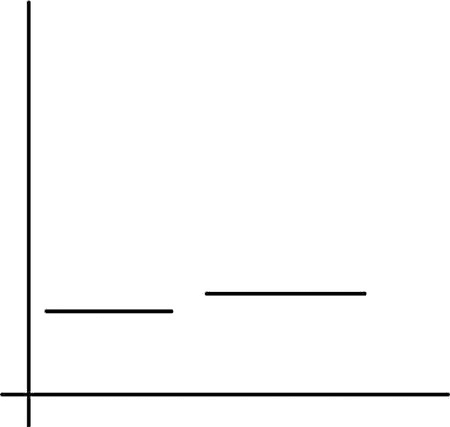
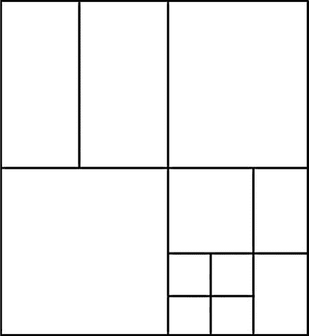

# 七、建立带有碰撞的游戏关卡

几乎每个游戏的一个关键部分是能够检测不同物体之间的碰撞并做出反应。即使回过头来看看经典游戏，如 *Pong* 或*太空入侵者*，我们也可以看到碰撞已经成为游戏体验的一部分。

使用数学来处理碰撞检测也就不足为奇了。如果您必须处理对象的多边形网格之间的碰撞，涉及的一些数学会特别复杂。在这一章中，我们将在更高的层次上研究碰撞。包围体被用作一种测试，以更详细地检测两个对象是否是碰撞的候选对象。我们游戏的设计足够简单，这种程度的碰撞检测将足够好。

检测碰撞也可能是一件计算量很大的事情，这促使我们寻找优化引擎中碰撞检测阶段的方法。我们将通过把我们的场景分割成离散的部分并只在这些部分内检查物体之间的碰撞来实现这一点。这被称为碰撞检测算法的广义阶段，而对单个对象的测试被称为狭义阶段。

一旦我们确定物体发生了碰撞，我们必须进行碰撞响应。这将在我们的代码中通过发送冲突事件来处理。我们在前一章中已经讨论了事件和组件系统，并且在我们实现碰撞检测系统时将会以这些为基础。

既然我们知道了本章要看什么，那就让我们开始吧。

用碰撞数据表示游戏世界对象

随着 GPU 能力的提高，我们用来渲染游戏对象的网格变得越来越复杂。这意味着用于渲染对象的网格不再适用于碰撞检测系统。检测非常复杂的物体之间的碰撞可能非常耗时，以至于实现实时帧速率简直是不可能的。对于我们的简单游戏，我们不需要在那个细节层次上检测不同对象之间的碰撞，所以我们可以通过简单地比较我们的对象的包围盒来早期优化碰撞检测过程。

边界体积是代表模型所占空间范围的形状。球体、立方体和胶囊等 3D 形状通常用于表示这些体积。对于我们的例子，我们将使用一种称为轴对齐包围盒(AABB)的包围体。AABB 是一个长方体，其侧面平行于 x、y 和 z 轴。由于所有 AABBs 的所有边都平行于这些轴，我们可以使用一种非常快速的算法来检测我们的两个对象是否碰撞。这种算法被称为分离轴定理。这听起来比实际要复杂得多，事实上，你已经在我们在《T4》第二章中开发的简单的*突围*游戏中实现了 2D 版本的算法。

要了解这个算法是如何工作的，最简单的方法就是看一下我们用来实现它的代码。[清单 7-1](#list1) 显示了`CollisionComponent` ，我们将用它来添加我们的对象。

[***清单 7-1。***](#_list1) 碰撞组件类声明

```cpp
class CollisionComponent
       :      public Component
{
private:
       static const unsigned int s_id = 2;

       Vector3       m_min;
       Vector3       m_max;

public:
       static unsigned int GetId()       { return s_id; }

       explicit CollisionComponent(GameObject* pOwner);
       virtual ∼CollisionComponent();

       virtual void Initialize();

       void SetMin(const Vector3& point)       { m_min = point; }
       void SetMax(const Vector3& point)       { m_max = point; }

       bool Intersects(CollisionComponent& target);
};

```

我们的`CollisionComponent`有两个`Vector3`对象，它们将用于存储包围体的范围。`m_min Vector3`对象将存储 x、y 和 z 轴的所有最小值，而`m_max`将存储 x、y 和 z 轴的最大值。

`Intersect`方法是执行组件工作和执行分离轴算法的地方。在我们看实现这一点的代码之前，我们先来看看这个算法在理论上是如何工作的。[图 7-1](#Fig1) 显示了我们将用来思考分离轴算法的图表。



[图 7-1](#_Fig1) 。分离轴定理

顾名思义，我们通过每次在每个单独的轴上寻找它们之间的间隙来检测重叠的对象。对于轴对齐的边界框，体积的每条边都将平行于世界空间中相应的轴。如果前面的图是沿着 z 轴看的，那么 x 轴会向右，y 轴向上。该图将允许我们在 x 轴上可视化 AABBs 之间的间隙。

如果我们对照第一条线测试第二条线，那么我们会说我们知道它们没有重叠，因为这条线的左边比第一条线的右边更靠右。如果我们在相反的情况下测试这些线，并将第一条线与第二条线进行比较，我们会说它们没有重叠，因为第一条线的右边比第二条线的左边更靠左。

在游戏运行时，我们不能确定哪个物体在哪一边，所以我们检查这两种情况。我们还对 y 轴和 z 轴上的边缘重复这个测试。现在也清楚了为什么我们需要将线的最小值和最大值存储在组件中它们各自的`Vector3`对象中:我们需要知道线的哪一侧最左边，哪一侧最右边，以便算法容易工作。

现在我们已经讨论了算法背后的理论，让我们来看看`CollisionComponent::Intersect` 的实现(见[清单 7-2](#list2) )。

[***清单 7-2。***](#_list2)collision component::Intersect()

```cpp
bool CollisionComponent::Intersects(CollisionComponent& target)
{
       bool intersecting = true;

       Vector3 thisMin = m_min;
       Vector3 thisMax = m_max;

       TransformComponent* pThisTransformComponent =
              component_cast<TransformComponent>(GetOwner());
       if (pThisTransformComponent)
       {
              Transform& transform = pThisTransformComponent->GetTransform();
              thisMin.Add(transform.GetTranslation());
              thisMax.Add(transform.GetTranslation());
       }

       Vector3 targetMin = target.m_min;
       Vector3 targetMax = target.m_max;

       TransformComponent* pTargetTransformComponent =
              component_cast<TransformComponent>(target.GetOwner());
       if (pTargetTransformComponent)
       {
              Transform& transform = pTargetTransformComponent->GetTransform();
              targetMin.Add(transform.GetTranslation());
              targetMax.Add(transform.GetTranslation());
       }

       if (thisMin.m_x > targetMax.m_x ||
              thisMax.m_x < targetMin.m_x ||
              thisMin.m_y > targetMax.m_y ||
              thisMax.m_y < targetMin.m_y ||
              thisMin.m_z > targetMax.m_z ||
              thisMax.m_z < targetMin.m_z)
       {
              intersecting = false;
       }

       return intersecting;
}

```

在`Intersect`方法中要完成的第一个任务是转换每个对象的 AABB。我们简单地将测试中每个对象的位置从`TransformComponent`添加到它们的边界框中，而不是应用整个变换。如果应用整个变换，我们将最终旋转轴对齐的框，这将把它变成定向的边界框，并且我们的 AABB 测试将不再可靠。我们在这里也忽略了变换的比例，因为我们知道我们没有使用它，但是如果你决定缩放你的对象，这也需要应用。

然后我们有一个`if`测试，确定对象是否没有重叠。回想一下图 7-1 中的图表，我们可以看到最小值代表线条的左边，最大值代表右边。我们测试两种情况中的每一种，在这两种情况下，我们知道对象对于每个轴都不重叠。首先，我们检查第一个对象的左边是否比第二个对象的右边更靠右。然后我们检查第一个对象的右边是否比第二个对象的左边更靠左。如果这两个条件中的任何一个为真，那么我们的对象没有重叠。然后对 y 轴和 z 轴完成相同的测试。如果这些测试中的任何一个是肯定的，我们知道我们的对象没有重叠。

这就是使用轴对齐的边界框检测物体间碰撞的全部内容。碰撞检测并不总是如此琐碎，但这是一个很好的起点，因为它涵盖了我们如何检测世界上两个对象之间的碰撞的基础知识。在这一点上，我们仍然没有真正的世界，所以我们将在下一节通过创建一个级别来解决这个问题。

建立游戏关卡

现在我们可以让物体碰撞，是时候考虑我们将如何在游戏世界中定位我们的物体了。侧滚游戏已经存在了很长很长一段时间，许多围绕着在侧滚游戏关卡中放置物体的挑战在二十多年前就已经解决了。一个最好的例子就是*超级马里奥兄弟*系列，它用统一大小的积木来建造关卡。这些块被称为 tiles，它们允许游戏开发者解决许多问题，包括纹理的有限内存、有限的调色板和有限的系统 RAM 来存储级别数据信息。因此，用重复图案的可重复使用的积木来建造关卡是一种非常有效的技术，可以建造比其他方式更大的游戏关卡。

我们的简单游戏将基于同样的基本技术构建。出于本书的目的，我们的设计被有意地写得尽可能简单，以展示用于构建游戏的技术。我们将使用的单块积木只是一个供玩家站立的平台。

在上一章中，我们直接在`Chapter6Task`类中创建了游戏对象。这一次，我们将创建一个类来包含我们的级别，因为这将允许我们在将来创建多个级别。[清单 7-3](#list3) 显示了`DroidRunnerLevel`类的声明。

[***清单 7-3。***](#_list3)DroidRunnerLevel 类

```cpp
class DroidRunnerLevel
       :     public Framework::EventHandler
{
private:
       Framework::CollisionComponent*              m_pPlayerCollisionComponent;

       Framework::Geometry                     m_sphereGeometry;
       Framework::Geometry                     m_cubeGeometry;
       Framework::TransformShader              m_transformShader;

       enum TileTypes
       {
              EMPTY = 0,
              BOX,
              AI,
              PLAYER
       };

       typedef std::vector<Framework::GameObject*>       GameObjectVector;
       typedef GameObjectVector::iterator              GameObjectVectorIterator;

       GameObjectVector                            m_levelObjects;

       void SetObjectPosition(
              Framework::GameObject* pObject,
              const unsigned int row,
              const unsigned int column);

       void AddMovementComponent(Framework::GameObject* pObject);

       void AddCollisionComponent(
              Framework::GameObject* pObject,
              const Framework::Vector3& min,
              const Framework::Vector3& max);

       void AddPatrolComponent(
              Framework::GameObject* pObject,
              const unsigned int startRow,
              const unsigned int startColumn,
              const unsigned int endRow,
              const unsigned int endColumn);

       void AddRenderableComponent(
              Framework::GameObject* pObject,
              Framework::Geometry& geometry,
              Framework::Shader& shader,
              Framework::Vector4& color);

       static const float              TILE_WIDTH       = 6.0f;
       static const float              TILE_HEIGHT       = 6.0f;

       Framework::Vector3              m_origin;

public:
       DroidRunnerLevel();
       ∼DroidRunnerLevel();

       void Initialize(const Framework::Vector3& origin);

       virtual void HandleEvent(Framework::Event* pEvent);
};

```

`DroidRunnerLevel`类的私有部分是我们现在为场景找到`Geometry`和`Shader`对象的地方。这一章我们还有一个球体、立方体和`TransformShader`。除此之外，我们还存储了一个指向玩家对象的`CollisionComponent;`的指针，我们将在讨论`DroidRunnerLevel::HandleEvent`的代码时看看为什么要这样做。

枚举`TileTypes` 定义了我们将在游戏关卡中支持的不同类型的方块。我们需要一个玩家牌，一个 AI 牌和一个盒子牌。这些是我们用来创建关卡的基本构件。

我们定义了一个`vector`和`iterator` 来存储属于这个级别的`GameObjects`，然后还定义了一些 helper 方法，这些方法将在这个级别初始化时用来构造对象。

接下来，我们有两个静态的`floats`，它存储瓷砖的 2D 尺寸，还有一个`Vector3`，它存储空间中定义关卡原点的点。我们所有的对象都将从这个原点偏移创建。

这个类需要的唯一公共方法是`constructor`和`destructor`、`Initialize`和`HandleEvent`。像往常一样，`HandleEvent` 是在`EventHandler`父类中定义的被覆盖的虚方法。

在[清单 7-4](#list4) 中列出的`Initialize`方法贯穿了我们关卡的设置。

[***清单 7-4。***](#_list4) DroidRunnerLevel::初始化

```cpp
void DroidRunnerLevel::Initialize(const Vector3& origin)
{
       m_sphereGeometry.SetVertexBuffer(sphereVerts);
       m_sphereGeometry.SetNumVertices(sizeof(sphereVerts) / sizeof(sphereVerts[0]));
       m_sphereGeometry.SetIndexBuffer(sphereIndices);
       m_sphereGeometry.SetNumIndices(sizeof(sphereIndices) / sizeof(sphereIndices[0]));
       m_sphereGeometry.SetName("android");

       m_sphereGeometry.SetNumVertexPositionElements(3);
       m_sphereGeometry.SetVertexStride(0);

       m_cubeGeometry.SetVertexBuffer(cubeVerts);
       m_cubeGeometry.SetNumVertices(sizeof(cubeVerts) / sizeof(cubeVerts[0]));
       m_cubeGeometry.SetIndexBuffer(cubeIndices);
       m_cubeGeometry.SetNumIndices(sizeof(cubeIndices) / sizeof(cubeIndices[0]));
       m_cubeGeometry.SetName("cube");

       m_cubeGeometry.SetNumVertexPositionElements(3);
       m_cubeGeometry.SetVertexStride(0);

       m_origin.Set(origin);

       CollisionManager::GetSingleton().AddCollisionBin();
       const Vector3 min(–3.0f, –3.0f, –3.0f);
       const Vector3 max(3.0f, 3.0f, 3.0f);

       const unsigned char tiles[] =
       {
          EMPTY,       EMPTY,       EMPTY,       EMPTY,       AI,       AI,       AI,       AI,
          EMPTY,       EMPTY,       EMPTY,       EMPTY,       BOX,       BOX,       BOX,       BOX,
          EMPTY,      PLAYER,      EMPTY,      EMPTY,      EMPTY,      EMPTY,      EMPTY,     EMPTY,
          BOX,        BOX,        BOX,        BOX,         BOX,         BOX,        BOX,       BOX
       };

       const unsigned int numTiles = sizeof(tiles) / sizeof(tiles[0]);

       const unsigned int numRows       = 4;
       const unsigned int rowWidth        = numTiles / numRows;

       for (unsigned int i=0; i<numTiles; ++i)
       {
              if (tiles[i] == BOX)
              {
                     const unsigned int row              = i / rowWidth;
                     const unsigned int column       = i % rowWidth;

                     GameObject* pNewObject = new GameObject();

                     SetObjectPosition(pNewObject, row, column);
                     AddCollisionComponent(pNewObject, min, max);

                     Vector4 color(0.0f, 0.0f, 1.0f, 1.0f);
                     AddRenderableComponent(
                            pNewObject,
                            m_cubeGeometry,
                            m_transformShader,
                            color);

                     m_levelObjects.push_back(pNewObject);
              }
              else if (tiles[i] == PLAYER)
              {
                     const unsigned int row              = i / rowWidth;
                     const unsigned int column       = i % rowWidth;

                     GameObject* pNewObject = new GameObject();

                     SetObjectPosition(pNewObject, row, column);
                     AddMovementComponent(pNewObject);

                     AddCollisionComponent(pNewObject, min, max);

                     MovementComponent* pMovementComponent =
                            component_cast<MovementComponent>(pNewObject);

                     m_pPlayerCollisionComponent =
                            component_cast<CollisionComponent>(pNewObject);

                     if (pMovementComponent && m_pPlayerCollisionComponent)
                     {
                            m_pPlayerCollisionComponent->AddEventListener(pMovementComponent);
                     }

                     Vector4 color(0.0f, 1.0f, 0.0f, 1.0f);
                     AddRenderableComponent(
                            pNewObject,
                            m_sphereGeometry,
                            m_transformShader,
                            color);

                     m_levelObjects.push_back(pNewObject);
              }
              else if (tiles[i] == AI)
              {
                     const unsigned int row              = i / rowWidth;
                     const unsigned int column              = i % rowWidth;

                     unsigned int patrolEndRow              = 0;
                     unsigned int patrolEndColumn       = 0;

                     for (unsigned int j=i; j<numTiles; ++j)
                     {
                            if (tiles[j] != AI)
                            {
                                   i = j;

                                   --j;
                                   patrolEndRow                     = j / rowWidth;
                                   patrolEndColumn              = j % rowWidth;
                                   break;
                            }
                     }

                     GameObject* pNewObject = new GameObject();

                     SetObjectPosition(pNewObject, row, column);
                     AddCollisionComponent(pNewObject, min, max);

                     AddPatrolComponent(pNewObject, row, column, patrolEndRow, patrolEndColumn);

                     Vector4 color(1.0f, 0.0f, 0.0f, 1.0f);
                     AddRenderableComponent(
                            pNewObject,
                            m_sphereGeometry,
                            m_transformShader,
                            color);
              }
       }

       Renderer* pRenderer = Renderer::GetSingletonPtr();
       if (pRenderer)
       {
              pRenderer->AddShader(&m_transformShader);
       }
}

```

`Initialize`从初始化`Geometry`和`Shader`类开始，就像我们在[第 6 章](06.html)中所做的一样。

然后，我们用作为参数传递给方法的值`origin`初始化原点向量`m_origin`的位置。

然后一个新的碰撞箱被添加到`CollisionManager` `;`中，我们将在[清单 7-15](#list15) 中覆盖`CollisionManager`。

然后，初始化一个由`unsigned char`值组成的数组，以包含我们想要为该级别构建的图块布局。在这里，我们指定了人工智能应该在哪里巡逻，世界碰撞盒应该放在哪里，以及玩家的起始位置应该在哪里。现在，我们已经将该层分为四行八列。这个级别足够大，可以放在一个屏幕上；我们将在第 8 章的[中扩展这一等级以覆盖多个屏幕。](08.html)

然后通过将平铺数组的大小除以单个元素的大小来计算平铺的数量，并且我们使用我们将总是有四行的事实来计算我们当前在平铺数组中定义的列的数量。

然后使用一个`for`循环来遍历数组的每个元素。当我们遇到一个空瓷砖，没有采取任何行动。如果瓷砖是一个盒子，那么我们将在世界的这一点上创建一个盒子对象。首先，我们需要计算我们占据了哪一行和哪一列。我们可以通过将当前索引除以行的宽度来计算出该行。例如，元素 16 是第三行的第一个瓦片:这将给出第 0 列和第 2 行(因为我们从第 0 行开始计数)。我们使用除法运算符 16 / 8 = 2 来计算行，使用模(或余数)运算符 16 % 8 = 0 来计算列。

一个新的游戏对象被创建，我们在这个对象上设置我们在 `,`方法中得到的位置，如[清单 7-5](#list5) 所示。

[***清单 7-5。***](#_list5) 自动喷水灭火::SetObjectPosition

```cpp
void DroidRunnerLevel::SetObjectPosition(
       Framework::GameObject* pObject,
       const unsigned int row,
       const unsigned int column)
{
       assert(pObject);
       pObject->AddComponent<TransformComponent>();
       TransformComponent* pTransformComponent = component_cast<TransformComponent>(pObject);
       if (pTransformComponent)
       {
              Vector3 translation(m_origin);
              translation.m_x += TILE_WIDTH * column;
              translation.m_y -= TILE_HEIGHT * row;
              pTransformComponent->GetTransform().SetTranslation(translation);
       }
}

```

`SetObjectPosition`是一个帮助器方法，它给我们的对象添加了一个`TransformComponent`。然后`TransformComponent`T3 的平移被设置到世界空间中我们希望我们的对象占据的位置。我们通过将瓷砖的宽度乘以柱索引，然后将其加到标高原点的 x 位置来计算。类似地，我们通过将瓦片的高度乘以行索引并从原点 y 位置减去该值来计算 y 位置。

在`SetObjectPosition`中设置好对象的位置后，`DroidRunnerLevel`调用对象上的`AddCollisionComponent`；该方法如[清单 7-6](#list6) 所示。

[***清单 7-6。***](#_list6) 【自动喷水灭火::加压素组分

```cpp
void DroidRunnerLevel::AddCollisionComponent(
       Framework::GameObject* pObject,
       const Framework::Vector3& min,
       const Framework::Vector3& max)
{
       assert(pObject);
       pObject->AddComponent<CollisionComponent>();
       CollisionComponent* pCollisionComponent = component_cast<CollisionComponent>(pObject);
       if (pCollisionComponent)
       {
              pCollisionComponent->SetMin(min);
              pCollisionComponent->SetMax(max);
              AttachEvent(COLLISION_EVENT, *pCollisionComponent);
              CollisionManager::GetSingleton().AddObjectToBin(0, pCollisionComponent);
       }
}

```

这是另一个简单的助手方法。我们简单地给对象添加一个`CollisionComponent`，并初始化它的`min`和`max`字段。在这一点上，我们确实需要对`CollisionComponent`进行更新。我们注册了一个新的活动类型名称`COLLISION_EVENT,`，并继承了`EventHandler`的`CollisionComponent`。我们来看看清单 7-28 中的`CollisionComponent::HandleEvent`。`CollisionComponent` 也被添加到索引为 0 的`CollisionManager`的 bin 中。我们将在本章的下一节讨论`CollisionManager`。

应用于盒子的最后一个助手方法是`AddRenderableComponent` ，如[清单 7-7](#list7) 所示。

[***清单 7-7。***](#_list7)DroidRunnerLevel::AddRenderableComponent

```cpp
void DroidRunnerLevel::AddRenderableComponent(
       GameObject* pObject,
       Geometry& geometry,
       Shader& shader,
       Vector4& color)
{
       assert(pObject);
       pObject->AddComponent<RenderableComponent>();
       RenderableComponent* pRenderableComponent = component_cast<RenderableComponent>(pObject);
       if (pRenderableComponent)
       {
              Renderable& renderable = pRenderableComponent->GetRenderable();
              renderable.SetGeometry(&geometry);
              renderable.SetShader(&shader);
              Vector4& renderableColor = renderable.GetColor();
              renderableColor.Set(color);
              Framework::AttachEvent(Framework::RENDER_EVENT, *pRenderableComponent);
       }
}

```

这是另一个简单的方法，向我们的对象添加一个`RenderableComponent`并初始化它的字段。在盒子的例子中，我们指定`m_cubeGeometry`、`m_transformShader`和蓝色作为这个方法的参数。

`DroidRunnerLevel::Initialize`当磁贴被设置为代表一个玩家时，也可以创建一个玩家对象。初始化一个盒子和初始化一个玩家之间唯一的区别是玩家由球体几何图形和绿色表示，并且调用方法`AddMovementComponent` 作为参数。这个方法如[清单 7-8](#list8) 所示。

[***清单 7-8。***](#_list8) 自动喷水灭火::AddMovementComponent

```cpp
void DroidRunnerLevel::AddMovementComponent(GameObject* pObject)
{
       assert(pObject);
       pObject->AddComponent<MovementComponent>();
       MovementComponent* pMovementComponent = component_cast<MovementComponent>(pObject);
       if (pMovementComponent)
       {
              AttachEvent(JUMP_EVENT, *pMovementComponent);
              AttachEvent(UPDATE_EVENT, *pMovementComponent);
       }
}

```

正如其他助手方法一样，我们将目标 c `omponent`添加到对象中，在本例中是`MovementComponent`，并初始化任何数据。MovementComponent 唯一需要的初始化是附加`JUMP_EVENT`和`UPDATE_EVENT`消息。

在前一章的清单 6-34 中，我们看到如果`MovementComponent`在 y 轴上移动到 0 以下，我们阻止了它的下落。在这一章中，如果玩家在一个盒子上休息，我们想要阻止他们掉下来。我们将在清单 7-24 和 7-26 中看看我们是如何做到这一点的，但是现在我们可以看到初始化代码将`MovementComponent`作为一个`Listener`对象添加到播放器的`CollisionComponent`中。

我们要处理的最后一种牌是 AI 类型。我们的 AI 图块不覆盖单个图块，而是覆盖一系列图块，这些图块表示我们的 AI 对象应该巡视的路径。[清单 7-9](#list9) 恢复了计算出巡逻路径起点和终点的代码。

[***清单 7-9。***](#_list9) 计算 AI 巡逻路径

```cpp
const unsigned int row                     = i / rowWidth;
const unsigned int column              = i % rowWidth;

unsigned int patrolEndRow              = 0;
unsigned int patrolEndColumn       = 0;

for (unsigned int j=i; j<numTiles; ++j)
{
       if (tiles[j] != AI)
       {
              i = j;

              --j;
              patrolEndRow                     = j / rowWidth;
              patrolEndColumn                     = j % rowWidth;
              break;
       }
}

```

正如你所看到的，[清单 7-9](#list9) 从计算当前图块的行和列开始。然后我们使用一个内部循环，直到我们找到一个非人工智能瓷砖。此时，我们增加`i`以跳过 AI 图块，然后减少`j`以使其指向巡视路径中的最后一个图块。然后计算该端点的行和列。这种定义路径的基本方法有一个缺点，那就是在路径中的最后一个图块之后，我们必须总是有一个非 AI 图块。这包括在行的末尾结束的路径；下一行的第一个图块不能是 AI 路径，否则此代码会将其视为前一行路径的延续，此外，该级别中的最后一个图块不能是 AI 图块，否则路径不会终止，并将使用图块 0，0 作为终点。

就像盒子和玩家对象一样，AI 对象有一个由我们的助手方法添加的`TransformComponent`、`CollisionComponent,`和`RenderableComponent`。

我们还使用`AddPatrolComponent` 给我们的 AI 对象添加一个`PatrolComponent`，如清单 7-10 中的[所示。](#list10)

[***清单 7-10。***](#_list10) 自动喷水灭火::addpatrolcomponent

```cpp
void DroidRunnerLevel::AddPatrolComponent(
       Framework::GameObject* pObject,
       const unsigned int startRow,
       const unsigned int startColumn,
       const unsigned int endRow,
       const unsigned int endColumn)
{
       assert(pObject);
       pObject->AddComponent<PatrolComponent>();
       PatrolComponent* pPatrolComponent = component_cast<PatrolComponent>(pObject);
       if (pPatrolComponent)
       {
              Vector3 startPoint(m_origin);
              startPoint.m_x += TILE_WIDTH * startColumn;
              startPoint.m_y -= TILE_HEIGHT * startRow;

              Vector3 endPoint(m_origin);
              endPoint.m_x += TILE_WIDTH * endColumn;
              endPoint.m_y -= TILE_HEIGHT * endRow;

              pPatrolComponent->SetStartPoint(startPoint);
              pPatrolComponent->SetEndPoint(endPoint);
              pPatrolComponent->SetSpeed(12.0f);

              AttachEvent(UPDATE_EVENT, *pPatrolComponent);
       }
}

```

`AddPatrolComponent`向对象添加一个`PatrolComponent`并初始化开始和结束字段。起点和终点在世界空间中的位置使用与我们用来定位物体的`TransformComponents`相同的方法来计算。

最后但同样重要的是，`DroidRunnerLevel::Initialize`将`m_transformShader`添加到`Renderer`中。

这个方法包含了我们构建关卡所需的所有代码。在这一点上，我们处在这样一个位置，我们已经有了对象，但是仍然没有一个方法来检测和响应它们之间的交互。在下一节中，我们将看看如何有效地确定物体是否发生了碰撞。

宽相位滤波

游戏关卡可以包含大量的`GameObject`。检测物体间碰撞的最简单方法是暴力操作。这包括将场景中的每个对象与其他对象进行对比测试。检测物体之间的碰撞可能是一个计算量很大的过程。例如，现代 FPS 游戏中使用的大型游戏引擎可能具有大量可破坏的对象，这些对象必须与世界上的大量子弹对象进行测试。在这些可破坏的游戏环境中，计算撞击的点和准确时间是必不可少的，因为玩家可以很快判断出某个物体是否以正确的方式变形，或者他们的射击是否没有针对正确的身体部位。

当使用强力方法 时，要执行的碰撞测试的数量使用下面的等式 x(x–1)/2 以二次方增加。对于 10 个对象，这给出了要执行的 45 个测试，这还不算太坏。对于 1，000 个对象，您需要测试 499，500 次。

减少测试对象数量的过程被称为宽相位过滤。对象的这种传递通常由空间算法组成。这意味着我们利用对象相距较远的事实来忽略这些对象之间的任何碰撞测试，只考虑靠近的对象之间的碰撞。

四叉树和八叉树

四叉树是一种将 2D 空间细分成相等大小的空间的数据结构；八叉树执行相同的工作，但是包括第三维。

如图 7-2 所示，一个四叉树被用来在每一层将一个 2D 空间细分成大小相等的部分。首先，外部部分被水平和垂直分割，形成四个四分之一。然后，根据每个部分中存在的对象数量来分割每个四分之一。给定区域中存在的对象越多，我们将使用越多的细分来减少对象之间的碰撞次数。



[图 7-2](#_Fig2) 。四叉树

八叉树以完全相同的方式工作，但是将 3D 空间分割成相等大小的立方体，每个部分有多达八个分割，而不是四叉树使用的四个分割。

二元空间划分

二进制空间划分(或 BSP )在细分空间方面的工作方式类似于四叉树和八叉树。 *Doom* 和 *Quake* 使用这种算法来渲染他们的场景，因为他们在剔除不应在其 3D 软件渲染引擎中渲染的几何图形方面非常有效。

虽然 BSP 由于其对硬件 3D 加速器的低效使用而不再被用作渲染算法，但它仍然是加速涉及静态几何的碰撞检测的有效选择。最常见的 BSP 类型包括使用平面分割几何体。对于这项任务来说，平面是一个有效的几何体，因为它有一个简单的测试来确定对象位于平面的哪一侧。

BSP 结构是在游戏运行之前离线生成的，并且算法通过拾取根多边形、构建多边形所在的平面、然后继续拾取平面每一侧的多边形以构建新的平面来运行。重复该过程，直到细分达到足够精细的细节级别。

如果您正在使用大型网格构建大型室外层级，这是一种有效的技术。

*Droid Runner* 中的宽相位滤波

我们对宽相位滤波的需求要小得多。我们的关卡有一个固定的高度，所有的物体都在一个 2D 平面上，所以我们可以把关卡分成大小相等的箱子。我们已经看到，我们的级别是用一个分为行和列的数组定义的，所以我们将对每八列使用一个 bin。

碰撞箱

我们来看看清单 7-11 中的碰撞库代码。

[***清单 7-11。***](#_list11) 碰撞宾类声明

```cpp
class CollisionBin
{
private:
       typedef std::vector<CollisionComponent*>               CollisionComponentVector;
       typedef CollisionComponentVector::iterator       CollisionComponentVectorIterator;

       CollisionComponentVector                             m_collisionObjects;
       CollisionComponentVectorIterator                      m_currentObject;

public:
       CollisionBin();
       ∼CollisionBin();

       void                      AddObject(CollisionComponent* pCollisionComponent);
       CollisionComponent*       GetFirst();
       CollisionComponent*       GetNext();
};

```

这是一个简单的类。作为一个 bin，它的任务只是存储一个对象集合，并为这些对象提供访问器方法。在这种情况下，`CollisionBin`存储了一个`CollisionComponent`指针的`vector`。bin 存储一个 current `iterator`，用于向调用类提供第一个和下一个对象。

清单 7-12 显示了向 CollisionBin 添加一个新对象所需的代码。

[***清单 7-12。***](#_list12) 碰撞 Bin::AddObject

```cpp
void CollisionBin::AddObject(CollisionComponent* pCollisionComponent)
{
       m_collisionObjects.push_back(pCollisionComponent);
}

```

方法`AddObject`有一个简单的工作:它将传递的`CollisionComponent`指针添加到它的数组中。

清单 7-13 展示了`GetFirst`如何将内部迭代器设置为`vector`的开始。`return`语句使用三元运算符来确定`iterator`是否指向有效对象。如果是，我们返回被解引用的`iterator;`，如果不是，我们返回`NULL`。

[***清单 7-13。***](#_list13) 碰撞 Bin::GetFirst

```cpp
CollisionComponent* CollisionBin::GetFirst()
{
       m_currentObject = m_collisionObjects.begin();
       return m_currentObject != m_collisionObjects.end()
              ?           *m_currentObject
              :           NULL;
}

```

在[清单 7-14](#list14) 中，我们在方法`GetNext`中两次测试有效对象的当前`iterator`。在尝试递增之前，我们需要确保迭代器不在`vector`的末尾，这样我们就可以确保不会离开末尾。一旦我们增加了迭代器，在返回解引用的对象或`NULL`之前，我们再次检查迭代器是否有效。

[***清单 7-14。***](#_list14)collision bin::get next

```cpp
CollisionComponent* CollisionBin::GetNext()
{
       CollisionComponent* pRet = NULL;

       if (m_currentObject != m_collisionObjects.end())
       {
              ++m_currentObject;
              pRet = m_currentObject != m_collisionObjects.end()
                     ?     *m_currentObject
                     :     NULL;
       }

       return pRet;
}

```

箱本身不执行任何碰撞测试；它们只是存储算法。实际测试将由`CollisionManager`执行。

碰撞管理器

`CollisionManager`，其声明在[清单 7-15](#list15) 中描述，负责存储碰撞箱，并为其余代码提供碰撞测试的接口。

[***清单 7-15。***](#_list15)collision manager 类声明

```cpp
class CollisionManager
       :     public Singleton<CollisionManager>
{
private:
       typedef std::vector<CollisionBin>       CollisionBinVector;

       CollisionBinVector                     m_collisionBins;

public:
       CollisionManager();
       ∼CollisionManager();

       void AddCollisionBin();
       void AddObjectToBin(const unsigned int binIndex, CollisionComponent* pObject);
       void TestAgainstBin(const unsigned int binIndex, CollisionComponent* pObject);
};

```

我们在这个类中再次使用 vector，这次存储的是一个由`CollisionBin`实例组成的 vector。我们提供了一些公共方法，用于创建新的容器，将`CollisionComponents`添加到容器中，以及针对容器中的所有其他对象测试单个对象。

在`AddCollisionBin,`中，我们将新的箱子推到`vector`的后面。这显示在[清单 7-16](#list16) 中。

[***清单 7-16。***](#_list16) 碰撞管理器::addcollisionbin

```cpp
void CollisionManager::AddCollisionBin()
{
       m_collisionBins.push_back();
}

```

[清单 7-17](#list17) 中描述的`AddObjectToBin`断言所提供的索引小于 bin `vector`的大小。然后它调用在`binIndex`找到的 bin 上的`AddObject`。

[***清单 7-17。***](#_list17) 碰撞管理器::AddObjectToBin

```cpp
void CollisionManager::AddObjectToBin(const unsigned int binIndex, CollisionComponent* pObject)
{
       assert(binIndex < m_collisionBins.size());
       m_collisionBins[binIndex].AddObject(pObject);

}

```

窄相位碰撞检测

窄相位碰撞检测与加速确定两个特定物体是否碰撞的过程有关。过滤碰撞的整个过程基于这样的假设，即碰撞检测算法中最昂贵的部分是几何图元之间的相交测试。这可能是三角形、射线或任何其他类型的几何图形用于表示物体的表面。对于现代视频游戏来说，模型中所需的细节导致了由成千上万个几何图元组成的网格，并且测试其中的每一个都将是昂贵的。

我们已经在本章前面讨论了我们的方法:我们将使用轴对齐的边界框来近似我们的对象。如果我们在构建人形角色，我们会有一个整体的包围体，然后是一个粗略表示每个身体部分的体。这可能意味着头部有一个球体，四肢的上部和下部有一个胶囊，躯干有一个 AABB。

由于我们的测试非常简单，整个算法适合一个方法。`CollisiongManager::TestAgainstBin`列在[清单 7-18](#list18) 中。

[***清单 7-18。***](#_list18) `CollisionManager::TestAgainstBin`

```cpp
void CollisionManager::TestAgainstBin(const unsigned int binIndex, CollisionComponent* pObject)
{
       assert(binIndex < m_collisionBins.size());
       CollisionBin& bin = m_collisionBins[binIndex];
       CollisionComponent* pBinObject = bin.GetFirst();
       while (pBinObject)
       {
              if (pBinObject != pObject &&
                     pBinObject->Intersects(*pObject))
              {
                     CollisionEventData collisionData;
                     collisionData.m_pCollider = pBinObject->GetOwner();
                     SendEventToHandler(
                            COLLISION_EVENT,
                            *static_cast<EventHandler*>(pObject),
                            &collisionData);
              }
              pBinObject = bin.GetNext();
       }
}

```

我们将想要测试的对象作为参数传递给 bin。我们之前讨论的强力方法会涉及到测试 bin 中的每一个对象；然而，我们知道我们只对测试玩家对象感兴趣，这给了我们一个很好的优化。

该方法简单地遍历 bin 中的每个对象，如果对象不相同，则调用`Intersect`方法。当`Intersect`方法返回 true 时，我们将`COLLISION_EVENT`发送给作为参数传递的`CollisionComponent`。

`CollisionEventData`结构仅仅持有一个指向我们已经碰撞过的`GameObject`的指针。我们在清单 7-19 中查看这个结构。

[***清单 7-19。***](#_list19)collision event data 结构

```cpp
struct CollisionEventData
{
       GameObject*       m_pCollider;
};

```

`TestAgainstBin`方法突出显示了我们将对事件系统进行的更新。通常在发送事件时，随事件一起传递数据是很方便的。在这种情况下，我们想知道我们碰撞了哪个物体。

为了方便用 e `vent,`发送数据，我们添加了一个指向 e `vent`类的 void 指针。我们还添加了指向`Send`和`SendToHandler`方法的空指针。我们在清单 7-20 和 7-21 中这样做。

***清单 7-20。*** 更新事件类

```cpp
       EventHandlerList                     m_listeners;
       EventID                            m_id;
       void*                            m_pData;

public:
       explicit Event(EventID eventId);
       ∼Event();

       void Send(void* pData);
       void SendToHandler(EventHandler&
 **eventHandler, void* pData);**
       `void AttachListener(EventHandler& eventHandler);`
       `void DetachListener(EventHandler& eventHandler);`
```

 `***清单 7-21。*** 更新事件::发送和事件::SendToHandler

```cpp
void Event::Send(void* pData)
{
       m_pData = pData;
       for (EventHandlerListIterator iter = m_listeners.begin();
              iter != m_listeners.end();
              ++iter)
       {

void Event::SendToHandler(EventHandler&
 **eventHandler, void* pData)**
`{`
       **m_pData = pData;**
       `for (EventHandlerListIterator iter = m_listeners.begin();`
              `iter != m_listeners.end();`
              `++iter)`
       `{`
```

 `随着这一变化，将 e `vent`传递到`EventManager`和从`EventManager`传递 e `Send`和`SendToHandler`的每个方法也需要更新，以包含`void`指针参数。

现在我们有了一个检测碰撞的方法和一个告诉一个对象它何时被卷入碰撞的事件，我们可以编写代码来响应这些碰撞。

响应碰撞

我们的游戏设计要求对发生的碰撞做出两种截然不同的反应。我们可以被支撑在箱子的顶部，或者我们可以被箱子的侧面或敌人杀死。

我们的玩家对象的更新代码大部分包含在`MovementComponent`中。我们现在的问题是从`CollisionComponent`获取对特定碰撞数据感兴趣的物体的`COLLISION_EVENT`。

我们将通过转向观察者模式来实现这一点。在这种情况下，我们想要做的是当`CollisionEvent`发生时，使用特定的方法通知对象。将使用`CollisionListener`接口来实现这一点，如[清单 7-22](#list22) 所示。

[***清单 7-22。***](#_list22) 碰撞监听器接口

```cpp
class CollisionListener
{
public:
       virtual void HandleCollision(CollisionEventData* pData) = 0;
};

```

在清单 7-23 的[中，`MovementComponent`](#list23) 继承了这个类。

[***清单 7-23。***](#_list23) 更新运动组件

```cpp
class MovementComponent
       :      public Framework::Component
       ,      public Framework::EventHandler
       ,      public Framework::CollisionListener
{
private:
       static const unsigned int s_id = 9;
public:

       virtual void HandleCollision(Framework::CollisionEventData* pData);
};

```

清单 7-24 中的方法体处理冲突。

[***清单 7-24。***](#_list24) 运动组件::手柄碰撞

```cpp
void MovementComponent::HandleCollision(Framework::CollisionEventData* pData)
{
       PatrolComponent* pPatrolComponent = component_cast<PatrolComponent>(pData->m_pCollider);
       if (pPatrolComponent)
       {
              // We're colliding with an AI; we're dead!
       }
       else
       {
              // We're colliding with a block
              TransformComponent* pColliderTransformComponent =
                     component_cast<TransformComponent>(pData->m_pCollider);

              CollisionComponent* pColliderCollisionComponent =
                     component_cast<CollisionComponent>(pData->m_pCollider);

              assert(pColliderTransformComponent && pColliderCollisionComponent);

              const Vector3& translation =
                     pColliderTransformComponent->GetTransform().GetTranslation();

              Vector3 minPosition(pColliderCollisionComponent->GetMin());
              minPosition.Add(translation);

              TransformComponent* pObjectTransformComponent =
                     component_cast<TransformComponent>(GetOwner());

              if (pObjectTransformComponent->GetTransform().GetTranslation().m_x <
                     minPosition.m_x)
              {
                     // We're dead because we've hit the side of the block
              }
              else
              {
                     SetIsSupported(
                            true,
                            pColliderCollisionComponent->GetMax().m_y + translation.m_y);
              }
       }
}

```

正如你在这里看到的，我们通过检查物体是否有`PatrolComponent;`来确定我们击中的物体是盒子还是人工智能。

如果是一个盒子，那么我们需要确定我们是碰到了顶部还是侧面。为了做到这一点，我们得到碰撞物体的`TransformComponent`和`CollisionComponent`。

因为我们将从左向右移动，我们只会死于击中盒子的左侧，所以我们需要检查边界盒的最小位置。最小位置被转换到世界空间并存储在`minPosition`向量中。然后我们得到`MovementComponent`的所有者的`TransformComponent`。如果物体平移的 x 位置在盒子最小左边位置的左边，我们确定我们碰到了盒子的边。如果我们在左边位置的右边，我们已经到达顶部。

如果我们在盒子的顶部，我们调用`SetIsSupported`并传递边界框的平移顶部。如[清单 7-25](#list25) 所示。

[***清单 7-25。***](#_list25)movement component::SetIsSupported

```cpp
void MovementComponent::SetIsSupported(bool isSupported, float floor = 0.0f)
{
       m_isSupported = isSupported;
       m_floor = floor;
}

```

为了允许玩家坐在盒子上面，我们还必须更新 HandleEvent 方法；我们在清单 7-26 中这样做。

`SetIsSupported`方法简单地设置了`m_isSupported`字段和`m_floor`字段。

[***清单 7-26。***](#_list26) 更新 MovementComponent::HandleEvent

```cpp
else if (pEvent->GetID() == UPDATE_EVENT)
{
       TransformComponent* pTransformComponent = component_cast<TransformComponent>(GetOwner());
       assert(pTransformComponent);
       CollisionComponent* pCollisionComponent = component_cast<CollisionComponent>(GetOwner());
       assert(pCollisionComponent);
       if (pTransformComponent && pCollisionComponent)
       {
              const Vector3& position = pTransformComponent->GetTransform().GetTranslation();

              bool falling = m_acceleration.m_y < 0.0f;

              Vector3 bvMin = pCollisionComponent->GetMin();

              Vector3 translation = m_velocity;
              translation.Multiply(Timer::GetSingleton().GetTimeSim());
              translation.Add(position);

              const float offsetFloor = m_floor – bvMin.m_y;
              if (m_isSupported &&falling &&(translation.m_y < offsetFloor))
              {
                     translation.m_y = offsetFloor;
              }

              pTransformComponent->GetTransform().SetTranslation(translation);

              Timer& timer = Timer::GetSingleton();
              Vector3 accel = m_acceleration;
              accel.Multiply(timer.GetTimeSim());
              m_velocity.Add(accel);

              static const float GRAVITY_MULTIPLIER       = 15.0f;
              static const float GRAVITY_CONSTANT       =  –9.8f;
              m_acceleration.m_y += GRAVITY_MULTIPLIER * GRAVITY_CONSTANT * timer.GetTimeSim();
              if (falling &&m_isSupported)
              {
                     m_acceleration.m_y   = 0.0f;
                     m_velocity.m_y       = 0.0f;
              }
       }

       // Always undo support after an update: we'll be resupported if we are colliding with a block.
       SetIsSupported(false);
}

```

现在我们正在测试冲突，是否支持我们的决定已经为我们做出了。在这种情况下，我们需要得到`CollisionComponent`，这样我们就可以确定我们的平移距离对象的底部有多远。我们通过从地板值中减去包围体的最小 y 位置来做到这一点。

然后我们测试我们的位置是否应该固定在地板上。应该是，如果我们被支持，正在下降，我们的平移的 y 场低于我们的`offsetFloor`值。

如果我们在下落，并且被支撑在一个表面上，我们的加速度和速度就被清除了。

最后，我们总是希望清除支持的标志。我们的碰撞系统将重新测试，以确定我们是否仍然与我们正在休息的盒子碰撞，如果是，我们将在下一帧再次被设置为受支持。

现在我们知道了`MovementComponent`如何处理碰撞。我们还没有处理死亡案例，因为我们还没有搬家。一旦我们让玩家带着摄像机移动，我们将在第八章讲述死亡。我们也不知道`CollisionListener`接口是如何使用的。我们需要再看一眼更新后的`CollisionComponent`，并在[清单 7-27](#list27) 中这样做。

[***清单 7-27。***](#_list27) 向 CollisionComponent 类添加监听器

```cpp
class CollisionComponent
       :     public Component
       ,     public EventHandler
{
private:
       static const unsigned int s_id = 2;

       Vector3       m_min;
       Vector3       m_max;

       typedef std::vector<CollisionListener*>              CollisionListenerVector;
       typedef CollisionListenerVector::iterator       CollisionListenerVectorIterator;

       CollisionListenerVector                            m_eventListeners;

public:
       static unsigned int GetId()       { return s_id; }

       explicit CollisionComponent(GameObject* pOwner);
       virtual ∼CollisionComponent();

       .
       .
       .

       void AddEventListener(CollisionListener* pListener)
       {
              m_eventListeners.push_back(pListener);
       }
};

```

我们在[清单 7-4](#list4) 中看到了对`AddEventListener`的调用，所以我们已经从最初创建我们的对象时回到了原点。管理监听器就像维护一个指向`CollisionListener`对象的指针向量一样简单。

`CollisionComponent`不关心对碰撞本身的响应；它只需要将`COLLISION_EVENT`数据分发给对涉及该对象的碰撞感兴趣的对象。在[清单 7-28](#list28) 中，我们遍历`CollisionListener`对象的向量，并调用它们的`HandleCollision`方法。

[***清单 7-28。***](#_list28) 碰撞组件::手柄事件

```cpp
void CollisionComponent::HandleEvent(Event* pEvent)
{
       if (pEvent->GetID() == COLLISION_EVENT)
       {
              CollisionEventData* pCollisionData =
                     static_cast<CollisionEventData*>(pEvent->GetData());
              if (pCollisionData && pCollisionData->m_pCollider)
              {
                     for (CollisionListenerVectorIterator iter = m_eventListeners.begin();
                            iter != m_eventListeners.end();
                            ++iter)
                     {
                             (*iter)->HandleCollision(pCollisionData);
                     }
              }
       }
}

```

既然碰撞处理已经完成，我们需要在每一帧触发系统来检测碰撞。

运行碰撞测试

场景中的对象更新后，最好检测碰撞。为此，我们将注册一个新事件`POSTUPDATE_EVENT`。

我们在[清单 7-3](#list3) 中看到,`DroidRunnerLevel`类存储了一个指向播放器对象`CollisionComponent`的指针。我们还在窄阶段碰撞检测部分看到，我们可以通过只测试玩家对象的碰撞来优化检测算法。这两个事实密切相关。在[清单 7-29](#list29) 中，我们使用存储的指针来测试碰撞。

[***清单 7-29。***](#_list29)DroidRunnerLevel::handle events

```cpp
void DroidRunnerLevel::HandleEvent(Event* pEvent)
{
       if (pEvent->GetID() == POSTUPDATE_EVENT && m_pPlayerCollisionComponent)
       {
              CollisionManager::GetSingleton().TestAgainstBin(0, m_pPlayerCollisionComponent);
       }
}

```

这就是我们运行碰撞检测算法所需的全部代码。

[清单 7-30](#list30) 显示了对章节的更新方法的更新，这是触发`POSTUPDATE_EVENT`所必需的。在这里，我们确保应该在更新后完成的任何任务都以正确的顺序完成。

[***清单 7-30。***](#_list30) 触发 POSTUPDATE_EVENT

```cpp
void Chapter7Task::Update()
{
       if (Renderer::GetSingleton().IsInitialized())
       {
              Framework::SendEvent(Framework::UPDATE_EVENT);
              Framework::SendEvent(Framework::POSTUPDATE_EVENT);
              Framework::SendEvent(Framework::RENDER_EVENT);
       }
}

```

这就是我们游戏中碰撞检测所需要的。我们还需要对`Renderer`做一个改变，你应该知道。

使用 Z 缓冲器

当对象被渲染到帧缓冲区时，默认行为是将每个像素渲染到屏幕上。当一个对象被渲染但应该在先前已经被渲染的对象之后时，问题就出现了。由于像素总是被写入帧缓冲区，我们的第二个对象将覆盖第一个对象，即使我们不希望这样。

我们可以通过使用 z 缓冲区来解决这个问题。z 缓冲区或深度缓冲区存储每个渲染像素写入帧缓冲区时的深度。深度缓冲器中的每个像素最初被设置为 1。变换对象的顶点并为片段着色做好准备后，将计算每个片段的 z 值，其深度介于 0 和 1 之间。如果新片段的深度小于该位置的现有深度，它将在片段着色器中进行处理，并将颜色写入帧缓冲区。如果深度大于现有像素，该片段将被丢弃，而帧和深度缓冲区中的现有值将被保留。

我们通过以下方式在 OpenGL 中启用深度测试。

1.  Select an EGL configuration which supports a depth buffer, shown in [Listing 7-32](#list32).

    ***清单 7-31。*** EGL 深度配置属性

    ```cpp
    const EGLint attribs[] =
    {
           EGL_RENDERABLE_TYPE, EGL_OPENGL_ES2_BIT,
           EGL_SURFACE_TYPE, EGL_WINDOW_BIT,
           EGL_BLUE_SIZE, 8,
           EGL_GREEN_SIZE, 8,
           EGL_RED_SIZE, 8,
           EGL_DEPTH_SIZE, 24,
           EGL_NONE
    };

    ```

2.  启用深度测试([清单 7-32](#list32) )。
3.  Clear the depth buffer ([Listing 7-32](#list32)).

    [***清单 7-32。***](#_list32) 启用 GL_DEPTH_TEST 并清除深度缓冲

    ```cpp
    void Renderer::Update()
    {
           if (m_initialized)
           {
                  glEnable(GL_DEPTH_TEST);
                  glClearColor(0.95f, 0.95f, 0.95f, 1);

                  glClear(GL_COLOR_BUFFER_BIT| GL_DEPTH_BUFFER_BIT);

    ```

清单 7-31 和 7-32 中修改过的三行是在我们的游戏代码中启用深度测试所需要的。从现在开始，我们可以确定场景中的所有像素都是那些被栅格化为离相机最近的物体的一部分的像素。

摘要

这一章是关于建立游戏关卡和碰撞检测系统的旋风介绍。我们所看到的是，围绕游戏关卡的挑战很大程度上是那些涉及创建对象来填充关卡的挑战。在我们的游戏中，我们使用了老式 2D 游戏中屡试不爽的平铺方法，用同样大小的方块构建了一个 3D 关卡。

学习游戏编程时使用这样一个系统的主要好处是它非常容易通过计算来创建。现代游戏更倾向于使用离线工具来构建关卡，这些关卡可以在运行时加载前进行预处理。然而，这些系统所面临的许多问题与我们在本章中看到的以及我们在前一章中开始解决的问题是一样的，即如何在对象之间进行通信以及如何管理大量的对象。当构建初始级别时，我们的组件和事件系统使其中一些任务变得微不足道。

一旦我们有了等级数据，我们就开始计算物体之间的碰撞。我们了解了为什么物体的宽相位过滤对于减少我们需要测试的对的数量是重要的，以及为什么窄相位有助于减少碰撞测试本身的计算复杂性。我们已经将这些经验应用到我们的游戏中，创建了一个宁滨系统，允许我们以游戏代码选择的任何方式将对象存储在一起，并且我们已经为我们的游戏实现了最佳的测试算法，其中我们只关心单个对象上的碰撞效果。

为了结束这一章，我们稍微绕了一下图形编程，看看如何启用深度测试，以确保渲染到帧缓冲区的像素实际上是我们希望看到的像素。

在下一章中，我们将显著扩展我们的级别，并更好地利用碰撞管理器中的离散箱。我们还将看看如何创建一个游戏摄像头，让玩家在关卡中移动，并编写代码来决定玩家死后该做什么。我们还将看看如何使用相机对象来减少我们将发送到 GPU 的几何量。``