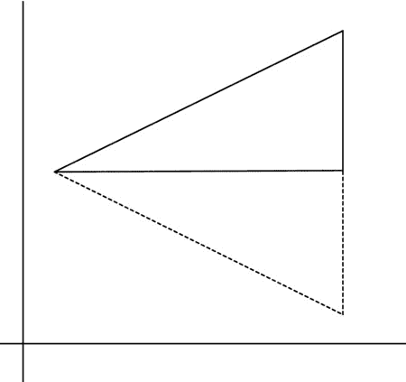
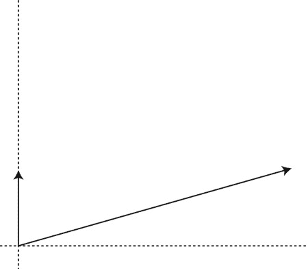

# 八、虚拟摄像机

对于摄影师和电影制作人来说，相机是一个显而易见的工具。它们使艺术家能够通过控制光线捕捉的位置和设置来捕捉他们周围的生活世界，从而创造出他们所选择场景的表现形式。电子游戏也不例外。

到目前为止，我们的场景基本上保持静态，但这不会成为一个特别有趣的游戏。你们中的大多数人以前都玩过 3D 游戏，我相信你会同意在世界中移动的能力是让游戏引人注目的一个关键方面。如果不定义摄像机，这是不可能的。

在摄影和电影制作领域，相机是一个相对容易理解的概念。要捕捉不同的视角，你只需将相机移动到某个位置，它就能捕捉到你想要描绘的场景。3D 图形中的相机并不那么简单。在这一章中，我们将看看我们如何定义一个相机游戏对象，以及我们如何使用该对象来通过我们的*机器人跑垒员*关卡。

让我们开始看看游戏摄像机背后的理论。

模型和视图矩阵

正如我们已经看到的，我们可以通过改变变换矩阵，将该矩阵提供给顶点着色器，并将顶点乘以该矩阵，在 3D 世界中移动对象。变换矩阵包含缩放、旋转和平移元素，这些元素会影响游戏对象的大小、方向和位置。

图 8-1 显示了比例矩阵对游戏对象的影响。


图 8-1 。缩放立方体

变换的旋转元素围绕对象的原点旋转顶点。如图 8-2 中的所示。


图 8-2 。旋转对游戏对象的影响

变换矩阵的平移组件负责在 3D 空间中移动对象。图 8-3 显示了应用于游戏对象位置的偏移。


图 8-3 。翻译游戏对象

我们创建的清单 6-20 中的负责存储每个对象的变换信息。清单 6-28 中的顶点着色器代码用于在渲染管道中处理顶点时将变换矩阵应用于顶点。

我们的相机对象将是一个游戏对象，就像任何其他对象一样。它将通过更新包含在其`TransformComponent`中的`Transform`在场景中移动，但相机本身不会被渲染；相反，相机的位置和方向将用于操纵场景中的其他对象。

在第五章中，我们介绍了规范视图体的概念。我们讨论了顶点着色器负责将顶点转换到相对于该体积的位置。到目前为止，我们缺乏一个相机模型，这意味着我们必须在世界空间中移动对象，以使它们在这个体积内正确显示。现在将由相机负责修改顶点以适应这个体积。

当我们用相机拍照时，我们知道我们可以移动相机来获得不同的场景视图。我们可以在我们的游戏世界中，通过使用它的`TransformComponent`来操控相机，达到同样的效果；然而，这不会帮助我们操纵顶点着色器中其他对象的顶点。我们必须把渲染管道中的摄像机想象成一个永远不会移动的物体。所有其他对象必须相对于相机对象四处移动。为了帮助解决这个问题，想象一下你正在用相机拍全家福。如果你决定你真的喜欢从稍微偏右的位置拍摄，你可以向右移动一步。在 3D 游戏中，这是不可能的，因为渲染管道中的相机基本上是固定的，所以我们必须想象我们必须移动世界中的对象。在我们的视觉化中，你可以想象，为了获得相同的场景视图，你可以要求照片中的人向左走一步，而不是向右走一步。你会拿着相机保持不动，但你会得到相同的角度来拍摄你的对象，就好像你走到了左边。

我们通过应用变换的逆变换在 3D 数学中实现这一点。转换中最容易可视化的部分是翻译组件。如果我们的摄影机对象的平移包含沿 z 轴 10 个单位的正偏移，我们将通过对顶点位置应用–10 的偏移来操纵场景中的每个其他对象。我们已经在清单 6-23 的中写了一个获得逆变换的方法。

快速回顾一下，我们的相机对象将是一个带有一个`TransformComponent`的`GameObject`，就像其他的一样。我们将对摄像机应用正向变换，使其在游戏世界中移动。我们将把摄像机的`Transform`的逆矩阵提供给`Renderer`作为视图矩阵。

这涵盖了片段着色器中顶点变换的两个基础。模型矩阵将对象的顶点从其局部空间操纵到世界空间。视图矩阵然后将顶点从世界空间操纵到相机或视图空间。

顶点着色器中顶点变换过程的最后一部分是投影矩阵。

投影矩阵

为了理解为什么投影矩阵如此重要，尤其是在移动开发中，我们必须再次考虑规范视图体。该体积是顶点经过顶点着色器处理后所在的空间。规范视图体在 OpenGL ES 2.0 中是边维数相等的立方体(在其他 API 中可能有不同的属性；例如，DirectX 使用在 z 轴上范围仅从 0 到 1 的立方体)。如果你看到一系列 Android 设备并排放置，很明显屏幕可能都是不同的尺寸。

设备本身的大小不是问题，因为我们的游戏将会适应更大的屏幕。问题来自于不同长宽比的屏幕。我们用宽度除以高度来计算长宽比。我现在的设备是 Galaxy Nexus，屏幕分辨率为 1280 * 720，长宽比为 1.778。最初的华硕变压器的屏幕分辨率为 1280 * 800，长宽比为 1.6。这些可能看起来没有明显的区别；但是，它们会直接影响我们的产出。如果我们没有校正设备的纵横比，我们将允许立方体视图体积被水平拉伸以适合设备的屏幕。正方形会变成长方形，而球体看起来不会是正圆。

这是投影矩阵解决的问题之一。

3D 图形中通常使用两种不同类型的投影矩阵。一个是正投影，一个是透视投影。正投影的关键特性是平行线在投影后保持平行。透视投影并不保持平行线，顾名思义，这可以让我们产生透视感。我们大多数人都知道消失点的概念。绘画中的这种效果是通过让平行线在远处的一个点上会聚来实现的，这和我们使用透视投影得到的效果是一样的。

图 8-4 显示了长方体正投影体和透视图体的平截头体，从俯视图上覆盖在标准视图体上。


图 8-4 。投影视图体积

如图 8-4 所示，透视图体由一个平截头体表示。平截头体的近平面以与远平面相同的方式映射到立方体上。由于远平面要宽得多，平截头体后面的对象在尺寸上被挤压以适合规范视图体积。物体离相机越远，这种挤压就是我们获得透视感的方式。这种挤压不会发生在正交投影中，无论对象离相机多近，它们看起来都是相同的大小。

我们将在我们的相机中使用投影的透视方法，我们将在下一节看看我们如何实现这一点。

定义相机对象

与我们目前所有的其他对象一样，我们的相机将是一个带有新组件类型`CameraComponent`的`GameObject`。

清单 8-1 中的类声明显示了`CameraComponent` 的接口。我们有常用的`static int`和`GetId`方法来添加对组件系统的支持。

***清单 8-1。***`CameraComponent`类声明。相机组件. h

```cpp
class CameraComponent
       :      public Component
       ,      public EventHandler
{
private:
       static const unsigned int s_id = 3;
       float            m_frustumParameters[Renderer::NUM_PARAMS];
public:
       static unsigned int GetId()      { return s_id; }
       explicit CameraComponent(GameObject* pOwner);
       virtual ∼CameraComponent();

       virtual void Initialize() {}
       void SetFrustum(
              const float verticalFieldOfView,
              const float aspectRatio,
              const float near,
              const float far);

       virtual void HandleEvent(Event* pEvent);
};

```

然后我们会看到存储的截锥参数。这些参数定义了视图截锥边缘的边界。平截头体的顶部、底部、左侧、右侧、近侧和远侧平面都有一个参数。

我们还有两个公共方法，`SetFrustum`和`HandleEvent`。

我们来看看清单 8-2 中的`SetFrustum` 。

***清单 8-2。*** `CameraComponent::SetFrustum`。相机组件. cpp

```cpp
void CameraComponent::SetFrustum(
       const float verticalFieldOfView,
       const float aspectRatio,
       const float near,
       const float far)
{
       float halfAngleRadians   = 0.5f * verticalFieldOfView * (3.1415926536f / 180.0f);

       m_frustumParameters[Renderer::TOP]       = near * (float)tan(halfAngleRadians);
       m_frustumParameters[Renderer::BOTTOM]    = -m_frustumParameters[Renderer::TOP];
       m_frustumParameters[Renderer::RIGHT]     =
              aspectRatio * m_frustumParameters[Renderer::TOP];
       m_frustumParameters[Renderer::LEFT]      = -m_frustumParameters[Renderer::RIGHT];
       m_frustumParameters[Renderer::NEAR]      = near;
       m_frustumParameters[Renderer::FAR]       = far;
}

```

`SetFrustum`根据传入的参数计算锥台参数。我们将基于屏幕的长宽比和以度为单位的垂直视野来计算我们的平截头体。视野是一个角度，表示平截头体的宽度:视野越大，近平面和远平面的宽度差越大。

更大的视野会给我们一种在传统相机上缩小的效果；更窄的视野给我们一种放大物体的感觉。这种效果最常见的例子是第一人称射击游戏中的狙击瞄准镜。范围视图将具有更窄的视野，并且远处物体的比例在帧缓冲器中大大增加。

我们的平截头体被计算成两半，相反的一半只是它的对应部分被求反。因为我们是对半计算，所以我们把垂直视野乘以 0.5f .然后我们把`verticalFieldOfView`乘以 3.1415926536 f/180.0 f；这会将过去的角度从度转换为弧度。结合起来，这给了我们字段`halfAngleRadians`。

通过用弧度表示的半角的正切值乘以 near 值来计算平截头体的顶部。这是简单的三角学，其中 tan(x) =对立/相邻，在我们的例子中，近平面的距离是相邻的，所以对立=相邻* tan(x)。C++ 中的 tan 方法采用弧度作为角度，这也是该方法第一行转换成弧度的原因。人更习惯于和度打交道，这很正常，所以我们用度传递我们的角度，内部转换。

平截头体的底部就是顶部的反面。

我们的右参数是顶部参数乘以提供的纵横比；左只是右的反义词。这些线条显示了为什么我们使用垂直视场法来计算截锥的尺寸。通过提供垂直视野，我们锁定了所有设备上的平截头体的高度。不管我们的纵横比是 16:9、16:10 还是其他什么，这都是一致的。在我们的宽高比较宽的情况下，我们将能够在每一侧看到更多的场景，当屏幕较窄时，情况正好相反。垂直视野在我们的例子中起作用，因为我们正在开发一个横向的游戏；如果您正在开发一个纵向方向，您可能要考虑使用锁定的水平视野。

近平面和远平面的距离存储在函数参数中。

更新`CameraComponent`包括向渲染器提供摄像机的当前状态，这样我们就可以正确地渲染场景中的物体(见清单 8-3 )。

***清单 8-3。*** `CameraComponent::HandleEvent`。相机组件. cpp

```cpp
void CameraComponent::HandleEvent(Event* pEvent)
{
       if (pEvent->GetID() == POSTUPDATE_EVENT)
       {
              TransformComponent* pTransformComponent =
                     component_cast<TransformComponent>(GetOwner());
              assert(pTransformComponent);
              Renderer& renderer = Renderer::GetSingleton();

              Matrix4 inverseCamera;
              pTransformComponent->GetTransform().GetInverseMatrix(inverseCamera);
              renderer.SetViewMatrix(inverseCamera);
              renderer.SetFrustum(m_frustumParameters);
       }
}

```

`CameraComponent`对`POSTUPDATE_EVENT`做出反应，以确保必要时`UPDATE_EVENT`中的`TransformComponent`已经更新。

我们获得一个指向我们所有者的`TransformComponent`的指针，并向它请求其`Transform`对象的逆。我们在本章前面讨论了为什么我们应该使用相机的`Transform`的反转。

逆视图矩阵和当前视锥参数通过`SetViewMatrix`和`SetFrustum`方法提供给`Renderer`。

现在我们有了一个`CameraComponent`来添加到游戏对象并模拟一个虚拟摄像机，我们需要看看如何更新`Renderer`来适应视图和投影矩阵。

更新渲染器

现在我们有了一个将`Camera`表示为`GameObject`的方法，我们需要为我们的`Renderer`添加对视图和投影矩阵的支持。

在清单 8-4 的中，我们通过向`Renderer`类添加以下更新来做到这一点。

***清单 8-4。*** 给`Renderer`增加视图和投影矩阵支持。Renderer.h

```cpp
class Renderer
       :     public Task
       ,     public Singleton<Renderer>
{
public:
       enum FrustumParameters
       {
              TOP,
              BOTTOM,
              RIGHT,
              LEFT,
              NEAR,
              FAR,
              NUM_PARAMS
       };

private:
       android_app*     m_pState;
       EGLDisplay       m_display;
       EGLContext       m_context;
       EGLSurface       m_surface;
       Int              m_width;
       Int              m_height;
       Bool             m_initialized;

       typedef std::vector<Shader*>             ShaderVector;
       typedef ShaderVector::iterator           ShaderVectorIterator;

       typedef std::vector<Texture*>            TextureVector;
       typedef TextureVector::iterator          TextureVectorIterator;

       typedef std::vector<Renderable*>         RenderableVector;
       typedef RenderableVector::iterator       RenderableVectorIterator;

       RenderableVector m_renderables;
       TextureVector    m_textures;
       ShaderVector     m_shaders;

       float            m_frustumParameters[NUM_PARAMS];

       Matrix4          m_viewMatrix;
       Matrix4          m_projectionMatrix;

       void Draw(Renderable* pRenderable);
public:
       explicit Renderer(android_app* pState, const unsigned int priority);
       virtual ∼Renderer();
       void Init();
       void Destroy();

       void AddRenderable(Renderable* pRenderable);
       void AddShader(Shader* pShader);
       void RemoveShader(Shader* pShader);

       void AddTexture(Texture* pTexture);
       void RemoveTexture(Texture* pTexture);

       // From Task
       virtual bool     Start();
       virtual void     OnSuspend();
       virtual void     Update();
       virtual void     OnResume();
       virtual void     Stop();

       bool IsInitialized() { return m_initialized; }
       void             SetViewMatrix(const Matrix4&
viewMatrix)
       {
              m_viewMatrix = viewMatrix;
       }

       const Matrix4&   GetViewMatrix() const           { return m_viewMatrix; }

       void             SetFrustum(const float frustumParameters[]);
       const Matrix4&   GetProjectionMatrix() const     { return m_projectionMatrix; }

       int              GetWidth() cons                 { return m_width; }
       int              GetHeight() const               { return m_height; }
};

```

第一个添加是 enum，它添加了六个截锥参数的定义。还有一个存储参数的浮点数组和两个存储视图和投影矩阵的矩阵。

接下来是获取和设置新字段的访问器方法。

唯一不直接的方法是`SetFrustum`法。`CameraComponent::SetFrustum`方法采用垂直视野和纵横比来构建创建虚拟相机截锥边界所需的截锥参数。`Renderer`的`SetFrustum`方法将这些参数作为输入，并从中构建一个投影矩阵。我们来看看清单 8-5 中的这个方法。

***清单 8-5。*** `Renderer::SetFrustum`，渲染器. cpp

```cpp
void Renderer::SetFrustum(const float frustumParameters[])
{
       for (unsigned int i=0; i<NUM_PARAMS; ++i)
       {
              m_frustumParameters[i] = frustumParameters[i];
       }

       m_projectionMatrix.m_m[0] =
              (2.0f * m_frustumParameters[NEAR]) /
              (m_frustumParameters[RIGHT] - m_frustumParameters[LEFT]);
       m_projectionMatrix.m_m[1]        = 0.0f;
       m_projectionMatrix.m_m[2]        = 0.0f;
       m_projectionMatrix.m_m[3]        = 0.0f;

       m_projectionMatrix.m_m[4]        = 0.0f;
       m_projectionMatrix.m_m[5]        =
               (2.0f * m_frustumParameters[NEAR]) /
               (m_frustumParameters[TOP] - m_frustumParameters[BOTTOM]);
       m_projectionMatrix.m_m[6]        = 0.0f;
       m_projectionMatrix.m_m[7]        = 0.0f;
       m_projectionMatrix.m_m[8]        =
              -((m_frustumParameters[RIGHT] + m_frustumParameters[LEFT]) /
              (m_frustumParameters[RIGHT] - m_frustumParameters[LEFT]));
       m_projectionMatrix.m_m[9]        =
              -((m_frustumParameters[TOP] + m_frustumParameters[BOTTOM]) /
              (m_frustumParameters[TOP] - m_frustumParameters[BOTTOM]));
       m_projectionMatrix.m_m[10]       =
              (m_frustumParameters[FAR] + m_frustumParameters[NEAR]) /
              (m_frustumParameters[FAR] - m_frustumParameters[NEAR]);
       m_projectionMatrix.m_m[11]       = 1.0f;
       m_projectionMatrix.m_m[12]       = 0.0f;
       m_projectionMatrix.m_m[13]       = 0.0f;
       m_projectionMatrix.m_m[14]       =
              -(2.0f * m_frustumParameters[NEAR] * m_frustumParameters[FAR]) /

               (m_frustumParameters[FAR] - m_frustumParameters[NEAR]);
       m_projectionMatrix.m_m[15]       = 0.0f;
}

```

透视投影矩阵是通过将缩放矩阵与修改要挤压的顶点的矩阵以及用于为渲染流水线中被称为透视分割的步骤准备顶点的矩阵相结合而创建的。

透视投影中涉及的数学可能会变得非常复杂，因此我们不会在此详述，因为我们需要知道的是，前面的代码将创建一个透视投影矩阵，该矩阵适用于将顶点转换为 Android 上 OpenGL ES 2.0 使用的规范视图体。

连接模型、视图和投影矩阵

我们将要依赖的矩阵变换的一个性质是连接。矩阵可以相乘，它们各自的变换将合并成一个矩阵。这些矩阵相乘的顺序非常重要。在我们的例子中，我们希望确保应用模型转换，然后是视图转换，最后是投影转换。我们通过从模型矩阵开始并乘以视图矩阵来实现这一点。然后，我们将得到的矩阵乘以投影矩阵。

这段代码可以在`TransformShader::Setup`中找到，我们可以在的清单 8-6 中看到。

***清单 8-6。*** 更新`TransformShader::Setup`。TransformShader.cpp

```cpp
void TransformShader::Setup(Renderable& renderable)
{
       Geometry* pGeometry = renderable.GetGeometry();
       if (pGeometry)
       {
              Shader::Setup(renderable);
              Renderer&**renderer = Renderer::GetSingleton();**
              **const Matrix4&****viewMatrix = renderer.GetViewMatrix();**
              **const Matrix4&****projectionMatrix = renderer.GetProjectionMatrix();**
              **Matrix4 modelViewMatrix;**
              **renderable.GetTransform().GetMatrix().Multiply(viewMatrix, modelViewMatrix);**
              **Matrix4 modelViewProjectionMatrix;**
              **modelViewMatrix.Multiply(projectionMatrix, modelViewProjectionMatrix);**
              **glUniformMatrix4fv(**
                     **m_transformUniformHandle,**
                     **1,**
                     **false,**
                     **modelViewProjectionMatrix.m_m);**

              `glVertexAttribPointer(`
                     `m_positionAttributeHandle,`
                     `pGeometry->GetNumVertexPositionElements(),`
                     `GL_FLOAT,`
                     `GL_FALSE,`
                     `pGeometry->GetVertexStride(),`
                     `pGeometry->GetVertexBuffer());`
              `glEnableVertexAttribArray(m_positionAttributeHandle);`
              `Vector4& color = renderable.GetColor();`
              `glUniform4f(`
                     `m_colorAttributeHandle,`
                     `color.m_x,`
                     `color.m_y,`
                     `color.m_z,`
                     `color.m_w);`
       `}`
`}`

```

 `清单 8-6 中更新的代码显示了我们如何将矩阵连接在一起。

`Renderable`的`Transform`为这个对象提供了模型矩阵。我们将这个模型矩阵乘以从`Renderer`中获得的`viewMatrix`。得到的矩阵`modelViewMatrix`然后乘以`projectionMatrix`，也是从`Renderer`获得的。

最终的矩阵通过`glUniformMatrix4fv`调用提供给 OpenGL(在清单 8-6 中粗体代码块的末尾)。

现在我们的框架已经更新到支持相机对象，我们应该添加代码来更新每一帧中相机的位置。

更新摄像机的变换

我们在第三章中展示的*机器人跑垒员*的设计要求我们的游戏从左到右自动更新玩家的位置。如果我们不与玩家同时更新摄像机，我们玩家的`GameObject`就会移出屏幕，玩家就看不到动作了。

对于如何处理这种情况，有几种选择。我们可以选择以与玩家对象每帧完全相同的方式更新摄像机的位置，并依靠两个对象以相同的速度移动来保持玩家的`GameObject`在屏幕上。

另一种选择是将相机“附加”到玩家的对象上，并让相机使用玩家位置的偏移来更新其每一帧的位置。这是我决定使用的方法。

为了实现这一点，我们将创建一个新的组件，`BoundObjectComponent` ，这个组件的声明如清单 8-7 所示。

***清单 8-7。***`BoundObjectComponent`类声明。BoundObjectComponent.h

```cpp
class BoundObjectComponent
       :      public Component
       ,      public EventHandler
{
private:
       static const unsigned int s_id = 4;
       Transform                                m_offsetTransform;

       const TransformComponent*                m_pBoundObject;

public:
       static unsigned int GetId()       { return s_id; }
       explicit BoundObjectComponent(GameObject* pOwner);
       virtual ∼BoundObjectComponent();

       virtual void Initialize() {}
       Transform&           GetTransform()              { return m_offsetTransform; }
       const Transform&     GetTransform() const        { return m_offsetTransform; }

       void                 SetBoundObject(const TransformComponent* pComponent)
       {
              m_pBoundObject = pComponent;
       }

       const TransformComponent*        GetBoundObject() const  { return m_pBoundObject; }
       virtual void HandleEvent(Event* pEvent);
};

```

`BoundObjectComponent`的设置方式和我们其他的`Component`职业和`EventHandlers`一样。重要字段是`m_offsetTransform`和`m_pBoundObject`。

`m_offsetTransform` 将存储从父对象偏移的`Transform`信息。`m_pBoundObject` 将存储一个指向`TransformComponent`的指针，用于我们希望通过关卡跟踪的对象。

这个`Component`完成的所有努力都包含在`HandleEvent`方法中。我们来看看清单 8-8 中的方法。

***清单 8-8。*** `BoundObjectComponent::HandleEvent`。BoundObjectComponent.cpp

```cpp
void BoundObjectComponent::HandleEvent(Event* pEvent)
{
       if (pEvent->GetID() == UPDATE_EVENT && m_pBoundObject)
       {

              TransformComponent* pTransformComponent =
                     component_cast<TransformComponent>(GetOwner());
              assert(pTransformComponent);
              Transform& ourTransform = pTransformComponent->GetTransform();
              const Transform& boundTransform = m_pBoundObject->GetTransform();
              Vector3 translation = m_offsetTransform.GetTranslation();
              translation.Add(boundTransform.GetTranslation());
              ourTransform.SetTranslation(translation);
              ourTransform.UpdateMatrix();
       }
}

```

如你所见，`HandleEvent`附属于`UPDATE_EVENT`。当这个对象被更新时，我们得到我们的所有者对象的`Transform`和我们被绑定到的对象的`Transform`。

最有趣的代码是我们创建新的`Vector3`、`translation`的三行代码。初始值被初始化以匹配`m_offsetTransform`的翻译。然后我们添加绑定对象的翻译，并设置我们的`Transform`来包含新计算的翻译。最后，我们更新由我们的`Transform`对象存储的矩阵。

这段代码将允许我们的摄像机跟随玩家对象通过我们的关卡。当玩家跳跃时，摄像机会随着玩家上升和下降，一旦我们编写代码让玩家通过关卡向右移动，摄像机也会跟着移动。

现在是时候把所有东西绑在一起，给我们的等级加上一个带`CameraComponent`的`GameObject`。

给 DroidRunnerLevel 添加摄像头

我们的相机对象将被添加到我们的级别对象列表中。让我们看看清单 8-9 中的代码。

***清单 8-9。*** 一更新为`DroidRunnerLevel::Initialize`。DroidRunnerLevel.cpp

```cpp
void DroidRunnerLevel::Initialize(const Vector3& origin)
{
       m_sphereGeometry.SetVertexBuffer(sphereVerts);
       m_sphereGeometry.SetNumVertices(sizeof(sphereVerts) / sizeof(sphereVerts[0]));
       m_sphereGeometry.SetIndexBuffer(sphereIndices);
       m_sphereGeometry.SetNumIndices(sizeof(sphereIndices) / sizeof(sphereIndices[0]));
       m_sphereGeometry.SetName("android");
       m_sphereGeometry.SetNumVertexPositionElements(3);
       m_sphereGeometry.SetVertexStride(0);

       m_cubeGeometry.SetVertexBuffer(cubeVerts);
       m_cubeGeometry.SetNumVertices(sizeof(cubeVerts) / sizeof(cubeVerts[0]));
       m_cubeGeometry.SetIndexBuffer(cubeIndices);
       m_cubeGeometry.SetNumIndices(sizeof(cubeIndices) / sizeof(cubeIndices[0]));
       m_cubeGeometry.SetName("cube");
       m_cubeGeometry.SetNumVertexPositionElements(3);
       m_cubeGeometry.SetVertexStride(0);

       m_origin.Set(origin);
       CollisionManager::GetSingleton().AddCollisionBin();
       const Vector3 min(-3.0f, -3.0f, -3.0f);
       const Vector3 max(3.0f, 3.0f, 3.0f);

       TransformComponent* pPlayerTransformComponent = NULL;
       const unsigned char tiles[] =
       {
              EMPTY,    EMPTY,  EMPTY,  EMPTY,  AI,     AI,     AI,     AI,
              EMPTY,    EMPTY,  EMPTY,  EMPTY,  BOX,    BOX,    BOX,    BOX,
              EMPTY,    PLAYER, EMPTY,  EMPTY,  EMPTY,  EMPTY,  EMPTY,  EMPTY,
              BOX,      BOX,    BOX,    BOX,    BOX,    BOX,    BOX,    BOX
       };

       const unsigned int numTiles = sizeof(tiles) / sizeof(tiles[0]);
       const unsigned int numRows  = 4;
       const unsigned int rowWidth = numTiles / numRows;

       for (unsigned int i=0; i<numTiles; ++i)
       {
              if (tiles[i] == BOX)
              {
                     const unsigned int row     = i / rowWidth;
                     const unsigned int column  = i % rowWidth;

                     GameObject* pNewObject = new GameObject();
                     SetObjectPosition(pNewObject, row, column);
                     AddCollisionComponent(pNewObject, min, max);
                     Vector4 color(0.0f, 0.0f, 1.0f, 1.0f);
                     AddRenderableComponent(
                            pNewObject,
                            m_cubeGeometry,
                            m_transformShader,
                            color);

                     m_levelObjects.push_back(pNewObject);
              }
              else if (tiles[i] == PLAYER)
              {
                     const unsigned int row     = i / rowWidth;
                     const unsigned int column  = i % rowWidth;

                     GameObject* pNewObject = new GameObject();
                     SetObjectPosition(pNewObject, row, column);
                     AddMovementComponent(pNewObject);
                     AddCollisionComponent(pNewObject, min, max);
                     MovementComponent* pMovementComponent =
                            component_cast<MovementComponent>(pNewObject);
                     m_pPlayerCollisionComponent =
                            component_cast<CollisionComponent>(pNewObject);
                     if (pMovementComponent && m_pPlayerCollisionComponent)
                     {
                            m_pPlayerCollisionComponent->AddEventListener(pMovementComponent);
                     }

                     pPlayerTransformComponent = component_cast<TransformComponent>(pNewObject);
                     Vector4 color(0.0f, 1.0f, 0.0f, 1.0f);
                     AddRenderableComponent(
                            pNewObject,
                            m_sphereGeometry,
                            m_transformShader,
                            color);

                     m_levelObjects.push_back(pNewObject);
              }
              else if (tiles[i] == AI)
              {
                     const unsigned int row             = i / rowWidth;
                     const unsigned int column          = i % rowWidth;

                     unsigned int patrolEndRow          = 0;
                     unsigned int patrolEndColumn       = 0;

                     for (unsigned int j=i; j<numTiles; ++j)
                     {
                            if (tiles[j] != AI)
                            {
                                   i = j;
                                   --j;
                                   patrolEndRow         = j / rowWidth;
                                   patrolEndColumn      = j % rowWidth;
                                   break;
                            }
                     }

                     GameObject* pNewObject = new GameObject();
                     SetObjectPosition(pNewObject, row, column);
                     AddCollisionComponent(pNewObject, min, max);
                     AddPatrolComponent(pNewObject, row, column, patrolEndRow, patrolEndColumn);
                     Vector4 color(1.0f, 0.0f, 0.0f, 1.0f);
                     AddRenderableComponent(
                            pNewObject,
                            m_sphereGeometry,
                            m_transformShader,
                            color);

                     m_levelObjects.push_back(pNewObject);
              }
       }

       // Create a camera object
       GameObject* pCameraObject = new GameObject();

       pCameraObject->AddComponent<TransformComponent>();
       pCameraObject->AddComponent<BoundObjectComponent>();
       BoundObjectComponent* pBoundObjectComponent =
              component_cast<BoundObjectComponent>(pCameraObject);
       assert(pBoundObjectComponent);
       pBoundObjectComponent->SetBoundObject(pPlayerTransformComponent);
       pBoundObjectComponent->GetTransform().SetTranslation(Vector3(6.0f, 4.25f, -45.0f));
       AttachEvent(UPDATE_EVENT, *pBoundObjectComponent);
       pCameraObject->AddComponent<CameraComponent>();
       CameraComponent* pCameraComponent = component_cast<CameraComponent>(pCameraObject);
       assert(pCameraComponent);
       const Renderer&renderer = Renderer::GetSingleton();
       float width = static_cast<float>(renderer.GetWidth());
       float height = static_cast<float>(renderer.GetHeight());
       pCameraComponent->SetFrustum(35.0f, width / height, 1.0f, 100.0f);
       AttachEvent(POSTUPDATE_EVENT, *pCameraComponent);
       m_levelObjects.push_back(pCameraObject);
       Renderer* pRenderer = Renderer::GetSingletonPtr();
       if (pRenderer)
       {
              pRenderer->AddShader(&m_transformShader);
       }

       m_initialized = true;
}

```

我们更新的`DroidRunnerLevel::Initialize`方法现在有必要的代码来从我们在本章中创建的新`Components`创建一个相机对象。

第一个变化涉及到缓存一个指向玩家对象的`TransformComponent`的指针。这是在创建玩家对象后将相机绑定到玩家对象所必需的。

相机本身需要一个`TransformComponent`，一个`BoundObjectComponent`，一个`CameraComponent`。这是我们创建的第一个没有`RenderableComponent`的游戏对象。将`BoundObjectComponent` 绑定到播放器，并将偏移量设置为`Vector3(6.0f, 4.25f, –45.0f)`。该偏移意味着玩家对象在场景中略低于相机，并略偏左。这将允许玩家看到玩家上方一定高度的壁架，以及更多进入视图右侧的场景。

`SetFrustum`法 称垂直视场 35 度。纵横比是通过将帧缓冲器的宽度除以帧缓冲器的高度来计算的。框架的宽度和高度由`Renderer`保存，当`Renderer`初始化时，从`EGL`获取。

这导致了另一个需要的变化。之前，我们在`Chapter7Task::Start`中初始化关卡。对于第八章,`CameraComponent`要求显示器初始化，以便我们可以访问帧缓冲区的宽度和高度。我们在的清单 8-10 中看看我们是如何做到这一点的。

***清单 8-10。*** 第八章任务::更新。第八章任务

```cpp
void Chapter8Task::Update()
{
       if (Renderer::GetSingleton().IsInitialized())
       {
              if (!m_level.IsInitialized ())
              {
                     Framework::Vector3 levelOrigin(–21.0f, 7.75f, 35.0f);
                     m_level.Initialize(levelOrigin);
                     Framework::AttachEvent(POSTUPDATE_EVENT, m_level);
              }

              Framework::SendEvent(Framework::UPDATE_EVENT);
              Framework::SendEvent(Framework::POSTUPDATE_EVENT);
              Framework::SendEvent(Framework::RENDER_EVENT);
       }
}

```

如你所见，我们现在不在`Update`中做任何工作，直到`Renderer`被初始化。我们在`DroidRunnerLevel::Initialize`的最后设置了清单 8-9 中的`bool`，如果它还没有被完成，我们就在`m_level`调用`Initialize`。

将我们的更新推迟到渲染器和关卡都已初始化之后，这是我们的应用试图成为 Android 生态系统中的好公民的一部分。我们将看看如何更新我们的渲染器和 Android 类，以便在暂停和恢复时表现得更好。

暂停和恢复时正确的应用行为

到目前为止，当 Android 生态系统向我们发送暂停和恢复事件时，我们的应用一直没有正常运行。清单 4-14 包含了我们的应用用来检测是否应该暂停或恢复的代码，但是我们还没有实际使用这些信息。当我们在执行 OpenGL 应用时收到暂停事件，手机将会破坏我们的 OpenGL 上下文和渲染表面。这对我们的应用没有致命的影响，但是如果您查看来自 LogCat 的输出，您将能够在日志中看到一串红色的输出错误。我们可以通过在此时停止游戏渲染来防止这些错误发生。

添加暂停和恢复事件

我们将通过在事件发生时向广播添加新事件来处理暂停和恢复事件。清单 8-11 显示了新事件。

***清单 8-11。***`PAUSEAPP_EVENT`和`RESUMEAPP_EVENT`的定义。EventId.h

```cpp
static const EventID UPDATE_EVENT               = 0;
static const EventID POSTUPDATE_EVENT           = 1;
static const EventID RENDER_EVENT               = 2;
static const EventID JUMP_EVENT                 = 3;
static const EventID COLLISION_EVENT            = 4;
static const EventID PAUSEAPP_EVENT             = 5;
static const EventID RESUMEAPP_EVENT            = 6;

```

我们使用`Application::CreateSingletons`中的`RegisterEvent`来注册这些事件，如清单 8-12 所示。

***清单 8-12。*** 注册 PAUSEAPP_EVENT 和 RESUMEAPP_EVENT。应用. cpp

```cpp
void Application::CreateSingletons()
{
       new Timer(Task::TIMER_PRIORITY);
       new Renderer(m_pAppState, Task::RENDER_PRIORITY);
       new EventManager();
       new CollisionManager();

       RegisterEvent(PAUSEAPP_EVENT);
       RegisterEvent(RESUMEAPP_EVENT);
}

```

现在事件被注册了，清单 8-13 展示了我们如何从`android_handle_cmd`内部发送它们。

***清单 8-13。*** 发送`PAUSEAPP_EVENT`和`RESUMEAPP_EVENT`。Android.cpp

```cpp
static void android_handle_cmd(struct android_app* app, int32_t cmd)
{
       switch (cmd)
       {
       case APP_CMD_INIT_WINDOW:
              {
                     assert(Renderer::GetSingletonPtr());
                     Renderer::GetSingleton().Init();
              }
              break;
       case APP_CMD_DESTROY:
              {
                     assert(Renderer::GetSingletonPtr());
                     Renderer::GetSingleton().Destroy();
              }
              break;
       case APP_CMD_TERM_WINDOW:
              {
                     assert(Renderer::GetSingletonPtr());
                     Renderer::GetSingleton().Destroy();
              }
              break;
       case APP_CMD_RESUME:
              {
                     SendEvent(RESUMEAPP_EVENT);
              }
              break;
       case APP_CMD_PAUSE:
              {
                     SendEvent(PAUSEAPP_EVENT);
              }
              break;
       }
}

```

您可以从该类中移除静态方法和`m_bPaused`字段，因为我们将不再使用它们。

在渲染器中处理暂停和恢复事件

有兴趣了解应用何时被系统暂停和恢复的对象现在可以附加到这些事件。清单 8-14 显示了我们的`Renderer` 被更新以继承`EventHandler`。

***清单 8-14。*** 为渲染器添加暂停和恢复支持。Renderer.h

```cpp
class Renderer
       :     public Task
       ,     public EventHandler
       ,     public Singleton<Renderer>
{
public:
       enum FrustumParameters
       {
              TOP,
              BOTTOM,
              RIGHT,
              LEFT,
              NEAR,
              FAR,
              NUM_PARAMS
       };

private:
       android_app*         m_pState;
       EGLDisplay           m_display;
       EGLContext           m_context;
       EGLSurface           m_surface;
       int                  m_width;
       int                  m_height;
       bool                 m_initialized;
       bool m_paused;

       typedef std::vector<Shader*>              ShaderVector;
       typedef ShaderVector::iterator            ShaderVectorIterator;

       typedef std::vector<Texture*>             TextureVector;
       typedef TextureVector::iterator           TextureVectorIterator;

       typedef std::vector<Renderable*>          RenderableVector;
       typedef RenderableVector::iterator        RenderableVectorIterator;

       RenderableVector                          m_renderables;
       TextureVector                             m_textures;
       ShaderVector                              m_shaders;

       float                                     m_frustumParameters[NUM_PARAMS];

       Matrix4                                   m_viewMatrix;
       Matrix4                                   m_projectionMatrix;

       void          Draw(Renderable* pRenderable);

public:
       explicit Renderer(android_app* pState, const unsigned int priority);
       virtual ∼Renderer();
       void Init();
       void Destroy();

       void AddRenderable(Renderable* pRenderable);
       void AddShader(Shader* pShader);
       void RemoveShader(Shader* pShader);

       void AddTexture(Texture* pTexture);
       void RemoveTexture(Texture* pTexture);

       // From Task
       virtual bool  Start();
       virtual void  OnSuspend();
       virtual void  Update();
       virtual void  OnResume();
       virtual void  Stop();

       virtual void HandleEvent(Event* event);
       bool          IsInitialized() { return m_initialized; }

       void                 SetViewMatrix(const Matrix4& viewMatrix)
       {
              m_viewMatrix = viewMatrix;
       }
       const Matrix4&       GetViewMatrix() const       { return m_viewMatrix; }

       void                 SetFrustum(const float frustumParameters[]);
       const Matrix4&       GetProjectionMatrix() const { return m_projectionMatrix; }

       int                  GetWidth() const            { return m_width; }
       int                  GetHeight() const           { return m_height; }
};

```

你应该在`Renderer`的构造函数中初始化`m_paused`到`false`。清单 8-15 和 8-16 显示了我们在`Renderer's Start`和`Stop`方法中附加和分离`PAUSEAPP_EVENT`和`RESUMEAPP_EVENT` 。

***清单 8-15。*** 将`PAUSEAPP_EVENT`和`RESUMEAPP_EVENT`附在`Renderer::Start`上。Renderer.cpp

```cpp
bool Renderer::Start()
{
       AttachEvent(PAUSEAPP_EVENT, *this);
       AttachEvent(RESUMEAPP_EVENT, *this);

       return true;
}

```

***清单 8-16。*** 脱离`Renderer::Stop`中的`PAUSEAPP_EVENT`和`RESUMEAPP_EVENT`。Renderer.cpp

```cpp
void Renderer::Stop()
{
       DetachEvent(RESUMEAPP_EVENT, *this);
       DetachEvent(PAUSEAPP_EVENT, *this);
}

```

一旦我们附加到事件上，我们必须在`HandleEvent` 中观察它们，如清单 8-17 所示。

***清单 8-17。*** `Renderer::HandleEvent`，渲染器. cpp

```cpp
void Renderer::HandleEvent(Event* pEvent)
{
       if (pEvent->GetID() == PAUSEAPP_EVENT)
       {
              m_paused = true;
       }
       else if (pEvent->GetID() == RESUMEAPP_EVENT)
       {
              m_paused = false;
       }
}

```

当我们收到这些事件时，我们分别将`m_paused`字段设置为`true`或`false`。现在我们更新 Renderer::Update 方法来防止应用暂停时的渲染。清单 8-18 显示了这一点。

***清单 8-18。*** 在`Renderer::Update`中暂停渲染。Renderer.cpp

```cpp
void Renderer::Update()
{
       if (m_initialized &&!m_paused)
       {
              glEnable(GL_DEPTH_TEST);
              glClearColor(0.95f, 0.95f, 0.95f, 1);

              glClear(GL_COLOR_BUFFER_BIT | GL_DEPTH_BUFFER_BIT);
              for (RenderableVectorIterator iter = m_renderables.begin();
                   iter != m_renderables.end();
                   ++iter)
              {
                     Renderable* pRenderable = *iter;
                     if (pRenderable)
                     {
                            Draw(pRenderable);
                     }
              }

              eglSwapBuffers(m_display, m_surface);
              m_renderables.clear();
       }
}

```

将此代码添加到渲染器后，您将不会再看到与缺少 OpenGL 上下文和表面相关的错误消息。如前所述，如果没有这一点，应用就不会崩溃，但通常我们的应用最好按照 Android 的预期运行，以确保我们与所有过去、现在和未来的 Android 版本和设备驱动程序完全兼容。

在我们的小弯路之后，是时候回到相机的工作中了。下一部分将使用我们相机中的信息，这些信息与我们的相机位置和它能看到的东西有关，来优化我们的渲染过程。我们将实现的特定技术被称为视图截锥剔除。

视图截锥剔除

现代 GPU 是一个非常高效的协处理器，可以对我们提供给它的数据进行计算，比 CPU 快得多。这是因为 GPU 被设计为大规模并行，并且专门设计为除了搅动数据流之外什么也不做。我们的游戏逻辑代码是为手机中更加灵活的 CPU 编写的。CPU 的好处是它可以执行更广泛的任务，这些任务也不一定适合分解成小块。这意味着在 CPU 上执行的代码可以比 GPU 获得更多关于我们游戏世界的信息。这包括我们的相机对象和场景中的其他对象。

我们可以利用这一点。我们的相机对象可以用一个平截头体来表示。图 8-5 显示了三维空间中摄像机截锥的形状。


图 8-5 。使用透视投影时的相机截锥

图 8-5 显示了透视摄像机截锥的形状。平截头体是截棱锥。当我们在场景中循环遍历`Renderables`的向量时，我们可以做一个测试来确定物体的一部分是否在摄像机截锥内；如果是，我们就画出这个物体。如果我们可以检测到整个对象都在截锥之外，我们可以丢弃这个对象，永远不要将其发送到 GPU。在图 8-5 的中，直线相交的点是摄像机的位置，截锥指向摄像机变换矩阵的 z 轴。

在我们的渲染器中实现平截头体剔除的第一个任务是存储每帧的相机矩阵和平截头体参数。清单 8-19 显示了我们必须对`Renderer`进行的更新。

***清单 8-19。*** 给`Renderer`添加平截体剔除支持。Renderer.h

```cpp
class Renderer
       :      public Task
       ,      public EventHandler
       ,      public Singleton<Renderer>
{
public:
       enum FrustumParameters
       {
              TOP,
              BOTTOM,
              RIGHT,
              LEFT,
              NEAR,
              FAR,
              NUM_PARAMS
       };

private:
       android_app*         m_pState;
       EGLDisplay           m_display;
       EGLContext           m_context;
       EGLSurface           m_surface;
       int                  m_width;
       int                  m_height;
       bool                 m_initialized;
       bool                 m_paused;

       typedef std::vector<Shader*>              ShaderVector;
       typedef ShaderVector::iterator            ShaderVectorIterator;

       typedef std::vector<Texture*>             TextureVector;
       typedef TextureVector::iterator           TextureVectorIterator;

       typedef std::vector<Renderable*>          RenderableVector;
       typedef RenderableVector::iterator        RenderableVectorIterator;

       RenderableVector                          m_renderables;
       TextureVector                             m_textures;
       ShaderVector                              m_shaders;

       float                                     m_frustumParameters[NUM_PARAMS];

 Matrix4 m_cameraMatrix;
       Matrix4                                   m_viewMatrix;
       Matrix4                                   m_projectionMatrix;

       void          Draw(Renderable* pRenderable);
 void BuildFrustumPlanes(Plane frustumPlanes[]);
 bool ShouldDraw(Renderable* pRenderable, Plane frustumPlanes[]) const;

public:
       explicit Renderer(android_app* pState, const unsigned int priority);
       virtual ∼Renderer();
       void Init();
       void Destroy();

       void AddRenderable(Renderable* pRenderable);
       void AddShader(Shader* pShader);
       void RemoveShader(Shader* pShader);

       void AddTexture(Texture* pTexture);
       void RemoveTexture(Texture* pTexture);

       // From Task
       virtual bool  Start();
       virtual void  OnSuspend();
       virtual void  Update();
       virtual void  OnResume();
       virtual void  Stop();

       virtual void  HandleEvent(Event* event);
       bool          IsInitialized() { return m_initialized; }

 void SetCameraMatrix(const Matrix4&cameraMatrix)
 {
 m_cameraMatrix = cameraMatrix;
 }
 const Matrix4&GetCameraMatrix() const { return m_cameraMatrix; }

       void   SetViewMatrix(const Matrix4& viewMatrix)  { m_viewMatrix = viewMatrix; }
       const Matrix4&       GetViewMatrix() const       { return m_viewMatrix; }

       void                 SetFrustum(const float frustumParameters[]);
       const Matrix4&       GetProjectionMatrix() const { return m_projectionMatrix; }

       int                  GetWidth() const            { return m_width; }
       int                  GetHeight() const
       {
              return m_height;
       }
};

```

我们的`Renderer`现在有另一个`Matrix4`来存储当前摄像机的矩阵。我们还有两个新方法，`BuildFrustumPlanes`和`ShouldDraw`。

平截头体剔除利用了几何平面的属性。平面可用于将三维空间分成两半。然后，我们可以使用一个简单的点积来确定我们测试的点是在平面的前面还是后面。如果你现在不明白这背后的数学原理，不要担心；本书在`http://www.apress.com/9781430258308`提供了代码，附录 D 涵盖了代码示例中包含的数学类。我建议您通读附录和源代码，直到弄清楚这些平面是如何工作的。

`BuildFrustumPlanes` 将用于构建六个平面(一个用于近裁剪平面，一个用于远裁剪平面，一个代表平截头体的四个边:顶、底、左、右)。我们希望这些平面中的每一个都有一个正的半空间，指向平截头体的中心。平面的正半空间是平面法线指向的那一边。清单 8-20 显示了`BuildFrustumPlanes`的代码。

***清单 8-20。*** `Renderer::BuildFrustumPlanes`，渲染器. cpp

```cpp
void Renderer::BuildFrustumPlanes(Plane frustumPlanes[])
{
       // Get the camera orientation vectors and position as Vector3
       Vector3 cameraRight(
              m_cameraMatrix.m_m[0],
              m_cameraMatrix.m_m[1],
              m_cameraMatrix.m_m[2]);
       Vector3 cameraUp(
              m_cameraMatrix.m_m[4],
              m_cameraMatrix.m_m[5],
              m_cameraMatrix.m_m[6]);
       Vector3 cameraForward(
              m_cameraMatrix.m_m[8],
              m_cameraMatrix.m_m[9],
              m_cameraMatrix.m_m[10]);
       Vector3 cameraPosition(
              m_cameraMatrix.m_m[12],
              m_cameraMatrix.m_m[13],
              m_cameraMatrix.m_m[14]);

       // Calculate the center of the near plane
       Vector3 nearCenter = cameraForward;
       nearCenter.Multiply(m_frustumParameters[NEAR]);
       nearCenter.Add(cameraPosition);

       // Calculate the center of the far plane
       Vector3 farCenter = cameraForward;
       farCenter.Multiply(m_frustumParameters[FAR]);
       farCenter.Add(cameraPosition);

       // Calculate the normal for the top plane
       Vector3 towardsTop = cameraUp;
       towardsTop.Multiply(m_frustumParameters[TOP]);
       towardsTop.Add(nearCenter);
       towardsTop.Subtract(cameraPosition);
       towardsTop.Normalize();
       towardsTop = cameraRight.Cross(towardsTop);
       frustumPlanes[TOP].BuildPlane(cameraPosition, towardsTop);

       // Calculate the normal for the bottom plane
       Vector3 towardsBottom = cameraUp;
       towardsBottom.Multiply(m_frustumParameters[BOTTOM]);
       towardsBottom.Add(nearCenter);
       towardsBottom.Subtract(cameraPosition);
       towardsBottom.Normalize();
       towardsBottom = towardsBottom.Cross(cameraRight);
       frustumPlanes[BOTTOM].BuildPlane(cameraPosition, towardsBottom);

       // Calculate the normal for the right plane
       Vector3 towardsRight = cameraRight;
       towardsRight.Multiply(m_frustumParameters[RIGHT]);
       towardsRight.Add(nearCenter);
       towardsRight.Subtract(cameraPosition);
       towardsRight.Normalize();
       towardsRight = towardsRight.Cross(cameraUp);
       frustumPlanes[RIGHT].BuildPlane(cameraPosition, towardsRight);

       // Calculate the normal for the left plane
       Vector3 towardsLeft = cameraRight;
       towardsLeft.Multiply(m_frustumParameters[LEFT]);
       towardsLeft.Add(nearCenter);
       towardsLeft.Subtract(cameraPosition);
       towardsLeft.Normalize();
       towardsLeft = cameraUp.Cross(towardsLeft);
       frustumPlanes[LEFT].BuildPlane(cameraPosition, towardsLeft);

       Vector3 towardsNear = cameraForward;
       frustumPlanes[NEAR].BuildPlane(nearCenter, towardsNear);
       Vector3 towardsFar = cameraForward;
       towardsFar.Negate();
       frustumPlanes[FAR].BuildPlane(farCenter, towardsFar);
}

```

正如我们所看到的，在`BuildFrustumPlanes`方法中有一段代码用于摄像机截锥的每一侧。近平面和远平面可以优化，这意味着计算它们所需的代码更少。

按顺序浏览该方法将显示我们如何得到代表平截头体的六个平面。首先，我们解构相机矩阵。如果你还记得，在第六章中，我们讨论过旋转矩阵是正交矩阵。这意味着矩阵的每一行代表 3D 空间中的一个轴。一个 3x3 矩阵第一行代表右向量(x 轴)，第二行代表上向量(y 轴)，第三行代表 at 向量(z 轴)。代码的第一部分从矩阵中提取每个轴的三个法向量，以及矩阵的平移分量。每个都转换成一个`Vector3`。

然后我们计算远近平面的中心点。相机矩阵的 at 向量是一个单位法线，因此将其乘以到近平面的距离，就得到近平面相对于原点的中心点(0，0，0 处的点)。然后，我们添加相机的位置，以获得相对于相机位置的近平面的中心。我们对远平面重复这个过程，但是使用到远平面的距离。

现在我们应该回顾一下我们是如何计算清单 8-2 中的截锥参数的。顶部参数通过将到近平面的距离乘以垂直视场的半角来计算。这其实就是利用了直角三角形和三角学。图 8-6 显示了将视野一分为二形成的两个直角三角形的侧视图。



图 8-6 。相机位置到近平面的侧面轮廓

通过使用三角学，我们能够通过使用 tan 函数计算近平面上半部分的垂直高度。我们可以再次使用这个值和相机变换矩阵中的上方向向量来计算代表平截头体顶部的平面的法线。

清单 8-21 是取自清单 8-20 中已经显示的`BuildFrustumPlanes`函数的一段代码。

***清单 8-21。*** 计算圆台的顶面。Renderer.cpp

```cpp
// Calculate the normal for the top plane
Vector3 towardsTop = cameraUp;
towardsTop.Multiply(m_frustumParameters[TOP]);
towardsTop.Add(nearCenter);
towardsTop.Subtract(cameraPosition);
towardsTop.Normalize();
towardsTop = cameraRight.Cross(towardsTop);
frustumPlanes[TOP].BuildPlane(cameraPosition, towardsTop);

```

我们首先将相机的上方向向量分配给`Vector3`、`towardsTop`。 图 8-7 显示了原点处的这个矢量:虚线表示剖面中的 y 轴和 z 轴，y 向上，z 向右。x 轴指向远离你的方向。我们将逐步完成这一过程；在每个阶段，虚线将显示前面的步骤。


图 8-7 。创建顶部平截头体平面的第一步

然后我们将这个向量乘以近平面上半部分的高度，它存储在`m_frustumParameters[TOP]`中，如图 8-8 中的所示。


图 8-8 。相机上方向向量乘以平截头体上半部分的高度

图 8-9 显示了下一步，将该矢量添加到`nearCenter`位置。



图 8-9 。正在将近中心位置添加到我们的矢量中

接下来的两个步骤很难用数字来表示，所以我们将通过它们来讨论。向量减法很有用，因为它允许我们在 3D 空间中移动向量。在这个过程中的这个时刻，我们已经设法得到了一个向量，它代表了从相机的位置指向近平面顶部的线。

我们现在想把我们的矢量转换成指向这个方向的单位法线。为了实现这一点，我们需要通过减去相机位置将向量移动到原点。请记住，在这个过程的开始，我们将`nearCenter`向量添加到新的上方向向量中，并且最初使用`cameraPosition`向量来计算`nearCenter`向量。这就是为什么我们可以通过减去`cameraPosition`将向量移回原点。现在我们在矢量上调用`Normalize`来创建一个指向近平面顶部的单位法线。

我们现在得到的矢量指向平截头体的顶面。相机的右向量也在这个平面上。我们想要的是一个指向平截头体的单位向量，我们可以用叉积得到其中之一。两个单位矢量的叉积是垂直于两个矢量所在平面的另一个单位矢量。结果向量的方向由右手定则决定。右手定则可能很难让你理解，所以我用螺丝刀的类比来计算我的叉积会给我哪个方向。

如果你以前用过螺丝刀，你会知道顺时针转动螺丝会导致螺丝移入物体。逆时针转动会导致螺钉脱出。叉积与此相反:顺时针旋转会产生一个朝向你的矢量，逆时针旋转会远离你。我通过想象螺钉指向我，头部在另一端来想象这个。如果螺丝顺时针旋转，意味着它会离我更近，如果逆时针旋转，它会远离我。逻辑有点混乱，但它一直很好地服务于我。

你可以看到我们如何通过放置你的左手，手掌向下，拇指指向右边，食指指向前方，中指向下，来获得指向平截头体的矢量。你的拇指代表`cameraRight`向量，你的食指代表`towardsTop`向量。现在旋转你的手，让你的拇指移动到你食指的位置。这就是我们正在做的`cameraRight.Cross(towardsTop)`操作，产生的矢量就是我们的平面法线。我们现在使用`BuildPlane`方法建造我们的飞机。

现在使用它们各自的平截头体参数和适当的叉积方向对每个其他平面重复该过程。有趣的是，底部平面的叉积与顶部平面的叉积相反。这就是我们如何实现指向两边截锥的向量。左右平面也是如此。

计算远近平面的过程要简单得多。这些平面已经沿着现有的相机指向矢量。近平面指向与相机相同的方向，远平面指向相反的方向。我们在`BuildPlane`方法中使用的平面上的点分别是`nearCenter`和`farCenter`点，而不是`cameraPosition`向量。

既然我们已经构建了我们的平截头体平面，我们可以在调用`Draw`之前检测一个对象是否位于平截头体内。

视锥剔除测试

为了能够针对平截头体测试我们的对象，我们必须首先知道它们的边界在空间中的位置。幸运的是，我们可以在这个任务中重用来自`CollisionComponent`的数据。我们从给清单 8-22 中的`Renderable`类添加最小和最大边界向量开始。

***清单 8-22。*** 给`Renderable`添加界限。可渲染. h

```cpp
class Renderable
{
private:
       Geometry*     m_pGeometry;
       Shader*       m_pShader;
       Transform     m_transform;
       Vector4       m_color;

 Vector3 m_min;
 Vector3 m_max;
 bool m_useBounds;

public:
       Renderable();
       ∼Renderable();

       void                 SetGeometry(Geometry* pGeometry);
       Geometry*            GetGeometry();

       void                 SetShader(Shader* pShader);
       Shader*              GetShader();

       Transform&           GetTransform()                     { return m_transform; }
       Vector4&             GetColor()                         { return m_color; }

 void SetBoundMin(const Vector3&min) { m_min = min; }
 const Vector3&GetBoundMin() const      { return m_min; }

 void SetBoundMax(const Vector3&max) { m_max = max; }
 const Vector3&GetBoundMax() const { return m_max; }

 void SetUseBounds(bool enabled) { m_useBounds = enabled; }
 bool GetUseBounds() const { return m_useBounds; }

       bool                 IsInitialized() const
       {
              return m_pGeometry && m_pShader;
       }
};

```

在清单 8-23 的中，我们更新了方法`RenderableComponent::HandleEvent`来设置当我们添加对象到渲染列表时的边界。

***清单 8-23。*** 更新`RenderableComponent::HandleEvent`。RenderableComponent.cpp

```cpp
void RenderableComponent::HandleEvent(Event* pEvent)
{
       assert(pEvent);
       if (pEvent->GetID() == RENDER_EVENT)
       {
              TransformComponent* pTransformComponent = component_cast<TransformComponent>(GetOwner());
              if (pTransformComponent)
              {
                     m_renderable.GetTransform().Clone(pTransformComponent->GetTransform());
              }

 CollisionComponent* pCollisionComponent = component_cast<CollisionComponent>(GetOwner());
 if (pCollisionComponent)
 {
 m_renderable.SetBoundMin(pCollisionComponent->GetMin());
 m_renderable.SetBoundMax(pCollisionComponent->GetMax());
 m_renderable.SetUseBounds(true);
 }
 else
 {
 m_renderable.SetUseBounds(false);
 }

              assert(Renderer::GetSingletonPtr());
              Renderer::GetSingleton().AddRenderable(&m_renderable);
       }
}

```

如果被渲染的对象有一个`CollisionComponent`对象，现在`HandleEvent`设置`Renderable`的边界。

现在我们可以将代码添加到`Renderer::Update`中，以确定对象是否在截锥内。清单 8-24 显示了这次更新。

***清单 8-24。*** 更新`Renderer::Update`。Renderer.cpp

```cpp
void Renderer::Update()
{
       if (m_initialized && !m_paused)
       {
 Plane  frustumPlanes[NUM_PARAMS];
 BuildFrustumPlanes(frustumPlanes);

              glEnable(GL_DEPTH_TEST);
              glClearColor(0.95f, 0.95f, 0.95f, 1);

              glClear(GL_COLOR_BUFFER_BIT | GL_DEPTH_BUFFER_BIT);
              for (RenderableVectorIterator iter = m_renderables.begin();
                     iter != m_renderables.end();
                     ++iter)
              {
                     Renderable* pRenderable = *iter;
                     if (pRenderable)
                     {
 bool bDraw = ShouldDraw(pRenderable, frustumPlanes);
 if (bDraw)
 {
 Draw(pRenderable);
 }
                     }
              }

              eglSwapBuffers(m_display, m_surface);
              m_renderables.clear();
       }
}

```

现在渲染器的`Update`方法在每次被调用时都会构建新的平截头体平面。这是因为相机会移动每一帧，我们必须构建新的平面来表示这一点。

我们现在也确定一个对象是否应该使用`ShouldDraw`方法 来渲染。清单 8-25 展示了这个方法的内容。

***清单 8-25。*** `Renderer::ShouldDraw`，渲染器. cpp

```cpp
bool Renderer::ShouldDraw(Renderable* pRenderable, Plane frustumPlanes[]) const
{
       bool shouldDraw = true;
       if (pRenderable && pRenderable->GetUseBounds())
       {
              shouldDraw = false;
              Vector3 min = pRenderable->GetBoundMin();
              min.Add(pRenderable->GetTransform().GetTranslation());
              Vector3 max = pRenderable->GetBoundMax();
              max.Add(pRenderable->GetTransform().GetTranslation());
              static const unsigned int NUM_POINTS = 8;
              Vector3 points[NUM_POINTS];
              points[0] = min;
              points[1] = max;

              points[2].m_x = min.m_x;
              points[2].m_y = min.m_y;
              points[2].m_z = max.m_z;

              points[3].m_x = min.m_x;
              points[3].m_y = max.m_y;
              points[3].m_z = max.m_z;

              points[4].m_x = max.m_x;
              points[4].m_y = min.m_y;
              points[4].m_z = max.m_z;

              points[5].m_x = max.m_x;
              points[5].m_y = max.m_y;
              points[5].m_z = min.m_z;

              points[6].m_x = min.m_x;
              points[6].m_y = max.m_y;
              points[6].m_z = min.m_z;

              points[7].m_x = max.m_x;
              points[7].m_y = min.m_y;
              points[7].m_z = min.m_z;

              for (unsigned int j=0; j<NUM_POINTS; ++j)
              {
                     unsigned int numPlanesInFront = 0;
                     for (unsigned int i=0; i<6; ++i)
                     {
                            if (!frustumPlanes[i].IsInFront(points[j]))
                            {
                                   break;
                            }

                            ++numPlanesInFront;
                     }

                     if (numPlanesInFront == 6)
                     {
                            shouldDraw = true;
                            break;
                     }
              }
       }

       return shouldDraw;
}

```

`ShouldDraw`首先检查`Renderable`指针是否有效，对象是否有我们可以测试的边界。如果这是真的，我们设置`shouldDraw`为假；这个物体现在只有通过我们的测试才会被渲染。然后我们得到最小和最大边界，加上物体的平移，这样我们就可以在世界空间中定位边界。最小和最大位置代表长方体的两个极限角；我们使用 min 和 max 元素创建其他六个角，并将所有八个角存储到 points 数组中。

第一个 for 循环依次遍历这些点。然后，一个内部循环针对六个平截头体平面中的每一个测试该点。对于在平截头体内部的给定点，针对平截头体平面的所有六个测试都必须通过。记住一个平面把世界分成两半，平面前面是正空间，后面是负空间。如果一个点落在任何一个平面的后面，它就不在相机的截锥内。一旦我们检测到该点不在截锥内，我们就中断，以确保我们不会浪费时间来测试不必要的平面。

一旦一个对象通过了所有六个平面的测试，`shouldDraw`布尔值被设置回`true`并且函数返回。

我们现在已经成功实现了一个优化策略，只有那些真正有助于场景最终渲染的对象才会被 GPU 处理。这将允许我们在广告标题中实现更高的帧速率或呈现更详细的场景。

摘要

这一章已经让我们快速浏览了我们可以用游戏中的相机实现的东西。你现在应该明白虚拟相机对任何游戏来说是多么的重要。能够在 3D 空间中移动是每个现代游戏不可或缺的功能。就相机开发而言，我们只是触及了皮毛。如今的商业游戏使用复杂的物理和人工智能来控制他们的相机，尤其是在第三人称游戏中，即使这样，许多游戏玩家也会对特定游戏中相机的行为方式感到沮丧。制造好的相机是一项复杂但有益的工作，希望这一章已经给了你一个很好的主题介绍。

我们还看到了如何使用相机提供的信息来加速我们的渲染过程。一旦我们想要创建任何大尺寸的关卡和世界，平截头体剔除就成了一种无价的加速算法。如果试图在任何给定时间渲染世界上的每个物体，像*湮没*这样的开放世界游戏在今天的硬件上是不可能的。游戏团队很大一部分工作就是想办法用有限的资源创造尽可能详细的世界。这些技术在移动设备上尤其重要，因为从 CPU 向 GPU 传输数据的可用内存带宽是有限的。我们可以更有效地使用这个带宽，不要把在当前帧中看不到的对象转移到我们的 GPU。

现在我们已经有了基本的游戏，是时候让它看起来更吸引人了。到目前为止，我们这个世界上的所有东西都是用一种平面颜色着色的。在下一章，我们将研究模拟照明和材质，让我们的场景更有趣，看起来更像 3D 游戏。`