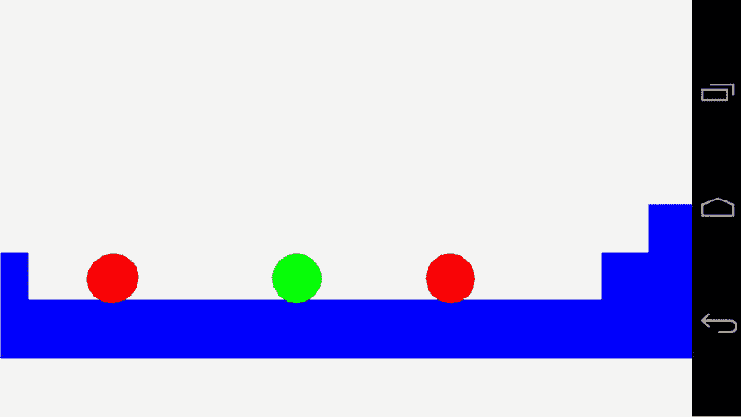
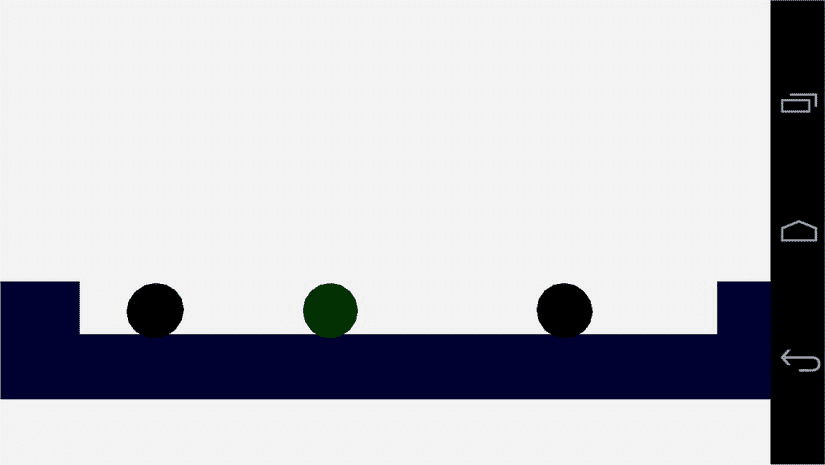
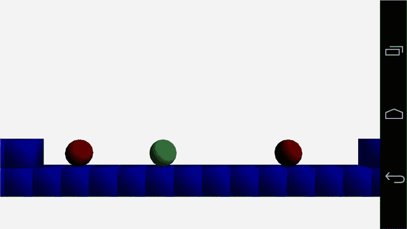
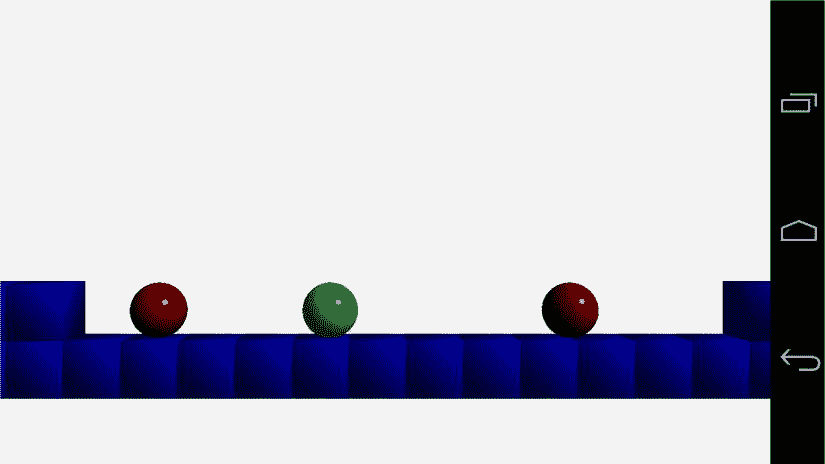
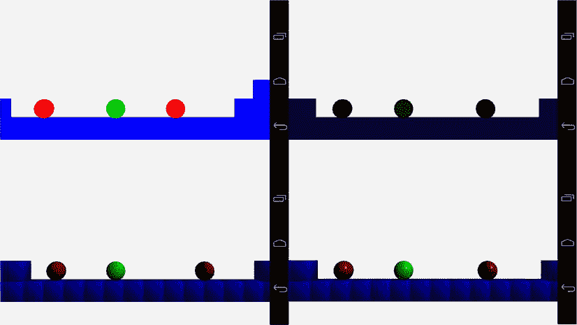

第九章

照明和材料

编程团队可以通过灯光和材质模型的应用，帮助美术团队实现他们渴望的游戏外观。这些年来，许多技术被开发出来赋予游戏一种特定的风格；2000 年发行的《喷气研磨电台》就是这样一款游戏。 *Jet Grind Radio* 因其单元格阴影图形风格而闻名，这使其在当时的竞争中脱颖而出。

鉴于它是在没有顶点和碎片着色器的平台上开发的，因此 *Jet Grind Radio* 的风格更加令人印象深刻。在过去的十年中，随着消费类硬件的发展，特殊的光照和材质效果在视频游戏中变得更加普遍，这使得实时着色器成为可能。这些功能现在在移动设备上也很普遍，着色器的灵活性为游戏开发人员提供了高级图形技术的使用。

在这一章中，我们将会看到基本的照明和材质技术，它们是用来制作更高级效果的基础。本章中的基本灯光和材质是 OpenGL ES 1.0 中固定功能灯光和材质的再现。

**注意** OpenGL ES 2.0 没有任何内置的光照支持；由程序员使用着色器来实现他们想要的模型。

首先，我们来看看光线对于程序员是如何定义的，以及光线是如何通过材质与我们的游戏实体相互作用的。

一个基本的灯光和材质模型

自然界中的光是一种复杂的现象。幸运的是，作为游戏开发者，我们不必用物理现实来模拟光线；相反，我们使用一个模型来模拟光的作用以及它如何与场景中的物体相互作用。

在最基本的层面上，无论我们是在顶点着色器还是片段着色器中处理灯光，我们的光源最终都会归结为一个方向和一个颜色，它会使用某种形式的方程来影响我们对象的输出颜色。

光的属性构成了我们照明方程的一组输入；另一组输入是对象本身的属性。我们将这些对象属性称为材料。当讨论材料时，我们说我们正在将材料应用于物体。

现代游戏引擎中的材质定义包括用于对模型进行着色的着色器程序、要应用的纹理以及任何其他特殊效果和渲染状态，这些都是正确渲染对象所必需的。

这是照明的简要概述，当你得知模型的实际实现稍微复杂一些时，你不会感到惊讶。我们的灯光和材质将被用来计算光线的三种不同成分:环境光，漫射光和镜面反射光。在这一章中，我们将介绍这些组件中的每一个，并看看每个组件的效果。

一旦我们看了照明等式的组成部分，我们将看一下引擎中光源的三种不同表示。这些将是平行光，位置光和聚光灯。

逐顶点或逐片段着色

OpenGL ES 1.0 中使用的着色模型称为 Blinn-Phong 着色模型。它以吉姆·布林和裴祥风的名字命名。Phong 在 1973 年描述了他的照明模型，这个模型后来被 Blinn 修改，并由此得名。

模型本身描述了我们将在本章中使用的公式，来计算应用于对象的颜色的环境、漫射和镜面反射分量。我们必须考虑的模型的另一个方面是我们希望计算有多精确。如果我们在顶点着色器中计算光线、表面和材质之间交互结果的颜色，颜色将存储在一个变量中，然后在多边形的其余部分进行插值。这种形式的插值颜色被称为 Gouraud 阴影，也是以该技术的作者 Henri Gouraud 的名字命名的。

这种技术可以给出可接受的结果，但通常可以很容易地看到多边形的边缘。另一种形式的插值是冯着色模型，这是由裴祥风描述，以及他的着色模型技术的其余部分。这种形式的插值包括对片段表面顶点的法线进行插值，并计算片段着色器中每个单独像素的照明颜色。这给出了更好的结果，但是显然计算量更大。

对我们来说幸运的是，在两种情况下照明的等式是相同的，因为与商业游戏相比，我们有一个非常简单的场景，我们将使用 Blinn-Phong 照明模型和 Phong 着色来给我们最好的结果。

在我们开始执行场景中的照明任务之前，我们必须创建一个可以表示材质的类。

代表材料

`Material`类将用于存储所有与我们场景中物体表面最终外观相关的信息。这包括任何着色器，纹理和颜色，我们将使用它们来表示照明等式的各个部分。[清单 9-1](#list1) 描述了`Material`类。我们还没有涵盖这个类的字段将用于什么，所以现在不要担心它们。

[***清单 9-1。***](#_list1)`Material`类声明。材料. h

```java
class Material
{
       private:
              Shader*       m_pShader;
              Texture*      m_pTexture;

              Vector4       m_ambientColor;
              Vector4       m_diffuseColor;
              Vector4       m_specularColor;
              float         m_specularExponent;

public:
       Material()
              :      m_pShader(NULL)
              ,      m_pTexture(NULL)
              ,      m_specularExponent(0.0f)
       {

       }

       ∼Material()
       {

       }

       void SetShader(Shader* pShader)
       {
              m_pShader = pShader;
       }

       Shader* GetShader() const
       {
              return m_pShader;
       }

       void SetTexture(Texture* pTexture)
       {
              m_pTexture = pTexture;
       }

       Texture* GetTexture() const
       {
              return m_pTexture;
       }

       void SetAmbientColor(Vector4 ambientColor)
       {
              m_ambientColor = ambientColor;
       }

       const Vector4& GetAmbientColor() const
       {
              return m_ambientColor;
       }

       void SetDiffuseColor(Vector4 diffuseColor)
       {
              m_diffuseColor = diffuseColor;
       }

       const Vector4& GetDiffuseColor() const
       {
              return m_diffuseColor;
       }

       void SetSpecularColor(Vector4 specularColor)
       {
              m_specularColor = specularColor;
       }

       const Vector4& GetSpecularColor() const
       {
              return m_specularColor;
       }

       void SetSpecularExponent(float specularExponent)
       {
              m_specularExponent = specularExponent;
       }

       const float GetSpecularExponent() const
       {
              return m_specularExponent;
       }
};

```

如你所见，我们的`Material`类只是一个容器，用来存储一些我们可以与对象关联的数据。我们通过将它添加到我们的`Renderable`类中来做到这一点。清单 9-2 展示了我们新的`Renderable`类，用一个`Material`代替了之前的着色器指针和颜色`Vector4`字段。

[***清单 9-2。***](#_list2) 添加一个`Material`来渲染。可渲染. h

```java
class Renderable
{
private:
       Geometry*     m_pGeometry;
 Material* m_pMaterial;
       Transform     m_transform;

       Vector3       m_min;
       Vector3       m_max;
       bool          m_useBounds;

public:
       Renderable();
       ∼Renderable();

       void          SetGeometry(Geometry* pGeometry);
       Geometry*     GetGeometry();

 void SetMaterial(Material* pMaterial);
 Material* GetMaterial();

       Transform&    GetTransform()       { return m_transform; }

       void                 SetBoundMin(const Vector3& min)    { m_min = min; }
       const Vector3&       GetBoundMin() const                { return m_min; }

       void                 SetBoundMax(const Vector3& max)    { m_max = max; }
       const Vector3&       GetBoundMax() const                { return m_max; }

       void                 SetUseBounds(bool enabled)         { m_useBounds = enabled; }
       bool                 GetUseBounds() const               { return m_useBounds; }

       bool                 IsInitialized() const
       {
 return m_pGeometry
&&
m_pMaterial;
       }
};

inline Renderable::Renderable()
       :      m_pGeometry(NULL)
 , m_pMaterial(NULL)
{

}

inline Renderable::∼Renderable()
{

}

inline void Renderable::SetGeometry(Geometry* pGeometry)
{
       m_pGeometry = pGeometry;
}

inline Geometry* Renderable::GetGeometry()
{
       return m_pGeometry;
}

inline void Renderable::SetMaterial(Material* pMaterial)
{
 m_pMaterial = pMaterial;
}

inline Material* Renderable::GetMaterial()
{
 return m_pMaterial;
}

```

现在我们有了一个可以为我们的可渲染对象存储材质属性的类，我们将看看如何在着色器中使用这些属性来为我们的场景添加光线。

环境照明

照明模型的环境成分用于模拟我们场景中的背景光。你可以把这想象成一个有窗户的房间里的日光。

房间里没有任何东西被光源直接照亮；然而，一切都有光反弹。这是因为来自太阳的光足够强大，它可以从许多物体上反弹回来，但仍然继续前进，照亮更多的物体。一旦太阳下山，一切都暗了很多，因为周围反射的环境光少了很多。

从这个意义上来说，环境光被视为基本级别的照明，以确保场景中的对象不会看起来完全是黑色的。环境照明组件的等式非常简单。

> *最终颜色=环境光颜色×环境颜色*

到目前为止，我们在`TransformShader` 中使用的当前渲染实际上相当于环境光值为(1，1，1，1)，它指定我们的对象应该被环境光完全照亮；[图 9-1](#Fig1) 显示了游戏在没有灯光的情况下是如何渲染的。



[图 9-1](#_Fig1) 。《机器人赛跑者》中一个没有灯光的场景

我们现在将通过添加一个新的着色器来改变这一点。清单 9-3 显示了`TransformAmbientShader`类。

[***清单 9-3。***](#_list3)`TransformAmbientShader`类声明。transformambientsharder . h

```java
class TransformAmbientShader
       :      public Shader
{
private:
       GLint  m_transformUniformHandle;
       GLint  m_positionAttributeHandle;
       GLint  m_colorUniformHandle;
       GLint  m_ambientLightUniformHandle;

public:
       TransformAmbientShader();
       virtual ∼TransformAmbientShader();

       virtual void Link();
       virtual void Setup(Renderable& renderable);
};

```

我们的`TransformAmbientShader`班和我们的`TransformShader`几乎一模一样；唯一增加的是一个新的字段来存储环境光制服的句柄。

`TransformAmbientShader`的构造函数包含了我们新着色器的新 GLSL 代码。片段着色器包含一个新的统一，`u_vAmbientLight`。这个制服是一个`vec4`，包含环境光常数。该常数与片段颜色相乘，以确定存储在`gl_FragColor`中的片段的环境颜色。[清单 9-4](#list4) 显示了新的 GLSL 代码。

[***清单 9-4。***](#_list4) `TransformAmbientShader's`建造师。transformambientsharder . CPP

```java
TransformAmbientShader::TransformAmbientShader()
{
       m_vertexShaderCode =
              "uniform mat4 u_mModel;                           \n"
              "attribute vec4 a_vPosition;                      \n"
              "void main(){                                     \n"
              "    gl_Position = u_mModel * a_vPosition;        \n"
              "}                                                \n";

       m_fragmentShaderCode =
              "precision mediump float;                         \n"
              "                                                 \n"
              "uniform vec4 u_vColor;                           \n"
              "uniform vec4 u_vAmbientLight;                    \n"
              "                                                 \n"
              "void main(){                                     \n"
              "    gl_FragColor = u_vAmbientLight * u_vColor;   \n"
              "}                                                \n";
}

```

我们需要获得新制服的句柄，我们在`TransformAmbientShader::Link`中这样做，如[清单 9-5](#list5) 所示。

[***清单 9-5。***](#_list5) `TransformAmbientShader::Link` 。transformambientsharder . CPP

```java
void TransformAmbientShader::Link()
{
       Shader::Link();
       m_transformUniformHandle            = glGetUniformLocation(m_programId, "u_mModel");
       m_positionAttributeHandle          = glGetAttribLocation(m_programId, "a_vPosition");
       m_colorUniformHandle               = glGetUniformLocation(m_programId, "u_vColor");
       m_ambientLightUniformHandle        = glGetUniformLocation(m_programId, "u_vAmbientLight");
}

```

这个新着色器的`Setup`方法也类似于`TransformShader`的方法。只有设置环境光颜色所需的行是新的。[清单 9-6](#list6) 突出了这些变化。

[***清单 9-6。***](#_list6) `TransformAmbientShader::Setup` 。transformambientsharder . CPP

```java
void TransformAmbientShader::Setup(Renderable& renderable)
{
       Geometry* pGeometry = renderable.GetGeometry();
       if (pGeometry)
       {
              Shader::Setup(renderable);
              Renderer& renderer = Renderer::GetSingleton();
              const Matrix4& viewMatrix = renderer.GetViewMatrix();
              const Matrix4& projectionMatrix = renderer.GetProjectionMatrix();
              Matrix4 modelViewMatrix;
              renderable.GetTransform().GetMatrix().Multiply(viewMatrix, modelViewMatrix);
              Matrix4 modelViewProjectionMatrix;
              modelViewMatrix.Multiply(projectionMatrix, modelViewProjectionMatrix);
              glUniformMatrix4fv(m_transformUniformHandle, 1, false, modelViewProjectionMatrix.m_m);
              glVertexAttribPointer(
                     m_positionAttributeHandle,
                     pGeometry->GetNumVertexPositionElements(),
                     GL_FLOAT,
                     GL_FALSE,
                     pGeometry->GetVertexStride(),
                     pGeometry->GetVertexBuffer());
              glEnableVertexAttribArray(m_positionAttributeHandle);
              const Vector4& color = renderable.GetMaterial()->GetAmbientColor();
              glUniform4f(m_colorUniformHandle, color.m_x, color.m_y, color.m_z, color.m_w);
 const Vector4
&
ambientLightColor = renderer.GetAmbientLightColor();
 glUniform4f(m_ambientLightUniformHandle,
 ambientLightColor.m_x,
 ambientLightColor.m_y,
 ambientLightColor.m_z,
 ambientLightColor.m_w);
       }
}

```

这个清单表明，我们还必须向我们的`Renderer`添加一些新方法。[清单 9-7](#list7) 显示了这个小的增加；只需向`Renderer`类添加一个新的`private Vector4`字段，并添加设置和获取值的方法。

[***清单 9-7。***](#_list7) 给渲染器添加 m_ambientLightColor。Renderer.h

```java
class Renderer
       :      public Task
       ,      public EventHandler
       ,      public Singleton<Renderer>
{
public:
       enum FrustumParameters
       {
              TOP,
              BOTTOM,
              RIGHT,
              LEFT,
              NEAR,
              FAR,
              NUM_PARAMS
       };

private:
       android_app*         m_pState;
       EGLDisplay           m_display;
       EGLContext           m_context;
       EGLSurface           m_surface;
       int                  m_width;
       int                  m_height;
       bool                 m_initialized;
       bool                 m_paused;

       typedef std::vector<Shader*>             ShaderVector;
       typedef ShaderVector::iterator           ShaderVectorIterator;

       typedef std::vector<Texture*>            TextureVector;
       typedef TextureVector::iterator          TextureVectorIterator;

       typedef std::vector<Renderable*>         RenderableVector;
       typedef RenderableVector::iterator       RenderableVectorIterator;

       RenderableVector     m_renderables;
       TextureVector        m_textures;
       ShaderVector         m_shaders;

       float                m_frustumParameters[NUM_PARAMS];

       Matrix4              m_cameraMatrix;
       Matrix4              m_viewMatrix;
       Matrix4              m_projectionMatrix;

       void Draw(Renderable* pRenderable);
       void BuildFrustumPlanes(Plane frustumPlanes[]);
       bool ShouldDraw(Renderable* pRenderable, Plane frustumPlanes[]) const;

 Vector4 m_ambientLightColor;
public:
       explicit Renderer(android_app* pState, const unsigned int priority);
       virtual ∼Renderer();
       void Init();
       void Destroy();

       void AddRenderable(Renderable* pRenderable);
       void AddShader(Shader* pShader);
       void RemoveShader(Shader* pShader);

       void AddTexture(Texture* pTexture);
       void RemoveTexture(Texture* pTexture);

       // From Task
       virtual bool  Start();
       virtual void  OnSuspend();
       virtual void  Update();
       virtual void  OnResume();
       virtual void  Stop();

       virtual void  HandleEvent(Event* event);
       bool IsInitialized() { return m_initialized; }
       void                 SetCameraMatrix(const Matrix4& cameraMatrix)
       {
              m_cameraMatrix = cameraMatrix;
       }

       const Matrix4&       GetCameraMatrix() const     { return m_cameraMatrix; }

       void                 SetViewMatrix(const Matrix4& viewMatrix)
       {
              m_viewMatrix = viewMatrix;
       }
       const Matrix4&       GetViewMatrix() const       { return m_viewMatrix; }

       void                 SetFrustum(const float frustumParameters[]);
       const Matrix4&       GetProjectionMatrix() const { return m_projectionMatrix; }

       int                  GetWidth() const            { return m_width; }
       int                  GetHeight() const           { return m_height; }

 void SetAmbientLightColor(const Vector4&
ambientLightColor)
 {
 m_ambientLightColor = ambientLightColor;
 }
 const Vector4&
GetAmbientLightColor() const
 {
 return m_ambientLightColor;
 }
};

```

图 9-2 显示了游戏的状态，环境光照被应用到渲染中。



[图 9-2](#_Fig2) 。环境照明场景

如[图 9-2](#Fig2) 所示，每种颜色成分的环境光水平为 0.2f 意味着我们的物体几乎是黑色的。几乎不可能辨认出 AI 敌人身上的任何红色阴影，但是玩家确实有一点绿色阴影。板条箱也是非常浅的蓝色。这对于我们的场景来说非常理想，当我们添加更多的颜色时，我们会看到这一点。

在我们进入照明等式的下一个元素之前，我们必须更新我们的几何图形。光照方程的漫反射和镜面反射部分需要知道模型中多边形的朝向。我们可以通过在着色器中提供一个法向量和每个顶点来做到这一点。

顶点法线

到目前为止，我们已经在这本书里碰到过几次法向量。如果你还记得，法向量是一个单位长度的向量，用来表示方向，而不是表示位移。

我们可以用平面方程算出多边形的法线。由于我们在为 Android 开发 OpenGL ES 2.0 游戏时总是在处理平面三角形，所以我们可以使用三角形的三个点来生成三角形的曲面法线。附录 D 中介绍了这个过程的数学，以及`Plane`类及其方法的列表。

幸运的是，我们所有的模型通常都是从 3D 建模包中导出的。这些 3D 建模软件包通常能够为我们正在创建的任何模型生成和导出表面法线。对于这本书，我一直使用免费的建模包 Blender，你可以从`www.blender.org`获得。

假设我们将从 3D 包中导出网格的顶点法线，我们应该看看如何在代码中表示这些数据。[清单 9-8](#list8) 显示了`Geometry`类中支持顶点法线所需的更新。

[***清单 9-8。***](#_list8) 更新`Geometry`来处理顶点法线。Geometry.h

```java
class Geometry
{
private:
       static const unsigned int NAME_MAX_LENGTH = 16;
       char   m_name[NAME_MAX_LENGTH];
       int    m_numVertices;
       int    m_numIndices;
       void*  m_pVertices;
       void*  m_pIndices;

       int    m_numVertexPositionElements;
       int m_numNormalPositionElements;
       int    m_numTexCoordElements;
       int    m_vertexStride;

public:
       Geometry();
       virtual ∼Geometry();

       void   SetName(const char* name)                 { strcpy(m_name, name); }
       void   SetNumVertices(const int numVertices)     { m_numVertices = numVertices; }
       void   SetNumIndices(const int numIndices)       { m_numIndices = numIndices; }

       const char*   GetName() const                    { return m_name; }

       const int     GetNumVertices() const             { return m_numVertices; }
       const int     GetNumIndices() const              { return m_numIndices; }

       void*         GetVertexBuffer() const            { return m_pVertices; }
       void*         GetIndexBuffer() const             { return m_pIndices; }

       void          SetVertexBuffer(void* pVertices)   { m_pVertices = pVertices; }
       void          SetIndexBuffer(void* pIndices)     { m_pIndices = pIndices; }

       void          SetNumVertexPositionElements(const int numVertexPositionElements)
       {
              m_numVertexPositionElements = numVertexPositionElements;
       }

       int           GetNumVertexPositionElements() const
       {
              return m_numVertexPositionElements;
       }

 void SetNumNormalPositionElements(const int numNormalPositionElements)
 {
 m_numNormalPositionElements = numNormalPositionElements;
 }

 int GetNumNormalPositionElements() const
 {
 return m_numNormalPositionElements;
 }

       void          SetNumTexCoordElements(const int numTexCoordElements)
       {
              m_numTexCoordElements = numTexCoordElements;
       }

       int           GetNumTexCoordElements() const
       {
              return m_numTexCoordElements;
       }

       void          SetVertexStride(const int vertexStride)
       {
              m_vertexStride = vertexStride;
       }

       int           GetVertexStride() const
       {
              return m_vertexStride;
       }
};

```

我们添加了字段来存储我们的`Geometry`类的法线数量。这进一步扩展了我们的结构数组格式的顶点数据的存储。这是将几何数据流式传输到当前移动 GPU 的最佳方法。

随着`Geometry`类现在能够处理包含顶点法线数据的模型，让我们继续看看漫射光照着色器将如何利用它们。

漫射照明

我们试图用本章中的着色器实现的光照方程 是一个加法方程。这意味着我们的照明组件加在一起，形成最终的结果。在漫射照明这一节中，我们将看看下面等式的第二部分:

> *最终颜色=环境颜色+漫射颜色+镜面颜色*

我们已经看到了环境颜色是如何设置物体的基础光值的。然而，环境光本身仍然让我们的物体看起来是平的。这是因为环境光功能没有考虑光源和表面朝向的方向之间的角度。

现在，我们将实现一个游戏光源的最简单的版本，一个方向灯。平行光 用于模拟极远处的光源。如果你想象太阳，我们可以通过把它想象成一个在各个方向上强度相等的球体来简化它所发出的光。当来自太阳的光到达地球时，来自球体的光线来自整个球体的一个非常小的碎片。在一个游戏场景中，我们将其简化为一个模型，在这个模型中，我们认为来自这个光源的所有光线都是平行传播的，并且从完全相同的方向照射到我们所有的物体上。

“方向”和“定向”这两个词在上一段中已经使用了几次，你可能已经猜到我们将使用另一个法向量来表示光线的方向。然而，我们将不会存储光传播的方向；我们实际上会存储相反的内容。当你看到我们的颜色的漫射照明分量的等式时，这个原因就变得很清楚了:

> *漫射颜色= max(L.N，0) ×漫射灯光颜色×漫射材质颜色*

前面等式中的 L.N 项表示我们的方向光矢量和当前顶点法线之间的点积。点积给出了以下结果:

> *L.N = |L||N|cos(alpha)*

L 和 N 周围的线代表这些向量的长度(或大小)。光照方程中的向量是法线；因此，它们的长度是 1。这意味着两个法向量点积的结果是两者夹角的余弦。0 度的余弦为 1，90 度的余弦为 0，180 度的余弦为 1。由于我们的片段颜色值输出范围是从 0 到 1，我们将使用点积结果或 0 中的较高值。对于 0 到 90 度之间的任何角度，我们将为这个片段添加一个漫反射颜色组件。

漫射组件顶点着色器

在我们查看漫反射组件的片段着色器代码之前，我们将检查设置顶点位置和法线所需的顶点着色器。[清单 9-9](#list9) 包含了`TransformAmbientDiffuseShader`的顶点着色器的代码。

[***清单 9-9。***](#_list9) `TransformAmbientDiffuseShader's`顶点着色器来源。transformationdiffuse shader . CPP

```java
m_vertexShaderCode =
       "uniform mat4 u_mModelViewProj;                           \n"
       "uniform mat3 u_mModelIT;                                 \n"
       "attribute vec4 a_vPosition;                              \n"
       "attribute vec3 a_vNormal;                                \n"
       "varying   vec3 v_vNormal;                                \n"
       "void main(){                                             \n"
       "    gl_Position = u_mModelViewProj * a_vPosition;        \n"
       "    v_vNormal = normalize(u_mModelIT * a_vNormal);       \n"
       "}                                                        \n";

```

我们的顶点着色器易于阅读。我们有一个矩阵`u_mModelViewProj`，像往常一样，我们用它将顶点的位置属性转换成标准化的设备坐标。

我们现在还有一个顶点法线属性和一个可变变量来存储输出。GLSL 的变量用于在组成三角形的三个顶点之间插值。因为我们现在为每个顶点指定了一个法向量，所以我们必须将每个顶点存储到一个变量中，以便为每个要着色的片段进行插值。

当我们将法线存入`v_vNormal`时，我们也将它乘以矩阵`u_mModelIT`。这个矩阵负责将矩阵从模型的局部空间转换到世界空间。由于法向量不需要任何平移，矩阵本身只是一个 3x3 的旋转和缩放矩阵。不幸的是，我们不能简单地用模型的变换矩阵直接变换法线。可以应用于模型的任何缩放将导致法线相对于其表面改变方向。相反，我们必须使用模型矩阵的逆转置来转换法线。

如果你还记得，旋转矩阵是一个正交矩阵。这种矩阵的特殊之处在于它的逆矩阵也是它的转置矩阵；因此，模型变换的旋转部分的逆转置将保持不变。缩放矩阵是对角矩阵，因此缩放矩阵的转置与标准矩阵没有什么不同。逆标度元素包含 1 除以原始标度，得到逆。将法线与模型矩阵的逆转置相乘允许我们以与模型相同的方式将法线旋转到世界空间中，但也保留了原始法线相对于它所代表的表面的方向。

漫射组件片段着色器

随着顶点着色器的方式，我们可以看看片段着色器。我们在清单 9-10 中这样做。

[***清单 9-10。***](#_list10) `TransformAmbientDiffuseShader's`碎片着色器来源。transformationdiffuse shader . CPP

```java
m_fragmentShaderCode =
       "precision mediump float;                                        \n"
       "varying vec3 v_vNormal;                                         \n"
       "                                                                \n"
       "uniform vec4 u_vAmbientColor;                                   \n"
       "uniform vec4 u_vDiffuseColor;                                   \n"
       "uniform vec4 u_vAmbientLight;                                   \n"
       "uniform vec4 u_vDiffuseLight;                                   \n"
       "uniform vec3 u_vLightDirection;                                 \n"
       "                                                                \n"
       "const float c_zero = 0.0;                                       \n"
       "const float c_one  = 1.0;                                       \n"
       "                                                                \n"
       "void main(){                                                    \n"
       "    gl_FragColor = vec4(c_zero, c_zero, c_zero, c_zero);        \n"
       "                                                                \n"
       "    float ndotl = dot(u_vLightDirection, v_vNormal);            \n"
       "    ndotl = max(ndotl, c_zero);                                 \n"
       "    gl_FragColor += ndotl * u_vDiffuseLight * u_vDiffuseColor;  \n"
       "                                                                \n"
       "    gl_FragColor += u_vAmbientLight * u_vAmbientColor;          \n"
       "                                                                \n"
       "    gl_FragColor.a = c_one;                                     \n"
       "}                                                               \n";

```

漫射照明组件的片段着色器首先声明该着色器程序的浮点运算的默认精度。在研究具体细节时，着色器精度限定符可能是一个复杂的主题。出于本书的目的，知道精度影响给定数据类型的可用值范围就足够了。

有三种精度限定符可用，`lowp`、`mediump`和`highp`。出于照明等式的目的，`lowp`通常不能提供足够的精度，而`highp`通常能提供比我们需要的更多的精度。每一级精度的提高导致着色器执行时间更长；因此，选择适合任何给定着色器的精度级别是很重要的。我这里用了`mediump`；然而，当我将设置更改为`lowp`时，我实际上看不出有什么不同。

同样值得记住的是，有些平台可能不支持所有的精度限定符。OpenGL ES 2.0 标准规定片段着色器和顶点着色器所需的最低精度限定符分别为`mediump`和 highp。

**注意**目前，Nvidia 的 Tegra 3 平台是唯一不支持片段着色器中的`highp`限定符的芯片组。然而，如果你确实使用了`highp`，Tegra 3 着色器编译器将自动使用`mediump`，但是值得记住这一点。

接下来，我们声明包含插值法向量的变量。请记住，顶点着色器将为每个顶点计算转换后的法线，GPU 将使用线性插值来计算每个片段的法线位置。线性插值通过在每个极端使用值 0 和 1 来计算。数字 5 和 10 中间的线性插值看起来像下面的等式。

> *((10–5)* 0.5)+5 = 7.5*

在这里，我们计算两个极端值之间的差值，在这种情况下，该差值被总和 10–5 覆盖。然后，我们将该范围乘以插值因子，插值因子为 0.5，代表两个极值之间的中间值。最后一步包括添加第一个极值来计算位于第一个和第二个点之间的点。

然后我们有了统一的价值观。制服是从游戏代码提供给片段着色器的所有实例的变量。在我们的漫反射着色器中，我们提供了代表物体材质的环境光和漫反射颜色、灯光的环境光和漫反射颜色以及灯光方向的制服。我们还指定了常数来表示值 0.0 和 1.0；分别是`c_zero`和`c_one`。

我们的 main 方法是在声明了所有变量之后定义的。我们首先将`gl_FragColor`初始化为在每个元素包含`c_zero`的`vec4`。

然后使用点方法计算矢量`v_vLightDirection`和`v_vNormal`的点积。通过在我们的片段着色器中进行这种计算，我们已经实现了被称为逐像素照明的技术。如果我们已经在顶点着色器中计算了点积，我们将实现逐顶点照明。在顶点着色器中计算光照方程要快得多，但结果并不理想。如果你正在实现一个完整的游戏，用逐片段着色器照亮关键对象，用逐顶点着色器照亮其他不太重要的对象可能是一种用来优化游戏的技术。

着色器中的下一行使用 max 将点积的最低可能值限制为 0。然后，我们将计算漫反射颜色所需的三个元素相乘，`ndotl`、`u_vDiffuseLight`和`u_vDiffuseColor`。

随着我们的漫射颜色分量的计算，我们然后添加环境分量的结果。其计算方法与清单 9-4 中的[相同，将环境光向量乘以环境颜色向量。](#list4)T3】

使用 OpenGL ES 2.0 初始化着色器

[清单 9-11](#list11) 包含了获取我们制服和属性的句柄所需的`Link`方法 。

[***清单 9-11。***](#_list11) `TransformAmbientDiffuseShader::Link`。transformambientdevissueshader . CPP

```java
void TransformAmbientDiffuseShader::Link()
{
       Shader::Link();
       m_modelViewProjUniformHandle       = glGetUniformLocation(m_programId, "u_mModelViewProj");
       m_modelITMatrixUniformHandle       = glGetUniformLocation(m_programId, "u_mModelIT");
       m_positionAttributeHandle          = glGetAttribLocation(m_programId,  "a_vPosition");
       m_normalAttributeHandle            = glGetAttribLocation(m_programId,  "a_vNormal");
       m_ambientColorUniformHandle        = glGetUniformLocation(m_programId, "u_vAmbientColor");
       m_diffuseColorUniformHandle        = glGetUniformLocation(m_programId, "u_vDiffuseColor");
       m_ambientLightUniformHandle        = glGetUniformLocation(m_programId, "u_vAmbientLight");
       m_diffuseLightUniformHandle        = glGetUniformLocation(m_programId, "u_vDiffuseLight");
       m_lightDirectionUniformHandle      = glGetUniformLocation(m_programId, "u_vLightDirection");
}

```

回想一下清单 9-9 中的内容，我们必须向顶点着色器提供模型的逆转置变换矩阵来变换顶点法线。[清单 9-12](#list12) 显示了`TransformAmbientDiffuseShader::Setup`方法，它包含了计算这个矩阵的代码。

[***清单 9-12。***](#_list12) `TransformAmbientDiffuseShader::Setup` 。transformambientdevissueshader . CPP

```java
void TransformAmbientDiffuseShader::Setup(Renderable& renderable)
{
       Geometry* pGeometry = renderable.GetGeometry();
       if (pGeometry)
       {
              Shader::Setup(renderable);
              Renderer& renderer = Renderer::GetSingleton();
              const Matrix4& viewMatrix = renderer.GetViewMatrix();
              const Matrix4& projectionMatrix = renderer.GetProjectionMatrix();
              const Matrix4& modelMatrix = renderable.GetTransform().GetMatrix();
              Matrix4 modelViewMatrix;
              modelMatrix.Multiply(viewMatrix, modelViewMatrix);
              Matrix4 modelViewProjectionMatrix;
              modelViewMatrix.Multiply(projectionMatrix, modelViewProjectionMatrix);
              glUniformMatrix4fv(
                     m_modelViewProjUniformHandle,
                     1,
                     false,
                     modelViewProjectionMatrix.m_m);

              Matrix3 modelIT;
              renderable.GetTransform().GetInverseTransposeMatrix(modelIT);
              glUniformMatrix3fv(m_modelITMatrixUniformHandle, 1, false, modelIT.m_m);
              glVertexAttribPointer(
                     m_positionAttributeHandle,
                     pGeometry->GetNumVertexPositionElements(),
                     GL_FLOAT,
                     GL_FALSE,
                     pGeometry->GetVertexStride(),
                     pGeometry->GetVertexBuffer());
              glEnableVertexAttribArray(m_positionAttributeHandle);
              glVertexAttribPointer(
                     m_normalAttributeHandle,
                     pGeometry->GetNumNormalPositionElements(),
                     GL_FLOAT,
                     GL_FALSE,
                     pGeometry->GetVertexStride(),
                     static_cast<float*>(pGeometry->GetVertexBuffer()) +
                            pGeometry->GetNumVertexPositionElements());
              glEnableVertexAttribArray(m_normalAttributeHandle);
              const Vector4& ambientColor = renderable.GetMaterial()->GetAmbientColor();
              glUniform4f(
                     m_ambientColorUniformHandle,
                     ambientColor.m_x,
                     ambientColor.m_y,
                     ambientColor.m_z,
                     ambientColor.m_w);

              const Vector4& diffuseColor = renderable.GetMaterial()->GetDiffuseColor();
              glUniform4f(
                     m_diffuseColorUniformHandle,
                     diffuseColor.m_x,
                     diffuseColor.m_y,
                     diffuseColor.m_z,
                     diffuseColor.m_w);

              const Vector4& ambientLightColor = renderer.GetAmbientLightColor();
              glUniform4f(
                     m_ambientLightUniformHandle,
                     ambientLightColor.m_x,
                     ambientLightColor.m_y,
                     ambientLightColor.m_z,
                     ambientLightColor.m_w);

              const Vector4& diffuseLightColor = renderer.GetDiffuseLightColor();
              glUniform4f(
                     m_diffuseLightUniformHandle,
                     diffuseLightColor.m_x,
                     diffuseLightColor.m_y,
                     diffuseLightColor.m_z,
                     diffuseLightColor.m_w);

              const Vector3& lightDirection = renderer.GetLightDirection();
              glUniform3f(
                     m_lightDirectionUniformHandle,
                     lightDirection.m_x,
                     lightDirection.m_y,
                     lightDirection.m_z);
       }
}

```

我们通过获得对当前视图矩阵 、投影矩阵 和模型矩阵 的引用来开始该方法。然后将`modelMatrix`乘以`viewMatrix`得到`modelViewMatrix`。`modelViewMatrix` 再乘以`projectionMatrix`。这给了我们`modelViewProjection`矩阵，这是将我们的模型顶点转换成标准视图体所必需的。我们使用`glUniformMatrix4fv`将这个矩阵上传到 GPU，与我们的顶点着色器中的统一`u_mModelViewProj`一起使用。

该方法的下一步是获得模型的变换矩阵的逆转置。我们使用`Transform::GetInverseTransposeMatrix`来做这件事。清单 6-21 显示了`Transform`的类声明；我们在[清单 9-13](#list13) 中描述了`GetInverseTransposeMatrix`T3 的代码。

[***清单 9-13。***](#_list13) `Transform::GetInverseTransposeMatrix`。Transform.cpp

```java
void Transform::GetInverseTransposeMatrix(Matrix4& out) const
{
       float invScale = 1.0f / m_scale;
       out.m_m[0] = m_rotation.m_m[0] * invScale;
       out.m_m[1] = m_rotation.m_m[1];
       out.m_m[2] = m_rotation.m_m[2];
       out.m_m[3] = 0.0f;
       out.m_m[4] = m_rotation.m_m[3];
       out.m_m[5] = m_rotation.m_m[4] * invScale;
       out.m_m[6] = m_rotation.m_m[5];
       out.m_m[7] = 0.0f;
       out.m_m[8] = m_rotation.m_m[6];
       out.m_m[9] = m_rotation.m_m[7];
       out.m_m[10] = m_rotation.m_m[8] * invScale;
       out.m_m[11] = 0.0f;
       out.m_m[12] = -m_translation.m_x;
       out.m_m[13] = -m_translation.m_y;
       out.m_m[14] = -m_translation.m_z;
       out.m_m[15] = 1.0f;
}

void Transform::GetInverseTransposeMatrix(Matrix3& out) const
{
       float invScale = 1.0f / m_scale;
       out.m_m[0] = m_rotation.m_m[0] * invScale;
       out.m_m[1] = m_rotation.m_m[1];
       out.m_m[2] = m_rotation.m_m[2];
       out.m_m[3] = m_rotation.m_m[3];
       out.m_m[4] = m_rotation.m_m[4] * invScale;
       out.m_m[5] = m_rotation.m_m[5];
       out.m_m[6] = m_rotation.m_m[6];
       out.m_m[7] = m_rotation.m_m[7];
       out.m_m[8] = m_rotation.m_m[8] * invScale;
}

```

[清单 9-13](#list13) 包含了从`Transform`获得逆转置矩阵的方法的两个版本。我们已经知道，旋转矩阵的逆转置是原矩阵，所以我们按照正常顺序复制旋转矩阵。标度矩阵的转置不会改变任何东西，我们可以通过将标度分成 1 来非常容易地计算标度分量的倒数。我们在清单 9-12 中的代码使用了这个方法的版本，它获得了一个 3x3 的矩阵，因为我们的法线不需要平移组件。

然后我们的顶点属性就设置好了。用几何类的适当参数初始化`m_positionAttributeHandle`，并用`glEnableVertexAttribArray`启用。然后我们对法线做同样的事情。第一法线的地址通过将顶点缓冲区指针转换为浮点指针并加上顶点位置元素的数量来计算。

然后使用`glUniform4f`和`glUniform3f` 初始化包含材质和光色属性的矢量。

我们的代码现在应该完成了，我们将在游戏中看到一些漫射灯光。这是我们第一次能够真正看到场景的深度，并且能够告诉我们已经成功地创建了一个三维游戏。[图 9-3](#Fig3) 显示了启用漫射照明的场景截图。



[图 9-3](#_Fig3) 。漫射照明

从前面的截图可以明显看出，我们已经将漫射光源设置在物体的右上方。灯光在这些区域最亮，在对象的左下方变暗。我们还可以看到玩家和 AI 对象的球形形状，以及我们立方体的深度。

Blinn-Phong 照明模型的剩余部分是镜面反射部分。我们接下来看看这个。

镜面照明

照明等式的镜面反射部分决定了给定对象的表观亮度。到目前为止，环境光组件已经给出了一个基本级别的光，以显示对象最暗区域的颜色。漫射组件为对象添加了大部分照明，这有助于确定场景中对象的颜色和形状。现在，镜面反射组件被添加到这些组件中，以使对象看起来或多或少具有反射性。就像漫反射组件一样，镜面反射组件有一个等式，我们将在片段着色器中实现它。那个方程 如下:

> *高光颜色= max(H.N，0)^S ×高光颜色×高光材质颜色*

前面的等式包含了 Blinn 对 Phong 着色模型 的修改。原始模型包含向量 R 而不是 h。R 代表反射光向量，必须为给定模型中的每个顶点计算该向量。向量 H 表示半向量，并且可以为每个模型计算一次:

> *半矢量=归一化(眼睛矢量+光线矢量)*

前面的等式依赖于分别指向相机位置和光源的眼睛矢量和光矢量。

镜面反射方程中的镜面反射指数 S 控制着材质的光泽度。该指数越高，表面越不亮。

我们现在来看看光照公式中这个部分的顶点着色器。

镜面组件顶点着色器

Blinn-Phong 模型的镜面反射部分的顶点着色器如[列表 9-14](#list14) 所示。

[***清单 9-14。***](#_list14) `TransformAmbientDiffuseSpecularShader's`顶点明暗器。transformationdifferential mirror shader . CPP

```java
m_vertexShaderCode =
       "uniform mat4 u_mModelViewProj;                                         \n"
       "uniform mat3 u_mModelIT;                                               \n"
       "attribute vec4 a_vPosition;                                            \n"
       "attribute vec3 a_vNormal;                                              \n"
       "varying   vec3 v_vNormal;                                              \n"
       "void main(){                                                           \n"
       "    gl_Position = u_mModelViewProj * a_vPosition;                      \n"
       "    v_vNormal = normalize(u_mModelIT * a_vNormal);                     \n"
       "}                                                                      \n";

```

希望我们的顶点着色器与`TransformAmbientDiffuseShader`中使用的顶点着色器没有什么不同，这并不奇怪。我们使用 Phong 着色来计算每个像素的光照值。我们将直接进入片段着色器。

镜面组件片段着色器

我们的片段着色器将添加 Blinn-Phong 模型的下一个附加组件，镜面组件。我们已经看过这个组件的方程式，所以清单 9-15 直接进入片段着色器源代码。

[***清单 9-15。***](#_list15) `TransformAmbientDiffuseSpecularShader's`碎片着色器。transformationdifferential mirror shader . CPP

```java
m_fragmentShaderCode =
       "precision mediump float;                                               \n"
       "varying   vec3 v_vNormal;                                              \n"
       "                                                                       \n"
       "uniform vec4 u_vAmbientColor;                                          \n"
       "uniform vec4 u_vDiffuseColor;                                          \n"
       "uniform vec4 u_vSpecularColor;                                         \n"
       "uniform float u_fSpecularExponent;                                     \n"
       "uniform vec4 u_vAmbientLight;                                          \n"
       "uniform vec4 u_vDiffuseLight;                                          \n"
       "uniform vec4 u_vSpecularLight;                                         \n"
       "uniform vec3 u_vLightDirection;                                        \n"
       "uniform vec3 u_vLightHalfVector;                                       \n"
       "                                                                       \n"
       "const float c_zero = 0.0;                                              \n"
       "const float c_one  = 1.0;                                              \n"
       "                                                                       \n"
       "void main(){                                                           \n"
       "    gl_FragColor = vec4(c_zero, c_zero, c_zero, c_zero);               \n"
       "                                                                       \n"
       "    float ndoth =  dot(u_vLightHalfVector, v_vNormal);                 \n"
       "    ndoth = max(ndoth, c_zero);                                        \n"
       "    float dotPow = pow(ndoth, u_fSpecularExponent);                    \n"
       "    gl_FragColor += dotPow * u_vSpecularColor * u_vSpecularLight;      \n"
       "                                                                       \n"
       "    float ndotl = dot(u_vLightDirection, v_vNormal);                   \n"
       "    ndotl = max(ndotl, c_zero);                                        \n"
       "    gl_FragColor += ndotl * u_vDiffuseLight * u_vDiffuseColor;         \n"
       "                                                                       \n"
       "    gl_FragColor += u_vAmbientLight * u_vAmbientColor;                 \n"
       "                                                                       \n"
       "    gl_FragColor.a = c_one;                                            \n"
       "}                                                                      \n";

```

由于我们的新着色器包含环境和漫射组件，它保留了这些计算所需的所有均匀性。我们新推出的制服是`u_vSpecularColor`、`u_fSpecularExponent`、`u_vSpecularLight`和`u_vLightHalfVector`。

着色器中有四条新的线用于计算镜面反射分量。第一个计算`u_vLightHalfVector`和`v_vNormal`之间的点积。这给了我们半矢量和碎片的法向量之间的角度。然后我们取点积或零的较高值。然后，将前面步骤的结果乘以镜面反射分量的幂，最后，将乘以镜面反射指数的点积乘以镜面反射材质和灯光颜色。

因为这个等式是一个加法过程，我们添加了漫射分量，然后添加了环境分量来得到最终的碎片颜色。

我们的着色器代码完成后，最后一步是查看将着色器投入使用所需的 OpenGL ES 2.0 代码。

正在初始化 transformambientdevisvirsershader

像我们所有的着色器一样，我们必须覆盖`Link`和`Setup`方法才能使用这个特定的着色器。

我们看看清单 9-16 中的[中的`TransformAmbientDiffuseSpecularShader::Link`。](#list16)

[***清单 9-16。***](#_list16) `TransformAmbientDiffuseSpecularShader::Link`。transformambientdevisvirsershader . CPP

```java
void TransformAmbientDiffuseSpecularShader::Link()
{
       Shader::Link();
       m_modelViewProjUniformHandle     = glGetUniformLocation(m_programId, "u_mModelViewProj");
       m_modelITMatrixUniformHandle     = glGetUniformLocation(m_programId, "u_mModelIT");
       m_positionAttributeHandle        = glGetAttribLocation(m_programId,  "a_vPosition");
       m_normalAttributeHandle          = glGetAttribLocation(m_programId,  "a_vNormal");
       m_ambientColorUniformHandle      = glGetUniformLocation(m_programId, "u_vAmbientColor");
       m_diffuseColorUniformHandle      = glGetUniformLocation(m_programId, "u_vDiffuseColor");
       m_specularColorUniformHandle     = glGetUniformLocation(m_programId, "u_vSpecularColor");
       m_specularExponentUniformHandle  = glGetUniformLocation(m_programId, "u_fSpecularExponent");
       m_ambientLightUniformHandle      = glGetUniformLocation(m_programId, "u_vAmbientLight");
       m_diffuseLightUniformHandle      = glGetUniformLocation(m_programId, "u_vDiffuseLight");
       m_specularLightUniformHandle     = glGetUniformLocation(m_programId, "u_vSpecularLight");
       m_lightDirectionUniformHandle    = glGetUniformLocation(m_programId, "u_vLightDirection");
       m_lightHalfVectorUniformHandle   = glGetUniformLocation(m_programId, "u_vLightHalfVector");
}

```

在 Link 中，我们使用 OpenGL ES 2.0 方法`glGetUniformLocation`和`glGetAttribLocation`获得了设置制服和属性所需的所有句柄。我们将这些句柄用于 `TransformAmbientDiffuseSpecularShader::Setup`，如[清单 9-17](#list17) 所示。

[***清单 9-17。***](#_list17) 清单 9-17。`TransformAmbientDiffuseSpecularShader::Setup`。transformambientdevisvirsershader . CPP

```java
void TransformAmbientDiffuseSpecularShader::Setup(Renderable& renderable)
{
       Geometry* pGeometry = renderable.GetGeometry();
       if (pGeometry)
       {
              Shader::Setup(renderable);
              Renderer& renderer = Renderer::GetSingleton();
              const Matrix4& viewMatrix = renderer.GetViewMatrix();
              const Matrix4& projectionMatrix = renderer.GetProjectionMatrix();
              const Matrix4& modelMatrix = renderable.GetTransform().GetMatrix();
              Matrix4 modelViewMatrix;
              modelMatrix.Multiply(viewMatrix, modelViewMatrix);
              Matrix4 modelViewProjectionMatrix;
              modelViewMatrix.Multiply(projectionMatrix, modelViewProjectionMatrix);
              glUniformMatrix4fv(
                     m_modelViewProjUniformHandle,
                     1,
                     false,
                     modelViewProjectionMatrix.m_m);

              Matrix3 modelIT;
              renderable.GetTransform().GetInverseTransposeMatrix(modelIT);
              glUniformMatrix3fv(m_modelITMatrixUniformHandle, 1, false, modelIT.m_m);
              glVertexAttribPointer(
                     m_positionAttributeHandle,
                     pGeometry->GetNumVertexPositionElements(),
                     GL_FLOAT,
                     GL_FALSE,
                     pGeometry->GetVertexStride(),
                     pGeometry->GetVertexBuffer());
              glEnableVertexAttribArray(m_positionAttributeHandle);
              glVertexAttribPointer(
                     m_normalAttributeHandle,
                     pGeometry->GetNumNormalPositionElements(),
                     GL_FLOAT,
                     GL_FALSE,
                     pGeometry->GetVertexStride(),
                     static_cast<float*>(pGeometry->GetVertexBuffer()) +
                            pGeometry->GetNumVertexPositionElements());
              glEnableVertexAttribArray(m_normalAttributeHandle);
              const Vector4& ambientColor = renderable.GetMaterial()->GetAmbientColor();
              glUniform4f(
                     m_ambientColorUniformHandle,
                     ambientColor.m_x,
                     ambientColor.m_y,
                     ambientColor.m_z,
                     ambientColor.m_w);

              const Vector4& diffuseColor = renderable.GetMaterial()->GetDiffuseColor();
              glUniform4f(
                     m_diffuseColorUniformHandle,
                     diffuseColor.m_x,
                     diffuseColor.m_y,
                     diffuseColor.m_z,
                     diffuseColor.m_w);

 const Vector4&specularColor = renderable.GetMaterial()->GetSpecularColor();
 glUniform4f(
 m_specularColorUniformHandle,
 specularColor.m_x,
 specularColor.m_y,
 specularColor.m_z,
 specularColor.m_w);

 glUniform1f(
 m_specularExponentUniformHandle,
 renderable.GetMaterial()->GetSpecularExponent());
              const Vector4& ambientLightColor = renderer.GetAmbientLightColor();
              glUniform4f(
                     m_ambientLightUniformHandle,
                     ambientLightColor.m_x,
                     ambientLightColor.m_y,
                     ambientLightColor.m_z,
                     ambientLightColor.m_w);

              const Vector4& diffuseLightColor = renderer.GetDiffuseLightColor();
              glUniform4f(
                     m_diffuseLightUniformHandle,
                     diffuseLightColor.m_x,
                     diffuseLightColor.m_y,
                     diffuseLightColor.m_z,
                     diffuseLightColor.m_w);

 const Vector4&
specularLightColor = renderer.GetSpecularLightColor();
 glUniform4f(
 m_specularLightUniformHandle,
 specularLightColor.m_x,
 specularLightColor.m_y,
 specularLightColor.m_z,
 specularLightColor.m_w);

              const Vector3& lightDirection = renderer.GetLightDirection();
              glUniform3f(
                     m_lightDirectionUniformHandle,
                     lightDirection.m_x,
                     lightDirection.m_y,
                     lightDirection.m_z);

 Vector3 lightHalfVector = renderer.GetCameraTransform().GetTranslation();
 lightHalfVector.Subtract(
 Vector3(modelMatrix.m_m[12], modelMatrix.m_m[13], modelMatrix.m_m[14]));
 lightHalfVector.Normalize();
 lightHalfVector.Add(lightDirection);
 lightHalfVector.Normalize();
 glUniform3f(
 m_lightHalfVectorUniformHandle,
 lightHalfVector.m_x,
 lightHalfVector.m_y,
 lightHalfVector.m_z);
       }
}

```

前面清单中粗体显示的代码行是`TransformAmbientDiffuseSpecularShader::Setup`和`TransformAmbientDiffuseShader::Setup`之间的不同代码行。T3】

第一个模块负责将物体材质的镜面颜色和指数上传到 GPU。第二个确定的部分将光的镜面颜色上传到 GPU。

最后一部分负责计算光线的半矢量。我们从获取相机物体在世界空间中的位置开始。通过减去模型的位置，我们从模型中获得一个指向摄像机方向的向量。然后我们通过调用`Normalize`方法将它转换成单位法线。现在，我们通过将眼睛向量和光线向量相加，找到它们之间的中间向量。一旦我们有了这个向量，我们希望再次成为单位法线，所以我们第二次调用`Normalize`。为每个模型计算一次这个向量是 Blinn 对原始 Phong 光照模型的优化。

随着镜面反射组件现在添加到着色器，我们可以看到完整的照明方程的结果。[图 9-4](#Fig4) 显示了包含最终结果的屏幕截图。



[图 9-4](#_Fig4) 。完整的 Blinn-Phong 照明模型

[图 9-5](#Fig5) 显示了本章中的每个图。



[图 9-5](#_Fig5) 。一张合成的截图在[第九章](09.html)中见过

从左上角开始，我们有一个没有灯光的场景。颜色完全饱和，场景中的物体看起来都完全平坦。

移动到右上角的瓷砖，我们看到了环境照明场景。虽然第一个单幅图块显示场景没有照明，但实际上它是用环境颜色完全照亮的。一个没有照明的场景实际上会呈现完全的黑色。我们的环境场景添加了一个基本的光照层，我们可以稍微看到玩家对象的绿色阴影。

左下角的图片第一次显示了物体的一些定义。这要归功于漫射照明，它是第一个考虑给定碎片是指向光源还是远离光源的照明组件。

最后一张图片显示了我们的场景，添加了光照方程的镜面反射部分。这给我们的物体表面增加了一点反射性。当漫射照明的物体看起来像固体物体时，它们就有点无趣了。最终图像上的高光使我们的球体看起来更真实。

这个简单的模型足以为我们的游戏增加照明。本章的以下部分将描述一些通过着色器向游戏添加照明和材质的不同选项。

不同类型的灯

我们在本章中开发的这种类型的光叫做平行光。这是一个计算简单的光模型，有利于我们的手机游戏。移动 GPU 目前没有游戏控制台或台式电脑中的强大。毫无疑问，未来几年，手机和平板电脑中 GPU 的处理能力将大幅提高，但目前，针对这些设备的游戏不能在着色器中使用过于复杂的照明模型。

本节将讨论另外两种类型的灯，随着移动 GPU 变得更加强大，它们可能会有更大的用途。

正向阴影

在正向着色中，使用一个单一过程，在该过程中，执行创建最终图像的所有计算。我们在本章中实现的平行光是属于前向阴影类别的光的例子。

这种方法的主要缺点是，它需要大量的计算来为每个渲染对象计算来自多个光源的照明分量。每个光源的计算成本限制了任何给定场景中活动灯光的数量，许多游戏求助于预先计算它们的照明，并将其包含在应用于游戏关卡本身的纹理中，或者通过更改关卡中使用的纹理，或者通过实现光照贴图。特别是在现代移动图形硬件上，其优势在于使用了单个目标渲染图面，因此在运行多个渲染过程时，不存在与切换渲染目标相关联的成本。

在正向明暗处理中有用的其他类型的光源是点光源和聚光灯。

点光源

点光源不同于我们在着色器中描述的平行光，因为它在世界中有一个位置。这意味着灯光可以放在世界内部，从不同的方向照亮物体。

点光源通过从光源位置减去顶点位置来计算每个顶点的光源方向，从而影响所有对象。这样做可以为光源创建一个球形。

点光源通常也用衰减算法实现。光的衰减使得物体离光越远，光对物体的影响就越小。平行光用于模拟无限远的光，例如简单的阳光模型，因此衰减系数对它们来说没有什么意义。

光矢量和衰减因子的计算增加了顶点着色器的计算复杂度。如果你的游戏非常简单，这种类型的灯光可能是可行的，但在大多数游戏中，需要多种这种类型的灯光来创建想要的效果。对于具有一些几何复杂性的场景，这通常使这种技术超出了大多数低端移动 GPU 的能力。

聚光灯

聚光灯是另一种比点光源更复杂的光源。聚光灯有位置和方向。当使用聚光灯时，它们类似于手电筒的效果。聚光灯像点光源一样包含衰减因子，但它们也有聚光灯截止参数。

此截止参数定义聚光灯圆锥的半角。这决定了聚光灯有多宽。由方向和角度创建的圆锥体之外的任何东西都不会被聚光灯照亮。聚光灯还有另一个衰减系数，它决定了从圆锥体中心到侧面的光的亮度。这使得聚光灯在中间更亮，并向圆锥体的边缘逐渐减弱。

点光源和聚光灯是 OpenGL ES 1.0 提供的光源类型，它们以传统方式实现被称为前向着色。在现代游戏中，一种用于合成场景的现代技术被称为延迟渲染。

延期渲染

在 Xbox 360 和 Playstation 3 上的许多游戏中使用的另一种技术是延迟渲染。

延迟渲染通常分两步实现。第一遍渲染到几个缓冲区。对象的漫反射颜色存储在漫反射颜色 G 缓冲区中。这不同于我们在 Blinn-Phong 模型中实现的漫射颜色。存储的颜色只是对象的单一漫反射材质颜色。延迟渲染中不使用环境光，任何镜面反射照明都是稍后计算的。除了扩散 G 缓冲区，普通 G 缓冲区存储每个片段的法线向量，z 缓冲区存储每个片段在每个位置的深度。

然后，第二遍渲染每个灯光的几何形状。使用灯光信息以及从第一遍写入的缓冲区读取的颜色、法线和深度，在每个位置计算照明方程式。

这种模型的好处是，在一个场景中可以渲染数百个灯光，因为它们只针对帧中的像素进行计算，这些像素实际上会成为最终的图像。缺点是它不能处理透明物体，所以你仍然需要一个传统的渲染过程。

可以用着色器实现的另一个高级主题是不同类型的材质。这是通过在着色器中使用不同的照明方程式来完成的。这些方程被称为双向反射分布函数(BRDFs)。

双向反射分布函数

BRDFs 是一组描述计算反射向量的方法的方程。我们在本章中实现的 Blinn-Phong 方程只是这组方程中的一个例子。

Blinn-Phong 模型非常适合于近似具有类似于塑料外观的材料。固定功能图形管道(如 OpenGL ES 1.0 中的图形管道)仅向游戏开发人员展示了这种模型，但借助于着色器，OpenGL ES 2.0 程序员可以自由实现更多类型的 BRDFs。

整本书都是以计算机图形学中的光照为主题的，如果你有兴趣了解更多关于 BRDFs 的知识，可以从托兰斯-斯派洛模型、柳文欢-纳耶漫反射模型和沃德反射模型开始。

这些不同的照明方程更适合于再现不同材料的外观，如金属、纸张、天鹅绒、沙子和木材。

摘要

在这一章中，我们终于给场景增加了深度感。我们通过添加新的着色器程序实现了这一点。

我们已经知道在游戏中使用平行光来创建一个简单的光源模型，它离我们的游戏对象很远。定向光源的一个真实例子是太阳。我们都知道太阳不发射平行光线，这表明我们可以使用简化来模拟现实世界现象的简单模型。这种简化物理世界的能力对于从事实时游戏的游戏程序员来说是一项关键技能，因为实时游戏依赖于在 33 毫秒或更短的时间内完成整个帧的计算。

Blinn-Phong 着色模型已在 GLSL 着色器中涵盖和实现。本章附带的示例代码包含本章中描述的所有着色器阶段的实现。您可以在它们之间切换，以查看每个照明组件的行为，并且可以改变材质和灯光颜色以及镜面反射指数，以感受该照明模型在不同参数下的行为。

你现在也应该知道，Blinn-Phong 模型由三个不同的组件组成，它们构成了片段着色器中的最终颜色。环境颜色是应用于对象的灯光的基本级别。漫反射颜色决定了对象颜色的主要方面，并根据顶点法线和灯光向量之间的角度考虑了反射光的强度。最后一个部分是镜面反射部分。该组件为曲面添加了一个反射元素，也是 Phong 模型的组件，Blinn 采用该组件创建了 Blinn-Phong 模型。

最后，我们讲述了照明和材料领域的更多细节。虽然这是一个初级水平的文本，但重要的是要知道游戏引擎的照明和材料属性构成了一个深刻而非常有趣的主题。顶点和片段着色器为游戏开发人员提供了照片级材质渲染的可能性，随着 GPU 能够实现越来越复杂的照明模型，着色器编程将成为一个不断发展的有趣主题。

在下一章，我们将从玩家的视觉转移到他们的听觉。音频是现代视频游戏的一个非常重要的方面，虽然音频曾经是开发过程中被忽视的一部分，但现在不再是这样了。成功的游戏在制作的早期就计划好它们的音频，音频设计师和工程师被雇佣来扮演这些特殊的角色。