# 十、游戏音频

音频是制作引人入胜的现代视频游戏的关键组成部分。AAA 游戏中的声音和音乐设计已经开始达到可以媲美一些好莱坞电影的高质量效果和管弦乐配乐的水准。

不幸的是，就制作成本和应用所有所需效果、流式传输多个音频源以及将所有结果混合到最终输出所需的处理能力而言，这种级别的制作非常昂贵。

在这一章中，我们将会看到在我们的游戏中加入音效，这些音效更符合你在 16 位游戏机上听到的音效类型。这些声音是通过使用数字滤波器处理声波和噪音来创建所需的效果。现代游戏倾向于使用福利艺术家使用各种各样的技术来重现和录制声音。一个经典的传闻例子就是*光环*系列中的近战攻击。据说，这个动作的声音效果是在录音棚录音时用锡纸包裹西瓜并用棒球棒击打而产生的。如果你有时间、设备和兴趣去尝试这类事情，这可能是一个有趣的探索途径。

在我们开始创建效果之前，了解一点音频在现实世界中的工作原理是有益的。

声音的物理学

处理声音时所涉及的物理学是一个复杂的数学课题。幸运的是，除了音频物理学的基础知识，我们不需要更多的东西来创造一些合适的声音效果。

声音通过介质传播。对我们来说，这种介质通常是空气，但它也可以穿过固体物体和物质，如水。电影《异形》的广告语“在太空中没有人能听到你的尖叫”是完全准确的。空间是一个真空，缺少声音传播的媒介意味着空间中实际上没有声音。尽管如此，很多以太空为背景的电影和游戏都有音效；如果没有激光束和爆炸，太空战的场面将会相当沉闷。

声音通过一组高压缩和低压缩区域的介质传播。我们用代表声波的图形来形象化这种现象。图 10-1 显示了使用 Audacity 创建的正弦波图。

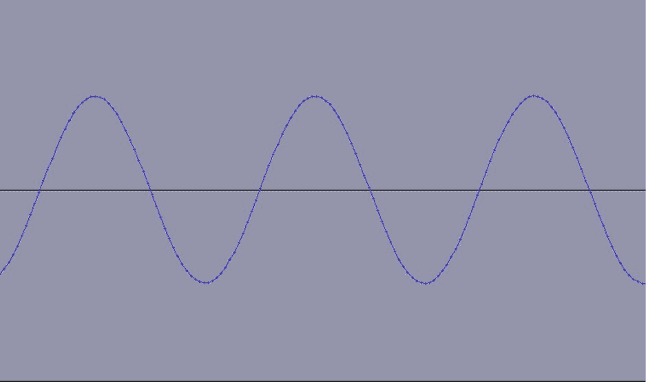

图 10-1 。正弦波图

该图的波峰代表声波中的高压缩区域，波谷代表低压缩区域。

这个声音图有两个我们感兴趣的主要特性。首先是它的振幅。

振幅

声波的振幅代表声波储存的能量强度。振幅越大，听者感受到的音量就越大。图 10-2 显示了 Audacity 中创建的另一个正弦波，但这一次振幅要低得多。

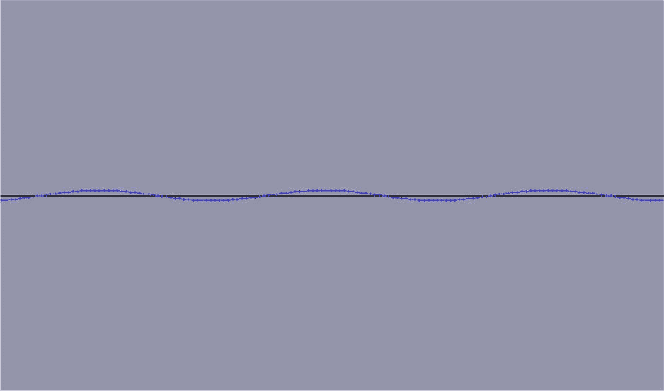

图 10-2 。低振幅声波

在图 10-1 和 10-2 之间的直接比较显示，声波具有完全相同数量的波峰和波谷。唯一的区别是波峰和波谷与黑色中心线的距离。图 10-2 中的图形表示与图 10-1 相同的声波，但能量和强度要小得多。对听者来说，两种波的区别仅仅在于音量。当从相同的距离听到第一个波时，第一个波的声音会比第二个波大得多。

在处理不同强度的声音时，我们可以将它们排列在一个音阶上。这个标度用分贝(dB) 来定义。分贝是一个相对的测量单位，因此用于描述两个声音级别之间的强度差异。

如果我们拿人类对声音的感知来说，我们听不到的声音水平代表 0dB。表 10-1 包含一些常见声音及其相对于感知寂静的分贝水平(来源:`http://articles.washingtonpost.com/2009-03-10/news/36815953_1_db-temporary-threshold-shift-subway-train`)。

表 10-1 。不同分贝水平的声音

| 分贝数 | 示例声音 |
| --- | --- |
| 0dB | 听不到声音 |
| 20dB | 滴答作响的手表 |
| 50dB | 降雨 |
| 70dB | 洗衣机 |
| 80dB | 两英尺高的闹钟 |
| 105 分贝 | 割草机 |
| 130 分贝 | 喷气式飞机在 100 英尺 |

当我们试图计算两种声音的分贝差异时，我们使用以下等式:

*10 日志(P2/P1) = dB*

使用前面的等式，我们可以知道当一个声音的强度是另一个声音的两倍时(所以 *P2/P1* 是 2)，分贝的差异是 3dB。当一个声音的强度是十倍时，差异是 10dB，当它的强度是一百万倍时，差异是 60dB。

前面的数字向我们展示了用对数标度来表示分贝的好处。我们可以用相对较小的数字来表示强度相差很大的声波之间的差异。不幸的是，当比较 3dB、10dB 和 60dB 的声音时，这并不直观。

我们感兴趣的声波的第二个特性是它的频率。

频率

声波的频率影响它的音调。不同的音高被人们认为是音乐中较高或较低的音符。在处理声音效果时，改变声音效果的频率可以给我们带来相同效果的微妙变化。同样重要的是，在设计特定声音时，要知道哪一级别的音高最有可能有效。一个简单的例子是，高频声音更适合激光枪效果，低频声音更适合爆炸。

频率在人类听觉中也起着重要的作用。普通人的耳朵只对 20 赫兹到 20，000 赫兹之间的一个很窄的频率范围敏感。符号 Hz 表示测量单位赫兹。赫兹是用来测量重复的。如果你从图 10-1 中回忆起，我们的声波由三个波峰和两个波谷组成。增加声波的频率会给我们一个更高的声音效果，并通过在相同的时间内有更多的波峰和波谷在图表上显示出来。图 10-3 显示了频率增加的声波。

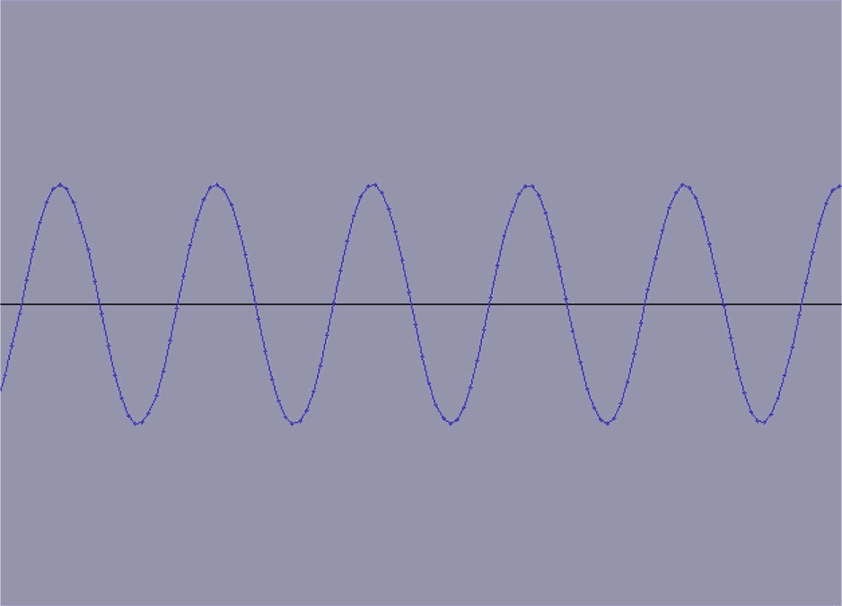

图 10-3 。更高音调的声波

其他类型的声波

图 10-1 至 10-3 所示的曲线图显示了正弦波的波形。波形代表声音如何通过给定介质传播的图形表示。在人类听觉的正常情况下，这种介质是空气；然而，介质也可以是水、混凝土或金属。

正弦波在其波峰和波谷之间平稳振荡；其他类型的声波可以用不同的波形来表示。

图 10-4 显示了方波的波形。

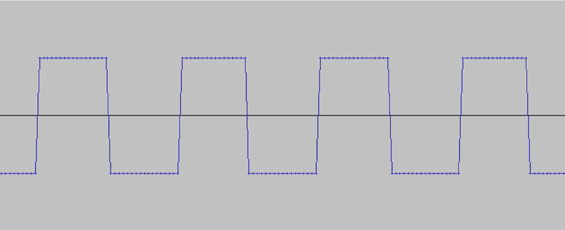

图 10-4 。方波

如图 10-4 所示，方波具有平坦的高频和低频部分，它们交替出现并产生与正弦波不同的声音。

另一种常见的波是锯齿波。如图 10-5 中的所示。

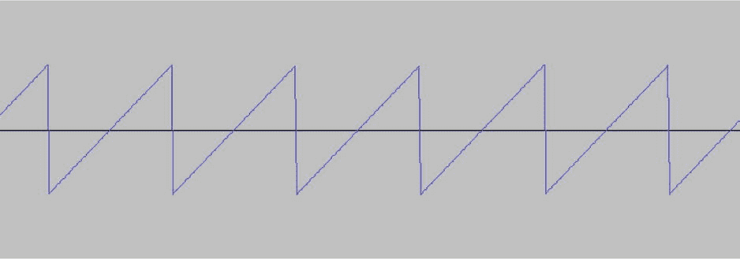

图 10-5 。锯齿波

锯齿波产生的声音不同于正弦波和方波。这些波中的每一个都可以用作声音效果的基础，波和过滤器的组合用于生成不同类型的声音。

错认假频伪信号

混叠是使用数字采样技术时产生的一种不良效应。游戏程序员更可能听说过反走样这个术语，它是指游戏截图中出现的锯齿状边缘。在这方面，反走样用于消除渲染图形中出现的锯齿边缘。相同的“锯齿”可能出现在采样的音频中。

数字音频通过在特定时间点对音频进行离散采样来工作，但是数字音频还应用某些其他约束，例如它可以存储的最大和最小振幅。如果音频频率高于或低于这些频率，采样幅度可能会高于或低于其应有的点。当通过数模转换器重新创建数字表示时，这导致音频听起来不同于原始声音。在本章中，我们不打算讨论音频混叠，但是你应该知道它的存在。

现在我们已经介绍了声波的基础知识，我们来看看用来产生音效的软件包。

大胆

Audacity 是一个免费的声音编辑套件，适用于 Windows、Mac OSX 和 Linux。我在撰写本章时使用的 Audacity 版本是 2.0.2。图 10-6 显示了 Audacity 打开时出现的主窗口。

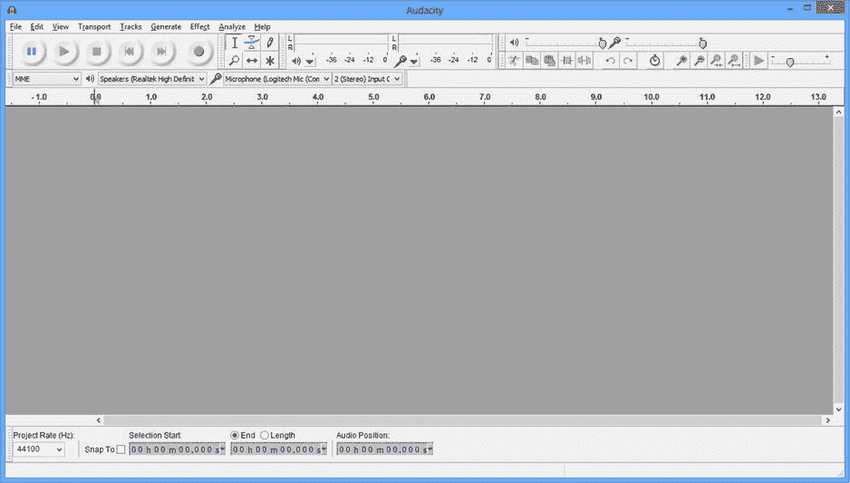

图 10-6 。Audacity 的主窗口

在图 10-6 中，左上方可以看到主记录控件 。右边的下一个面板包含用于修改声波的选择工具。然后是输出和输入指示器，后面是另一个控制面板，其中包含音量、拷贝/粘贴、修剪、缩放等。下面的栏包含输入和输出源选择器。

在窗口顶部的菜单栏中，我们将使用生成和效果面板。

啁啾发生器

啁啾信号是振幅随时间增加或减少的信号。因此，了解到 Audacity 的啁啾发生器可以用来产生完全以这种方式运行的声波就不足为奇了。这一节包含了我们将如何使用这种类型的波来开始创建我们的声音效果的确切细节。

图 10-7 显示了生成菜单。

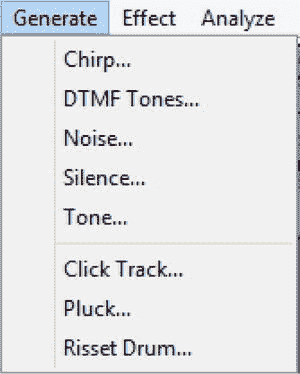

图 10-7 。Audacity 的生成菜单

“生成”菜单用于生成基本声波。我们将使用的特定选项是啁啾发生器。点击 Chirp 时，我们会看到如图图 10-8 所示的对话框。

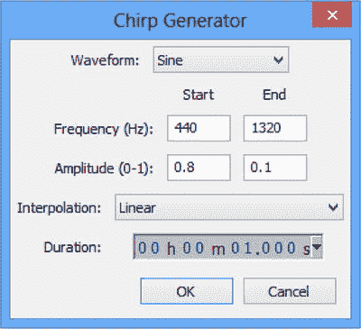

图 10-8 。啁啾发生器对话框

啁啾发生器允许我们指定要产生的波形。显示的选项有正弦、方形、锯齿和方形，无混叠。每一种都会产生稍微不同的基本声波。

啁啾发生器是有用的，因为它允许我们指定开始和结束频率和振幅。所示的选择从低频声音开始，在波结束时增加。当到达终点时，产生的波的振幅也将减小。

插值类型允许我们选择线性或对数。线性插值将允许我们创建从开始状态到结束状态均匀变化的效果。对数选项创建的波形变化更加平滑。最后一个变量是产生声音所需的持续时间。

一旦我们有了一个基本的声波，我们可以使用效果菜单中的过滤器来修改它。

效果

Audacity 提供了一些预配置的过滤器，可以操纵声波。这些滤镜可以在效果菜单中找到。效果可以用来增加声波 的频率或振幅。它们还可以用来消除波中的高频或低频声音，甚至消除噪音。

这一节将看看我们如何使用一些提供的效果来塑造我们的声波到一个特定的效果。

图 10-9 显示了 Audacity 的效果菜单。

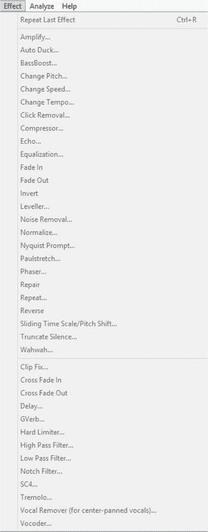

图 10-9 。Audacity 效果菜单

我们对这个菜单中的音效感兴趣的是放大效果、改变音高、改变速度、改变速度、淡入、淡出、高通滤波器和低通滤波器。这些效果可以应用于整个声波或只是声波中的选择，这些效果的组合可以创建一些有趣的声音。

*   放大效应确实做了你认为它可能做的事情。它允许我们改变声波的振幅，从而改变音量。我们可以使用这个工具来增加或减少振幅。
*   变化速度效果 允许我们改变声音效果的持续时间。缩短效果的播放时间具有增加声波频率的效果，使其看起来以更高的音调播放。拉长声音会降低频率，使效果声音更低。
*   改变音调 允许我们改变声波的频率而不影响其持续时间。
*   改变速度 允许我们改变效果的长度而不改变其频率。

**注意**由于处理声波的方式不同，最后两种效果会给声波增加一些明显的滴答声。

*   淡入和淡出完全按照它们的名称工作；他们将线性淡入或淡出声音效果的选择。这对于开始时听起来太刺耳的效果，或者我们希望随着时间的推移声音变大或变小的效果非常有用。它们影响声波选定部分的振幅。
*   低通滤波器 允许我们降低特定频率以上的频率幅度。该效果将衰减值和频率作为其参数。截止频率允许我们指定不受滤波器影响的频率。例如，如果我们指定 1000Hz 为截止频率，则 1000Hz 以下的频率幅度不会降低。滚降允许我们指定滤波器的积极程度。我们可以选择的选项在 6dB 到 48dB 之间。根据声音高于截止频率的程度，衰减 dB 值作为倍数应用。衰减值越高，高频声音的振幅降低得越多。
*   高通滤波器 的工作方式与低通滤波器完全相反。我们可以指定一个频率，高于该频率时声波不受影响，还可以指定一个衰减值来指定应用滤波器的力度。

随着我们的 Audacity 旋风之旅的结束，我们可以使用这些工具来创建一个基本的跳跃音效。

大胆创造跳跃音效

我们的玩家与 *Droid Runner* 的唯一互动是让角色跳跃，所以这个动作是我们第一个音效的理想选择。这一节将一步一步地介绍创造一种声音的过程，我们可以用这种声音来表现跳跃。

1.  From the Generate menu, select Chirp. In the Chirp Generator dialog box, generate a Square Waveform with the parameters set as shown in Figure 10-10.

    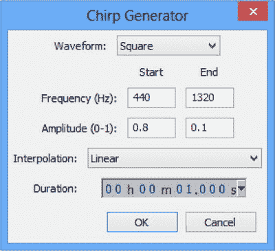

    图 10-10 。跳跃声音效果的方形啁啾声发生器对话框

    产生的声波应该类似于图 10-11 中的声波。

    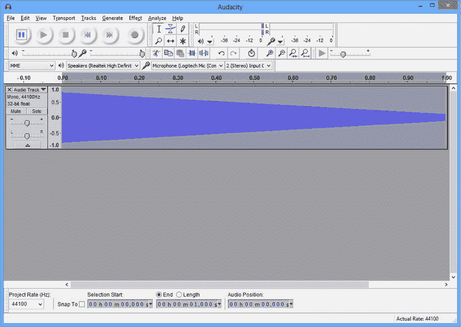

    图 10-11 。跳跃效应方波

2.  In the Effect Menu, select High Pass Filter to run a high-pass filter over the entire wave with the parameters from Figure 10-12.

    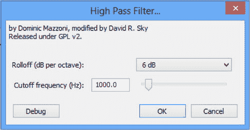

    图 10-12 。跳转高通滤波器对话框

3.  Next, we select Amplify from the Effect Menu and amplify the sound wave by -2.8dB, as shown in Figure 10-13.

    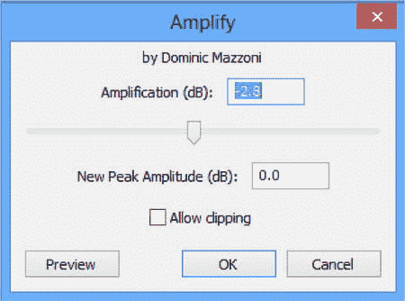

    图 10-13 。跳转放大对话框

4.  再次从效果菜单中选择高通滤波器，并使用与图 10-11 中相同的参数，即 6db 滚降和 1000Hz 截止频率。
5.  选择效果➤放大并运行另一个放大滤波器，放大参数设置为 1.2。
6.  Run the Fade Out Filter by selecting Effect ➤ Fade Out; then run Effect ➤ Change Speed with the parameter set to 60\. At this point, your sound wave should resemble the one shown in Figure 10-14.

    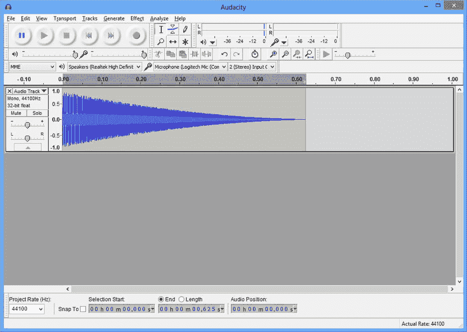

    图 10-14 。跳跃效应的第一阶段

在这一点上，我们有一个效果，在 0.6 秒内音高增加，听起来像是我们可以用来跳跃的效果。我们现在将使用更多的效果来稍微修饰一下声音。

1.  First off, duplicate the sound wave using the Duplicate option from the Edit menu. Audacity should now resemble Figure 10-15.

    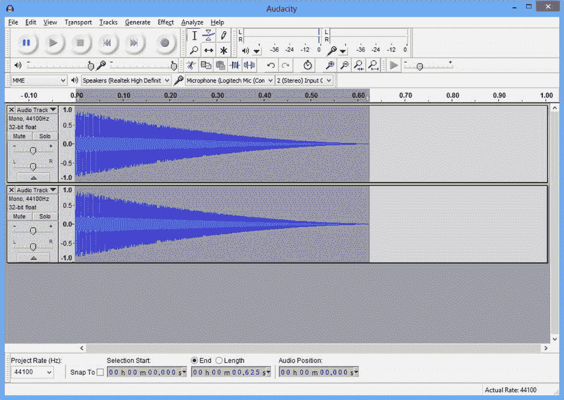

    图 10-15 。复制的跳跃效果

2.  Now use the Time Shift Tool from the Tools toolbar to move the second sound wave over to the right. Drag it over until the selection start time reads 0.025s. The result of this step is shown in Figure 10-16.

    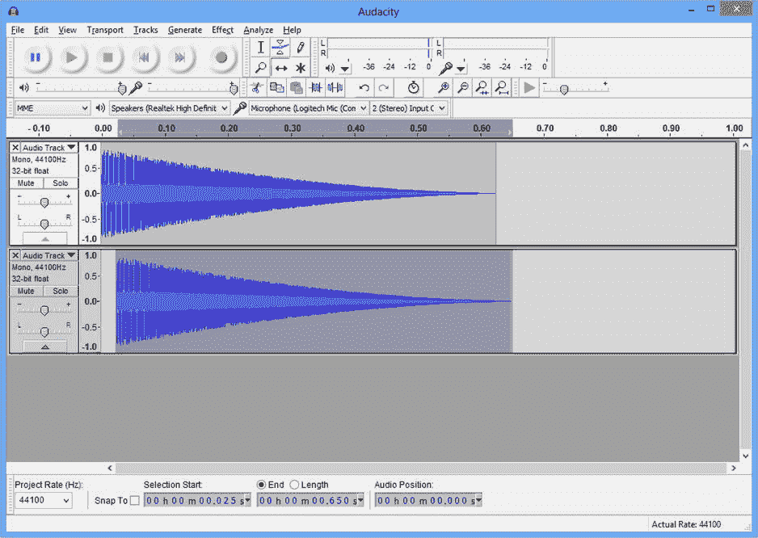

    图 10-16 。跳跃效应复制移位

3.  现在，选择两个轨迹，使用菜单选项轨迹➤混合和渲染。
4.  这个复制、移动和混合的步骤给我们的声音效果增加了一点回声，但是让声音的开始变得有点尖锐，整体效果有点刺耳和走调。我们将使用效果菜单中的低通滤波器降低高音音调，参数为滚降 6dB，频率为 1200Hz。完成后，运行 7.3dB 的效果➤放大器来提高音量。
5.  我们现在将通过应用参数 600Hz 和 12dB 的效果➤低音增强来再次增强低端。我们现在将运行 6dB 和 1200Hz 参数的➤低通滤波器。在最后一个低通滤波器之后，幅度有点低，因此我们将通过运行参数为 3.2dB 的效果➤放大器来再次提高幅度
6.  我们的效果现在在开始时有一个从我们的复制和移动中遗留下来的刺耳的双重弹出，所以我们将使用效果➤淡入来平滑它一点。使用工具工具栏中的选择工具选择音轨的第一个 0.025 秒，然后在中选择效果➤淡入。随着轨道开始处的振幅淡入，我们现在使用效果➤放大器提高整个轨道的振幅，参数为 2.5dB，并勾选允许削波复选框。
7.  最后一步是在音轨的前 0.75 秒使用效果➤淡入。Audacity 中的最终效果应该类似于图 10-17 中的轨迹。

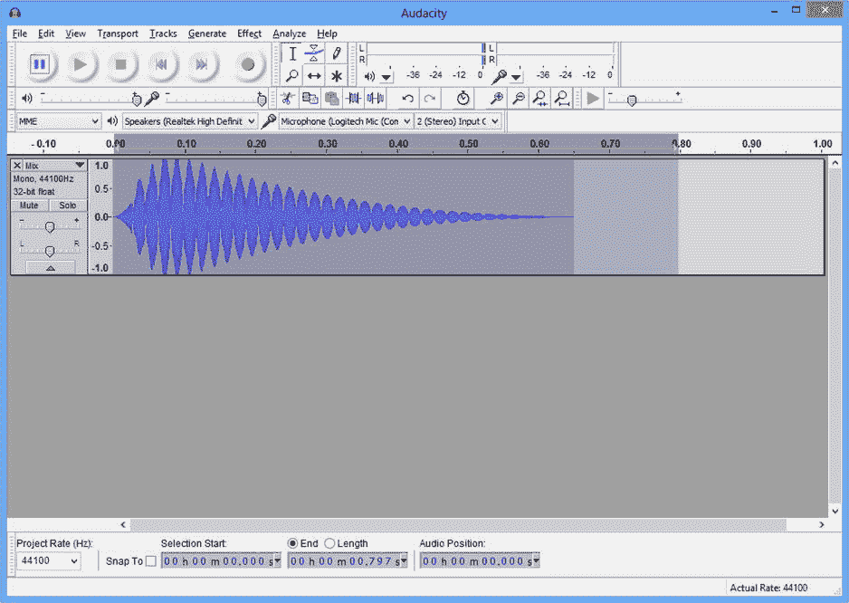

图 10-17 。完成的跳跃效果

我们现在准备好导出我们的声音文件。我们将使用 Ogg Vorbis 音频格式的声音。Android 上的 OpenSL 支持加载和播放 Ogg 文件，而无需我们付出任何努力，并且它们是压缩的，因此它们是 Android 游戏开发的理想选择。

Ogg Vorbis 音频格式由两部分组成。Vorbis 组件指定音频的压缩算法。这是一种由`Xiph.Org`基金会创建的有损压缩格式。Ogg 组件指定了一个容器，它规定了如何将数据保存到文件中。结合起来，这些组件创建了 Ogg Vorbis 格式。

声音文件应该放在项目的“资源”文件夹中。使用文件➤导出选项将音频导出到素材/声音下的 jump.ogg 中，如图图 10-18 所示。

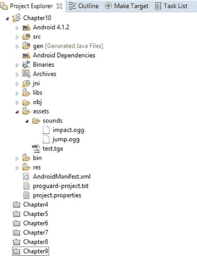

图 10-18 。素材文件夹中的 Ogg 文件

图 10-18 也显示了我们需要一个名为 impact.ogg 的音频文件。这个文件附带了补充本章的示例代码，可以在本书的网站`http://www.apress.com/9781430258308`上找到。

冲击效果是按照 Audacity explosion 音频教程创建的，该教程可以在音效部分`http://wiki.audacityteam.org/wiki/Category:Tutorial#Sound_Effects`找到，通过“如何在 Audacity 中创建爆炸和激光枪音效”中的爆炸链接。

现在我们已经创建好了声音，我们可以编写必要的代码来播放本地代码的效果。

使用 OpenSL ES 播放音频

到目前为止，在本书中，我们一直在使用 Android NDK 创建一个游戏，而没有使用任何 Java 代码。我们已经使用 EGL 与 Android 的窗口系统 OpenGL 交互，将数据提交给 GPU 进行渲染，现在我们将使用原生的 OpenSL ES API 提交音频数据进行播放。

当我们显示图形时，我们创建了 Renderer 类来封装代码，并将我们的 OpenGL 代码与我们的游戏逻辑分开。我们将对我们的音频代码做同样的事情。将创建`AudioManager`类来封装 OpenSL 代码并简化我们未来的游戏逻辑代码。这有助于我们制作一个游戏引擎，并促进跨多个项目的代码重用。

创建音频管理器

`AudioManager`类将用于创建游戏逻辑和 OpenSL ES API 之间的接口。清单 10-1 展示了`AudioManager`类的类声明。

***清单 10-1。***`AudioManager`阶级宣言

```cpp
class AudioManager
       :      public Singleton<AudioManager>
{
public:
       typedef unsigned int        AudioHandle;
       static const AudioHandle    INVALID_HANDLE = 0xFFFFFFFF;

private:
       AAssetManager*              m_pAssetManager;

public:
       explicit AudioManager(AAssetManager* pAssetManager);
       virtual ∼AudioManager();

       bool          Initialize();
       void          Destroy();

       AudioHandle   CreateSFX(std::string& filename);
       void          PlaySFX(AudioHandle handle);
       void          DestroySFX(AudioHandle handle);
};

```

这个简单的界面将允许我们初始化和销毁 OpenSL ES，以及创建、播放和销毁单独的音效。我们使用一个无符号整型的 typedef 来存储特定音频事件的句柄。

`AudioManager`的构造函数取一个指向安卓 NDK 的`AAssetManager`类的指针，用来访问我们之前添加到项目中的文件。清单 10-2 显示了构造函数的代码。

***清单 10-2。*** `AudioManager’s`建造师

```cpp
AudioManager::AudioManager(AAssetManager* pAssetManager)
       :     m_pAssetManager(pAssetManager)
{
       Initialize();
}

```

构造函数简单地调用`Initialize`方法。析构函数如清单 10-3 所示。

***清单 10-3。*** `AudioManager’s`析构函数

```cpp
AudioManager::∼AudioManager()
{
       Destroy();
}

```

正如您所料，析构函数调用`Destroy`。

这涵盖了`AudioManager`类的接口以及构造函数和析构函数。现在我们将看看初始化 OpenSL 所必需的代码。

OpenSL ES 简介

OpenSL ES 是 Khronos 提供的另一个 API。其中 OpenGL ES 是他们用于嵌入式系统的图形库 API，OpenSL ES 是他们用于嵌入式系统的声音库 API。由于这两个 API 的开发方式不同，它们之间的理念完全不同。OpenGL 有一个更像 C 的接口，我们在那里调用函数；API 本身不涉及任何对象。另一方面，OpenSL 是一个基于对象的 API。

API 的主要结构包括创建对象实例和与这些对象交互的接口对象实例。我们必须与之交互的第一个对象是引擎对象。引擎对象用于创建我们的声音系统所需的其他对象。在使用 OpenSL 之前，我们需要向`AudioManager`类添加一些字段。这些字段被添加到清单 10-4 中。

***清单 10-4。*** 添加 OpenSL 对象到`AudioManager`

```cpp
class AudioManager
       :      public Singleton<AudioManager>
{
public:
       typedef unsigned int        AudioHandle;
       static const AudioHandle    INVALID_HANDLE = 0xFFFFFFFF;

private:
       SLObjectItf                 m_engineObject;
       SLEngineItf                 m_engine;
       SLObjectItf                 m_outputMixObject;

       AAssetManager*              m_pAssetManager;

public:
       explicit AudioManager(AAssetManager* pAssetManager);
       virtual ∼AudioManager();

       bool          Initialize();
       void          Destroy();

       AudioHandle   CreateSFX(std::string& filename);
       void          PlaySFX(AudioHandle handle);
       void          DestroySFX(AudioHandle handle);
};

```

我们在清单 10-4 中添加了两个`SLObjectItf`字段和一个`SLEngineItf`和`AudioManager`。我们看看这些是如何在清单 10-5 中的`Initialize`方法中使用的。

***清单 10-5。*** `AudioManager::Initialize`

```cpp
bool AudioManager::Initialize()
{
       SLresult result;

       result = slCreateEngine( &m_engineObject, 0, NULL, 0, NULL, NULL );
       assert(result == SL_RESULT_SUCCESS);

       result = (*m_engineObject)->Realize(m_engineObject, SL_BOOLEAN_FALSE);
       assert(result == SL_RESULT_SUCCESS);

       result = (*m_engineObject)->GetInterface(m_engineObject, SL_IID_ENGINE, &m_engine);
       assert(result == SL_RESULT_SUCCESS);

       result = (*m_engine)->CreateOutputMix(m_engine, &m_outputMixObject, 0, NULL, NULL);
       assert(result == SL_RESULT_SUCCESS);

       result = (*m_outputMixObject)->Realize(m_outputMixObject, SL_BOOLEAN_FALSE);
       assert(result == SL_RESULT_SUCCESS);

       return result == SL_RESULT_SUCCESS;
}

```

在 Android NDK 中，初始化 OpenSL 用于基本用途的代码并不多。首先，我们调用`slCreateEngine`。这个方法的第一个参数是`m_engineObject`的地址。其余参数都是默认值，因为我们不需要引擎对象的任何特定功能。

OpenSL 对象分两步创建。第一步是告诉 OpenSL 对象您希望它支持哪些特性。一旦完成，我们就指示 OpenSL 正式创建对象；这叫做实现，是用`Realize`方法完成的。调用`slCreateEngine`后，我们指令 OpenSL 实现引擎。

一旦创建并实现了引擎，我们就可以得到引擎接口。您可以看到这是通过在`m_engineObject`上调用`GetInterface`来完成的。我们将对象作为第一个参数传递。第二个参数，`SL_IID_ENGINE` `,`告诉 OpenSL 我们想要为对象检索哪个接口，最后一个参数是我们想要存储接口的字段。

我们现在使用引擎接口来创建一个输出混合对象。输出组合正如其名称所暗示的那样。它是负责接收音频、混合音频并通过操作系统以及最终设备的扬声器播放出来的对象。同样，一旦创建了输出混合对象，就必须实现它。

这就是在 Android 上初始化 OpenSL ES 的基本设置的全部内容。我们有一个引擎对象、一个引擎接口和一个输出混合对象。现在我们将看看从 Ogg 文件中创建声音所需的代码。

为文件创建 OpenSL ES 播放器对象

在这一章的开始，我们介绍了创建音效并将其保存为 Ogg Vorbis 音频格式的过程。在这一部分，我们将看看如何在游戏中使用这些音效。

在播放声音效果之前，我们必须创建一个音频播放器对象，该对象可以引用包含声音的文件并从该对象中检索播放接口。

我们很可能想要创建多个玩家对象，所以我们从给清单 10-6 中的类添加一个`PlayInstance`结构和一个`unorderer_map`开始。

***清单 10-6。*** 将`PlayInstance` 添加到`AudioManager`

```cpp
class AudioManager
       :     public Singleton<AudioManager>
{
public:
       typedef unsigned int AudioHandle;
       static const AudioHandle INVALID_HANDLE  = 0xFFFFFFFF;

private:
       SLObjectItf                 m_engineObject;
       SLEngineItf                 m_engine;
       SLObjectItf                 m_outputMixObject;

       AAssetManager*              m_pAssetManager;

       struct PlayInstance
       {
              SLObjectItf          m_playerObject;
              SLPlayItf            m_playerPlay;
       };
       typedef std::tr1::unordered_map<AudioHandle, PlayInstance*>    PlayInstanceMap;
       typedef PlayInstanceMap::iterator                              PlayInstanceMapIterator;

       PlayInstanceMap                                  m_playInstances;

public:
       explicit AudioManager(AAssetManager* pAssetManager);
       virtual ∼AudioManager();

       bool     Initialize();
       void     Destroy();

       AudioHandle      CreateSFX(std::string& filename);
       void             PlaySFX(AudioHandle handle);
       void             DestroySFX(AudioHandle handle);
};

```

我们的音效实例将存储在由`PlayInstance`表示的结构中。为了便于拥有多种音效，我们将`PlayInstance`的实例存储在一个`unordered_map`中，其中一对实例由`AudioHandle`和一个指向`PlayInstance`对象的指针组成。我们还为映射定义了一个类型的`iterator`，并在`m_playInstances`中创建了一个映射实例。

清单 10-7 显示了`AudioManager::CreateSFX` 的代码，它创建了一个声音效果的新实例。

***清单 10-7。*** `AudioManager::CreateSFX`

```cpp
AudioManager::AudioHandle AudioManager::CreateSFX(std::string& filename)
{
       AudioHandle handle = INVALID_HANDLE;

       AAsset* asset = AAssetManager_open(
              m_pAssetManager,
              filename.c_str(),
              AASSET_MODE_UNKNOWN);

       if (asset != NULL)
       {
              handle = Hash(filename.c_str());

              PlayInstanceMapIterator iter = m_playInstances.find(handle);
              if (iter == m_playInstances.end())
              {
                     PlayInstance* pNewInstance = new PlayInstance();

                     if (pNewInstance)
                     {
                            std::pair<AudioHandle, PlayInstance*> newInstance(handle, pNewInstance);
                            std::pair<PlayInstanceMapIterator, bool> addedIter =
                                   m_playInstances.insert(newInstance);
                     }

                     off_t start;
                     off_t length;
                     int fd = AAsset_openFileDescriptor(asset, &start, &length);
                     assert(0 <= fd);
                     AAsset_close(asset);

                     // configure audio source
                     SLDataLocator_AndroidFD loc_fd = {
                            SL_DATALOCATOR_ANDROIDFD,
                            fd,
                            start,
                            length};

                     SLDataFormat_MIME format_mime = {
                            SL_DATAFORMAT_MIME,
                            NULL,
                            SL_CONTAINERTYPE_UNSPECIFIED};

                     SLDataSource audioSrc = {&loc_fd, &format_mime};

                     // configure audio sink
                     SLDataLocator_OutputMix loc_outmix = {
                            SL_DATALOCATOR_OUTPUTMIX,
                            m_outputMixObject};

                     SLDataSink audioSnk = {&loc_outmix, NULL};

                     // create audio player
                     const unsigned int NUM_INTERFACES = 1;
                     const SLInterfaceID ids[NUM_INTERFACES]    = {SL_IID_PLAY};
                     const SLboolean req[NUM_INTERFACES]        = {SL_BOOLEAN_TRUE };
                     SLresult result = (*m_engine)->CreateAudioPlayer(
                            m_engine,
                            &pNewInstance->m_playerObject,
                            &audioSrc,
                            &audioSnk,
                            NUM_INTERFACES,
                            ids,
                            req);
                     assert(SL_RESULT_SUCCESS == result);

                     // realize the player
                     result = (*pNewInstance->m_playerObject)->Realize(
                            pNewInstance->m_playerObject,
                            SL_BOOLEAN_FALSE);
                     assert(SL_RESULT_SUCCESS == result);

                     // get the play interface
                     result = (*pNewInstance->m_playerObject)->GetInterface(
                            pNewInstance->m_playerObject,
                            SL_IID_PLAY,
                            &pNewInstance->m_playerPlay);
                     assert(SL_RESULT_SUCCESS == result);
                     (*pNewInstance->m_playerPlay)->RegisterCallback(
                            pNewInstance->m_playerPlay,
                            play_callback,
                            NULL);
                      (*pNewInstance->m_playerPlay)->SetCallbackEventsMask(
                            pNewInstance->m_playerPlay,
                            SL_PLAYEVENT_HEADATEND);
              }
       }

       return handle;
}

```

我们通过使用 Android NDK 的`AAssetManager`来尝试打开 filename 方法参数中提供的文件，从而开始了`CreateSFX`方法 ??。如果文件存在，`AAssetManager_open`将返回一个指向`Asset`的指针。

然后，我们使用方法`Hash`创建文件名的散列。`Hash`返回文件名的 SDBM 哈希。`Hash`方法的代码包含在清单 10-9 中。

在创建散列之后，`CreateSFX`试图通过调用`m_playInstances`上的`find`方法来发现这个声音效果是否已经被添加到地图中。这意味着我们想在游戏中使用的任何声音效果都必须有一个唯一的文件名。

如果这是一个新的声音效果，我们创建一个新的`PlayInstance`实例，并用散列句柄和指针`pNewInstance`创建一对。这对新的被添加到`m_playInstances`。

下一步需要为打开的`Asset`获取一个文件描述符。我们通过调用`AAsset_openFileDescriptor` 来做到这一点。此方法还提供了文件开头的偏移量和文件的长度。一旦我们有了自己的文件描述符，我们就在`asset`上调用`AAsset_close`。

现在我们已经检查了所有的依赖项，能够使用 OpenSL 创建一个音频播放器对象。音频播放器需要的第一个依赖项是音频数据的来源。我们通过创建一个`SLDataLocator_AndroidFD`对象来通知 OpenSL 在哪里可以找到这个音效的数据。这个对象存储我们调用`AAsset_openFileDescriptor`时获得的`fd`、`start`和`length`变量。

我们还必须为 OpenSL 提供文件的 MIME 类型。MIME 类型传统上在创建网站时用于确定从服务器传输的文件类型。幸运的是，我们可以传递`SL_CONTAINERTYPE_UNSPECIFIED`，OpenSL 将从文件中确定类型。如果我们知道我们将只使用 Ogg 文件，我们可以指定`SL_CONTAINERTYPE_OGG`,但是您可以选择使用 MP3 文件或一些其他支持的媒体格式。然后`loc_fd`和`format_mime`都被捆绑到结构`audioSrc`中，该结构的类型为`SLDataSource`。

当`SLDataSource`为我们的音效指定输入时，我们需要创建一个`SLDataSink`对象来指定输出。我们的输出对象将由`SLDataSink`来表示，它接受一个类型为`SLDataLocator_OutputMix`的元素。第二个字段留空。变量`loc_outmix`用于指定我们的`m_outputMixObject`作为输出接收器。

我们现在准备为这个效果创建玩家对象。OpenSL 支持多种类型的播放器对象接口，但是我们只对 Play 接口感兴趣。`NUM_INTERFACES`用于指定我们想要的单一界面。`ids`存储播放接口的标识符，`SL_IID_PLAY`和 req 存储`SL_BOOLEAN_TRUE`。`req`用于通知 OpenSL 播放界面不是可选的。

然后使用引擎接口来创建播放器对象。这是使用`CreateAudioPlayer` 方法完成的。如果这个调用成功，那么我们将拥有一个存储在`pNewInstance->m_playerObject`中的玩家对象的引用。和所有 OpenSL 对象一样，我们调用`Realize`来完成创建过程。

随着我们的播放器对象的实现，我们可以获得允许我们播放音效的接口。我们通过用第二个参数`SL_IID_PLAY`调用`GetInterface`来做到这一点。

我们还没有完成`CreateSFX`。我们还想知道声音效果何时结束播放，并指定在该事件发生时要调用的函数。我们使用在`m_playerPlay`上调用的`RegisterCallback`来注册回调方法`play_callback`。回调也可以指定掩码，以确保回调只为我们感兴趣的事件触发。在这种情况下，我们面具为`SL_PLAYEREVENT_HEADATEND`。这将使`play_callback`函数在音效播放结束时被调用。这里创建一个新的 player 对象实例的代码比设置 OpenSL 本身的代码多，但是我们最终完成了`CreateSFX`。清单 10-8 查看`play_callback`函数。

***清单 10-8。*** `play_callback`

```cpp
void SLAPIENTRY play_callback( SLPlayItf player, void *context, SLuint32 event )
{
       if( event & SL_PLAYEVENT_HEADATEND )
       {
               (*player)->SetPlayState(player, SL_PLAYSTATE_STOPPED);
       }
}

```

没什么可`play_callback`的。`SLPlayItf`界面在结束播放时不会自动停止，这可以防止它们在以后被重播。为了确保这种情况不会发生，我们使用`SetPlayState`方法将我们的播放器设置为`SL_PLAYSTATE_STOPPED`状态。

现在我们回过头来看看我们在本节中使用的`Hash`方法。

SDBM 哈希

我们的`unordered_map`要求使用惟一的键来标识存储在地图中的对象。SDBM 哈希函数允许我们将音效的文件名转换成唯一的标识符。清单 10-9 中描述了实现这一点的代码。

***清单 10-9。***`Hash`SDBM 功能

```cpp
inline unsigned int Hash(const std::string& key)
{
       unsigned int result = 0;

       for (unsigned int i=0; i<key.length(); ++i)
       {
              int c = key[i];
              result = c + (result << 6) + (result << 16) - result;
       }

       return result;
}

```

散列是对小字符串的快速操作，它创建了无符号整数结果，在我们的游戏循环中比较起来非常快；这就是为什么当我们创建新的音效时，我们散列一次，然后使用散列值进行查找。哈希生成字符串的唯一值的关键在于结果中使用当前字符的行。哈希是迭代构建的，每个字符用于计算哈希的当前值。可能会出现冲突(两个字符串创建相同的哈希)，但这种情况非常罕见，尤其是对于文件名这样的短字符串。

我们现在已经涵盖了创建一个新的音效实例所需的所有代码；我们现在来看看如何播放声音。

使用 OpenSL 播放声音

一旦创建了 player 对象并获得了 play 接口，用 OpenSL 播放声音就非常简单了。

`PlaySFX`的方法很简单。它从`m_playInstances`获取`PlayInstance`对象，然后调用`SetPlayState`两次:一次是停止声音(如果声音已经在播放的话),另一次是将状态设置为`SL_PLAYSTATE_PLAYING`。

清单 10-10 显示了`PlaySFX`的代码。

***清单 10-10。*** `AudioManager::PlaySFX`

```cpp
void AudioManager::PlaySFX(AudioHandle handle)
{
       PlayInstanceMapIterator iter = m_playInstances.find(handle);
       if (iter != m_playInstances.end())
       {
              SLPlayItf pPlayInstance = iter->second->m_playerPlay;
              if (pPlayInstance != NULL)
              {
                     // set the player's state
                     (*pPlayInstance)->SetPlayState(pPlayInstance, SL_PLAYSTATE_STOPPED);
                     (*pPlayInstance)->SetPlayState(pPlayInstance, SL_PLAYSTATE_PLAYING);
              }
       }
}

```

AudioManager 的最后一项任务是清理不用的声音并关闭系统。

清理声音

一旦我们完成了一个声音效果，销毁它所占用的资源是一个好主意。我们通过调用`DestroySFX` 来实现音效。这方面的代码如清单 10-11 所示。

***清单 10-11。*** `AudioManager::DestroySFX`

```cpp
void AudioManager::DestroySFX(AudioHandle handle)
{
       PlayInstanceMapIterator iter = m_playInstances.find(handle);
       if (iter != m_playInstances.end())
       {
              PlayInstance* pInstance = iter->second;
              if (pInstance && pInstance->m_playerObject)
              {
                     (*pInstance->m_playerObject)->Destroy(pInstance->m_playerObject);
                     pInstance->m_playerObject   = NULL;
                     pInstance->m_playerPlay     = NULL;
              }

              m_playInstances.erase(iter);
       }
}

```

在`DestroySFX`中，我们为提供的句柄检索`PlayInstance`对象，验证该对象和`m_playerObject`是否有效，然后在`m_playerObject`上调用 Destroy。

我们还在从析构函数调用的`Destroy`方法中释放我们的资源。清单 10-12 显示了这段代码。

***清单 10-12。*** `AudioManager::Destroy`

```cpp
void AudioManager::Destroy()
{
       for (PlayInstanceMapIterator iter = m_playInstances.begin();
            iter != m_playInstances.end();
            ++iter)
       {
              PlayInstance* pInstance = iter->second;
              if (pInstance && pInstance->m_playerObject)
              {
                     (*pInstance->m_playerObject)->Destroy(pInstance->m_playerObject);
                     pInstance->m_playerObject = NULL;
                     pInstance->m_playerPlay = NULL;
              }
       }
       m_playInstances.clear();

       if (m_outputMixObject != NULL)
       {
              (*m_outputMixObject)->Destroy(m_outputMixObject);
              m_outputMixObject = NULL;
       }

       if (m_engineObject != NULL)
       {
              (*m_engineObject)->Destroy(m_engineObject);
              m_engineObject = NULL;
              m_engine = NULL;
       }
}

```

清理我们所有的 OpenSL 资源。我们首先在`m_playInstances`中迭代所有音效，并对每个音效调用`Destroy`。然后我们也释放了`m_outputMixObject`和`m_engineObject`。

随着我们所有的`AudioManager`代码的完成，我们现在可以给我们的游戏逻辑添加一些音效了。

给机器人赛跑者添加音效

我们的第一个音效是一个跳跃声，所以我们需要为玩家跳跃时添加一个新事件。我们在清单 10-13 中的所示的`DroidRunnerLevel`构造器中注册这个新事件。

***清单 10-13。*** 在`DroidRunnerLevel`构造函数中注册`PLAYERJUMP_EVENT`

```cpp
DroidRunnerLevel::DroidRunnerLevel()
       :      m_pPlayerMovementComponent(NULL)
       ,      m_pPlayerTransformComponent(NULL)
       ,      m_pPlayerCollisionComponent(NULL)
       ,      m_levelEnd(0.0f)
       ,      m_initialized(false)
       ,      m_levelBuilt(false)
{
       m_levelObjects.reserve(64);

       RegisterEvent(PLAYERJUMP_EVENT);
}

```

注册事件后，我们现在创建声音效果并在`DroidRunnerLevel::Initialize`中附加消息。清单 10-14 展示了如何创建两个声音效果:一个跳跃效果和一个爆炸效果，代表玩家撞到墙壁或人工智能角色的冲击。

***清单 10-14。*** `DroidRunnerLevel::Initialize`

```cpp
       .
       .
       .
       CollisionManager::GetSingleton().AddCollisionBin();

       BuildLevelData();

       Renderer* pRenderer = Renderer::GetSingletonPtr();
       if (pRenderer)
       {
              pRenderer->AddShader(&m_shader);
       }

       AudioManager
&
audioManager = AudioManager::GetSingleton();
       std::string jumpEffectName("sounds/jump.ogg");
       m_jumpHandle = audioManager.CreateSFX(jumpEffectName);
       AttachEvent(PLAYERJUMP_EVENT, *this);

       std::string explosionEffectName("sounds/impact.ogg");
       m_explosionHandle = audioManager.CreateSFX(explosionEffectName);

       m_initialized = true;
}

```

我们在清单 10-15 和方法`DroidRunnerLevel::HandleEvent`中查看这两种音效的播放位置。

***清单 10-15。*** 在 DroidRunnerLevel::HandleEvent 中播放声音

```cpp
void DroidRunnerLevel::HandleEvent(Event* pEvent)
{
       if (pEvent->GetID() == POSTUPDATE_EVENT)
       {
              bool endLevel = false;

              if (m_pPlayerTransformComponent)
              {
                     if (m_pPlayerTransformComponent->GetTransform().GetTranslation().m_x >
                            m_levelEnd)
                     {
                            endLevel = true;
                     }
              }

              if (m_pPlayerMovementComponent && m_pPlayerMovementComponent->IsDead())
              {
                     AudioManager* pAudioManager = AudioManager::GetSingletonPtr();
                     if (pAudioManager)
                     {
                            pAudioManager->PlaySFX(m_explosionHandle);
                     }
                     endLevel = true;
              }

              if (endLevel)
              {
                     CleanLevel();
                     BuildLevelData();
              }

              if (m_pPlayerCollisionComponent)
              {
                     CollisionManager::GetSingleton().TestAgainstBin(
                            0,
                            m_pPlayerCollisionComponent);
              }
       }
       else if (pEvent->GetID() == PLAYERJUMP_EVENT)
       {
              AudioManager* pAudioManager = AudioManager::GetSingletonPtr();
              if (pAudioManager)
              {
                     pAudioManager->PlaySFX(m_jumpHandle);
              }
       }
}

```

`HandleEvent`中的新代码播放两种音效。当玩家死亡时，第一个玩家玩`m_explosionHandle`；第二个在玩家跳跃时播放`m_jumpHandle`。我们的新`PLAYERJUMP_EVENT`是法`MovementComponent::HandleEvent`派来的。我们在清单 10-16 中看到了这一点。

***清单 10-16。*** 更新`MovementComponent::HandleEvent`

```cpp
void MovementComponent::HandleEvent(Event* pEvent)
{
       if (m_isDead)
       {
              return;
       }

       if (pEvent->GetID() == JUMP_EVENT)
       {
              TransformComponent* pTransformComponent =
                     component_cast<TransformComponent>(GetOwner());
              assert(pTransformComponent);
              if (pTransformComponent &&
                     m_isSupported)
              {
                     static const float JUMP_ACCELERATION = 220.0f;
                     m_acceleration.m_y = JUMP_ACCELERATION;
                     SendEvent(PLAYERJUMP_EVENT);
              }
       }
       else if (pEvent->GetID() == UPDATE_EVENT)
       .
       .
       .

```

我们在这个方法中的一个新行是在`PLAYERJUMP_EVENT`上调用`SendEvent`。现在每次调用这个方法，都会触发我们的跳转效果。

摘要

我们现在已经涵盖了使用 Android NDK 创建游戏引擎所需的所有基础知识。本章讲述了如何使用 OpenSL ES API 向引擎添加音频。

我们已经研究了声音物理学的基础知识，试图理解我们如何通过 Audacity 改变基本声波的频率和振幅来创造声音效果。Audacity 是一个优秀的免费工具，有许多不同的过滤器，可以用来创建各种声音效果。

一旦我们创建了一些声音效果，我们看一下初始化 OpenSL ES 的代码。Android 提供了播放声音效果的 Java 接口，而 OpenSL ES 提供了同样的原生接口。

本章介绍了我们在本书中创建的游戏引擎框架的核心功能的完成情况。我们现在有一个渲染器，它使用 OpenGL ES 2.0 来创建一个使用几何图形、着色器、纹理、照明和透视投影的 3D 场景。该引擎还具有支持音频回放和现代功能的功能，例如用于创建游戏对象的基于组件的系统和用于在不同对象和系统之间通信的基于事件的系统。

这个引擎会给你一个很好的基础来为 Android 创建一个可运输的标题。下一章将介绍我们如何使用 Google 开发者控制台来实现这一点。