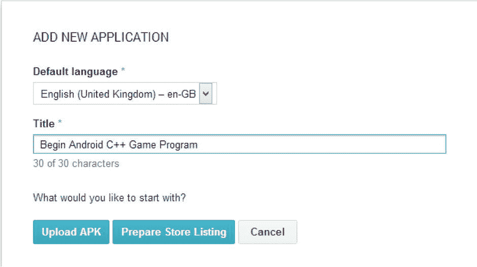

第十一章

自助出版 101

一旦您构建了自己的应用，并对其内容和质量感到满意，就该将您的作品发布到谷歌 Play 商店上了。Play Store 是谷歌面向安卓开发者的官方分销网络。值得注意的是，这不是唯一的选择，但绝对是在 Android 上分发所有类型的应用的最简单和最明显的选择。

通过 Play Store 分发应用不是免费的；像任何零售商一样，谷歌从售出的每一款应用中赚钱。谷歌的费用是税后销售价格的 30%。每当你在计算你的应用收费时，记住这一点是值得的。

准备出售你的应用是一个令人兴奋的时刻，但也可能令人生畏。在您的应用出现在 Play Store 之前，需要完成许多任务。本章的目的是看看这些是什么。

Google Play 开发者控制台

在谷歌 Play 商店上安装应用之前，您必须注册为开发人员。谷歌收取 25 美元的一次性费用，以注册成为开发者并获得 Google Play 开发者控制台帐户。报名的页面可以在这里找到:`https://support.google.com/googleplay/android-developer/answer/113468`。

Google Play 开发者控制台是一个全功能的 web 应用，用于控制您的应用的分发。您可以在这里上传应用、上传更新、设定价格、上传营销材料，并查看您的下载次数和收入。

在我们上传任何应用到开发者控制台之前，我们必须创建我们的应用的安全签名版本。

密钥、密钥库和数字签名

Play Store 使用数字签名来验证通过 Google Play 开发者控制台上传的应用的真实性。签名过程的基础在于公钥-私钥系统，该系统也用于某些形式的加密。

用于这些目的的密钥成对出现:公钥和私钥。私钥是一个你必须保持安全的文件。私钥允许您创建加密的消息或签名，然后与他人共享。公钥是一个文件，您可以与他人共享，以允许他们解密这些数据。在 Android 生态系统中，apk 本身是简单的 zip 文件，可以被任何有能力的程序打开。这些没有加密，但应用将有一个数字签名。该签名包括用您创建的私钥加密的数据，还包括公钥，以便其他人可以读取该签名。这个两步过程允许设备上的 Android 操作系统验证应用是合法的。如果无法使用提供的公钥读取签名，或者无法从 APK 中包含的数据重新创建签名中包含的数据，则操作系统可以确定该应用是非法的。谷歌为 Android APKs 创建签名的确切过程并未公之于众；这本身就是一个额外的安全层。

密钥库是用于为 apk 提供公钥-私钥签名的文件。一个密钥库可以包含多个别名；每个别名代表一个公钥-私钥对。整个密钥库也是密码加密的。这种配置允许您为计划发布的每个应用创建不同的公钥-私钥对，并通过将它们存储在单个密钥库中来轻松管理这些密钥。

此时，您可能想知道为什么应用需要以这种方式签名。本质上，这是一种保护你身份的方法。通过使用您的私钥(您拥有该私钥的唯一副本)对应用进行签名，Google 可以相信使用该密钥上传的任何应用都是同一应用的新版本，可以安全地上传给用户。这可以防止其他人劫持您的应用并将受损的 apk 上传到商店。

用于加密通过互联网传输的数据的密钥通常由授权的认证机构发布。认证机构是提供公钥第三方验证的组织。Web 浏览器包含内置的证书颁发机构列表，这些证书颁发机构位于可信列表中，程序会联系它们来验证密钥是否合法以及是否应该使用。Android 不要求 apk 由认证机构提供的密钥签名。使用 Android SDK 提供的工具创建自己的密钥是可以接受的。然而，如果你妥善保管好自己的钥匙，你就能确保你的 apk 是安全的。请确保将它们保存在安全的位置，并且永远不要共享您的密钥库或密码。

为游戏商店签下 APK

当你为 Play Store 创建一个 app 时，你必须将其打包成一个 Android 应用包文件(APK) ，这是 Google 的分发格式。这种格式是谷歌的专有格式，但本质上是一个压缩文件 ，可以使用 7-Zip 之类的工具打开。

在通读这本书的过程中，每次您构建应用时，Eclipse 的 ADT 插件都会自动创建 apk，并将它们传输到您的设备上。所有 Android 应用都必须签名，ADT 插件使用调试密钥对这些调试 apk 进行签名。如果您尝试将使用调试密钥签名的 APK 上传到 Play Store，Google Play 开发者控制台将显示错误。

1.  为了能够将应用上传到 Play Store，我们必须创建一个使用唯一密钥 签名的版本。Android SDK 包含实现这一点的方法，ADT 插件提供了一个易于使用的向导来帮助完成这一过程。以下说明将带您完成创建一个用唯一密钥签名的 APK 的过程，您可以使用该密钥上传到谷歌 Play 商店。运行 Eclipse 并在 Project Explorer 窗口中打开您的项目。
2.  Right-click your project folder and select the Export Signed Application Package … option under the Android Tools menu. The menu option is shown in [Figure 11-1](#Fig1). Selecting this option will cause the Export wizard to begin to create your signed APK.

    

    [图 11-1](#_Fig1) 。“导出签名的应用包”选项

3.  In the wizard, select the project which you are going to use to export the APK. If you right-clicked the project you would like to export, the name should already be entered. [Figure 11-2](#Fig2) shows the Export Android Application window .

    

    [图 11-2](#_Fig2) 。“导出 Android 应用”窗口

4.  Click Next; you will be taken to the Keystore Selection window. [Figure 11-3](#Fig3) shows this dialog.

    

    [图 11-3](#_Fig3) 。密钥库选择窗口

5.  如果这是您第一次导出 Android 应用，请选择“创建新的密钥库”单选按钮。否则，您需要选择“使用现有密钥库”

[图 11-4](#Fig4) 显示了密钥创建窗口。此窗口用于输入用于识别钥匙所有者的信息。

[图 11-4](#_Fig4) 。密钥创建窗口

密钥创建窗口要求您提供关于密钥库所有者的一些详细信息。

该别名很可能是发行该游戏的公司或组织的名称。

别名也需要密码。

密钥过期；因此，选择一个长有效期 对于确保您的密钥库在您可能仍在使用时不会过期是至关重要的。谷歌在其文档中建议最低有效期为 25 年，可在`http://developer.android.com/tools/publishing/app-signing.html`找到。过期的密钥不会阻止您的应用在用户设备上使用，但会阻止您发布应用的更新。如果您的密钥过期，您需要注册一个新的应用来发布更新。

然后，应该输入员工或公司董事的个人详细信息。这是一个单人操作中的简单选择。

[图 11-5](#Fig5) 显示了导出过程的最后一步 ，为您导出的 APK 选择一个输出位置。

[图 11-5](#_Fig5) 。“执行检查”窗口

最后一个窗口对您的密钥库执行最后一分钟的错误检查，并将列出发现的任何错误。往往不会有错误，如图[图 11-5](#Fig5) 。

单击“完成”后，您的 APK 将被写入您选择的位置，并准备好上传到 Play Store 开发者控制台。

上传到 Google Play 开发者中心

Google Play 开发者控制台是您访问 Play 商店的门户。这个 web 应用是由 Google 提供的，允许开发者轻松访问他们的发布渠道，而不需要形成复杂的发布协议。这对于小型开发人员来说非常理想，因为它允许自我发布，而不需要与发布合作伙伴建立外部关系。

让你的游戏出现在 Play Store 的第一步是在开发者控制台中创建一个新的应用。开发者控制台可以在以下网址找到:`http://play.google.com/apps/publish`。

当你第一次登录时，你的控制台将是空的，并显示在图 11-6 中。

[图 11-6](#_Fig6) 。Google Play 开发者控制台所有应用

此时，我们必须创建一个新的应用。

1.  We do this by clicking the Add New Application button. Doing this presents us with the Add New Application dialog, shown in [Figure 11-7](#Fig7).

    

    [图 11-7](#_Fig7) 。“添加新应用”对话框

2.  This dialog allows us to select the default language for our application and the app’s title. There are two options which we can now take: Upload APK and Prepare Store Listing. [Figure 11-8](#Fig8) shows the screen which appears after selecting Upload APK. This screen now consists of the title for our app and screens which allow us to control our Store Listing, Pricing and Distribution, In-app products, and Services and APIs.

    

    [图 11-8](#_Fig8) 。APK 屏幕

3.  当您选择上传时，web 应用将显示一个对话框，您可以在其中拖放您的 APK 文件。一旦你这样做了，你会看到进度条如图[图 11-9](#Fig9) 所示。

[图 11-9](#_Fig9) 。上传 APK 进度条

APK 完成上传后，您的应用将处于草稿状态。这意味着它已经在 Play Store 上进行了设置和配置，但尚未“上线”

在让您的应用出现在用户设备上的 Play Store 列表中之前，您必须完成配置在商店中列出应用所需的详细信息。开发人员控制台在“为什么我不能发布”对话框中提供了该信息的列表。我们在图 11-10 中查看这个列表。

[图 11-10](#_Fig10) 。“为什么我不能发布”对话框

如您所见，在将您的应用推入 live Play 商店环境之前，仍有相当多的步骤必须完成。

图标和截图对你的列表是必不可少的。这些能吸引顾客，应该以展示你的游戏的最佳状态为目的。你应该看看一些最受欢迎的应用和游戏列表，并尝试确定是否有任何特定的趋势可能有助于他们的成功。为你的应用选择合适的类别和吸引人们玩你的游戏的描述也很重要。

这些详细信息通过商店列表屏幕提供。您可以在此处更改应用的标题，标题最多可包含 30 个字符。还可以提供不同语言的翻译。

您的描述最长可达 4000 个字符。在描述中为你的应用提供一个吸引人的介绍是很重要的。描述将传达游戏的类型和玩家在下载你的应用时的体验。如果这不是最近更改部分中的第一个版本，也可以提供您的应用中包含的最新更新列表。

图形资产对你的应用的成功至关重要。虽然不是所有的玩家都会阅读你的应用的冗长描述，但是几乎所有的用户都会看你提供的截图。重要的是提供截图，以最好的方式展示你的游戏图形，以及展示你的应用的游戏性的截图。谷歌还为你的游戏提供了一个 Youtube 视频的链接。如果你已经为这款应用制作了预告片，将它上传到 Youtube 并在你的商店列表中加入链接是一个非常好的主意。谷歌 Play 商店应用会自动将你提供的 Youtube 视频嵌入你的商店列表。如果您希望在 Play Store 中出现，在任何给定时间提供所有请求的资产是非常重要的。定期检查所需的资产很重要，因为众所周知，谷歌会改变和更新这些资产，以适应不同类型的设备和分辨率。如果 Play Store 应用或网站发生变化，那么如果你没有提供谷歌在新布局上展示你的应用所需的资产，你就不太可能成为特色。

选择合适的类别对你的游戏很重要。此类别决定了您的应用在 Play Store 中的位置。选择准确的类别将有助于人们在寻找该类型的应用时找到您的游戏。你可以期待你的游戏会更成功，因为这个类别很好地定位了你的用户。

很可能你会有一个网站来推广你的公司或你的应用。Google 要求您提供隐私政策的 URL，所以最好考虑一下您希望这个重要声明包含什么内容。像`http://www.docracy.com/mobileprivacy/`这样的网站可以作为一个很好的起点，但重要的是你的隐私政策要涵盖你使用用户数据的所有方式。

货币化

开发者控制台也是你为你的应用设置盈利策略的地方。应用按价格出售的传统商业模式是可用的，您可以在 Google Play 开发人员控制台的定价和分发部分为您的应用设置价格。

当设置价格时，您最初以您自己的本地货币为您的应用设置默认价格。这是你的应用价格，不含当地销售税。然后，您可以选择自动将应用的价格转换为您选择支持的所有国外市场的价格。Google Play 开发者控制台目前支持 135 个不同国家的发行。您也可以用这些国家的当地货币为它们设定特定的价格。某些国家还支持将分发限制到特定的移动网络运营商。

**注意**将你的应用设置为免费也是完全可能的。在最终确定设置之前，请确保这是您想要做的事情；将您的应用价格更改为免费是不可逆转的。

用你的应用赚钱的另一个选择是支持应用内购买。应用内购买有两种类型，永久购买和消耗品。可下载的内容包，包括关卡、武器、角色或汽车，可以被视为永久购买。通过这种购买方式，玩家只需为内容支付一次费用，内容就永远属于他们了。另一类购买是消耗品。这方面的一个例子可能是健康药水。一个用户可以购买一种药剂，但是一旦它被使用，他们将被要求购买另一种。获得应用内购买的成本和收益的平衡是一个微妙而复杂的话题，但对于做对的开发者来说，这是一个可以收获回报的话题。你最终做出的收费决定将包括开发成本、你的预期回报以及你认为客户愿意为你生产的产品花多少钱等因素。没有简单的方法来决定你应该如何做这些决定；然而，在`http://book.personalmba.com/pricing-uncertainty-principle/`可以找到定价理论的一个很好的起点。

最后但并非最不重要的是订阅。谷歌现在通过 Play Store 提供订阅服务和计费。这将允许开发者在移动平台上创建大型多人在线(MMO)类型的体验。如果你认为你的游戏可以让玩家在相当长的一段时间内保持活力，那么这可能是一个可行的选择。

一旦你发布了你的游戏，并开始让用户购买，数据将开始出现在 Play Store 的财务报告部分。这可以让你追踪你的应用的收入。您可以使用此部分来确定新功能、更新或宣传是否会对您的应用产生的收入产生任何影响。

应用质量

Google Play 开发者控制台还能够为您提供应用的崩溃数据、应用未响应用户通知的数据，以及优化您的商店列表的其他建议。

认真对待开发者控制台提出的任何建议是很重要的。这些建议和通知有助于指出您的应用可能不符合其他应用标准的地方，从而降低您的应用的评级。高收视率和高质量的列表是吸引用户的关键，甚至可能成为 Play Store 的特色。在 Play Store 中被 Google 收录将会对你的游戏的收入潜力产生巨大的影响。

随着时间的推移，可以通过多种方式提高应用的质量，这可以与增加用户群和收入的总体策略联系起来。在过去，游戏开发商在发布之前开发游戏标题的每个部分是很常见的。对于基于盒式磁带的游戏和基于光盘的游戏来说尤其如此，它们是在物理介质上分发的。

今天，互联网为开发者开启了全新的游戏开发方法。互联网允许开发者通过构建游戏的最小可行版本并向公众发布来逐步创建游戏。然后从玩游戏的人那里得到反馈，开发者可以遵循用户感兴趣的开发路线。

当前一个完美的例子是《我的世界》和 T2。*《我的世界》*在最初阶段是作为一个非常小的产品开发的。每个新版本都添加了越来越多的内容和游戏元素，将产品打造成为一个现代现象和一个非常成功的游戏。虽然不可能每款游戏都达到《我的世界》*取得的成功水平，但这是一种商业模式和开发实践，较小的独立工作室应该效仿，而不是用大量预算和大量风险开发完整的游戏。*

为了支持这种类型的开发，我推荐使用一个由三部分组成的游戏版本系统，它使用主要版本、次要版本和维护版本的方法对构建进行分类。这种版本号的一个例子是 1.0.1。

之前版本的主要版本是 1.0，应该用于预发布版本，例如提供给内部或外部测试人员的 alpha 和 beta 版本。Build 1 应该是第一个公开发行的游戏。

这里的次要版本是 0。次要版本通常适用于包含新内容的更新。小版本之间的游戏机制和结构可能是相同的，但新的内容已经被添加，这表明该游戏是对先前小版本的合理更新。

维护号应该用来表示只包含错误修复的版本。游戏附带 bug 是很常见的。这些 bug 中有些是严重的，有些是次要的，但是开发者发布更新来解决困扰用户的 bug 是有好处的。玩家已经开始使用 Google Play 5 星评级系统来鼓励开发者修复他们游戏中的漏洞。如果你看一下 Play Store 中任何顶级游戏的评论，用不了多久你就会看到一些用户的评论，让开发者知道如果某个让他们沮丧的 bug 可以修复，他们会给游戏打更高的分数。

最后一点对于游戏开发者来说尤为重要。谷歌将展示那些受欢迎的、高质量的、受到好评的应用。任何想让自己的游戏出现在 Google Play Store 中的开发者都应该对 Google 在开发者控制台中提供的反馈以及对你游戏的某个方面不满意的用户的评论做出回应。

摘要

本章涵盖了应用从开发到发布的最后一步。我们已经了解了为分发签名 APK 和创建密钥库以上传到开发人员控制台的过程。最后，我们研究了开发者可以从他们的游戏产品中获利的选择。

发布产品并不是游戏名称旅程的终点。对于独立的小开发者来说，完成游戏代码并将应用投入销售只是游戏商业周期第一阶段的结束。在这一点上，重要的是开始了解游戏玩家对产品的想法和感受，并定期对应用进行更改和更新，以保持兴趣并创造专门的追随者。

Android 平台上一些最大的游戏没有遵循旧的游戏开发风格，即游戏预先完成，然后上市销售。现在，成功的游戏越来越常见，它们会发布，然后发展成一个庞大的忠实用户群。

作为一名独立开发者，这是一个激动人心的时刻。Play Store 等服务让任何有技能和决心的人都可以创造出商业上成功的游戏，而不一定需要庞大的预算或团队。