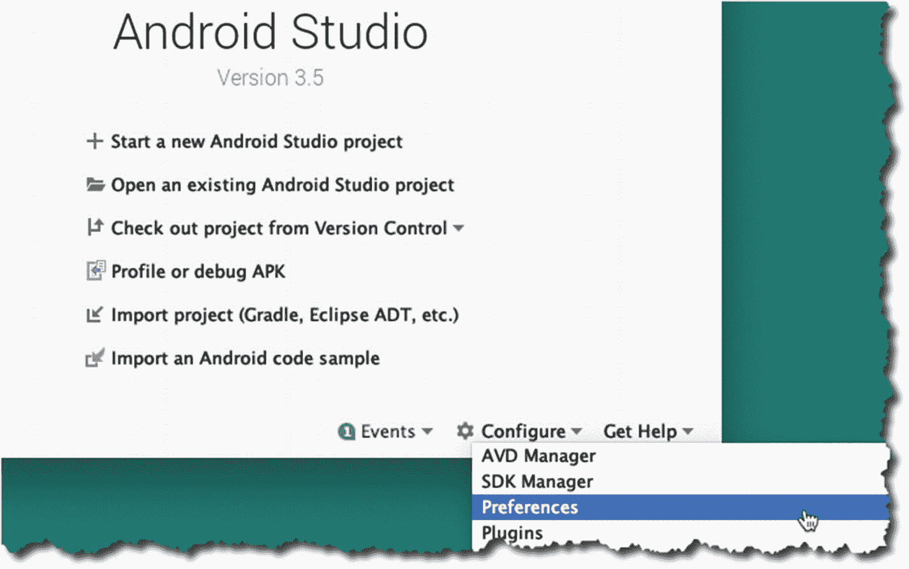
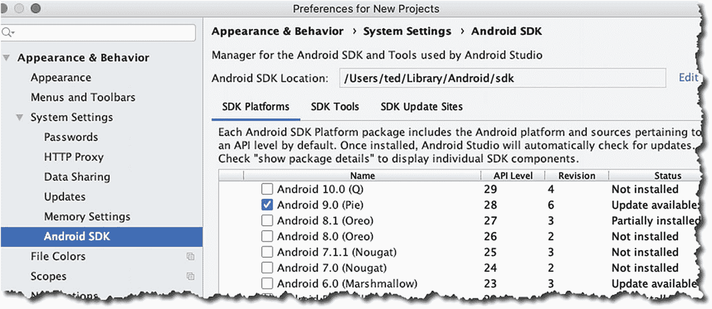
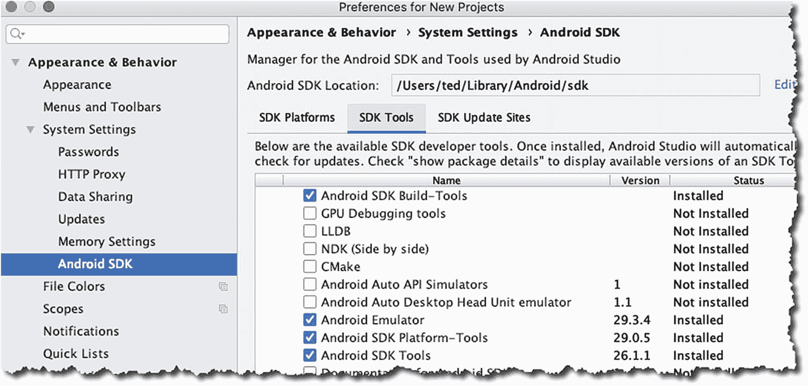

# 一、设置

*   获得 Android Studio

*   设置 IDE

*   基本配置

构建 Android 应用并不总是像今天这样方便。回到 2008 年，当 Android 第一次发布时，我们通过开发工具包获得的只是一堆命令行工具和 Ant 构建脚本。如果你习惯了这类东西，用简单的编辑器、Android CLI 工具和 Ant 来构建应用并不坏，但许多开发人员并不习惯。缺乏现代 IDE 的功能，如代码提示、完成、项目设置/搭建和集成调试，在某种程度上是入门的障碍。

幸运的是，用于 Eclipse IDE 的 Android 开发工具(ADT) 也是在 2008 年发布的。对于许多 Java 开发人员来说，Eclipse 曾经是(现在仍然是)最受欢迎的 IDE 首选。很自然地，它也将成为 Android 开发者的首选 IDE。

从 2009 年到 2012 年，Eclipse 一直是开发的首选 IDE。Android SDK 在结构和范围上经历了重大和渐进的变化。2009 年，SDK 管理器发布；我们用它来下载工具、单个 SDK 版本和可以用于模拟器的 Android 图像。2010 年，发布了针对 ARM 处理器和 x86 CPUs 的附加映像。

2012 年是重要的一年，因为 Eclipse 和 ADT 终于捆绑在一起了。这是一件大事，因为在那之前，开发人员必须分别安装 Eclipse 和 ADT 安装过程并不总是一帆风顺。因此，将两者捆绑在一起使得开始 Android 开发变得更加容易。2012 年也值得纪念，因为它标志着 Eclipse 成为 Android 主流 IDE 的最后一年。

2013 年 Android Studio 发布。可以肯定的是，它仍然处于测试阶段，但是不祥之兆已经很明显了。它将成为 Android 开发的官方 IDE。Android Studio 基于 JetBrains 的 IntelliJ。IntelliJ 是一个商业 Java IDE，它也有一个社区(非付费)版本。这将是社区版本，将作为 Android Studio 的基础。

<section class="Section1 RenderAsSection1" id="Sec1">

## 安装 Android Studio

撰写本文时， Android Studio 在 3.5 版本；希望在你读到这本书的时候，这个版本不会太遥远。可以从[【https://developer.android.com/studio】](https://developer.android.com/studio)下载。它适用于 Windows(32 位和 64 位)、macOS 和 Linux。我在 macOS (Catalina)、Windows 10 64 位和 Ubuntu 18 上运行了安装说明。我主要在 macOS 环境中工作，这解释了为什么这本书的大部分截图看起来像 macOS。Android Studio 在所有三个平台上的外观、运行和感觉(大部分)都是一样的，只有非常小的差异，比如 macOS 中的按键绑定和主菜单栏。

Before we go further, let’s look at the system requirements for Android Studio. At a minimum, you’ll need either of the following:

*   微软 Windows 7/8/10 (32 位或 64 位)

*   macOS 10.10 (Yosemite 或更高版本)

*   Linux (Gnome 或 KDE 桌面)，Ubuntu 14.04 以上；64 位能够运行 32 位应用

*   如果你在 Linux 上，GNU C 库(glibc 2.19 或更高版本)

For the hardware, your workstation needs to be at least

*   3GB 内存(建议 8GB 或更多)

*   2GB 可用硬盘空间

*   1280 x 800 最小屏幕分辨率

这些需求来自 Android 官方网站；当然越多越好。如果你能抢到 32GB 内存、1TB 固态硬盘和全高清(或 UHD)显示器，那就不错了；一点也不。

现在我们来谈谈 Java 开发工具包(JDK) 需求 。从 Android Studio 2.2 开始，安装程序自带 OpenJDK embedded。这样，一个初学者就不必为安装一个单独的 JDK 而烦恼；但是如果你愿意，你仍然可以安装一个单独的 JDK。在本书中，我将假设您将使用 Android Studio 附带的嵌入式 OpenJDK。

从[【https://developer.android.com/studio/】](https://developer.android.com/studio/)下载安装程序；获取适合您平台的二进制文件。

If you have a Mac, do the following:

1.  1\.

    Decompress the compressed file of the installer.

2.  2\.

    Drag the application file to the application folder.

3.  3 .

    唉哟 Android Studio。

4.  4\.

    If you have installed it before, Android Studio will prompt you to import some settings. You can import it, which is the default option.

If you’re using Windows, do the following:

1.  1\.

    Unzip the installer file.

2.  2\.

    Move the decompressed directory to the location of your choice, for example: C: \ users \ my name \ Android studio

3.  3\.

    Go deep into the "AndroidStudio" folder; Inside, you will find "studio64.exe". This is the file that you need to start. It's a good idea to create a shortcut for this file-if you right-click *studio64.exe* and select "Pin to Start Menu", you can use Android Studio from the Windows Start Menu or you can pin it to the taskbar.

Linux 安装比简单地双击并遵循安装程序提示需要更多的工作。在 Ubuntu(及其衍生产品)的未来版本中，这可能会改变，变得像 Windows 和 macOS 一样简单、流畅，但现在，我们需要做一些调整。Linux 上的额外活动大多是因为 Android Studio 需要一些 32 位库和硬件加速。

Note

本节中的安装说明适用于 64 位 Ubuntu 和其他 Ubuntu 衍生产品，例如 Linux Mint、Lubuntu、Xubuntu 和 Ubuntu MATE。我选择这个发行版是因为我认为对于本书的读者来说，它是一个非常常见的 Linux 版本。如果你运行的是 64 位版本的 Ubuntu，你将需要一些 32 位的库才能让 Android Studio 正常运行。

To start pulling the 32-bit libraries for Linux, run the following commands on a terminal window:sudo apt-get update && sudo apt-get upgrade -ysudo dpkg --add-architecture i386sudo apt-get install libncurses5:i386 libstdc++6:i386 zlib1g:i386When all the prep work is done, you need to do the following:

*   解压下载的安装文件。您可以使用命令行工具或 GUI 工具解压缩文件，例如，您可以右键单击文件并选择“在此解压缩”选项，如果您的文件管理器有该选项的话。

*   解压文件后，将文件夹重命名为“AndroidStudio”。

*   将文件夹移动到您拥有读取、写入和执行权限的位置。或者，您也可以将其移动到/usr/local/AndroidStudio。

*   打开一个终端窗口，进入 AndroidStudio/bin 文件夹，然后运行。/studio.sh 。

*   首次启动时，Android Studio 会问你是否要导入一些设置；如果您已经安装了以前版本的 Android Studio，您可能需要导入这些设置。

</section>

<section class="Section1 RenderAsSection1" id="Sec2">

## 配置 Android Studio

If this is the first time you’ve installed Android Studio, you might want to configure a couple of things first before diving into coding work. In this section, I’ll walk you through the following:

*   获取更多我们需要的软件，以便我们可以创建针对特定版本 Android 的程序。

*   确保我们拥有所有需要的 SDK 工具。

Launch the IDE if you haven’t done so yet, then click “Configure,” as shown in Figure 1-1. Choose “Preferences” from the drop-down list.

<figure class="Figure" id="Fig1">

<figcaption class="Caption" lang="en">Figure 1-1

从 Android Studio 的打开对话框进入“首选项”

</figcaption>

</figure>

When you click the “Preferences” option, it will open the Preferences dialog, as shown in Figure 1-2. On the left-hand side of the dialog, select the “Android SDK” section.

<figure class="Figure" id="Fig2">

<figcaption class="Caption" lang="en">Figure 1-2

SDK 平台

</figcaption>

</figure>

“Android SDK ”部分有三个选项卡:“SDK 平台”、“SDK 工具”和“SDK 更新站点”；它们的标题不言自明。

当您到达“SDK 平台”部分时，启用“显示包细节”选项，以便您可以看到每个 API 级别的更详细视图。我们不需要下载 SDK 窗口中的所有内容。我们将只得到我们需要的物品。

SDK 等级或者平台号都是 Android 的特定版本。Android 9 或“派”是 API 等级 28，Android 8 或“奥利奥”是 API 等级 26 和 27，牛轧糖是 API 等级 24 和 25。您不需要记住平台号，至少不再需要，因为 IDE 会显示平台号和相应的 Android 昵称。

你会注意到在我的设置中只选择了 Android 9 (Pie)。你可以选择安装尽可能多的 SDK 平台，但出于本书的目的，我将使用 Android 9 或 10，因为在撰写本文时这些版本是最新的。这就是我们将用于示例项目的内容。请确保在下载平台的同时，您还将下载“Google APIs 英特尔 x86 Atom_64 系统映像”当我们测试运行我们的应用时，我们将需要这些。

选择一个 API 级别现在可能没什么大不了的，因为在这一点上，我们只是在练习应用。当您计划向公众发布您的应用时，您可能不会轻易做出这个选择。为你的应用选择一个最低的 SDK 或 API 级别将决定有多少人能够使用你的应用。在撰写本文时，25%的安卓设备使用“棉花糖”，22%使用“牛轧糖”，4%使用“奥利奥”。这些统计数据来自 [` developer 的仪表盘页面。安卓。com`](https://developer.android.com) 。不时查看这些统计数据是个不错的主意，你可以在这里找到:[`developer.android.com/about/dashboards/`](https://developer.android.com/about/dashboards/)。

Our next stop is the “SDK Tools” section, which is shown in Figure 1-3.

<figure class="Figure" id="Fig3">

<figcaption class="Caption" lang="en">Figure 1-3

SDK 工具

</figcaption>

</figure>

You don’t need to change anything on this window, but it wouldn’t hurt to check if you have the tools, as shown in the following list, marked as “Installed.”

*   Android SDK 构建工具

*   Android SDK 平台工具

*   Android SDK 工具

*   安卓模拟器

*   支持知识库

*   HAXM 安装程序

检查这些工具可以确保我们得到类似于 *adb* 、 *sqlite* 、 *aapt* 、 *zipalign* 等工具。这些工具帮助我们调试、创建构建、使用数据库、运行仿真等等。

Note

如果你在 Linux 平台上，即使你有 Intel 处理器，你也不能使用 HAXM。KVM 将用于 Linux，而不是 HAXM。

一旦你对你的选择满意，点击“确定”按钮开始下载软件包。

</section>

<section class="Section1 RenderAsSection1" id="Sec3">

## 硬件加速

在你编写应用的时候，不时地测试和运行它是很有用的，这样可以得到即时的反馈，并发现它是否像预期的那样运行，或者它是否正在运行。为此，您将使用物理或虚拟设备。每个选项都有其利弊，你不必选择一个而不是另一个；事实上，你最终将不得不使用这两个选项。

Android 虚拟设备或 AVD 是一个仿真器，你可以在其中运行你的应用。在模拟器上运行有时会很慢；这就是谷歌和英特尔想出 HAXM 的原因。这是一个模拟器加速工具，让测试你的应用变得更容易忍受。这对开发者来说是个福音。也就是说，如果您使用的机器配备了支持虚拟化的英特尔处理器，并且您没有使用 Linux。但是，如果您不够幸运，不要担心，有一些方法可以在 Linux 中实现模拟器加速，我们将在后面看到。

macOS 用户可能最容易拥有它，因为 HAXM 是自动随 Android Studio 安装的。他们不需要做任何事情就可以得到它，安装人员会为他们处理好的。

Windows users can get HAXM either by

*   从[【https://software.intel.com/en-us/android】](https://software.intel.com/en-us/android)下载。像安装其他 Windows 软件一样安装它，双击它，然后按照提示进行操作。

*   或者，您可以通过 SDK 管理器获得 HAXM 这是推荐的方法。

对于 Linux 用户，推荐的软件是 KVM(基于内核的虚拟机)；这是针对 Linux 的虚拟化解决方案。它包含虚拟化扩展(英特尔 VT 或 AMD-V)。

To get KVM, we need to pull some software from the repos; but even before you can do that, you need to do the following first:

*   确保在 BIOS 或 UEFI 设置中启用了虚拟化。关于如何获得这些设置，请查阅您的硬件手册。它通常包括关闭电脑，重新启动电脑，并在听到系统扬声器的声音时按下中断键，如 F2 或 DEL，但正如我所说的，请查阅您的硬件手册。

*   完成更改并重启到 Linux 后，看看您的系统是否可以运行虚拟化。这可以通过从终端运行以下命令来实现:egrep–c '(vmx | SVM)'/proc/CPU info。如果结果是一个大于零的数字，这意味着您可以继续安装。

To install KVM, type the commands, as shown in Listing 1-1, in a terminal window.sudo apt-get install qemu-kvm libvirt-bin ubuntu-vm-builder bridge-utilssudo adduser your_user_name kvmsudo adduser your_user_name libvirtdListing 1-1

安装 KVM 的命令

您可能需要重新启动系统才能完成安装。

希望一切顺利，您现在有了一个合适的开发环境。

</section>

<section class="Section1 RenderAsSection1" id="Sec4">

## 关键要点

*   可以获得 macOS、Windows、Linux 的 Android 和 Android Studio。在 Android 网站上，每个平台都有一个可用的预编译二进制文件。

*   HAXM 为我们提供了一种在 Android 虚拟设备上加速仿真的方法。当你在 macOS 或 Windows 上时(使用 Intel 处理器)，你将自动获得 HAXM。如果你在 Linux 上，你可以用 KVM 代替 HAXM。

</section>