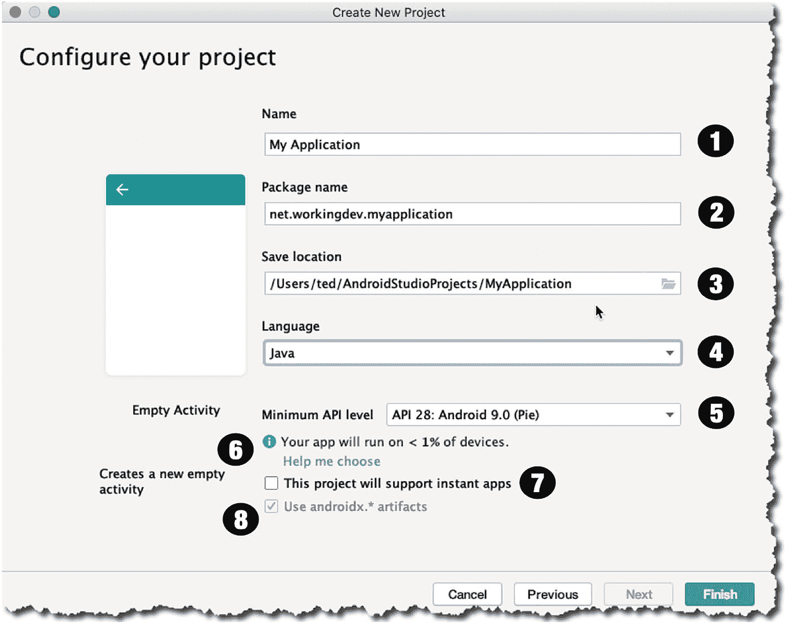

# 二、项目基础

*   创建一个简单的项目。

*   创建一个 Android 虚拟设备(模拟器)，这样我们就可以运行和测试项目。

<section class="Section1 RenderAsSection1" id="Sec1">

## 创建项目

Launch Android Studio, if you haven’t done so yet. Click “Start a new Android Studio project,” as shown in Figure 2-1. You need to be online when you do this because Android Studio’s Gradle (a project build tool) pulls quite a few files from online repositories when starting a new project.

<figure class="Figure" id="Fig1">

<figcaption class="Caption" lang="en">Figure 2-1

欢迎来到安卓工作室

</figcaption>

</figure>

During the creation process, Android prompts for what kind of project we want to build; choose “Phone and Tablet” ➤ “Empty Activity,” as shown in Figure 2-2—we’ll discuss Activities in the coming chapters, but for now, think of an Activity as a screen or form; it’s something that the user sees and interacts with.

<figure class="Figure" id="Fig2">

<figcaption class="Caption" lang="en">Figure 2-2

创建一个新项目，选择一个活动类型

</figcaption>

</figure>

In the next screen, we get to configure the project. We set the app’s name, package name (domain), and the target Android version. Figure 2-3 shows the annotated picture of the “Create New Project” screen.

<figure class="Figure" id="Fig3">

<figcaption class="Caption" lang="en">Figure 2-3Create New Project

<colgroup><col class="tcol1 align-left"> <col class="tcol2 align-left"></colgroup> 
| -好的 | **名称**—这是您想要调用的应用；这也称为项目名称。该名称成为包含所有项目文件的顶级文件夹的名称。如果您在 Play Store 中发布应用，该名称也将成为您的应用标识的一部分。 |
| ❷ | **包名**—这是您的组织或公司的域名，采用反向 DNS 表示法。如果您没有公司名称，您可以使用任何类似于 web 域的名称。目前，我们是否使用真实的公司名称并不重要，因为我们不会将这个发布到 Play Store。 |
| -你好 | **保存位置**—这是本地目录中保存项目文件的位置。 |
| (a) | **语言**—可以用 Kotlin，也可以用 Java 对于这个项目，我们将使用 Java。 |
| (一) | **最低 API 级别**—最低 API 级别将决定您的应用可以运行的最低 Android 版本。你需要明智而谨慎地选择，因为这会严重限制你的应用的潜在受众。 |
| ❻ | **帮我选择**—这显示了你的应用可以在 Android 设备上运行的百分比。如果你点击“帮我选择”链接，它会打开一个窗口，显示 Android 设备的分布，每个 Android 版本。 |
| ❼ | **即时应用**—如果您希望您的应用可以播放，而无需用户安装您的应用，请启用此复选框。即时应用允许用户在 Google Play 中浏览和“试用”您的应用，而无需下载和安装应用。 |
| ❽ | **安卓。x**—这些是支持库。包含它们是为了让你可以使用现代的 Android 库(比如 Android 9 中包含的那些),但仍然允许你的应用在较低版本的 Android 设备上运行。 |

</figcaption>

</figure>

完成后，单击“Finish”开始创建项目。Android Studio 搭建项目并创建启动文件，如主活动文件、Android 清单和其他文件，以支持项目。构建工具(Gradle)将从在线回购中提取相当多的文件——这可能需要一些时间。

After all that, hopefully the project is created, and you get to see Android Studio’s main editor window, as shown in Figure 2-4.

<figure class="Figure" id="Fig4">

<figcaption class="Caption" lang="en">Figure 2-4

主编辑窗口

</figcaption>

</figure>

Android Studio 的屏幕由几个部分组成，可以根据你的需要折叠和展开。左边部分(图 2-4 )是项目面板；它是一个树状结构，显示了项目中的所有(相关)文件。如果你想编辑一个特定的文件，只需在项目面板中选择它并双击；此时，它将在主编辑器窗口中打开进行编辑。在图 2-4 中，可以看到*主活动*。 *java* 文件可供编辑。随着时间的推移，我们将花费大量的时间在主编辑器窗口中涂鸦，但现在，我们只想简单地经历应用开发的基本过程。我们不会添加或修改这个 Java 文件或项目中的任何其他文件。我们会让它保持原样。

</section>

<section class="Section1 RenderAsSection1" id="Sec2">

## 创建一个 AVD

我们可以通过在仿真器中运行应用或者将物理 Android 设备插入工作站来测试应用。本节介绍如何设置模拟器。

From Android Studio’s main menu bar, go to **Tools** ➤ **AVD Manager**, as shown in Figure 2-5.

<figure class="Figure" id="Fig5">

<figcaption class="Caption" lang="en">Figure 2-5

菜单栏、工具、AVD 管理器

</figcaption>

</figure>

The AVD manager window will launch. AVD stands for Android Virtual Device; it’s an emulator that runs a specific version of the Android OS which we can use to run the apps on. The AVD manager (shown in Figure 2-6) shows all the defined emulators in our local development environment.

<figure class="Figure" id="Fig6">

<figcaption class="Caption" lang="en">Figure 2-6

AVD 管理器

</figcaption>

</figure>

As you can see, I already have a couple of emulators; but let’s create another one; to do that, click the “+ Create Virtual Device” button, as shown in Figure 2-6. That action will launch the “Virtual Device Configuration” screen, as shown in Figure 2-7.

<figure class="Figure" id="Fig7">

<figcaption class="Caption" lang="en">Figure 2-7

虚拟设备配置

</figcaption>

</figure>

Choose the “Phone” category, then choose the device resolution. I chose the Pixel 5.0” 420dpi screen. Click the “Next” button, and we get to choose the Android version we want to run on the emulator; we can do this on the “System Image” screen, shown in Figure 2-8.

<figure class="Figure" id="Fig8">

<figcaption class="Caption" lang="en">Figure 2-8

虚拟设备配置

</figcaption>

</figure>

I want to use Android 9 (API level 28) or Pie, as some may call it; but as you can see, I don’t have the Pie system image in my machine just yet—when you can see the “download” link next to the Android version, that means you don’t have that system image yet. I need to get the system image for Pie first before I can use it for the AVD; so, click the “download” link. You’ll need to agree to the license agreement before you can proceed. Click “Accept,” then click “Next,” as shown in Figure 2-9.

<figure class="Figure" id="Fig9">

<figcaption class="Caption" lang="en">Figure 2-9

SDK Quickfix 安装

</figcaption>

</figure>

The download process can take some time, depending on your Internet speed; when it’s done, you’ll get back to the “System Image” selection screen, as shown in Figure 2-10.

<figure class="Figure" id="Fig10">

<figcaption class="Caption" lang="en">Figure 2-10

虚拟设备配置

</figcaption>

</figure>

As you can see, we can now use Pie as a system image for our emulator. Select Pie, then click “Next.” The next screen shows a summary of our past choices for creating the emulator; the “Verify Configuration” screen is shown next (Figure 2-11).

<figure class="Figure" id="Fig11">

<figcaption class="Caption" lang="en">Figure 2-11

验证配置

</figcaption>

</figure>

The “Verify Configuration” screen not only shows the summary of our past choices, you can configure some additional functionalities here. If you click the “Show Advanced Settings” button, you can also configure the following:

*   前后摄像头

*   仿真网络速度

*   模拟性能

*   内部存储的大小

*   键盘输入(无论启用还是禁用)

When you’re done, click the “Finish” button. When Android Studio finishes provisioning the newly created AVD, we’ll be back in the “Android Virtual Device Manager” screen, as shown in Figure 2-12.

<figure class="Figure" id="Fig12">

<figcaption class="Caption" lang="en">Figure 2-12

Android 虚拟设备管理器

</figcaption>

</figure>

现在我们可以看到新创建的模拟器(Pixel API 28)。您可以通过单击“Actions”列上的绿色小箭头来启动它——铅笔图标编辑模拟器的配置，绿色箭头启动它。

当模拟器启动时，你会看到 Pixel 手机的图像在桌面上弹出；完全启动需要时间。回到 Android Studio 的主编辑器窗口运行应用。

From the main menu bar, go to **Run** ➤ **Run ‘app’**, as shown in Figure 2-13.

<figure class="Figure" id="Fig13">

<figcaption class="Caption" lang="en">Figure 2-13

主菜单栏，运行

</figcaption>

</figure>

Android Studio 编译项目；然后它寻找一个连接的(物理的)Android 设备或者一个正在运行的模拟器。我们不久前已经启动了模拟器，所以 Android Studio 应该可以找到它并在模拟器实例中安装应用。

If all went well, you should see the Hello World app that Android Studio scaffolded for us, as shown in Figure 2-14.

<figure class="Figure" id="Fig14">

<figcaption class="Caption" lang="en">Figure 2-14

你好世界

</figcaption>

</figure>

</section>

<section class="Section1 RenderAsSection1" id="Sec3">

## 关键要点

*   Android 项目几乎总是有一个活动。如果你想从一个基础项目开始，选择一个有“空活动”的项目，然后从那里开始构建。

*   在创建过程中，请注意您在项目细节中放入的内容；如果您将项目发布到 Google Play，这些项目信息将成为您的应用的一部分，许多人都会看到。

*   谨慎选择最低 SDK 它会限制你的应用潜在用户的数量。

*   你可以使用模拟器来运行你的应用，看看它是如何形成的。如果您的系统上启用了 HAXM(模拟器加速器),那么使用模拟器进行测试会好得多；如果您使用的是 Linux，可以使用 KVM 实现加速。

</section>