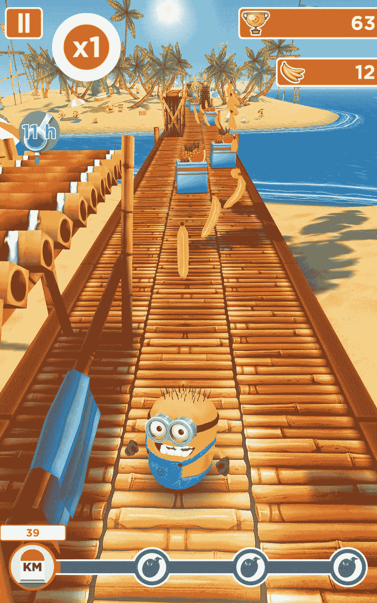
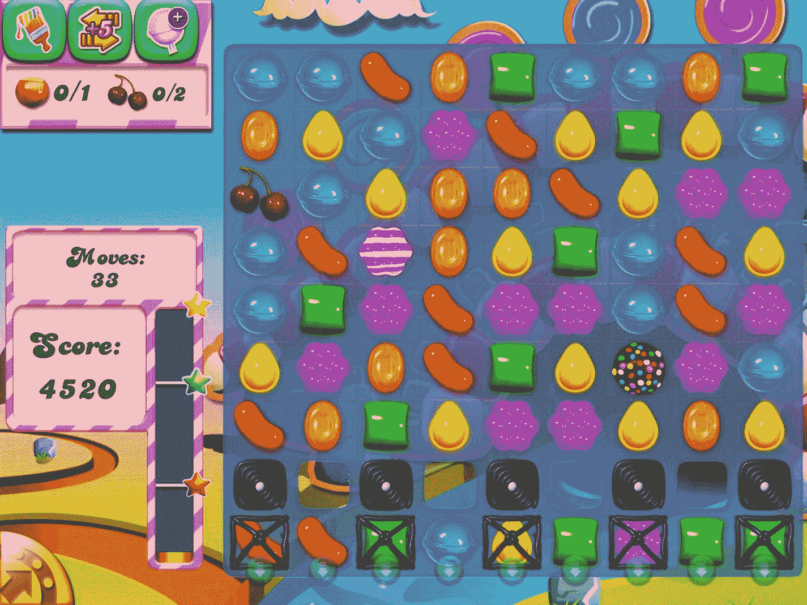
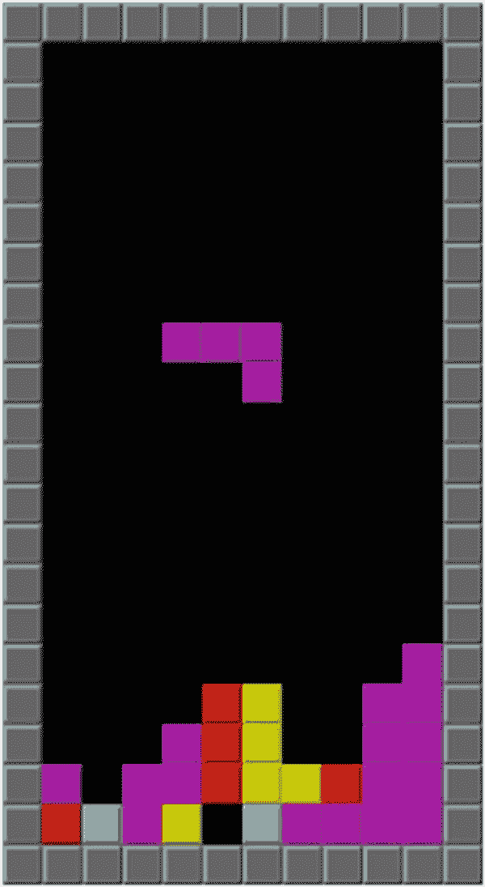
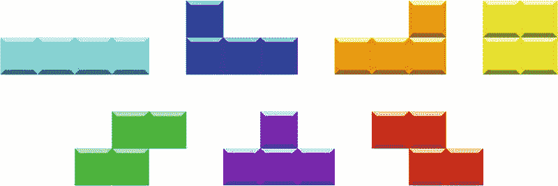
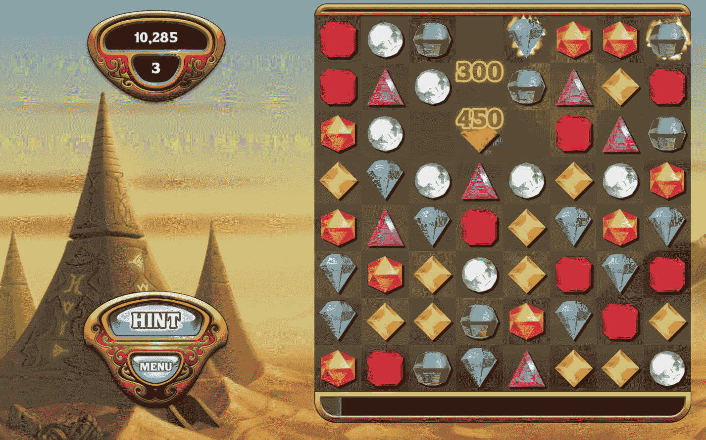
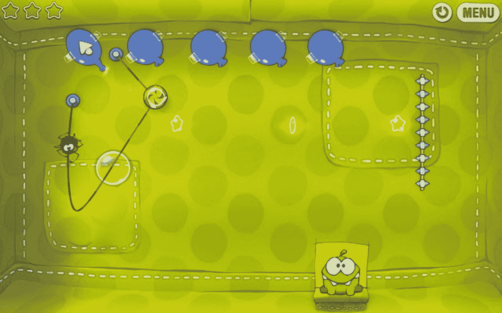

# 五、游戏开发入门

据估计，Google Play 上有 280 万个应用(在撰写本文时)，其中 30 万个是游戏。那是很多游戏；而且还会增长。考虑到程序员现在已经写了很长时间的游戏，任何想写小说游戏的人都会很难。如果你在寻找新游戏的创意，最好调查一下现有的游戏；看看你能挑选和组合什么样的想法。

In this chapter, we’ll look at some of the popular games in Google Play. We’ll also discuss a high-level overview of what kind of functionalities we’ll need to bake into our game code. We’ll cover the following areas:

*   游戏性别

*   游戏引擎

*   游戏循环

<section class="Section1 RenderAsSection1" id="Sec1">

## 游戏类型快速浏览

如果你在维基百科页面上查看游戏种类，你会看到很多(并且还在增加)游戏种类。游戏类型是一个特定的游戏类别，与游戏的游戏性特征相关。在这里我们不会描述所有的游戏，但是让我们看看一些流行的游戏。

<section class="Section2 RenderAsSection2" id="Sec2">

### 休闲游戏

休闲游戏正迅速成为有经验和无经验玩家的最爱。这些游戏通常有非常简单的规则、玩法和策略程度。你不需要为这些游戏投入额外的时间，也不需要特殊的技能来享受它们；这可能是这些游戏非常受欢迎的原因，因为它们容易学习，并且可以作为一种消遣来玩。

I’m sure you’ve seen some of these games already; you might have played a couple of them. *Minion* *Rush* (Figure 5-1) is a runner game, based loosely on the very popular *Temple Run*, where you guide a figure—in this case, a minion—through hoops and obstacles. Swipe left and the minion goes left, swipe right and it goes right, swipe down to slide, and swipe up to jump; it really is simple. There are many derivatives of this game, but the mechanics rarely changes. Usually, the objective is to run for as long as possible and collect some tokens along the way.

<figure class="Figure" id="Fig1">

<figcaption class="Caption" lang="en">Figure 5-1

宠臣闯 

</figcaption>

</figure>

Another example of a casual game is *Candy Crush Saga* (Figure 5-2). It’s a “match three” game. The gameplay revolves around swapping two adjacent candies among several on the game board so that you can make a row or column of three matching colored candies. By the way, while *Candy Crush Saga* is considered a casual game, it also belongs to another category called puzzle games; sometimes, a game may belong to more than one category.

<figure class="Figure" id="Fig2">

<figcaption class="Caption" lang="en">Figure 5-2

糖果粉碎传奇

</figcaption>

</figure>

</section>

<section class="Section2 RenderAsSection2" id="Sec3">

### 益智游戏

Puzzle or logic games  require the player to solve logic puzzles or navigate challenging locations such as mazes. This genre frequently crosses over with adventure, educational, or even casual games. I’m sure you’ve heard of *Tetris* (Figure 5-3) or *Bejeweled;* these two are the best examples I can think of for puzzle games.

<figure class="Figure" id="Fig3">

<figcaption class="Caption" lang="en">Figure 5-3

俄罗斯方块

</figcaption>

</figure>

*Tetris* is largely credited for popularizing the puzzler genre. *Tetris*, originally, came from the Soviet Union and came to life sometime in 1984\. The goal in this game is simple; the player must destroy lines of block before the blocks pile up and reaches the top. A tetromino is the shape of the four connected blocks that falls from the top of the screen and settles at the bottom. There are generally seven kinds of tetrominoes (Figure 5-4). You can guide the tetrominoes as they fall; swiping left or right guides the blocks to the desired location, and (usually) double tapping rotates the tetrominoes.

<figure class="Figure" id="Fig4">

<figcaption class="Caption" lang="en">Figure 5-4

三聚氰胺

</figcaption>

</figure>

*Bejeweled* (Figure 5-5) is another popular puzzler. The goal is to clear gems of the same color, potentially causing a chain reaction; this is done by swapping one gem with an adjacent gem to form a horizontal or vertical chain of three or more gems of the same color. When chains are formed, the gems disappear and some other gems fall from the top to fill in the gaps—sometimes, “cascades” are triggered when chains are formed by the falling gems.

<figure class="Figure" id="Fig5">

<figcaption class="Caption" lang="en">Figure 5-5

珠光宝气

</figcaption>

</figure>

As you can see from the *Tetris* and *Bejeweled* examples, matchers make for good puzzle gameplay; but there are other kinds of puzzlers. Take “*Cut the Rope*” (Figure 5-6) by ZeptoLab as an example; it’s a physics puzzler. The goal of the game is to feed the candy to “Om Nom” (the little green creature). The candy must be guided toward Om Nom by cutting ropes the candy is attached to; the candy may be blown or put inside bubbles, so it avoids obstacles. Every game object is physically simulated to some degree. The game is powered by Box2D, a 2D physics engine.

<figure class="Figure" id="Fig6">

<figcaption class="Caption" lang="en">Figure 5-6

割断绳子

</figcaption>

</figure>

</section>

<section class="Section2 RenderAsSection2" id="Sec4">

### 动作游戏

动作游戏通常需要手眼协调和运动技能。这些游戏以一个控制大部分行动的玩家为中心。这种类型有许多子类别，如平台游戏、射击游戏、战斗游戏、潜行、生存游戏、皇家战役和节奏游戏。

平台玩家通常会有一个角色在环境中跳跃和攀爬。角色通常必须避开敌人和障碍。最受欢迎的平台游戏通常要么在游戏机上发布，要么在个人电脑上发布(马里奥兄弟、大金刚、速成乐队、索尼克狂热、地狱边缘等)。)，但一些平台正在进军 Google Play(冒险岛、Blackmoor 2、Dandara 等)。).

射击游戏是动作游戏的另一个流行分支。流派是非常描述性的，你可以从他们的流派中猜出这些游戏是关于什么的，你是对的；你拍东西，人，外星人，怪物，僵尸，等等。玩家使用一系列武器参与行动，行动发生在远处。这种类型通常以暴力游戏和致命武器为特征(有一些明显的例外，如 Splatoon，它有一个非暴力的目标和游戏)。Google Play 中一些受欢迎的射击游戏是《使命召唤移动版》、《堡垒之夜》、《杀手狙击手》、《PUBG 移动版》、《关键行动》、《死亡效果 2》和《巨人 X》，等等。

</section>

<section class="Section2 RenderAsSection2" id="Sec5">

### 塔防小游戏

塔防是策略游戏的一个子类。战略游戏注重游戏性，这需要技巧性和仔细的思考和计划，以取得胜利。在大多数策略游戏中，玩家被赋予了“上帝般”的游戏世界视角，因此他们可以直接或间接地控制他们指挥的单位。

塔防游戏 游戏的典型特征是一股邪恶的力量散发出一波又一波的生物、僵尸、气球等等。你的任务是通过建立防御来保卫游戏世界中的一些战略区域(你的塔)，无论是炮塔，猴子，枪，等等。这些防御将射击敌人来袭的电波，每杀死一个敌人你就得到一分。这些点数被转换成游戏币，你可以用它来升级你的武器或者购买新武器。

在撰写本文时，Google Play 中流行的塔防游戏有 Bloons TD 6、Defenders 2、Defense Zone 3、Digfender、Element TD、Kingdom Rush 和 Grow Castle 等。

这绝不是游戏类型的概要；这是你能在 Google Play 中找到的游戏种类的一个小列表。如果你在为你的下一个游戏(或第一个游戏)寻找灵感，试着分析性地玩游戏，把娱乐部分放在一边。临床上做。试着感受一下游戏是如何流动的，并试着在脑海中解构它。这可能会给你的游戏一些想法。

</section>

</section>

<section class="Section1 RenderAsSection1" id="Sec6">

## 游戏引擎

一旦你有了想要制作什么游戏的想法，并且假设你已经通过故事板、模拟图形和绘制一些屏幕线框(你知道，规划阶段)完成了设计游戏的练习，你可能会想花一些时间来组织代码。代码的组织构成了游戏引擎和游戏循环。

At the core of every game is the game engine  . This is the code that powers the game; this is the one that handles all the grunt work. A typical game engine will handle the following tasks:

*   窗口管理

*   图形渲染

*   动画

*   声音的

*   冲突检出

*   物理学

*   线程和内存

*   建立关系网

*   输入/输出

*   仓库

游戏循环是游戏引擎中的一段代码。顾名思义，它是循环的。它重复而永恒地运行；直到玩家退出才会停止。你可能以前听过游戏玩家谈论帧率；你的游戏循环运行的速度会影响游戏的帧率。你的代码在循环中执行的越快，它的响应就越快，游戏就越流畅。

A typical game loop does the following:

*   **获取用户的输入**—这是命令解释器；您需要设置代码来监听用户输入，无论是双击、长时间点击、按钮点击、滑动、手势、键盘输入还是其他。这些输入会影响角色和整个游戏，例如，如果游戏是*奴才狂奔*或*神庙逃亡*，向左、向右、向上或向下滑动会移动逃跑者。

*   碰撞检测(Collision detection)——这是你追踪角色在游戏世界中移动的地方。当他们到达游戏世界的边缘时，你决定如何处理这个角色。碰撞检测也是测试角色是否撞到障碍物的地方。

*   绘制并移动背景——这是你绘制游戏世界的地方，至少玩家可以看到其中的一部分。

*   **移动字符**作为对用户输入的响应。

*   当角色或游戏世界中发生有趣的事件时，播放音效。

*   **播放背景音乐**—这和播放音效不一样。背景音乐贯穿整个关卡，所以它需要是连续的。这就是你的线程知识派上用场的地方。

*   **追踪玩家的分数**—随着游戏的进行，玩家会累积分数。您可以使用本地存储器在本地存储游戏统计数据。如果你需要在云中更新排行榜，你需要使用 Android 的网络 API。跟踪玩家的分数可能还包括显示一个专门的屏幕(Android 中的一个活动或一帧)，在那里记录分数。

这不是您需要在代码中解决的问题的详尽或确定的列表，但这是一个开始。你在游戏循环和游戏引擎中需要做的事情的数量会根据游戏的复杂程度而增减。

</section>

<section class="Section1 RenderAsSection1" id="Sec7">

## 关键要点

*   已经有无数的游戏了。你的下一个游戏灵感可能来自现有的游戏。尝试分析性地、临床地、脱离娱乐性地玩游戏。解剖它们以了解它们是如何流动的。

*   游戏体验的流畅程度在很大程度上取决于你在游戏循环中所做的事情。循环执行得越快，你的游戏就越快。

</section>