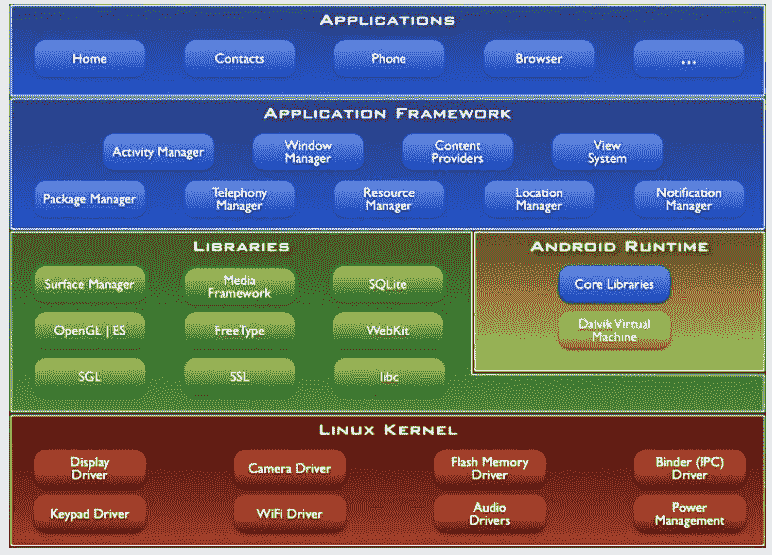
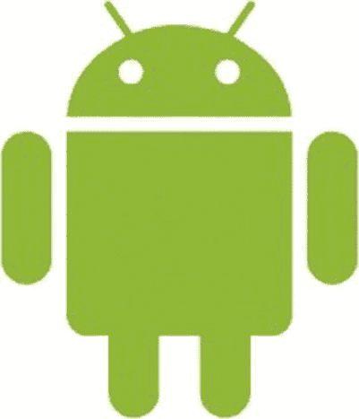
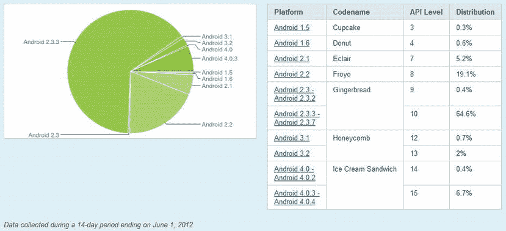
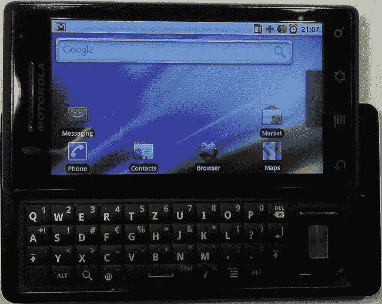
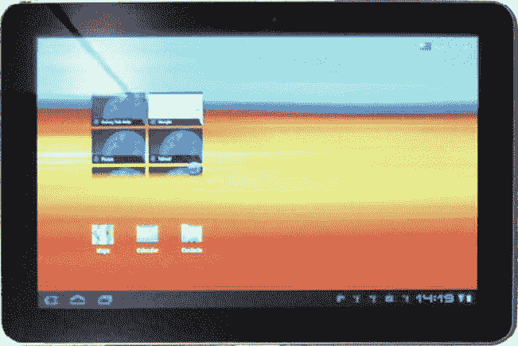

# 一、每个家庭都有一个安卓

作为 80 年代和 90 年代的孩子，我们很自然地伴随着值得信赖的任天堂游戏机和世嘉游戏机长大。我们花了无数时间帮助马里奥营救公主，在俄罗斯方块中获得最高分，并通过链接电缆在超级 RC Pro-Am 中与我们的朋友比赛。我们带着这些很棒的硬件去任何我们能去的地方。我们对游戏的热情让我们想要创造自己的世界，并与我们的朋友分享。我们开始在 PC 上编程，但很快意识到我们无法将我们的小杰作转移到可用的便携式游戏机上。随着我们继续成为热情的程序员，随着时间的推移，我们对实际玩视频游戏的兴趣消退了。此外，我们的游戏男孩最终打破了。。。

快进到今天。智能手机和平板电脑已经成为这个时代的新移动游戏平台，与任天堂 3DS 和 PlayStation Vita 等经典的专用手持系统竞争。这一发展重新激起了我们的兴趣，我们开始研究哪些移动平台适合我们的开发需求。苹果的 iOS 似乎是我们游戏编码技能的一个很好的候选。然而，我们很快意识到这个系统不是开放的，只有在苹果公司允许的情况下，我们才能与他人分享我们的工作，我们需要一台 Mac 来开发 iOS。然后我们发现了 Android 。

我们俩立刻就爱上了 Android。它的开发环境可以在所有主要平台上运行——没有任何附加条件。它有一个充满活力的开发人员社区，乐意帮助您解决遇到的任何问题，并提供全面的文档。你可以与任何人分享你的游戏，而不必为此付费，如果你想将你的作品货币化，你可以在几分钟内轻松地向拥有数百万用户的全球市场发布你最新最伟大的创新。

剩下的唯一事情就是弄清楚如何为 Android 编写游戏，以及如何将我们的 PC 游戏开发知识转移到这个新系统中。在接下来的章节中，我们希望与您分享我们的经验，并帮助您开始 Android 游戏开发。当然，这在一定程度上是一个自私的计划:我们想在旅途中玩更多的游戏！

让我们从了解我们的新朋友 Android 开始。

Android 简史

Android 首次公开露面是在 2005 年，当时谷歌收购了一家名为 Android Inc .的小型初创公司，这引发了人们对谷歌有意进入移动设备领域的猜测。2008 年，Android 1.0 版本的发布结束了所有的猜测，Android 继续成为移动市场上新的挑战者。自那以后，Android 一直在与已经建立的平台竞争，如 iOS(当时称为 iPhone OS)、黑莓 OS 和 Windows Phone 7。Android 的增长是惊人的，因为它每年都获得越来越多的市场份额。虽然移动技术的未来总是在变化，但有一点是肯定的:Android 将会继续存在。

由于 Android 是开源的，使用新平台的手机制造商进入门槛很低。他们可以生产所有价格段的设备，修改 Android 本身以适应特定设备的处理能力。因此，Android 不仅限于高端设备，还可以部署在低成本设备中，从而覆盖更广泛的受众。

Android 成功的一个关键因素是 2007 年末开放手机联盟(OHA)的成立。OHA 包括 HTC、高通、摩托罗拉和英伟达等公司，它们都合作开发移动设备的开放标准。尽管 Android 的代码主要是由谷歌开发的，但所有 OHA 成员都以这样或那样的形式为其源代码做出了贡献。

Android 本身是一个基于 Linux 内核版本 2.6 和 3.x 的移动操作系统和平台，它可以免费用于商业和非商业用途。OHA 的许多成员为他们的设备开发了用户界面经过修改的定制版 Android，比如 HTC 的 Sense 和摩托罗拉的 MOTOBLUR。Android 的开源特性也使得爱好者能够创建和分发他们自己的版本。这些通常被称为 *mods* 、*固件*或*rom*。在撰写本文时，最著名的 rom 是由 Steve Kondik(也称为 Cyanogen)和许多贡献者开发的。它旨在为各种 Android 设备带来最新最好的改进，并为那些被抛弃或陈旧的设备带来新鲜空气。

自 2008 年发布以来，Android 已经收到了许多重大的版本更新，都是以甜点命名的(Android 1.1 除外，如今已经无关紧要了)。Android 平台的大多数版本都添加了新功能，通常以应用编程接口(API)或新开发工具的形式出现，这些功能在某种程度上与游戏开发者相关:

*   *1.5 版本(Cupcake)* :增加了在 Android 应用中包含原生库的支持，之前仅限于纯 Java 编写。在最关心性能的情况下，本机代码非常有用。
*   *1.6 版本(甜甜圈)* :引入了对不同屏幕分辨率的支持。我们将在本书中多次重温这一发展，因为它对我们如何为 Android 编写游戏有一些影响。
*   *2.0 版本(克莱尔)* :增加了对多点触控屏幕的支持。
*   *2.2 版(Froyo)* :在 Dalvik 虚拟机(VM)上增加了即时(JIT)编译，这是一款为 Android 上所有 Java 应用提供动力的软件。JIT 大大加快了 Android 应用的执行速度——根据不同的场景，速度提高了 5 倍。
*   *2.3 版本(姜饼)* :在 Dalvik VM 中增加了一个新的并发垃圾收集器。
*   *3.0 版本(蜂巢)* :创造了一个平板电脑版本的 Android。Honeycomb 于 2011 年初推出，包含了比迄今为止发布的任何其他单一 Android 版本更多的重大 API 变化。到了 3.1 版本，Honeycomb 增加了对分割和管理大型高分辨率平板电脑屏幕的广泛支持。它增加了更多类似 PC 的功能，如 USB 主机支持和 USB 外设支持，包括键盘、鼠标和操纵杆。这个版本唯一的问题是它只针对平板电脑。小屏幕/智能手机版本的 Android 还停留在 2.3 版本。
*   *Android 4.0(冰激凌三明治【ICS】)*:将 Honeycomb (3.1)和 Gingerbread (2.3)合并成一套通用的功能，在平板电脑和手机上都运行良好。
*   *Android 4.1(果冻豆)* :改进了 UI 的合成方式，以及一般的渲染。这一努力被称为“黄油项目”;首款搭载果冻豆的设备是谷歌自己的 Nexus 7 平板电脑。

ICS 对最终用户来说是一个巨大的推动，它对 Android UI 和内置应用(如浏览器、电子邮件客户端和照片服务)进行了大量改进。对于开发人员来说，除了其他事情之外，IC 还融入了蜂窝 UI APIs，为手机带来了大屏幕功能。ICS 还合并了 Honeycomb 的 USB 外围支持，这使制造商可以选择支持键盘和操纵杆。至于新的 API，ICS 增加了一些，比如 Social API，它为联系人、个人资料、状态更新和照片提供了一个统一的存储。对 Android 游戏开发者来说幸运的是，ICS 在其核心保持了良好的向后兼容性，确保了一个正确构建的游戏将与旧版本如 Cupcake 和艾克蕾尔保持良好的兼容性。

**注意**我们都经常被问到新版本的 Android 会给游戏带来哪些新功能。答案经常让人们感到惊讶:自 2.1 版本以来，除了原生开发工具包(NDK)之外，实际上没有新的游戏特定功能被添加到 Android 中。从那个版本开始，Android 已经包含了你所需要的一切，你可以构建任何你想要的游戏。大多数新特性都添加到了 UI API 中，所以只需关注 2.1 版，你就可以开始了。

碎片化

Android 的巨大灵活性是有代价的:选择开发自己用户界面的公司必须赶上新版本 Android 发布的快速步伐。这可能导致推出不到几个月的手机变得过时，因为运营商和手机制造商拒绝创建包含新 Android 版本改进的更新。这个过程的结果是一个叫做*碎片化*的大怪物。

碎片化有很多面。对于最终用户来说，这意味着由于被旧版本的 Android 卡住而无法安装和使用某些应用和功能。对于开发人员来说，这意味着在创建能够在所有版本的 Android 上运行的应用时必须小心谨慎。虽然为早期版本的 Android 编写的应用通常在新版本上运行良好，但反之则不然。当然，新版本的 Android 增加的一些功能在旧版本上是不可用的，比如多点触摸支持。开发者因此被迫为不同版本的 Android 创建不同的代码路径。

2011 年，许多著名的 Android 设备制造商同意支持最新的 Android 操作系统，设备寿命为 18 个月。这似乎不是很长的时间，但这是帮助减少碎片化的一大步。这也意味着 Android 的新功能，比如冰激凌三明治中的新 API，可以更快地在更多手机上使用。一年后，这个承诺似乎没有兑现。很大一部分市场仍在运行旧的 Android 版本，主要是姜饼。如果一款游戏的开发者想要得到大众市场的认可，这款游戏将需要在至少六个不同版本的 Android 上运行，分布在 600 多种设备上(还在增加！).

但是不要害怕。虽然这听起来很可怕，但事实证明，为适应多个版本的 Android 而必须采取的措施是很少的。大多数情况下，你甚至可以忘记这个问题，假装只有一个版本的 Android。作为游戏开发者，我们不太关心 API 的差异，而更关心硬件能力。这是一种不同形式的碎片化，这也是 iOS 等平台的问题，尽管没有那么明显。在这本书里，我们将讨论相关的碎片问题，当你为 Android 开发下一个游戏时，这些问题可能会妨碍你。

谷歌的作用

尽管 Android 官方上是开放手机联盟的产物，但在实现 Android 本身以及为其发展提供必要的生态系统方面，谷歌显然是领导者。

Android 开源项目

谷歌的努力总结在 *Android 开源项目*中。大多数代码都是在 Apache License 2 下授权的，与其他开源许可证(如 GNU 通用公共许可证(GPL ))相比，Apache License 2 是非常开放和无限制的。每个人都可以自由地使用这个源代码来构建自己的系统。然而，宣称兼容 Android 的系统首先必须通过 Android 兼容性计划，这一过程确保与开发者编写的第三方应用的基线兼容性。兼容系统被允许参与 Android 生态系统，其中还包括 *Google Play* 。

Google Play

Google Play(原名 *Android Market* )于 2008 年 10 月由谷歌向公众开放。这是一个在线商店，用户可以购买音乐、视频、书籍和第三方应用，或在他们的设备上消费的*应用。Google Play 主要在 Android 设备上提供，但也有一个 web 前端，用户可以在那里搜索、评级、下载和安装应用。这不是必需的，但大多数 Android 设备都默认安装了 Google Play 应用。*

Google Play 允许第三方开发者免费或付费发布他们的程序。在许多国家都可以购买付费应用，集成的购买系统使用 Google Checkout 处理汇率。Google Play 还提供了为每个国家的应用手动定价的选项。

用户在建立谷歌账户后就可以进入商店。应用可以通过信用卡购买，通过谷歌结帐或使用运营商计费。买家可以在购买后 15 分钟内决定退回申请，获得全额退款。以前，退款窗口是 24 小时，但为了减少对系统的利用，退款窗口被缩短了。

开发者需要向谷歌注册一个 Android 开发者账户，一次性支付 25 美元，才能在商店上发布应用。注册成功后，开发人员可以在几分钟内开始发布新的应用。

Google Play 没有审批流程，而是依靠许可系统。在安装应用之前，会向用户提供一组必需的权限，这些权限处理对电话服务、网络、安全数字(SD)卡等的访问。用户可能因为权限而选择不安装应用，但是用户当前没有能力简单地不允许应用具有特定的权限。整体上是“要么接受，要么放弃”。这种方法旨在让应用诚实地知道他们将使用设备做什么，同时为用户提供他们需要的信息，以决定信任哪些应用。

为了销售应用，开发人员还必须注册一个免费的 Google Checkout 商家帐户。所有的金融交易都通过这个账户处理。谷歌也有一个应用内购买系统，它与 Android Market 和谷歌 Checkout 集成在一起。开发人员可以使用单独的 API 来处理应用内购买交易。

谷歌输入输出

一年一度的谷歌 I/O 大会是每个安卓开发者每年都期待的一件大事。在 Google I/O 上，展示了最新最伟大的 Google 技术和项目，其中 Android 近年来获得了特殊的地位。谷歌 I/O 通常会有多个关于 Android 相关主题的会议，这些会议也可以在 YouTube 的谷歌开发者频道上以视频形式获得。在谷歌 I/O 2011 上，三星和谷歌向所有常规与会者分发了 Galaxy Tab 10.1 设备。这标志着谷歌开始大举进军平板电脑市场。

Android 的功能和架构

Android 不仅仅是另一个面向移动设备的 Linux 发行版。在为 Android 开发时，你不太可能遇到 Linux 内核本身。Android 面向开发者的一面是一个平台，它抽象出底层的 Linux 内核，并通过 Java 编程。从高层次来看，Android 拥有几个不错的特性:

*   一个*应用框架*，它为创建各种类型的应用提供了丰富的 API。它还允许重用和替换平台和第三方应用提供的组件。
*   *Dalvik 虚拟机*，负责在 Android 上运行应用。
*   一套用于 2D 和 3D 编程的*图形库*。
*   *媒体支持*常见的音频、视频和图像格式，如 Ogg Vorbis、MP3、MPEG-4、H.264 和 PNG。甚至有一个专门的 API 来播放声音效果，这将在你的游戏开发冒险中派上用场。
*   *用于访问外设*的 API，如摄像头、全球定位系统(GPS)、指南针、加速度计、触摸屏、轨迹球、键盘、控制器和操纵杆。注意，并不是所有的 Android 设备都有这些外设——硬件碎片化在起作用。

当然，Android 的功能远不止刚刚提到的几个。但是，对于您的游戏开发需求，这些功能是最相关的。

Android 的架构由堆叠的组件组组成，每一层都建立在其下一层的组件之上。图 1-1 给出了 Android 主要组件的概述。

图 1-1。 Android 架构概述

内核

从堆栈的底部开始，您可以看到 Linux 内核为硬件组件提供了基本的驱动程序。此外，内核负责诸如内存和进程管理、网络等日常事务。

运行时和 Dalvik

Android 运行时构建在内核之上，它负责生成和运行 Android 应用。每个 Android 应用都在自己的进程中运行，有自己的 Dalvik VM。

Dalvik 以 Dalvik 可执行(DEX)字节码格式运行程序。通常，你转换普通的 Java。使用软件开发工具包(SDK)提供的名为 *dx* 的特殊工具将类文件转换成 DEX 格式。与经典 Java 相比，DEX 格式的内存占用更小。类文件。这是通过大量压缩、表和多个。类文件。

Dalvik VM 与核心库接口，核心库提供向 Java 程序公开的基本功能。核心库通过使用 Apache Harmony Java 实现的子集，提供了 Java Standard Edition (SE)中可用的一些类，但不是全部。这也意味着没有可用的 Swing 或抽象窗口工具包(AWT ),也没有可以在 Java Micro Edition (ME)中找到的任何类。然而，只要小心，您仍然可以在 Dalvik 上使用许多可用于 Java SE 的第三方库。

在 Android 2.2 (Froyo)之前，所有的字节码都是解释的。Froyo 引入了一个跟踪 JIT 编译器，它可以动态地将部分字节码编译成机器码。这大大提高了计算密集型应用的性能。JIT 编译器可以使用专门为特殊计算定制的 CPU 特性，例如专用浮点单元(FPU)。几乎每一个新版本的 Android 都改进了 JIT 编译器并提高了性能，通常是以消耗内存为代价的。不过，这是一个可扩展的解决方案，因为新设备包含越来越多的标准 RAM。

Dalvik 还有一个集成的垃圾收集器(GC) ，在早期版本中，它有时会让开发人员有点抓狂。不过，只要注意一些细节，你就可以在日常游戏开发中与 GC 和平共处。从 Android 2.3 开始，Dalvik 采用了改进的并发 GC，这减轻了一些痛苦。在本书的后面，您将更详细地研究 GC 问题。

Dalvik VM 实例中运行的每个应用总共至少有 16 MB 的堆内存可用。较新的设备，特别是平板电脑，有更高的堆限制，以促进更高分辨率的图形。不过，玩游戏很容易耗尽所有的内存，所以当你处理图像和音频资源时，你必须记住这一点。

系统库

除了提供一些 Java SE 功能的核心库之外，还有一组本地 C/C++ 库(图 1-1 中的第二层)，它们为应用框架构建了基础(图 1-1 中的第三层)。这些系统库主要负责计算量大的任务，这些任务不太适合 Dalvik VM，比如图形渲染、音频回放和数据库访问。API 由应用框架中的 Java 类*包装*，当你开始编写游戏时，你将会利用这些 API。您将以某种形式使用以下库:

*   *Skia 图形库(Skia)* :这款 2D 图形软件用于渲染 Android 应用的 UI。您将使用它来绘制您的第一个 2D 游戏。
*   *嵌入式系统 OpenGL(OpenGL ES)*:这是硬件加速图形渲染的行业标准。OpenGL ES 1.0 和 1.1 在所有版本的 Android 上都暴露给 Java。OpenGL ES 2.0 将着色器带到了桌面上，仅从 Android 2.2 (Froyo)开始受支持。应该提到的是，Froyo 中 OpenGL ES 2.0 的 Java 绑定是不完整的，并且缺少一些重要的方法。幸运的是，这些方法是在 2.3 版本中添加的。此外，许多仍然占市场一小部分份额的旧仿真器图像和设备不支持 OpenGL ES 2.0。出于您的目的，请坚持使用 OpenGL ES 1.0 和 1.1，以最大化兼容性并允许您轻松进入 Android 3D 编程的世界。
*   OpenCore :这是一个音频和视频的媒体回放和录制库。它支持 Ogg Vorbis、MP3、H.264、MPEG-4 等格式的良好混合。您将主要处理音频部分，它不直接暴露给 Java 端，而是包装在几个类和服务中。
*   这是一个用来加载和渲染位图和矢量字体的库，最著名的是 TrueType 格式。FreeType 支持 Unicode 标准，包括阿拉伯语和类似特殊文本的从右到左字形呈现。与 OpenCore 一样，FreeType 并不直接暴露于 Java 端，而是包装在几个方便的类中。

这些系统库覆盖了游戏开发者的很多领域，并完成了大部分繁重的工作。这就是为什么你可以用普通的 Java 编写游戏的原因。

**注意**尽管 Dalvik 的功能通常足以满足您的需求，但有时您可能需要更高的性能。这可能是非常复杂的物理模拟或繁重的 3D 计算的情况，为此您通常会求助于编写本机代码。我们将在本书的后一章对此进行探讨。已经有几个 Android 的开源库可以帮助你保持在 Java 方面。参见`http://code.google.com/p/libgdx/`中的示例。

应用框架

应用框架将系统库和运行时联系在一起，创建了 Android 的用户端。该框架管理应用，并提供应用在其中运行的精细结构。开发人员通过一组 Java APIs 为这个框架创建应用，这些 API 涵盖了 UI 编程、后台服务、通知、资源管理、外设访问等领域。Android 提供的所有开箱即用的核心应用，比如邮件客户端，都是用这些 API 编写的。

应用，无论是 ui 还是后台服务，都可以将它们的能力传达给其他应用。这种通信使应用能够重用其他应用的组件。一个简单的例子是，一个应用需要拍摄一张照片，然后在照片上执行一些操作。应用向系统查询提供该服务的另一个应用的组件。然后，第一个应用可以重用该组件(例如，内置的照相机应用或照片库)。这大大减轻了程序员的负担，也使你能够定制 Android 行为的方方面面。

作为游戏开发人员，您将在这个框架内创建 UI 应用。因此，您会对应用的架构和生命周期以及它与用户的交互感兴趣。后台服务通常在游戏开发中起的作用很小，这也是不详细讨论的原因。

软件开发工具包

要为 Android 开发应用，您将使用 Android 软件开发工具包(SDK)。SDK 由一套全面的工具、文档、教程和示例组成，可以帮助您快速入门。还包括为 Android 创建应用所需的 Java 库。这些包含应用框架的 API。所有主要的桌面操作系统都支持作为开发环境。

SDK 的突出特点如下:

*   *调试器*，能够调试在设备或仿真器上运行的应用。
*   一个*内存和性能概要文件*来帮助你发现内存泄漏和识别缓慢的代码。
*   设备模拟器虽然有时有点慢，但很准确，它基于 QEMU(一个用于模拟不同硬件平台的开源虚拟机)。有一些选项可用于加速仿真器，如英特尔硬件加速执行管理器(HAXM)，我们将在第二章中讨论。
*   *与设备通信的命令行工具*。
*   *构建脚本*和工具来打包和部署应用。

SDK 可以与 Eclipse 集成，Eclipse 是一种流行的、功能丰富的开源 Java 集成开发环境(IDE)。集成是通过 Android 开发工具(ADT)插件 实现的，该插件为 Eclipse 添加了一组新功能，目的如下:创建 Android 项目；在仿真器或设备上执行、分析和调试应用；并打包 Android 应用以部署到 Google Play。注意，SDK 也可以集成到其他 ide 中，比如 NetBeans。然而，对此没有官方支持。

**注** 第二章讲述了如何用 SDK 和 Eclipse 来设置 IDE。

Eclipse 的 SDK 和 ADT 插件不断更新，添加新的特性和功能。因此，保持更新是一个好主意。

任何好的 SDK 都有大量的文档。Android 的 SDK 在这方面并不逊色，它包含了很多示例应用。您还可以在`http://developer.android.com/guide/index.html`找到开发人员指南和应用框架所有模块的完整 API 参考。

除了 Android SDK，使用 OpenGL 的游戏开发人员可能希望安装和使用高通、PowerVR、英特尔和 NVIDIA 的各种分析器。与 Android SDK 中的任何东西相比，这些分析器提供了更多关于游戏在设备上的需求的数据。我们将在第二章中更详细地讨论这些分析器。

开发者社区

Android 成功的部分原因是它的开发者社区，他们聚集在网络的各个地方。开发者交流最频繁的网站是位于`http://groups.google.com/group/android-developers`的 Android 开发者小组。当你偶然发现一个看似无法解决的问题时，这里是你提问或寻求帮助的首选之地。各种各样的 Android 开发人员都会访问这个小组，从系统程序员到应用开发人员，再到游戏程序员。偶尔，负责 Android 部分的谷歌工程师也会提供有价值的见解。注册是免费的，我们强烈建议你现在就加入这个小组！除了为你提供一个提问的地方，它也是一个搜索以前回答过的问题和问题解决方案的好地方。所以，在提问之前，先检查一下是否已经有人回答了。

另一个信息和帮助来源是`http://www.stackoverflow.com`的堆栈溢出。可以通过关键词搜索，也可以通过标签浏览最新的安卓问题。

每个称职的开发者社区都有一个吉祥物。Linux 有企鹅 Tux，GNU 有它的。。。好吧，gnu，Mozilla Firefox 也有它时髦的 Web 2.0 fox。安卓也没什么不同，选了一个绿色小机器人做吉祥物。图 1-2 给你看那个小恶魔。

图 1-2。 Android 机器人

这个机器人已经出演了一些流行的安卓游戏。它最引人注目的出现在 Replica Island，这是一个免费的开源平台，由前谷歌开发者倡导者 Chris Pruett 创建，是一个 20%的项目。(术语*百分之二十项目*代表谷歌员工每周有一天可以花在他们自己选择的项目上。)

装置，装置，装置！

Android 没有被锁定在一个单一的硬件生态系统中。许多著名的手机制造商，如 HTC、摩托罗拉、三星和 LG，已经加入了 Android 的行列，他们提供了大量运行 Android 的设备。除了手机，还有一系列基于 Android 的平板设备。不过，一些关键概念是所有设备都共享的，这将使你作为游戏开发者的生活变得更容易一些。

硬件

Google 最初发布了以下最低硬件规格。几乎所有可用的 Android 设备都满足，并且经常大大超过这些建议:

*   *128 MB RAM* :这个规格是最低的。目前的高端设备已经包括 1 GB RAM，如果摩尔定律得以实现，这种上升趋势不会很快结束。
*   *256 MB 闪存*:这是存储系统映像和应用所需的最小内存量。长期以来，缺乏足够的内存是 Android 用户最大的抱怨，因为第三方应用只能安装到闪存中。随着 Froyo 的发布，这种情况发生了变化。
*   *迷你或微型 SD 卡存储*:大多数设备都带有几千兆字节的 SD 卡存储，用户可以将其替换为更高容量的 SD 卡。一些设备，如三星 Galaxy Nexus，已经取消了可扩展的 SD 卡插槽，只集成了闪存。
*   *16 位彩色四分之一视频图形阵列(QVGA)薄膜晶体管液晶显示器(TFT-LCD)* :在 Android 版本之前，操作系统只支持半尺寸 VGA (HVGA)屏幕(480 × 320 像素)。从版本 1.6 开始，支持更低和更高分辨率的屏幕。目前的高端手机都有宽 VGA (WVGA)屏幕(800 × 480、848 × 480 或 852 × 480 像素)，一些低端设备支持 QVGA 屏幕(320 × 280 像素)。平板电脑屏幕有各种尺寸，通常约为 1280 × 800 像素，谷歌电视支持高清电视的 1920 × 1080 分辨率！虽然许多开发人员喜欢认为每个设备都有触摸屏，但事实并非如此。Android 正在向机顶盒和带有传统显示器的类似 PC 的设备进军。这些设备类型都没有与手机或平板电脑相同的触摸屏输入。
*   *专用硬件按键*:这些按键用于导航。设备总是会提供按钮，或者作为软键，或者作为硬件按钮，专门映射到标准导航命令，例如 home 和 back，通常与屏幕触摸命令分开。Android 的硬件范围很大，所以不要做任何假设！

当然，大多数 Android 设备配备的硬件比最低规格要求的要多得多。几乎所有的手机都有 *GPS* ，一个*加速计*，和一个*指南针*。许多还具有*接近和光传感器*。这些外设为游戏开发者提供了新的方式让用户与游戏互动；我们将在本书的后面使用其中的一些。一些设备甚至有完整的 QWERTY 键盘和轨迹球。后者最常见于 HTC 设备。*摄像头*也几乎在目前所有的便携设备上都有。一些手机和平板电脑有两个摄像头:一个在背面，一个在正面，用于视频聊天。

专用的*图形处理单元(GPU)*对于游戏开发尤为关键。最早运行 Android 的手机已经有一个符合 OpenGL ES 1.0 的 GPU。较新的便携式设备的 GPU 性能与较旧的 Xbox 或 PlayStation 2 相当，支持 OpenGL ES 2.0。如果没有可用的图形处理器，该平台以称为 PixelFlinger 的软件渲染器的形式提供后备。许多低预算手机依赖于软件渲染器，这对于大多数低分辨率屏幕来说已经足够快了。

除了图形处理器，任何当前可用的 Android 设备也有专用的音频硬件。许多硬件平台包括解码不同媒体格式(如 H.264)的特殊电路。通过硬件组件为移动电话、Wi-Fi 和蓝牙提供连接。Android 设备中的所有硬件模块通常都集成在单个*片上系统(SoC)* 中，这种系统设计也出现在嵌入式硬件中。

设备的范围

一开始，有 G1。开发人员急切地等待更多的设备，几款略有不同的手机很快问世，这些手机被认为是“第一代”。多年来，硬件变得越来越强大，现在已经有了手机、平板电脑和机顶盒，从具有 2.5 英寸 QVGA 屏幕、仅在 500 MHz ARM CPU 上运行软件渲染器的设备，一直到具有双 1 GHz CPUs、支持 HDTV 的非常强大的 GPU 的机器。

我们已经讨论了碎片问题，但是开发人员还需要处理如此大范围的屏幕尺寸、功能和性能。做到这一点的最佳方法是了解最小硬件，并使其成为游戏设计和性能测试的最小公分母。

最低实际目标

截至 2012 年年中，不到 3%的 Android 设备运行的是 2.1 之前的 Android 版本。这很重要，因为这意味着你现在开始的游戏将只需要支持最低 7 (2.1)的 API 级别，并且当它完成时，它仍将达到所有 Android 设备的 97%(按版本)。这并不是说你不能使用最新的新功能！你当然可以，我们会告诉你怎么做。你只需要设计一些后备机制来兼容 2.1 版的游戏。当前数据可在`http://developer.android.com/resources/dashboard/platform-versions.html`通过谷歌获得，2012 年 8 月收集的图表显示在图 1-3 中。

图 1-3。2012 年 8 月 1 日 Android 版本发布

那么，作为最低目标，什么是好的基线设备呢？回到发布的第一款 Android 2.1 设备:原版*摩托罗拉 Droid* ，如图图 1-4 。虽然 droid 已经更新到 Android 2.2，但它仍然是一款广泛使用的设备，在 CPU 和 GPU 性能方面都相当出色。

图 1-4。摩托罗拉 Droid

最初的 Droid 被称为第一个“第二代”设备，它是在第一套基于高通 MSM7201A 的模型(包括 G1、Hero、MyTouch、厄里斯和许多其他模型)大约一年后发布的。Droid 是第一款拥有分辨率高于 480 × 320 的屏幕和独立 PowerVR GPU 的手机，也是第一款原生多点触摸 Android 设备(尽管它有一些多点触摸问题，但稍后会有更多)。

支持 Droid 意味着您支持具有以下规格的设备:

*   CPU 速度在 550 MHz 和 1 GHz 之间，支持硬件浮点运算
*   支持 OpenGL ES 1.x 和 2.0 的可编程 GPU
*   WVGA 屏风
*   多点触摸支持
*   Android 版本 2.1 或 2.2 以上

Droid 是一个优秀的最小目标，因为它运行 Android 2.2 并支持 OpenGL ES 2.0。它的屏幕分辨率为 854 × 480，与大多数基于手机的手机相似。如果一款游戏在 Droid 上运行良好，那么它很可能在 90 %的 Android 手机上运行良好。仍然会有一些旧的，甚至一些新的设备的屏幕尺寸为 480 × 320，所以最好为它做好计划，至少在它们上面进行测试，但从性能角度来看，你不太可能需要比 Droid 支持的少得多，以抓住绝大多数 Android 观众。

Droid 也是一款出色的测试设备，可以模拟许多涌入亚洲市场的廉价中国手机的功能，由于价格低廉，这些手机也进入了一些西方市场。

尖端设备

Honeycomb 推出了非常可靠的平板电脑支持，平板电脑显然是一个不错的游戏平台。随着 NVIDIA Tegra 2 芯片在 2011 年初引入设备，手机和平板电脑都开始接收快速的双核 CPU，甚至更强大的 GPU 也成为了标准。在写一本书的时候，很难讨论什么是现代，因为它变化如此之快，但在撰写本文的时候，设备到处都有超高速处理器、大量存储、大量内存、高分辨率屏幕、十点多点触摸支持，甚至在一些型号中有 3D 立体显示，这变得非常普遍。

Android 设备中最常见的 GPU 是 Imagination Technologies 的 PowerVR 系列，高通的集成 Adreno GPUs 的骁龙，NVIDIA 的 Tegra 系列，以及许多三星芯片中内置的 Mali 系列。PowerVR 目前有几个版本:530、535、540 和 543。不要被型号之间的小增量所迷惑；与其前辈相比，540 绝对是速度极快的 GPU，它在三星 Galaxy S 系列和谷歌 Galaxy Nexus 中都有搭载。543 目前配备在最新的 iPad 和 PlayStation Vita 中，比 540 快几倍！虽然它目前没有安装在任何主要的 Android 设备上，但我们不得不假设 543 将很快出现在新的平板电脑上。较旧的 530 在 Droid 中，535 分散在几个型号中。也许最常用的 GPU 是高通的，几乎在每一个 HTC 设备中都能找到。Tegra GPU 的目标是平板电脑，但也在几款手机中使用。三星的许多新手机都在使用 Mali GPU，取代了以前使用的 PowerVR 芯片。所有这四种竞争芯片架构都具有很强的可比性和强大的功能。

三星的 Galaxy Tab 2 10.1(见图 1-5 )很好地代表了最新的 Android 平板电脑产品。它具有以下特点:

图 1-5。三星银河 Tab 2 10.1

*   双核 1 GHz CPU/GPU
*   支持 OpenGL ES 1.x 和 2.0 的可编程 GPU
*   1280 × 800 像素的屏幕
*   十点多点触控支持
*   安卓冰淇淋三明治 4.0

支持 Galaxy Tab 2 10.1 级平板电脑对于维持越来越多的用户接受这项技术非常重要。从技术上来说，支持它和支持任何其他设备没有区别。平板电脑大小的屏幕是在设计阶段可能需要额外考虑的另一个方面，但你会在本书的后面找到更多相关信息。

未来:下一代

设备制造商试图尽可能长时间地对他们的最新手机保密，但一些规格总是被泄露。

所有未来设备的总体趋势是更多的内核、更多的内存、更好的 GPU、更高的屏幕分辨率和每英寸像素。竞争对手的芯片不断出现，不断吹嘘更大的数量，而 Android 本身也在发展和成熟，这既通过提高性能，也通过在几乎每个后续版本中增加功能。硬件市场竞争异常激烈，而且没有任何放缓的迹象。

虽然 Android 始于一部手机，但它已经迅速发展到可以在不同类型的设备上运行，包括电子书阅读器、机顶盒、平板电脑、导航系统和插入坞站成为个人电脑的混合手机。为了创造一个可以在任何地方工作的 Android 游戏，开发者需要考虑 Android 的本质；也就是说，一个无处不在的操作系统可以嵌入到几乎任何东西上。人们不应该认为 Android 将简单地停留在当前类型的设备上。自 2008 年以来，它的增长如此之快，覆盖面如此之广，以至于对于 Android 来说，很明显天空是无限的。

无论未来会发生什么，Android 将永远存在！

兼容所有设备

在所有这些关于手机、平板电脑、芯片组、外设等等的讨论之后，很明显，支持 Android 设备市场与支持 PC 市场没有什么不同。屏幕尺寸从微小的 320 × 240 像素一直到 1920 × 1080(在 PC 显示器上可能更大！).在最低端的第一代设备上，你只有微不足道的 500 MHz ARM5 CPU 和非常有限的 GPU，没有太多的内存。另一方面，您有一个高带宽、多核 1–2 GHz CPU，带有大规模并行 GPU 和大量内存。第一代手机有一个不确定的多点触摸系统，无法检测离散的触摸点。新的平板电脑可以支持 10 个独立的触摸点。机顶盒根本不支持任何触摸！开发者该怎么做？

首先，所有这些都是明智的。Android 本身有一个兼容性程序，规定了 Android 兼容设备各部分的最低规格和值范围。如果设备不符合标准，则不允许捆绑 Google Play 应用。唷，那就放心了！兼容性程序在`http://source.android.com/compatibility/overview.html`可用。

Android 兼容性计划在兼容性定义文档(CDD)中进行了概述，该文档可在兼容性计划网站上获得。该文档针对 Android 平台的每个版本进行更新，硬件制造商必须更新和重新测试他们的设备以保持合规。

CDD 规定的与游戏开发者相关的一些项目如下:

*   最小音频延迟(各不相同)
*   最小屏幕尺寸(目前为 2.5 英寸)
*   最小屏幕密度(目前为 100 dpi)
*   可接受的长宽比(目前为 4:3 到 16:9)
*   3D 图形加速(需要 OpenGL ES 1.0)
*   输入设备

即使你不能理解上面列出的一些项目，也不用担心。在本书的后面部分，您将会更详细地了解这些主题。从这个列表中可以看出，有一种方法可以设计一款游戏，使其能够在绝大多数 Android 设备上运行。通过规划游戏中的用户界面和一般视图等内容，以便它们可以在不同的屏幕大小和长宽比上工作，并通过了解您不仅需要触摸功能，还需要键盘或其他输入方法，您可以成功开发一个非常兼容的游戏。不同的游戏需要不同的技术来在不同的硬件上实现良好的用户体验，所以不幸的是没有解决这些问题的灵丹妙药。但是，请放心:随着时间的推移和一点适当的规划，你将能够获得良好的结果。

手机游戏不同

早在 iPhone 和 Android 出现之前，游戏就已经是一个巨大的市场了。然而，随着这些新形式的混合设备的出现，情况开始发生变化。游戏不再是书呆子们的专利。人们看到严肃的商务人士在公共场合用他们的手机玩最新的流行游戏，报纸报道成功的小游戏开发商在手机应用市场上发财的故事，而老牌游戏发行商很难跟上移动领域的发展。游戏开发者必须认识到这种变化，并做出相应的调整。让我们看看这个新的生态系统能提供什么。

每个口袋里都有一台游戏机

移动设备无处不在。这可能是从本节中得出的关键陈述。由此，你可以很容易地推导出手机游戏的所有其他事实。

随着硬件价格不断下降，新设备的计算能力不断增强，它们也成为游戏的理想选择。现在手机是必需品，所以市场渗透率很大。许多人正在用新一代智能手机替换他们的旧的、经典的手机，并发现他们可以使用的各种新的应用。

以前，如果你想玩视频游戏，你必须有意识地决定购买视频游戏系统或游戏 PC。现在，您可以在手机、平板电脑和其他设备上免费获得该功能。没有额外的费用(至少如果你不计算你可能需要的数据计划)，你的新游戏设备随时可供你使用。只需从您的口袋或钱包中取出它，您就可以开始使用了-无需随身携带单独的专用系统，因为一切都集成在一个包中。

除了只需携带一台设备来满足电话、互联网和游戏需求的好处之外，另一个因素使更多的观众可以轻松地在手机上玩游戏:你可以在你的设备上启动一个专用的市场应用，选择一个看起来有趣的游戏，然后立即开始玩。没有必要去商店或者通过你的电脑下载一些东西，例如，你没有把游戏传输到你的手机上所需的 USB 线。

当代设备处理能力的提高也对你作为游戏开发者的潜力产生了影响。即使是中产阶级的设备也能够产生类似于旧 Xbox 和 PlayStation 2 系统的游戏体验。有了这些强大的硬件平台，你也可以开始探索具有物理模拟的复杂游戏，这是一个具有巨大创新潜力的领域。

新的设备带来了新的输入方法，这一点我们已经提到过了。一些游戏已经利用了大多数 Android 设备中的 GPS 和/或指南针。使用加速度计已经是许多游戏的必备功能，多点触摸屏为用户提供了与游戏世界互动的新方式。已经讨论了很多内容，但是仍然有新的方法以创新的方式使用所有这些功能。

始终连接

Android 设备通常与数据计划一起出售。这使得网络流量越来越大。智能手机用户很可能在任何给定时间连接到网络(不考虑硬件设计故障导致的接收不良)。

永久连接为手机游戏打开了一个全新的世界。用户可以挑战地球另一端的对手，进行一场快速的国际象棋比赛，探索有真人居住的虚拟世界，或者在一场绅士之死比赛中尝试击碎来自另一个城市的最好的朋友。此外，所有这一切都发生在旅途中——在公共汽车上，在火车上，或者在当地公园最受欢迎的角落里。

除了多人游戏功能，社交网络也开始影响手机游戏。游戏提供自动将您的最新高分直接发布到您的 Twitter 帐户的功能，或者通知朋友您在你们都喜欢的赛车游戏中获得的最新成就。虽然传统游戏世界中存在越来越多的社交网络(例如，Xbox Live 或 PlayStation Network)，但脸书和 Twitter 等服务的市场渗透率要高得多，因此用户可以免去同时管理多个网络的负担。

休闲与硬核

绝大多数用户采用移动设备也意味着从未接触过 NES 控制器的人突然发现了游戏世界。他们对好游戏的想法往往与铁杆游戏玩家相差甚远。

根据手机的使用案例，典型用户倾向于更休闲的游戏，他们可以在公交车上或快餐店排队时玩几分钟。这些游戏相当于 PC 上那些令人上瘾的小 flash 游戏，每当他们感觉到身后有人时，就会迫使许多职场人疯狂地按 Alt + Tab。问问你自己:你愿意每天花多少时间在手机上玩游戏？你能想象在这样的设备上玩“快速”的文明游戏吗？

当然，如果他们可以在手机上玩他们心爱的高级龙与地下城游戏，可能会有认真的游戏玩家愿意献出他们的第一个孩子。但这个群体是少数，iPhone 应用商店和 Google Play 中最畅销的游戏就证明了这一点。最畅销的游戏通常本质上非常休闲，但他们有一个巧妙的锦囊妙计:玩一轮游戏的平均时间在几分钟内，但这些游戏通过使用各种邪恶的计划让你回来。一个游戏可能会提供一个复杂的在线成就系统，让你可以虚拟地吹嘘你的技能。另一个可能实际上是一个伪装的硬核游戏。为用户提供一个简单的方法来保存他们的进展，你是在卖一个可爱的益智游戏史诗 RPG！

大市场，小开发商

移动游戏市场的低进入门槛是吸引许多爱好者和独立开发者的主要因素。在 Android 的情况下，这个障碍特别低:只要让你自己的 SDK 和程序离开。你甚至不需要一个设备；只需使用模拟器(尽管建议至少有一个开发设备)。Android 的开放性也导致了网络上的大量活动。关于系统编程的所有方面的信息都可以在网上免费找到。没有必要签署一份保密协议，或者等待某个权威机构批准你进入他们神圣的生态系统。

最初，市场上许多最成功的游戏都是由一个人的公司和小团队开发的。各大出版社很长时间没有涉足这个市场，至少没有成功。智乐就是一个最好的例子。尽管 Gameloft 在 iPhone 上很大，但在很长一段时间内无法在 Android 上立足，因此决定在自己的网站上销售他们的游戏。智乐可能不喜欢缺少数字版权管理方案(现在安卓上有了)。最终，Gameloft 与 Zynga 或 Glu Mobile 等其他大公司一起，再次开始在 Google Play 上发布内容。

Android 环境也允许大量的实验和创新，因为无聊的人在 Google Play 上搜索小宝石，包括新的想法和游戏机制。在经典游戏平台(如 PC 或游戏机)上进行的实验经常会失败。然而，Google Play 能让你接触到大量愿意尝试实验性新想法的观众，而且不费吹灰之力就能接触到他们。

当然，这并不意味着你不必推销你的游戏。一种方法是在网上的各种博客和专门的网站上发布你的最新游戏。许多安卓用户都是狂热爱好者，经常光顾这样的网站，查看下一个大热门。

接触大量受众的另一种方式是在 Google Play 中出现。当用户启动 Google Play 应用时，您的应用将出现在用户列表中。许多开发人员报告下载量大幅增加，这与在 Google Play 中获得功能直接相关。不过，如何成为特色有点神秘。无论你是一个大出版商还是一个小的个人商店，拥有一个令人敬畏的想法并以最完美的方式执行它是你最好的选择。

最后，仅仅通过简单的口口相传，社交网络就可以大大提高你的应用的下载量和销量。病毒游戏通常通过直接整合脸书或推特让这个过程变得更加容易。让一款游戏像病毒一样传播是一种黑艺术，通常与在正确的时间出现在正确的地点比计划更有关系。

摘要

Android 是一个令人兴奋的野兽。您已经看到了它的构成，并对它的开发者生态系统有了一些了解。从开发的角度来看，它在软件和硬件方面为您提供了一个非常有趣的系统，鉴于免费提供的 SDK，进入的门槛非常低。这些设备本身对于手持设备来说非常强大，它们将使你能够向你的用户呈现视觉上丰富的游戏世界。使用传感器，如加速度计，让你创造新的用户互动的创新游戏的想法。完成游戏开发后，您可以在几分钟内将它们部署给数百万潜在的游戏玩家。听起来很刺激？是时候动手编写一些代码了！