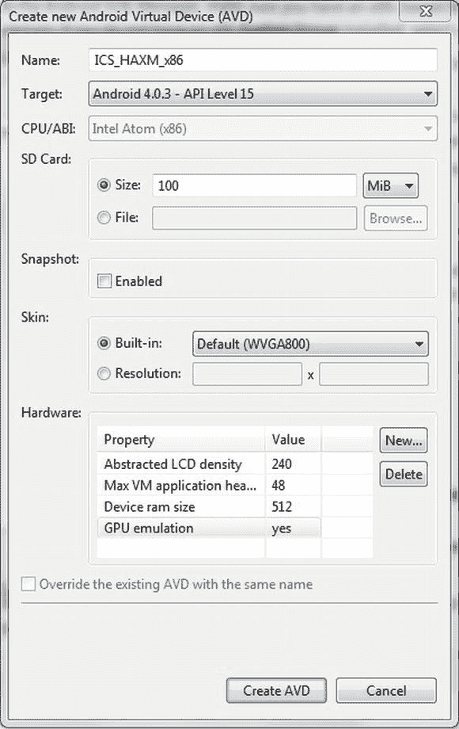

# 二、Android SDK 的第一步

Android SDK 提供了一套工具，使您能够在短时间内创建应用。本章将指导你使用 SDK 工具构建一个简单的 Android 应用。这包括以下步骤:

1.  设置开发环境。
2.  在 Eclipse 中创建新项目并编写代码。
3.  在模拟器或设备上运行应用。
4.  调试和分析应用。

我们将通过研究有用的第三方工具来结束本章。让我们从设置开发环境开始。

设置开发环境

Android SDK 非常灵活，可以很好地与多种开发环境集成。纯粹主义者可能会选择使用命令行工具。不过，我们希望事情变得更舒适一点，所以我们将使用 IDE(集成开发环境)走更简单、更可视化的路线。

以下是您需要按照给定顺序下载并安装的软件列表:

1.  Java 开发工具包(JDK) ，版本 5 或 6。我们建议用 6。在撰写本文时，JDK 7 在 Android 开发方面存在问题。必须指示编译器为 Java 6 编译。
2.  Android 软件开发工具包(Android SDK)。
3.  Eclipse for Java Developers，3.4 版或更新版本。
4.  Eclipse 的 Android 开发工具(ADT)插件。

让我们来看一下正确设置所需的步骤。

**注意**由于网络是一个移动的目标，我们在这里不提供具体的下载网址。启动你最喜欢的搜索引擎，找到合适的地方找到上面列出的物品。

设置 JDK

下载适用于您的操作系统的指定版本之一的 JDK。在大多数系统中，JDK 都包含在一个安装程序或包中，所以不应该有任何障碍。一旦安装了 JDK，您应该添加一个名为 JDK_HOME 的新环境变量，指向 JDK 安装的根目录。此外，您应该将＄JDK _ HOME/bin(% Windows 上的 JDK_HOME%\bin)目录添加到 PATH 环境变量中。

设置 Android SDK

Android SDK 也适用于三种主流桌面操作系统。为您的平台选择版本并下载。SDK 以 ZIP 或 tar gzip 文件的形式出现。解压到一个方便的文件夹就行了(比如 Windows 上的 c:\android-sdk 或者 Linux 上的/opt/android-sdk)。SDK 附带了几个命令行工具，位于 tools/文件夹中。创建一个名为 ANDROID_HOME 的环境变量，指向 SDK 安装的根目录，并将$ ANDROID _ HOME/tools(% ANDROID _ HOME % \ tools，在 Windows 上)添加到 PATH 环境变量中。这样，如果需要的话，您可以很容易地从 shell 中调用命令行工具。

**注意**对于 Windows，你也可以下载一个合适的安装程序，它会为你设置好一切。

在执行了前面的步骤之后，您将拥有一个由创建、编译和部署 Android 项目所需的基本命令行工具、SDK 管理器(一个用于安装 SDK 组件的工具)和 AVD 管理器(负责创建仿真器使用的虚拟设备)组成的基本安装。仅仅这些工具不足以开始开发，所以您需要安装额外的组件。这就是 SDK 管理器的用武之地。管理器是一个包管理器，很像 Linux 上的包管理工具。管理器允许您安装以下类型的组件:

*   Android 平台:对于每一个正式的 Android 版本，都有一个 SDK 平台组件，包括运行时库、仿真器使用的系统映像和任何特定于版本的工具。
*   *SDK 附加组件*:附加组件通常是不特定于平台的外部库和工具。一些例子是允许你在应用中集成谷歌地图的谷歌 API。
*   *Windows 的 USB 驱动程序*:这个驱动程序是在 Windows 的物理设备上运行和调试应用所必需的。在 Mac OS X 和 Linux 上，你不需要特殊的驱动程序。
*   *样本*:对于每个平台，也有一组特定于平台的样本。这些是了解如何使用 Android 运行时库实现特定目标的很好的资源。
*   *文档*:这是最新 Android 框架 API 文档的本地副本。

作为贪婪的开发人员，我们希望安装所有这些组件，以便拥有所有这些功能。因此，首先我们必须启动 SDK 管理器。在 Windows 上，SDK 的根目录下有一个名为 SDK manager.exe 的可执行文件。在 Linux 和 Mac OS X 上，您只需在 SDK 的工具目录中启动脚本 android。

在第一次启动时，SDK 管理器将连接到包服务器并获取可用包的列表。然后，管理器将向您显示如图 2-1 所示的对话框，允许您安装单独的软件包。只需单击选择旁边的新链接，然后单击安装按钮。您将看到一个对话框，要求您确认安装。选中全部接受复选框，然后再次单击安装按钮。接下来，给自己泡杯好茶或咖啡。管理器需要一段时间来安装所有的软件包。安装程序可能会要求您提供某些软件包的登录凭据。您可以安全地忽略这些，只需点击取消。


图 2-1。第一次与 SDK 经理联系

您可以随时使用 SDK 管理器来更新组件或安装新组件。一旦安装过程完成，您就可以进入设置开发环境的下一步。

安装 Eclipse

Eclipse 有几种不同的风格。对于 Android 开发者，我们建议使用 Eclipse for Java Developers 版本 3.7.2，代码名为“Indigo”。与 Android SDK 类似，Eclipse 以 ZIP 或 tar gzip 包的形式出现。只需将其提取到您选择的文件夹中。一旦包被解压缩，您就可以在桌面上创建一个快捷方式，指向 eclipse 安装根目录下的 Eclipse 可执行文件。

第一次启动 Eclipse 时，会提示您指定一个工作区目录。图 2-2 显示了该对话框。


图 2-2。选择工作空间

工作区是 Eclipse 对包含一组项目的文件夹的概念。您是为所有项目使用单个工作区，还是将几个项目组合在一起的多个工作区，完全由您决定。本书附带的示例项目都组织在一个单独的工作空间中，您可以在该对话框中指定该工作空间。现在，我们将简单地在某个地方创建一个空的工作区。

然后 Eclipse 会用一个欢迎屏幕来欢迎您，您可以安全地忽略并关闭它。这将为您留下默认的 Eclipse Java 透视图。在后面的小节中，您将对 Eclipse 有一点了解。目前，让它运行就足够了。

安装 ADT Eclipse 插件

我们的设置难题的最后一部分是安装 ADT Eclipse 插件。Eclipse 基于一个插件架构，用于通过第三方插件来扩展其功能。ADT 插件 将 Android SDK 中的工具与 Eclipse 的强大功能结合在一起。有了这个组合，我们可以完全忘记调用所有的命令行 Android SDK 工具；ADT 插件将它们透明地集成到我们的 Eclipse 工作流中。

为 Eclipse 安装插件可以手动完成，通过将插件 ZIP 文件的内容放入 Eclipse 的 plug-ins 文件夹，或者通过与 Eclipse 集成的 Eclipse 插件管理器。这里我们将选择第二条路线:

1.  Go to Help  Install New Software, which opens the installation dialog. In this dialog, you can choose the source from which to install a plug-in. First, you have to add the plug-in repository from the ADT plug-in that is fetched. Click the Add button. You will be presented with the dialog shown in Figure 2-3.

    

    图 2-3。添加存储库

2.  在第一个文本字段中，输入存储库的名称；类似“ADT 存储库”的东西就可以了。第二个文本字段指定存储库的 URL。对于 ADT 插件，该字段应为`https://dl-ssl.google.com/android/eclipse/`。请注意，对于较新的版本，此 URL 可能会有所不同，因此请查看 ADT 插件网站以获取最新链接。
3.  单击 OK，您将返回到安装对话框，现在应该会获取存储库中可用插件的列表。选中开发工具复选框，然后单击下一步按钮。
4.  Eclipse 会计算所有必要的依赖项，然后向您呈现一个新的对话框，其中列出了将要安装的所有插件和依赖项。单击“下一步”按钮进行确认。
5.  Another dialog pops up prompting you to accept the license for each plug-in to be installed. You should, of course, accept those licenses and then initiate the installation by clicking the Finish button.

    **注意**在安装过程中，会要求您确认未签名软件的安装。别担心，插件只是没有经过验证的签名。同意安装以继续该过程。

6.  Eclipse 会询问您是否应该重启以应用更改。您可以选择完全重启或不重启就应用更改。为了安全起见，选择 Restart Now，这将按预期重启 Eclipse。

Eclipse 重启后，您将看到和以前一样的 Eclipse 窗口。工具栏提供了几个 Android 特有的新按钮，允许您直接从 Eclipse 中启动 SDK 和 AVD 管理器，并创建新的 Android 项目。图 2-4 显示了新的工具栏按钮。


图 2-4。 ADT 工具栏按钮

左侧的前两个按钮允许您分别打开 SDK 管理器和 AVD 管理器。看起来像复选框的按钮让你运行 Android lint，它检查你的项目是否有潜在的 bug。下一个按钮是新的 Android 应用项目按钮，这是创建新的 Android 项目的快捷方式。最右边的两个按钮分别使您能够创建一个新的单元测试项目或 Android 清单文件(我们不会在本书中使用该功能)。

作为完成 ADT 插件安装的最后一步，您必须告诉插件 Android SDK 的位置:

1.  打开窗口偏好设置，并在出现的对话框的树形视图中选择 Android。
2.  在右侧，单击浏览按钮选择 Android SDK 安装的根目录。
3.  单击“确定”按钮关闭对话框。现在，您将能够创建您的第一个 Android 应用。

快速游览 Eclipse

Eclipse 是一个开源的 IDE，可以用来开发用各种语言编写的应用。通常，Eclipse 与 Java 开发结合使用。鉴于 Eclipse 的插件架构，已经创建了许多扩展，因此也有可能开发纯 C/C++、Scala 或 Python 项目。可能性是无穷无尽的；例如，甚至存在编写 LaTeX 项目的插件——这与您通常的代码开发任务略有相似。

Eclipse 的一个实例使用一个包含一个或多个项目的工作区。以前，我们在启动时定义了一个工作区。您创建的所有新项目都将存储在工作区目录中，以及定义使用工作区时 Eclipse 外观的配置。

Eclipse 的用户界面(UI) 围绕着两个概念:

*   一个*视图*，一个单一的 UI 组件，比如源代码编辑器、输出控制台或者项目浏览器。
*   一个*透视图*，一组特定的视图，您很可能需要它们来完成特定的开发任务，比如编辑和浏览源代码、调试、分析、与版本控制库同步等等。

Eclipse for Java Developers 附带了几个预定义的透视图。我们最感兴趣的是 Java 和 Debug。Java 透视图如图 2-5 所示。它的特点是左边是 Package Explorer 视图，中间是 Source Code 视图(它是空的，因为我们还没有打开一个源文件)，右边是 Task List 视图，一个 Outline 视图，以及一个选项卡式视图，其中包含称为 Problems 视图、Javadoc 视图、Declaration 视图和 Console 视图的子视图。


图 2-5。 Eclipse 在行动 Java 的视角

通过拖放，您可以自由地重新安排透视图中任何视图的位置。您也可以调整视图的大小。此外，您可以在透视图中添加和删除视图。要添加视图，进入窗口显示视图，从显示的列表中选择一个或选择其他以获得所有可用视图的列表。

要切换到另一个透视图，您可以转到窗口打开透视图并选择您想要的那个。Eclipse 的左上角提供了一种在已经打开的透视图之间切换的更快方法。在那里，您将看到哪些透视图已经打开，哪些透视图是活动的。在图 2-5 中，注意 Java 透视图是打开的并且是活动的。这是目前唯一开放的视角。一旦您打开附加的透视图，它们也会显示在 UI 的那个部分。

图 2-5 中显示的 工具栏也只是视图。根据您当时所处的视角，工具栏也可能会发生变化。回想一下，安装 ADT 插件后，工具栏中出现了几个新按钮。这是插件的常见行为:一般来说，它们会添加新的视图和视角。对于 ADT 插件，除了标准的 Java Debug 透视图之外，我们现在还可以访问一个名为 DDMS 的透视图(Dalvik Debugging Monitor Server，它专用于调试和分析 Android 应用，这将在本章后面介绍)。ADT 插件还添加了几个新视图，包括 LogCat 视图，它显示来自任何连接的设备或仿真器的实时日志记录信息。

一旦您熟悉了透视图和视图概念，Eclipse 就不那么可怕了。在下面的小节中，我们将探索一些我们将用来编写 Android 游戏的视角和视图。我们不可能涵盖使用 Eclipse 开发的所有细节，因为它是如此庞大。因此，如果需要的话，我们建议您通过其广泛的帮助系统来学习更多关于 Eclipse 的知识。

有用的 Eclipse 快捷键

每个新的 IDE 都需要一些时间来学习和适应。在使用 Eclipse 多年后，我们发现以下快捷方式可以显著加快软件开发。这些快捷键使用 Windows 术语，因此 Mac OS X 用户应该在适当的地方替换命令和选项:

*   将光标放在函数或字段上时，按 Ctr + Shift + G 组合键将在工作区中搜索对该函数或字段的所有引用。例如，如果你想知道某个函数在哪里被调用，只需点击鼠标将光标移动到该函数上，然后按 Ctrl + Shift + G。
*   将光标放在调用 into 函数上的 F3 将跟随该调用，并将您带到声明和定义该函数的源代码。将此热键与 Ctrl + Shift + G 结合使用，可以轻松导航 Java 源代码。在类名或字段上做同样的事情将会打开它的声明。
*   Ctr +空格键自动完成您当前键入的函数或字段名称。输入几个字符后，开始键入并按快捷键。当有多种可能性时，会出现一个框。
*   Ctr + Z 无效。
*   Ctr + X 削减。
*   ctrl+c 副本。
*   ctrl+v 蛋糕。
*   Ctr + F11 运行应用。
*   F11 调试应用。
*   Ctr + Shift + O 组织当前源文件的 Java 导入。
*   Ctr + Shift + F 格式化当前源文件。
*   Ctr + Shift + T 跳转到任何 Java 类。
*   Ctr + Shift + R 跳转到任意资源文件；即图像、文本文件等等。
*   Alt + Shift + T 调出当前选择的重构菜单。
*   Ctrl + O 让您跳转到当前打开的 Java 类中的任何方法或字段。

Eclipse 中有许多更有用的特性，但是掌握这些基本的键盘快捷键可以显著加快游戏开发，让 Eclipse 中的生活稍微好一点。Eclipse 也是非常可配置的。这些键盘快捷键中的任何一个都可以在偏好设置中重新分配给不同的键。

在 Eclipse 中创建新项目并编写代码

有了我们的开发设置，我们现在可以在 Eclipse 中创建我们的第一个 Android 项目。ADT 插件安装了几个向导，使得创建新的 Android 项目变得非常容易。

创建项目

创建新的 Android 项目有两种方法。第一种是在包资源管理器视图中右键单击(见图 2-5 ，然后从弹出菜单中选择新建项目。在新建对话框中，选择 Android 类别下的 Android 项目。如您所见，在该对话框中有许多其他项目创建选项。这是在 Eclipse 中创建任何类型的新项目的标准方法。在对话框中单击确定后，Android 项目向导将打开。

第二种方法要简单得多:只需点击新的 Android 应用项目工具栏按钮(如前面的图 2-4 所示)，这也会打开向导。

一旦你进入 Android 项目向导对话框，你必须做出一些决定。请遵循以下步骤:

1.  定义应用名称。这是 Android 上的启动器中显示的名称。我们会用“你好世界”
2.  指定项目名称。这是您的项目在 Eclipse 中将被引用的名称。习惯上使用全部小写字母，所以我们将输入“helloworld”
3.  指定包名。这是您所有 Java 代码所在的包的名称。向导试图根据您的项目名来猜测您的包名，但是您可以根据自己的需要随意修改它。在本例中，我们将使用“com.helloworld”。
4.  指定生成 SDK。选择安卓 4.1。这允许我们使用最新的 API。
5.  Specify the minimum required SDK. This is the lowest Android version your application will support. We’ll choose Android 1.5 (Cupcake, API level 3).

    **注意**在第一章中，你看到 Android 的每个新版本都向 Android 框架 API 添加了新的类。构建 SDK 指定了您希望在应用中使用这个 API 的哪个版本。例如，如果您选择 Android 4.1 build SDK，您将获得最新、最棒的 API 特性。但是，这也有风险:如果您的应用运行在使用较低 API 版本的设备上(比如说，运行 Android 版本的设备)，那么如果您访问仅在 4.1 版本中可用的 API 特性，您的应用就会崩溃。在这种情况下，您需要在运行时检测支持的 SDK 版本，并在您确定设备上的 Android 版本支持该版本时，仅访问 4.1 特性。这听起来可能很糟糕，但是正如你将在第五章中看到的，给定一个好的应用架构，你可以很容易地启用和禁用某些特定于版本的功能，而没有崩溃的风险。

6.  单击下一步。您将看到一个对话框，让您定义您的应用的图标。我们将保持一切不变，因此只需单击“下一步”。
7.  在下一个对话框中，询问您是否想要创建一个空白活动。接受此选择，然后单击“下一步”继续。
8.  在最后一个对话框中，您可以修改向导将为您创建的空白活动的一些属性。我们将活动名称设置为“HelloWorldActivity”，标题设置为“Hello World”单击“完成”将创建您的第一个 Android 项目。

**注意**设置所需的最低 SDK 版本有一些含义。该应用只能在 Android 版本等于或高于您指定的最低 SDK 版本的设备上运行。当用户通过 Google Play 应用浏览 Google Play 时，只会显示具有适当最低 SDK 版本的应用。

探索项目

在包浏览器中，您现在应该看到一个名为“helloworld”的项目如果你展开它和它的所有子节点，你会看到类似于图 2-6 的东西。这是大多数 Android 项目的一般结构。让我们稍微探索一下。

*   src/包含了你所有的 Java 源文件。请注意，这个包与您在 Android 项目向导中指定的包同名。
*   gen/包含 Android 构建系统生成的 Java 源文件。您不应该修改它们，因为它们会自动重新生成。
*   Android 4.1 告诉我们，我们正在以 Android 4.1 版本为目标进行构建。这实际上是一个标准 JAR 文件形式的依赖项，它保存了 Android 4.1 API 的类。
*   Android Dependencies 向我们展示了我们的应用链接到的任何支持库，同样是以 JAR 文件的形式。作为游戏开发者，我们不关心这些。
*   assets/是存储应用所需文件的地方(例如配置文件、音频文件等)。这些文件与您的 Android 应用打包在一起。
*   bin/保存已编译的代码，准备部署到设备或仿真器。与 gen/文件夹一样，我们通常不关心这个文件夹中发生了什么。
*   libs/保存我们希望应用依赖的任何额外的 JAR 文件。如果我们的应用使用 C/C++ 代码，它还包含本机共享库。我们将在第十三章中探讨这个问题。
*   RES/hold 应用需要的资源，例如图标、国际化字符串和通过 XML 定义的 UI 布局。像素材一样，资源也与应用打包在一起。
*   AndroidManifest.xml 描述了您的应用。它定义了应用包含哪些活动和服务，应用运行的最低和目标 Android 版本(假设)，以及它需要哪些权限(例如，访问 SD 卡或网络)。
*   project.properties 和 proguard-project.txt 保存构建系统的各种设置。我们不会触及这一点，因为 ADT 插件会在必要时负责修改这些文件。


图 2-6。 Hello World 项目结构

我们可以很容易地在 Package Explorer 视图中添加新的源文件、文件夹和其他资源，方法是右键单击我们想要放置新资源的文件夹，并选择 new 和我们想要创建的相应资源类型。但是现在，我们会让一切保持原样。接下来，让我们看看如何修改我们的基本应用设置和配置，以便它能够兼容尽可能多的 Android 版本和设备。

使应用兼容所有 Android 版本

之前我们创建了一个项目，指定 Android 1.5 作为我们的最低 SDK。遗憾的是，ADT 插件有一个小错误，它忘记为 Android 1.5 上的应用创建包含图标图像的文件夹。下面是我们解决这个问题的方法:

1.  在 res/目录下创建一个名为 drawable/的文件夹。您可以在 Package Explorer 视图中直接这样做，方法是右键单击 res/目录，并从上下文菜单中选择 New  Folder。
2.  将 ic_launcher.png 文件从 res/drawable-mdpi/文件夹复制到新的 assets/drawable/文件夹。Android 1.5 需要这个文件夹，而更高版本会根据屏幕大小和分辨率在其他文件夹中查找图标和其他应用资源。我们将在第四章中讨论这个问题。

有了这些改变，你的应用可以在目前所有的 Android 版本上运行！

编写应用代码

我们还没有写一行代码，所以让我们改变一下。Android 项目向导为我们创建了一个名为 HelloWorldActivity 的模板活动类，当我们在模拟器或设备上运行应用时，它将会显示出来。在 Package Explorer 视图中双击文件，打开类的源代码。我们将用清单 2-1 中的代码替换模板代码。

**清单 2-1。**HelloWorldActivity.java

```java
package com.helloworld;

import android.app.Activity;
import android.os.Bundle;
import android.view.View;
import android.widget.Button;

public class HelloWorldActivity extends Activity
                                implements View.OnClickListener {
    Button button;
    int touchCount;
    @Override
    public void onCreate(Bundle savedInstanceState) {
        super .onCreate(savedInstanceState);
        button = new Button( this );
        button.setText( "Touch me!" );
        button.setOnClickListener( this );
        setContentView(button);
    }

    public void onClick(View v) {
        touchCount++;
        button.setText("Touched me " + touchCount + " time(s)");
    }
}
```

让我们剖析一下清单 2-1 ，这样你就能理解它在做什么。我们将把本质细节留给后面的章节。我们只想知道发生了什么。

源代码文件从标准的 Java 包声明和几个导入开始。大多数 android 框架类都位于 Android 包中。

```java
package com.helloworld;

import android.app.Activity;
import android.os.Bundle;
import android.view.View;
import android.widget.Button;
```

接下来，我们定义我们的 HelloWorldActivity，并让它扩展基类 Activity，这是由 Android 框架 API 提供的。活动很像传统桌面用户界面中的一个窗口，限制是活动总是充满整个屏幕(除了 Android 用户界面顶部的通知栏)。此外，我们让活动实现 OnClickListener 接口。如果您有使用其他 UI 工具包的经验，您可能会看到接下来会发生什么。一会儿会有更多的内容。

```java
public class HelloWorldActivity extends Activity
                                implements View.OnClickListener {
```

我们让我们的活动有两个成员:一个按钮和一个计算按钮被触摸频率的 int。

```java
    Button button;
    int touchCount;
```

每个 Activity 子类都必须实现抽象方法 Activity.onCreate()，当 Activity 第一次启动时，Android 系统会调用它一次。这取代了通常用来创建类实例的构造函数。必须调用基类 onCreate()方法作为方法体中的第一条语句。

```java
    @Override
    public void onCreate(Bundle savedInstanceState) {
           super .onCreate(savedInstanceState);
```

接下来，我们创建一个按钮并设置它的初始文本。按钮是 Android 框架 API 提供的众多小部件之一。UI 小部件在 Android 上被称为视图。注意，button 是我们的 HelloWorldActivity 类的成员。我们以后需要参考它。

```java
        button = new Button( this );
        button.setText( "Touch me!" );
```

onCreate()中的下一行设置按钮的 OnClickListener。OnClickListener 是一个回调接口，只有一个方法 OnClickListener.onClick()，单击按钮时会调用该方法。我们希望在点击时得到通知，所以我们让 HelloWorldActivity 实现该接口，并将其注册为按钮的 OnClickListener。

```java
        button.setOnClickListener( this );
```

onCreate()方法中的最后一行将按钮设置为活动的内容视图。视图可以嵌套，活动的内容视图是这个层次结构的根。在我们的例子中，我们简单地将按钮设置为由活动显示的视图。为了简单起见，我们不会详细讨论在给定内容视图的情况下如何安排活动。

```java
        setContentView(button);
    }
```

下一步只是实现 OnClickListener.onClick()方法，接口要求我们的活动使用该方法。每次单击按钮时都会调用此方法。在这个方法中，我们增加了 touchCount 计数器，并将按钮的文本设置为一个新的字符串。

```java
    public void onClick(View v) {
        touchCount++;
        button.setText("Touched me" + touchCount + "times");
    }
```

因此，为了总结我们的 Hello World 应用，我们构造了一个带有按钮的活动。每次点击按钮时，我们相应地设置它的文本。这可能不是这个星球上最令人兴奋的应用，但它将用于进一步的演示目的。

注意，我们从来不需要手动编译任何东西。每当我们添加、修改或删除一个源文件或资源时，ADT 插件和 Eclipse 都会重新编译项目。这个编译过程的结果是一个 APK 文件，可以部署到仿真器或 Android 设备上。APK 文件位于项目的 bin/文件夹中。

在接下来的小节中，您将使用这个应用来学习如何在模拟器实例和设备上运行和调试 Android 应用。

在设备或仿真器上运行应用

一旦我们编写了应用代码的第一个迭代，我们希望运行并测试它来识别潜在的问题，或者只是对它的辉煌感到惊讶。我们有两种方法可以实现这一点:

*   我们可以在通过 USB 连接到开发 PC 的真实设备上运行我们的应用。
*   我们可以启动 SDK 中包含的模拟器，并在那里测试我们的应用。

在这两种情况下，我们都必须做一些设置工作，然后才能最终看到我们的应用在运行。

连接设备

在连接设备进行测试之前，我们必须确保操作系统能够识别它。在 Windows 上，这涉及到安装适当的驱动程序，这是我们之前安装的 SDK 的一部分。只需连接您的设备并遵循 Windows 的标准驱动程序安装项目，将过程指向 SDK 安装根目录中的驱动程序/文件夹。对于某些设备，您可能需要从制造商的网站上获取驱动程序。许多设备可以使用 SDK 附带的 Android ADB 驱动程序；但是，通常需要一个过程来将特定的设备硬件 ID 添加到 INF 文件中。在谷歌上快速搜索设备名称和“Windows ADB ”,通常会获得与该特定设备连接所需的信息。

在 Linux 和 Mac OS X 上，你通常不需要安装任何驱动程序，因为它们是操作系统自带的。根据您的 Linux 风格，您可能需要稍微调整一下您的 USB 设备发现，通常是为 udev 创建一个新的规则文件。这因设备而异。快速的网络搜索应该会为你的设备带来一个解决方案。

创建 Android 虚拟设备

SDK 附带了一个模拟器，可以运行 Android 虚拟设备(avd)。一个 *Android 虚拟设备*由一个特定 Android 版本的系统映像、一个皮肤和一组属性组成，包括屏幕分辨率、SD 卡大小等等。

要创建一个 AVD，你必须启动 Android 虚拟设备管理器。您可以按照之前在 SDK 安装步骤中描述的方式来完成这项工作，也可以通过单击工具栏中的 AVD Manager 按钮直接在 Eclipse 中完成这项工作。你可以使用现有的 avd。相反，让我们来看一下创建自定义 AVD 的步骤:

1.  Click the New button on the right side of the AVD Manager screen, which opens the Edit Android Virtual Device (AVD) dialog, shown in Figure 2-7.

    

    图 2-7。编辑 Android 虚拟设备(AVD)对话框

2.  每个 AVD 都有一个名称，您可以通过它来引用它。你可以自由选择任何你想要的名字。
3.  目标指定 AVD 应该使用的 Android 版本。对于我们简单的“hello world”项目，您可以选择一个 Android 4.0.3 目标。
4.  CPU/ABI 指定 AVD 应该模拟哪种 CPU 类型。在此选择手臂。
5.  您可以通过皮肤设置中的选项指定 AVDsd 卡的大小以及屏幕大小。让这些字段保持原样。对于实际测试，您通常会希望创建多个 avd，覆盖您希望应用处理的所有 Android 版本和屏幕尺寸。
6.  启用快照选项将在您关闭时保存模拟器的状态。下次启动时，模拟器将加载保存状态的快照，而不是引导。这可以在启动新的模拟器实例时节省一些时间。
7.  硬件选项更先进。我们将在下一节中探究其中的一些。它们允许您修改仿真器设备和仿真器本身的低级属性，例如仿真器的图形输出是否应该进行硬件加速。

**注意**除非你有几十个不同 Android 版本和屏幕尺寸的不同设备，否则你应该使用仿真器对 Android 版本/屏幕尺寸组合进行额外测试。

安装高级仿真器功能

现在有一些硬件虚拟化实现支持 Android 模拟器，英特尔是其中之一。如果您有英特尔 CPU，您应该能够安装英特尔硬件加速执行管理器(HAXM) ，它与 x86 仿真器映像结合使用，将虚拟化您的 CPU，并且运行速度明显快于普通的完全仿真映像。与此同时，启用 GPU 加速将(理论上)提供一个合理的性能测试环境。我们对这些工具当前状态的经验是，它们仍然有一点缺陷，但事情看起来很有希望，所以请确保关注 Google 的官方声明。同时，让我们做好准备:

1.  从英特尔下载并安装 HAXM 软件，可在`http://software.intel.com/en-us/articles/intel-hardware-accelerated-execution-manager/`获得。
2.  Once installed, you will need to make sure you have installed the specific AVD called Intel x86 Atom System Image. Open the SDK Manager, navigate to the Android 4.0.3 section, and check if the image is installed (see Figure 2-8). If it is not installed, check the entry, then click “Install packages . . .”

    

    图 2-8。为 ICS 选择 x86 Atom 系统映像

3.  Create a specific AVD for the x86 image. Follow the steps to create a new AVD described in the last section, but this time make sure to select the Intel Atom (x86) CPU. In the Hardware section, add a new property called **GPU emulation** and set its value to **yes**, as shown in Figure 2-9.

    

    图 2-9。创建启用 GPU 仿真的 x86 AVD

现在您已经准备好了新的模拟器映像，我们需要让您了解一些注意事项。在测试时，我们得到了一些混合的结果。图 2-10 中的图像来自一款 2D 游戏，该游戏使用 OpenGL 1.1 多重纹理在角色上获得微妙的灯光效果。如果你仔细观察这幅图像，你会发现敌人的脸是横着的，上下颠倒。正确的渲染总是让它们正面朝上，所以这肯定是个错误。另一个更复杂的游戏崩溃了，无法运行。这并不是说硬件加速的 AVD 没有用，因为对于更基本的渲染来说，它可能工作得很好，如果你注意到右下角的数字 61，那基本上意味着它每秒运行 60 帧(FPS)——这是这台测试 PC 上 Android 模拟器上 GL 的新纪录！


图 2-10。快速 OpenGL ES 1.1 仿真，但有一些渲染错误

图 2-11 中的图像显示了运行 OpenGL ES 2.0 的演示的主屏幕。虽然演示渲染正确，但帧速率开始一般，最后相当糟糕。这个菜单中并没有渲染太多东西，已经降低到 45FPS 了。主要的演示游戏运行速度为 15 到 30FPS，而且非常简单。很高兴看到 ES 2.0 运行，但显然还有一些改进的空间。


图 2-11。 OpenGL ES 2.0 工作正常，但帧速率较低

尽管我们在本节中概述了这些问题，但新的模拟器加速是 Android SDK 的一个受欢迎的补充，如果您选择不在设备上专门测试，我们建议您在游戏中试用它。有很多情况下它会工作得很好，你可能会发现你有更快的周转时间测试，这就是它的全部。

运行应用

现在您已经设置了您的设备和 avd，您终于可以运行 Hello World 应用了。在 Eclipse 中，您可以通过在 Package Explorer 视图中右键单击“hello world”项目，然后选择 Run As  Android Application(或者您可以单击工具栏上的 Run 按钮)来轻松实现这一点。然后，Eclipse 将在后台执行以下步骤:

1.  如果自上次编译以来有任何文件发生了更改，则将项目编译为 APK 文件。
2.  为 Android 项目创建一个新的运行配置(如果尚不存在的话)。(我们稍后将了解运行配置。)
3.  通过使用合适的 Android 版本启动或重用已经运行的仿真器实例，或者通过在连接的设备上部署和运行应用来安装和运行应用(该设备还必须至少运行您在创建项目时指定为最低必需 SDK 级别的最低 Android 版本)。

**注意**第一次在 Eclipse 中运行 Android 应用时，会询问您是否希望 ADT 对设备/仿真器输出中的消息做出反应。因为您总是需要所有的信息，所以只需单击 OK。

如果您没有连接设备，ADT 插件将启动您在 AVD 管理器窗口中看到的一个 AVD。输出应该看起来像图 2-12 。


图 2-12。Hello World 应用正在运行

模拟器的工作方式几乎与真实设备完全一样，您可以通过鼠标与它进行交互，就像用手指在设备上操作一样。以下是真实设备和模拟器之间的一些差异:

*   模拟器仅支持单点触摸输入。简单地使用你的鼠标光标，假装它是你的手指。
*   模拟器缺少一些应用，例如 Google Play 应用。
*   要更改设备在屏幕上的方向，请不要倾斜显示器。相反，使用数字键盘上的 7 键来更改方向。您必须先按下数字键盘上方的 Num Lock 键来禁用其数字功能。
*   模拟器非常慢。不要通过在模拟器上运行来评估应用的性能。
*   4.0.3 之前的模拟器版本仅支持 OpenGL ES 1.x. OpenGL ES 2.0 及更高版本的模拟器支持 OpenGL ES 2.0。我们将在第七章中讨论 OpenGL ES。模拟器将很好地为我们的基本测试工作。一旦我们深入到 OpenGL，你会想要得到一个真实的设备来测试，因为即使我们使用了最新的模拟器，OpenGL 实现(虚拟化和软件化)仍然有一点缺陷。现在，请记住不要在模拟器上测试任何 OpenGL ES 应用。

玩一会儿，感觉舒服点。

**注意**启动一个新的仿真器实例需要相当长的时间(根据您的硬件，最长可达 10 分钟)。您可以让模拟器在整个开发会话期间一直运行，这样您就不必重复重新启动它，或者您可以在创建或编辑 AVD 时检查 Snapshot 选项，这将允许您保存和恢复虚拟机(VM)的快照，从而实现快速启动。

有时，当我们运行 Android 应用时，ADT 插件执行的自动仿真器/设备选择是一个障碍。例如，我们可能连接了多个设备/仿真器，我们希望在一个特定的设备/仿真器上测试我们的应用。为了解决这个问题，我们可以在 Android 项目的运行配置中关闭自动设备/仿真器选择。那么，什么是运行配置呢？

当您告诉 Eclipse 运行应用时，运行配置提供了一种方式来告诉 Eclipse 应该如何启动您的应用。运行配置通常允许您指定传递给应用的命令行参数、VM 参数(在 Java SE 桌面应用的情况下)等等。Eclipse 和第三方插件为特定类型的项目提供了不同的运行配置。ADT 插件将 Android 应用运行配置添加到可用运行配置集中。当我们在本章前面第一次运行我们的应用时，Eclipse 和 ADT 在后台用默认参数为我们创建了一个新的 Android 应用运行配置。

要获得 Android 项目的运行配置，请执行以下操作:

1.  在 Package Explorer 视图中右键单击项目，并选择 Run AsRun configuration。
2.  从左侧的列表中，选择“hello world”项目。
3.  在对话框的右侧，您现在可以修改运行配置的名称，并更改 Android、Target 和 Commons 选项卡上的其他设置。
4.  要将自动部署更改为手动部署，请单击目标选项卡并选择手动。

当您再次运行应用时，系统会提示您选择一个兼容的仿真器或设备来运行应用。图 2-13 显示了该对话框。


图 2-13。选择运行应用的仿真器/设备

该对话框显示所有正在运行的仿真器和当前连接的设备，以及所有其他当前未运行的 avd。您可以选择任何模拟器或设备来运行您的应用。注意连接设备旁边的红色 **×** 。这通常表明应用不能在这个设备上运行，因为它的版本低于我们指定的目标 SDK 版本(在本例中是 14 对 15)。然而，因为我们指定了最低 SDK 版本 3 (Android 1.5)，所以我们的应用实际上也可以在这个设备上工作。

调试和分析应用

有时，您的应用会以意想不到的方式运行或崩溃。为了找出到底哪里出错了，您希望能够调试您的应用。

Eclipse 和 ADT 为我们提供了极其强大的 Android 应用调试工具。我们可以在源代码中设置断点，检查变量和当前堆栈跟踪，等等。

通常，在调试之前设置断点，以检查程序中某些点的程序状态。要设置断点，只需在 Eclipse 中打开源文件，双击要设置断点的行前面的灰色区域。出于演示目的，对 HelloWorldActivity 类中的第 23 行执行此操作。这将使调试器在您每次单击该按钮时停止。双击该行后，源代码视图会在该行前显示一个小圆圈，如图 2-14 所示。您可以通过在源代码视图中再次双击断点来移除断点。


图 2-14。设置断点

如前一节所述，开始调试非常类似于运行应用。在 Package Explorer 视图中右键单击项目，并选择 Debug As  Android Application。这将为您的项目创建一个新的调试配置，就像简单地运行应用一样。您可以通过从上下文菜单中选择 Debug As  Debug Configurations 来更改该调试配置的默认设置。

**注意**您可以使用 Run 菜单来运行和调试应用并访问配置，而不是在 Package Explorer 视图中浏览项目的上下文菜单。

如果您开始第一个调试会话，并且命中了一个断点(例如，您在我们的应用中点击按钮)，Eclipse 会询问您是否想要切换到调试透视图，您可以确认这一点。先来看看那个视角。图 2-15 显示了我们开始调试 Hello World 应用后的样子。


图 2-15。调试视角

如果您还记得我们对 Eclipse 的快速浏览，那么您会知道有几个不同的透视图，它们由一组特定任务的视图组成。调试透视图与 Java 透视图看起来非常不同。

*   左上角的 Debug 视图显示了所有当前正在运行的应用，以及它们所有线程的堆栈跟踪(如果应用在调试模式下运行并被挂起)。
*   调试视图下面是源代码视图，它也出现在 Java 透视图中。
*   控制台视图也出现在 Java 透视图中，它打印出来自 ADT 插件的消息，告诉我们它正在做什么。
*   任务列表视图(控制台视图旁边带有标签“Tasks”的选项卡与 Java 透视图中的相同。我们通常不需要它，你可以关闭它。
*   LogCat view 将是您旅途中最好的朋友之一。这个视图显示了运行应用的仿真器/设备的日志输出。日志输出来自系统组件、其他应用和您自己的应用。LogCat 视图将在应用崩溃时向您显示堆栈跟踪，并允许您在运行时输出自己的日志消息。在下一节中，我们将进一步了解 LogCat。
*   Outline 视图也出现在 Java 透视图中，但在 Debug 透视图中不是很有用。您通常会关心断点和变量，以及在调试时程序被挂起的当前行。我们经常从 Debug 透视图中删除 Outline 视图，以便为其他视图留出更多空间。
*   Variables 视图对于调试特别有用。当调试器遇到断点时，您将能够在程序的当前范围内检查和修改变量。
*   断点视图显示了到目前为止您已经设置的断点列表。

如果您很好奇，您可能已经在运行的应用中单击了按钮，以查看调试器的反应。它将在第 23 行停止，正如我们在那里设置断点所指示的那样。您还会注意到，Variables 视图现在显示了当前范围内的变量，包括活动本身(this)和方法的参数(v)。您可以通过展开这些变量来进一步深入研究它们。

Debug 视图向您显示当前堆栈的堆栈跟踪，一直到您当前所在的方法。请注意，您可能有多个线程正在运行，并且可以在 Debug 视图中随时暂停它们。

最后，请注意，我们设置断点的那一行被突出显示，表明程序当前在代码中暂停的位置。

您可以指示调试器执行当前语句(通过按 F6)，单步执行当前方法中调用的任何方法(通过按 F5)，或者继续正常执行程序(通过按 F8)。或者，您可以使用“运行”菜单上的项目来实现同样的目的。此外，请注意，除了我们刚刚提到的那些，还有更多步进选项。和所有事情一样，我们建议你尝试一下，看看什么对你有用，什么没用。

**注意**好奇心是成功开发 Android 游戏的基石。您必须熟悉您的开发环境，才能充分利用它。这种范围的书不可能解释 Eclipse 的所有本质细节，所以我们敦促您进行实验。

洛卡特和 DDMS

ADT Eclipse 插件安装了许多将在 Eclipse 中使用的新视图和透视图。最有用的视图之一是 LogCat 视图，我们在上一节中简要地提到了它。

LogCat 是 Android 事件记录系统，它允许系统组件和应用输出关于各种记录级别的记录信息。每个日志条目都由时间戳、日志记录级别、日志来自的进程 ID、由日志记录应用本身定义的标记以及实际的日志记录消息组成。

LogCat 视图从连接的仿真器或设备收集并显示这些信息。图 2-16 显示了 LogCat 视图的一些示例输出。


图 2-16。log cat 视图

请注意，在 LogCat 视图的左上角和右上角有许多按钮:

*   加号和减号按钮允许您添加和删除过滤器。已经有一个过滤器只显示来自我们应用的日志消息。
*   减号按钮右侧的按钮允许您编辑现有的过滤器。
*   下拉列表框允许您选择消息必须在下面的窗口中显示的日志级别。
*   下拉列表框右侧的按钮允许您(按从左到右的顺序)保存当前日志输出、清除日志控制台、切换左侧过滤器窗口的可见性以及停止更新控制台窗口。

如果当前连接了几个设备和模拟器，那么 LogCat 视图将只输出其中一个的日志数据。为了获得更细粒度的控制和更多的检查选项，您可以切换到 DDMS 透视图。

DDMS (Dalvik 调试监控服务器)提供了大量关于所有连接设备上运行的进程和 Dalvik 虚拟机的深入信息。您可以随时通过窗口打开视角其他 DDMS 切换到 DDMS 视角。图 2-17 显示了 DDMS 视角通常的样子。


图 2-17。 DDMS 在行动

和往常一样，几种特定的观点适合我们手头的任务。在这种情况下，我们希望收集关于所有进程、它们的虚拟机和线程、堆的当前状态、关于特定连接设备的 LogCat 信息等信息。

*   Devices 视图显示所有当前连接的仿真器和设备，以及在其上运行的所有进程。通过该视图的工具栏按钮,您可以执行各种操作，包括调试选定的进程、记录堆和线程信息以及截图。
*   LogCat 视图与 Debug 透视图中的相同，不同之处在于它将显示 Devices 视图中当前所选设备的输出。
*   模拟器控件视图允许您改变正在运行的模拟器实例的行为。例如，您可以强制模拟器伪造 GPS 坐标进行测试。

*   图 2-17 中的所示的线程视图显示了在设备视图中当前选择的进程上运行的线程的信息。仅当您还启用了线程跟踪时，线程视图才会显示此信息，这可以通过单击设备视图中左起第五个按钮来实现。
*   堆视图提供了设备上堆的状态信息。与线程信息一样，您必须通过单击左边第二个按钮，在 Devices 视图中显式启用堆跟踪。
*   分配跟踪器视图显示了哪些类在最近几分钟内被分配得最多。这个视图提供了一个寻找内存泄漏的好方法。
*   网络状态视图允许您跟踪通过连接的 Android 设备或模拟器的网络连接发送的传入和传出字节数。
*   文件浏览器视图允许您修改连接的 Android 设备或仿真器实例上的文件。您可以像使用标准操作系统文件资源管理器一样，将文件拖放到该视图中。

DDMS 实际上是一个通过 ADT 插件与 Eclipse 集成的独立工具。你也可以从＄ANDROID _ HOME/tools 目录*(Windows 上的* %ANDROID_HOME%/tools)作为独立应用启动 DDMS。DDMS 并不直接连接设备，而是使用 Android Debug Bridge (ADB)，这是 SDK 中包含的另一个工具。让我们来看看 ADB，以完善您对 Android 开发环境的了解。

使用 ADB

ADB 允许您管理连接的设备和仿真器实例。它实际上由三部分组成:

*   运行在开发机器上的客户机，您可以通过发出 adb 命令从命令行启动它(如果您按照前面的描述设置了环境变量，它应该可以工作)。当我们谈到 ADB 时，我们指的是这个命令行程序。
*   也在您的开发机器上运行的服务器。服务器作为后台服务安装，它负责 ADB 程序实例和任何连接的设备或仿真器实例之间的通信。
*   ADB 守护进程，它也作为后台进程在每个仿真器和设备上运行。ADB 服务器连接到这个守护进程进行通信。

通常，我们通过 DDMS 透明地使用 ADB，而忽略它作为命令行工具的存在。有时，ADB 可以在小任务中派上用场，所以让我们快速浏览一下它的一些功能。

**注**查看 Android 开发者网站上的 ADB 文档，获取可用命令的完整参考列表。

使用 ADB 执行的一个非常有用的任务是查询所有连接到 ADB 服务器的设备和仿真器(以及您的开发机器)。为此，请在命令行上执行以下命令(注意>不是该命令的一部分):

```java
> adb devices
```

这将打印出所有连接的设备和仿真器的列表，以及它们各自的序列号，类似于以下输出:

```java
List of devices attached
HT97JL901589    device
HT019P803783    device
```

设备或仿真器的序列号用于指定后续命令。以下命令将在序列号为 HT019P803783 的设备上安装位于开发机器上的名为 myapp.apk 的 APK 文件:

```java
> adb –s HT019P803783 install myapp.apk
```

–s 参数可以与任何执行针对特定设备的操作的 ADB 命令一起使用。

还存在将文件复制到设备或仿真器以及从设备或仿真器复制文件的命令。以下命令将名为 myfile.txt 的本地文件复制到序列号为 HT019P803783 的设备的 SD 卡上:

```java
> adb –s HT019P803783 push myfile.txt  /sdcard/myfile.txt
```

要从 SD 卡中提取名为 myfile.txt 的文件，您可以发出以下命令:

```java
> abd pull /sdcard/myfile.txt myfile.txt
```

如果当前只有一个设备或仿真器连接到 ADB 服务器，您可以省略序列号。adb 工具将自动为您定位连接的设备或仿真器。

也可以通过网络(没有 USB)使用 ADB 调试设备。这被称为 *ADB 远程调试*，在某些设备上是可能的。要检查您的设备是否可以做到这一点，找到开发者选项，看看“ADB over network”是否在选项列表中。如果是这样，你很幸运。只需在您的设备上启用这个远程调试选项，然后运行以下命令:

```java
> adb connect ipaddress
```

连接后，设备将显示为通过 USB 连接。如果不知道 IP 地址，通常可以通过触摸当前接入点名称在 Wi-Fi 设置中找到。

当然，ADB 工具提供了更多的可能性。大多数是通过 DDMS 暴露的，我们通常使用它而不是命令行。但是，对于快速任务，命令行工具是理想的。

有用的第三方工具

Android SDK 和 ADT 可能提供了大量的功能，但是还有许多非常有用的第三方工具，下面列出了其中的一些，它们可以在以后的开发中帮助您。这些工具可以监视 CPU 的使用情况，告诉您 OpenGL 渲染的情况，帮助您找到内存或文件访问中的瓶颈，等等。您需要将设备中的芯片与芯片制造商提供的工具相匹配。以下列表包括制造商和 URL，以帮助您进行匹配。排名不分先后:

*   *Adreno Profiler* :用于高通/骁龙设备(主要是 HTC，但也有很多其他)；`https://developer.qualcomm.com/mobile-development/mobile-technologies/gaming-graphics-optimization-adreno/tools-and-resources`
*   *PVRTune/PVRTrace* :用在 PowerVR 芯片上(三星，LG，等)；`http://www.imgtec.com/powervr/insider/powervr-utilities.asp`
*   *NVidia PerfHUD ES* :用在 Tegra 芯片上(LG、三星、摩托罗拉等)；`http://developer.nvidia.com/mobile/perfhud-es`

我们不会详细讨论安装或使用这些工具的细节，但是当你准备认真对待你的游戏性能时，请务必回到这一部分并深入研究。

摘要

Android 开发环境有时可能有点吓人。幸运的是，您只需要可用选项的一个子集就可以开始了，本章末尾的“使用 ADB”一节应该已经为您提供了足够的信息来开始一些基本的编码。

从这一章中学到的最重要的一课是如何将这些部分组合在一起。JDK 和 Android SDK 为所有 Android 开发提供了基础。它们提供了在仿真器实例和设备上编译、部署和运行应用的工具。为了加快开发速度，我们将 Eclipse 与 ADT 插件结合使用，该插件完成了我们原本必须使用 JDK 和 SDK 工具在命令行上完成的所有繁重工作。Eclipse 本身建立在几个核心概念之上:工作区，它管理项目；视图，提供特定的功能，如源代码编辑或 LogCat 输出；透视图，它将特定任务(如调试)的视图联系在一起；以及运行和调试配置，这些配置允许您指定运行或调试应用时使用的启动设置。

掌握这一切的秘诀是实践，尽管这听起来很枯燥。在整本书中，我们将实现几个项目，这些项目会让你对 Android 开发环境更加熟悉。然而，在一天结束的时候，这取决于你是否能更进一步。

有了这些信息，你就可以继续你最初阅读这本书的原因:开发游戏。