# 四、面向游戏开发者的 Android

Android 的应用框架非常庞大，有时会令人困惑。对于你能想到的每一个可能的任务，都有一个你可以使用的 API。当然，你必须先学习 API。幸运的是，我们游戏开发者只需要非常有限的一组 API。我们想要的只是一个有单一 UI 组件的窗口，我们可以在其中绘图，从那里我们可以接收输入，以及播放音频的能力。这涵盖了我们实现游戏框架的所有需求，我们在第三章中设计了这个框架，并且是以一种平台无关的方式。

在这一章中，你将学到实现 Nom 先生所需的最少数量的 Android APIs。您会惊讶地发现，要实现这个目标，您实际上只需要了解这些 API。让我们回忆一下我们需要哪些原料:

*   窗口管理
*   投入
*   文件输入输出
*   声音的
*   制图法

对于这些模块中的每一个，在应用框架 API 中都有一个对应的模块。我们将挑选处理这些模块所需的 API，讨论它们的内部结构，最后实现我们在第三章设计的游戏框架的各个接口。

如果你碰巧来自 iOS/Xcode 背景，我们在本章末尾有一小段将提供一些翻译和指导。然而，在我们深入 Android 上的窗口管理之前，我们必须回顾一下我们在第二章中简单讨论过的东西:通过清单文件定义我们的应用。

定义 Android 应用:清单文件

一个 Android 应用 可以由大量不同的组件组成:

*   *Activities* :这些是面向用户的组件，提供一个可以与之交互的 UI。
*   *服务*:这些是在后台工作的进程，没有可见的 UI。例如，服务可能负责轮询邮件服务器以获取新的电子邮件。
*   内容提供者(Content providers):这些组件使您的应用数据的一部分对其他应用可用。
*   *意图*:这些是系统或应用自己创建的消息。然后，它们被传递给任何感兴趣的一方。意图可能会通知我们系统事件，如 SD 卡被移除或 USB 电缆被连接。意图也被系统用来启动我们的应用的组件，比如活动。我们还可以触发自己的意图，要求其他应用执行某个操作，比如打开照片库来显示图像，或者启动相机应用来拍照。
*   *广播接收器*:这些接收器对特定的意图做出反应，它们可能会执行一个动作，比如开始一个特定的活动或者向系统发出另一个意图。

Android 应用没有单一的入口点，就像我们习惯在桌面操作系统上拥有的那样(例如，以 Java 的 main()方法的形式)。取而代之的是，Android 应用的组件被启动或被要求执行特定意图的特定动作。

应用的清单文件中定义了我们的应用由哪些组件组成，以及这些组件对哪些意图做出反应。Android 系统使用这个清单文件来了解我们的应用是由什么组成的，比如应用启动时显示的默认活动。

**注意**我们只关心本书中的活动，所以我们只讨论这种类型组件的清单文件的相关部分。如果你想让自己晕头转向，你可以在 Android 开发者网站上了解更多关于 manifest 文件的信息(【http://developer.android.com】??)。

清单文件不仅仅用于定义应用的组件。以下列表总结了游戏开发环境中清单文件的相关部分:

*   在 Google Play 上显示和使用的应用版本
*   我们的应用可以运行的 Android 版本
*   我们的应用需要的硬件配置文件(即多点触摸、特定的屏幕分辨率或对 OpenGL ES 2.0 的支持)
*   使用特定组件的权限，例如写入 SD 卡或访问网络堆栈

在接下来的小节中，我们将创建一个模板清单文件，我们可以以稍微修改的方式在本书的所有项目中重用它。为此，我们将浏览定义应用所需的所有相关 XML 标记。

<manifest>元素</manifest>

<manifest>标签是 AndroidManifest.xml 文件的根元素。这里有一个基本的例子:</manifest>

```java
<manifest xmlns:android="*[`schemas.android.com/apk/res/android`](http://schemas.android.com/apk/res/android)*"
      package="*com*.*helloworld*"
      android:versionCode="*1*"
      android:versionName="*1*.*0*"
      android:installLocation="*preferExternal*">
...
</manifest>
```

我们假设您以前使用过 XML，所以您应该熟悉第一行。<manifest>标签指定了一个名为 android 的名称空间，该名称空间在清单文件的其余部分中使用。package 属性定义了我们的应用的根包名。稍后，我们将引用与这个包名相关的应用的特定类。</manifest>

versionCode 和 versionName 属性以两种形式指定应用的版本。versionCode 属性是一个整数，每次我们发布应用的新版本时，它都必须递增。Google Play 使用它来跟踪我们应用的版本。当 Google Play 的用户浏览我们的应用时，会向他们显示 versionName 属性。我们可以在这里使用任何我们喜欢的字符串。

只有当我们在 Eclipse 中将 Android 项目的构建目标设置为 Android 2.2 或更新版本时，installLocation 属性才可用。它指定了我们的应用应该安装在哪里。字符串 preferExternal 告诉系统我们希望我们的应用安装到 SD 卡上。这只适用于 Android 2.2 或更高版本，所有早期的 Android 应用都会忽略该字符串。在 Android 2.2 或更高版本中，应用总是会尽可能地安装到内部存储中。

清单文件中 XML 元素的所有属性通常都以 android 名称空间为前缀，如前所示。为了简洁起见，在下面的部分中，当谈到特定的属性时，我们将不指定名称空间。

在<manifest>元素中，我们定义了应用的组件、权限、硬件配置文件和支持的 Android 版本。</manifest>

<application>元素</application>

与<manifest>元素的情况一样，让我们以示例的形式讨论<application>元素:</application></manifest>

```java
<application android:icon="@*drawable*/*icon*" android:label="@*string*/*app*_*name*">
...
</application>
```

这看起来是不是有点奇怪？@drawable/icon 和@string/app_name 字符串是怎么回事？在开发一个标准的 Android 应用时，我们通常会编写大量的 XML 文件，每个文件都定义了应用的一个特定部分。这些部分的完整定义要求我们还能够引用 XML 文件中没有定义的资源，比如图像或国际化字符串。这些资源位于 res/文件夹的子文件夹中，正如我们在 Eclipse 中剖析 Hello World 项目时在第二章中讨论的那样。

为了引用资源，我们使用前面的符号。@指定我们想要引用在别处定义的资源。下面的字符串标识了我们想要引用的资源的类型，它直接映射到 RES/目录中的一个文件夹或文件。最后一部分指定了资源的名称。在前面的例子中，这是一个名为 icon 的图像和一个名为 app_name 的字符串。对于图像，它是我们指定的实际文件名，可以在 res/drawable-xxx/文件夹中找到。请注意，图像名称没有像这样的后缀。png 或. jpg. Android 会根据 res/drawable-xxx/文件夹里的内容自动推断后缀。app_name 字符串在 res/values/strings.xml 文件中定义，该文件将存储应用使用的所有字符串。字符串的名称是在 strings.xml 文件中定义的。

**注意**Android 上的资源处理非常灵活，但也很复杂。对于这本书，我们决定跳过大部分资源处理，原因有两个:这对游戏开发来说完全是大材小用，我们想完全控制我们的资源。Android 有修改放置在 res/文件夹中的资源的习惯，尤其是图片(称为 drawables)。这是我们作为游戏开发者不希望看到的。我们建议 Android 资源系统在游戏开发中的唯一用途是国际化字符串。我们不会在本书中深入探讨这一点；相反，我们将使用更有利于游戏开发的资源/文件夹，这不会影响我们的资源，并允许我们指定自己的文件夹层次结构。

现在,<application>元素属性的含义应该变得更清楚了。icon 属性指定 res/drawable/文件夹中的图像用作应用的图标。该图标将显示在 Google Play 以及设备上的应用启动器中。它也是我们在<application>元素中定义的所有活动的默认图标。</application></application>

label 属性指定在应用启动器中为我们的应用显示的字符串。在前面的例子中，它引用了 res/values/string.xml 文件中的一个字符串，这是我们在 Eclipse 中创建 Android 项目时指定的。我们也可以将它设置为一个原始字符串，比如我的超级棒的游戏。该标签也是我们在<application>元素中定义的所有活动的默认标签。标签将显示在我们的应用的标题栏中。</application>

我们只讨论了可以为<application>元素指定的很小一部分属性。但是，这些对于我们的游戏开发需求来说已经足够了。如果你想知道更多，你可以在 Android 开发者网站上找到完整的文档。</application>

<application>元素包含所有应用组件的定义，包括活动和服务，以及使用的任何附加库。</application>

<activity>元素</activity>

现在越来越有趣了。下面是我们的提名先生游戏的一个假设的例子:

```java
<activity android:name=".*MrNomActivity*"
          android:label="*Mr*.*Nom*"
          android:screenOrientation="*portrait*">
          android:configChanges="*keyboard*|*keyboardHidden*|*orientation*">
    <intent-filter>
        <action android:name="*android*.*intent*.*action*.*MAIN*" />
        <category android:name="*android*.*intent*.*category*.*LAUNCHER*" />
    </intent-filter>
</activity>
```

让我们先来看看<activity>标签的属性:</activity>

*   name:这指定了相对于我们在<manifest>元素中指定的包属性的活动类的名称。您也可以在这里指定一个完全限定的类名。</manifest>
*   标签:我们已经在<application>元素中指定了相同的属性。该标签显示在活动的标题栏中(如果有)。如果我们定义的活动是应用的入口点，标签也将用作应用启动器中显示的文本。如果我们不指定它，将使用来自<application>元素的标签。请注意，我们在这里使用了原始字符串，而不是对 string.xml 文件中的字符串的引用。</application></application>
*   screenOrientation:该属性指定活动将使用的方向。这里我们为我们的提名先生游戏指定了肖像，它只能在肖像模式下工作。或者，如果我们想在横向模式下运行，我们可以指定横向。这两种配置都将强制活动的方向在活动的生命周期中保持不变，不管设备实际上是如何定向的。如果我们忽略这个属性，那么活动将使用设备的当前方向，通常基于加速度计数据。这也意味着无论何时设备方向改变，活动都将被破坏并重新开始——这在游戏中是不可取的。我们通常将游戏活动的方向固定为横向模式或纵向模式。
*   配置更改:重新定位设备或滑出键盘被视为配置更改。在这种变化的情况下，Android 将销毁并重新启动我们的应用来适应这种变化。这在游戏中是不可取的。<activity>元素的 configChanges 属性可以解决这个问题。它允许我们指定我们想要自己处理的配置更改，而不需要破坏和重新创建我们的活动。可以通过使用|字符连接多个配置更改来指定它们。在前面的例子中，我们自己处理键盘、隐藏键盘和方向的变化。</activity>

与<application>元素一样，当然，您可以为<activity>元素指定更多的属性。对于游戏开发来说，我们摆脱了刚才讨论的四个属性。</activity></application>

现在，您可能已经注意到,<activity>元素不是空的，但是它包含另一个元素，该元素本身又包含两个元素。这些是干什么用的？</activity>

正如我们之前指出的，Android 上的应用没有单一的主入口点。相反，我们可以有多个活动和服务形式的入口点，这些入口点是为了响应系统或第三方应用发出的特定意图而启动的。不知何故，我们需要与 Android 沟通，我们的应用的哪些活动和服务将对特定意图做出反应(以及以何种方式)。这就是<intent-filter>元素发挥作用的地方。</intent-filter>

在前面的例子中，我们指定了两种类型的意图过滤器:一个<action>和一个<category>。<action>元素告诉 Android 我们的活动是应用的主要入口。<category>元素指定我们希望将该活动添加到应用启动器中。这两个元素一起允许 Android 推断，当应用启动器中的图标被按下时，它应该开始特定的活动。</category></action></category></action>

对于<action>和<category>元素，唯一指定的是 name 属性，它标识活动将对其做出反应的意图。intent android . intent . action . main 是一个特殊的 intent，Android 系统使用它来启动应用的主活动。intent android . intent . category . launcher 用于告诉 Android 应用的特定活动是否应该在应用启动器中有一个条目。</category></action>

通常，我们只有一个活动指定这两个意图过滤器。然而，一个标准的 Android 应用几乎总是有多个活动，这些活动也需要在 manifest.xml 文件中定义。下面是这种子活动的定义示例:

```java
<activity android:name=".*MySubActivity*"
          android:label="*Sub Activity Title*"
          android:screenOrientation="*portrait*">
          android:configChanges="*keyboard*|*keyboardHidden*|*orientation*"/>
```

这里没有指定意图过滤器——只有我们前面讨论的活动的四个属性。当我们像这样定义一个活动时，它只对我们自己的应用可用。我们带着一种特殊的意图以编程方式开始这种类型的活动；比方说，当在一个活动中按下一个按钮来打开一个新的活动时。我们将在后面的章节中看到如何以编程方式启动一个活动。

总而言之，我们为一个活动指定了两个意图过滤器，这样它就成为了我们应用的主要入口点。对于所有其他活动，我们省略了意图过滤器规范，这样它们就在我们的应用内部。我们将以编程方式启动这些。

如前所述，我们在游戏中只会有一个活动。该活动将具有与前面所示完全相同的意图过滤器规范。我们讨论如何指定多个活动的原因是，我们将在一分钟内创建一个具有多个活动的特殊示例应用。别担心，这很容易。

<uses-permission>元素</uses-permission>

我们现在离开<application>元素，回到我们通常定义为<manifest>元素的子元素的元素。其中一个元素是<uses-permission>元素。</uses-permission></manifest></application>

Android 有一个复杂的安全模型。每个应用都在自己的进程和虚拟机(VM)中运行，有自己的 Linux 用户和组，它不能影响其他应用。Android 还限制系统资源的使用，如网络设施、SD 卡和录音硬件。如果我们的应用想要使用这些系统资源，我们必须请求许可。这是通过<uses-permission>元素完成的。</uses-permission>

权限总是具有以下形式，其中*字符串*指定我们想要被授予的权限的名称:

```java
<uses-permission android:name="*string*"/>
```

以下是一些可能会派上用场的权限名称:

*   Android . permission . record _ AUDIO:这允许我们访问录音硬件。
*   android.permission.INTERNET:这授予我们访问所有网络 API 的权限，因此我们可以从互联网上获取图像或上传高分。
*   Android . permission . write _ EXTERNAL _ STORAGE:这允许我们读写外部存储上的文件，通常是设备的 SD 卡。
*   android.permission.WAKE_LOCK:这允许我们获得一个*唤醒锁*。有了这个唤醒锁，如果屏幕有一段时间没有被触摸，我们可以防止设备进入睡眠状态。例如，这可能发生在仅由加速度计控制的游戏中。
*   Android . permission . access _ COARSE _ LOCATION:这是一个非常有用的权限，因为它允许您获得非 GPS 级别的访问权限，例如用户所在的国家，这对于语言默认和分析非常有用。
*   android.permission.NFC:这允许应用通过近场通信(NFC)执行 I/O 操作，这对于涉及少量信息快速交换的各种游戏功能非常有用。

为了访问网络 API，我们将下面的元素指定为<manifest>元素的子元素:</manifest>

```java
<uses-permission android:name="*android*.*permission*.*INTERNET*"/>
```

对于任何额外的权限，我们只需添加更多的<uses-permission>元素。您可以指定更多的权限；我们再次建议您参考 Android 官方文档。我们只需要刚才讨论过的那套。</uses-permission>

忘记添加访问 SD 卡等权限是常见的错误来源。它在设备日志中显示为一条消息，因此由于日志中杂乱的信息，它可能不会被发现。在随后的部分中，我们将更详细地描述日志。考虑游戏需要的权限，并在最初创建项目时指定它们。

另一件要注意的事情是，当用户安装您的应用时，他或她将首先被要求检查您的应用需要的所有权限。许多用户会跳过这些，高兴地安装他们能找到的任何东西。一些用户对他们的决定更有意识，会详细检查权限。如果你请求可疑的权限，比如发送昂贵的短信或获取用户位置的能力，当你的应用在 Google Play 上时，你可能会在评论区收到用户的一些讨厌的反馈。如果你必须使用那些有问题的权限，你的应用描述也应该告诉用户你为什么使用它。最好的办法是首先避免这些权限，或者提供合法使用它们的功能。

<uses-feature>元素</uses-feature>

如果你自己是一个 Android 用户，并且拥有一个像 1.5 这样的旧 Android 版本的旧设备，你会注意到一些很棒的应用不会出现在你设备上的 Google Play 应用中。其中一个原因可能是在应用的清单文件中使用了<uses-feature>元素。</uses-feature>

Google Play 应用将根据您的硬件配置文件过滤所有可用的应用。使用<uses-feature>元素，应用可以指定它需要哪些硬件特性；比如多点触控或者支持 OpenGL ES 2.0。任何不具备指定功能的设备都将触发该过滤器，因此最终用户首先不会看到该应用。</uses-feature>

一个<uses-feature>元素具有以下属性:</uses-feature>

```java
<uses-feature android:name="*string*" android:required=["*true*" | "*false*"]
android:glEsVersion="*integer*" />
```

name 属性指定了要素本身。required 属性告诉过滤器我们是否真的在所有情况下都需要这个特性，或者它只是一个很好的特性。最后一个属性是可选的，仅在需要特定的 OpenGL ES 版本时使用。

对于游戏开发者来说，以下功能最为重要:

*   Android . hardware . touchscreen . multi touch:这要求设备具有多点触摸屏幕，能够进行基本的多点触摸交互，如挤压缩放等。这些类型的屏幕在独立跟踪多个手指方面存在问题，所以你必须评估这些功能是否足以满足你的游戏。
*   Android . hardware . touch . multi touch . distinct:这是最后一个功能的老大哥。这需要完整的多点触摸功能，适合于实现像屏幕上的虚拟双操纵杆这样的控制。

我们将在本章的后半部分研究多点触摸。现在，只要记住，当我们的游戏需要多点触摸屏幕时，我们可以通过指定一个具有前面的功能名称的<uses-feature>元素来剔除所有不支持该功能的设备，就像这样:</uses-feature>

```java
<uses-feature android:name="*android*.*hardware*.*touchscreen*.*multitouch*" android:required="*true*"/>
```

游戏开发者要做的另一件有用的事情是指定需要哪个 OpenGL ES 版本。在本书中，我们将关注 OpenGL ES 1.0 和 1.1。对于这些，我们通常不指定<uses-feature>元素，因为它们彼此没有太大的不同。然而，任何实现 OpenGL ES 2.0 的设备都可以被认为是图形发电站。如果我们的游戏在视觉上很复杂，需要大量的处理能力，我们可以要求 OpenGL ES 2.0，以便游戏只在能够以可接受的帧速率呈现令人惊叹的视觉效果的设备上显示。注意，我们没有使用 OpenGL ES 2.0，我们只是通过硬件类型进行过滤，以便我们的 OpenGL ES 1.x 代码获得足够的处理能力。我们可以这样做:</uses-feature>

```java
<uses-feature android:glEsVersion="*0x00020000*"android:required="*true*"/>
```

这将使我们的游戏只能在支持 OpenGL ES 2.0 的设备上显示，因此被认为具有相当强大的图形处理器。

**注意**一些设备错误地报告了这个特性，这将使你的应用对其他完美的设备不可见。慎用。

假设您希望为您的游戏提供可选的 USB 外设支持，以便设备可以成为 USB 主机，并连接控制器或其他外设。正确的处理方式是添加以下内容:

```java
<uses-feature android:name="*android*.*hardware*.*usb*.*host*" android:required="*false*"/>
```

将“android:required”设置为 false 会对 Google Play 说，“我们可能会使用这个功能，但没有必要下载并运行游戏。”设置可选硬件功能的使用是一种很好的方法，可以让你的游戏在各种你还没有遇到过的硬件上经得起时间考验。它允许制造商将应用限制在那些声明支持其特定硬件的应用中，如果你声明支持它，你将被包括在可以为该设备下载的应用中。

现在，你在硬件方面的每一个具体要求都有可能减少可以安装游戏的设备数量，这将直接影响你的销售。在指定以上任何一项之前，请三思。例如，如果你的游戏的标准模式需要多点触摸，但你也可以想办法让它在单点触摸设备上工作，你应该努力有两个代码路径——每个硬件配置文件一个——以便你的游戏可以部署到更大的市场。

<uses-sdk>元素</uses-sdk>

我们将放入清单文件的最后一个元素是<uses-sdk>元素。它是<manifest>元素的子元素。当我们在第二章中创建 Hello World 项目时，我们定义了这个元素，并确保我们的 Hello World 应用从 Android 1.5 开始通过一些手动修改就可以工作。那么这个元素是做什么的呢？这里有一个例子:</manifest></uses-sdk>

```java
<uses-sdk android:minSdkVersion="*3*" android:targetSdkVersion="*16*"/>
```

正如我们在第二章中讨论的，每个 Android 版本都有一个整数，也称为 *SDK 版本*。< uses-sdk >元素指定了我们的应用支持的最低版本和我们的应用的目标版本。在这个例子中，我们定义我们的最低版本为 Android 1.5，目标版本为 Android 4.1。该元素允许我们将使用仅在较新版本中可用的 API 的应用部署到安装了较低版本的设备上。一个突出的例子是多点触摸 API，它从 SDK 版本 5 (Android 2.0)开始就受到支持。当我们在 Eclipse 中建立我们的 Android 项目时，我们使用一个支持该 API 的构建目标；比如 SDK 第 5 版或更高版本(我们通常设置为最新的 SDK 版本，编写时为 16)。如果我们希望我们的游戏也能在安装了 SDK version 3 (Android 1.5)的设备上运行，我们像以前一样在 manifest 文件中指定 minSdkVersion。当然，我们必须注意不要使用任何在较低版本中不可用的 API，至少在 1.5 设备上是这样。在更高版本的设备上，我们也可以使用更新的 API。

对于大多数游戏来说，前面的配置通常是合适的(除非您不能为更高版本的 API 提供单独的回退代码路径，在这种情况下，您会希望将 minSdkVersion 属性设置为您实际支持的最低 SDK 版本)。

八个简单步骤中的 Android 游戏项目设置

现在让我们结合前面的所有信息，开发一个简单的逐步方法，在 Eclipse 中创建新的 Android 游戏项目。以下是我们希望从我们的项目中得到的:

*   它应该能够使用最新 SDK 版本的功能，同时保持与一些设备仍在运行的最低 SDK 版本的兼容性。那意味着我们要支持 Android 1.5 及以上版本。
*   如果可能的话，应该将它安装到 SD 卡上，这样我们就不会填满设备的内部存储空间。
*   它应该有一个单独的主活动，自己处理所有的配置更改，这样当硬件键盘暴露或者设备的方向改变时，它就不会被破坏。
*   活动应固定为纵向或横向模式。
*   它应该允许我们访问 SD 卡。
*   它应该能让我们得到一个唤醒锁。

利用你刚刚获得的信息，这些是一些容易实现的目标。以下是步骤:

1.  通过打开 new Android project 向导，在 Eclipse 中创建新的 Android 项目，如第二章中所述。
2.  创建项目后，打开 AndroidManifest.xml 文件。
3.  要让 Android 在 SD 卡上安装游戏(如果有的话),需要将 installLocation 属性添加到<manifest>元素中，并将其设置为 preferExternal。</manifest>
4.  要固定活动的方向，将 screenOrientation 属性添加到<activity>元素，并指定您想要的方向(纵向或横向)。</activity>
5.  要告诉 Android 我们想要处理键盘、keyboardHidden 和 orientation 配置更改，请将<activity>元素的 configChanges 属性设置为 keyboard | keyboard hidden | orientation。</activity>
6.  在<manifest>元素中添加两个<uses-permission>元素，并指定名称属性 Android . permission . write _ external stage 和 android.permission.WAKE_LOCK。</uses-permission></manifest>
7.  设置<uses-sdk>元素的 minSdkVersion 和 targetSdkVersion 属性(例如，minSdkVersion 设置为 3，targetSdkVersion 设置为 16)。</uses-sdk>
8.  在 res/文件夹中创建一个名为 drawable/的文件夹，将 RES/drawable-mdpi/IC _ launcher . png 文件复制到这个新文件夹中。这是 Android 1.5 将搜索启动器图标的位置。如果不想支持 Android 1.5，可以跳过这一步。

这就是了。八个简单的步骤将生成一个完全定义的应用，该应用将安装到 SD 卡上(在 Android 2.2 及更高版本上)，具有固定的方向，不会在配置更改时爆炸，允许您访问 SD 卡和唤醒锁，并将在从 1.5 到最新版本的所有 Android 版本上工作。以下是执行上述步骤后的最终 AndroidManifest.xml 内容:

```java
<?xml version="*1*.*0*" encoding="*utf*-*8*"?>
<manifest xmlns:android="*[`schemas.android.com/apk/res/android`](http://schemas.android.com/apk/res/android)*"
      package="*com*.*badlogic*.*awesomegame*"
      android:versionCode="*1*"
      android:versionName="*1*.*0*"
      android:installLocation="*preferExternal*">
    <application android:icon="@*drawable*/*icon*"
                 android:label="*Awesomnium*"
                 android:debuggable="*true*">
        <activity android:name=".*GameActivity*"
                  android:label="*Awesomnium*"
                  android:screenOrientation="*landscape*"
                  android:configChanges="*keyboard*|*keyboardHidden*|*orientation*">
            <intent-filter>
                <action android:name="*android*.*intent*.*action*.*MAIN*" />
                <category android:name="*android*.*intent*.*category*.*LAUNCHER*" />
            </intent-filter>
        </activity>
    </application>
    <uses-permission android:name="*android*.*permission*.*WRITE*_*EXTERNAL*_*STORAGE*"/>
    <uses-permission android:name="*android*.*permission*.*WAKE*_*LOCK*"/>
    <uses-sdk android:minSdkVersion="*3*" android:targetSdkVersion="*16*"/>
</manifest>
```

如您所见，我们去掉了<application>和<activity>元素的标签属性中的@string/app_name。这不是真正必要的，但是最好将应用定义放在一个地方。从现在开始，一切都是为了代码！或者是？</activity></application>

Google Play 过滤器

有这么多不同的 Android 设备，有这么多不同的功能，硬件制造商有必要只允许兼容的应用下载并在他们的设备上运行；否则，用户会有尝试运行与设备不兼容的应用的糟糕体验。为了解决这个问题，Google Play 从特定设备的可用应用列表中过滤掉不兼容的应用。例如，如果你有一个没有摄像头的设备，而你搜索一个需要摄像头的游戏，它就不会出现。不管是好是坏，对你这个用户来说，就好像这个应用不存在一样。

我们之前讨论的许多清单元素都被用作过滤器，包括<uses-feature>、<uses-sdk>和<uses-permission>。以下是您应该记住的另外三个特定于过滤的元素:</uses-permission></uses-sdk></uses-feature>

*   这允许你声明游戏可以运行的屏幕尺寸和密度。理想情况下，你的游戏可以在所有屏幕上运行，我们将向你展示如何确保这一点。但是，在清单文件中，您可能希望明确声明支持每种屏幕尺寸。
*   <uses-configuration>:这允许你在设备上声明对输入配置类型的显式支持，比如硬键盘、QWERTY 专用键盘、触摸屏或者轨迹球导航输入。理想情况下，您将支持以上所有内容，但如果您的游戏需要非常具体的输入，您将需要研究并在 Google Play 上使用此标签进行过滤。</uses-configuration>
*   这允许声明你的游戏所依赖的第三方库必须存在于设备上。例如，你可能需要一个非常大的文本到语音转换库，但是对于你的游戏来说非常普通。用这个标签声明这个库可以确保只有安装了这个库的设备才能看到和下载你的游戏。这样做的一个常见用途是允许基于 GPS/地图的游戏只能在安装了谷歌地图库的设备上运行。

随着 Android 的发展，可能会有更多的过滤器标签可用，所以请确保在部署之前查看 http://developer.android.com/guide/google/play/filters.html 的官方 Google Play 过滤器页面，以获得最新信息。

定义你游戏的图标

当你把你的游戏部署到一个设备上，打开应用启动器，你会看到它的入口有一个漂亮的，但不是真正唯一的，Android 图标。你的游戏在 Google Play 上会显示同样的图标。如何将它更改为自定义图标？

仔细看看<application>元素。在那里，我们定义了一个名为 icon 的属性。它引用了 res/drawable-xxx 目录中一个名为 icon 的图像。所以，应该很明显要做什么:用你自己的图标图像替换 drawable 文件夹中的图标图像。</application>

按照创建 Android 项目的八个简单步骤，你会在 res/文件夹中看到类似于图 4-1 的东西。

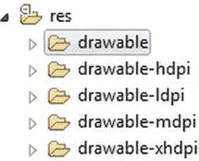

图 4-1。我的 res/ folder 怎么了？

我们在第一章中看到设备有不同的尺寸，但我们没有谈到 Android 如何处理这些不同的尺寸。事实证明，Android 有一个复杂的机制，允许你为一组屏幕密度定义图形素材。*屏幕密度*是物理屏幕尺寸和屏幕像素数量的组合。我们将在第五章中更详细地探讨这个话题。现在，知道 Android 定义了四种密度就足够了:低密度屏幕的 ldpi、标准密度屏幕的 mdpi、高密度屏幕的 hdpi 和超高密度屏幕的 xhdpi。对于低密度的屏幕，我们通常使用较小的图像；对于更高密度的屏幕，我们使用高分辨率的素材。

因此，对于我们的图标，我们需要提供四个版本:每个密度一个。但是每个版本应该有多大呢？幸运的是，我们在 res/drawable 文件夹中已经有了默认图标，可以用来重新设计我们自己图标的大小。res/drawable-ldpi 中的图标分辨率为 36×36 像素，res/drawable-mdpi 中的图标分辨率为 48×48 像素，res/drawable-hdpi 中的图标分辨率为 72×72 像素，res/drawable-xhdpi 中的图标分辨率为 96×96 像素。我们所要做的就是用相同的分辨率创建自定义图标的版本，并用我们自己的 icon.png 文件替换每个文件夹中的 icon.png 文件。我们可以保持清单文件不变，只要我们把我们的图标图像文件称为 icon.png。请注意，清单文件中的文件引用区分大小写。为了安全起见，在资源文件中总是使用小写字母。

为了真正兼容 Android 1.5，我们需要添加一个名为 res/drawable/的文件夹，并将 res/drawable-mdpi/文件夹中的图标图像放在那里。Android 1.5 不知道其他可绘制的文件夹，所以它可能找不到我们的图标。

最后，我们准备完成一些 Android 编码。

对于来自 iOS/Xcode 的用户

Android 的环境与苹果的环境有很大不同。在苹果控制非常严格的地方，Android 依赖于来自不同来源的许多不同模块，这些模块定义许多 API，控制格式，并规定哪些工具最适合特定任务，例如构建应用。

Eclipse/ADT 与。x mode(x mode)-x mode(x mode)-x mode(x mode)(x mode)(x mode)(x mode)(x mode)(x mode)(x mode)(x mode)

Eclipse 是一个多项目、多文档的界面。您可以在一个工作区中拥有许多 Android 应用，它们都列在您的 Package Explorer 视图下。您还可以在源代码视图中从这些项目中打开多个文件。就像 Xcode 中的前进/后退一样，Eclipse 有一些工具栏按钮来帮助导航，甚至还有一个名为 Last Edit Location 的导航选项，可以将您带回上次所做的更改。

Eclipse 为 Java 提供了许多 Xcode 为 Objective-C 所没有的语言特性，而在 Xcode 中你必须点击“跳转到定义”，在 Eclipse 中你只需按 F3 或点击 Open Declaration。另一个最喜欢的是参考搜索功能。想知道什么调用特定的方法吗？只需点击选择它，然后按 Ctrl+Shift+G 或选择搜索引用工作空间。所有的重命名或移动操作都被归类为“重构”操作，所以在您因为看不到任何重命名类或文件的方法而沮丧之前，请看一下重构选项。因为 Java 没有单独的头文件和实现文件，所以没有“跳转到头文件/实现”的快捷方式。如果您启用了项目自动构建，Java 文件的编译是自动的。启用该设置后，每次进行更改时，您的项目都会被增量编译。要自动完成，只需按 Ctrl+Space。

作为一名新的 Android 开发人员，您首先会注意到的一件事是，要在设备上部署，除了启用设置之外，您不必做太多其他事情。Android 上的任何可执行代码仍然需要用私钥签名，就像在 iOS 中一样，但密钥不需要由像苹果这样的可信机构颁发，所以 IDE 实际上是在您在设备上运行测试代码时为您创建了一个“调试”密钥。这个密钥将不同于您的生产密钥，但是不必为了进行应用测试而弄乱任何东西是非常有用的。密钥位于名为的子目录下的用户主目录中。android/debug.keystore。

像 Xcode 一样，Eclipse 支持 Subversion (SVN)，尽管您需要安装一个插件。最常见的插件叫做 Subclipse，可以在[`subclipse.tigris.org`](http://subclipse.tigris.org)获得。所有的 SVN 功能都可以在团队上下文菜单选项下获得，或者通过选择窗口显示视图其他 SVN 来打开视图。首先检查那里，以访问您的存储库，并开始签出或共享项目。

Eclipse 中的大多数东西都是上下文相关的，所以您需要右键单击(或者双击/Ctrl-click)项目、文件、类、方法以及其他任何东西的名称，看看有哪些选项。例如，第一次运行一个项目最好的方法就是右键单击项目名称，然后选择 Run As  Android Application。

定位和配置目标

Xcode 可以有一个包含多个目标的项目，如 My Game Free 和 My Game Full，它们有不同的编译时选项，可以基于这些选项生成不同的应用。Android 在 Eclipse 中没有这种东西，因为 Eclipse 是以非常扁平化的方式面向项目的。要在 Android 中做同样的事情，你需要有两个不同的项目，它们共享所有的代码，除了那个项目的一段特殊的配置代码。共享代码非常容易，使用 Eclipse 简单的“链接源代码”特性就可以做到。

如果你习惯了 Xcode 列表和页面配置，你会很高兴听到你在 Android 中可能需要的几乎所有东西都位于以下两个位置之一:AndroidManifest.xml(本章介绍)和项目的属性窗口。Android manifest 文件涵盖了非常特定于应用的内容，就像 Xcode 目标的摘要和信息一样，项目的属性窗口涵盖了 Java 语言的特性(例如链接了哪些库，类位于何处，等等。).右键单击该项目并选择 Properties，会显示许多类别供您配置。Android 和 Java 构建路径类别处理库和源代码依赖性，很像 Xcode 中的许多构建设置、构建阶段和构建规则标签选项。事情肯定会有所不同，但是了解到哪里可以节省大量的时间。

其他有用的花絮

当然 XCode 和 Eclipse 之间有更多的区别。下面的列表告诉你那些我们认为最有用的。

*   Eclipse 显示了实际的文件系统结构，但是缓存了关于它的许多东西，所以请充分利用 F5/refresh 特性来获得项目文件的最新情况。
*   文件位置确实很重要，而且没有相当于组的位置虚拟化。这就好像所有文件夹都是文件夹引用，不包括文件的唯一方法是设置排除过滤器。
*   设置是基于每个工作空间的，因此您可以有多个工作空间，每个工作空间都有不同的设置。当你既有个人项目又有专业项目，并且想把它们分开时，这是非常有用的。
*   Eclipse 有多个透视图，当前透视图由 Eclipse 窗口右上角的活动图标标识，默认情况下是 Java。正如在第二章中所讨论的，透视图是一组预配置的视图和一些相关的上下文设置。如果事情在任何一点上看起来变得奇怪，检查以确保你处于正确的角度。
*   本书涵盖了部署，但它不像在 Xcode 中那样改变方案或目标。这是一个完全独立的操作，您可以通过项目的右键上下文菜单来完成(Android Tools 导出签名的应用包)。
*   如果代码编辑似乎没有生效，很可能是您的自动构建设置被关闭了。您通常希望为期望的行为启用它(项目自动构建)。
*   XIB 没有直接的对等物。最接近的是 Android 布局，但 Android 不像 XIB 那样做插座，所以只要假设你会一直使用 id 惯例。大部分游戏不需要在意多种布局，但是记住就好。
*   Eclipse 在项目目录中主要使用基于 XML 的配置文件来存储项目设置。检查“点”文件，如。如果需要手动进行更改或构建自动化系统，请使用。这个加上 AndroidManifest.xml 非常类似于 Xcode 中的 project.pbxproj 文件。

Android API 基础

在这一章的剩余部分，我们将集中精力使用那些与我们游戏开发需求相关的 Android API。为此，我们将做一些相当方便的事情:我们将建立一个测试项目，该项目将包含我们将要使用的不同 API 的所有小测试示例。我们开始吧。

创建测试项目

从上一节中，我们已经知道了如何设置我们所有的项目。因此，我们要做的第一件事是执行前面列出的八个步骤。创建一个名为 ch04–Android-basics 的项目，使用名为 com.badlogic.androidgames 的包以及一个名为 AndroidBasicsStarter 的主活动。我们将使用一些旧的和一些新的 API，因此我们将最低 SDK 版本设置为 3 (Android 1.5)，将构建 SDK 版本设置为 16 (Android 4.1)。您可以为其他设置填入您喜欢的任何值，例如应用的标题。从现在开始，我们要做的就是创建新的活动实现，每个实现展示 Android API 的一部分。

但是，请记住，我们只有一个主要活动。那么，我们的主要活动是什么样的呢？我们希望有一种方便的方式来添加新的活动，我们希望能够轻松地开始一个特定的活动。对于一个主要的活动，应该清楚的是，这个活动将会以某种方式为我们提供一个方法来开始一个特定的测试活动。如前所述，main 活动将被指定为清单文件中的主入口点。我们添加的每一个额外的活动都将在没有<intent-filter>子元素的情况下被指定。我们将从主活动中以编程方式启动它们。</intent-filter>

AndroidBasicsStarter 活动

Android API 为我们提供了一个名为 ListActivity 的特殊类，它来自我们在 Hello World 项目中使用的 Activity 类。ListActivity 类是一种特殊类型的活动，它的唯一目的是显示一个事物列表(例如，字符串)。我们使用它来显示我们的测试活动的名称。当我们触摸其中一个列表项时，我们将以编程方式启动相应的活动。清单 4-1 显示了我们的 AndroidBasicsStarter 主活动的代码。

***清单 4-1。****AndroidBasicsStarter.java，我们的主要活动负责列出并开始我们所有的测试*

```java
package com.badlogic.androidgames;

import android.app.ListActivity;
import android.content.Intent;
import android.os.Bundle;
import android.view.View;
import android.widget.ArrayAdapter;
import android.widget.ListView;

public class AndroidBasicsStarter extends ListActivity {
    String tests[] = { "LifeCycleTest", "SingleTouchTest", "MultiTouchTest",
            "KeyTest", "AccelerometerTest", "AssetsTest",
            "ExternalStorageTest", "SoundPoolTest", "MediaPlayerTest",
            "FullScreenTest", "RenderViewTest", "ShapeTest", "BitmapTest",
            "FontTest", "SurfaceViewTest" };

    public void onCreate(Bundle savedInstanceState) {
        super .onCreate(savedInstanceState);
        setListAdapter(new ArrayAdapter<String>(this ,
                android.R.layout.*simple*_*list*_*item*_*1*, tests));
    }

    @Override
    protected void onListItemClick(ListView list, View view, int position,
            long id) {
        super .onListItemClick(list, view, position, id);
        String testName = tests[position];
        try {
            Class clazz = Class
                    .*forName*("com.badlogic.androidgames." + testName);
            Intent intent = new Intent(this , clazz);
            startActivity(intent);
        }catch (ClassNotFoundException e) {
            e.printStackTrace();
        }
    }
}
```

我们选择的包名是 com.badlogic.androidgames。这些就是我们将在代码中使用的所有类。我们的 AndroidBasicsStarter 类派生自 ListActivity 类——仍然没有什么特别的。field tests 是一个字符串数组，它保存了我们的 starter 应用应该显示的所有测试活动的名称。请注意，数组中的名称正是我们稍后要实现的活动类的 Java 类名。

下一段代码应该是熟悉的；我们必须为我们的每个活动实现 onCreate()方法，,该方法将在创建活动时被调用。记住，我们必须调用活动基类的 onCreate()方法。这是我们在自己的活动实现的 onCreate()方法中必须做的第一件事。如果我们不这样做，将会抛出一个异常，并且不会显示该活动。

这样一来，接下来我们要做的是调用一个名为 setListAdapter()的方法。这个方法是由派生它的 ListActivity 类提供给我们的。它让我们指定希望 ListActivity 类为我们显示的列表项。这些需要以实现 ListAdapter 接口的类实例的形式传递给该方法。我们使用方便的 ArrayAdapter 类来做到这一点。这个类的构造函数有三个参数:第一个是我们的活动，第二个我们将在下一段解释，第三个是 ListActivity 应该显示的项目数组。我们很乐意为第三个参数指定我们之前定义的测试数组，这就是我们需要做的全部工作。

那么, ArrayAdapter 构造函数的第二个参数是什么？为了解释这一点，我们不得不经历所有的 Android UI API 的东西，我们不打算在本书中使用。因此，我们不会在我们不需要的东西上浪费页面，而是给你一个简单明了的解释:列表中的每一项都通过视图显示。该参数定义了每个视图的布局以及每个视图的类型。安卓的价值。R.layout.simple_list_item_1 是 UI API 提供的预定义常量，用于快速启动和运行。它代表将显示文本的标准列表项视图。作为快速复习，视图是 Android 上的 UI 小部件，比如按钮、文本字段或滑块。在第二章中，我们在剖析 HelloWorldActivity 时引入了按钮实例形式的视图。

如果我们用 onCreate()方法开始我们的活动，我们会看到类似于图 4-2 所示的屏幕。

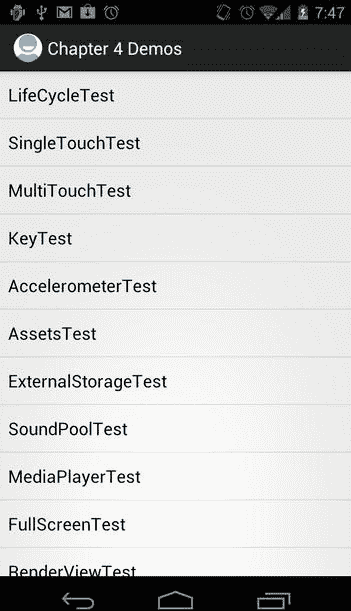

图 4-2。我们的测试启动活动，看起来很花哨，但还没做多少

现在让我们在触摸列表项时发生一些事情。我们希望开始我们接触的列表项所代表的相应活动。

以编程方式启动活动

ListActivity 类有一个名为 onListItemClick()的受保护方法，当点击一个项目时将调用该方法。我们所需要做的就是在我们的 AndroidBasicsStarter 类中覆盖该方法。这正是我们在清单 4-1 中所做的。

这个方法的参数是 ListActivity 用来显示项目的 ListView、被触摸的视图(包含在这个 ListView 中)、被触摸的项目在列表中的位置，以及一个 ID，我们并不太感兴趣。我们真正关心的是立场论点。

onListItemClicked()方法从成为好公民开始，首先调用基类方法。如果我们覆盖一个活动的方法，这总是一件好事。接下来，我们根据 position 参数从 tests 数组中获取类名。这是拼图的第一部分。

前面，我们讨论了我们可以通过一个意图以编程方式启动我们在清单文件中定义的活动。Intent 类有一个很好的简单的构造函数来做这件事，它有两个参数:一个上下文实例和一个类实例。后者表示我们想要启动的活动的 Java 类。

上下文是为我们提供应用全局信息的接口。它是由 Activity 类实现的，所以我们只需将这个引用传递给 Intent 构造函数。

为了获得表示我们想要启动的活动的类实例，我们使用了一点反射，如果您使用过 Java，这可能对您来说很熟悉。反射允许我们在运行时以编程方式检查、实例化和调用类。静态方法 Class.forName()接受一个字符串，该字符串包含我们要为其创建类实例的类的完全限定名。我们稍后将实现的所有测试活动都将包含在 com.badlogic.androidgames 包中。将包名与我们从 tests 数组中获取的类名连接起来，将得到我们想要启动的 activity 类的完全限定名。我们将该名称传递给 Class.forName()，并获得一个可以传递给 Intent 构造函数的不错的类实例。

一旦构建了 Intent 实例，我们就可以通过调用 startActivity()方法来启动它。这个方法也在上下文接口中定义。因为我们的活动实现了那个接口，所以我们只调用它的那个方法的实现。就是这样！

那么我们的应用将如何表现呢？首先，将显示启动器活动。每次我们触摸列表上的一个项目，相应的活动就会启动。启动活动将暂停，并进入后台。新活动将由我们发出的意向创建，并将替换屏幕上的起始活动。当我们按下 Android 设备上的 back 按钮时，活动被破坏，starter 活动恢复，收回屏幕。

创建测试活动

当我们创建一个新的测试活动时，我们必须执行以下步骤:

1.  在 com.badlogic.androidgames 包中创建相应的 Java 类，并实现其逻辑。
2.  在清单文件中为 activity 添加一个条目，使用它需要的任何属性(即 android:configChanges 或 android:screenOrientation)。注意，我们不会指定一个<intent-filter>元素，因为我们将以编程方式启动活动。</intent-filter>
3.  将活动的类名添加到 AndroidBasicsStarter 类的 tests 数组中。

只要我们坚持这个过程，其他一切都将由我们在 AndroidBasicsStarter 类中实现的逻辑来处理。新的活动会自动出现在列表中，只需轻轻一触就能启动。

您可能想知道的一件事是，在 touch 上开始的测试活动是否在它自己的进程和 VM 中运行。不是的。由活动组成的应用有一个叫做*活动栈*的东西。每次我们开始一个新的活动，它就会被推到堆栈上。当我们关闭新的活动时，最后一个推入堆栈的活动将被弹出并恢复，成为屏幕上新的活动活动。

这也有一些其他的含义。首先，应用的所有活动(堆栈上暂停的活动和活动的活动)共享同一个 VM。它们还共享同一个内存堆。这可能是福也可能是祸。如果您的活动中有静态字段，它们一启动就会在堆上获得内存。作为静态字段，它们将在活动的销毁和活动实例的后续垃圾收集中幸存。如果您不小心使用静态字段，这可能会导致一些严重的内存泄漏。在使用静态字段之前要三思。

正如已经说过几次的，我们在实际的游戏中只会有一个活动。前面的活动启动器是这个规则的一个例外，让我们的生活变得更轻松。但是不用担心；即使是一项活动，我们也有很多机会陷入困境。

**注意**这是我们对 Android UI 编程的最深理解。从现在开始，我们将总是在活动中使用单个视图来输出内容和接收输入。如果你想了解布局、视图组和 Android UI 库提供的所有功能，我们建议你看看格兰特·艾伦的书，《??》开始 Android 4(2011 年出版)，或者 Android 开发者网站上的优秀开发者指南。

活动生命周期

在为 Android 编程时，我们首先要弄清楚的是一个活动是如何表现的。在 Android 上，这被称为*活动生命周期*。它描述了活动所处的状态以及这些状态之间的转换。我们先来讨论一下这背后的理论。

理论上

活动可以处于以下三种状态之一:

*   *运行*:在这种状态下，占据屏幕并直接与用户交互的是顶层活动。
*   *暂停*:当活动在屏幕上仍然可见，但被透明活动或对话框部分遮挡，或者设备屏幕被锁定时，会出现这种情况。Android 系统可以在任何时间点终止暂停的活动(例如，由于内存不足)。请注意，活动实例本身仍然活跃在 VM 堆中，并等待返回到运行状态。
*   *Stopped* :当一个活动被另一个活动完全遮挡，从而在屏幕上不再可见时，就会出现这种情况。例如，如果我们开始一个测试活动，我们的 AndroidBasicsStarter 活动将处于这种状态。当用户按下主屏幕按钮暂时转到主屏幕时，也会发生这种情况。如果内存不足，系统可以再次决定完全终止该活动并将其从内存中删除。

在暂停和停止状态下，Android 系统可以决定在任何时间点终止活动。它可以礼貌地这样做，首先通过调用它的 finished()方法通知活动，也可以不礼貌地这样做，悄悄终止活动的进程。

活动可以从暂停或停止状态返回到运行状态。再次注意，当活动从暂停或停止状态恢复时，它仍然是内存中的同一个 Java 实例，因此所有状态和成员变量都与活动暂停或停止前相同。

一个活动有一些受保护的方法,我们可以覆盖这些方法来获得关于状态变化的信息:

*   Activity.onCreate():当我们的活动第一次启动时调用这个函数。在这里，我们设置了所有的 UI 组件并连接到输入系统。这个方法在我们活动的生命周期中只被调用一次。
*   Activity.onRestart():当活动从停止状态恢复时调用这个函数。它前面是对 onStop()的调用。
*   Activity.onStart():在 onCreate()之后或者当活动从停止状态恢复时调用这个函数。在后一种情况下，它前面是对 onRestart()的调用。
*   Activity.onResume():在 onStart()之后或者当活动从暂停状态恢复时(例如，当屏幕解锁时)调用这个函数。
*   Activity.onPause():当活动进入暂停状态时调用该函数。这可能是我们收到的最后一个通知，因为 Android 系统可能会决定悄悄地杀死我们的应用。我们要用这种方法保存所有我们想坚持的状态！
*   Activity.onStop():当活动进入停止状态时调用该函数。它前面有一个对 onPause()的调用。这意味着活动在暂停之前就已停止。和 onPause()一样，这可能是我们在 Android 系统静默终止活动之前收到的最后一个通知。我们也可以在这里保存持久状态。然而，系统可能决定不调用这个方法，而只是终止活动。由于 onPause()总是在 onStop()之前和活动被静默终止之前被调用，我们宁愿将所有内容保存在 onPause()方法中。
*   Activity.onDestroy():当活动被不可恢复地销毁时，在活动生命周期结束时调用这个函数。这是我们最后一次保存任何信息，以便在下次重新创建活动时恢复。请注意，如果活动在系统调用 onPause()或 onStop()后被静默销毁，则实际上可能永远不会调用此方法。

图 4-3 说明了活动生命周期和方法调用顺序。

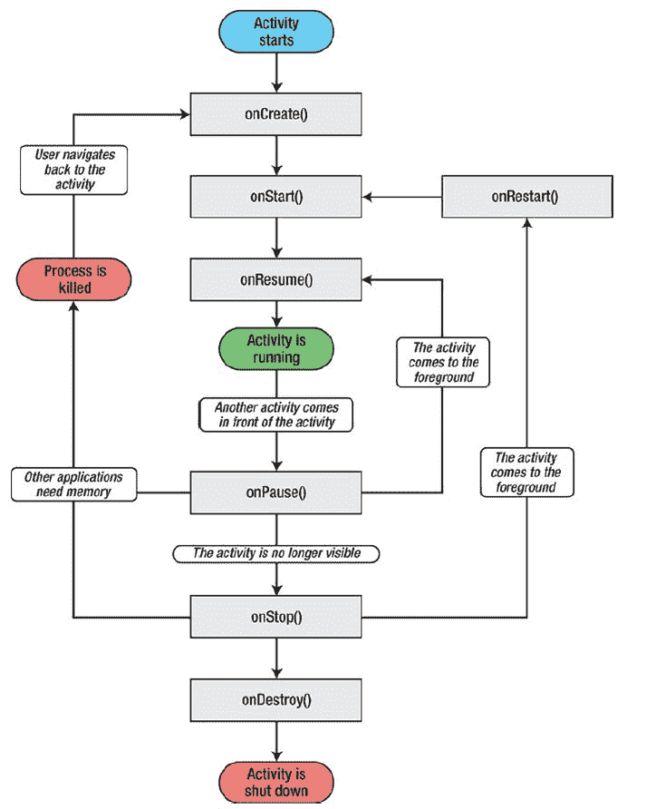

图 4-3。浩浩荡荡、令人困惑的活动生命周期

以下是我们应该从中吸取的三大教训:

1.  在我们的活动进入运行状态之前，无论我们是从停止状态还是暂停状态恢复，onResume()方法总是被调用。因此，我们可以放心地忽略 onRestart()和 onStart()方法。我们不关心是从停止状态还是暂停状态恢复。对于我们的游戏，我们只需要知道我们现在实际上正在运行，onResume()方法向我们发出信号。
2.  在 onPause()之后，可以静默地销毁该活动。我们永远不应该假设 onStop()或 onDestroy()被调用。我们还知道 onPause()总是在 onStop()之前被调用。因此，我们可以安全地忽略 onStop()和 onDestroy()方法，只重写 onPause()。在这种方法中，我们必须确保我们想要保持的所有状态，如高分和等级进步，都被写入外部存储，如 SD 卡。在 onPause()之后，所有的赌注都取消了，我们不知道我们的活动是否还有机会再次运行。
3.  我们知道，如果系统在 onPause()或 onStop()之后决定终止活动，则可能永远不会调用 onDestroy()。然而，有时我们想知道活动是否真的会被扼杀。那么，如果 onDestroy()不会被调用，我们该怎么做呢？Activity 类有一个名为 Activity.isFinishing()的方法，我们可以随时调用它来检查我们的活动是否会被终止。我们至少可以保证 onPause()方法在 activity 被终止之前被调用。我们所需要做的就是在 onPause()方法中调用这个 isFinishing()方法，以决定在 onPause()调用之后活动是否会终止。

这让生活变得简单多了。我们只覆盖 onCreate()、onResume()和 onPause()方法。

*   在 onCreate()中，我们设置我们的窗口和 UI 组件，向其呈现内容，并从其接收输入。
*   在 onResume()中，我们(重新)开始我们的主循环线程(在第三章的中讨论)。
*   在 onPause()中，我们简单地暂停我们的主循环线程，如果 Activity.isFinishing()返回 true，我们还会将我们希望保持的任何状态保存到磁盘中。

许多人纠结于活动的生命周期，但是如果我们遵循这些简单的规则，我们的游戏将能够处理暂停、恢复和清理。

在实践中

让我们编写演示活动生命周期的第一个测试示例。我们希望有某种输出来显示到目前为止发生了哪些状态变化。我们将通过两种方式做到这一点:

1.  活动将显示的唯一 UI 组件是一个 TextView。顾名思义，它显示文本，我们已经在 starter 活动中隐式地使用它来显示每个条目。每当我们进入一个新的状态时，我们将向 TextView 追加一个字符串，它将显示到目前为止发生的所有状态变化。
2.  我们将无法在 TextView 中显示活动的销毁事件，因为它会很快从屏幕上消失，所以我们还会将所有状态更改输出到 LogCat。我们用 Log 类来实现这一点，它提供了两个静态方法来将消息添加到 LogCat 中。

记住我们需要做什么来添加一个测试活动到我们的测试应用中。首先，我们在清单文件中以<activity>元素的形式定义它，它是<application>元素的子元素:</application></activity>

```java
<activity android:label="*Life Cycle Test*"
          android:name=".*LifeCycleTest*"
          android:configChanges="*keyboard*|*keyboardHidden*|*orientation*" />
```

接下来，我们将名为 LifeCycleTest 的新 Java 类添加到我们的 com.badlogic.androidgames 包中。最后，我们将类名添加到前面定义的 androidbasicstarter 类的 tests 成员中。(当然，当我们出于演示的目的编写这个类时，我们就已经有了。)

对于我们在接下来的部分中创建的任何测试活动，我们将不得不重复所有这些步骤。为简洁起见，我们不再提及这些步骤。还要注意，我们没有为 LifeCycleTest 活动指定方向。在本例中，我们可以处于横向模式或纵向模式，具体取决于设备方向。我们这样做是为了让您可以看到方向更改对生命周期的影响(由于我们如何设置 configChanges 属性，所以没有影响)。清单 4-2 显示了整个活动的代码。

***清单 4-2。****【LifeCycleTest.java】，展示活动生命周期*

```java
package com.badlogic.androidgames;

import android.app.Activity;
import android.os.Bundle;
import android.util.Log;
import android.widget.TextView;

public class LifeCycleTest extends Activity {
   StringBuilder builder = new StringBuilder();
   TextView textView;

   private void log(String text) {
       Log.*d*("LifeCycleTest", text);
       builder.append(text);
       builder.append('\n');
       textView.setText(builder.toString());
   }

   @Override
   public void onCreate(Bundle savedInstanceState) {
      super .onCreate(savedInstanceState);
      textView = new TextView(this );
      textView.setText(builder.toString());
        setContentView(textView);
        log("created");
   }

   @Override
   protected void onResume() {
      super .onResume();
      log("resumed");
   }

   @Override
   protected void onPause() {
      super .onPause();
      log("paused");

      if (isFinishing()) {
            log("finishing");
      }
   }
}
```

让我们快速浏览一下这段代码。这个类来源于 Activity——这并不奇怪。我们定义了两个成员:一个是 StringBuilder，它将保存我们到目前为止生成的所有消息，另一个是 TextView，我们用它直接在活动中显示这些消息。

接下来，我们定义一个小的私有 helper 方法，它将把文本记录到 LogCat，把它附加到我们的 StringBuilder，并更新 TextView 文本。对于 LogCat 输出，我们使用静态 Log.d()方法，该方法将一个标记作为第一个参数，将实际消息作为第二个参数。

在 onCreate()方法中，我们像往常一样首先调用超类方法。我们创建 TextView 并将其设置为活动的内容视图。它将填满活动的整个空间。最后，我们将创建的消息记录到 LogCat 中，并使用之前定义的 helper 方法 log()更新 TextView 文本。

接下来，我们覆盖活动的 onResume()方法。与我们覆盖的任何活动方法一样，我们首先调用超类方法。我们所做的就是再次调用 log()并将 resumed 作为参数。

被覆盖的 onPause()方法看起来很像 onResume()方法。我们首先将消息记录为“暂停”。我们还想知道在 onPause()方法调用之后活动是否会被销毁，所以我们检查 Activity.isFinishing()方法。如果它返回 true，我们也记录完成事件。当然，我们将看不到更新的 TextView 文本，因为在更改显示在屏幕上之前，活动将被销毁。因此，如前所述，我们也将所有内容输出到 LogCat。

运行应用，并稍微试验一下这个测试活动。下面是您可以执行的一系列操作:

1.  从启动活动启动测试活动。
2.  锁屏。
3.  解锁屏幕。
4.  按下主屏幕按钮(这将带你回到主屏幕)。
5.  在主屏幕上，在旧的 Android 版本(版本 3 之前)上，按住 home 键，直到出现当前正在运行的应用。在 Android 版本 3+上，触摸运行应用按钮。选择 Android 基础入门应用以继续(这将使测试活动回到屏幕上)。
6.  按“后退”按钮(这将带您返回到开始活动)。

如果你的系统在暂停的任何时候都没有决定静默终止活动，你会在图 4-4 中看到输出(当然，前提是你还没有按下返回按钮)。

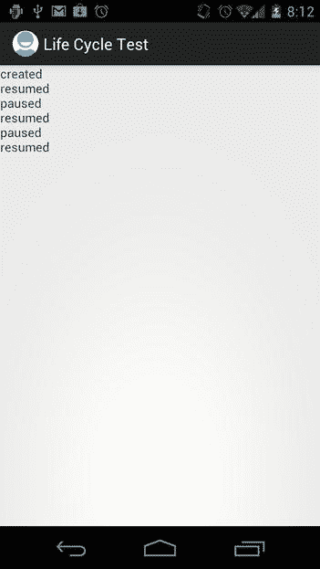

图 4-4。运行生命周期测试活动

启动时，调用 onCreate()，然后调用 onResume()。当我们锁定屏幕时，调用 onPause()。当我们解锁屏幕时，调用 onResume()。当我们按下 home 键时，onPause()被调用。回到活动将再次调用 onResume()。当然，相同的消息显示在 LogCat 中，您可以在 Eclipse 的 LogCat 视图中观察到。图 4-5 显示了我们在执行前面的动作序列(加上按下后退按钮)时写入 LogCat 的内容。

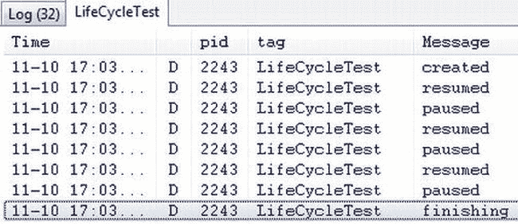

图 4-5。生命周期测试的 LogCat 输出

再次按 back 按钮调用 onPause()方法。由于它也破坏了活动，onPause()中的 if 语句也被触发，通知我们这是最后一次看到该活动。

这就是活动生命周期，为了我们的游戏编程需要而被去神秘化和简化。我们现在可以轻松地处理任何暂停和恢复事件，并保证在活动被销毁时得到通知。

输入设备处理

正如前面章节所讨论的，我们可以从 Android 上的许多不同的输入设备中获取信息。在这一部分，我们将讨论 Android 上三个最相关的输入设备以及如何使用它们:触摸屏、键盘、加速度计和指南针。

获取(多点)触摸事件

触摸屏可能是获取用户输入的最重要的方式。在 Android 版本之前，API 只支持处理单指触摸事件。多点触控是在 Android 2.0 (SDK 版本 5)中引入的。多点触摸事件报告被标记在单触式 API 上，在可用性方面有一些混合的结果。我们将首先研究处理单点触摸事件，这在所有 Android 版本上都可用。

处理单点触摸事件

当我们在第二章中处理点击按钮时，我们看到监听器接口是 Android 向我们报告事件的方式。触摸事件也不例外。触摸事件被传递给一个 OnTouchListener 接口实现，我们用一个视图注册它。OnTouchListener 接口只有一个方法:

```java
public abstract boolean onTouch (View v, MotionEvent event)
```

第一个参数是触摸事件被调度到的视图。第二个参数是我们将分析以获得触摸事件的内容。

OnTouchListener 可以通过 View.setOnTouchListener()方法注册到任何视图实现中。在将 MotionEvent 分派给视图本身之前，将调用 OnTouchListener。在 onTouch()方法的实现中，我们可以通过从该方法返回 true 来通知视图我们已经处理了该事件。如果我们返回 false，视图本身将处理该事件。

MotionEvent 实例有三个与我们相关的方法:

*   MotionEvent.getX()和 MotionEvent.getY():这些方法报告触摸事件相对于视图的 x 和 y 坐标。坐标系定义为原点在视图的左上方，x 轴指向右侧，y 轴指向下方。坐标以像素为单位。请注意，这些方法返回浮点数，因此坐标具有子像素精度。
*   MotionEvent.getAction():该方法返回触摸事件的类型。它是一个整数，取值为`MotionEvent.ACTION_DOWN`、`MotionEvent.ACTION_MOVE`、`MotionEvent.ACTION_CANCEL`或`MotionEvent.ACTION_UP`中的一个。

听起来很简单，事实也确实如此。运动事件。手指触摸屏幕时发生 ACTION_DOWN 事件。当手指移动时，类型为 MotionEvent 的事件。ACTION_MOVE 被触发。请注意，您将始终获得 MotionEvent。动作 _ 移动事件，因为你不能保持手指不动来避免它们。触摸传感器将识别最轻微的变化。当手指再次抬起时，MotionEvent。报告了 ACTION_UP 事件。运动事件。ACTION_CANCEL 事件有点神秘。文档显示，当当前手势被取消时，它们将被触发。我们还从未在现实生活中见过这一事件。然而，我们仍然会处理它，并假设它是一个运动事件。当我们开始实现我们的第一个游戏时的 ACTION_UP 事件。

让我们编写一个简单的测试活动，看看这在代码中是如何工作的。该活动应该显示手指在屏幕上的当前位置以及事件类型。清单 4-3 显示了我们的成果。

***清单 4-3。*【SingleTouchTest.java】***；测试单点触摸操作*

```java
package com.badlogic.androidgames;

import android.app.Activity;
import android.os.Bundle;
import android.util.Log;
import android.view.MotionEvent;
import android.view.View;
import android.view.View.OnTouchListener;
import android.widget.TextView;

public class SingleTouchTest extends Activity implements OnTouchListener {
   StringBuilder builder = new StringBuilder();
   TextView textView;

   public void onCreate(Bundle savedInstanceState) {
       super .onCreate(savedInstanceState);
       textView = new TextView(this );
       textView.setText("Touch and drag (one finger only)!");
       textView.setOnTouchListener(this );
       setContentView(textView);
   }

   public boolean onTouch(View v, MotionEvent event) {
      builder.setLength(0);
      switch (event.getAction()) {
      case MotionEvent.*ACTION*_*DOWN*:
          builder.append("down, ");
          break ;
      case MotionEvent.*ACTION*_*MOVE*:
          builder.append("move, ");
          break ;
      case MotionEvent.*ACTION*_*CANCEL*:
          builder.append("cancel", ");
          break ;
      case MotionEvent.*ACTION*_*UP*:
          builder.append("up, ");
          break ;
      }
      builder.append(event.getX());
      builder.append(", ");
      builder.append(event.getY());
      String text = builder.toString();
      Log.*d*("TouchTest", text);
      textView.setText(text);
      return true ;
   }
}
```

我们让我们的活动实现 OnTouchListener 接口。我们还有两个成员:一个用于 TextView，另一个用于构造事件字符串的 StringBuilder。

onCreate()方法是不言自明的。惟一的新颖之处是对 TextView.setOnTouchListener()的调用，在这里我们向 TextView 注册了我们的活动，以便它接收 MotionEvents。

剩下的就是 onTouch()方法实现本身。我们忽略视图参数，因为我们知道它必须是 TextView。我们感兴趣的是获取触摸事件类型，将标识它的字符串追加到我们的 StringBuilder，追加触摸坐标，并更新 TextView 文本。就这样。我们还将事件记录到 LogCat 中，这样我们就可以看到事件发生的顺序，因为 TextView 只会显示我们处理的最后一个事件(每次调用 onTouch()时，我们都会清除 StringBuilder)。

onTouch()方法中一个微妙的细节是 return 语句，在这里我们返回 true。通常，我们会坚持侦听器的概念并返回 false，以便不干扰事件调度过程。如果我们在示例中这样做，我们将不会得到除了 MotionEvent 之外的任何事件。ACTION_DOWN 事件因此，我们告诉 TextView 我们刚刚消费了事件。在不同的视图实现之间，这种行为可能会有所不同。幸运的是，在本书的其余部分，我们只需要其他三个视图，这些视图将让我们愉快地消费我们想要的任何事件。

如果我们在模拟器或连接的设备上启动该应用，我们可以看到 TextView 总是显示向 onTouch()方法报告的最后一个事件类型和位置。此外，您可以在 LogCat 中看到相同的消息。

我们没有修复清单文件中活动的方向。当然，如果您旋转设备，使活动处于横向模式，坐标系也会改变。图 4-6 显示了纵向模式(左)和横向模式(右)下的活动。在这两种情况下，我们都试图触及视图的中间。注意 x 和 y 坐标是如何交换的。该图还显示了两种情况下的 x 轴和 y 轴(黄线)，以及屏幕上我们粗略触摸过的点(绿圈)。在这两种情况下，原点都在 TextView 的左上角，x 轴指向右侧，y 轴指向下方。

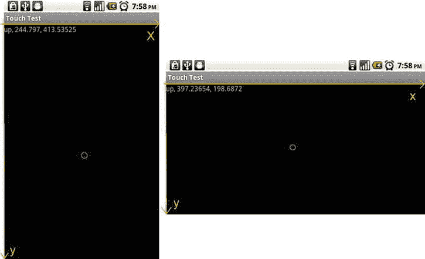

图 4-6。在纵向和横向模式下触摸屏幕

当然，根据方向的不同，我们的最大 x 和 y 值也会变化。前面的图片是在运行 Android 2.2 (Froyo)的 Nexus One 上拍摄的，它在人像模式下的屏幕分辨率为 480×800 像素(在风景模式下为 800×480)。由于触摸坐标是相对于视图给出的，并且视图没有填满整个屏幕，因此我们的最大 y 值将小于分辨率高度。稍后我们将看到如何启用全屏模式，以便标题栏和通知栏不会妨碍我们。

遗憾的是，旧版本 Android 和第一代设备上的触摸事件存在一些问题:

*   *触摸事件泛滥*:当手指在触摸屏上按下时，司机会报告尽可能多的触摸事件——在一些设备上，每秒数百次。我们可以通过将 Thread.sleep(16)调用放入我们的 onTouch()方法中来解决这个问题，这将使分派这些事件的 UI 线程休眠 16 毫秒。这样的话，我们每秒最多可以处理 60 个事件，这对于一个反应灵敏的游戏来说已经足够了。这只是安卓 1.5 版本设备上的问题。如果你的目标不是那个 Android 版本，忽略这个建议。
*   *触屏吃**CPU*:即使我们在我们的 onTouch()方法中休眠，系统也要处理驱动程序报告的内核中的事件。在老设备上，比如 Hero 或 G1，这可以使用高达 50%的 CPU，这使得我们的主循环线程的处理能力大大降低。因此，我们完美的帧速率将会大大下降，有时会到游戏无法播放的程度。在第二代设备上，这个问题要小得多，通常可以忽略。遗憾的是，在旧设备上没有解决方案。

处理多点触摸事件

警告:前方剧痛！multitouch API 已经被标记到 MotionEvent 类中，该类最初只处理单点触摸。当试图解码多点触摸事件时，这造成了一些主要的混乱。让我们试着理解它。

**注意**多点触控 API 显然也让开发它的 Android 工程师感到困惑。它在 SDK 版本 8 (Android 2.2)中得到了重大改进，增加了新方法、新常量，甚至重命名了常量。这些变化应该会让多点触控的使用变得更加容易。但是，它们仅从 SDK 版本 8 开始提供。为了支持所有支持多点触摸的 Android 版本(2.0 以上)，我们必须使用 SDK 版本 5 的 API。

处理多点触摸事件与处理单点触摸事件非常相似。我们仍然实现了与单触事件相同的 OnTouchListener 接口。我们还获得了一个从中读取数据的 MotionEvent 实例。我们还处理之前处理过的事件类型，比如 MotionEvent。ACTION_UP，加上几个没什么大不了的新功能。

指针 id 和索引

当我们想要访问触摸事件的坐标时，处理多触摸事件和处理单触摸事件之间的区别就开始了。MotionEvent.getX()和 MotionEvent.getY()返回单个手指在屏幕上的坐标。当我们处理多点触摸事件时，我们使用这些方法的重载变体，它们接受一个*指针索引*。这可能看起来像这样:

```java
event.getX(pointerIndex);
event.getY(pointerIndex);
```

现在，人们会期望指针索引直接对应于触摸屏幕的手指之一(例如，触摸的第一个手指的指针索引为 0，触摸的下一个手指的指针索引为 1，依此类推)。不幸的是，事实并非如此。

pointerIndex 是 MotionEvent 内部数组的索引，它保存触摸屏幕的特定手指的事件坐标。手指在屏幕上的真实标识符被称为*指针标识符*。指针标识符是唯一标识触摸屏幕的指针的一个实例的任意数字。有一个单独的方法叫做 motion event . getpointeridentifier(int pointer index)，它基于指针索引返回指针标识符。只要单个手指接触屏幕，指针标识符将保持不变。指针索引不一定如此。重要的是要理解两者之间的区别，并理解你不能依赖于第一次触摸是索引 0，ID 0，因为在一些设备上，特别是 Xperia Play 的第一个版本，指针 ID 总是会增加到 15，然后从 0 开始，而不是重复使用 ID 的最低可用数字。

让我们从研究如何到达一个事件的指针索引开始。我们现在将忽略事件类型。

```java
int pointerIndex = (event.getAction() & MotionEvent.ACTION_POINTER_ID_MASK) >> MotionEvent.ACTION_POINTER_ID_SHIFT;
```

当我们第一次实现它时，您可能会有同样的想法。在我们对人性失去信心之前，让我们试着破译这里发生了什么。我们通过 MotionEvent.getAction()从 MotionEvent 获取事件类型。很好，我们以前做过。接下来，我们使用从 MotionEvent.getAction()方法获得的整数和一个名为 MotionEvent 的常量执行按位 AND 运算。动作 _ 指针 _ 标识 _ 掩码。现在好戏开始了。

该常量的值为 0xff00，因此我们基本上将所有位设为 0，但第 8 位至第 15 位除外，它们保存事件的指针索引。event.getAction()返回的整数的低 8 位保存事件类型的值，如 MotionEvent。ACTION_DOWN 及其同级。通过这种位运算，我们实际上抛弃了事件类型。这种转变现在应该更有意义了。我们通过运动事件转移。ACTION_POINTER_ID_SHIFT，其值为 8，因此我们基本上将第 8 位到第 15 位移动到第 0 位到第 7 位，从而得到事件的实际指针索引。这样，我们就可以获得事件的坐标，以及指针标识符。

请注意，我们的神奇常数被称为 XXX_POINTER_ID_XXX，而不是 XXX_POINTER_INDEX_XXX(这更有意义，因为我们实际上想要提取指针索引，而不是指针标识符)。好吧，安卓工程师一定也很困惑。在 SDK 版本 8 中，他们弃用了这些常数，并引入了名为 XXX_POINTER_INDEX_XXX 的新常数，这些常数与弃用的常数具有完全相同的值。为了让针对 SDK 第 5 版编写的遗留应用继续在较新的 Android 版本上工作，旧的常量仍然可用。

所以我们现在知道如何获得神秘的指针索引，我们可以用它来查询事件的坐标和指针标识符。

动作掩码和更多事件类型

接下来，我们必须获得纯事件类型减去附加指针索引，该指针索引编码在由 MotionEvent.getAction()返回的整数中。我们只需要屏蔽掉指针索引:

```java
int action = event.getAction() & MotionEvent.ACTION_MASK;
```

好吧，那很简单。遗憾的是，只有当你知道指针索引是什么，并且它实际上编码在动作中时，你才能理解它。

剩下的就是像我们之前做的那样解码事件类型。我们已经说过有一些新的事件类型，现在让我们来看一下:

*   运动事件。ACTION_POINTER_DOWN:在第一个手指触摸屏幕后，任何其他手指触摸屏幕都会发生此事件。第一个手指仍然产生运动事件。ACTION_DOWN 事件
*   运动事件。ACTION_POINTER_UP:这类似于前面的操作。当一个手指从屏幕上抬起，并且不止一个手指触摸屏幕时，就会触发这个事件。屏幕上最后一个被抬起的手指将产生一个运动事件。ACTION_UP 事件这个手指不一定是触摸屏幕的第一个手指。

幸运的是，我们可以假设这两个新的事件类型与旧的 MotionEvent 相同。ACTION_UP 和 MotionEvent。动作 _ 停止事件。

最后一个区别是，单个 MotionEvent 可以包含多个事件的数据。是的，你没看错。为此，合并的事件必须具有相同的类型。实际上，这只会发生在运动事件中。ACTION_MOVE 事件，因此我们只需在处理所述事件类型时处理这一事实。为了检查单个 MotionEvent 中包含多少个事件，我们使用 MotionEvent.getPointerCount()方法，该方法告诉我们在 MotionEvent 中具有坐标的手指的数量。然后，我们可以通过 MotionEvent.getX()、MotionEvent.getY()和 MotionEvent.getPointerId()方法获取指针索引 0 到 motion event . getpointercount()–1 的指针标识符和坐标。

在实践中

让我们为这个优秀的 API 写一个例子。我们希望最多跟踪十个手指(还没有设备可以跟踪更多，所以我们在这里是安全的)。当我们在屏幕上添加更多手指时，Android 设备通常会分配连续的指针索引，但这并不总是有保证的，所以我们依赖于数组的指针索引，并将简单地显示哪个 id 分配给了触摸点。我们跟踪每个指针的坐标和触摸状态(触摸与否)，并通过文本视图将这些信息输出到屏幕上。让我们称我们的测试活动为 MultiTouchTest。清单 4-4 显示了完整的代码。

***清单 4-4。*【MultiTouchTest.java】***；测试多点触摸 API*

```java
package com.badlogic.androidgames;

import android.app.Activity;
import android.os.Bundle;
import android.view.MotionEvent;
import android.view.View;
import android.view.View.OnTouchListener;
import android.widget.TextView;

@TargetApi (5)
public class MultiTouchTest extends Activity implements OnTouchListener {
   StringBuilder builder = new StringBuilder();
   TextView textView;
   float [] x = new float [10];
   float [] y = new float [10];
   boolean [] touched = new boolean [10];
   int [] id = new int [10];

   private void updateTextView() {
      builder.setLength(0);
      for (int i = 0; i < 10; i++) {
          builder.append(touched[i]);
          builder.append(", ");
          builder.append(id[i]);
          builder.append(", ");
          builder.append(x[i]);
          builder.append(", ");
          builder.append(y[i]);
          builder.append("\n");
        }
        textView.setText(builder.toString());
    }

    public void onCreate(Bundle savedInstanceState) {
       super .onCreate(savedInstanceState);
       textView = new TextView(this );
       textView.setText("Touch and drag (multiple fingers supported)!");
       textView.setOnTouchListener(this );
       setContentView(textView);
       for (int i = 0; i < 10; i++) {
           id[i] = -1;
       }
       updateTextView();
    }

    public boolean onTouch(View v, MotionEvent event) {
       int action = event.getAction() & MotionEvent.*ACTION*_*MASK*;
       int pointerIndex = (event.getAction() & MotionEvent.*ACTION*_*POINTER*_*ID*_*MASK*) >> MotionEvent.*ACTION*_*POINTER*_*ID*_*SHIFT*;
       int pointerCount = event.getPointerCount();
       for (int i = 0; i < 10; i++) {
             if (i >= pointerCount) {
                 touched[i] = false ;
                 id[i] = -1;
                 continue ;
             }
             if (event.getAction() != MotionEvent.*ACTION*_*MOVE*&& i != pointerIndex) {
                 // if it's an up/down/cancel/out event, mask the id to see if we should process it for this touch point
                 continue ;
             }
             int pointerId = event.getPointerId(i);
             switch (action) {

             case MotionEvent.*ACTION*_*DOWN*:
             case MotionEvent.*ACTION*_*POINTER*_*DOWN*:
                 touched[i] = true ;
                 id[i] = pointerId;
                 x[i] = (int ) event.getX(i);
                 y[i] = (int ) event.getY(i);
                 break ;
             case MotionEvent.*ACTION*_*UP*:
             case MotionEvent.*ACTION*_*POINTER*_*UP*:
     case MotionEvent.*ACTION*_*OUTSIDE*:
             case MotionEvent.*ACTION*_*CANCEL*:
                 touched[i] = false ;
                 id[i] = -1;
                 x[i] = (int ) event.getX(i);
                 y[i] = (int ) event.getY(i);
                 break ;

             case MotionEvent.*ACTION*_*MOVE*:
                 touched[i] = true ;
                 id[i] = pointerId;
                 x[i] = (int ) event.getX(i);
                 y[i] = (int ) event.getY(i);
                 break ;
             }
         }
         updateTextView();
         return true ;
     }
}
```

注意类定义顶部的 TargetApi 注释。这是必要的，因为我们访问的 API 不是我们在创建项目时指定的最低 SDK 的一部分(Android 1.5)。每次我们使用不属于最小 SDK 的 API 时，我们都需要将注释放在使用这些 API 的类的顶部！

我们像以前一样实现 OnTouchListener 接口。为了跟踪十个手指的坐标和触摸状态，我们添加了三个新的成员数组来保存这些信息。数组 x 和 y 保存每个指针 ID 的坐标，被触摸的数组存储具有该指针 ID 的手指是否按下。

接下来，我们自由地创建了一个小助手方法，将手指的当前状态输出到 TextView。该方法只需迭代所有十个手指状态，并通过 StringBuilder 将它们连接起来。最终文本将设置为 TextView。

onCreate()方法设置我们的活动，并将其注册为 TextView 中的 OnTouchListener。这部分我们已经背熟了。

现在是可怕的部分:onTouch()方法。

我们首先通过屏蔽 event.getAction()返回的整数来获取事件类型。接下来，我们提取指针索引，并从 MotionEvent 获取相应的指针标识符，如前所述。

onTouch()方法的核心是那个讨厌的大 switch 语句，我们已经用它的简化形式来处理单触事件。我们将所有事件分为三大类:

*   *一触* - *倒地事件发生* (MotionEvent。ACTION_DOWN 或 MotionEvent。ACTION_PONTER_DOWN):我们将指针标识符的触摸状态设置为 true，并保存指针的当前坐标。
*   *一触* - *up 事件发生* (MotionEvent。ACTION_UP，MotionEvent。ACTION_POINTER_UP 或 MotionEvent。取消):我们将该指针标识符的触摸状态设置为假，并保存其最后已知的坐标。
*   *一个或多个手指* *被拖过* *屏幕*(运动事件。ACTION_MOVE):我们检查 MotionEvent 中包含多少个事件，然后将指针索引 0 的坐标更新为 motion event . getpointercount()-1。对于每个事件，我们获取相应的指针 ID 并更新坐标。

处理完事件后，我们通过调用前面定义的 updateView()方法来更新 TextView。最后，我们返回 true，表明我们处理了触摸事件。

图 4-7 显示了触摸三星 Galaxy Nexus 手机的五个手指并稍微拖动它们所产生的活动输出。

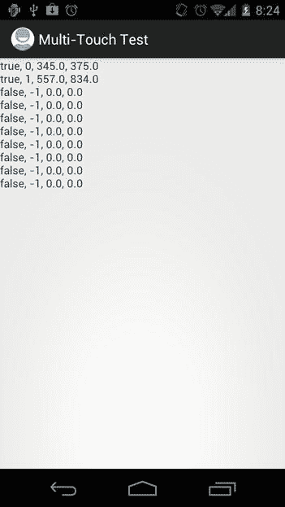

图 4-7。多点触控带来的乐趣

运行这个示例时，我们可以观察到一些情况:

*   如果我们在 Android 版本低于 2.0 的设备或模拟器上启动它，我们会得到一个令人讨厌的异常，因为我们使用了一个在那些早期版本上不可用的 API。我们可以通过确定应用运行的 Android 版本来解决这个问题，在运行 Android 1.5 和 1.6 的设备上使用单触代码，在运行 Android 2.0 或更高版本的设备上使用多触代码。我们将在下一章回到这个话题。
*   模拟器上没有多点触摸。如果我们创建一个运行 Android 或更高版本的仿真器，API 就在那里，但我们只有一个鼠标。即使我们有两只老鼠，也不会有什么不同。
*   向下触摸两个手指，抬起第一个手指，然后再次向下触摸。第二个手指将在第一个手指抬起后保持其指针 ID。当第一个手指第二次按下时，它会获得一个新的指针 ID，通常为 0，但可以是任何整数。任何触摸屏幕的新手指都将获得一个新的指针 ID，它可以是当前没有被另一个活动触摸使用的任何东西。这是一条需要记住的规则。
*   如果你在 Nexus One、Droid 或更新的低预算智能手机上尝试这一功能，当你在一个轴上交叉两个手指时，你会注意到一些奇怪的行为。这是因为这些设备的屏幕不完全支持对单个手指的跟踪。这是一个大问题，但是我们可以通过精心设计我们的 ui 来解决它。我们将在下一章中再来看这个问题。要记住的短语是:*不要*’*不要过河*！

这就是多点触摸处理在 Android 上的工作方式。这是一种痛苦，但是一旦你解开了所有的术语，并平静地接受了这一点，你就会对实现感到更加舒服，并像专家一样处理所有的接触点。

**注意**如果这让你的头爆炸了，我们很抱歉。这部分任务相当繁重。遗憾的是，该 API 的官方文档极其缺乏，大多数人只是通过简单地钻研来“学习”该 API。我们建议您尝试一下前面的代码示例，直到您完全理解其中的内容。

处理关键事件

经过最后一部分的疯狂，你应该得到一些非常简单的东西。欢迎处理关键事件。

为了捕捉关键事件，我们实现了另一个监听器接口，称为 OnKeyListener。它有一个名为 onKey()的方法，签名如下:

```java
public boolean onKey(View view, int keyCode, KeyEvent event)
```

视图指定接收键事件的视图，keyCode 参数是在 key event 类中定义的常量之一，最后一个参数是键事件本身，它有一些附加信息。

什么是关键代码？(屏幕)键盘上的每个键和每个系统键都有一个唯一的编号。这些键码在 KeyEvent 类中被定义为静态公共最终整数。一种这样的密钥代码是 key code。KEYCODE_A，是 A 键的代码。这与按下某个键时文本字段中生成的字符没有任何关系。它实际上只是标识了密钥本身。

KeyEvent 类类似于 MotionEvent 类。它有两种与我们相关的方法:

*   KeyEvent.getAction():这将返回 KeyEvent。ACTION_DOWN，KeyEvent。ACTION_UP 和 KeyEvent。动作 _ 多个。出于我们的目的，我们可以忽略最后一个关键事件类型。另外两个将在按键被按下或释放时发送。
*   KeyEvent.getUnicodeChar():返回文本字段中的 Unicode 字符。假设我们按住 Shift 键并按下 A 键。这将被报告为一个键码为 KeyEvent 的事件。KEYCODE_A，但是带有一个 Unicode 字符 A，如果我们自己想做文本输入的话可以用这个方法。

要接收键盘事件，视图必须有焦点。这可以通过以下方法调用来强制实现:

```java
View.setFocusableInTouchMode(true);
View.requestFocus();
```

第一种方法将保证视图可以聚焦。第二种方法要求特定视图获得焦点。

让我们实现一个简单的测试活动，看看这两者是如何结合起来的。我们希望获得关键事件，并在文本视图中显示我们收到的最后一个事件。我们将显示的信息是键事件类型，以及键代码和 Unicode 字符(如果会产生的话)。请注意，有些键本身并不产生 Unicode 字符，而是与其他字符组合产生。清单 4-5 展示了我们如何用少量的代码行实现所有这些。

***清单 4-5。*【KeyTest.Java】***；测试关键事件 API*

```java
package com.badlogic.androidgames;

import android.app.Activity;
import android.os.Bundle;
import android.util.Log;
import android.view.KeyEvent;
import android.view.View;
import android.view.View.OnKeyListener;
import android.widget.TextView;

public class KeyTest extends Activity implements OnKeyListener {
   StringBuilder builder = new StringBuilder();
   TextView textView;

   public void onCreate(Bundle savedInstanceState) {
      super .onCreate(savedInstanceState);
      textView = new TextView(this );
      textView.setText("Press keys (if you have some)!");
      textView.setOnKeyListener(this );
      textView.setFocusableInTouchMode(true );
      textView.requestFocus();
      setContentView(textView);
   }

    public boolean onKey(View view, int keyCode, KeyEvent event) {
       builder.setLength(0);
       switch (event.getAction()) {
       case KeyEvent.*ACTION*_*DOWN*:
           builder.append("down, ");
           break ;
       case KeyEvent.*ACTION*_*UP*:
           builder.append("up, ");
           break ;
       }
       builder.append(event.getKeyCode());
       builder.append(", ");
       builder.append((char ) event.getUnicodeChar());
       String text = builder.toString();
       Log.*d*("KeyTest", text);
       textView.setText(text);

       return event.getKeyCode() != KeyEvent.*KEYCODE*_*BACK*;
   }
}
```

我们首先声明该活动实现了 OnKeyListener 接口。接下来，我们定义两个我们已经熟悉的成员:构造要显示的文本的 StringBuilder 和显示文本的 TextView。

在 onCreate()方法中，我们确保 TextView 获得焦点，这样它就可以接收按键事件。我们还通过 TextView.setOnKeyListener()方法将活动注册为 OnKeyListener。

onKey()方法也非常简单。我们处理 switch 语句中的两种事件类型，向 StringBuilder 追加一个适当的字符串。接下来，我们追加 KeyEvent 本身的键代码和 Unicode 字符，并将 StringBuffer 实例的内容输出到 LogCat 和 TextView。

最后一个 if 语句很有趣:如果按下 Back 键，我们从 onKey()方法返回 false，使 TextView 处理事件。否则，我们返回 true。为什么在这里进行区分？

如果我们在 Back 键的情况下返回 true，我们会稍微打乱活动的生命周期。该活动不会关闭，因为我们决定自己使用 Back key。当然，在有些情况下，我们实际上想要捕捉 Back 键，这样我们的活动就不会被关闭。但是，除非绝对必要，否则强烈建议不要这样做。

图 4-8 展示了按住机器人键盘上的 Shift 和 A 键时活动的输出。


图 4-8。同时按下 Shift 和 A 键

这里有几点需要注意:

*   当您查看 LogCat 输出时，请注意我们可以轻松地处理并发的键事件。按住多个键不是问题。
*   按下 D-pad 和滚动轨迹球都被报告为按键事件。
*   与触摸事件一样，按键事件会耗尽旧版本 Android 和第一代设备上的大量 CPU 资源。然而，它们不会产生大量事件。

与上一节相比，这相当轻松，不是吗？

**注意**键处理 API 比我们在这里展示的要复杂一些。然而，对于我们的游戏编程项目来说，这里包含的信息已经足够了。如果你需要更复杂的东西，可以参考 Android 开发者网站上的官方文档。

读取加速度计状态

一个非常有趣的游戏输入选项是加速度计。所有 Android 设备都需要包含一个三轴加速度计。我们在第三章中略微谈到了加速度计。一般来说，我们只会轮询加速度计的状态。

那么，我们如何获得加速度计信息呢？你猜对了——通过注册一个监听器。我们需要实现的接口叫做 SensorEventListener，它有两个方法:

```java
public void onSensorChanged(SensorEvent event);
public void onAccuracyChanged(Sensor sensor, int accuracy);
```

当新的加速度计事件到达时，调用第一个方法。当加速度计的精度改变时，调用第二种方法。出于我们的目的，我们可以安全地忽略第二种方法。

那么我们在哪里注册 SensorEventListener 呢？为此，我们必须做一点工作。首先，我们需要检查设备中是否安装了加速度计。现在，我们刚刚告诉你，所有的 Android 设备都必须包含一个加速度计。这仍然是事实，但将来可能会改变。因此，我们希望百分之百地确保我们可以使用该输入法。

我们需要做的第一件事是获取 SensorManager 的一个实例。那个人会告诉我们是否安装了加速度计，这也是我们注册监听器的地方。为了获得 SensorManager，我们使用了上下文接口的一个方法:

```java
SensorManager manager = (SensorManager)context.getSystemService(Context.SENSOR_SERVICE);
```

SensorManager 是由 Android 系统提供的的*系统服务*。Android 由多个系统服务组成，每一个服务都为任何人提供不同的系统信息。

一旦有了 SensorManager，我们就可以检查加速度计是否可用:

```java
boolean hasAccel = manager.getSensorList(Sensor.TYPE_ACCELEROMETER).size() > 0;
```

使用这段代码，我们向 SensorManager 轮询所有安装的加速度计类型的传感器。虽然这意味着一个设备可以有多个加速度计，但实际上这只会返回一个加速度计传感器。

如果安装了加速度计，我们可以从 SensorManager 获取它，并向它注册 SensorEventListener，如下所示:

```java
Sensor sensor = manager.getSensorList(Sensor.TYPE_ACCELEROMETER).get(0);
boolean success = manager.registerListener(listener, sensor, SensorManager.SENSOR_DELAY_GAME);
```

参数 SensorManager。SENSOR_DELAY_GAME 指定监听器应该多久更新一次加速度计的最新状态。这是一个专门为游戏设计的特殊常量，所以我们很乐意使用它。请注意，SensorManager.registerListener()方法返回一个布尔值，表明注册过程是否成功。这意味着我们必须在事后检查布尔值，以确保我们确实能从传感器中获得任何事件。

一旦我们注册了侦听器，我们将在 sensoreventlistener . onsensorchanged()方法中接收 SensorEvents。该方法的名称意味着它只在传感器状态改变时被调用。这有点令人困惑，因为加速度计的状态不断变化。当我们注册侦听器时，我们实际上指定了希望接收传感器状态更新的频率。

那么我们如何处理 SensorEvent 呢？那相当容易。 SensorEvent 有一个名为 SensorEvent.values 的公共浮点数组成员，它保存加速度计三个轴中每个轴的当前加速度值。SensorEvent.values[0]保存 x 轴的值，SensorEvent.values[1]保存 y 轴的值，SensorEvent.values[2]保存 z 轴的值。我们在第三章中讨论了这些值的含义，所以如果你忘记了，请再次查看“输入”部分。

有了这些信息，我们可以编写一个简单的测试活动。我们要做的就是在 TextView 中输出每个加速度计轴的加速度计值。清单 4-6 展示了如何做到这一点。

***清单 4-6。*【AccelerometerTest.java】***；测试加速度计 API*

```java
package com.badlogic.androidgames;

import android.app.Activity;
import android.content.Context;
import android.hardware.Sensor;
import android.hardware.SensorEvent;
import android.hardware.SensorEventListener;
import android.hardware.SensorManager;
import android.os.Bundle;
import android.widget.TextView;

public class AccelerometerTest extends Activity implements SensorEventListener {
   TextView textView;
   StringBuilder builder = new StringBuilder();

   @Override
   public void onCreate(Bundle savedInstanceState) {
      super .onCreate(savedInstanceState);
      textView = new TextView(this );
      setContentView(textView);

      SensorManager manager = (SensorManager) getSystemService(Context.*SENSOR*_*SERVICE*);
      if (manager.getSensorList(Sensor.*TYPE*_*ACCELEROMETER*).size() == 0) {
          textView.setText("No accelerometer installed");
      }else {
          Sensor accelerometer = manager.getSensorList(
                  Sensor.*TYPE*_*ACCELEROMETER*).get(0);
          if (!manager.registerListener(this , accelerometer,
                  SensorManager.*SENSOR*_*DELAY*_*GAME*)) {
              textView.setText("Couldn't register sensor listener");
          }
      }
   }

   public void onSensorChanged(SensorEvent event) {
      builder.setLength(0);
      builder.append("x: ");
      builder.append(event.values[0]);
      builder.append(", y: ");
      builder.append(event.values[1]);
      builder.append(", z: ");
      builder.append(event.values[2]);
      textView.setText(builder.toString());
   }

   public void onAccuracyChanged(Sensor sensor, int accuracy) {
      // nothing to do here
   }
}
```

我们首先检查加速度计传感器是否可用。如果是，我们从 SensorManager 获取它，并尝试注册我们的活动，该活动实现 SensorEventListener 接口。如果这些都失败了，我们设置文本视图来显示一个正确的错误信息。

onSensorChanged()方法只是从传递给它的 SensorEvent 中读取轴值，并相应地更新 TextView 文本。

有了 onAccuracyChanged()方法，我们可以完全实现 SensorEventListener 接口。它没有真正的其他用途。

图 4-9 显示了当设备垂直于地面时，轴在纵向和横向模式下的数值。

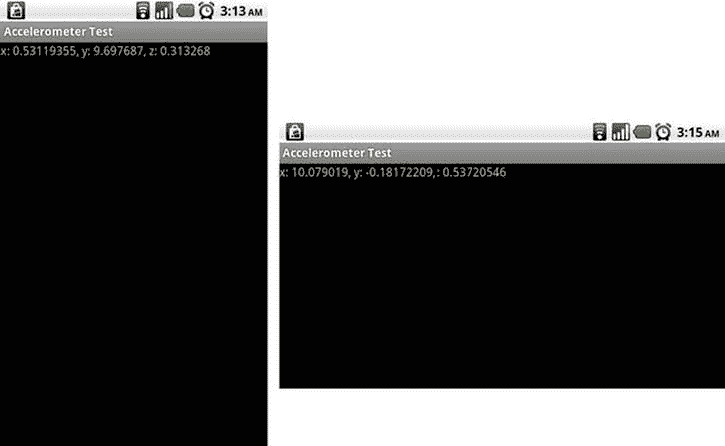

图 4-9。当设备垂直于地面时，纵向模式(左)和横向模式(右)下的加速度计轴值

Android 加速度计处理的一个问题是加速度计值是相对于设备的默认方向的。这意味着，如果你的游戏只在横向模式下运行，默认方向为纵向模式的设备与默认方向为横向模式的设备的数值相差 90 度！例如，平板电脑就是这种情况。那么，如何应对这种情况呢？使用这个方便的代码片段，您应该已经准备好了:

```java
int screenRotation;
public void onResume() {
        WindowManager windowMgr = (WindowManager)activity.getSystemService(Activity.WINDOW_SERVICE);
                // getOrientation() is deprecated in Android 8 but is the same as getRotation(), which is the rotation from the natural orientation of the device
        screenRotation = windowMgr.getDefaultDisplay().getOrientation();
}
static final int *ACCELEROMETER*_*AXIS*_*SWAP*[][] = {
    {1, -1, 0, 1}, // ROTATION_0
    {-1, -1, 1, 0}, // ROTATION_90
    {-1, 1, 0, 1}, // ROTATION_180
    {1, 1, 1, 0}}; // ROTATION_270
public void onSensorChanged(SensorEvent event) {
    final int [] as =*ACCELEROMETER*_*AXIS*_*SWAP*[screenRotation];
    float screenX = (float )as[0] * event.values[as[2]];
    float screenY = (float )as[1] * event.values[as[3]];
    float screenZ = event.values[2];
    // use screenX, screenY, and screenZ as your accelerometer values now!
}
```

下面是一些关于加速度计的结束语:

*   正如您在图 4-9 右侧的截图中看到的，加速度计值有时可能会超出其指定范围。这是由于传感器中的小误差造成的，因此如果您需要这些值尽可能精确，就必须进行调整。
*   无论您的活动方向如何，加速度计轴总是以相同的顺序报告。
*   应用开发人员负责根据设备的自然方向旋转加速度计值。

读取指南针状态

除了加速度计之外的读数传感器，例如指南针，也非常相似。事实上，它是如此的相似，以至于你可以简单地替换 Sensor 的所有实例。*在清单 4-6 中输入* _ *加速度计*和传感器。*输入* _ *方向*并重新运行测试，将我们的加速计测试代码用作指南针测试！

现在，您将看到您的 x、y 和 z 值正在做一些非常不同的事情。如果您将设备平放，屏幕朝上并与地面平行，x 将读取指南针指向的度数，y 和 z 应该接近 0。现在将设备倾斜，看看这些数字是如何变化的。x 应该仍然是主航向(方位角)，但是 y 和 z 应该分别显示设备的俯仰和滚动。因为 TYPE_ORIENTATION 的常数已被否决，所以您也可以通过调用 sensor manager . get ORIENTATION(float[]R，float[] values)来接收相同的指南针数据，其中 R 是旋转矩阵(请参见 sensor manager . getrotationmatrix())，values 保存三个返回值，这次以弧度为单位。

至此，我们已经讨论了游戏开发所需的 Android API 的所有与输入处理相关的类。

**注意**顾名思义，SensorManager 类也允许您访问其他传感器。这包括指南针和光传感器。如果你想有创意，你可以想出一个使用这些传感器的游戏创意。处理事件的方式与我们处理加速度计数据的方式类似。Android 开发者网站上的文档会给你更多的信息。

文件处理

Android 为我们提供了几种读写文件的方法。在这一节中，我们将了解素材、如何访问外部存储(大部分实现为 SD 卡)和共享首选项，它们的作用就像一个持久的哈希表。先说素材。

阅读素材

在第二章中，我们简单看了一下一个 Android 项目的所有文件夹。我们将 assets/和 res/ folders 标识为我们可以放置文件的地方，这些文件应该与我们的应用一起分发。当我们讨论 manifest 文件时，我们声明我们不打算使用 res/ folder，因为它意味着对我们如何构造文件集的限制。素材/目录是放置我们所有文件的地方，无论我们想要什么文件夹层次结构。

assets/ folder 中的文件通过一个名为 AssetManager 的类公开。对于我们的应用，我们可以获得对该管理器的引用，如下所示:

```java
AssetManager assetManager = context.getAssets();
```

我们已经看到了上下文接口；它由 Activity 类实现。在现实生活中，我们会从活动中获取素材管理器。

一旦我们有了素材管理器，我们就可以开始疯狂地打开文件:

```java
InputStream inputStream = assetManager.open("dir/dir2/filename.txt");
```

这个方法将返回一个普通的 Java InputStream，我们可以用它来读取任何类型的文件。AssetManager.open()方法的唯一参数是相对于素材目录的文件名。在前面的示例中，我们在 assets/文件夹中有两个目录，其中第二个目录(dir2/)是第一个目录(dir/)的子目录。在我们的 Eclipse 项目中，该文件将位于 assets/dir/dir2/中。

让我们编写一个简单的测试活动来检查这个功能。我们希望从名为 texts 的素材/目录的子目录中加载一个名为 myawesometext.txt 的文本文件。文本文件的内容将显示在文本视图中。清单 4-7 显示了这个令人敬畏的活动的来源。

***清单 4-7。****AssetsTest.java，演示如何读取素材文件*

```java
package com.badlogic.androidgames;

import java.io.ByteArrayOutputStream;
import java.io.IOException;
import java.io.InputStream;

import android.app.Activity;
import android.content.res.AssetManager;
import android.os.Bundle;
import android.widget.TextView;

public class AssetsTest extends Activity {
   @Override
   public void onCreate(Bundle savedInstanceState) {
      super .onCreate(savedInstanceState);
      TextView textView = new TextView(this );
      setContentView(textView);

      AssetManager assetManager = getAssets();
      InputStream inputStream = null ;
      try {
          inputStream = assetManager.open("texts/myawesometext.txt");
          String text = loadTextFile(inputStream);
          textView.setText(text);
      }catch (IOException e) {
          textView.setText("Couldn't load file");
      }finally {
          if (inputStream != null )
              try {
                  inputStream.close();
              }catch (IOException e) {
                  textView.setText("Couldn't close file");
              }
      }
   }

    public String loadTextFile(InputStream inputStream)throws IOException {
       ByteArrayOutputStream byteStream = new ByteArrayOutputStream();
       byte [] bytes = new byte [4096];
       int len = 0;
       while ((len = inputStream.read(bytes)) > 0)
          byteStream.write(bytes, 0, len);
       return new String(byteStream.toByteArray(), "UTF8");
   }
}
```

除了发现在 Java 中从 InputStream 加载简单文本相当冗长之外，我们在这里没有看到什么大的意外。我们编写了一个名为 loadTextFile()的小方法，它将从 InputStream 中挤出所有的字节，并以字符串的形式返回这些字节。我们假设文本文件编码为 UTF-8。剩下的只是捕捉和处理各种异常。图 4-10 显示了这个小活动的输出。

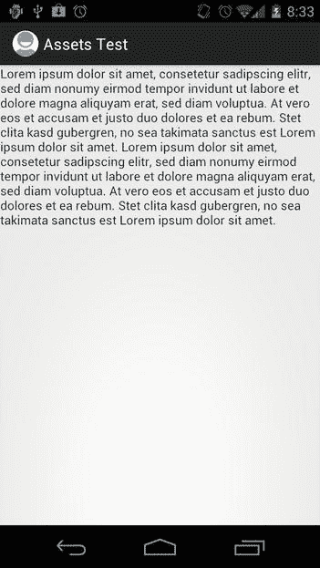

图 4-10。素材测试的文本输出

您应该从本节中删除以下内容:

*   用 Java 从 InputStream 加载文本文件简直是一团糟！通常，我们会用 Apache IOUtils 这样的东西来做。我们会把它留给你自己去完成。
*   我们只能读素材，不能写素材。
*   我们可以很容易地修改 loadTextFile()方法来加载二进制数据。我们只需要返回字节数组而不是字符串。

访问外部存储器

虽然素材对于将我们所有的图像和声音与我们的应用一起传送来说是极好的，但是有时我们需要能够持久存储一些信息并在以后重新加载它。一个常见的例子就是高分。

Android 提供了许多不同的方法，比如使用应用的本地共享首选项，使用小型 SQLite 数据库等等。所有这些选项都有一个共同点:它们不能很好地处理大型二进制文件。我们为什么需要那个？虽然我们可以告诉 Android 将我们的应用安装在外部存储设备上，从而不浪费内部存储的内存，但这只能在 Android 2.2 及更高版本上运行。对于早期版本，我们所有的应用数据都将安装在内部存储中。理论上，我们只能将应用的代码包含在 APK 文件中，并在应用第一次启动时将所有素材文件从服务器下载到 SD 卡中。Android 上很多高配置的游戏都是这么做的。

还有其他一些场景，我们想要访问 SD 卡(在所有当前可用的设备上，sd 卡与术语*外部存储*几乎是同义词)。我们可以允许我们的用户用游戏内编辑器创建他们自己的关卡。我们需要将这些级别存储在某个地方，而 SD 卡正好适合这个目的。

所以，现在我们已经说服你不要使用 Android 提供的花哨机制来存储应用偏好，让我们看看如何在 SD 卡上读写文件。

我们要做的第一件事是请求访问外部存储器的许可。这是在 manifest 文件中用本章前面讨论的<uses-permission>元素完成的。</uses-permission>

接下来，我们必须检查用户的 Android 设备上是否真的有可用的外部存储设备。例如，如果你创建了一个 Android 虚拟设备(AVD ),你可以选择不让它模拟 SD 卡，这样你就不能在你的应用中写入它。无法访问 SD 卡的另一个原因可能是外部存储设备当前正被其他设备使用(例如，用户可能正在通过台式 PC 上的 USB 来浏览它)。下面是我们获取外部存储状态的方法:

```java
String state = Environment.getExternalStorageState();
```

嗯，我们得到了一个字符串。环境类定义了几个常量。其中之一叫做环境。媒体安装。也是字符串。如果前面的方法返回的字符串等于这个常数，我们就拥有对外部存储的完全读/写访问权限。请注意，您必须使用 equals()方法来比较这两个字符串；引用相等并不是在所有情况下都有效。

一旦我们确定我们实际上可以访问外部存储，我们需要获得它的根目录名。如果我们想要访问一个特定的文件，我们需要指定它相对于这个目录的位置。为了获得根目录，我们使用另一个环境静态方法:

```java
File externalDir = Environment.getExternalStorageDirectory();
```

从这里开始，我们可以使用标准的 Java I/O 类来读写文件。

让我们编写一个简单的例子，将文件写入 SD 卡，读取文件，在 TextView 中显示其内容，然后再次从 SD 卡中删除文件。清单 4-8 显示了它的源代码。

***清单 4-8。****externalstragetest 活动*

```java
package com.badlogic.androidgames;

import java.io.BufferedReader;
import java.io.BufferedWriter;
import java.io.File;
import java.io.FileReader;
import java.io.FileWriter;
import java.io.IOException;

import android.app.Activity;
import android.os.Bundle;
import android.os.Environment;
import android.widget.TextView;

public class ExternalStorageTest extends Activity {
   @Override
   public void onCreate(Bundle savedInstanceState) {
      super .onCreate(savedInstanceState);
      TextView textView = new TextView(this );
      setContentView(textView);

      String state = Environment.*getExternalStorageState*();
      if (!state.equals(Environment.*MEDIA*_*MOUNTED*)) {
          textView.setText("No external storage mounted");
      }else {
          File externalDir = Environment.*getExternalStorageDirectory*();
          File textFile = new File(externalDir.getAbsolutePath()
                  + File.*separator*+ "text.txt");
          try {
              writeTextFile(textFile, "This is a test. Roger");
              String text = readTextFile(textFile);
              textView.setText(text);
              if (!textFile.delete()) {
                  textView.setText("Couldn't remove temporary file");
              }
          }catch (IOException e) {
              textView.setText("Something went wrong! " + e.getMessage());
           }
       }
   }

   private void writeTextFile(File file, String text)throws IOException {
      BufferedWriter writer = new BufferedWriter(new FileWriter(file));
      writer.write(text);
      writer.close();
   }

   private String readTextFile(File file)throws IOException {
      BufferedReader reader = new BufferedReader(new FileReader(file));
      StringBuilder text = new StringBuilder();
      String line;
      while ((line = reader.readLine()) != null ) {
          text.append(line);
          text.append("\n");
      }
      reader.close();
      return text.toString();
   }
}
```

首先，我们检查 SD 卡是否已经安装。如果不行，我们就提前退出。接下来，我们获取外部存储目录，并构造一个新的文件实例，它指向我们将在下一条语句中创建的文件。writeTextFile()方法使用标准的 Java I/O 类来施展它的魔法。如果文件还不存在，这个方法将创建它；否则，它将覆盖一个已经存在的文件。在我们成功地将测试文本转储到外部存储设备上的文件之后，我们再次读取它并将其设置为 TextView 的文本。最后一步，我们再次从外部存储器中删除该文件。所有这些都是通过适当的标准安全措施来完成的，这些措施将通过向 TextView 输出错误消息来报告是否出现了问题。图 4-11 显示了活动的输出。

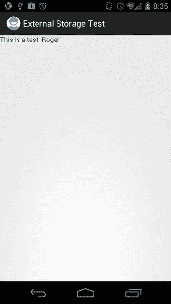

图 4-11。罗杰！

以下是可以从这一部分吸取的经验教训:

*   不要乱动任何不属于你的文件。如果你删除他们上一次度假的照片，你的用户会很生气。
*   务必检查外部存储设备是否已安装。
*   不要弄乱外部存储设备上的任何文件！

因为删除外部存储设备上的所有文件非常容易，所以在从 Google Play 安装下一个请求 SD 卡权限的应用之前，您可能会三思而行。该应用一旦安装，就可以完全控制你的文件。

共享偏好

Android 提供了一个简单的 API 来存储应用的键值对，称为 SharedPreferences。SharedPreferences API 与标准的 Java 属性 API 没有什么不同。一个活动可以有一个默认的 SharedPreferences 实例，也可以根据需要使用多个不同的 SharedPreferences 实例。下面是从活动中获取 SharedPreferences 实例的典型方法:

```java
SharedPreferences prefs = PreferenceManager.*getDefaultSharedPreferences*(this );
```

或者:

```java
SharedPreferences prefs = getPreferences(Context.MODE_PRIVATE);
```

第一个方法给出了一个公共的 SharedPreferences，它将被那个上下文(在我们的例子中是 Activity)共享。第二种方法做同样的事情，但是它让你选择共享偏好的隐私。选项是上下文。MODE_PRIVATE，这是默认的上下文。模式 _ 世界 _ 可读，和上下文。模式 _ 世界 _ 可写。使用上下文之外的任何东西。MODE_PRIVATE 更高级，它对于保存游戏设置之类的事情来说是不必要的。

要使用共享首选项，您首先需要获得编辑器。这是通过

```java
Editor editor = prefs.edit()
```

现在我们可以插入一些值:

```java
editor.putString("key1", "banana");
editor.putInt("key2", 5);
```

最后，当我们想要保存时，我们只需添加

```java
editor.commit();
```

准备好回读了吗？正如人们所料:

```java
String value1 = prefs.getString("key1", null);
int value2 = prefs.getInt("key2", 0);
```

在我们的例子中，值 1 是“香蕉”,值 2 是 5。SharedPreferences 的“get”调用的第二个参数是默认值。如果在偏好设置中找不到密钥，将使用这些选项。例如，如果从未设置“key1”，那么在 getString 调用后，value1 将为 null。SharedPreferences 非常简单，我们实际上不需要任何测试代码来演示。只要记住总是提交这些编辑！

音频编程

Android 提供了几个易于使用的 API 来播放音效和音乐文件——正好满足我们的游戏编程需求。我们来看看那些 API。

设置音量控制

如果你有一个 Android 设备，你会注意到当你按下音量调高和调低按钮时，你会根据你当前使用的应用来控制不同的音量设置。在通话中，您可以控制传入语音流的音量。在 YouTube 应用中，您可以控制视频音频的音量。在主屏幕上，您可以控制系统声音的音量，如铃声或收到的即时消息。

Android 有不同用途的不同音频流。当我们在游戏中回放音频时，我们使用将音效和音乐输出到一个特定流的类，这个特定流称为*音乐流*。在我们考虑播放音效或音乐之前，我们首先必须确保音量按钮将控制正确的音频流。为此，我们使用上下文接口的另一种方法:

```java
context.setVolumeControlStream(AudioManager.STREAM_MUSIC);
```

一如既往，我们选择的上下文实现将是我们的活动。这次通话后，音量按钮将控制音乐流，我们稍后将向其中输出音效和音乐。我们只需要在活动生命周期中调用这个方法一次。Activity.onCreate()方法是实现这一点的最佳方法。

编写一个只包含一行代码的示例有点矫枉过正。因此，我们将在这一点上避免这样做。只要记住在所有输出声音的活动中使用这种方法。

播放声音效果

在第三章中，我们讨论了流媒体音乐和回放音效的区别。后者存储在内存中，通常不会超过几秒钟。Android 为我们提供了一个名为 SoundPool 的类，使得播放音效变得非常容易。

我们可以简单地实例化新的 SoundPool 实例，如下所示:

```java
SoundPool soundPool = new SoundPool(20, AudioManager.STREAM_MUSIC, 0);
```

第一个参数定义了我们可以同时播放的声音效果的最大数量。这并不意味着我们不能加载更多的音效；它只是限制了可以同时播放的音效数量。第二个参数定义 SoundPool 输出音频的音频流。我们选择的音乐流也设置了音量控制。最后一个参数目前没有使用，应该默认为 0。

要将声音效果从音频文件加载到堆内存中，我们可以使用 SoundPool.load()方法。我们将所有文件存储在 assets/ directory 中，因此需要使用重载的 SoundPool.load()方法，该方法采用 AssetFileDescriptor。我们如何获得 AssetFileDescriptor？很简单——通过我们之前合作过的素材管理器。下面是我们如何通过 SoundPool 从 assets/ directory 加载名为 explosion.ogg 的 OGG 文件:

```java
AssetFileDescriptor descriptor = assetManager.openFd("explosion.ogg");
int explosionId = soundPool.load(descriptor, 1);
```

通过 AssetManager.openFd()方法可以直接获得 AssetFileDescriptor。通过 SoundPool 加载音效也同样简单。SoundPool.load()方法的第一个参数是我们的 AssetFileDescriptor，第二个参数指定声音效果的优先级。目前不使用，为了将来的兼容性，应该设置为 1。

SoundPool.load()方法返回一个整数，作为加载的声音效果的句柄。当我们想要播放声音效果时，我们指定这个句柄，以便 SoundPool 知道要播放什么效果。

播放声音效果也很容易:

```java
soundPool.play(explosionId, 1.0f, 1.0f, 0, 0, 1);
```

第一个参数是我们从 SoundPool.load()方法收到的句柄。接下来的两个参数指定用于左右声道的音量。这些值应该在 0(无声)和 1(耳朵爆炸)之间的范围内。

接下来是两个我们很少用到的论点。第一个是优先级，目前没有使用，应该设置为 0。另一个参数指定声音效果循环的频率。不推荐循环音效，所以这里一般应该用 0。最后一个参数是回放速率。将其设置为高于 1 的值将允许声音效果以比录制时更快的速度回放，而将其设置为低于 1 的值将导致回放速度变慢。

当我们不再需要声音效果并希望释放一些内存时，我们可以使用 SoundPool.unload()方法:

```java
soundPool.unload(explosionId);
```

我们只需为音效传递从 SoundPool.load()方法接收的句柄，它将从内存中卸载。

一般来说，我们在游戏中会有一个 SoundPool 实例，我们将根据需要使用它来加载、播放和卸载音效。当我们完成所有的音频输出并且不再需要 SoundPool 时，我们应该总是调用 SoundPool.release()方法，这将释放 SoundPool 通常使用的所有资源。发布之后，你当然不能再使用 SoundPool 了。此外，该 SoundPool 加载的所有声音效果都将消失。

让我们编写一个简单的测试活动，它将在我们每次点击屏幕时播放爆炸声音效果。我们已经知道了实现这个需要知道的一切，所以清单 4-9 应该不会有什么大的惊喜。

***清单 4-9。*【SoundPoolTest.java】***；播放音效*

```java
package com.badlogic.androidgames;

import java.io.IOException;

import android.app.Activity;
import android.content.res.AssetFileDescriptor;
import android.content.res.AssetManager;
import android.media.AudioManager;
import android.media.SoundPool;
import android.os.Bundle;
import android.view.MotionEvent;
import android.view.View;
import android.view.View.OnTouchListener;
import android.widget.TextView;

public class SoundPoolTest extends Activity implements OnTouchListener {
    SoundPool soundPool;
    int explosionId = -1;

    @Override
    public void onCreate(Bundle savedInstanceState) {
        super .onCreate(savedInstanceState);
        TextView textView = new TextView(this );
        textView.setOnTouchListener(this );
        setContentView(textView);

        setVolumeControlStream(AudioManager.*STREAM*_*MUSIC*);
        soundPool = new SoundPool(20, AudioManager.*STREAM*_*MUSIC*, 0);

        try {
            AssetManager assetManager = getAssets();
            AssetFileDescriptor descriptor = assetManager
                    .openFd("explosion.ogg");
            explosionId = soundPool.load(descriptor, 1);
        }catch (IOException e) {
            textView.setText("Couldn't load sound effect from asset, "
                    + e.getMessage());
        }
    }

    public boolean onTouch(View v, MotionEvent event) {
        if (event.getAction() == MotionEvent.*ACTION*_*UP*) {
            if (explosionId != -1) {
                soundPool.play(explosionId, 1, 1, 0, 0, 1);
            }
        }
        return true ;
    }
}
```

我们首先从 Activity 派生出我们的类，并让它实现 OnTouchListener 接口，这样我们以后就可以处理屏幕上的点击。我们的类有两个成员:SoundPool 和我们将要加载和播放的音效句柄。我们最初将其设置为–1，表示音效尚未加载。

在 onCreate()方法中，我们做了以前做过几次的事情:创建一个 TextView，将活动注册为 OnTouchListener，并将 TextView 设置为内容视图。

下一行设置音量控制来控制音乐流，如前所述。然后我们创建 SoundPool，并对其进行配置，使其可以同时播放 20 种效果。这对大多数游戏来说应该足够了。

最后，我们从 AssetManager 获得一个放在 assets/目录中的 explosion.ogg 文件的 AssetFileDescriptor。要加载声音，我们只需将描述符传递给 SoundPool.load()方法并存储返回的句柄。SoundPool.load()方法会在加载过程中出现问题时抛出异常，在这种情况下，我们会捕捉到异常并显示一条错误消息。

在 onTouch()方法中，我们简单地检查手指是否抬起，这表示屏幕被点击。如果是这种情况，并且爆炸声音效果被成功加载(由句柄不为–1 指示)，我们简单地回放该声音效果。

当你执行这个小活动时，只需轻触屏幕就能让世界爆炸。如果您快速连续触摸屏幕，您会注意到声音效果会以重叠的方式播放多次。很难超过我们在 SoundPool 中配置的最大播放次数 20 次。但是，如果发生这种情况，当前播放的声音之一将被停止，以便为新请求的播放腾出空间。

请注意，在前面的示例中，我们没有卸载声音或释放 SoundPool。这是为了简洁。通常，当活动将要被销毁时，您会在 onPause()方法中释放 SoundPool。只要记住总是释放或卸载任何你不再需要的东西。

虽然 SoundPool 类非常容易使用，但是有几个注意事项您应该记住:

*   SoundPool.load()方法异步执行实际加载。这意味着在使用该声音效果调用 SoundPool.play()方法之前，您必须等待片刻，因为加载可能尚未完成。遗憾的是，没有办法检查音效何时加载完毕。这只有 SoundPool 的 SDK 版本 8 才有可能，我们希望支持所有 Android 版本。通常这没什么大不了的，因为在第一次播放声音效果之前，您很可能会加载其他资源。
*   众所周知，SoundPool 在 MP3 文件和长声音文件方面存在问题，其中 *long* 被定义为“长于 5 到 6 秒”这两个问题都是没有记载的，所以没有严格的规则来决定你的音效会不会麻烦。一般来说，我们建议坚持使用 OGG 的音频文件，而不是 MP3，并在音频质量变差之前，尝试尽可能低的采样率和持续时间。

**注意**和我们讨论的任何 API 一样，SoundPool 中有更多的功能。我们简单地告诉过你，你可以循环音效。为此，您可以从 SoundPool.play()方法获得一个 ID，用于暂停或停止循环音效。如果您需要 SoundPool 的功能，请查看 Android 开发者网站上的 sound pool 文档。

流媒体音乐

小的音效适合 Android 应用从操作系统获得的有限堆内存。包含较长音乐片段的较大音频文件不适合。出于这个原因，我们需要将音乐流式传输到音频硬件，这意味着我们一次只能读取一小部分，足以将其解码为原始 PCM 数据并将其发送到音频芯片。

听起来很吓人。幸运的是，有 MediaPlayer 类，它为我们处理所有的事务。我们需要做的就是把它指向音频文件，告诉它回放。

实例化 MediaPlayer 类很简单:

```java
MediaPlayer mediaPlayer = new MediaPlayer();
```

接下来，我们需要告诉 MediaPlayer 播放什么文件。这也是通过 AssetFileDescriptor 完成的:

```java
AssetFileDescriptor descriptor = assetManager.openFd("music.ogg");
mediaPlayer.setDataSource(descriptor.getFileDescriptor(), descriptor.getStartOffset(), descriptor.getLength());
```

这比 SoundPool 的情况要复杂一些。MediaPlayer.setDataSource()方法不直接采用 AssetFileDescriptor。相反，它需要一个 FileDescriptor，我们通过 asset file descriptor . getfile descriptor()方法获得它。此外，我们必须指定音频文件的偏移量和长度。为什么要抵消？实际上，所有素材都存储在一个文件中。为了让 MediaPlayer 到达文件的开头，我们必须向它提供文件在包含的素材文件中的偏移量。

在开始播放音乐文件之前，我们必须再调用一个方法来准备 MediaPlayer 进行播放:

```java
mediaPlayer.prepare();
```

这将实际打开该文件，并检查它是否可以被 MediaPlayer 实例读取和回放。从这里开始，我们可以自由播放音频文件，暂停，停止，设置为循环播放，并改变音量。

要开始回放，我们只需调用以下方法:

```java
mediaPlayer.start();
```

请注意，只有在成功调用 MediaPlayer.prepare()方法之后，才能调用该方法(如果它抛出运行时异常，您会注意到)。

我们可以通过调用 pause()方法来暂停回放:

```java
mediaPlayer.pause();
```

同样，只有当我们已经成功准备好 MediaPlayer 并开始播放时，调用此方法才有效。要恢复暂停的 MediaPlayer，我们可以再次调用 MediaPlayer.start()方法，无需任何准备。

要停止回放，我们调用下面的方法:

```java
mediaPlayer.stop();
```

注意，当我们想要启动一个停止的 MediaPlayer 时，我们首先必须再次调用 MediaPlayer.prepare()方法。

我们可以使用以下方法设置 MediaPlayer 循环播放:

```java
mediaPlayer.setLooping(true);
```

要调节音乐播放的音量，我们可以用这个方法:

```java
mediaPlayer.setVolume(1, 1);
```

这将设置左右声道的音量。文档没有指定这两个参数必须在什么范围内。根据实验，有效范围似乎在 0 和 1 之间。

最后，我们需要一种方法来检查回放是否已经完成。我们可以用两种方法做到这一点。首先，我们可以向 MediaPlayer 注册一个 OnCompletionListener，它将在回放完成时被调用:

```java
mediaPlayer.setOnCompletionListener(listener);
```

如果我们想要轮询 MediaPlayer 的状态，我们可以使用以下方法:

```java
boolean isPlaying = mediaPlayer.isPlaying();
```

请注意，如果 MediaPlayer 设置为循环，前面的方法都不会指示 MediaPlayer 已经停止。

最后，如果我们完成了 MediaPlayer 实例，我们通过调用以下方法来确保它占用的所有资源都被释放:

```java
mediaPlayer.release();
```

在丢弃实例之前总是这样做被认为是一种好的做法。

如果我们没有将 MediaPlayer 设置为循环播放，并且播放已经完成，我们可以通过再次调用 MediaPlayer.prepare()和 MediaPlayer.start()方法来重新启动 MediaPlayer。

这些方法中的大部分都是异步工作的，所以即使您调用了 MediaPlayer.stop()，MediaPlayer.isPlaying()方法也可能在此后的一小段时间内返回。我们通常不担心这个。在大多数游戏中，我们将 MediaPlayer 设置为循环播放，然后在需要时停止播放(例如，当我们切换到不同的屏幕播放其他音乐时)。

让我们编写一个小的测试活动，其中我们以循环模式从素材/目录中回放一个声音文件。这种声音效果将根据活动的生命周期暂停和恢复，当我们的活动暂停时，音乐也应该暂停，当活动恢复时，音乐播放应该从它停止的地方继续。清单 4-10 展示了这是如何做到的。

***清单 4-10。*【MediaPlayerTest.java】***；播放音频流*

```java
package com.badlogic.androidgames;

import java.io.IOException;

import android.app.Activity;
import android.content.res.AssetFileDescriptor;
import android.content.res.AssetManager;
import android.media.AudioManager;
import android.media.MediaPlayer;
import android.os.Bundle;
import android.widget.TextView;

public class MediaPlayerTest extends Activity {
    MediaPlayer mediaPlayer;

    @Override
    public void onCreate(Bundle savedInstanceState) {
        super .onCreate(savedInstanceState);
        TextView textView = new TextView(this );
        setContentView(textView);

        setVolumeControlStream(AudioManager.*STREAM*_*MUSIC*);
        mediaPlayer = new MediaPlayer();
        try {
            AssetManager assetManager = getAssets();
            AssetFileDescriptor descriptor = assetManager.openFd("music.ogg");
            mediaPlayer.setDataSource(descriptor.getFileDescriptor(),
                    descriptor.getStartOffset(), descriptor.getLength());
            mediaPlayer.prepare();
            mediaPlayer.setLooping(true );
        }catch (IOException e) {
            textView.setText("Couldn't load music file, " + e.getMessage());
            mediaPlayer = null ;
        }
    }

    @Override
    protected void onResume() {
        super .onResume();
        if (mediaPlayer != null ) {
            mediaPlayer.start();
        }
    }

    protected void onPause() {
        super .onPause();
        if (mediaPlayer != null ) {
            mediaPlayer.pause();
            if (isFinishing()) {
                mediaPlayer.stop();
                mediaPlayer.release();
            }
        }
    }
}
```

我们以活动成员的形式保留对 MediaPlayer 的引用。在 onCreate()方法中，我们只是像往常一样创建一个 TextView 来输出任何错误消息。

在我们开始使用 MediaPlayer 之前，我们要确保音量控制确实能控制音乐流。设置好之后，我们实例化 MediaPlayer。我们从 AssetManager 中为位于 assets/ directory 中的一个名为 music.ogg 的文件获取 AssetFileDescriptor，并将其设置为 MediaPlayer 的数据源。剩下要做的就是准备 MediaPlayer 实例，并将其设置为循环流。为了防止出错，我们将 MediaPlayer 成员设置为 null，这样我们可以在以后确定加载是否成功。此外，我们向 TextView 输出一些错误文本。

在 onResume()方法中，我们只需启动 MediaPlayer(如果创建成功的话)。onResume()方法是实现这一点的最佳位置，因为它是在 onCreate()和 onPause()之后调用的。第一种情况，它会第一次开始播放；在第二种情况下，它将简单地恢复暂停的 MediaPlayer。

onResume()方法暂停 MediaPlayer。如果活动将被终止，我们停止媒体播放器，然后释放它的所有资源。

如果你在玩这个，确保你也测试了它对暂停和恢复活动的反应，通过锁定屏幕或者暂时切换到主屏幕。恢复播放时，MediaPlayer 将从暂停时停止的地方继续播放。

以下是一些需要记住的事情:

*   方法 MediaPlayer.start()、MediaPlayer.pause()和 MediaPlayer.resume()只能在特定的状态下调用，就像刚才讨论的那样。当你还没有准备好媒体播放器的时候，千万不要打电话给他们。仅在准备好 MediaPlayer 之后，或者在通过调用 MediaPlayer.pause()显式暂停 MediaPlayer 之后想要恢复 MediaPlayer 时，才调用 MediaPlayer.start()。
*   MediaPlayer 实例相当重量级。将它们实例化会占用大量的资源。我们应该总是尝试只有一个音乐播放。SoundPool 类可以更好地处理声音效果。
*   记得设置音量控制来处理音乐流，否则你的玩家将无法调整游戏的音量。

我们几乎完成了这一章，但是一个大的主题仍然摆在我们面前:2D 图形。

基本图形编程

Android 为我们提供了两个大的在屏幕上绘图的 API。一个主要用于简单的 2D 图形编程，另一个用于硬件加速的 3D 图形编程。这一章和下一章将集中讨论用 Canvas API 进行 2D 图形编程，Canvas API 是 Skia 库的一个很好的包装器，适用于中等复杂的 2D 图形。从第七章开始，我们将研究用 OpenGL 渲染 2D 和 3D 图形。在此之前，我们首先需要讨论两件事:唤醒锁和全屏。

使用唤醒锁

如果你把我们写的测试放在一边几秒钟，你的手机屏幕就会变暗。只有当你触摸屏幕或按下按钮时，屏幕才会恢复到最大亮度。为了让我们的屏幕一直保持清醒，我们可以使用*唤醒锁*。

我们需要做的第一件事是在 manifest 文件中添加一个名为 android.permission.WAKE_LOCK 的适当的<uses-permission>标记。这将允许我们使用 WakeLock 类。</uses-permission>

我们可以从 PowerManager 中获得一个 WakeLock 实例，如下所示:

```java
PowerManager powerManager = (PowerManager)context.getSystemService(Context.POWER_SERVICE);
WakeLock wakeLock = powerManager.newWakeLock(PowerManager.FULL_WAKE_LOCK, "My Lock");
```

像所有其他系统服务一样，我们从上下文实例中获取 PowerManager。PowerManager.newWakeLock()方法有两个参数:锁的类型和一个我们可以自由定义的标记。有几种不同的唤醒锁类型；出于我们的目的，电源管理器。完整 _ 唤醒 _ 锁定类型是正确的类型。它将确保屏幕将保持打开，CPU 将全速工作，键盘将保持启用。

要启用唤醒锁，我们必须调用它的 acquire()方法:

```java
wakeLock.acquire();
```

从这一点开始，无论多长时间没有用户交互，手机都将保持唤醒状态。当我们的应用暂停或被破坏时，我们必须再次禁用或释放唤醒锁:

```java
wakeLock.release();
```

通常我们在 Activity.onCreate()方法上实例化 WakeLock 实例，在 Activity.onResume()方法中调用 WakeLock.acquire()，在 Activity.onPause()方法中调用 WakeLock.release()方法。这样，我们保证我们的应用在被暂停或恢复的情况下仍然表现良好。因为只有四行代码要添加，所以我们不打算写一个完整的例子。相反，我们建议您只需将代码添加到下一节的全屏示例中，并观察效果。

全屏显示

在我们开始用 Android APIs 绘制我们的第一批图形之前，让我们先解决一些别的问题。到目前为止，我们所有的活动都显示了标题栏。通知栏也是可见的。我们想通过去掉这些来让我们的玩家更加沉浸其中。我们可以通过两个简单的调用来实现:

```java
requestWindowFeature(Window.FEATURE_NO_TITLE);
getWindow().setFlags(WindowManager.LayoutParams.FLAG_FULLSCREEN, WindowManager.LayoutParams.FLAG_FULLSCREEN);
```

第一个调用去掉了活动的标题栏。为了让活动全屏显示，从而消除通知栏，我们调用第二个方法。注意，我们必须在设置活动的内容视图之前调用这些方法。

清单 4-11 显示了一个非常简单的测试活动，演示了如何全屏显示。

***清单 4-11。*【FullScreenTest.java】***；让我们的活动全屏进行*

```java
package com.badlogic.androidgames;

import android.os.Bundle;
import android.view.Window;
import android.view.WindowManager;

public class FullScreenTest extends SingleTouchTest {

    @Override
    public void onCreate(Bundle savedInstanceState) {
        requestWindowFeature(Window.*FEATURE*_*NO*_*TITLE*);
        getWindow().setFlags(WindowManager.LayoutParams.*FLAG*_*FULLSCREEN*,
                WindowManager.LayoutParams.*FLAG*_*FULLSCREEN*);
        super .onCreate(savedInstanceState);
    }
}
```

这里发生了什么事？我们简单地从前面创建的 TouchTest 类派生并覆盖 onCreate()方法。在 onCreate()方法中，我们启用全屏模式，然后调用超类的 onCreate()方法(在本例中，是 TouchTest 活动)，这将设置所有其余的活动。再次注意，我们必须在设置内容视图之前调用这两个方法。因此，在我们执行这两个方法之后，超类 onCreate()方法被调用。

我们还在清单文件中将活动的方向固定为纵向模式。您没有忘记在我们编写的每个测试的清单文件中添加<activity>元素，对吗？从现在开始，我们将总是把它固定为纵向模式或横向模式，因为我们不希望坐标系一直在变化。</activity>

通过从 TouchTest 派生，我们有了一个完全可用的示例，现在我们可以用它来探索我们将要绘制的坐标系。该活动将显示您触摸屏幕的坐标，就像在旧的 TouchTest 示例中一样。这次不同的是，我们是全屏的，这意味着我们触摸事件的最大坐标等于屏幕分辨率(每个维度减一，因为我们从[0，0]开始)。对于 Nexus One，在纵向模式下，坐标系将跨越坐标(0，0)到(479，799)(总共 480×800 像素)。

虽然看起来屏幕是连续重绘的，但实际上不是。请记住，在我们的 TouchTest 类中，每次处理触摸事件时，我们都会更新 TextView。这反过来会使 TextView 重绘自身。如果我们不触摸屏幕，文本视图不会自己重绘。对于一个游戏，我们需要尽可能频繁地重绘屏幕，最好是在我们的主循环线程中。我们将从简单开始，从 UI 线程中的连续呈现开始。

UI 线程中的连续呈现

到目前为止，我们所做的只是在需要时设置 TextView 的文本。实际的渲染是由 TextView 本身执行的。让我们创建自己的自定义视图，它的唯一目的是让我们在屏幕上绘制内容。我们还希望它尽可能经常地重画自己，并且我们希望在那个神秘的重画方法中有一个简单的方法来执行我们自己的绘制。

虽然这听起来可能很复杂，但实际上 Android 让我们很容易就能创建这样的东西。我们所要做的就是创建一个从 View 类派生的类，并覆盖一个名为 View.onDraw()的方法。每当 Android 系统需要我们的视图重绘自己时，它都会调用这个方法。这可能是这样的:

```java
class RenderView extends View {
    public RenderView(Context context) {
        super (context);
    }

    protected void onDraw(Canvas canvas) {
        // to be implemented
    }
}
```

不完全是火箭科学，是吗？我们将一个名为 Canvas 的类的实例传递给 onDraw()方法。这将是我们在下面几节中的主要工作。它允许我们将形状和位图绘制到另一个位图或视图(或表面，我们稍后会谈到)。

我们可以像使用 TextView 一样使用这个 RenderView。我们只是将它设置为活动的内容视图，并连接我们需要的任何输入侦听器。然而，它还不是那么有用，有两个原因:它实际上并不绘制任何东西，即使它能够绘制某些东西，它也只会在需要重绘活动时才会这样做(也就是说，当它被创建或恢复时，或者当一个与它重叠的对话框变得不可见时)。怎么才能让它自己重画？

简单，像这样:

```java
protected void onDraw(Canvas canvas) {
    // all drawing goes here
    invalidate();
}
```

onDraw()末尾对 View.invalidate()方法的调用将告诉 Android 系统一旦找到时间就重新绘制 RenderView。所有这些仍然发生在 UI 线程上，这有点像一匹懒马。然而，我们实际上用 onDraw()方法进行了连续渲染，尽管连续渲染相对较慢。我们稍后会解决这个问题；目前，它足以满足我们的需求。

那么，让我们回到神秘的画布类。这是一个非常强大的类，它封装了一个名为 Skia 的自定义低级图形库，专门用于在 CPU 上执行 2D 渲染。Canvas 类为我们提供了许多绘制各种形状、位图甚至文本的方法。

绘制方法绘制到哪里？那得看情况。画布可以呈现为位图实例；位图是由 Android 的 2D API 提供的另一个类，我们将在本章后面研究它。在这种情况下，它绘制到视图在屏幕上占据的区域。当然，这是一种疯狂的过度简化。在底层，它不会直接绘制到屏幕上，而是绘制到某种位图上，系统稍后会将该位图与活动的所有其他视图的位图结合使用，以合成最终的输出图像。然后，该图像将被移交给 GPU，GPU 将通过另一组神秘的路径将其显示在屏幕上。

我们真的不需要关心细节。从我们的角度来看，我们的视图似乎延伸到整个屏幕，所以它也可能是绘制到系统的帧缓冲区。在接下来的讨论中，我们将假设我们直接绘制到 framebuffer，系统为我们做所有漂亮的事情，如垂直回扫和双缓冲。

只要系统允许，就会调用 onDraw()方法。对我们来说，它非常类似于我们理论游戏主循环的主体。如果我们要用这个方法实现一个游戏，我们要把所有的游戏逻辑都放在这个方法中。出于各种原因，我们不会这样做，性能是其中之一。

所以让我们做一些有趣的事情。每次访问新的绘图 API 时，编写一个小测试来检查屏幕是否真的频繁重绘。有点像穷人的灯光秀。在每次调用 redraw 方法时，您需要做的就是用一种新的随机颜色填充屏幕。这样，您只需要找到允许您填充屏幕的那个 API 的方法，而不需要了解很多细节。让我们用我们自己的自定义 RenderView 实现来编写这样一个测试。

画布用特定颜色填充其呈现目标的方法称为 Canvas.drawRGB():

```java
Canvas.drawRGB(int r, int g, int b);
```

r、g 和 b 参数分别代表我们将用来填充“屏幕”的颜色的一个分量。它们中的每一个都必须在 0 到 255 的范围内，所以我们实际上在这里指定了 RGB888 格式的颜色。如果你不记得关于颜色的细节，再看一下第三章的“数字编码颜色”一节，因为我们将在本章的其余部分使用这些信息。

清单 4-12 显示了我们的小灯光秀的代码。

`Caution` Running this code will rapidly fill the screen with a random color. If you have epilepsy or are otherwise light-sensitive in any way, don’t run it.

***清单 4-12。****RenderViewTest 活动*

```java
package com.badlogic.androidgames;

import java.util.Random;

import android.app.Activity;
import android.content.Context;
import android.graphics.Canvas;
import android.os.Bundle;
import android.view.View;
import android.view.Window;
import android.view.WindowManager;

public class RenderViewTest extends Activity {
    class RenderView extends View {
        Random rand = new Random();

        public RenderView(Context context) {
            super (context);
        }

        protected void onDraw(Canvas canvas) {
            canvas.drawRGB(rand.nextInt(256), rand.nextInt(256),
                    rand.nextInt(256));
            invalidate();
        }
    }

    @Override
    public void onCreate(Bundle savedInstanceState) {
        super .onCreate(savedInstanceState);
        requestWindowFeature(Window.*FEATURE*_*NO*_*TITLE*);
        getWindow().setFlags(WindowManager.LayoutParams.*FLAG*_*FULLSCREEN*,
                WindowManager.LayoutParams.*FLAG*_*FULLSCREEN*);
        setContentView(new RenderView(this ));
    }
}
```

对于我们的第一个图形演示，这是非常简洁的。我们将 RenderView 类定义为 RenderViewTest 活动的内部类。如前所述，RenderView 类派生自 View 类，具有一个强制构造函数和一个被覆盖的 onDraw()方法。它还有一个 Random 类的实例作为成员；我们将用它来生成我们的随机颜色。

onDraw()方法非常简单。我们首先告诉画布用随机颜色填充整个视图。对于每个颜色分量，我们简单地指定一个 0 到 255 之间的随机数(Random.nextInt()是唯一的)。之后，我们告诉系统我们希望尽快再次调用 onDraw()方法。

活动的 onCreate()方法启用全屏模式，并将 RenderView 类的一个实例设置为内容视图。为了使示例简短，我们现在不考虑唤醒锁。

截取这个例子的截图有点没有意义。它所做的只是在 UI 线程上以系统允许的最快速度用随机颜色填充屏幕。这没什么值得大书特书的。让我们做一些更有趣的事情:画一些形状。

**注意**前面的连续渲染方法可以工作，但是我们强烈建议不要使用它！我们应该在 UI 线程上做尽可能少的工作。一分钟后，我们将使用一个单独的线程来讨论如何正确地做到这一点，稍后我们还可以实现我们的游戏逻辑。

获取屏幕分辨率(和坐标系)

在第二章中，我们讨论了很多关于帧缓冲区及其属性的内容。请记住，帧缓冲区保存了屏幕上显示的像素的颜色。我们可用的像素数是由屏幕分辨率定义的，屏幕分辨率是由屏幕的宽度和高度(以像素为单位)给出的。

现在，使用我们的自定义视图实现，我们实际上并不直接渲染到帧缓冲区。然而，由于我们的视角跨越了整个屏幕，我们可以假装它是这样的。为了知道我们可以在哪里渲染我们的游戏元素，我们需要知道 x 轴和 y 轴上有多少像素，或者屏幕的宽度和高度。

Canvas 类有两个方法为我们提供这些信息:

```java
int width = canvas.getWidth();
int height = canvas.getHeight();
```

这将返回画布呈现的目标的宽度和高度(以像素为单位)。请注意，根据我们活动的方向，宽度可能小于或大于高度。例如，HTC Thunderbolt 在纵向模式下的分辨率为 480×800 像素，因此 Canvas.getWidth()方法将返回 480，Canvas.getHeight()方法将返回 800。在横向模式下，这两个值只是简单地交换:Canvas.getWidth()将返回 800，Canvas.getHeight()将返回 480。

我们需要知道的第二条信息是我们渲染的坐标系统的组织。首先，只有整数像素坐标才有意义(有个概念叫子像素，但我们会忽略)。我们还知道，在纵向模式和横向模式下，坐标系的原点(0，0)总是在显示屏的左上角。正 x 轴总是指向右侧，y 轴总是指向下方。图 4-12 显示了一个分辨率为 48×32 像素的假想屏幕，处于横向模式。

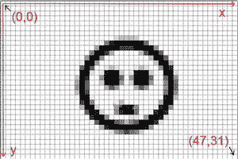

图 4-12。48×32 像素宽屏幕的坐标系

注意图 4-12 中坐标系的原点是如何与屏幕左上角的像素重合的。因此，屏幕左下角的像素不是我们预期的(48，32)，而是(47，31)。通常，(width–1，height–1)总是屏幕右下角像素的位置。

图 4-12 显示了一个横向模式下的假想屏幕坐标系。到现在为止，你应该能够想象在纵向模式下坐标系是什么样子了。

Canvas 的所有绘制方法都是在这种坐标系下操作的。通常，我们可以寻址比 48×32 像素(例如 800×480)更多的像素。也就是说，让我们最后画一些像素、线条、圆形和矩形。

**注意**您可能已经注意到不同的设备可能有不同的屏幕分辨率。我们将在下一章研究这个问题。现在，让我们把注意力集中在最终让我们自己在屏幕上有所作为。

画简单的形状

深入到第四章，我们终于开始绘制我们的第一个像素。我们将快速浏览 Canvas 类提供给我们的一些绘图方法。

绘图像素

我们首先要解决的是如何绘制单个像素。那是用下面的方法完成的:

```java
Canvas.drawPoint(float x, float y, Paint paint);
```

需要立即注意的两件事是，像素的坐标是用 floats 指定的，Canvas 不允许我们直接指定颜色，而是希望我们提供 Paint 类的一个实例。

不要被我们将坐标指定为浮点数的事实所迷惑。Canvas 有一些非常高级的功能，允许我们渲染到非整数坐标，这就是它的来源。不过，我们现在还不需要这个功能；我们将在下一章回到它。

Paint 类保存用于绘制形状、文本和位图的样式和颜色信息。对于绘制形状，我们只对两件事感兴趣:颜料的颜色和风格。既然一个像素并没有真正的风格，那我们就先集中在颜色上。下面是我们如何实例化 Paint 类并设置颜色:

```java
Paint paint = new Paint();
paint.setARGB(alpha, red, green, blue);
```

实例化 Paint 类相当容易。Paint.setARGB()方法也应该很容易破译。每个参数代表颜色的一种颜色成分，范围从 0 到 255。因此，我们在这里指定了 ARGB8888 颜色。

或者，我们可以使用以下方法来设置 Paint 实例的颜色:

```java
Paint.setColor(0xff00ff00);
```

我们向该方法传递一个 32 位整数。它再次编码 ARGB8888 颜色；在这种情况下，它是 alpha 设置为完全不透明的绿色。Color 类定义了一些静态常量，这些常量对一些标准颜色进行编码，比如 Color。红色，彩色。黄色，等等。如果您不想自己指定十六进制值，可以使用这些。

画线

要画一条线，我们可以使用下面的画布方法:

```java
Canvas.drawLine(float startX, float startY, float stopX, float stopY, Paint paint);
```

前两个参数指定线条起点的坐标，接下来的两个参数指定线条终点的坐标，最后一个参数指定 Paint 实例。画出的线将有一个像素厚。如果我们希望线条更粗，我们可以通过设置 Paint 实例的笔画宽度来以像素为单位指定线条的粗细:

```java
Paint.setStrokeWidth(float widthInPixels);
```

绘制矩形

我们也可以用下面的画布方法画矩形:

```java
Canvas.drawRect(float topleftX, float topleftY, float bottomRightX, float bottomRightY, Paint paint);
```

前两个参数指定矩形左上角的坐标，后两个参数指定矩形左下角的坐标，而 Paint 指定矩形的颜色和样式。那么我们可以有什么风格，如何设置呢？

要设置 Paint 实例的样式，我们调用以下方法:

```java
Paint.setStyle(Style style);
```

Style 是具有值 Style 的枚举。填充，样式。笔画和风格。填充和描边。如果我们指定风格。填充，矩形将被填充油漆的颜色。如果我们指定风格。STROKE，将只绘制矩形的轮廓，同样使用绘画的颜色和笔画宽度。如果风格。设置 FILL_AND_STROKE，矩形将被填充，轮廓将用给定的颜色和笔画宽度绘制。

画圆

画圆可以带来更多的乐趣，可以是实心的，也可以是描边的(或者两者都画):

```java
Canvas.drawCircle(float centerX, float centerY, float radius, Paint paint);
```

前两个参数指定圆心的坐标，下一个参数以像素为单位指定半径，最后一个参数也是一个 Paint 实例。与 Canvas.drawRectangle()方法一样，将使用颜料的颜色和样式来绘制圆。

混合

最后一件重要的事情是，所有这些绘制方法都将执行阿尔法混合。只需将颜色的 alpha 指定为 255 (0xff)以外的值，您的像素、线条、矩形和圆形将是半透明的。

把这一切放在一起

让我们编写一个快速测试活动来演示前面的方法。这一次，我们希望你首先分析清单 4-13 中的代码。在纵向模式下，找出 480×800 屏幕上不同形状将被绘制的位置。当进行图形编程时，最重要的是想象你发出的绘图命令将如何表现。这需要一些练习，但真的会有回报。

***清单 4-13。*【ShapeTest.java】***；疯狂画形状*

```java
package com.badlogic.androidgames;

import android.app.Activity;
import android.content.Context;
import android.graphics.Canvas;
import android.graphics.Color;
import android.graphics.Paint;
import android.graphics.Paint.Style;
import android.os.Bundle;
import android.view.View;
import android.view.Window;
import android.view.WindowManager;

public class ShapeTest extends Activity {
    class RenderView extends View {
        Paint paint;
        public RenderView(Context context) {
            super (context);
            paint = new Paint();
        }
        protected void onDraw(Canvas canvas) {
            canvas.drawRGB(255, 255, 255);
            paint.setColor(Color.*RED*);
            canvas.drawLine(0, 0, canvas.getWidth()-1, canvas.getHeight()-1, paint);
            paint.setStyle(Style.*STROKE*);
            paint.setColor(0xff00ff00);
            canvas.drawCircle(canvas.getWidth() / 2, canvas.getHeight() / 2, 40, paint);
            paint.setStyle(Style.*FILL*);
            paint.setColor(0x770000ff);
            canvas.drawRect(100, 100, 200, 200, paint);
            invalidate();
        }
    }
    @Override
    public void onCreate(Bundle savedInstanceState) {
        super .onCreate(savedInstanceState);
        requestWindowFeature(Window.*FEATURE*_*NO*_*TITLE*);
        getWindow().setFlags(WindowManager.LayoutParams.*FLAG*_*FULLSCREEN*,
                             WindowManager.LayoutParams.*FLAG*_*FULLSCREEN*);
        setContentView(new RenderView(this ));
    }
}
```

你已经创造出那个心理图像了吗？那么我们来快速分析一下 RenderView.onDraw()方法。剩下的和上一个例子一样。

我们从用白色填充屏幕开始。接下来，我们从原点到屏幕的右下角画一条线。我们使用一种颜色设置为红色的颜料，所以这条线将是红色的。

接下来，我们稍微修改一下画图，将其样式设置为 style。笔画，其颜色为绿色，其阿尔法值为 255。使用我们刚刚修改的颜料，在屏幕的中心以 40 像素的半径绘制圆。由于绘画的风格，将只绘制圆的轮廓。

最后，我们再次修改油漆。我们把它的风格设定为风格。填充，颜色为全蓝色。请注意，我们这次将 alpha 设置为 0x77，这在十进制中等于 119。这意味着我们在下一次调用时绘制的形状大约有 50%是半透明的。

图 4-13 显示了纵向模式下 480×800 和 320×480 屏幕上测试活动的输出(黑色边框是后来添加的)。

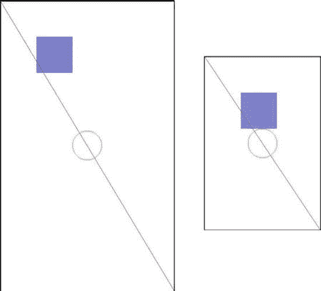

图 4-13。480×800 屏幕(左)和 320×480 屏幕(右)上的 ShapeTest 输出

天啊，这里发生了什么事？这就是我们在不同屏幕分辨率下用绝对坐标和大小渲染得到的结果。两幅图中唯一不变的是红线，它只是从左上角画到右下角。这是以独立于屏幕分辨率的方式完成的。

该矩形位于(100，100)处。根据屏幕分辨率，到屏幕中心的距离会有所不同。矩形的大小为 100×100 像素。在大屏幕上，它比在小屏幕上占用的相对空间要少得多。

圆的位置也是独立于屏幕分辨率的，但它的半径不是。因此，它在较小的屏幕上比在较大的屏幕上占据更多的相对空间。

我们已经看到，处理不同的屏幕分辨率可能会有点问题。当我们考虑不同的物理屏幕尺寸时，情况会变得更糟。然而，我们将在下一章尝试解决这个问题。请记住，屏幕分辨率和物理尺寸很重要。

**注意**画布和绘画课程提供的远不止我们刚刚谈到的内容。事实上，所有标准的 Android 视图都是用这个 API 绘制的，所以你可以想象它背后有更多的东西。像往常一样，查看 Android 开发者网站获取更多信息。

使用位图

虽然用线条或圆形等基本形状制作游戏是可能的，但这并不十分性感。我们希望一个令人敬畏的艺术家为我们创建精灵和背景以及所有的爵士乐，然后我们可以从 PNG 或 JPEG 文件加载。在 Android 上做到这一点极其容易。

加载和检查位图

位图类将成为我们最好的朋友。我们通过使用 BitmapFactory singleton 从文件中加载位图。当我们以素材的形式存储图像时，让我们看看如何从素材/目录中加载图像:

```java
InputStream inputStream = assetManager.open("bob.png");
Bitmap bitmap = BitmapFactory.decodeStream(inputStream);
```

Bitmap 类本身有一些我们感兴趣的方法。首先，我们想知道位图实例的宽度和高度，以像素为单位:

```java
int width = bitmap.getWidth();
int height = bitmap.getHeight();
```

接下来我们可能想知道位图实例的颜色格式:

```java
Bitmap.Config config = bitmap.getConfig();
```

位图。Config 是具有以下值的枚举:

*   配置文件。阿尔法 8 号
*   配置。ARGB_4444
*   配置。ARGB_8888
*   Config.RGB_565

从第三章开始，你应该知道这些值是什么意思。如果没有，我们强烈建议你再读一遍第三章的“数字编码颜色”一节。

有趣的是，没有 RGB888 颜色格式。PNG 仅支持 ARGB8888、RGB888 和托盘化颜色。什么颜色格式将用于加载 RGB888 PNG？BitmapConfig。RGB_565 就是答案。对于我们通过 BitmapFactory 加载的任何 RGB888 PNG，这都会自动发生。原因是大多数 Android 设备的实际帧缓冲区都支持这种颜色格式。加载每像素位深度更高的图像会浪费内存，因为像素无论如何都需要转换为 RGB565 以进行最终渲染。

那么为什么会有配置？ARGB_8888 的配置呢？因为图像合成可以在将最终图像绘制到帧缓冲区之前在 CPU 上完成。在 alpha 组件的情况下，我们也有比 Config 多得多的位深度。ARGB_4444，这可能是一些高质量的图像处理所必需的。

ARGB8888 PNG 图像将加载到带有配置文件的位图中。ARGB_8888 配置。其他两种颜色格式很少使用。然而，我们可以告诉 BitmapFactory 尝试加载一个特定颜色格式的图像，即使它的原始格式是不同的。

```java
InputStream inputStream = assetManager.open("bob.png");
BitmapFactory.Options options = new BitmapFactory.Options();
options.inPreferredConfig = Bitmap.Config.ARGB_4444;
Bitmap bitmap = BitmapFactory.decodeStream(inputStream, null , options);
```

我们使用重载的 BitmapFactory.decodeStream()方法以 BitmapFactory 实例的形式传递提示。图像解码器的选项类。我们可以通过 BitmapFactory 来指定位图实例所需的颜色格式。Options.inPreferredConfig 成员，如前所示。在这个假设的例子中，bob.png 文件将是一个 ARGB8888 PNG，我们希望 BitmapFactory 加载它并将其转换为 ARGB4444 位图。但是，BitmapFactory 可以忽略这个提示。

这将释放该位图实例使用的所有内存。当然，调用此方法后，您不能再使用位图进行渲染。

您也可以使用以下静态方法创建空位图:

```java
Bitmap bitmap = Bitmap.createBitmap(int width, int height, Bitmap.Config config);
```

如果你想自己进行自定义图像合成，这可能会派上用场。Canvas 类也适用于位图:

```java
Canvas canvas = new Canvas(bitmap);
```

然后，您可以像修改视图内容一样修改位图。

处置位图

BitmapFactory 可以帮助我们在加载图像时减少内存占用。位图会占用很多内存，这在第三章中已经讨论过了。通过使用较小的颜色格式来减少每像素的位数是有帮助的，但是如果我们继续一个接一个地加载位图，最终我们会耗尽内存。因此，我们应该通过下面的方法来处理我们不再需要的位图实例:

```java
Bitmap.recycle();
```

绘制位图

一旦我们加载了位图，我们就可以通过画布来绘制它们。最简单的方法如下:

```java
Canvas.drawBitmap(Bitmap bitmap, float topLeftX, float topLeftY, Paint paint);
```

第一个论点应该是显而易见的。参数 topLeftX 和 topLeftY 指定位图左上角在屏幕上的坐标。最后一个参数可以为空。我们可以用 Paint 指定一些非常高级的绘图参数，但是我们并不真的需要这些。

还有另一种方法也会派上用场:

```java
Canvas.drawBitmap(Bitmap bitmap, Rect src, Rect dst, Paint paint);
```

这个方法超级牛逼。它允许我们通过第二个参数指定位图的一部分。Rect 类保存矩形的左上角和右下角坐标。当我们通过 src 指定位图的一部分时，我们是在位图的坐标系中进行的。如果我们指定 null，将使用完整的位图。

第三个参数定义在哪里绘制位图部分，同样以 Rect 实例的形式。这一次，角坐标是在画布目标的坐标系中给出的(无论是视图还是另一个位图)。令人惊讶的是，这两个矩形不一定要一样大。如果我们指定目标矩形比源矩形小，那么画布会自动缩放。当然，如果我们指定一个更大的目标矩形，情况也是如此。我们通常会将最后一个参数再次设置为 null。但是，请注意，这种缩放操作非常昂贵。我们应该只在绝对必要的时候使用它。

因此，您可能会想:如果我们有不同颜色格式的位图实例，在我们可以通过画布绘制它们之前，我们需要将它们转换成某种标准格式吗？答案是否定的。画布会自动为我们做这件事。当然，如果我们使用与本地帧缓冲区格式相同的颜色格式，速度会快一点。通常我们只是忽略这一点。

默认情况下，混合也是启用的，所以如果我们的图像每个像素包含一个 alpha 组件，它实际上是被解释的。

把这一切放在一起

有了所有这些信息，我们最终可以加载和渲染一些 bob。清单 4-14 显示了我们出于演示目的编写的 BitmapTest 活动的源代码。

***清单 4-14。****BitmapTest 活动*

```java
package com.badlogic.androidgames;

import java.io.IOException;
import java.io.InputStream;

import android.app.Activity;
import android.content.Context;
import android.content.res.AssetManager;
import android.graphics.Bitmap;
import android.graphics.BitmapFactory;
import android.graphics.Canvas;
import android.graphics.Rect;
import android.os.Bundle;
import android.util.Log;
import android.view.View;
import android.view.Window;
import android.view.WindowManager;

public class BitmapTest extends Activity {
    class RenderView extends View {
        Bitmap bob565;
        Bitmap bob4444;
        Rect dst = new Rect();
        public RenderView(Context context) {
            super (context);

            try {
                AssetManager assetManager = context.getAssets();
                InputStream inputStream = assetManager.open("bobrgb888.png");
                bob565 = BitmapFactory.*decodeStream*(inputStream);
                inputStream.close();
                Log.*d*("BitmapText",
                        "bobrgb888.png format: " + bob565.getConfig());

                inputStream = assetManager.open("bobargb8888.png");
                BitmapFactory.Options options = new BitmapFactory.Options();
                options.inPreferredConfig = Bitmap.Config.*ARGB*_*4444*;
                bob4444 = BitmapFactory
                        .*decodeStream*(inputStream, null , options);
                inputStream.close();
                Log.*d*("BitmapText",
                        "bobargb8888.png format: " + bob4444.getConfig());

            }catch (IOException e) {
                // silently ignored, bad coder monkey, baaad!
            }finally {
                // we should really close our input streams here.
            }
        }

        protected void onDraw(Canvas canvas) {
            canvas.drawRGB(0, 0, 0);
            dst.set(50, 50, 350, 350);
            canvas.drawBitmap(bob565, null , dst, null );
            canvas.drawBitmap(bob4444, 100, 100, null );
            invalidate();
        }
    }

    @Override
    public void onCreate(Bundle savedInstanceState) {
        super .onCreate(savedInstanceState);
        requestWindowFeature(Window.*FEATURE*_*NO*_*TITLE*);
        getWindow().setFlags(WindowManager.LayoutParams.*FLAG*_*FULLSCREEN*,
                WindowManager.LayoutParams.*FLAG*_*FULLSCREEN*);
        setContentView(new RenderView(this ));
    }
}
```

我们的 activity 的 onCreate()方法是旧的，所以让我们继续我们的自定义视图。它有两个位图成员，一个以 RGB565 格式存储 Bob 的图像(在第三章中介绍过),另一个以 ARGB4444 格式存储 Bob 的图像。我们还有一个 Rect 成员，在那里我们存储了用于呈现的目标矩形。

在 RenderView 类的构造函数中，我们首先将 Bob 加载到视图的 bob565 成员中。请注意，图像是从 RGB888 PNG 文件加载的，BitmapFactory 会自动将其转换为 RGB565 图像。为了证明这一点，我们还输出了位图。将位图配置到 LogCat。Bob 的 RGB888 版本具有不透明的白色背景，因此不需要执行任何混合。

接下来，我们从存储在 assets/ directory 中的 ARGB8888 PNG 文件加载 Bob。为了节省一些内存，我们还告诉 BitmapFactory 将 Bob 的图像转换为 ARGB4444 位图。工厂可能不会遵守这一要求(原因不明)。为了看它对我们是否友好，我们输出了位图。这个位图的配置文件。

onDraw()方法微不足道。我们所做的就是用黑色填充屏幕，绘制缩放到 250×250 像素的 bob565(从他的原始大小 160×183 像素)，并在 bob565 的顶部绘制 bob4444，未缩放但已混合(这是由画布自动完成的)。图 4-14 展示了这两个 bob 的辉煌。


图 4-14。上下重叠的两个 bob(分辨率为 480×800 像素)

LogCat 报告说 bob565 确实有颜色格式配置。RGB_565，bob4444 被转换为 Config。ARGB_4444。位图工厂没有让我们失望！

这里有一些你应该从这一部分学到的东西:

*   使用尽可能少的颜色格式来节省内存。但是，这可能会降低视觉质量和渲染速度。
*   除非绝对必要，否则不要绘制缩放的位图。如果您知道它们的缩放大小，请离线或在加载时预缩放它们。
*   如果不再需要位图，请务必调用 Bitmap.recycle()方法。否则，你会得到一些内存泄漏或运行内存不足。

一直使用 LogCat 进行文本输出有点乏味。让我们看看如何通过画布呈现文本。

**注意**和其他类一样，位图有比我们在这个简短的部分所能描述的更多的东西。我们涵盖了给诺姆先生写信所需的最低限度。如果您想了解更多信息，请查看 Android 开发者网站上的文档。

渲染文本

虽然我们将在 Mr. Nom 游戏中输出的文本将由手工绘制，但了解如何通过 TrueType 字体绘制文本并没有坏处。让我们从从 assets/ directory 加载一个定制的 TrueType 字体文件开始。

加载字体

Android API 为我们提供了一个名为 Typeface 的类，它封装了一种 TrueType 字体。它提供了一个简单的静态方法来从 assets/ directory: 加载这样一个字体文件

```java
Typeface font = Typeface.*createFromAsset*(context.getAssets(), "font.ttf");
```

有趣的是，如果字体文件无法加载，这个方法不会抛出任何异常。相反，会引发 RuntimeException。为什么这个方法没有显式抛出异常是一个谜。

用字体绘制文本

一旦我们有了自己的字体，我们就将它设置为 Paint 实例的字样:

```java
paint.setTypeFace(font);
```

通过 Paint 实例，我们还指定了想要呈现字体的大小:

```java
paint.setTextSize(30);
```

这种方法的文档也很少。它没有告诉我们文本大小是以磅还是像素给出的。我们只是假设后者。

最后，我们可以通过下面的 Canvas 方法用这种字体绘制文本:

```java
canvas.drawText("This is a test!", 100, 100, paint);
```

第一个参数是要绘制的文本。接下来的两个参数是应该绘制文本的坐标。最后一个参数是熟悉的:它是 Paint 实例，指定要绘制的文本的颜色、字体和大小。通过设置绘画的颜色，您还可以设置要绘制的文本的颜色。

文本对齐和边界

现在，您可能想知道前面方法的坐标如何与文本字符串填充的矩形相关联。它们是否指定了包含文本的矩形的左上角？答案有点复杂。Paint 实例有一个名为*对齐设置*的属性。它可以通过画图类的这个方法来设置:

```java
Paint.setTextAlign(Paint.Align align);
```

油漆。Align 枚举有三个值:Paint。对齐。向左，绘画。根据设置的对齐方式，传递给 Canvas.drawText()方法的坐标被解释为矩形的左上角、矩形的中上像素或矩形的右上角。标准对齐方式是 Paint.Align.LEFT。

有时知道特定字符串的边界(以像素为单位)也很有用。为此，Paint 类提供了以下方法:

```java
Paint.getTextBounds(String text, int start, int end, Rect bounds);
```

第一个参数是我们想要得到界限的字符串。第二个和第三个参数指定应该测量的字符串中的开始字符和结束字符。end 参数是排他的。最后一个参数 bounds 是一个 Rect 实例，我们自己分配并传递给方法。该方法会将边框的宽度和高度写入 Rect.right 和 Rect.bottom 字段。为了方便起见，我们可以调用 Rect.width()和 Rect.height()来获得相同的值。

请注意，所有这些方法都只适用于单行文本。如果要渲染多行，就得自己做布局。

把这一切放在一起

说够了:让我们做更多的编码。清单 4-15 展示了文本呈现的实际效果。

***清单 4-15。****font test 活动*

```java
package com.badlogic.androidgames;

import android.app.Activity;
import android.content.Context;
import android.graphics.Canvas;
import android.graphics.Color;
import android.graphics.Paint;
import android.graphics.Rect;
import android.graphics.Typeface;
import android.os.Bundle;
import android.view.View;
import android.view.Window;
import android.view.WindowManager;

public class FontTest extends Activity {
    class RenderView extends View {
        Paint paint;
        Typeface font;
        Rect bounds = new Rect();

        public RenderView(Context context) {
            super (context);
            paint = new Paint();
            font = Typeface.*createFromAsset*(context.getAssets(), "font.ttf");
        }

        protected void onDraw(Canvas canvas) {
            canvas.drawRGB(0, 0, 0);
            paint.setColor(Color.*YELLOW*);
            paint.setTypeface(font);
            paint.setTextSize(28);
            paint.setTextAlign(Paint.Align.*CENTER*);
            canvas.drawText("This is a test!", canvas.getWidth() / 2, 100,
                    paint);

            String text = "This is another test o_O";
            paint.setColor(Color.*WHITE*);
            paint.setTextSize(18);
            paint.setTextAlign(Paint.Align.*LEFT*);
            paint.getTextBounds(text, 0, text.length(), bounds);
            canvas.drawText(text, canvas.getWidth() - bounds.width(), 140,
                    paint);
            invalidate();
        }
    }

    @Override
    public void onCreate(Bundle savedInstanceState) {
        super .onCreate(savedInstanceState);
        requestWindowFeature(Window.*FEATURE*_*NO*_*TITLE*);
        getWindow().setFlags(WindowManager.LayoutParams.*FLAG*_*FULLSCREEN*,
                WindowManager.LayoutParams.*FLAG*_*FULLSCREEN*);
        setContentView(new RenderView(this ));
    }
}
```

我们不会讨论活动的 onCreate()方法，因为我们以前见过它。

我们的 RenderView 实现有三个成员:Paint、Typeface 和 Rect，稍后我们将在其中存储文本字符串的边界。

在构造函数中，我们创建一个新的 Paint 实例，并从 assets/目录中的 font.ttf 文件加载一个字体。

在 onDraw()方法中，我们用黑色清除屏幕，将颜料设置为黄色，设置字体及其大小，并指定在 Canvas.drawText()调用中解释坐标时要使用的文本对齐方式。实际的绘图调用渲染字符串这是一个测试！，在 y 轴上的坐标 100 处水平居中。

对于第二个文本呈现调用，我们做了其他事情:我们希望文本与屏幕的右边缘右对齐。我们可以通过使用油漆来实现。Align.RIGHT 和 canvas . getwidth()–1 的 x 坐标。相反，我们通过使用字符串的边界来练习非常基本的文本布局。我们还改变了颜色和字体的大小。图 4-15 显示了此活动的输出。


图 4-15。文字趣味(480×800 像素分辨率)

Typeface 类的另一个神秘之处是，它没有明确允许我们释放它的所有资源。我们不得不依靠垃圾收集者来为我们做脏活。

**注意**我们在这里仅仅触及了文本渲染的表面。如果你想知道更多。。。现在你知道去哪里找了。

使用表面视图进行连续渲染

这是我们成为真正的男人和女人的部分。它涉及到线程，以及与之相关的所有痛苦。我们会活着度过的。我们保证！

动机

当我们第一次尝试连续渲染时，我们用了错误的方法。霸占 UI 线程是不可接受的；我们需要一个在单独的线程中完成所有脏活的解决方案。进入 SurfaceView。

顾名思义，SurfaceView 类是一个处理 Surface 的视图，这是 Android API 的另一个类。什么是曲面？它是一个原始缓冲区的抽象，由屏幕合成器用来渲染特定的视图。屏幕合成器是 Android 上所有渲染背后的主谋，它最终负责将所有像素推送到 GPU。在某些情况下，可以对表面进行硬件加速。不过，我们并不太关心这个事实。我们只需要知道，这是一种更直接的将事物渲染到屏幕上的方式。

我们的目标是在一个单独的线程中执行渲染，这样我们就不会占用忙于其他事情的 UI 线程。SurfaceView 类为我们提供了一种从一个线程而不是 UI 线程来渲染它的方法。

表面夹具和锁定

为了从一个不同于 UI 线程的线程渲染到 SurfaceView，我们需要获取 SurfaceHolder 类的一个实例，如下:

```java
SurfaceHolder holder = surfaceView.getHolder();
```

SurfaceHolder 是表面的包装器，为我们做一些簿记工作。它为我们提供了两种方法:

```java
Canvas SurfaceHolder.lockCanvas();
SurfaceHolder.unlockAndPost(Canvas canvas);
```

第一种方法锁定表面进行渲染，并返回一个我们可以使用的不错的 Canvas 实例。第二种方法再次解锁表面，并确保我们通过画布绘制的内容显示在屏幕上。我们将在渲染线程中使用这两种方法来获取画布，用它进行渲染，并最终使我们刚刚渲染的图像在屏幕上可见。我们必须传递给 SurfaceHolder.unlockAndPost()方法的画布必须是我们从 SurfaceHolder.lockCanvas()方法收到的画布。

实例化 SurfaceView 时，不会立即创建曲面。相反，它是异步创建的。每次暂停活动时都会破坏该表面，当活动恢复时会重新创建该表面。

表面创建和有效性

只要表面还没有生效，我们就不能从表面持有者那里获得画布。但是，我们可以通过下面的语句检查表面是否已经创建:

```java
boolean isCreated = surfaceHolder.getSurface().isValid();
```

如果这个方法返回 true，我们就可以安全地锁定这个表面，并通过我们收到的画布绘制它。我们必须绝对确保在调用 SurfaceHolder.lockCanvas()后再次解锁 Surface，否则我们的活动可能会锁定手机！

把这一切放在一起

那么，我们如何将所有这些与单独的渲染线程以及活动生命周期集成在一起呢？解决这个问题的最好方法是查看一些实际的代码。清单 4-16 显示了一个完整的例子，它在一个单独的线程中对表面视图进行渲染。

***清单 4-16。****SurfaceViewTest 活动*

```java
package com.badlogic.androidgames;

import android.app.Activity;
import android.content.Context;
import android.graphics.Canvas;
import android.os.Bundle;
import android.view.SurfaceHolder;
import android.view.SurfaceView;
import android.view.Window;
import android.view.WindowManager;

public class SurfaceViewTest extends Activity {
    FastRenderView renderView;
    public void onCreate(Bundle savedInstanceState) {
        super .onCreate(savedInstanceState);
        requestWindowFeature(Window.*FEATURE*_*NO*_*TITLE*);
        getWindow().setFlags(WindowManager.LayoutParams.*FLAG*_*FULLSCREEN*,
                             WindowManager.LayoutParams.*FLAG*_*FULLSCREEN*);
        renderView = new FastRenderView(this );
        setContentView(renderView);
    }
    protected void onResume() {
        super .onResume();
        renderView.resume();
    }
    protected void onPause() {
        super .onPause();
        renderView.pause();
    }
    class FastRenderView extends SurfaceViewimplements Runnable {
        Thread renderThread = null ;
        SurfaceHolder holder;
        volatile boolean running = false ;
        public FastRenderView(Context context) {
            super (context);
            holder = getHolder();
        }

        public void resume() {
            running = true ;
            renderThread = new Thread(this );
            renderThread.start();
        }
        public void run() {
            while (running) {
                if (!holder.getSurface().isValid())
                    continue ;
                Canvas canvas = holder.lockCanvas();
                canvas.drawRGB(255, 0, 0);
                holder.unlockCanvasAndPost(canvas);
            }
        }

        public void pause() {
            running = false ;
            while (true ) {
                try {
                    renderThread.join();
                    return ;
                }catch (InterruptedException e) {
                    // retry
                }
            }
        }
    }
}
```

这看起来没那么吓人，对吧？我们的活动将 FastRenderView 实例作为成员。这是一个自定义的 SurfaceView 子类，将为我们处理所有的线程业务和表面锁定。对于活动来说，它看起来像一个普通的视图。

在 onCreate()方法中，我们启用全屏模式，创建 FastRenderView 实例，并将其设置为活动的内容视图。

这次我们还覆盖了 onResume()方法。在这个方法中，我们将通过调用 FastRenderView.resume()方法间接启动我们的渲染线程，该方法在内部完成所有的工作。这意味着线程将在最初创建活动时启动(因为 onCreate()后面总是跟有对 onResume()的调用)。当活动从暂停状态恢复时，它也会重新启动。

这当然意味着我们必须在某个地方停止线程；否则，我们会在每次调用 onResume()时创建一个新线程。这就是 onPause()的用武之地。它调用 FastRenderView.pause()方法，这将完全停止线程。在线程完全停止之前，该方法不会返回。

所以我们来看看这个例子的核心类:FastRenderView。它类似于我们在前几个例子中实现的 RenderView 类，因为它是从另一个视图类派生的。在这种情况下，我们直接从 SurfaceView 类派生它。它还实现了 Runnable 接口，因此我们可以将它传递给渲染线程，以便它运行渲染线程逻辑。

FastRenderView 类有三个成员。renderThread 成员只是对负责执行渲染线程逻辑的线程实例的引用。holder 成员是对 SurfaceHolder 实例的引用，该实例是从派生它的 SurfaceView 超类中获得的。最后，running 成员是一个简单的布尔标志，我们将使用它来通知渲染线程应该停止执行。volatile 修饰符有一个特殊的含义，我们一会儿会讲到。

我们在构造函数中所做的就是调用超类构造函数，并将对 SurfaceHolder 的引用存储在 Holder 成员中。

接下来是 FastRenderView.resume()方法。它负责启动渲染线程。注意，每次调用这个方法时，我们都会创建一个新线程。这与我们在讨论活动的 onResume()和 onPause()方法时所讨论的一致。我们还将运行标志设置为 true。一会儿你会看到它是如何在渲染线程中使用的。最后要做的是，我们将 FastRenderView 实例本身设置为线程的 Runnable。这将在新线程中执行 FastRenderView 的下一个方法。

FastRenderView.run()方法是我们自定义视图类的核心。它的主体在渲染线程中执行。如您所见，它仅仅由一个循环组成，一旦 running 标志被设置为 false，该循环将停止执行。当这种情况发生时，线程也将停止并死亡。在 while 循环中，我们首先检查表面是否有效。如果是，我们锁定它，渲染它，并再次解锁它，如前所述。在这个例子中，我们简单地用红色填充表面。

FastRenderView.pause()方法看起来有点奇怪。首先，我们将运行标志设置为 false。如果稍微向上看一下，就会看到 FastRenderView.run()方法中的 while 循环最终会因此而终止，从而停止渲染线程。在接下来的几行中，我们只是通过调用 Thread.join()来等待线程完全死亡。此方法将等待线程死亡，但可能会在线程实际死亡之前引发 InterruptedException。因为在从那个方法返回之前，我们必须绝对确定线程是死的，所以我们在一个无限循环中执行 join，直到它成功。

让我们回到运行标志的 volatile 修饰符。我们为什么需要它？原因很微妙:如果编译器发现 FastRenderView.pause()方法中的第一行与 while 块之间没有依赖关系，它可能会决定对该方法中的语句进行重新排序。如果它认为这样做会使代码执行得更快，它是被允许这样做的。然而，我们依赖于在该方法中指定的执行顺序。想象一下，如果在我们尝试加入线程后设置了运行标志。我们会进入一个无限循环，因为线程永远不会终止。

volatile 修饰符防止这种情况发生。引用该成员的任何语句都将按顺序执行。这让我们远离了讨厌的海森堡——一个来来去去却无法持续复制的 bug。

还有一件事你可能认为会导致这段代码爆炸。如果在调用 SurfaceHolder.getSurface()的过程中销毁了曲面，会怎么样呢？isValid()和 SurfaceHolder.lock()？嗯，我们很幸运——这种事永远不会发生。为了理解为什么，我们必须后退一步，看看 Surface 的生命周期是如何工作的。

我们知道表面是异步创建的。很可能我们的渲染线程会在表面有效之前执行。我们通过不锁定表面来防止这种情况，除非它是有效的。这涵盖了曲面创建的情况。

在有效性检查和锁定之间，渲染线程代码不会从被破坏的表面开始爆炸的原因与表面被破坏的时间点有关。从活动的 onPause()方法返回后，表面总是被销毁。因为我们通过调用 FastRenderView.pause()来等待线程在该方法中死亡，所以当表面实际上被破坏时，渲染线程将不再是活动的。很性感，不是吗？但也很混乱。

我们现在以正确的方式进行连续渲染。我们不再独占 UI 线程，而是使用单独的渲染线程。我们还让它遵守活动生命周期，这样它就不会在后台运行，在活动暂停时消耗电池。整个世界又是一个快乐的地方。当然，我们需要将 UI 线程中输入事件的处理与渲染线程同步。但是这将会变得非常容易，你会在下一章看到，当我们基于你在这一章中理解的所有信息实现我们的游戏框架时。

使用 Canvas 进行硬件加速渲染

Android 3.0 (Honeycomb)增加了一个显著的功能，即支持标准 2D 画布绘制调用的 GPU 硬件加速。此功能的价值因应用和设备而异，因为一些设备实际上在 2D 利用 CPU 时性能会更好，而其他设备将受益于 GPU。在引擎盖下，硬件加速分析绘制调用，并将其转换为 OpenGL。例如，如果我们指定应该从 0，0 到 100，100 绘制一条线，那么硬件加速将使用 OpenGL 组织一个特殊的画线调用，并将其绘制到一个硬件缓冲区，稍后将合成到屏幕上。

启用这种硬件加速非常简单，只需将以下内容添加到 AndroidManifest.xml 的标签下:

```java
android:hardwareAccelerated="true"
```

请确保在各种设备上打开和关闭加速来测试您的游戏，以确定它是否适合您。将来，让它一直开着可能没什么问题，但是和任何事情一样，我们建议你自己采取测试和决定的方法。当然，有更多的配置选项可以让你为特定的应用、活动、窗口或视图设置硬件加速，但因为我们是在做游戏，所以我们只计划每种都有一个，所以通过应用全局设置它将是最有意义的。

Android 这一功能的开发者 Romain Guy 有一篇非常详细的博客文章，介绍了硬件加速的注意事项和注意事项，以及使用它获得良好性能的一些通用指南。博客条目的网址是[`Android-developers . blogspot . com/2011/03/Android-30-hardware-acceleration . html`](http://android-developers.blogspot.com/2011/03/android-30-hardware-acceleration.html)

最佳实践

Android(或者更确切地说是 Dalvik)有时会有一些奇怪的性能特征。在本节中，我们将向您介绍一些最重要的最佳实践，您应该遵循这些实践来使您的游戏像丝绸一样流畅。

*   垃圾收集者是你最大的敌人。一旦它获得 CPU 时间来做它的脏工作，它将停止世界长达 600 毫秒。这是半秒钟，你的游戏将不会更新或渲染。用户会抱怨。尽可能避免创建对象，尤其是在内部循环中。
*   对象可能被创建在一些不太明显的地方，而这些地方是你想要避免的。不要使用迭代器，因为它们会创建新的对象。不要使用任何标准的集合或地图集合类，因为它们会在每次插入时创建新的对象；而是使用 Android API 提供的 SparseArray 类。使用 StringBuffers，而不是用+运算符连接字符串。这将每次创建一个新的 StringBuffer。为了这个世界上所有美好的事物，不要使用装箱的原语！
*   与其他虚拟机相比，Dalvik 中的方法调用具有更大的关联成本。如果可以的话，使用静态方法，因为静态方法的性能最好。静态方法通常被认为是邪恶的，就像静态变量一样，因为它们促进了糟糕的设计，所以尽量保持你的设计整洁。也许你也应该避免 getters 和 setters。直接字段访问比不使用 JIT 编译器的方法调用快三倍，使用 JIT 编译器快七倍。然而，在移除所有的 getters 和 setters 之前，请考虑您的设计。
*   浮点运算是在没有 JIT 编译器的旧设备和 Dalvik 版本(Android 版之前的任何版本)上用软件实现的。守旧派游戏开发者会立即退回到定点数学。也不要这样做，因为整数除法也很慢。大多数时候，您可以使用浮点，新的设备支持浮点单元(fpu ),一旦 JIT 编译器开始运行，速度会加快很多。
*   尝试将频繁访问的值塞进方法内部的局部变量中。访问局部变量比访问成员或调用 getters 更快。

当然，你需要小心许多其他的事情。当上下文需要时，我们将在本书的其余部分添加一些性能提示。如果你遵循前面的建议，你应该是安全的。别让收垃圾的赢了就行！

摘要

这一章涵盖了为 Android 写一个像样的小 2D 游戏所需要知道的一切。我们看到了用一些默认设置建立一个新的游戏项目是多么容易。我们讨论了神秘的活动生命周期以及如何与之共存。我们与触摸(更重要的是多点触摸)事件进行了斗争，处理了按键事件，并通过加速度计检查了设备的方向。我们探索了如何读写文件。在 Android 上输出音频被证明是轻而易举的事情，除了 SurfaceView 的线程问题之外，在屏幕上绘制东西也不是很难。诺姆先生现在可以成为现实了——一个可怕的、饥饿的现实！