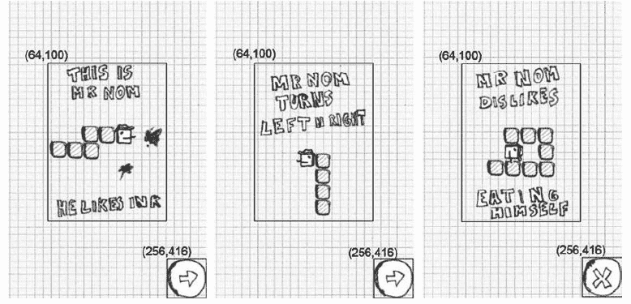

# 六、Nom 先生入侵 Android

在第三章中，我们为 Nom 先生做了一个完整的设计，包括游戏机制，一个简单的背景故事，手工制作的图形资源，以及基于一些剪纸的所有屏幕的定义。在《??》第五章中，我们开发了一个成熟的游戏开发框架，让我们可以轻松地将设计画面转换成代码。但是说够了；让我们开始写我们的第一个游戏吧！

创建素材

我们在 Nom 先生有两种素材:音频素材和图形素材。我们通过一个叫做 Audacity 的开源应用和一个糟糕的上网本麦克风录制了音频素材。我们创造了一种声音效果，当按下按钮或选择菜单项时播放，一种是当 Nom 先生吃了污渍时播放，另一种是当他吃了自己时播放。我们将它们作为 OGGs 保存到 assets/文件夹中，分别命名为 click.ogg、eat.ogg 和 bitten.ogg。您可以发挥创造力，使用 Audacity 和麦克风自己创建这些文件，或者您可以在`http://code.google.com/p/beginnginandroidgames2/`从 SVN 存储库中获取这些文件。如果你不熟悉 SVN，请看前面我们描述如何获得源代码的内容。

早些时候，我们提到过，我们希望将那些设计阶段的剪纸重新用作我们真正的游戏图形。为此，我们首先必须使它们符合我们的目标分辨率。

我们选择了 320 × 480(纵向模式)的固定目标分辨率，我们将为其设计所有的图形素材。这可能看起来很小，但它使我们开发游戏和图形变得非常快速和容易，毕竟，这里的重点是你可以看到整个 Android 游戏开发过程。

对于您的制作游戏，考虑所有的分辨率并使用更高分辨率的图形，以便您的游戏在平板电脑大小的屏幕上看起来很好，也许目标是 800 × 1280 作为基线。我们扫描了所有的剪纸，并稍微调整了一下尺寸。我们将大部分素材保存在单独的文件中，并将其中一些合并到一个文件中。所有图像都以 PNG 格式保存。背景是 RGB888 的唯一图像；其他都是 ARGB8888。图 6-1 向你展示了我们最终的结果。


图 6-1。Nom 先生的所有图形素材及其各自的文件名和像素大小

让我们稍微分解一下这些图像:

*   这是我们的背景图像，这将是我们绘制到 framebuffer 的第一个东西。由于显而易见的原因，它与我们的目标分辨率大小相同。
*   这包含了我们在游戏中需要的所有按钮。我们将它们放在一个文件中，因为我们可以通过 Graphics.drawPixmap()方法轻松地绘制它们，该方法允许绘制图像的一部分。当我们开始用 OpenGL ES 绘图时，我们会更频繁地使用这种技术，所以我们现在最好习惯它。将几幅图像合并成一幅图像通常被称为*图册*，图像本身被称为*图像图册*(或纹理图册，或 sprite sheet)。每个按钮的大小为 64 × 64 像素，当我们必须判断触摸事件是否按下了屏幕上的按钮时，这将派上用场。
*   help3.png、help3.png 和 help3.png:这些是我们将在 Nom 先生的三个帮助屏幕上显示的图像。它们的大小都一样，这使得将它们放在屏幕上更容易。
*   logo.png:这是我们将在主菜单屏幕上显示的徽标。
*   这包含了我们将在主菜单上呈现给玩家的三个选项。选择其中一个将触发到相应屏幕的转换。每个选项的高度大约为 42 像素，我们可以用它来轻松检测哪个选项被触摸了。
*   ready.png、pause.png 和 gameover.png:我们会在游戏即将开始、暂停和结束时画出这些。
*   numbers.png:它保存了我们稍后获得高分所需的所有数字。关于这个图像需要记住的是，每个数字都有相同的宽度和高度，20 × 32 像素，除了末尾的点，它是 10 × 32 像素。我们可以用它来呈现任何抛给我们的数字。
*   tail.png:这是 Nom 先生的尾巴，或者说是他尾巴的一部分。尺寸是 32 × 32 像素。
*   headup.png，headup.png，headright.png，还有 headup.png:这些图片是给诺姆先生的头像；他能移动的每个方向都有一个。因为他的帽子，我们不得不把这些图像做得比尾巴图像大一点。每张头像尺寸为 42 × 42 像素。
*   stain3.png、stain3.png 和染色剂 3.png:这是我们可以渲染的三种染色剂。拥有三种类型会让游戏画面更多样化一点。它们的尺寸是 32 × 32 像素，就像尾图一样。

很好，现在让我们开始实现屏幕！

设置项目

正如在第五章中提到的，我们将把 Nom 先生的代码与我们的框架代码合并。所有与 Nom 先生相关的类都将被放入包 com . badlogic . androidgames . Mr Nom .另外，我们必须修改清单文件，如第四章所述。我们的默认活动将被称为 MrNomGame。只需按照第四章中“Android 游戏项目设置八个简单步骤”一节中概述的八个步骤，正确设置<活动>属性(也就是说，游戏以纵向模式固定，配置更改由应用处理)，并给予我们的应用适当的权限(写入外部存储，使用唤醒锁，等等)。

前面章节中的所有素材都位于项目的素材/文件夹中。此外，我们必须将 ic_launcher.png 文件放入 res/drawable、res/drawable-ldpi、res/drawable-mdpi、res/drawable-hdpi 和 res/drawable-xhdpi 文件夹中。我们只是拿了 Nom 先生的 headright.png，将其重命名为 ic_launcher.png，并在每个文件夹中放了一个大小适当的版本。

剩下的就是把我们的游戏代码放到 Eclipse 项目的 com . bad logic . androidgames . Mr nom 包里了！

MrNomGame:主要活动

我们的应用需要一个主入口点，也就是 Android 上的默认活动。我们将把这个默认活动称为 MrNomGame，并让它从 AndroidGame 派生，这个类是我们在第五章中实现的，用来运行我们的游戏。稍后，它将负责创建和运行我们的第一个屏幕。清单 6-1 展示了我们的 MrNomGame 类。

***清单 6-1 。****【MrNomGame.java】；我们的主要活动/游戏混合*

```java
package com.badlogic.androidgames.mrnom;

import com.badlogic.androidgames.framework.Screen;
import com.badlogic.androidgames.framework.impl.AndroidGame;

public class MrNomGame extends AndroidGame {
    public Screen getStartScreen() {
        returnnew LoadingScreen(this );
    }
}
```

我们需要做的就是从 AndroidGame 派生并实现 getStartScreen()方法，这将返回 LoadingScreen 类的一个实例(我们将在一分钟内实现)。请记住，这将使我们从游戏所需的所有东西开始，从设置音频、图形、输入和文件 I/O 的不同模块到启动主循环线程。很简单，是吧？

素材:一个方便的素材商店

加载屏幕将加载我们游戏的所有素材。但是我们把它们存放在哪里呢？为了存储它们，我们将做一些在 Java 领域不常见的事情:我们将创建一个类，它有大量的公共静态成员，这些成员保存我们从素材中加载的所有位图和声音。清单 6-2 显示了那个类。

***清单 6-2 。****【Assets.java】；保存我们所有的像素图和声音以便于访问*

```java
package com.badlogic.androidgames.mrnom;

import com.badlogic.androidgames.framework.Pixmap;
import com.badlogic.androidgames.framework.Sound;

public class Assets {
    public static Pixmap*background*;
    public static Pixmap*logo*;
    public static Pixmap*mainMenu*;
    public static Pixmap*buttons*;
    public static Pixmap*help1*;
    public static Pixmap*help2*;
    public static Pixmap*help3*;
    public static Pixmap*numbers*;
    public static Pixmap*ready*;
    public static Pixmap*pause*;
    public static Pixmap*gameOver*;
    public static Pixmap*headUp*;
    public static Pixmap*headLeft*;
    public static Pixmap*headDown*;
    public static Pixmap*headRight*;
    public static Pixmap*tail*;
    public static Pixmap*stain1*;
    public static Pixmap*stain2*;
    public static Pixmap*stain3*;

    public static Sound*click*;
    public static Sound*eat*;
    public static Sound*bitten*;
}
```

我们从素材中加载的每个图像和声音都有一个静态成员。如果我们想使用这些素材中的一个，我们可以这样做:

```java
game.getGraphics().drawPixmap(Assets.background, 0, 0)
```

或者类似这样的东西:

```java
Assets.click.play(1);
```

这下方便了。但是，请注意，没有什么可以阻止我们覆盖这些静态成员，因为它们不是最终的。但是只要我们不覆盖它们，我们就是安全的。这些公共的、非最终的成员实际上使这个“设计模式”成为一个反模式。不过，对于我们的游戏来说，稍微懒一点是可以的。一个更干净的解决方案是将素材隐藏在所谓的*单例类*的 setters 和 getters 之后。我们会坚持我们穷人的素材经理。

设置:跟踪用户选择和高分

在加载屏幕中我们还需要加载另外两个东西:用户设置和高分。如果你回头看看第三章中的主菜单和高分屏幕，你会看到我们允许用户切换声音，并且我们存储了前五个高分。我们会将这些设置保存到外部存储器，以便下次游戏开始时可以重新加载它们。为此，我们将实现另一个简单的类，名为 Settings，如清单 6-3 所示。列表被拆分，评论相互交错。

***清单 6-3 。****【Settings.java】；存储我们的设置并加载/保存它们*

```java
package com.badlogic.androidgames.mrnom;

import java.io.BufferedReader;
import java.io.BufferedWriter;
import java.io.IOException;
import java.io.InputStreamReader;
import java.io.OutputStreamWriter;
import com.badlogic.androidgames.framework.FileIO;

public class Settings {
    public static boolean *soundEnabled* = true ;
    public static int[] *highscores* = new int[]  { 100, 80, 50, 30, 10 };
```

是否回放声音效果由一个名为 soundEnabled 的公共静态布尔值决定。高分存储在一个五元素整数数组中，从最高到最低排序。我们为这两种设置定义了合理的默认值。我们可以像访问 Assets 类的成员一样访问这两个成员。

```java
    public static void load(FileIO files) {
        BufferedReader in = null ;
        try {
            in = new BufferedReader( new InputStreamReader(
                    files.readFile(".mrnom")));
            *soundEnabled* = Boolean.*parseBoolean*(in.readLine());
            for (int i = 0; i < 5; i++) {
                *highscores*[i] = Integer.*parseInt*(in.readLine());
            }
        } catch (IOException e) {
            // :( It's ok we have defaults
        } catch (NumberFormatException e) {
            // :/ It's ok, defaults save our day
        } finally {
            try {
                if (in !=null )
                    in.close();
            }catch (IOException e) {
            }
        }
    }
```

静态 load()方法尝试从名为。来自外部存储器的 mrnom。为此它需要一个 FileIO 实例，我们将它传递给方法。它假设声音设置和每个高分条目存储在单独的行上，并简单地读入它们。如果出现任何问题(例如，如果外部存储不可用或者还没有设置文件)，我们只需返回到默认值并忽略故障。

```java
    public static void save(FileIO files) {
        BufferedWriter out = null ;
        try {
            out = new BufferedWriter(new OutputStreamWriter(
                    files.writeFile(".mrnom")));
            out.write(Boolean.*toString*(*soundEnabled*));
            for (int i = 0; i < 5; i++) {
                out.write(Integer.*toString*(*highscores*[i]));
            }
        }catch (IOException e) {
        }finally {
            try {
                if (out !=null )
                    out.close();
            }catch (IOException e) {
            }
        }
    }
```

接下来是一个叫做 save()的方法。它获取当前设置并将它们序列化到。外部存储器上的 mrnom 文件(即/sdcard/。mrnom)。正如 load()方法所期望的那样，声音设置和每个高分条目都作为单独的一行存储在该文件中。如果出现问题，我们只需忽略失败并使用前面定义的默认值。在 AAA 标题中，您可能希望通知用户这个加载错误。

值得注意的是，在 Android API 8 中，添加了更多特定的方法来处理托管的外部存储。添加了 Context.getExternalFilesDir()方法，它在外部存储中提供了一个特定的点，不会污染 SD 卡或内部闪存的根目录，并且在卸载应用时也会被清理。当然，增加对它的支持意味着要么为 API 8 动态加载一个类，要么将 SDK 的最小值设置为 8，这样就失去了向后兼容性。为了简单起见，Nom 先生将使用旧的 API 1 外部存储点，但是如果您需要一个如何动态加载类的例子，只需看看我们在第五章中的 TouchHandler 代码。

```java
    public static void addScore(int score) {
        for (int i = 0; i < 5; i++) {
            if (*highscores*[i] < score) {
                for (int j = 4; j > i; j--)
                    *highscores*[j] = *highscores*[j - 1];
                *highscores*[i] = score;
                break ;
            }
        }
    }
}
```

最后一个方法 addScore()是一个方便的方法。我们将使用它向高分添加一个新的分数，根据我们想要插入的值自动重新排序。

LoadingScreen:从磁盘获取素材

有了这些类，我们现在可以轻松地实现加载屏幕。清单 6-4 显示了代码。

***清单 6-4 。****【LoadingScreen.java】；加载所有素材和设置*

```java
package com.badlogic.androidgames.mrnom;

import com.badlogic.androidgames.framework.Game;
import com.badlogic.androidgames.framework.Graphics;
import com.badlogic.androidgames.framework.Screen;
import com.badlogic.androidgames.framework.Graphics.PixmapFormat;

public class LoadingScreen extends Screen {
    public LoadingScreen(Game game) {
        super (game);
    }
```

我们让 LoadingScreen 类从我们在第三章中定义的 Screen 类派生出来。这要求我们实现一个接受游戏实例的构造函数，我们把它交给超类构造函数。注意，这个构造函数将在我们前面定义的 MrNomGame.getStartScreen()方法中被调用。

```java
    public void update(float deltaTime) {
        Graphics g = game.getGraphics();
        Assets.*background* = g.newPixmap("background.png", PixmapFormat.*RGB565*);
        Assets.*logo* = g.newPixmap("logo.png", PixmapFormat.*ARGB4444*);
        Assets.*mainMenu* = g.newPixmap("mainmenu.png", PixmapFormat.*ARGB4444*);
        Assets.*buttons* = g.newPixmap("buttons.png", PixmapFormat.*ARGB4444*);
        Assets.*help1* = g.newPixmap("help1.png", PixmapFormat.*ARGB4444*);
        Assets.*help2* = g.newPixmap("help2.png", PixmapFormat.*ARGB4444*);
        Assets.*help3* = g.newPixmap("help3.png", PixmapFormat.*ARGB4444*);
        Assets.*numbers* = g.newPixmap("numbers.png", PixmapFormat.*ARGB4444*);
        Assets.*ready* = g.newPixmap("ready.png", PixmapFormat.*ARGB4444*);
        Assets.*pause* = g.newPixmap("pausemenu.png", PixmapFormat.*ARGB4444*);
        Assets.*gameOver* = g.newPixmap("gameover.png", PixmapFormat.*ARGB4444*);
        Assets.*headUp* = g.newPixmap("headup.png", PixmapFormat.*ARGB4444*);
        Assets.*headLeft* = g.newPixmap("headleft.png", PixmapFormat.*ARGB4444*);
        Assets.*headDown* = g.newPixmap("headdown.png", PixmapFormat.*ARGB4444*);
        Assets.*headRight* = g.newPixmap("headright.png", PixmapFormat.*ARGB4444*);
        Assets.*tail* = g.newPixmap("tail.png", PixmapFormat.*ARGB4444*);
        Assets.*stain1* = g.newPixmap("stain1.png", PixmapFormat.*ARGB4444*);
        Assets.*stain2* = g.newPixmap("stain2.png", PixmapFormat.*ARGB4444*);
        Assets.*stain3* = g.newPixmap("stain3.png", PixmapFormat.*ARGB4444*);
        Assets.*click* = game.getAudio().newSound("click.ogg");
        Assets.*eat* = game.getAudio().newSound("eat.ogg");
        Assets.*bitten* = game.getAudio().newSound("bitten.ogg");
        Settings.*load*(game.getFileIO());
        game.setScreen(new MainMenuScreen(game));
    }
```

接下来是 update()方法的实现，在这里我们加载素材和设置。对于图像素材，我们只需通过 Graphics.newPixmap()方法创建新的像素图。注意，我们指定了位图应该具有的颜色格式。背景为 RGB565 格式，所有其他图像为 ARGB4444 格式(如果 BitmapFactory 尊重我们的提示)。我们这样做是为了节省内存，并在稍后提高渲染速度。我们的原始图像以 RGB888 和 ARGB8888 格式存储为 png。我们还加载了三个声音效果，并将它们存储在 Assets 类的各个成员中。接下来，我们通过 Settings.load()方法从外部存储器加载设置。最后，我们启动一个屏幕转换到一个名为 MainMenuScreen 的屏幕，它将从那时起接管执行。

```java
    public void present(float deltaTime) {
    }
    public void pause() {
    }
    public void resume() {
    }
    public void dispose() {
    }
}
```

其他方法只是存根，不执行任何操作。由于 update()方法将在加载所有素材后立即触发屏幕转换，所以在这个屏幕上没有什么可做的了。

主菜单屏幕

主菜单屏幕是相当愚蠢的。它只是以切换按钮的形式呈现徽标、主菜单选项和声音设置。它所做的只是对主菜单选项或声音设置切换按钮上的触摸做出反应。为了实现这一行为，我们需要知道两件事:我们在屏幕上的什么地方呈现图像，以及触发屏幕转换或切换声音设置的触摸区域是什么。图 6-2 显示了我们在屏幕上渲染不同图像的位置。由此我们可以直接得出触摸面积。


图 6-2。主菜单屏幕。坐标指定了我们渲染不同图像的位置，轮廓显示了触摸区域。

计算徽标和主菜单选项图像的 x 坐标，使它们以 x 轴为中心。

接下来，我们来实现屏幕。清单 6-5 显示了代码。

***清单 6-5 。****【MainMenuScreen.java】；主菜单屏幕*

```java
package com.badlogic.androidgames.mrnom;

import java.util.List;

import com.badlogic.androidgames.framework.Game;
import com.badlogic.androidgames.framework.Graphics;
import com.badlogic.androidgames.framework.Input.TouchEvent;
import com.badlogic.androidgames.framework.Screen;

public class MainMenuScreen extends Screen {
    public MainMenuScreen(Game game) {
        super (game);
    }
```

我们让这个类再次从 Screen 派生，并为它实现一个合适的构造函数。

```java
    public void update(float deltaTime) {
        Graphics g = game.getGraphics();
        List < TouchEvent > touchEvents = game.getInput().getTouchEvents();
        game.getInput().getKeyEvents();
        int len = touchEvents.size();
        for (int i = 0; i < len; i++) {
            TouchEvent event = touchEvents.get(i);
            if (event.type == TouchEvent.*TOUCH_UP*) {
                if (inBounds(event, 0, g.getHeight() - 64, 64, 64)) {
                    Settings.*soundEnabled* = !Settings.*soundEnabled*;
                    if (Settings.*soundEnabled*)
                        Assets.*click*.play(1);
                }
                if (inBounds(event, 64, 220, 192, 42) ) {
                    game.setScreen(new GameScreen(game));
                    if (Settings.*soundEnabled*)
                        Assets.*click*.play(1);
                    return ;
                }
                if (inBounds(event, 64, 220 + 42, 192, 42) ) {
                    game.setScreen(new HighscoreScreen(game));
                    if (Settings.*soundEnabled*)
                        Assets.*click*.play(1);
                    return ;
                }
                if (inBounds(event, 64, 220 + 84, 192, 42) ) {
                    game.setScreen(new HelpScreen(game));
                    if (Settings.*soundEnabled*)
                        Assets.*click*.play(1);
                    return ;
                }
            }
        }
    }
```

接下来，我们有 update()方法，，我们将在其中进行所有的触摸事件检查。我们首先从游戏提供给我们的输入实例中获取 TouchEvent 和 KeyEvent 实例。注意，我们不使用 KeyEvent 实例，但是为了清除内部缓冲区，我们还是获取了它们(是的，这有点讨厌，但是让我们养成习惯)。然后，我们遍历所有的 TouchEvent 实例，直到找到一个类型为 TouchEvent 的实例。润色。(我们也可以寻找触摸事件。TOUCH_DOWN 事件，但是在大多数 UI 中，up 事件用于指示 UI 组件被按下。)

一旦我们有了一个 fitting 事件，我们就检查它是按下了声音切换按钮还是某个菜单项。为了使代码更加简洁，我们编写了一个名为 inBounds()的方法，它接受一个触摸事件、x 和 y 坐标以及宽度和高度。该方法检查触摸事件是否在由这些参数定义的矩形内，并返回 true 或 false。

如果声音切换按钮被按下，我们只需反转设置。如果任何主菜单项被按下，我们通过实例化它并通过 Game.setScreen()设置它来转换到适当的屏幕。在这种情况下，我们可以立即返回，因为 MainMenuScreen 屏幕已经没有任何事情可做了。如果按下切换按钮或主菜单条目并启用声音，我们还会播放卡嗒声。

请记住，所有触摸事件都将相对于我们的目标分辨率 320 × 480 像素进行报告，这要归功于我们在第五章中讨论的触摸事件处理程序中执行的缩放魔法。

```java
    private boolean inBounds(TouchEvent event, int x, int y, int width, int height) {
        if (event.x > x && event.x < x + width - 1 &&
           event.y > y && event.y < y + height - 1)
            return true ;
        else
            return false ;
    }
```

inBounds()方法的工作方式与前面讨论的一样:放入一个触摸事件和一个矩形，它会告诉您触摸事件的坐标是否在该矩形内。

```java
    public void present(float deltaTime) {
        Graphics g = game.getGraphics();

        g.drawPixmap(Assets.*background*, 0, 0);
        g.drawPixmap(Assets.*logo*, 32, 20);
        g.drawPixmap(Assets.*mainMenu*, 64, 220);
        if (Settings.*soundEnabled*)
            g.drawPixmap(Assets.*buttons*, 0, 416, 0, 0, 64, 64);
        else
            g.drawPixmap(Assets.*buttons*, 0, 416, 64, 0, 64, 64);
    }
```

present()方法可能是您最期待的方法，但它并不那么令人兴奋。我们的小游戏框架使得渲染我们的主菜单屏幕变得非常简单。我们所做的就是在(0，0)处渲染背景，这将基本上擦除我们的帧缓冲区，所以不需要调用 Graphics.clear()。接下来，我们在图 6-2 所示的坐标处绘制标志和主菜单条目。我们通过绘制基于当前设置的声音切换按钮来结束该方法。正如你所看到的，我们使用了相同的位图，但是只画了它的适当部分(声音切换按钮；参见图 6-1 。这很容易。

```java
    public void pause() {
        Settings.*save*(game.getFileIO());
    }
```

我们需要讨论的最后一部分是 pause()方法。由于我们可以更改该屏幕上的一个设置，我们必须确保它保存在外部存储器中。有了我们的设置类，这也很容易！

```java
    public void resume() {
    }
    public void dispose() {
    }
}
```

resume()和 dispose()方法在这个屏幕中没有任何作用。

帮助屏幕类

接下来，让我们实现之前在 update()方法中使用的 HelpScreen、HighscoreScreen 和 GameScreen 类。

我们在第三章中定义了三个帮助界面，每个或多或少解释了游戏的一个方面。我们现在直接将它们转化为屏幕实现，称为 HelpScreen、HelpScreen2 和 HelpScreen3。它们都有一个启动屏幕转换的按钮。帮助屏幕 3 屏幕将转换回主菜单屏幕。图 6-3 显示了带有绘图坐标和触摸区域的三个帮助屏幕。



图 6-3。三个帮助屏幕、绘图坐标和触摸区域

这看起来很容易实现。让我们从 HelpScreen 类开始，如清单 6-6 所示。

***清单 6-6 。****【HelpScreen.java】；第一个帮助屏幕*

```java
package com.badlogic.androidgames.mrnom;

import java.util.List;

import com.badlogic.androidgames.framework.Game;
import com.badlogic.androidgames.framework.Graphics;
import com.badlogic.androidgames.framework.Input.TouchEvent;
import com.badlogic.androidgames.framework.Screen;

public class HelpScreenextends Screen {
    public HelpScreen(Game game) {
        super (game);
    }
    @Override
    public void update(float deltaTime) {
        List < TouchEvent > touchEvents = game.getInput().getTouchEvents();
        game.getInput().getKeyEvents();
        int len = touchEvents.size();

        for (int i = 0; i < len; i++) {
            TouchEvent event = touchEvents.get(i);
            if (event.type == TouchEvent.*TOUCH_UP*) {
                if (event.x > 256 && event.y > 416 ) {
                    game.setScreen(new HelpScreen2(game));
                    if (Settings.*soundEnabled*)
                        Assets.*click*.play(1);
                    return ;
                }
            }
        }
    }
    @Override
    public void present(float deltaTime) {
        Graphics g = game.getGraphics();
        g.drawPixmap(Assets.*background*, 0, 0);
        g.drawPixmap(Assets.*help1*, 64, 100);
        g.drawPixmap(Assets.*buttons*, 256, 416, 0, 64, 64, 64);
    }
    @Override
    public void pause() {
    }
    @Override
    public void resume() {
    }
    @Override
    public void dispose() {
    }
}
```

同样，非常简单。我们从 Screen 派生，并实现了一个合适的构造函数。接下来，我们有熟悉的 update()方法，它简单地检查底部的按钮是否被按下。如果是这种情况，我们播放卡嗒声并转换到帮助屏幕 2。

present()方法只是再次呈现背景，然后是帮助图像和按钮。

HelpScreen2 和 HelpScreen3 类看起来是一样的；唯一的区别是他们绘制的帮助图像和他们转换到的屏幕。我们可以同意我们不必看他们的代码。在高分屏幕上！

高分屏幕

高分屏幕简单地画出我们存储在设置类中的前五个高分，加上一个花哨的标题告诉玩家他或她在高分屏幕上，左下角还有一个按钮，当按下时会转换回主菜单。有趣的部分是我们如何渲染高分。让我们先看看我们在哪里渲染图像，如图 6-4 所示。


图 6-4。高分屏幕，无高分

这看起来和我们实现的其他屏幕一样简单。但是怎么才能画出动态的分数呢？

渲染数字:一次远足

我们有一个名为 numbers.png 的素材图像，包含从 0 到 9 的所有数字和一个点。每个数字是 20 × 32 像素，点是 10 × 32 像素。数字从左到右按升序排列。高分屏幕应该显示五行，每行显示五个高分中的一个。这样的一行将从高分的位置开始(例如，“1”或者“5”)，后跟一个空格，再按实际分数。我们如何做到这一点？

我们有两件事情要处理:numbers.png 图像和 Graphics.drawPixmap()方法，它允许我们将图像的一部分绘制到屏幕上。比方说我们想要的第一行的默认高分(用字符串" 1。100”)呈现在(20，100)，以便数字 1 的左上角与这些坐标重合。我们这样调用 Graphics.drawPixmap():

```java
game.getGraphics().drawPixmap(Assets.*numbers*, 20, 100, 20, 0, 20, 32);
```

我们知道数字 1 的宽度是 20 个像素。我们字符串的下一个字符必须在(20 + 20，100)处呈现。在字符串“1”的情况下。100”，该字符是点，在 numbers.png 图像中宽度为 10 个像素:

```java
game.getGraphics().drawPixmap(Assets.*numbers*, 40, 100, 200, 0, 10, 32);
```

字符串中的下一个字符需要在(20 + 20 + 10，100)处呈现。那个字符是一个空格，我们不需要画出来。我们需要做的就是在 x 轴上再前进 20 个像素，因为我们假设这是空格字符的宽度。因此，下一个字符 1 将在(20 + 20 + 10 + 20，100)处呈现。看到这里的模式了吗？

给定字符串中第一个字符左上角的坐标，我们可以遍历字符串中的每个字符，绘制它，并根据我们刚刚绘制的字符，将下一个要绘制的字符的 x 坐标增加 20 或 10 个像素。

我们还需要考虑在给定当前角色的情况下，我们应该绘制 numbers.png 图像的哪一部分。为此，我们需要该部分左上角的 x 和 y 坐标，以及它的宽度和高度。y 坐标永远是 0，看图 6-1 应该很明显。高度也是一个常数—在我们的例子中是 32。宽度为 20 像素(如果字符串的字符是数字)或 10 像素(如果是点)。我们唯一需要计算的是 numbers.png 图像中该部分的 x 坐标。我们可以通过下面这个巧妙的小技巧做到这一点。

字符串中的字符可以解释为 Unicode 字符或 16 位整数。这意味着我们实际上可以用这些字符代码进行计算。幸运的是，字符 0 到 9 都有升序的整数表示。我们可以用它来计算一个数字的 number.png 图像部分的 x 坐标，如下所示:

```java
char character = string.charAt(index);
int x = (character – '0') * 20;
```

这将为字符 0 提供 0，为字符 3 提供 3 × 20 = 60，依此类推。这就是每个数字部分的 x 坐标。当然，这不适用于点字符，所以我们需要特别对待。让我们用一种方法来总结这一点，该方法可以呈现我们的一条高分线，给定该线的字符串以及应该开始呈现的 x 和 y 坐标:

```java
public void drawText(Graphics g, String line, int x, int y) {
    int len = line.length();
    for (int i = 0; i < len; i++) {
        char character = line.charAt(i);

        if (character == ' ') {
            x += 20;
            continue ;
        }

        int srcX = 0;
        int srcWidth = 0;
        if (character == '.') {
            srcX = 200;
            srcWidth = 10;
        }else {
            srcX = (character - '0') * 20;
            srcWidth = 20;
        }
        g.drawPixmap(Assets.*numbers*, x, y, srcX, 0, srcWidth, 32);
        x += srcWidth;
    }
}
```

我们迭代字符串中的每个字符。如果当前字符是一个空格，我们只需将 x 坐标前移 20 个像素。否则，我们计算 numbers.png 图像中当前字符区域的 x 坐标和宽度。该字符是一个数字或一个点。然后，我们渲染当前字符，并将渲染 x 坐标提升我们刚刚绘制的字符的宽度。如果我们的字符串包含除了空格、数字和点以外的任何内容，这个方法当然会失败。你能想出一种方法让它适用于任何字符串吗？

实现屏幕

有了这些新知识，我们现在可以很容易地实现 HighscoreScreen 类，如清单 6-7 所示。

***清单 6-7 。****【HighscoreScreen.java】；向我们展示我们迄今为止取得的最好成绩*

```java
package com.badlogic.androidgames.mrnom;

import java.util.List;

import com.badlogic.androidgames.framework.Game;
import com.badlogic.androidgames.framework.Graphics;
import com.badlogic.androidgames.framework.Screen;
import com.badlogic.androidgames.framework.Input.TouchEvent;

public class HighscoreScreenextends Screen {
    String lines[] = new String[5];

    public HighscoreScreen(Game game) {
        super (game);

        for (int i = 0; i < 5; i++) {
            lines[i] = "" + (i + 1) + ". " + Settings.*highscores*[i];
        }
    }
```

因为我们希望与垃圾收集器保持友好关系，所以我们将五个高分行的字符串存储在一个字符串数组成员中。我们基于构造函数中的 Settings.highscores 数组来构造字符串。

```java
    @Override
    public void update(float deltaTime) {
        List < TouchEvent > touchEvents = game.getInput().getTouchEvents();

        game.getInput().getKeyEvents();
        int len = touchEvents.size();
        for (int i = 0; i < len; i++) {
            TouchEvent event = touchEvents.get(i);
            if (event.type == TouchEvent.*TOUCH_UP*) {
                if (event.x < 64 && event.y > 416) {
                    if (Settings.*soundEnabled*)
                        Assets.*click*.play(1);
                    game.setScreen(new MainMenuScreen(game));
                    return ;
                }
            }
        }
    }
```

接下来，我们定义 update()方法，毫无疑问这很无聊。我们所做的就是检查一个触发事件是否按下了左下角的按钮。如果是这种情况，我们播放卡嗒声并转换回主菜单屏幕。

```java
    @Override
    public void present(float deltaTime) {
        Graphics g = game.getGraphics();

        g.drawPixmap(Assets.*background*, 0, 0);
        g.drawPixmap(Assets.*mainMenu*, 64, 20, 0, 42, 196, 42);

        int y = 100;
        for (int i = 0; i < 5; i++) {
            drawText(g, lines[i], 20, y);
            y += 50;
        }
        g.drawPixmap(Assets.*buttons*, 0, 416, 64, 64, 64, 64);
    }
```

借助我们之前定义的强大的 drawText()方法，present()方法非常简单。像往常一样，我们首先渲染背景图像，然后是 Assets.mainmenu 图像的“HIGHSCORES”部分。我们可以将它存储在一个单独的文件中，但是我们重用它来释放更多的内存。

接下来，我们遍历在构造函数中创建的每一个高分行的五个字符串。我们用 drawText()方法绘制每一行。第一行从(20，100)开始，下一行在(20，150)渲染，依此类推。我们只是将每行文本渲染的 y 坐标增加 50 个像素，这样我们就可以在两行之间有一个很好的垂直间距。我们通过画按钮来结束这个方法。

```java
public void drawText(Graphics g, String line, int x, int y) {
        int len = line.length();
        for (int i = 0; i < len; i++) {
            char character = line.charAt(i);
            if (character == ' ') {
                x += 20;
                continue ;
            }
            int srcX = 0;
            int srcWidth = 0;
            if (character == '.') {
                srcX = 200;
                srcWidth = 10;
            }else {
                srcX = (character - '0') * 20;
                srcWidth = 20;
            }
            g.drawPixmap(Assets.*numbers*, x, y, srcX, 0, srcWidth, 32);
            x += srcWidth;
        }

    }
    @Override
    public void pause() {

    }
    @Override
    public void resume() {

    }
    @Override
    public void dispose() {
    }
}
```

剩下的方法应该是不言自明的。让我们来看看 Nom 先生游戏中缺少的最后一块:游戏屏幕。

抽象 Nom 先生的世界:模型、视图、控制器

到目前为止，我们只为我们的素材和设置实现了无聊的 UI 和一些内务代码。我们现在将抽象出 Nom 先生的世界和其中的所有物体。我们也会把 Nom 先生从屏幕分辨率中解放出来，让他活在自己的小世界里，有自己的小坐标系。

如果你是一个长期的程序员，你可能听说过设计模式。给定一个场景，它们或多或少是设计代码的策略。有些是学术上的，有些在现实世界中有用途。对于游戏开发，可以借鉴*模型-视图-控制器(MVC)* 设计模式的一些思路。它经常被数据库和 web 社区用来将数据模型从表示层和数据操作层中分离出来。我们不会严格遵循这种设计模式，而是采用更简单的形式。

那么这对诺姆先生来说意味着什么呢？首先，我们需要一个独立于任何位图、声音、帧缓冲区或输入事件的世界的抽象表示。相反，我们将以面向对象的方式用几个简单的类来模拟 Nom 先生的世界。我们将为世界上的污点上一堂课，为诺姆先生自己上一堂课。Nom 先生由头部和尾部组成，我们也用单独的类来表示。为了将一切联系在一起，我们将有一个无所不知的类来代表 Nom 先生的整个世界，包括污点和 Nom 先生本人。所有这些都代表了 MVC 的*模型*部分。

MVC 中的*视图*将是负责渲染 Nom 先生世界的代码。我们将有一个类或方法来获取这个类，读取它的当前状态，并将其呈现在屏幕上。如何渲染与模型类无关，这是从 MVC 学到的最重要的一课。模型类独立于一切，但是视图类和方法依赖于模型类。

最后，我们有 MVC 中的*控制器*。它告诉模型类根据用户输入或时间流逝等改变它们的状态。模型类向控制器提供方法(例如，使用类似“将 Mr. Nom 转向左边”的指令)，控制器可以使用这些方法来修改模型的状态。我们在模型类中没有任何直接访问触摸屏或加速度计的代码。这样，我们可以保持模型类没有任何外部依赖。

这听起来可能很复杂，你可能想知道为什么我们要这样做。然而，这种方法有很多好处。我们可以实现我们所有的游戏逻辑，而不必了解图形、音频或输入设备。我们可以修改游戏世界的渲染，而不必改变模型类本身。我们甚至可以将 2D 世界渲染器与 3D 世界渲染器进行交换。通过使用控制器，我们可以很容易地增加对新输入设备的支持。它所做的只是将输入事件转换成模型类的方法调用。想通过加速度计转动诺姆先生吗？没问题——读取控制器中的加速度计值，并在 Nom 先生的模型上将它们转换为“左转 Nom 先生”或“右转 Nom 先生”方法调用。想要增加对 Zeemote 的支持吗？没问题，就像加速度计的情况一样！使用控制器最好的一点是，我们不需要接触 Nom 先生的任何一行代码就可以实现所有这些。

让我们从定义 Nom 先生的世界开始。为此，我们将稍微脱离严格的 MVC 模式，使用我们的图形素材来说明基本思想。这也将有助于我们稍后实现视图组件(以像素为单位呈现 Nom 先生的抽象世界)。

图 6-5 显示了游戏屏幕，上面以网格的形式叠加了 Nom 先生的世界。


图 6-5。Nom 先生的世界叠加在我们的游戏屏幕上

请注意，Nom 先生的世界被限制在一个 10 × 13 单元的网格中。我们在一个坐标系统中处理细胞，其原点在左上角(0，0)，跨越到右下角(9，12)。Nom 先生的任何部分都必须在这些单元中的一个中，因此，在这个世界中具有整数 x 和 y 坐标。这个世界的污点也是如此。Nom 先生的每一部分恰好适合一个 1 × 1 单位的单元。请注意，单位的类型并不重要——这是我们自己的幻想世界，摆脱了 SI 系统或像素的束缚！

诺姆先生不能离开这个小小的世界。如果他通过一个边缘，他会从另一端出来，他所有的部分都会跟着出来。(顺便说一下，我们在地球上也有同样的问题——朝任何方向走足够长的时间，你都会回到你的起点。)诺姆先生也只能一个细胞一个细胞地前进。他所有的部分都会一直在整数坐标上。比如说，他永远不会占据两个半牢房。

**注意**如前所述，我们这里使用的不是严格的 MVC 模式。如果你对 MVC 模式的真正定义感兴趣，我们建议你读一读由 Erich Gamm，Richard Helm，Ralph Johnson 和 John M. Vlissides(又名四人组)(Addison-Wesley，1994)撰写的 设计模式:可重用面向对象软件的元素】。在他们的书中，MVC 模式被称为观察者模式。

污渍课

在诺姆先生的世界里，最简单的物体就是污渍。它只是坐在世界的一个细胞里，等着被吃掉。当我们设计 Nom 先生时，我们创造了三种不同的污渍视觉表现。在 Nom 先生的世界里，污渍的类型并不重要，但我们还是会把它包含在我们的污渍类中。清单 6-8 显示了污点等级。

***清单 6-8 。****Stain.java*

```java
package com.badlogic.androidgames.mrnom;

public class Stain {
    public static final int *TYPE_1* = 0;
    public static final int *TYPE_2* = 1;
    public static final int *TYPE_3* = 2;
    public int x, y;
    public int type;

    public Stain(int x, int y, int type) {
        this .x = x;
        this .y = y;
        this .type = type;
    }
}
```

Stain 类定义了三个公共静态常量，它们对污点的类型进行编码。每个 Stain 实例都有三个成员，Nom 先生世界中的 x 和 y 坐标，以及一个类型，它是之前定义的常量之一。为了使我们的代码简单，我们不包括 getters 和 setters，这是常见的做法。我们用一个很好的构造函数结束了这个类，它允许我们很容易地实例化一个 Stain 实例。

需要注意的一点是，它缺少与图形、声音或其他类的任何联系。污渍类独立存在，自豪地编码了 Nom 先生世界中污渍的属性。

蛇和蛇的一部分类

Nom 先生就像一条移动的链条，由相互关联的部分组成，当我们选取一部分并将其拖到某个地方时，这些部分就会一起移动。在 Nom 先生的世界里，每个部分占据一个细胞，就像一个污点。在我们的模型中，我们不区分头部和尾部，所以我们可以有一个单独的类来表示 Nom 先生的两种类型的部分。清单 6-9 显示了 SnakePart 类，它用于定义 Nom 先生的两个部分。

***清单 6-9 。****SnakePart.java*

```java
package com.badlogic.androidgames.mrnom;

public class SnakePart {
    public int x, y;

    public SnakePart(int x, int y) {
        this .x = x;
        this .y = y;
    }
}
```

这与 Stain 类本质上是一样的——我们只是移除了类型成员。我们的 Nom 先生的世界模型的第一个真正有趣的类是 Snake 类。让我们想想它必须能够做什么:

*   它必须存储头部和尾部。
*   它必须知道 Nom 先生目前的走向。
*   当诺姆先生吃了一个污渍时，它一定能长出一个新的尾巴。
*   它必须能够在当前方向上移动一个单元。

第一和第二项很容易。我们只需要 SnakePart 实例的列表——列表中的第一部分是头部，其他部分组成尾部。Nom 先生可以上下左右移动。我们可以用一些常量对其进行编码，并将他当前的方向存储在 Snake 类的一个成员中。

第三项也没那么复杂。我们只是在已有的零件列表中添加了另一个 SnakePart。问题是，那部分应该加在什么位置？这听起来可能令人惊讶，但我们给它的位置与列表中的最后一部分相同。当我们看到如何实现前面列表中的最后一项:移动 Nom 先生时，这样做的原因就变得更清楚了。

图 6-6 显示了 Nom 先生的初始配置。他由三部分组成:头部(5，6)和两个尾部(5，7)和(5，8)。


图 6-6。Nom 先生的初始配置

列表中的部分是有序的，从头部开始，到最后一个尾部结束。当诺姆先生前进一个细胞时，他脑袋后面的所有部分都必须跟着前进。然而，Nom 先生的各个部分可能不会像图 6-6 中那样呈直线排列，因此简单地将所有部分向 Nom 先生前进的方向移动是不够的。我们必须做一些更复杂的事情。

我们需要从列表中的最后一部分开始，这听起来可能有些违反直觉。我们将它移动到它之前的部分的位置，并对列表中的所有其他部分重复此操作，除了头部，因为它之前没有任何部分。在头部的情况下，我们检查 Nom 先生当前的方向，并相应地修改头部的位置。图 6-7 用 Nom 先生的更复杂的配置说明了这一点。


图 6-7。诺姆先生带着他的尾巴前进

这种运动策略和我们的饮食策略配合得很好。当我们向 Nom 先生添加一个新部件时，在 Nom 先生下一次移动时，它将停留在与之前部件相同的位置。另外，请注意，如果 Nom 先生通过了其中一条边，这将允许我们轻松地将他包装到世界的另一边。我们只要相应地设置头部的位置，剩下的就是自动完成的了。

有了这些信息，我们现在可以实现代表 Nom 先生的 Snake 类。清单 6-10 显示了代码。

***清单 6-10 。****【Snake.java】；代号*的诺姆先生

```java
package com.badlogic.androidgames.mrnom;

import java.util.ArrayList;
import java.util.List;

public class Snake {
    public static final int *UP* = 0;
    public static final int *LEFT* = 1;
    public static final int *DOWN* = 2;
    public static final int *RIGHT* = 3;

    public List < SnakePart > parts = new ArrayList < SnakePart > ();
    public int direction;
```

首先，我们定义几个常量来编码 Nom 先生的方向。请记住，Nom 先生只能向左转和向右转，因此我们定义常量值的方式至关重要。稍后，它将允许我们轻松地将方向旋转正负 90 度，只需将常量的当前方向递增和递减 1 即可。

接下来，我们定义一个名为 parts 的列表来保存 Nom 先生的所有部分。列表中第一项是头部，其他项是尾部。蛇类的第二个成员掌握着 Nom 先生目前前进的方向。

```java
    public Snake() {
        direction = *UP*;
        parts.add(new SnakePart(5, 6));
        parts.add(new SnakePart(5, 7));
        parts.add(new SnakePart(5, 8));
    }
```

在构造器中，我们设置 Nom 先生由他的头部和两个额外的尾部组成，差不多位于世界的中间，如前面的图 6-6 所示。我们还设置了蛇的方向。向上，这样 Nom 先生在下一次被要求提升时将向上提升一个单元格。

```java
    public void turnLeft() {
        direction += 1;
        if (direction > *RIGHT*)
            direction = *UP*;
    }

    public void turnRight() {
        direction - = 1;
        if (direction < *UP*)
            direction = *RIGHT*;
    }
```

方法 turnLeft()和 turnRight()只是修改 Snake 类的方向成员。对于左转，我们增加 1，对于右转，我们减少 1。我们还必须确保，如果方向值超出了我们之前定义的常量范围，我们就把 Nom 先生包围起来。

```java
    public void eat() {
        SnakePart end = parts.get(parts.size()-1);
        parts.add(new SnakePart(end.x, end.y));
    }
```

接下来是 eat()方法。它所做的只是在列表末尾添加一个新的 SnakePart。这个新零件将与当前的结束零件具有相同的位置。如前所述，下一次 Nom 先生前进时，这两个重叠的部分将会分开。

```java
    public void advance() {
        SnakePart head = parts.get(0);

        int len = parts.size() - 1;
        for (int i = len; i > 0; i--) {
            SnakePart before = parts.get(i-1);
            SnakePart part = parts.get(i);
            part.x = before.x;
            part.y = before.y;
        }
        if (direction ==*UP*)
            head.y - = 1;
        if (direction ==*LEFT*)
            head.x - = 1;
        if (direction ==*DOWN*)
            head.y += 1;
        if (direction ==*RIGHT*)
            head.x += 1;
        if (head.x < 0)
            head.x = 9;
        if (head.x > 9)
            head.x = 0;
        if (head.y < 0)
            head.y = 12;
        if (head.y > 12)
            head.y = 0;
    }
```

下一个方法 advance()实现了图 6-7 中的逻辑。首先，我们从最后一个部分开始，将每个部分移动到它前面的部分的位置。我们把头部排除在这个机制之外。然后，我们根据 Nom 先生当前的方向移动头部。最后，我们执行一些检查，以确保 Nom 先生不会走出他的世界。如果是这样，我们就把他包起来，让他从世界的另一端出来。

```java
    public boolean checkBitten() {
        int len = parts.size();
        SnakePart head = parts.get(0);
        for (int i = 1; i < len; i++) {
            SnakePart part = parts.get(i);
            if (part.x == head.x && part.y == head.y)
                return true ;
        }
        return false ;
    }
}
```

最后一个方法 checkBitten()是一个小助手方法，它检查 Nom 先生是否咬到了自己的尾巴。它所做的只是检查没有一个尾部和头部在同一个位置。如果是这样的话，Nom 先生就死了，游戏也就结束了。

世界一流

我们的最后一个模型类叫做 World。世界级有几项任务要完成:

*   跟踪 Nom 先生(以 Snake 实例的形式)，以及世界上出现的 Stain 实例。我们的世界将永远只有一个污点。
*   提供以基于时间的方式更新 Nom 先生的方法(例如，他应该每 0.5 秒前进一个单元格)。这种方法还可以检查 Nom 先生是否吃了污渍或咬了自己。
*   记录分数；这基本上就是目前吃的污渍数乘以 10。
*   诺姆先生每吃十块污渍就增加一次速度。这将使游戏更具挑战性。
*   记录诺姆先生是否还活着。稍后我们会用这个来决定游戏是否结束。
*   在 Nom 先生吃掉当前的污渍后，创建一个新的污渍(一个微妙但重要且复杂得惊人的任务)。

这个任务列表上只有两项我们还没有讨论:以基于时间的方式更新世界和放置新的污点。

诺姆先生的时间运动

在第三章中，我们谈到了基于时间的运动。这基本上意味着我们定义所有游戏对象的速度，测量自上次更新以来经过的时间(也称为增量时间)，并通过将对象的速度乘以增量时间来推进对象。在第三章的中给出的例子中，我们使用浮点值来实现这一点。然而，Nom 先生的部件具有整数位置，所以我们需要弄清楚如何在这个场景中推进对象。

我们先定义一下诺姆先生的速度。诺姆先生的世界是有时间的，我们是以秒来衡量的。最初，Nom 先生应该每 0.5 秒前进一个单元格。我们需要做的就是记录从我们上次提升 Nom 先生以来已经过去了多长时间。如果累积的时间超过了我们的 0.5 秒阈值，我们调用 Snake.advance()方法并重置我们的时间累加器。我们从哪里得到这些德尔塔时间？记住 Screen.update()方法。它获得帧增量时间。我们只需将它传递给我们的 World 类的 update()方法，它将进行累加。为了让游戏更具挑战性，我们会在诺姆先生每多吃十个污渍的时候，将阈值减少 0.05 秒。当然，我们必须确保我们不会达到 0 的阈值，否则诺姆先生会以无限的速度旅行——这是爱因斯坦不会喜欢的。

放置污渍

我们要解决的第二个问题是，当 Nom 先生吃掉当前的污渍时，如何放置新的污渍。它应该出现在世界的任意一个单元格中。所以我们可以用一个随机的位置来实例化一个新的污点，对吗？可悲的是，这并不容易。

想象一下诺姆先生占据了相当数量的细胞。有一个合理的可能性，污渍将被放置在一个已经被诺姆先生占据的细胞中，并且它将随着诺姆先生变得越来越大而增加。因此，我们必须找到一个目前没有被 Nom 先生占用的牢房。又轻松了，对吧？只需迭代所有单元格，并使用第一个未被 Nom 先生占用的单元格。

同样，这有点不太理想。如果我们从同一个位置开始寻找，污点就不会随机出现。相反，我们将从世界上的一个随机位置开始，扫描所有单元格，直到到达世界的尽头，然后扫描开始位置以上的所有单元格，如果我们还没有找到一个空闲单元格的话。

我们如何检查一个单元是否空闲？简单的解决方法是检查所有的单元格，获取每个单元格的 x 和 y 坐标，并根据这些坐标检查 Nom 先生的所有部分。我们有 10 × 13 = 130 个单元格，诺姆先生可以占 55 个单元格。那就是 130×55 = 7150 张支票！诚然，大多数设备可以处理，但我们可以做得更好。

我们将创建一个布尔二维数组，其中每个数组元素代表世界上的一个单元格。当我们必须放置一个新的污点时，我们首先遍历 Mr. Nom 的所有部分，并将数组中某个部分所占用的那些元素设置为 true。然后我们简单地选择一个随机的位置，从这里开始扫描，直到我们找到一个空闲的细胞，我们可以在其中放置新的染色剂。Nom 先生由 55 部分组成，需要 130 + 55 = 185 张支票。那好多了！

决定游戏何时结束

我们还要考虑最后一件事:如果所有的细胞都被 Nom 先生占据了呢？在这种情况下，游戏就结束了，因为诺姆先生将正式成为全世界。假设我们在诺姆先生每吃一个污渍时就给分数加 10，那么最高可得分数是((10×13)-3)×10 = 1270 分(记住，诺姆先生已经开始吃三个部分了)。

实现世界级

唷，我们有很多东西要实现，所以让我们开始吧。清单 6-11 显示了世界类的代码。

***清单 6-11 。****World.java*

```java
package com.badlogic.androidgames.mrnom;

import java.util.Random;

public class World {
    static final int *WORLD_WIDTH* = 10;
    static final int *WORLD_HEIGHT* = 13;
    static final int *SCORE_INCREMENT* = 10;
    static final float *TICK_INITIAL* = 0.5f;
    static final float *TICK_DECREMENT* = 0.05f;

    public Snake snake;
    public Stain stain;
    public boolean gameOver = false ;;
    public int score = 0;

    boolean fields[][] = new boolean [*WORLD_WIDTH*][*WORLD_HEIGHT*];
    Random random = new Random();
    float tickTime = 0;
    float *tick* = *TICK_INITIAL*;
```

像往常一样，我们首先定义几个常数——在这种情况下，世界的宽度和高度以单元格为单位，我们用来在 Nom 先生每次吃一个染色剂时增加分数的值，用来推进 Nom 先生的初始时间间隔(称为 *tick* ),以及 Nom 先生每次吃十个染色剂时减少 tick 的值，以便稍微加快速度。

接下来，我们有一些公共成员，它们保存一个 Snake 实例、一个 Stain 实例、一个存储游戏是否结束的布尔值和当前分数。

我们定义了另外四个包私有成员:我们将用来放置新染色的 2D 数组；Random 类的一个实例，通过它我们将产生随机数来放置污点并生成它的类型；时间累加器变量 tickTime，我们将添加帧增量时间；以及一个分笔成交点的当前持续时间，它定义了我们提升 Nom 先生的频率。

```java
    public World() {
        snake = new Snake();
        placeStain();
    }
```

在构造函数中，我们创建了一个 Snake 类的实例，它将具有如图 6-6 所示的初始配置。我们还通过 placeStain()方法放置第一个随机染色。

```java
    private void placeStain() {
        for (int x = 0; x < *WORLD_WIDTH*; x++) {
            for (int y = 0; y < *WORLD_HEIGHT*; y++) {
                fields[x][y] = false ;
            }
        }

        int len = snake.parts.size();
        for (int i = 0; i < len; i++) {
            SnakePart part = snake.parts.get(i);
            fields[part.x][part.y] = true ;
        }
        int stainX = random.nextInt(*WORLD_WIDTH*);
        int stainY = random.nextInt(*WORLD_HEIGHT*);
        while (true ) {
            if (fields[stainX][stainY] ==false )
                break ;
            stainX += 1;
            if (stainX >=*WORLD_WIDTH*) {
                stainX = 0;
                stainY += 1;
                if (stainY >=*WORLD_HEIGHT*) {
                    stainY = 0;
                }
            }
        }
        stain = new Stain(stainX, stainY, random.nextInt(3));
    }
```

placeStain()方法实现了前面讨论的放置策略。我们从清空单元阵列开始。接下来，我们将蛇的各个部分所占据的所有单元格设置为 true。最后，我们从随机位置开始扫描数组，寻找空闲单元。一旦我们找到了一个自由细胞，我们就用随机类型创建一个染色。请注意，如果所有单元格都被 Nom 先生占用，那么循环将永远不会终止。我们将确保在下一个方法中不会发生这种情况。

```java
    public void update(float deltaTime) {
        if (gameOver)
            return ;

        tickTime += deltaTime;

        while (tickTime > *tick*) {
            tickTime - = *tick*;
            snake.advance();
            if (snake.checkBitten()) {
                gameOver = true ;
                return ;
            }

            SnakePart head = snake.parts.get(0);
            if (head.x == stain.x && head.y == stain.y) {
                score +=*SCORE_INCREMENT*;
                snake.eat();
                if (snake.parts.size() ==*WORLD_WIDTH***WORLD_HEIGHT*) {
                    gameOver = true ;
                    return ;
                }else {
                    placeStain();
                }
                if (score % 100 == 0 &&*tick*-*TICK_DECREMENT* > 0) {
                    *tick*- = *TICK_DECREMENT*;
                }
            }
        }
    }
}
```

update()方法负责根据我们传递给它的时间增量更新世界和其中的所有对象。这个方法会调用游戏画面中的每一帧，让世界不断更新。我们从检查游戏是否结束开始。如果是这样的话，那么我们就不需要更新什么了。接下来，我们将增量时间添加到累加器中。while 循环将使用尽可能多的累计滴答(例如，当 tickTime 为 1.2，而一个滴答需要 0.5 秒时，我们可以更新世界两次，在累加器中留下 0.2 秒)。这被称为*固定时间步长模拟*。

在每次迭代中，我们首先从累加器中减去节拍间隔。接下来，我们告诉诺姆先生前进。我们检查他是否咬了自己，如果是，就设置游戏结束标志。最后，我们检查诺姆先生的头是否和污点在同一个牢房。如果是这样的话，我们增加分数，并告诉 Nom 先生增长。接下来，我们检查 Nom 先生的组成部分是否和世界上的细胞一样多。如果是这样，游戏就结束了，我们从函数中返回。否则，我们用 placeStain()方法放置一个新的染色。我们做的最后一件事是检查 Nom 先生是否又吃了十个污渍。如果是这种情况，我们的阈值大于零，我们将它减少 0.05 秒。分笔成交点会更短，从而让诺姆动作更快。

这就完成了我们的模型类集。我们最不需要实现的就是游戏画面！

GameScreen 类

只需要再实现一个屏幕。让我们看看这个屏幕做了什么:

*   正如 Nom 先生在第三章中的设计所定义的，游戏屏幕可以处于四种状态之一:等待用户确认他或她准备好了，运行游戏，在暂停状态下等待，或者在游戏结束状态下等待用户点击按钮。

*   在就绪状态下，我们简单地要求用户触摸屏幕来开始游戏。
*   在运行状态下，我们更新世界，渲染世界，还告诉 Nom 先生当玩家按下屏幕底部的一个按钮时向左转和向右转。
*   在暂停状态下，我们只显示两个选项:一个是恢复游戏，一个是退出游戏。
*   在游戏结束的状态下，我们告诉用户游戏结束了，并提供一个触摸按钮，这样他或她就可以回到主菜单。

*   对于每个状态，我们有不同的 update()和 present()方法要实现，因为每个状态做不同的事情并显示不同的 UI。
*   一旦游戏结束，我们必须确保存储分数，如果分数很高的话。

这是相当多的责任，这意味着比平常更多的代码。因此，我们将分解这个类的源代码清单。在深入研究代码之前，让我们展示一下如何在每个状态下安排不同的 UI 元素。图 6-8 显示了四种不同的状态。


图 6-8。游戏屏幕有四种状态:就绪、运行、暂停和游戏结束

请注意，我们还在屏幕底部呈现了分数，以及一条将 Nom 先生的世界与底部按钮分开的线。分数是用我们在 HighscoreScreen 中使用的相同例程呈现的。此外，我们根据乐谱字符串宽度将其水平居中。

最后缺失的一点信息是如何根据模型来呈现 Nom 先生的世界。这其实很简单。再看一下图 6-1 和图 6-5 。每个单元格的大小正好是 32 × 32 像素。污点图像也是 32 × 32 像素大小，Nom 先生的尾部也是。Nom 先生各个方向的头像都是 42 × 42 像素，所以不能完全装进一个单元格。不过，这不是问题。要渲染 Nom 先生的世界，我们需要做的就是将每个污点和蛇的部分乘以 32 的世界坐标，以像素为单位得出屏幕上对象的中心——例如，世界坐标为(3，2)的污点在屏幕上的中心为 96 × 64。基于这些中心，剩下要做的就是获取适当的资源，并以这些坐标为中心进行渲染。让我们开始编码吧。清单 6-12 显示了 GameScreen 类。

***清单 6-12 。****GameScreen.java*

```java
package com.badlogic.androidgames.mrnom;

import java.util.List;

import android.graphics.Color;

import com.badlogic.androidgames.framework.Game;
import com.badlogic.androidgames.framework.Graphics;
import com.badlogic.androidgames.framework.Input.TouchEvent;
import com.badlogic.androidgames.framework.Pixmap;
import com.badlogic.androidgames.framework.Screen;

public class GameScreenextends Screen {
    enum GameState {
        *Ready*,
        *Running*,
        *Paused*,
        *GameOver*
    }

    GameState state = GameState.*Ready*;
    World world;
    int oldScore = 0;
    String score = "0";
```

我们首先定义一个名为 GameState 的枚举，它对我们的四种状态(就绪、运行、暂停和游戏结束)进行编码。接下来，我们定义一个成员保存屏幕的当前状态，另一个成员保存世界实例，还有两个成员以整数和字符串的形式保存当前显示的分数。我们使用最后两个成员的原因是，我们不想在每次抽签时不断地从 World.score 成员中创建新的字符串。相反，我们将缓存字符串，只在分数改变时创建一个新的。那样的话，我们就能和垃圾收集者友好相处了。

```java
    public GameScreen(Game game) {
        super (game);
        world = new World();
    }
```

构造函数调用超类构造函数并创建一个新的 World 实例。在构造函数返回给调用者后，游戏屏幕将处于就绪状态。

```java
    @Override
    public void update(float deltaTime) {
        List < TouchEvent > touchEvents = game.getInput().getTouchEvents();
        game.getInput().getKeyEvents();

        if (state == GameState.*Ready*)
            updateReady(touchEvents);
        if (state == GameState.*Running*)
            updateRunning(touchEvents, deltaTime);
        if (state == GameState.*Paused*)
            updatePaused(touchEvents);
        if (state == GameState.*GameOver*)
            updateGameOver(touchEvents);
    }
```

接下来是屏幕的 update()方法。它所做的只是从输入模块中获取 TouchEvents 和 KeyEvents，然后将更新委托给我们根据当前状态为每个状态实现的四个更新方法之一。

```java
    private void updateReady(List < TouchEvent > touchEvents) {
        if (touchEvents.size() > 0)
            state = GameState.*Running*;
    }
```

下一个方法称为 updateReady()。当屏幕处于就绪状态时，它将被调用。它所做的只是检查屏幕是否被触摸过。如果是这种情况，它会将状态更改为正在运行。

```java
    private void updateRunning(List < TouchEvent > touchEvents, float deltaTime) {
        int len = touchEvents.size();
        for (int i = 0; i < len; i++) {
            TouchEvent event = touchEvents.get(i);
            if (event.type == TouchEvent.*TOUCH_UP*) {
                if (event.x < 64 && event.y < 64) {
                    if (Settings.*soundEnabled*)
                        Assets.*click*.play(1);
                    state = GameState.*Paused*;
                    return ;
                }
            }
            if (event.type == TouchEvent.*TOUCH_DOWN*) {
                if (event.x < 64 && event.y > 416) {
                    world.snake.turnLeft();
                }
                if (event.x > 256 && event.y > 416) {
                    world.snake.turnRight();
                }
            }
        }
        world.update(deltaTime);
        if (world.gameOver) {
            if (Settings.*soundEnabled*)
                Assets.*bitten*.play(1);
            state = GameState.*GameOver*;
        }
        if (oldScore !=world.score) {
            oldScore = world.score;
            score = "" + oldScore;
            if (Settings.*soundEnabled*)
                Assets.*eat*.play(1);
        }
    }
```

updateRunning()方法首先检查屏幕左上角的暂停按钮是否被按下。如果是这种情况，它会将状态设置为暂停。然后检查屏幕底部的控制器按钮是否被按下。注意，这里我们不检查触发事件，而是检查触下事件。如果其中一个按钮被按下，我们告诉世界的蛇实例向左转或向右转。没错，updateRunning()方法包含了我们 MVC 模式的控制器代码！检查完所有触摸事件后，我们告诉世界用给定的增量时间更新自己。如果世界发出游戏结束的信号，我们相应地改变状态，也播放 bitten.ogg 声音。接下来，我们检查我们缓存的旧分数是否与世界存储的分数不同。如果是，那么我们就知道两件事:诺姆先生吃了一颗污渍，乐谱串肯定是改了。在这种情况下，我们播放 eat.ogg 声音。这就是运行状态更新的全部内容。

```java
    private void updatePaused(List < TouchEvent > touchEvents) {
        int len = touchEvents.size();
        for (int i = 0; i < len; i++) {
            TouchEvent event = touchEvents.get(i);
            if (event.type == TouchEvent.*TOUCH_UP*) {
                if (event.x > 80 && event.x <= 240) {
                    if (event.y > 100 && event.y <= 148) {
                        if (Settings.*soundEnabled*)
                            Assets.*click*.play(1);
                        state = GameState.*Running*;
                        return ;
                    }
                    if (event.y > 148 && event.y < 196) {
                        if (Settings.*soundEnabled*)
                            Assets.*click*.play(1);
                        game.setScreen(new MainMenuScreen(game));
                        return ;
                    }
                }
            }
        }
    }
```

updatePaused()方法只是检查菜单选项之一是否被触摸，并相应地改变状态。

```java
    private void updateGameOver(List < TouchEvent > touchEvents) {
        int len = touchEvents.size();
        for (int i = 0; i < len; i++) {
            TouchEvent event = touchEvents.get(i);
            if (event.type == TouchEvent.*TOUCH_UP*) {
                if (event.x >= 128 && event.x <= 192 &&
                   event.y >= 200 && event.y <= 264) {
                    if (Settings.*soundEnabled*)
                        Assets.*click*.play(1);
                    game.setScreen(new MainMenuScreen(game));
                    return ;
                }
            }
        }
    }
```

updateGameOver()方法也检查屏幕中间的按钮是否被按下。如果已经按下，那么我们启动屏幕转换回到主菜单屏幕。

```java
    @Override
    public void present(float deltaTime) {
        Graphics g = game.getGraphics();
        g.drawPixmap(Assets.*background*, 0, 0);
        drawWorld(world);

        if (state == GameState.*Ready*)
            drawReadyUI();
        if (state == GameState.*Running*)
            drawRunningUI();
        if (state == GameState.*Paused*)
            drawPausedUI();
        if (state == GameState.*GameOver*)
            drawGameOverUI();

        drawText(g, score, g.getWidth() / 2 - score.length()*20 / 2, g.getHeight() - 42);
    }
```

接下来是渲染方法。present()方法首先绘制背景图像，因为这在所有状态中都需要。接下来，它为我们所处的状态调用相应的绘制方法。最后，它呈现了 Nom 先生的世界，并在屏幕的底部中央画出了分数。

```java
    private void drawWorld(World world) {
        Graphics g = game.getGraphics();
        Snake snake = world.snake;
        SnakePart head = snake.parts.get(0);
        Stain stain = world.stain;

        Pixmap stainPixmap = null ;
        if (stain.type == Stain.*TYPE_1*)
            stainPixmap = Assets.*stain1*;
        if (stain.type == Stain.*TYPE_2*)
            stainPixmap = Assets.*stain2*;
        if (stain.type == Stain.*TYPE_3*)
            stainPixmap = Assets.*stain3*;
        int x = stain.x * 32;
        int y = stain.y * 32;
        g.drawPixmap(stainPixmap, x, y);

        int len = snake.parts.size();
        for (int i = 1; i < len; i++) {
            SnakePart part = snake.parts.get(i);
            x = part.x * 32;
            y = part.y * 32;
            g.drawPixmap(Assets.*tail*, x, y);
        }

        Pixmap headPixmap = null ;
        if (snake.direction == Snake.*UP*)
            headPixmap = Assets.*headUp*;
        if (snake.direction == Snake.*LEFT*)
            headPixmap = Assets.*headLeft*;
        if (snake.direction == Snake.*DOWN*)
            headPixmap = Assets.*headDown*;
        if (snake.direction == Snake.*RIGHT*)
            headPixmap = Assets.*headRight*;
        x = head.x * 32 + 16;
        y = head.y * 32 + 16;
        g.drawPixmap(headPixmap, x - headPixmap.getWidth() / 2, y - headPixmap.getHeight() / 2);
    }
```

正如我们刚刚讨论的，drawWorld()方法绘制世界。它首先选择用于渲染污点的像素图，然后绘制它并将其水平居中在屏幕位置。接下来，我们渲染 Nom 先生的所有尾巴部分，这相当简单。最后，我们根据 Nom 先生的指示，选择使用头部的哪一个像素图，并在屏幕坐标中的头部位置绘制该像素图。与其他对象一样，我们也将图像围绕该位置居中。这就是 MVC 中视图的代码。

```java
    private void drawReadyUI() {
        Graphics g = game.getGraphics();

        g.drawPixmap(Assets.*ready*, 47, 100);
        g.drawLine(0, 416, 480, 416, Color.*BLACK*);

    }

    private void drawRunningUI() {
        Graphics g = game.getGraphics();

        g.drawPixmap(Assets.*buttons*, 0, 0, 64, 128, 64, 64);
        g.drawLine(0, 416, 480, 416, Color.*BLACK*);
        g.drawPixmap(Assets.*buttons*, 0, 416, 64, 64, 64, 64);
        g.drawPixmap(Assets.*buttons*, 256, 416, 0, 64, 64, 64);
    }

    private void drawPausedUI() {
        Graphics g = game.getGraphics();
        g.drawPixmap(Assets.*pause*, 80, 100);
        g.drawLine(0, 416, 480, 416, Color.*BLACK*);
    }
    private void drawGameOverUI() {
        Graphics g = game.getGraphics();
        g.drawPixmap(Assets.*gameOver*, 62, 100);
        g.drawPixmap(Assets.*buttons*, 128, 200, 0, 128, 64, 64);
        g.drawLine(0, 416, 480, 416, Color.*BLACK*);
    }

    public void drawText(Graphics g, String line, int x, int y) {
        int len = line.length();
        for (int i = 0; i < len; i++) {
            char character = line.charAt(i);
            if (character == ' ') {
                x += 20;
                continue ;
            }
            int srcX = 0;
            int srcWidth = 0;
            if (character == '.') {
                srcX = 200;
                srcWidth = 10;
            }else {
                srcX = (character - '0') * 20;
                srcWidth = 20;
            }

            g.drawPixmap(Assets.*numbers*, x, y, srcX, 0, srcWidth, 32);
            x += srcWidth;
        }

    }
```

drawReadUI()、drawRunningUI()、drawPausedUI()和 drawGameOverUI()方法并不新鲜。基于图 6-8 所示的坐标，它们一如既往地执行相同的旧 UI 渲染。drawText()方法与 HighscoreScreen 中的方法相同，所以我们也不讨论那个方法。

```java
    @Override
    public void pause() {
        if (state == GameState.*Running*)
            state = GameState.*Paused*;
        if (world.gameOver) {
            Settings.*addScore*(world.score);
            Settings.*save*(game.getFileIO());
        }
    }
    @Override
    public void resume() {

    }

    @Override
    public void dispose() {

    }
}
```

最后，还有一个最后重要的方法，pause()，当活动暂停或者游戏屏幕被另一个屏幕替换时，就会调用这个方法。那是保存我们设置的完美地方。首先，我们将游戏的状态设置为暂停。如果 paused()方法由于活动被暂停而被调用，这将保证当用户返回游戏时会被要求继续游戏。这是很好的行为，因为从离开游戏的地方立即重新开始会有压力。接下来，我们检查游戏屏幕是否处于游戏结束状态。如果是这种情况，我们将玩家获得的分数加到高分中(或者不加，取决于它的值)，并将所有设置保存到外部存储器中。

仅此而已。我们已经为 Android 从头开始编写了一个完整的游戏！你可以为自己感到骄傲，因为你已经征服了所有必要的话题，创造了几乎任何你喜欢的游戏。从这里开始，大部分只是化妆品。

摘要

在这一章中，我们在我们的框架上实现了一个完整的游戏，带有所有的铃铛和口哨(没有音乐)。你知道了为什么将模型从视图和控制器中分离出来是有意义的，你也知道了你不需要用像素来定义你的游戏世界。我们可以用这段代码替换 OpenGL ES 的渲染部分，让 Nom 先生变成 3D。我们还可以通过向 Nom 先生添加动画、添加一些颜色、添加新的游戏机制等等来增加当前渲染器的趣味。然而，我们只是触及了可能性的表面。

在继续阅读这本书之前，我们建议拿着游戏代码到处玩玩。添加一些新的游戏模式、能量和敌人——任何你能想到的。

一旦你回来，在下一章，你将加强你的图形编程知识，使你的游戏看起来有点花哨，你也将迈出第一步进入第三维！****