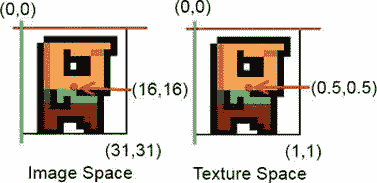

# 八、2D 游戏编程技巧

第七章展示了 OpenGL ES 为 2D 图形编程提供了很多特性，比如简单的旋转和缩放，以及视见区的自动拉伸。它还提供了优于使用画布的性能优势。

现在是时候看看 2D 游戏编程的一些更高级的主题了。你在写《提名先生》的时候直观地使用了其中的一些概念，包括基于时间的状态更新和图像地图集。接下来的许多事情也确实是非常直观的，并且很有可能你迟早会想出同样的解决方案。但是明确地了解这些东西也无妨。

对于 2D 游戏编程来说，有一些至关重要的概念。其中一些将与图形相关，其他的将处理你如何表现和模拟你的游戏世界。所有这些都有一个共同点:它们依赖于一点线性代数和三角学。不用担心，编写像超级马里奥兄弟这样的游戏所需的数学水平并不令人惊讶。让我们从复习 2D 线性代数和三角学的一些概念开始。

在开始之前

和前面的“理论”章节一样，我们将创建几个例子来感受一下发生了什么。对于这一章，我们可以重用我们在第七章开发的东西，主要是 GLGame、GLGraphics、Texture 和 Vertices 类，以及其余的框架类。

按照与在第七章中建立项目完全相同的方式建立一个新项目。将 com . bad logic . androidgames . framework 包复制到您的新项目中，然后创建一个名为 com . bad logic . androidgames . gamedev2d .的新包

添加一个名为 GameDev2DStarter 的 starter 类。重用 GLBasicsStarter 的代码，简单地替换测试的类名。修改清单文件，以便启动这个新的 starter 类。对于我们将要开发的每个测试，您必须以<activity>元素的形式向清单中添加一个条目。</activity>

每个测试都是游戏界面的一个实例，实际的测试逻辑是以测试的游戏实现中包含的屏幕的形式实现的，如前一章所述。为了节省一些页面，将只显示屏幕的相关部分。每个测试的 GLGame 和 Screen 实现的命名约定也是 XXXTest 和 XXXScreen。

既然这样，是时候谈谈向量了。

开始的时候。。。有一个向量

在第七章中，你学到了向量不应该和位置混在一起。这并不完全正确，因为我们可以(也将会)通过一个向量来表示某些空间中的位置。一个向量其实可以有多种解释:

*   *Position* :我们已经在前面的章节中使用它来编码实体相对于坐标系原点的坐标。
*   *速度和加速度* : 这些是你将在下一节听到的物理量。虽然您可能习惯于认为速度和加速度是一个单一的值，但它们实际上应该表示为 2D 或 3D 向量。它们不仅编码实体的速度(例如，以 100 km/h 行驶的汽车)，还编码实体行进的方向。注意，这种向量解释并没有说明向量是相对于原点给出的。这是有意义的，因为汽车的速度和方向与其位置无关。想象一辆车以 100 km/h 的速度在直线公路上向西北方向行驶，只要它的速度和方向不变，速度矢量也不会变，而它的位置会变。
*   *方向和距离* : 方向类似于速度但一般缺少物理量。你可以用这样的矢量解释来编码状态，比如*这个实体指向东南*。距离只是告诉我们一个位置离另一个位置有多远，在什么方向。

图 8-1 显示了这些解释的作用。


图 8-1。 Bob，用向量表示位置、速度、方向和距离

当然，图 8-1 并不详尽。向量可以有更多的解释。然而，对于我们的游戏开发需求，这四个基本解释就足够了。

图 8-1 中忽略的一点是矢量分量的单位。我们必须确保这些是合理的(例如，鲍勃的速度可以是米每秒，所以他在 1 秒内向左移动 2 米，向上移动 3 米)。位置和距离也是如此，它们也可以用米来表示。然而，鲍勃的方向是一个特例——它是无单位的。如果我们想要指定一个物体的大致方向，同时保持该方向的物理特征独立，这将非常方便。对于 Bob 的速度，我们可以这样做，将他的速度方向存储为一个方向向量，将他的速度存储为一个值。单值也被称为*标量*。方向向量的长度必须是 1，这将在本章后面讨论。

使用向量

向量的力量源于这样一个事实，即我们可以很容易地操纵和组合它们。在我们这样做之前，我们需要定义如何表示向量。这里有一个特别的，半数学的向量表示:

v = (x，y)

现在，这不是一个大惊喜；我们已经做了无数次了。在我们的 2D 空间中，每个矢量都有一个 x 和一个 y 分量。(是的，本章我们将停留在二维空间。)我们还可以加上两个向量:

c = a + b = (a.x，a.y) + (b.x，b.y) = (a.x + b.x，a.y + b.y)

我们所要做的就是把这些分量加在一起，得到最终的矢量。用图 8-1 中给出的矢量进行试验。假设你取鲍勃的位置， *p* = (3，2)，加上他的速度，*v*=(-2，3)。你到达一个新的位置，*p*' =(3+–2，2 + 3) = (1，5)。不要被这里的 *p* 后面的撇号搞糊涂了；它只是表示你有了一个新的向量。当然，这个小操作只有在位置和速度的单位吻合时才有意义。在这种情况下，我们假设位置以米(m)为单位给出，速度以米/秒(m/s)为单位给出，这非常合适。

当然，我们也可以减去向量:

c = a b =(a . x，a . y )( b . x，b . y)=(a . x b . x，a . y b . y)

同样，我们所做的就是把两个向量的分量结合起来。然而，请注意，我们从一个向量中减去另一个向量的顺序很重要。以图 8-1 中最右边的图像为例。我们在 *pg* = (1，4)处有一个绿色摆锤，在 *pr* = (6，1)处有一个红色摆锤，其中 *pg* 和 *pr* 分别代表绿色位置和红色位置。当我们获取从绿色 Bob 到红色 Bob 的距离矢量时，我们计算如下:

d = pg-pr =(1.4)-6.1)=(-5.3)

这很奇怪。这个矢量实际上是从红 Bob 指向绿 Bob！为了得到从绿鲍勃到红鲍勃的方向向量，我们必须颠倒减法的顺序:

d = pr-pg =(6.1)-(1.4)=(5，-3)

如果我们想要找到从位置 *a* 到位置 *b* 的距离向量，我们使用以下通用公式:

d = b a

换句话说，总是从结束位置减去开始位置。这一开始有点令人困惑，但如果你仔细想想，这绝对有道理。在一些图表纸上尝试一下吧！

我们也可以将一个向量乘以一个标量(记住，标量只是一个单一的值):

a' = a *标量= (a.x *标量，a.y *标量)

我们将向量的每个分量乘以标量。这让我们可以缩放向量的长度。以图 8-1 中的方向向量为例。指定为 *d* = (0，–1)。如果我们将它乘以标量 *s* = 2，我们有效地将它的长度翻倍: *d* × *s* = (0，–1×2)=(0，–2)。当然，我们可以通过使用一个小于 1 的标量使它变得更小——例如， *d* 乘以 *s* = 0.5 创建一个新的向量 *d* ' = (0，–0.5)。

说到长度，我们也可以计算向量的长度(以给出的单位):


符号简单的解释了这代表了向量的长度。如果你在学校的线性代数课上没有睡觉，你可能知道向量长度的公式。这只是应用于我们想象中的 2D 向量的毕达哥拉斯定理。向量的 x 和 y 分量形成直角三角形的两条边，第三条边是向量的长度。图 8-2 说明了这一点。


图 8-2。毕达哥拉斯也会喜欢向量

给定平方根的属性，向量长度总是正的或零。如果我们将此应用于红色 Bob 和绿色 Bob 之间的距离向量，我们可以计算出它们彼此相距多远(如果它们的位置以米为单位给出):


注意，如果我们计算|*pg*–*pr*|，我们会得到相同的值，因为长度与向量的方向无关。这个新知识还有另一层含义:当我们把一个向量乘以一个标量时，它的长度会相应地改变。给定一个向量 *d* = (0，–1)，原始长度为 1 个单位，你可以将其乘以 2.5，得到一个新的向量，长度为 2.5 个单位。

方向向量通常没有任何相关的单位。我们可以通过将它们乘以一个标量来给它们一个单位——比如我们可以将一个方向向量 *d* = (0，1)乘以一个速度常数 *s* = 100 m/s 得到一个速度向量 *v* = (0 × 100，1 × 100) = (0，100)。让方向向量的长度为 1 总是一个好主意。长度为 1 的向量称为 *单位向量*。我们可以通过将任何向量的每个分量除以其长度来使其成为单位向量:


记住|d|只是表示向量的长度 *d* 。试试看。假设你想要一个指向东北的方向向量: *d* = (1，1)。看起来这个向量已经是一个单位长度了，因为两个分量都是 1，对吗？错误:


你可以通过把向量变成单位向量来解决这个问题:


这也被称为*归一化*一个向量，，这仅仅意味着我们确保它的长度为 1。用这个小技巧，我们可以，例如，从一个距离向量创建一个单位长度的方向向量。当然，我们必须小心零长度向量，因为在这种情况下我们必须除以零！

一点三角学

现在我们来看一下三角学。三角学中有两个必不可少的函数: *余弦*和*正弦*。每一个都有一个参数:一个*角度*。您可能习惯于用度数来表示角度(例如，45 度或 360 度)。然而，在大多数数学库中，三角函数期望角度以弧度表示。我们可以使用以下等式轻松地进行角度和弧度之间的转换:

度数弧度(角度度数)=角度度数/180 *π

辐射度(角度)=角度辐射度/π* 180

这里， *pi* 是心爱的超常数，近似值为 3.14159265。 *pi* 弧度等于 180，所以前面的函数就是这么来的。

给定一个角度，余弦和正弦实际上计算什么？他们计算单位长度向量相对于原点的 x 和 y 分量。图 8-3 说明了这一点。


图 8-3。余弦和正弦产生一个单位矢量，其端点位于单位圆上

给定一个角度，我们可以创建一个单位长度的方向向量，如下所示:

v = (cos(角度)，sin(角度))

我们也可以反过来，计算矢量相对于 x 轴的角度:

角度= atan2 (v.y，v.x)

atan2 函数实际上是一个人工构造。它使用反正切函数(正切函数的反函数，三角学中的另一个基本函数)来构造一个在–180°到 180°范围内的角度(或者如果角度以弧度返回，则使用*–pi*到 *pi* )。内部有点复杂，在这个讨论中不太重要。自变量是向量的 y 和 x 分量。注意，矢量不必是 atan2 函数起作用的单位矢量。另外，请注意，通常会先给出 y 分量，然后给出 x 分量——但这取决于所选的数学库。这是一个常见的错误来源。

试举几个例子。给定一个向量 *v* = (cos(97)，sin(97))，atan2(sin(97)，cos(97))的结果是 97。太好了，很简单。使用向量 *v* = (1，–1)，你得到 atan2(–1，1)=–45。因此，如果矢量的 y 分量是负的，你将得到一个 0 到–180 的负角度。如果 atan2 的输出为负，您可以通过添加 360(或 2 个 *pi* )来解决这个问题。在前面的示例中，您将得到 315。

我们希望能够应用于矢量的最后一个操作是将它们旋转某个角度。下面的方程的推导又是相当复杂的。幸运的是，我们可以直接使用这些方程，不需要知道正交基向量。(提示:如果你想知道幕后发生了什么，这是在网上搜索的关键词。)下面是神奇的伪代码:

v.x' = cos(角度)* v . x sin(角度)* v.y

v.y' = sin(角度)* v.x + cos(角度)* v.y

哇，没想象中复杂。这将绕原点逆时针旋转任何矢量，不管你对矢量有什么解释。

加上向量加法、减法和标量乘法，我们实际上可以自己实现所有的 OpenGL 矩阵运算。这是进一步提高第七章中 BobTest 性能的解决方案的一部分。这将在下一节讨论。现在，让我们专注于所讨论的内容，并将其转移到代码中。

实现 Vector 类

现在我们可以为 2D 向量创建一个易于使用的向量类。我们称之为 Vector2。它应该有两个成员来保存向量的 x 和 y 分量。此外，它应该有几个不错的方法，允许你做以下事情:

*   加减向量
*   将向量分量与标量相乘
*   测量矢量的长度
*   标准化向量
*   计算向量和 x 轴之间的角度
*   旋转矢量

Java 缺乏操作符重载，所以我们必须想出一种机制来减少使用 Vector2 类的麻烦。理想情况下，我们应该有如下内容:

```java
Vector2 v = new Vector2();
v.add(10,5).mul(10).rotate(54);
```

我们可以通过让每个 Vector2 方法返回对 Vector 本身的引用来轻松实现这一点。当然，我们还想重载像 Vector2.add()这样的方法，这样我们就可以传入两个浮点数或者另一个 Vector2 的一个实例。清单 8-1 展示了你的 Vector2 类的全部荣耀，并在适当的地方添加了注释。

**清单 8-1。**Vector2.java；实现一些不错的 2D 矢量功能

```java
package com.badlogic.androidgames.framework.math;

import android.util.FloatMath;

public class Vector2 {
    public static float *TO_RADIANS* = (1 / 180.0f) * (float ) Math.*PI*;
    public static float *TO_DEGREES* = (1 / (float ) Math.*PI*) * 180;
    public float x, y;

    public Vector2() {
    }

    public Vector2(float x, float y) {
        this .x = x;
        this .y = y;
    }

    public Vector2(Vector2 other) {
        this .x = other.x;
        this .y = other.y;
    }
```

将该类放入包 com . badlogic . androidgames . framework . math 中，我们还将在其中存放任何其他与数学相关的类。

我们首先定义两个静态常数，TO _ 弧度和 TO _ 度。要转换以弧度表示的角度，我们只需将其乘以 TO _ DEGREES 要将以度为单位的角度转换为弧度，我们将它乘以 TO_RADIANS。我们可以通过查看之前定义的控制角度到弧度转换的两个等式来再次检查这一点。通过这个小技巧，我们可以减少一些分歧，加快速度。

接下来，我们定义成员 x 和 y，它们存储向量的分量，以及几个构造函数——没什么太复杂的:

```java
    public Vector2 cpy() {
        return new Vector2(x, y);
    }
```

cpy()方法将创建一个当前 vector 的副本实例并返回它。如果我们想要操作一个向量的副本，保留原始向量的值，这可能会很方便。

```java
    public Vector2 set(float x, float y) {
        this .x = x;
        this .y = y;
        return this ;
    }

    public Vector2 set(Vector2 other) {
        this .x = other.x;
        this .y = other.y;
        return this ;
    }
```

set()方法允许我们根据两个浮点参数或另一个向量来设置向量的 x 和 y 分量。这些方法返回对这个向量的引用，因此我们可以像前面讨论的那样链接操作。

```java
    public Vector2 add(float x, float y) {
        this .x += x;
        this .y += y;
        return this ;
    }

    public Vector2 add(Vector2 other) {
        this .x += other.x;
        this .y += other.y;
        return this ;
    }

    public Vector2 sub(float x, float y) {
        this .x -= x;
        this .y -= y;
        return this ;
    }

    public Vector2 sub(Vector2 other) {
        this .x -= other.x;
        this .y -= other.y;
        return this ;
    }
```

add()和 sub()方法有两种风格:在一种情况下，它们使用两个 float 参数，而在另一种情况下，它们使用另一个 Vector2 实例。这四个方法都返回了对这个向量的引用，这样我们就可以链接操作了。

```java
    public Vector2 mul(float scalar) {
        this .x *= scalar;
        this .y *= scalar;
        return this ;
    }
```

mul()方法只是将向量的 x 和 y 分量与给定的标量值相乘，并返回对向量本身的引用，用于链接。

```java
    public float len() {
        return FloatMath.*sqrt*(x * x + y * y);
    }
```

len()方法精确计算向量的长度，就像前面定义的那样。注意，我们使用 FloatMath 类，而不是 Java SE 提供的普通数学类。这是一个特殊的 Android API 类，使用浮点数而不是双精度数工作，至少在旧的 Android 版本上，它比等价的数学类要快一点。

```java
    public Vector2 nor() {
        float len = len();
        if (len != 0) {
            this .x /= len;
            this .y /= len;
        }
        return this ;
    }
```

nor()方法将向量标准化为单位长度。我们在内部使用 len()方法首先计算长度。如果是零，我们可以早点退出，避免被零除。否则，我们将向量的每个分量除以它的长度，得到一个单位长度的向量。为了链接，我们再次返回对这个向量的引用。

```java
    public float angle() {
        float angle = (float ) Math.*atan2*(y, x) **TO_DEGREES*;
        if (angle < 0)
            angle += 360;
        return angle;
    }
```

angle()方法使用 atan2()方法计算向量和 x 轴之间的角度，如前所述。我们必须使用 Math.atan2()方法，因为 FloatMath 类没有这个方法。返回的角度以弧度给出，所以我们通过乘以 TO_DEGREES 将其转换为度数。如果角度小于零，我们给它加上 360，这样我们可以返回一个范围在 0 到 360 之间的值。

```java
    public Vector2 rotate(float angle) {
        float rad = angle **TO_RADIANS*;
        float cos = FloatMath.*cos*(rad);
        float sin = FloatMath.*sin*(rad);

        float newX = this .x * cos - this .y * sin;
        float newY = this .x * sin + this .y * cos;

        this .x = newX;
        this .y = newY;

        return this ;
    }
```

rotate()方法只是将向量围绕原点旋转给定的角度。因为 FloatMath.cos()和 FloatMath.sin()方法希望角度以弧度给出，所以我们首先将它们从角度转换为弧度。接下来，我们使用之前定义的等式来计算向量的新 x 和 y 分量，然后返回向量本身，再次用于链接。

```java
    public float dist(Vector2 other) {
        float distX = this .x - other.x;
        float distY = this .y - other.y;
        return FloatMath.*sqrt*(distX * distX + distY * distY);
    }

    public float dist(float x, float y) {
        float distX = this .x - x;
        float distY = this .y - y;
        return FloatMath.*sqrt*(distX * distX + distY * distY);
    }

}
```

最后，我们有两种方法来计算这个向量和另一个向量之间的距离。

这就是我们闪亮的 Vector2 类，我们可以用它在接下来的代码中表示位置，速度，距离和方向。为了对您的新类有所了解，我们将在一个简单的例子中使用它。

一个简单的用法示例

这里有一个简单测试的建议:

*   我们创造了一种用三角形表示的大炮，它在我们的世界中有一个固定的位置。三角形的中心将位于(2.4，0.5)。
*   每次触摸屏幕时，我们都希望旋转三角形以面对触摸点。
*   我们的视图截锥将显示(0，0)和(4.8，3.2)之间的区域。我们不在像素坐标中操作，而是定义自己的坐标系，其中一个单位等于一米。此外，我们将在横向模式下工作。

有几件事我们需要考虑。我们已经知道如何在模型空间中定义一个三角形——我们可以为此使用一个顶点实例。我们的加农炮应该在默认方向上以 0 度角指向右边。图 8-4 显示了模型空间中的大炮三角形。


图 8-4。模型空间中的大炮三角

当我们渲染三角形时，我们只需使用 glTranslatef()将它移动到它在世界上的位置(2.4，0.5)。

我们还想旋转加农炮，使其尖端指向屏幕上我们最后触摸的点的方向。为此，我们需要找出世界上最后一次触摸事件的位置。GLGame.getInput()。getTouchX()和 getTouchY()方法将返回屏幕坐标中的触摸点，原点在左上角。Input 实例不会像在 Mr. Nom 中那样将事件缩放到一个固定的坐标系中。Intead，我们需要将这些触摸坐标转换成世界坐标。我们已经在 Nom 先生的触摸处理程序和基于画布的游戏框架中做到了这一点；这次唯一的不同是坐标系范围小了一点，我们世界的 y 轴指向上方。下面的伪代码展示了我们如何在一般情况下实现转换，这与第五章中的触摸处理程序几乎相同:

```java
worldX = (touchX / Graphics.getWidth()) * viewFrustmWidth
worldY = (1 - touchY / Graphics.getHeight()) * viewFrustumHeight
```

我们通过将触摸坐标除以屏幕分辨率，将触摸坐标归一化到范围(0，1)。在 y 坐标的情况下，我们从 1 中减去触摸事件的归一化 y 坐标来翻转 y 轴。剩下的就是通过视图截锥的宽度和高度缩放 x 和 y 坐标——在我们的例子中，是 4.8 和 3.2。从 worldX 和 worldY 中，我们可以构建一个 Vector2，它存储触摸点在您的世界坐标中的位置。

我们需要做的最后一件事是计算佳能旋转的角度。看一下图 8-5 ，它显示了我们的大炮和世界坐标中的一个接触点。


图 8-5。我们的加农炮在默认状态下，指向右边(角度= 0)，一个触摸点，以及我们需要旋转加农炮的角度。矩形是我们的视图截锥将在屏幕上显示的世界区域:(0，0)到(4.8，3.2)

我们需要做的只是创建一个从大炮中心(2.4，0.5)到接触点的距离向量(记住，我们必须从接触点减去大炮中心，而不是相反)。一旦我们有了距离向量，我们就可以用 Vector2.angle()方法计算角度。这个角度可以用来通过 glRotatef()旋转你的模型。

让我们编码。清单 8-2 显示了 CannonScreen 的相关部分，CannonTest 类的一部分，添加了适当的注释。

**清单 8-2。**摘自 CannonTest.java；触摸屏幕将旋转大炮

```java
class CannonScreen extends Screen {
    float FRUSTUM_WIDTH = 4.8f;
    float FRUSTUM_HEIGHT = 3.2f;
    GLGraphics glGraphics;
    Vertices vertices;
    Vector2 cannonPos = new Vector2(2.4f, 0.5f);
    float cannonAngle = 0;
    Vector2 touchPos = new Vector2();
```

如前所述，我们从定义平截头体的宽度和高度的两个常数开始。接下来，我们包括一个 GLGraphics 实例和一个 Vertices 实例。我们将加农炮的位置存储在 Vector2 中，将角度存储在 float 中。最后，我们有另一个 Vector2，可以用来计算从原点到接触点的向量与 x 轴之间的角度。

为什么我们将 Vector2 实例存储为类成员？我们可以在需要的时候实例化它们，但是那会让垃圾收集器生气。一般来说，我们尝试实例化所有 Vector2 实例一次，然后尽可能频繁地重用它们。

```java
    public CannonScreen(Game game) {
        super (game);
        glGraphics = ((GLGame) game).getGLGraphics();
        vertices = new Vertices(glGraphics, 3, 0, false , false );
        vertices.setVertices( new float [] { -0.5f, -0.5f,
                                            0.5f, 0.0f,
                                           -0.5f, 0.5f }, 0, 6);
    }
```

在构造函数中，我们获取 GLGraphics 实例并根据图 8-4 创建三角形。

```java
    @Override
    public void update(float deltaTime) {
        List<TouchEvent> touchEvents = game.getInput().getTouchEvents();
        game.getInput().getKeyEvents();

        int len = touchEvents.size();
        for (int i = 0; i < len; i++) {
            TouchEvent event = touchEvents.get(i);

            touchPos.x = (event.x / (float ) glGraphics.getWidth())
                    * FRUSTUM_WIDTH;
            touchPos.y = (1 - event.y / (float ) glGraphics.getHeight())
                    * FRUSTUM_HEIGHT;
            cannonAngle = touchPos.sub(cannonPos).angle();
        }

    }
```

接下来是 update()方法。我们简单地循环所有触摸事件，并计算大炮的角度。这可以分两步完成。首先，如前所述，我们将触摸事件的屏幕坐标转换到世界坐标系。我们将触摸事件的世界坐标存储在 touchPoint 成员中。然后我们从接触点向量中减去大炮的位置，这将产生图 8-5 中描绘的向量。然后我们计算这个向量和 x 轴之间的角度。这就是全部了！

```java
    @Override
    public void present(float deltaTime) {

        GL10 gl = glGraphics.getGL();
        gl.glViewport(0, 0, glGraphics.getWidth(), glGraphics.getHeight());
        gl.glClear(GL10.*GL_COLOR_BUFFER_BIT*);
        gl.glMatrixMode(GL10.*GL_PROJECTION*);
        gl.glLoadIdentity();
        gl.glOrthof(0, FRUSTUM_WIDTH, 0, FRUSTUM_HEIGHT, 1, -1);
        gl.glMatrixMode(GL10.*GL_MODELVIEW*);
        gl.glLoadIdentity();
        gl.glTranslatef(cannonPos.x, cannonPos.y, 0);
        gl.glRotatef(cannonAngle, 0, 0, 1);
        vertices.bind();
        vertices.draw(GL10.*GL_TRIANGLES*, 0, 3);
        vertices.unbind();
    }
```

present()方法做着和以前一样无聊的事情。我们设置视口，清空屏幕，使用我们的平截头体的宽度和高度设置正交投影矩阵，并告诉 OpenGL ES 所有后续的矩阵操作都将在模型-视图矩阵上进行。我们将一个单位矩阵加载到模型-视图矩阵中来“清除”它。接下来，我们将(相同的)模型-视图矩阵乘以一个平移矩阵，这将把你的三角形的顶点从模型空间移动到世界空间。我们用在 update()方法中计算的角度调用 glRotatef()，这样我们的三角形在被转换之前就在模型空间中旋转了。请记住，变换是以相反的顺序应用的，即首先应用最后指定的变换。最后，我们绑定三角形的顶点，渲染它，然后解除绑定。

```java
    @Override
    public void pause() {

    }

    @Override
    public void resume() {

    }

    @Override
    public void dispose() {

    }

}
```

现在我们有了一个可以跟随你每次触摸的三角形。图 8-6 显示触摸屏幕左上角后的输出。


图 8-6。我们的三角炮对左上角的触摸事件做出反应

请注意，我们是在加农炮位置渲染三角形还是渲染映射到加农炮图像的矩形纹理并不重要——OpenGL ES 并不在乎。我们在 present()方法中也有所有的矩阵运算。事实是，这样更容易跟踪 OpenGL ES 状态，并且我们可以在一个 present()调用中使用多个视图截锥(例如，一个视图截锥以米为单位设置世界，用于呈现我们的世界，另一个视图截锥以像素为单位设置世界，用于呈现 UI 元素)。对性能的影响并没有那么大，如第七章中所述，所以大多数时候这样做是可以接受的。请记住，如果需要的话，您可以对此进行优化。

从现在开始，Vectors 将是你最好的朋友。您可以使用它们来指定您世界中的几乎所有东西。你也将能够用向量做一些非常基本的物理。如果大炮不能发射，那它有什么用，对吗？

2D 的一点物理知识

在这一节，我们将讨论一个非常简单和有限的物理学版本。游戏就是要做好假货。他们尽可能作弊，以避免潜在的繁重计算。游戏中物体的行为不需要 100%物理准确；它只需要足够好，看起来可信。有时你甚至不想要物理上准确的行为(也就是说，你可能想让一组物体向下坠落，而另一组更疯狂的物体向上坠落)。

即使是最初的*超级马里奥兄弟*也至少使用了一些牛顿物理学的基本原理。这些原则真的很简单，也很容易实现。将只讨论为我们的游戏对象实现简单物理模型所需的绝对最小值。

牛顿和欧拉，永远的好朋友

我们主要关心的是所谓的*点质量*的运动物理学。运动物理学描述了物体的位置、速度和加速度随时间的变化。点质量意味着所有物体都近似为一个具有相关质量的无穷小的点。我们不必处理像扭矩这样的东西——物体围绕其质心的旋转速度——因为这是一个复杂的问题领域，已经有不止一本完整的书写了。我们只看物体的这三个属性:

*   位置:表示为某个空间中的向量——在我们的例子中，是 2D 空间。通常位置以米为单位。
*   *速度*:物体每秒钟位置的变化。速度被给定为 2D 速度向量，它是对象前进的单位长度方向向量和对象将移动的速度的组合，以米每秒(m/s)给定。注意，速度只是决定了速度向量的长度；如果你用速度归一化速度向量，你会得到一个很好的单位长度方向向量。
*   *加速度*:物体每秒钟的速度变化。我们可以用一个只影响速度的标量(速度向量的长度)来表示，或者用一个 2D 向量来表示，这样我们就可以在 x 轴和 y 轴上有不同的加速度。这里我们将选择后者，因为它允许我们更容易地使用诸如弹道学之类的东西。加速度通常以米/秒为单位(m/s <sup>2</sup> )。不，这不是打字错误，你改变了速度，以米每秒为单位。

当我们知道一个物体在给定时间点的属性时，我们可以整合它们来模拟物体随着时间的推移在世界中的路径。这听起来可能有点吓人，但是我们已经和 Nom 先生以及我们的 BobTest 类一起做过了。在那些情况下，我们没有使用加速度；我们简单地将速度设为一个固定的矢量。下面是我们如何综合物体的加速度、速度和位置:

```java
Vector2 position = new Vector2();
Vector2 velocity = new Vector2();
Vector2 acceleration = new Vector2(0, -10);
while (simulationRuns) {
   float deltaTime = getDeltaTime();
   velocity.add(acceleration.x * deltaTime, acceleration.y * deltaTime);
   position.add(velocity.x * deltaTime, velocity.y * deltaTime);
}
```

这叫*数值欧拉积分*，是游戏中使用的最直观的积分方法。我们从(0，0)处的位置开始，速度给定为(0，0)，加速度为(0，–10)，这意味着速度在 y 轴上将增加 1 m/s。在 x 轴上没有运动。在我们进入积分循环之前，我们的对象是静止的。在循环中，我们首先根据加速度乘以增量时间来更新速度，然后根据速度乘以增量时间来更新位置。这就是“整合 ??”这个可怕的大词的全部含义。

和往常一样，这还不到故事的一半。欧拉积分是一种“不稳定”的积分方法，应尽可能避免。通常，人们会使用所谓的 *verlet integration* 的变体，只是稍微复杂一点。然而，为了我们的目的，更简单的欧拉积分就足够了。

力和质量

你可能想知道加速度从何而来。这个问题问得好，答案很多。汽车的加速度来自发动机。发动机给汽车施加一个力，使它加速。但这还不是全部。由于重力，汽车也会加速向地心运动。唯一阻止它坠入地心的是地面，它无法穿过地面。地面抵消了这种重力。大意是这样的:

力=质量×加速度

您可以将其重新整理为以下等式:

加速度=力/质量

力的单位是国际单位制*牛顿*。(猜猜这是谁想出来的。)如果你指定加速度为矢量，那么你也必须指定力为矢量。因此，力可以有方向。例如，重力沿(0，–1)方向向下拉动。加速度也取决于物体的质量。一个物体的质量越大，你需要施加越大的力才能使它加速到和一个质量较小的物体一样快。这是前面方程的直接结果。

然而，对于简单的游戏，我们可以忽略质量和力，直接处理速度和加速度。上一节中的伪代码将加速度设置为(0，–10)m/s<sup>2</sup>(同样不是错别字)，这大致是一个物体向地球下落时的加速度，无论其质量如何(忽略空气阻力之类的东西)。是真的……问问伽利略！

理论上，到处玩

我们将用前面的例子来玩一个向地球坠落的物体。让我们假设我们让循环迭代十次，getDeltaTime()将总是返回 0.1 s。我们将获得每次迭代的以下位置和速度:

```java
time=0.1, position=(0.0,-0.1), velocity=(0.0,−1.0)
time=0.2, position=(0.0,-0.3), velocity=(0.0,-2.0)
time=0.3, position=(0.0,-0.6), velocity=(0.0,-3.0)
time=0.4, position=(0.0,-1.0), velocity=(0.0,-4.0)
time=0.5, position=(0.0,-1.5), velocity=(0.0,-5.0)
time=0.6, position=(0.0,-2.1), velocity=(0.0,-6.0)
time=0.7, position=(0.0,-2.8), velocity=(0.0,-7.0)
time=0.8, position=(0.0,-3.6), velocity=(0.0,-8.0)
time=0.9, position=(0.0,-4.5), velocity=(0.0,-9.0)
time=1.0, position=(0.0,-5.5), velocity=(0.0,-10.0)
```

1 秒钟后，我们的物体将下落 5.5 米，速度为(0，-10)米/秒，直接向下移动到地球的核心(当然，直到它撞到地面)。

我们的物体会不断增加向下的速度，因为我们没有考虑空气阻力。(如前所述，你很容易骗过自己的系统。)我们可以简单地通过检查当前速度长度来强制一个最大速度，它等于物体的速度。

无所不知的维基百科指出，一个自由落体的人的最大速度或极限速度大约是每小时 125 英里。将其转换为米/秒(125 × 1.6 × 1000 / 3600)，我们得到 55.5 米/秒。为了使我们的模拟更加真实，我们可以将环路修改如下:

```java
while (simulationRuns) {
   float deltaTime = getDeltaTime();
   if (velocity.len() < 55.5)
      velocity.add(acceleration.x * deltaTime, acceleration.y * deltaTime);
   position.add(velocity.x * deltaTime, velocity.y * deltaTime);
}
```

只要物体的速度(速度向量的长度)小于 55.5 m/s，我们就可以通过加速度来增加速度。当我们达到终极速度时，我们简单地停止加速度的增加。这种简单的速度上限是许多游戏中经常使用的技巧。

我们可以通过在 x 方向增加另一个加速度，比如说(–1，0) m/s <sup>2</sup> 来将风加入到方程中。为此，我们将重力加速度加到风加速度上，然后再加到速度上:

```java
Vector2 gravity = new Vector2(0,-10);
Vector2 wind = new Vector2(-1,0);
while (simulationRuns) {
   float deltaTime = getDeltaTime();
   acceleration.set(gravity).add(wind);
   if (velocity.len() < 55.5)
      velocity.add(acceleration.x * deltaTime, acceleration.y * deltaTime);
   position.add(velocity.x * deltaTime, velocity.y * deltaTime);
}
```

我们也可以完全忽略加速度，让我们的物体有一个固定的速度。我们在 BobTest 中正是这样做的。只有当每个摆锤碰到边缘时，我们才改变它的速度，而且是立即改变。

实际上是在玩

即使是这个简单的模型，可能性也是无穷无尽的。在这一节中，我们将扩展本章前面的小 CannonTest，这样我们就可以发射炮弹了。下面是我们想做的:

*   只要我们在屏幕上拖动手指，佳能就会跟着移动。这就是我们如何指定你击球的角度。
*   一旦我们收到一个触发事件，我们就可以向大炮指向的方向发射炮弹。炮弹的初速度将是大炮的方向和炮弹从开始就有的速度的组合。速度等于大炮和接触点之间的距离。我们接触得越远，炮弹就会飞得越快。
*   只要没有新的修饰事件，炮弹就会飞起来。
*   我们可以将你的视见体的大小加倍到(0，0)到(9.6，6.4)，这样我们可以看到我们世界的更多部分。此外，我们可以将大炮放置在(0，0)处。注意，现在世界上所有的单位都是米。
*   我们可以将炮弹渲染成一个大小为 0.2×0.2 米或 20×20 厘米的红色矩形——足够接近真实的炮弹。当然，你们当中的海盗可能会选择更真实的尺寸。

最初，炮弹的位置将是(0，0)—与大炮的位置相同。速度也将是(0，0)。由于我们在每次更新中应用重力，炮弹将简单地垂直落下。

一旦接收到触发事件，我们将球的位置设置回(0，0)并将其初始速度设置为(Math.cos(cannonAngle)，Math.sin(cannonAngle))。这将确保炮弹沿着大炮指向的方向飞行。此外，我们简单地通过将速度乘以接触点和大炮之间的距离来设置速度。接触点离大炮越近，炮弹飞得越慢。

听起来很简单，所以现在我们可以尝试实现它。将 CannonTest.java 文件中的代码复制到名为 CannonGravityTest.java 的新文件中。将该文件中包含的类重命名为 CannonGravityTest 和 CannonGravityScreen。清单 8-3 展示了 CannonGravityScreen 类，为了清楚起见添加了一些注释。

**清单 8-3。** 摘自 CannonGravityTest

```java
class CannonGravityScreen extends Screen {
    float FRUSTUM_WIDTH = 9.6f;
    float FRUSTUM_HEIGHT = 6.4f;
    GLGraphics glGraphics;
    Vertices cannonVertices;
    Vertices ballVertices;
    Vector2 cannonPos = new Vector2();
    float cannonAngle = 0;
    Vector2 touchPos = new Vector2();
    Vector2 ballPos = new Vector2(0,0);
    Vector2 ballVelocity = new Vector2(0,0);
    Vector2 gravity = new Vector2(0,-10);
```

没什么变化。我们简单地将视见体的大小加倍，并通过将视见体宽度和视见体高度分别设置为 9.6 和 6.2 来反映这一点。这意味着我们可以看到一个 9.2×6.2 米的长方形世界。由于我们也想绘制炮弹，我们添加了另一个顶点实例，称为 ballVertices，它将保存炮弹矩形的四个顶点和六个索引。新成员 ballPos 和 ballVelocity 存储炮弹的位置和速度，成员 gravity 是重力加速度，它将在我们程序的生命周期内保持恒定(0，–10)m/s<sup>2</sup>。

```java
    public CannonGravityScreen(Game game) {
        super (game);
        glGraphics = ((GLGame) game).getGLGraphics();
        cannonVertices = new Vertices(glGraphics, 3, 0, false , false );
        cannonVertices.setVertices( new float [] { -0.5f, -0.5f,
                                            0.5f, 0.0f,
                                           -0.5f, 0.5f }, 0, 6);
        ballVertices = new Vertices(glGraphics, 4, 6, false , false );
        ballVertices.setVertices( new float [] { -0.1f, -0.1f,
                                                0.1f, -0.1f,
                                                0.1f,  0.1f,
                                               -0.1f,  0.1f }, 0, 8);
        ballVertices.setIndices( new short [] {0, 1, 2, 2, 3, 0}, 0, 6);
    }
```

在构造函数中，我们简单地为炮弹的矩形创建额外的顶点实例。我们在模型空间中用顶点(–0.1、–0.1)、(0.1、–0.1)、(0.1、0.1)和(–0.1、0.1)来定义它。我们使用索引绘图，因此在这种情况下指定六个顶点。

```java
    @Override
    public void update(float deltaTime) {
        List<TouchEvent> touchEvents = game.getInput().getTouchEvents();
        game.getInput().getKeyEvents();

        int len = touchEvents.size();
        for (int i = 0; i < len; i++) {
            TouchEvent event = touchEvents.get(i);

            touchPos.x = (event.x / (float ) glGraphics.getWidth())
                    * FRUSTUM_WIDTH;
            touchPos.y = (1 - event.y / (float ) glGraphics.getHeight())
                    * FRUSTUM_HEIGHT;
            cannonAngle = touchPos.sub(cannonPos).angle();

            if (event.type == TouchEvent.*TOUCH_UP*) {
                float radians = cannonAngle * Vector2.*TO_RADIANS*;
                float ballSpeed = touchPos.len();
                ballPos.set(cannonPos);
                ballVelocity.x = FloatMath.*cos*(radians) * ballSpeed;
                ballVelocity.y = FloatMath.*sin*(radians) * ballSpeed;
            }

        }

        ballVelocity.add(gravity.x * deltaTime, gravity.y * deltaTime);
        ballPos.add(ballVelocity.x * deltaTime, ballVelocity.y * deltaTime);
    }
```

update()方法仅略有变化。世界坐标中接触点的计算和加农炮的角度仍然相同。第一个添加是事件处理循环中的 if 语句。万一我们得到一个润色事件，我们就准备好要发射的炮弹。我们将大炮的瞄准角度转换为弧度，因为我们稍后将使用 FastMath.cos()和 FastMath.sin()。接下来，我们计算大炮和接触点之间的距离。这将是炮弹的速度。我们将球的位置设置为大炮的位置。最后，我们计算炮弹的初速度。我们使用正弦和余弦，如前一节所讨论的，从加农炮的角度构建一个方向向量。我们将这个方向向量乘以炮弹的速度，得到最终的炮弹速度。这很有趣，因为炮弹从一开始就有这个速度。在现实世界中，在给定空气阻力、重力和大炮施加的力的情况下，炮弹当然会从 0 米/秒加速到它所能达到的任何速度。不过，我们可以在这里作弊，因为加速将发生在一个非常小的时间窗口内(几百毫秒)。我们在 update()方法中做的最后一件事是更新炮弹的速度，并基于此调整其位置。

```java
    @Override
    public void present(float deltaTime) {

        GL10 gl = glGraphics.getGL();
        gl.glViewport(0, 0, glGraphics.getWidth(), glGraphics.getHeight());
        gl.glClear(GL10.*GL_COLOR_BUFFER_BIT*);
        gl.glMatrixMode(GL10.*GL_PROJECTION*);

        gl.glLoadIdentity();
        gl.glOrthof(0, FRUSTUM_WIDTH, 0, FRUSTUM_HEIGHT, 1, -1);
        gl.glMatrixMode(GL10.*GL_MODELVIEW*);

        gl.glLoadIdentity();
        gl.glTranslatef(cannonPos.x, cannonPos.y, 0);
        gl.glRotatef(cannonAngle, 0, 0, 1);
        gl.glColor4f(1,1,1,1);
        cannonVertices.bind();
        cannonVertices.draw(GL10.*GL_TRIANGLES*, 0, 3);
        cannonVertices.unbind();

        gl.glLoadIdentity();
        gl.glTranslatef(ballPos.x, ballPos.y, 0);
        gl.glColor4f(1,0,0,1);
        ballVertices.bind();
        ballVertices.draw(GL10.*GL_TRIANGLES*, 0, 6);
        ballVertices.unbind();
    }
```

在 present()方法中，我们简单地添加了炮弹矩形的渲染。我们在渲染 cannon 的三角形之后这样做，这意味着我们必须在渲染矩形之前“清理”模型-视图矩阵。我们使用 glLoadIdentity()来实现这一点，然后使用 glTranslatef()在球的当前位置将炮弹的矩形从模型空间转换到世界空间。

```java
    @Override
    public void pause() {

    }

    @Override
    public void resume() {

    }

    @Override
    public void dispose() {

    }

}
```

如果你运行这个例子并触摸几次屏幕，你会对炮弹的飞行有很好的感觉。图 8-7 显示了输出(这并不令人印象深刻，因为它是一个静止的图像)。


图 8-7。射出红色长方形的三角炮。印象深刻！

对你的目的来说，这些物理知识已经足够了。有了这个简单的模型，我们可以模拟的远不止炮弹。例如，超级马里奥也可以用同样的方式模拟。如果你玩过*超级马里奥兄弟*，你可能会注意到马里奥在奔跑时需要一点时间才能达到最大速度。这可以通过非常快的加速度和速度上限来实现，如上一节的伪代码所示。跳跃的实现方式与发射炮弹非常相似。马里奥的当前速度将由 y 轴上的初始跳跃速度来调整(请记住，您可以像添加任何其他向量一样添加速度)。你总是施加一个负的 y 加速度(重力)，这使得他在跳跃后回到地面，或者掉进一个坑里。x 方向的速度不受 y 轴的影响。你仍然可以按左右键来改变 x 轴的速度。这个简单模型的美妙之处在于，它允许您用很少的代码实现非常复杂的行为。当你写下一个游戏时，你可以使用这种类型的物理学。

简单地发射炮弹并不好玩。你希望能够用炮弹击中物体。为此，您需要一种叫做碰撞检测的东西，我们将在下一节中研究它。

2D 中的碰撞检测和物体表示

一旦你的世界中有了移动的物体，你希望它们相互作用。一种这样的交互模式是简单的*碰撞检测*。当两个物体以某种方式重叠时，据说它们在碰撞。当你检查 Nom 先生是咬了自己还是吃了墨水渍时，我们已经在 Nom 先生身上做了一点碰撞检测。

碰撞检测伴随着*碰撞响应*:一旦我们确定两个物体发生了碰撞，我们需要通过以合理的方式调整我们物体的位置和/或移动来对碰撞做出响应。例如，当超级马里奥跳到古姆巴上时，古姆巴会去古姆巴天堂，马里奥会再跳一小段。一个更详细的例子是两个或多个台球的碰撞和响应。我们现在不需要进入这种碰撞响应，因为它对我们的目的来说是多余的。我们的碰撞响应通常包括改变对象的状态(例如，让对象爆炸或死亡，收集硬币，设置分数，等等)。这种类型的反应是依赖于游戏的，所以不会在这一节讨论。

那么我们如何判断两个物体是否发生了碰撞呢？首先，我们需要考虑何时检查碰撞。如果我们的对象遵循一个简单的物理模型，如前一节所述，我们可以在移动当前帧和时间步长的所有对象后检查碰撞。

边界形状

一旦我们有了对象的最终位置，我们就可以执行碰撞测试，这归结为重叠测试。但是重叠的是什么呢？我们的每一个物体都需要有某种数学定义的形式或形状来为它提供界限。在这种情况下，正确的术语是*边界形状*。图 8-8 显示了一些边界形状的选择。


图 8-8。鲍勃周围的各种边界形状

图 8-8 中三种边界形状的属性如下:

*   *三角形网格* : 通过用几个三角形近似物体的轮廓，尽可能紧密地限制物体。它需要最大的存储空间，而且很难构建，测试起来也很昂贵。然而，它给出了最精确的结果。我们不一定使用相同的三角形进行渲染，而只是简单地存储它们进行碰撞检测。网格可以存储为顶点列表，每三个后续的顶点形成一个三角形。为了节省内存，我们也可以使用索引顶点列表。
*   *轴对齐边界框* : 这通过一个轴对齐的矩形来限制对象，这意味着底部和顶部边缘总是与 x 轴对齐，而左侧和右侧边缘总是与 y 轴对齐。测试起来也很快，但不如三角形网格精确。边界框通常以其左下角位置加上其宽度和高度的形式存储。(在 2D 的例子中，这也被称为*边界矩形*。)
*   *包围圆* : 用能包含物体的最小圆来包围物体。它的测试速度非常快，但它是最不精确的边界形状。圆通常以圆心位置和半径的形式存储。

我们游戏中的每个物体都有一个包围它的边界形状，还有它的位置、比例和方向。当然，当我们移动对象时，我们需要根据对象的位置、比例和方向来调整边界形状的位置、比例和方向，比如在物理集成步骤中。

调整位置变化很容易:我们只需相应地移动边界形状。在三角形网格的情况下，移动每个顶点；在边框的情况下，移动左下角；在边界圆的情况下，移动中心。

缩放绑定图形有点困难。我们需要定义我们缩放的点。这通常是物体的位置，常给定为物体的中心。如果我们使用这个约定，那么伸缩就很容易。对于三角形网格，我们缩放每个顶点的坐标；对于边框，我们缩放其宽度、高度和左下角位置；对于边界圆，我们缩放其半径(圆心等于对象的中心)。

旋转边界形状还取决于旋转点的定义。使用刚才提到的约定(其中物体中心为旋转点)，旋转也变得容易。在三角形网格的情况下，我们简单地围绕物体的中心旋转所有的顶点。在边界圆的例子中，我们不需要做任何事情，因为无论我们如何旋转我们的对象，半径都会保持不变。边框更复杂一些。我们需要构建所有四个角点，旋转它们，然后找到包围这四个点的轴对齐的边界矩形。图 8-9 显示了旋转后的三个边界形状。


图 8-9。旋转的边界形状，以对象的中心为旋转点

虽然旋转三角形网格或边界圆相当容易，但轴对齐边界框的结果并不令人满意。请注意，原始对象的边界框比其旋转版本更紧密。有一种边界框变体，称为*定向边界形状*，，它更适合旋转，但它的缺点是更难计算。到目前为止，所涉及的边界形状已经足够满足我们的需求(以及大多数游戏)。如果你想更多地了解定向边界形状，并真正深入到碰撞检测，我们推荐克里斯特·埃里克森的书*实时碰撞检测*。

另一个问题是:我们如何首先为 Bob 创建边界形状？

构建边界形状

在图 8-8 所示的例子中，我们简单地根据 Bob 的图像手工构建了边界形状。但是如果鲍勃的图像是以像素为单位的，而你的世界是以米为单位的呢？这个问题的解决方案涉及到规范化和模型空间。想象一下当我们用 OpenGL ES 渲染 Bob 时，我们在模型空间中为他使用的两个三角形。该矩形在模型空间中以原点为中心，并具有与 Bob 的纹理图像相同的纵横比(宽度/高度)(即，纹理贴图中为 32×32 像素，而模型空间中为 2×2 m)。现在，我们可以应用 Bob 的纹理，并计算出模型空间中边界形状的点的位置。图 8-10 显示了我们如何在模型空间中构建鲍勃周围的边界形状。


图 8-10。在模型空间中围绕 Bob 的边界形状

这个过程可能看起来有点麻烦，但涉及的步骤并不那么难。我们首先要记住的是纹理映射是如何工作的。我们在纹理空间中为 Bob 的矩形(由两个三角形组成)的每个顶点指定纹理坐标。纹理空间中纹理图像的左上角在(0，0)，左下角在(1，1)，不管图像的实际宽度和高度是多少像素。要从图像的像素空间转换到纹理空间，我们可以使用这个简单的转换:

u = x / imageWidth

v = y / imageHeight

其中 u 和 v 是图像空间中由 x 和 y 给出的像素的纹理坐标。imageWidth 和 imageHeight 设置为图像的像素尺寸(在 Bob 的例子中为 32×32)。图 8-11 显示了 Bob 的图像中心如何映射到纹理空间。



图 8-11。将像素从图像空间映射到纹理空间

纹理应用于您在模型空间中定义的矩形。在图 8-10 的例子中，左上角在(–1，1)，右下角在(1，–1)。我们可以在我们的世界中使用米作为单位，因此矩形的宽度和高度为 2 m。此外，我们知道左上角的纹理坐标为(0，0)，右下角的纹理坐标为(1，1)，因此我们可以将完整的纹理映射到 Bob。情况不会总是这样，你会在后面的纹理贴图部分看到。

现在我们需要一种通用的方法来从纹理空间映射到模型空间。我们可以通过在纹理空间和模型空间中将我们的映射限制为仅与轴对齐的矩形来使我们的生活变得简单一些。假设纹理空间中的轴对齐矩形区域被映射到模型空间中的轴对齐矩形。对于转换，我们需要知道模型空间中矩形的宽度和高度，以及纹理空间中矩形的宽度和高度。在我们的 Bob 示例中，我们在模型空间中有一个 2×2 的矩形，在纹理空间中有一个 1×1 的矩形(因为我们将完整的纹理映射到矩形)。我们还需要知道每个矩形左上角在各自空间中的坐标。对于模型空间矩形，这是(–1，1)；对于纹理空间矩形，它是(0，0)(同样，因为我们映射的是完整的纹理，而不仅仅是一部分)。有了这些信息，以及我们要映射到模型空间的像素的 u 和 v 坐标，我们就可以用这两个等式进行转换:

MX =(u-minu)/(twidth)×mwidth+minx

my = （1 − （（v − minV） / （tHeight））× mHeight − minY

变量 u 和 v 是在先前从像素空间到纹理空间的变换中计算的坐标。变量 minU 和米女是从纹理空间映射的区域左上角的坐标。变量 tWidth 和 the height 是你的纹理空间区域的宽度和高度。变量 mWidth 和 mHeight 是模型空间矩形的宽度和高度。变量 minX 和 minY 是——您猜对了——模型空间中矩形左上角的坐标。最后，mx 和 my 是模型空间中的变换坐标。

这些方程采用 u 和 v 坐标，将它们映射到范围 0 到 1，然后在模型空间中缩放和定位它们。图 8-12 显示了纹理空间中的一个纹理元素，以及它如何映射到模型空间中的一个矩形。在侧面，你可以看到 tWidth 和 tHeight，以及 mWidth 和 mHeight。每个矩形的左上角对应于纹理空间中的(minU，米女)和模型空间中的(minX，minY)。


图 8-12。纹理空间到模型空间的映射

代入前两个方程，我们可以直接从像素空间到模型空间:

MX =((x/image width)-minu)/(twidth)* mwidth+minx

my = （1 − （（y / imageHeight） − minV） / （tHeight））* mHeight − minY

我们可以使用这两个方程，根据通过纹理映射映射到矩形的图像来计算对象的边界形状。在三角形网格的情况下，这可能有点乏味；包围矩形和包围圆形的情况要容易得多。通常，你不需要走这条艰难的路，而是创建你的纹理，使边界矩形至少具有与你通过 OpenGL ES 渲染的矩形相同的纵横比。这样，您可以直接从对象的图像维度构建边框。边界圆也是如此。

现在你应该知道如何为你的 2D 物体构造一个合适的边界形状。创建图形资源时手动定义这些边界形状大小，并定义游戏世界中对象的单位和大小。然后，您可以在代码中使用这些大小来碰撞对象。

游戏对象属性

鲍勃变得更胖了。除了我们用于渲染的网格(映射到 Bob 的图像纹理的矩形)，我们现在有了第二个数据结构，以某种形式保存他的边界。重要的是要认识到，当我们在模型空间中在 Bob 的映射版本之后建模边界时，实际的边界与 Bob 的矩形映射到的纹理区域无关。当然，当我们创建边界形状时，我们试图在纹理中与 Bob 图像的轮廓紧密匹配。然而，纹理图像是 32×32 像素还是 128×128 像素并不重要。因此，我们世界中的物体有三个属性组:

*   它的位置、方向、比例、速度和加速度:有了这些，我们可以应用上一节的物理模型。当然，有些对象可能是静态的，因此只有位置、方向和比例。通常，我们甚至可以忽略方向和比例。物体的位置通常与模型空间中的原点重合，如前面的图 8-10 所示。这使得一些计算更容易。
*   *它的边界形状(通常在模型空间中围绕物体的中心构建)*:这与它的位置一致，并与其方向和比例对齐，如图图 8-10 。这给了我们的对象一个边界，定义了它在世界上的大小。我们可以把这个形状做得尽可能复杂。例如，我们可以把它做成几个边界形状的组合。
*   *它的图形表示*:如图图 8-12 所示，我们仍然用两个三角形为 Bob 组成一个矩形，并将他的图像纹理映射到矩形上。矩形在模型空间中定义，但不一定等于边界形状，如图图 8-10 所示。我们发送给 OpenGL ES 的 Bob 的图形矩形略大于 Bob 的边界矩形。

这种属性分离允许我们应用模型-视图-控制器(MVC)模式，如下所示:

*   在模型方面，我们有 Bob 的物理属性，包括他的位置、比例、旋转、速度、加速度和边界形状。Bob 的位置、比例和方向决定了他的边界形状在世界空间中的位置。
*   该视图只是采用 Bob 的图形表示(即模型空间中定义的两个纹理映射的三角形)，并根据 Bob 的位置、旋转和缩放，在其世界空间位置进行渲染。这里我们可以像以前一样使用 OpenGL ES 矩阵运算。
*   控制器负责根据用户输入更新 Bob 的物理属性(例如，按下左按钮可以将他向左移动)，并根据物理力，例如重力加速度(就像我们在上一节中应用于炮弹一样)。

当然，Bob 的边界形状和他在纹理中的图形表示之间有一些对应关系，因为我们将边界形状建立在图形表示的基础上。因此，我们的 MVC 模式并不完全清晰，但我们可以接受。

宽相位和窄相位碰撞检测

然而，我们仍然不知道如何检查我们的对象和它们的边界形状之间的碰撞。碰撞检测有两个阶段:

*   *广泛阶段* : 在这个阶段，我们试图找出哪些物体可能会发生碰撞。想象一下，有 100 个物体可能会相互碰撞。如果我们天真地选择对照其他对象来测试每个对象，我们需要执行 100 × 100 / 2 的重叠测试。这种简单的重叠测试方法具有 O(*n*2)的渐近复杂度，这意味着它需要 n2 个步骤才能完成(它实际上可以在一半的步骤中完成，但是渐近复杂度忽略了任何常数)。在一个良好的、非暴力的广泛阶段，我们可以试图找出哪对物体实际上有碰撞的危险。其他对(例如，两个对象相距太远而不会发生碰撞)将不会被检查。我们可以通过这种方式减少计算量，因为窄相位测试通常非常昂贵。
*   *窄阶段* : 一旦我们知道哪对物体可能会碰撞，我们通过对它们的边界形状进行重叠测试来测试它们是否真的碰撞。

我们将首先讨论窄阶段，将宽阶段留到以后，因为宽阶段取决于我们游戏的一些特征，而窄阶段可以独立实现。

窄相位

一旦我们完成了粗略阶段，我们必须检查潜在碰撞物体的边界形状是否重叠。如前所述，我们有几个选择来限制形状。三角形网格是创建时计算量最大、最麻烦的，但是在大多数 2D 游戏中，你不需要它们，只需要使用包围矩形和包围圆形就可以了，所以这就是我们在这里要关注的。

圆形碰撞

边界圆是检查两个对象是否碰撞的最便宜的方法，所以让我们定义一个简单的 Circle 类。清单 8-4 显示了代码。

**清单 8-4。**Circle.java，一个简单的圆类

```java
package com.badlogic.androidgames.framework.math;

public class Circle {
    public final Vector2 center = new Vector2();
    public float radius;
    public Circle(float x, float y, float radius) {
        this .center.set(x,y);
        this .radius = radius;
    }

}
```

我们将中心存储为 Vector2，将半径存储为一个简单的浮点数。如何检查两个圆是否重叠？看看图 8 **-** 13 。


图 8-13。两个圆重叠(左)，两个圆不重叠(右)

它非常简单，计算效率高。我们需要做的就是计算出两个中心之间的距离。如果距离大于两个半径之和，那么我们知道这两个圆不重叠。在代码中，这将如下所示:

```java
public boolean overlapCircles(Circle c1, Circle c2) {
    float distance = c1.center.dist(c2.center);
    return distance <= c1.radius + c2.radius;
}
```

首先，我们测量两个中心之间的距离，然后检查距离是否小于或等于半径之和。

我们必须在 Vector2.dist()方法中取平方根。这是不幸的，因为求平方根是一个代价很高的操作。我们能快点吗？是的，我们可以——我们需要做的就是重新定义你的条件:

sqrt(距离 x 距离 x 距离 x 距离+y 距离 x 距离 y) <=半径 1 +半径 2

我们可以通过对不等式的两边取幂来去掉平方根，如下所示:

x 距离 x 距离 x 距离+y 距离 x y 距离< =(半径 1 +半径 2) ×(半径 1 +半径 2)

我们用平方根换另一个右边的加法和乘法。这个好多了。现在我们可以创建一个 Vector2.distSquared()函数，它将返回两个向量之间的平方距离:

```java
public float distSquared(Vector2 other) {
    float distX = this .x - other.x;
    float distY = this .y - other.y;
    return distX * distX + distY * distY;
}
```

我们还应该添加第二个 distSquared()方法，它采用两个浮点数(x 和 y)而不是一个向量。

overlapCircles()方法如下所示:

```java
public boolean overlapCircles(Circle c1, Circle c2) {
    float distance = c1.center.distSquared(c2.center);
    float radiusSum = c1.radius + c2.radius;
    return distance <= radiusSum * radiusSum;
}
```

矩形碰撞

对于矩形碰撞，我们首先需要一个可以表示矩形的类。如前所述，我们希望矩形由它的左下角位置加上它的宽度和高度来定义。清单 8-5 就是这么做的。

**清单 8-5。**Rectangle.java 的，一个长方形类

```java
package com.badlogic.androidgames.framework.math;

public class Rectangle {
    public final Vector2 lowerLeft;
    public float width, height;

    public Rectangle(float x, float y, float width, float height) {
        this .lowerLeft = new Vector2(x,y);
        this .width = width;
        this .height = height;
    }

}
```

我们将左下角的位置存储在 Vector2 中，宽度和高度存储在两个浮点数中。如何检查两个矩形是否重叠？图 8-14 应该给你一个提示。


图 8-14。大量重叠和不重叠的矩形

部分重叠(左)和不重叠(中)的前两种情况很容易。右边的案例是一个惊喜。当然，一个矩形可以完全包含在另一个矩形中。这也可能发生在圆的情况下。但是，如果一个圆包含在另一个圆中，我们的圆重叠测试将返回正确的结果。

起初，在矩形情况下检查重叠看起来很复杂。然而，如果我们使用一点逻辑，我们可以创建一个非常简单的测试。下面是检查两个矩形之间重叠的最简单方法:

```java
public boolean overlapRectangles(Rectangle r1, Rectangle r2) {
    if (r1.lowerLeft.x < r2.lowerLeft.x + r2.width &&
       r1.lowerLeft.x + r1.width > r2.lowerLeft.x &&
       r1.lowerLeft.y < r2.lowerLeft.y + r2.height &&
       r1.lowerLeft.y + r1.height > r2.lowerLeft.y)
        return true ;
    else
        return false ;
}
```

乍一看，这看起来有点混乱，所以让我们检查一下每个条件。第一个条件规定第一个矩形的左边缘必须在第二个矩形右边缘的左边。下一个条件声明第一个矩形的右边缘必须在第二个矩形左边缘的右边。其他两个条件同样适用于矩形的顶部和底部边缘。如果所有这些条件都满足，那么这两个矩形重叠。用图 8-14 再次检查。它还涵盖了遏制情况。

圆形/矩形碰撞

我们能检查圆和矩形之间的重叠部分吗？是的，我们可以。然而，这有点复杂。看一下图 8-15 。


图 8-15。重叠测试一个圆和一个矩形，通过找到矩形上/内最靠近圆的点

测试圆形和矩形之间重叠的总体策略如下:

*   找出距离圆心最近的矩形上或矩形中的 x 坐标。该坐标可以是矩形左边缘或右边缘上的点，除非圆心包含在矩形中，在这种情况下，最接近的 x 坐标是圆心的 x 坐标。
*   在距离圆心最近的矩形上或矩形内找到 y 坐标。该坐标可以是矩形上边缘或下边缘上的点，除非圆心包含在矩形中，在这种情况下，最接近的 y 坐标是圆心的 y 坐标。
*   如果由最近的 x 和 y 坐标组成的点在圆内，则圆和矩形重叠。

虽然没有在图 8-15 中描述，但该方法也适用于完全包含矩形的圆。代码如下:

```java
public boolean overlapCircleRectangle(Circle c, Rectangle r) {
    float closestX = c.center.x;
    float closestY = c.center.y;

    if (c.center.x < r.lowerLeft.x) {
        closestX = r.lowerLeft.x;
    }

    else if (c.center.x > r.lowerLeft.x + r.width) {
        closestX = r.lowerLeft.x + r.width;
    }

    if (c.center.y < r.lowerLeft.y) {
        closestY = r.lowerLeft.y;
    }

    else if (c.center.y > r.lowerLeft.y + r.height) {
        closestY = r.lowerLeft.y + r.height;
    }

    return c.center.distSquared(closestX, closestY) < c.radius * c.radius;
}
```

描述看起来比实现可怕得多。我们确定矩形上距离圆最近的点，然后简单地检查该点是否位于圆内。如果是这样，圆和矩形之间就有重叠。

注意，我们向 Vector2 添加了一个重载的 distSquared()方法，该方法采用两个浮点参数，而不是另一个 Vector2。我们对 dist()函数做同样的事情。

把这一切放在一起

检查一个点是否位于圆或矩形内也很有用。我们可以再编写两个方法，并将它们与我们刚刚定义的其他三个方法放在一个名为 OverlapTester 的类中。清单 8-6 显示了代码。

**清单 8-6。**OverlapTester.java；测试圆、矩形和点之间的重叠

```java
package com.badlogic.androidgames.framework.math;

public class OverlapTester {
    public static boolean overlapCircles(Circle c1, Circle c2) {
        float distance = c1.center.distSquared(c2.center);
        float radiusSum = c1.radius + c2.radius;
        return distance <= radiusSum * radiusSum;
    }

    public static boolean overlapRectangles(Rectangle r1, Rectangle r2) {
        if (r1.lowerLeft.x < r2.lowerLeft.x + r2.width &&
           r1.lowerLeft.x + r1.width > r2.lowerLeft.x &&
           r1.lowerLeft.y < r2.lowerLeft.y + r2.height &&
           r1.lowerLeft.y + r1.height > r2.lowerLeft.y)
            return true ;
        else
            return false ;
    }

    public static boolean overlapCircleRectangle(Circle c, Rectangle r) {
        float closestX = c.center.x;
        float closestY = c.center.y;

        if (c.center.x < r.lowerLeft.x) {
            closestX = r.lowerLeft.x;
        }

        else if (c.center.x > r.lowerLeft.x + r.width) {
            closestX = r.lowerLeft.x + r.width;
        }

        if (c.center.y < r.lowerLeft.y) {
            closestY = r.lowerLeft.y;
        }

        else if (c.center.y > r.lowerLeft.y + r.height) {
            closestY = r.lowerLeft.y + r.height;
        }

        return c.center.distSquared(closestX, closestY) < c.radius * c.radius;
    }

    public static boolean pointInCircle(Circle c, Vector2 p) {
        return c.center.distSquared(p) < c.radius * c.radius;
    }

    public static boolean pointInCircle(Circle c, float x, float y) {
        return c.center.distSquared(x, y) < c.radius * c.radius;
    }

    public static boolean pointInRectangle(Rectangle r, Vector2 p) {
        return r.lowerLeft.x <= p.x && r.lowerLeft.x + r.width >= p.x &&
               r.lowerLeft.y <= p.y && r.lowerLeft.y + r.height >= p.y;
    }

    public static boolean pointInRectangle(Rectangle r, float x, float y) {
        return r.lowerLeft.x <= x && r.lowerLeft.x + r.width >= x &&
               r.lowerLeft.y <= y && r.lowerLeft.y + r.height >= y;
    }

}
```

太好了。现在我们有了一个全功能的 2D 数学库，可以用于你所有的小物理模型和碰撞检测。现在，我们准备更详细地看一下广义阶段。

宽相位

那么，我们如何才能实现 broad 阶段所承诺的魔力呢？考虑图 8-16 ，它展示了一个典型的*超级马里奥兄弟*场景。


图 8-16。超级马里奥和他的敌人。对象周围的方框是它们的包围矩形；这些大盒子构成了一个强加于世界的网格

你能猜出你能做什么来消除一些碰撞检查吗？图 8-16 中的网格代表我们用来划分世界的细胞。每个细胞大小完全相同，整个世界都被细胞覆盖。马里奥目前在其中的两个单元中，马里奥可能与之相撞的其他物体在不同的单元中。因此，您不需要检查任何碰撞，因为马里奥与场景中的任何其他对象都不在同一个单元中。我们需要做的是:

*   基于我们的物理和控制器步骤更新世界上的所有对象。
*   根据对象的位置更新每个对象的边界形状的位置。我们当然也可以包括方位和尺度。
*   根据边界形状，找出每个对象包含在哪个或哪些单元格中，并将它们添加到这些单元格中包含的对象列表中。
*   检查碰撞，但只在可能碰撞的对象对之间(例如，Goombas 不会与其他 Goombas 碰撞)并且在同一单元中。

这被称为*空间散列网格*宽阶段，并且非常容易实现。你首先要定义的是每个单元格的大小。这很大程度上取决于你在游戏世界中使用的比例和单位。

复杂的例子

我们将基于前面的炮弹示例(位于“实际操作”部分)开发一个空间散列网格宽阶段。到目前为止，我们将对它进行彻底的修改，以包含本节中涉及的所有内容。除了大炮和炮弹，我们还要有靶子。我们让生活变得简单，只使用 0.5×0.5 米的正方形作为目标。这些方块不会移动；它们是静态的。我们的大炮也是静止的。唯一会动的是炮弹本身。我们通常可以将游戏世界中的物体分为静态物体和动态物体。让我们设计一个代表这些对象的类。

游戏对象、动态游戏对象和大炮

让我们从清单 8-7 中的静态情况，或基本情况开始。

**清单 8-7。**GameObject.java，一个有位置和边界的静态游戏对象

```java
package com.badlogic.androidgames.framework;

import com.badlogic.androidgames.framework.math.Rectangle;
import com.badlogic.androidgames.framework.math.Vector2;

public class GameObject {
    public final Vector2 position;
    public final Rectangle bounds;

    public GameObject(float x, float y, float width, float height) {
        this .position = new Vector2(x,y);
        this .bounds = new Rectangle(x-width/2, y-height/2, width, height);
    }

}
```

我们游戏中的每个物体都有一个与其中心重合的位置。此外，我们让每个对象都有一个单一的边界形状，在本例中是一个矩形。在构造函数中，我们根据参数设置位置和边界矩形(以对象的中心为中心)。

对于动态物体(即移动的物体)，我们还需要跟踪速度和加速度(如果物体实际上是自己加速的——例如，通过引擎或推进器)。清单 8-8 显示了 DynamicGameObject 类的代码。

**清单 8-8。**DynamicGameObject.java；用速度和加速度向量扩展游戏对象

```java
package com.badlogic.androidgames.framework;

import com.badlogic.androidgames.framework.math.Vector2;

public class DynamicGameObject extends GameObject {
    public final Vector2 velocity;
    public final Vector2 accel;

    public DynamicGameObject(float x, float y, float width, float height) {
        super (x, y, width, height);
        velocity = new Vector2();
        accel = new Vector2();
    }

}
```

我们扩展了 GameObject 类来继承位置和边界成员。此外，我们为速度和加速度创建向量。一个新的动态游戏对象在初始化后将会有零速度和零加速度。

在我们的炮弹例子中，我们有大炮、炮弹和目标。炮弹是一个动态游戏对象，因为它根据我们简单的物理模型移动。目标是静态的，可以使用标准的游戏对象来实现。大炮也可以通过 GameObject 类实现。我们将从 GameObject 类派生一个 cannon 类，并添加一个存储 Cannon 当前角度的字段。清单 8-9 显示了代码。

**清单 8-9。**Cannon.java；用一个角度扩展游戏对象

```java
package com.badlogic.androidgames.gamedev2d;

public class Cannon extends GameObject {
    public float angle;

    public Cannon(float x, float y, float width, float height) {
        super (x, y, width, height);
        angle = 0;
    }

}
```

这很好地封装了在我们的 cannon 世界中表示一个对象所需的所有数据。每当我们需要一种特殊的物体，比如大炮，你可以简单地从 GameObject，如果它是一个静态物体，或者从 DynamicGameObject，如果它有速度和加速度。

注意过度使用继承会导致严重的问题和非常丑陋的代码架构。不要为了使用它而使用它。刚刚使用的简单的类层次结构是可以的，但是你不应该让它变得更深(例如，通过扩展 Cannon)。游戏对象有不同的表现形式，通过组合来消除所有的继承。不过，对于您的目的来说，简单的继承已经足够了。如果你对其他表现感兴趣，在网上搜索“复合”或“混合”。

空间散列网格

我们的大炮将以 1×1 米的矩形为边界，炮弹的边界矩形为 0.2×0.2 米，每个目标的边界矩形为 0.5×0.5 米。边界矩形以每个对象的位置为中心，使我们的生活稍微轻松一些。

当我们的 cannon 示例启动时，我们可以简单地在随机位置放置一些目标。下面是我们如何在我们的世界中设置对象:

```java
Cannon cannon = new Cannon(0, 0, 1, 1);
DynamicGameObject ball = new DynamicGameObject(0, 0, 0.2f, 0.2f);
GameObject[] targets = new GameObject[NUM_TARGETS];
for (int i = 0; i < NUM_TARGETS; i++) {
    targets[i] = new GameObject((float )Math.*random*() * WORLD_WIDTH,
                                (float )Math.*random*() * WORLD_HEIGHT,
                                0.5f, 0.5f);
}
```

常量 WORLD_WIDTH 和 WORLD_HEIGHT 定义了我们游戏世界的大小。一切都应该发生在由(0，0)和(WORLD_WIDTH，WORLD_HEIGHT)包围的矩形内。图 8-17 显示了目前为止游戏世界的一个小模型。


图 8-17。你游戏世界的模型

我们的世界以后会是这个样子，但现在我们可以覆盖一个空间散列网格。散列网格的单元应该有多大？没有灵丹妙药，但一个好的启发是让它们比场景中最大的物体大五倍。在我们的例子中，最大的物体是加农炮，但我们没有用加农炮碰撞任何东西，所以我们可以根据场景中下一个最大的物体，即目标，来确定网格的大小。这些尺寸是 0.5×0.5 米。因此，网格单元的大小应为 2.5×2.5 米。图 8-18 显示了覆盖在我们世界上的网格。


图 8-18。我们的大炮世界，覆盖着一个由 12 个单元组成的空间散列网格

我们有固定数量的单元——在大炮世界中，是 12 个。我们给每个单元格一个唯一的编号，从左下角的单元格开始，它的 ID 为 0。请注意，顶部的单元格实际上延伸到世界之外。这不是问题；我们只需要确保我们所有的对象都在世界的边界之内。

我们想要做的是找出一个对象属于哪个(哪些)单元。理想情况下，我们希望计算包含该对象的单元格的 id。这允许您使用以下简单的数据结构来存储单元格:

```java
List<GameObject>[] cells;
```

没错；我们将每个单元格表示为一个游戏对象列表。空间散列网格本身只是由一组游戏对象列表组成。

现在我们可以算出包含一个对象的单元格的 id。图 8-18 显示了跨越两个单元格的几个目标。事实上，一个小对象最多可以跨越四个单元格，一个比网格单元格大的对象可以跨越四个以上的单元格。我们可以通过选择网格尺寸为游戏中最大物体尺寸的倍数来确保这种情况不会发生。这就给我们留下了一种可能性，一个物体最多包含在四个单元格中。

为了计算一个对象的单元 id，我们简单地取边界矩形的四个角点，并检查每个角点在哪个单元中。确定一个点所在的像元很容易，我们只需要用它的坐标除以像元的宽度。假设在(3，4)处有一个点，像元大小为 2.5×2.5 米:该点将位于 ID 为 5 的像元中，如图 8-18 中的所示。

我们可以将每个点的坐标除以像元大小，得到 2D 整数坐标，如下所示:

cellX = floor(point . x/cellSize)= floor(3/2.5)= 1

cellY = floor(point . y/cellSize)= floor(4/2.5)= 1

从这些细胞坐标，我们可以很容易地得到细胞 ID:

cellid = cellx+celly×celllock ow = 1+1×4 = 5

常数 cells row 就是我们需要用 x 轴上的细胞覆盖我们的世界的细胞数:

单元格行=单元格(世界宽度/单元格大小)=单元格(9.6 / 2.5) = 4

我们可以这样计算每列所需的单元格数量:

cell column = ceil(world height/cell size)= ceil(6.4/2.5)= 3

基于此，我们可以相当容易地实现空间散列网格。我们通过给它世界的大小和想要的细胞大小来设置它。我们假设所有的行为都发生在世界的正象限。这意味着世界上所有点的 x 和 y 坐标都将是正的。这是我们可以接受的约束。

根据参数，空间散列网格可以计算出它需要多少个像元(cellsPerRow × cellsPerColumn)。我们还可以添加一个简单的方法来将对象插入到网格中，该方法将使用对象的边界来确定包含它的单元格。然后，该对象将被添加到它包含的每个单元格的对象列表中。如果对象边界形状的一个角点在网格之外，我们可以忽略这个角点。

在每一帧中，我们在更新对象的位置后，将每个对象重新插入到空间散列网格中。然而，在我们的加农炮世界中有不移动的物体，所以为每一帧重新插入它们是非常浪费的。我们通过在每个单元格中存储两个列表来区分动态对象和静态对象。一个列表将每帧更新一次，并且仅保存移动的对象，而另一个列表将是静态的，并且仅在插入新的静态对象时才被修改。

最后，我们需要一个方法来返回我们希望与其他对象发生碰撞的对象的单元格中的对象列表。这个方法所做的就是检查有问题的对象在哪些单元格中，检索这些单元格中的动态和静态对象的列表，并将列表返回给调用者。当然，我们必须确保不返回任何副本，如果一个对象位于多个单元格中，就会出现这种情况。

清单 8-10 显示了代码(嗯，大部分)。稍后将讨论 SpatialHashGrid.getCellIds()方法，因为它有点复杂。

**清单 8-10。**摘自 SpatialHashGrid.java；一种空间哈希网格实现

```java
package com.badlogic.androidgames.framework;

import java.util.ArrayList;

import java.util.List;

import com.badlogic.androidgames.framework.GameObject;

import android.util.FloatMath;

public class SpatialHashGrid {
    List<GameObject>[] dynamicCells;
    List<GameObject>[] staticCells;
    int cellsPerRow;
    int cellsPerCol;
    float cellSize;
    int [] cellIds = new int [4];
    List<GameObject> foundObjects;
```

如前所述，我们存储两个单元格列表，一个用于动态对象，一个用于静态对象。我们还存储每一行和每一列的单元，以便我们以后可以决定我们检查的点是在世界内部还是外部。单元大小也需要被存储。cell IDs 数组是一个工作数组，我们可以用它来临时存储一个游戏对象所包含的四个单元 id。如果它只包含在一个单元格中，那么只有数组的第一个元素将被设置为包含整个对象的单元格的单元格 ID。如果对象包含在两个单元格中，那么数组的前两个元素将保存单元格 ID，依此类推。为了指示单元格 id 的数量，我们将数组的所有“空”元素设置为–1。foundObjects 列表也是一个工作列表，我们可以在调用 getPotentialColliders()时返回它。为什么我们保留这两个成员，而不是在每次需要时实例化一个新的数组和列表？还记得垃圾收集怪物吗？

```java
    @SuppressWarnings("unchecked")
    public SpatialHashGrid(float worldWidth, float worldHeight, float cellSize) {
        this .cellSize = cellSize;
        this .cellsPerRow = ( int )FloatMath.*ceil*(worldWidth / cellSize);
        this .cellsPerCol = ( int )FloatMath.*ceil*(worldHeight / cellSize);
        int numCells = cellsPerRow * cellsPerCol;
        dynamicCells = new List[numCells];
        staticCells = new List[numCells];
        for (int i = 0; i < numCells; i++) {
            dynamicCells[i] = new ArrayList<GameObject>(10);
            staticCells[i] = new ArrayList<GameObject>(10);
        }
        foundObjects = new ArrayList<GameObject>(10);
    }
```

该类的构造函数获取世界的大小和所需的单元格大小。根据这些参数，我们计算需要多少个单元格，并实例化单元格数组和保存每个单元格中包含的对象的列表。初始化 foundObjects 列表。我们创建的所有数组列表实例的初始容量都是 10 个 GameObject 实例。我们这样做是为了避免内存分配。假设一个单元不太可能包含十个以上的游戏对象实例。只要这是真的，数组列表就不需要调整大小。

```java
    public void insertStaticObject(GameObject obj) {
        int [] cellIds = getCellIds(obj);
        int i = 0;
        int cellId = -1;
        while (i <= 3 && (cellId = cellIds[i++]) != -1) {
            staticCells[cellId].add(obj);
        }

    }

    public void insertDynamicObject(GameObject obj) {
        int [] cellIds = getCellIds(obj);
        int i = 0;
        int cellId = -1;
        while (i <= 3 && (cellId = cellIds[i++]) != -1) {
            dynamicCells[cellId].add(obj);
        }

    }
```

接下来是 insertStaticObject()和 insertDynamicObject()方法。它们通过调用 getCellIds()计算包含该对象的单元格的 id，，并相应地将该对象插入到适当的列表中。getCellIds()方法将实际填充 CellIds 成员数组。

```java
    public void removeObject(GameObject obj) {
        int [] cellIds = getCellIds(obj);
        int i = 0;
        int cellId = -1;
        while (i <= 3 && (cellId = cellIds[i++]) != -1) {
            dynamicCells[cellId].remove(obj);
            staticCells[cellId].remove(obj);
        }

    }
```

我们还有一个 removeObject()方法，可以用它来判断对象在哪个单元格中，然后相应地从动态或静态列表中删除它。例如，当一个游戏对象死亡时，这将是需要的。

```java
    public void clearDynamicCells(GameObject obj) {
        int len = dynamicCells.length;
        for (int i = 0; i < len; i++) {
            dynamicCells[i].clear();
        }

    }
```

clearDynamicCells()方法将用于清除所有动态单元格列表。如前所述，我们需要在重新插入动态对象之前调用这个框架。

```java
    public List<GameObject> getPotentialColliders(GameObject obj) {
        foundObjects.clear();
        int [] cellIds = getCellIds(obj);
        int i = 0;
        int cellId = -1;
        while (i <= 3 && (cellId = cellIds[i++]) != -1) {
            int len = dynamicCells[cellId].size();
            for (int j = 0; j < len; j++) {
                GameObject collider = dynamicCells[cellId].get(j);
                if (!foundObjects.contains(collider))
                    foundObjects.add(collider);
            }

            len = staticCells[cellId].size();
            for (int j = 0; j < len; j++) {
                GameObject collider = staticCells[cellId].get(j);
                if (!foundObjects.contains(collider))
                    foundObjects.add(collider);
            }

        }

        return foundObjects;
    }
```

最后，getPotentialColliders()方法获取一个对象，并返回一个包含在与该对象相同的单元格中的相邻对象的列表。我们使用工作列表 foundObjects 来存储找到的对象的列表。同样，我们不希望每次调用这个方法时都实例化一个新的列表。我们需要做的就是找出传递给方法的对象在哪个单元格中。然后，我们只需将这些单元格中的所有动态和静态对象添加到 foundObjects 列表中，并确保没有重复的对象。使用 foundObjects.contains()来检查重复项当然不是最佳选择，但是考虑到找到的对象数量不会很大，在这种情况下使用它是可以接受的。如果我们遇到性能问题，那么这是我们优化的首选。可悲的是，这不是小事。当然，我们可以使用集合，但是每次我们添加一个对象到集合中时，它会在内部分配新的对象。现在，我们只是让它保持原样，知道如果性能方面出现任何问题，我们可以回头再来。

遗漏的方法是 SpatialHashGrid.getCellIds()。清单 8-11 显示了它的代码。别害怕，它只是看起来很危险。

**清单 8-11。**SpatialHashGrid.java 其余地区的；实现 getCellIds()

```java
    public int [] getCellIds(GameObject obj) {
        int x1 = ( int )FloatMath.*floor*(obj.bounds.lowerLeft.x / cellSize);
        int y1 = ( int )FloatMath.*floor*(obj.bounds.lowerLeft.y / cellSize);
        int x2 = ( int )FloatMath.*floor*((obj.bounds.lowerLeft.x + obj.bounds.width) / cellSize);
        int y2 = ( int )FloatMath.*floor*((obj.bounds.lowerLeft.y + obj.bounds.height) / cellSize);

        if (x1 == x2 && y1 == y2) {
            if (x1 >= 0 && x1 < cellsPerRow && y1 >= 0 && y1 < cellsPerCol)
                cellIds[0] = x1 + y1 * cellsPerRow;
            else
                cellIds[0] = -1;
            cellIds[1] = -1;
            cellIds[2] = -1;
            cellIds[3] = -1;
        }

        else if (x1 == x2) {
            int i = 0;
            if (x1 >= 0 && x1 < cellsPerRow) {
                if (y1 >= 0 && y1 < cellsPerCol)
                    cellIds[i++] = x1 + y1 * cellsPerRow;
                if (y2 >= 0 && y2 < cellsPerCol)
                    cellIds[i++] = x1 + y2 * cellsPerRow;
            }
            while (i <= 3) cellIds[i++] = -1;
        }
        else if (y1 == y2) {
            int i = 0;
            if (y1 >= 0 && y1 < cellsPerCol) {
                if (x1 >= 0 && x1 < cellsPerRow)
                    cellIds[i++] = x1 + y1 * cellsPerRow;
                if (x2 >= 0 && x2 < cellsPerRow)
                    cellIds[i++] = x2 + y1 * cellsPerRow;
            }
            while (i <= 3) cellIds[i++] = -1;
        }
        else {
            int i = 0;
            int y1CellsPerRow = y1 * cellsPerRow;
            int y2CellsPerRow = y2 * cellsPerRow;
            if (x1 >= 0 && x1 < cellsPerRow && y1 >= 0 && y1 < cellsPerCol)
                cellIds[i++] = x1 + y1CellsPerRow;
            if (x2 >= 0 && x2 < cellsPerRow && y1 >= 0 && y1 < cellsPerCol)
                cellIds[i++] = x2 + y1CellsPerRow;
            if (x2 >= 0 && x2 < cellsPerRow && y2 >= 0 && y2 < cellsPerCol)
                cellIds[i++] = x2 + y2CellsPerRow;
            if (x1 >= 0 && x1 < cellsPerRow && y2 >= 0 && y2 < cellsPerCol)
                cellIds[i++] = x1 + y2CellsPerRow;
            while (i <= 3) cellIds[i++] = -1;
        }
        return cellIds;
    }

}
```

此方法的前四行计算对象边框左下角和右上角的单元格坐标。这个计算前面已经讨论过了。要理解这个方法的其余部分，请考虑一个对象如何重叠网格单元。有四种可能:

*   该对象包含在单个单元格中。因此，边框的左下角和右上角具有相同的单元坐标。
*   对象与两个单元格水平重叠。左下角在一个单元格中，右上角在右边的单元格中。
*   该对象垂直重叠两个单元格。左下角在一个单元格中，右上角在上面的单元格中。
*   该对象与四个单元格重叠。左下角在一个单元格中，右下角在右边的单元格中，右上角在它上面的单元格中，左上角在第一个单元格上面的单元格中。

这种方法所做的只是为这些可能性中的每一个做一个特例。第一个 if 语句检查单个单元格的情况，第二个 if 语句检查水平双单元格的情况，第三个 if 语句检查垂直双单元格的情况，else 块处理对象与四个网格单元格重叠的情况。在四个块的每一个中，我们确保仅当相应的单元坐标在世界范围内时才设置单元 ID。这就是这个方法的全部内容。

现在，这个方法看起来需要大量的计算能力。的确如此，但比它的规模所暗示的要小。最常见的情况是第一种，处理起来非常便宜。你能看到进一步优化这种方法的机会吗？

把这一切放在一起

让我们把在这一节中收集的所有知识放在一起，形成一个漂亮的小例子。我们可以扩展上一节的 cannon 示例，就像几页前讨论的那样。我们使用一个加农炮对象作为加农炮，一个动态游戏对象作为炮弹，还有一些游戏对象作为目标。每个目标的大小为 0.5×0.5 米，随机放置在世界各地。

我们希望能够射击这些目标。为此，我们需要碰撞检测。我们可以循环所有的目标，对照炮弹检查它们，但那会很无聊。我们使用新的 SpatialHashGrid 类来加速寻找当前球位置的潜在碰撞目标的过程。我们不把球或大炮放进格子里，因为那不会真正帮助你。

因为这个例子已经很大了，所以把它分成了多个清单。调用测试 CollisionTest 和相应的屏幕 CollisionScreen。一如既往，我们只看屏幕代码。让我们从清单 8-12 中的成员和构造函数开始。

**清单 8-12。**摘自 CollisionTest.java；成员和构造函数

```java
class CollisionScreen extends Screen {
    final int NUM_TARGETS = 20;
    final float WORLD_WIDTH = 9.6f;
    final float WORLD_HEIGHT = 4.8f;
    GLGraphics glGraphics;
    Cannon cannon;
    DynamicGameObject ball;
    List<GameObject> targets;
    SpatialHashGrid grid;

    Vertices cannonVertices;
    Vertices ballVertices;
    Vertices targetVertices;

    Vector2 touchPos = new Vector2();
    Vector2 gravity = new Vector2(0,-10);

    public CollisionScreen(Game game) {
        super (game);
        glGraphics = ((GLGame)game).getGLGraphics();
        cannon = new Cannon(0, 0, 1, 1);
        ball = new DynamicGameObject(0, 0, 0.2f, 0.2f);
        targets = new ArrayList<GameObject>(NUM_TARGETS);
        grid = new SpatialHashGrid(WORLD_WIDTH, WORLD_HEIGHT, 2.5f);
        for (int i = 0; i < NUM_TARGETS; i++) {
            GameObject target = new GameObject((float )Math.*random*() * WORLD_WIDTH,
                                               (float )Math.*random*() * WORLD_HEIGHT,
                                               0.5f, 0.5f);
            grid.insertStaticObject(target);
            targets.add(target);
        }

        cannonVertices = new Vertices(glGraphics, 3, 0, false , false );
        cannonVertices.setVertices( new float [] { -0.5f, -0.5f,
                                                  0.5f, 0.0f,
                                                 -0.5f, 0.5f }, 0, 6);

        ballVertices = new Vertices(glGraphics, 4, 6, false , false );
        ballVertices.setVertices( new float [] { -0.1f, -0.1f,
                                                0.1f, -0.1f,
                                                0.1f,  0.1f,
                                               -0.1f,  0.1f }, 0, 8);
        ballVertices.setIndices( new short [] {0, 1, 2, 2, 3, 0}, 0, 6);
        targetVertices = new Vertices(glGraphics, 4, 6, false , false );
        targetVertices.setVertices( new float [] { -0.25f, -0.25f,
                                                  0.25f, -0.25f,
                                                  0.25f,  0.25f,
                                                 -0.25f,  0.25f }, 0, 8);
        targetVertices.setIndices( new short [] {0, 1, 2, 2, 3, 0}, 0, 6);
    }
```

我们可以从炮弹屏幕上获得很多信息。我们从几个恒定的定义开始，控制目标的数量和我们世界的大小。接下来，我们有 GLGraphics 实例，以及大炮、球和目标的对象，它们存储在一个列表中。当然，我们也有一个空间散列网格。为了渲染我们的世界，我们需要几个网格:一个用于大炮，一个用于球，一个用于渲染每个目标。请记住，我们在 BobTest 中只需要一个矩形就可以将 100 个 bob 呈现到屏幕上。我们在这里重用该原则，只使用一个顶点实例来保存目标的三角形(矩形)。最后两个成员与 CannonGravityTest 中的成员相同。当用户触摸屏幕时，我们用它们来击球和施加重力。

构造函数完成前面讨论的所有事情。实例化我们的世界对象和网格。唯一有趣的是，我们还将目标作为静态对象添加到空间散列网格中。

现在看看清单 8-13 中的 CollisionTest 类的下一个方法。

**清单 8-13。**摘自 CollisionTest.java；update()方法

```java
@Override
public void update(float deltaTime) {
    List<TouchEvent> touchEvents = game.getInput().getTouchEvents();
    game.getInput().getKeyEvents();
    int len = touchEvents.size();
    for (int i = 0; i < len; i++) {
        TouchEvent event = touchEvents.get(i);

        touchPos.x = (event.x / (float ) glGraphics.getWidth()) * WORLD_WIDTH;
        touchPos.y = (1 - event.y / (float ) glGraphics.getHeight()) * WORLD_HEIGHT;

        cannon.angle = touchPos.sub(cannon.position).angle();

        if (event.type == TouchEvent.*TOUCH_UP*) {
            float radians = cannon.angle * Vector2.*TO_RADIANS*;
            float ballSpeed = touchPos.len() * 2;
            ball.position.set(cannon.position);
            ball.velocity.x = FloatMath.*cos*(radians) * ballSpeed;
            ball.velocity.y = FloatMath.*sin*(radians) * ballSpeed;
            ball.bounds.lowerLeft.set(ball.position.x - 0.1f, ball.position.y - 0.1f);
        }

    }

    ball.velocity.add(gravity.x * deltaTime, gravity.y * deltaTime);
    ball.position.add(ball.velocity.x * deltaTime, ball.velocity.y * deltaTime);
    ball.bounds.lowerLeft.add(ball.velocity.x * deltaTime, ball.velocity.y * deltaTime);

    List<GameObject> colliders = grid.getPotentialColliders(ball);
    len = colliders.size();

    for (int i = 0; i < len; i++) {
        GameObject collider = colliders.get(i);
        if (OverlapTester.*overlapRectangles*(ball.bounds, collider.bounds)) {
            grid.removeObject(collider);
            targets.remove(collider);
        }

    }

}
```

和往常一样，首先我们获取触摸和按键事件，并且只迭代触摸事件。触摸事件的处理几乎与 CannonGravityTest 中的相同。唯一的区别是，我们使用 cannon 对象，而不是旧示例中的 vectors，并且当 Cannon 在 touch-up 事件后准备射击时，我们重置球的边界矩形。

下一个变化是我们如何更新球。我们使用为球实例化的 DynamicGameObject 的成员，而不是直接的向量。我们忽略了 DynamicGameObject.acceleration 成员，而是将重力添加到球的速度中。我们把球的速度乘以 2，让炮弹飞得快一点。有趣的是，我们不仅更新了球的位置，还更新了边框左下角的位置。这是至关重要的，否则我们的球会移动，但其边界矩形不会。为什么我们不简单地使用球的外接矩形来存储球的位置呢？我们可能希望将多个边界形状附加到一个对象上。那么哪个边界形状会保存对象的实际位置呢？因此，将这两件事分开是有益的，并且只会引入少量的计算开销。当然，我们可以通过将速度乘以时间增量来优化它。开销可以归结为另外两项增加——这是我们获得灵活性的小小代价。

这个方法的最后一部分是我们的碰撞检测代码。我们在空间散列网格中找到目标，这些目标与我们的炮弹在同一个单元中。为此，我们使用 spatialhashgrid . getpotential colliders()方法。因为球所在的单元格在该方法中被直接计算，所以我们不需要将球插入网格。接下来，我们遍历所有潜在的碰撞体，并检查球的边界矩形和潜在碰撞体的边界矩形之间是否真的有重叠。如果有，我们只需从目标列表中删除目标。记住，我们只将目标作为静态对象添加到网格中。

这些就是我们完整的游戏机制。拼图的最后一块是实际的渲染，这不应该真的让你吃惊。参见清单 8-14 中的代码。

**清单 8-14。**摘自 CollisionTest.java；present()方法

```java
@Override
public void present(float deltaTime) {
    GL10 gl = glGraphics.getGL();
    gl.glViewport(0, 0, glGraphics.getWidth(), glGraphics.getHeight());
    gl.glClear(GL10.*GL_COLOR_BUFFER_BIT*);
    gl.glMatrixMode(GL10.*GL_PROJECTION*);
    gl.glLoadIdentity();
    gl.glOrthof(0, WORLD_WIDTH, 0, WORLD_HEIGHT, 1, -1);
    gl.glMatrixMode(GL10.*GL_MODELVIEW*);

    gl.glColor4f(0, 1, 0, 1);
    targetVertices.bind();
    int len = targets.size();
    for (int i = 0; i < len; i++) {
        GameObject target = targets.get(i);
        gl.glLoadIdentity();
        gl.glTranslatef(target.position.x, target.position.y, 0);
        targetVertices.draw(GL10.*GL_TRIANGLES*, 0, 6);
    }
    targetVertices.unbind();

    gl.glLoadIdentity();
    gl.glTranslatef(ball.position.x, ball.position.y, 0);
    gl.glColor4f(1,0,0,1);
    ballVertices.bind();
    ballVertices.draw(GL10.*GL_TRIANGLES*, 0, 6);
    ballVertices.unbind();

    gl.glLoadIdentity();
    gl.glTranslatef(cannon.position.x, cannon.position.y, 0);
    gl.glRotatef(cannon.angle, 0, 0, 1);
    gl.glColor4f(1,1,1,1);
    cannonVertices.bind();
    cannonVertices.draw(GL10.*GL_TRIANGLES*, 0, 3);
    cannonVertices.unbind();
}
```

这里没什么新鲜的。像往常一样，我们设置投影矩阵和视窗，并首先清除屏幕。接下来，我们渲染所有目标，重用存储在 targetVertices 中的矩形模型。这与我们在 BobTest 中所做的基本相同，但这次我们渲染的是目标。接下来，我们渲染球和大炮，就像我们在碰撞重力测试中所做的那样。

这里唯一要注意的是，我们改变了绘制顺序，这样球将总是在目标的上方，大炮将总是在球的上方。我们还通过调用 glColor4f()将目标涂成绿色。

这个小测试的输出与图 8-17 中的完全相同，所以我们可以避免重复。当我们发射炮弹时，它会穿过目标区域。任何被球击中的目标都将从世界中移除。

这个例子实际上可能是一个不错的游戏，如果你稍微润色一下，加入一些激励性的游戏机制。你能想到补充吗？稍微摆弄一下这个例子，感受一下我们在过去几页中开发的新工具。

这一章还会讨论一些东西:相机，纹理贴图集和精灵。这些使用图形相关的技巧，独立于我们的游戏世界模型。该出发了！

2D 的一台相机

到目前为止，我们的代码中还没有摄像机的概念；我们只通过 glOrthof()定义了我们的视见体，就像这样:

```java
gl.glMatrixMode(GL10.*GL_PROJECTION*);
gl.glLoadIdentity();
gl.glOrthof(0, FRUSTUM_WIDTH, 0, FRUSTUM_HEIGHT, 1, -1);
```

从第七章我们知道，前两个参数定义了我们的平截头体左右边在世界上的 x 坐标，后两个参数定义了平截头体上下边的 y 坐标，最后两个参数定义了近裁剪平面和远裁剪平面。图 8-19 再次显示平截头体。


图 8-19。你的 2D 世界的视锥

所以我们只看到我们世界的区域(0，0，1)到(平截头体宽度，平截头体高度，–1)。如果我们可以移动截锥，比如说，到左边，不是很好吗？那当然很好，而且也非常简单:

```java
gl.glOrthof(x, x + FRUSTUM_WIDTH, 0, FRUSTUM_HEIGHT, 1, -1);
```

在这种情况下，x 只是一个你定义的偏移量。当然，我们也可以在 x 轴和 y 轴上移动:

```java
gl.glOrthof(x, x + FRUSTUM_WIDTH, y, y +FRUSTUM_HEIGHT, 1, -1);
```

图 8-20 显示了这意味着什么。


图 8-20。移动平截头体

我们只需在世界空间中指定视图截锥的左下角。这已经足以实现可自由移动的 2D 相机。但是我们可以做得更好。不使用 x 和 y 指定视见体的左下角，而是指定视见体的中心，会怎么样？通过这种方式，我们可以轻松地将我们的视见体集中在一个特定位置的对象上，比如前面示例中的炮弹:

```java
gl.glOrthof(x – FRUSTUM_WIDTH / 2, x + FRUSTUM_WIDTH / 2, y – FRUSTUM_HEIGHT / 2, y +FRUSTUM_HEIGHT / 2, 1, -1);
```

图 8-21 显示了它的样子。


图 8-21。根据其中心指定视图截锥

这还不是我们对 glOrthof()所能做的全部。变焦呢？想想这个。我们知道，通过 glViewportf()，您可以告诉 OpenGL ES 我们希望在屏幕的哪个部分呈现我们的视图截锥的内容。OpenGL ES 将自动拉伸和缩放输出，以与视口对齐。现在，如果我们让你的视锥的宽度和高度变小，我们将简单地在屏幕上显示你的世界的一个更小的区域——这就是放大。如果我们把平截头体做得更大，我们就能展示更多你的世界——这就是缩小。因此，我们可以引入一个缩放因子，并将其乘以我们的平截头体的宽度和高度来放大和缩小。系数为 1 将向我们展示这个世界，如图 8-21 所示，使用正常的截锥宽度和高度。小于 1 的因子将放大我们视见体的中心，而大于 1 的因子将缩小，向我们显示我们世界的更多部分(例如，将缩放因子设置为 2 将显示我们世界的两倍)。下面是我们如何使用 glOrthof()做到这一点:

```java
gl.glOrthof(x – FRUSTUM_WIDTH / 2 * zoom, x + FRUSTUM_WIDTH / 2 * zoom, y – FRUSTUM_HEIGHT / 2 * zoom, y +FRUSTUM_HEIGHT / 2 * zoom, 1, -1);
```

非常简单！我们现在可以创建一个 camera 类，它有一个正在观察的位置(视见平截头体的中心)，一个标准的平截头体宽度和高度，以及一个使平截头体变小或变大的缩放因子，从而显示我们世界的更少部分(放大)或更多部分(缩小)。图 8-22 显示了一个缩放系数为 0.5 的视见平截头体(内部的灰色方框)和一个缩放系数为 1 的视见平截头体(外部的透明方框)。


图 8-22。缩放，通过操纵平截头体大小

为了使我们的生活完整，我们应该再增加一件事。想象一下，我们触摸屏幕，并想知道我们触摸了 2D 世界中的哪一点。在我们迭代改进的 cannon 示例中，我们已经这样做了几次。如图 8-19 中的图所示，对于不考虑摄像机位置和缩放的视见平截头体配置，我们有以下等式(参见 cannon 示例的 update()方法):

```java
worldX = (touchX / Graphics.getWidth()) × FRUSTUM_WIDTH;
worldY = (1 – touchY / Graphics.getHeight()) × FRUSTUM_HEIGHT;
```

首先，我们通过除以屏幕的宽度和高度，将触摸的 x 和 y 坐标归一化到 0 到 1 的范围内，然后我们通过将它们乘以平截头体的宽度和高度来缩放它们，以便用我们的世界空间来表示它们。我们需要做的就是考虑视图截锥的位置，以及缩放因子。我们是这样做的:

```java
worldX = (touchX / Graphics.getWidth()) × FRUSTUM_WIDTH + x – FRUSTUM_WIDTH / 2;
worldY = (1 – touchY / Graphics.getHeight()) × FRUSTUM_HEIGHT + y – FRUSTUM_HEIGHT / 2;
```

这里，x 和 y 是我们的相机在世界空间中的位置。

Camera2D 类

让我们把所有这些放在一个类中。我们希望它存储摄像机的位置、标准的平截头体宽度和高度以及缩放因子。我们还需要一种方便的方法来正确设置视窗(总是使用整个屏幕)和投影矩阵。此外，我们希望有一种方法可以将触摸坐标转换为世界坐标。清单 8-15 展示了我们新的 Camera2D 类，以及一些注释。

**清单 8-15。**Camera2D.java，我们闪亮的新相机类为 2D 渲染

```java
package com.badlogic.androidgames.framework.gl;

import javax.microedition.khronos.opengles.GL10;

import com.badlogic.androidgames.framework.impl.GLGraphics;
import com.badlogic.androidgames.framework.math.Vector2;

public class Camera2D {
    public final Vector2 position;
    public float zoom;
    public final float frustumWidth;
    public final float frustumHeight;
    final GLGraphics glGraphics;
```

如前所述，我们将摄像机的位置、平截头体的宽度和高度以及缩放因子存储为成员。位置和缩放因子是公开的，所以我们可以很容易地操纵它们。我们还需要一个对 GLGraphics 的引用，这样我们就可以获得屏幕的最新宽度和高度(以像素为单位),以便将触摸坐标转换为世界坐标。

```java
    public Camera2D(GLGraphics glGraphics, float frustumWidth, float frustumHeight) {
        this .glGraphics = glGraphics;
        this .frustumWidth = frustumWidth;
        this .frustumHeight = frustumHeight;
        this .position = new Vector2(frustumWidth / 2, frustumHeight / 2);
        this .zoom = 1.0f;
    }
```

在构造函数中，我们将一个 GLGraphics 实例和缩放因子为 1 的截锥的宽度和高度作为参数。我们存储它们并初始化摄像机的位置，使其看着由(0，0，1)和(frustumWidth，frustumHeight，–1)界定的盒子的中心，如图图 8-19 所示。初始缩放因子设置为 1。

```java
    public void setViewportAndMatrices() {
        GL10 gl = glGraphics.getGL();
        gl.glViewport(0, 0, glGraphics.getWidth(), glGraphics.getHeight());
        gl.glMatrixMode(GL10.*GL_PROJECTION*);
        gl.glLoadIdentity();
        gl.glOrthof(position.x - frustumWidth * zoom / 2,
                    position.x + frustumWidth * zoom / 2,
                    position.y - frustumHeight * zoom / 2,
                    position.y + frustumHeight * zoom / 2,
                    1, -1);
        gl.glMatrixMode(GL10.*GL_MODELVIEW*);
        gl.glLoadIdentity();
    }
```

setViewportAndMatrices()方法将视口设置为跨越整个屏幕，并根据摄像机的参数设置投影矩阵，如前所述。在方法的最后，我们告诉 OpenGL ES，所有进一步的矩阵操作都是针对模型-视图矩阵，并加载一个单位矩阵。我们在每一帧都调用这个方法，这样我们就可以从头开始。不再需要直接调用 OpenGL ES 来设置我们的视口和投影矩阵。

```java
    public void touchToWorld(Vector2 touch) {
        touch.x = (touch.x / (float ) glGraphics.getWidth()) * frustumWidth * zoom;
        touch.y = (1 - touch.y / (float ) glGraphics.getHeight()) * frustumHeight * zoom;
        touch.add(position).sub(frustumWidth * zoom / 2, frustumHeight * zoom / 2);
    }

}
```

touchToWorld()方法采用包含触摸坐标的 Vector2 实例，并将该向量转换到世界空间。这和刚才讨论的是一样的；唯一的区别是，我们可以使用我们喜欢的 Vector2 类。

一个例子

我们现在将在您的 cannon 示例中使用 Camera2D 类。复制 CollisionTest 文件，并将其重命名为 Camera2DTest。在文件 Camera2DTest 中重命名 GLGame 类，并将 CollisionScreen 类重命名为 Camera2DScreen。为了使用新的 Camera2D 类，我们需要做一些小的改动。

我们做的第一件事是向 Camera2DScreen 类添加一个新成员:

```java
Camera2D camera;
```

我们在构造函数中初始化这个成员，如下所示:

```java
camera = new Camera2D(glGraphics, WORLD_WIDTH, WORLD_HEIGHT);
```

我们传入我们的 GLGraphics 实例和世界的宽度和高度，这是我们在调用 glOrthof()时使用的平截头体的宽度和高度。我们现在需要做的就是替换 present()方法中的直接 OpenGL ES 调用，如下所示:

```java
gl.glViewport(0, 0, glGraphics.getWidth(), glGraphics.getHeight());
gl.glClear(GL10.GL_COLOR_BUFFER_BIT);
gl.glMatrixMode(GL10.GL_PROJECTION);
gl.glLoadIdentity();
gl.glOrthof(0, WORLD_WIDTH, 0, WORLD_HEIGHT, 1, -1);
gl.glMatrixMode(GL10.GL_MODELVIEW);
```

我们用这个替换它们:

```java
gl.glClear(GL10.GL_COLOR_BUFFER_BIT);
camera.setViewportAndMatrices();
```

当然，我们仍然需要清除 framebuffer，但是所有其他直接的 OpenGL ES 调用都很好地隐藏在 Camera2D.setViewportAndMatrices()方法中。如果您运行这段代码，您会发现什么都没有改变。一切都像以前一样工作——我们所做的只是让事情变得更好、更灵活。

我们还可以简化测试的 update()方法。既然我们在 Camera2D 类中添加了 Camera2D.touchToWorld()方法，我们不妨使用它。我们可以替换 update()方法中的这段代码:

```java
touchPos.x = (event.x / (float) glGraphics.getWidth()) * WORLD_WIDTH;
touchPos.y = (1 - event.y / (float) glGraphics.getHeight()) * WORLD_HEIGHT;
```

有了这个:

```java
camera.touchToWorld(touchPos.set(event.x, event.y));
```

整洁——现在一切都被很好地封装了。但是如果我们没有最大限度地利用你的 Camera2D 类的特性，那就非常无聊了。计划是这样的:只要炮弹不飞，我们就想让摄像机以“正常”的方式观察世界。那很容易；我们已经在这么做了。我们可以通过检查炮弹所在位置的 y 坐标是否小于等于零来确定炮弹是否飞行。因为我们总是对炮弹施加重力，所以即使我们不发射它，它也会落下，所以这是一种廉价的检查方法。

我们新加的会在炮弹飞起来的时候生效(y 坐标大于零的时候)。我们想让摄像机跟踪炮弹。我们可以通过简单地将相机的位置设置为炮弹的位置来实现这一点。这将始终保持炮弹在屏幕的中心。我们还想尝试一下我们的缩放功能。因此，我们可以根据炮弹的 y 坐标增加缩放因子:离零越远，缩放因子越高。如果炮弹有较高的 y 坐标，这将使相机缩小。下面是我们需要添加到测试屏幕中 update()方法末尾的内容:

```java
if(ball.position.y > 0) {
    camera.position.set(ball.position);
    camera.zoom = 1 + ball.position.y / WORLD_HEIGHT;
} else {
    camera.position.set(WORLD_WIDTH / 2, WORLD_HEIGHT / 2);
    camera.zoom = 1;
}
```

只要我们球的 y 坐标大于零，相机就会跟着它缩小。只需在标准缩放因子 1 上增加一个值。这个值就是球的 y 位置和世界高度之间的关系。如果球的 y 坐标在 WORLD_HEIGHT，缩放系数将是 2，所以我们将看到我们世界的更多部分。这样做的方式可以是任意的；我们可以想出任何我们想要的公式——这没什么神奇的。如果球的位置小于或等于零，我们正常显示世界，就像我们在前面的例子中所做的那样。

纹理图谱:因为分享是关爱

到目前为止，我们在程序中只使用了一个纹理。如果我们不仅要渲染鲍勃，还要渲染其他超级英雄、敌人、爆炸或硬币，那该怎么办？我们可以有多个纹理，每个纹理保存一个对象类型的图像。但是 OpenGL ES 不会太喜欢这样，因为我们需要为我们渲染的每个对象类型切换纹理(也就是说，绑定 Bob 的纹理，渲染 Bob，绑定硬币纹理，渲染硬币，等等)。我们可以通过将多个图像放入一个纹理中来更有效地实现它。那是一个*纹理图谱*:一个包含多个图像的单一纹理。我们只需要绑定纹理一次，然后我们就可以渲染任何在图集中有图像的实体类型。这节省了一些状态更改开销并提高了性能。图 8-23 显示了这样一个纹理图谱。


图 8-23。纹理图谱

图 8-23 中有三个物体:一门大炮，一个炮弹，还有鲍勃。网格不是纹理的一部分；它只是为了说明我们通常如何手动创建纹理地图集。

纹理图谱大小为 64×64 像素，每个网格为 32×32 像素。大炮占了两个牢房，炮弹占了不到四分之一个牢房，鲍勃占了一个牢房。现在，如果你回头看看你是如何定义加农炮、炮弹和目标的边界(和图形矩形)的，你会注意到它们之间的大小关系与你在网格中看到的非常相似。目标在你的世界里是 0.5×0.5 m，大炮是 0.2×0.2 m，在我们的纹理图谱里，Bob 占了 32×32 像素，炮弹略小于 16×16 像素。纹理地图和我们世界中的物体尺寸之间的关系应该是清楚的:地图中的 32 像素等于我们世界中的 0.5 m。在我们最初的例子中，加农炮是 1×1 米，但是我们当然可以改变它。根据我们的纹理图谱，其中的大炮占用 64×32 像素，我们应该让我们的大炮在我们的世界中有 1×0.5 m 的大小。哇，那非常容易，不是吗？

那么为什么要选择 32 像素来搭配你的世界里的 1 米呢？记住纹理的宽度和高度必须是 2 的幂。使用像 32 这样的 2 的幂像素单位来映射到你的世界中的 0.5 米是艺术家应对纹理大小限制的一种方便的方式。这也使得在像素艺术中更容易得到我们世界中不同物体的大小关系。

请注意，没有什么可以阻止我们在每个世界单位中使用更多的像素。我们可以选择 64 像素或 50 像素来匹配你的世界中的 0.5 m。那么什么是好的像素到米的尺寸呢？这同样取决于游戏运行的屏幕分辨率。让我们做一些计算。

我们的大炮世界以左下角的(0，0)和左上角的(9.6，4.8)为界。这映射到我们的屏幕上。让我们计算一下，在横向模式下，480×320 像素的低端设备的屏幕上，每世界单位有多少像素:

pixelsPerUnitX =屏幕宽度/世界宽度= 480 / 9.6 = 50 像素/米

pixelsPerUnitY =屏幕高度/世界高度= 320 / 6.4 = 50 像素/米

我们的加农炮现在将占用 1×0.5 m 的世界，因此将在屏幕上使用 50×25 像素。我们在纹理中使用了一个 64×32 像素的区域，所以在渲染加农炮时，我们实际上缩小了纹理图像。这完全没问题——OpenGL ES 会为我们自动完成这项工作。根据我们为纹理设置的缩小过滤器，结果将是清晰和像素化的(GL_NEAREST)或稍微平滑的(GL_LINEAR)。如果你想在一个 480x320 像素的设备上得到完美的像素渲染，我们需要稍微缩放一下我们的纹理图像。我们可以使用 25×25 像素的网格大小，而不是 32×32 像素。然而，如果我们只是调整 atlas 图像的大小(或者更确切地说，手动重新绘制所有内容)，我们将得到一个 50×50 像素的图像——这对于 OpenGL ES 是不可行的。我们必须在左边和底部添加填充以获得 64×64 的图像(因为 OpenGL ES 需要 2 的幂的宽度和高度)。因此，OpenGL ES 很适合在低端设备上缩小我们的纹理图像。

HTC Desire HD(横向模式下 800×480)这种分辨率更高的设备情况如何？让我们通过以下等式来计算这种屏幕配置:

pixelsPerUnitX =屏幕宽度/世界宽度= 800 / 9.6 = 83 像素/米

pixelsPerUnitY =屏幕高度/世界高度= 480/6.4 = 75 像素/米

我们在 x 轴和 y 轴上有不同的单位像素，因为我们的视锥的纵横比(9.6 / 6.4 = 1.5)不同于屏幕的纵横比(800 / 480 = 1.66)。这在第四章中讨论过，其中概述了几个解决方案。当时，我们的目标是固定的像素大小和纵横比；现在，我们可以采用该方案，并以固定的平截头体宽度和高度为目标。在 HTC Desire HD 的情况下，由于更高的分辨率和不同的纵横比，大炮、炮弹和鲍勃将被放大和拉伸。我们接受这个事实，因为我们希望所有玩家看到我们世界的同一个区域。否则，拥有更高长宽比的玩家将有优势看到更多的世界。

那么，我们如何使用这样的纹理图谱呢？我们只是重新映射我们的矩形。我们不使用所有的纹理，而是使用它的一部分。为了计算出包含在纹理图谱中的图像的角的纹理坐标，我们可以重用前面一个例子中的等式。这里有一个快速复习:

u = x / imageWidth

v = y / imageHeight

这里，u 和 v 是纹理坐标，x 和 y 是像素坐标。Bob 在像素坐标中的左上角在(32，32)。如果我们把它代入前面的等式，我们得到(0.5，0.5)作为纹理坐标。我们可以对任何其他我们需要的角做同样的事情，并基于此为你的矩形顶点设置正确的纹理坐标。

一个例子

我们把这个纹理图谱添加到我们之前的例子中，让它看起来更漂亮。鲍勃将是你的目标。

复制 Camera2DTest，稍微修改一下。将该副本放在一个名为 TextureAtlasTest.java 的文件中，并相应地重命名其中包含的两个类(TextureAtlasTest 和 TextureAtlasScreen)。

我们做的第一件事是向 TextureAtlasScreen 添加一个新成员:

```java
Texture texture;
```

我们不是在构造函数中创建纹理，而是在 resume()方法中创建。请记住，当我们的应用从暂停状态返回时，纹理会丢失，所以我们必须在 resume()方法中重新创建它们:

```java
@Override
public void resume() {
    texture = new Texture(((GLGame)game), "atlas.png");
}
```

将图 8-23 中的图像放入项目的素材/文件夹中，并将其命名为 atlas.png。(当然不包含图中所示的网格线。)

接下来，我们需要改变顶点的定义。每个实体类型(加农炮、炮弹和鲍勃)都有一个顶点实例，包含一个由四个顶点和六个索引组成的矩形，构成三个三角形。我们需要做的就是根据纹理图谱给每个顶点添加纹理坐标。我们还将大炮从表示为三角形改为表示为 1×0.5 m 的矩形。下面是我们用来替换构造函数中旧的顶点创建代码的内容:

```java
cannonVertices = new Vertices(glGraphics, 4, 6, false , true );
cannonVertices.setVertices( new float [] { -0.5f, -0.25f, 0.0f, 0.5f,
                                          0.5f, -0.25f, 1.0f, 0.5f,
                                          0.5f,  0.25f, 1.0f, 0.0f,
                                         -0.5f,  0.25f, 0.0f, 0.0f },
                                         0, 16);
cannonVertices.setIndices( new short [] {0, 1, 2, 2, 3, 0}, 0, 6);

ballVertices = new Vertices(glGraphics, 4, 6, false , true );
ballVertices.setVertices( new float [] { -0.1f, -0.1f, 0.0f, 0.75f,
                                        0.1f, -0.1f, 0.25f, 0.75f,
                                        0.1f,  0.1f, 0.25f, 0.5f,
                                       -0.1f,  0.1f, 0.0f, 0.5f },
                                        0, 16);
ballVertices.setIndices( new short [] {0, 1, 2, 2, 3, 0}, 0, 6);

targetVertices = new Vertices(glGraphics, 4, 6, false , true );
targetVertices.setVertices( new float [] { -0.25f, -0.25f, 0.5f, 1.0f,
                                          0.25f, -0.25f, 1.0f, 1.0f,
                                          0.25f,  0.25f, 1.0f, 0.5f,
                                         -0.25f,  0.25f, 0.5f, 0.5f },
                                         0, 16);
targetVertices.setIndices( new short [] {0, 1, 2, 2, 3, 0}, 0, 6);
```

我们的每个网格现在由四个顶点组成，每个顶点都有一个 2D 位置和纹理坐标。我们向网格添加六个索引，指定我们想要渲染的两个三角形。大炮在 y 轴上稍微小一点。它现在的大小为 1×0.5 米，而不是 1×1 米。这也反映在构造函数中早期的 Cannon 对象的构造中:

```java
cannon = new Cannon(0, 0, 1, 0.5f);
```

由于我们不对加农炮本身进行任何碰撞检测，所以在构造函数中设置什么大小并不重要；我们这样做只是为了一致性。

我们需要改变的最后一件事是我们的渲染方法。这是它最辉煌的时刻:

```java
@Override
public void present(float deltaTime) {
    GL10 gl = glGraphics.getGL();
    gl.glClear(GL10.GL_COLOR_BUFFER_BIT);
    camera.setViewportAndMatrices();

    gl.glEnable(GL10.GL_BLEND);
    gl.glBlendFunc(GL10.GL_SRC_ALPHA, GL10.GL_ONE_MINUS_SRC_ALPHA);
    gl.glEnable(GL10.GL_TEXTURE_2D);
    texture.bind();

    targetVertices.bind();
    int len = targets.size();
    for (int i = 0; i < len; i++) {
        GameObject target = targets.get(i);
        gl.glLoadIdentity();
        gl.glTranslatef(target.position.x, target.position.y, 0);
        targetVertices.draw(GL10.GL_TRIANGLES, 0, 6);
    }

    targetVertices.unbind();

    gl.glLoadIdentity();
    gl.glTranslatef(ball.position.x, ball.position.y, 0);
    ballVertices.bind();
    ballVertices.draw(GL10.GL_TRIANGLES, 0, 6);
    ballVertices.unbind();

    gl.glLoadIdentity();
    gl.glTranslatef(cannon.position.x, cannon.position.y, 0);
    gl.glRotatef(cannon.angle, 0, 0, 1);
    cannonVertices.bind();
    cannonVertices.draw(GL10.GL_TRIANGLES, 0, 6);
    cannonVertices.unbind();
}
```

在这里，我们启用混合，设置适当的混合功能，启用纹理，并绑定我们的 atlas 纹理。我们还稍微修改了 cannonVertices.draw()调用，它现在呈现两个三角形，而不是一个。这就是全部了。图 8-24 显示了我们整容手术的结果。


图 8-24。用纹理图谱美化大炮实例

关于纹理贴图集，您还需要了解一些事情:

*   当您使用 GL_LINEAR 作为缩小和/或放大过滤器时，当图谱中的两幅图像相互接触时，可能会出现伪像。这是因为纹理映射器实际上从屏幕上的一个像素的纹理中提取了四个最近的纹理元素。当它为一幅图像的边界这样做时，它也从图集的相邻图像中获取纹理元素。您可以通过在图像之间引入两个像素的空白边框来消除这个问题。更好的是，您可以复制每个图像的边框像素。第一个解决方案更简单——只要确保你的纹理保持 2 的幂。
*   没有必要把地图集里的所有图像都放在一个固定的网格里。你可以尽可能紧密地将任意大小的图像放入地图集。你所需要知道的就是一张图像在图集中的开始和结束位置，这样你就可以为它计算合适的纹理坐标。然而，打包任意大小的图像是一个不小的问题。网上有一些工具可以帮助你创建一个纹理图谱；只要搜索一下，你就会发现有太多的选择。
*   通常你不能将游戏中的所有图像组合到一个纹理中。记住，不同的设备有不同的最大纹理尺寸。您可以放心地假设所有设备都支持 512×512 像素(甚至 1024×1024)的纹理大小。所以，你可以有多个纹理图谱。您应该尝试将在屏幕上一起看到的对象分组到一个 atlas 中——比方说，一个 atlas 中的所有 1 级对象，另一个中的所有 2 级对象，另一个中的所有 UI 元素，等等。在最终确定你的艺术素材之前，考虑一下逻辑分组。
*   还记得我们如何在 Nom 先生中动态地抽取数字吗？我们为此使用了纹理图谱。事实上，e 可以通过一个纹理图谱完成所有的动态文本渲染。只需将游戏所需的所有角色放入地图中，并通过将矩形映射到地图中适当的角色来按需渲染它们。你可以在网上找到一些工具，可以为你生成一个*位图字体*。为了接下来的章节，我们坚持 Nom 先生使用的方法:静态文本将作为一个整体进行预渲染，只有动态文本(例如，高分中的数字)将通过地图集进行渲染。

你可能已经注意到 bob 在被炮弹击中之前就消失了。这是因为我们的边界形状有点太大了。我们在鲍勃和炮弹周围留有一些空白。解决办法是什么？只是让边界形状小一点。你应该有这种感觉，所以操纵源，直到碰撞感觉正确。你在开发一款游戏的时候会经常发现这样的微调“机会”。除了好的关卡设计，微调可能是游戏开发中最重要的部分之一。让事情感觉正确可能很难，但一旦你达到了超级马里奥兄弟中的完美水平，这将是非常令人满意的。可悲的是，这是没有什么可以教的，因为它取决于你的游戏的外观和感觉。把它看作是区分好游戏和坏游戏的魔法酱。

**注意**为了处理刚才提到的消失问题，使边界矩形比它们的图形表示稍小一些，以允许在碰撞触发之前有一些重叠。

纹理区域、精灵和批次:隐藏 OpenGL ES

到目前为止，对于 cannon 示例，我们的代码由许多样板文件组成，其中一些可以简化。其中一个领域是顶点实例的定义。用七行代码来定义一个纹理矩形是很乏味的。我们可以改进的另一个领域是纹理地图中图像的纹理坐标的手动计算。最后，当我们想要渲染我们的 2D 矩形时，有许多高度重复的代码。还有一种更好的方法来呈现许多对象，而不是每个对象一个 draw 调用。我们可以通过引入一些新概念来解决所有这些问题:

*   纹理区域 : 我们在上一个例子中使用了纹理区域。纹理区域是单一纹理中的矩形区域(例如，在我们的图集中包含大炮的区域)。我们想要一个很好的类，它可以封装所有将像素坐标转换为纹理坐标的讨厌的计算。
*   精灵 : 精灵很像一个游戏对象。它有一个位置(可能还有方向和比例)，以及一个图形范围。你通过一个矩形渲染一个精灵，就像你渲染鲍勃或者大炮一样。事实上，Bob 和其他对象的图形表示可以也应该被视为精灵。精灵也映射到纹理中的一个区域。这就是纹理区域出现的原因。虽然在游戏中直接组合精灵和游戏对象很诱人，但是你应该按照模型-视图-控制器的模式将它们分开。图形和模型代码之间的清晰分离有助于更好的设计。
*   *精灵批处理* : 一个精灵批处理器负责一次渲染多个精灵。为此，精灵批处理程序需要知道每个精灵的位置、大小和纹理区域。sprite 批处理程序将是我们摆脱每个对象的多次绘制调用和矩阵操作的神奇成分。

这些概念是高度相互关联的，将在下面讨论。

TextureRegion 类

因为我们已经处理了纹理区域，所以弄清楚我们需要什么应该很简单。我们知道如何从像素坐标转换到纹理坐标。我们希望有一个类，在这个类中，我们可以指定纹理贴图集中图像的像素坐标，然后存储贴图集区域的相应纹理坐标以供进一步处理(例如，当我们希望渲染一个精灵时)。事不宜迟，清单 8-16 展示了我们的 TextureRegion 类。

**清单 8-16。**TextureRegion.java；将像素坐标转换为纹理坐标

```java
package com.badlogic.androidgames.framework.gl;

public class TextureRegion {
    public final float u1, v1;
    public final float u2, v2;
    public final Texture texture;

    public TextureRegion(Texture texture, float x, float y, float width, float height) {
        this .u1 = x / texture.width;
        this .v1 = y / texture.height;
        this .u2 = this .u1 + width / texture.width;
        this .v2 = this .v1 + height / texture.height;
        this .texture = texture;
    }

}
```

TextureRegion 将区域的左上角(u1，v1)和右下角(u2，v2)的纹理坐标存储在纹理坐标中。构造函数获取纹理和左上角，以及像素坐标中区域的宽度和高度。要为加农炮构建纹理区域，我们可以这样做:

```java
TextureRegion cannonRegion = new TextureRegion(texture, 0, 0, 64, 32);
```

类似地，我们可以为 Bob 构建一个区域:

```java
TextureRegion bobRegion = new TextureRegion(texture, 32, 32, 32, 32);
```

诸如此类。我们可以在已经创建的示例代码中使用它，并使用 TextureRegion.u1、v1、u2 和 v2 成员来指定矩形顶点的纹理坐标。但是我们不需要这样做，因为我们想完全摆脱这些乏味的定义。这就是我们可以使用雪碧配料器的原因。

SpriteBatcher 类

如前所述，子画面可以通过其位置、大小和纹理区域(以及可选的旋转和缩放)轻松定义。它只是我们世界空间中的一个图形矩形。为了使事情变得简单，我们坚持约定，位置在精灵的中心，矩形围绕中心构造。现在我们可以有一个 Sprite 类，并像这样使用它:

```java
Sprite bobSprite = new Sprite(20, 20, 0.5f, 0.5f, bobRegion);
```

这将构造一个新的精灵，其中心在(20，20)处，向每边延伸 0.25 米，并使用 bobRegion 纹理区域。但是我们可以这样做:

```java
spriteBatcher.drawSprite(bob.x, bob.y, BOB_WIDTH, BOB_HEIGHT, bobRegion);
```

现在看起来好多了。我们不需要构建另一个对象来表示对象的图形化方面。相反，我们按需绘制 Bob 的实例。我们也可以有一个重载的方法:

```java
spriteBatcher.drawSprite(cannon.x, cannon.y, CANNON_WIDTH, CANNON_HEIGHT, cannon.angle, cannonRegion);
```

这会画出旋转了角度的大炮。那么我们如何实现 sprite 批处理程序呢？顶点实例在哪里？让我们想想分批配料器是如何工作的。

究竟什么是批处理？在图形社区中，*批处理*被定义为将多个绘制调用合并成一个绘制调用。这让 GPU 很高兴，正如在第七章中讨论的。雪碧批处理提供了一种方法来实现这一点。以下是如何:

*   批处理程序有一个最初为空的缓冲区(或者在我们发出清除信号后变空)。该缓冲区将保存顶点。在我们的例子中，它将是一个简单的浮点数组。
*   每次调用 SpriteBatcher.drawSprite()方法时，我们都会根据作为参数指定的位置、大小、方向和纹理区域向缓冲区添加四个顶点。这也意味着我们必须手动旋转和平移顶点位置，而没有 OpenGL ES 的帮助。不过，不用担心，Vector2 类的代码在这里会派上用场。这是消除所有听牌要求的关键。
*   一旦我们指定了我们想要渲染的所有精灵，我们告诉精灵批处理程序将精灵的所有矩形的顶点一次性提交给 GPU，然后调用实际的 OpenGL ES 绘制方法来渲染所有的矩形。为此，我们可以将 float 数组的内容传输到 Vertices 实例，并使用它来呈现矩形。

注意你只能批量处理使用相同纹理的精灵。然而，这不是一个大问题，因为你将使用纹理贴图集。

sprite 批处理程序的通常使用模式如下:

```java
batcher.beginBatch(texture);
// call batcher.drawSprite() as often as needed, referencing regions in the texture
batcher.endBatch();
```

对 SpriteBatcher.beginBatch()的调用告诉批处理程序两件事:它应该清除它的缓冲区，它应该使用我们传入的纹理。为了方便起见，我们将在这个方法中绑定纹理。

接下来，我们根据需要渲染尽可能多的引用纹理区域的精灵。这将填充缓冲区，为每个精灵添加四个顶点。

对 SpriteBatcher.endBatch()的调用向 SpriteBatcher 发出信号，表明我们已经完成了批量 sprite 的渲染，现在它应该将顶点上传到 GPU 进行实际渲染。我们将对顶点实例使用索引渲染，因此除了浮点数组缓冲区中的顶点之外，我们还需要指定索引。然而，由于我们总是呈现矩形，我们可以在 SpriteBatcher 的构造函数中预先生成一次索引。为此，我们需要知道批处理程序每批可以绘制多少精灵。通过对每批可以渲染的精灵数量进行严格限制，我们不需要增加任何其他缓冲区的数组；我们可以在构造函数中一次性分配这些数组和缓冲区。

一般的机制相当简单。SpriteBatcher.drawSprite()方法可能看起来很神秘，但这不是一个大问题(如果我们暂时不考虑旋转和缩放的话)。我们需要做的就是计算顶点位置和纹理坐标，正如参数所定义的那样。在前面的例子中，我们已经手动完成了这一步——例如，当我们为加农炮、炮弹和鲍勃定义矩形时。我们可以在 SpriteBatcher.drawSprite()方法中做或多或少相同的事情，只是根据方法的参数自动进行。所以让我们来看看 SpriteBatcher。清单 8-17 显示了代码。

**清单 8-17。**摘自 SpriteBatcher.java 的，没有旋转和缩放

```java
package com.badlogic.androidgames.framework.gl;

import javax.microedition.khronos.opengles.GL10;

import android.util.FloatMath;

import com.badlogic.androidgames.framework.impl.GLGraphics;
import com.badlogic.androidgames.framework.math.Vector2;

public class SpriteBatcher {
    final float [] verticesBuffer;
    int bufferIndex;
    final Vertices vertices;
    int numSprites;
```

我们先看成员。成员 verticesBuffer 是一个临时浮动数组，我们在其中存储当前批处理的精灵的顶点。成员 bufferIndex 表示我们应该从浮点数组的什么地方开始写下一个顶点。成员顶点是用于渲染批的顶点实例。它还存储了我们马上要定义的索引。成员 numSprites 保存当前批次中到目前为止抽取的数字。

```java
    public SpriteBatcher(GLGraphics glGraphics, int maxSprites) {
        this .verticesBuffer = new float [maxSprites*4*4];
        this .vertices = new Vertices(glGraphics, maxSprites*4, maxSprites*6, false , true );
        this .bufferIndex = 0;
        this .numSprites = 0;

        short [] indices = new short [maxSprites*6];
        int len = indices.length;
        short j = 0;
        for (int i = 0; i < len; i += 6, j += 4) {
                indices[i + 0] = ( short )(j + 0);
                indices[i + 1] = ( short )(j + 1);
                indices[i + 2] = ( short )(j + 2);
                indices[i + 3] = ( short )(j + 2);
                indices[i + 4] = ( short )(j + 3);
                indices[i + 5] = ( short )(j + 0);
        }
        vertices.setIndices(indices, 0, indices.length);
    }
```

转到构造函数，我们有两个参数:创建顶点实例所需的 GLGraphics 实例，以及批处理程序在一个批处理中能够呈现的最大精灵数量。我们在构造函数中做的第一件事是创建浮点数组。每个 sprite 有四个顶点，每个顶点占用四个浮点(两个用于 x 和 y 坐标，另外两个用于纹理坐标)。我们最多可以有 maxSprites 个 Sprites，所以缓冲区需要 4 × 4 × maxSprites 个浮点。

接下来，我们创建顶点实例。我们需要它存储 maxSprites × 4 个顶点和 maxSprites × 6 个索引。我们告诉顶点实例，我们不仅有位置属性，还有每个顶点的纹理坐标。然后，我们将 bufferIndex 和 numSprites 成员初始化为零。我们为顶点实例创建索引。我们只需要这样做一次，因为索引永远不会改变。一批中的第一个子画面将总是具有索引 0，1，2，2，3，0；下一个精灵会有 4，5，6，6，7，4；等等。我们可以预先计算这些，并将它们存储在顶点实例中。这样，我们只需要设置它们一次，而不是为每个精灵设置一次。

```java
    public void beginBatch(Texture texture) {
        texture.bind();
        numSprites = 0;
        bufferIndex = 0;
    }
```

接下来是 beginBatch()方法。它绑定纹理并重置 numSprites 和 bufferIndex 成员，以便第一个 sprite 的顶点将被插入到 verticesBuffer float 数组的前面。

```java
    public void endBatch() {
        vertices.setVertices(verticesBuffer, 0, bufferIndex);
        vertices.bind();
        vertices.draw(GL10.*GL_TRIANGLES*, 0, numSprites * 6);
        vertices.unbind();
    }
```

下一个方法是 end batch()；我们将调用它来完成并绘制当前批次。它首先将为该批次定义的顶点从浮点数组传输到顶点实例。剩下的工作就是绑定 Vertices 实例，绘制 numSprites × 2 个三角形，然后再次解除对 Vertices 实例的绑定。因为我们使用索引渲染，所以我们指定要使用的索引数量——每个 sprite 六个索引乘以 numSprites。这就是渲染的全部内容。

```java
    public void drawSprite(float x, float y, float width, float height, TextureRegion region) {
        float halfWidth = width / 2;
        float halfHeight = height / 2;
        float x1 = x - halfWidth;
        float y1 = y - halfHeight;
        float x2 = x + halfWidth;
        float y2 = y + halfHeight;

        verticesBuffer[bufferIndex++] = x1;
        verticesBuffer[bufferIndex++] = y1;
        verticesBuffer[bufferIndex++] = region.u1;
        verticesBuffer[bufferIndex++] = region.v2;

        verticesBuffer[bufferIndex++] = x2;
        verticesBuffer[bufferIndex++] = y1;
        verticesBuffer[bufferIndex++] = region.u2;
        verticesBuffer[bufferIndex++] = region.v2;

        verticesBuffer[bufferIndex++] = x2;
        verticesBuffer[bufferIndex++] = y2;
        verticesBuffer[bufferIndex++] = region.u2;
        verticesBuffer[bufferIndex++] = region.v1;

        verticesBuffer[bufferIndex++] = x1;
        verticesBuffer[bufferIndex++] = y2;
        verticesBuffer[bufferIndex++] = region.u1;
        verticesBuffer[bufferIndex++] = region.v1;

        numSprites++;
    }
```

下一个方法 drawSprite()，是 SpriteBatcher 类的主力。它获取精灵中心的 x 和 y 坐标、宽度和高度以及它映射到的纹理区域。该方法的职责是从当前 bufferIndex 开始向浮点数组添加四个顶点。这四个顶点形成一个纹理映射的矩形。我们计算左下角(x1，y1)和右上角(x2，y2)的位置，并使用这四个变量以及来自 TextureRegion 的纹理坐标来构建顶点。从左下角的顶点开始，按逆时针顺序添加顶点。一旦它们被添加到 float 数组中，我们就增加 numSprites 计数器，并等待另一个 sprite 被添加或者批处理被完成。

这就是我们要做的一切。我们只是简单地通过在一个浮动数组中缓冲预转换的顶点并一次性渲染它们，从而消除了许多绘制方法。与我们之前使用的方法相比，这将大大提高我们的 2D 精灵渲染性能。更少的 OpenGL ES 状态改变和更少的绘图调用让 GPU 很开心。

我们还需要实现一个东西:一个可以绘制旋转精灵的 SpriteBatcher.drawSprite()方法。我们所要做的就是在不添加位置的情况下构建四个角顶点，围绕原点旋转它们，添加精灵的位置，以便将顶点放置在世界空间中，然后像前面的绘制方法一样继续进行。为此，我们可以使用 Vector2.rotate()，但是这将引入额外的函数调用开销。因此，我们复制了 Vector2.rotate()中的代码，并在可能的地方进行了优化。SpriteBatcher 类的最后一个方法类似于清单 8-18 中的。

**清单 8-18。**SpriteBatcher.java 其余地区的；一种绘制旋转精灵的方法

```java
    public void drawSprite(float x, float y, float width, float height, float angle, TextureRegion region) {
        float halfWidth = width / 2;
        float halfHeight = height / 2;

        float rad = angle * Vector2.*TO_RADIANS*;
        float cos = FloatMath.*cos*(rad);
        float sin = FloatMath.*sin*(rad);

        float x1 = -halfWidth * cos - (-halfHeight) * sin;
        float y1 = -halfWidth * sin + (-halfHeight) * cos;
        float x2 = halfWidth * cos - (-halfHeight) * sin;
        float y2 = halfWidth * sin + (-halfHeight) * cos;
        float x3 = halfWidth * cos - halfHeight * sin;
        float y3 = halfWidth * sin + halfHeight * cos;
        float x4 = -halfWidth * cos - halfHeight * sin;
        float y4 = -halfWidth * sin + halfHeight * cos;

        x1 += x;
        y1 += y;
        x2 += x;
        y2 += y;
        x3 += x;
        y3 += y;
        x4 += x;
        y4 += y;

        verticesBuffer[bufferIndex++] = x1;
        verticesBuffer[bufferIndex++] = y1;
        verticesBuffer[bufferIndex++] = region.u1;
        verticesBuffer[bufferIndex++] = region.v2;

        verticesBuffer[bufferIndex++] = x2;
        verticesBuffer[bufferIndex++] = y2;
        verticesBuffer[bufferIndex++] = region.u2;
        verticesBuffer[bufferIndex++] = region.v2;

        verticesBuffer[bufferIndex++] = x3;
        verticesBuffer[bufferIndex++] = y3;
        verticesBuffer[bufferIndex++] = region.u2;
        verticesBuffer[bufferIndex++] = region.v1;

        verticesBuffer[bufferIndex++] = x4;
        verticesBuffer[bufferIndex++] = y4;
        verticesBuffer[bufferIndex++] = region.u1;
        verticesBuffer[bufferIndex++] = region.v1;

        numSprites++;
    }

}
```

除了我们构建所有的四个角点而不仅仅是两个相对的角点之外，我们和简单的绘图方法做的一样。这是旋转所需要的。剩下的和之前一样。

缩放呢？我们并不明确需要另一种方法，因为缩放精灵只需要缩放它的宽度和高度。我们可以在这两个绘制方法之外完成，所以没有必要为精灵的缩放绘制提供另一堆方法。

这就是使用 OpenGL ES 进行闪电般快速的精灵渲染背后的大秘密。

使用 SpriteBatcher 类

现在，我们可以在 cannon 示例中合并 TextureRegion 和 SpriteBatcher 类。复制 TextureAtlas 示例，并将其重命名为 SpriteBatcherTest。其中包含的类可以称为 SpriteBatcherTest 和 SpriteBatcherScreen。

我们去掉了屏幕类中的顶点成员。我们不再需要他们了，因为泼妇会替我们做所有的脏活。相反，我们添加以下成员:

```java
TextureRegion cannonRegion;
TextureRegion ballRegion;
TextureRegion bobRegion;
SpriteBatcher batcher;
```

现在，我们的 atlas 中的三个对象都有了一个 TextureRegion，以及一个 SpriteBatcher。

接下来，修改屏幕的构造函数。去掉所有顶点实例化和初始化代码，用一行代码替换它:

```java
batcher = new SpriteBatcher(glGraphics, 100);
```

这将把我们的 batcher 成员设置为一个新的 SpriteBatcher 实例，它可以一次渲染 100 个 sprites。

TextureRegions 在 resume()方法中初始化，因为它们依赖于纹理:

```java
@Override
public void resume() {
    texture = new Texture(((GLGame)game), "atlas.png");
    cannonRegion = new TextureRegion(texture, 0, 0, 64, 32);
    ballRegion = new TextureRegion(texture, 0, 32, 16, 16);
    bobRegion = new TextureRegion(texture, 32, 32, 32, 32);
}
```

这里没有惊喜。我们需要改变的最后一件事是 present()方法。你会惊讶它现在看起来有多干净。这是:

```java
@Override
public void present(float deltaTime) {
    GL10 gl = glGraphics.getGL();
    gl.glClear(GL10.GL_COLOR_BUFFER_BIT);
    camera.setViewportAndMatrices();

    gl.glEnable(GL10.GL_BLEND);
    gl.glBlendFunc(GL10.GL_SRC_ALPHA, GL10.GL_ONE_MINUS_SRC_ALPHA);
    gl.glEnable(GL10.GL_TEXTURE_2D);

    batcher.beginBatch(texture);

    int len = targets.size();
    for (int i = 0; i < len; i++) {
        GameObject target = targets.get(i);
        batcher.drawSprite(target.position.x, target.position.y, 0.5f, 0.5f, bobRegion);
    }

    batcher.drawSprite(ball.position.x, ball.position.y, 0.2f, 0.2f, ballRegion);
    batcher.drawSprite(cannon.position.x, cannon.position.y, 1, 0.5f, cannon.angle, cannonRegion);
    batcher.endBatch();
}
```

那真是太好了。我们现在发布的唯一 OpenGL ES 调用是为了清除屏幕，启用混合和纹理，以及设置混合功能。剩下的就是纯粹的 SpriteBatcher 和 Camera2D 善良了。因为我们所有的对象共享同一个纹理贴图集，所以我们可以一次渲染它们。我们用 atlas 纹理调用 batcher.beginBatch()，用简单的画图方法渲染所有的 Bob 目标，渲染球(还是用简单的画图方法)，最后用可以旋转一个 sprite 的画图方法渲染大炮。我们通过调用 batcher.endBatch()来结束该方法，这将实际上把你的精灵的几何图形传输到 GPU 并渲染一切。

衡量绩效

那么 SpriteBatcher 方法比您在 BobTest 中使用的方法快多少呢？让我们使用新的 OpenGL ES 类来重写 BobTest 代码。我们在代码中添加了一个 FPSCounter，将目标的数量增加到 100，并将 SpriteBatcher 可以渲染的精灵的最大数量设置为 102，因为我们渲染了 100 个目标、1 个球和 1 门大炮。以下是几款旧设备的测试结果，代表了最低要求:

```java
Hero (1.5):
12-27 23:51:09.400: DEBUG/FPSCounter(2169): fps: 31
12-27 23:51:10.440: DEBUG/FPSCounter(2169): fps: 31
12-27 23:51:11.470: DEBUG/FPSCounter(2169): fps: 32
12-27 23:51:12.500: DEBUG/FPSCounter(2169): fps: 32

Droid (2.1.1):
12-27 23:50:23.416: DEBUG/FPSCounter(8145): fps: 56
12-27 23:50:24.448: DEBUG/FPSCounter(8145): fps: 56
12-27 23:50:25.456: DEBUG/FPSCounter(8145): fps: 56
12-27 23:50:26.456: DEBUG/FPSCounter(8145): fps: 55

Nexus One (2.2.1):
12-27 23:46:57.162: DEBUG/FPSCounter(754): fps: 61
12-27 23:46:58.171: DEBUG/FPSCounter(754): fps: 61
12-27 23:46:59.181: DEBUG/FPSCounter(754): fps: 61
12-27 23:47:00.181: DEBUG/FPSCounter(754): fps: 60
```

在得出任何结论之前，我们也通过添加 FPSCounter 来测试旧方法。以下是在相同的旧硬件上的结果:

```java
Hero (1.5):
12-27 23:53:45.950: DEBUG/FPSCounter(2303): fps: 46
12-27 23:53:46.720: DEBUG/dalvikvm(2303): GC freed 21811 objects / 524280 bytes in 135ms
12-27 23:53:46.970: DEBUG/FPSCounter(2303): fps: 40
12-27 23:53:47.980: DEBUG/FPSCounter(2303): fps: 46
12-27 23:53:48.990: DEBUG/FPSCounter(2303): fps: 46

Droid (2.1.1):
12-28 00:03:13.004: DEBUG/FPSCounter(8277): fps: 52
12-28 00:03:14.004: DEBUG/FPSCounter(8277): fps: 52
12-28 00:03:15.027: DEBUG/FPSCounter(8277): fps: 53
12-28 00:03:16.027: DEBUG/FPSCounter(8277): fps: 53

Nexus One (2.2.1):
12-27 23:56:09.591: DEBUG/FPSCounter(873): fps: 61
12-27 23:56:10.591: DEBUG/FPSCounter(873): fps: 60
12-27 23:56:11.601: DEBUG/FPSCounter(873): fps: 61
12-27 23:56:12.601: DEBUG/FPSCounter(873): fps: 60
```

与使用 glTranslate()和类似方法的旧方法相比，使用新的 SpriteBatcher 方法时，Hero 的性能要差得多。Droid 实际上受益于新的 SpriteBatcher 方法，Nexus One 并不真正关心我们使用什么。如果我们再增加 100 个目标，我们会看到 SpriteBatcher 方法在 Nexus One 上也会更快。

那么男主角怎么样了？BobTest 中的问题是我们调用了太多的 OpenGL ES 方法，那么为什么现在我们使用的 OpenGL ES 方法调用越来越少，它的性能却越来越差呢？继续读。

在 FloatBuffer 中解决一个 Bug

主人公在新的 SpriteBatcher 方法下表现不佳的原因并不明显。当我们调用 Vertices.setVertices()时，我们的 SpriteBatcher 将一个浮点数组放入每一帧的直接 ByteBuffer 中。该方法归结为调用 FloatBuffer.put(float[])，这是影响性能的罪魁祸首。虽然 desktop Java 通过真正的大容量内存移动来实现 FloatBuffer 方法，但旧 Android 版本中使用的 Harmony 版本为数组中的每个元素调用 FloatBuffer.put(float)。这是非常不幸的，因为该方法是 JNI 方法，有很多开销(很像 OpenGL ES 方法，也是 JNI 方法)。

有几个解决方案。例如，IntBuffer.put(int[])就没有这个问题。我们可以用 IntBuffer 替换 Vertices 类中的 FloatBuffer，并修改 Vertices.setVertices()，以便它首先将 float 从 float 数组转移到一个临时 int 数组，然后将该 int 数组的内容复制到 IntBuffer。这个解决方案是由同为游戏开发者的 Ryan McNally 提出的，他也在 Android bug 追踪器上报告了这个 bug。它在 Hero 上产生了五倍的性能提升，在其他 Android 设备上稍低。

我们修改顶点类来包含这个修正。我们将顶点成员更改为 IntBuffer。我们添加了一个名为 tmpBuffer 的新成员，它是一个 int 数组。tmpBuffer 数组在顶点的构造函数中初始化，如下所示:

```java
this.tmpBuffer = new int [maxVertices * vertexSize / 4];
```

我们还从构造函数中的 ByteBuffer 得到一个 IntBuffer 视图，而不是 FloatBuffer:

```java
vertices = buffer.asIntBuffer();
```

Vertices.setVertices()方法现在如下所示:

```java
public void setVertices(float [] vertices, int offset, int length) {
    this .vertices.clear();
    int len = offset + length;
    for (int i = offset, j = 0; i < len; i++, j++)
        tmpBuffer[j] = Float.floatToRawIntBits(vertices[i]);
    this .vertices.put(tmpBuffer, 0, length);
    this .vertices.flip();
}
```

首先，我们将 vertices 参数的内容传递给 tmpBuffer。静态方法 Float.floatToRawIntBits()将浮点的位模式重新解释为 int。然后，我们需要将 int 数组的内容复制到 IntBuffer，以前称为 FloatBuffer。它能提高性能吗？现在，在 Hero、Droid 和 Nexus One 上运行 SpriteBatcherTest 会产生以下输出:

```java
Hero (1.5):
12-28 00:24:54.770: DEBUG/FPSCounter(2538): fps: 61
12-28 00:24:54.770: DEBUG/FPSCounter(2538): fps: 61
12-28 00:24:55.790: DEBUG/FPSCounter(2538): fps: 62
12-28 00:24:55.790: DEBUG/FPSCounter(2538): fps: 62

Droid (2.1.1):
12-28 00:35:48.242: DEBUG/FPSCounter(1681): fps: 61
12-28 00:35:49.258: DEBUG/FPSCounter(1681): fps: 62
12-28 00:35:50.258: DEBUG/FPSCounter(1681): fps: 60
12-28 00:35:51.266: DEBUG/FPSCounter(1681): fps: 59

Nexus One (2.2.1):
12-28 00:27:39.642: DEBUG/FPSCounter(1006): fps: 61
12-28 00:27:40.652: DEBUG/FPSCounter(1006): fps: 61
12-28 00:27:41.662: DEBUG/FPSCounter(1006): fps: 61
12-28 00:27:42.662: DEBUG/FPSCounter(1006): fps: 61
```

不，那不是打印错误。英雄现在真的达到 60 FPS 了。一个由五行代码组成的变通方法将我们的性能提高了 50%。这个机器人也从这次修复中受益匪浅。

自 Android 2.3 以来，该问题已得到修复。但是，仍然有许多设备运行 Android 2.2，因此您应该保留此变通方法以保持向后兼容性。

**注意**还有另一种更快的解决方法。它涉及一个自定义的 JNI 方法，该方法在本机代码中进行内存移动。我们将在第十三章中研究这个问题。

精灵动画

如果你玩过 2D 电子游戏，你就会知道我们仍然缺少一个重要的组成部分:精灵动画。动画由*关键帧*组成，产生运动的错觉。图 8-25 展示了一个由阿里·费尔德曼制作的漂亮的动画精灵(他的免版税精灵的一部分)。


图 8-25。阿里·费尔德曼的《行走的穴居人》

图像大小为 256×64 像素，每个关键帧为 64×64 像素。要制作动画，我们只需使用第一个关键帧绘制一段时间(比如 0.25 秒)的精灵，然后切换到下一个关键帧，依此类推。当我们到达最后一帧时，我们有几个选择:我们可以停留在最后一个关键帧，再次从头开始(并执行所谓的*循环动画*)或反向播放动画。

我们可以通过 TextureRegion 和 SpriteBatcher 类轻松做到这一点。通常，我们不仅有一个单一的动画，就像图 8-25 中的那样，而且在一个单独的地图集中有更多的动画。除了行走动画，我们还可以有跳跃动画，攻击动画等等。对于每个动画，我们需要知道帧持续时间，它告诉我们在切换到下一帧之前，动画的单个关键帧要保持使用多长时间。

动画课

让我们定义一个动画类的需求，它存储单个动画的数据，例如图 8-25 : 中的行走动画

*   一个动画包含许多 TextureRegions，它们存储每个关键帧在纹理图谱中的位置。TextureRegions 的顺序与用于播放动画的顺序相同。
*   动画还存储了帧的持续时间，在我们切换到下一帧之前必须经过这段时间。
*   动画应该为我们提供一个方法，我们将时间传递到动画所代表的状态(例如，向左走)，这将返回适当的 TextureRegion。该方法应该考虑当到达终点时，我们是希望动画循环还是停留在最后一帧。

最后一点很重要，因为它允许我们存储一个动画实例，供我们世界中的多个对象使用。一个对象只是记录它当前的状态，即它是在行走、射击还是跳跃，以及它在这种状态下已经多久。当我们渲染这个对象时，我们使用状态来选择我们想要回放的动画，并使用状态时间从动画中获取正确的 TextureRegion。清单 8-19 显示了我们新动画类的代码。

**清单 8-19。**Animation.java，一个简单的动画类

```java
package com.badlogic.androidgames.framework.gl;

public class Animation {
    public static final int *ANIMATION_LOOPING* = 0;
    public static final int *ANIMATION_NONLOOPING* = 1;

    final TextureRegion[] keyFrames;
    final float frameDuration;

    public Animation(float frameDuration, TextureRegion ... keyFrames) {
        this .frameDuration = frameDuration;
        this .keyFrames = keyFrames;
    }

    public TextureRegion getKeyFrame(float stateTime, int mode) {
        int frameNumber = ( int )(stateTime / frameDuration);
        if (mode ==*ANIMATION_NONLOOPING*) {
            frameNumber = Math.*min*(keyFrames.length-1, frameNumber);
        } else {
            frameNumber = frameNumber % keyFrames.length;
        }
        return keyFrames[frameNumber];
    }

}
```

首先，我们定义两个用于 getKeyFrame()方法的常量。第一个命令说动画应该循环播放，第二个命令说它应该在最后一帧停止。

接下来，我们定义两个成员:一个保存 TextureRegions 的数组和一个存储帧持续时间的 float。

我们将帧持续时间和保存关键帧的 TextureRegions 传递给构造函数，后者只是存储它们。我们可以制作一个关键帧数组的防御性副本，但是这样会分配一个新的对象，这会让垃圾收集器有点抓狂。

有趣的部分是 getKeyFrame()方法。我们传递对象处于动画表示的状态的时间，以及模式，或者动画。动画 _ 循环或动画。非循环。我们根据 stateTime 计算给定状态下已经播放了多少帧。如果动画不应该循环，我们只需将 frameNumber 固定到 TextureRegion 数组中的最后一个元素。否则，我们取模，这将自动创建我们想要的循环效果(例如，4 % 3 = 1)。剩下的就是返回正确的 TextureRegion。

一个例子

本节展示了如何创建一个名为 AnimationTest 的示例，以及一个名为 AnimationScreen 的相应屏幕。一如既往，只讨论屏幕本身。

我们想渲染一些穴居人，都走在左边。我们的世界将与我们的视见体大小相同，视见体的大小为 4.8×3.2 米(这是任意的；我们可以用任何尺寸。)穴居人是一个大小为 1×1 m 的 DynamicGameObject，我们将从 DynamicGameObject 派生并创建一个名为 caveman 的新类，该类将存储一个额外的成员，该成员跟踪穴居人行走了多长时间。每个穴居人将以 0.5 米/秒的速度移动，或者向左，或者向右。向 caveman 类添加一个 update()方法，根据 delta 时间和他的速度更新 Caveman 的位置。如果一个穴居人到达了世界的左边或右边，我们把他设定到世界的另一边。我们使用图 8-25 中的图像，并相应地创建纹理区域实例和动画实例。对于渲染，我们使用 Camera2D 实例和 SpriteBatcher，因为它们很漂亮。清单 8-20 显示了穴居人类的代码。

**清单 8-20。**摘自 AnimationTest.java；展示内部穴居人阶层

```java
static final float *WORLD_WIDTH* = 4.8f;
static final float *WORLD_HEIGHT* = 3.2f;

static class Caveman extends DynamicGameObject {
    public float walkingTime = 0;
    public Caveman(float x, float y, float width, float height) {
        super (x, y, width, height);
        this .position.set((float )Math.*random*() **WORLD_WIDTH*,
                          (float )Math.*random*() **WORLD_HEIGHT*);
        this .velocity.set(Math.*random*() > 0.5f?-0.5f:0.5f, 0);
        this .walkingTime = (float )Math.*random*() * 10;
    }

    public void update(float deltaTime) {
        position.add(velocity.x * deltaTime, velocity.y * deltaTime);
        if (position.x < 0) position.x =*WORLD_WIDTH*;
        if (position.x >*WORLD_WIDTH*) position.x = 0;
        walkingTime += deltaTime;
    }

}
```

两个常量 WORLD_WIDTH 和 WORLD_HEIGHT 是封闭 AnimationTest 类的一部分，由内部类使用。我们的世界大小为 4.8×3.2 米。

接下来是内部穴居人类，它扩展了 DynamicGameObject，因为我们将基于速度移动穴居人。我们定义了一个额外的成员来记录穴居人行走了多长时间。在构造器中，我们把穴居人放在一个随机的位置，让他向左或向右走。我们将 walkingTime 成员初始化为 0 到 10 之间的一个数字；这样我们的穴居人就不会同步行走。

update()方法基于穴居人的速度和时间增量推进他。如果他离开了这个世界，我们把他重置到左边或者右边。我们将 delta 时间加到 walkingTime 上来记录他走了多长时间。

清单 8-21 显示了 AnimationScreen 类。

**清单 8-21。**摘自 AnimationTest.java；AnimationScreen 类

```java
class AnimationScreen extends Screen {
    static final int NUM_CAVEMEN = 10;
    GLGraphics glGraphics;
    Caveman[] cavemen;
    SpriteBatcher batcher;
    Camera2D camera;
    Texture texture;
    Animation walkAnim;
```

我们的屏幕类有通常的嫌疑人作为成员。我们有一个 GLGraphics 实例、一个 Caveman 数组、一个 SpriteBatcher、一个 Camera2D、包含行走关键帧的纹理和一个动画实例。

```java
    public AnimationScreen(Game game) {
        super (game);
        glGraphics = ((GLGame)game).getGLGraphics();
        cavemen = new Caveman[*NUM_CAVEMEN*];
        for (int i = 0; i <*NUM_CAVEMEN*; i++) {
            cavemen[i] = new Caveman((float )Math.*random*(), (float )Math.*random*(), 1, 1);
        }

        batcher = new SpriteBatcher(glGraphics,*NUM_CAVEMEN*);
        camera = new Camera2D(glGraphics,*WORLD_WIDTH*,*WORLD_HEIGHT*);
    }
```

在构造函数中，创建 Caveman 实例，以及 SpriteBatcher 和 Camera2D。

```java
    @Override
    public void resume() {
        texture = new Texture(((GLGame)game), "walkanim.png");
        walkAnim = new Animation( 0.2f,
                                  new TextureRegion(texture, 0, 0, 64, 64),
                                  new TextureRegion(texture, 64, 0, 64, 64),
                                  new TextureRegion(texture, 128, 0, 64, 64),
                                  new TextureRegion(texture, 192, 0, 64, 64));
    }
```

在 resume()方法中，我们从素材文件 walkanim.png 加载包含动画关键帧的纹理贴图集，这与图 8-25 中的所示相同。之后，我们创建动画实例，将帧持续时间设置为 0.2 s，并为纹理贴图集中的每个关键帧传入一个 TextureRegion。

```java
    @Override
    public void update(float deltaTime) {
        int len = cavemen.length;
        for (int i = 0; i < len; i++) {
            cavemen[i].update(deltaTime);
        }

    }
```

update()方法只是遍历所有 Caveman 实例，并使用当前的 delta 时间调用它们的 Caveman.update()方法。这将使穴居人移动，并将更新他们的行走时间。

```java
    @Override
    public void present(float deltaTime) {
        GL10 gl = glGraphics.getGL();
        gl.glClear(GL10.*GL_COLOR_BUFFER_BIT*);
        camera.setViewportAndMatrices();

        gl.glEnable(GL10.*GL_BLEND*);
        gl.glBlendFunc(GL10.*GL_SRC_ALPHA*, GL10.*GL_ONE_MINUS_SRC_ALPHA*);
        gl.glEnable(GL10.*GL_TEXTURE_2D*);

        batcher.beginBatch(texture);
        int len = cavemen.length;
        for (int i = 0; i < len; i++) {
            Caveman caveman = cavemen[i];
            TextureRegion keyFrame = walkAnim.getKeyFrame(caveman.walkingTime, Animation.*ANIMATION_LOOPING*);
            batcher.drawSprite(caveman.position.x, caveman.position.y, caveman.velocity.x < 0?1:-1, 1, keyFrame);
        }

        batcher.endBatch();
    }

    @Override
    public void pause() {
    }

    @Override
    public void dispose() {
    }

}
```

最后，我们有 present()方法。我们首先清理屏幕，并通过相机设置视窗和投影矩阵。接下来，我们启用混合和纹理映射，并设置混合功能。我们通过告诉 sprite 批处理程序我们想要使用动画纹理贴图集开始一个新的批处理来开始渲染。接下来，我们循环遍历所有的穴居人并渲染他们。对于每个穴居人，我们首先根据穴居人的行走时间从动画实例中获取正确的关键帧。我们指定动画应该循环播放。然后我们在穴居人的位置绘制正确的纹理区域。

但是我们在这里用宽度参数做什么呢？请记住，我们的动画纹理只包含“向左走”动画的关键帧。我们想要水平翻转纹理，以防穴居人向右走，这可以通过指定负宽度来实现。如果你不信任我们，回到 SpriteBatcher 代码，检查这是否有效。我们通过指定一个负的宽度来翻转精灵的矩形。我们也可以在垂直方向上做同样的事情，指定一个负的高度。

图 8-26 显示了我们行走的穴居人。


图 8-26。穴居人行走

这就是用 OpenGL ES 制作一个好的 2D 游戏所需要知道的一切。请注意我们仍然是如何将游戏逻辑和表现彼此分开的。穴居人不需要知道他正在被渲染。因此，他不会保留任何与渲染相关的成员，比如动画实例或纹理。我们需要做的就是记录穴居人的状态，以及他在这种状态下呆了多久。连同他的位置和大小，我们可以很容易地使用我们的小助手类来渲染他。

摘要

你现在应该已经准备好创建任何你想要的 2D 游戏了。我们已经学习了向量以及如何使用它们，从而产生了一个很好的、可重用的 Vector2 类。我们还研究了创造弹道炮弹等东西的基础物理学。碰撞检测也是大多数游戏的一个重要部分，现在你应该知道如何通过 SpatialHashGrid 正确有效地进行碰撞检测。我们探索了一种方法，通过创建 GameObject 和 DynamicGameObject 类来跟踪对象的状态和形状，从而将游戏逻辑和对象从渲染中分离出来。我们介绍了通过 OpenGL ES 实现 2D 相机的概念是多么容易，所有这些都基于一个名为 glOrthof()的方法。我们学习了纹理地图，为什么我们需要它们，以及如何使用它们。这是通过引入纹理区域，精灵，以及我们如何通过精灵来有效地渲染它们来扩展的。最后，我们研究了精灵动画，它实现起来非常简单。

值得注意的是，本章涵盖的所有主题，包括宽相位和窄相位碰撞检测、物理模拟、运动积分和不同形状的边界，都在许多开源库中实现，如 Box2D、Chipmunk Physics、Bullet Physics 等。所有这些库最初都是用 C 或 C++ 开发的，但有一些是 Android 包装器或 Java 实现，这使得它们在你计划游戏时值得一试。

在下一章，我们将用我们的新工具创建一个新游戏。你会惊讶它是多么容易。