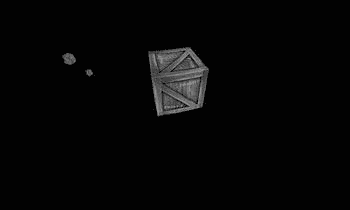

# 十、OpenGL ES：走向 3D

超级跳线工作得相当好，与 2D OpenGL ES 渲染引擎。现在是全 3D 的时候了。当我们定义视图截锥和精灵的顶点时，我们实际上已经在 3D 空间中工作了。在后一种情况下，每个顶点的 z 坐标默认设置为 0。与 2D 渲染的区别其实并不是很大:

*   顶点不仅有 x 和 y 坐标，还有一个 z 坐标。
*   使用透视投影代替正投影。离相机越远的物体看起来越小。
*   旋转、平移和缩放等变换在 3D 中有更多的自由度。我们现在可以在所有三个轴上自由移动顶点，而不仅仅是在 x-y 平面上移动顶点。
*   我们可以在 3D 空间中定义一个任意位置和方向的摄像机。
*   我们渲染物体的三角形的顺序现在很重要。离摄像机较远的对象必须与离摄像机较近的对象重叠。

最好的事情是，我们已经在我们的框架中为所有这些奠定了基础。为了实现 3D，我们只需要稍微调整几个职业。

在开始之前

和前几章一样，我们将在这一章写几个例子。我们将遵循与之前相同的路线，通过一个显示示例列表的启动活动。我们将重用在前三章中创建的整个框架，包括 GLGame、GLScreen、Texture 和 Vertices 类。

本章的 starter 活动称为 gl3 dbasic starter。我们可以重用第七章中的 GLBasicsStarter 活动的代码，只需将我们将要运行的示例类的包名改为 com.badlogic.androidgames.gl3d。我们还必须再次以<活动>元素的形式将每个测试添加到清单中。我们所有的测试都将在固定的横向方向上运行，我们将根据< activity >元素来指定。

每个测试都是 GLGame 抽象类的一个实例，实际的测试逻辑是以测试的 GLGame 实现中包含的 GLScreen 实例的形式实现的，如第九章所示。为了节省篇幅，我们将只展示 GLScreen 实例的相关部分。每个测试的 GLGame 和 GLScreen 实现的命名约定也是 XXXTest 和 XXXScreen。

三维顶点

在第七章中，你了解到一个顶点有几个属性:

*   位置
*   颜色(可选)
*   纹理坐标(可选)

我们创建了一个名为 Vertices 的助手类，它为我们处理所有的脏细节。我们将顶点位置限制为只有 x 和 y 坐标。要实现 3D，我们需要做的就是修改 Vertices 类，使其支持 3D 顶点位置。

顶点 3:存储 3D 位置

让我们编写一个名为 Vertices3 的新类，基于我们原来的 Vertices 类来处理 3D 顶点。清单 10-1 显示了代码。

***清单 10-1。****Vertices3.java，现在多了坐标*

```java
package com.badlogic.androidgames.framework.gl;

import java.nio.ByteBuffer;
import java.nio.ByteOrder;
import java.nio.IntBuffer;
import java.nio.ShortBuffer;

import javax.microedition.khronos.opengles.GL10;

import com.badlogic.androidgames.framework.impl.GLGraphics;

public class Vertices3 {
    final GLGraphics glGraphics;
    final boolean hasColor;
    final boolean hasTexCoords;
    final int vertexSize;
    final IntBuffer vertices;
    final int [] tmpBuffer;
    final ShortBuffer indices;

    public Vertices3(GLGraphics glGraphics,int maxVertices,int maxIndices,
            boolean hasColor,boolean hasTexCoords) {
        this .glGraphics = glGraphics;
        this .hasColor = hasColor;
        this .hasTexCoords = hasTexCoords;
        this .vertexSize = (3 + (hasColor ? 4 : 0) + (hasTexCoords ? 2 : 0)) * 4;
        this .tmpBuffer =new int [maxVertices * vertexSize / 4];

        ByteBuffer buffer = ByteBuffer.*allocateDirect*(maxVertices * vertexSize);
        buffer.order(ByteOrder.*nativeOrder*());
        vertices = buffer.asIntBuffer();

        if (maxIndices > 0) {
            buffer = ByteBuffer.*allocateDirect*(maxIndices * Short.*SIZE*/ 8);
            buffer.order(ByteOrder.*nativeOrder*());
            indices = buffer.asShortBuffer();
        }else {
            indices =null ;
        }
    }

    public void setVertices(float [] vertices,int offset,int length) {
        this .vertices.clear();
        int len = offset + length;
        for (int i = offset, j = 0; i < len; i++, j++)
            tmpBuffer[j] = Float.*floatToRawIntBits*(vertices[i]);
        this .vertices.put(tmpBuffer, 0, length);
        this .vertices.flip();
    }

    public void setIndices(short [] indices,int offset,int length) {
        this .indices.clear();
        this .indices.put(indices, offset, length);
        this .indices.flip();
    }

    public void bind() {
        GL10 gl = glGraphics.getGL();

        gl.glEnableClientState(GL10.*GL_VERTEX_ARRAY*);
        vertices.position(0);
        gl.glVertexPointer(3, GL10.*GL_FLOAT*, vertexSize, vertices);

        if (hasColor) {
            gl.glEnableClientState(GL10.*GL_COLOR_ARRAY*);
            vertices.position(3);
            gl.glColorPointer(4, GL10.*GL_FLOAT*, vertexSize, vertices);
        }

        if (hasTexCoords) {
            gl.glEnableClientState(GL10.*GL_TEXTURE_COORD_ARRAY*);
            vertices.position(hasColor ? 7 : 3);
            gl.glTexCoordPointer(2, GL10.*GL_FLOAT*, vertexSize, vertices);
        }
    }

    public void draw(int primitiveType,int offset,int numVertices) {
        GL10 gl = glGraphics.getGL();

        if (indices !=null ) {
            indices.position(offset);
            gl.glDrawElements(primitiveType, numVertices,
                    GL10.*GL_UNSIGNED_SHORT*, indices);
        }else {
            gl.glDrawArrays(primitiveType, offset, numVertices);
        }
    }

    public void unbind() {
        GL10 gl = glGraphics.getGL();
        if (hasTexCoords)
            gl.glDisableClientState(GL10.*GL_TEXTURE_COORD_ARRAY*);

        if (hasColor)
            gl.glDisableClientState(GL10.*GL_COLOR_ARRAY*);
    }
}
```

与顶点相比，一切都保持不变，除了一些小事:

*   在构造函数中，我们以不同的方式计算 vertexSize，因为顶点位置现在采用三个浮点而不是两个浮点。
*   在 bind()方法中，我们在对 glVertexPointer()(第一个参数)的调用中告诉 OpenGL ES 我们的顶点有三个而不是两个坐标。
*   我们必须调整在可选颜色和纹理坐标组件的 vertices.position()调用中设置的偏移量。

这就是我们需要做的。使用 Vertices3 类，我们现在必须在调用 Vertices3.setVertices()方法时指定每个顶点的 x、y 和 z 坐标。在使用方面，其他一切都保持不变。我们可以有逐顶点颜色、纹理坐标、索引等等。

一个例子

让我们写一个简单的例子，叫做 Vertices3Test 。我们想画两个三角形，一个是每个顶点的 z 为 3，另一个是每个顶点的 z 为 5。我们也将使用逐顶点颜色。因为我们还没有讨论如何使用透视投影，所以我们将只使用具有适当的近裁剪平面和远裁剪平面的正交投影，以便三角形位于视图截锥中(即，近为 10，远为 10)。图 10-1 所示场景。


图 10-1。3D 空间中的红色三角形(正面)和绿色三角形(背面)

红色三角形在绿色三角形的前面。说“在前面”是可能的，因为在 OpenGL ES 中默认情况下相机位于原点向下看负 z 轴(实际上没有相机的概念)。绿色的三角形也向右移动了一点，这样当我们从前面看的时候可以看到它的一部分。它应该被红色三角形大部分重叠。清单 10-2 显示了渲染这个场景的代码。

***清单 10-2。*【Vertices3Test.java】***；画两个三角形*

```java
package com.badlogic.androidgames.gl3d;

import javax.microedition.khronos.opengles.GL10;

import com.badlogic.androidgames.framework.Game;
import com.badlogic.androidgames.framework.Screen;
import com.badlogic.androidgames.framework.gl.Vertices3;
import com.badlogic.androidgames.framework.impl.GLGame;
import com.badlogic.androidgames.framework.impl.GLScreen;

public class Vertices3Test extends GLGame {

    public Screen getStartScreen() {
        return new Vertices3Screen(this );
    }

    class Vertices3Screen extends GLScreen {
        Vertices3 vertices;

        public Vertices3Screen(Game game) {
            super (game);

            vertices = new Vertices3(glGraphics, 6, 0,true ,false );
            vertices.setVertices(new float [] { −0.5f, -0.5f, -3, 1, 0, 0, 1,
                                                0.5f, -0.5f, -3, 1, 0, 0, 1,
                                                0.0f,  0.5f, -3, 1, 0, 0, 1,
                                                0.0f,  -0.5f, -5, 0, 1, 0, 1,
                                                1.0f,  -0.5f, -5, 0, 1, 0, 1,
                                                0.5f,  0.5f, -5, 0, 1, 0, 1}, 0, 7 * 6);
        }

        @Override
        public void present(float deltaTime) {
            GL10 gl = glGraphics.getGL();
            gl.glClear(GL10.*GL_COLOR_BUFFER_BIT*);
            gl.glViewport(0, 0, glGraphics.getWidth(), glGraphics.getHeight());
            gl.glMatrixMode(GL10.*GL_PROJECTION*);
            gl.glLoadIdentity();
            gl.glOrthof(−1, 1, -1, 1, 10, -10);
            gl.glMatrixMode(GL10.*GL_MODELVIEW*);
            gl.glLoadIdentity();
            vertices.bind();
            vertices.draw(GL10.*GL_TRIANGLES*, 0, 6);
            vertices.unbind();
        }

        @Override
        public void update(float deltaTime) {
        }

        @Override
        public void pause() {
        }

        @Override
        public void resume() {
        }

        @Override
        public void dispose() {
        }
    }
}
```

如您所见，这是完整的源文件。以下示例将只显示该文件的相关部分，因为除了类名之外，其余部分基本保持不变。

我们在 Vertices3Screen 中有一个 Vertices3 成员，我们在构造函数中初始化了它。我们总共有六个顶点，每个顶点有一种颜色，没有纹理坐标。因为两个三角形都不共享顶点，所以我们不使用索引几何。该信息被传递给 Vertices3 构造函数。接下来，我们通过调用 Vertices3.setVertices()来设置实际的顶点。前三行指定前面的红色三角形，其他三行指定后面的绿色三角形，稍微向右偏移 0.5 个单位。每一行的第三个浮点数是相应顶点的 z 坐标。

在 present()方法中，我们必须首先清除屏幕并设置视口，一如既往。接下来，我们加载一个正交投影矩阵，设置一个足够大的视见平截头体来显示整个场景。最后，我们只渲染包含在顶点 3 实例中的两个三角形。图 10-2 显示了该程序的输出。


图 10-2。两个三角形——但有些不对劲

这很奇怪。根据我们的理论，红色三角形(中间)应该在绿色三角形的前面。相机位于原点向下看负 z 轴，从图 10-1 我们可以看到红色三角形比绿色三角形更靠近原点。这里发生了什么事？

OpenGL ES 将按照我们在 Vertices3 实例中指定的顺序来渲染三角形。因为我们首先指定了红色三角形，所以它将首先被绘制。我们可以改变三角形的顺序来解决这个问题。但是，如果我们的相机不是向下看负 z 轴，而是从后面看呢？在渲染之前，我们必须再次根据三角形与摄像机的距离对它们进行排序。那不可能是解决办法。事实并非如此。我们马上就能解决这个问题。让我们先去掉这个正投影，改用透视投影。

**关于坐标系的一个注意事项** :你可能注意到，在我们的例子中，我们从向下看 z 轴开始，如果 z 向我们这边增加，x 向右增加，y 向上增加。这就是 OpenGL 使用的标准坐标系。记住这个系统的一个简单方法叫做*右手定则*。首先将右手的小拇指和无名指指尖压在右手掌心。你的拇指代表 x 轴，伸出的食指代表 y 轴，中指指向你代表 z 轴。参见图 10-3 中的示例。只要记住这条规则，它最终会自然而然地来到你身边。


图 10-3。右手法则

透视投影:越近越大

直到现在，我们一直使用正交投影，这意味着无论一个对象距离最近的裁剪平面有多远，它在屏幕上的大小总是相同的。我们的眼睛向我们展示了一幅不同的世界图景。一个物体离我们越远，它在我们看来就越小。这叫做*透视投影*、，我们在第七章中简单讨论过。

正交投影和透视投影之间的差异可以通过视见平截头体的形状来解释。在正投影中，有一个盒子。在透视投影中，有一个金字塔，其截顶作为近剪裁平面，金字塔的底部作为远剪裁平面，其侧面作为左、右、顶和底剪裁平面。图 10-4 显示了一个透视图，通过它我们可以看到我们的场景。


图 10-4。包含场景的透视图视锥(左)；从上往下看的平截头体(右)

透视图截锥由四个参数定义:

1.  从相机到最近裁剪平面的距离
2.  从相机到远剪裁平面的距离
3.  视口的纵横比，它嵌入在由视口宽度除以视口高度给出的近剪裁平面中
4.  视野，指定视见平截头体有多宽，因此，它显示了多少场景

虽然我们已经讨论了“相机”，但这里还没有涉及到这样的概念。假设有一个摄像机固定在原点向下看负 z 轴，如图图 10-4 所示。

第七章中的我们已经熟悉了近裁剪平面距离和远裁剪平面距离。我们只需要将它们设置好，使完整的场景包含在视见体中。当观察图 10-4 中的右图时，视野也很容易理解。

视口的长宽比不太直观。为什么需要它？如果我们渲染的屏幕的长宽比不等于 1，它可以确保我们的世界不会被拉长。

之前，我们使用 glOrthof()以投影矩阵的形式指定正交视图截锥。对于透视图截锥，我们可以使用一个名为 glFrustumf()的方法。然而，有一种更简单的方法。

传统上，OpenGL ES 附带一个名为 GLU 的工具库。它包含一些辅助功能，比如设置投影矩阵和实现相机系统。这个库也可以在 Android 上以一个名为 GLU 的类的形式获得。它有几个静态方法，我们不需要 GLU 实例就可以调用。我们感兴趣的方法称为 gluPerspective():

```java
GLU.gluPerspective(GL10 gl, float fieldOfView, float aspectRatio, float near, float far);
```

该方法将当前活动矩阵(即投影矩阵或模型-视图矩阵)乘以透视投影矩阵，类似于 glOrthof()。第一个参数是 GL10 的实例，通常是用于所有其他 OpenGL ES 相关业务的实例；第二个参数是视野，以角度给出；第三个参数是视口的纵横比；最后两个参数指定了近剪裁平面和远剪裁平面与相机位置的距离。由于我们还没有相机，那些值是相对于世界的原点给出的，迫使我们向下看负 z 轴，如图图 10-4 所示。这完全符合我们目前的目的；我们将确保我们渲染的所有对象都停留在这个固定不动的视图截锥内。只要我们只使用 gluPerspective()，我们就不能改变我们的虚拟相机的位置或方向。当向下看负 z 轴时，我们总是只能看到世界的一部分。

让我们修改清单 10-2 中的，使其使用透视投影。首先，将 Vertices3Test 中的所有代码复制到一个名为 PerspectiveTest 的新类中，并将 Vertices3Screen 重命名为 PerspectiveScreen。我们唯一需要改变的是 present()方法。清单 10-3 显示了代码。

***清单 10-3。*** *摘自 PerspectiveTest.java；透视投影*

```java
@Override
public void present(float deltaTime) {
    GL10 gl = glGraphics.getGL();
    gl.glClear(GL10.*GL_COLOR_BUFFER_BIT*);
    gl.glViewport(0, 0, glGraphics.getWidth(), glGraphics.getHeight());
    gl.glMatrixMode(GL10.*GL_PROJECTION*);
    gl.glLoadIdentity();
    GLU.*gluPerspective*(gl, 67,
                       glGraphics.getWidth() / (float )glGraphics.getHeight(),
                       0.1f, 10f);
    gl.glMatrixMode(GL10.*GL_MODELVIEW*);
    gl.glLoadIdentity();
    vertices.bind();
    vertices.draw(GL10.*GL_TRIANGLES*, 0, 6);
    vertices.unbind();
}
```

与上一个示例中的 present()方法的唯一区别是，我们现在使用 GLU.gluPerspective()而不是 glOrtho()。我们使用 67 度的视野，接近人类的平均视野。通过增加或减少该值，您可以或多或少地看到左侧和右侧。接下来我们要指定的是长宽比，也就是屏幕的宽度除以高度。请注意，这将是一个浮点数，所以我们必须在除法之前将其中一个值转换为浮点数。最后的参数是近剪裁平面和远剪裁平面的距离。假设虚拟相机位于原点，向下看负 z 轴，任何 z 值小于 0.1 且大于 10 的物体都将位于近剪裁平面和远剪裁平面之间，因此可能是可见的。图 10-5 显示了这个例子的输出。


图 10-5。视角(基本正确)

现在我们实际上正在做适当的 3D 图形。正如你所看到的，我们的三角形的渲染顺序仍然有问题。这可以通过使用强大的 z 缓冲区来解决。

Z-buffer:将秩序带入混乱

什么是 z 缓冲器？在《??》第三章中，我们讨论了帧缓冲区。它存储屏幕上每个像素的颜色。当 OpenGL ES 将一个三角形渲染到帧缓冲区时，它只是改变组成该三角形的像素的颜色。

z 缓冲区与帧缓冲区非常相似，因为它也为屏幕上的每个像素提供了一个存储位置。它存储深度值，而不是存储颜色。一个像素的*深度值* 大致是 3D 中对应点到视见体最近裁剪平面的归一化距离。

默认情况下，OpenGL ES 会将三角形的每个像素的深度值写入 z 缓冲区(如果 z 缓冲区是与帧缓冲区一起创建的)。我们只需要告诉 OpenGL ES 使用这个信息来决定一个正在绘制的像素是否比当前的像素更靠近近裁剪平面。为此，我们只需要用适当的参数调用 glEnable():

```java
GL10.glEnable(GL10.GL_DEPTH_TEST);
```

然后，OpenGL ES 将传入的像素深度与 z 缓冲区中已经存在的像素深度进行比较。如果传入的像素深度较小，其对应的像素更靠近近剪裁平面，因此位于已经在帧和 z 缓冲区中的像素之前。

图 10-5 说明了该过程。z 缓冲区开始时所有值都设置为无穷大(或一个非常大的数字)。渲染第一个三角形时，将其每个像素的深度值与 z 缓冲区中的像素值进行比较。如果像素的深度值小于 z 缓冲器中的值，则该像素通过所谓的*深度测试*，或 *z 测试*。像素的颜色将被写入帧缓冲区，其深度将覆盖 z 缓冲区中的相应值。如果测试失败，像素的颜色和深度值都不会被写入缓冲区。这显示在图 10-6 中，其中呈现了第二个三角形。一些像素具有较小的深度值，因此被渲染；其他像素没有通过测试。


图 10-6。帧缓冲区中的图像(左)；渲染两个三角形后的 z 缓冲区内容(右)

和 framebuffer 一样，我们也必须清除每个帧的 z-buffer 否则，上一帧的深度值仍会在那里。为此，我们可以调用 glClear()，如下所示:

```java
gl.glClear(GL10.GL_COLOR_BUFFER_BIT | GL10.GL_DEPTH_BUFFER_BIT);
```

这将一次性清除帧缓冲区(或颜色缓冲区)和 z 缓冲区(或深度缓冲区)。

修复前面的示例

让我们通过使用 z-buffer 来解决前面例子中的问题。只需将所有代码复制到一个名为 ZBufferTest 的新类中，并修改新 ZBufferScreen 类的 present()方法，如清单 10-4 所示。

***清单 10-4。*** *摘自 ZBufferTest.java；使用 Z 缓冲器*

```java
@Override
public void present(float deltaTime) {
    GL10 gl = glGraphics.getGL();
    gl.glClear(GL10.*GL_COLOR_BUFFER_BIT*| GL10.*GL_DEPTH_BUFFER_BIT*);
    gl.glViewport(0, 0, glGraphics.getWidth(), glGraphics.getHeight());
    gl.glMatrixMode(GL10.*GL_PROJECTION*);
    gl.glLoadIdentity();
    GLU.*gluPerspective*(gl, 67,
            glGraphics.getWidth() / (float )glGraphics.getHeight(),
            0.1f, 10f);
    gl.glMatrixMode(GL10.*GL_MODELVIEW*);
    gl.glLoadIdentity();

    gl.glEnable(GL10.*GL_DEPTH_TEST*);

    vertices.bind();
    vertices.draw(GL10.*GL_TRIANGLES*, 0, 6);
    vertices.unbind();

    gl.glDisable(GL10.*GL_DEPTH_TEST*);
}
```

我们首先更改了调用 glClear()的参数。现在两个缓冲区都被清除，而不仅仅是帧缓冲区。

在渲染两个三角形之前，我们还启用了深度测试。在我们渲染完所有的 3D 几何图形后，我们再次禁用深度测试。为什么呢？假设我们想要在 3D 场景上呈现 2D UI 元素，比如当前的乐谱或按钮。由于我们使用了 SpriteBatcher，它只在 2D 有效，所以对于 2D 元素的顶点，我们没有任何有意义的 z 坐标。我们也不需要深度测试，因为我们会明确指定顶点在屏幕上的绘制顺序。

这个例子的输出如图 10-7 所示，看起来和预期的一样。


图 10-7。z-buffer 在起作用，使渲染顺序独立

最后，中间的绿色三角形在红色三角形后面被正确渲染，这要感谢我们新的好朋友，z-buffer。然而，和大多数朋友一样，有时你们的友谊会因为一些小问题而受损。让我们看看使用 z 缓冲器时的一些注意事项。

融合:你身后什么都没有

假设我们想要在场景中 z = 3 处启用红色三角形的混合。假设我们将每个顶点颜色的 alpha 分量设置为 0.5f，这样三角形后面的任何东西都可以透过。在这种情况下，z = 5 处的绿色三角形应该会发光。我们来想想 OpenGL ES 会做什么，还会发生什么:

*   OpenGL ES 会将第一个三角形渲染到 z 缓冲区和 colorbuffer。
*   接下来 OpenGL ES 将渲染绿色三角形，因为它在我们的顶点 3 实例中位于红色三角形之后。
*   红色三角形后面的绿色三角形部分不会显示在屏幕上，因为像素会被深度测试拒绝。
*   没有东西会透过前面的红色三角形发光，因为渲染时那里没有东西可以透过。

将混合与 z 缓冲区结合使用时，您必须确保所有透明对象都按照离相机位置的距离递增的方式进行排序，并从后向前进行渲染。所有不透明对象必须在任何透明对象之前渲染。然而，不透明的物体不需要被分类。

让我们写一个简单的例子来演示这一点。我们保持当前场景由两个三角形组成，并将第一个三角形(z = 3)的顶点颜色的 alpha 分量设置为 0.5f。根据我们的规则，我们必须首先渲染不透明对象，在本例中为绿色三角形(z = 5)，然后渲染所有透明对象，从最远到最近。在我们的场景中，只有一个透明物体:红色三角形。

我们将清单 10-4 中的所有代码复制到一个名为 ZBlendingTest 的新类中，并将包含的 ZBufferScreen 重命名为 ZBlendingScreen。我们现在只需要更改第一个三角形的顶点颜色，并在 present()方法中以适当的顺序混合和渲染这两个三角形。清单 10-5 显示了两种相关的方法。

***清单 10-5。*** *摘自 ZBlendingTest.java；启用 Z 缓冲器的混合*

```java
public ZBlendingScreen(Game game) {
    super (game);

    vertices = new Vertices3(glGraphics, 6, 0,true ,false );
    vertices.setVertices(new float [] { −0.5f, -0.5f, -3, 1, 0, 0, 0.5f,
                                        0.5f, -0.5f, -3, 1, 0, 0, 0.5f,
                                        0.0f,  0.5f, -3, 1, 0, 0, 0.5f,
                                        0.0f,  -0.5f, -5, 0, 1, 0, 1,
                                        1.0f,  -0.5f, -5, 0, 1, 0, 1,
                                        0.5f,  0.5f, -5, 0, 1, 0, 1}, 0, 7 * 6);
}

@Override
public void present(float deltaTime) {
    GL10 gl = glGraphics.getGL();
    gl.glClear(GL10.*GL_COLOR_BUFFER_BIT*| GL10.*GL_DEPTH_BUFFER_BIT*);
    gl.glViewport(0, 0, glGraphics.getWidth(), glGraphics.getHeight());
    gl.glMatrixMode(GL10.*GL_PROJECTION*);
    gl.glLoadIdentity();
    GLU.*gluPerspective*(gl, 67,
            glGraphics.getWidth() / (float )glGraphics.getHeight(),
            0.1f, 10f);
    gl.glMatrixMode(GL10.*GL_MODELVIEW*);
    gl.glLoadIdentity();

    gl.glEnable(GL10.*GL_DEPTH_TEST*);
    gl.glEnable(GL10.*GL_BLEND*);
    gl.glBlendFunc(GL10.GL_SRC_ALPHA, GL10.GL_ONE_MINUS_SRC_ALPHA);

    vertices.bind();
    vertices.draw(GL10.*GL_TRIANGLES*, 3, 3);
    vertices.draw(GL10.*GL_TRIANGLES*, 0, 3);
    vertices.unbind();

    gl.glDisable(GL10.*GL_BLEND*);
    gl.glDisable(GL10.*GL_DEPTH_TEST*);
}
```

在 ZBlendingScreen 类的构造函数中，我们只将第一个三角形的顶点颜色的 alpha 分量更改为 0.5。这将使第一个三角形透明。在 present()方法中，我们做通常的事情，比如清除缓冲区和设置矩阵。我们还启用混合并设置适当的混合功能。有趣的是我们现在如何渲染这两个三角形。我们首先渲染绿色三角形，它是 Vertices3 实例中的第二个三角形，因为它是不透明的。在渲染任何透明对象之前，必须渲染所有不透明对象。接下来，我们渲染透明三角形，这是 Vertices3 实例中的第一个三角形。对于这两个绘图调用，我们简单地使用适当的偏移量和顶点数作为 vertices.draw()方法的第二个和第三个参数。图 10-8 显示了该程序的输出。


图 10-8。启用 z 缓冲器混合

让我们颠倒绘制两个三角形的顺序，如下所示:

```java
vertices.draw(GL10.GL_TRIANGLES, 0, 3);
vertices.draw(GL10.GL_TRIANGLES, 3, 3);
```

所以，我们先从顶点 0 开始画三角形，然后从顶点 3 开始画第二个三角形。这将首先渲染前面的红色三角形，然后渲染后面的绿色三角形。图 10-9 显示了结果。


图 10-9。勾兑做错了；后面的三角形应该会发光

到目前为止，对象只由三角形组成，这当然有点简单。当我们渲染更复杂的形状时，我们将再次结合 z-buffer 讨论混合。现在，让我们总结一下如何在 3D 中处理混合:

1.  渲染所有不透明对象。
2.  按照离相机的距离递增(从最远到最近)对所有透明对象进行排序。
3.  按照从远到近的排序顺序渲染所有透明对象。

在大多数情况下，排序可以基于对象中心到相机的距离。如果你的一个对象很大并且可以跨越多个对象，你就会遇到问题。如果没有高级技巧，就不可能解决这个问题。有几个防弹解决方案非常适合桌面版本的 OpenGL，但由于其有限的 GPU 功能，它们无法在大多数 Android 设备上实现。幸运的是，这是非常罕见的，您几乎可以始终坚持简单的基于中心的排序。

Z 缓冲精度和 Z 战斗

滥用远近剪裁平面来尽可能多地展示我们令人敬畏的场景总是很有诱惑力的。毕竟，我们已经付出了很多努力来给我们的世界添加大量的物体，而且这种努力应该是可见的。唯一的问题是 z 缓冲器的精度有限。在大多数 Android 设备上，z-buffer 中存储的每个深度值不超过 16 位；最多有 65，535 个不同的深度值。因此，我们应该坚持使用更合理的值，而不是将近剪裁平面距离设置为 0.00001，将远剪裁平面距离设置为 1000000。否则，我们很快就会发现一个配置不当的视图截锥结合 z 缓冲区会产生什么好的工件。

有什么问题？想象一下，我们像刚才提到的那样设置近剪裁平面和远剪裁平面。像素的深度值或多或少是其与近剪裁平面的距离，距离越近，深度值越小。对于 16 位深度缓冲区，我们将从近到远裁剪平面深度值内部量化为 65，535 个片段；在我们的世界中，每一段占用 1，000，000 / 65，535 = 15 个单位。如果我们选择我们的单位为米，并且我们有通常大小的对象，如 1×2×1 米，都在同一段中，z 缓冲区不会对我们有很大帮助，因为所有像素都将获得相同的深度值。

**注意**z 缓冲区中的深度值实际上不是线性的，但总体思路仍然是正确的。

使用 z 缓冲器时的另一个相关问题是所谓的 *z 战斗* 。图 10-10 说明了这个问题。


图 10-10。Z-战斗在行动

图 10-10 中的两个矩形*共面*；也就是说，它们嵌入在同一平面中。因为它们重叠，所以它们也共享一些像素，这些像素应该具有相同的深度值。然而，由于有限的浮点精度，GPU 可能不会为重叠的像素获得相同的深度值。哪一个像素通过深度测试是一种抽签。这通常可以通过将两个共面对象中的一个从另一个对象推开一点点来解决。该偏移量的值取决于几个因素，因此通常最好进行实验。总结一下:

*   对于近剪裁平面距离和远剪裁平面距离，不要使用太小或太大的值。
*   通过稍微偏移来避免共面对象。

定义 3D 网格

到目前为止，我们只使用了几个三角形作为我们世界中物体的占位符。更复杂的对象呢？

我们已经讨论过 GPU 是一个巨大的三角形渲染机器。因此，我们所有的 3D 物体也必须由三角形组成。在前面的章节中，我们用两个三角形来代表一个平面矩形。我们在那里使用的原则，像顶点定位、颜色、纹理和顶点索引，在 3D 中完全相同。我们的三角形不再局限于 x-y 平面。我们可以自由指定每个顶点在三维空间中的位置。

你如何着手创建这样一个由三角形组成的 3D 物体呢？我们可以通过编程来实现，就像我们对精灵的矩形所做的那样。我们也可以使用软件，让我们以所见即所得的方式雕刻 3D 物体。在这些应用中使用了各种范例，从操纵单独的三角形到只指定几个参数来输出一个*三角形网格*(三角形列表的一个有趣名称)。

著名的软件包如 Blender、3ds Max、ZBrush 和 Wings 3D 为用户提供了大量创建 3D 对象的功能。其中有些是免费的(比如 Blender 和 Wings 3D)，有些是商用的(比如 3ds Max 和 ZBrush)。教你如何使用这些程序不在本书的范围之内。然而，所有这些程序都可以将 3D 模型保存为不同的文件格式。网络上也充满了免费使用的 3D 模型。在下一章，我们将为一种最简单也是最常用的文件格式编写一个加载器。

在这一章中，我们将以编程的方式做所有的事情。让我们创建一个最简单的 3D 对象:一个立方体。

一个立方体:你好，3D 世界

在前三章中，我们大量使用了模型空间的概念。这是定义模型的空间；它与世界空间完全无关。我们使用围绕模型空间的原点构建所有对象的惯例，以便对象的中心与该原点重合。这样的模型可以被重用来渲染世界空间中不同位置和不同方向的多个对象，就像第七章中的大规模 BobTest 示例一样。

对于立方体，我们首先要弄清楚的是它的角点。图 10-11 显示一个边长为 1 个单位(例如 1 米)的立方体。我们还将立方体分解了一点，这样我们就可以看到由两个三角形组成的各个侧面。当然，在现实中，所有的边都会在边缘和拐角处相遇。


图 10-11。一个立方体及其角点

立方体有六条边，每条边由两个三角形组成。每条边的两个三角形共享两个顶点。对于立方体的正面,( 0.5，0.5，0.5)和(0.5，-0.5，0.5)处的顶点是共享的。我们每边只需要四个顶点；对于一个完整的立方体，总共有 6 × 4 = 24 个顶点。然而，我们确实需要指定 36 个索引，而不仅仅是 24 个。这是因为有 6 × 2 个三角形，每个三角形使用了我们 24 个顶点中的 3 个。我们可以使用顶点索引为此立方体创建网格，如下所示:

```java
float[] vertices = { −0.5f, -0.5f,  0.5f,
                      0.5f, -0.5f,  0.5f,
                      0.5f,  0.5f,  0.5f,
                     -0.5f,  0.5f,  0.5f,

                      0.5f, -0.5f,  0.5f,
                      0.5f, -0.5f, -0.5f,
                      0.5f,  0.5f, -0.5f,
                      0.5f,  0.5f,  0.5f,

                      0.5f, -0.5f, -0.5f,
                     -0.5f, -0.5f, -0.5f,
                     -0.5f,  0.5f, -0.5f,
                      0.5f,  0.5f, -0.5f,

                     -0.5f, -0.5f, -0.5f,
                     -0.5f, -0.5f,  0.5f,
                     -0.5f,  0.5f,  0.5f,
                     -0.5f,  0.5f, -0.5f,

                     -0.5f,  0.5f,  0.5f,
                      0.5f,  0.5f,  0.5f,
                      0.5f,  0.5f, -0.5f,
                     -0.5f,  0.5f, -0.5f,

                     -0.5f, -0.5f,  0.5f,
                      0.5f, -0.5f,  0.5f,
                      0.5f, -0.5f, -0.5f,
                     -0.5f, -0.5f, -0.5f
};

short[] indices = { 0, 1, 3, 1, 2, 3,
                    4, 5, 7, 5, 6, 7,
                    8, 9, 11, 9, 10, 11,
                    12, 13, 15, 13, 14, 15,
                    16, 17, 19, 17, 18, 19,
                    20, 21, 23, 21, 22, 23,
};

Vertices3 cube = new Vertices3(glGraphics, 24, 36, false, false);
cube.setVertices(vertices, 0, vertices.length);
cube.setIndices(indices, 0, indices.length);
```

在这段代码中，我们只指定顶点的位置。我们从正面开始，其左下顶点位于(0.5，-0.5，0.5)。然后，我们逆时针方向指定该边的下三个顶点。下一条边是立方体的右侧，然后是背面、左侧、顶面和底面，所有这些都遵循相同的模式。将顶点定义与图 10-11 中的进行比较。

接下来，我们定义指数。总共有 36 个索引—前面代码中的每一行都定义了两个三角形，每个三角形由三个顶点组成。指数(0，1，3，1，2，3)定义立方体的正面，接下来的三个指数定义左侧，依此类推。将这些指数与前面代码中给出的顶点进行比较，并再次与图 10-11 中的进行比较。

一旦我们定义了所有的顶点和索引，我们就将它们存储在 Vertices3 实例中进行渲染，这是在前面代码片段的最后几行中完成的。

纹理坐标呢？很简单，我们只需将它们添加到顶点定义中。假设有一个 128×128 的纹理包含一个板条箱的一面的图像。我们希望立方体的每一面都有这个图像的纹理。图 10-12 显示了我们如何做到这一点。


图 10-12。正面、左边和顶面的每个顶点的纹理坐标(其他边也是一样的)

将纹理坐标添加到立方体的正面，代码如下所示:

```java
float[] vertices = { −0.5f, -0.5f,  0.5f, 0, 1,
                      0.5f, -0.5f,  0.5f, 1, 1,
                      0.5f,  0.5f,  0.5f, 1, 0,
                     -0.5f,  0.5f,  0.5f, 0, 0,
                     // rest is analogous
```

当然，我们还需要告诉 Vertices3 实例，它也包含纹理坐标:

```java
Vertices3 cube = new Vertices3(glGraphics, 24, 36, false, true);
```

剩下的就是加载纹理本身，用 glEnable()启用纹理映射，用 Texture.bind()绑定纹理。我们来写个例子。

一个例子

我们希望创建一个立方体网格，如前面的片段所示，应用了板条箱纹理。因为我们在模型空间中围绕原点对立方体建模，所以我们必须使用 glTranslatef()将它移动到世界空间中，就像我们在 BobTest 示例中对 Bob 的模型所做的那样。我们还希望我们的立方体围绕 y 轴旋转，这可以通过使用 glRotatef()来实现，就像在 BobTest 示例中一样。清单 10-6 显示了 CubeTest 类中包含的 CubeScreen 类的完整代码。

***清单 10-6。*** *摘自 CubeTest.java；渲染一个纹理立方体*

```java
class CubeScreen extends GLScreen {
    Vertices3 cube;
    Texture texture;
    float angle = 0;

    public CubeScreen(Game game) {
        super(game);
        cube = createCube();
        texture = new Texture(glGame, "crate.png");
    }

    private Vertices3 createCube() {
        float [] vertices = { −0.5f, -0.5f,  0.5f, 0, 1,
                              0.5f, -0.5f,  0.5f, 1, 1,
                              0.5f,  0.5f,  0.5f, 1, 0,
                             -0.5f,  0.5f,  0.5f, 0, 0,

                              0.5f, -0.5f,  0.5f, 0, 1,
                              0.5f, -0.5f, -0.5f, 1, 1,
                              0.5f,  0.5f, -0.5f, 1, 0,
                              0.5f,  0.5f,  0.5f, 0, 0,

                              0.5f, -0.5f, -0.5f, 0, 1,
                             -0.5f, -0.5f, -0.5f, 1, 1,
                             -0.5f,  0.5f, -0.5f, 1, 0,
                              0.5f,  0.5f, -0.5f, 0, 0,

                             -0.5f, -0.5f, -0.5f, 0, 1,
                             -0.5f, -0.5f,  0.5f, 1, 1,
                             -0.5f,  0.5f,  0.5f, 1, 0,
                             -0.5f,  0.5f, -0.5f, 0, 0,

                             -0.5f,  0.5f,  0.5f, 0, 1,
                              0.5f,  0.5f,  0.5f, 1, 1,
                              0.5f,  0.5f, -0.5f, 1, 0,
                             -0.5f,  0.5f, -0.5f, 0, 0,

                             -0.5f, -0.5f,  0.5f, 0, 1,
                              0.5f, -0.5f,  0.5f, 1, 1,
                              0.5f, -0.5f, -0.5f, 1, 0,
                             -0.5f, -0.5f, -0.5f, 0, 0
        };

        short [] indices = { 0, 1, 3, 1, 2, 3,
                            4, 5, 7, 5, 6, 7,
                            8, 9, 11, 9, 10, 11,
                            12, 13, 15, 13, 14, 15,
                            16, 17, 19, 17, 18, 19,
                            20, 21, 23, 21, 22, 23,
        };

        Vertices3 cube = new Vertices3(glGraphics, 24, 36,false ,true );
        cube.setVertices(vertices, 0, vertices.length);
        cube.setIndices(indices, 0, indices.length);
        return cube;
    }

    @Override
    public void resume() {
        texture.reload();
    }

    @Override
    public void update(float deltaTime) {
        angle += 45 * deltaTime;
    }

    @Override
    public void present(float deltaTime) {
        GL10 gl = glGraphics.getGL();
        gl.glViewport(0, 0, glGraphics.getWidth(), glGraphics.getHeight());
        gl.glClear(GL10.GL_COLOR_BUFFER_BIT | GL10.GL_DEPTH_BUFFER_BIT);
        gl.glMatrixMode(GL10.*GL_PROJECTION*);
        gl.glLoadIdentity();
        GLU.*gluPerspective*(gl, 67,
                           glGraphics.getWidth() / (float) glGraphics.getHeight(),
                           0.1f, 10.0f);
        gl.glMatrixMode(GL10.*GL_MODELVIEW*);
        gl.glLoadIdentity();

        gl.glEnable(GL10.*GL_DEPTH_TEST*);
        gl.glEnable(GL10.*GL_TEXTURE_2D*);
        texture.bind();
        cube.bind();
        gl.glTranslatef(0,0,-3);
        gl.glRotatef(angle, 0, 1, 0);
        cube.draw(GL10.*GL_TRIANGLES*, 0, 36);
        cube.unbind();
        gl.glDisable(GL10.*GL_TEXTURE_2D*);
        gl.glDisable(GL10.*GL_DEPTH_TEST*);
    }

    @Override
    public void pause() {
    }

    @Override
    public void dispose() {
    }
}
```

我们有一个存储立方体网格的字段、一个纹理实例和一个存储当前旋转角度的 float。在构造器中，我们创建立方体网格，并从名为 crate.png 的资源文件中加载纹理，这是一个板条箱一侧的 128×128 像素图像。

多维数据集创建代码位于 createCube()方法中。它只是设置顶点和索引，并从它们创建一个顶点 3 实例。每个顶点都有一个 3D 位置和纹理坐标。

resume()方法只是告诉纹理重新加载它。请记住，在 OpenGL ES 上下文丢失后，必须重新加载纹理。

update()方法只是增加了立方体绕 y 轴旋转的角度。

present()方法首先设置 viewport，然后清除 framebuffer 和 depthbuffer。接下来，我们建立一个透视投影，并将一个单位矩阵加载到 OpenGL ES 的模型-视图矩阵中。我们启用深度测试和纹理，绑定纹理和立方体网格。然后，我们使用 glTranslatef()将立方体移动到世界空间中的位置(0，0，–3)。使用 glRotatef()，我们在模型空间中围绕 y 轴旋转立方体。请记住，这些变换应用到网格的顺序是相反的。立方体将首先被旋转(在模型空间中)，然后旋转后的版本将被定位在世界空间中。最后，我们绘制立方体，解除网格绑定，并禁用深度测试和纹理。我们不需要禁用这些状态；如果我们要在 3D 场景上渲染 2D 元素，我们只需禁用这些状态。图 10-13 显示了第一个真实 3D 程序的输出。


图 10-13。3D 旋转纹理立方体

矩阵和变换

在第七章中，你学习了一些关于矩阵的知识。让我们总结一下他们的一些属性作为快速复习:

*   矩阵将点(在我们的例子中是顶点)转换到一个新的位置。这是通过将矩阵乘以点的位置来实现的。
*   矩阵可以将每个轴上的点平移一定的量。
*   矩阵可以缩放点，这意味着它将点的每个坐标乘以某个常数。
*   矩阵可以绕轴旋转一个点。
*   用一个点乘以一个单位矩阵对那个点没有影响。
*   将一个矩阵与另一个矩阵相乘得到一个新矩阵。将一个点与这个新矩阵相乘会将原始矩阵中编码的两种变换都应用于该点。
*   将矩阵乘以单位矩阵对矩阵没有影响。

OpenGL ES 为我们提供了三种类型的矩阵:

*   *投影矩阵* : 这是用来设置视见平截头体的形状和大小，它决定了投影的类型和世界的大小。
*   *模型-视图矩阵* : 这用于转换模型空间中的模型，并将模型放置在世界空间中。
*   *纹理矩阵* : 这是用来动态操作纹理坐标的，就像我们用模型-视图矩阵操作顶点位置一样。此功能在某些设备上被破坏。我们不会在本书中使用它。

现在我们在 3D 环境下工作，我们有了更多的选择。例如，我们不仅可以像对 Bob 那样围绕 z 轴旋转模型，还可以围绕任意轴旋转。然而，唯一真正改变的是我们现在可以用来放置对象的额外的 z 轴。当我们在第七章第一节渲染鲍勃的时候，我们实际上已经在 3D 中工作了；我们只是忽略了 z 轴。但是我们还能做更多。

矩阵堆栈

到目前为止，我们已经在 OpenGL ES: 中使用了这样的矩阵

```java
gl.glMatrixMode(GL10.GL_PROJECTION);
gl.glLoadIdentity();
gl.glOrthof(−1, 1, -1, 1, -10, 10);
```

第一条语句设置当前活动的矩阵。所有后续矩阵运算都将在该矩阵上执行。在这种情况下，我们将活动矩阵设置为单位矩阵，然后将其乘以正交投影矩阵。我们对模型-视图矩阵做了类似的事情:

```java
gl.glMatrixMode(GL10.GL_MODELVIEW);
gl.glLoadIdentity();
gl.glTranslatef(0, 0, -10);
gl.glRotate(45, 0, 1, 0);
```

这个代码片段操作模型-视图矩阵。在调用之前，它首先加载一个单位矩阵来清除模型-视图矩阵中的内容。接下来，它将矩阵与平移矩阵和旋转矩阵相乘。乘法的顺序很重要，因为它定义了这些变换应用于网格顶点的顺序。指定的最后一个变换将首先应用于顶点。在前面的例子中，我们首先将每个顶点绕 y 轴旋转 45 度。然后，我们将每个顶点沿 z 轴移动 10 个单位。

在这两种情况下，所有的转换都编码在一个矩阵中，或者在 OpenGL ES 投影中，或者在模型-视图矩阵中。但事实证明，对于每种矩阵类型，实际上都有一堆矩阵供我们使用。

目前，我们只使用这个堆栈中的一个插槽:堆栈顶部(TOS)。矩阵堆栈的 TOS 是 OpenGL ES 实际用来转换顶点的槽，无论是投影矩阵还是模型视图矩阵。堆栈中任何低于 TOS 的矩阵都只是闲置在那里，等待成为新的 TOS。那么我们如何操纵这个堆栈呢？

OpenGL ES 有两种方法可以用来推送和弹出当前的 TOS:

```java
GL10.glPushMatrix();
GL10.glPopMatrix();
```

像 glTranslatef()和 consorts 一样，这些方法总是在我们通过 glMatrixMode()设置的当前活动矩阵堆栈上工作。

glPushMatrix()方法获取当前 TOS，制作一份副本，并将其推送到堆栈上。glPopMatrix()方法获取当前的 TOS 并将其从堆栈中弹出，以便其下的元素成为新的 TOS。

让我们看一个小例子:

```java
gl.glMatrixMode(GL10.GL_MODELVIEW);
gl.glLoadIdentity();
gl.glTranslate(0,0,-10);
```

到目前为止，在模型-视图矩阵栈中只有一个矩阵。让我们“保存”这个矩阵:

```java
gl.glPushMatrix();
```

现在，我们已经复制了当前的 TOS，并删除了旧的 TOS。现在堆栈上有两个矩阵，每个矩阵对 z 轴上的平移进行 10 个单位的编码。

```java
gl.glRotatef(45, 0, 1, 0);
gl.glScalef(1, 2, 1);
```

由于矩阵运算总是在 TOS 上工作，我们现在在顶部矩阵中编码了一个缩放运算、一个旋转和一个平移。我们推出的矩阵仍然只包含一个翻译。当我们现在渲染模型空间中给定的网格时，如我们的立方体，它将首先在 y 轴上缩放，然后围绕 y 轴旋转，然后在 z 轴上平移 10 个单位。现在让我们打开 TOS:

```java
gl.glPopMatrix();
```

这将删除 TOS，并使其下方的矩阵成为新的 TOS。在我们的例子中，这是原始的转换矩阵。在这个调用之后，堆栈上又只有一个矩阵了——在示例开始时初始化的那个矩阵。如果我们现在渲染一个对象，它只会在 z 轴上平移 10 个单位。包含缩放、旋转和平移的矩阵不见了，因为我们从堆栈中弹出了它。图 10-14 显示了当我们执行前面的代码时，矩阵堆栈会发生什么。


图 10-14。操纵矩阵堆栈

那么这有什么好处呢？我们可以使用它的第一件事是记住应该应用于我们世界中所有对象的变换。假设我们希望我们世界中的所有对象在每个轴上偏移 10 个单位；我们可以做到以下几点:

```java
gl.glMatrixMode(GL10.GL_MODELVIEW);
gl.glLoadIdentity();
gl.glTranslatef(10, 10, 10);
for( MyObject obj: myObjects) {
   gl.glPushMatrix();
   gl.glTranslatef(obj.x, obj.y, obj.z);
   gl.glRotatef(obj.angle, 0, 1, 0);
   // render model of object given in model space, e.g., the cube
   gl.glPopMatrix();
}
```

我们将在本章后面讨论如何创建 3D 摄像机系统时使用这种模式。摄像机的位置和方向通常被编码为矩阵。我们将加载这个相机矩阵，它将以这样一种方式转换所有对象，即我们从相机的角度来看它们。不过，我们可以用矩阵堆栈做更好的事情。

具有矩阵堆栈的分层系统

什么是等级制度？我们的太阳系就是一个例子。中间是太阳。围绕太阳的是以一定距离围绕它运行的行星。在一些行星周围有一个或多个卫星围绕着行星运行。太阳、行星和卫星都围绕自己的中心旋转(某种程度上)。我们可以用矩阵堆栈来构建这样一个系统。

太阳在我们的世界中有一个位置，它绕着自己旋转。所有的行星都随着太阳移动，所以如果太阳改变位置，行星也必须改变位置。我们可以使用 glTranslatef()定位太阳，使用 glRotatef()让太阳绕着自己旋转。

每颗行星都有相对于太阳的位置，既绕自身旋转，也绕太阳旋转。行星绕自身旋转可以通过 glRotatef()实现，绕太阳旋转可以通过使用 glTranslatef()和 glRotatef()实现。让行星随着太阳移动可以通过使用额外的 glTranslatef()来实现。

每个卫星都有一个相对于它所围绕的行星的位置，它既绕着自己旋转，也绕着它的行星旋转。通过 glRotatef()可以使卫星围绕自身旋转，通过使用 glTranslatef()和 glRotatef()可以使卫星围绕其行星旋转。让月球随其行星移动可以通过使用 glTranslatef()来实现。由于行星随太阳运动，所以月亮也必须随太阳运动，这也可以通过调用 glTranslatef()来实现。

我们这里有所谓的亲子关系。太阳是每颗行星的母体，而每颗行星又是其卫星的母体。每颗行星都是太阳的孩子，每颗卫星都是其行星的孩子。这意味着一个孩子的位置总是相对于他的父母，而不是相对于世界的起源。

太阳没有父母，所以它的位置确实是相对于世界的起源给出的。行星是太阳的孩子，所以它的位置是相对于太阳给出的。月亮是行星的孩子，所以它的位置是相对于它的行星给出的。我们可以把每个父母的中心想象成坐标系的原点，在这个坐标系中我们指定了那个父母的孩子。

系统中每个对象的自旋转独立于其父对象。如果我们想要缩放一个对象，情况也是如此。这些东西是相对于它们的中心给出的。这本质上与模型空间相同。

一个简单的箱式太阳系

让我们创造一个小例子，一个非常简单的箱式太阳系。在世界坐标系中，位于(0，0，5)处的系统中心有一个机箱。在这个“太阳”机箱周围，我们希望有一个“行星”机箱以 3 个单位的距离绕太阳运行。行星箱也应该比太阳箱小，所以我们将它缩小到 0.2 个单位。在行星箱周围，我们希望有一个“月球”箱。行星箱和月球箱之间的距离应该是 1 个单位，月球箱也会缩小，比如缩小到 0.1 个单位。行星箱和月球箱在 x-z 平面中围绕各自的父对象旋转，所有对象都围绕自己的 y 轴旋转。图 10-15 显示了我们场景的基本设置。


图 10-15。板条箱系统

HierarchicalObject 类

让我们定义一个简单的类，它可以用以下属性对一个通用的太阳系对象进行编码:

*   相对于其父中心的位置
*   围绕父对象的旋转角度
*   绕其自身 y 轴的旋转角度
*   天平
*   儿童名单
*   对要呈现的顶点 3 实例的引用

我们的 HierarchicalObject 实例应该更新其旋转角度及其子对象，并呈现其自身及其所有子对象。这是一个递归过程，因为每个子对象都将呈现自己的子对象。我们将使用 glPushMatrix()和 glPopMatrix()来保存父级的转换，这样子级将随父级一起移动。清单 10-7 显示了代码。

***清单 10-7。****HierarchicalObject.java，代表板条箱系统中的一个对象*

```java
package com.badlogic.androidgames.gl3d;

import java.util.ArrayList;
import java.util.List;

import javax.microedition.khronos.opengles.GL10;

import com.badlogic.androidgames.framework.gl.Vertices3;

public class HierarchicalObject {
    public float x, y, z;
    public float scale = 1;
    public float rotationY, rotationParent;
    public boolean hasParent;
    public final List<HierarchicalObject> children = new ArrayList<HierarchicalObject>();
    public final Vertices3 mesh;
```

前三个成员编码对象相对于其父对象的位置(如果对象没有父对象，则编码相对于世界原点的位置)。下一个成员存储对象的比例。rotationY 成员存储对象围绕自身的旋转，rotationParent 成员存储围绕父对象中心的旋转角度。hasParent 成员指示该对象是否有父对象。如果没有，那么我们就不必应用围绕父对象的旋转。我们系统中的“太阳”就是如此。最后，我们有一个孩子列表，后面是对 Vertices3 实例的引用，它保存了我们用来呈现每个对象的立方体的网格。

```java
    public HierarchicalObject(Vertices3 mesh,boolean hasParent) {
        this .mesh = mesh;
        this .hasParent = hasParent;
    }
```

构造函数只接受一个 Vertices3 实例和一个布尔值，该值指示该对象是否有父对象。

```java
    public void update(float deltaTime) {
        rotationY += 45 * deltaTime;
        rotationParent += 20 * deltaTime;
        int len = children.size();
        for (int i = 0; i < len; i++) {
            children.get(i).update(deltaTime);
        }
    }
```

在 update()方法中，我们首先更新 rotationY 和 rotationParent 成员。每个对象将围绕自身每秒旋转 45 度，围绕其父对象每秒旋转 20 度。我们还为对象的每个子对象递归调用 update()方法。

```java
    public void render(GL10 gl) {
        gl.glPushMatrix();
        if (hasParent)
            gl.glRotatef(rotationParent, 0, 1, 0);
        gl.glTranslatef(x, y, z);
        gl.glPushMatrix();
        gl.glRotatef(rotationY, 0, 1, 0);
        gl.glScalef(scale, scale, scale);
        mesh.draw(GL10.*GL_TRIANGLES*, 0, 36);
        gl.glPopMatrix();

        int len = children.size();
        for (int i = 0; i < len; i++) {
            children.get(i).render(gl);
        }
        gl.glPopMatrix();
    }
}
```

render()方法是有趣的地方。我们做的第一件事是推送模型-视图矩阵的当前 TOS，它将在对象外部被设置为活动的。因为这个方法是递归的，我们将通过这个方法保存父方法的转换。

接下来，我们应用围绕父对象旋转对象的变换，并将其相对于父对象的中心放置。请记住，变换是以相反的顺序执行的，因此我们实际上首先相对于父对象放置对象，然后围绕父对象旋转它。仅当对象实际上有父对象时，才会执行旋转。日光箱没有父对象，所以我们不旋转它。这些是相对于对象父对象的变换，也适用于对象的子对象。围绕太阳机箱移动行星机箱也会移动“附加的”月亮机箱。

接下来我们要做的是再次推 TOS。到目前为止，它已经包含了父对象的变换和对象相对于父对象的变换。我们需要保存这个矩阵，因为它也将应用于对象的子对象。对象的自旋转及其缩放不适用于子对象，这就是为什么我们在 TOS 的副本(通过推 TOS 创建的)上执行此操作。在应用自旋转和缩放变换后，我们可以使用存储引用的板条箱网格来渲染该对象。让我们考虑一下，由于 TOS 矩阵，模型空间中给定的顶点会发生什么情况。记住应用转换的顺序:从最后到第一。

板条箱将首先被缩放到合适的尺寸。下一个应用的变换是自转。这两种变换应用于模型空间中的顶点。接下来，顶点将被转换到相对于对象父对象的位置。如果这个物体没有父物体，我们将有效地把顶点转换到世界空间。如果它有一个父节点，我们将把顶点转换到父节点的空间，父节点在原点。我们还将在父空间中围绕父对象旋转对象，如果它有父对象的话。如果你展开递归，你会看到我们也应用了这个对象的父对象的转换，等等。通过这种机制，月球机箱将首先被放置到父坐标系中，然后被放置到太阳机箱的坐标系中，这相当于世界空间。

渲染完当前对象后，我们弹出 TOS，这样新的 TOS 只包含对象相对于其父对象的变换和旋转。我们不希望子对象也应用对象的“局部”变换(即，围绕对象的 y 轴旋转和对象缩放)。剩下的就是反复出现在孩子们身上。

**注意**我们实际上应该以向量的形式对 HierarchicalObject 实例的位置进行编码，这样我们可以更容易地使用它。然而，我们还没有写一个 Vector3 类。我们将在下一章做那件事。

把这一切放在一起

让我们在适当的程序中使用这个 HierarchicalObject 类。为此，只需复制清单 10-6 中的 CubeTest 类的代码，其中也包含我们将重用的 createCube()方法。将类重命名为 HierarchyTest，并将 CubeScreen 重命名为 HierarchyScreen。我们需要做的就是创建我们的对象层次结构，并在适当的位置调用 HierarchicalObject.update()和 HierarchicalObject.render()方法。清单 10-8 显示了 HierarchyTest 的相关部分。

***清单 10-8。*** *摘自 HierarchyTest.java；实现一个简单的层次系统*

```java
class HierarchyScreen extends GLScreen {
        Vertices3 cube;
        Texture texture;
        HierarchicalObject sun;
```

我们班只增加了一个新成员，叫孙。它表示对象层次结构的根。因为所有其他对象都作为子对象存储在这个 sun 对象中，所以我们不需要显式地存储它们。

```java
        public HierarchyScreen(Game game) {
            super(game);
            cube = createCube();
            texture = new Texture(glGame, "crate.png");

            sun = new HierarchicalObject(cube,false );
            sun.z = −5;

            HierarchicalObject planet = new HierarchicalObject(cube,true );
            planet.x = 3;
            planet.scale = 0.2f;
            sun.children.add(planet);

            HierarchicalObject moon = new HierarchicalObject(cube,true );
            moon.x = 1;
            moon.scale = 0.1f;
            planet.children.add(moon);
        }
```

在构造函数中，我们建立了层次系统。首先，我们加载纹理并创建立方体网格供所有对象使用。接下来，我们创建太阳箱。它没有父对象，并且位于相对于世界原点(虚拟摄影机所在的位置)的(0，0，–5)处。接下来，我们创建围绕太阳运行的行星箱。它位于相对于太阳的(0，0，3)位置，刻度为 0.2。由于行星箱在模型空间中的边长为 1，该缩放因子将使其边长为 0.2 个单位。这里关键的一步是，我们小时候把行星箱加到太阳箱里。对于月球箱，我们做一些类似的事情。它位于相对于行星箱的(0，0，1)处，其比例为 0.1 个单位。我们也把它作为一个孩子添加到行星箱中。参考使用相同单位系统的图 10-15 ，了解设置情况。

```java
        @Override
        public void update(float deltaTime) {
            sun.update(deltaTime);
        }
```

在 update()方法中，我们简单地告诉 sun crate 更新它自己。它将递归调用所有子节点的相同方法，这些子节点又调用所有子节点的相同方法，依此类推。这将更新层次中所有对象的旋转角度。

```java
        @Override
        public void present(float deltaTime) {
            GL10 gl = glGraphics.getGL();
            gl.glViewport(0, 0, glGraphics.getWidth(), glGraphics.getHeight());
            gl.glClear(GL10.*GL_COLOR_BUFFER_BIT*| GL10.*GL_DEPTH_BUFFER_BIT*);
            gl.glMatrixMode(GL10.*GL_PROJECTION*);
            gl.glLoadIdentity();
            GLU.*gluPerspective*(gl, 67, glGraphics.getWidth()
                    / (float ) glGraphics.getHeight(), 0.1f, 10.0f);
            gl.glMatrixMode(GL10.*GL_MODELVIEW*);
            gl.glLoadIdentity();
            gl.glTranslatef(0, -2, 0);

            gl.glEnable(GL10.*GL_DEPTH_TEST*);
            gl.glEnable(GL10.*GL_TEXTURE_2D*);
            texture.bind();
            cube.bind();

            sun.render(gl);
            cube.unbind();
            gl.glDisable(GL10.*GL_TEXTURE_2D*);
            gl.glDisable(GL10.*GL_DEPTH_TEST*);
        }
// rest as in CubeScreen
```

最后，我们有了 render()方法。我们从通常的视口设置和清除 framebuffer 和 depthbuffer 开始。我们还建立了透视投影矩阵，并将单位矩阵加载到 OpenGL ES 的模型-视图矩阵中。之后对 glTranslatef()的调用很有趣:它会将我们的太阳系在 y 轴上向下推 2 个单位。这样，我们有点瞧不起这个系统。这可以被认为是实际上将相机在 y 轴上向上移动了 2 个单位。这种解释实际上是正确的相机系统的关键，我们将在下一节“简单的相机系统”中研究。

一旦我们设置好了所有的基础，我们就可以进行深度测试和纹理处理，绑定纹理和立方体网格，让太阳自己渲染。由于层次中的所有对象都使用相同的纹理和网格，我们只需要绑定它们一次。这个调用将递归地渲染太阳及其所有子太阳，如前一节所述。最后，我们禁用深度测试和纹理，只是为了好玩。图 10-16 显示了我们程序的输出。


图 10-16。我们的板条箱太阳系在运转

太好了，一切都像预期的那样。太阳只绕着自己旋转。这颗行星以 3 个单位的距离绕太阳运行。它也绕着自己旋转，有太阳的 20%大。月球绕着行星运行，但由于使用了矩阵堆栈，它也绕着太阳运行。它还具有自旋转和缩放形式的局部变换。

HierarchicalObject 类非常通用，您可以随意使用它。增加更多的行星和卫星，甚至可能是卫星的卫星。疯狂使用矩阵堆栈，直到你掌握它的窍门。这也是你只能通过大量练习才能学到的东西。你需要能够在你的大脑中想象当组合所有的转换时实际上发生了什么。

**注意**不要对矩阵栈太着迷。它有一个最大深度，通常在 16 到 32 个条目之间，取决于 GPU/驱动程序。在一个应用中，我们最多只能使用四个层次。

简单的摄像系统

在前面的例子中，我们看到了如何实现 3D 摄像机系统的提示。我们使用 glTranslatef()在 y 轴上将整个世界向下推 2 个单位。由于相机固定在原点，向下看负 z 轴，这种方法给人的印象是相机本身向上移动了 2 个单位。所有对象仍然定义为 y 坐标设置为 0。

我们需要移动世界，而不是移动摄像机。假设我们希望摄像机位于位置(10，4，2)。我们需要做的就是如下使用 glTranslatef ():

```java
gl.glTranslatef(−10,-4,-2);
```

如果我们想让相机绕 y 轴旋转 45 度，我们可以这样做:

```java
gl.glRotatef(−45,0,1,0);
```

我们也可以结合这两个步骤，就像我们对“普通”对象所做的那样:

```java
gl.glTranslatef(−10,-4,-2);
gl.glRotatef(−45,0,1,0);
```

秘诀是反转转换方法的参数。让我们用前面的例子来思考一下。我们知道，我们的“真正的”相机注定要坐在世界的原点，从 z 轴往下看。通过应用逆相机变换，我们将世界带入相机的固定视野。使用绕 y 轴旋转 45 度的虚拟相机等同于固定相机并将世界绕相机旋转 45 度。翻译也是如此。我们的虚拟摄像机可以放在(10，4，2)处。然而，由于我们的真实相机固定在世界的原点，我们只需要通过该位置向量的逆向量(10，–4，–2)来平移所有对象。

当我们修改前面示例的 present()方法的以下三行代码时，

```java
gl.glMatrixMode(GL10.GL_MODELVIEW);
gl.glLoadIdentity();
gl.glTranslatef(0, -2, 0);
```

有了这四行，

```java
gl.glMatrixMode(GL10.GL_MODELVIEW);
gl.glLoadIdentity();
gl.glTranslatef(0, -3, 0);
gl.glRotatef(45, 1, 0, 0);
```

我们得到的输出如图 10-17 所示。



图 10-17。从(0，3，0)俯视我们的世界

从概念上讲，我们的相机现在位于(0，3，0)，它以 45 度角俯视我们的场景(这与围绕 x 轴旋转相机 45 度相同)。图 10-18 显示了我们用摄像机设置的场景。


图 10-18。摄像机如何在场景中定位和定向

我们实际上可以用四个属性指定一个非常简单的摄像机:

*   它在世界空间中的位置。
*   它绕 x 轴的旋转(俯仰)。这相当于上下倾斜你的头。
*   它绕 y 轴的旋转(偏航)。这相当于左右转动你的头。
*   它绕 z 轴的旋转(滚动)。这相当于把头向左右倾斜。

给定这些属性，我们可以使用 OpenGL ES 方法来创建一个相机矩阵。这叫做*欧拉旋转*相机。许多第一人称射击游戏使用这种相机来模拟头部的倾斜。通常你会忽略滚转，只应用偏航和俯仰。应用旋转的顺序很重要。对于第一人称射击游戏，首先应用俯仰旋转，然后应用偏航旋转:

```java
gl.glTranslatef(−cam.x,- cam.y,-cam.z);
gl.glRotatef(cam.yaw, 0, 1, 0);
gl.glRotatef(cam.pitch, 1, 0, 0);
```

许多游戏仍然使用这种非常简单的相机模型。如果包含了滚动旋转，你可能会观察到一个叫做*万向锁定*的效果。在给定的配置下，这种效果会抵消其中一个旋转。

**注**用文字甚至图像解释万向锁是非常困难的。由于我们将只使用偏航和俯仰，我们不会有这个问题。要了解万向节锁到底是什么，可以在你最喜欢的视频网站上查找。这个问题不能用欧拉旋转来解决。实际的解决方案在数学上很复杂，我们不会在本书中深入探讨。

一个非常简单的相机系统的第二种方法是使用 GLU.glLookAt()方法:

```java
GLU.gluLookAt(GL10 gl,
              float eyeX, float eyeY, float eyeZ,
              float centerX, float centerY, float centerZ,
              float upX, float upY, float upZ);
```

与 GLU.gluPerspective()方法一样，GLU.glLookAt()会将当前活动的矩阵乘以一个变换矩阵。在这种情况下，相机矩阵将改变世界:

*   gl 只是整个渲染过程中使用的 GL10 实例。
*   eyeX、eyeY 和 eyeZ 指定相机在世界上的位置。
*   centerX、centerY 和 centerZ 指定了世界上相机所注视的点。
*   upX、upY 和 upZ 指定了*上矢量*。把它想象成一个从你头顶射出的箭头，指向上方。向左或向右倾斜你的头，箭头将指向与你头顶相同的方向。

上方向向量通常设置为(0，1，0)，即使这不完全正确。在大多数情况下，gluLookAt()方法可以重新规范化这个上方向向量。图 10-19 显示了摄像机在(3，3，0)，观察(0，0，–5)时的场景，以及它的“真实”上矢量。


图 10-19。我们的摄像机在位置(3，3，0)，看着(0，0，–3)

我们可以用下面的代码片段替换之前更改的 HierarchyScreen.present()方法中的代码:

```java
gl.glMatrixMode(GL10.GL_MODELVIEW);
gl.glLoadIdentity();
GLU.gluLookAt(gl, 3, 3, 0, 0, 0, -5, 0, 1, 0);
```

这一次，我们还注释掉了对 sun.update()的调用，因此层次结构将类似于图 10-19 所示。图 10-20 显示了使用相机的结果。


图 10-20。行动中的相机

当你想要跟随一个角色或者想要通过指定相机的位置和观察点来更好的控制你如何观察场景的时候，这种相机是很棒的。现在，这就是你所需要知道的关于相机的一切。在下一章，我们将编写两个简单的类，一个用于第一人称射击类型的摄像机，另一个用于可以跟踪物体的注视摄像机。

摘要

现在，您应该知道使用 OpenGL ES 进行 3D 图形编程的基础知识。您学习了如何设置透视视图平截头体，如何指定 3D 顶点位置，以及什么是 z 缓冲区。您还看到了 z 缓冲器可以是朋友也可以是敌人，这取决于它的使用是否正确。您创建了您的第一个 3D 对象:一个纹理立方体，这被证明是非常容易的。最后，你学到了更多关于矩阵和变换的知识，以及如何创建一个层次分明且非常简单的相机系统。你会很高兴地知道，这甚至不是冰山一角。在下一章中，我们将在 3D 图形编程的背景下重温第八章中的几个主题。我们还将介绍一些新的技巧，当你编写我们的最终游戏时，这些技巧会派上用场。我们强烈推荐使用本章中的例子。创造新的形状，疯狂地使用变形和摄像系统。